# 01. Embryology of the Kidney - Figures and Tables Index

This document lists all figures and tables extracted from `01. Embryology of the Kidney.pdf`.

## Table of Contents
- [Figures](#figures)
- [Tables](#tables)

---

## Figures

### Fig_1_1

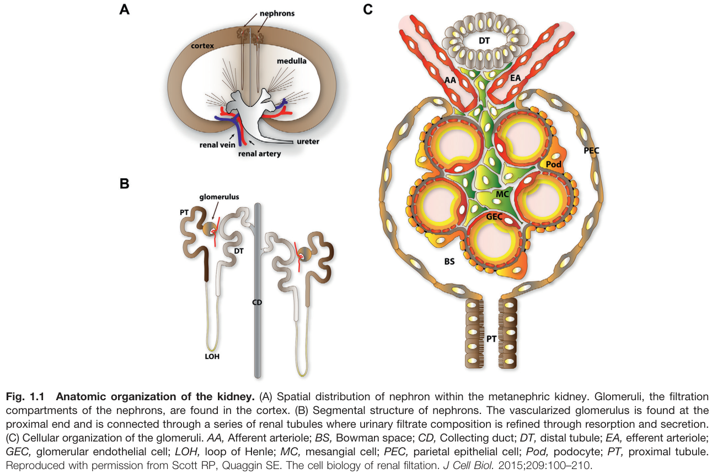

Fig. 1.1 Anatomic organization of the kidney. (A) Spatial distribution of nephron within the metanephric kidney. Glomeruli, the filtration compartments of the nephrons, are found in the cortex. (B) Segmental structure of nephrons. The vascularized glomerulus is found at the proximal end and is connected through a series of renal tubules where urinary filtrate composition is refined through resorption and secretion. (C) Cellular organization of the glomeruli. AA, Afferent arteriole; BS, Bowman space; CD, Collecting duct; DT, distal tubule; EA, efferent arteriole; GEC, glomerular endothelial cell; LOH, loop of Henle; MC, mesangial cell; PEC, parietal epithelial cell; Pod, podocyte; PT, proximal tubule. Reproduced with permission from Scott RP, Quaggin SE. The cell biology of renal filtation. J Cell Biol. 2015;209:100-210.

---

### Fig_1_2

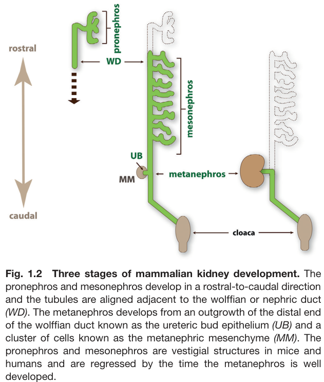

Fig. 1.2 Three stages of mammalian kidney development. The pronephros and mesonephros develop in a rostral-to-caudal direction and the tubules are aligned adjacent to the wolffian or nephric duct (WD). The metanephros develops from an outgrowth of the distal end of the wolffian duct known as the ureteric bud epithelium (UB) and a cluster of cells known as the metanephric mesenchyme (MM). The pronephros and mesonephros are vestigial structures in mice and humans and are regressed by the time the metanephros is well developed.

---

### Fig_1_3

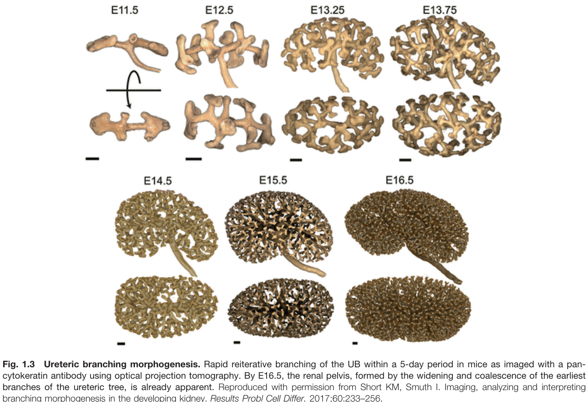

Fig. 1.3 Ureteric branching morphogenesis. Rapid reiterative branching of the UB within a 5-day period in mice as imaged with a pan-cytokeratin antibody using optical projection tomography. By E16.5, the renal pelvis, formed by the widening and coalescence of the earliest branches of the ureteric tree, is already apparent. Reproduced with permission from Short KM, Smuth I. Imaging, analyzing and interpreting branching morphogenesis in the developing kidney. Results Probl Cell Differ. 2017;60:233-256.

---

### Fig_1_4

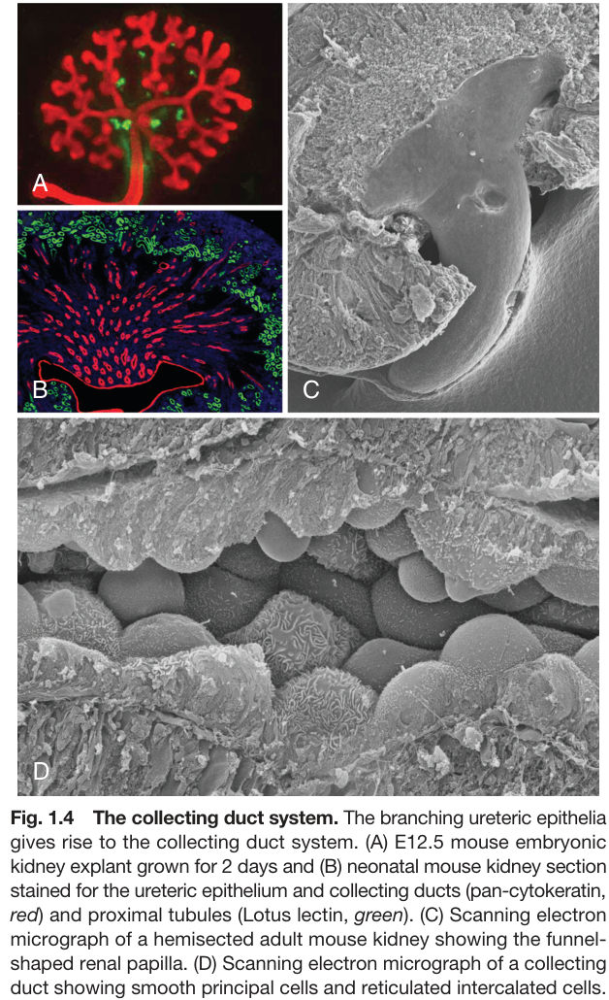

Fig. 1.4 The collecting duct system. The branching ureteric epithelia gives rise to the collecting duct system. (A) E12.5 mouse embryonic kidney explant grown for 2 days and (B) neonatal mouse kidney section stained for the ureteric epithelium and collecting ducts (pan-cytokeratin, red) and proximal tubules (Lotus lectin, green). (C) Scanning electron micrograph of a hemisected adult mouse kidney showing the funnel-shaped renal papilla. (D) Scanning electron micrograph of a collecting duct showing smooth principal cells and reticulated intercalated cells.

---

### Fig_1_5

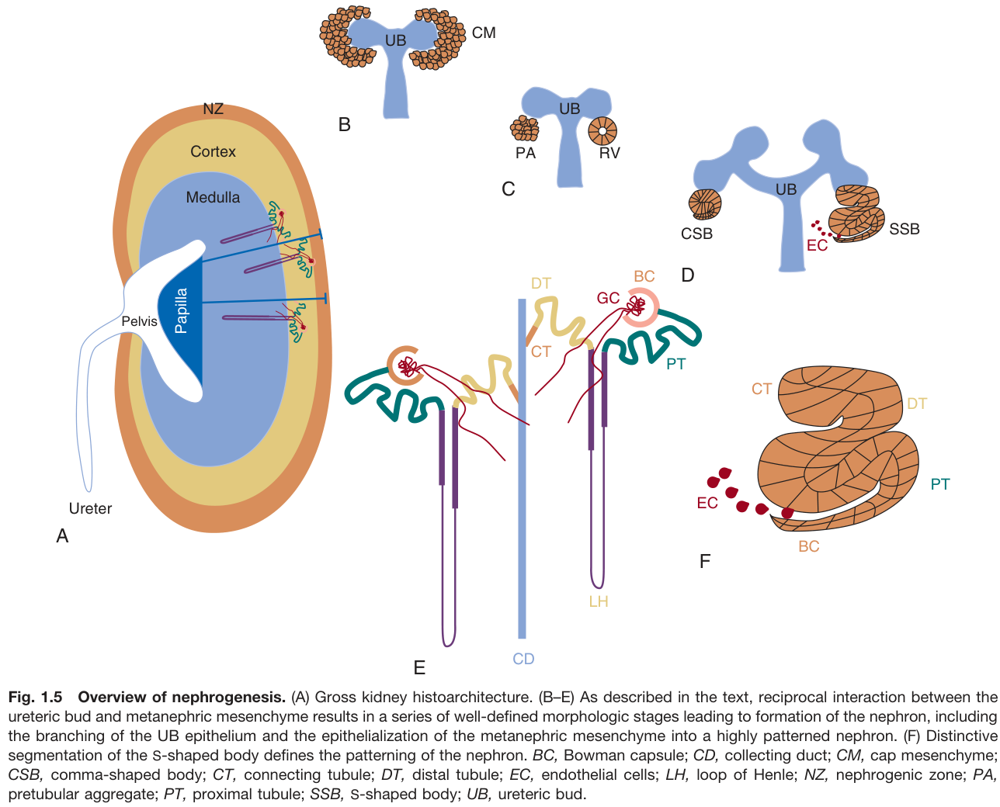

Fig. 1.5 Overview of nephrogenesis. (A) Gross kidney histoarchitecture. (B-E) As described in the text, reciprocal interaction between the ureteric bud and metanephric mesenchyme results in a series of well-defined morphologic stages leading to formation of the nephron, including the branching of the UB epithelium and the epithelialization of the metanephric mesenchyme into a highly patterned nephron. (F) Distinctive segmentation of the S-shaped body defines the patterning of the nephron. BC, Bowman capsule; CD, collecting duct; CM, cap mesenchyme; CSB, comma-shaped body; CT, connecting tubule; DT, distal tubule; EC, endothelial cells; LH, loop of Henle; NZ, nephrogenic zone; PA, pretubular aggregate; PT, proximal tubule; SSB, S-shaped body; UB, ureteric bud.

---

### Fig_1_6

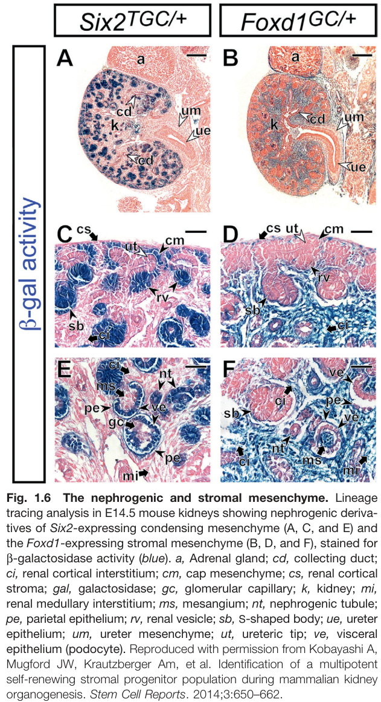

Fig. 1.6 The nephrogenic and stromal mesenchyme. Lineage tracing analysis in E14.5 mouse kidneys showing nephrogenic deriva-tives of Six2-expressing condensing mesenchyme (A, C, and E) and the Foxd1-expressing stromal mesenchyme (B, D, and F), stained for ẞ-galactosidase activity (blue). a, Adrenal gland; cd, collecting duct; ci, renal cortical interstitium; cm, cap mesenchyme; cs, renal cortical stroma; gal, galactosidase; gc, glomerular capillary; k, kidney; mi, renal medullary interstitium; ms, mesangium; nt, nephrogenic tubule; pe, parietal epithelium; rv, renal vesicle; sb, S-shaped body; ue, ureter epithelium; um, ureter mesenchyme; ut, ureteric tip; ve, visceral epithelium (podocyte). Reproduced with permission from Kobayashi A, Mugford JW, Krautzberger Am, et al. Identification of a multipotent self-renewing stromal progenitor population during mammalian kidney organogenesis. Stem Cell Reports. 2014;3:650-662.

---

### Fig_1_7

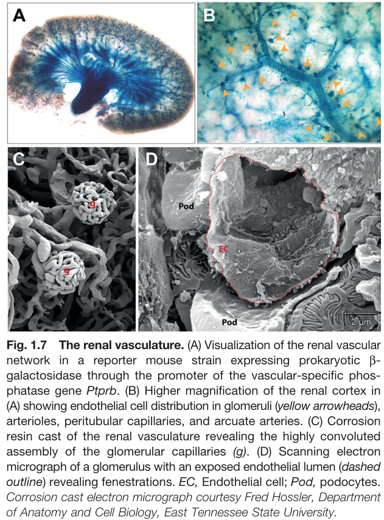

Fig. 1.7 The renal vasculature. (A) Visualization of the renal vascular network in a reporter mouse strain expressing prokaryotic ẞ-galactosidase through the promoter of the vascular-specific phos-phatase gene Ptprb. (B) Higher magnification of the renal cortex in (A) showing endothelial cell distribution in glomeruli (yellow arrowheads), arterioles, peritubular capillaries, and arcuate arteries. (C) Corrosion resin cast of the renal vasculature revealing the highly convoluted assembly of the glomerular capillaries (g). (D) Scanning electron micrograph of a glomerulus with an exposed endothelial lumen (dashed outline) revealing fenestrations. EC, Endothelial cell; Pod, podocytes. Corrosion cast electron micrograph courtesy Fred Hossler, Department of Anatomy and Cell Biology, East Tennessee State University.

---

### Fig_1_8

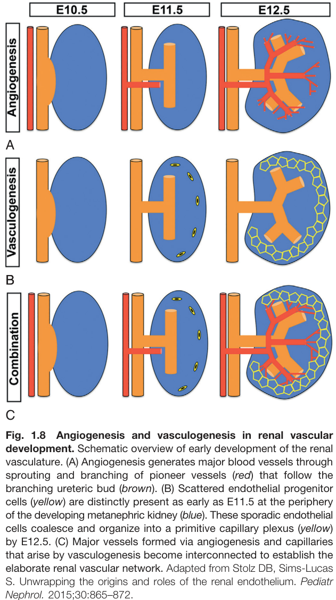

Fig. 1.8 Angiogenesis and vasculogenesis in renal vascular development. Schematic overview of early development of the renal vasculature. (A) Angiogenesis generates major blood vessels through sprouting and branching of pioneer vessels (red) that follow the branching ureteric bud (brown). (B) Scattered endothelial progenitor cells (yellow) are distinctly present as early as E11.5 at the periphery of the developing metanephric kidney (blue). These sporadic endothelial cells coalesce and organize into a primitive capillary plexus (yellow) by E12.5. (C) Major vessels formed via angiogenesis and capillaries that arise by vasculogenesis become interconnected to establish the elaborate renal vascular network. Adapted from Stolz DB, Sims-Lucas S. Unwrapping the origins and roles of the renal endothelium. Pediatr Nephrol. 2015;30:865-872.

---

### Fig_1_9

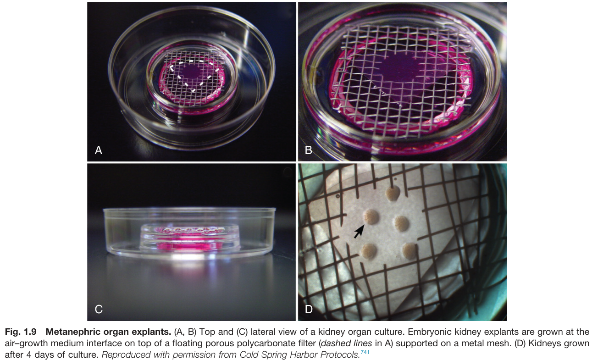

Fig. 1.9 Metanephric organ explants. (A, B) Top and (C) lateral view of a kidney organ culture. Embryonic kidney explants are grown at the air-growth medium interface on top of a floating porous polycarbonate filter (dashed lines in A) supported on a metal mesh. (D) Kidneys grown after 4 days of culture. Reproduced with permission from Cold Spring Harbor Protocols.

---

### Fig_1_10

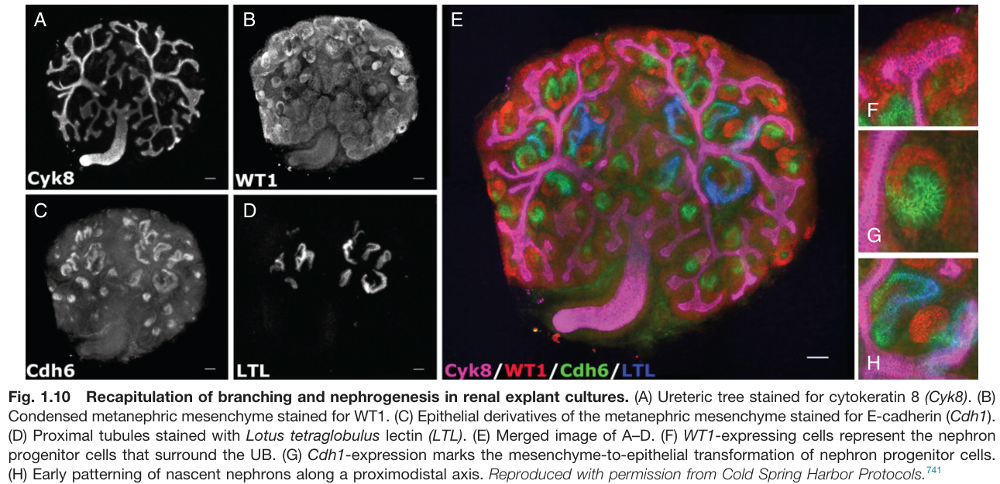

Fig. 1.10 Recapitulation of branching and nephrogenesis in renal explant cultures. (A) Ureteric tree stained for cytokeratin 8 (Cyk8). (B) Condensed metanephric mesenchyme stained for WT1. (C) Epithelial derivatives of the metanephric mesenchyme stained for E-cadherin (Cdh1). (D) Proximal tubules stained with Lotus tetraglobulus lectin (LTL). (E) Merged image of A-D. (F) WT1-expressing cells represent the nephron progenitor cells that surround the UB. (G) Cdh1-expression marks the mesenchyme-to-epithelial transformation of nephron progenitor cells. (H) Early patterning of nascent nephrons along a proximodistal axis. Reproduced with permission from Cold Spring Harbor Protocols.

---

### Fig_1_11

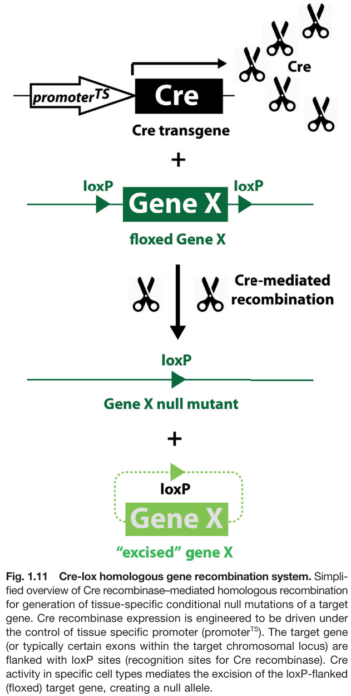

Fig. 1.11 Cre-lox homologous gene recombination system. Simpli-fied overview of Cre recombinase-mediated homologous recombination for generation of tissue-specific conditional null mutations of a target gene. Cre recombinase expression is engineered to be driven under the control of tissue specific promoter (promoters). The target gene (or typically certain exons within the target chromosomal locus) are flanked with loxP sites (recognition sites for Cre recombinase). Cre activity in specific cell types mediates the excision of the loxP-flanked (floxed) target gene, creating a null allele.

---

### Fig_1_12

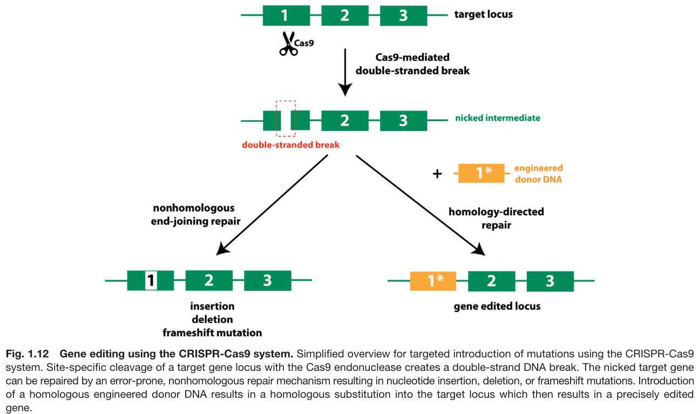

Fig. 1.12 Gene editing using the CRISPR-Cas9 system. Simplified overview for targeted introduction of mutations using the CRISPR-Cas9 system. Site-specific cleavage of a target gene locus with the Cas9 endonuclease creates a double-strand DNA break. The nicked target gene can be repaired by an error-prone, nonhomologous repair mechanism resulting in nucleotide insertion, deletion, or frameshift mutations. Introduction of a homologous engineered donor DNA results in a homologous substitution into the target locus which then results in a precisely edited gene.

---

### Fig_1_13

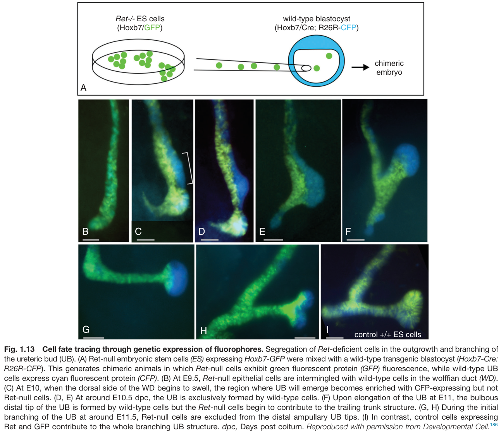

Fig. 1.13 Cell fate tracing through genetic expression of fluorophores. Segregation of Ret-deficient cells in the outgrowth and branching of the ureteric bud (UB). (A) Ret-null embryonic stem cells (ES) expressing Hoxb7-GFP were mixed with a wild-type transgenic blastocyst (Hoxb7-Cre: R26R-CFP). This generates chimeric animals in which Ret-null cells exhibit green fluorescent protein (GFP) fluorescence, while wild-type UB cells express cyan fluorescent protein (CFP). (B) At E9.5, Ret-null epithelial cells are intermingled with wild-type cells in the wolffian duct (WD). (C) At E10, when the dorsal side of the WD begins to swell, the region where UB will emerge becomes enriched with CFP-expressing but not Ret-null cells. (D, E) At around E10.5 dpc, the UB is exclusively formed by wild-type cells. (F) Upon elongation of the UB at E11, the bulbous distal tip of the UB is formed by wild-type cells but the Ret-null cells begin to contribute to the trailing trunk structure. (G, H) During the initial branching of the UB at around E11.5, Ret-null cells are excluded from the distal ampullary UB tips. (I) In contrast, control cells expressing Ret and GFP contribute to the whole branching UB structure. dpc, Days post coitum. Reproduced with permission from Developmental Cell.

---

### Fig_1_14

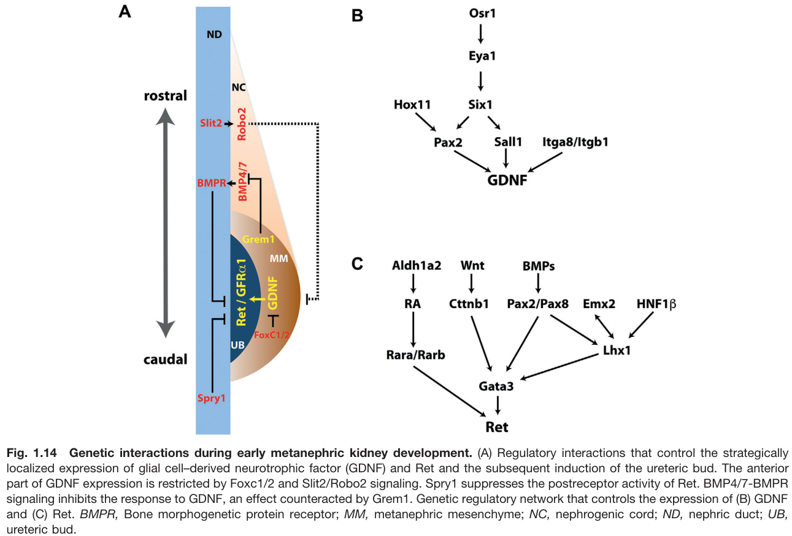

Fig. 1.14 Genetic interactions during early metanephric kidney development. (A) Regulatory interactions that control the strategically localized expression of glial cell-derived neurotrophic factor (GDNF) and Ret and the subsequent induction of the ureteric bud. The anterior part of GDNF expression is restricted by Foxc1/2 and Slit2/Robo2 signaling. Spry1 suppresses the postreceptor activity of Ret. BMP4/7-BMPR signaling inhibits the response to GDNF, an effect counteracted by Grem1. Genetic regulatory network that controls the expression of (B) GDNF and (C) Ret. BMPR, Bone morphogenetic protein receptor; MM, metanephric mesenchyme; NC, nephrogenic cord; ND, nephric duct; UB, ureteric bud.

---

### Fig_1_15

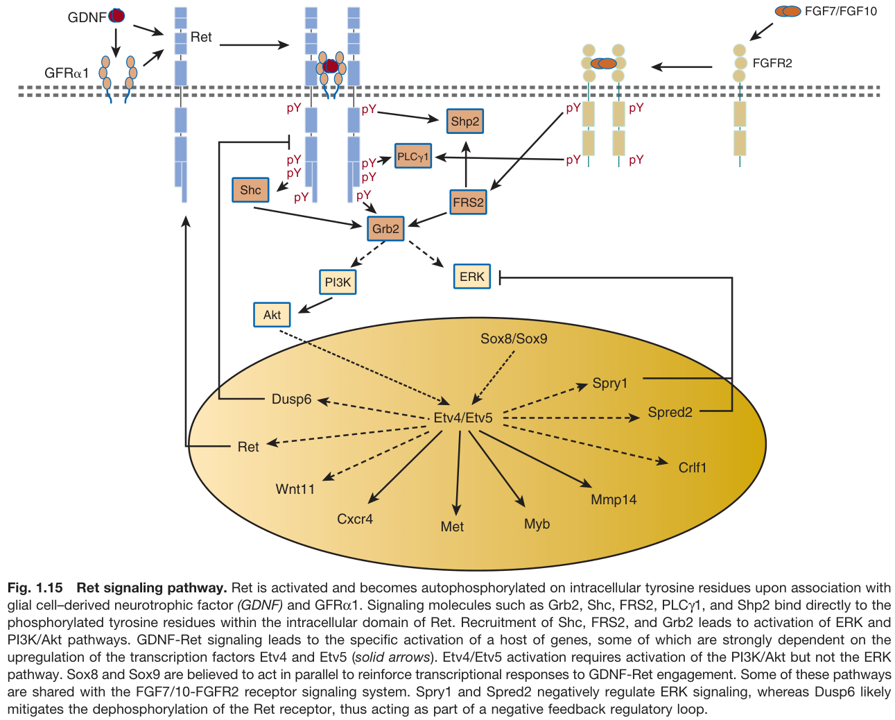

Fig. 1.15 Ret signaling pathway. Ret is activated and becomes autophosphorylated on intracellular tyrosine residues upon association with glial cell-derived neurotrophic factor (GDNF) and GFR 1. Signaling molecules such as Grb2, Shc, FRS2, PLCy1, and Shp2 bind directly to the phosphorylated tyrosine residues within the intracellular domain of Ret. Recruitment of Shc, FRS2, and Grb2 leads to activation of ERK and PI3K/Akt pathways. GDNF-Ret signaling leads to the specific activation of a host of genes, some of which are strongly dependent on the upregulation of the transcription factors Etv4 and Etv5 (solid arrows). Etv4/Etv5 activation requires activation of the PI3K/Akt but not the ERK pathway. Sox8 and Sox9 are believed to act in parallel to reinforce transcriptional responses to GDNF-Ret engagement. Some of these pathways are shared with the FGF7/10-FGFR2 receptor signaling system. Spry1 and Spred2 negatively regulate ERK signaling, whereas Dusp6 likely mitigates the dephosphorylation of the Ret receptor, thus acting as part of a negative feedback regulatory loop.

---

### Fig_1_16

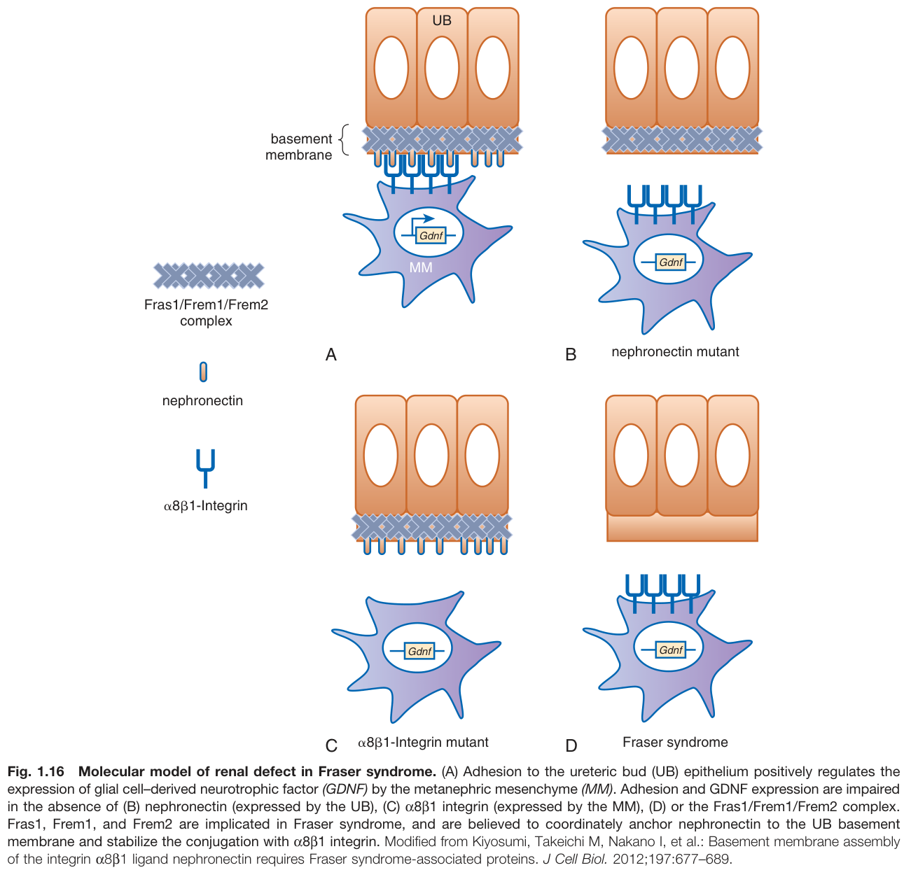

Fig. 1.16 Molecular model of renal defect in Fraser syndrome. (A) Adhesion to the ureteric bud (UB) epithelium positively regulates the expression of glial cell-derived neurotrophic factor (GDNF) by the metanephric mesenchyme (MM). Adhesion and GDNF expression are impaired in the absence of (B) nephronectin (expressed by the UB), (C) α8β1 integrin (expressed by the MM), (D) or the Fras1/Frem1/Frem2 complex. Fras1, Frem1, and Frem2 are implicated in Fraser syndrome, and are believed to coordinately anchor nephronectin to the UB basement membrane and stabilize the conjugation with a8β1 integrin. Modified from Kiyosumi, Takeichi M, Nakano I, et al.: Basement membrane assembly of the integrin a8ẞ1 ligand nephronectin requires Fraser syndrome-associated proteins. J Cell Biol. 2012;197:677-689.

---

### Fig_1_17

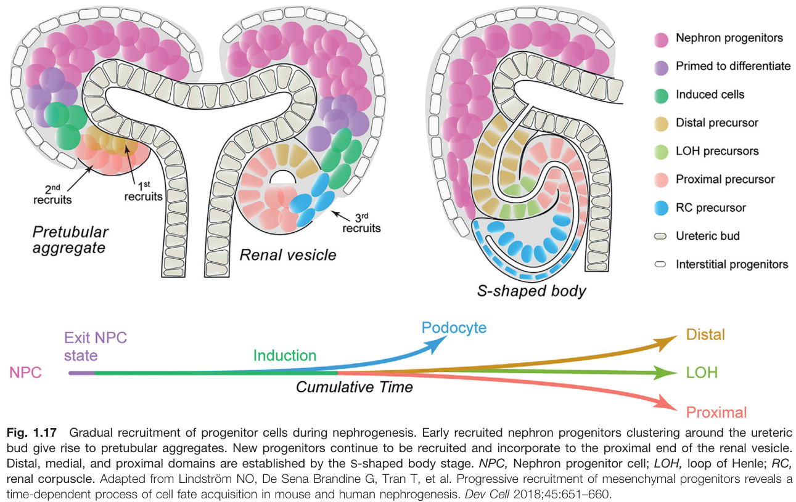

Fig. 1.17 Gradual recruitment of progenitor cells during nephrogenesis. Early recruited nephron progenitors clustering around the ureteric bud give rise to pretubular aggregates. New progenitors continue to be recruited and incorporate to the proximal end of the renal vesicle. Distal, medial, and proximal domains are established by the S-shaped body stage. NPC, Nephron progenitor cell; LOH, loop of Henle; RC, renal corpuscle. Adapted from Lindström NO, De Sena Brandine G, Tran T, et al. Progressive recruitment of mesenchymal progenitors reveals a time-dependent process of cell fate acquisition in mouse and human nephrogenesis. Dev Cell 2018;45:651-660.

---

### Fig_1_18

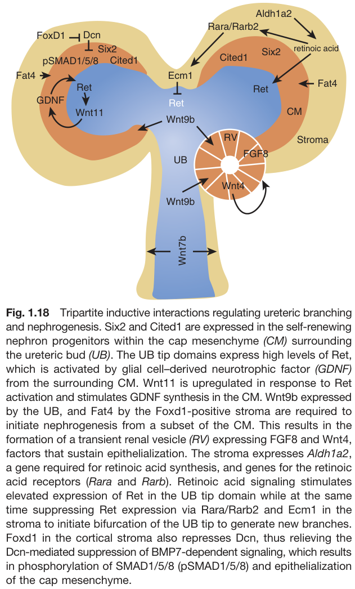

Fig. 1.18 Tripartite inductive interactions regulating ureteric branching and nephrogenesis. Six2 and Cited1 are expressed in the self-renewing nephron progenitors within the cap mesenchyme (CM) surrounding the ureteric bud (UB). The UB tip domains express high levels of Ret, which is activated by glial cell-derived neurotrophic factor (GDNF) from the surrounding CM. Wnt11 is upregulated in response to Ret activation and stimulates GDNF synthesis in the CM. Wnt9b expressed by the UB, and Fat4 by the Foxd1-positive stroma are required to initiate nephrogenesis from a subset of the CM. This results in the formation of a transient renal vesicle (RV) expressing FGF8 and Wnt4, factors that sustain epithelialization. The stroma expresses Aldh1a2, a gene required for retinoic acid synthesis, and genes for the retinoic acid receptors (Rara and Rarb). Retinoic acid signaling stimulates elevated expression of Ret in the UB tip domain while at the same time suppressing Ret expression via Rara/Rarb2 and Ecm1 in the stroma to initiate bifurcation of the UB tip to generate new branches. Foxd1 in the cortical stroma also represses Dcn, thus relieving the Dcn-mediated suppression of BMP7-dependent signaling, which results in phosphorylation of SMAD1/5/8 (pSMAD1/5/8) and epithelialization of the cap mesenchyme.

---

### Fig_1_19

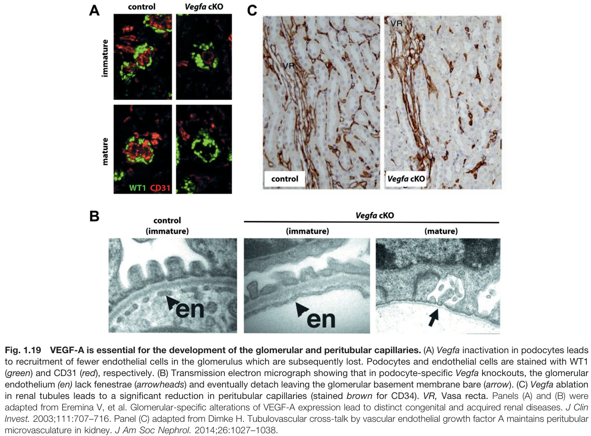

Fig. 1.19 VEGF-A is essential for the development of the glomerular and peritubular capillaries. (A) Vegfa inactivation in podocytes leads to recruitment of fewer endothelial cells in the glomerulus which are subsequently lost. Podocytes and endothelial cells are stained with WT1 (green) and CD31 (red), respectively. (B) Transmission electron micrograph showing that in podocyte-specific Vegfa knockouts, the glomerular endothelium (en) lack fenestrae (arrowheads) and eventually detach leaving the glomerular basement membrane bare (arrow). (C) Vegfa ablation in renal tubules leads to a significant reduction in peritubular capillaries (stained brown for CD34). VR, Vasa recta. Panels (A) and (B) were adapted from Eremina V, et al. Glomerular-specific alterations of VEGF-A expression lead to distinct congenital and acquired renal diseases. J Clin Invest. 2003;111:707-716. Panel (C) adapted from Dimke H. Tubulovascular cross-talk by vascular endothelial growth factor A maintains peritubular microvasculature in kidney. J Am Soc Nephrol. 2014;26:1027-1038.

---

### Fig_1_20

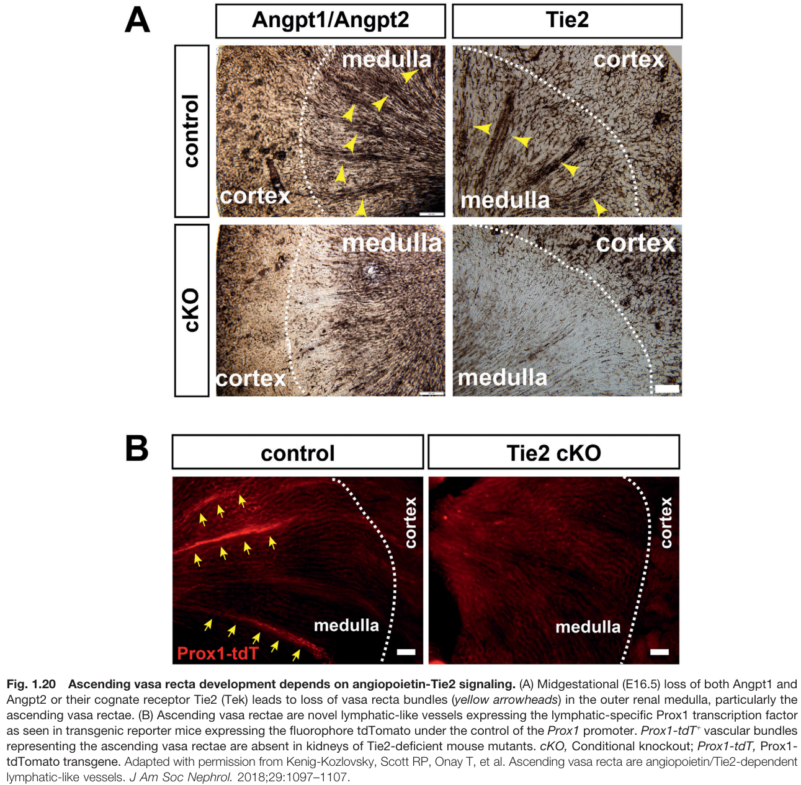

Fig. 1.20 Ascending vasa recta development depends on angiopoietin-Tie2 signaling. (A) Midgestational (E16.5) loss of both Angpt1 and Angpt2 or their cognate receptor Tie2 (Tek) leads to loss of vasa recta bundles (yellow arrowheads) in the outer renal medulla, particularly the ascending vasa rectae. (B) Ascending vasa rectae are novel lymphatic-like vessels expressing the lymphatic-specific Prox1 transcription factor as seen in transgenic reporter mice expressing the fluorophore tdTomato under the control of the Prox1 promoter. Prox1-tdT+ vascular bundles representing the ascending vasa rectae are absent in kidneys of Tie2-deficient mouse mutants. CKO, Conditional knockout; Prox1-tdT, Prox1-tdTomato transgene. Adapted with permission from Kenig-Kozlovsky, Scott RP, Onay T, et al. Ascending vasa recta are angiopoietin/Tie2-dependent lymphatic-like vessels. J Am Soc Nephrol. 2018;29:1097-1107.

---

### Fig_1_21

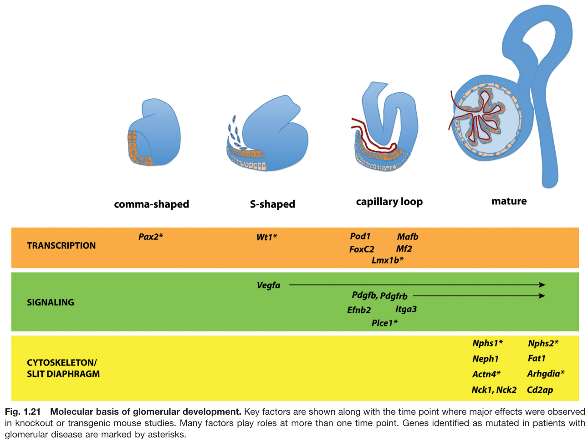

Fig. 1.21 Molecular basis of glomerular development. Key factors are shown along with the time point where major effects were observed in knockout or transgenic mouse studies. Many factors play roles at more than one time point. Genes identified as mutated in patients with glomerular disease are marked by asterisks.

---

### Fig_1_22

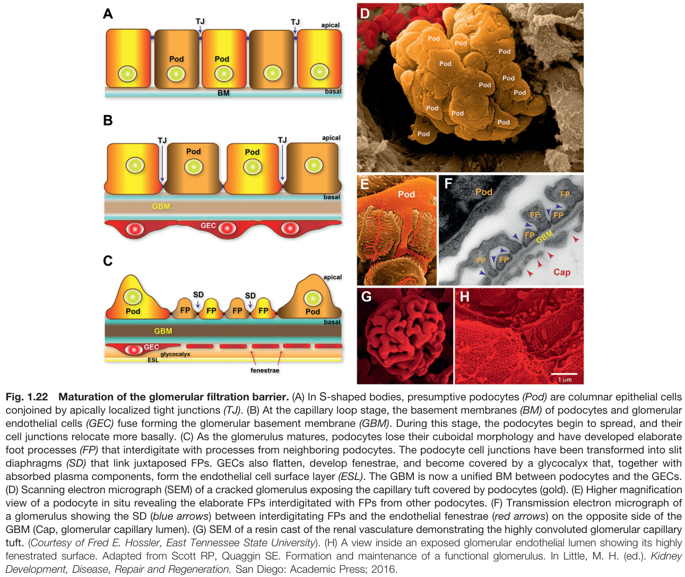

Fig. 1.22 Maturation of the glomerular filtration barrier. (A) In S-shaped bodies, presumptive podocytes (Pod) are columnar epithelial cells conjoined by apically localized tight junctions (TJ). (B) At the capillary loop stage, the basement membranes (BM) of podocytes and glomerular endothelial cells (GEC) fuse forming the glomerular basement membrane (GBM). During this stage, the podocytes begin to spread, and their cell junctions relocate more basally. (C) As the glomerulus matures, podocytes lose their cuboidal morphology and have developed elaborate foot processes (FP) that interdigitate with processes from neighboring podocytes. The podocyte cell junctions have been transformed into slit diaphragms (SD) that link juxtaposed FPs. GECs also flatten, develop fenestrae, and become covered by a glycocalyx that, together with absorbed plasma components, form the endothelial cell surface layer (ESL). The GBM is now a unified BM between podocytes and the GECS. (D) Scanning electron micrograph (SEM) of a cracked glomerulus exposing the capillary tuft covered by podocytes (gold). (E) Higher magnification view of a podocyte in situ revealing the elaborate FPs interdigitated with FPs from other podocytes. (F) Transmission electron micrograph of a glomerulus showing the SD (blue arrows) between interdigitating FPs and the endothelial fenestrae (red arrows) on the opposite side of the GBM (Cap, glomerular capillary lumen). (G) SEM of a resin cast of the renal vasculature demonstrating the highly convoluted glomerular capillary tuft. (Courtesy of Fred E. Hossler, East Tennessee State University). (H) A view inside an exposed glomerular endothelial lumen showing its highly fenestrated surface. Adapted from Scott RP, Quaggin SE. Formation and maintenance of a functional glomerulus. In Little, M. H. (ed.). Kidney Development, Disease, Repair and Regeneration. San Diego: Academic Press; 2016.

---

### Fig_1_23

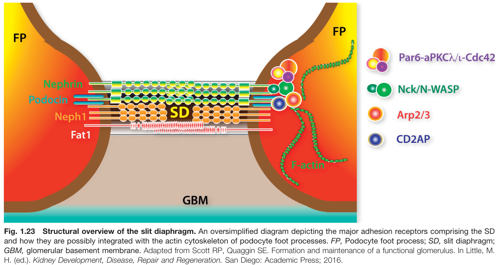

Fig. 1.23 Structural overview of the slit diaphragm. An oversimplified diagram depicting the major adhesion receptors comprising the SD and how they are possibly integrated with the actin cytoskeleton of podocyte foot processes. FP, Podocyte foot process; SD, slit diaphragm; GBM, glomerular basement membrane. Adapted from Scott RP, Quaggin SE. Formation and maintenance of a functional glomerulus. In Little, M. H. (ed.). Kidney Development, Disease, Repair and Regeneration. San Diego: Academic Press; 2016.

---

### Fig_1_24

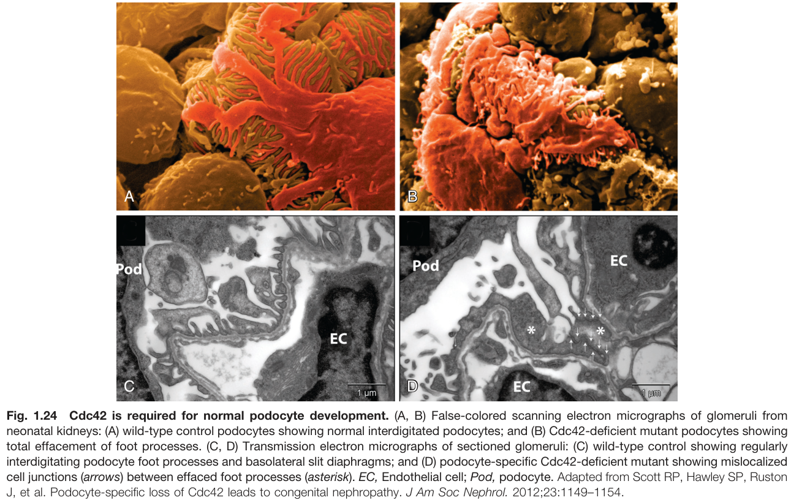

Fig. 1.24 Cdc42 is required for normal podocyte development. (A, B) False-colored scanning electron micrographs of glomeruli from neonatal kidneys: (A) wild-type control podocytes showing normal interdigitated podocytes; and (B) Cdc42-deficient mutant podocytes showing total effacement of foot processes. (C, D) Transmission electron micrographs of sectioned glomeruli: (C) wild-type control showing regularly interdigitating podocyte foot processes and basolateral slit diaphragms; and (D) podocyte-specific Cdc42-deficient mutant showing mislocalized cell junctions (arrows) between effaced foot processes (asterisk). EC, Endothelial cell; Pod, podocyte. Adapted from Scott RP, Hawley SP, Ruston J, et al. Podocyte-specific loss of Cdc42 leads to congenital nephropathy. J Am Soc Nephrol. 2012;23:1149-1154.

---

### Fig_1_25

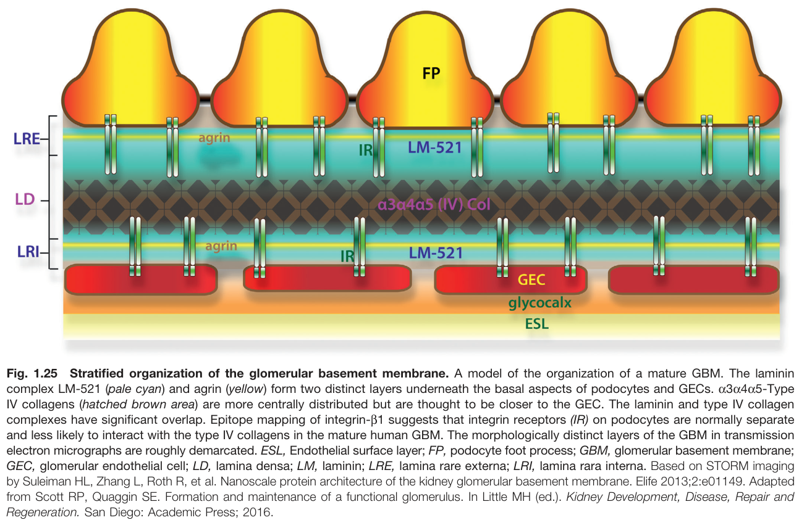

Fig. 1.25 Stratified organization of the glomerular basement membrane. A model of the organization of a mature GBM. The laminin complex LM-521 (pale cyan) and agrin (yellow) form two distinct layers underneath the basal aspects of podocytes and GECs. α3a4a5-Type IV collagens (hatched brown area) are more centrally distributed but are thought to be closer to the GEC. The laminin and type IV collagen complexes have significant overlap. Epitope mapping of integrin-ẞ1 suggests that integrin receptors (IR) on podocytes are normally separate and less likely to interact with the type IV collagens in the mature human GBM. The morphologically distinct layers of the GBM in transmission electron micrographs are roughly demarcated. ESL, Endothelial surface layer; FP, podocyte foot process; GBM, glomerular basement membrane; GEC, glomerular endothelial cell; LD, lamina densa; LM, laminin; LRE, lamina rare externa; LRI, lamina rara interna. Based on STORM imaging by Suleiman HL, Zhang L, Roth R, et al. Nanoscale protein architecture of the kidney glomerular basement membrane. Elife 2013;2:e01149. Adapted from Scott RP, Quaggin SE. Formation and maintenance of a functional glomerulus. In Little MH (ed.). Kidney Development, Disease, Repair and Regeneration. San Diego: Academic Press; 2016.

---

### Fig_1_26

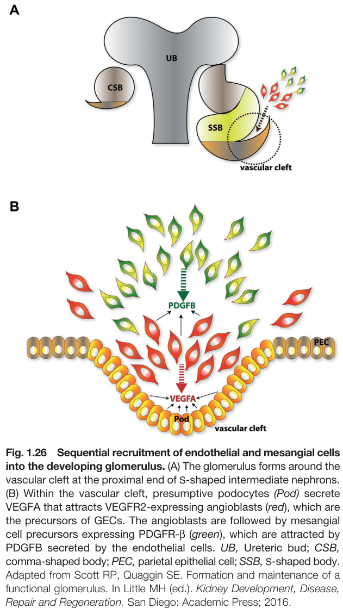

Fig. 1.26 Sequential recruitment of endothelial and mesangial cells into the developing glomerulus. (A) The glomerulus forms around the vascular cleft at the proximal end of S-shaped intermediate nephrons. (B) Within the vascular cleft, presumptive podocytes (Pod) secrete VEGFA that attracts VEGFR2-expressing angioblasts (red), which are the precursors of GECs. The angioblasts are followed by mesangial cell precursors expressing PDGFR-ẞ (green), which are attracted by PDGFB secreted by the endothelial cells. UB, Ureteric bud; CSB, comma-shaped body; PEC, parietal epithelial cell; SSB, S-shaped body. Adapted from Scott RP, Quaggin SE. Formation and maintenance of a functional glomerulus. In Little MH (ed.). Kidney Development, Disease, Repair and Regeneration. San Diego: Academic Press; 2016.

---

### Fig_1_27

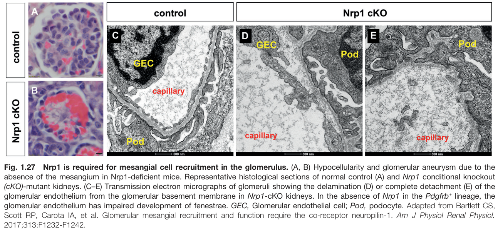

Fig. 1.27 Nrp1 is required for mesangial cell recruitment in the glomerulus. (A, B) Hypocellularity and glomerular aneurysm due to the absence of the mesangium in Nrp1-deficient mice. Representative histological sections of normal control (A) and Nrp1 conditional knockout (cKO)-mutant kidneys. (C-E) Transmission electron micrographs of glomeruli showing the delamination (D) or complete detachment (E) of the glomerular endothelium from the glomerular basement membrane in Nrp1-cKO kidneys. In the absence of Nrp1 in the Pdgfrb+ lineage, the glomerular endothelium has impaired development of fenestrae. GEC, Glomerular endothelial cell; Pod, podocyte. Adapted from Bartlett CS, Scott RP, Carota IA, et al. Glomerular mesangial recruitment and function require the co-receptor neuropilin-1. Am J Physiol Renal Physiol. 2017;313:F1232-F1242.

---

## Tables

### Table_1_1

#### Table Image

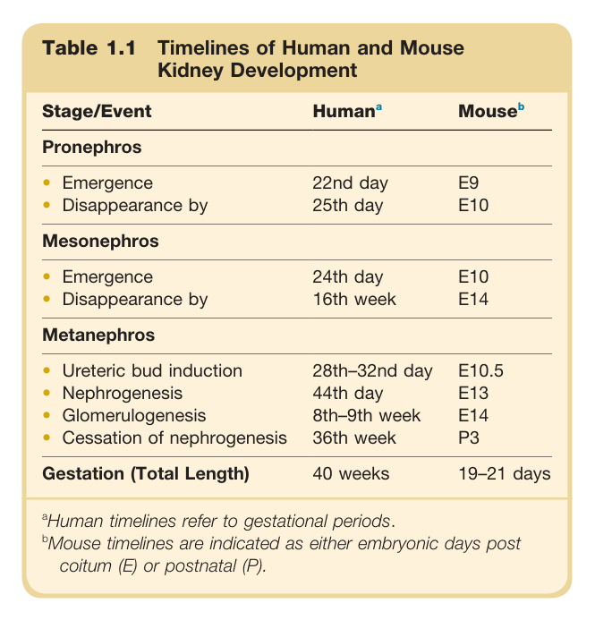

#### Table Data (CSV: [Table_1_1.csv](Table_1_1.csv))

```markdown
| Table Text (OCR) |
| :--- |
| Table 1.1 Timelines of Human and Mouse Kidney Development  <sup>a</sup>Human timelines refer to gestational periods. <sup>b</sup>Mouse timelines are indicated as either embryonic days post coitum (E) or postnatal (P). |
```

Table 1.1 Timelines of Human and Mouse Kidney Development | Stage/Event | Human<sup>a</sup> | Mouse<sup>b</sup> | | :----------------------------------------------------------- | :---------------- | :---------------- | | **Pronephros** | | | | • Emergence | 22nd day | E9 | | • Disappearance by | 25th day | E10 | | **Mesonephros** | | | | • Emergence | 24th day | E10 | | • Disappearance by | 16th week | E14 | | **Metanephros** | | | | • Ureteric bud induction | 28th-32nd day | E10.5 | | • Nephrogenesis | 44th day | E13 | | • Glomerulogenesis | 8th-9th week | E14 | | • Cessation of nephrogenesis | 36th week | P3 | | **Gestation (Total Length)** | 40 weeks | 19-21 days | | <sup>a</sup>Human timelines refer to gestational periods. | | | | <sup>b</sup>Mouse timelines are indicated as either embryonic days post coitum (E) or postnatal (P). | | | | <!-- audiobook-skip-end --> | | |

---

### Table_1_2

#### Table Images (11 Parts)

- **Part 1 (Page 10)**:
  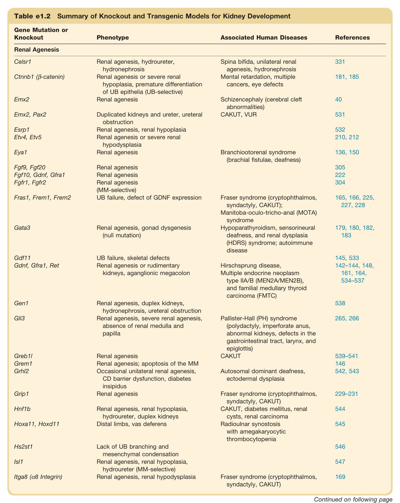

- **Part 2 (Page 11)**:
  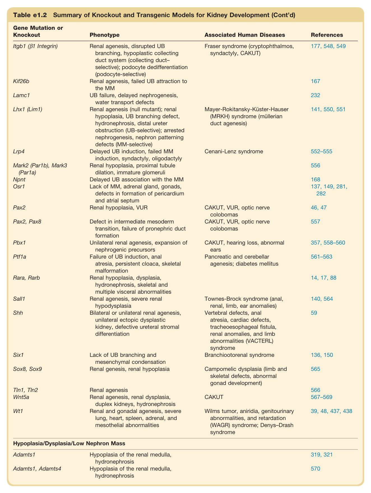

- **Part 3 (Page 12)**:
  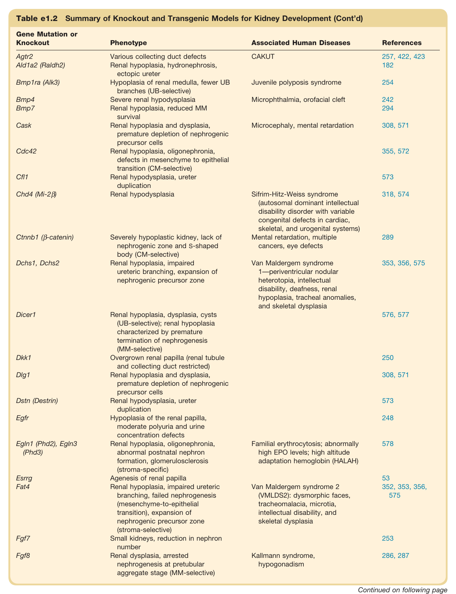

- **Part 4 (Page 13)**:
  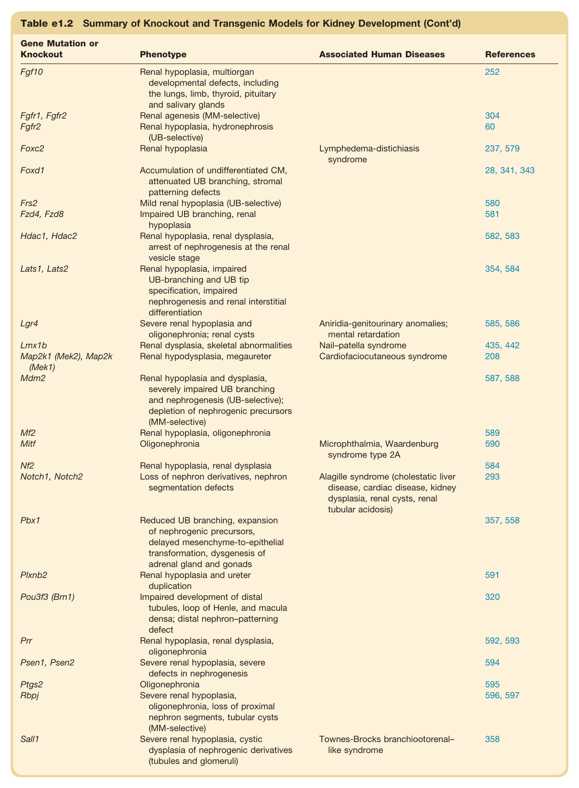

- **Part 5 (Page 14)**:
  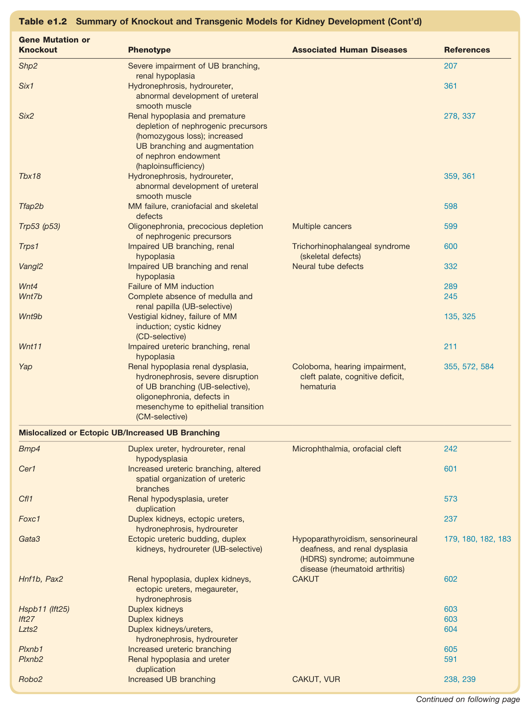

- **Part 6 (Page 15)**:
  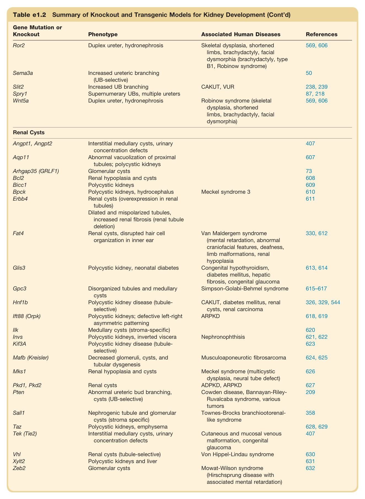

- **Part 7 (Page 16)**:
  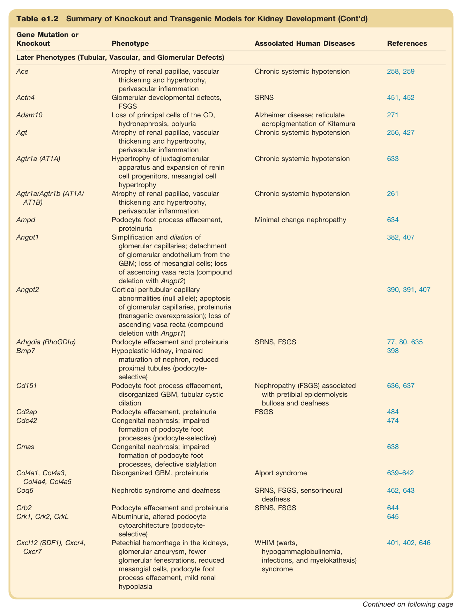

- **Part 8 (Page 17)**:
  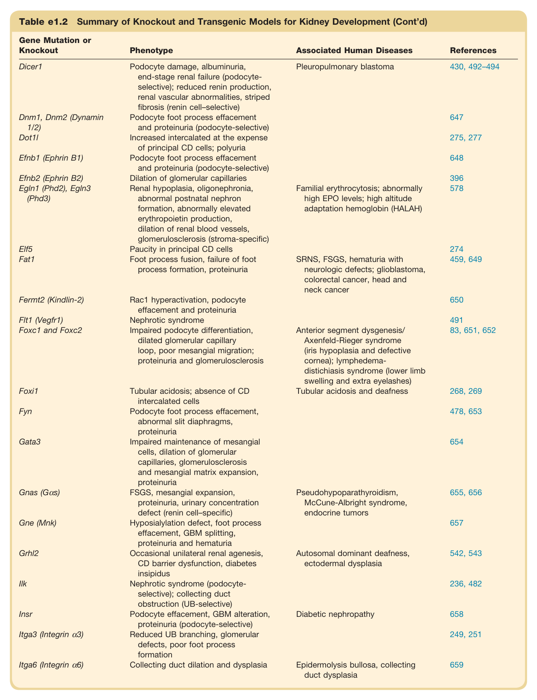

- **Part 9 (Page 18)**:
  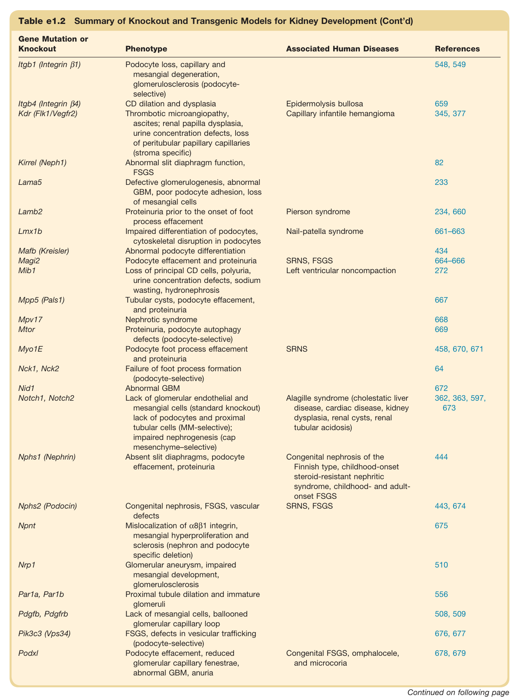

- **Part 10 (Page 19)**:
  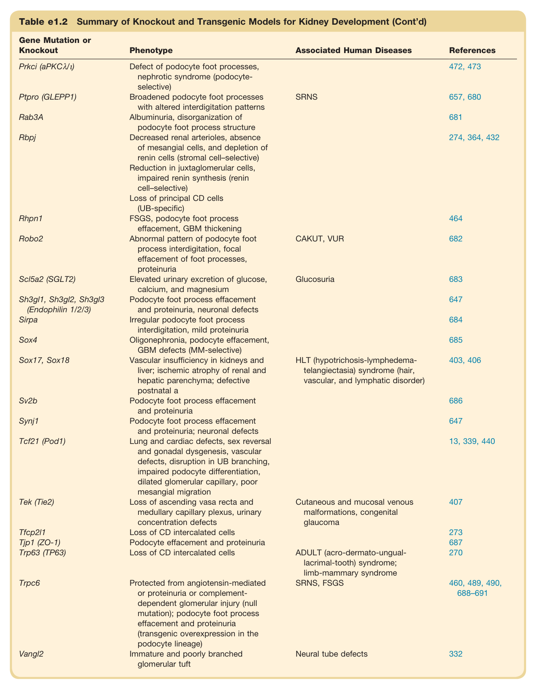

- **Part 11 (Page 20)**:
  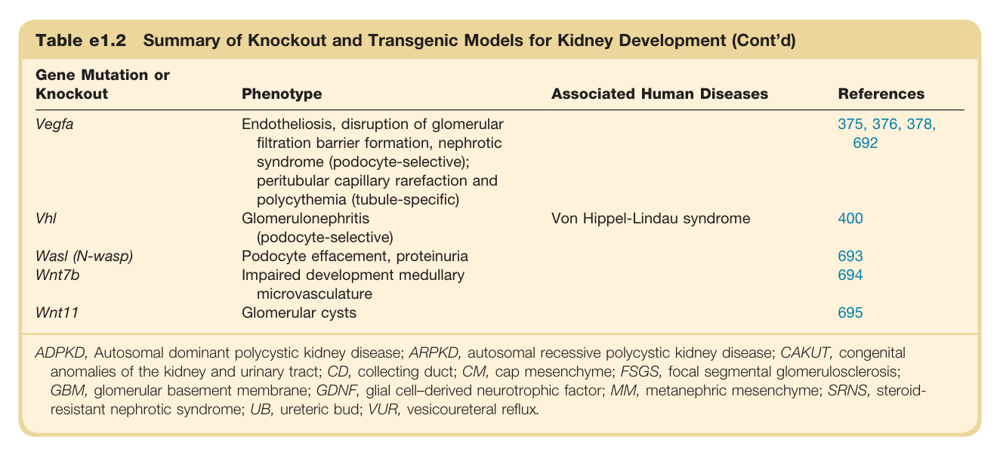

#### Table Data (CSV: [Table_1_2.csv](Table_1_2.csv))

```markdown
| Table Text (OCR) |
| :--- |
| Table e1.2 Summary of Knockout and Transgenic Models for Kidney Development |
```

Table e1.2 Summary of Knockout and Transgenic Models for Kidney Development *ADPKD, Autosomal dominant polycystic kidney disease; ARPKD, autosomal recessive polycystic kidney disease; CAKUT, congenital anomalies of the kidney and urinary tract; CD, collecting duct; CM, cap mesenchyme; FSGS, focal segmental glomerulosclerosis; GBM, glomerular basement membrane; GDNF, glial cell-derived neurotrophic factor; MM, metanephric mesenchyme; SRNS, steroid-resistant nephrotic syndrome; UB, ureteric bud; VUR, vesicoureteral reflux.* *This table continues for multiple pages in the original document, detailing gene mutations, phenotypes, associated human diseases, and references.*

---

### Table_1_3

#### Table Images (2 Parts)

- **Part 1 (Page 23)**:
  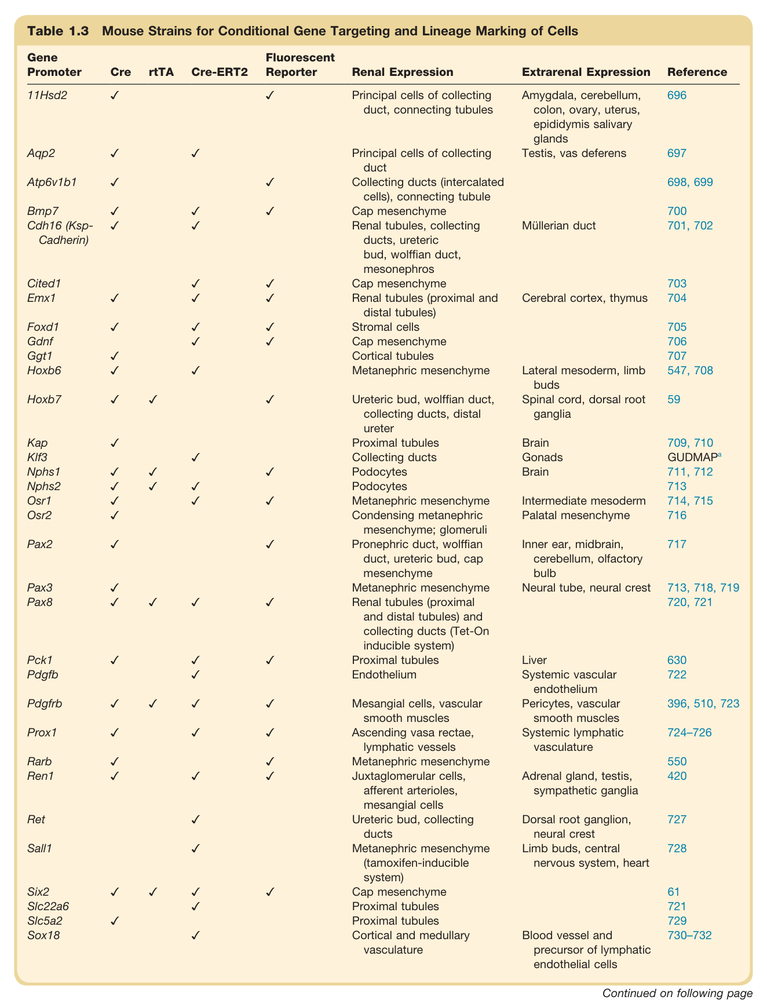

- **Part 2 (Page 24)**:
  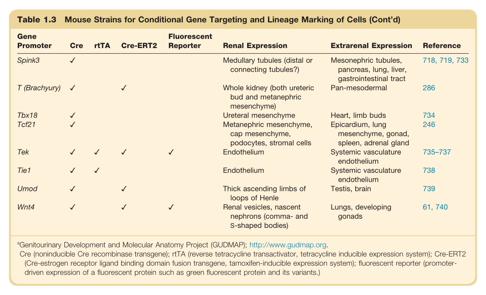

#### Table Data (CSV: [Table_1_3.csv](Table_1_3.csv))

```markdown
| Table Text (OCR) |
| :--- |
| Table 1.3 Mouse Strains for Conditional Gene Targeting and Lineage Marking of Cells  <sup>a</sup>Genitourinary Development and Molecular Anatomy Project (GUDMAP); http://www.gudmap.org. Cre (noninducible Cre recombinase transgene); rtTA (reverse tetracycline transactivator, tetracycline inducible expression system); Cre-ERT2 (Cre-estrogen receptor ligand binding domain fusion transgene, tamoxifen-inducible expression system); fluorescent reporter (promoter- driven expression of a fluorescent protein such as green fluorescent protein and its variants.) |
```

Table 1.3 Mouse Strains for Conditional Gene Targeting and Lineage Marking of Cells *This table lists various mouse strains with specific gene promoters used for Cre, rtTA, Cre-ERT2 systems, and fluorescent reporters, detailing their expression in renal and extrarenal tissues.* *Genitourinary Development and Molecular Anatomy Project (GUDMAP); http://www.gudmap.org.* *Cre (noninducible Cre recombinase transgene); rtTA (reverse tetracycline transactivator, tetracycline inducible expression system); Cre-ERT2 (Cre-estrogen receptor ligand binding domain fusion transgene, tamoxifen-inducible expression system); fluorescent reporter (promoter-driven expression of a fluorescent protein such as green fluorescent protein and its variants.)*

---
