# 03. The Renal Circulations and Glomerular Filtration - Figures and Tables Index

This document lists all figures and tables extracted from `03. The Renal Circulations and Glomerular Filtration.pdf`.

## Table of Contents
- [Figures](#figures)
- [Tables](#tables)

---

## Figures

### Fig_3_1

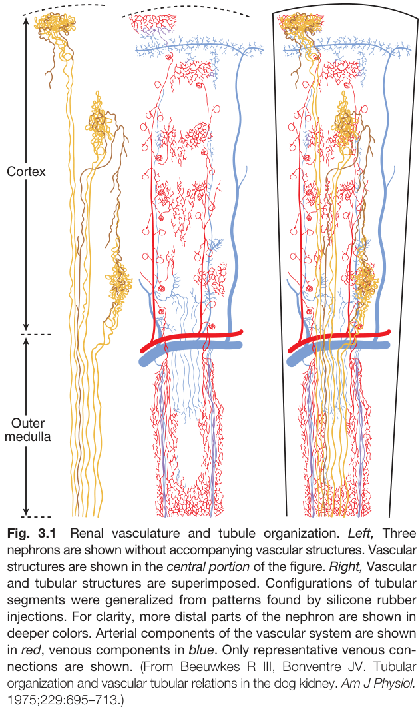

Fig. 3.1 Renal vasculature and tubule organization. Left, Three nephrons are shown without accompanying vascular structures. Vascular structures are shown in the central portion of the figure. Right, Vascular and tubular structures are superimposed. Configurations of tubular segments were generalized from patterns found by silicone rubber injections. For clarity, more distal parts of the nephron are shown in deeper colors. Arterial components of the vascular system are shown in red, venous components in blue. Only representative venous con- nections are shown. (From Beeuwkes R III, Bonventre JV. Tubular organization and vascular tubular relations in the dog kidney. Am J Physiol. 1975;229:695-713.)

---

### Fig_3_2

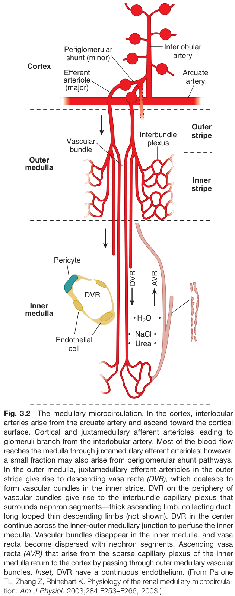

Fig. 3.2 The medullary microcirculation. In the cortex, interlobular arteries arise from the arcuate artery and ascend toward the cortical surface. Cortical and juxtamedullary afferent arterioles leading to glomeruli branch from the interlobular artery. Most of the blood flow reaches the medulla through juxtamedullary efferent arterioles; however, a small fraction may also arise from periglomerular shunt pathways. In the outer medulla, juxtamedullary efferent arterioles in the outer stripe give rise to descending vasa recta (DVR), which coalesce to form vascular bundles in the inner stripe. DVR on the periphery of vascular bundles give rise to the interbundle capillary plexus that surrounds nephron segments-thick ascending limb, collecting duct, long looped thin descending limbs (not shown). DVR in the center continue across the inner-outer medullary junction to perfuse the inner medulla. Vascular bundles disappear in the inner medulla, and vasa recta become dispersed with nephron segments. Ascending vasa recta (AVR) that arise from the sparse capillary plexus of the inner medulla return to the cortex by passing through outer medullary vascular bundles. Inset, DVR have a continuous endothelium. (From Pallone TL, Zhang Z, Rhinehart K. Physiology of the renal medullary microcircula- tion. Am J Physiol. 2003;284:F253-F266, 2003.)

---

### Fig_3_3

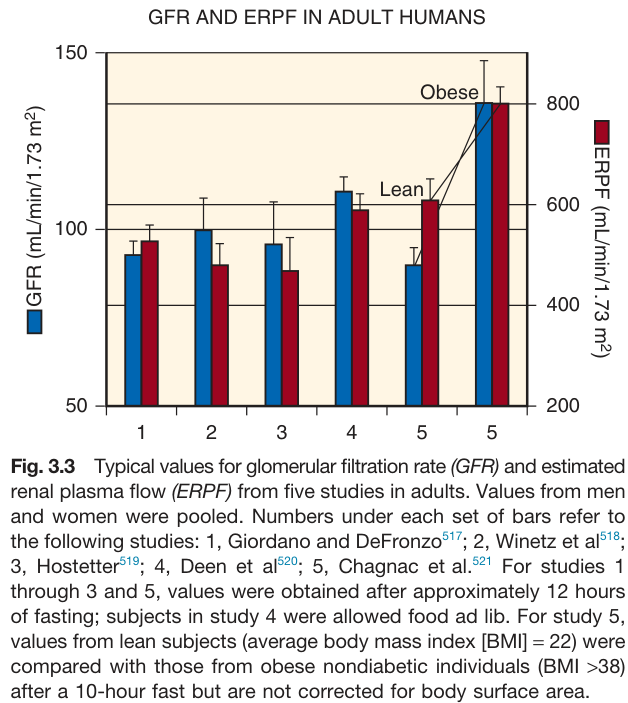

Fig. 3.3 Typical values for glomerular filtration rate (GFR) and estimated renal plasma flow (ERPF) from five studies in adults. Values from men and women were pooled. Numbers under each set of bars refer to the following studies: 1, Giordano and DeFronzo; 2, Winetz et al; 3, Hostetter; 4, Deen et al; 5, Chagnac et al. For studies 1 through 3 and 5, values were obtained after approximately 12 hours of fasting; subjects in study 4 were allowed food ad lib. For study 5, values from lean subjects (average body mass index [BMI] = 22) were compared with those from obese nondiabetic individuals (BMI >38) after a 10-hour fast but are not corrected for body surface area.

---

### Fig_3_4

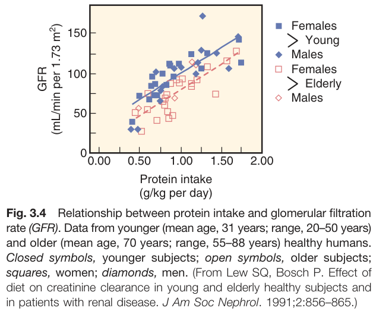

Fig. 3.4 Relationship between protein intake and glomerular filtration rate (GFR). Data from younger (mean age, 31 years; range, 20-50 years) and older (mean age, 70 years; range, 55-88 years) healthy humans. Closed symbols, younger subjects; open symbols, older subjects; squares, women; diamonds, men. (From Lew SQ, Bosch P. Effect of diet on creatinine clearance in young and elderly healthy subjects and in patients with renal disease. J Am Soc Nephrol. 1991;2:856-865.)

---

### Fig_3_5

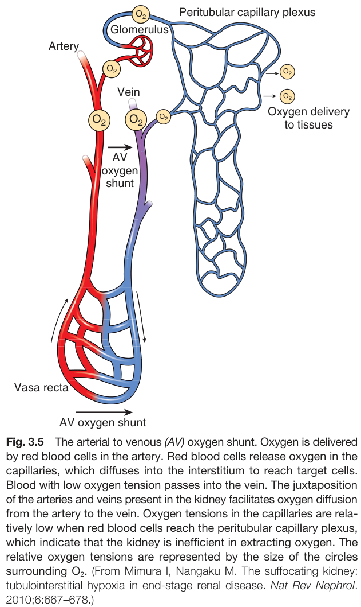

Fig. 3.5 The arterial to venous (AV) oxygen shunt. Oxygen is delivered by red blood cells in the artery. Red blood cells release oxygen in the capillaries, which diffuses into the interstitium to reach target cells. Blood with low oxygen tension passes into the vein. The juxtaposition of the arteries and veins present in the kidney facilitates oxygen diffusion from the artery to the vein. Oxygen tensions in the capillaries are rela- tively low when red blood cells reach the peritubular capillary plexus, which indicate that the kidney is inefficient in extracting oxygen. The relative oxygen tensions are represented by the size of the circles surrounding O2. (From Mimura I, Nangaku M. The suffocating kidney: tubulointerstitial hypoxia in end-stage renal disease. Nat Rev Nephrol. 2010;6:667-678.)

---

### Fig_3_6

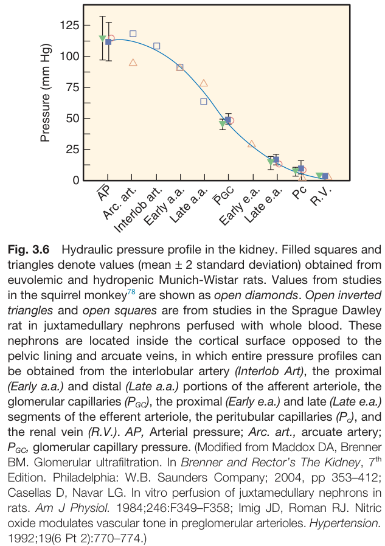

Fig. 3.6 Hydraulic pressure profile in the kidney. Filled squares and triangles denote values (mean ± 2 standard deviation) obtained from euvolemic and hydropenic Munich-Wistar rats. Values from studies in the squirrel monkey are shown as open diamonds. Open inverted triangles and open squares are from studies in the Sprague Dawley rat in juxtamedullary nephrons perfused with whole blood. These nephrons are located inside the cortical surface opposed to the pelvic lining and arcuate veins, in which entire pressure profiles can be obtained from the interlobular artery (Interlob Art), the proximal (Early a.a.) and distal (Late a.a.) portions of the afferent arteriole, the glomerular capillaries (PGC), the proximal (Early e.a.) and late (Late e.a.) segments of the efferent arteriole, the peritubular capillaries (Pc), and the renal vein (R.V.). AP, Arterial pressure; Arc. art., arcuate artery; PGC, glomerular capillary pressure. (Modified from Maddox DA, Brenner BM. Glomerular ultrafiltration. In Brenner and Rector's The Kidney, 7th Edition. Philadelphia: W.B. Saunders Company; 2004, pp 353-412; Casellas D, Navar LG. In vitro perfusion of juxtamedullary nephrons in rats. Am J Physiol. 1984;246:F349-F358; Imig JD, Roman RJ. Nitric oxide modulates vascular tone in preglomerular arterioles. Hypertension. 1992;19(6 Pt 2):770-774.)

---

### Fig_3_7

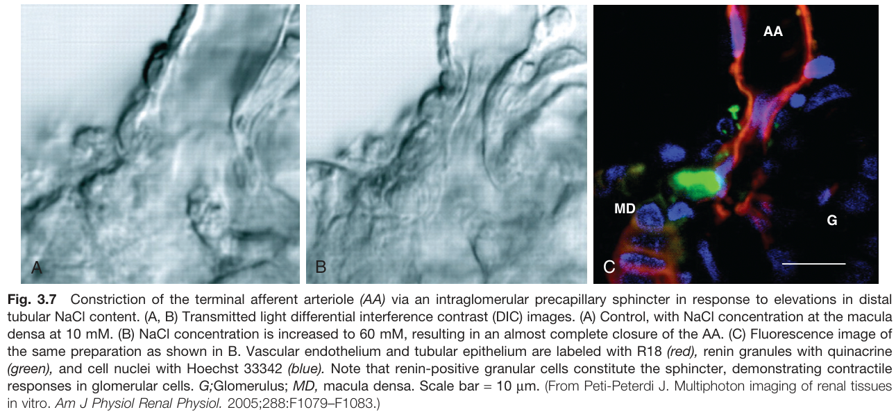

Fig. 3.7 Constriction of the terminal afferent arteriole (AA) via an intraglomerular precapillary sphincter in response to elevations in distal tubular NaCl content. (A, B) Transmitted light differential interference contrast (DIC) images. (A) Control, with NaCl concentration at the macula densa at 10 mM. (B) NaCl concentration is increased to 60 mM, resulting in an almost complete closure of the AA. (C) Fluorescence image of the same preparation as shown in B. Vascular endothelium and tubular epithelium are labeled with R18 (red), renin granules with quinacrine (green), and cell nuclei with Hoechst 33342 (blue). Note that renin-positive granular cells constitute the sphincter, demonstrating contractile responses in glomerular cells. G; Glomerulus; MD, macula densa. Scale bar = 10 µm. (From Peti-Peterdi J. Multiphoton imaging of renal tissues in vitro. Am J Physiol Renal Physiol. 2005;288:F1079-F1083.)

---

### Fig_3_8

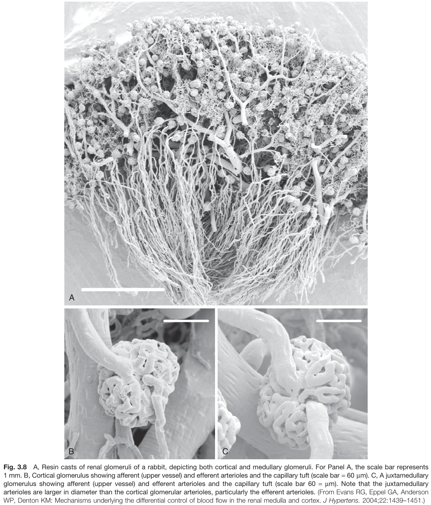

Fig. 3.8 A, Resin casts of renal glomeruli of a rabbit, depicting both cortical and medullary glomeruli. For Panel A, the scale bar represents 1 mm. B, Cortical glomerulus showing afferent (upper vessel) and efferent arterioles and the capillary tuft (scale bar = 60 µm). C, A juxtamedullary glomerulus showing afferent (upper vessel) and efferent arterioles and the capillary tuft (scale bar 60 = µm). Note that the juxtamedullary arterioles are larger in diameter than the cortical glomerular arterioles, particularly the efferent arterioles. (From Evans RG, Eppel GA, Anderson WP, Denton KM: Mechanisms underlying the differential control of blood flow in the renal medulla and cortex. J Hypertens. 2004;22:1439-1451.)

---

### Fig_3_9

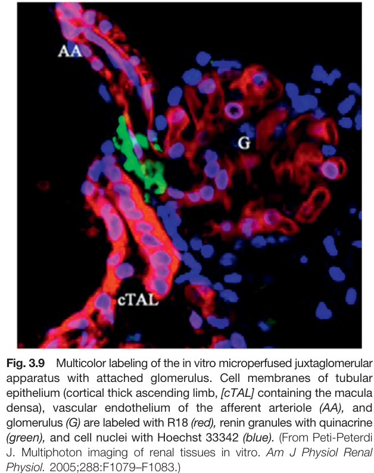

Fig. 3.9 Multicolor labeling of the in vitro microperfused juxtaglomerular apparatus with attached glomerulus. Cell membranes of tubular epithelium (cortical thick ascending limb, [cTAL] containing the macula densa), vascular endothelium of the afferent arteriole (AA), and glomerulus (G) are labeled with R18 (red), renin granules with quinacrine (green), and cell nuclei with Hoechst 33342 (blue). (From Peti-Peterdi J. Multiphoton imaging of renal tissues in vitro. Am J Physiol Renal Physiol. 2005;288:F1079-F1083.)

---

### Fig_3_10

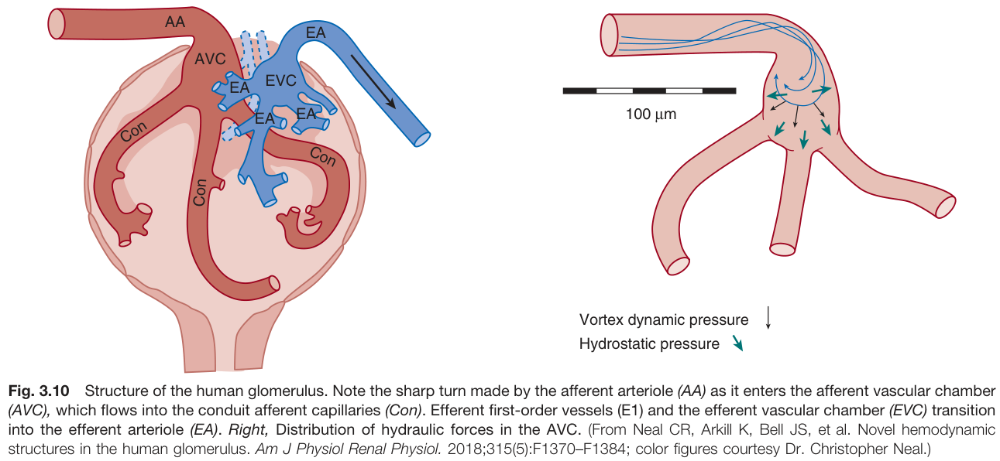

Fig. 3.10 Structure of the human glomerulus. Note the sharp turn made by the afferent arteriole (AA) as it enters the afferent vascular chamber (AVC), which flows into the conduit afferent capillaries (Con). Efferent first-order vessels (E1) and the efferent vascular chamber (EVC) transition into the efferent arteriole (EA). Right, Distribution of hydraulic forces in the AVC. (From Neal CR, Arkill K, Bell JS, et al. Novel hemodynamic structures in the human glomerulus. Am J Physiol Renal Physiol. 2018;315(5):F1370-F1384; color figures courtesy Dr. Christopher Neal.)

---

### Fig_3_11

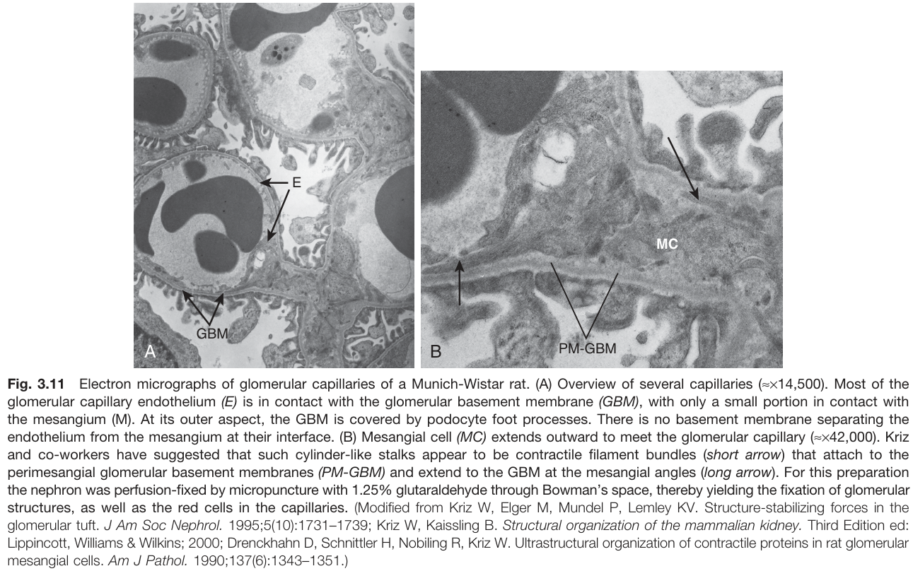

Fig. 3.11 Electron micrographs of glomerular capillaries of a Munich-Wistar rat. (A) Overview of several capillaries (≈×14,500). Most of the glomerular capillary endothelium (E) is in contact with the glomerular basement membrane (GBM), with only a small portion in contact with the mesangium (M). At its outer aspect, the GBM is covered by podocyte foot processes. There is no basement membrane separating the endothelium from the mesangium at their interface. (B) Mesangial cell (MC) extends outward to meet the glomerular capillary (≈×42,000). Kriz and co-workers have suggested that such cylinder-like stalks appear to be contractile filament bundles (short arrow) that attach to the perimesangial glomerular basement membranes (PM-GBM) and extend to the GBM at the mesangial angles (long arrow). For this preparation the nephron was perfusion-fixed by micropuncture with 1.25% glutaraldehyde through Bowman's space, thereby yielding the fixation of glomerular structures, as well as the red cells in the capillaries. (Modified from Kriz W, Elger M, Mundel P, Lemley KV. Structure-stabilizing forces in the glomerular tuft. J Am Soc Nephrol. 1995;5(10):1731-1739; Kriz W, Kaissling B. Structural organization of the mammalian kidney. Third Edition ed: Lippincott, Williams & Wilkins; 2000; Drenckhahn D, Schnittler H, Nobiling R, Kriz W. Ultrastructural organization of contractile proteins in rat glomerular mesangial cells. Am J Pathol. 1990;137(6):1343-1351.)

---

### Fig_3_12

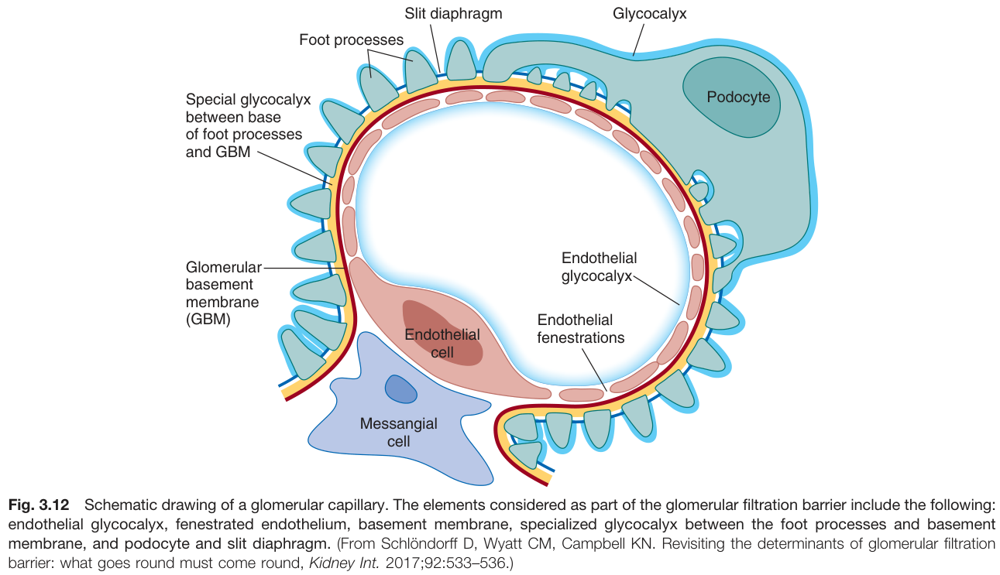

Fig. 3.12 Schematic drawing of a glomerular capillary. The elements considered as part of the glomerular filtration barrier include the following: endothelial glycocalyx, fenestrated endothelium, basement membrane, specialized glycocalyx between the foot processes and basement membrane, and podocyte and slit diaphragm. (From Schlöndorff D, Wyatt CM, Campbell KN. Revisiting the determinants of glomerular filtration barrier: what goes round must come round, Kidney Int. 2017;92:533-536.)

---

### Fig_3_13

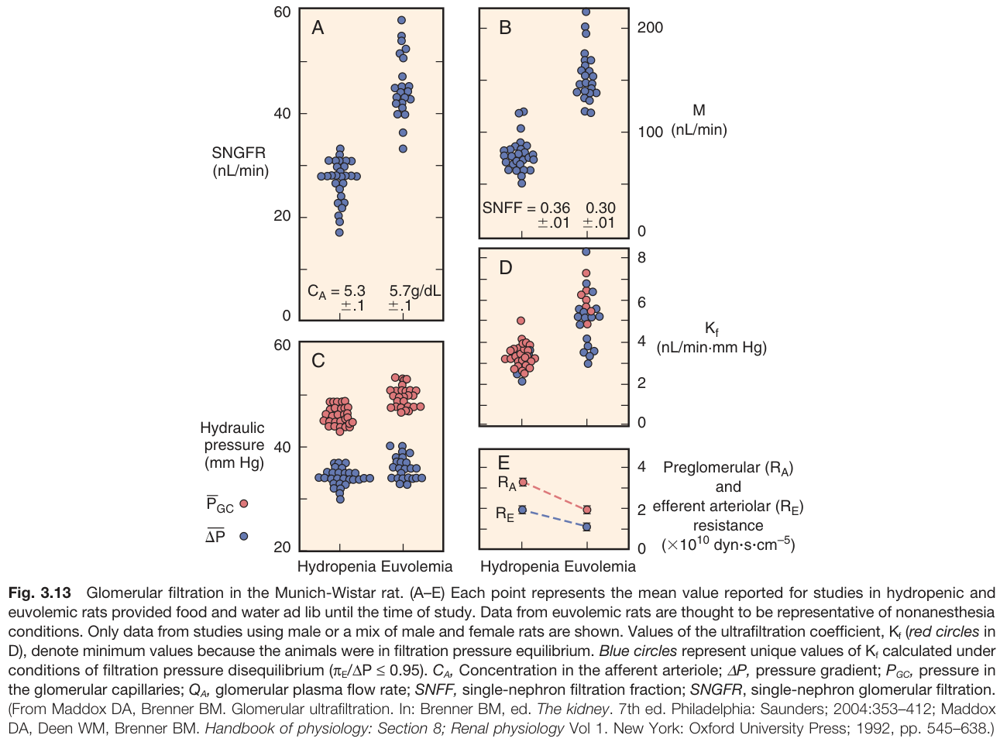

Fig. 3.13 Glomerular filtration in the Munich-Wistar rat. (A-E) Each point represents the mean value reported for studies in hydropenic and euvolemic rats provided food and water ad lib until the time of study. Data from euvolemic rats are thought to be representative of nonanesthesia conditions. Only data from studies using male or a mix of male and female rats are shown. Values of the ultrafiltration coefficient, K₁ (red circles in D), denote minimum values because the animals were in filtration pressure equilibrium. Blue circles represent unique values of K₁ calculated under conditions of filtration pressure disequilibrium (πε/ΔΡ ≤ 0.95). CA, Concentration in the afferent arteriole; AP, pressure gradient; PGC, pressure in the glomerular capillaries; QA, glomerular plasma flow rate; SNFF, single-nephron filtration fraction; SNGFR, single-nephron glomerular filtration. (From Maddox DA, Brenner BM. Glomerular ultrafiltration. In: Brenner BM, ed. The kidney. 7th ed. Philadelphia: Saunders; 2004:353-412; Maddox DA, Deen WM, Brenner BM. Handbook of physiology: Section 8; Renal physiology Vol 1. New York: Oxford University Press; 1992, pp. 545-638.)

---

### Fig_3_14

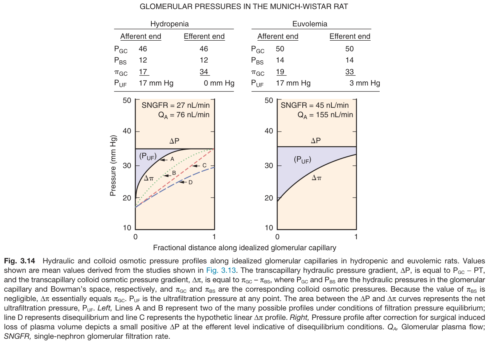

Fig. 3.14 Hydraulic and colloid osmotic pressure profiles along idealized glomerular capillaries in hydropenic and euvolemic rats. Values shown are mean values derived from the studies shown in Fig. 3.13. The transcapillary hydraulic pressure gradient, AP, is equal to PGC - PT, and the transcapillary colloid osmotic pressure gradient, Δπ, is equal to AGC - ΠBS, where PGC and PBS are the hydraulic pressures in the glomerular capillary and Bowman's space, respectively, and Gc and ABS are the corresponding colloid osmotic pressures. Because the value of ABS is negligible, An essentially equals AGC. PUF is the ultrafiltration pressure at any point. The area between the AP and Aπ curves represents the net ultrafiltration pressure, PUF. Left, Lines A and B represent two of the many possible profiles under conditions of filtration pressure equilibrium; line D represents disequilibrium and line C represents the hypothetic linear ∆π profile. Right, Pressure profile after correction for surgical induced loss of plasma volume depicts a small positive AP at the efferent level indicative of disequilibrium conditions. QA, Glomerular plasma flow; SNGFR, single-nephron glomerular filtration rate.

---

### Fig_3_15

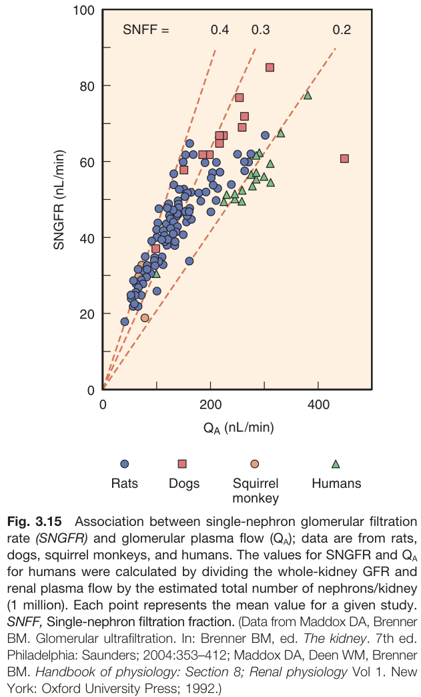

Fig. 3.15 Association between single-nephron glomerular filtration rate (SNGFR) and glomerular plasma flow (QA); data are from rats, dogs, squirrel monkeys, and humans. The values for SNGFR and QA for humans were calculated by dividing the whole-kidney GFR and renal plasma flow by the estimated total number of nephrons/kidney (1 million). Each point represents the mean value for a given study. SNFF, Single-nephron filtration fraction. (Data from Maddox DA, Brenner BM. Glomerular ultrafiltration. In: Brenner BM, ed. The kidney. 7th ed. Philadelphia: Saunders; 2004:353-412; Maddox DA, Deen WM, Brenner BM. Handbook of physiology: Section 8; Renal physiology Vol 1. New York: Oxford University Press; 1992.)

---

### Fig_3_16

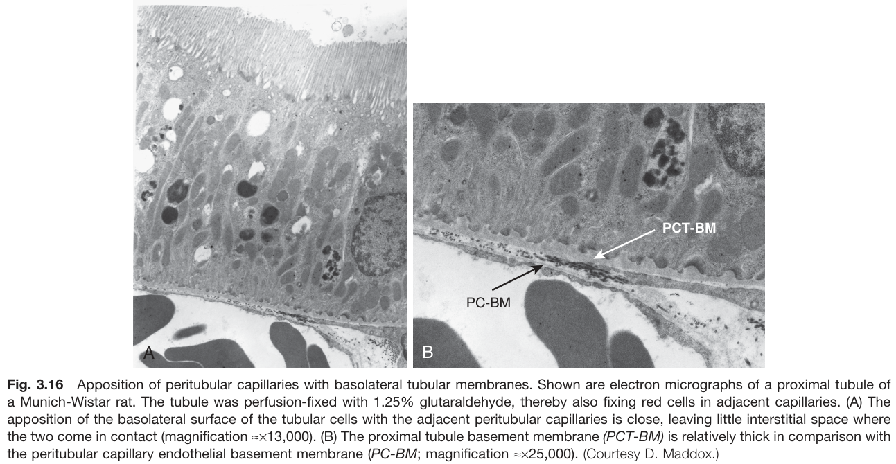

Fig. 3.16 Apposition of peritubular capillaries with basolateral tubular membranes. Shown are electron micrographs of a proximal tubule of a Munich-Wistar rat. The tubule was perfusion-fixed with 1.25% glutaraldehyde, thereby also fixing red cells in adjacent capillaries. (A) The apposition of the basolateral surface of the tubular cells with the adjacent peritubular capillaries is close, leaving little interstitial space where the two come in contact (magnification ≈×13,000). (B) The proximal tubule basement membrane (PCT-BM) is relatively thick in comparison with the peritubular capillary endothelial basement membrane (PC-BM; magnification ≈×25,000). (Courtesy D. Maddox.)

---

### Fig_3_17

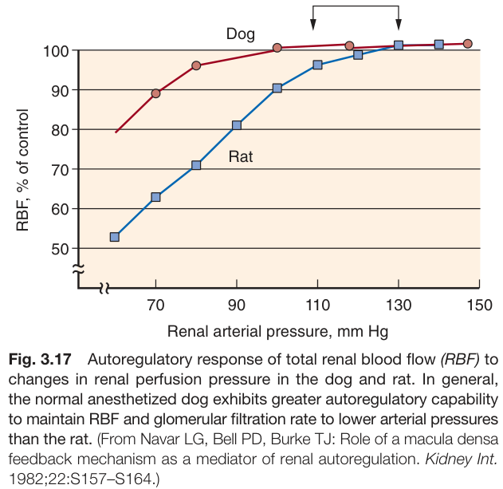

Fig. 3.17 Autoregulatory response of total renal blood flow (RBF) to changes in renal perfusion pressure in the dog and rat. In general, the normal anesthetized dog exhibits greater autoregulatory capability to maintain RBF and glomerular filtration rate to lower arterial pressures than the rat. (From Navar LG, Bell PD, Burke TJ: Role of a macula densa feedback mechanism as a mediator of renal autoregulation. Kidney Int. 1982;22:S157-S164.)

---

### Fig_3_18

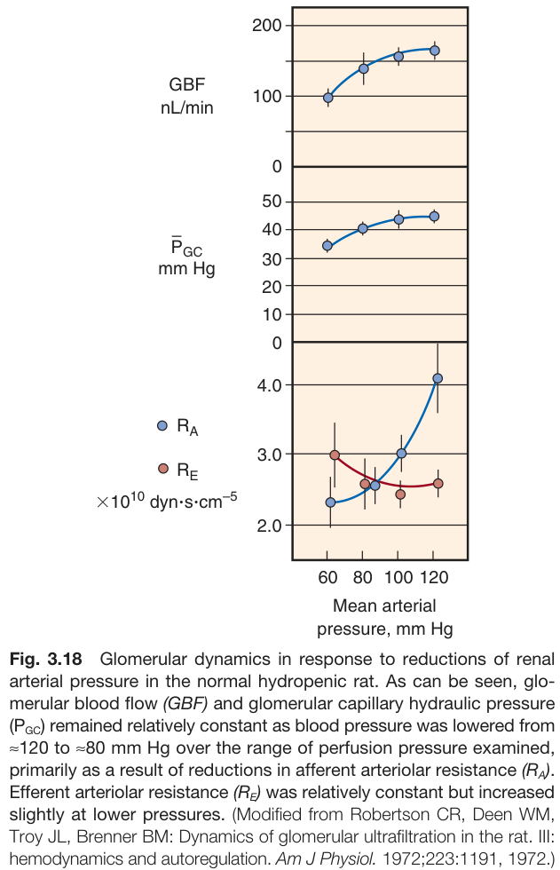

Fig. 3.18 Glomerular dynamics in response to reductions of renal arterial pressure in the normal hydropenic rat. As can be seen, glo- merular blood flow (GBF) and glomerular capillary hydraulic pressure (PGC) remained relatively constant as blood pressure was lowered from ≈120 to ≈80 mm Hg over the range of perfusion pressure examined, primarily as a result of reductions in afferent arteriolar resistance (RA). Efferent arteriolar resistance (RE) was relatively constant but increased slightly at lower pressures. (Modified from Robertson CR, Deen WM, Troy JL, Brenner BM: Dynamics of glomerular ultrafiltration in the rat. III: hemodynamics and autoregulation. Am J Physiol. 1972;223:1191, 1972.)

---

### Fig_3_19

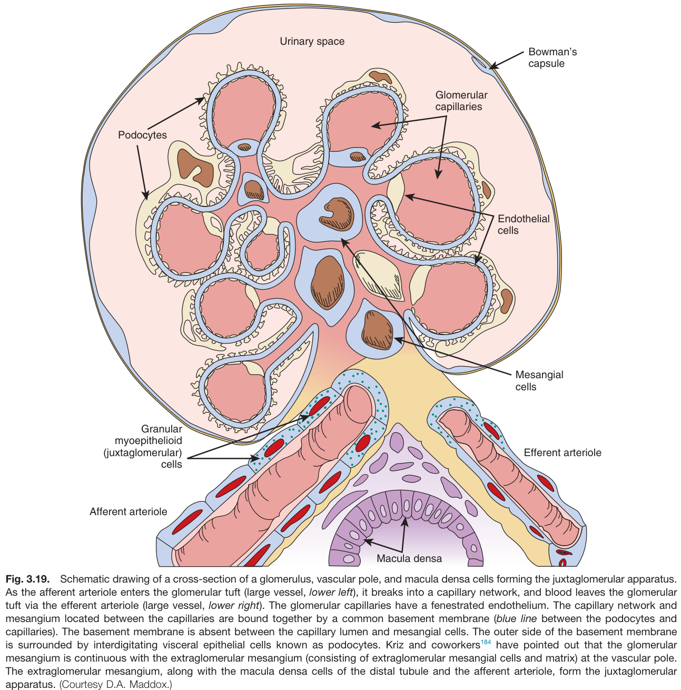

Fig. 3.19 Schematic drawing of a cross-section of a glomerulus, vascular pole, and macula densa cells forming the juxtaglomerular apparatus. As the afferent arteriole enters the glomerular tuft (large vessel, lower left), it breaks into a capillary network, and blood leaves the glomerular tuft via the efferent arteriole (large vessel, lower right). The glomerular capillaries have a fenestrated endothelium. The capillary network and mesangium located between the capillaries are bound together by a common basement membrane (blue line between the podocytes and capillaries). The basement membrane is absent between the capillary lumen and mesangial cells. The outer side of the basement membrane is surrounded by interdigitating visceral epithelial cells known as podocytes. Kriz and coworkers have pointed out that the glomerular mesangium is continuous with the extraglomerular mesangium (consisting of extraglomerular mesangial cells and matrix) at the vascular pole. The extraglomerular mesangium, along with the macula densa cells of the distal tubule and the afferent arteriole, form the juxtaglomerular apparatus. (Courtesy D.A. Maddox.)

---

### Fig_3_20

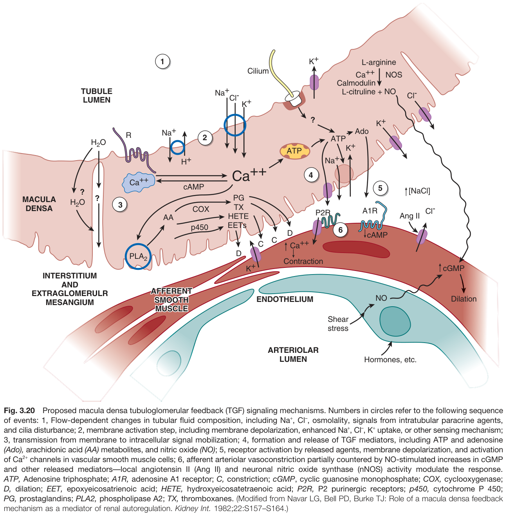

Fig. 3.20 Proposed macula densa tubuloglomerular feedback (TGF) signaling mechanisms. Numbers in circles refer to the following sequence of events: 1, Flow-dependent changes in tubular fluid composition, including Na+, Cl-, osmolality, signals from intratubular paracrine agents, and cilia disturbance; 2, membrane activation step, including membrane depolarization, enhanced Na+, Cl, K+ uptake, or other sensing mechanism; 3, transmission from membrane to intracellular signal mobilization; 4, formation and release of TGF mediators, including ATP and adenosine (Ado), arachidonic acid (AA) metabolites, and nitric oxide (NO); 5, receptor activation by released agents, membrane depolarization, and activation of Ca2+ channels in vascular smooth muscle cells; 6, afferent arteriolar vasoconstriction partially countered by NO-stimulated increases in cGMP and other released mediators-local angiotensin II (Ang II) and neuronal nitric oxide synthase (nNOS) activity modulate the response. ATP, Adenosine triphosphate; A1R, adenosine A1 receptor; C, constriction; cGMP, cyclic guanosine monophosphate; COX, cyclooxygenase; D, dilation; EET, epoxyeicosatrienoic acid; HETE, hydroxyeicosatetraenoic acid; P2R, P2 purinergic receptors; p450, cytochrome P 450; PG, prostaglandins; PLA2, phospholipase A2; TX, thromboxanes. (Modified from Navar LG, Bell PD, Burke TJ: Role of a macula densa feedback mechanism as a mediator of renal autoregulation. Kidney Int. 1982;22:S157-S164.)

---

### Fig_3_21

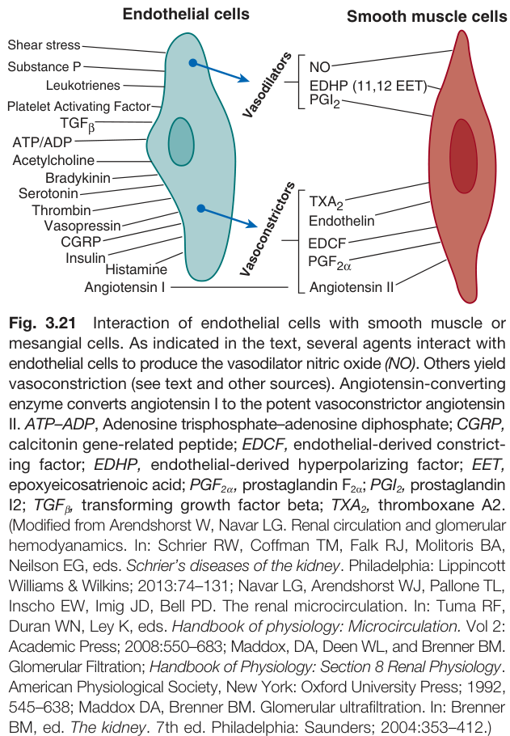

Fig. 3.21 Interaction of endothelial cells with smooth muscle or mesangial cells. As indicated in the text, several agents interact with endothelial cells to produce the vasodilator nitric oxide (NO). Others yield vasoconstriction (see text and other sources). Angiotensin-converting enzyme converts angiotensin I to the potent vasoconstrictor angiotensin II. ATP-ADP, Adenosine trisphosphate-adenosine diphosphate; CGRP, calcitonin gene-related peptide; EDCF, endothelial-derived constrict- ing factor; EDHP, endothelial-derived hyperpolarizing factor; EET, epoxyeicosatrienoic acid; PGF2a, prostaglandin F20; PGI2, prostaglandin 12; TGF transforming growth factor beta; TXA2, thromboxane A2. (Modified from Arendshorst W, Navar LG. Renal circulation and glomerular hemodyanamics. In: Schrier RW, Coffman TM, Falk RJ, Molitoris BA, Neilson EG, eds. Schrier's diseases of the kidney. Philadelphia: Lippincott Williams & Wilkins; 2013:74-131; Navar LG, Arendshorst WJ, Pallone TL, Inscho EW, Imig JD, Bell PD. The renal microcirculation. In: Tuma RF, Duran WN, Ley K, eds. Handbook of physiology: Microcirculation. Vol 2: Academic Press; 2008:550-683; Maddox, DA, Deen WL, and Brenner BM. Glomerular Filtration; Handbook of Physiology: Section 8 Renal Physiology. American Physiological Society, New York: Oxford University Press; 1992, 545-638; Maddox DA, Brenner BM. Glomerular ultrafiltration. In: Brenner BM, ed. The kidney. 7th ed. Philadelphia: Saunders; 2004:353-412.)

---

### Fig_3_22

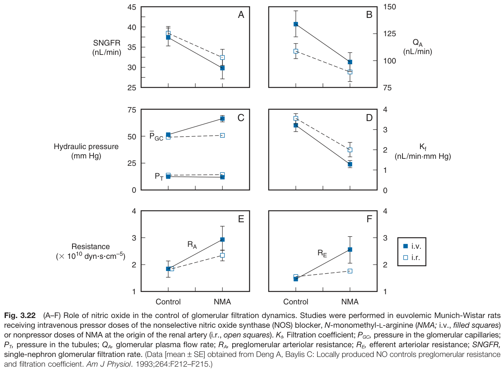

Fig. 3.22 (A-F) Role of nitric oxide in the control of glomerular filtration dynamics. Studies were performed in euvolemic Munich-Wistar rats receiving intravenous pressor doses of the nonselective nitric oxide synthase (NOS) blocker, N-monomethyl-L-arginine (NMA; i.v., filled squares) or nonpressor doses of NMA at the origin of the renal artery (i.r., open squares). K₁, Filtration coefficient; PGC, pressure in the glomerular capillaries; PT, pressure in the tubules; QA, glomerular plasma flow rate; RA, preglomerular arteriolar resistance; RE, efferent arteriolar resistance; SNGFR, single-nephron glomerular filtration rate. (Data [mean ± SE] obtained from Deng A, Baylis C: Locally produced NO controls preglomerular resistance and filtration coefficient. Am J Physiol. 1993;264:F212-F215.)

---

### Fig_3_23

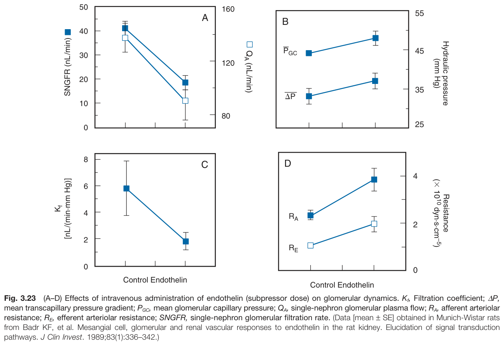

Fig. 3.23 (A-D) Effects of intravenous administration of endothelin (subpressor dose) on glomerular dynamics. K, Filtration coefficient; AP, mean transcapillary pressure gradient; PGC, mean glomerular capillary pressure; QA, single-nephron glomerular plasma flow; RA, afferent arteriolar resistance; RE, efferent arteriolar resistance; SNGFR, single-nephron glomerular filtration rate. (Data [mean ± SE] obtained in Munich-Wistar rats from Badr KF, et al. Mesangial cell, glomerular and renal vascular responses to endothelin in the rat kidney. Elucidation of signal transduction pathways. J Clin Invest. 1989;83(1):336-342.)

---

### Fig_3_24

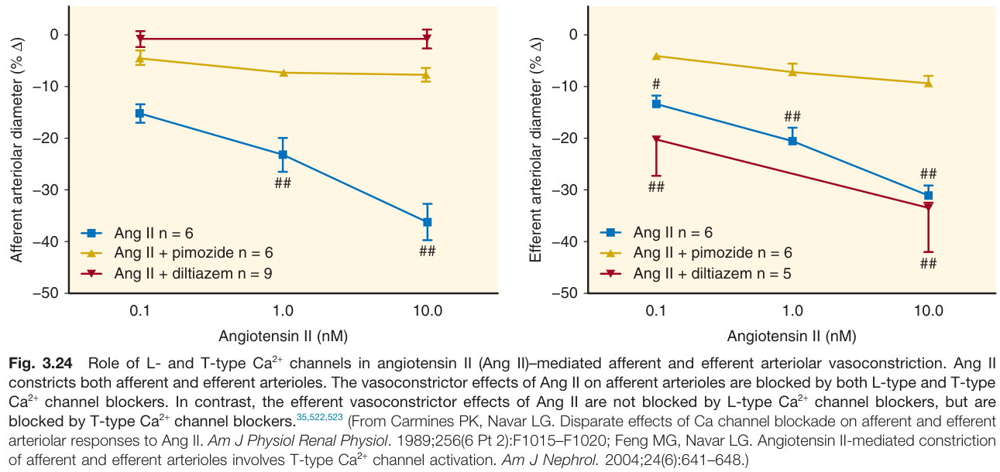

Fig. 3.24 Role of L- and T-type Ca2+ channels in angiotensin II (Ang II)-mediated afferent and efferent arteriolar vasoconstriction. Ang II constricts both afferent and efferent arterioles. The vasoconstrictor effects of Ang II on afferent arterioles are blocked by both L-type and T-type Ca2+ channel blockers. In contrast, the efferent vasoconstrictor effects of Ang II are not blocked by L-type Ca2+ channel blockers, but are blocked by T-type Ca2+ channel blockers. (From Carmines PK, Navar LG. Disparate effects of Ca channel blockade on afferent and efferent arteriolar responses to Ang II. Am J Physiol Renal Physiol. 1989;256(6 Pt 2):F1015-F1020; Feng MG, Navar LG. Angiotensin II-mediated constriction of afferent and efferent arterioles involves T-type Ca2+ channel activation. Am J Nephrol. 2004;24(6):641-648.)

---

### Fig_3_25

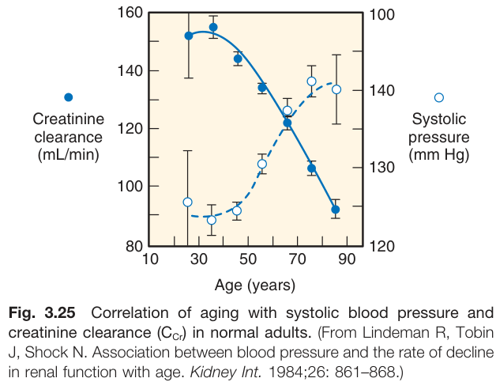

Fig. 3.25 Correlation of aging with systolic blood pressure and creatinine clearance (Ccr) in normal adults. (From Lindeman R, Tobin J, Shock N. Association between blood pressure and the rate of decline in renal function with age. Kidney Int. 1984;26: 861-868.)

---

## Tables

### Table_3_1

#### Table Image

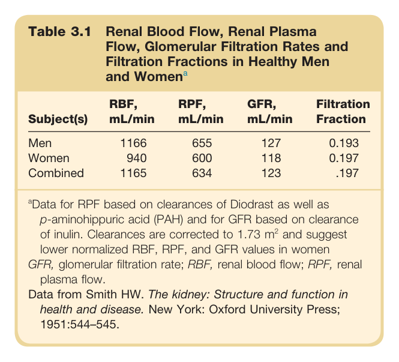

#### Table Data (CSV: [Table_3_1.csv](Table_3_1.csv))

```markdown
| Table Text (OCR) |
| :--- |
| Table 3.1 Renal Blood Flow, Renal Plasma Flow, Glomerular Filtration Rates and Filtration Fractions in Healthy Men and Women<sup>a</sup> |
```

Table 3.1 Renal Blood Flow, Renal Plasma Flow, Glomerular Filtration Rates and Filtration Fractions in Healthy Men and Women | Subject(s) | RBF, mL/min | RPF, mL/min | GFR, mL/min | Filtration Fraction | | :--- | :--- | :--- | :--- | :--- | | Men | 1166 | 655 | 127 | 0.193 | | Women | 940 | 600 | 118 | 0.197 | | Combined | 1165 | 634 | 123 | .197 | aData for RPF based on clearances of Diodrast as well as p-aminohippuric acid (PAH) and for GFR based on clearance of inulin. Clearances are corrected to 1.73 m² and suggest lower normalized RBF, RPF, and GFR values in women GFR, glomerular filtration rate; RBF, renal blood flow; RPF, renal plasma flow. Data from Smith HW. The kidney: Structure and function in health and disease. New York: Oxford University Press; 1951:544-545.

---
