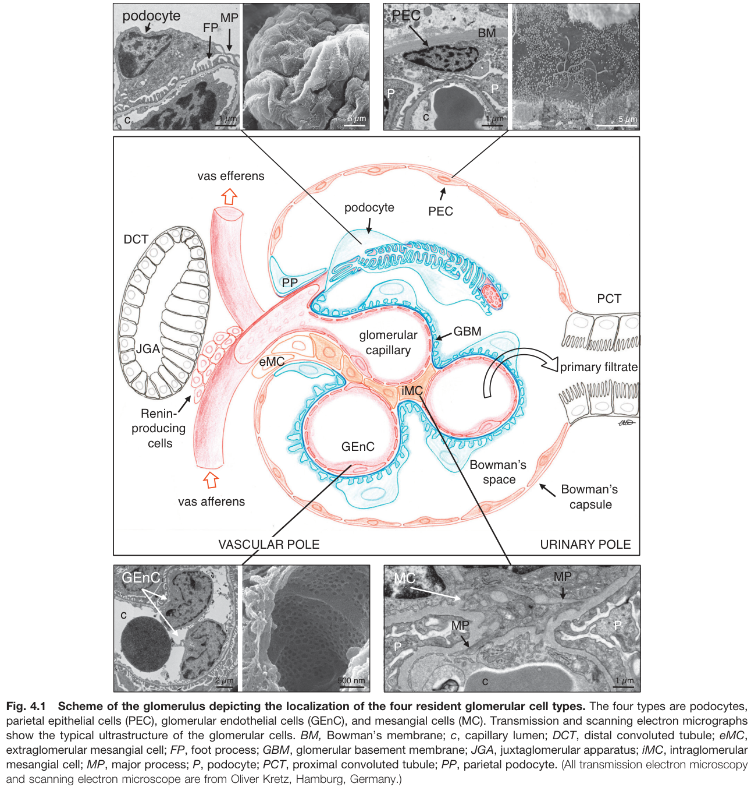
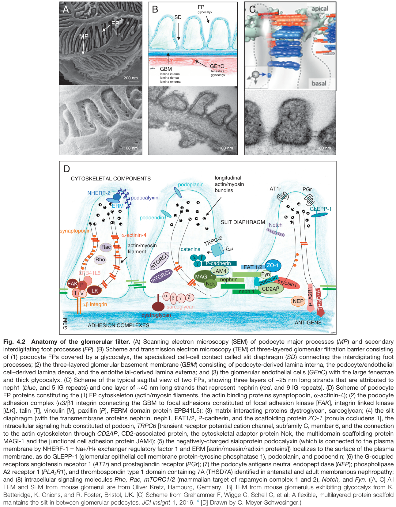
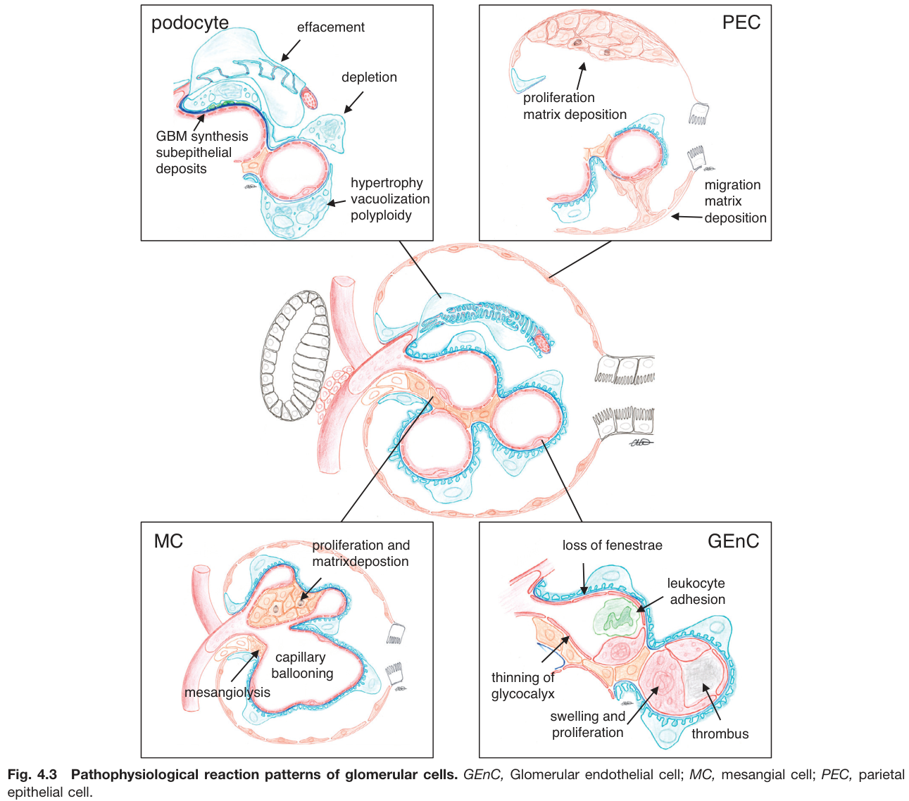
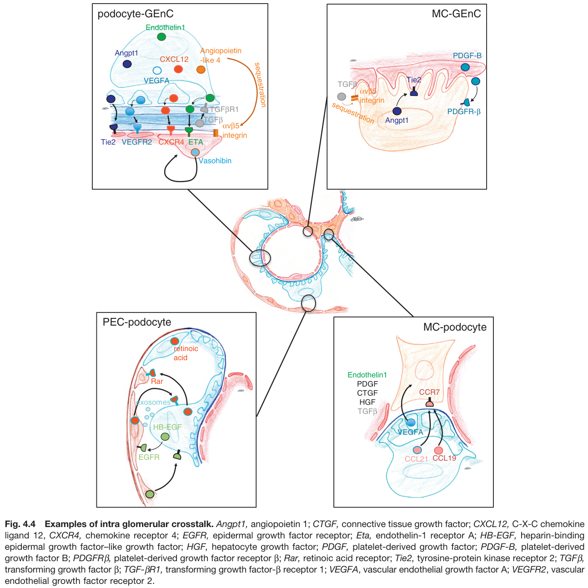
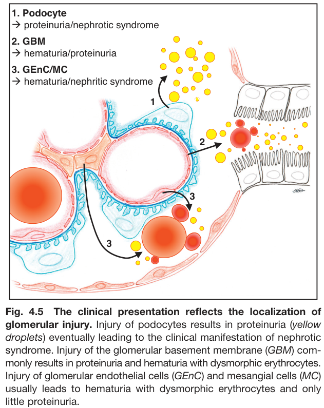

# 04. Glomerular Cell Biology and Podocytopathies - Figures and Tables Index

This document lists all figures and tables extracted from `04. Glomerular Cell Biology and Podocytopathies.pdf`.

## Table of Contents
- [Figures](#figures)
- [Tables](#tables)

---

## Figures

### Fig_4_1

Fig. 4.1 Scheme of the glomerulus depicting the localization of the four resident glomerular cell types. The four types are podocytes, parietal epithelial cells (PEC), glomerular endothelial cells (GEnC), and mesangial cells (MC). Transmission and scanning electron micrographs show the typical ultrastructure of the glomerular cells. BM, Bowman's membrane; c, capillary lumen; DCT, distal convoluted tubule; eMC, extraglomerular mesangial cell; FP, foot process; GBM, glomerular basement membrane; JGA, juxtaglomerular apparatus; iMC, intraglomerular mesangial cell; MP, major process; P, podocyte; PCT, proximal convoluted tubule; PP, parietal podocyte. (All transmission electron microscopy and scanning electron microscope are from Oliver Kretz, Hamburg, Germany.)

---

### Fig_4_2

Fig. 4.2 Anatomy of the glomerular filter. (A) Scanning electron microscopy (SEM) of podocyte major processes (MP) and secondary interdigitating foot processes (FP). (B) Scheme and transmission electron microscopy (TEM) of three-layered glomerular filtration barrier consisting of (1) podocyte FPs covered by a glycocalyx, the specialized cell-cell contact called slit diaphragm (SD) connecting the interdigitating foot processes; (2) the three-layered glomerular basement membrane (GBM) consisting of podocyte-derived lamina interna, the podocyte/endothelial cell-derived lamina densa, and the endothelial-derived lamina externa; and (3) the glomerular endothelial cells (GEnC) with the large fenestrae and thick glycocalyx. (C) Scheme of the typical sagittal view of two FPs, showing three layers of ~25 nm long strands that are attributed to neph1 (blue, and 5 IG repeats) and one layer of ~40 nm long strands that represent nephrin (red, and 9 IG repeats). (D) Scheme of podocyte FP proteins constituting the (1) FP cytoskeleton (actin/myosin filaments, the actin binding proteins synaptopodin, α-actinin-4); (2) the podocyte adhesion complex (x3/ẞ1 integrin connecting the GBM to focal adhesions constituted of focal adhesion kinase [FAK], integrin linked kinase [ILK], talin [7], vinculin [V], paxillin [P], FERM domain protein EPB41L5); (3) matrix interacting proteins dystroglycan, sarcoglycan; (4) the slit diaphragm (with the transmembrane proteins nephrin, neph1, FAT1/2, P-cadherin, and the scaffolding protein ZO-1 [zonula occludens 1], the intracellular signaling hub constituted of podocin, TRPC6 [transient receptor potential cation channel, subfamily C, member 6, and the connection to the actin cytoskeleton through CD2AP, CD2-associated protein, the cytoskeletal adaptor protein Nck, the multidomain scaffolding protein MAGI-1 and the junctional cell adhesion protein JAM4); (5) the negatively-charged sialoprotein podocalyxin (which is connected to the plasma membrane by NHERF-1 = Na+/H+ exchanger regulatory factor 1 and ERM [ezrin/moesin/radixin proteins]) localizes to the surface of the plasma membrane, as do GLEPP-1 (glomerular epithelial cell membrane protein-tyrosine phosphatase 1), podoplanin, and podoendin; (6) the G-coupled receptors angiotensin receptor 1 (AT1r) and prostaglandin receptor (PGr); (7) the podocyte antigens neutral endopeptidase (NEP); phospholipase A2 receptor 1 (PLA₂R1), and thrombospondin type 1 domain containing 7A (THSD7A) identified in antenatal and adult membranous nephropathy; and (8) intracellular signaling molecules Rho, Rac, mTORC1/2 (mammalian target of rapamycin complex 1 and 2), Notch, and Fyn. ([A, C] All TEM and SEM from mouse glomeruli are from Oliver Kretz, Hamburg, Germany. [B] TEM from mouse glomerulus exhibiting glycocalyx from K. Betteridge, K. Onions, and R. Foster, Bristol, UK. [C] Scheme from Grahammer F, Wigge C, Schell C, et al: A flexible, multilayered protein scaffold maintains the slit in between glomerular podocytes. JCI Insight 1, 2016. [D] Drawn by C. Meyer-Schwesinger.)

---

### Fig_4_3

Fig. 4.3 Pathophysiological reaction patterns of glomerular cells. GEnC, Glomerular endothelial cell; MC, mesangial cell; PEC, parietal epithelial cell.

---

### Fig_4_4

Fig. 4.4 Examples of intra glomerular crosstalk. Angpt1, angiopoietin 1; CTGF, connective tissue growth factor; CXCL12, C-X-C chemokine ligand 12, CXCR4, chemokine receptor 4; EGFR, epidermal growth factor receptor; Eta, endothelin-1 receptor A; HB-EGF, heparin-binding epidermal growth factor-like growth factor; HGF, hepatocyte growth factor; PDGF, platelet-derived growth factor; PDGF-B, platelet-derived growth factor B; PDGFRẞ, platelet-derived growth factor receptor ẞ; Rar, retinoic acid receptor; Tie2, tyrosine-protein kinase receptor 2; TGFẞ, transforming growth factor ẞ; TGF-BR1, transforming growth factor-ẞ receptor 1; VEGFA, vascular endothelial growth factor A; VEGFR2, vascular endothelial growth factor receptor 2.

---

### Fig_4_5

Fig. 4.5 The clinical presentation reflects the localization of glomerular injury. Injury of podocytes results in proteinuria (yellow droplets) eventually leading to the clinical manifestation of nephrotic syndrome. Injury of the glomerular basement membrane (GBM) commonly results in proteinuria and hematuria with dysmorphic erythrocytes. Injury of glomerular endothelial cells (GEnC) and mesangial cells (MC) usually leads to hematuria with dysmorphic erythrocytes and only little proteinuria.

---

## Tables

*No tables resolved for this chapter.*
