# 05. Metabolic Basis of Solute Transport - Figures and Tables Index

This document lists all figures and tables extracted from `05. Metabolic Basis of Solute Transport.pdf`.

## Table of Contents
- [Figures](#figures)
- [Tables](#tables)

---

## Figures

### Fig_5_1

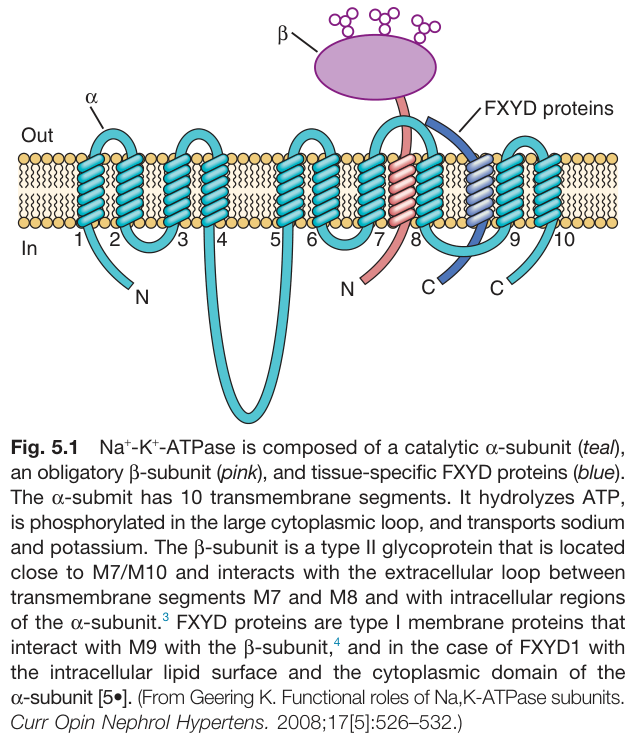

Fig. 5.1 Na+-K+-ATPase is composed of a catalytic a-subunit (teal), an obligatory ß-subunit (pink), and tissue-specific FXYD proteins (blue). The a-submit has 10 transmembrane segments. It hydrolyzes ATP, is phosphorylated in the large cytoplasmic loop, and transports sodium and potassium. The ß-subunit is a type II glycoprotein that is located close to M7/M10 and interacts with the extracellular loop between transmembrane segments M7 and M8 and with intracellular regions of the a-subunit. FXYD proteins are type I membrane proteins that interact with M9 with the ß-subunit, and in the case of FXYD1 with the intracellular lipid surface and the cytoplasmic domain of the α-subunit. (From Geering K. Functional roles of Na, K-ATPase subunits. Curr Opin Nephrol Hypertens. 2008;17[5]:526-532.)

---

### Fig_5_2

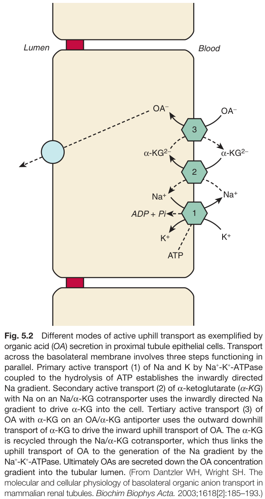

Fig. 5.2 Different modes of active uphill transport as exemplified by organic acid (OA) secretion in proximal tubule epithelial cells. Transport across the basolateral membrane involves three steps functioning in parallel. Primary active transport (1) of Na and K by Na+-K+-ATPase coupled to the hydrolysis of ATP establishes the inwardly directed Na gradient. Secondary active transport (2) of a-ketoglutarate (α-KG) with Na on an Na/α-KG cotransporter uses the inwardly directed Na gradient to drive a-KG into the cell. Tertiary active transport (3) of ΟΑ with α-KG on an OA/α-KG antiporter uses the outward downhill transport of a-KG to drive the inward uphill transport of OA. The a-KG is recycled through the Na/α-KG cotransporter, which thus links the uphill transport of OA to the generation of the Na gradient by the Na+-K+-ATPase. Ultimately OAs are secreted down the OA concentration gradient into the tubular lumen. (From Dantzler WH, Wright SH. The molecular and cellular physiology of basolateral organic anion transport in mammalian renal tubules. Biochim Biophys Acta. 2003;1618[2]:185-193.)

---

### Fig_5_3

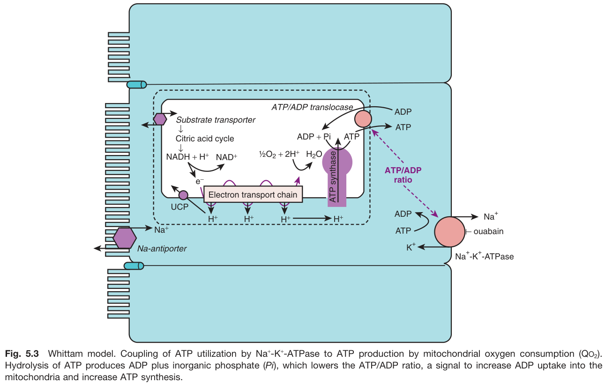

Fig. 5.3 Whittam model. Coupling of ATP utilization by Nat-K+-ATPase to ATP production by mitochondrial oxygen consumption (QO2). Hydrolysis of ATP produces ADP plus inorganic phosphate (Pi), which lowers the ATP/ADP ratio, a signal to increase ADP uptake into the mitochondria and increase ATP synthesis.

---

### Fig_5_4

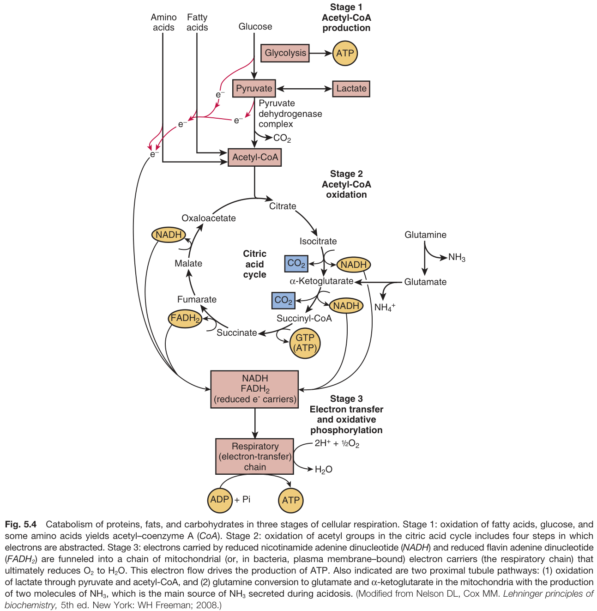

Fig. 5.4 Catabolism of proteins, fats, and carbohydrates in three stages of cellular respiration. Stage 1: oxidation of fatty acids, glucose, and some amino acids yields acetyl-coenzyme A (CoA). Stage 2: oxidation of acetyl groups in the citric acid cycle includes four steps in which electrons are abstracted. Stage 3: electrons carried by reduced nicotinamide adenine dinucleotide (NADH) and reduced flavin adenine dinucleotide (FADH2) are funneled into a chain of mitochondrial (or, in bacteria, plasma membrane-bound) electron carriers (the respiratory chain) that ultimately reduces O2 to H2O. This electron flow drives the production of ATP. Also indicated are two proximal tubule pathways: (1) oxidation of lactate through pyruvate and acetyl-CoA, and (2) glutamine conversion to glutamate and a-ketoglutarate in the mitochondria with the production of two molecules of NH3, which is the main source of NH3 secreted during acidosis. (Modified from Nelson DL, Cox MM. Lehninger principles of biochemistry, 5th ed. New York: WH Freeman; 2008.)

---

### Fig_5_5

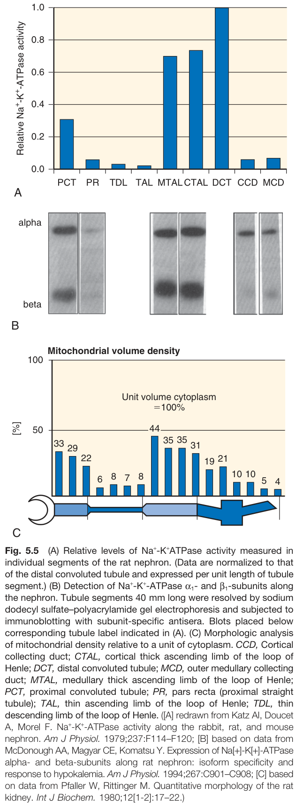

Fig. 5.5 (A) Relative levels of Na+-K+ATPase activity measured in individual segments of the rat nephron. (Data are normalized to that of the distal convoluted tubule and expressed per unit length of tubule segment.) (B) Detection of Na+-K+-ATPase a₁- and ß₁-subunits along the nephron. Tubule segments 40 mm long were resolved by sodium dodecyl sulfate-polyacrylamide gel electrophoresis and subjected to immunoblotting with subunit-specific antisera. Blots placed below corresponding tubule label indicated in (A). (C) Morphologic analysis of mitochondrial density relative to a unit of cytoplasm. CCD, Cortical collecting duct; CTAL, cortical thick ascending limb of the loop of Henle; DCT, distal convoluted tubule; MCD, outer medullary collecting duct; MTAL, medullary thick ascending limb of the loop of Henle; PCT, proximal convoluted tubule; PR, pars recta (proximal straight tubule); TAL, thin ascending limb of the loop of Henle; TDL, thin descending limb of the loop of Henle. ([A] redrawn from Katz Al, Doucet A, Morel F. Na+-K+-ATPase activity along the rabbit, rat, and mouse nephron. Am J Physiol. 1979;237:F114-F120; [B] based on data from McDonough AA, Magyar CE, Komatsu Y. Expression of Na[+]-K[+]-ATPase alpha- and beta-subunits along rat nephron: isoform specificity and response to hypokalemia. Am J Physiol. 1994;267:C901-C908; [C] based on data from Pfaller W, Rittinger M. Quantitative morphology of the rat kidney. Int J Biochem. 1980;12[1-2]:17-22.)

---

### Fig_5_6

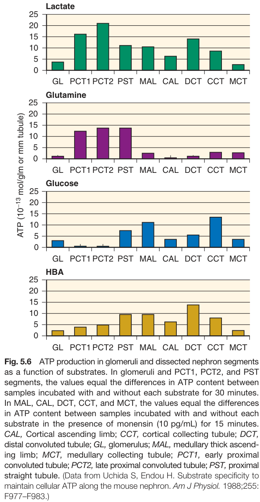

Fig. 5.6 ATP production in glomeruli and dissected nephron segments as a function of substrates. In glomeruli and PCT1, PCT2, and PST segments, the values equal the differences in ATP content between samples incubated with and without each substrate for 30 minutes. In MAL, CAL, DCT, CCT, and MCT, the values equal the differences in ATP content between samples incubated with and without each substrate in the presence of monensin (10 pg/mL) for 15 minutes. CAL, Cortical ascending limb; CCT, cortical collecting tubule; DCT, distal convoluted tubule; GL, glomerulus; MAL, medullary thick ascending limb; MCT, medullary collecting tubule; PCT1, early proximal convoluted tubule; PCT2, late proximal convoluted tubule; PST, proximal straight tubule. (Data from Uchida S, Endou H. Substrate specificity to maintain cellular ATP along the mouse nephron. Am J Physiol. 1988;255: F977-F983.)

---

### Fig_5_7

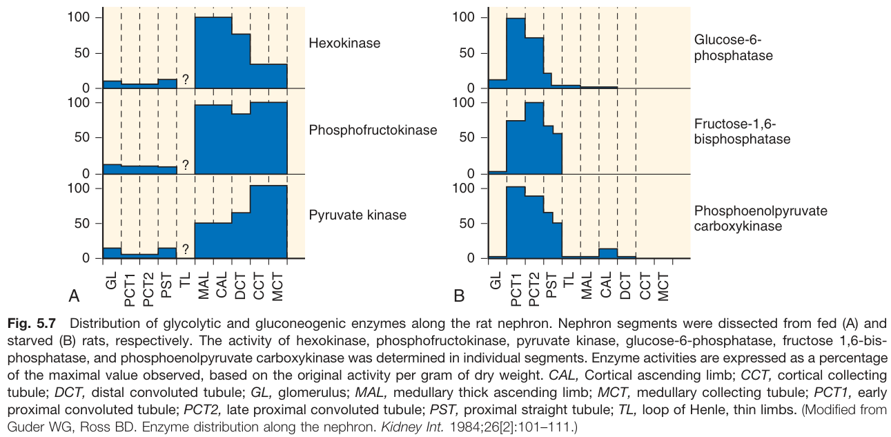

Fig. 5.7 Distribution of glycolytic and gluconeogenic enzymes along the rat nephron. Nephron segments were dissected from fed (A) and starved (B) rats, respectively. The activity of hexokinase, phosphofructokinase, pyruvate kinase, glucose-6-phosphatase, fructose 1,6-bis-phosphatase, and phosphoenolpyruvate carboxykinase was determined in individual segments. Enzyme activities are expressed as a percentage of the maximal value observed, based on the original activity per gram of dry weight. CAL, Cortical ascending limb; CCT, cortical collecting tubule; DCT, distal convoluted tubule; GL, glomerulus; MAL, medullary thick ascending limb; MCT, medullary collecting tubule; PCT1, early proximal convoluted tubule; PCT2, late proximal convoluted tubule; PST, proximal straight tubule; TL, loop of Henle, thin limbs. (Modified from Guder WG, Ross BD. Enzyme distribution along the nephron. Kidney Int. 1984;26[2]:101-111.)

---

### Fig_5_8

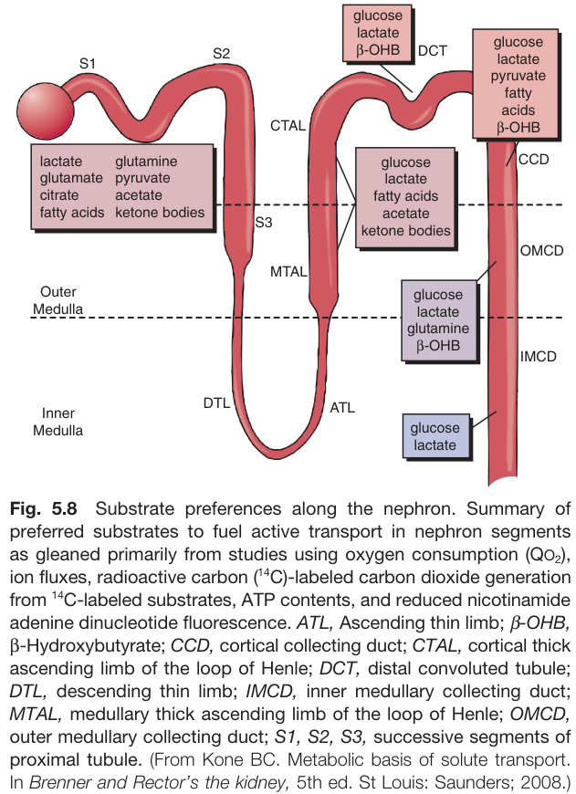

Fig. 5.8 Substrate preferences along the nephron. Summary of preferred substrates to fuel active transport in nephron segments as gleaned primarily from studies using oxygen consumption (QO2), ion fluxes, radioactive carbon (14C)-labeled carbon dioxide generation from 14C-labeled substrates, ATP contents, and reduced nicotinamide adenine dinucleotide fluorescence. ATL, Ascending thin limb; ẞ-OHB, ẞ-Hydroxybutyrate; CCD, cortical collecting duct; CTAL, cortical thick ascending limb of the loop of Henle; DCT, distal convoluted tubule; DTL, descending thin limb; IMCD, inner medullary collecting duct; MTAL, medullary thick ascending limb of the loop of Henle; OMCD, outer medullary collecting duct; S1, S2, S3, successive segments of proximal tubule. (From Kone BC. Metabolic basis of solute transport. In Brenner and Rector's the kidney, 5th ed. St Louis: Saunders; 2008.)

---

### Fig_5_9

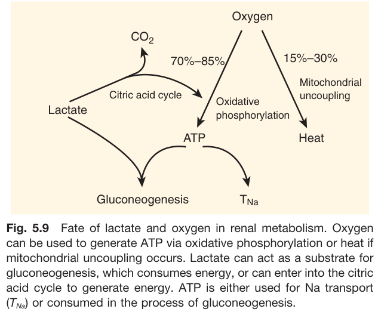

Fig. 5.9 Fate of lactate and oxygen in renal metabolism. Oxygen can be used to generate ATP via oxidative phosphorylation or heat if mitochondrial uncoupling occurs. Lactate can act as a substrate for gluconeogenesis, which consumes energy, or can enter into the citric acid cycle to generate energy. ATP is either used for Na transport (TNa) or consumed in the process of gluconeogenesis.

---

### Fig_5_10

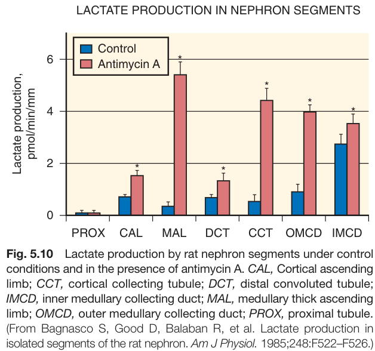

Fig. 5.10 Lactate production by rat nephron segments under control conditions and in the presence of antimycin A. CAL, Cortical ascending limb; CCT, cortical collecting tubule; DCT, distal convoluted tubule; IMCD, inner medullary collecting duct; MAL, medullary thick ascending limb; OMCD, outer medullary collecting duct; PROX, proximal tubule. (From Bagnasco S, Good D, Balaban R, et al. Lactate production in isolated segments of the rat nephron. Am J Physiol. 1985;248:F522-F526.)

---

### Fig_5_11

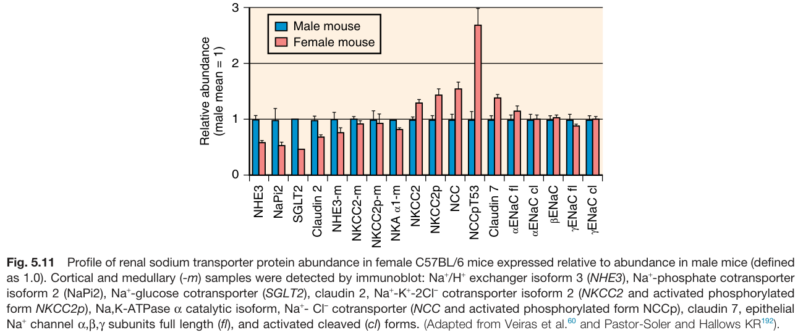

Fig. 5.11 Profile of renal sodium transporter protein abundance in female C57BL/6 mice expressed relative to abundance in male mice (defined as 1.0). Cortical and medullary (-m) samples were detected by immunoblot: Na+/H+ exchanger isoform 3 (NHE3), Nat-phosphate cotransporter isoform 2 (NaPi2), Nat-glucose cotransporter (SGLT2), claudin 2, Na+-K+-2CI cotransporter isoform 2 (NKCC2 and activated phosphorylated form NKCC2p), Na, K-ATPase a catalytic isoform, Na+- Cl cotransporter (NCC and activated phosphorylated form NCCp), claudin 7, epithelial Na+ channel α,β,γ subunits full length (fl), and activated cleaved (cl) forms. (Adapted from Veiras et al. and Pastor-Soler and Hallows KR).

---

### Fig_5_12

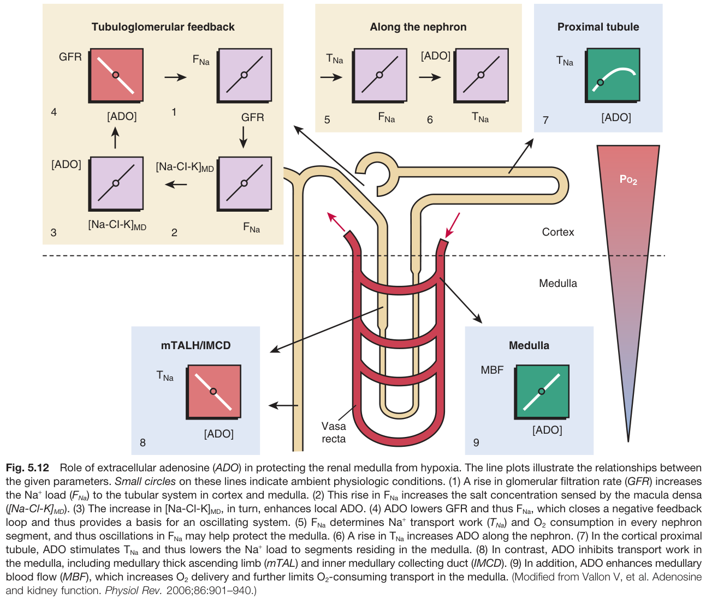

Fig. 5.12 Role of extracellular adenosine (ADO) in protecting the renal medulla from hypoxia. The line plots illustrate the relationships between the given parameters. Small circles on these lines indicate ambient physiologic conditions. (1) A rise in glomerular filtration rate (GFR) increases the Nat load (FNa) to the tubular system in cortex and medulla. (2) This rise in FNa increases the salt concentration sensed by the macula densa ([Na-CI-K]MD). (3) The increase in [Na-CI-K]MD, in turn, enhances local ADO. (4) ADO lowers GFR and thus FNa, which closes a negative feedback loop and thus provides a basis for an oscillating system. (5) FNa determines Nat transport work (TNa) and O2 consumption in every nephron segment, and thus oscillations in FNa may help protect the medulla. (6) A rise in TNa increases ADO along the nephron. (7) In the cortical proximal tubule, ADO stimulates TNa and thus lowers the Nat load to segments residing in the medulla. (8) In contrast, ADO inhibits transport work in the medulla, including medullary thick ascending limb (mTAL) and inner medullary collecting duct (IMCD). (9) In addition, ADO enhances medullary blood flow (MBF), which increases O2 delivery and further limits O2-consuming transport in the medulla. (Modified from Vallon V, et al. Adenosine and kidney function. Physiol Rev. 2006;86:901-940.)

---

### Fig_5_13

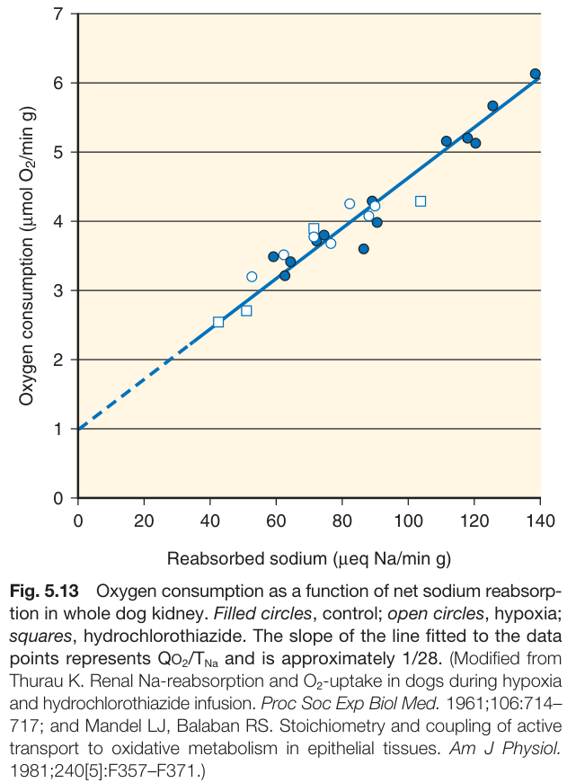

Fig. 5.13 Oxygen consumption as a function of net sodium reabsorption in whole dog kidney. Filled circles, control; open circles, hypoxia; squares, hydrochlorothiazide. The slope of the line fitted to the data points represents QO2/TNa and is approximately 1/28. (Modified from Thurau K. Renal Na-reabsorption and O2-uptake in dogs during hypoxia and hydrochlorothiazide infusion. Proc Soc Exp Biol Med. 1961;106:714-717; and Mandel LJ, Balaban RS. Stoichiometry and coupling of active transport to oxidative metabolism in epithelial tissues. Am J Physiol. 1981;240[5]:F357-F371.)

---

### Fig_5_14

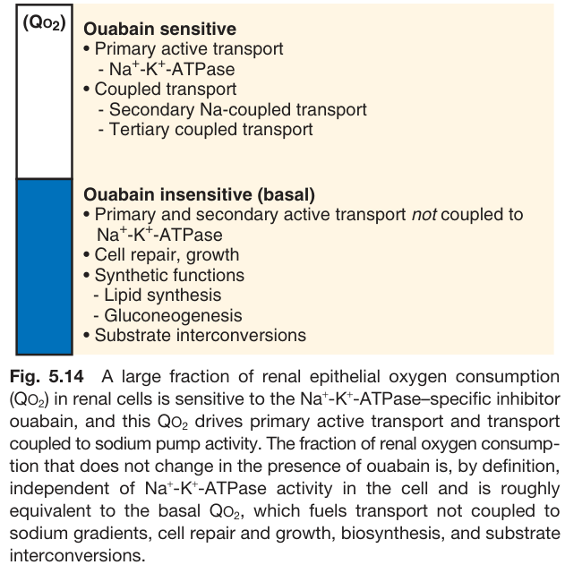

Fig. 5.14 A large fraction of renal epithelial oxygen consumption (QO2) in renal cells is sensitive to the Na+-K+-ATPase-specific inhibitor ouabain, and this QO2 drives primary active transport and transport coupled to sodium pump activity. The fraction of renal oxygen consumption that does not change in the presence of ouabain is, by definition, independent of Na+-K+-ATPase activity in the cell and is roughly equivalent to the basal QO2, which fuels transport not coupled to sodium gradients, cell repair and growth, biosynthesis, and substrate interconversions.

---

### Fig_5_15

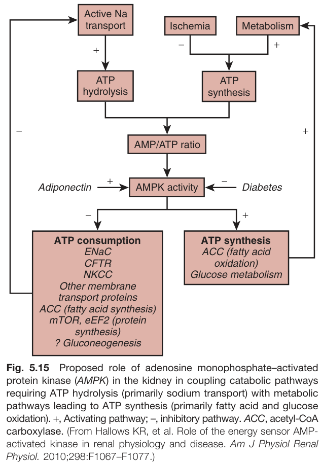

Fig. 5.15 Proposed role of adenosine monophosphate-activated protein kinase (AMPK) in the kidney in coupling catabolic pathways requiring ATP hydrolysis (primarily sodium transport) with metabolic pathways leading to ATP synthesis (primarily fatty acid and glucose oxidation). +, Activating pathway; -, inhibitory pathway. ACC, acetyl-CoA carboxylase. (From Hallows KR, et al. Role of the energy sensor AMP-activated kinase in renal physiology and disease. Am J Physiol Renal Physiol. 2010;298:F1067-F1077.)

---

## Tables

### Table_5_1

#### Table Image

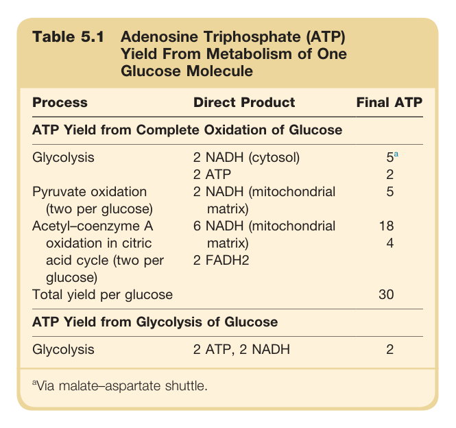

#### Table Data (CSV: [Table_5_1.csv](Table_5_1.csv))

```markdown
| Table Text (OCR) |
| :--- |
| Table 5.1 Adenosine Triphosphate (ATP) Yield From Metabolism of One Glucose Molecule |
```

Table 5.1 Adenosine Triphosphate (ATP) Yield From Metabolism of One Glucose Molecule | Process | Direct Product | Final ATP | | :--- | :--- | :--- | | **ATP Yield from Complete Oxidation of Glucose** | | | | Glycolysis | 2 NADH (cytosol) | 5a | | | 2 ATP | 2 | | Pyruvate oxidation (two per glucose) | 2 NADH (mitochondrial matrix) | 5 | | Acetyl-coenzyme A oxidation in citric acid cycle (two per glucose) | 6 NADH (mitochondrial matrix) | 18 | | | 2 FADH2 | 4 | | **Total yield per glucose** | | **30** | | **ATP Yield from Glycolysis of Glucose** | | | | Glycolysis | 2 ATP, 2 NADH | 2 | | aVia malate-aspartate shuttle. | | |

---

### Table_5_2

#### Table Image

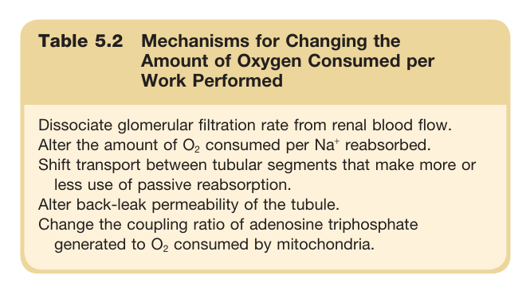

#### Table Data (CSV: [Table_5_2.csv](Table_5_2.csv))

```markdown
| Table Text (OCR) |
| :--- |
| Table 5.2 Mechanisms for Changing the Amount of Oxygen Consumed per Work Performed Dissociate glomerular filtration rate from renal blood flow. Alter the amount of O consumed per Na<sup>+</sup> reabsorbed. Shift transport between tubular segments that make more or less use of passive reabsorption. Alter back-leak permeability of the tubule. Change the coupling ratio of adenosine triphosphate generated to O<sub>2</sub> consumed by mitochondria. |
```

Table 5.2 Mechanisms for Changing the Amount of Oxygen Consumed per Work Performed * Dissociate glomerular filtration rate from renal blood flow. * Alter the amount of O2 consumed per Na+ reabsorbed. * Shift transport between tubular segments that make more or less use of passive reabsorption. * Alter back-leak permeability of the tubule. * Change the coupling ratio of adenosine triphosphate generated to O2 consumed by mitochondria.

---
