# 06. Transport of Sodium, Chloride, and Potassium - Figures and Tables Index

This document lists all figures and tables extracted from `06. Transport of Sodium, Chloride, and Potassium.pdf`.

## Table of Contents
- [Figures](#figures)
- [Tables](#tables)

---

## Figures

### Fig_6_1

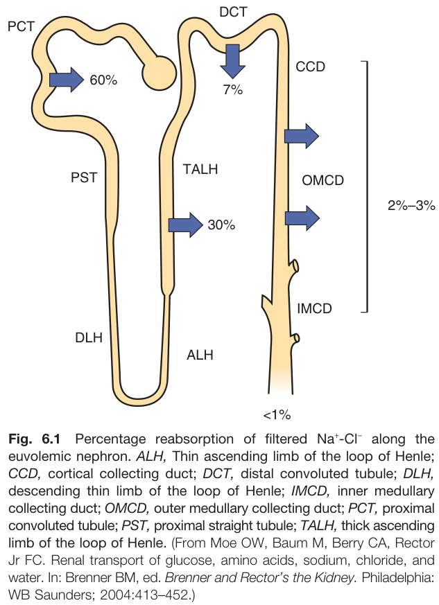

Fig. 6.1 Percentage reabsorption of filtered Na+-CI along the euvolemic nephron. ALH, Thin ascending limb of the loop of Henle; CCD, cortical collecting duct; DCT, distal convoluted tubule; DLH, descending thin limb of the loop of Henle; IMCD, inner medullary collecting duct; OMCD, outer medullary collecting duct; PCT, proximal convoluted tubule; PST, proximal straight tubule; TALH, thick ascending limb of the loop of Henle. (From Moe OW, Baum M, Berry CA, Rector Jr FC. Renal transport of glucose, amino acids, sodium, chloride, and water. In: Brenner BM, ed. Brenner and Rector's the Kidney. Philadelphia: WB Saunders; 2004:413-452.)

---

### Fig_6_2

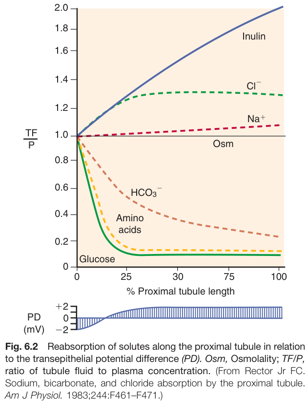

Fig. 6.2 Reabsorption of solutes along the proximal tubule in relation to the transepithelial potential difference (PD). Osm, Osmolality; TF/P, ratio of tubule fluid to plasma concentration. (From Rector Jr FC. Sodium, bicarbonate, and chloride absorption by the proximal tubule. Am J Physiol. 1983;244:F461-F471.)

---

### Fig_6_3

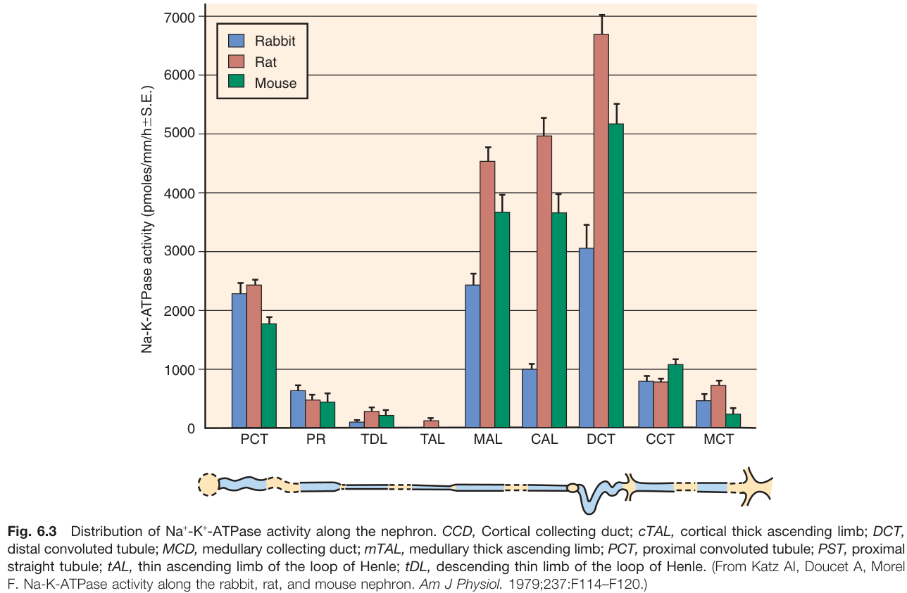

Fig. 6.3 Distribution of Na+-K+-ATPase activity along the nephron. CCD, Cortical collecting duct; cTAL, cortical thick ascending limb; DCT, distal convoluted tubule; MCD, medullary collecting duct; mTAL, medullary thick ascending limb; PCT, proximal convoluted tubule; PST, proximal straight tubule; tAL, thin ascending limb of the loop of Henle; tDL, descending thin limb of the loop of Henle. (From Katz Al, Doucet A, Morel F. Na-K-ATPase activity along the rabbit, rat, and mouse nephron. Am J Physiol. 1979;237:F114-F120.)

---

### Fig_6_4

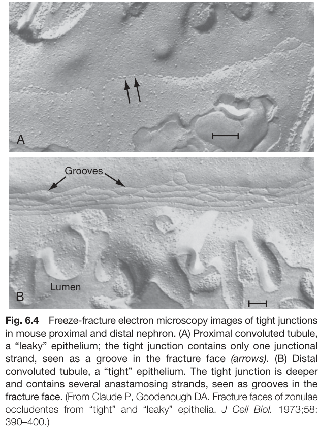

Fig. 6.4 Freeze-fracture electron microscopy images of tight junctions in mouse proximal and distal nephron. (A) Proximal convoluted tubule, a "leaky" epithelium; the tight junction contains only one junctional strand, seen as a groove in the fracture face (arrows). (B) Distal convoluted tubule, a "tight" epithelium. The tight junction is deeper and contains several anastamosing strands, seen as grooves in the fracture face. (From Claude P, Goodenough DA. Fracture faces of zonulae occludentes from "tight" and "leaky" epithelia. J Cell Biol. 1973;58: 390-400.)

---

### Fig_6_5

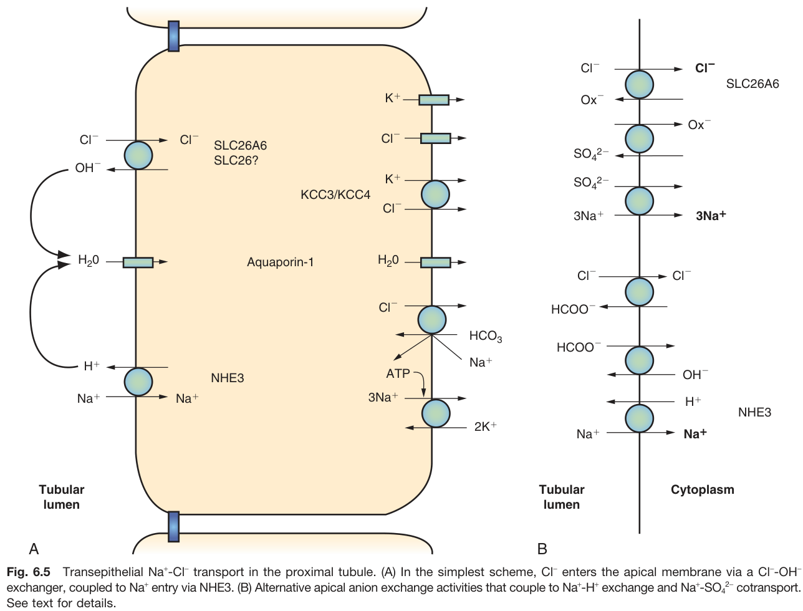

Fig. 6.5 Transepithelial Na+-Cl transport in the proximal tubule. (A) In the simplest scheme, Cl enters the apical membrane via a CI--OH- exchanger, coupled to Nat entry via NHE3. (B) Alternative apical anion exchange activities that couple to Na+-H+ exchange and Na+-SO42- cotransport. See text for details.

---

### Fig_6_6

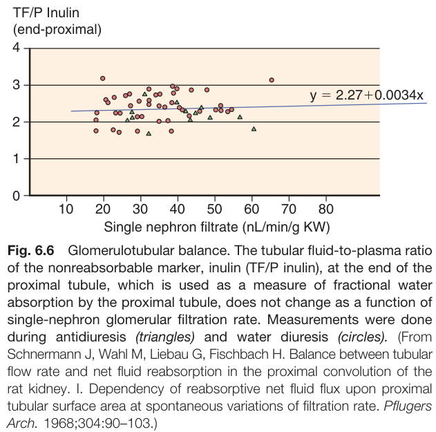

Fig. 6.6 Glomerulotubular balance. The tubular fluid-to-plasma ratio of the nonreabsorbable marker, inulin (TF/P inulin), at the end of the proximal tubule, which is used as a measure of fractional water absorption by the proximal tubule, does not change as a function of single-nephron glomerular filtration rate. Measurements were done during antidiuresis (triangles) and water diuresis (circles). (From Schnermann J, Wahl M, Liebau G, Fischbach H. Balance between tubular flow rate and net fluid reabsorption in the proximal convolution of the rat kidney. I. Dependency of reabsorptive net fluid flux upon proximal tubular surface area at spontaneous variations of filtration rate. Pflugers Arch. 1968;304:90-103.)

---

### Fig_6_7

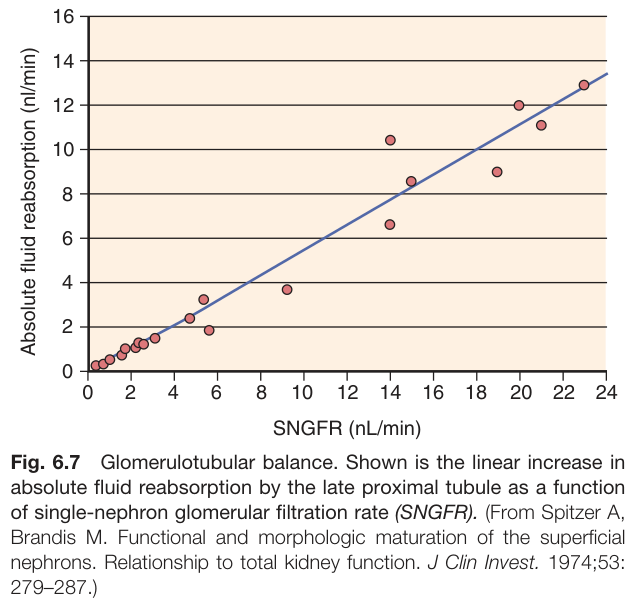

Fig. 6.7 Glomerulotubular balance. Shown is the linear increase in absolute fluid reabsorption by the late proximal tubule as a function of single-nephron glomerular filtration rate (SNGFR). (From Spitzer A, Brandis M. Functional and morphologic maturation of the superficial nephrons. Relationship to total kidney function. J Clin Invest. 1974;53: 279-287.)

---

### Fig_6_8

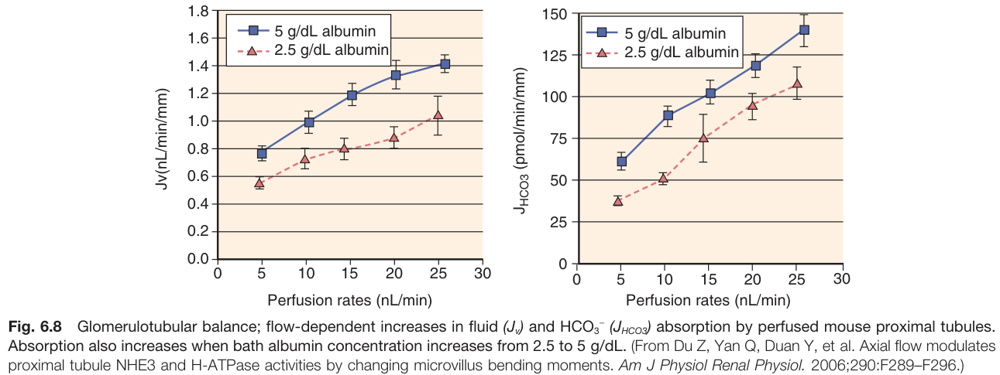

Fig. 6.8 Glomerulotubular balance; flow-dependent increases in fluid (J) and HCO3 (JHCO3) absorption by perfused mouse proximal tubules. Absorption also increases when bath albumin concentration increases from 2.5 to 5 g/dL. (From Du Z, Yan Q, Duan Y, et al. Axial flow modulates proximal tubule NHE3 and H-ATPase activities by changing microvillus bending moments. Am J Physiol Renal Physiol. 2006;290:F289-F296.)

---

### Fig_6_9

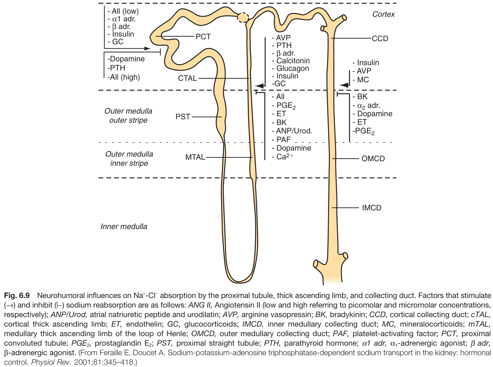

Fig. 6.9 Neurohumoral influences on Na+-Cl absorption by the proximal tubule, thick ascending limb, and collecting duct. Factors that stimulate (→) and inhibit (l-) sodium reabsorption are as follows: ANG II, Angiotensin II (low and high referring to picomolar and micromolar concentrations, respectively); ANP/Urod, atrial natriuretic peptide and urodilatin; AVP, arginine vasopressin; BK, bradykinin; CCD, cortical collecting duct; cTAL, cortical thick ascending limb; ET, endothelin; GC, glucocorticoids; IMCD, inner medullary collecting duct; MC, mineralocorticoids; mTAL, medullary thick ascending limb of the loop of Henle; OMCD, outer medullary collecting duct; PAF, platelet-activating factor; PCT, proximal convoluted tubule; PGE2, prostaglandin E2; PST, proximal straight tubule; PTH, parathyroid hormone; a1 adr, a₁-adrenergic agonist; ẞ adr, ẞ-adrenergic agonist. (From Feraille E, Doucet A. Sodium-potassium-adenosine triphosphatase-dependent sodium transport in the kidney: hormonal control. Physiol Rev. 2001;81:345-418.)

---

### Fig_6_10

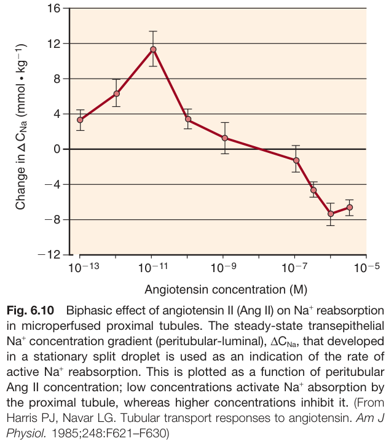

Fig. 6.10 Biphasic effect of angiotensin II (Ang II) on Na+ reabsorption in microperfused proximal tubules. The steady-state transepithelial Nat concentration gradient (peritubular-luminal), ACNa, that developed in a stationary split droplet is used as an indication of the rate of active Na+ reabsorption. This is plotted as a function of peritubular Ang II concentration; low concentrations activate Nat absorption by the proximal tubule, whereas higher concentrations inhibit it. (From Harris PJ, Navar LG. Tubular transport responses to angiotensin. Am J Physiol. 1985;248:F621-F630)

---

### Fig_6_11

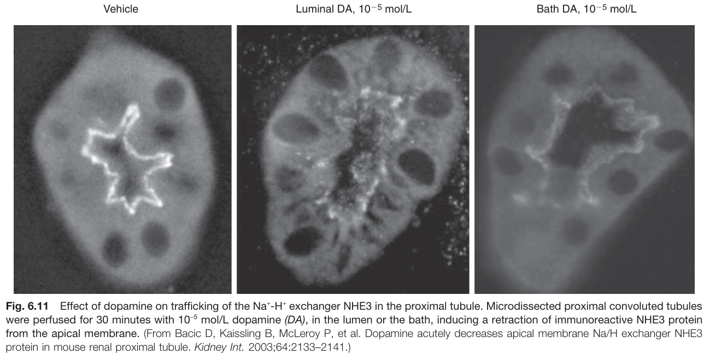

Fig. 6.11 Effect of dopamine on trafficking of the Na+-H+ exchanger NHE3 in the proximal tubule. Microdissected proximal convoluted tubules were perfused for 30 minutes with 105 mol/L dopamine (DA), in the lumen or the bath, inducing a retraction of immunoreactive NHE3 protein from the apical membrane. (From Bacic D, Kaissling B, McLeroy P, et al. Dopamine acutely decreases apical membrane Na/H exchanger NHE3 protein in mouse renal proximal tubule. Kidney Int. 2003;64:2133-2141.)

---

### Fig_6_12

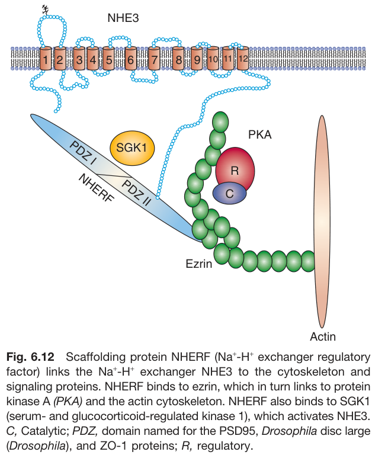

Fig. 6.12 Scaffolding protein NHERF (Na+-H+ exchanger regulatory factor) links the Nat-H+ exchanger NHE3 to the cytoskeleton and signaling proteins. NHERF binds to ezrin, which in turn links to protein kinase A (PKA) and the actin cytoskeleton. NHERF also binds to SGK1 (serum- and glucocorticoid-regulated kinase 1), which activates NHE3. C, Catalytic; PDZ, domain named for the PSD95, Drosophila disc large (Drosophila), and ZO-1 proteins; R, regulatory.

---

### Fig_6_13

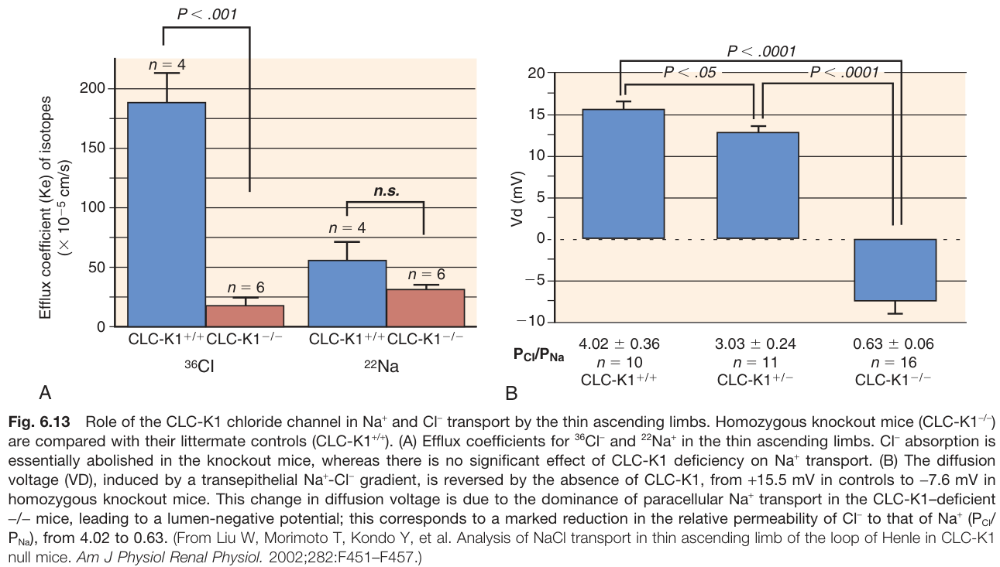

Fig. 6.13 Role of the CLC-K1 chloride channel in Nat and Cl transport by the thin ascending limbs. Homozygous knockout mice (CLC-K1) are compared with their littermate controls (CLC-K1++). (A) Efflux coefficients for 36Cl and 22Na+ in the thin ascending limbs. Cl absorption is essentially abolished in the knockout mice, whereas there is no significant effect of CLC-K1 deficiency on Nat transport. (B) The diffusion voltage (VD), induced by a transepithelial Na+-Cl gradient, is reversed by the absence of CLC-K1, from +15.5 mV in controls to -7.6 mV in homozygous knockout mice. This change in diffusion voltage is due to the dominance of paracellular Na+ transport in the CLC-K1-deficient -/- mice, leading to a lumen-negative potential; this corresponds to a marked reduction in the relative permeability of Cl to that of Na+ (Pc/PNa), from 4.02 to 0.63. (From Liu W, Morimoto T, Kondo Y, et al. Analysis of NaCl transport in thin ascending limb of the loop of Henle in CLC-K1 null mice. Am J Physiol Renal Physiol. 2002;282:F451-F457.)

---

### Fig_6_14

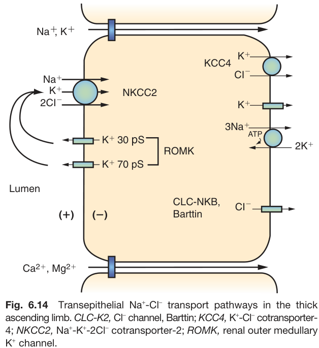

Fig. 6.14 Transepithelial Na+-Cl transport pathways in the thick ascending limb. CLC-K2, Cl channel, Barttin; KCC4, K+-Cl cotransporter-4; NKCC2, Na+-K+-2Cl- cotransporter-2; ROMK, renal outer medullary K+ channel.

---

### Fig_6_15

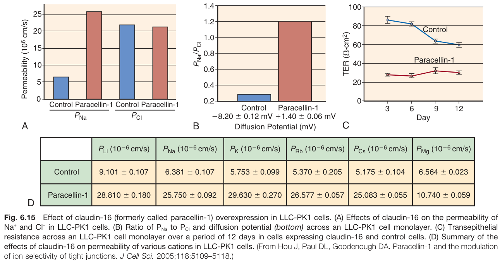

Fig. 6.15 Effect of claudin-16 (formerly called paracellin-1) overexpression in LLC-PK1 cells. (A) Effects of claudin-16 on the permeability of Nat and Cl in LLC-PK1 cells. (B) Ratio of PNa to Pci and diffusion potential (bottom) across an LLC-PK1 cell monolayer. (C) Transepithelial resistance across an LLC-PK1 cell monolayer over a period of 12 days in cells expressing claudin-16 and control cells. (D) Summary of the effects of claudin-16 on permeability of various cations in LLC-PK1 cells. (From Hou J, Paul DL, Goodenough DA. Paracellin-1 and the modulation of ion selectivity of tight junctions. J Cell Sci. 2005;118:5109-5118.)

---

### Fig_6_16

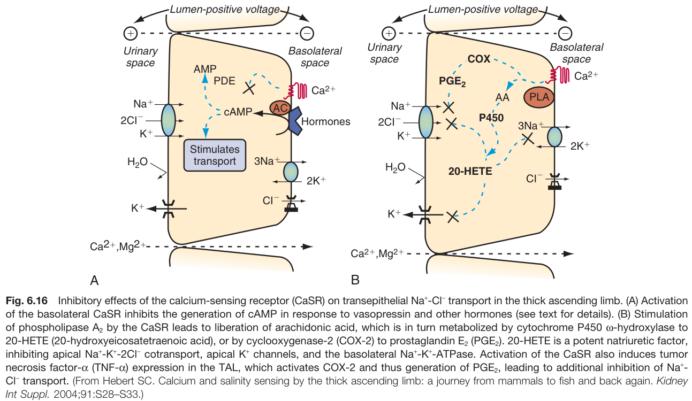

Fig. 6.16 Inhibitory effects of the calcium-sensing receptor (CaSR) on transepithelial Na+-Cl transport in the thick ascending limb. (A) Activation of the basolateral CaSR inhibits the generation of cAMP in response to vasopressin and other hormones (see text for details). (B) Stimulation of phospholipase A2 by the CaSR leads to liberation of arachidonic acid, which is in turn metabolized by cytochrome P450 w-hydroxylase to 20-HETE (20-hydroxyeicosatetraenoic acid), or by cyclooxygenase-2 (COX-2) to prostaglandin E2 (PGE2). 20-HETE is a potent natriuretic factor, inhibiting apical Na+-K+-2CI cotransport, apical K+ channels, and the basolateral Na+-K+-ATPase. Activation of the CaSR also induces tumor necrosis factor-a (TNF-α) expression in the TAL, which activates COX-2 and thus generation of PGE2, leading to additional inhibition of Na+-CI transport. (From Hebert SC. Calcium and salinity sensing by the thick ascending limb: a journey from mammals to fish and back again. Kidney Int Suppl. 2004;91:S28-S33.)

---

### Fig_6_17

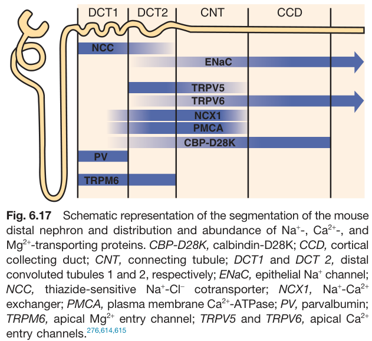

Fig. 6.17 Schematic representation of the segmentation of the mouse distal nephron and distribution and abundance of Na+, Ca2+-, and Mg2+-transporting proteins. CBP-D28K, calbindin-D28K; CCD, cortical collecting duct; CNT, connecting tubule; DCT1 and DCT 2, distal convoluted tubules 1 and 2, respectively; ENaC, epithelial Na+ channel; NCC, thiazide-sensitive Na+-Cl cotransporter; NCX1, Na+-Ca2+ exchanger; PMCA, plasma membrane Ca²+-ATPase; PV, parvalbumin; TRPM6, apical Mg2+ entry channel; TRPV5 and TRPV6, apical Ca2+ entry channels.

---

### Fig_6_18

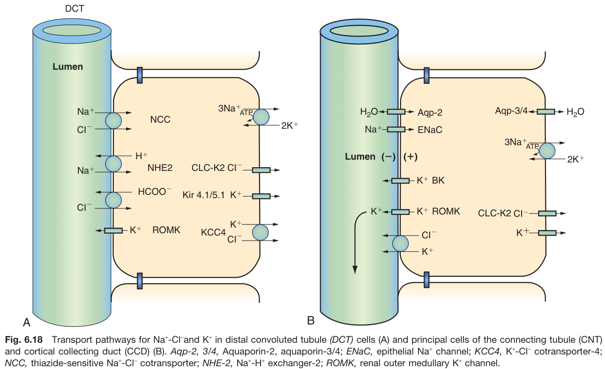

Fig. 6.18 Transport pathways for Nat-Cl and K+ in distal convoluted tubule (DCT) cells (A) and principal cells of the connecting tubule (CNT) and cortical collecting duct (CCD) (B). Aqp-2, 3/4, Aquaporin-2, aquaporin-3/4; ENaC, epithelial Nat channel; KCC4, K+-CI cotransporter-4; NCC, thiazide-sensitive Na+-Cl cotransporter; NHE-2, Na+-H+ exchanger-2; ROMK, renal outer medullary K+ channel.

---

### Fig_6_19

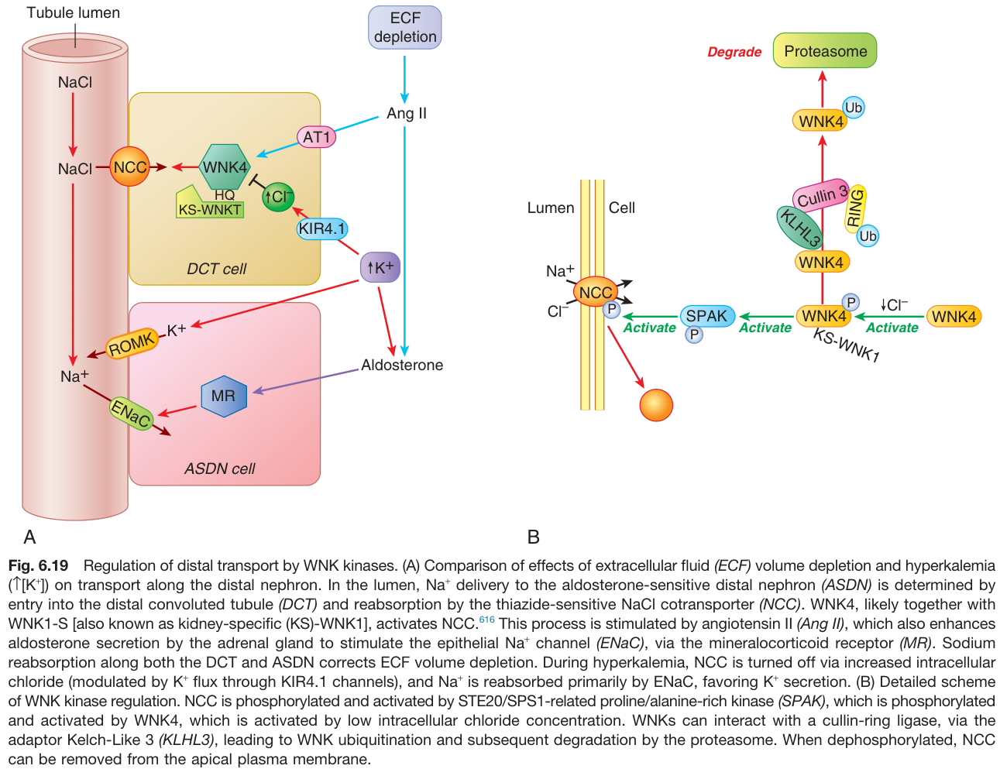

Fig. 6.19 Regulation of distal transport by WNK kinases. (A) Comparison of effects of extracellular fluid (ECF) volume depletion and hyperkalemia (↑[K+]) on transport along the distal nephron. In the lumen, Nat delivery to the aldosterone-sensitive distal nephron (ASDN) is determined by entry into the distal convoluted tubule (DCT) and reabsorption by the thiazide-sensitive NaCl cotransporter (NCC). WNK4, likely together with WNK1-S [also known as kidney-specific (KS)-WNK1], activates NCC. This process is stimulated by angiotensin II (Ang II), which also enhances aldosterone secretion by the adrenal gland to stimulate the epithelial Na+ channel (ENaC), via the mineralocorticoid receptor (MR). Sodium reabsorption along both the DCT and ASDN corrects ECF volume depletion. During hyperkalemia, NCC is turned off via increased intracellular chloride (modulated by K+ flux through KIR4.1 channels), and Nat is reabsorbed primarily by ENaC, favoring K+ secretion. (B) Detailed scheme of WNK kinase regulation. NCC is phosphorylated and activated by STE20/SPS1-related proline/alanine-rich kinase (SPAK), which is phosphorylated and activated by WNK4, which is activated by low intracellular chloride concentration. WNKs can interact with a cullin-ring ligase, via the adaptor Kelch-Like 3 (KLHL3), leading to WNK ubiquitination and subsequent degradation by the proteasome. When dephosphorylated, NCC can be removed from the apical plasma membrane.

---

### Fig_6_20

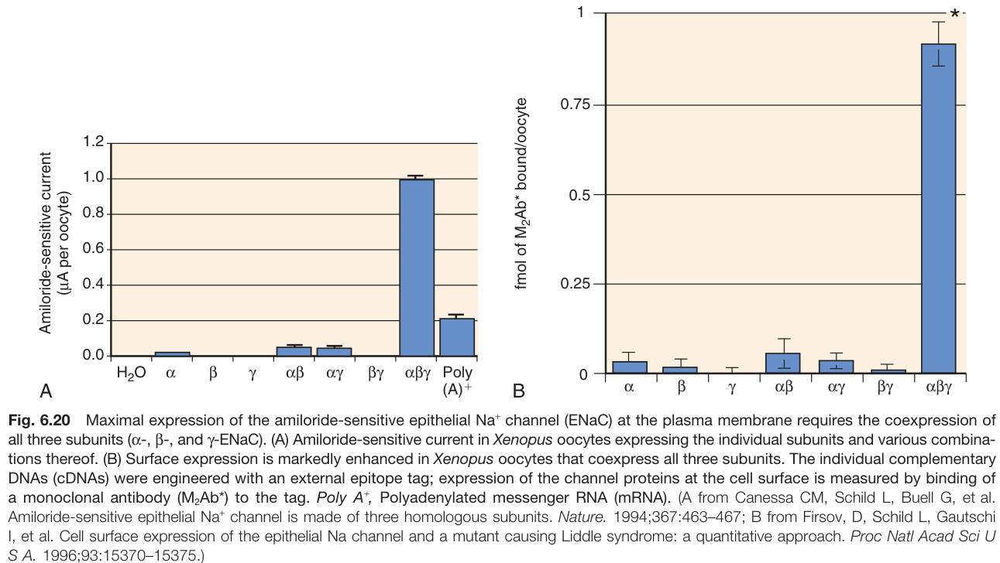

Fig. 6.20 Maximal expression of the amiloride-sensitive epithelial Nat channel (ENaC) at the plasma membrane requires the coexpression of all three subunits (α-, β-, and y-ENaC). (A) Amiloride-sensitive current in Xenopus oocytes expressing the individual subunits and various combinations thereof. (B) Surface expression is markedly enhanced in Xenopus oocytes that coexpress all three subunits. The individual complementary DNAs (cDNAs) were engineered with an external epitope tag; expression of the channel proteins at the cell surface is measured by binding of a monoclonal antibody (M2Ab*) to the tag. Poly A+, Polyadenylated messenger RNA (mRNA). (A from Canessa CM, Schild L, Buell G, et al. Amiloride-sensitive epithelial Nat channel is made of three homologous subunits. Nature. 1994;367:463-467; B from Firsov, D, Schild L, Gautschi I, et al. Cell surface expression of the epithelial Na channel and a mutant causing Liddle syndrome: a quantitative approach. Proc Natl Acad Sci U SA. 1996;93:15370-15375.)

---

### Fig_6_21

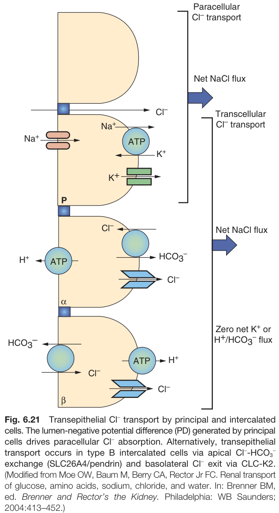

Fig. 6.21 Transepithelial Cl transport by principal and intercalated cells. The lumen-negative potential difference (PD) generated by principal cells drives paracellular Cl absorption. Alternatively, transepithelial transport occurs in type B intercalated cells via apical CI--HCO3 exchange (SLC26A4/pendrin) and basolateral Cl exit via CLC-K2. (Modified from Moe OW, Baum M, Berry CA, Rector Jr FC. Renal transport of glucose, amino acids, sodium, chloride, and water. In: Brenner BM, ed. Brenner and Rector's the Kidney. Philadelphia: WB Saunders; 2004:413-452.)

---

### Fig_6_22

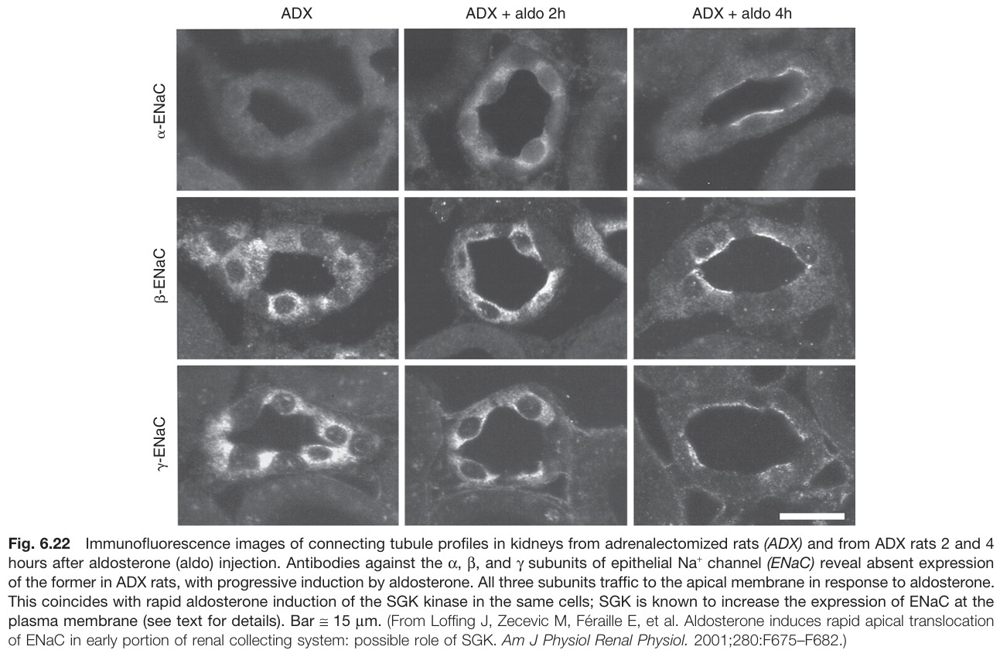

Fig. 6.22 Immunofluorescence images of connecting tubule profiles in kidneys from adrenalectomized rats (ADX) and from ADX rats 2 and 4 hours after aldosterone (aldo) injection. Antibodies against the α, β, and y subunits of epithelial Na+ channel (ENaC) reveal absent expression of the former in ADX rats, with progressive induction by aldosterone. All three subunits traffic to the apical membrane in response to aldosterone. This coincides with rapid aldosterone induction of the SGK kinase in the same cells; SGK is known to increase the expression of ENaC at the plasma membrane (see text for details). Bar = 15 µm. (From Loffing J, Zecevic M, Féraille E, et al. Aldosterone induces rapid apical translocation of ENaC in early portion of renal collecting system: possible role of SGK. Am J Physiol Renal Physiol. 2001;280:F675-F682.)

---

### Fig_6_23

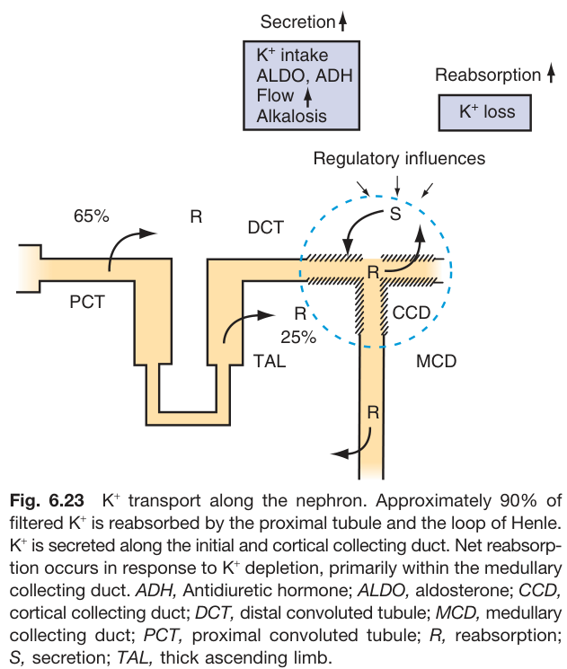

Fig. 6.23 K+ transport along the nephron. Approximately 90% of filtered K+ is reabsorbed by the proximal tubule and the loop of Henle. K+ is secreted along the initial and cortical collecting duct. Net reabsorption occurs in response to K+ depletion, primarily within the medullary collecting duct. ADH, Antidiuretic hormone; ALDO, aldosterone; CCD, cortical collecting duct; DCT, distal convoluted tubule; MCD, medullary collecting duct; PCT, proximal convoluted tubule; R, reabsorption; S, secretion; TAL, thick ascending limb.

---

### Fig_6_24

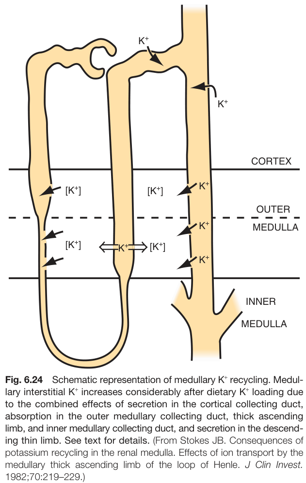

Fig. 6.24 Schematic representation of medullary K+ recycling. Medullary interstitial K+ increases considerably after dietary K+ loading due to the combined effects of secretion in the cortical collecting duct, absorption in the outer medullary collecting duct, thick ascending limb, and inner medullary collecting duct, and secretion in the descending thin limb. See text for details. (From Stokes JB. Consequences of potassium recycling in the renal medulla. Effects of ion transport by the medullary thick ascending limb of the loop of Henle. J Clin Invest. 1982;70:219-229.)

---

## Tables

### Table_6_1

#### Table Image

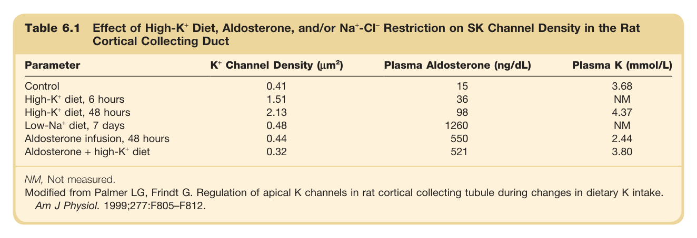

#### Table Data (CSV: [Table_6_1.csv](Table_6_1.csv))

```markdown
| Table Text (OCR) |
| :--- |
| Table 6.1 Effect of High-K<sup>+</sup> Diet, Aldosterone, and/or Na<sup>+</sup>-Cl<sup>−</sup> Restriction on SK Channel Density in the Rat Cortical Collecting Duct  NM, Not measured. Modified from Palmer LG, Frindt G. Regulation of apical K channels in rat cortical collecting tubule during changes in dietary K intake. Am J Physiol. 1999;277:F805–F812. |
```

Table 6.1 Effect of High-K+ Diet, Aldosterone, and/or Na+-CI Restriction on SK Channel Density in the Rat Cortical Collecting Duct | Parameter | K+ Channel Density (µm²) | Plasma Aldosterone (ng/dL) | Plasma K (mmol/L) | | :----------------------------------------------------------- | :----------------------- | :------------------------- | :---------------- | | Control | 0.41 | 15 | 3.68 | | High-K+ diet, 6 hours | 1.51 | 36 | NM | | High-K+ diet, 48 hours | 2.13 | 98 | 4.37 | | Low-Na+ diet, 7 days | 0.48 | 1260 | NM | | Aldosterone infusion, 48 hours | 0.44 | 550 | 2.44 | | Aldosterone + high-K+ diet | 0.32 | 521 | 3.80 | | *NM, Not measured.* | | | | | *Modified from Palmer LG, Frindt G. Regulation of apical K channels in rat cortical collecting tubule during changes in dietary K intake. Am J Physiol. 1999;277:F805-F812.* | | | | | <!-- audiobook-skip-end --> | | | | #### K+ Deprivation A reduction in dietary K+ leads within 24 hours to a dramatic drop in urinary K+ excretion. This drop in excretion is due to both an induction of reabsorption by intercalated cells in the OMCD and to a reduction in SK channel activity in principal cells. The mechanisms involved in K+ reabsorption by intercalated cells are discussed earlier; notably, H+/K+-ATPase activity in the collecting duct does not appear to be regulated by aldosterone. Considerable progress has been made in defining the signaling pathways that regulate the activity of the SK channel (ROMK) in response to changes in dietary K+. Dietary K+ intake modulates trafficking of the ROMK channel protein to the plasma membrane of principal cells, with a marked increase in the relative proportion of intracellular channel protein in K+-depleted animals and clearly defined expression at the plasma membrane of CCD cells from animals on a high-K+ diet. The membrane insertion and activity of ROMK are modulated by tyrosine phosphorylation of the channel protein, such that phosphorylation of tyrosine residue 337 stimulates endocytosis and dephosphorylation induces exocytosis; this tyrosine phosphorylation appears to play a key role in the regulation of ROMK by dietary K+. Whereas the levels of protein tyrosine phosphatase-1D do not vary with K+ intake, intrarenal activity of the cytoplasmic tyrosine kinases c-src and c-yes are inversely related to dietary K+ intake, with a decrease under high-K+ conditions and a marked increase after several days of K+ restriction. Localization studies have indicated coexpression of c-src with ROMK in the TAL and principal cells of the CCD. Moreover, inhibition of protein tyrosine phosphatase activity, leading to a dominance of tyrosine phosphorylation, dramatically increases the proportion of intracellular ROMK in the CCD of animals on a high-K+ diet. The neurohumoral factors that induce the K⁺-dependent trafficking and expression of apical ROMK and BK channels have only come into focus rather recently. Several studies have implicated the intrarenal generation of superoxide anions in the activation of cytoplasmic tyrosine kinases. Potential candidates for the upstream kaliuretic factor include Ang II and growth factors such as IGF-1. Ang II inhibits ROMK activity in K⁺-restricted rats, but not rats on a normal K+ diet. This inhibition involves downstream activation of superoxide production and c-src activity, such that the well-known induction of Ang II by a low-K+ diet appears to play a major role in reducing distal tubular K+ secretion. Reports of transient postprandial kaliuresis in sheep, independent of changes in plasma K+ or aldosterone, have suggested that an enteric or hepatoportal K+ sensor controls kaliuresis via a sympathetic reflex; tissue kallikrein (TK) has recently emerged as a candidate mediator for this postprandial kaliuresis (see later). Regardless of the signaling involved, changes in dietary K+ absorption have a direct anticipatory effect on K+ homeostasis in the absence of changes in plasma K+. Such a feed-forward control has the theoretical advantage of greater stability because it operates prior to changes in plasma K+. Notably, changes in ROMK phosphorylation status and insulin-sensitive muscle uptake can be seen in K+-deficient animals in the absence of a change in plasma K+, suggesting that upstream activation of the major mechanisms that serve to reduce K+ excretion (reduced K+ secretion in the CNT and CCD, decreased peripheral uptake, and increased K⁺ reabsorption in the OMCD) does not require changes in plasma K+. Consistent with this hypothesis, moderate K+ restriction, without an associated drop in plasma K+, is sufficient to induce Ang II-dependent superoxide generation and c-src activation, leading to inhibition of ROMK channel activity. #### Vasopressin Vasopressin has a well-characterized stimulatory effect on K+ secretion by the distal nephron. From an evolutionary viewpoint, this vasopressin-dependent activation serves to preserve K+ secretion during dehydration and extracellular volume depletion, when circulating levels of vasopressin are high and tubular delivery of Na+ and fluid is reduced. The stimulation of basolateral V₂Rs results in an activation of ENaC, which increases the driving force for K+ secretion by principal cells; the relevant mechanisms have been discussed earlier in this chapter (see the "Regulation of Na⁺-Cl- Transport in the Connecting Tubule and Cortical Collecting Duct: Vasopressin and Other Factors” section). In addition, vasopressin activates SK channels directly in the CCD, as does cAMP. The ROMK is directly phosphorylated by PKA on three serine residues (S25, S200, and S294 in the ROMK2 isoform), with phosphorylation of all three sites required for full activity in Xenopus oocytes (see the "Regulation of Na+-Cl Transport by the Thick Ascending Limb: Activating Influences" section). Finally, the stimulation of luminal V₁ receptors also stimulates K⁺ secretion in the CCD, apparently via activation of BK channels. #### Tissue Kallikrein The serine protease TK is involved in the generation of kinins, ultimately stimulating the formation of bradykinin. Within the kidney, TK is synthesized in CNT cells and released into the tubular lumen and peritubular interstitium. Although TK-induced bradykinin has a number of effects on distal tubular physiology, more recent data have revealed a provocative role in postprandial kaliuresis. Thus oral K+-Cl- loading leads to a spike in urinary K+ and TK excretion in rats, mice, and humans. The increase in urinary TK after K⁺ loading is not accompanied by changes in urinary aldosterone and can be detected in aldosterone synthase knockout mice. Mice deficient in TK demonstrate postprandial hyperkalemia, indicating a role for the protease in postprandial kaliuresis. This transient hyperkalemia is accompanied by a marked increase in K+ reabsorption by perfused CCDs due to an upregulation of H+/K+-ATPase activity and an increase in HKα2-subunit transcript. The addition of luminal but not basolateral TK inhibits the activated CCD H+/K+-ATPase activity in the TK knockout mice, consistent with direct proteolytic activation. There is also a marked increase in Na+ reabsorption by perfused CCDs from TK knockout mice, without development of a lumen-negative PD; this is consistent with an increased activity of the electroneutral Na⁺-Cl cotransport mediated by the Na⁺-driven SLC4A8 Cl-HCO3¯ exchanger and the SLC26A4 Cl¯-HCO3¯ exchanger (see later discussion as well). This electroneutral transport pathway had previously been shown to be inhibited by bradykinin; hence the activation by TK deletion presumably reflected loss of tonic inhibition by TK-generated bradykinin. Previous data had indicated that TK mediates proteolytic cleavage of the y subunit of ENaC, with reduced ENaC activity in TK-deficient mice; net Na⁺ balance is thus neutral in these mice. In summary, TK secretion from CNT cells is induced by oral K+-Cl- loading, causing proteolytic activation of ENaC and thus an increase in ENaC-driven K+ secretion, bradykinin-dependent inhibition of electroneutral Na⁺-Cl cotransport in the CCD. There is consequently a further augmentation of electrogenic Na+ transport (favoring K+ secretion), and direct luminal inhibition of H+/K+-ATPase activity and thus a decrease or tonic inhibition of K+ reabsorption. TK may very well be the postprandial factor that functions in feed-forward control of plasma K+. ### Integrated Na+-Cl- and K+ Transport in the Distal Nephron Segmentation of the renal epithelia into distinct sections does not mean that different segments function independently. Increasing evidence from in vivo studies in mice with multiple genes disrupted, or from studies in which knockout mice are subjected to drug treatment or dietary manipulation, shows that effects in one segment exert compensatory effects to maintain homeostasis. For example, Slc26a4 knockout mice with combined genetic ablation of NCC or administration of hydrochlorothiazide display salt wasting and volume contraction. Similarly, ENaC blockade with amiloride leads to enhanced natriuresis in NCC knockout mice. In mice with disruption of MR specifically in renal epithelia, while activities of both ENaC and NCC are diminished, the effect on NCC is secondary to the hyperkalemia induced by lower ENaC activity. These mice are hypotensive, but normalization of plasma [K+] by dietary K⁺ restriction stimulates NCC activity resulting in normalization of blood pressure. Grimm and colleagues performed microarray studies on SPAK knockout mice, which display lower NCC activity, and proposed that a-ketoglutarate may serve as a downstream signaling molecule that mediates compensatory responses. These interactions between segments are likely to be similar to those seen with diuretic treatment and may contribute to diuretic resistance (see Chapter 50). In the following sections, other examples of this intersegment crosstalk are described in more depth. In the classic model of renal K+ secretion, the lumen-negative PD generated by Na+ entry via ENaC induces the exit of K+ via apical K⁺-selective channels. This general scheme explains much of the known physiology and pathophysiology of renal K+ secretion, yet has several key consequences that bear emphasis. First, enhanced Na⁺-Cl¯ reabsorption upstream of the CNT and CCD will reduce the delivery of luminal Na+ to the CNT and CCD, decrease the lumen-negative PD, and thus decrease K⁺ secretion; K+ secretion by the CCD essentially stops when luminal Na⁺ drops below 8 mmol/L. In this respect, the increasingly refined phenotypic understanding of FHHt, caused by kinase-induced gain of function of the DCT, has served to underscore that variation in NCC-dependent Na⁺-Cl absorption, just upstream of the CNT, has truly profound effects on the ability to excrete dietary K+ (Fig. 6.19). Second, aldosterone is a kaliuretic hormone, induced by hyperkalemia. However, under certain circumstances associated with marked induction of aldosterone, such as dietary sodium restriction, sodium balance is maintained without effects on K+ homeostasis. This so-called aldosterone paradox—how the kidney independently regulates Na+-Cl¯ and K+ handling by the aldosterone-sensitive distal nephron-is only recently beginning to yield to investigative efforts. The major factors in the integrated control of Na⁺-Cl and K+ transport appear to include electroneutral thiazide-sensitive Na⁺-Cl transport within the CCD, ENaC-independent K+ excretion within the distal nephron, and the differential regulation of various signaling pathways by aldosterone, Ang II, and dietary K+. Thiazide-sensitive electroneutral Na⁺-Cl transport within the CCD is evidently mediated by the parallel activity of the Na+-driven SLC4A8 Cl¯-HCO3¯ exchanger and the SLC26A4 Cl¯-HCO3¯exchanger. The molecular identity of this transport mechanism has only emerged rather recently, so regulatory influences are not fully characterized. However, electroneutral Na⁺-Cl¯ transport within the CCD is evidently induced by volume depletion and mineralocorticoid treatment. This mechanism appears to mediate about 50% of Na+ reabsorption in the CCD under these conditions, all without affecting the luminal PD and thus without direct effect on K+ excretion. Therefore electroneutral, thiazide-sensitive Na⁺-Cl- transport affords the ability to increase the reabsorption of Na+ within the CCD without affecting K+ excretion. The converse occurs after several days of accommodation to a high-K⁺ diet, which increases the fraction of ENaC-independent, amiloride-resistant K+ excretion to about 50%. Again, this presumptively electroneutral, aldosterone-independent pathway for K+ excretion serves to uncouple distal tubular Na+ and K+ excretion. WNK-dependent signaling constitutes a major pathway for integrating Na+-Cl and K+ transport within the distal nephron, and is regulated by the differential influence of K⁺ intake on circulating Ang II, ROMK activity (i.e., K+ secretory capacity), ratio of WNK1 isoforms, and activity of NCC in the DCT. Thus Ang II activates NCC via the WNK4-SPAK pathway, reducing delivery of Na+ to the CNT and limiting K+ secretion. By contrast, Ang II inhibits ROMK activity via several mechanisms, including downstream activation of c-src tyrosine kinases. Whereas K⁺ restriction induces renin and circulating Ang II, increases in dietary K+ are suppressive. A decrease in circulating and local Ang II partially explains why NCC phosphorylation and activity are downregulated by a high-K+ diet; teleologically, this serves to increase delivery of Na+ to the CNT, thus increasing K+ secretion. The DCT also clearly functions as a potassium sensor, directly responding to changes in circulating potassium (Fig. 6.19). Evidence that a key role of the DCT is to act as a plasma [K+] sensor, rather than to maintain plasma [Na⁺], is demonstrated by the observation that acute K+ loading dephosphorylates NCC even in Na⁺-restricted mice. Reduction in potassium intake and/or hypokalemia thus lead to reduced basolateral [K+] in the DCT; the subsequent hyperpolarization of DCT cells is dependent on basolateral KIR4.1-containing K+ channels. Hyperpolarization leads to chloride exit via basolateral CLC-K2 chloride channels; the resulting decrease in intracellular chloride disinhibits WNK kinases, resulting in phosphorylation of NCC and activation of the transporter by SPAK/OSR1. Ex vivo studies (microperfusion and kidney slices) have provided evidence that increased phosphorylation of NCC resulting in response to lower extracellular [K+] is dependent on increased intracellular chloride. Along the DCT, WNK4 appears to be the major WNK activating NCC, and WNK4 is also more sensitive to changes in intracellular chloride than WNK1 or WNK3. The essential role of this pathway in mediating responses to dietary K+ restriction is clearly demonstrated by the development of severe hypokalemia in mice lacking KIR4.1, WNK4, SPAK/OSR1, and NCC (D.H. Ellison, unpublished observations; see Fig. 6.19 for summary of model). An alternative mechanism has been proposed in which KLHL3, part of the ubiquitin ligase complex that degrades WNK4, is phosphorylated in response to K⁺ depletion. This prevents WNK4 binding to the complex, decreasing WNK4 degradation, which promotes NCC activation. NCC undergoes rapid dephosphorylation in response to K+ loading, a process that appears to be largely independent of increased intracellular chloride, which would inhibit WNKs. This suggests a role for protein phosphatases; one study suggested that PP3 (calcineurin) is responsible for NCC dephosphorylation, while another found no role for PP1, PP2A, or PP3. Glucocorticoid-induced leucine zipper protein (GILZ) may also play a role in the response to high dietary K+ by inhibiting SPAK activity and hence NCC. Compared with wild type mice, Gilz knockout mice are more sensitive to NCC inhibition by thiazides and have greater abundance of phosphorylated NCC. Gilz knockout mice display elevated plasma [K+] at baseline, with dietary Na+ restriction increasing it further. When plasma [K+] increases, GILZ-mediated inhibition of NCC may serve to maintain distal Na+ delivery to ENaC to drive kaliuresis. Most studies have used diets completely almost deficient in K+, or with very high levels, for example, 5% KCl, to examine NCC activation status. Relatively small changes in plasma [K+] also alter the degree of NCC phosphorylation in vivo, suggesting that the role of NCC to maintain plasma [K+] is homeostatically important under dietary K+ levels that do not show extreme deviation from normal. A mouse model in which NCC activity was increased specifically along DCT1, by expressing a constitutively active SPAK mutant only in this segment, suggests that altering NCC activity may affect distal K+ secretion by inducing remodeling of the CNT, and not just by altering Na⁺ delivery to ENaC. These mice displayed hyperkalemia, which was associated with lower volume of the CNT and lower ROMK abundance, which may limit K+ secretion. Chronic blockade of NCC led to increased CNT volume and ROMK abundance, and normalized plasma K+, suggesting that altered Na+ delivery to the CNT may induce remodeling. Finally, within principal cells, increases in aldosterone induce the SGK1 kinase, which phosphorylates WNK4 and attenuates the effect of WNK4 on ROMK, while activating ENaC via NEDD4-2-dependent effects. However, when dietary K+ intake is reduced, c-src tyrosine kinase activity increases under the influence of increased Ang II, causing direction inhibition of ROMK activity via tyrosine phosphorylation of the channel. The increase in c-src tyrosine kinase activity also abrogates the effect of SGK1 on WNK4. While NEDD4-2 can regulate NCC during K+ restriction, ENaC regulation may be more important. In NEDD4-2 knockout mice, chronic K⁺ restriction led to hypokalemia and urinary K+ wasting that was reversed with the ENaC blocker benzamil. Higher phosphorylation of NCC and lower ROMK abundance were observed, but not sufficient to compensate for the effect on ENaC activation. While both insulin and IGF-1 activate ENaC, insulin promotes kaliuresis whereas IGF-1 exerts an antikaliuretic response. Patch-clamp analysis of isolated mouse CCD cells showed that this differential effect on K+ secretion may be due to differential effects on CLC-K2 (which is expressed in intercalated cells). IGF-1 stimulates ClC-K2, which may promote net Na+-Cl- reabsorption, thus reducing the driving force for K+ secretion by the CCD. By contrast, insulin inhibits ClC-K2, which would enhance the generation of the electrogenic drive for K+ secretion.

---
