# 07. The Regulation of Calcium, Magnesium, and Phosphate Excretion by the Kidney - Figures and Tables Index

This document lists all figures and tables extracted from `07. The Regulation of Calcium, Magnesium, and Phosphate Excretion by the Kidney.pdf`.

## Table of Contents
- [Figures](#figures)
- [Tables](#tables)

---

## Figures

### Fig_7_1

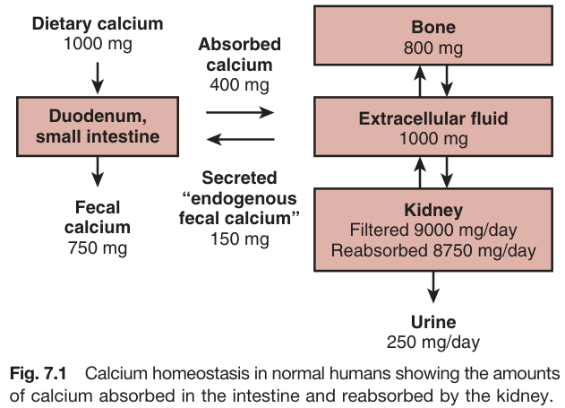

Fig. 7.1 Calcium homeostasis in normal humans showing the amounts of calcium absorbed in the intestine and reabsorbed by the kidney.

---

### Fig_7_2

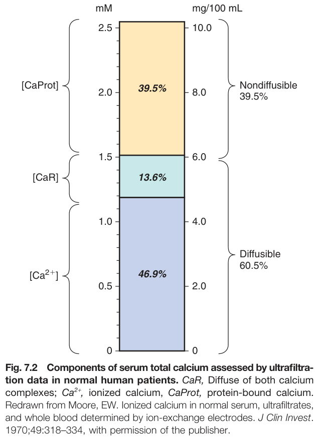

Fig. 7.2 Components of serum total calcium assessed by ultrafiltra- tion data in normal human patients. CaR, Diffuse of both calcium complexes; Ca2+, ionized calcium, CaProt, protein-bound calcium. Redrawn from Moore, EW. Ionized calcium in normal serum, ultrafiltrates, and whole blood determined by ion-exchange electrodes. J Clin Invest. 1970:49:318-334, with permission of the publisher.

---

### Fig_7_3

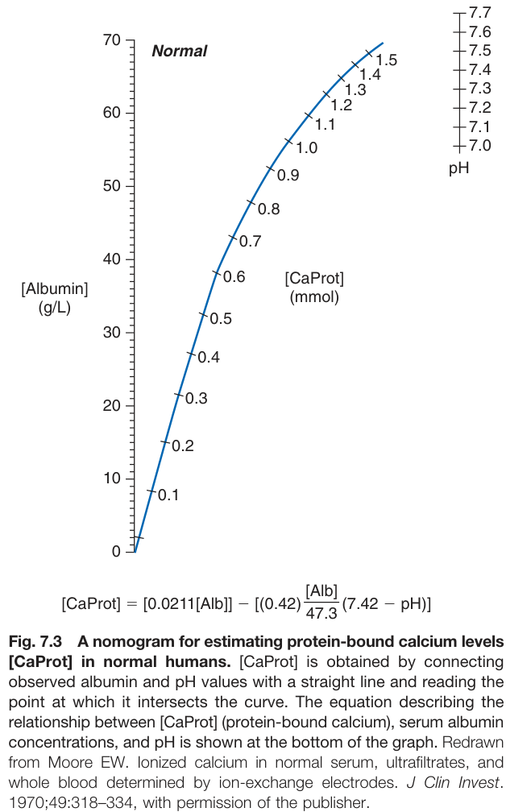

Fig. 7.3 A nomogram for estimating protein-bound calcium levels [CaProt] in normal humans. [CaProt] is obtained by connecting observed albumin and pH values with a straight line and reading the point at which it intersects the curve. The equation describing the relationship between [CaProt] (protein-bound calcium), serum albumin concentrations, and pH is shown at the bottom of the graph. Redrawn from Moore EW. Ionized calcium in normal serum, ultrafiltrates, and whole blood determined by ion-exchange electrodes. J Clin Invest. 1970:49:318-334, with permission of the publisher.

---

### Fig_7_4

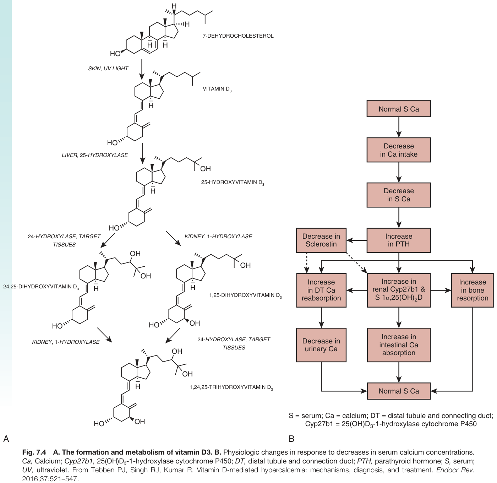

Fig. 7.4 A. The formation and metabolism of vitamin D3. B. Physiologic changes in response to decreases in serum calcium concentrations. Ca, Calcium; Cyp27b1, 25(OH)D3-1-hydroxylase cytochrome P450; DT, distal tubule and connection duct; PTH, parathyroid hormone; S, serum; UV, ultraviolet. From Tebben PJ, Singh RJ, Kumar R. Vitamin D-mediated hypercalcemia: mechanisms, diagnosis, and treatment. Endocr Rev. 2016;37:521-547.

---

### Fig_7_5

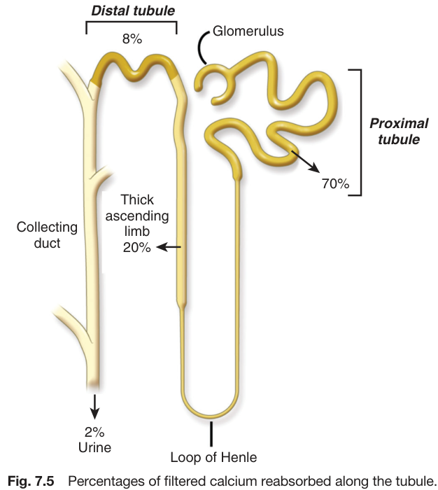

Fig. 7.5 Percentages of filtered calcium reabsorbed along the tubule.

---

### Fig_7_6

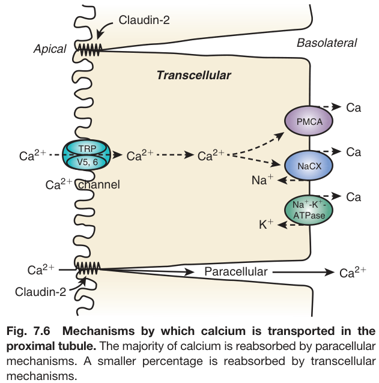

Fig. 7.6 Mechanisms by which calcium is transported in the proximal tubule. The majority of calcium is reabsorbed by paracellular mechanisms. A smaller percentage is reabsorbed by transcellular mechanisms.

---

### Fig_7_7

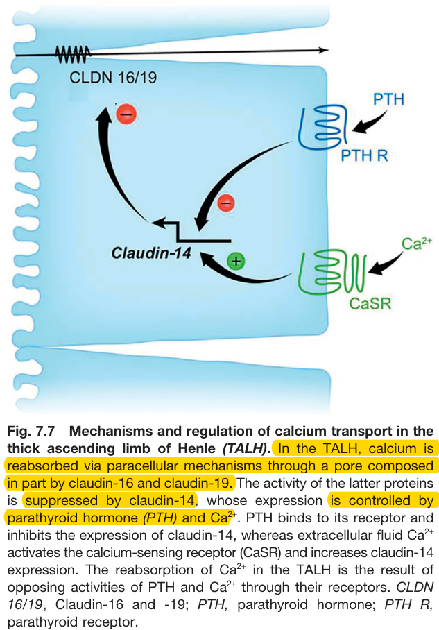

Fig. 7.7 Mechanisms and regulation of calcium transport in the thick ascending limb of Henle (TALH). In the TALH, calcium is reabsorbed via paracellular mechanisms through a pore composed in part by claudin-16 and claudin-19. The activity of the latter proteins is suppressed by claudin-14, whose expression is controlled by parathyroid hormone (PTH) and Ca2+. PTH binds to its receptor and inhibits the expression of claudin-14, whereas extracellular fluid Ca2+ activates the calcium-sensing receptor (CaSR) and increases claudin-14 expression. The reabsorption of Ca2+ in the TALH is the result of opposing activities of PTH and Ca²+ through their receptors. CLDN 16/19, Claudin-16 and -19; PTH, parathyroid hormone; PTH R, parathyroid receptor.

---

### Fig_7_8

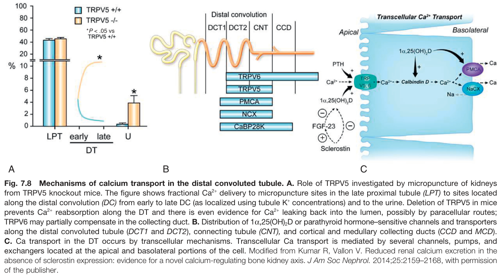

Fig. 7.8 Mechanisms of calcium transport in the distal convoluted tubule. A. Role of TRPV5 investigated by micropuncture of kidneys from TRPV5 knockout mice. The figure shows fractional Ca2+ delivery to micropuncture sites in the late proximal tubule (LPT) to sites located along the distal convolution (DC) from early to late DC (as localized using tubule K+ concentrations) and to the urine. Deletion of TRPV5 in mice prevents Ca2+ reabsorption along the DT and there is even evidence for Ca2+ leaking back into the lumen, possibly by paracellular routes; TRPV6 may partially compensate in the collecting duct. B. Distribution of 10,25(OH)2D or parathyroid hormone-sensitive channels and transporters along the distal convoluted tubule (DCT1 and DCT2), connecting tubule (CNT), and cortical and medullary collecting ducts (CCD and MCD). C. Ca transport in the DT occurs by transcellular mechanisms. Transcellular Ca transport is mediated by several channels, pumps, and exchangers located at the apical and basolateral portions of the cell. Modified from Kumar R, Vallon V. Reduced renal calcium excretion in the absence of sclerostin expression: evidence for a novel calcium-regulating bone kidney axis. J Am Soc Nephrol. 2014;25:2159-2168, with permission of the publisher.

---

### Fig_7_9

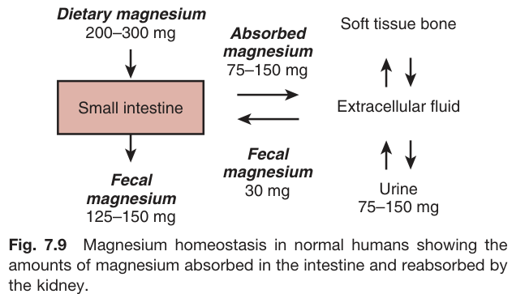

Fig. 7.9 Magnesium homeostasis in normal humans showing the amounts of magnesium absorbed in the intestine and reabsorbed by the kidney.

---

### Fig_7_10

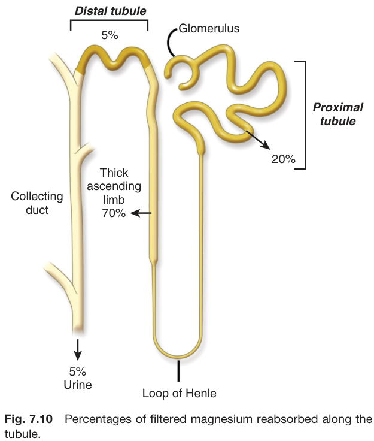

Fig. 7.10 Percentages of filtered magnesium reabsorbed along the tubule.

---

### Fig_7_11

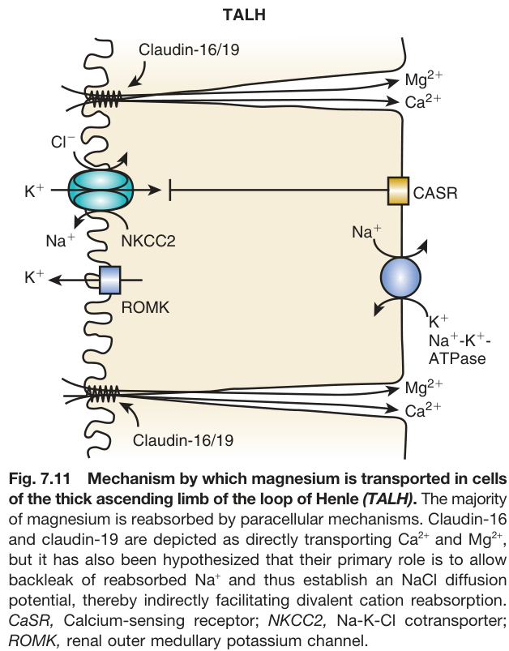

Fig. 7.11 Mechanism by which magnesium is transported in cells of the thick ascending limb of the loop of Henle (TALH). The majority of magnesium is reabsorbed by paracellular mechanisms. Claudin-16 and claudin-19 are depicted as directly transporting Ca2+ and Mg2+, but it has also been hypothesized that their primary role is to allow backleak of reabsorbed Nat and thus establish an NaCl diffusion potential, thereby indirectly facilitating divalent cation reabsorption. CaSR, Calcium-sensing receptor; NKCC2, Na-K-Cl cotransporter; ROMK, renal outer medullary potassium channel.

---

### Fig_7_12

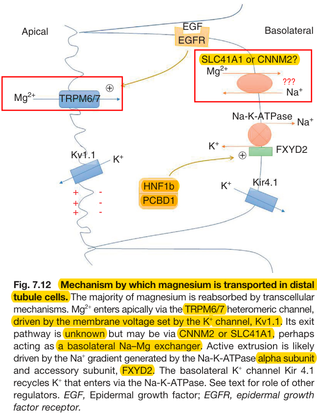

Fig. 7.12 Mechanism by which magnesium is transported in distal tubule cells. The majority of magnesium is reabsorbed by transcellular mechanisms. Mg2+ enters apically via the TRPM6/7 heteromeric channel, driven by the membrane voltage set by the K+ channel, Kv1.1. Its exit pathway is unknown but may be via CNNM2 or SLC41A1, perhaps acting as a basolateral Na-Mg exchanger. Active extrusion is likely driven by the Nat gradient generated by the Na-K-ATPase alpha subunit and accessory subunit, FXYD2. The basolateral K+ channel Kir 4.1 recycles K+ that enters via the Na-K-ATPase. See text for role of other regulators. EGF, Epidermal growth factor; EGFR, epidermal growth factor receptor.

---

### Fig_7_13

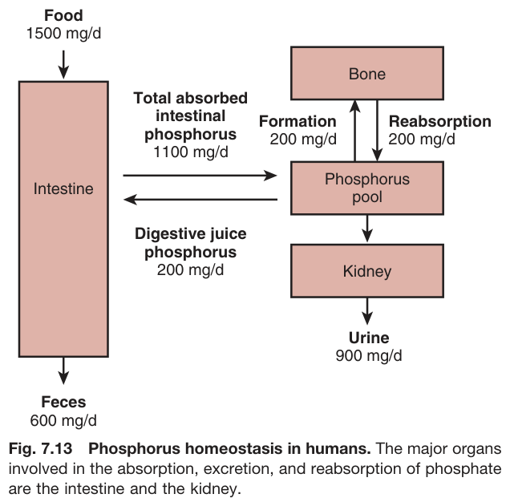

Fig. 7.13 Phosphorus homeostasis in humans. The major organs involved in the absorption, excretion, and reabsorption of phosphate are the intestine and the kidney.

---

### Fig_7_14

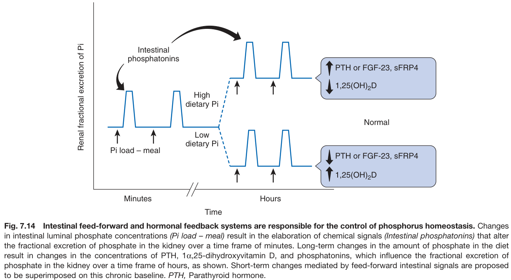

Fig. 7.14 Intestinal feed-forward and hormonal feedback systems are responsible for the control of phosphorus homeostasis. Changes in intestinal luminal phosphate concentrations (Pi load - meal) result in the elaboration of chemical signals (Intestinal phosphatonins) that alter the fractional excretion of phosphate in the kidney over a time frame of minutes. Long-term changes in the amount of phosphate in the diet result in changes in the concentrations of PTH, 1α,25-dihydroxyvitamin D, and phosphatonins, which influence the fractional excretion of phosphate in the kidney over a time frame of hours, as shown. Short-term changes mediated by feed-forward intestinal signals are proposed to be superimposed on this chronic baseline. PTH, Parathyroid hormone.

---

### Fig_7_15

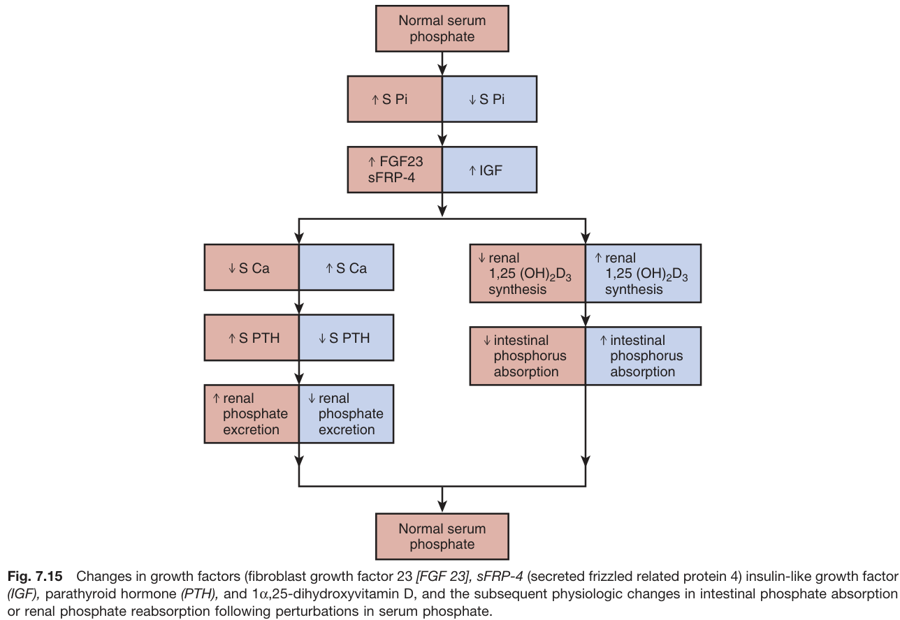

Fig. 7.15 Changes in growth factors (fibroblast growth factor 23 [FGF 23], sFRP-4 (secreted frizzled related protein 4) insulin-like growth factor (IGF), parathyroid hormone (PTH), and 1α,25-dihydroxyvitamin D, and the subsequent physiologic changes in intestinal phosphate absorption or renal phosphate reabsorption following perturbations in serum phosphate.

---

### Fig_7_16

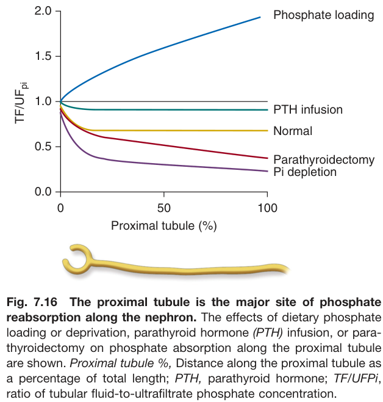

Fig. 7.16 The proximal tubule is the major site of phosphate reabsorption along the nephron. The effects of dietary phosphate loading or deprivation, parathyroid hormone (PTH) infusion, or parathyroidectomy on phosphate absorption along the proximal tubule are shown. Proximal tubule %, Distance along the proximal tubule as a percentage of total length; PTH, parathyroid hormone; TF/UFPi, ratio of tubular fluid-to-ultrafiltrate phosphate concentration.

---

### Fig_7_17

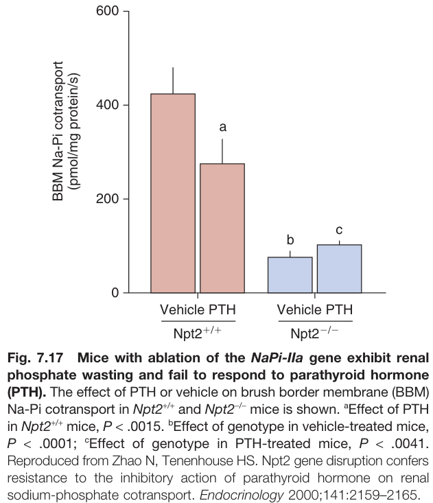

Fig. 7.17 Mice with ablation of the NaPi-lla gene exhibit renal phosphate wasting and fail to respond to parathyroid hormone (PTH). The effect of PTH or vehicle on brush border membrane (BBM) Na-Pi cotransport in Npt2+/+ and Npt2-- mice is shown. Effect of PTH in Npt2+/+ mice, P < .0015. Effect of genotype in vehicle-treated mice, P < .0001; Effect of genotype in PTH-treated mice, P < .0041. Reproduced from Zhao N, Tenenhouse HS. Npt2 gene disruption confers resistance to the inhibitory action of parathyroid hormone on renal sodium-phosphate cotransport. Endocrinology 2000;141:2159-2165.

---

### Fig_7_18

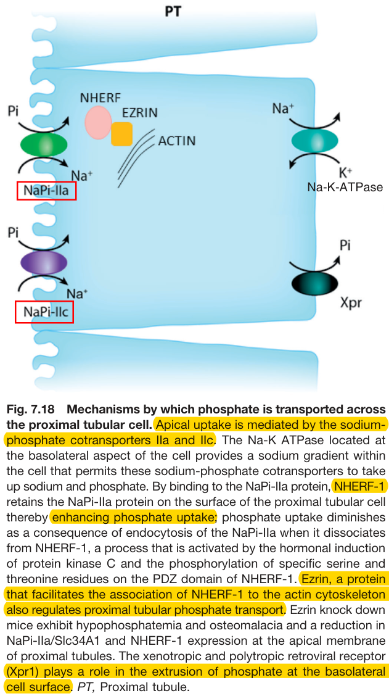

Fig. 7.18 Mechanisms by which phosphate is transported across the proximal tubular cell. Apical uptake is mediated by the sodium-phosphate cotransporters lla and Ilc. The Na-K ATPase located at the basolateral aspect of the cell provides a sodium gradient within the cell that permits these sodium-phosphate cotransporters to take up sodium and phosphate. By binding to the NaPi-lla protein, NHERF-1 retains the NaPi-lla protein on the surface of the proximal tubular cell thereby enhancing phosphate uptake; phosphate uptake diminishes as a consequence of endocytosis of the NaPi-lla when it dissociates from NHERF-1, a process that is activated by the hormonal induction of protein kinase C and the phosphorylation of specific serine and threonine residues on the PDZ domain of NHERF-1. Ezrin, a protein that facilitates the association of NHERF-1 to the actin cytoskeleton also regulates proximal tubular phosphate transport. Ezrin knock down mice exhibit hypophosphatemia and osteomalacia and a reduction in NaPi-lla/SIc34A1 and NHERF-1 expression at the apical membrane of proximal tubules. The xenotropic and polytropic retroviral receptor (Xpr1) plays a role in the extrusion of phosphate at the basolateral cell surface. PT, Proximal tubule.

---

## Tables

### Table_7_1

#### Table Image

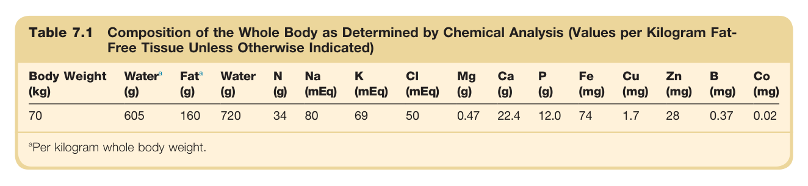

#### Table Data (CSV: [Table_7_1.csv](Table_7_1.csv))

```markdown
| Table Text (OCR) |
| :--- |
| Table 7.1 Composition of the Whole Body as Determined by Chemical Analysis (Values per Kilogram Fat- Free Tissue Unless Otherwise Indicated)  <sup>a</sup>Per kilogram whole body weight. |
```

Table 7.1 Composition of the Whole Body as Determined by Chemical Analysis (Values per Kilogram Fat- Free Tissue Unless Otherwise Indicated) | Body Weight (kg) | Water (g) | Fat (g) | Water (g) | N (g) | Na (mEq) | K (mEq) | CI (mEq) | Mg (g) | Ca (g) | P (g) | Fe (mg) | Cu (mg) | Zn (mg) | B (mg) | Co (mg) | | :--- | :--- | :--- | :--- | :--- | :--- | :--- | :--- | :--- | :--- | :--- | :--- | :--- | :--- | :--- | :--- | | 70 | 605 | 160 | 720 | 34 | 80 | 69 | 50 | 0.47 | 22.4 | 12.0 | 74 | 1.7 | 28 | 0.37 | 0.02 | aPer kilogram whole body weight.

---

### Table_7_2

#### Table Image

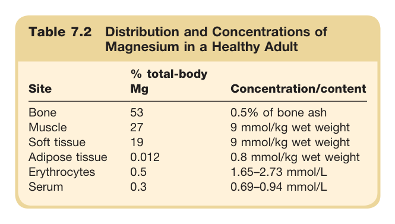

#### Table Data (CSV: [Table_7_2.csv](Table_7_2.csv))

```markdown
| Table Text (OCR) |
| :--- |
| Table 7.2 Distribution and Concentrations of Magnesium in a Healthy Adult |
```

Table 7.2 Distribution and Concentrations of Magnesium in a Healthy Adult | Site | % total-body Mg | Concentration/content | | :--- | :--- | :--- | | Bone | 53 | 0.5% of bone ash | | Muscle | 27 | 9 mmol/kg wet weight | | Soft tissue | 19 | 9 mmol/kg wet weight | | Adipose tissue | 0.012 | 0.8 mmol/kg wet weight | | Erythrocytes | 0.5 | 1.65-2.73 mmol/L | | Serum | 0.3 | 0.69-0.94 mmol/L |

---

### Table_7_3

#### Table Image

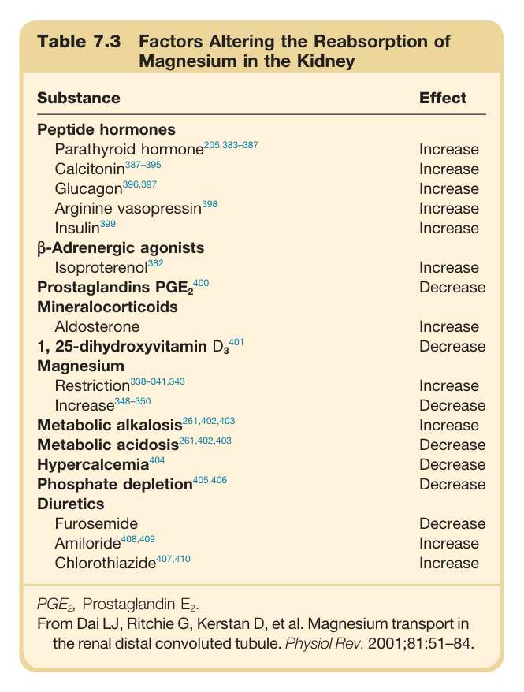

#### Table Data (CSV: [Table_7_3.csv](Table_7_3.csv))

```markdown
| Table Text (OCR) |
| :--- |
| Table 7.3 Factors Altering the Reabsorption of Magnesium in the Kidney  *References 205, 261, 338–341, 343, 348–350, and 382–410. |
```

Table 7.3 Factors Altering the Reabsorption of Magnesium in the Kidney | Substance | Effect | | :--- | :--- | | **Peptide hormones** | | | Parathyroid hormone | Increase | | Calcitonin | Increase | | Glucagon | Increase | | Arginine vasopressin | Increase | | Insulin | Increase | | **ẞ-Adrenergic agonists** | | | Isoproterenol | Increase | | Prostaglandins PGE2 | Decrease | | **Mineralocorticoids** | | | Aldosterone | Increase | | 1, 25-dihydroxyvitamin D3 | Decrease | | **Magnesium** | | | Restriction | Increase | | Increase | Decrease | | Metabolic alkalosis | Increase | | Metabolic acidosis | Decrease | | Hypercalcemia | Decrease | | Phosphate depletion | Decrease | | **Diuretics** | | | Furosemide | Decrease | | Amiloride | Increase | | Chlorothiazide | Increase | PGE2, Prostaglandin E2. From Dai LJ, Ritchie G, Kerstan D, et al. Magnesium transport in the renal distal convoluted tubule. Physiol Rev. 2001;81:51-84.

---

### Table_7_4

#### Table Image

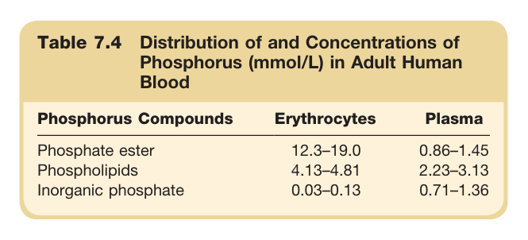

#### Table Data (CSV: [Table_7_4.csv](Table_7_4.csv))

```markdown
| Table Text (OCR) |
| :--- |
| Table 7.4 Distribution of and Concentrations of Phosphorus (mmol/L) in Adult Human Blood |
```

Table 7.4 Distribution of and Concentrations of Phosphorus (mmol/L) in Adult Human Blood | Phosphorus Compounds | Erythrocytes | Plasma | | :--- | :--- | :--- | | Phosphate ester | 12.3-19.0 | 0.86-1.45 | | Phospholipids | 4.13-4.81 | 2.23-3.13 | | Inorganic phosphate | 0.03-0.13 | 0.71-1.36 |

---
