# 08. Renal Handling of Organic Solutes - Figures and Tables Index

This document lists all figures and tables extracted from `08. Renal Handling of Organic Solutes.pdf`.

## Table of Contents
- [Figures](#figures)
- [Tables](#tables)

---

## Figures

### Fig_8_1

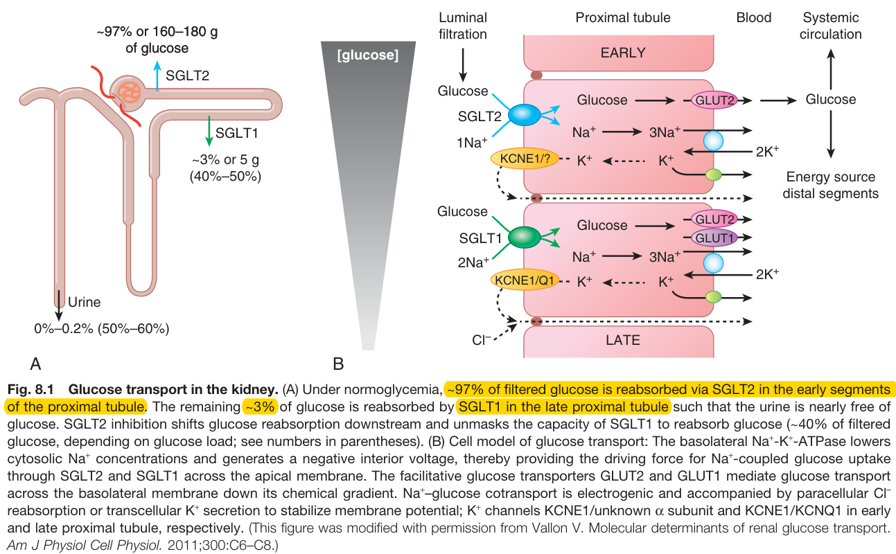

Fig. 8.1 Glucose transport in the kidney. (A) Under normoglycemia, ~97% of filtered glucose is reabsorbed via SGLT2 in the early segments of the proximal tubule. The remaining ~3% of glucose is reabsorbed by SGLT1 in the late proximal tubule such that the urine is nearly free of glucose. SGLT2 inhibition shifts glucose reabsorption downstream and unmasks the capacity of SGLT1 to reabsorb glucose (~40% of filtered glucose, depending on glucose load; see numbers in parentheses). (B) Cell model of glucose transport: The basolateral Na+-K+-ATPase lowers cytosolic Nat concentrations and generates a negative interior voltage, thereby providing the driving force for Nat-coupled glucose uptake through SGLT2 and SGLT1 across the apical membrane. The facilitative glucose transporters GLUT2 and GLUT1 mediate glucose transport across the basolateral membrane down its chemical gradient. Nat-glucose cotransport is electrogenic and accompanied by paracellular Cl reabsorption or transcellular K+ secretion to stabilize membrane potential; K+ channels KCNE1/unknown a subunit and KCNE1/KCNQ1 in early and late proximal tubule, respectively. (This figure was modified with permission from Vallon V. Molecular determinants of renal glucose transport. Am J Physiol Cell Physiol. 2011;300:C6-C8.)

---

### Fig_8_2

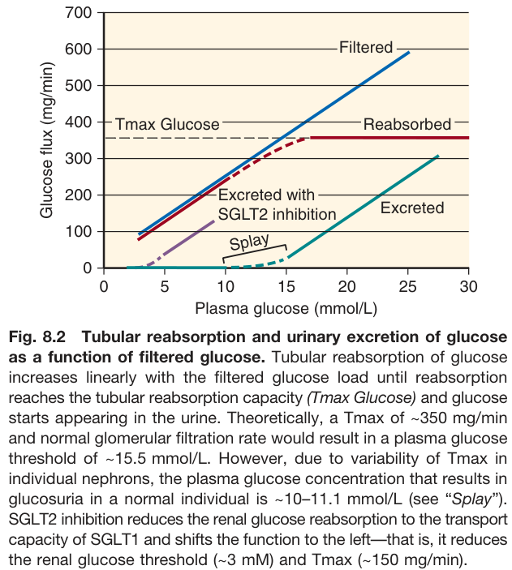

Fig. 8.2 Tubular reabsorption and urinary excretion of glucose as a function of filtered glucose. Tubular reabsorption of glucose increases linearly with the filtered glucose load until reabsorption reaches the tubular reabsorption capacity (Tmax Glucose) and glucose starts appearing in the urine. Theoretically, a Tmax of ~350 mg/min and normal glomerular filtration rate would result in a plasma glucose threshold of ~15.5 mmol/L. However, due to variability of Tmax in individual nephrons, the plasma glucose concentration that results in glucosuria in a normal individual is ~10-11.1 mmol/L (see "Splay"). SGLT2 inhibition reduces the renal glucose reabsorption to the transport capacity of SGLT1 and shifts the function to the left-that is, it reduces the renal glucose threshold (~3 mM) and Tmax (~150 mg/min).

---

### Fig_8_3

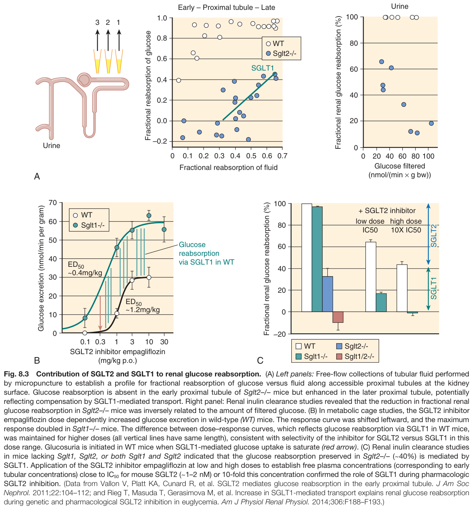

Fig. 8.3 Contribution of SGLT2 and SGLT1 to renal glucose reabsorption. (A) Left panels: Free-flow collections of tubular fluid performed by micropuncture to establish a profile for fractional reabsorption of glucose versus fluid along accessible proximal tubules at the kidney surface. Glucose reabsorption is absent in the early proximal tubule of Sglt2-/- mice but enhanced in the later proximal tubule, potentially reflecting compensation by SGLT1-mediated transport. Right panel: Renal inulin clearance studies revealed that the reduction in fractional renal glucose reabsorption in Sglt2-/- mice was inversely related to the amount of filtered glucose. (B) In metabolic cage studies, the SGLT2 inhibitor empagliflozin dose dependently increased glucose excretion in wild-type (WT) mice. The response curve was shifted leftward, and the maximum response doubled in Sglt1-/- mice. The difference between dose-response curves, which reflects glucose reabsorption via SGLT1 in WT mice, was maintained for higher doses (all vertical lines have same length), consistent with selectivity of the inhibitor for SGLT2 versus SGLT1 in this dose range. Glucosuria is initiated in WT mice when SGLT1-mediated glucose uptake is saturate (red arrow). (C) Renal inulin clearance studies in mice lacking Sglt1, Sglt2, or both Sglt1 and Sglt2 indicated that the glucose reabsorption preserved in Sglt2-/- (~40%) is mediated by SGLT1. Application of the SGLT2 inhibitor empagliflozin at low and high doses to establish free plasma concentrations (corresponding to early tubular concentrations) close to IC50 for mouse SGLT2 (~1-2 nM) or 10-fold this concentration confirmed the role of SGLT1 during pharmacologic SGLT2 inhibition. (Data from Vallon V, Platt KA, Cunard R, et al. SGLT2 mediates glucose reabsorption in the early proximal tubule. J Am Soc Nephrol. 2011;22:104-112; and Rieg T, Masuda T, Gerasimova M, et al. Increase in SGLT1-mediated transport explains renal glucose reabsorption during genetic and pharmacological SGLT2 inhibition in euglycemia. Am J Physiol Renal Physiol. 2014;306:F188-F193.)

---

### Fig_8_4

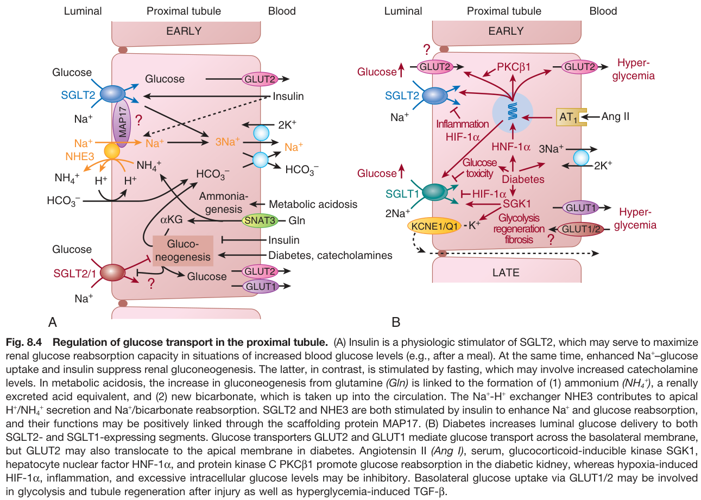

Fig. 8.4 Regulation of glucose transport in the proximal tubule. (A) Insulin is a physiologic stimulator of SGLT2, which may serve to maximize renal glucose reabsorption capacity in situations of increased blood glucose levels (e.g., after a meal). At the same time, enhanced Nat-glucose uptake and insulin suppress renal gluconeogenesis. The latter, in contrast, is stimulated by fasting, which may involve increased catecholamine levels. In metabolic acidosis, the increase in gluconeogenesis from glutamine (Gln) is linked to the formation of (1) ammonium (NH4+), a renally excreted acid equivalent, and (2) new bicarbonate, which is taken up into the circulation. The Nat-H+ exchanger NHE3 contributes to apical H+/NH4+ secretion and Na+/bicarbonate reabsorption. SGLT2 and NHE3 are both stimulated by insulin to enhance Nat and glucose reabsorption, and their functions may be positively linked through the scaffolding protein MAP17. (B) Diabetes increases luminal glucose delivery to both SGLT2- and SGLT1-expressing segments. Glucose transporters GLUT2 and GLUT1 mediate glucose transport across the basolateral membrane, but GLUT2 may also translocate to the apical membrane in diabetes. Angiotensin II (Ang I), serum, glucocorticoid-inducible kinase SGK1, hepatocyte nuclear factor HNF-1α, and protein kinase C PKCẞ1 promote glucose reabsorption in the diabetic kidney, whereas hypoxia-induced HIF-1α, inflammation, and excessive intracellular glucose levels may be inhibitory. Basolateral glucose uptake via GLUT1/2 may be involved in glycolysis and tubule regeneration after injury as well as hyperglycemia-induced TGF-β.

---

### Fig_8_5

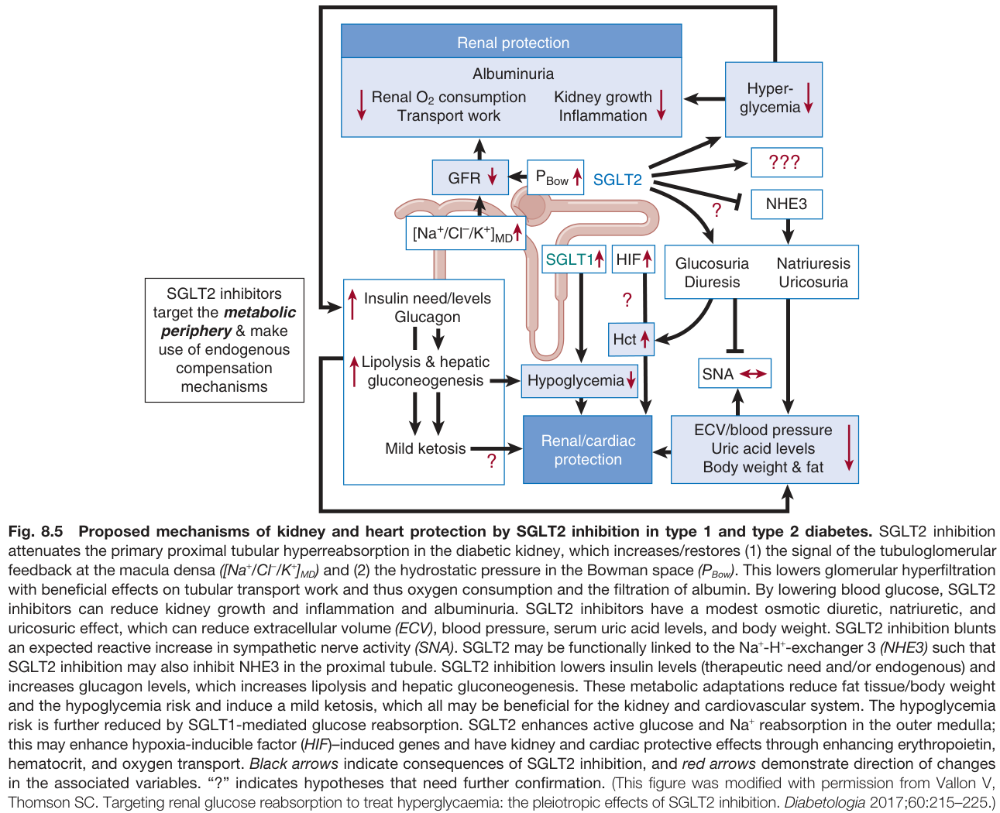

Fig. 8.5 Proposed mechanisms of kidney and heart protection by SGLT2 inhibition in type 1 and type 2 diabetes. SGLT2 inhibition attenuates the primary proximal tubular hyperreabsorption in the diabetic kidney, which increases/restores (1) the signal of the tubuloglomerular feedback at the macula densa ([Na+/CI/K+]MD) and (2) the hydrostatic pressure in the Bowman space (PBOW). This lowers glomerular hyperfiltration with beneficial effects on tubular transport work and thus oxygen consumption and the filtration of albumin. By lowering blood glucose, SGLT2 inhibitors can reduce kidney growth and inflammation and albuminuria. SGLT2 inhibitors have a modest osmotic diuretic, natriuretic, and uricosuric effect, which can reduce extracellular volume (ECV), blood pressure, serum uric acid levels, and body weight. SGLT2 inhibition blunts an expected reactive increase in sympathetic nerve activity (SNA). SGLT2 may be functionally linked to the Na+-H+-exchanger 3 (NHE3) such that SGLT2 inhibition may also inhibit NHE3 in the proximal tubule. SGLT2 inhibition lowers insulin levels (therapeutic need and/or endogenous) and increases glucagon levels, which increases lipolysis and hepatic gluconeogenesis. These metabolic adaptations reduce fat tissue/body weight and the hypoglycemia risk and induce a mild ketosis, which all may be beneficial for the kidney and cardiovascular system. The hypoglycemia risk is further reduced by SGLT1-mediated glucose reabsorption. SGLT2 enhances active glucose and Na+ reabsorption in the outer medulla; this may enhance hypoxia-inducible factor (HIF)-induced genes and have kidney and cardiac protective effects through enhancing erythropoietin, hematocrit, and oxygen transport. Black arrows indicate consequences of SGLT2 inhibition, and red arrows demonstrate direction of changes in the associated variables. "?" indicates hypotheses that need further confirmation. (This figure was modified with permission from Vallon V, Thomson SC. Targeting renal glucose reabsorption to treat hyperglycaemia: the pleiotropic effects of SGLT2 inhibition. Diabetologia 2017;60:215-225.)

---

### Fig_8_6

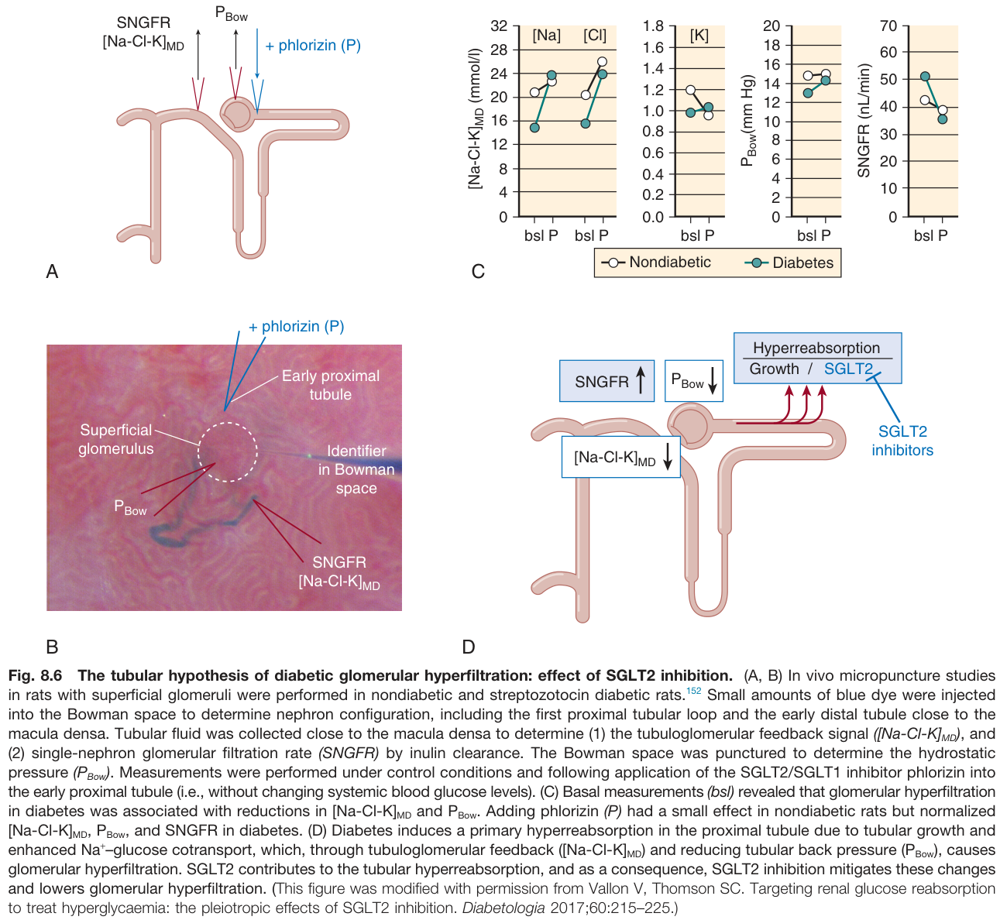

Fig. 8.6 The tubular hypothesis of diabetic glomerular hyperfiltration: effect of SGLT2 inhibition. (A, B) In vivo micropuncture studies in rats with superficial glomeruli were performed in nondiabetic and streptozotocin diabetic rats. Small amounts of blue dye were injected into the Bowman space to determine nephron configuration, including the first proximal tubular loop and the early distal tubule close to the macula densa. Tubular fluid was collected close to the macula densa to determine (1) the tubuloglomerular feedback signal ([Na-CI-K]MD), and (2) single-nephron glomerular filtration rate (SNGFR) by inulin clearance. The Bowman space was punctured to determine the hydrostatic pressure (PBow). Measurements were performed under control conditions and following application of the SGLT2/SGLT1 inhibitor phlorizin into the early proximal tubule (i.e., without changing systemic blood glucose levels). (C) Basal measurements (bsl) revealed that glomerular hyperfiltration in diabetes was associated with reductions in [Na-CI-K] MD and PBOW. Adding phlorizin (P) had a small effect in nondiabetic rats but normalized [Na-CI-K]MD, PBow, and SNGFR in diabetes. (D) Diabetes induces a primary hyperreabsorption in the proximal tubule due to tubular growth and enhanced Nat-glucose cotransport, which, through tubuloglomerular feedback ([Na-CI-K] MD) and reducing tubular back pressure (PBow), causes glomerular hyperfiltration. SGLT2 contributes to the tubular hyperreabsorption, and as a consequence, SGLT2 inhibition mitigates these changes and lowers glomerular hyperfiltration. (This figure was modified with permission from Vallon V, Thomson SC. Targeting renal glucose reabsorption to treat hyperglycaemia: the pleiotropic effects of SGLT2 inhibition. Diabetologia 2017;60:215-225.)

---

### Fig_8_7

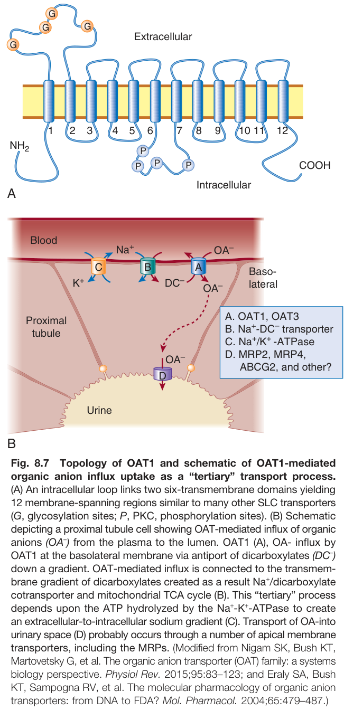

Fig. 8.7 Topology of OAT1 and schematic of OAT1-mediated organic anion influx uptake as a "tertiary" transport process. (A) An intracellular loop links two six-transmembrane domains yielding 12 membrane-spanning regions similar to many other SLC transporters (G, glycosylation sites; P, PKC, phosphorylation sites). (B) Schematic depicting a proximal tubule cell showing OAT-mediated influx of organic anions (OA) from the plasma to the lumen. OAT1 (A), OA- influx by OAT1 at the basolateral membrane via antiport of dicarboxylates (DC) down a gradient. OAT-mediated influx is connected to the transmembrane gradient of dicarboxylates created as a result Na+/dicarboxylate cotransporter and mitochondrial TCA cycle (B). This "tertiary" process depends upon the ATP hydrolyzed by the Na+-K+-ATPase to create an extracellular-to-intracellular sodium gradient (C). Transport of OA-into urinary space (D) probably occurs through a number of apical membrane transporters, including the MRPs. (Modified from Nigam SK, Bush KT, Martovetsky G, et al. The organic anion transporter (OAT) family: a systems biology perspective. Physiol Rev. 2015;95:83-123; and Eraly SA, Bush KT, Sampogna RV, et al. The molecular pharmacology of organic anion transporters: from DNA to FDA? Mol. Pharmacol. 2004;65:479-487.)

---

### Fig_8_8

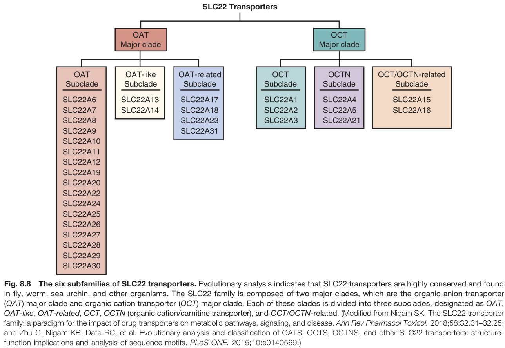

Fig. 8.8 The six subfamilies of SLC22 transporters. Evolutionary analysis indicates that SLC22 transporters are highly conserved and found in fly, worm, sea urchin, and other organisms. The SLC22 family is composed of two major clades, which are the organic anion transporter (OAT) major clade and organic cation transporter (OCT) major clade. Each of these clades is divided into three subclades, designated as OAT, OAT-like, OAT-related, OCT, OCTN (organic cation/carnitine transporter), and OCT/OCTN-related. (Modified from Nigam SK. The SLC22 transporter family: a paradigm for the impact of drug transporters on metabolic pathways, signaling, and disease. Ann Rev Pharmacol Toxicol. 2018;58:32.31-32.25; and Zhu C, Nigam KB, Date RC, et al. Evolutionary analysis and classification of OATS, OCTS, OCTNS, and other SLC22 transporters: structure-function implications and analysis of sequence motifs. PLoS ONE. 2015;10:e0140569.)

---

### Fig_8_9

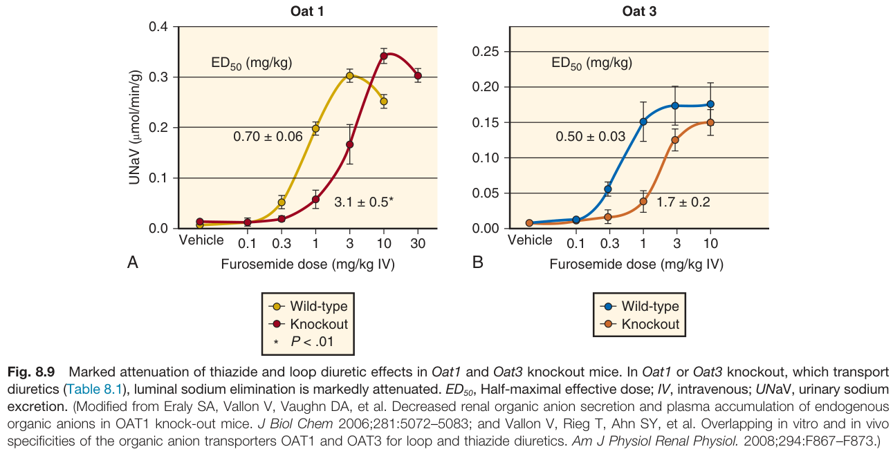

Fig. 8.9 Marked attenuation of thiazide and loop diuretic effects in Oat1 and Oat3 knockout mice. In Oat1 or Oat3 knockout, which transport diuretics (Table 8.1), luminal sodium elimination is markedly attenuated. ED50, Half-maximal effective dose; IV, intravenous; UNaV, urinary sodium excretion. (Modified from Eraly SA, Vallon V, Vaughn DA, et al. Decreased renal organic anion secretion and plasma accumulation of endogenous organic anions in OAT1 knock-out mice. J Biol Chem 2006;281:5072-5083; and Vallon V, Rieg T, Ahn SY, et al. Overlapping in vitro and in vivo specificities of the organic anion transporters OAT1 and OAT3 for loop and thiazide diuretics. Am J Physiol Renal Physiol. 2008;294:F867-F873.)

---

### Fig_8_10

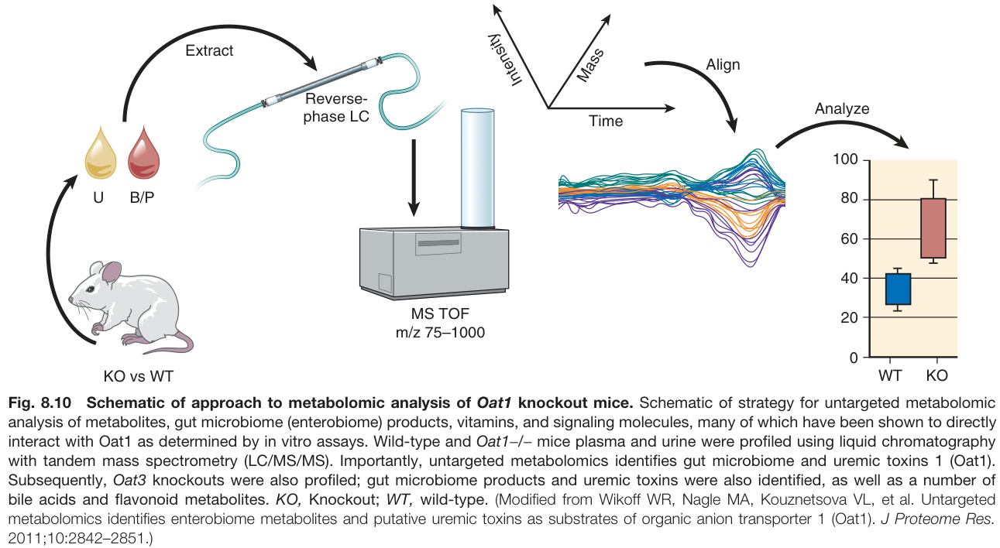

Fig. 8.10 Schematic of approach to metabolomic analysis of Oat1 knockout mice. Schematic of strategy for untargeted metabolomic analysis of metabolites, gut microbiome (enterobiome) products, vitamins, and signaling molecules, many of which have been shown to directly interact with Oat1 as determined by in vitro assays. Wild-type and Oat1-/- mice plasma and urine were profiled using liquid chromatography with tandem mass spectrometry (LC/MS/MS). Importantly, untargeted metabolomics identifies gut microbiome and uremic toxins 1 (Oat1). Subsequently, Oat3 knockouts were also profiled; gut microbiome products and uremic toxins were also identified, as well as a number of bile acids and flavonoid metabolites. KO, Knockout; WT, wild-type. (Modified from Wikoff WR, Nagle MA, Kouznetsova VL, et al. Untargeted metabolomics identifies enterobiome metabolites and putative uremic toxins as substrates of organic anion transporter 1 (Oat1). J Proteome Res. 2011;10:2842-2851.)

---

### Fig_8_11

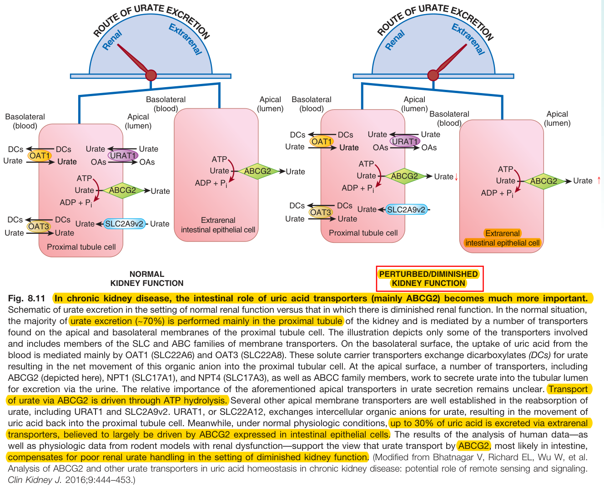

Fig. 8.11 In chronic kidney disease, the intestinal role of uric acid transporters (mainly ABCG2) becomes much more important. Schematic of urate excretion in the setting of normal renal function versus that in which there is diminished renal function. In the normal situation, the majority of urate excretion (~70%) is performed mainly in the proximal tubule of the kidney and is mediated by a number of transporters found on the apical and basolateral membranes of the proximal tubule cell. The illustration depicts only some of the transporters involved and includes members of the SLC and ABC families of membrane transporters. On the basolateral surface, the uptake of uric acid from the blood is mediated mainly by OAT1 (SLC22A6) and OAT3 (SLC22A8). These solute carrier transporters exchange dicarboxylates (DCs) for urate resulting in the net movement of this organic anion into the proximal tubular cell. At the apical surface, a number of transporters, including ABCG2 (depicted here), NPT1 (SLC17A1), and NPT4 (SLC17A3), as well as ABCC family members, work to secrete urate into the tubular lumen for excretion via the urine. The relative importance of the aforementioned apical transporters in urate secretion remains unclear. Transport of urate via ABCG2 is driven through ATP hydrolysis. Several other apical membrane transporters are well established in the reabsorption of urate, including URAT1 and SLC2A9v2. URAT1, or SLC22A12, exchanges intercellular organic anions for urate, resulting in the movement of uric acid back into the proximal tubule cell. Meanwhile, under normal physiologic conditions, up to 30% of uric acid is excreted via extrarenal transporters, believed to largely be driven by ABCG2 expressed in intestinal epithelial cells. The results of the analysis of human data-as well as physiologic data from rodent models with renal dysfunction-support the view that urate transport by ABCG2, most likely in intestine, compensates for poor renal urate handling in the setting of diminished kidney function. (Modified from Bhatnagar V, Richard EL, Wu W, et al. Analysis of ABCG2 and other urate transporters in uric acid homeostasis in chronic kidney disease: potential role of remote sensing and signaling. Clin Kidney J. 2016;9:444-453.)

---

### Fig_8_12

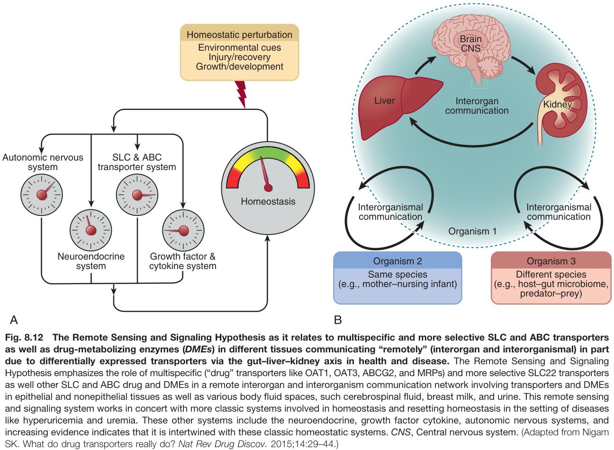

Fig. 8.12 The Remote Sensing and Signaling Hypothesis as it relates to multispecific and more selective SLC and ABC transporters as well as drug-metabolizing enzymes (DMEs) in different tissues communicating "remotely" (interorgan and interorganismal) in part due to differentially expressed transporters via the gut-liver-kidney axis in health and disease. The Remote Sensing and Signaling Hypothesis emphasizes the role of multispecific ("drug" transporters like OAT1, OAT3, ABCG2, and MRPs) and more selective SLC22 transporters as well other SLC and ABC drug and DMEs in a remote interorgan and interorganism communication network involving transporters and DMEs in epithelial and nonepithelial tissues as well as various body fluid spaces, such cerebrospinal fluid, breast milk, and urine. This remote sensing and signaling system works in concert with more classic systems involved in homeostasis and resetting homeostasis in the setting of diseases like hyperuricemia and uremia. These other systems include the neuroendocrine, growth factor cytokine, autonomic nervous systems, and increasing evidence indicates that it is intertwined with these classic homeostatic systems. CNS, Central nervous system. (Adapted from Nigam SK. What do drug transporters really do? Nat Rev Drug Discov. 2015;14:29-44.)

---

### Fig_8_13

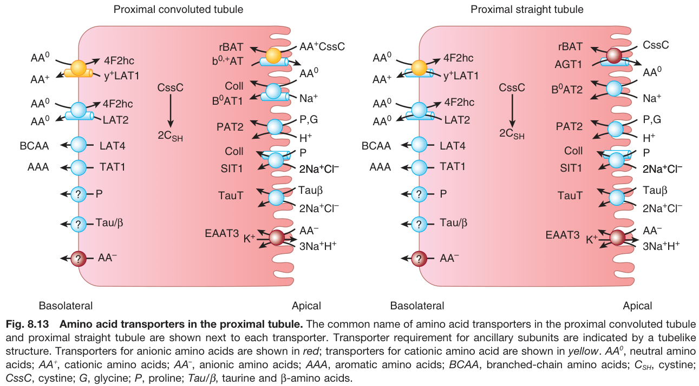

Fig. 8.13 Amino acid transporters in the proximal tubule. The common name of amino acid transporters in the proximal convoluted tubule and proximal straight tubule are shown next to each transporter. Transporter requirement for ancillary subunits are indicated by a tubelike structure. Transporters for anionic amino acids are shown in red; transporters for cationic amino acid are shown in yellow. AAº, neutral amino acids; AA+, cationic amino acids; AA, anionic amino acids; AAA, aromatic amino acids; BCAA, branched-chain amino acids; CSH, cystine; CssC, cystine; G, glycine; P, proline; Tau/ββ, taurine and β-amino acids.

---

### Fig_8_14

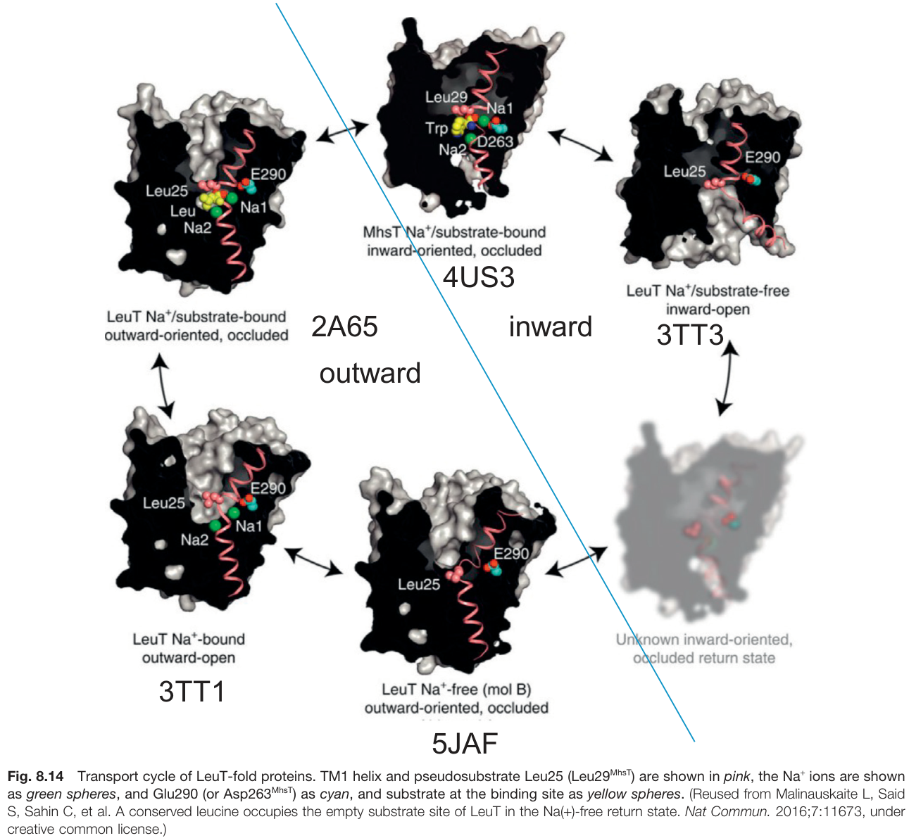

Fig. 8.14 Transport cycle of LeuT-fold proteins. TM1 helix and pseudosubstrate Leu25 (Leu29MhsT) are shown in pink, the Na+ ions are shown as green spheres, and Glu290 (or Asp263Mhst) as cyan, and substrate at the binding site as yellow spheres. (Reused from Malinauskaite L, Said S, Sahin C, et al. A conserved leucine occupies the empty substrate site of LeuT in the Na(+)-free return state. Nat Commun. 2016;7:11673, under creative common license.)

---

## Tables

### Table_8_1

#### Table Image

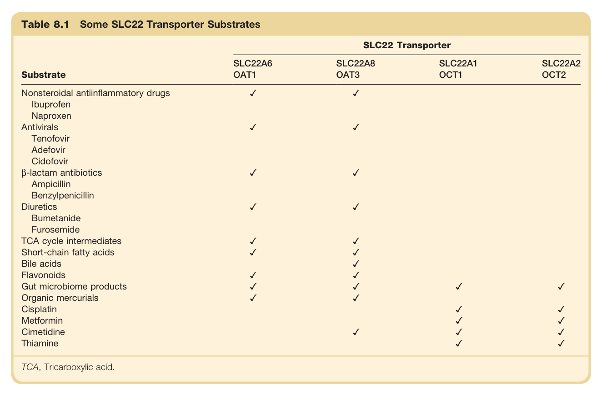

#### Table Data (CSV: [Table_8_1.csv](Table_8_1.csv))

```markdown
| Table Text (OCR) |
| :--- |
| Table 8.1 Some SLC22 Transporter Substrates  TCA, Tricarboxylic acid. |
```

Table 8.1 Some SLC22 Transporter Substrates | Substrate | SLC22A6 OAT1 | SLC22A8 OAT3 | SLC22A1 OCT1 | SLC22A2 OCT2 | | :--- | :---: | :---: | :---: | :---: | | **Nonsteroidal antiinflammatory drugs** | | | | | | Ibuprofen | ✓ | ✓ | | | | Naproxen | ✓ | ✓ | | | | **Antivirals** | | | | | | Tenofovir | ✓ | ✓ | | | | Adefovir | ✓ | | | | | Cidofovir | ✓ | | | | | **ẞ-lactam antibiotics** | | | | | | Ampicillin | ✓ | ✓ | | | | Benzylpenicillin | ✓ | ✓ | | | | **Diuretics** | | | | | | Bumetanide | ✓ | ✓ | | | | Furosemide | ✓ | ✓ | | | | TCA cycle intermediates | ✓ | ✓ | | | | Short-chain fatty acids | ✓ | ✓ | | | | Bile acids | | ✓ | | | | Flavonoids | | ✓ | | | | Gut microbiome products | ✓ | ✓ | | | | Organic mercurials | ✓ | | | | | Cisplatin | | | ✓ | ✓ | | Metformin | | | ✓ | ✓ | | Cimetidine | | ✓ | ✓ | ✓ | | Thiamine | | | ✓ | ✓ | *TCA, Tricarboxylic acid.*

---

### Table_8_2

#### Table Image

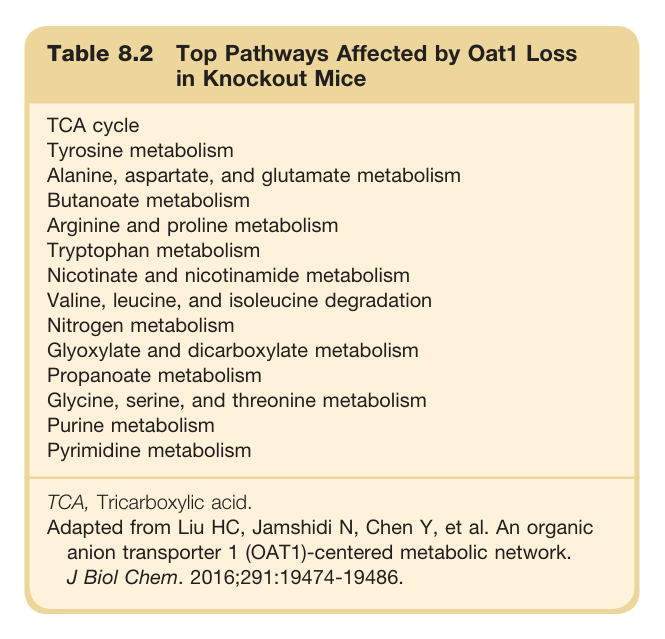

#### Table Data (CSV: [Table_8_2.csv](Table_8_2.csv))

```markdown
| Table Text (OCR) |
| :--- |
| Table 8.2 Top Pathways Affected by Oat1 Loss in Knockout Mice |
```

Table 8.2 Top Pathways Affected by Oat1 Loss in Knockout Mice * TCA cycle * Tyrosine metabolism * Alanine, aspartate, and glutamate metabolism * Butanoate metabolism * Arginine and proline metabolism * Tryptophan metabolism * Nicotinate and nicotinamide metabolism * Valine, leucine, and isoleucine degradation * Nitrogen metabolism * Glyoxylate and dicarboxylate metabolism * Propanoate metabolism * Glycine, serine, and threonine metabolism * Purine metabolism * Pyrimidine metabolism *TCA, Tricarboxylic acid.* *Adapted from Liu HC, Jamshidi N, Chen Y, et al. An organic anion transporter 1 (OAT1)-centered metabolic network. J Biol Chem. 2016;291:19474-19486.*

---

### Table_8_3

#### Table Image

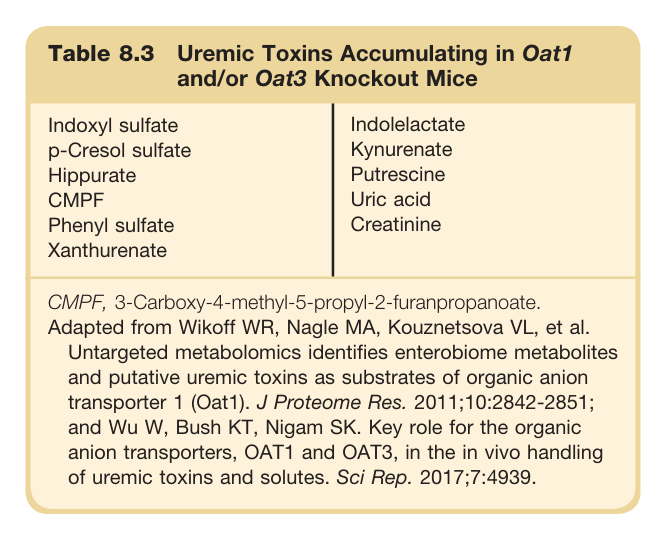

#### Table Data (CSV: [Table_8_3.csv](Table_8_3.csv))

```markdown
| Table Text (OCR) |
| :--- |
| Table 8.3 Uremic Toxins Accumulating in Oat1 and/or Oat3 Knockout Mice |
```

Table 8.3 Uremic Toxins Accumulating in Oat1 and/or Oat3 Knockout Mice | | | | :--- | :--- | | Indoxyl sulfate | Indolelactate | | p-Cresol sulfate | Kynurenate | | Hippurate | Putrescine | | CMPF | Uric acid | | Phenyl sulfate | Creatinine | | Xanthurenate | | *CMPF, 3-Carboxy-4-methyl-5-propyl-2-furanpropanoate.* *Adapted from Wikoff WR, Nagle MA, Kouznetsova VL, et al. Untargeted metabolomics identifies enterobiome metabolites and putative uremic toxins as substrates of organic anion transporter 1 (Oat1). J Proteome Res. 2011;10:2842-2851; and Wu W, Bush KT, Nigam SK. Key role for the organic anion transporters, OAT1 and OAT3, in the in vivo handling of uremic toxins and solutes. Sci Rep. 2017;7:4939.*

---

### Table_8_4

#### Table Image

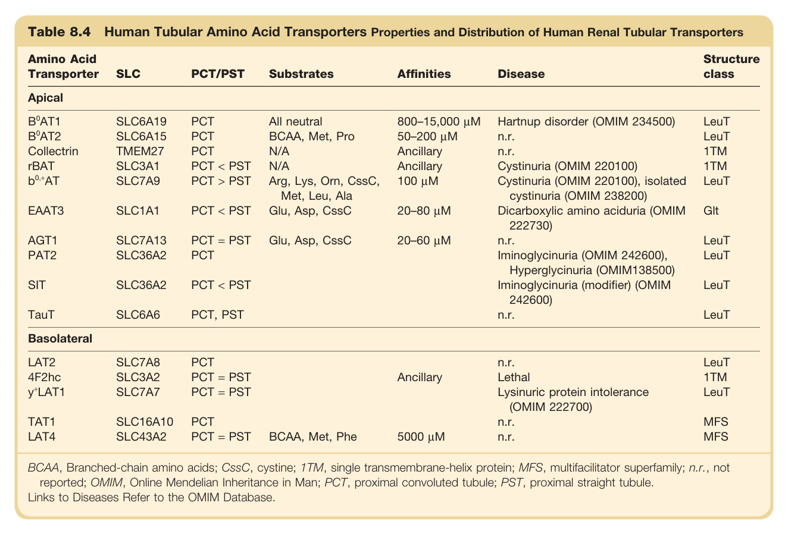

#### Table Data (CSV: [Table_8_4.csv](Table_8_4.csv))

```markdown
| Table Text (OCR) |
| :--- |
| Table 8.4 Human Tubular Amino Acid Transporters Properties and Distribution of Human Renal Tubular Transporters  BCAA, Branched-chain amino acids; CssC, cystine; 1TM, single transmembrane-helix protein; MFS, multifacilitator superfamily; n.r., not reported; OMIM, Online Mendelian Inheritance in Man; PCT, proximal convoluted tubule; PST, proximal straight tubule. Links to Diseases Refer to the OMIM Database. |
```

Table 8.4 Human Tubular Amino Acid Transporters Properties and Distribution of Human Renal Tubular Transporters | Amino Acid Transporter | SLC | PCT/PST | Substrates | Affinities | Disease | Structure class | | :--- | :--- | :--- | :--- | :--- | :--- | :--- | | **Apical** | | | | | | | | B0AT1 | SLC6A19 | PCT | All neutral | 800-15,000 μΜ | Hartnup disorder (OMIM 234500) | LeuT | | B0AT2 | SLC6A15 | PCT | BCAA, Met, Pro | 50-200 μΜ | n.r. | LeuT | | Collectrin | TMEM27 | PCT | N/A | Ancillary | n.r. | 1TM | | rBAT | SLC3A1 | PCT < PST | N/A | Ancillary | Cystinuria (OMIM 220100) | 1TM | | b0,+AT | SLC7A9 | PCT > PST | Arg, Lys, Orn, CssC, Met, Leu, Ala | 100 μΜ | Cystinuria (OMIM 220100), isolated cystinuria (OMIM 238200) | LeuT | | EAAT3 | SLC1A1 | PCT < PST | Glu, Asp, CssC | 20-80 μΜ | Dicarboxylic amino aciduria (OMIM 222730) | Glt | | AGT1 | SLC7A13 | PCT = PST | Glu, Asp, CssC | 20-60 μΜ | n.r. | LeuT | | PAT2 | SLC36A2 | PCT | | | Iminoglycinuria (OMIM 242600), Hyperglycinuria (OMIM138500) | LeuT | | SIT | SLC36A2 | PCT < PST | | | Iminoglycinuria (modifier) (OMIM 242600) | LeuT | | TauT | SLC6A6 | PCT, PST | | | n.r. | LeuT | | **Basolateral** | | | | | | | | LAT2 | SLC7A8 | PCT | | | n.r. | LeuT | | 4F2hc | SLC3A2 | PCT = PST | | Ancillary | Lethal | 1TM | | y+LAT1 | SLC7A7 | PCT = PST | | | Lysinuric protein intolerance (OMIM 222700) | LeuT | | TAT1 | SLC16A10 | PCT | | | n.r. | MFS | | LAT4 | SLC43A2 | PCT = PST | BCAA, Met, Phe | 5000 μΜ | n.r. | MFS | *BCAA, Branched-chain amino acids; CssC, cystine; 1TM, single transmembrane-helix protein; MFS, multifacilitator superfamily; n.r., not reported; OMIM, Online Mendelian Inheritance in Man; PCT, proximal convoluted tubule; PST, proximal straight tubule.* *Links to Diseases Refer to the OMIM Database.*

---

### Table_8_5

#### Table Image

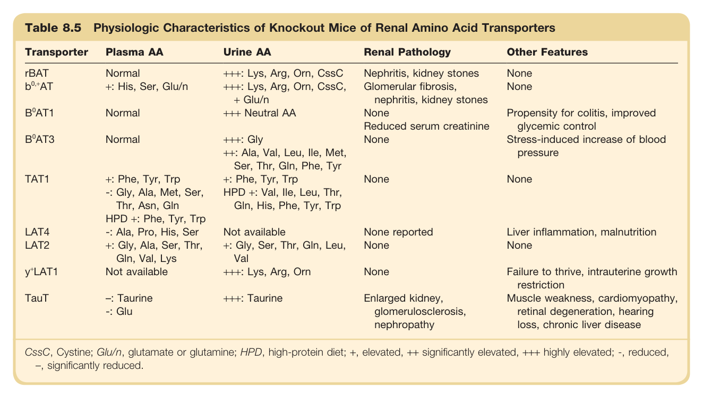

#### Table Data (CSV: [Table_8_5.csv](Table_8_5.csv))

```markdown
| Table Text (OCR) |
| :--- |
| Table 8.5 Physiologic Characteristics of Knockout Mice of Renal Amino Acid Transporters  CssC, Cystine; Glu/n, glutamate or glutamine; HPD, high-protein diet; +, elevated, ++ significantly elevated, +++ highly elevated; -, reduced, –, significantly reduced. |
```

Table 8.5 Physiologic Characteristics of Knockout Mice of Renal Amino Acid Transporters | Transporter | Plasma AA | Urine AA | Renal Pathology | Other Features | | :--- | :--- | :--- | :--- | :--- | | rBAT | Normal | +++: Lys, Arg, Orn, CssC | Nephritis, kidney stones | None | | b0,+AT | +: His, Ser, Glu/n | +++: Lys, Arg, Orn, CssC, + Glu/n | Glomerular fibrosis, nephritis, kidney stones | None | | B0AT1 | Normal | +++ Neutral AA | None | Propensity for colitis, improved glycemic control | | B0AT3 | Normal | +++: Gly | Reduced serum creatinine | Stress-induced increase of blood pressure | | TAT1 | +: Phe, Tyr, Trp | ++: Ala, Val, Leu, lle, Met, Ser, Thr, Gln, Phe, Tyr | None | None | | | -: Gly, Ala, Met, Ser, Thr, Asn, Gln | +: Phe, Tyr, Trp | | | | LAT4 | HPD +: Phe, Tyr, Trp | HPD +: Val, lle, Leu, Thr, Gln, His, Phe, Tyr, Trp | None reported | Liver inflammation, malnutrition | | | -: Ala, Pro, His, Ser | Not available | | | | LAT2 | +: Gly, Ala, Ser, Thr, Gln, Val, Lys | +: Gly, Ser, Thr, Gln, Leu, Val | None | None | | y+LAT1 | Not available | +++: Lys, Arg, Orn | None | Failure to thrive, intrauterine growth restriction | | TauT | -: Taurine | +++: Taurine | Enlarged kidney, glomerulosclerosis, nephropathy | Muscle weakness, cardiomyopathy, retinal degeneration, hearing loss, chronic liver disease | | | -: Glu | | | | *CssC, Cystine; Glu/n, glutamate or glutamine; HPD, high-protein diet; +, elevated, ++ significantly elevated, +++ highly elevated; -, reduced, -, significantly reduced.*

---
