# 09. Renal Acidification Mechanisms - Figures and Tables Index

This document lists all figures and tables extracted from `09. Renal Acidification Mechanisms.pdf`.

## Table of Contents
- [Figures](#figures)
- [Tables](#tables)

---

## Figures

### Fig_9_1

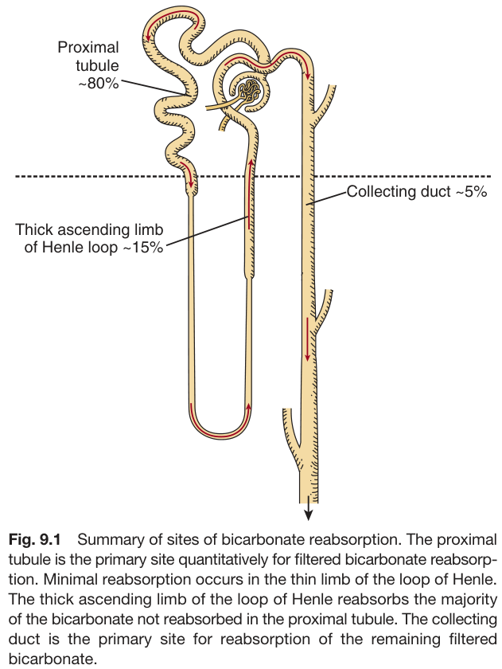

Fig. 9.1 Summary of sites of bicarbonate reabsorption. The proximal tubule is the primary site quantitatively for filtered bicarbonate reabsorp- tion. Minimal reabsorption occurs in the thin limb of the loop of Henle. The thick ascending limb of the loop of Henle reabsorbs the majority of the bicarbonate not reabsorbed in the proximal tubule. The collecting duct is the primary site for reabsorption of the remaining filtered bicarbonate.

---

### Fig_9_2

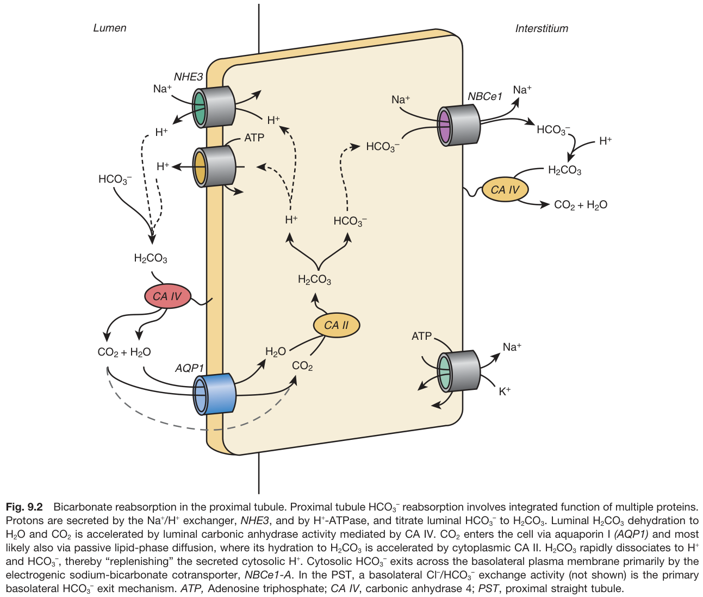

Fig. 9.2 Bicarbonate reabsorption in the proximal tubule. Proximal tubule HCO3 reabsorption involves integrated function of multiple proteins. Protons are secreted by the Na+/H+ exchanger, NHE3, and by H+-ATPase, and titrate luminal HCO3 to H2CO3. Luminal H2CO3 dehydration to H2O and CO2 is accelerated by luminal carbonic anhydrase activity mediated by CA IV. CO2 enters the cell via aquaporin I (AQP1) and most likely also via passive lipid-phase diffusion, where its hydration to H2CO3 is accelerated by cytoplasmic CA II. H2CO3 rapidly dissociates to H+ and HCO3, thereby "replenishing" the secreted cytosolic H+. Cytosolic HCO3 exits across the basolateral plasma membrane primarily by the electrogenic sodium-bicarbonate cotransporter, NBCe1-A. In the PST, a basolateral Cl/HCO3 exchange activity (not shown) is the primary basolateral HCO3 exit mechanism. ATP, Adenosine triphosphate; CA IV, carbonic anhydrase 4; PST, proximal straight tubule.

---

### Fig_9_3

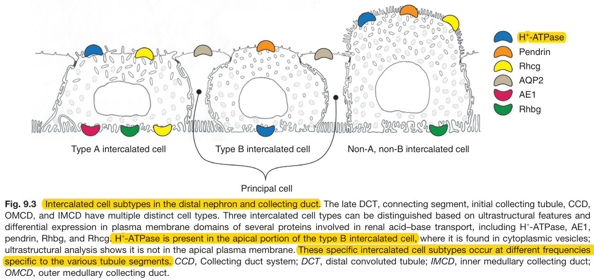

Fig. 9.3 Intercalated cell subtypes in the distal nephron and collecting duct. The late DCT, connecting segment, initial collecting tubule, CCD, OMCD, and IMCD have multiple distinct cell types. Three intercalated cell types can be distinguished based on ultrastructural features and differential expression in plasma membrane domains of several proteins involved in renal acid-base transport, including H+-ATPase, AE1, pendrin, Rhbg, and Rhcg. H+-ATPase is present in the apical portion of the type B intercalated cell, where it is found in cytoplasmic vesicles; ultrastructural analysis shows it is not in the apical plasma membrane. These specific intercalated cell subtypes occur at different frequencies specific to the various tubule segments. CCD, Collecting duct system; DCT, distal convoluted tubule; IMCD, inner medullary collecting duct; OMCD, outer medullary collecting duct.

---

### Fig_9_4

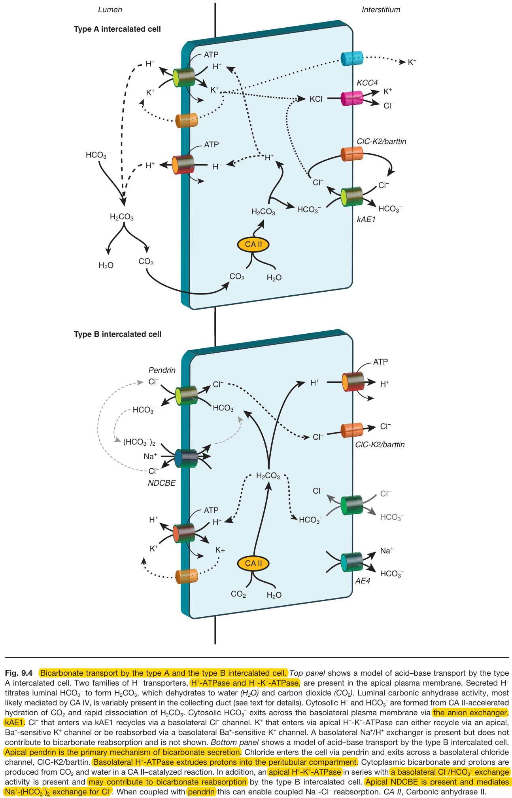

Fig. 9.4 Bicarbonate transport by the type A and the type B intercalated cell. Top panel shows a model of acid-base transport by the type A intercalated cell. Two families of H+ transporters, H+-ATPase and H+-K+-ATPase, are present in the apical plasma membrane. Secreted H+ titrates luminal HCO3 to form H2CO3, which dehydrates to water (H₂O) and carbon dioxide (CO2). Luminal carbonic anhydrase activity, most likely mediated by CA IV, is variably present in the collecting duct (see text for details). Cytosolic H+ and HCO3 are formed from CA II-accelerated hydration of CO2 and rapid dissociation of H2CO3. Cytosolic HCO3 exits across the basolateral plasma membrane via the anion exchanger, KAE1. Cl that enters via kAE1 recycles via a basolateral Cl channel. K+ that enters via apical H+-K+-ATPase can either recycle via an apical, Bat-sensitive K+ channel or be reabsorbed via a basolateral Bat-sensitive K+ channel. A basolateral Na+/H+ exchanger is present but does not contribute to bicarbonate reabsorption and is not shown. Bottom panel shows a model of acid-base transport by the type B intercalated cell. Apical pendrin is the primary mechanism of bicarbonate secretion. Chloride enters the cell via pendrin and exits across a basolateral chloride channel, CIC-K2/barttin. Basolateral H+-ATPase extrudes protons into the peritubular compartment. Cytoplasmic bicarbonate and protons are produced from CO2 and water in a CA II-catalyzed reaction. In addition, an apical H+-K+-ATPase in series with a basolateral Cl-/HCO3 exchange activity is present and may contribute to bicarbonate reabsorption by the type B intercalated cell. Apical NDCBE is present and mediates Na+-(HCO3)2 exchange for Cl. When coupled with pendrin this can enable coupled Na+-Cl reabsorption. CA II, Carbonic anhydrase II.

---

### Fig_9_5

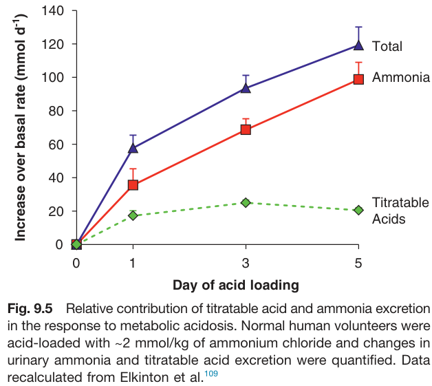

Fig. 9.5 Relative contribution of titratable acid and ammonia excretion in the response to metabolic acidosis. Normal human volunteers were acid-loaded with ~2 mmol/kg of ammonium chloride and changes in urinary ammonia and titratable acid excretion were quantified. Data recalculated from Elkinton et al.

---

### Fig_9_6

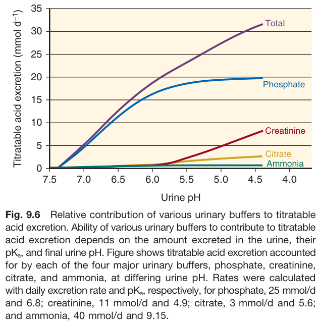

Fig. 9.6 Relative contribution of various urinary buffers to titratable acid excretion. Ability of various urinary buffers to contribute to titratable acid excretion depends on the amount excreted in the urine, their pKa, and final urine pH. Figure shows titratable acid excretion accounted for by each of the four major urinary buffers, phosphate, creatinine, citrate, and ammonia, at differing urine pH. Rates were calculated with daily excretion rate and pKa, respectively, for phosphate, 25 mmol/d and 6.8; creatinine, 11 mmol/d and 4.9; citrate, 3 mmol/d and 5.6; and ammonia, 40 mmol/d and 9.15.

---

### Fig_9_7

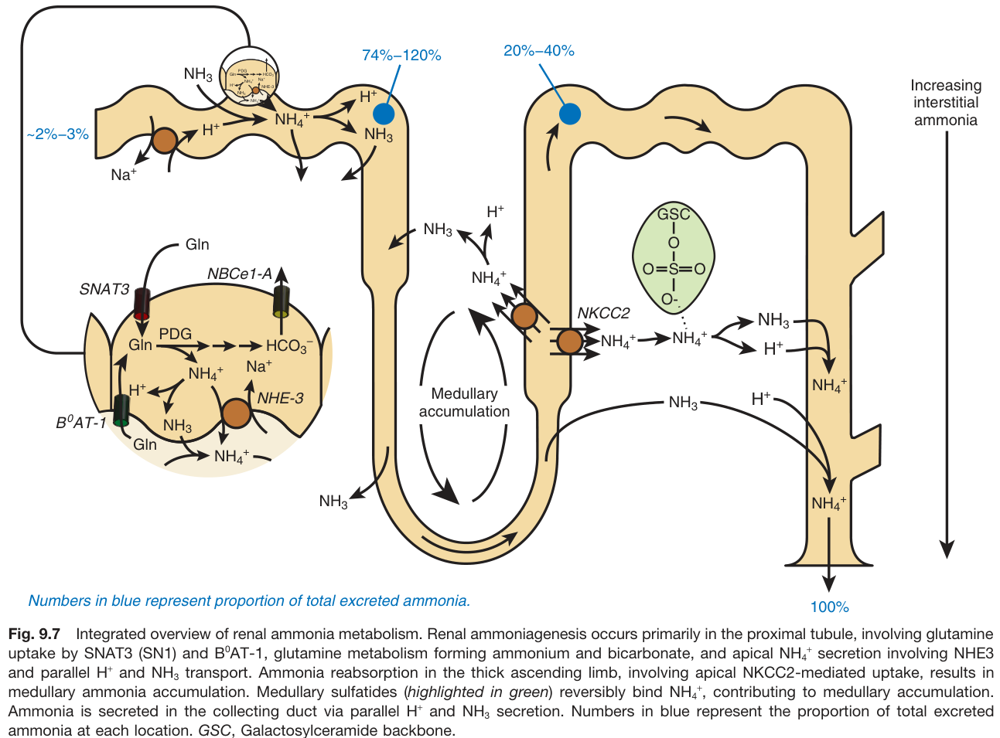

Fig. 9.7 Integrated overview of renal ammonia metabolism. Renal ammoniagenesis occurs primarily in the proximal tubule, involving glutamine uptake by SNAT3 (SN1) and BºAT-1, glutamine metabolism forming ammonium and bicarbonate, and apical NH4+ secretion involving NHE3 and parallel H+ and NH3 transport. Ammonia reabsorption in the thick ascending limb, involving apical NKCC2-mediated uptake, results in medullary ammonia accumulation. Medullary sulfatides (highlighted in green) reversibly bind NH4+, contributing to medullary accumulation. Ammonia is secreted in the collecting duct via parallel H+ and NH3 secretion. Numbers in blue represent the proportion of total excreted ammonia at each location. GSC, Galactosylceramide backbone.

---

### Fig_9_8

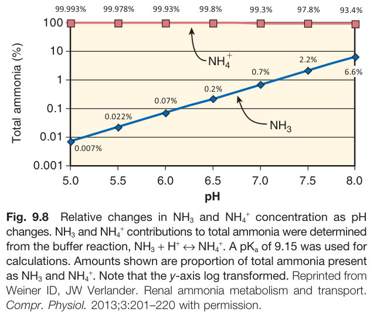

Fig. 9.8 Relative changes in NH3 and NH4+ concentration as pH changes. NH3 and NH4+ contributions to total ammonia were determined from the buffer reaction, NH3 + H+ → NH4+. A pKa of 9.15 was used for calculations. Amounts shown are proportion of total ammonia present as NH3 and NH4+. Note that the y-axis log transformed. Reprinted from Weiner ID, JW Verlander. Renal ammonia metabolism and transport. Compr. Physiol. 2013;3:201-220 with permission.

---

### Fig_9_9

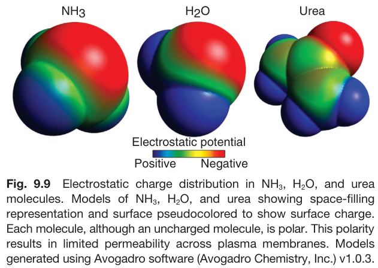

Fig. 9.9 Electrostatic charge distribution in NH3, H2O, and urea molecules. Models of NH3, H2O, and urea showing space-filling representation and surface pseudocolored to show surface charge. Each molecule, although an uncharged molecule, is polar. This polarity results in limited permeability across plasma membranes. Models generated using Avogadro software (Avogadro Chemistry, Inc.) v1.0.3.

---

### Fig_9_10

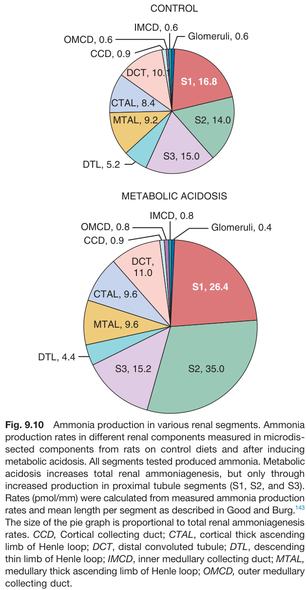

Fig. 9.10 Ammonia production in various renal segments. Ammonia production rates in different renal components measured in microdis- sected components from rats on control diets and after inducing metabolic acidosis. All segments tested produced ammonia. Metabolic acidosis increases total renal ammoniagenesis, but only through increased production in proximal tubule segments (S1, S2, and S3). Rates (pmol/mm) were calculated from measured ammonia production rates and mean length per segment as described in Good and Burg. The size of the pie graph is proportional to total renal ammoniagenesis rates. CCD, Cortical collecting duct; CTAL, cortical thick ascending limb of Henle loop; DCT, distal convoluted tubule; DTL, descending thin limb of Henle loop; IMCD, inner medullary collecting duct; MTAL, medullary thick ascending limb of Henle loop; OMCD, outer medullary collecting duct.

---

### Fig_9_11

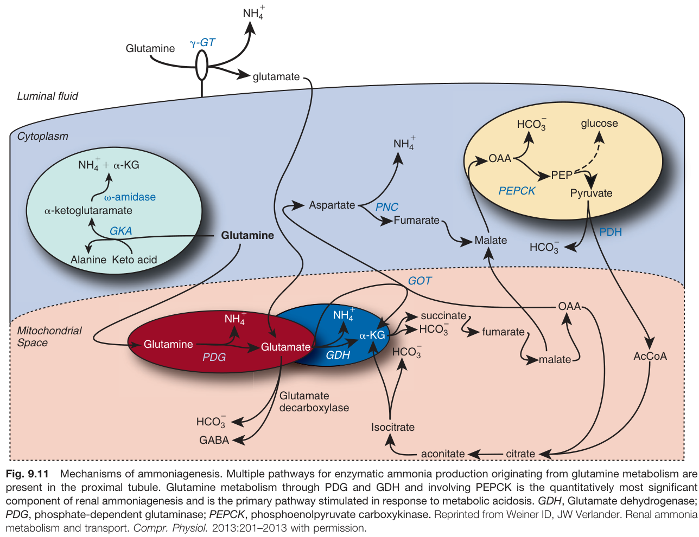

Fig. 9.11 Mechanisms of ammoniagenesis. Multiple pathways for enzymatic ammonia production originating from glutamine metabolism are present in the proximal tubule. Glutamine metabolism through PDG and GDH and involving PEPCK is the quantitatively most significant component of renal ammoniagenesis and is the primary pathway stimulated in response to metabolic acidosis. GDH, Glutamate dehydrogenase; PDG, phosphate-dependent glutaminase; PEPCK, phosphoenolpyruvate carboxykinase. Reprinted from Weiner ID, JW Verlander. Renal ammonia metabolism and transport. Compr. Physiol. 2013:201-2013 with permission.

---

### Fig_9_12

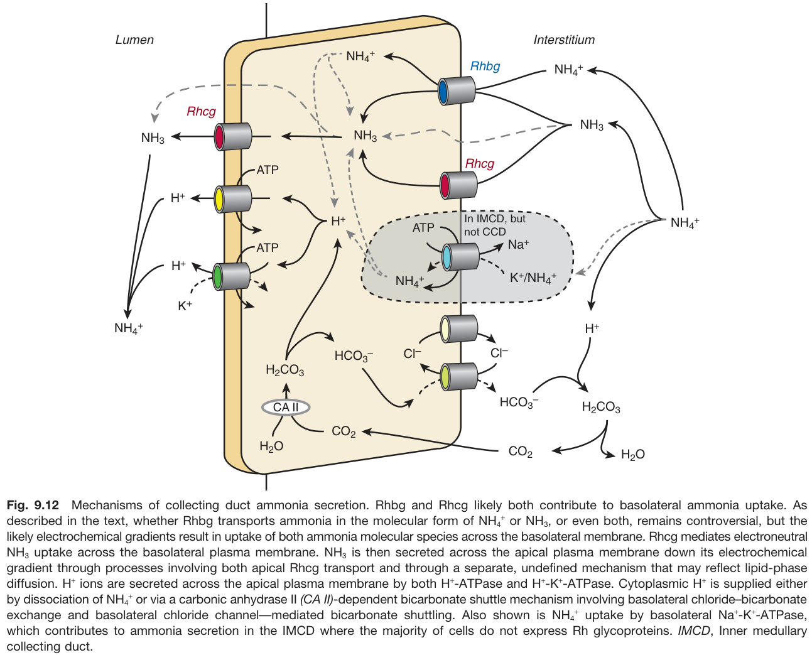

Fig. 9.12 Mechanisms of collecting duct ammonia secretion. Rhbg and Rhcg likely both contribute to basolateral ammonia uptake. As described in the text, whether Rhbg transports ammonia in the molecular form of NH4+ or NH3, or even both, remains controversial, but the likely electrochemical gradients result in uptake of both ammonia molecular species across the basolateral membrane. Rhcg mediates electroneutral NH3 uptake across the basolateral plasma membrane. NH3 is then secreted across the apical plasma membrane down its electrochemical gradient through processes involving both apical Rhcg transport and through a separate, undefined mechanism that may reflect lipid-phase diffusion. H+ ions are secreted across the apical plasma membrane by both H+-ATPase and H+-K+-ATPase. Cytoplasmic H+ is supplied either by dissociation of NH4+ or via a carbonic anhydrase II (CA II)-dependent bicarbonate shuttle mechanism involving basolateral chloride-bicarbonate exchange and basolateral chloride channel-mediated bicarbonate shuttling. Also shown is NH4+ uptake by basolateral Na+-K+-ATPase, which contributes to ammonia secretion in the IMCD where the majority of cells do not express Rh glycoproteins. IMCD, Inner medullary collecting duct.

---

## Tables

### Table_9_1

#### Table Image

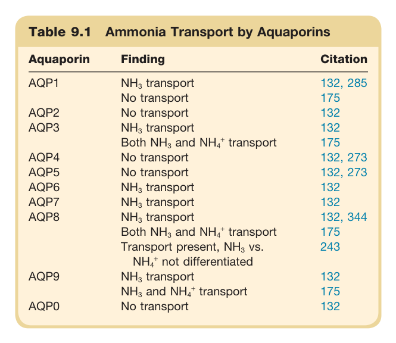

#### Table Data (CSV: [Table_9_1.csv](Table_9_1.csv))

```markdown
| Table Text (OCR) |
| :--- |
| Table 9.1 Ammonia Transport by Aquaporins |
```

Table 9.1 Ammonia Transport by Aquaporins | Aquaporin | Finding | Citation | | --- | --- | --- | | AQP1 | NH3 transport | 132, 285 | | | No transport | 175 | | AQP2 | No transport | 132 | | AQP3 | NH3 transport | 132 | | | Both NH3 and NH4+ transport | 175 | | AQP4 | No transport | 132, 273 | | AQP5 | No transport | 132, 273 | | AQP6 | NH3 transport | 132 | | AQP7 | NH3 transport | 132 | | AQP8 | NH3 transport | 132, 344 | | | Both NH3 and NH4+ transport | 175 | | | Transport present, NH3 vs. NH4+ not differentiated | 243 | | AQP9 | NH3 transport | 132 | | | NH3 and NH4+ transport | 175 | | AQP0 | No transport | 132 |

---

### Table_9_2

#### Table Image

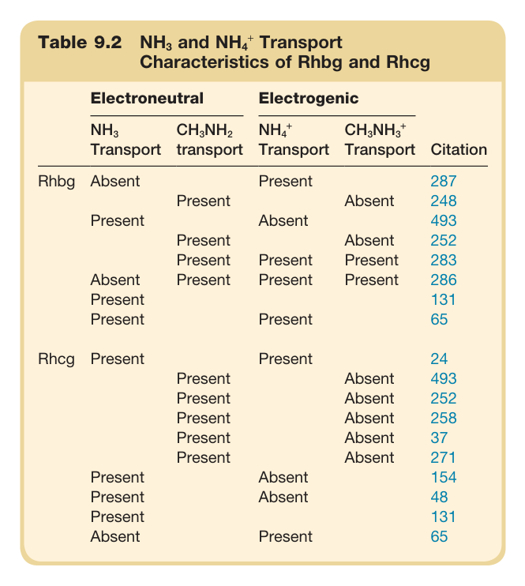

#### Table Data (CSV: [Table_9_2.csv](Table_9_2.csv))

```markdown
| Table Text (OCR) |
| :--- |
| Table 9.2 NH<sub>3</sub> and NH<sub>4</sub><sup>+</sup> Transport Characteristics of Rhbg and Rhcg |
```

Table 9.2 NH3 and NH4+ Transport Characteristics of Rhbg and Rhcg | | Electroneutral | Electrogenic | | | :--- | :--- | :--- | :--- | | | NH3 Transport | CH3NH2 transport | NH4+ Transport | CH3NH3+ Transport | | **Rhbg** | Absent | Present | Absent | Present | | | Present | | | | | | Present | Present | Absent | Absent | | | Present | | | | | | Present | Present | Present | Present | | | Absent | | Present | Present | | | Present | | Present | | | | Present | | Present | | | **Rhcg** | Present | Present | | | | | Present | | Absent | Absent | | | Present | | Absent | Absent | | | Present | | Absent | Absent | | | Present | | Absent | | | | Present | | Absent | | | | Present | | Absent | | | | Present | | Absent | | | | Present | | | | | | Absent | | Present | |

---
