# 10. Urine Concentration and Dilution - Figures and Tables Index

This document lists all figures and tables extracted from `10. Urine Concentration and Dilution.pdf`.

## Table of Contents
- [Figures](#figures)
- [Tables](#tables)

---

## Figures

### Fig_10_1

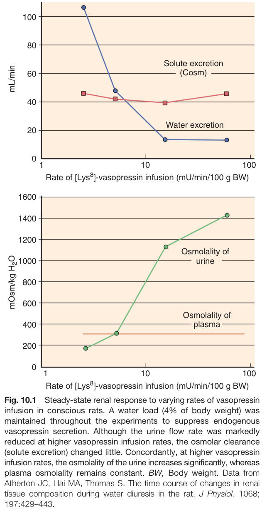

Fig. 10.1 Steady-state renal response to varying rates of vasopressin infusion in conscious rats. A water load (4% of body weight) was maintained throughout the experiments to suppress endogenous vasopressin secretion. Although the urine flow rate was markedly reduced at higher vasopressin infusion rates, the osmolar clearance (solute excretion) changed little. Concordantly, at higher vasopressin infusion rates, the osmolality of the urine increases significantly, whereas plasma osmolality remains constant. BW, Body weight. Data from Atherton JC, Hai MA, Thomas S. The time course of changes in renal tissue composition during water diuresis in the rat. J Physiol. 1068; 197:429-443.

---

### Fig_10_2

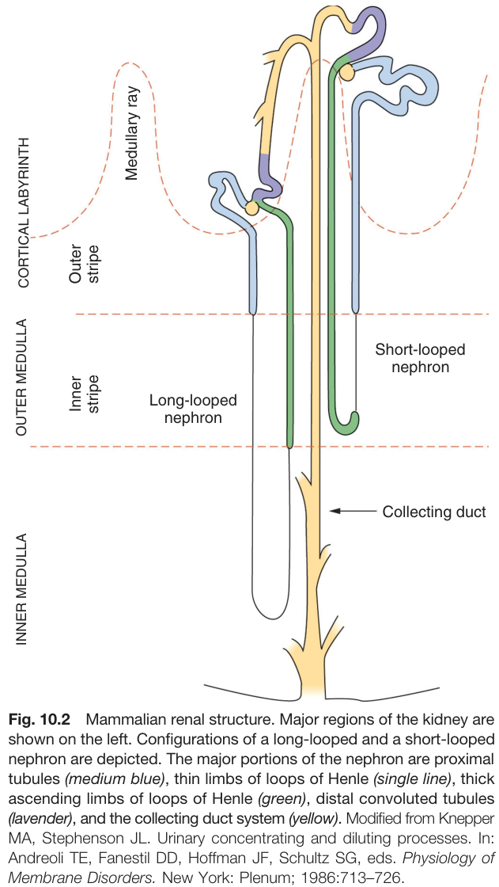

Fig. 10.2 Mammalian renal structure. Major regions of the kidney are shown on the left. Configurations of a long-looped and a short-looped nephron are depicted. The major portions of the nephron are proximal tubules (medium blue), thin limbs of loops of Henle (single line), thick ascending limbs of loops of Henle (green), distal convoluted tubules (lavender), and the collecting duct system (yellow). Modified from Knepper MA, Stephenson JL. Urinary concentrating and diluting processes. In: Andreoli TE, Fanestil DD, Hoffman JF, Schultz SG, eds. Physiology of Membrane Disorders. New York: Plenum; 1986:713-726.

---

### Fig_10_3

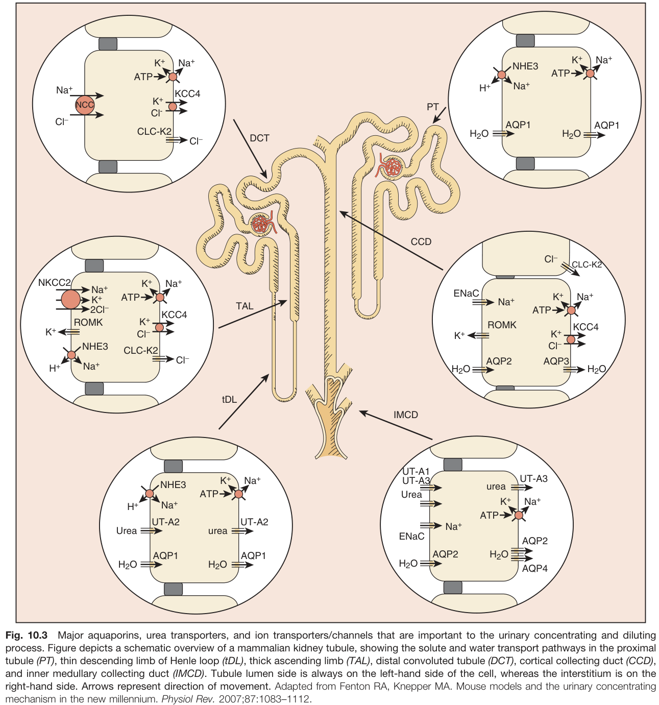

Fig. 10.3 Major aquaporins, urea transporters, and ion transporters/channels that are important to the urinary concentrating and diluting process. Figure depicts a schematic overview of a mammalian kidney tubule, showing the solute and water transport pathways in the proximal tubule (PT), thin descending limb of Henle loop (tDL), thick ascending limb (TAL), distal convoluted tubule (DCT), cortical collecting duct (CCD), and inner medullary collecting duct (IMCD). Tubule lumen side is always on the left-hand side of the cell, whereas the interstitium is on the right-hand side. Arrows represent direction of movement. Adapted from Fenton RA, Knepper MA. Mouse models and the urinary concentrating mechanism in the new millennium. Physiol Rev. 2007;87:1083-1112.

---

### Fig_10_4

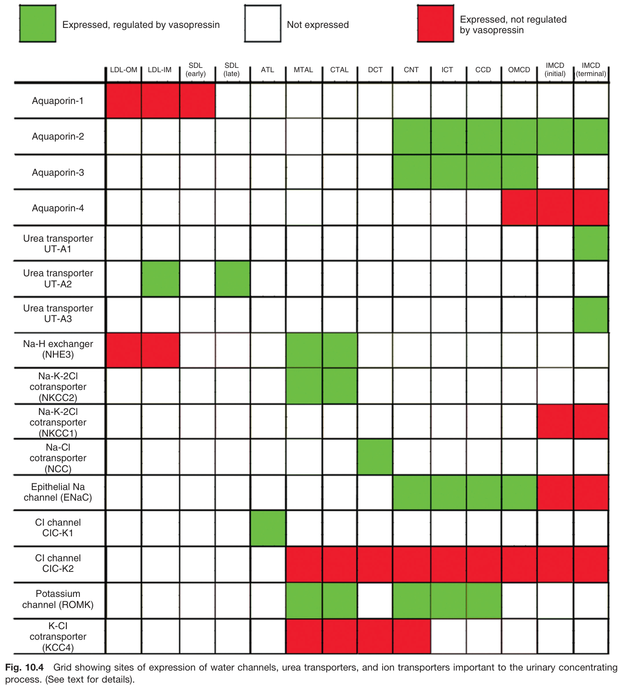

Fig. 10.4 Grid showing sites of expression of water channels, urea transporters, and ion transporters important to the urinary concentrating process. (See text for details).

---

### Fig_10_5

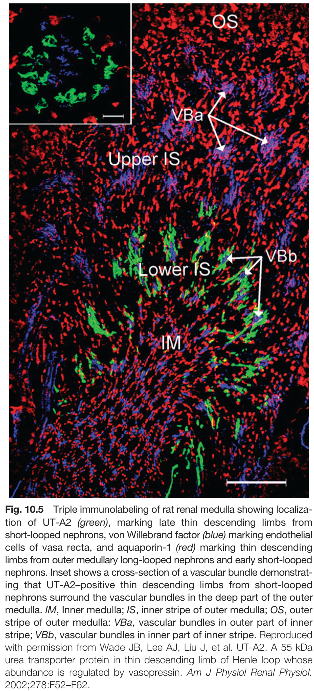

Fig. 10.5 Triple immunolabeling of rat renal medulla showing localization of UT-A2 (green), marking late thin descending limbs from short-looped nephrons, von Willebrand factor (blue) marking endothelial cells of vasa recta, and aquaporin-1 (red) marking thin descending limbs from outer medullary long-looped nephrons and early short-looped nephrons. Inset shows a cross-section of a vascular bundle demonstrating that UT-A2-positive thin descending limbs from short-looped nephrons surround the vascular bundles in the deep part of the outer medulla. IM, Inner medulla; IS, inner stripe of outer medulla; OS, outer stripe of outer medulla: VBa, vascular bundles in outer part of inner stripe; VBb, vascular bundles in inner part of inner stripe. Reproduced with permission from Wade JB, Lee AJ, Liu J, et al. UT-A2. A 55 kDa urea transporter protein in thin descending limb of Henle loop whose abundance is regulated by vasopressin. Am J Physiol Renal Physiol. 2002;278:F52-F62.

---

### Fig_10_6

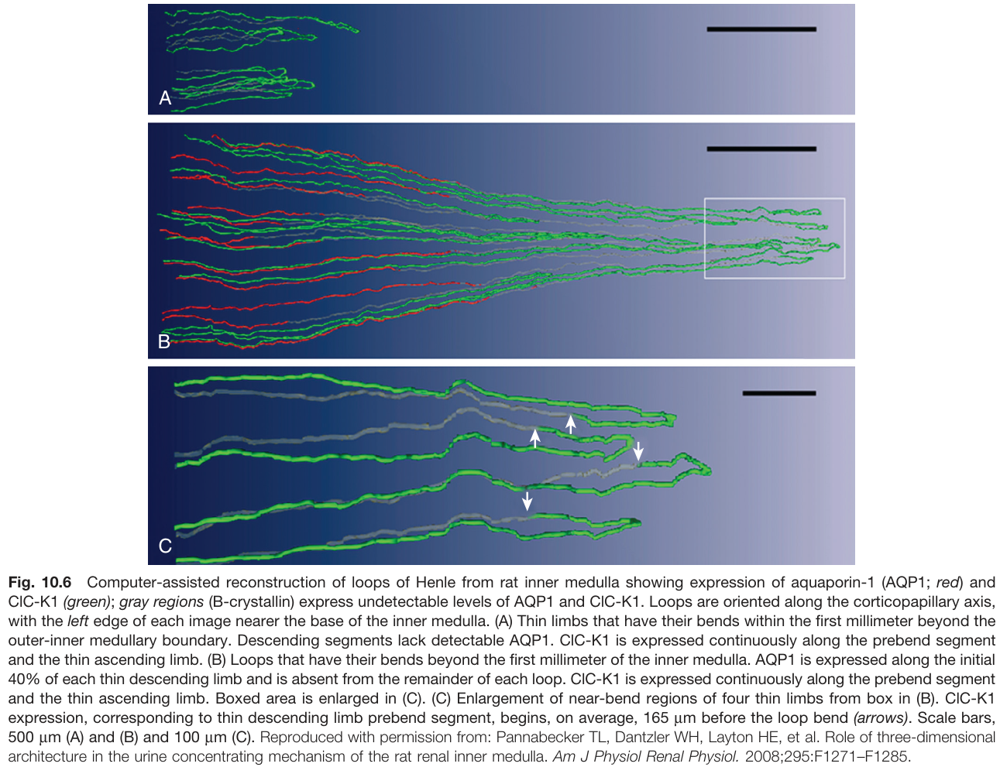

Fig. 10.6 Computer-assisted reconstruction of loops of Henle from rat inner medulla showing expression of aquaporin-1 (AQP1; red) and CIC-K1 (green); gray regions (B-crystallin) express undetectable levels of AQP1 and CIC-K1. Loops are oriented along the corticopapillary axis, with the left edge of each image nearer the base of the inner medulla. (A) Thin limbs that have their bends within the first millimeter beyond the outer-inner medullary boundary. Descending segments lack detectable AQP1. CIC-K1 is expressed continuously along the prebend segment and the thin ascending limb. (B) Loops that have their bends beyond the first millimeter of the inner medulla. AQP1 is expressed along the initial 40% of each thin descending limb and is absent from the remainder of each loop. CIC-K1 is expressed continuously along the prebend segment and the thin ascending limb. Boxed area is enlarged in (C). (C) Enlargement of near-bend regions of four thin limbs from box in (B). CIC-K1 expression, corresponding to thin descending limb prebend segment, begins, on average, 165 µm before the loop bend (arrows). Scale bars, 500 µm (A) and (B) and 100 µm (C). Reproduced with permission from: Pannabecker TL, Dantzler WH, Layton HE, et al. Role of three-dimensional architecture in the urine concentrating mechanism of the rat renal inner medulla. Am J Physiol Renal Physiol. 2008;295:F1271-F1285.

---

### Fig_10_7

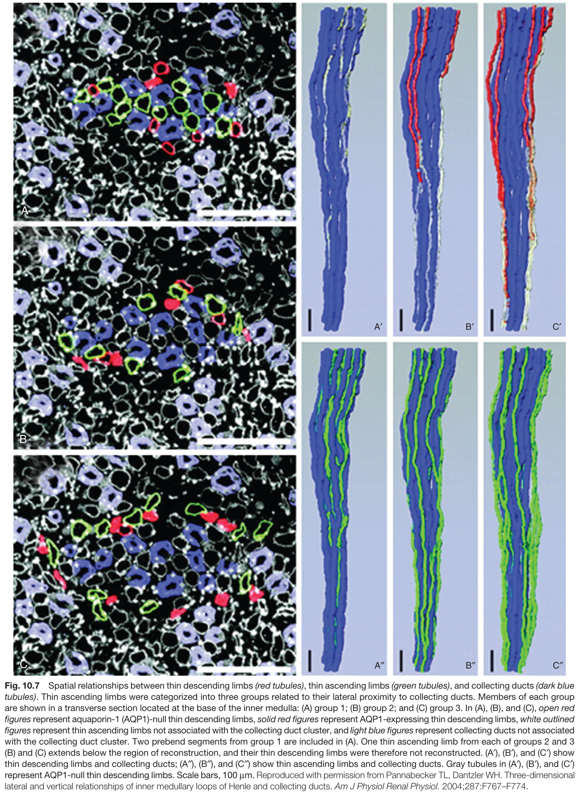

Fig. 10.7 Spatial relationships between thin descending limbs (red tubules), thin ascending limbs (green tubules), and collecting ducts (dark blue tubules). Thin ascending limbs were categorized into three groups related to their lateral proximity to collecting ducts. Members of each group are shown in a transverse section located at the base of the inner medulla: (A) group 1; (B) group 2; and (C) group 3. In (A), (B), and (C), open red figures represent aquaporin-1 (AQP1)-null thin descending limbs, solid red figures represent AQP1-expressing thin descending limbs, white outlined figures represent thin ascending limbs not associated with the collecting duct cluster, and light blue figures represent collecting ducts not associated with the collecting duct cluster. Two prebend segments from group 1 are included in (A). One thin ascending limb from each of groups 2 and 3 (B) and (C) extends below the region of reconstruction, and their thin descending limbs were therefore not reconstructed. (A'), (B'), and (C') show thin descending limbs and collecting ducts; (A'), (B"), and (C') show thin ascending limbs and collecting ducts. Gray tubules in (A'), (B'), and (C') represent AQP1-null thin descending limbs. Scale bars, 100 µm. Reproduced with permission from Pannabecker TL, Dantzler WH. Three-dimensional lateral and vertical relationships of inner medullary loops of Henle and collecting ducts. Am J Physiol Renal Physiol. 2004;287:F767-F774.

---

### Fig_10_8

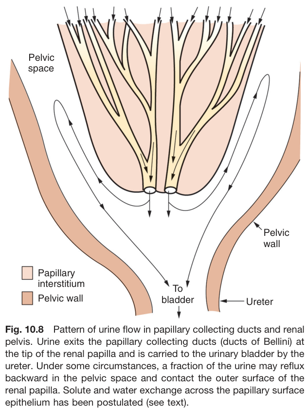

Fig. 10.8 Pattern of urine flow in papillary collecting ducts and renal pelvis. Urine exits the papillary collecting ducts (ducts of Bellini) at the tip of the renal papilla and is carried to the urinary bladder by the ureter. Under some circumstances, a fraction of the urine may reflux backward in the pelvic space and contact the outer surface of the renal papilla. Solute and water exchange across the papillary surface epithelium has been postulated (see text).

---

### Fig_10_9

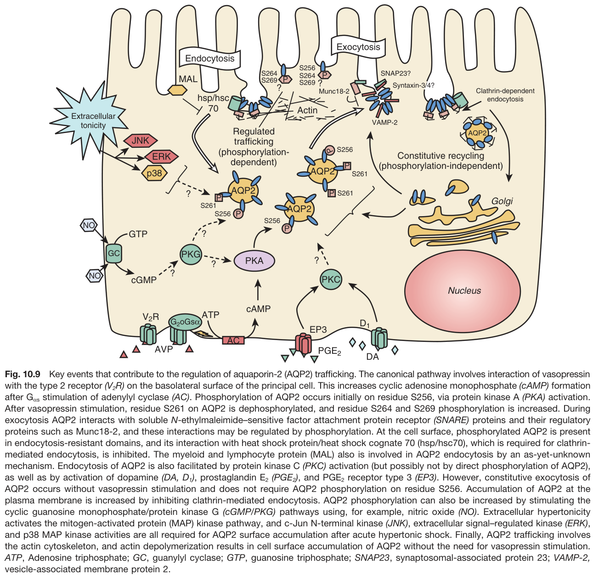

Fig. 10.9 Key events that contribute to the regulation of aquaporin-2 (AQP2) trafficking. The canonical pathway involves interaction of vasopressin with the type 2 receptor (V2R) on the basolateral surface of the principal cell. This increases cyclic adenosine monophosphate (cAMP) formation after Gas stimulation of adenylyl cyclase (AC). Phosphorylation of AQP2 occurs initially on residue S256, via protein kinase A (PKA) activation. After vasopressin stimulation, residue S261 on AQP2 is dephosphorylated, and residue S264 and S269 phosphorylation is increased. During exocytosis AQP2 interacts with soluble N-ethylmaleimide-sensitive factor attachment protein receptor (SNARE) proteins and their regulatory proteins such as Munc18-2, and these interactions may be regulated by phosphorylation. At the cell surface, phosphorylated AQP2 is present in endocytosis-resistant domains, and its interaction with heat shock protein/heat shock cognate 70 (hsp/hsc70), which is required for clathrin-mediated endocytosis, is inhibited. The myeloid and lymphocyte protein (MAL) also is involved in AQP2 endocytosis by an as-yet-unknown mechanism. Endocytosis of AQP2 is also facilitated by protein kinase C (PKC) activation (but possibly not by direct phosphorylation of AQP2), as well as by activation of dopamine (DA, D₁), prostaglandin E2 (PGE2), and PGE2 receptor type 3 (EP3). However, constitutive exocytosis of AQP2 occurs without vasopressin stimulation and does not require AQP2 phosphorylation on residue S256. Accumulation of AQP2 at the plasma membrane is increased by inhibiting clathrin-mediated endocytosis. AQP2 phosphorylation can also be increased by stimulating the cyclic guanosine monophosphate/protein kinase G (cGMP/PKG) pathways using, for example, nitric oxide (NO). Extracellular hypertonicity activates the mitogen-activated protein (MAP) kinase pathway, and c-Jun N-terminal kinase (JNK), extracellular signal-regulated kinase (ERK), and p38 MAP kinase activities are all required for AQP2 surface accumulation after acute hypertonic shock. Finally, AQP2 trafficking involves the actin cytoskeleton, and actin depolymerization results in cell surface accumulation of AQP2 without the need for vasopressin stimulation. ATP, Adenosine triphosphate; GC, guanylyl cyclase; GTP, guanosine triphosphate; SNAP23, synaptosomal-associated protein 23; VAMP-2, vesicle-associated membrane protein 2.

---

### Fig_10_10

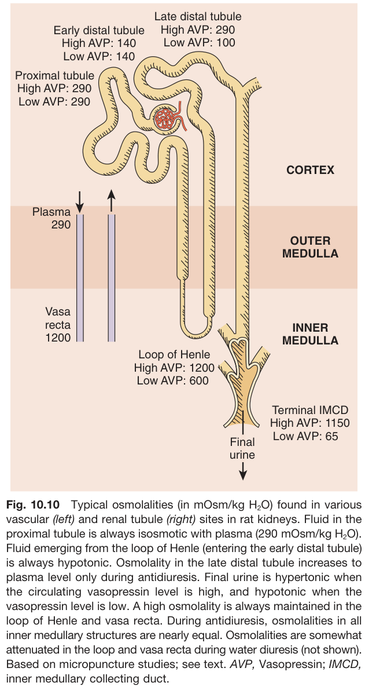

Fig. 10.10 Typical osmolalities (in mOsm/kg H₂O) found in various vascular (left) and renal tubule (right) sites in rat kidneys. Fluid in the proximal tubule is always isosmotic with plasma (290 mOsm/kg H₂O). Fluid emerging from the loop of Henle (entering the early distal tubule) is always hypotonic. Osmolality in the late distal tubule increases to plasma level only during antidiuresis. Final urine is hypertonic when the circulating vasopressin level is high, and hypotonic when the vasopressin level is low. A high osmolality is always maintained in the loop of Henle and vasa recta. During antidiuresis, osmolalities in all inner medullary structures are nearly equal. Osmolalities are somewhat attenuated in the loop and vasa recta during water diuresis (not shown). Based on micropuncture studies; see text. AVP, Vasopressin; IMCD, inner medullary collecting duct.

---

### Fig_10_11

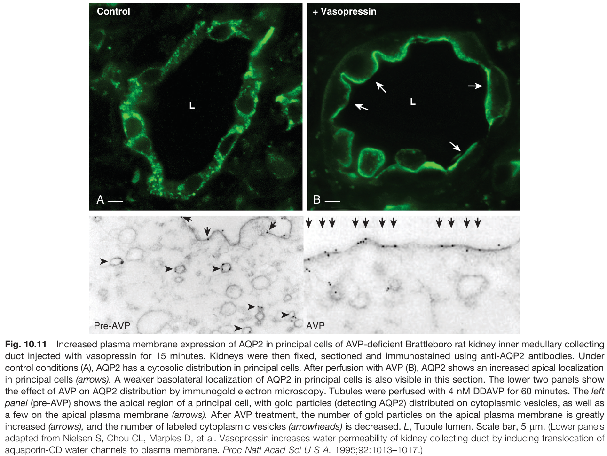

Fig. 10.11 Increased plasma membrane expression of AQP2 in principal cells of AVP-deficient Brattleboro rat kidney inner medullary collecting duct injected with vasopressin for 15 minutes. Kidneys were then fixed, sectioned and immunostained using anti-AQP2 antibodies. Under control conditions (A), AQP2 has a cytosolic distribution in principal cells. After perfusion with AVP (B), AQP2 shows an increased apical localization in principal cells (arrows). A weaker basolateral localization of AQP2 in principal cells is also visible in this section. The lower two panels show the effect of AVP on AQP2 distribution by immunogold electron microscopy. Tubules were perfused with 4 nM DDAVP for 60 minutes. The left panel (pre-AVP) shows the apical region of a principal cell, with gold particles (detecting AQP2) distributed on cytoplasmic vesicles, as well as a few on the apical plasma membrane (arrows). After AVP treatment, the number of gold particles on the apical plasma membrane is greatly increased (arrows), and the number of labeled cytoplasmic vesicles (arrowheads) is decreased. L, Tubule lumen. Scale bar, 5 µm. (Lower panels adapted from Nielsen S, Chou CL, Marples D, et al. Vasopressin increases water permeability of kidney collecting duct by inducing translocation of aquaporin-CD water channels to plasma membrane. Proc Natl Acad Sci US A. 1995;92:1013-1017.)

---

### Fig_10_12

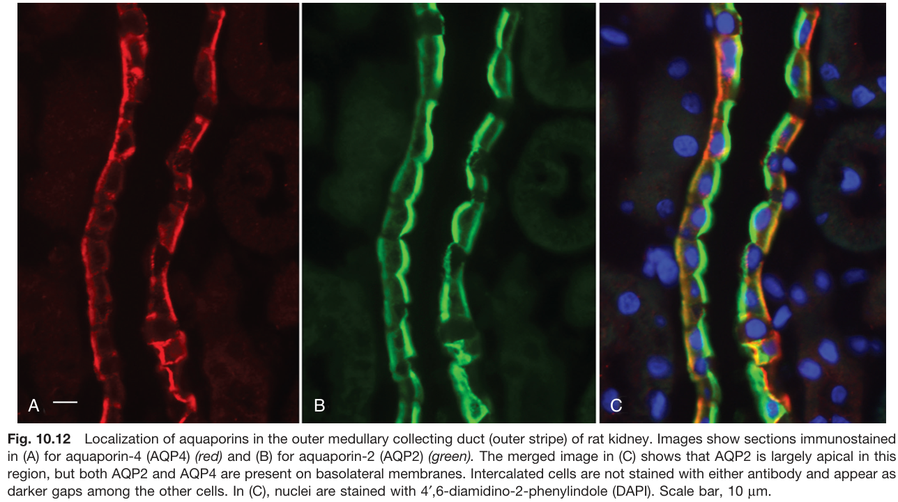

Fig. 10.12 Localization of aquaporins in the outer medullary collecting duct (outer stripe) of rat kidney. Images show sections immunostained in (A) for aquaporin-4 (AQP4) (red) and (B) for aquaporin-2 (AQP2) (green). The merged image in (C) shows that AQP2 is largely apical in this region, but both AQP2 and AQP4 are present on basolateral membranes. Intercalated cells are not stained with either antibody and appear as darker gaps among the other cells. In (C), nuclei are stained with 4',6-diamidino-2-phenylindole (DAPI). Scale bar, 10 μm.

---

### Fig_10_13

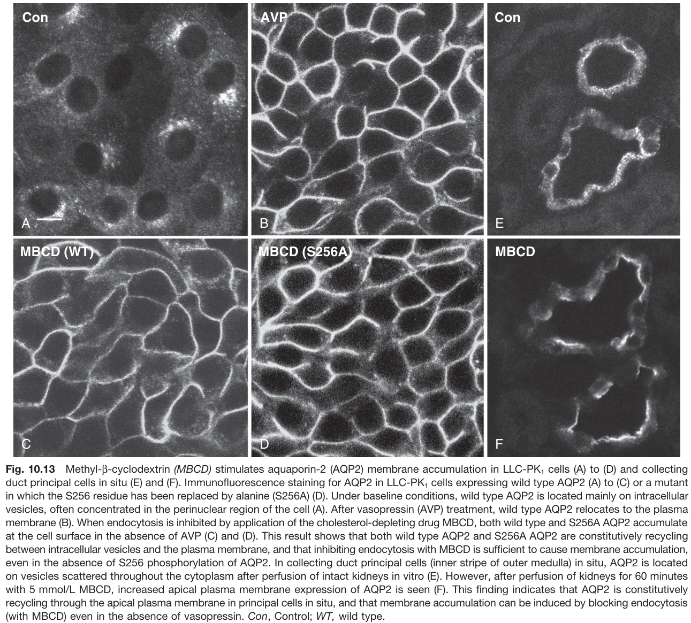

Fig. 10.13 Methyl-β-cyclodextrin (MBCD) stimulates aquaporin-2 (AQP2) membrane accumulation in LLC-PK, cells (A) to (D) and collecting duct principal cells in situ (E) and (F). Immunofluorescence staining for AQP2 in LLC-PK₁ cells expressing wild type AQP2 (A) to (C) or a mutant in which the S256 residue has been replaced by alanine (S256A) (D). Under baseline conditions, wild type AQP2 is located mainly on intracellular vesicles, often concentrated in the perinuclear region of the cell (A). After vasopressin (AVP) treatment, wild type AQP2 relocates to the plasma membrane (B). When endocytosis is inhibited by application of the cholesterol-depleting drug MBCD, both wild type and S256A AQP2 accumulate at the cell surface in the absence of AVP (C) and (D). This result shows that both wild type AQP2 and S256A AQP2 are constitutively recycling between intracellular vesicles and the plasma membrane, and that inhibiting endocytosis with MBCD is sufficient to cause membrane accumulation, even in the absence of S256 phosphorylation of AQP2. In collecting duct principal cells (inner stripe of outer medulla) in situ, AQP2 is located on vesicles scattered throughout the cytoplasm after perfusion of intact kidneys in vitro (E). However, after perfusion of kidneys for 60 minutes with 5 mmol/L MBCD, increased apical plasma membrane expression of AQP2 is seen (F). This finding indicates that AQP2 is constitutively recycling through the apical plasma membrane in principal cells in situ, and that membrane accumulation can be induced by blocking endocytosis (with MBCD) even in the absence of vasopressin. Con, Control; WT, wild type.

---

### Fig_10_14

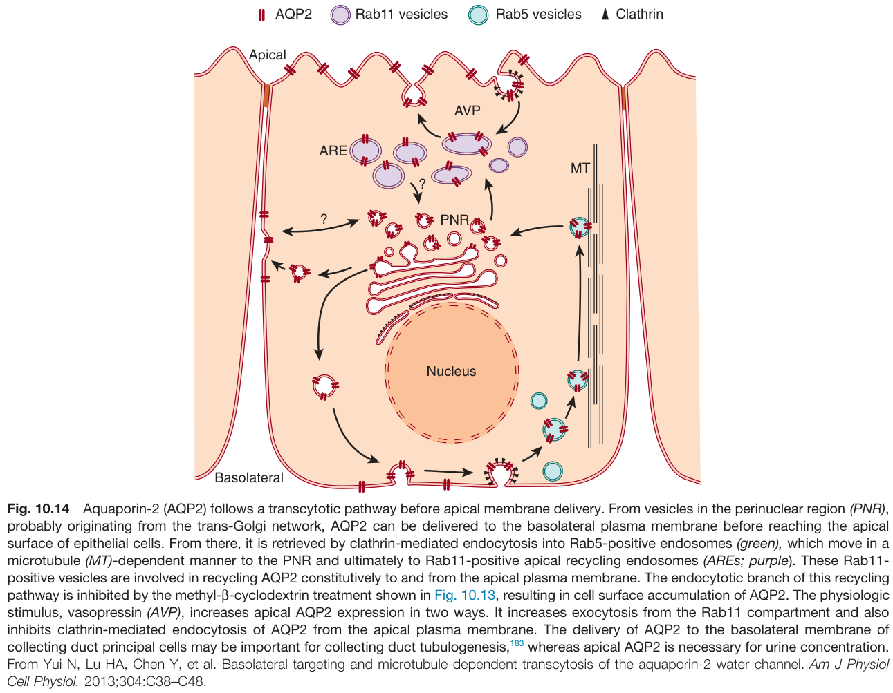

Fig. 10.14 Aquaporin-2 (AQP2) follows a transcytotic pathway before apical membrane delivery. From vesicles in the perinuclear region (PNR), probably originating from the trans-Golgi network, AQP2 can be delivered to the basolateral plasma membrane before reaching the apical surface of epithelial cells. From there, it is retrieved by clathrin-mediated endocytosis into Rab5-positive endosomes (green), which move in a microtubule (MT)-dependent manner to the PNR and ultimately to Rab11-positive apical recycling endosomes (AREs; purple). These Rab11-positive vesicles are involved in recycling AQP2 constitutively to and from the apical plasma membrane. The endocytotic branch of this recycling pathway is inhibited by the methyl-ẞ-cyclodextrin treatment shown in Fig. 10.13, resulting in cell surface accumulation of AQP2. The physiologic stimulus, vasopressin (AVP), increases apical AQP2 expression in two ways. It increases exocytosis from the Rab11 compartment and also inhibits clathrin-mediated endocytosis of AQP2 from the apical plasma membrane. The delivery of AQP2 to the basolateral membrane of collecting duct principal cells may be important for collecting duct tubulogenesis, whereas apical AQP2 is necessary for urine concentration. From Yui N, Lu HA, Chen Y, et al. Basolateral targeting and microtubule-dependent transcytosis of the aquaporin-2 water channel. Am J Physiol Cell Physiol. 2013;304:C38-C48.

---

### Fig_10_15

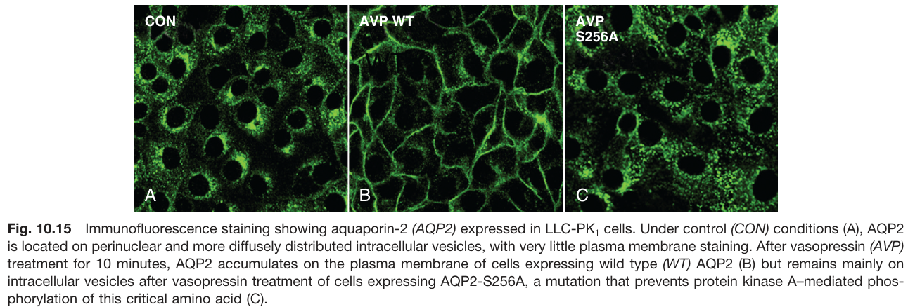

Fig. 10.15 Immunofluorescence staining showing aquaporin-2 (AQP2) expressed in LLC-PK₁ cells. Under control (CON) conditions (A), AQP2 is located on perinuclear and more diffusely distributed intracellular vesicles, with very little plasma membrane staining. After vasopressin (AVP) treatment for 10 minutes, AQP2 accumulates on the plasma membrane of cells expressing wild type (WT) AQP2 (B) but remains mainly on intracellular vesicles after vasopressin treatment of cells expressing AQP2-S256A, a mutation that prevents protein kinase A-mediated phosphorylation of this critical amino acid (C).

---

### Fig_10_16

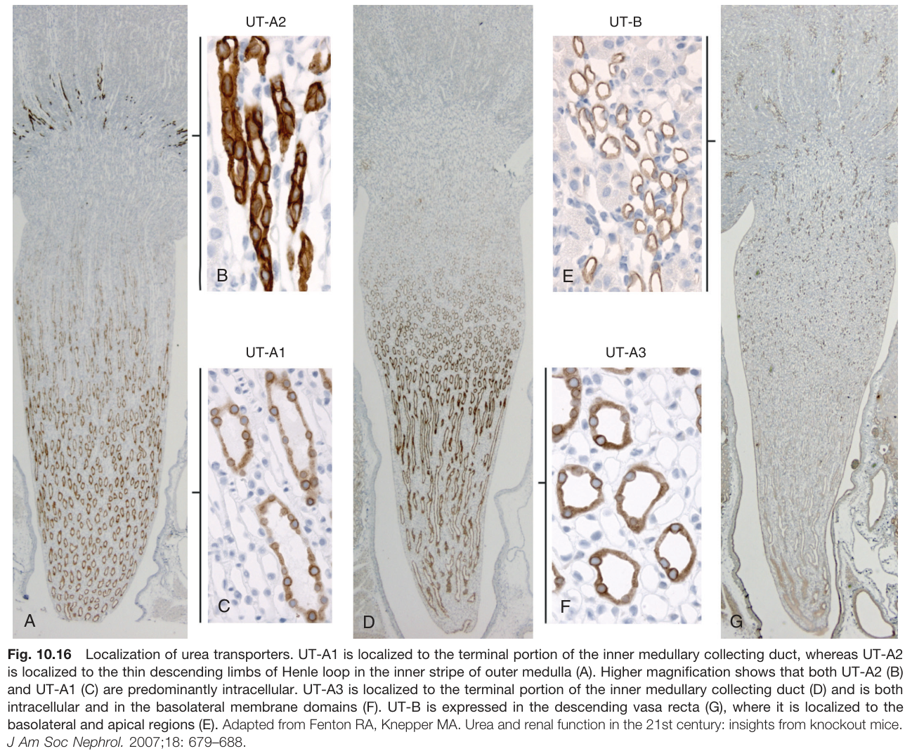

Fig. 10.16 Localization of urea transporters. UT-A1 is localized to the terminal portion of the inner medullary collecting duct, whereas UT-A2 is localized to the thin descending limbs of Henle loop in the inner stripe of outer medulla (A). Higher magnification shows that both UT-A2 (B) and UT-A1 (C) are predominantly intracellular. UT-A3 is localized to the terminal portion of the inner medullary collecting duct (D) and is both intracellular and in the basolateral membrane domains (F). UT-B is expressed in the descending vasa recta (G), where it is localized to the basolateral and apical regions (E). Adapted from Fenton RA, Knepper MA. Urea and renal function in the 21st century: insights from knockout mice. J Am Soc Nephrol. 2007;18: 679-688.

---

### Fig_10_17

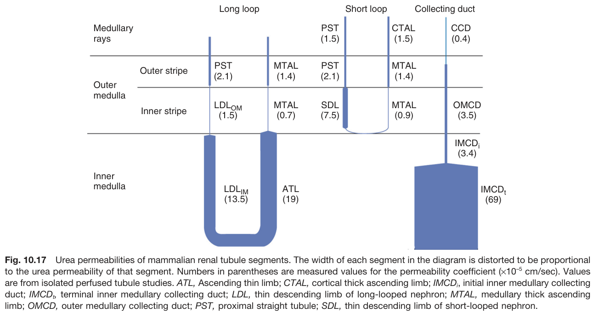

Fig. 10.17 Urea permeabilities of mammalian renal tubule segments. The width of each segment in the diagram is distorted to be proportional to the urea permeability of that segment. Numbers in parentheses are measured values for the permeability coefficient (×10-5 cm/sec). Values are from isolated perfused tubule studies. ATL, Ascending thin limb; CTAL, cortical thick ascending limb; IMCD;, initial inner medullary collecting duct; IMCD, terminal inner medullary collecting duct; LDL, thin descending limb of long-looped nephron; MTAL, medullary thick ascending limb; OMCD, outer medullary collecting duct; PST, proximal straight tubule; SDL, thin descending limb of short-looped nephron.

---

### Fig_10_18

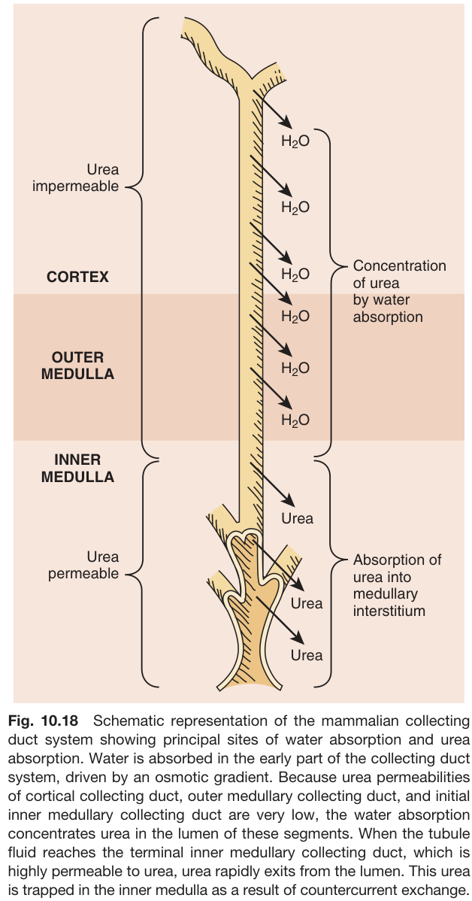

Fig. 10.18 Schematic representation of the mammalian collecting duct system showing principal sites of water absorption and urea absorption. Water is absorbed in the early part of the collecting duct system, driven by an osmotic gradient. Because urea permeabilities of cortical collecting duct, outer medullary collecting duct, and initial inner medullary collecting duct are very low, the water absorption concentrates urea in the lumen of these segments. When the tubule fluid reaches the terminal inner medullary collecting duct, which is highly permeable to urea, urea rapidly exits from the lumen. This urea is trapped in the inner medulla as a result of countercurrent exchange.

---

### Fig_10_19

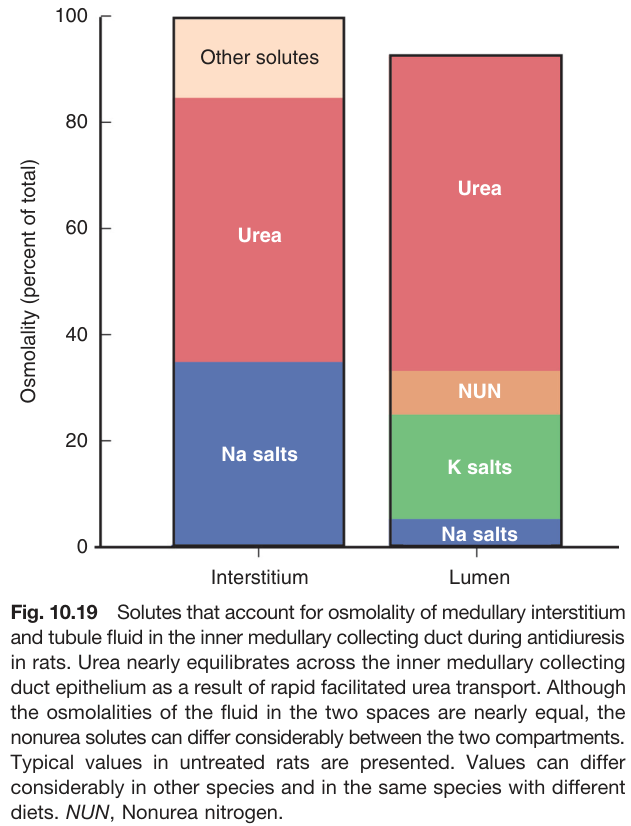

Fig. 10.19 Solutes that account for osmolality of medullary interstitium and tubule fluid in the inner medullary collecting duct during antidiuresis in rats. Urea nearly equilibrates across the inner medullary collecting duct epithelium as a result of rapid facilitated urea transport. Although the osmolalities of the fluid in the two spaces are nearly equal, the nonurea solutes can differ considerably between the two compartments. Typical values in untreated rats are presented. Values can differ considerably in other species and in the same species with different diets. NUN, Nonurea nitrogen.

---

### Fig_10_20

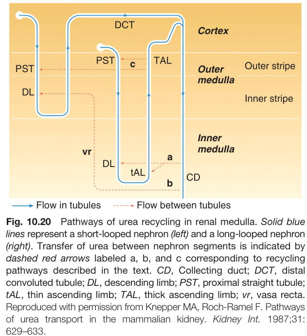

Fig. 10.20 Pathways of urea recycling in renal medulla. Solid blue lines represent a short-looped nephron (left) and a long-looped nephron (right). Transfer of urea between nephron segments is indicated by dashed red arrows labeled a, b, and c corresponding to recycling pathways described in the text. CD, Collecting duct; DCT, distal convoluted tubule; DL, descending limb; PST, proximal straight tubule; tAL, thin ascending limb; TAL, thick ascending limb; vr, vasa recta. Reproduced with permission from Knepper MA, Roch-Ramel F. Pathways of urea transport in the mammalian kidney. Kidney Int. 1987;31: 629-633.

---

### Fig_10_21

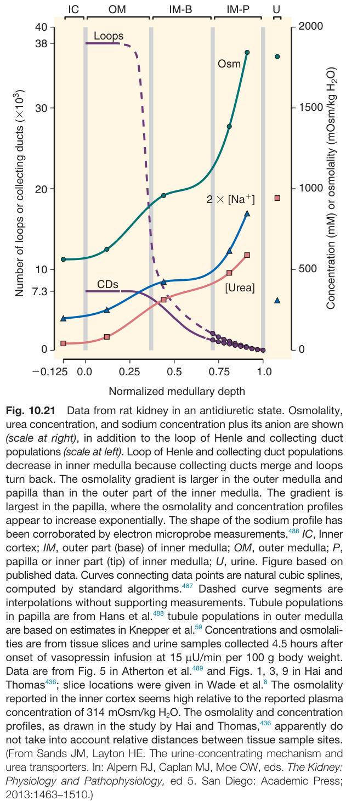

Fig. 10.21 Data from rat kidney in an antidiuretic state. Osmolality, urea concentration, and sodium concentration plus its anion are shown (scale at right), in addition to the loop of Henle and collecting duct populations (scale at left). Loop of Henle and collecting duct populations decrease in inner medulla because collecting ducts merge and loops turn back. The osmolality gradient is larger in the outer medulla and papilla than in the outer part of the inner medulla. The gradient is largest in the papilla, where the osmolality and concentration profiles appear to increase exponentially. The shape of the sodium profile has been corroborated by electron microprobe measurements. IC, Inner cortex; IM, outer part (base) of inner medulla; OM, outer medulla; P, papilla or inner part (tip) of inner medulla; U, urine. Figure based on published data. Curves connecting data points are natural cubic splines, computed by standard algorithms. Dashed curve segments are interpolations without supporting measurements. Tubule populations in papilla are from Hans et al. tubule populations in outer medulla are based on estimates in Knepper et al. Concentrations and osmolalities are from tissue slices and urine samples collected 4.5 hours after onset of vasopressin infusion at 15 µU/min per 100 g body weight. Data are from Fig. 5 in Atherton et al. and Figs. 1, 3, 9 in Hai and Thomas; slice locations were given in Wade et al. The osmolality reported in the inner cortex seems high relative to the reported plasma concentration of 314 mOsm/kg H2O. The osmolality and concentration profiles, as drawn in the study by Hai and Thomas, apparently do not take into account relative distances between tissue sample sites. (From Sands JM, Layton HE. The urine-concentrating mechanism and urea transporters. In: Alpern RJ, Caplan MJ, Moe OW, eds. The Kidney: Physiology and Pathophysiology, ed 5. San Diego: Academic Press; 2013:1463-1510.)

---

### Fig_10_22

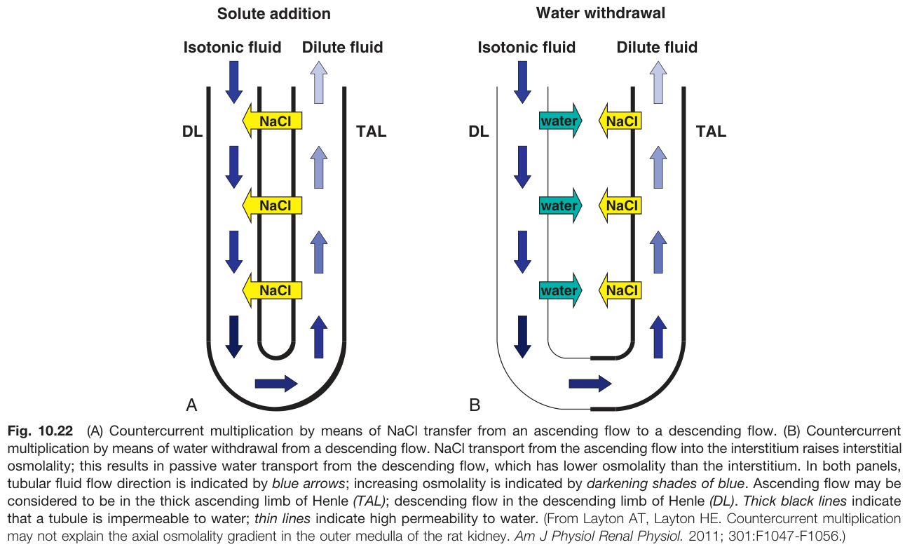

Fig. 10.22 (A) Countercurrent multiplication by means of NaCl transfer from an ascending flow to a descending flow. (B) Countercurrent multiplication by means of water withdrawal from a descending flow. NaCl transport from the ascending flow into the interstitium raises interstitial osmolality; this results in passive water transport from the descending flow, which has lower osmolality than the interstitium. In both panels, tubular fluid flow direction is indicated by blue arrows; increasing osmolality is indicated by darkening shades of blue. Ascending flow may be considered to be in the thick ascending limb of Henle (TAL); descending flow in the descending limb of Henle (DL). Thick black lines indicate that a tubule is impermeable to water; thin lines indicate high permeability to water. (From Layton AT, Layton HE. Countercurrent multiplication may not explain the axial osmolality gradient in the outer medulla of the rat kidney. Am J Physiol Renal Physiol. 2011; 301:F1047-F1056.)

---

### Fig_10_23

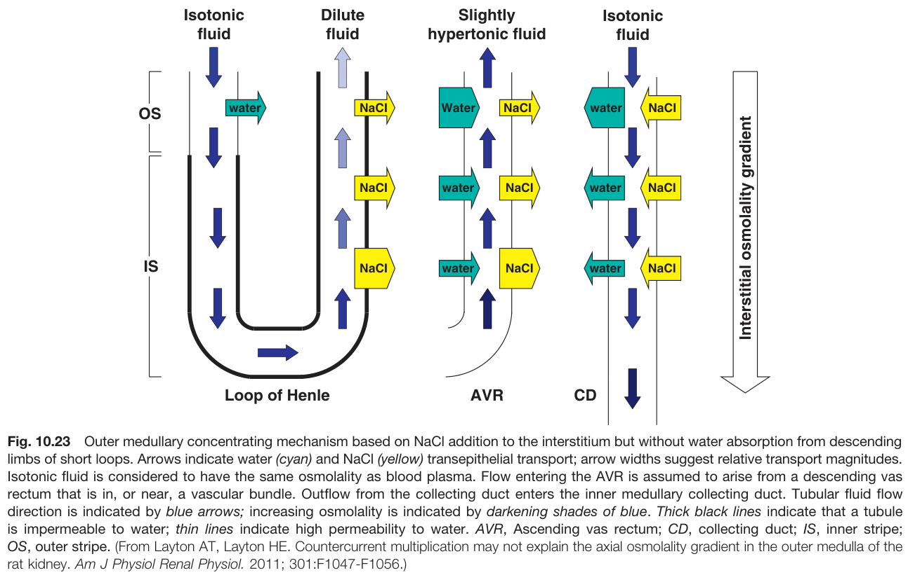

Fig. 10.23 Outer medullary concentrating mechanism based on NaCl addition to the interstitium but without water absorption from descending limbs of short loops. Arrows indicate water (cyan) and NaCl (yellow) transepithelial transport; arrow widths suggest relative transport magnitudes. Isotonic fluid is considered to have the same osmolality as blood plasma. Flow entering the AVR is assumed to arise from a descending vas rectum that is in, or near, a vascular bundle. Outflow from the collecting duct enters the inner medullary collecting duct. Tubular fluid flow direction is indicated by blue arrows; increasing osmolality is indicated by darkening shades of blue. Thick black lines indicate that a tubule is impermeable to water; thin lines indicate high permeability to water. AVR, Ascending vas rectum; CD, collecting duct; IS, inner stripe; OS, outer stripe. (From Layton AT, Layton HE. Countercurrent multiplication may not explain the axial osmolality gradient in the outer medulla of the rat kidney. Am J Physiol Renal Physiol. 2011; 301:F1047-F1056.)

---

## Tables

*No tables resolved for this chapter.*
