# 11. Vasoactive Molecules and the Kidney - Figures and Tables Index

This document lists all figures and tables extracted from `11. Vasoactive Molecules and the Kidney.pdf`.

## Table of Contents
- [Figures](#figures)
- [Tables](#tables)

---

## Figures

### Fig_11_1

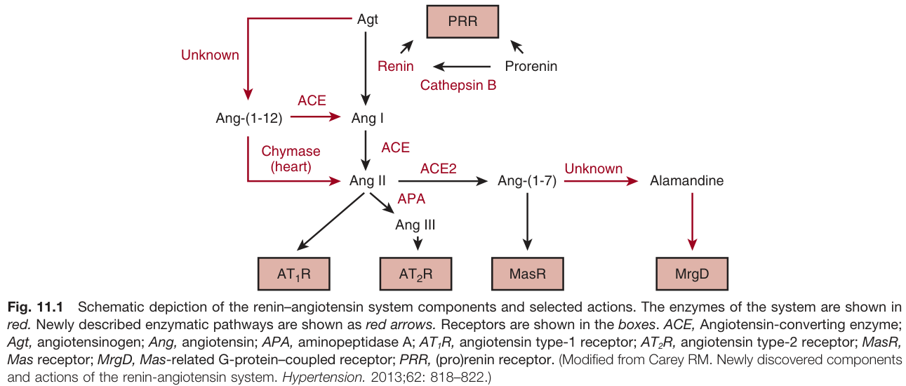

Fig. 11.1 Schematic depiction of the renin-angiotensin system components and selected actions. The enzymes of the system are shown in red. Newly described enzymatic pathways are shown as red arrows. Receptors are shown in the boxes. ACE, Angiotensin-converting enzyme; Agt, angiotensinogen; Ang, angiotensin; APA, aminopeptidase A; AT,R, angiotensin type-1 receptor; AT2R, angiotensin type-2 receptor; MasR, Mas receptor; MrgD, Mas-related G-protein-coupled receptor; PRR, (pro)renin receptor. (Modified from Carey RM. Newly discovered components and actions of the renin-angiotensin system. Hypertension. 2013;62: 818-822.)

---

### Fig_11_2

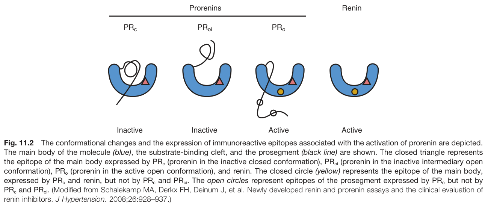

Fig. 11.2 The conformational changes and the expression of immunoreactive epitopes associated with the activation of prorenin are depicted. The main body of the molecule (blue), the substrate-binding cleft, and the prosegment (black line) are shown. The closed triangle represents the epitope of the main body expressed by PR (prorenin in the inactive closed conformation), PRoi (prorenin in the inactive intermediary open conformation), PR, (prorenin in the active open conformation), and renin. The closed circle (yellow) represents the epitope of the main body, expressed by PR, and renin, but not by PR and PRoi. The open circles represent epitopes of the prosegment expressed by PR, but not by PR and PRoi. (Modified from Schalekamp MA, Derkx FH, Deinum J, et al. Newly developed renin and prorenin assays and the clinical evaluation of renin inhibitors. J Hypertension. 2008;26:928-937.)

---

### Fig_11_3

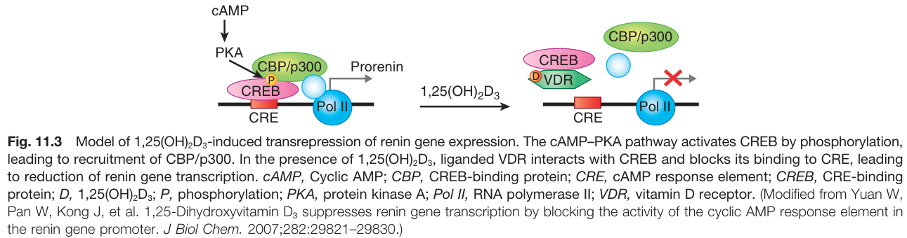

Fig. 11.3 Model of 1,25(OH)2D3-induced transrepression of renin gene expression. The cAMP-PKA pathway activates CREB by phosphorylation, leading to recruitment of CBP/p300. In the presence of 1,25(OH)2D3, liganded VDR interacts with CREB and blocks its binding to CRE, leading to reduction of renin gene transcription. cAMP, Cyclic AMP; CBP, CREB-binding protein; CRE, CAMP response element; CREB, CRE-binding protein; D, 1,25(OH)2D3; P, phosphorylation; PKA, protein kinase A; Pol II, RNA polymerase II; VDR, vitamin D receptor. (Modified from Yuan W, Pan W, Kong J, et al. 1,25-Dihydroxyvitamin D3 suppresses renin gene transcription by blocking the activity of the cyclic AMP response element in the renin gene promoter. J Biol Chem. 2007;282:29821-29830.)

---

### Fig_11_4

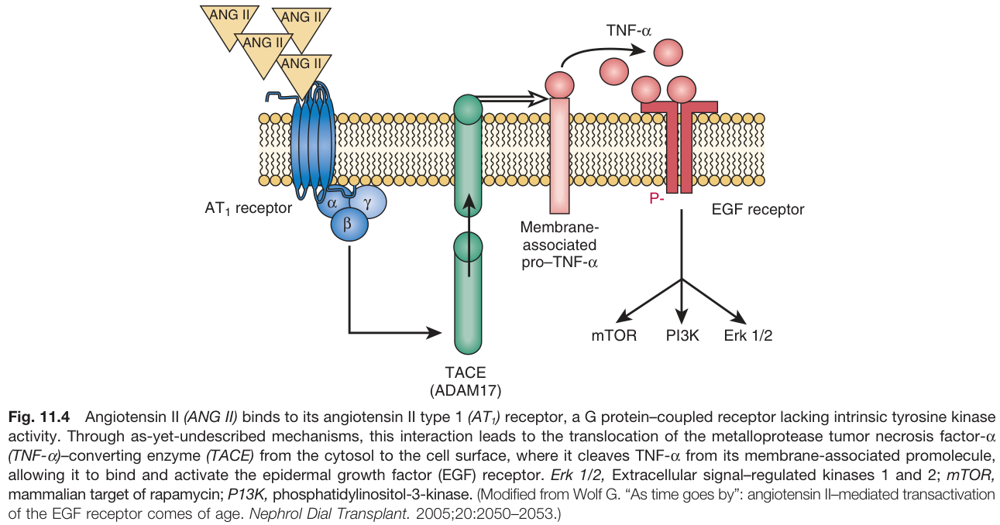

Fig. 11.4 Angiotensin II (ANG II) binds to its angiotensin II type 1 (AT₁) receptor, a G protein-coupled receptor lacking intrinsic tyrosine kinase activity. Through as-yet-undescribed mechanisms, this interaction leads to the translocation of the metalloprotease tumor necrosis factor-a (TNF-a)-converting enzyme (TACE) from the cytosol to the cell surface, where it cleaves TNF-a from its membrane-associated promolecule, allowing it to bind and activate the epidermal growth factor (EGF) receptor. Erk 1/2, Extracellular signal-regulated kinases 1 and 2; mTOR, mammalian target of rapamycin; P13K, phosphatidylinositol-3-kinase. (Modified from Wolf G. "As time goes by": angiotensin Il-mediated transactivation of the EGF receptor comes of age. Nephrol Dial Transplant. 2005;20:2050-2053.)

---

### Fig_11_5

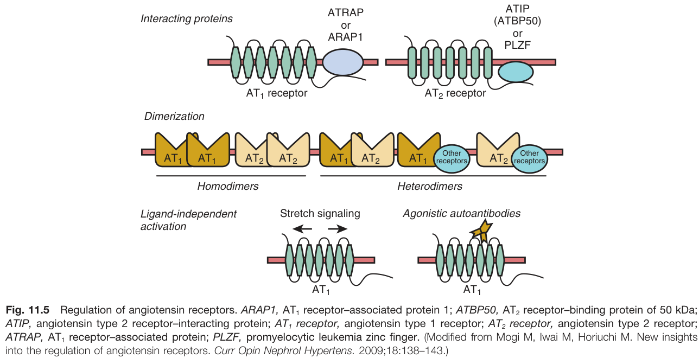

Fig. 11.5 Regulation of angiotensin receptors. ARAP1, AT₁ receptor-associated protein 1; ATBP50, AT2 receptor-binding protein of 50 kDa; ATIP, angiotensin type 2 receptor-interacting protein; AT₁ receptor, angiotensin type 1 receptor; AT2 receptor, angiotensin type 2 receptor; ATRAP, AT, receptor-associated protein; PLZF, promyelocytic leukemia zinc finger. (Modified from Mogi M, Iwai M, Horiuchi M. New insights into the regulation of angiotensin receptors. Curr Opin Nephrol Hypertens. 2009;18:138-143.)

---

### Fig_11_6

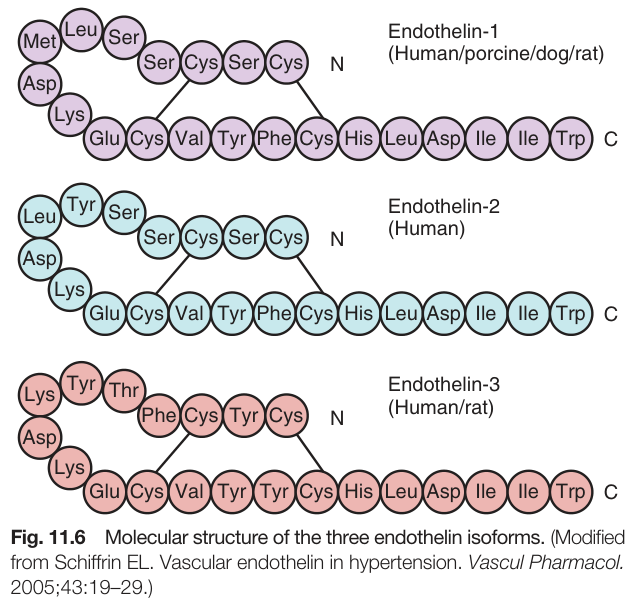

Fig. 11.6 Molecular structure of the three endothelin isoforms. (Modified from Schiffrin EL. Vascular endothelin in hypertension. Vascul Pharmacol. 2005;43:19-29.)

---

### Fig_11_7

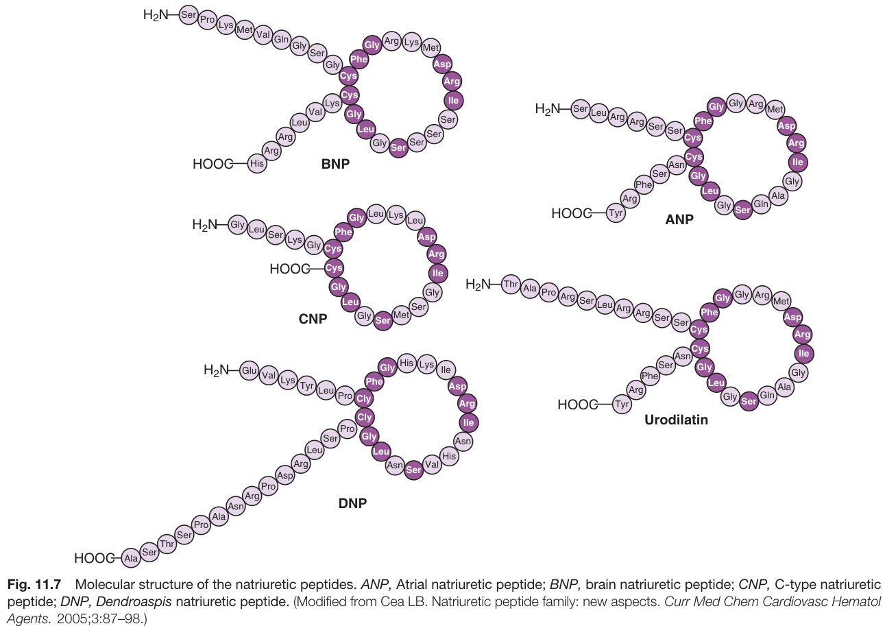

Fig. 11.7 Molecular structure of the natriuretic peptides. ANP, Atrial natriuretic peptide; BNP, brain natriuretic peptide; CNP, C-type natriuretic peptide; DNP, Dendroaspis natriuretic peptide. (Modified from Cea LB. Natriuretic peptide family: new aspects. Curr Med Chem Cardiovasc Hematol Agents. 2005;3:87-98.)

---

### Fig_11_8

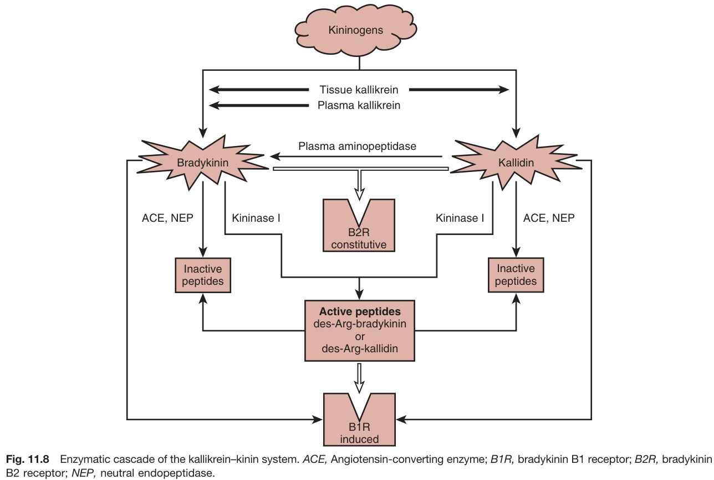

Fig. 11.8 Enzymatic cascade of the kallikrein-kinin system.

---

### Fig_11_9

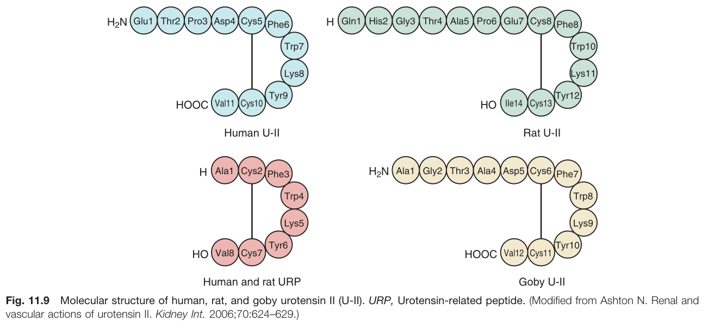

Fig. 11.9 Molecular structure of human, rat, and goby urotensin II (U-II). URP, Urotensin-related peptide. (Modified from Ashton N. Renal and vascular actions of urotensin II. Kidney Int. 2006;70:624-629.)

---

## Tables

### Table_11_1

#### Table Image

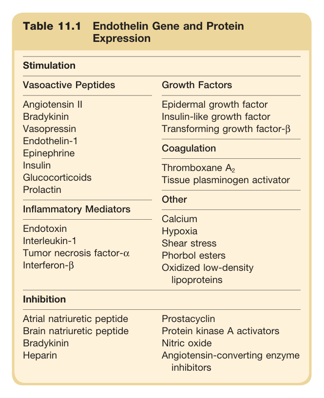

#### Table Data (CSV: [Table_11_1.csv](Table_11_1.csv))

```markdown
| Table Text (OCR) |
| :--- |
| Table 11.1 Endothelin Gene and Protein Expression Stimulation |
```

Table 11.1 Endothelin Gene and Protein Expression **Stimulation** * **Vasoactive Peptides**: Angiotensin II, Bradykinin, Vasopressin, Endothelin-1, Epinephrine, Insulin, Glucocorticoids, Prolactin * **Growth Factors**: Epidermal growth factor, Insulin-like growth factor, Transforming growth factor-β * **Inflammatory Mediators**: Endotoxin, Interleukin-1, Tumor necrosis factor-α, Interferon-ẞ * **Coagulation**: Thromboxane A2, Tissue plasminogen activator * **Other**: Calcium, Hypoxia, Shear stress, Phorbol esters, Oxidized low-density lipoproteins **Inhibition** * Atrial natriuretic peptide * Brain natriuretic peptide * Bradykinin * Heparin * Prostacyclin * Protein kinase A activators * Nitric oxide * Angiotensin-converting enzyme inhibitors

---

### Table_11_2

#### Table Image

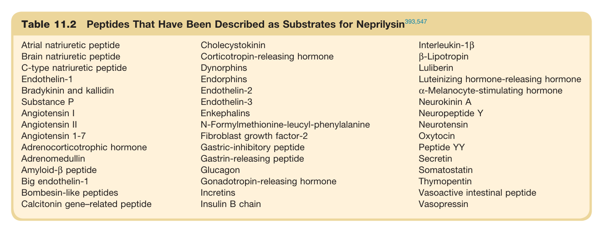

#### Table Data (CSV: [Table_11_2.csv](Table_11_2.csv))

```markdown
| Table Text (OCR) |
| :--- |
| Table 11.2 Peptides That Have Been Described as Substrates for Neprilysin<sup>393,547</sup> |
```

Table 11.2 Peptides That Have Been Described as Substrates for Neprilysin

---
