# 13. Arachidonic Acid Metabolites and the Kidney - Figures and Tables Index

This document lists all figures and tables extracted from `13. Arachidonic Acid Metabolites and the Kidney.pdf`.

## Table of Contents
- [Figures](#figures)
- [Tables](#tables)

---

## Figures

### Fig_13_1

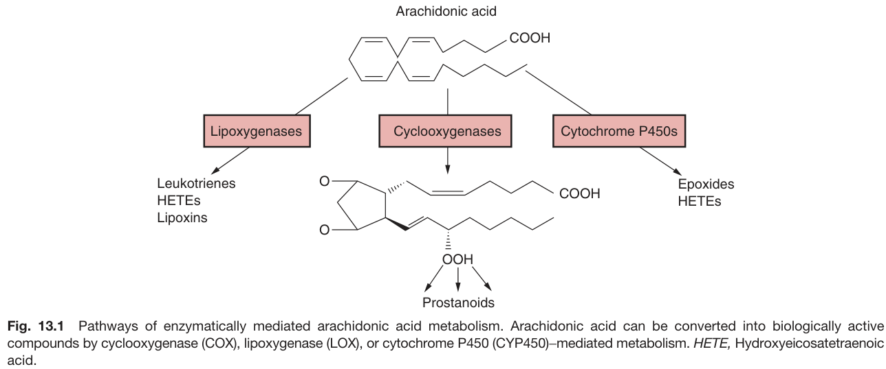

Fig. 13.1 Pathways of enzymatically mediated arachidonic acid metabolism. Arachidonic acid can be converted into biologically active compounds by cyclooxygenase (COX), lipoxygenase (LOX), or cytochrome P450 (CYP450)-mediated metabolism. HETE, Hydroxyeicosatetraenoic acid.

---

### Fig_13_2

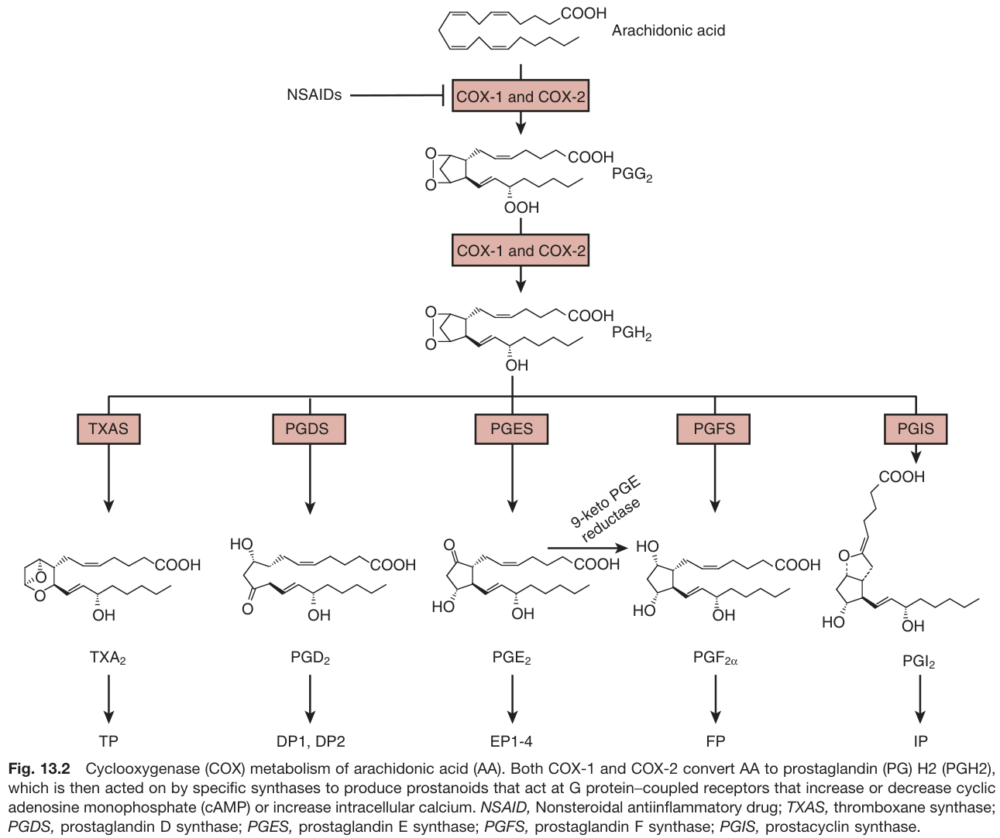

Fig. 13.2 Cyclooxygenase (COX) metabolism of arachidonic acid (AA). Both COX-1 and COX-2 convert AA to prostaglandin (PG) H2 (PGH2), which is then acted on by specific synthases to produce prostanoids that act at G protein-coupled receptors that increase or decrease cyclic adenosine monophosphate (cAMP) or increase intracellular calcium. NSAID, Nonsteroidal antiinflammatory drug; TXAS, thromboxane synthase; PGDS, prostaglandin D synthase; PGES, prostaglandin E synthase; PGFS, prostaglandin F synthase; PGIS, prostacyclin synthase.

---

### Fig_13_3

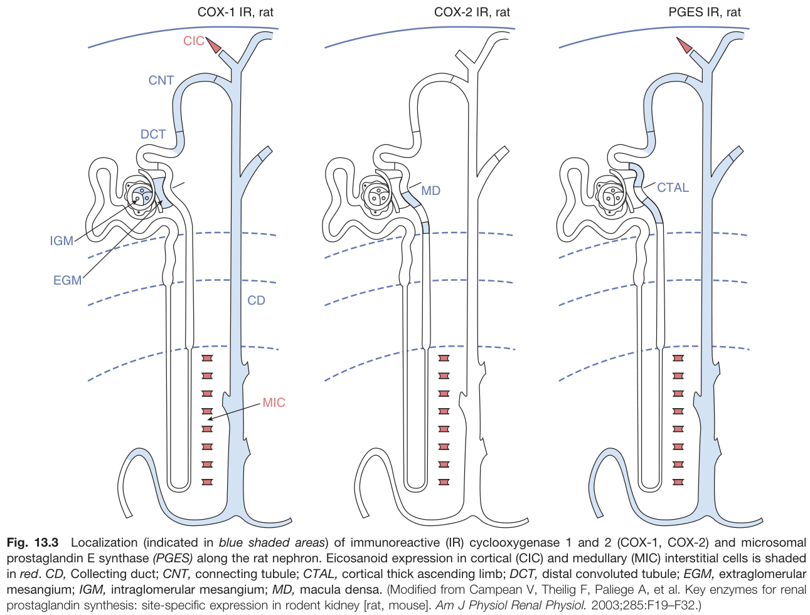

Fig. 13.3 Localization (indicated in blue shaded areas) of immunoreactive (IR) cyclooxygenase 1 and 2 (COX-1, COX-2) and microsomal prostaglandin E synthase (PGES) along the rat nephron. Eicosanoid expression in cortical (CIC) and medullary (MIC) interstitial cells is shaded in red. CD, Collecting duct; CNT, connecting tubule; CTAL, cortical thick ascending limb; DCT, distal convoluted tubule; EGM, extraglomerular mesangium; IGM, intraglomerular mesangium; MD, macula densa. (Modified from Campean V, Theilig F, Paliege A, et al. Key enzymes for renal prostaglandin synthesis: site-specific expression in rodent kidney [rat, mouse]. Am J Physiol Renal Physiol. 2003;285:F19-F32.)

---

### Fig_13_4

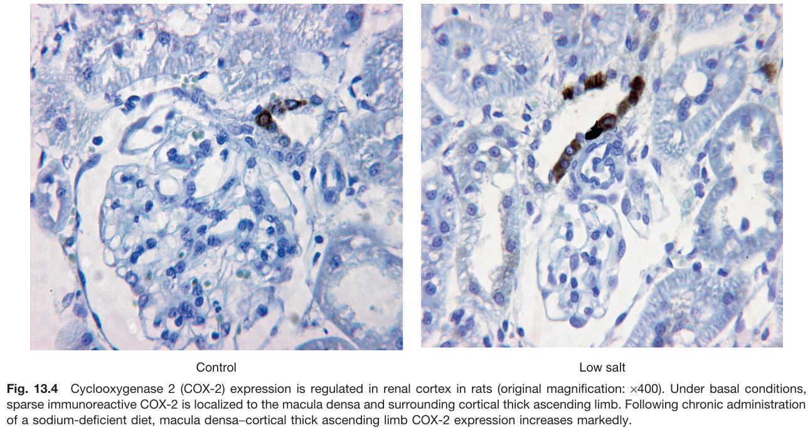

Fig. 13.4 Cyclooxygenase 2 (COX-2) expression is regulated in renal cortex in rats (original magnification: ×400). Under basal conditions, sparse immunoreactive COX-2 is localized to the macula densa and surrounding cortical thick ascending limb. Following chronic administration of a sodium-deficient diet, macula densa-cortical thick ascending limb COX-2 expression increases markedly.

---

### Fig_13_5

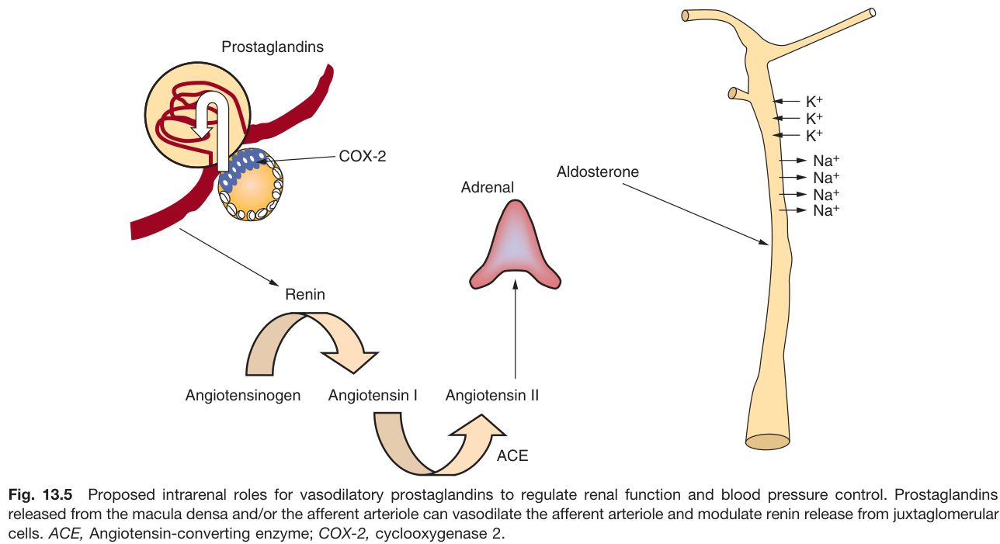

Fig. 13.5 Proposed intrarenal roles for vasodilatory prostaglandins to regulate renal function and blood pressure control. Prostaglandins released from the macula densa and/or the afferent arteriole can vasodilate the afferent arteriole and modulate renin release from juxtaglomerular cells. ACE, Angiotensin-converting enzyme; COX-2, cyclooxygenase 2.

---

### Fig_13_6

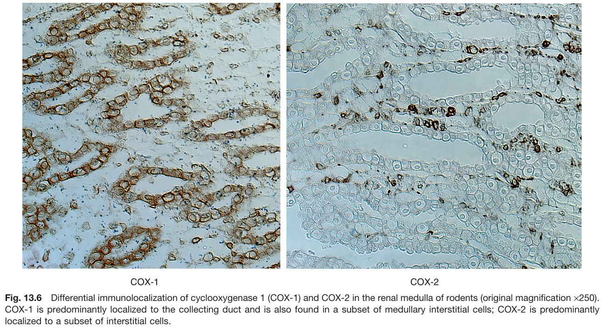

Fig. 13.6 Differential immunolocalization of cyclooxygenase 1 (COX-1) and COX-2 in the renal medulla of rodents (original magnification ×250). COX-1 is predominantly localized to the collecting duct and is also found in a subset of medullary interstitial cells; COX-2 is predominantly localized to a subset of interstitial cells.

---

### Fig_13_7

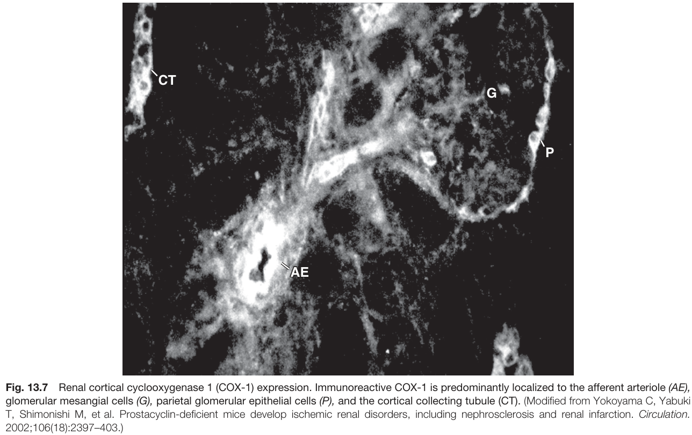

Fig. 13.7 Renal cortical cyclooxygenase 1 (COX-1) expression. Immunoreactive COX-1 is predominantly localized to the afferent arteriole (AE), glomerular mesangial cells (G), parietal glomerular epithelial cells (P), and the cortical collecting tubule (CT). (Modified from Yokoyama C, Yabuki T, Shimonishi M, et al. Prostacyclin-deficient mice develop ischemic renal disorders, including nephrosclerosis and renal infarction. Circulation. 2002;106(18):2397-403.)

---

### Fig_13_8

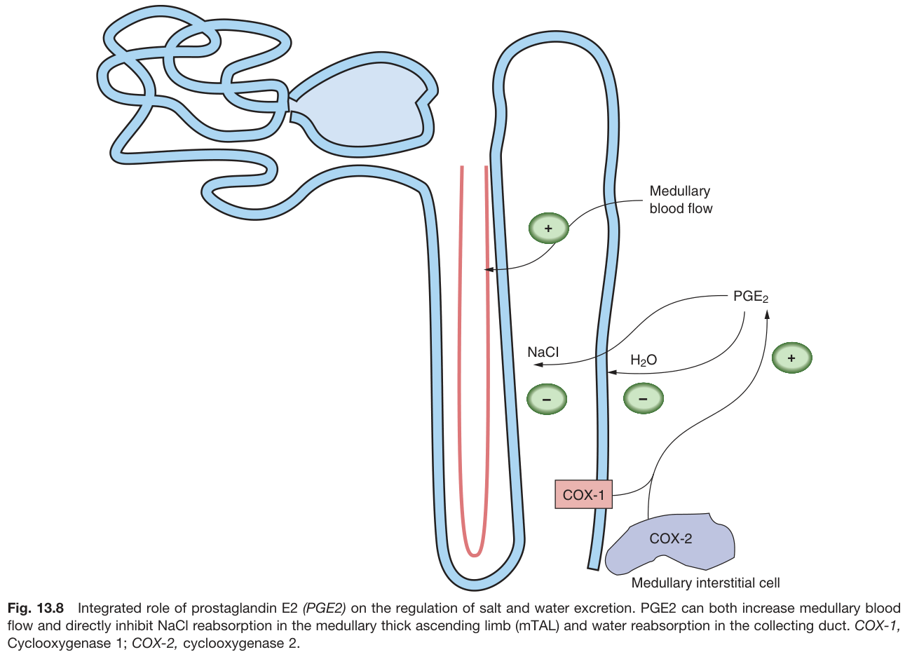

Fig. 13.8 Integrated role of prostaglandin E2 (PGE2) on the regulation of salt and water excretion. PGE2 can both increase medullary blood flow and directly inhibit NaCl reabsorption in the medullary thick ascending limb (mTAL) and water reabsorption in the collecting duct. COX-1, Cyclooxygenase 1; COX-2, cyclooxygenase 2.

---

### Fig_13_9

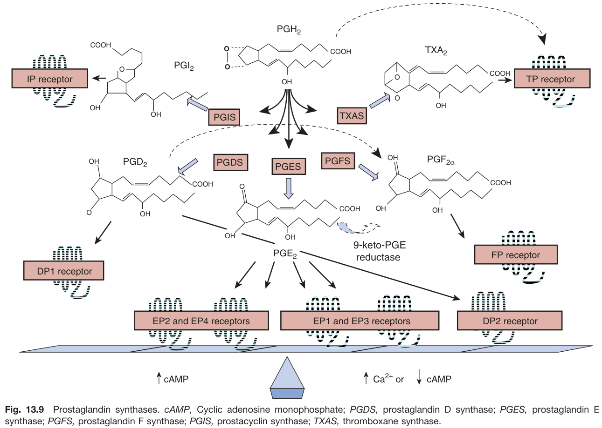

Fig. 13.9 Prostaglandin synthases. cAMP, Cyclic adenosine monophosphate; PGDS, prostaglandin D synthase; PGES, prostaglandin E synthase; PGFS, prostaglandin F synthase; PGIS, prostacyclin synthase; TXAS, thromboxane synthase.

---

### Fig_13_10

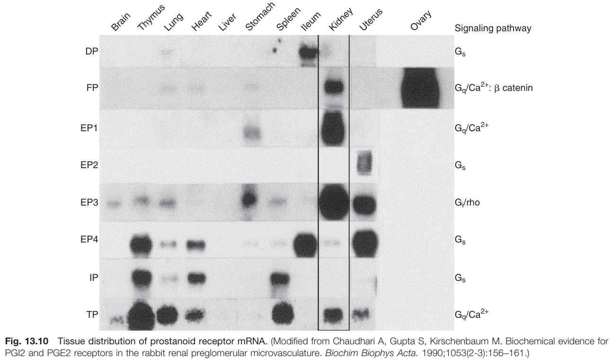

Fig. 13.10 Tissue distribution of prostanoid receptor mRNA. (Modified from Chaudhari A, Gupta S, Kirschenbaum M. Biochemical evidence for PGI2 and PGE2 receptors in the rabbit renal preglomerular microvasculature. Biochim Biophys Acta. 1990;1053(2-3):156-161.)

---

### Fig_13_11

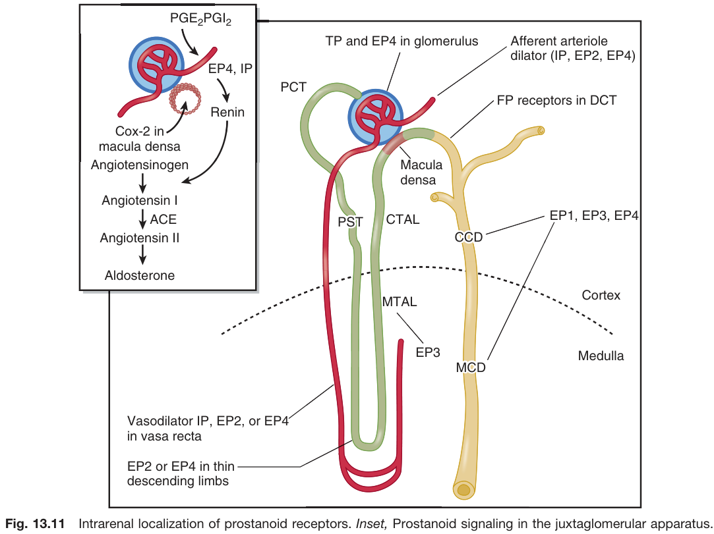

Fig. 13.11 Intrarenal localization of prostanoid receptors. Inset, Prostanoid signaling in the juxtaglomerular apparatus.

---

### Fig_13_12

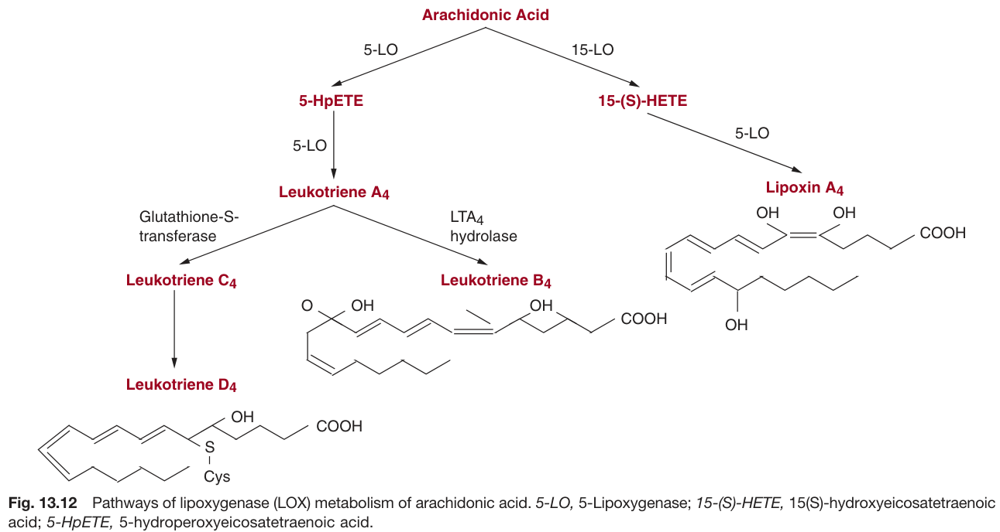

Fig. 13.12 Pathways of lipoxygenase (LOX) metabolism of arachidonic acid. 5-LO, 5-Lipoxygenase; 15-(S)-HETE, 15(S)-hydroxyeicosatetraenoic acid; 5-HpETE, 5-hydroperoxyeicosatetraenoic acid.

---

### Fig_13_13

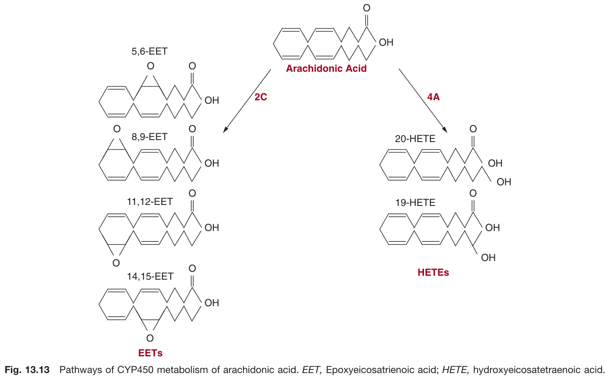

Fig. 13.13 Pathways of CYP450 metabolism of arachidonic acid. EET, Epoxyeicosatrienoic acid; HETE, hydroxyeicosatetraenoic acid.

---

### Fig_13_14

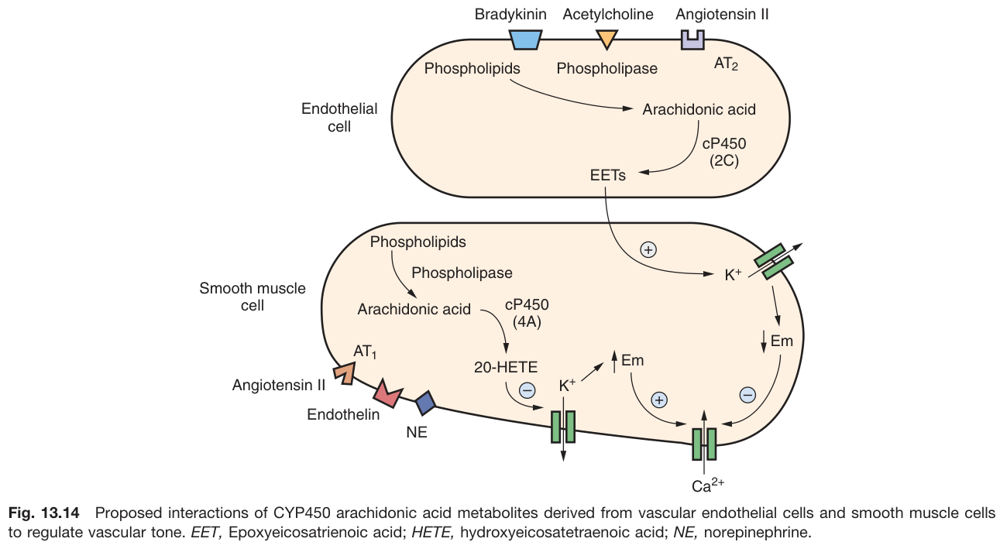

Fig. 13.14 Proposed interactions of CYP450 arachidonic acid metabolites derived from vascular endothelial cells and smooth muscle cells to regulate vascular tone. EET, Epoxyeicosatrienoic acid; HETE, hydroxyeicosatetraenoic acid; NE, norepinephrine.

---

## Tables

### Table_13_1

#### Table Image

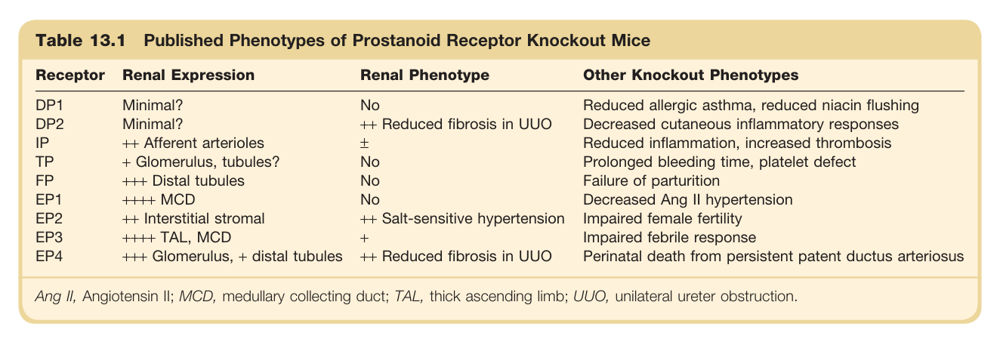

#### Table Data (CSV: [Table_13_1.csv](Table_13_1.csv))

```markdown
| Table Text (OCR) |
| :--- |
| Table 13.1 Published Phenotypes of Prostanoid Receptor Knockout Mice  Ang II, Angiotensin II; MCD, medullary collecting duct; TAL, thick ascending limb; UUO, unilateral ureter obstruction. |
```

Table 13.1 Published Phenotypes of Prostanoid Receptor Knockout Mice | Receptor | Renal Expression | Renal Phenotype | Other Knockout Phenotypes | | :--- | :--- | :--- | :--- | | DP1 | Minimal? | No | Reduced allergic asthma, reduced niacin flushing | | DP2 | Minimal? | ++ Reduced fibrosis in UUO | Decreased cutaneous inflammatory responses | | IP | ++ Afferent arterioles | + | Reduced inflammation, increased thrombosis | | TP | + Glomerulus, tubules? | No | Prolonged bleeding time, platelet defect | | FP | +++ Distal tubules | No | Failure of parturition | | EP1 | ++++ MCD | No | Decreased Ang II hypertension | | EP2 | ++ Interstitial stromal | ++ Salt-sensitive hypertension | Impaired female fertility | | EP3 | ++++ TAL, MCD | + | Impaired febrile response | | EP4 | +++ Glomerulus, + distal tubules | ++ Reduced fibrosis in UUO | Perinatal death from persistent patent ductus arteriosus | *Ang II, Angiotensin II; MCD, medullary collecting duct; TAL, thick ascending limb; UUO, unilateral ureter obstruction.*

---
