# 14. Disorders of Sodium Balance - Figures and Tables Index

This document lists all figures and tables extracted from `14. Disorders of Sodium Balance.pdf`.

## Table of Contents
- [Figures](#figures)
- [Tables](#tables)

---

## Figures

### Fig_14_1

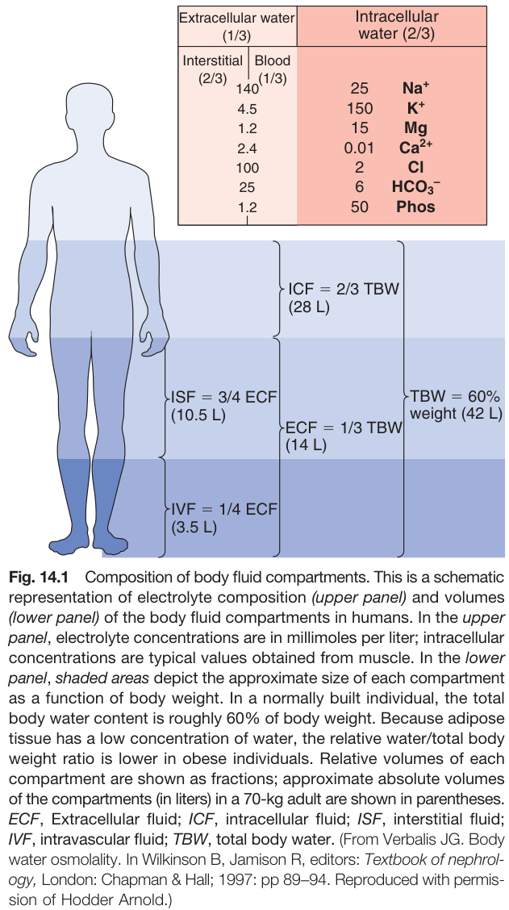

Fig. 14.1 Composition of body fluid compartments. This is a schematic representation of electrolyte composition (upper panel) and volumes (lower panel) of the body fluid compartments in humans. In the upper panel, electrolyte concentrations are in millimoles per liter; intracellular concentrations are typical values obtained from muscle. In the lower panel, shaded areas depict the approximate size of each compartment as a function of body weight. In a normally built individual, the total body water content is roughly 60% of body weight. Because adipose tissue has a low concentration of water, the relative water/total body weight ratio is lower in obese individuals. Relative volumes of each compartment are shown as fractions; approximate absolute volumes of the compartments (in liters) in a 70-kg adult are shown in parentheses. ECF, Extracellular fluid; ICF, intracellular fluid; ISF, interstitial fluid; IVF, intravascular fluid; TBW, total body water. (From Verbalis JG. Body water osmolality. In Wilkinson B, Jamison R, editors: Textbook of nephrology, London: Chapman & Hall; 1997: pp 89-94. Reproduced with permission of Hodder Arnold.)

---

### Fig_14_2

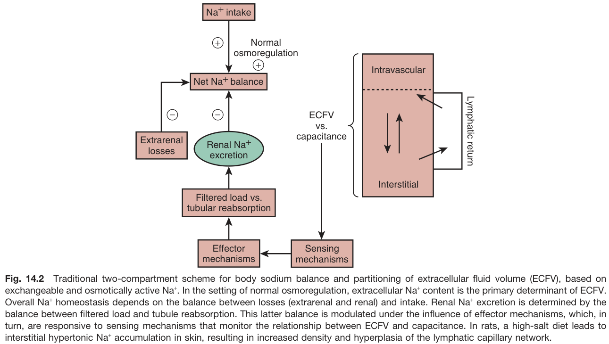

Fig. 14.2 Traditional two-compartment scheme for body sodium balance and partitioning of extracellular fluid volume (ECFV), based on exchangeable and osmotically active Na+. In the setting of normal osmoregulation, extracellular Na+ content is the primary determinant of ECFV. Overall Na+ homeostasis depends on the balance between losses (extrarenal and renal) and intake. Renal Na+ excretion is determined by the balance between filtered load and tubule reabsorption. This latter balance is modulated under the influence of effector mechanisms, which, in turn, are responsive to sensing mechanisms that monitor the relationship between ECFV and capacitance. In rats, a high-salt diet leads to interstitial hypertonic Na+ accumulation in skin, resulting in increased density and hyperplasia of the lymphatic capillary network.

---

### Fig_14_3

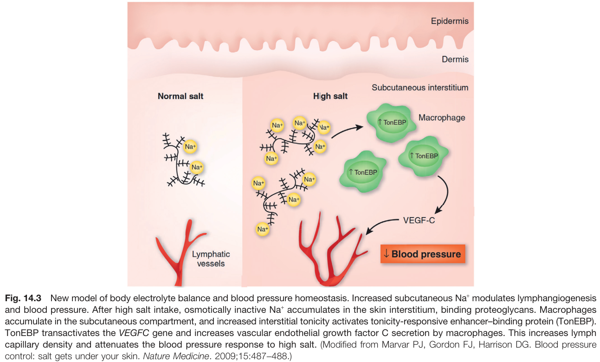

Fig. 14.3 New model of body electrolyte balance and blood pressure homeostasis. Increased subcutaneous Na+ modulates lymphangiogenesis and blood pressure. After high salt intake, osmotically inactive Na+ accumulates in the skin interstitium, binding proteoglycans. Macrophages accumulate in the subcutaneous compartment, and increased interstitial tonicity activates tonicity-responsive enhancer-binding protein (TonEBP). TonEBP transactivates the VEGFC gene and increases vascular endothelial growth factor C secretion by macrophages. This increases lymph capillary density and attenuates the blood pressure response to high salt. (Modified from Marvar PJ, Gordon FJ, Harrison DG. Blood pressure control: salt gets under your skin. Nature Medicine. 2009;15:487-488.)

---

### Fig_14_4

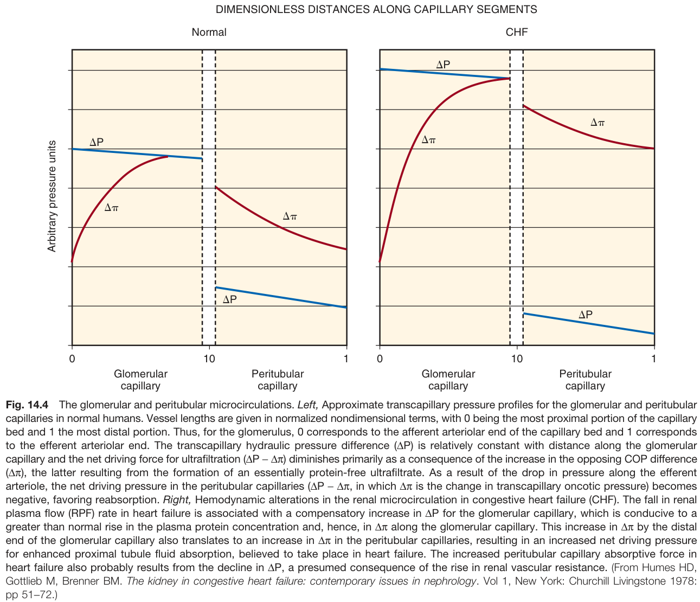

Fig. 14.4 The glomerular and peritubular microcirculations. Left, Approximate transcapillary pressure profiles for the glomerular and peritubular capillaries in normal humans. Vessel lengths are given in normalized nondimensional terms, with 0 being the most proximal portion of the capillary bed and 1 the most distal portion. Thus, for the glomerulus, 0 corresponds to the afferent arteriolar end of the capillary bed and 1 corresponds to the efferent arteriolar end. The transcapillary hydraulic pressure difference (AP) is relatively constant with distance along the glomerular capillary and the net driving force for ultrafiltration (ΔΡ – Δπ) diminishes primarily as a consequence of the increase in the opposing COP difference (Δπ), the latter resulting from the formation of an essentially protein-free ultrafiltrate. As a result of the drop in pressure along the efferent arteriole, the net driving pressure in the peritubular capillaries (ΔΡ – Δπ, in which An is the change in transcapillary oncotic pressure) becomes negative, favoring reabsorption. Right, Hemodynamic alterations in the renal microcirculation in congestive heart failure (CHF). The fall in renal plasma flow (RPF) rate in heart failure is associated with a compensatory increase in AP for the glomerular capillary, which is conducive to a greater than normal rise in the plasma protein concentration and, hence, in An along the glomerular capillary. This increase in An by the distal end of the glomerular capillary also translates to an increase in An in the peritubular capillaries, resulting in an increased net driving pressure for enhanced proximal tubule fluid absorption, believed to take place in heart failure. The increased peritubular capillary absorptive force in heart failure also probably results from the decline in AP, a presumed consequence of the rise in renal vascular resistance. (From Humes HD, Gottlieb M, Brenner BM. The kidney in congestive heart failure: contemporary issues in nephrology. Vol 1, New York: Churchill Livingstone 1978: pp 51-72.)

---

### Fig_14_5

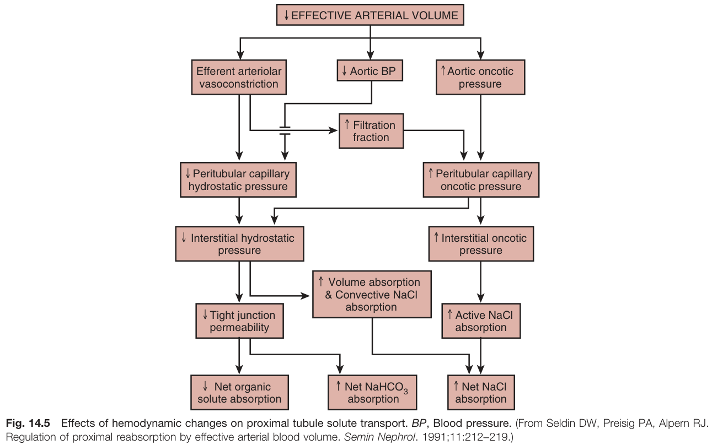

Fig. 14.5 Effects of hemodynamic changes on proximal tubule solute transport. BP, Blood pressure. (From Seldin DW, Preisig PA, Alpern RJ. Regulation of proximal reabsorption by effective arterial blood volume. Semin Nephrol. 1991;11:212-219.)

---

### Fig_14_6

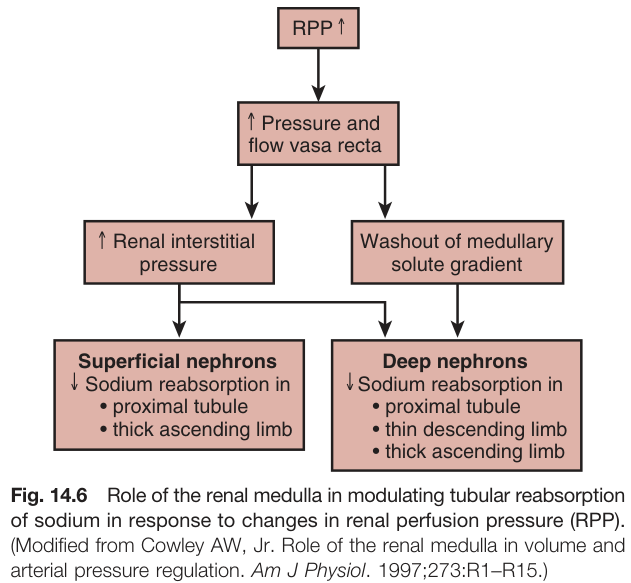

Fig. 14.6 Role of the renal medulla in modulating tubular reabsorption of sodium in response to changes in renal perfusion pressure (RPP). (Modified from Cowley AW, Jr. Role of the renal medulla in volume and arterial pressure regulation. Am J Physiol. 1997;273:R1-R15.)

---

### Fig_14_7

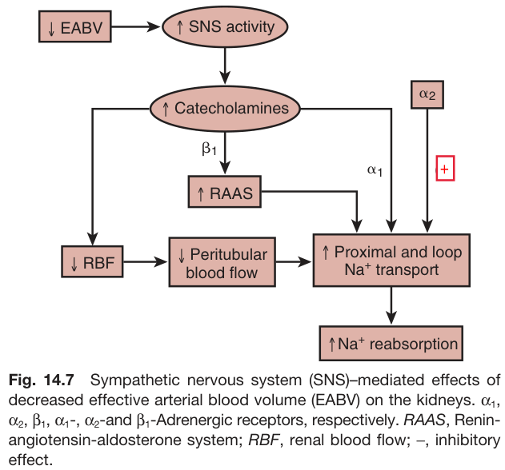

Fig. 14.7 Sympathetic nervous system (SNS)-mediated effects of decreased effective arterial blood volume (EABV) on the kidneys. α₁, α₂, β₁, α₁-, α₂-and ẞ₁-Adrenergic receptors, respectively. RAAS, Renin-angiotensin-aldosterone system; RBF, renal blood flow; -, inhibitory effect.

---

### Fig_14_8

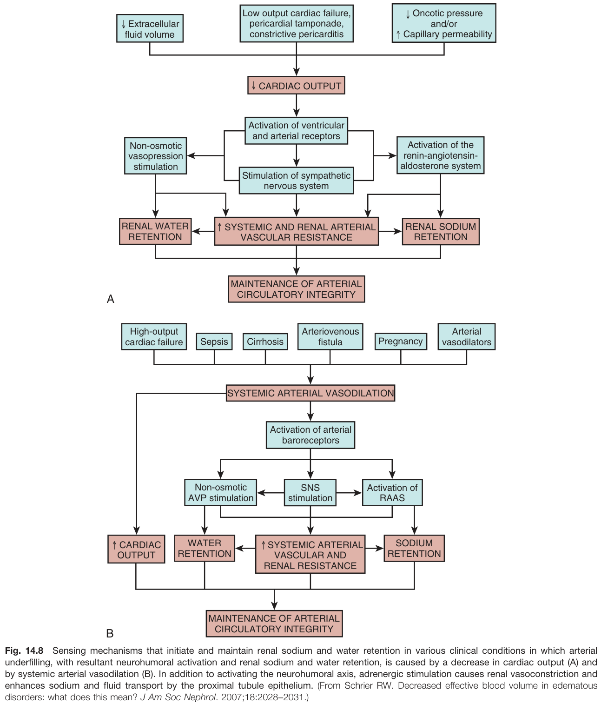

Fig. 14.8 Sensing mechanisms that initiate and maintain renal sodium and water retention in various clinical conditions in which arterial underfilling, with resultant neurohumoral activation and renal sodium and water retention, is caused by a decrease in cardiac output (A) and by systemic arterial vasodilation (B). In addition to activating the neurohumoral axis, adrenergic stimulation causes renal vasoconstriction and enhances sodium and fluid transport by the proximal tubule epithelium. (From Schrier RW. Decreased effective blood volume in edematous disorders: what does this mean? J Am Soc Nephrol. 2007;18:2028-2031.)

---

### Fig_14_9

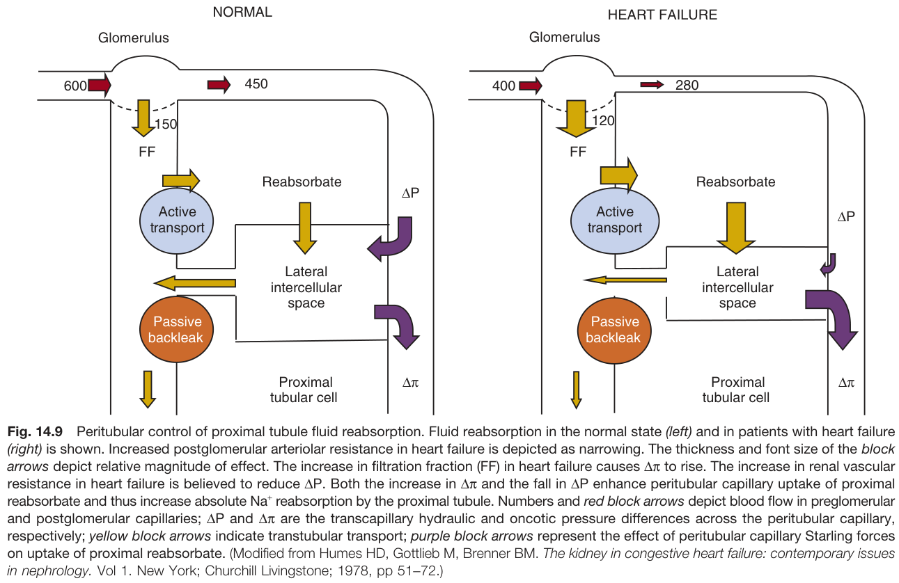

Fig. 14.9 Peritubular control of proximal tubule fluid reabsorption. Fluid reabsorption in the normal state (left) and in patients with heart failure (right) is shown. Increased postglomerular arteriolar resistance in heart failure is depicted as narrowing. The thickness and font size of the block arrows depict relative magnitude of effect. The increase in filtration fraction (FF) in heart failure causes ∆π to rise. The increase in renal vascular resistance in heart failure is believed to reduce AP. Both the increase in An and the fall in AP enhance peritubular capillary uptake of proximal reabsorbate and thus increase absolute Na+ reabsorption by the proximal tubule. Numbers and red block arrows depict blood flow in preglomerular and postglomerular capillaries; AP and ∆π are the transcapillary hydraulic and oncotic pressure differences across the peritubular capillary, respectively; yellow block arrows indicate transtubular transport; purple block arrows represent the effect of peritubular capillary Starling forces on uptake of proximal reabsorbate. (Modified from Humes HD, Gottlieb M, Brenner BM. The kidney in congestive heart failure: contemporary issues in nephrology. Vol 1. New York; Churchill Livingstone; 1978, pp 51-72.)

---

### Fig_14_10

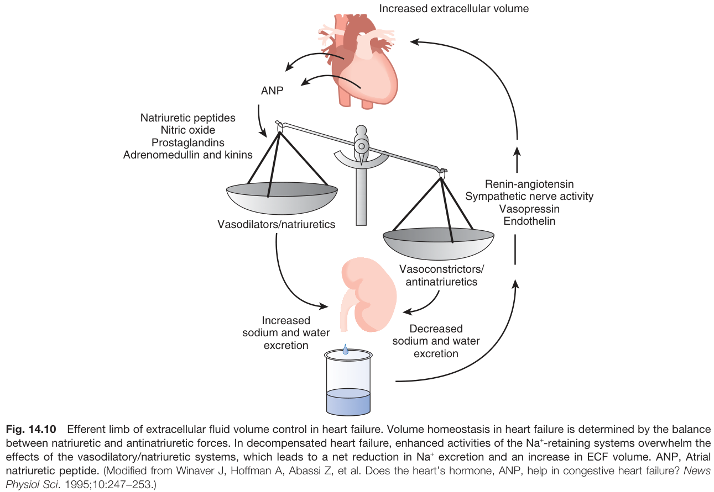

Fig. 14.10 Efferent limb of extracellular fluid volume control in heart failure. Volume homeostasis in heart failure is determined by the balance between natriuretic and antinatriuretic forces. In decompensated heart failure, enhanced activities of the Na+-retaining systems overwhelm the effects of the vasodilatory/natriuretic systems, which leads to a net reduction in Na+ excretion and an increase in ECF volume. ANP, Atrial natriuretic peptide. (Modified from Winaver J, Hoffman A, Abassi Z, et al. Does the heart's hormone, ANP, help in congestive heart failure? News Physiol Sci. 1995;10:247-253.)

---

### Fig_14_11

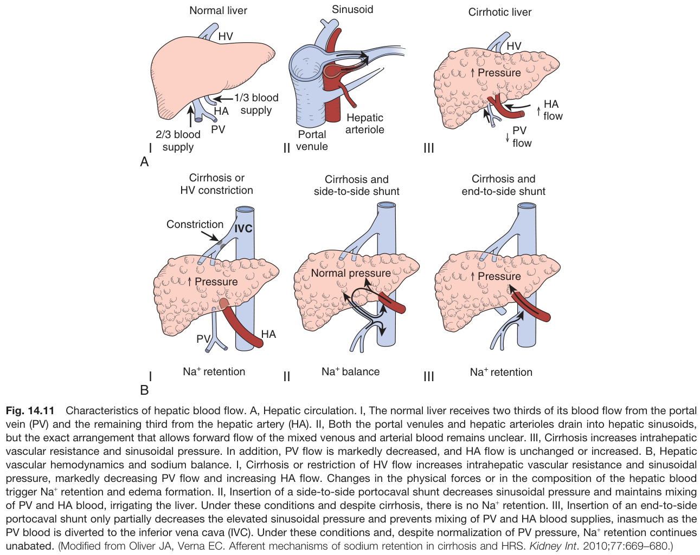

Fig. 14.11 Characteristics of hepatic blood flow. A, Hepatic circulation. I, The normal liver receives two thirds of its blood flow from the portal vein (PV) and the remaining third from the hepatic artery (HA). II, Both the portal venules and hepatic arterioles drain into hepatic sinusoids, but the exact arrangement that allows forward flow of the mixed venous and arterial blood remains unclear. III, Cirrhosis increases intrahepatic vascular resistance and sinusoidal pressure. In addition, PV flow is markedly decreased, and HA flow is unchanged or increased. B, Hepatic vascular hemodynamics and sodium balance. I, Cirrhosis or restriction of HV flow increases intrahepatic vascular resistance and sinusoidal pressure, markedly decreasing PV flow and increasing HA flow. Changes in the physical forces or in the composition of the hepatic blood trigger Na+ retention and edema formation. II, Insertion of a side-to-side portocaval shunt decreases sinusoidal pressure and maintains mixing of PV and HA blood, irrigating the liver. Under these conditions and despite cirrhosis, there is no Na+ retention. III, Insertion of an end-to-side portocaval shunt only partially decreases the elevated sinusoidal pressure and prevents mixing of PV and HA blood supplies, inasmuch as the PV blood is diverted to the inferior vena cava (IVC). Under these conditions and, despite normalization of PV pressure, Na+ retention continues unabated. (Modified from Oliver JA, Verna EC. Afferent mechanisms of sodium retention in cirrhosis and HRS. Kidney Int. 2010;77:669-680.)

---

## Tables

### Table_14_1

#### Table Image

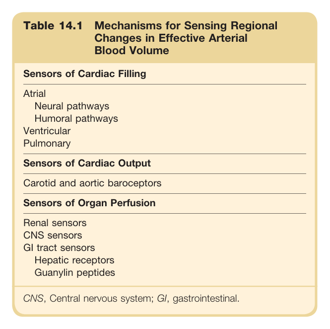

#### Table Data (CSV: [Table_14_1.csv](Table_14_1.csv))

```markdown
| Table Text (OCR) |
| :--- |
| Table 14.1 Mechanisms for Sensing Regional Changes in Effective Arterial Blood Volume Sensors of Cardiac Filling |
```

Table 14.1 Mechanisms for Sensing Regional Changes in Effective Arterial Blood Volume **Sensors of Cardiac Filling** * Atrial * Neural pathways * Humoral pathways * Ventricular * Pulmonary **Sensors of Cardiac Output** * Carotid and aortic baroceptors **Sensors of Organ Perfusion** * Renal sensors * CNS sensors * GI tract sensors * Hepatic receptors * Guanylin peptides CNS, Central nervous system; GI, gastrointestinal.

---

### Table_14_2

#### Table Image

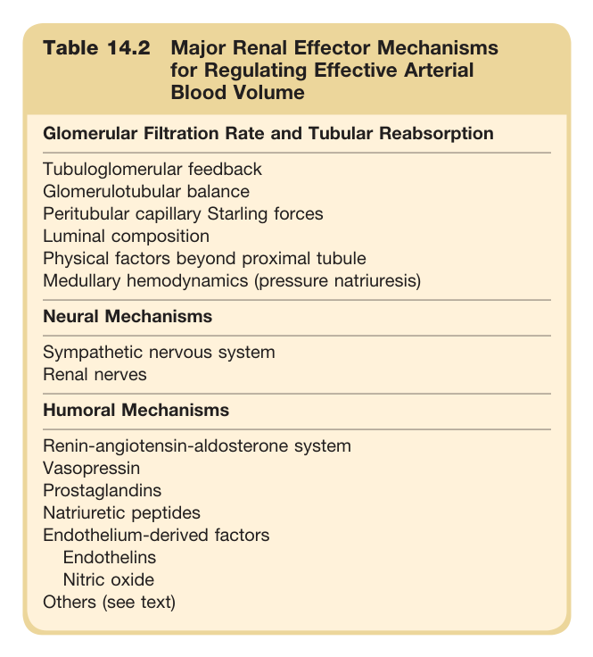

#### Table Data (CSV: [Table_14_2.csv](Table_14_2.csv))

```markdown
| Table Text (OCR) |
| :--- |
| Table 14.2 Major Renal Effector Mechanisms for Regulating Effective Arterial Blood Volume Glomerular Filtration Rate and Tubular Reabsorption |
```

Table 14.2 Major Renal Effector Mechanisms for Regulating Effective Arterial Blood Volume **Glomerular Filtration Rate and Tubular Reabsorption** * Tubuloglomerular feedback * Glomerulotubular balance * Peritubular capillary Starling forces * Luminal composition * Physical factors beyond proximal tubule * Medullary hemodynamics (pressure natriuresis) **Neural Mechanisms** * Sympathetic nervous system * Renal nerves **Humoral Mechanisms** * Renin-angiotensin-aldosterone system * Vasopressin * Prostaglandins * Natriuretic peptides * Endothelium-derived factors * Endothelins * Nitric oxide * Others (see text)

---

### Table_14_3

#### Table Image

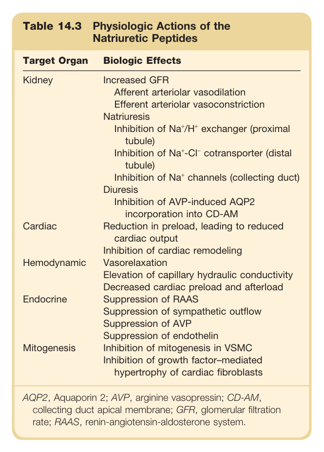

#### Table Data (CSV: [Table_14_3.csv](Table_14_3.csv))

```markdown
| Table Text (OCR) |
| :--- |
| Table 14.3 Physiologic Actions of the Natriuretic Peptides |
```

Table 14.3 Physiologic Actions of the Natriuretic Peptides | Target Organ | Biologic Effects | | :----------- | :----------------------------------------------------------- | | Kidney | Increased GFR<br>Afferent arteriolar vasodilation<br>Efferent arteriolar vasoconstriction<br>Natriuresis<br>Inhibition of Na+/H+ exchanger (proximal tubule)<br>Inhibition of Na+-Cl cotransporter (distal tubule)<br>Inhibition of Na+ channels (collecting duct)<br>Diuresis<br>Inhibition of AVP-induced AQP2 incorporation into CD-AM | | Cardiac | Reduction in preload, leading to reduced cardiac output<br>Inhibition of cardiac remodeling | | Hemodynamic | Vasorelaxation<br>Elevation of capillary hydraulic conductivity<br>Decreased cardiac preload and afterload | | Endocrine | Suppression of RAAS<br>Suppression of sympathetic outflow<br>Suppression of AVP<br>Suppression of endothelin | | Mitogenesis | Inhibition of mitogenesis in VSMC<br>Inhibition of growth factor-mediated hypertrophy of cardiac fibroblasts | AQP2, Aquaporin 2; AVP, arginine vasopressin; CD-AM, collecting duct apical membrane; GFR, glomerular filtration rate; RAAS, renin-angiotensin-aldosterone system.

---

### Table_14_4

#### Table Image

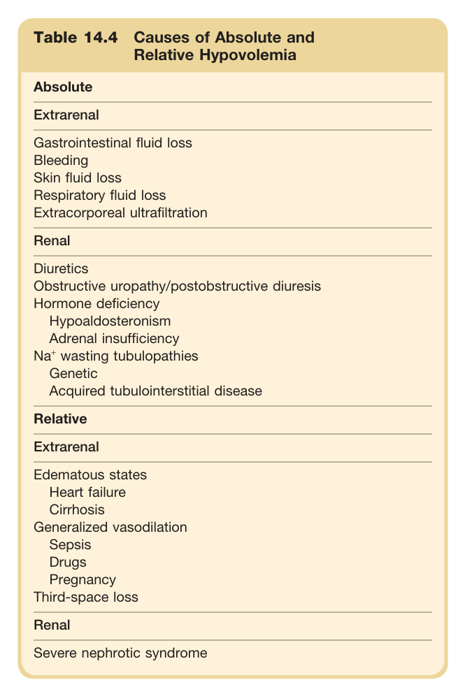

#### Table Data (CSV: [Table_14_4.csv](Table_14_4.csv))

```markdown
| Table Text (OCR) |
| :--- |
| Table 14.4 Causes of Absolute and Relative Hypovolemia |
```

Table 14.4 Causes of Absolute and Relative Hypovolemia **Absolute** * **Extrarenal** * Gastrointestinal fluid loss * Bleeding * Skin fluid loss * Respiratory fluid loss * Extracorporeal ultrafiltration * **Renal** * Diuretics * Obstructive uropathy/postobstructive diuresis * Hormone deficiency * Hypoaldosteronism * Adrenal insufficiency * Na+ wasting tubulopathies * Genetic * Acquired tubulointerstitial disease **Relative** * **Extrarenal** * Edematous states * Heart failure * Cirrhosis * Generalized vasodilation * Sepsis * Drugs * Pregnancy * Third-space loss * **Renal** * Severe nephrotic syndrome

---

### Table_14_5

#### Table Image

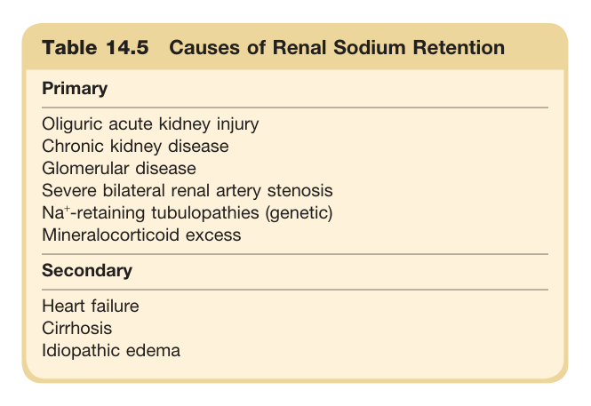

#### Table Data (CSV: [Table_14_5.csv](Table_14_5.csv))

```markdown
| Table Text (OCR) |
| :--- |
| Table 14.5 Causes of Renal Sodium Retention Primary |
```

Table 14.5 Causes of Renal Sodium Retention **Primary** * Oliguric acute kidney injury * Chronic kidney disease * Glomerular disease * Severe bilateral renal artery stenosis * Na+-retaining tubulopathies (genetic) * Mineralocorticoid excess **Secondary** * Heart failure * Cirrhosis * Idiopathic edema

---

### Table_14_6

#### Table Image

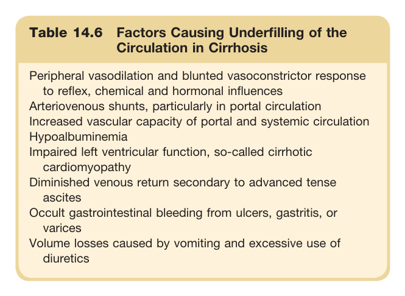

#### Table Data (CSV: [Table_14_6.csv](Table_14_6.csv))

```markdown
| Table Text (OCR) |
| :--- |
| Table 14.6 Factors Causing Underfilling of the Circulation in Cirrhosis Peripheral vasodilation and blunted vasoconstrictor response to reflex, chemical and hormonal influences Arteriovenous shunts, particularly in portal circulation Increased vascular capacity of portal and systemic circulation Hypoalbuminemia Impaired left ventricular function, so-called cirrhotic cardiomyopathy Diminished venous return secondary to advanced tense ascites Occult gastrointestinal bleeding from ulcers, gastritis, or varices Volume losses caused by vomiting and excessive use of diuretics |
```

Table 14.6 Factors Causing Underfilling of the Circulation in Cirrhosis * Peripheral vasodilation and blunted vasoconstrictor response to reflex, chemical and hormonal influences * Arteriovenous shunts, particularly in portal circulation * Increased vascular capacity of portal and systemic circulation * Hypoalbuminemia * Impaired left ventricular function, so-called cirrhotic cardiomyopathy * Diminished venous return secondary to advanced tense ascites * Occult gastrointestinal bleeding from ulcers, gastritis, or varices * Volume losses caused by vomiting and excessive use of diuretics

---

### Table_14_7

#### Table Image

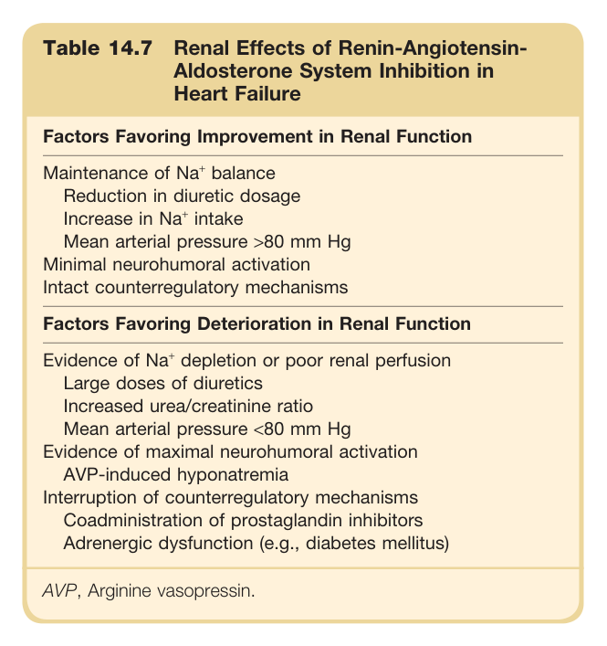

#### Table Data (CSV: [Table_14_7.csv](Table_14_7.csv))

```markdown
| Table Text (OCR) |
| :--- |
| Table 14.7 Renal Effects of Renin-Angiotensin- Aldosterone System Inhibition in Heart Failure Factors Favoring Improvement in Renal Function |
```

Table 14.7 Renal Effects of Renin-Angiotensin- Aldosterone System Inhibition in Heart Failure **Factors Favoring Improvement in Renal Function** * Maintenance of Na+ balance * Reduction in diuretic dosage * Increase in Na+ intake * Mean arterial pressure >80 mm Hg * Minimal neurohumoral activation * Intact counterregulatory mechanisms **Factors Favoring Deterioration in Renal Function** * Evidence of Na+ depletion or poor renal perfusion * Large doses of diuretics * Increased urea/creatinine ratio * Mean arterial pressure <80 mm Hg * Evidence of maximal neurohumoral activation * AVP-induced hyponatremia * Interruption of counterregulatory mechanisms * Coadministration of prostaglandin inhibitors * Adrenergic dysfunction (e.g., diabetes mellitus) AVP, Arginine vasopressin.

---
