# 15. Disorders of Water Balance - Figures and Tables Index

This document lists all figures, tables and boxes extracted from `15. Disorders of Water Balance.pdf`.

## Table of Contents
- [Figures](#figures)
- [Tables](#tables)
- [Boxes](#boxes)

---

## Figures

### Fig_15_1

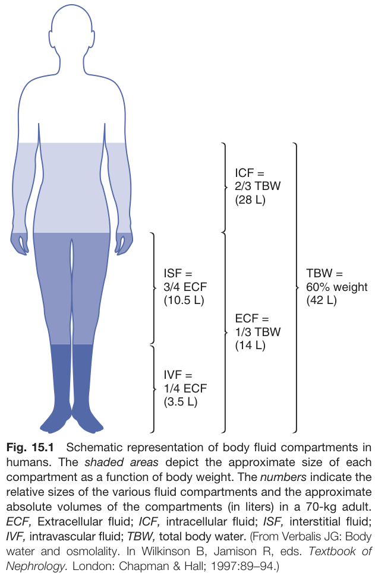

Fig. 15.1 Schematic representation of body fluid compartments in humans. The shaded areas depict the approximate size of each compartment as a function of body weight. The numbers indicate the relative sizes of the various fluid compartments and the approximate absolute volumes of the compartments (in liters) in a 70-kg adult. ECF, Extracellular fluid; ICF, intracellular fluid; ISF, interstitial fluid; IVF, intravascular fluid; TBW, total body water. (From Verbalis JG: Body water and osmolality. In Wilkinson B, Jamison R, eds. Textbook of Nephrology. London: Chapman & Hall; 1997:89-94.) ICF = 2/3 TBW (28 L) ECF = 1/3 TBW (14 L) TBW = 60% weight (42 L) ISF = 3/4 ECF (10.5 L) IVF = 1/4 ECF (3.5 L)

---

### Fig_15_2

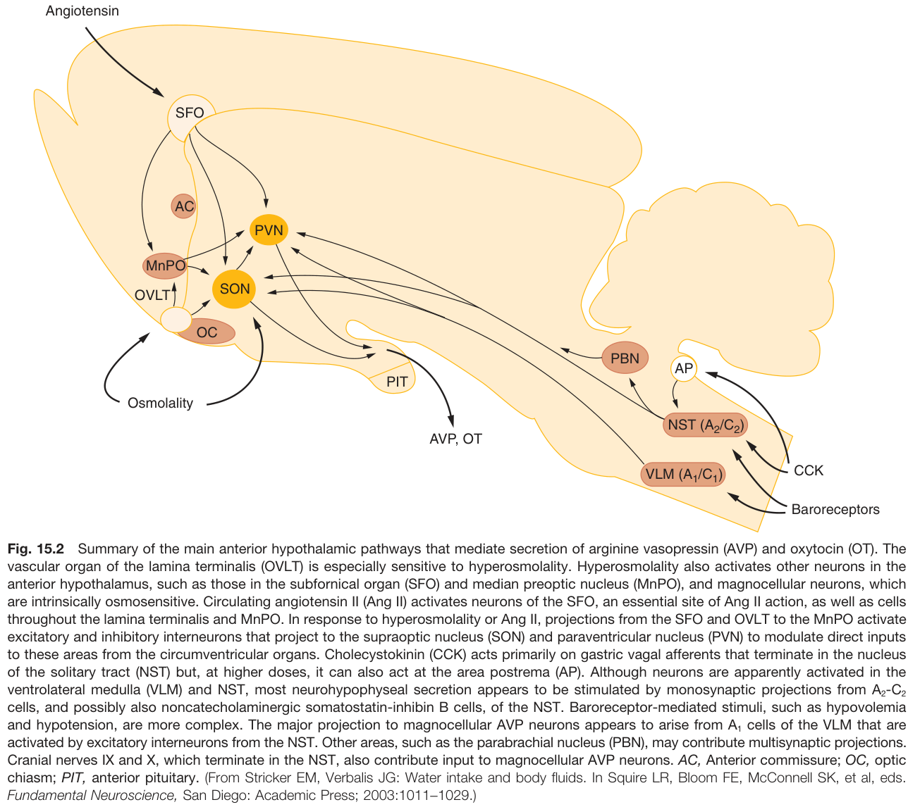

Fig. 15.2 Summary of the main anterior hypothalamic pathways that mediate secretion of arginine vasopressin (AVP) and oxytocin (OT). The vascular organ of the lamina terminalis (OVLT) is especially sensitive to hyperosmolality. Hyperosmolality also activates other neurons in the anterior hypothalamus, such as those in the subfornical organ (SFO) and median preoptic nucleus (MnPO), and magnocellular neurons, which are intrinsically osmosensitive. Circulating angiotensin II (Ang II) activates neurons of the SFO, an essential site of Ang II action, as well as cells throughout the lamina terminalis and MnPO. In response to hyperosmolality or Ang II, projections from the SFO and OVLT to the MnPO activate excitatory and inhibitory interneurons that project to the supraoptic nucleus (SON) and paraventricular nucleus (PVN) to modulate direct inputs to these areas from the circumventricular organs. Cholecystokinin (CCK) acts primarily on gastric vagal afferents that terminate in the nucleus of the solitary tract (NST) but, at higher doses, it can also act at the area postrema (AP). Although neurons are apparently activated in the ventrolateral medulla (VLM) and NST, most neurohypophyseal secretion appears to be stimulated by monosynaptic projections from A2-C2 cells, and possibly also noncatecholaminergic somatostatin-inhibin B cells, of the NST. Baroreceptor-mediated stimuli, such as hypovolemia and hypotension, are more complex. The major projection to magnocellular AVP neurons appears to arise from A₁ cells of the VLM that are activated by excitatory interneurons from the NST. Other areas, such as the parabrachial nucleus (PBN), may contribute multisynaptic projections. Cranial nerves IX and X, which terminate in the NST, also contribute input to magnocellular AVP neurons. AC, Anterior commissure; OC, optic chiasm; PIT, anterior pituitary. (From Stricker EM, Verbalis JG: Water intake and body fluids. In Squire LR, Bloom FE, McConnell SK, et al, eds. Fundamental Neuroscience, San Diego: Academic Press; 2003:1011-1029.)

---

### Fig_15_3

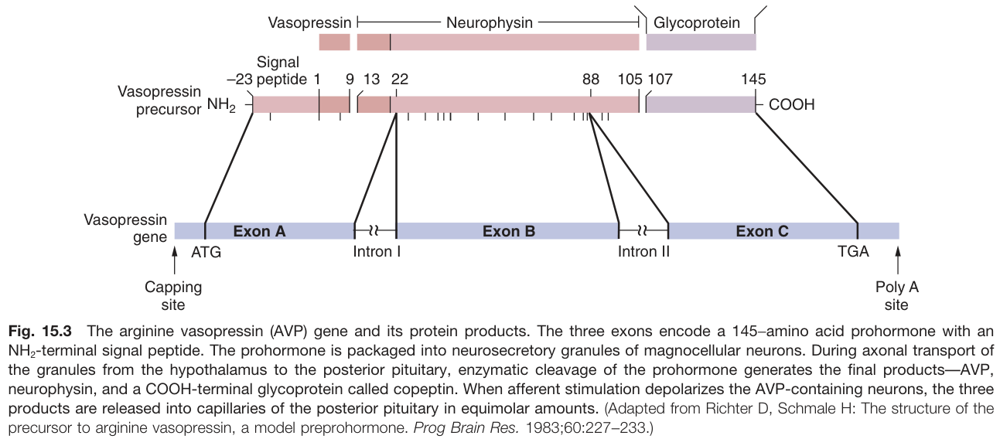

Fig. 15.3 The arginine vasopressin (AVP) gene and its protein products. The three exons encode a 145-amino acid prohormone with an NH2-terminal signal peptide. The prohormone is packaged into neurosecretory granules of magnocellular neurons. During axonal transport of the granules from the hypothalamus to the posterior pituitary, enzymatic cleavage of the prohormone generates the final products-AVP, neurophysin, and a COOH-terminal glycoprotein called copeptin. When afferent stimulation depolarizes the AVP-containing neurons, the three products are released into capillaries of the posterior pituitary in equimolar amounts. (Adapted from Richter D, Schmale H: The structure of the precursor to arginine vasopressin, a model preprohormone. Prog Brain Res. 1983;60:227-233.)

---

### Fig_15_4

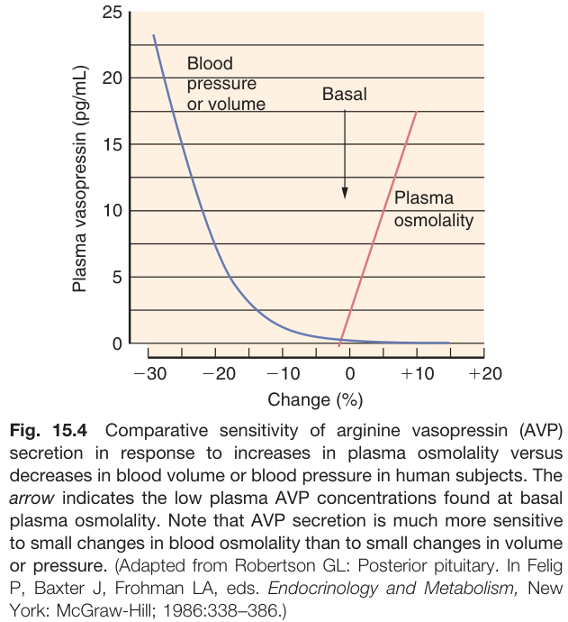

Fig. 15.4 Comparative sensitivity of arginine vasopressin (AVP) secretion in response to increases in plasma osmolality versus decreases in blood volume or blood pressure in human subjects. The arrow indicates the low plasma AVP concentrations found at basal plasma osmolality. Note that AVP secretion is much more sensitive to small changes in blood osmolality than to small changes in volume or pressure. (Adapted from Robertson GL: Posterior pituitary. In Felig P, Baxter J, Frohman LA, eds. Endocrinology and Metabolism, New York: McGraw-Hill; 1986:338-386.)

---

### Fig_15_5

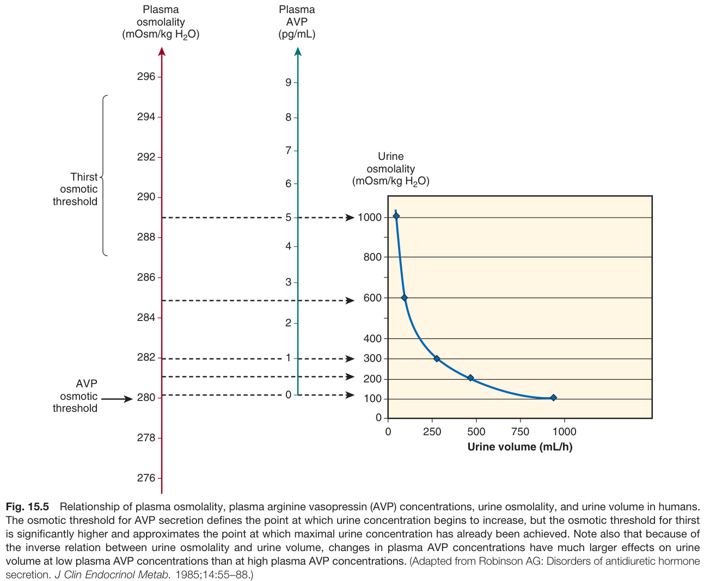

Fig. 15.5 Relationship of plasma osmolality, plasma arginine vasopressin (AVP) concentrations, urine osmolality, and urine volume in humans. The osmotic threshold for AVP secretion defines the point at which urine concentration begins to increase, but the osmotic threshold for thirst is significantly higher and approximates the point at which maximal urine concentration has already been achieved. Note also that because of the inverse relation between urine osmolality and urine volume, changes in plasma AVP concentrations have much larger effects on urine volume at low plasma AVP concentrations than at high plasma AVP concentrations. (Adapted from Robinson AG: Disorders of antidiuretic hormone secretion. J Clin Endocrinol Metab. 1985;14:55-88.)

---

### Fig_15_6

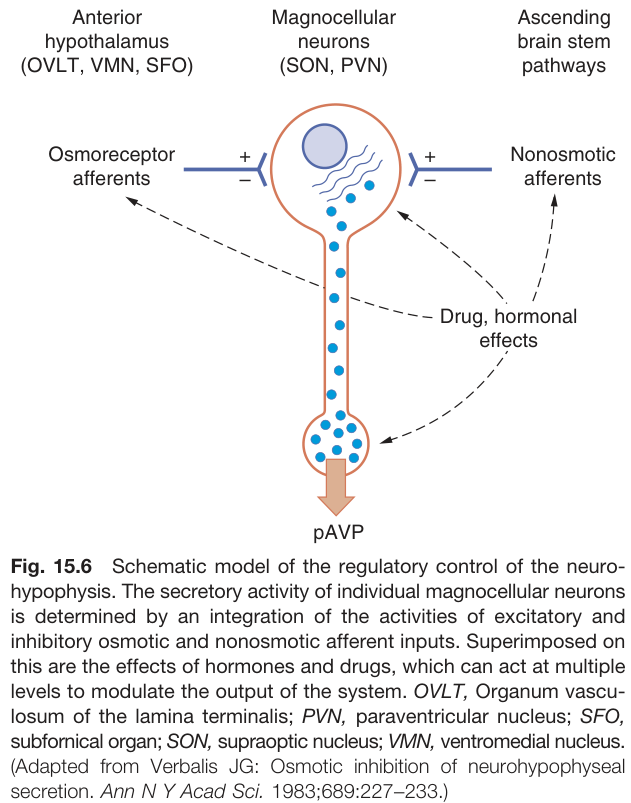

Fig. 15.6 Schematic model of the regulatory control of the neurohypophysis. The secretory activity of individual magnocellular neurons is determined by an integration of the activities of excitatory and inhibitory osmotic and nonosmotic afferent inputs. Superimposed on this are the effects of hormones and drugs, which can act at multiple levels to modulate the output of the system. OVLT, Organum vasculosum of the lamina terminalis; PVN, paraventricular nucleus; SFO, subfornical organ; SON, supraoptic nucleus; VMN, ventromedial nucleus. (Adapted from Verbalis JG: Osmotic inhibition of neurohypophyseal secretion. Ann NY Acad Sci. 1983;689:227-233.)

---

### Fig_15_7

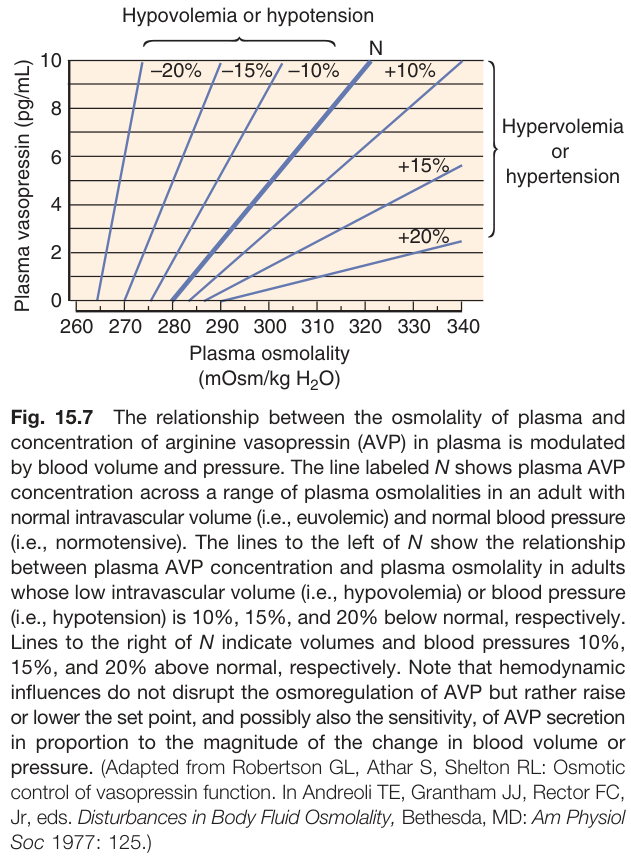

Fig. 15.7 The relationship between the osmolality of plasma and concentration of arginine vasopressin (AVP) in plasma is modulated by blood volume and pressure. The line labeled N shows plasma AVP concentration across a range of plasma osmolalities in an adult with normal intravascular volume (i.e., euvolemic) and normal blood pressure (i.e., normotensive). The lines to the left of N show the relationship between plasma AVP concentration and plasma osmolality in adults whose low intravascular volume (i.e., hypovolemia) or blood pressure (i.e., hypotension) is 10%, 15%, and 20% below normal, respectively. Lines to the right of N indicate volumes and blood pressures 10%, 15%, and 20% above normal, respectively. Note that hemodynamic influences do not disrupt the osmoregulation of AVP but rather raise or lower the set point, and possibly also the sensitivity, of AVP secretion in proportion to the magnitude of the change in blood volume or pressure. (Adapted from Robertson GL, Athar S, Shelton RL: Osmotic control of vasopressin function. In Andreoli TE, Grantham JJ, Rector FC, Jr, eds. Disturbances in Body Fluid Osmolality, Bethesda, MD: Am Physiol Soc 1977: 125.)

---

### Fig_15_8

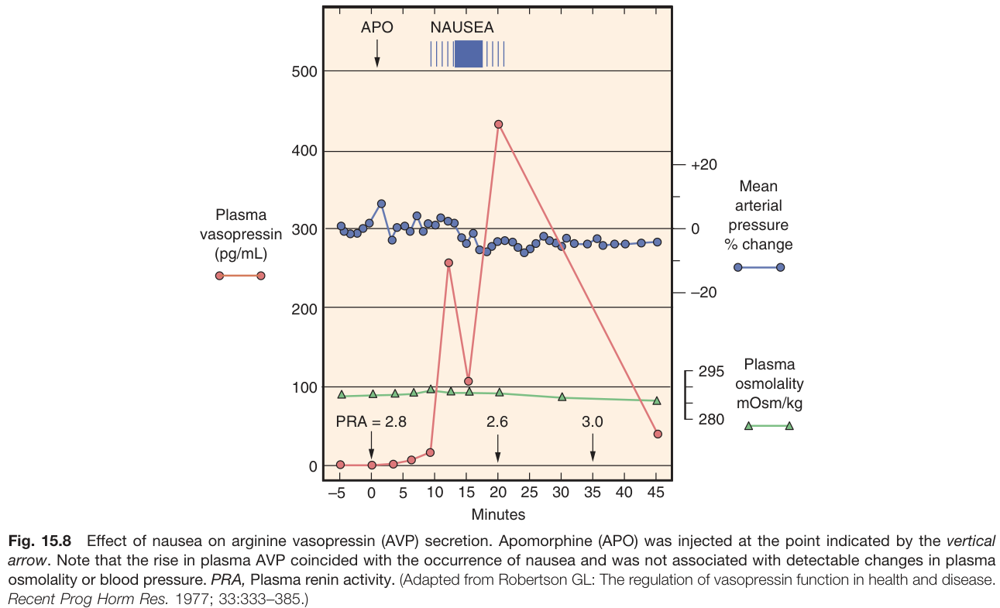

Fig. 15.8 Effect of nausea on arginine vasopressin (AVP) secretion. Apomorphine (APO) was injected at the point indicated by the vertical arrow. Note that the rise in plasma AVP coincided with the occurrence of nausea and was not associated with detectable changes in plasma osmolality or blood pressure. PRA, Plasma renin activity. (Adapted from Robertson GL: The regulation of vasopressin function in health and disease. Recent Prog Horm Res. 1977; 33:333-385.)

---

### Fig_15_9

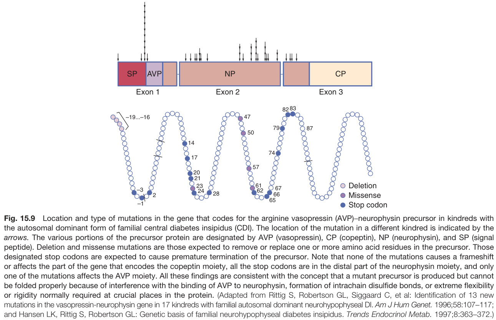

Fig. 15.9 Location and type of mutations in the gene that codes for the arginine vasopressin (AVP)-neurophysin precursor in kindreds with the autosomal dominant form of familial central diabetes insipidus (CDI). The location of the mutation in a different kindred is indicated by the arrows. The various portions of the precursor protein are designated by AVP (vasopressin), CP (copeptin), NP (neurophysin), and SP (signal peptide). Deletion and missense mutations are those expected to remove or replace one or more amino acid residues in the precursor. Those designated stop codons are expected to cause premature termination of the precursor. Note that none of the mutations causes a frameshift or affects the part of the gene that encodes the copeptin moiety, all the stop codons are in the distal part of the neurophysin moiety, and only one of the mutations affects the AVP moiety. All these findings are consistent with the concept that a mutant precursor is produced but cannot be folded properly because of interference with the binding of AVP to neurophysin, formation of intrachain disulfide bonds, or extreme flexibility or rigidity normally required at crucial places in the protein. (Adapted from Rittig S, Robertson GL, Siggaard C, et al: Identification of 13 new mutations in the vasopressin-neurophysin gene in 17 kindreds with familial autosomal dominant neurohypophyseal DI. Am J Hum Genet. 1996;58:107-117; and Hansen LK, Rittig S, Robertson GL: Genetic basis of familial neurohypophyseal diabetes insipidus. Trends Endocrinol Metab. 1997;8:363-372.)

---

### Fig_15_10

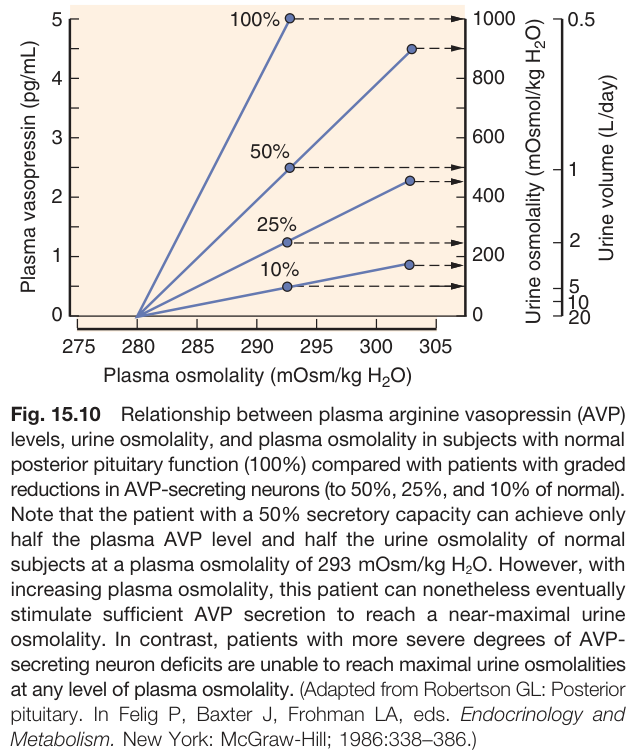

Fig. 15.10 Relationship between plasma arginine vasopressin (AVP) levels, urine osmolality, and plasma osmolality in subjects with normal posterior pituitary function (100%) compared with patients with graded reductions in AVP-secreting neurons (to 50%, 25%, and 10% of normal). Note that the patient with a 50% secretory capacity can achieve only half the plasma AVP level and half the urine osmolality of normal subjects at a plasma osmolality of 293 mOsm/kg H2O. However, with increasing plasma osmolality, this patient can nonetheless eventually stimulate sufficient AVP secretion to reach a near-maximal urine osmolality. In contrast, patients with more severe degrees of AVP-secreting neuron deficits are unable to reach maximal urine osmolalities at any level of plasma osmolality. (Adapted from Robertson GL: Posterior pituitary. In Felig P, Baxter J, Frohman LA, eds. Endocrinology and Metabolism. New York: McGraw-Hill; 1986:338-386.)

---

### Fig_15_11

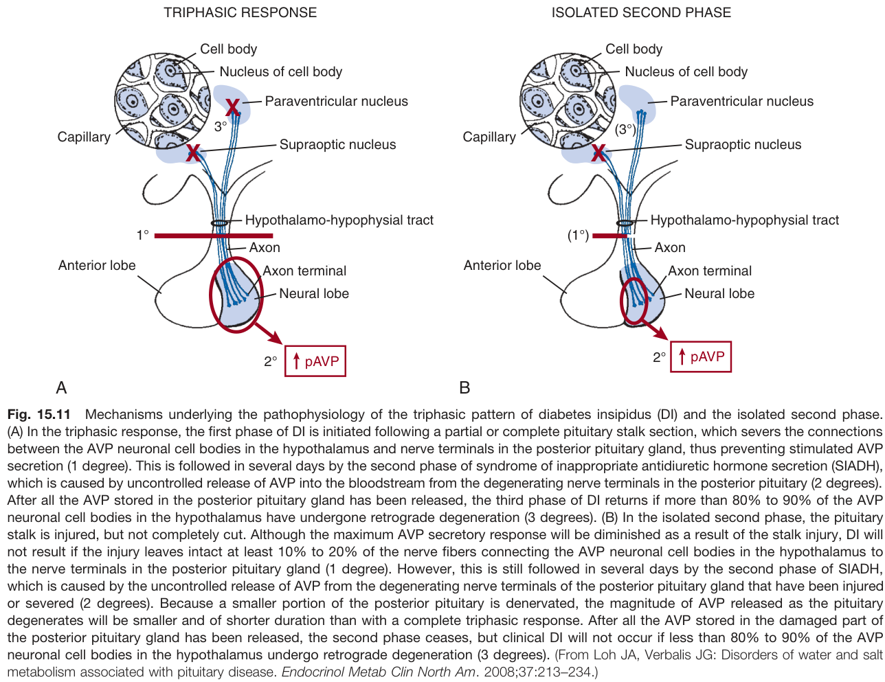

Fig. 15.11 Mechanisms underlying the pathophysiology of the triphasic pattern of diabetes insipidus (DI) and the isolated second phase. (A) In the triphasic response, the first phase of DI is initiated following a partial or complete pituitary stalk section, which severs the connections between the AVP neuronal cell bodies in the hypothalamus and nerve terminals in the posterior pituitary gland, thus preventing stimulated AVP secretion (1 degree). This is followed in several days by the second phase of syndrome of inappropriate antidiuretic hormone secretion (SIADH), which is caused by uncontrolled release of AVP into the bloodstream from the degenerating nerve terminals in the posterior pituitary (2 degrees). After all the AVP stored in the posterior pituitary gland has been released, the third phase of DI returns if more than 80% to 90% of the AVP neuronal cell bodies in the hypothalamus have undergone retrograde degeneration (3 degrees). (B) In the isolated second phase, the pituitary stalk is injured, but not completely cut. Although the maximum AVP secretory response will be diminished as a result of the stalk injury, DI will not result if the injury leaves intact at least 10% to 20% of the nerve fibers connecting the AVP neuronal cell bodies in the hypothalamus to the nerve terminals in the posterior pituitary gland (1 degree). However, this is still followed in several days by the second phase of SIADH, which is caused by the uncontrolled release of AVP from the degenerating nerve terminals of the posterior pituitary gland that have been injured or severed (2 degrees). Because a smaller portion of the posterior pituitary is denervated, the magnitude of AVP released as the pituitary degenerates will be smaller and of shorter duration than with a complete triphasic response. After all the AVP stored in the damaged part of the posterior pituitary gland has been released, the second phase ceases, but clinical DI will not occur if less than 80% to 90% of the AVP neuronal cell bodies in the hypothalamus undergo retrograde degeneration (3 degrees). (From Loh JA, Verbalis JG: Disorders of water and salt metabolism associated with pituitary disease. Endocrinol Metab Clin North Am. 2008;37:213-234.)

---

### Fig_15_12

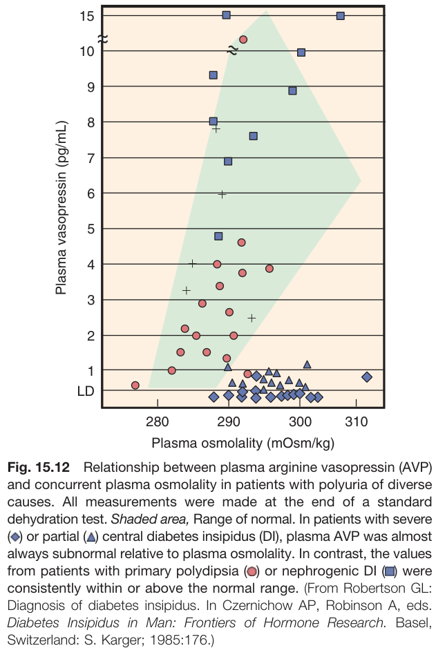

Fig. 15.12 Relationship between plasma arginine vasopressin (AVP) and concurrent plasma osmolality in patients with polyuria of diverse causes. All measurements were made at the end of a standard dehydration test. Shaded area, Range of normal. In patients with severe (◆) or partial (A) central diabetes insipidus (DI), plasma AVP was almost always subnormal relative to plasma osmolality. In contrast, the values from patients with primary polydipsia (O) or nephrogenic DI () were consistently within or above the normal range. (From Robertson GL: Diagnosis of diabetes insipidus. In Czernichow AP, Robinson A, eds. Diabetes Insipidus in Man: Frontiers of Hormone Research. Basel, Switzerland: S. Karger; 1985:176.)

---

### Fig_15_13

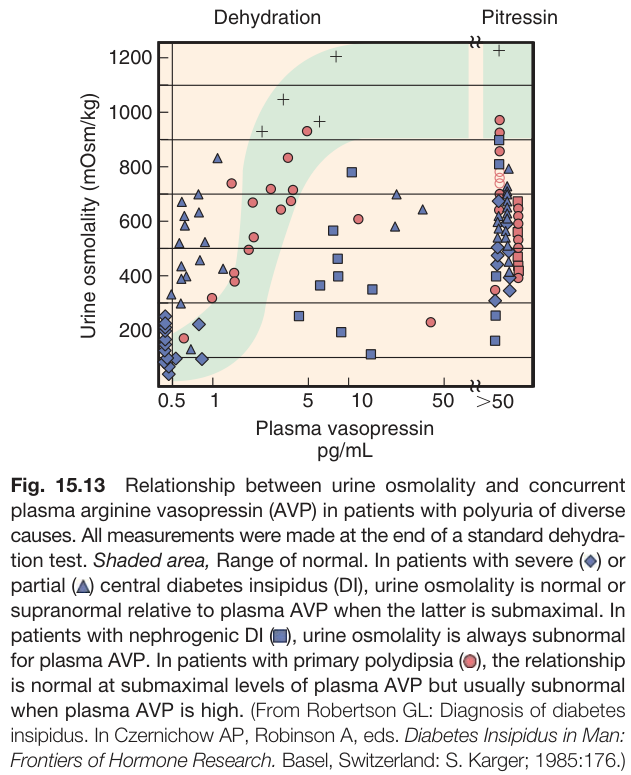

Fig. 15.13 Relationship between urine osmolality and concurrent plasma arginine vasopressin (AVP) in patients with polyuria of diverse causes. All measurements were made at the end of a standard dehydration test. Shaded area, Range of normal. In patients with severe (◆) or partial (▲) central diabetes insipidus (DI), urine osmolality is normal or supranormal relative to plasma AVP when the latter is submaximal. In patients with nephrogenic DI (), urine osmolality is always subnormal for plasma AVP. In patients with primary polydipsia (O), the relationship is normal at submaximal levels of plasma AVP but usually subnormal when plasma AVP is high. (From Robertson GL: Diagnosis of diabetes insipidus. In Czernichow AP, Robinson A, eds. Diabetes Insipidus in Man: Frontiers of Hormone Research. Basel, Switzerland: S. Karger; 1985:176.)

---

### Fig_15_14

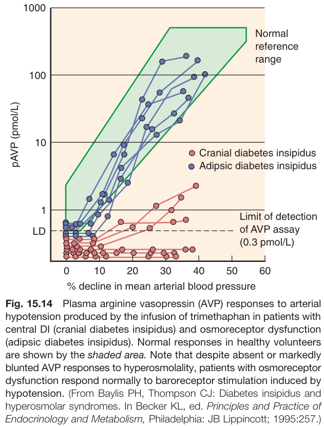

Fig. 15.14 Plasma arginine vasopressin (AVP) responses to arterial hypotension produced by the infusion of trimethaphan in patients with central DI (cranial diabetes insipidus) and osmoreceptor dysfunction (adipsic diabetes insipidus). Normal responses in healthy volunteers are shown by the shaded area. Note that despite absent or markedly blunted AVP responses to hyperosmolality, patients with osmoreceptor dysfunction respond normally to baroreceptor stimulation induced by hypotension. (From Baylis PH, Thompson CJ: Diabetes insipidus and hyperosmolar syndromes. In Becker KL, ed. Principles and Practice of Endocrinology and Metabolism, Philadelphia: JB Lippincott; 1995:257.)

---

### Fig_15_15

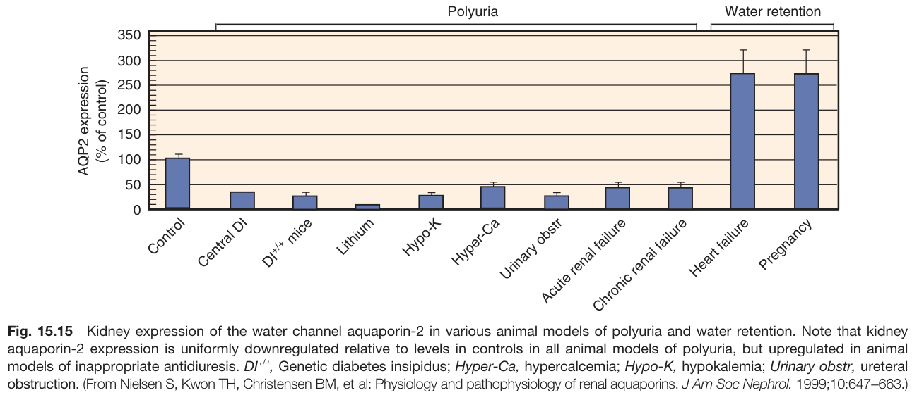

Fig. 15.15 Kidney expression of the water channel aquaporin-2 in various animal models of polyuria and water retention. Note that kidney aquaporin-2 expression is uniformly downregulated relative to levels in controls in all animal models of polyuria, but upregulated in animal models of inappropriate antidiuresis. DI+/+, Genetic diabetes insipidus; Hyper-Ca, hypercalcemia; Hypo-K, hypokalemia; Urinary obstr, ureteral obstruction. (From Nielsen S, Kwon TH, Christensen BM, et al: Physiology and pathophysiology of renal aquaporins. J Am Soc Nephrol. 1999;10:647-663.)

---

### Fig_15_16

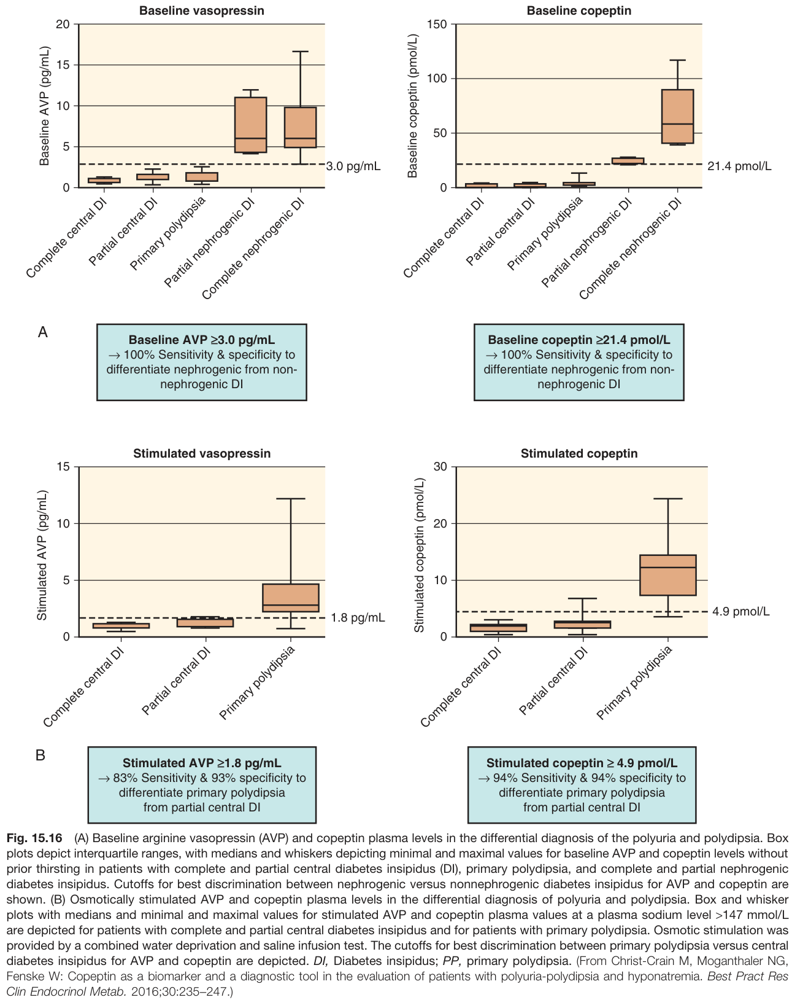

Fig. 15.16 (A) Baseline arginine vasopressin (AVP) and copeptin plasma levels in the differential diagnosis of the polyuria and polydipsia. (B) Osmotically stimulated AVP and copeptin plasma levels in the differential diagnosis of polyuria and polydipsia.

---

### Fig_15_17

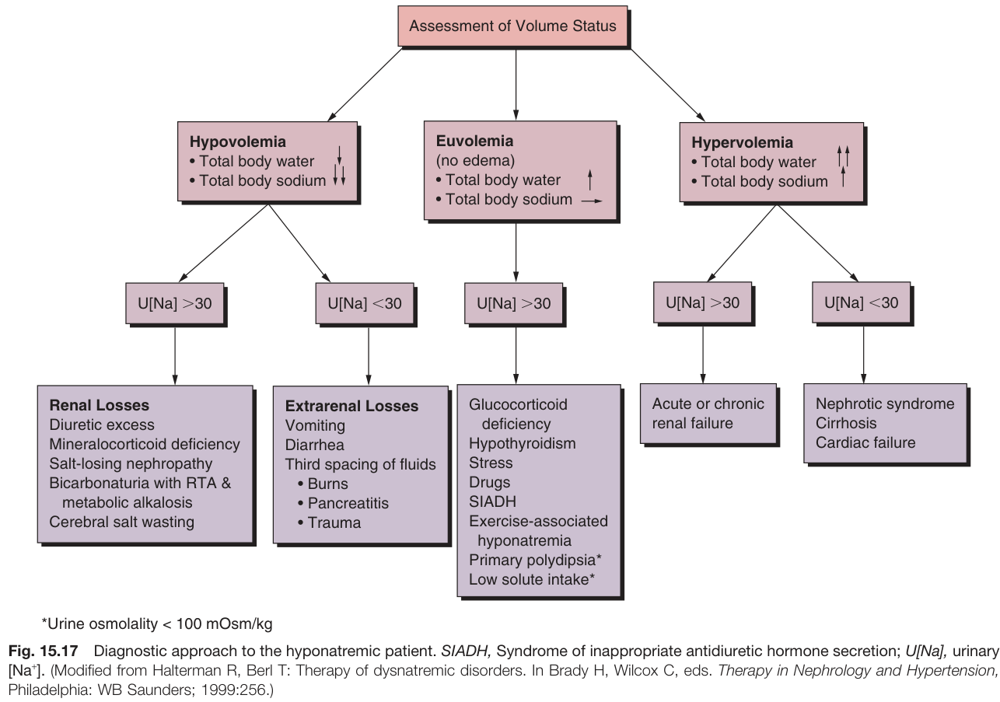

Fig. 15.17 Diagnostic approach to the hyponatremic patient. SIADH, Syndrome of inappropriate antidiuretic hormone secretion; U[Na], urinary [Na+]. (Modified from Halterman R, Berl T: Therapy of dysnatremic disorders. In Brady H, Wilcox C, eds. Therapy in Nephrology and Hypertension, Philadelphia: WB Saunders; 1999:256.) *Urine osmolality < 100 mOsm/kg

---

### Fig_15_18

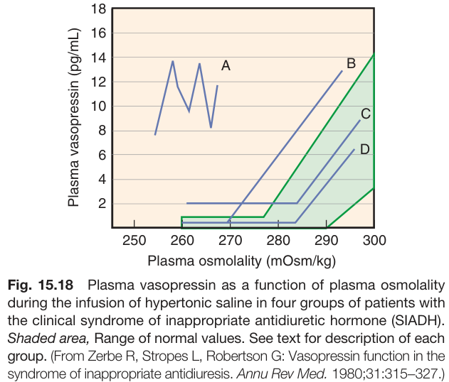

Fig. 15.18 Plasma vasopressin as a function of plasma osmolality during the infusion of hypertonic saline in four groups of patients with the clinical syndrome of inappropriate antidiuretic hormone (SIADH). Shaded area, Range of normal values. See text for description of each group. (From Zerbe R, Stropes L, Robertson G: Vasopressin function in the syndrome of inappropriate antidiuresis. Annu Rev Med. 1980;31:315-327.)

---

### Fig_15_19

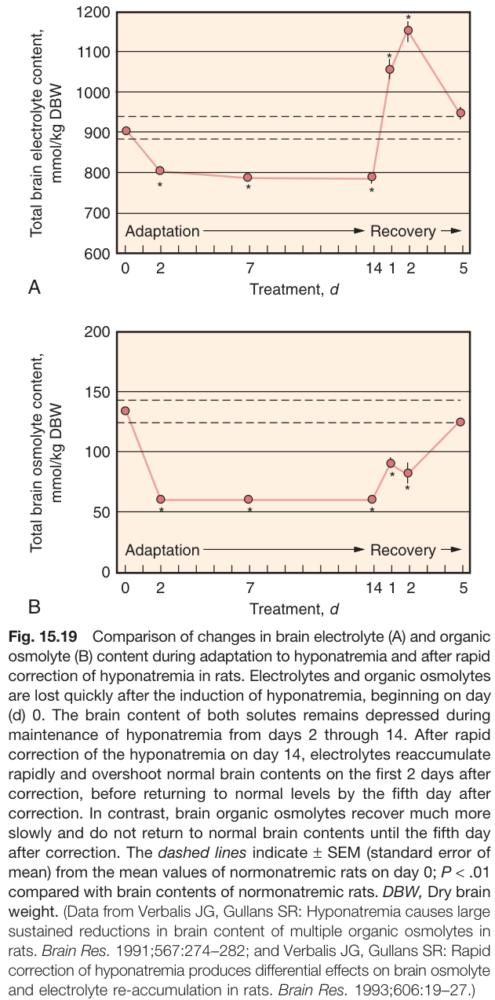

Fig. 15.19 Comparison of changes in brain electrolyte (A) and organic osmolyte (B) content during adaptation to hyponatremia and after rapid correction of hyponatremia in rats. Electrolytes and organic osmolytes are lost quickly after the induction of hyponatremia, beginning on day (d) 0. The brain content of both solutes remains depressed during maintenance of hyponatremia from days 2 through 14. After rapid correction of the hyponatremia on day 14, electrolytes reaccumulate rapidly and overshoot normal brain contents on the first 2 days after correction, before returning to normal levels by the fifth day after correction. In contrast, brain organic osmolytes recover much more slowly and do not return to normal brain contents until the fifth day after correction. The dashed lines indicate ± SEM (standard error of mean) from the mean values of normonatremic rats on day 0; P < .01 compared with brain contents of normonatremic rats. DBW, Dry brain weight. (Data from Verbalis JG, Gullans SR: Hyponatremia causes large sustained reductions in brain content of multiple organic osmolytes in rats. Brain Res. 1991;567:274-282; and Verbalis JG, Gullans SR: Rapid correction of hyponatremia produces differential effects on brain osmolyte and electrolyte re-accumulation in rats. Brain Res. 1993;606:19-27.)

---

### Fig_15_20

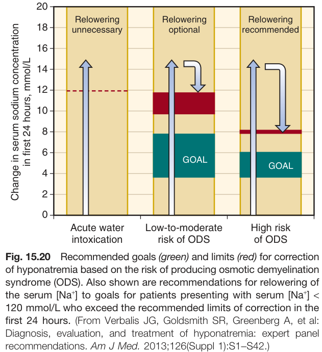

Fig. 15.20 Recommended goals (green) and limits (red) for correction of hyponatremia based on the risk of producing osmotic demyelination syndrome (ODS). Also shown are recommendations for relowering of the serum [Na] to goals for patients presenting with serum [Na⁺] < 120 mmol/L who exceed the recommended limits of correction in the first 24 hours. (From Verbalis JG, Goldsmith SR, Greenberg A, et al: Diagnosis, evaluation, and treatment of hyponatremia: expert panel recommendations. Am J Med. 2013;126(Suppl 1):S1-S42.)

---

### Fig_15_21

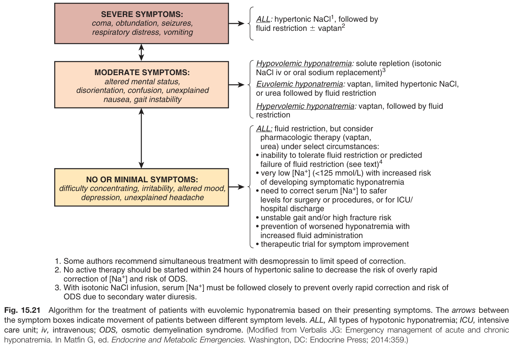

Fig. 15.21 Algorithm for the treatment of patients with euvolemic hyponatremia based on their presenting symptoms. The arrows between the symptom boxes indicate movement of patients between different symptom levels. ALL, All types of hypotonic hyponatremia; ICU, intensive care unit; iv, intravenous; ODS, osmotic demyelination syndrome. (Modified from Verbalis JG: Emergency management of acute and chronic hyponatremia. In Matfin G, ed. Endocrine and Metabolic Emergencies. Washington, DC: Endocrine Press; 2014:359.) 1. Some authors recommend simultaneous treatment with desmopressin to limit speed of correction. 2. No active therapy should be started within 24 hours of hypertonic saline to decrease the risk of overly rapid correction of [Na+] and risk of ODS. 3. With isotonic NaCl infusion, serum [Na+] must be followed closely to prevent overly rapid correction and risk of ODS due to secondary water diuresis.

---

### Fig_15_22

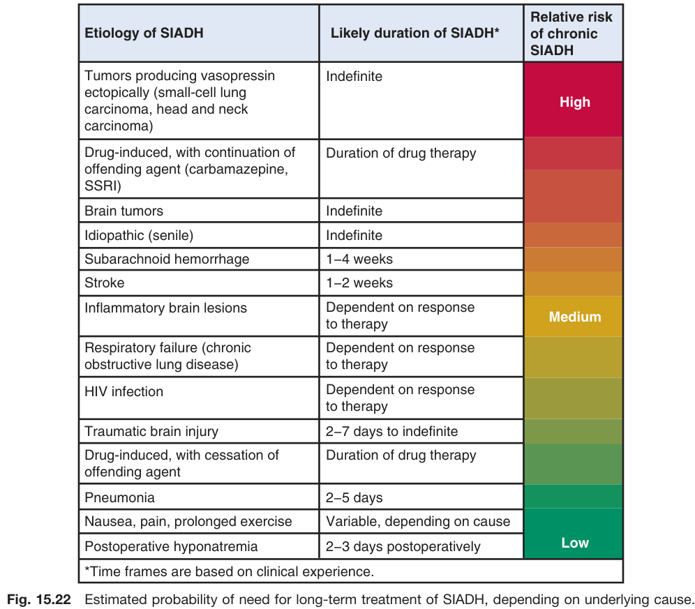

Fig. 15.22 Estimated probability of need for long-term treatment of SIADH, depending on underlying cause. | Etiology of SIADH | Likely duration of SIADH* | Relative risk of chronic SIADH | | :----------------------------------------------------------- | :------------------------------- | :----------------------------- | | Tumors producing vasopressin ectopically (small-cell lung carcinoma, head and neck carcinoma) | Indefinite | High | | Drug-induced, with continuation of offending agent (carbamazepine, SSRI) | Duration of drug therapy | | | Brain tumors | Indefinite | | | Idiopathic (senile) | Indefinite | | | Subarachnoid hemorrhage | 1-4 weeks | Medium | | Stroke | 1-2 weeks | | | Inflammatory brain lesions | Dependent on response to therapy | | | Respiratory failure (chronic obstructive lung disease) | Dependent on response to therapy | | | HIV infection | Dependent on response to therapy | | | Traumatic brain injury | 2-7 days to indefinite | Low | | Drug-induced, with cessation of offending agent | Duration of drug therapy | | | Pneumonia | 2-5 days | | | Nausea, pain, prolonged exercise | Variable, depending on cause | | | Postoperative hyponatremia | 2-3 days postoperatively | | | *Time frames are based on clinical experience.* | | | | <!-- audiobook-skip-end --> | | | differ substantially worldwide, and various treatment guidelines published to date also differ substantially in regard to appropriate hyponatremia management. There are many reasons for this failure to achieve consensus and, until this occurs via further clinical research studies, physicians must recognize the primary role that clinical judgment must continue to play in making decisions about the management of hyponatremia in individual patients. Their recommendations should take into account appropriate appraisals of evidence by authoritative experts in the field, the decisions of regulatory agencies based on critical reviews of the efficacy and safety data for approved treatments for hyponatremia and, most importantly, the specialized needs of individual hyponatremic patients. In the meantime, clinical trials using vasopressin receptor antagonists will enable investigators to answer some long-standing questions about the role of vasopressin V2 receptor activation in various physiologic conditions (e.g., regulation of sweat production), pathophysiologic states (e.g., hyponatremic patients without measurable vasopressin levels), and especially the potential reversibility of long-term adverse effects associated with hyponatremia, such as falls, bone loss, and fractures. This may, in part, account for the increased mortality and morbidity in hyponatremic patients across multiple different comorbidities, as well as in older, community-dwelling subjects without known underlying diseases.

---

## Tables

### Table_15_1

#### Table Image

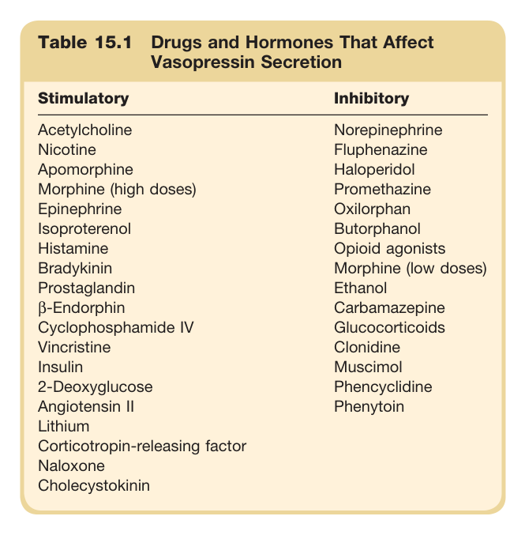

#### Table Data (CSV: [Table_15_1.csv](Table_15_1.csv))

```markdown
| Table Text (OCR) |
| :--- |
| Table 15.1 Drugs and Hormones That Affect Vasopressin Secretion |
```

Table 15.1 Drugs and Hormones That Affect Vasopressin Secretion | Stimulatory | Inhibitory | | :----------------------------- | :------------------- | | Acetylcholine | Norepinephrine | | Nicotine | Fluphenazine | | Apomorphine | Haloperidol | | Morphine (high doses) | Promethazine | | Epinephrine | Oxilorphan | | Isoproterenol | Butorphanol | | Histamine | Opioid agonists | | Bradykinin | Morphine (low doses) | | Prostaglandin | Ethanol | | ẞ-Endorphin | Carbamazepine | | Cyclophosphamide IV | Glucocorticoids | | Vincristine | Clonidine | | Insulin | Muscimol | | 2-Deoxyglucose | Phencyclidine | | Angiotensin II | Phenytoin | | Lithium | | | Corticotropin-releasing factor | | | Naloxone | | | Cholecystokinin | | | <!-- audiobook-skip-end --> | |

---

### Table_15_2

#### Table Image

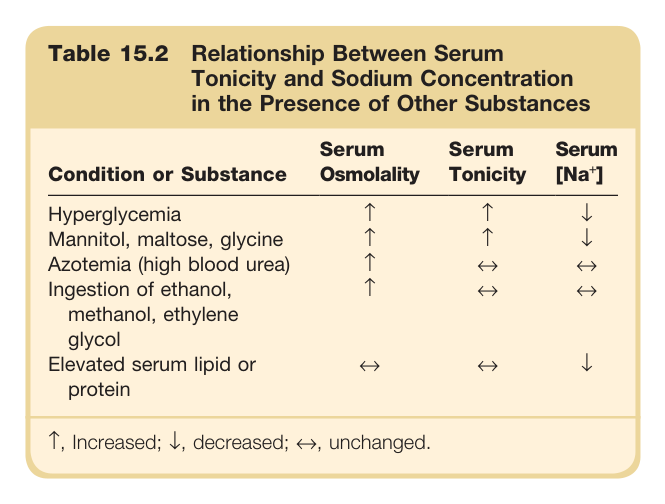

#### Table Data (CSV: [Table_15_2.csv](Table_15_2.csv))

```markdown
| Table Text (OCR) |
| :--- |
| Table 15.2 Relationship Between Serum Tonicity and Sodium Concentration in the Presence of Other Substances |
```

Table 15.2 Relationship Between Serum Tonicity and Sodium Concentration in the Presence of Other Substances | Condition or Substance | Serum Osmolality | Serum Tonicity | Serum [Na] | | :---------------------------------------------- | :--------------- | :------------- | :--------- | | Hyperglycemia | ↑ | ↑ | ↓ | | Mannitol, maltose, glycine | ↑ | ↑ | ↓ | | Azotemia (high blood urea) | ↑ | ↔ | ↔ | | Ingestion of ethanol, methanol, ethylene glycol | ↑ | ↔ | ↔ | | Elevated serum lipid or protein | ↔ | ↔ | ↓ | | *↑, Increased; ↓, decreased; ↔, unchanged.* | | | | | <!-- audiobook-skip-end --> | | | | [Na⁺] and intracellular hydration depends on the solute in question. As noted, in the presence of relative insulin deficiency, glucose does not penetrate cells readily and remains in the ECF. As a consequence, water is drawn osmotically from the ICF compartment, causing cell shrinkage, and this translocation of water commensurately decreases the [Na⁺] in the ECF. In this setting, therefore, the serum [Na⁺] can be low while plasma osmolality is normal or high. It is generally estimated that for every 100-mg/dL rise in serum glucose, the osmotic shift of water causes serum [Na] to fall by 1.6 mEq/L. However, it has been suggested that this may represent an underestimate of the decrease caused by more severe degrees of hyperglycemia, and a 2.4-mEq/L correction factor is recommended in such cases. Similar "translocational” hyponatremia occurs with mannitol or maltose or with the absorption of glycine during transurethral prostate resection, as well as in gynecologic and orthopedic procedures. A potential toxicity for glycine in this setting also requires consideration. The recent introduction of bipolar retroscopes, which allow for the use of NaCl as an irrigant, should result in the disappearance of this clinical entity. When the plasma solute is readily permeable (e.g., urea, ethylene glycol, methanol, ethanol), it enters cells and so does not establish an osmotic gradient for water movement. There is no cellular dehydration, despite the hyperosmolar state, so the serum [Na⁺] remains unchanged. The relationship among plasma osmolality, plasma tonicity, and serum [Na⁺] in the presence of various solutes is summarized in Table 15.2.

---

### Table_15_3

#### Table Image

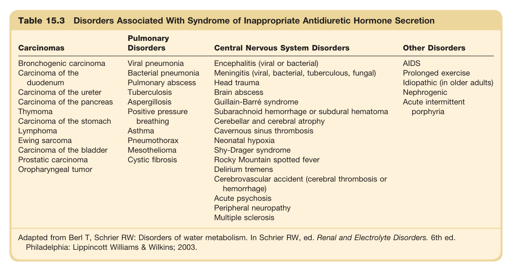

#### Table Data (CSV: [Table_15_3.csv](Table_15_3.csv))

```markdown
| Table Text (OCR) |
| :--- |
| Table 15.3 Disorders Associated With Syndrome of Inappropriate Antidiuretic Hormone Secretion  Adapted from Berl T, Schrier RW: Disorders of water metabolism. In Schrier RW, ed. Renal and Electrolyte Disorders. 6th ed. Philadelphia: Lippincott Williams & Wilkins; 2003. |
```

Table 15.3 Disorders Associated With Syndrome of Inappropriate Antidiuretic Hormone Secretion | Carcinomas | Pulmonary Disorders | Central Nervous System Disorders | Other Disorders | | :----------------------------------------------------------- | :-------------------------- | :----------------------------------------------------------- | :--------------------------- | | Bronchogenic carcinoma | Viral pneumonia | Encephalitis (viral or bacterial) | AIDS | | Carcinoma of the duodenum | Bacterial pneumonia | Meningitis (viral, bacterial, tuberculous, fungal) | Prolonged exercise | | Carcinoma of the ureter | Pulmonary abscess | Head trauma | Idiopathic (in older adults) | | Carcinoma of the pancreas | Tuberculosis | Brain abscess | Nephrogenic | | Thymoma | Aspergillosis | Guillain-Barré syndrome | Acute intermittent porphyria | | Carcinoma of the stomach | Positive pressure breathing | Subarachnoid hemorrhage or subdural hematoma | | | Lymphoma | Asthma | Cerebellar and cerebral atrophy | | | Ewing sarcoma | Pneumothorax | Cavernous sinus thrombosis | | | Carcinoma of the bladder | Mesothelioma | Neonatal hypoxia | | | Prostatic carcinoma | Cystic fibrosis | Shy-Drager syndrome | | | Oropharyngeal tumor | | Rocky Mountain spotted fever | | | | | Delirium tremens | | | | | Cerebrovascular accident (cerebral thrombosis or hemorrhage) | | | | | Acute psychosis | | | | | Peripheral neuropathy | | | | | Multiple sclerosis | | | *Adapted from Berl T, Schrier RW: Disorders of water metabolism. In Schrier RW, ed. Renal and Electrolyte Disorders. 6th ed. Philadelphia: Lippincott Williams & Wilkins; 2003.* | | | | | <!-- audiobook-skip-end --> | | | | of cancer, leading to the conclusion that hyponatremia is linked to an increased risk of being subsequently diagnosed with any cancer, particularly pulmonary and head and neck cancers. In view of the potential to treat patients with this tumor, it is important that patients with unexplained SIADH be fully investigated and evaluated for the presence of this malignancy. Head and neck malignancies are the second most common tumors associated with SIADH, which occurs in approximately 3% of these patients. The mechanism whereby AVP is produced in other pulmonary disorders is not known, but the associated abnormalities in blood gases could act as mediators of the effect. Antidiuretic activity has also been assayed in tuberculous lung tissue. The syndrome can also occur in the setting of miliary rather than only lung-limited tuberculosis. In CNS disorders, AVP is most likely released from the neurohypophysis. Studies of monkeys have shown that elevations of intracranial pressure cause AVP secretion, which may be the mechanism that mediates the syndrome in at least some CNS disorders. The magnocellular AVP-secreting cells in the hypothalamus are subject to numerous excitatory inputs (see Fig. 15.6), and therefore it is conceivable that a large variety of neurologic disorders can stimulate the secretion of AVP. Although SIADH as typically described is associated with inappropriate secretion of AVP, hyponatremia has been described in two infants who met all the criteria for a diagnosis of SIADH but had undetectable AVP levels. Genetic analysis revealed a gain-of-function mutation at the X-linked AVP V2 receptor, where in codon 137 a missense mutation resulted in the change from arginine to cysteine or leucine. The authors termed this “nephrogenic syndrome of inappropriate antidiuresis" (NSIAD). Zebra and colleagues have studied the osmoregulation of AVP secretion in a large group of patients with SIADH. In the great majority, the plasma AVP concentration was inadequately suppressed relative to the hypotonicity present. In most patients, the plasma AVP concentration ranged from 1 to 10 pg/mL, the same range as in normally hydrated healthy adults. Inappropriate secretion, therefore, can often be demonstrated only by measuring AVP under hypotonic conditions. Even with this approach, however, abnormalities in plasma AVP were not apparent in almost 10% of patients with clinical evidence of SIADH. To define the nature of the osmoregulatory defect in these patients better, plasma AVP was measured during infusion of hypertonic saline. When this method of analysis was applied to 25 patients with SIADH, four different types of osmoregulatory defects were identified. As shown in Fig. 15.18, infusion of hypertonic saline in the type A osmoregulatory defect was associated with large and erratic fluctuations in plasma AVP, which bore no relation to the rise in plasma osmolality. This pattern was found in 6 of 25 patients studied who had acute respiratory failure, bronchogenic carcinoma, pulmonary tuberculosis, schizophrenia, or rheumatoid arthritis. This pattern indicates that the secretion of AVP had been totally divorced from osmoreceptor control or was responding to some periodic nonosmotic stimulus. A completely different type of osmoregulatory defect is exemplified by the type B response (see Fig. 15.18). The infusion of hypertonic saline resulted in prompt and progressive rises in plasma osmolality. Regression analyses have shown that the precision and sensitivity of this response are essentially

---

### Table_15_4

#### Table Image

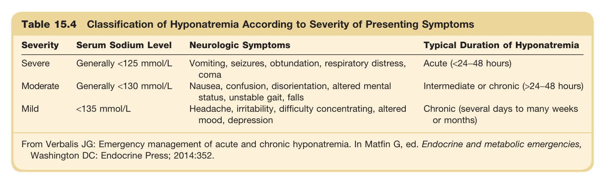

#### Table Data (CSV: [Table_15_4.csv](Table_15_4.csv))

```markdown
| Table Text (OCR) |
| :--- |
| Table 15.4 Classification of Hyponatremia According to Severity of Presenting Symptoms  From Verbalis JG: Emergency management of acute and chronic hyponatremia. In Matfin G, ed. Endocrine and metabolic emergencies, Washington DC: Endocrine Press; 2014:352. |
```

Table 15.4 Classification of Hyponatremia According to Severity of Presenting Symptoms | Severity | Serum Sodium Level | Neurologic Symptoms | Typical Duration of Hyponatremia | | :----------------------------------------------------------- | :-------------------- | :----------------------------------------------------------- | :--------------------------------------------- | | Severe | Generally <125 mmol/L | Vomiting, seizures, obtundation, respiratory distress, coma | Acute (<24-48 hours) | | Moderate | Generally <130 mmol/L | Nausea, confusion, disorientation, altered mental status, unstable gait, falls | Intermediate or chronic (>24-48 hours) | | Mild | <135 mmol/L | Headache, irritability, difficulty concentrating, altered mood, depression | Chronic (several days to many weeks or months) | | *From Verbalis JG: Emergency management of acute and chronic hyponatremia. In Matfin G, ed. Endocrine and metabolic emergencies, Washington DC: Endocrine Press; 2014:352.* | | | | | <!-- audiobook-skip-end --> | | | | may occur more frequently in menstruating women. In a case-control study, Ayus and colleagues have noted that despite an approximately equal incidence of postoperative hyponatremia in males and females, 97% of those with permanent brain damage were women, and 75% of them were menstruating. However, this view is not universally held, because others have not found increased postoperative hyponatremia in this population. The degree of clinical impairment is not as much related to the absolute measured level of lowered serum [Na⁺] as it is to the rate and extent of the decrease in ECF osmolality. In a survey of hospitalized hyponatremic patients (serum [Na⁺] < 128 mEq/L), 46% had CNS symptoms, and 54% were asymptomatic. It is notable, however, that the authors thought that the hyponatremia was the cause of the symptoms in only 31% of the symptomatic patients. In this subgroup of symptomatic patients, the mortality was no different from that of asymptomatic patients (9%-10%). In contrast, the mortality of patients whose CNS symptoms were not caused by hyponatremia was high (64%), suggesting that the mortality of these patients is more often due to the associated comorbidity than to the electrolyte disorder itself. This is in agreement with an earlier study of Anderson, which noted a 60-fold increase in mortality in hyponatremic patients over that of normonatremic control subjects. However, in the hyponatremic patients death frequently occurred after the plasma [Na⁺] was returned to normal and was generally thought to be due to the progression of severe underlying disease. These studies suggested that hyponatremia is an indicator of severe underlying disease and poor prognosis rather than a cause of the observed increased mortality of such patients. In contrast to this point of view, a recent meta-analysis of studies in which some patients had correction of their hyponatremia indicated that improvement in serum [Na⁺] was associated with a 50% reduction in mortality of the corrected groups compared with patients in whom the hyponatremia remained uncorrected, suggesting that hyponatremia may, in fact, be causally related to increased mortality. Other studies have further indicated that even mild hyponatremia is an independent predictor of higher mortality across a wide variety of disorders, including patients with acute ST-elevation myocardial infarction, heart failure, and liver disease. A large study of more than 55,000 electronic heath records from a single Boston hospital has shown that the association of hyponatremia with inpatient mortality is significant across all levels of hyponatremia and even began at serum [Na] levels in the lower part of the normal range. These findings were corroborated in studies of 249,000 Danish patients hospitalized over a 5-year period that showed increased 30-day and 1-year mortality associated with all levels of hyponatremia, including the range of 130 to 134.9 mmol/L, and analyses of 2.3 million hospitalized patients enrolled in the Cerner Health Facts database. The mortality associated with chronic hyponatremia is much less well studied, but results of the Rotterdam Longitudinal Aging Study noted significantly decreased survival of older patients with hyponatremia over a 12-year period of observation. The observed severe CNS symptoms are most likely related to the cellular swelling and cerebral edema that result from acute lowering of ECF osmolality, which leads to the movement of water into cells. In fact, such cerebral edema occasionally causes herniation, as has been noted in postmortem examinations of humans and experimental animals. The increase in brain water is, however, much less marked than would be predicted from the decrease in tonicity were the brain to operate as a passive osmometer. The volume regulatory responses that protect against cerebral edema, and which probably occur throughout the body, have been extensively studied and reviewed. Studies of rats have demonstrated a prompt loss of solutes from cells, both electrolytes and organic osmolytes, after the onset of hyponatremia. Some of the solute losses occur very quickly within 24 hours and, in experimental animals, most of the brain solute loss is completed by 48 hours (Fig. 15.19). The rate at which the brain restores the lost electrolytes and osmolytes when hyponatremia is corrected is also of pathophysiologic importance. Na+, K+, and Cl¯ recover quickly and even overshoot normal brain contents. However, the reaccumulation of organic osmolytes is considerably delayed (see Fig. 15.19). This process is likely to account for the more marked cerebral dehydration that accompanies the correction in previously adapted animals, which predisposes them to the development of myelinolysis as a result of disruption of the blood-brain barrier. It has been observed that urea may prevent the myelinolysis associated with this pathology. This may be due to the more rapid reaccumulation of organic osmolytes, particularly inositol in the azotemic state, and is consistent with a dearth of reports of the osmotic demyelination syndrome (OSD) in patients with chronic kidney disease, despite wide swings in serum [Na⁺] during dialysis.

---

### Table_15_5

#### Table Image

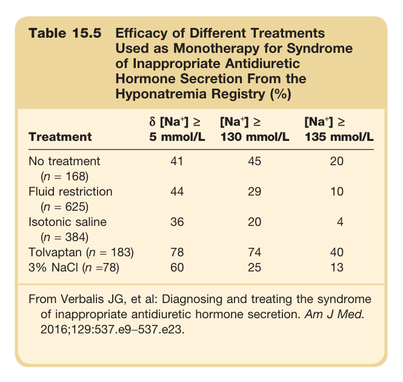

#### Table Data (CSV: [Table_15_5.csv](Table_15_5.csv))

```markdown
| Table Text (OCR) |
| :--- |
| Table 15.5 Efficacy of Different Treatments Used as Monotherapy for Syndrome of Inappropriate Antidiuretic Hormone Secretion From the Hyponatremia Registry (%)  From Verbalis JG, et al: Diagnosing and treating the syndrome of inappropriate antidiuretic hormone secretion. Am J Med. 2016;129:537.e9−537.e23. |
```

Table 15.5 Efficacy of Different Treatments Used as Monotherapy for Syndrome of Inappropriate Antidiuretic Hormone Secretion From the Hyponatremia Registry (%) | Treatment | δ [Na+] ≥ 5 mmol/L | [Na⁺] ≥ 130 mmol/L | [Na⁺] ≥ 135 mmol/L | | :----------------------------------------------------------- | :----------------- | :----------------- | :----------------- | | No treatment (n = 168) | 41 | 45 | 20 | | Fluid restriction (n = 625) | 44 | 29 | 10 | | Isotonic saline (n = 384) | 36 | 20 | 4 | | Tolvaptan (n = 183) | 78 | 74 | 40 | | 3% NaCl (n =78) | 60 | 25 | 13 | | *From Verbalis JG, et al: Diagnosing and treating the syndrome of inappropriate antidiuretic hormone secretion. Am J Med. 2016;129:537.e9-537.e23.* | | | | | <!-- audiobook-skip-end --> | | | |

---

## Boxes

### Box_15_1

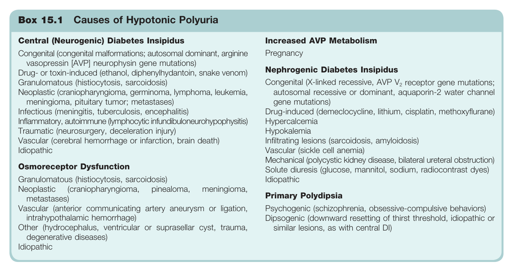

#### Box Text

```markdown
Box 15.1 Causes of Hypotonic Polyuria Central (Neurogenic) Diabetes Insipidus Congenital (congenital malformations; autosomal dominant, arginine vasopressin [AVP] neurophysin gene mutations) Drug- or toxin-induced (ethanol, diphenylhydantoin, snake venom) Granulomatous (histiocytosis, sarcoidosis) Neoplastic (craniopharyngioma, germinoma, lymphoma, leukemia, meningioma, pituitary tumor; metastases) Infectious (meningitis, tuberculosis, encephalitis) Inflammatory, autoimmune (lymphocytic infundibuloneurohypophysitis) Traumatic (neurosurgery, deceleration injury) Vascular (cerebral hemorrhage or infarction, brain death) Idiopathic Osmoreceptor Dysfunction Granulomatous (histiocytosis, sarcoidosis) Neoplastic (craniopharyngioma, pinealoma, meningioma, metastases) Vascular (anterior communicating artery aneurysm or ligation, intrahypothalamic hemorrhage) Other (hydrocephalus, ventricular or suprasellar cyst, trauma, degenerative diseases) Idiopathic
```

Box 15.1 Causes of Hypotonic Polyuria **Central (Neurogenic) Diabetes Insipidus** * Congenital (congenital malformations; autosomal dominant, arginine vasopressin [AVP] neurophysin gene mutations) * Drug- or toxin-induced (ethanol, diphenylhydantoin, snake venom) * Granulomatous (histiocytosis, sarcoidosis) * Neoplastic (craniopharyngioma, germinoma, lymphoma, leukemia, meningioma, pituitary tumor; metastases) * Infectious (meningitis, tuberculosis, encephalitis) * Inflammatory, autoimmune (lymphocytic infundibuloneurohypophysitis) * Traumatic (neurosurgery, deceleration injury) * Vascular (cerebral hemorrhage or infarction, brain death) * Idiopathic **Osmoreceptor Dysfunction** * Granulomatous (histiocytosis, sarcoidosis) * Neoplastic (craniopharyngioma, pinealoma, meningioma, metastases) * Vascular (anterior communicating artery aneurysm or ligation, intrahypothalamic hemorrhage) * Other (hydrocephalus, ventricular or suprasellar cyst, trauma, degenerative diseases) * Idiopathic **Increased AVP Metabolism** * Pregnancy **Nephrogenic Diabetes Insipidus** * Congenital (X-linked recessive, AVP V2 receptor gene mutations; autosomal recessive or dominant, aquaporin-2 water channel gene mutations) * Drug-induced (demeclocycline, lithium, cisplatin, methoxyflurane) * Hypercalcemia * Hypokalemia * Infiltrating lesions (sarcoidosis, amyloidosis) * Vascular (sickle cell anemia) * Mechanical (polycystic kidney disease, bilateral ureteral obstruction) * Solute diuresis (glucose, mannitol, sodium, radiocontrast dyes) * Idiopathic **Primary Polydipsia** * Psychogenic (schizophrenia, obsessive-compulsive behaviors) * Dipsogenic (downward resetting of thirst threshold, idiopathic or similar lesions, as with central DI)

---

### Box_15_2

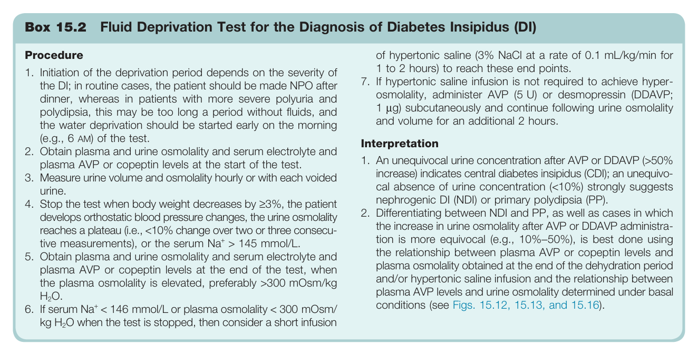

#### Box Text

```markdown
Box 15.2 Fluid Deprivation Test for the Diagnosis of Diabetes Insipidus (DI) Procedure of hypertonic saline (3% NaCl at a rate of 0.1 mL/kg/min for 1 to 2 hours) to reach these end points. 7. If hypertonic saline infusion is not required to achieve hyper- osmolality, administer AVP (5 U) or desmopressin (DDAVP; 1 µg) subcutaneously and continue following urine osmolality and volume for an additional 2 hours. Interpretation
```

Box 15.2 Fluid Deprivation Test for the Diagnosis of Diabetes Insipidus (DI) **Procedure** 1. Initiation of the deprivation period depends on the severity of the DI; in routine cases, the patient should be made NPO after dinner, whereas in patients with more severe polyuria and polydipsia, this may be too long a period without fluids, and the water deprivation should be started early on the morning (e.g., 6 AM) of the test. 2. Obtain plasma and urine osmolality and serum electrolyte and plasma AVP or copeptin levels at the start of the test. 3. Measure urine volume and osmolality hourly or with each voided urine. 4. Stop the test when body weight decreases by ≥3%, the patient develops orthostatic blood pressure changes, the urine osmolality reaches a plateau (i.e., <10% change over two or three consecutive measurements), or the serum Na+ > 145 mmol/L. 5. Obtain plasma and urine osmolality and serum electrolyte and plasma AVP or copeptin levels at the end of the test, when the plasma osmolality is elevated, preferably >300 mOsm/kg H2O. 6. If serum Na+ < 146 mmol/L or plasma osmolality < 300 mOsm/ kg H2O when the test is stopped, then consider a short infusion of hypertonic saline (3% NaCl at a rate of 0.1 mL/kg/min for 1 to 2 hours) to reach these end points. 7. If hypertonic saline infusion is not required to achieve hyperosmolality, administer AVP (5 U) or desmopressin (DDAVP; 1 µg) subcutaneously and continue following urine osmolality and volume for an additional 2 hours. **Interpretation** 1. An unequivocal urine concentration after AVP or DDAVP (>50% increase) indicates central diabetes insipidus (CDI); an unequivocal absence of urine concentration (<10%) strongly suggests nephrogenic DI (NDI) or primary polydipsia (PP). 2. Differentiating between NDI and PP, as well as cases in which the increase in urine osmolality after AVP or DDAVP administration is more equivocal (e.g., 10%-50%), is best done using the relationship between plasma AVP or copeptin levels and plasma osmolality obtained at the end of the dehydration period and/or hypertonic saline infusion and the relationship between plasma AVP levels and urine osmolality determined under basal conditions (see Figs. 15.12, 15.13, and 15.16).

---

### Box_15_3

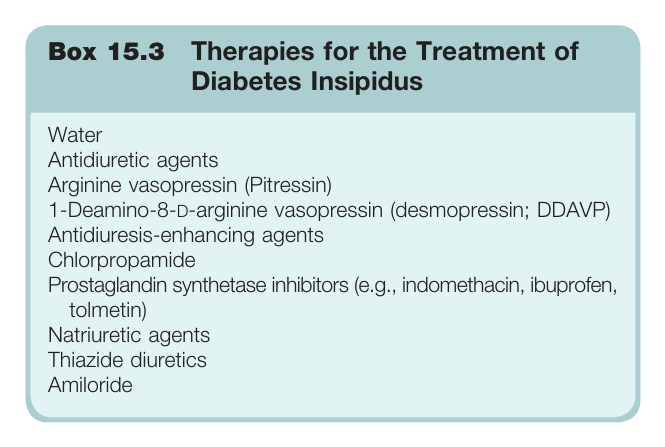

#### Box Text

```markdown
Box 15.3 Therapies for the Treatment of Diabetes Insipidus Water Antidiuretic agents Arginine vasopressin (Pitressin) 1-Deamino-8-D-arginine vasopressin (desmopressin; DDAVP) Antidiuresis-enhancing agents Chlorpropamide Prostaglandin synthetase inhibitors (e.g., indomethacin, ibuprofen, tolmetin) Natriuretic agents Thiazide diuretics Amiloride
```

Box 15.3 Therapies for the Treatment of Diabetes Insipidus * Water * Antidiuretic agents * Arginine vasopressin (Pitressin) * 1-Deamino-8-D-arginine vasopressin (desmopressin; DDAVP) * Antidiuresis-enhancing agents * Chlorpropamide * Prostaglandin synthetase inhibitors (e.g., indomethacin, ibuprofen, tolmetin) * Natriuretic agents * Thiazide diuretics * Amiloride

---

### Box_15_4

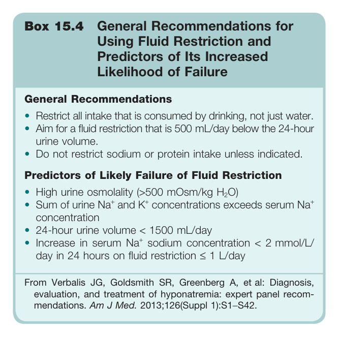

#### Box Text

```markdown
Box 15.4 General Recommendations for Using Fluid Restriction and Predictors of Its Increased Likelihood of Failure General Recommendations Predictors of Likely Failure of Fluid Restriction From Verbalis JG, Goldsmith SR, Greenberg A, et al: Diagnosis, evaluation, and treatment of hyponatremia: expert panel recom- mendations. Am J Med. 2013;126(Suppl 1):S1−S42.
```

Box 15.4 General Recommendations for Using Fluid Restriction and Predictors of Its Increased Likelihood of Failure **General Recommendations** * Restrict all intake that is consumed by drinking, not just water. * Aim for a fluid restriction that is 500 mL/day below the 24-hour urine volume. * Do not restrict sodium or protein intake unless indicated. **Predictors of Likely Failure of Fluid Restriction** * High urine osmolality (>500 mOsm/kg H2O) * Sum of urine Nat and K+ concentrations exceeds serum Na+ concentration * 24-hour urine volume < 1500 mL/day * Increase in serum Nat sodium concentration < 2 mmol/L/ day in 24 hours on fluid restriction ≤ 1 L/day *From Verbalis JG, Goldsmith SR, Greenberg A, et al: Diagnosis, evaluation, and treatment of hyponatremia: expert panel recommendations. Am J Med. 2013;126 (Suppl 1):S1-S42.*

---

### Box_15_5

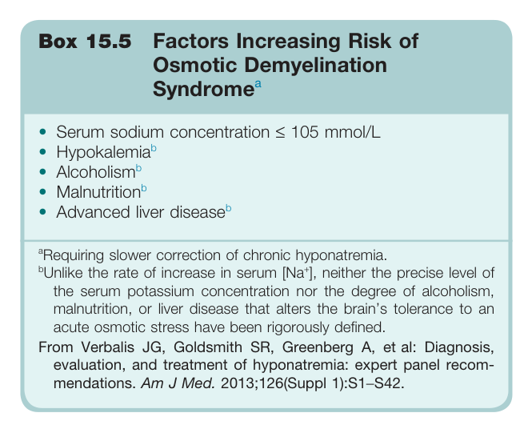

#### Box Text

```markdown
Box 15.5 Factors Increasing Risk of Osmotic Demyelination Syndrome
```

Box 15.5 Factors Increasing Risk of Osmotic Demyelination Syndrome * Serum sodium concentration ≤ 105 mmol/L * Hypokalemiab * Alcoholismb * Malnutritionb * Advanced liver diseaseb *Requiring slower correction of chronic hyponatremia. Unlike the rate of increase in serum [Na], neither the precise level of the serum potassium concentration nor the degree of alcoholism, malnutrition, or liver disease that alters the brain's tolerance to an acute osmotic stress have been rigorously defined. *From Verbalis JG, Goldsmith SR, Greenberg A, et al: Diagnosis, evaluation, and treatment of hyponatremia: expert panel recommendations. Am J Med. 2013;126 (Suppl 1):S1-S42.*

---
