# 16. Disorders of Acid-Base Balance - Figures and Tables Index

This document lists all figures and tables extracted from `16. Disorders of Acid-Base Balance.pdf`.

## Table of Contents
- [Figures](#figures)
- [Tables](#tables)

---

## Figures

### Fig_16_1

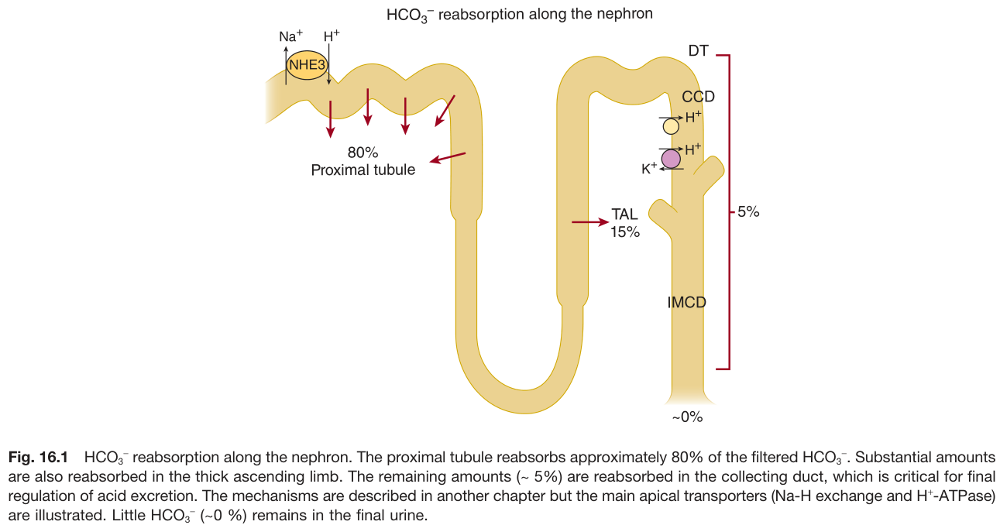

Fig. 16.1 Hco3 reabsorption along the nephron. The proximal tubule reabsorbs approximately 80% of the filtered HCO3. Substantial amounts are also reabsorbed in the thick ascending limb. The remaining amounts (~5%) are reabsorbed in the collecting duct, which is critical for final regulation of acid excretion. The mechanisms are described in another chapter but the main apical transporters (Na-H exchange and H+-ATPase) are illustrated. Little HCO3 (~0%) remains in the final urine.

---

### Fig_16_2

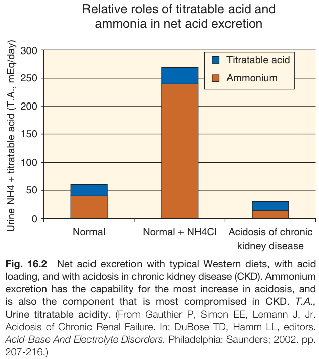

Fig. 16.2 Net acid excretion with typical Western diets, with acid loading, and with acidosis in chronic kidney disease (CKD). Ammonium excretion has the capability for the most increase in acidosis, and is also the component that is most compromised in CKD. T.A., Urine titratable acidity. (From Gauthier P, Simon EE, Lemann J, Jr. Acidosis of Chronic Renal Failure. In: DuBose TD, Hamm LL, editors. Acid-Base And Electrolyte Disorders. Philadelphia: Saunders; 2002. pp. 207-216.)

---

### Fig_16_3

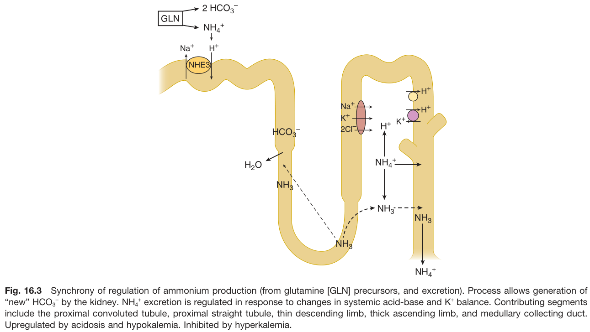

Fig. 16.3 Synchrony of regulation of ammonium production (from glutamine [GLN] precursors, and excretion). Process allows generation of "new" HCO3 by the kidney. NH4+ excretion is regulated in response to changes in systemic acid-base and K+ balance. Contributing segments include the proximal convoluted tubule, proximal straight tubule, thin descending limb, thick ascending limb, and medullary collecting duct. Upregulated by acidosis and hypokalemia. Inhibited by hyperkalemia.

---

### Fig_16_4

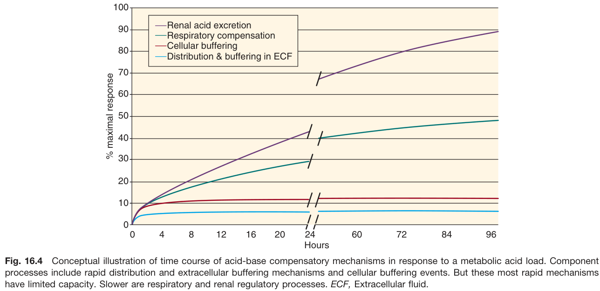

Fig. 16.4 Conceptual illustration of time course of acid-base compensatory mechanisms in response to a metabolic acid load. Component processes include rapid distribution and extracellular buffering mechanisms and cellular buffering events. But these most rapid mechanisms have limited capacity. Slower are respiratory and renal regulatory processes. ECF, Extracellular fluid.

---

### Fig_16_5

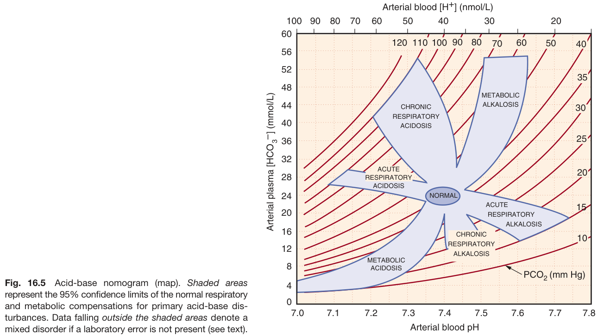

Fig. 16.5 Acid-base nomogram (map). Shaded areas represent the 95% confidence limits of the normal respiratory and metabolic compensations for primary acid-base disturbances. Data falling outside the shaded areas denote a mixed disorder if a laboratory error is not present (see text).

---

### Fig_16_6

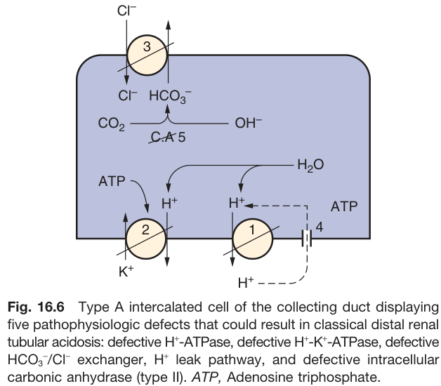

Fig. 16.6 Type A intercalated cell of the collecting duct displaying five pathophysiologic defects that could result in classical distal renal tubular acidosis: defective H+-ATPase, defective H+-K+-ATPase, defective HCO3-/Cl exchanger, H+ leak pathway, and defective intracellular carbonic anhydrase (type II). ATP, Adenosine triphosphate.

---

### Fig_16_7

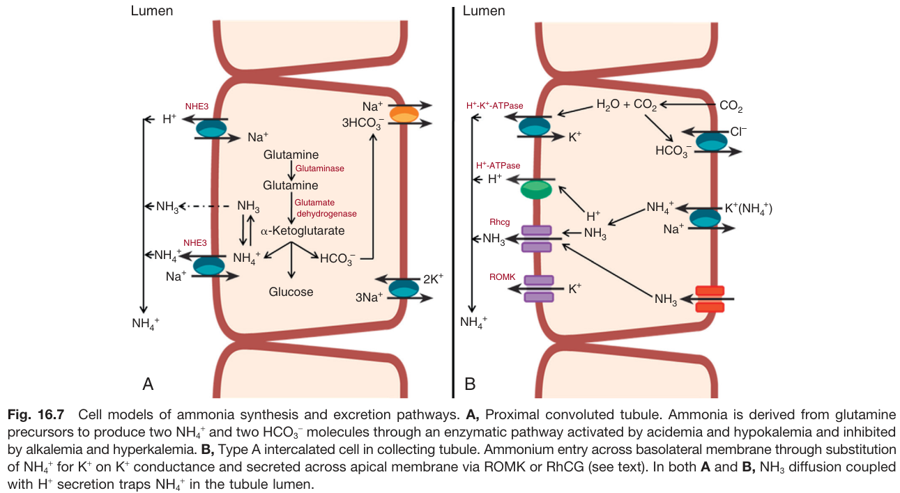

Fig. 16.7 Cell models of ammonia synthesis and excretion pathways. A, Proximal convoluted tubule. Ammonia is derived from glutamine precursors to produce two NH4+ and two HCO3 molecules through an enzymatic pathway activated by acidemia and hypokalemia and inhibited by alkalemia and hyperkalemia. B, Type A intercalated cell in collecting tubule. Ammonium entry across basolateral membrane through substitution of NH4+ for K+ on K+ conductance and secreted across apical membrane via ROMK or RhCG (see text). In both A and B, NH3 diffusion coupled with H+ secretion traps NH4+ in the tubule lumen.

---

### Fig_16_8

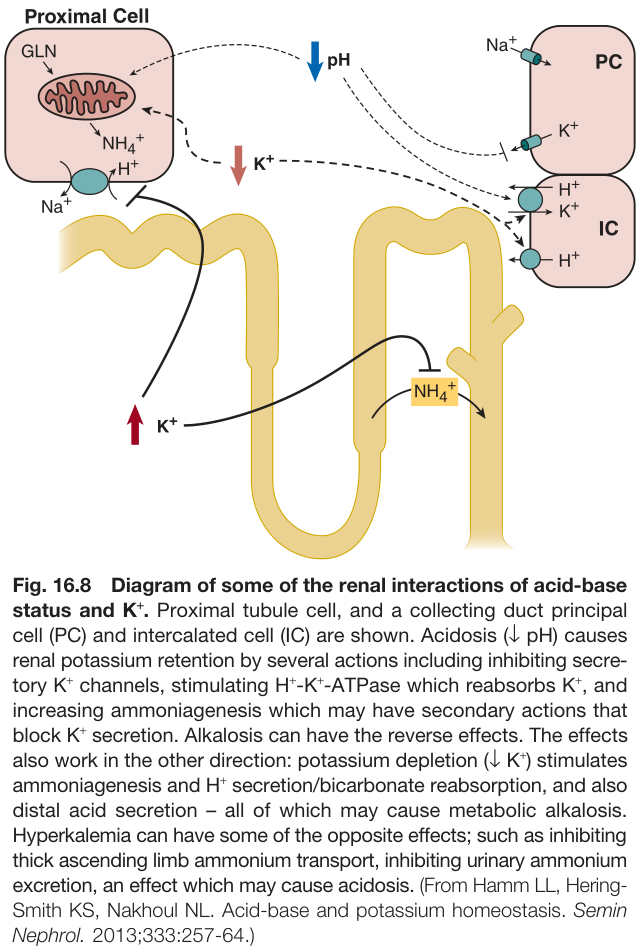

Fig. 16.8 Diagram of some of the renal interactions of acid-base status and K+. Proximal tubule cell, and a collecting duct principal cell (PC) and intercalated cell (IC) are shown. Acidosis (↓ pH) causes renal potassium retention by several actions including inhibiting secretory K+ channels, stimulating H+-K+-ATPase which reabsorbs K+, and increasing ammoniagenesis which may have secondary actions that block K+ secretion. Alkalosis can have the reverse effects. The effects also work in the other direction: potassium depletion (↓ K+) stimulates ammoniagenesis and H+ secretion/bicarbonate reabsorption, and also distal acid secretion all of which may cause metabolic alkalosis. Hyperkalemia can have some of the opposite effects; such as inhibiting thick ascending limb ammonium transport, inhibiting urinary ammonium excretion, an effect which may cause acidosis. (From Hamm LL, Hering-Smith KS, Nakhoul NL. Acid-base and potassium homeostasis. Semin Nephrol. 2013;333:257-64.)

---

### Fig_16_9

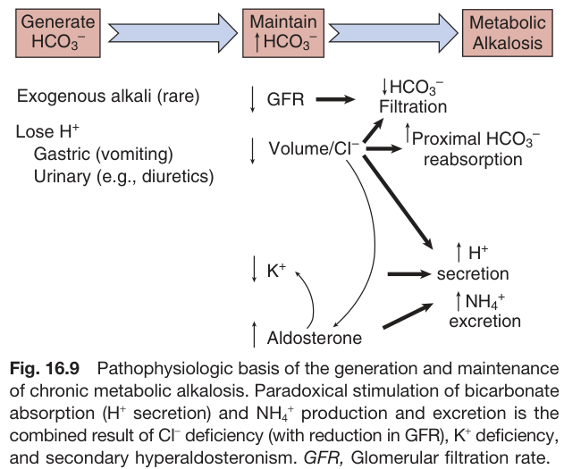

Fig. 16.9 Pathophysiologic basis of the generation and maintenance of chronic metabolic alkalosis. Paradoxical stimulation of bicarbonate absorption (H+ secretion) and NH4+ production and excretion is the combined result of Cl deficiency (with reduction in GFR), K+ deficiency, and secondary hyperaldosteronism. GFR, Glomerular filtration rate.

---

### Fig_16_10

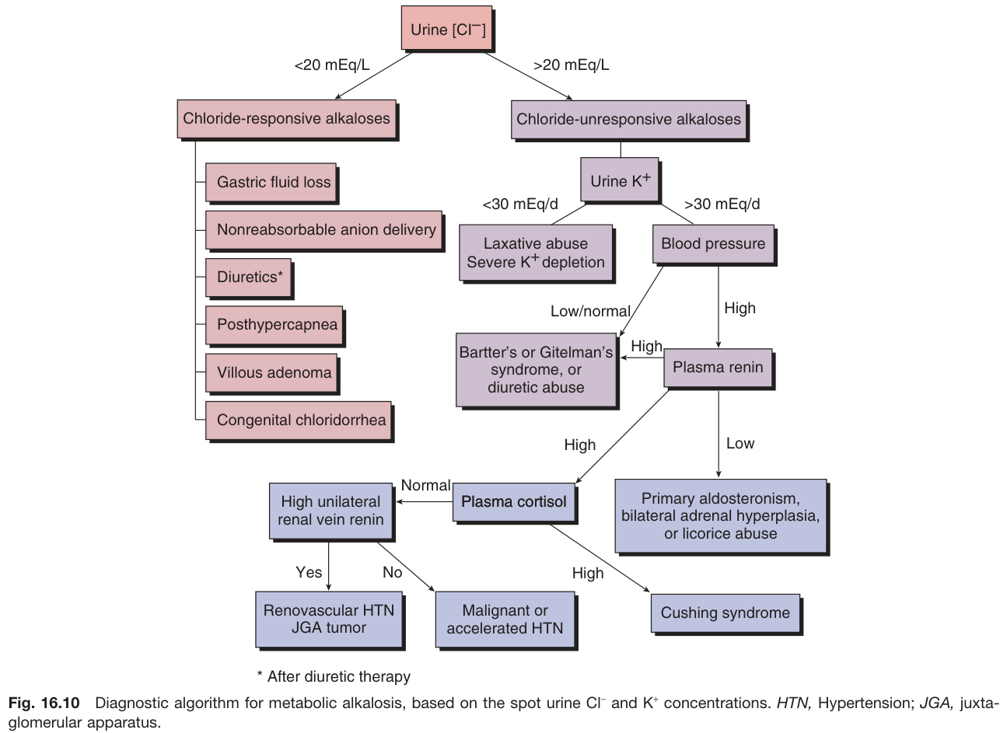

Fig. 16.10 Diagnostic algorithm for metabolic alkalosis, based on the spot urine Cl and K+ concentrations. HTN, Hypertension; JGA, juxtaglomerular apparatus.

---

## Tables

### Table_16_1

#### Table Image

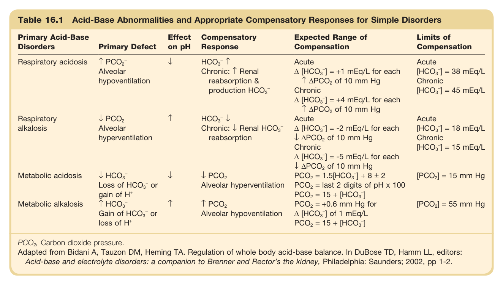

#### Table Data (CSV: [Table_16_1.csv](Table_16_1.csv))

```markdown
| Table Text (OCR) |
| :--- |
| Table 16.1 Acid-Base Abnormalities and Appropriate Compensatory Responses for Simple Disorders  PCO<sub>2</sub>, Carbon dioxide pressure. Adapted from Bidani A, Tauzon DM, Heming TA. Regulation of whole body acid-base balance. In DuBose TD, Hamm LL, editors: Acid-base and electrolyte disorders: a companion to Brenner and Rector’s the kidney, Philadelphia: Saunders; 2002, pp 1-2. |
```

Table 16.1 Acid-Base Abnormalities and Appropriate Compensatory Responses for Simple Disorders | Primary Acid-Base Disorders | Primary Defect | Effect on pH | Compensatory Response | Expected Range of Compensation | Limits of Compensation | | :-------------------------- | :-------------------------------- | :----------- | :----------------------------------------------------- | :----------------------------------------------------------- | :------------------------------------------------ | | Respiratory acidosis | ↑ PCO2 Alveolar hypoventilation | ↓ | HCO3 ↑ Chronic: ↑ Renal reabsorption & production HCO3 | Acute ▲ [HCO3] = +1 mEq/L for each ↑ APCO2 of 10 mm Hg Chronic ▲ [HCO3] = +4 mEq/L for each ↑ APCO2 of 10 mm Hg | Acute [HCO3] = 38 mEq/L Chronic [HCO3] = 45 mEq/L | | Respiratory alkalosis | ↓PCO2 Alveolar hyperventilation | ↑ | HCO3↓ Chronic: Renal HCO3 reabsorption | Acute ▲ [HCO3] = -2 mEq/L for each ↓APCO2 of 10 mm Hg Chronic ▲ [HCO3] = -5 mEq/L for each ↓APCO2 of 10 mm Hg | Acute [HCO3] = 18 mEq/L Chronic [HCO3] = 15 mEq/L | | Metabolic acidosis | ↓HCO3 Loss of HCO3 or gain of H+ | ↓ | ↓PCO2 Alveolar hyperventilation | PCO2 = 1.5[HCO3] + 8 ± 2 PCO2 = last 2 digits of pH x 100 PCO2 = 15 + [HCO3] | [PCO2] = 15 mm Hg | | Metabolic alkalosis | ↑ HCO3 Gain of HCO3 or loss of H+ | ↑ | ↑ PCO2 Alveolar hypoventilation | PCO2 = +0.6 mm Hg for ▲ [HCO3] of 1 mEq/L PCO2 = 15 + [HCO3] | [PCO2] = 55 mm Hg | PCO2, Carbon dioxide pressure. Adapted from Bidani A, Tauzon DM, Heming TA. Regulation of whole body acid-base balance. In DuBose TD, Hamm LL, editors: Acid-base and electrolyte disorders: a companion to Brenner and Rector's the kidney, Philadelphia: Saunders; 2002, pp 1-2.

---

### Table_16_2

#### Table Image

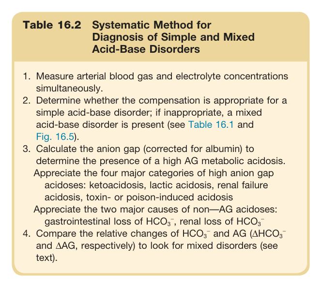

#### Table Data (CSV: [Table_16_2.csv](Table_16_2.csv))

```markdown
| Table Text (OCR) |
| :--- |
| Table 16.2 Systematic Method for Diagnosis of Simple and Mixed Acid-Base Disorders 1. Measure arterial blood gas and electrolyte concentrations simultaneously. 2. Determine whether the compensation is appropriate for a simple acid-base disorder; if inappropriate, a mixed acid-base disorder is present (see Table 16.1 and Fig. 16.5). 3. Calculate the anion gap (corrected for albumin) to determine the presence of a high AG metabolic acidosis. Appreciate the four major categories of high anion gap acidoses: ketoacidosis, lactic acidosis, renal failure acidosis, toxin- or poison-induced acidosis Appreciate the two major causes of non—AG acidoses: gastrointestinal loss of HCO <sup>−</sup>, renal loss of HCO <sup>−</sup> 4. Compare the relative changes of HCO<sub>3</sub><sup>−</sup> and AG (ΔHCO<sub>3</sub> and ΔAG, respectively) to look for mixed disorders (see text). |
```

Table 16.2 Systematic Method for Diagnosis of Simple and Mixed Acid-Base Disorders 1. Measure arterial blood gas and electrolyte concentrations simultaneously. 2. Determine whether the compensation is appropriate for a simple acid-base disorder; if inappropriate, a mixed acid-base disorder is present (see Table 16.1 and Fig. 16.5). 3. Calculate the anion gap (corrected for albumin) to determine the presence of a high AG metabolic acidosis. Appreciate the four major categories of high anion gap acidoses: ketoacidosis, lactic acidosis, renal failure acidosis, toxin- or poison-induced acidosis Appreciate the two major causes of non-AG acidoses: gastrointestinal loss of HCO3, renal loss of HCO3 4. Compare the relative changes of HCO3 and AG (AHCO3 and AAG, respectively) to look for mixed disorders (see text).

---

### Table_16_3

#### Table Image

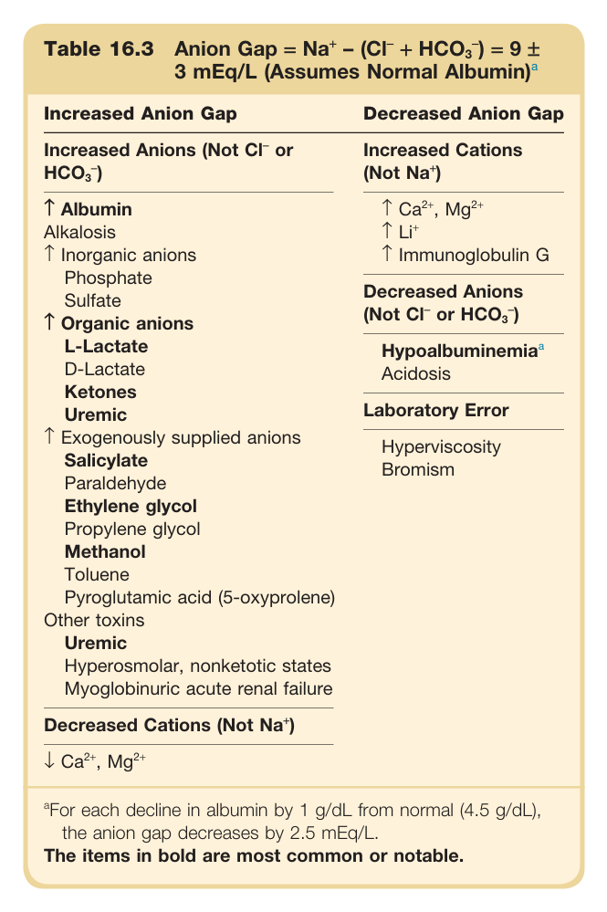

#### Table Data (CSV: [Table_16_3.csv](Table_16_3.csv))

```markdown
| Table Text (OCR) |
| :--- |
| Table 16.3 Anion Gap = Na<sup>+</sup> – (Cl<sup>−</sup> + HCO<sub>3</sub><sup>−</sup>) = 9 ± 3 mEq/L (Assumes Normal Albumin)<sup>a</sup> |
```

Table 16.3 Anion Gap = Na+ – (CI¯ + HCO3¯) = 9 ± 3 mEq/L (Assumes Normal Albumin)ª | Increased Anion Gap | Decreased Anion Gap | | :------------------------------------ | :------------------------------------ | | **Increased Anions (Not Cl or HCO3)** | **Increased Cations (Not Na+)** | | ↑ Albumin | ↑ Ca2+, Mg2+ | | Alkalosis | ↑ Lit | | ↑ Inorganic anions | ↑ Immunoglobulin G | | Phosphate | **Decreased Anions (Not Cl or HCO3)** | | Sulfate | **Hypoalbuminemiaª** | | **↑ Organic anions** | Acidosis | | **L-Lactate** | **Laboratory Error** | | **D-Lactate** | Hyperviscosity | | **Ketones** | Bromism | | Uremic | | | ↑ Exogenously supplied anions | | | **Salicylate** | | | Paraldehyde | | | **Ethylene glycol** | | | Propylene glycol | | | **Methanol** | | | Toluene | | | Pyroglutamic acid (5-oxyprolene) | | | Other toxins | | | Uremic | | | Hyperosmolar, nonketotic states | | | Myoglobinuric acute renal failure | | | **Decreased Cations (Not Na+)** | | | ↓ Ca2+, Mg2+ | | ªFor each decline in albumin by 1 g/dL from normal (4.5 g/dL), the anion gap decreases by 2.5 mEq/L. The items in bold are most common or notable.

---

### Table_16_4

#### Table Image

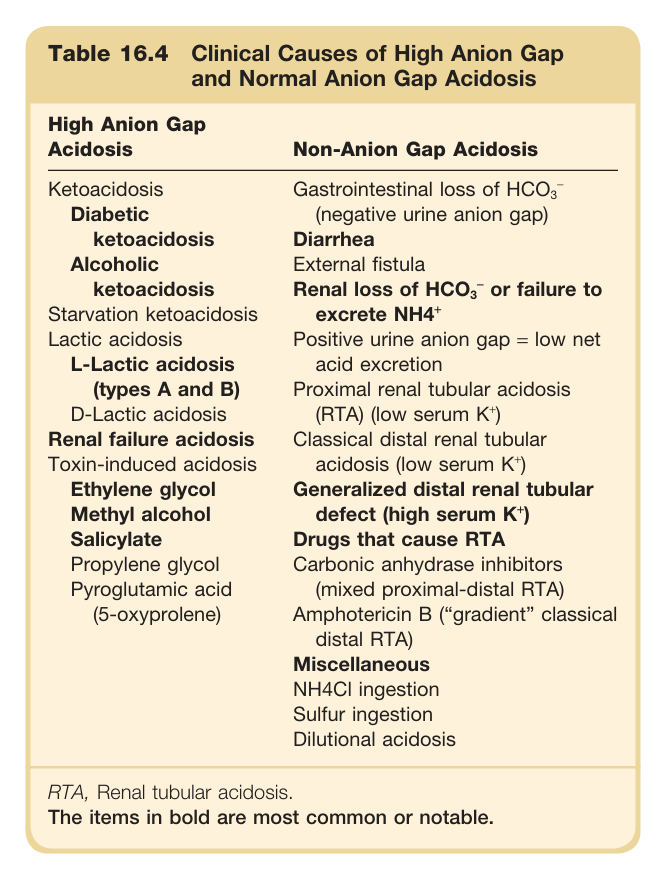

#### Table Data (CSV: [Table_16_4.csv](Table_16_4.csv))

```markdown
| Table Text (OCR) |
| :--- |
| Table 16.4 Clinical Causes of High Anion Gap and Normal Anion Gap Acidosis  RTA, Renal tubular acidosis. The items in bold are most common or notable. |
```

Table 16.4 Clinical Causes of High Anion Gap and Normal Anion Gap Acidosis | High Anion Gap Acidosis | Non-Anion Gap Acidosis | | :------------------------------------ | :----------------------------------------------------------- | | **Ketoacidosis** | **Gastrointestinal loss of HCO3 (negative urine anion gap)** | | **Diabetic ketoacidosis** | **Diarrhea** | | **Alcoholic ketoacidosis** | **External fistula** | | Starvation ketoacidosis | **Renal loss of HCO3 or failure to excrete NH4+** | | **Lactic acidosis** | Positive urine anion gap = low net acid excretion | | **L-Lactic acidosis (types A and B)** | Proximal renal tubular acidosis (RTA) (low serum K+) | | D-Lactic acidosis | Classical distal renal tubular acidosis (low serum K+) | | **Renal failure acidosis** | Generalized distal renal tubular defect (high serum K+) | | **Toxin-induced acidosis** | **Drugs that cause RTA** | | **Ethylene glycol** | Carbonic anhydrase inhibitors (mixed proximal-distal RTA) | | **Methyl alcohol** | Amphotericin B ("gradient" classical distal RTA) | | **Salicylate** | **Miscellaneous** | | Propylene glycol | NH4Cl ingestion | | Pyroglutamic acid (5-oxyprolene) | Sulfur ingestion | | | Dilutional acidosis | RTA, Renal tubular acidosis. The items in bold are most common or notable.

---

### Table_16_5

#### Table Image

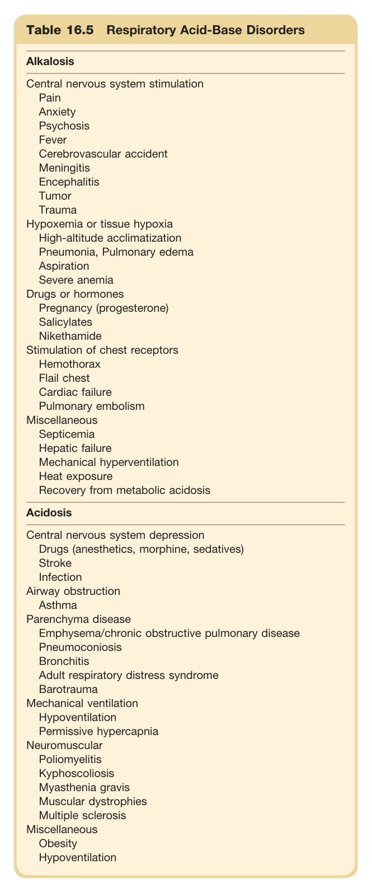

#### Table Data (CSV: [Table_16_5.csv](Table_16_5.csv))

```markdown
| Table Text (OCR) |
| :--- |
| Table 16.5 Respiratory Acid-Base Disorders Alkalosis |
```

Table 16.5 Respiratory Acid-Base Disorders | Alkalosis | Acidosis | | :------------------------------------- | :---------------------------------------------- | | **Central nervous system stimulation** | **Central nervous system depression** | | Pain | Drugs (anesthetics, morphine, sedatives) | | Anxiety | Stroke | | Psychosis | Infection | | Fever | **Airway obstruction** | | Cerebrovascular accident | Asthma | | Meningitis | **Parenchyma disease** | | Encephalitis | Emphysema/chronic obstructive pulmonary disease | | Tumor | Pneumoconiosis | | Trauma | Bronchitis | | **Hypoxemia or tissue hypoxia** | Adult respiratory distress syndrome | | High-altitude acclimatization | Barotrauma | | Pneumonia, Pulmonary edema | **Mechanical ventilation** | | Aspiration | Hypoventilation | | Severe anemia | Permissive hypercapnia | | **Drugs or hormones** | **Neuromuscular** | | Pregnancy (progesterone) | Poliomyelitis | | Salicylates | Kyphoscoliosis | | Nikethamide | Myasthenia gravis | | **Stimulation of chest receptors** | Muscular dystrophies | | Hemothorax | Multiple sclerosis | | Flail chest | **Miscellaneous** | | Cardiac failure | Obesity | | Pulmonary embolism | Hypoventilation | | **Miscellaneous** | | | Septicemia | | | Hepatic failure | | | Mechanical hyperventilation | | | Heat exposure | | | Recovery from metabolic acidosis | | | <!-- audiobook-skip-end --> | | ### Respiratory Alkalosis Alveolar hyperventilation decreases the PaCO2 and increases the HCO3-/PaCO2 ratio, thus increasing pH (alkalemia). Nonbicarbonate cellular buffers respond by titrating HCO3¯ down. Hypocapnia develops whenever a sufficiently strong ventilatory stimulus causes CO₂ output in the lungs to exceed the metabolic production of CO2 by tissues. Plasma pH and HCO3 concentration vary approximately proportionately with PaCO2 over a range from 40 to 15 mm Hg. The arterial [HCO3] will decrease acutely approximately 2 mEq/L for each 10 mm Hg decrease in PCO2. The relationship between pH and PaCO2 is about 0.01 pH unit/mm Hg. Beyond 2 to 6 hours, sustained hypocapnia is further compensated by renal response, a decrease in renal ammonium and titratable acid excretion and a reduction in filtered HCO3 reabsorption. The full expression of renal adaptation may take several days and depends on a normal volume status and renal function. The kidneys appear to respond directly to the lowered Paco, rather than to the alkalemia per se, although both pH and PCO2 may be factors. With chronic respiratory alkalosis, a 1 mm Hg fall in Paco2 causes a 0.4 to 0.5 mEq/L drop in HCO3¯ and a 0.003 unit rise in pH, or the [HCO3¯] will decrease 4 mEq/L for each 10 mm Hg decrease in Paco2. Chronic respiratory alkalosis is an exception to the general rule that physiologic compensation is never 100% efficient, since some patients with this acid-base disorder may exhibit a normal arterial pH and are, therefore, fully compensated. The effects of respiratory alkalosis vary according to its duration and severity and the underlying disease. Acute respiratory alkalosis causes intracellular shifts of sodium, potassium, and phosphate and reduces ionized calcium by increasing the protein-bound fraction of calcium based on the acute pH changes. A rapid decline in Paco₂ may cause dizziness, mental confusion, and seizures, even in the absence of hypoxemia, as a consequence of reduced cerebral blood flow. The cardiovascular effects of acute hypocapnia in the awake human are generally minimal, but in the anesthetized or mechanically ventilated patient, cardiac output and blood pressure may fall because of the depressant effects of anesthesia and positive pressure ventilation on heart rate, systemic resistance, and venous return. Cardiac rhythm disturbances may occur in patients with coronary artery disease as a result of changes in oxygen unloading by blood from a left shift in the hemoglobin-oxygen dissociation curve (Bohr effect). Hypocapnia-induced hypokalemia is usually minor. Respiratory alkalosis is among the most common acid-base disturbances in critically ill patients (often as a component of a mixed disorder) and, when severe, portends a poor prognosis. Many cardiopulmonary disorders manifest respiratory alkalosis in the early to intermediate stages. Hyperventilation usually results in hypocapnia. Respiratory alkalosis is a common occurrence during mechanical ventilation. In those with respiratory disorders or distress, the finding of normocapnia (particularly after prior hypocapnia) and increasing hypoxemia may herald the onset of rapid respiratory failure and should prompt an assessment to determine whether the patient is becoming fatigued. The causes of respiratory alkalosis are summarized in Table 16.5. The hyperventilation syndrome may mimic a number of serious conditions and may be disabling. Paresthesias, circumoral numbness, chest wall tightness or pain, dizziness, inability to take an adequate breath, and, rarely, tetany may be themselves sufficiently stressful to perpetuate a vicious circle. ABG analysis demonstrates an acute or chronic respiratory alkalosis, often with hypocapnia in the range of 15 to 30 mm Hg and no hypoxemia. Central nervous system diseases or injury can produce several patterns of hyperventilation with sustained arterial Paco2 levels of 20 to 30 mm Hg. Salicylates, the most common cause of drug-induced respiratory alkalosis, stimulate the medullary chemoreceptor directly. The methylxanthine drugs theophylline and aminophylline stimulate ventilation and increase the ventilatory response to CO2. High progesterone levels increase ventilation and decrease the arterial Paco2 by as much as 5 to 10 mm Hg. Thus, chronic respiratory alkalosis is an expected feature of pregnancy. Respiratory alkalosis is a prominent feature in liver failure, and its severity correlates well with the degree of hepatic insufficiency and mortality. Respiratory alkalosis is common in patients with gram-negative septicemia, and it is often an early finding, before fever, hypoxemia, and hypotension develop. It is presumed that some bacterial product or toxin acts as a respiratory center stimulant, but the precise mechanism remains unknown. The diagnosis of respiratory alkalosis requires measurement of arterial pH and Paco2 (higher and lower than normal, respectively). The plasma K+ concentration is often reduced, and the serum Cl- concentration increased. In the acute phase, respiratory alkalosis is not associated with increased renal HCO3 excretion, but within hours, net acid excretion is reduced. In general, the HCO3 concentration falls by 2.0 mEq/L for each 10 mm Hg decrease in Paco2 acutely. Chronic hypocapnia reduces the serum bicarbonate concentration by 4 to 5 mEq/L for each 10 mm Hg decrease in Paco2. It is unusual to observe a plasma bicarbonate concentration below 12 mEq/L as a result of a pure respiratory alkalosis. When a diagnosis of hyperventilation or respiratory alkalosis is made, the cause should be investigated. The diagnosis of hyperventilation syndrome is made by exclusion. In some cases, it may be important to rule out other conditions such as pulmonary embolism, coronary artery disease, pneumothorax, and hyperthyroidism. The treatment of respiratory alkalosis is primarily directed toward alleviation of the underlying disorder. Respiratory alkalosis is rarely life-threatening. Direct measures to correct respiratory alkalosis will be unsuccessful if the underlying stimulus remains unchecked. If respiratory alkalosis complicates ventilator management, changes in dead space, tidal volume, and frequency can minimize the hypocapnia. Patients with hyperventilation syndrome may benefit from reassurance, rebreathing into a paper bag (with oxygenation monitoring) during symptomatic attacks, and attention to underlying psychologic stress. Antidepressants and sedatives are not recommended, although in a few patients, ẞ-adrenergic blockers may help to ameliorate distressing peripheral manifestations of the hyperadrenergic state. The relationship of (and treatment of) recurrent hyperventilation syndrome and psychological disorders and panic attacks can be explored.

---

### Table_16_6

#### Table Image

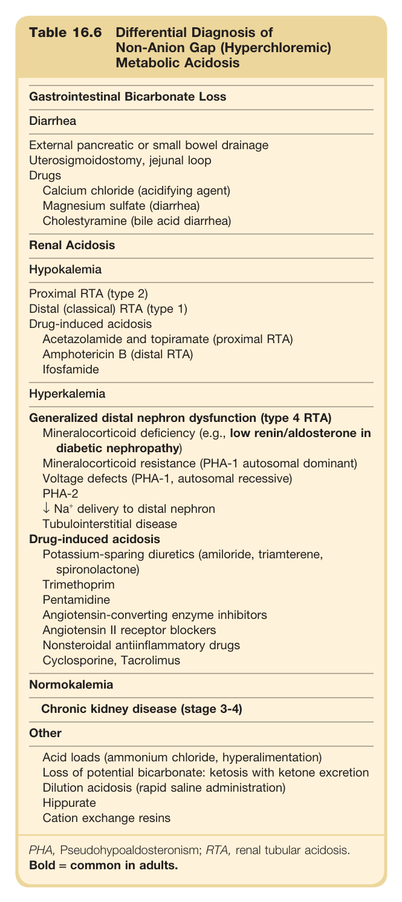

#### Table Data (CSV: [Table_16_6.csv](Table_16_6.csv))

```markdown
| Table Text (OCR) |
| :--- |
| Table 16.6 Differential Diagnosis of Non-Anion Gap (Hyperchloremic) Metabolic Acidosis |
```

Table 16.6 Differential Diagnosis of Non-Anion Gap (Hyperchloremic) Metabolic Acidosis | Category | Subcategory | Causes | | :------------------------------------ | :--------------- | :----------------------------------------------------------- | | **Gastrointestinal Bicarbonate Loss** | | Diarrhea, External pancreatic or small bowel drainage, Uterosigmoidostomy, jejunal loop | | | **Drugs** | Calcium chloride (acidifying agent), Magnesium sulfate (diarrhea), Cholestyramine (bile acid diarrhea) | | **Renal Acidosis** | **Hypokalemia** | Proximal RTA (type 2), Distal (classical) RTA (type 1) | | | | **Drug-induced acidosis**: Acetazolamide and topiramate (proximal RTA), Amphotericin B (distal RTA), Ifosfamide | | | **Hyperkalemia** | **Generalized distal nephron dysfunction (type 4 RTA)**, Mineralocorticoid deficiency (e.g., low renin/aldosterone in diabetic nephropathy), Mineralocorticoid resistance (PHA-1 autosomal dominant), Voltage defects (PHA-1, autosomal recessive), PHA-2, ↓ Nat delivery to distal nephron, Tubulointerstitial disease | | | | **Drug-induced acidosis**: Potassium-sparing diuretics (amiloride, triamterene, spironolactone), Trimethoprim, Pentamidine, Angiotensin-converting enzyme inhibitors, Angiotensin II receptor blockers, Nonsteroidal antiinflammatory drugs, Cyclosporine, Tacrolimus | | | **Normokalemia** | **Chronic kidney disease (stage 3-4)** | | **Other** | | Acid loads (ammonium chloride, hyperalimentation), Loss of potential bicarbonate: ketosis with ketone excretion, Dilution acidosis (rapid saline administration), Hippurate, Cation exchange resins | PHA, Pseudohypoaldosteronism; RTA, renal tubular acidosis. **Bold** = common in adults.

---

### Table_16_7

#### Table Image

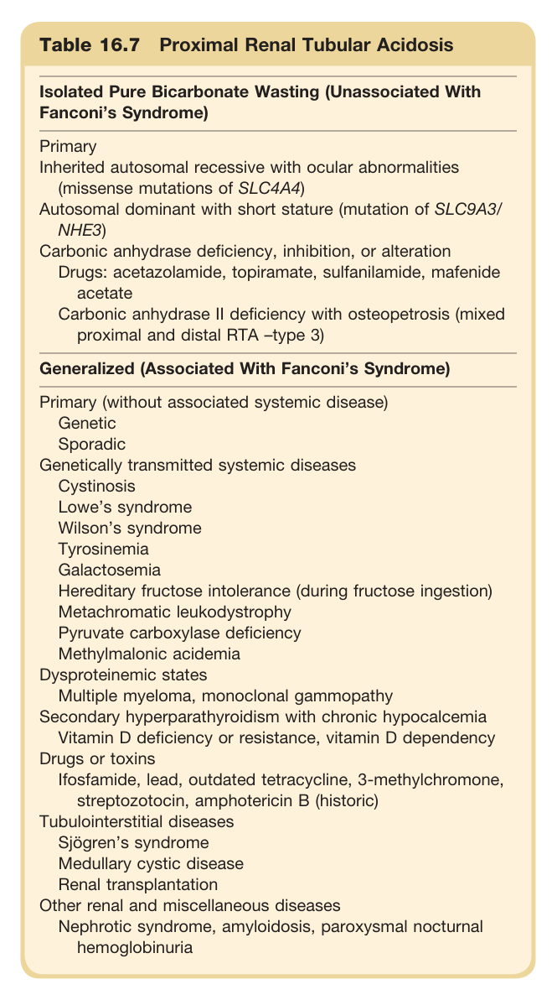

#### Table Data (CSV: [Table_16_7.csv](Table_16_7.csv))

```markdown
| Table Text (OCR) |
| :--- |
| Table 16.7 Proximal Renal Tubular Acidosis Isolated Pure Bicarbonate Wasting (Unassociated With Fanconi’s Syndrome) |
```

Table 16.7 Proximal Renal Tubular Acidosis | Category | Subcategory | | :----------------------------------------------------------- | :----------------------------------------------------------- | | **Isolated Pure Bicarbonate Wasting (Unassociated With Fanconi's Syndrome)** | | | Primary | Inherited autosomal recessive with ocular abnormalities (missense mutations of SLC4A4), Autosomal dominant with short stature (mutation of SLC9A3/ NHE3) | | Carbonic anhydrase deficiency, inhibition, or alteration | Drugs: acetazolamide, topiramate, sulfanilamide, mafenide acetate | | | Carbonic anhydrase II deficiency with osteopetrosis (mixed proximal and distal RTA -type 3) | | **Generalized (Associated With Fanconi's Syndrome)** | | | Primary (without associated systemic disease) | Genetic, Sporadic | | Genetically transmitted systemic diseases | Cystinosis, Lowe's syndrome, Wilson's syndrome, Tyrosinemia, Galactosemia, Hereditary fructose intolerance (during fructose ingestion), Metachromatic leukodystrophy, Pyruvate carboxylase deficiency, Methylmalonic acidemia | | Dysproteinemic states | Multiple myeloma, monoclonal gammopathy | | | Secondary hyperparathyroidism with chronic hypocalcemia, Vitamin D deficiency or resistance, vitamin D dependency | | Drugs or toxins | Ifosfamide, lead, outdated tetracycline, 3-methylchromone, streptozotocin, amphotericin B (historic) | | Tubulointerstitial diseases | Sjögren's syndrome, Medullary cystic disease, Renal transplantation | | Other renal and miscellaneous diseases | Nephrotic syndrome, amyloidosis, paroxysmal nocturnal hemoglobinuria | | <!-- audiobook-skip-end --> | |

---

### Table_16_8

#### Table Image

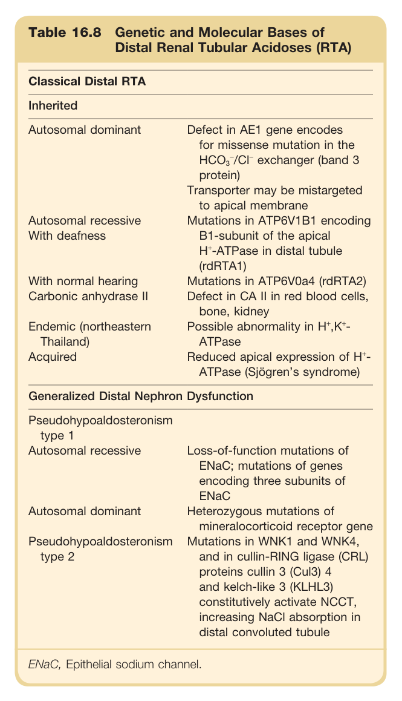

#### Table Data (CSV: [Table_16_8.csv](Table_16_8.csv))

```markdown
| Table Text (OCR) |
| :--- |
| Table 16.8 Genetic and Molecular Bases of Distal Renal Tubular Acidoses (RTA) |
```

Table 16.8 Genetic and Molecular Bases of Distal Renal Tubular Acidoses (RTA) | Category | Type | Details | | :----------------------------------------- | :------------------------------ | :----------------------------------------------------------- | | **Classical Distal RTA** | | | | Inherited | Autosomal dominant | Defect in AE1 gene encodes for missense mutation in the HCO3/Cl exchanger (band 3 protein), Transporter may be mistargeted to apical membrane | | | Autosomal recessive | Mutations in ATP6V1B1 encoding B1-subunit of the apical H+-ATPase in distal tubule (rdRTA1) | | | With deafness | | | | With normal hearing | Mutations in ATP6V0a4 (rdRTA2) | | | Carbonic anhydrase II | Defect in CA II in red blood cells, bone, kidney | | | Endemic (northeastern Thailand) | Possible abnormality in H+,K+-ATPase | | Acquired | | Reduced apical expression of H+-ATPase (Sjögren's syndrome) | | **Generalized Distal Nephron Dysfunction** | | | | Pseudohypoaldosteronism type 1 | Autosomal recessive | Loss-of-function mutations of ENaC; mutations of genes encoding three subunits of ENaC | | | Autosomal dominant | Heterozygous mutations of mineralocorticoid receptor gene | | Pseudohypoaldosteronism type 2 | | Mutations in WNK1 and WNK4, and in cullin-RING ligase (CRL) proteins cullin 3 (Cul3) and kelch-like 3 (KLHL3), constitutively activate NCCT, increasing NaCl absorption in distal convoluted tubule | ENaC, Epithelial sodium channel.

---

### Table_16_9

#### Table Image

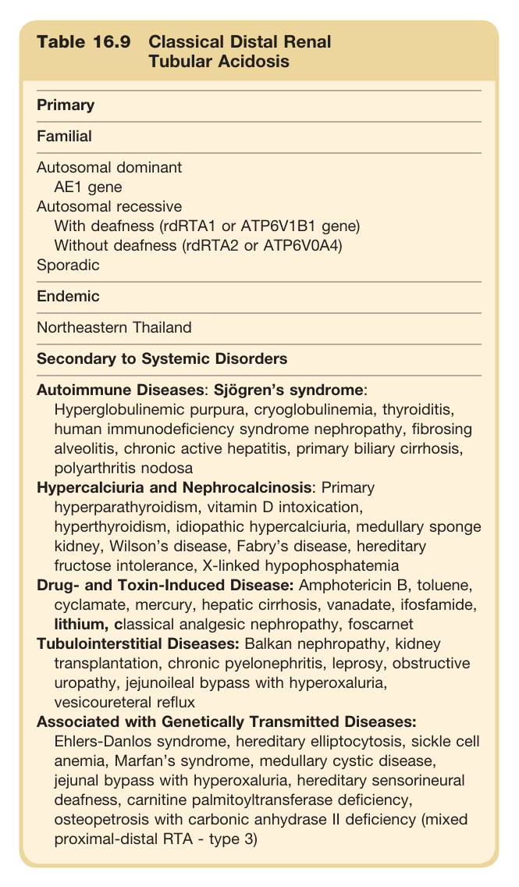

#### Table Data (CSV: [Table_16_9.csv](Table_16_9.csv))

```markdown
| Table Text (OCR) |
| :--- |
| Table 16.9 Classical Distal Renal Tubular Acidosis Primary Familial Autosomal dominant AE1 gene  Sporadic Endemic |
```

Table 16.9 Classical Distal Renal Tubular Acidosis | Category | Details | | :------------------------------------------------ | :----------------------------------------------------------- | | **Primary** | | | Familial | Autosomal dominant, AE1 gene; Autosomal recessive, With deafness (rdRTA1 or ATP6V1B1 gene), Without deafness (rdRTA2 or ATP6V0A4) | | Sporadic | | | Endemic | Northeastern Thailand | | **Secondary to Systemic Disorders** | | | Autoimmune Diseases: Sjögren's syndrome: | Hyperglobulinemic purpura, cryoglobulinemia, thyroiditis, human immunodeficiency syndrome nephropathy, fibrosing alveolitis, chronic active hepatitis, primary biliary cirrhosis, polyarthritis nodosa | | Hypercalciuria and Nephrocalcinosis: | Primary hyperparathyroidism, vitamin D intoxication, hyperthyroidism, idiopathic hypercalciuria, medullary sponge kidney, Wilson's disease, Fabry's disease, hereditary fructose intolerance, X-linked hypophosphatemia | | Drug- and Toxin-Induced Disease: | Amphotericin B, toluene, cyclamate, mercury, hepatic cirrhosis, vanadate, ifosfamide, lithium, classical analgesic nephropathy, foscarnet | | Tubulointerstitial Diseases: | Balkan nephropathy, kidney transplantation, chronic pyelonephritis, leprosy, obstructive uropathy, jejunoileal bypass with hyperoxaluria, vesicoureteral reflux | | Associated with Genetically Transmitted Diseases: | Ehlers-Danlos syndrome, hereditary elliptocytosis, sickle cell anemia, Marfan's syndrome, medullary cystic disease, jejunal bypass with hyperoxaluria, hereditary sensorineural deafness, carnitine palmitoyltransferase deficiency, osteopetrosis with carbonic anhydrase II deficiency (mixed proximal-distal RTA - type 3) | | <!-- audiobook-skip-end --> | |

---

### Table_16_10

#### Table Image

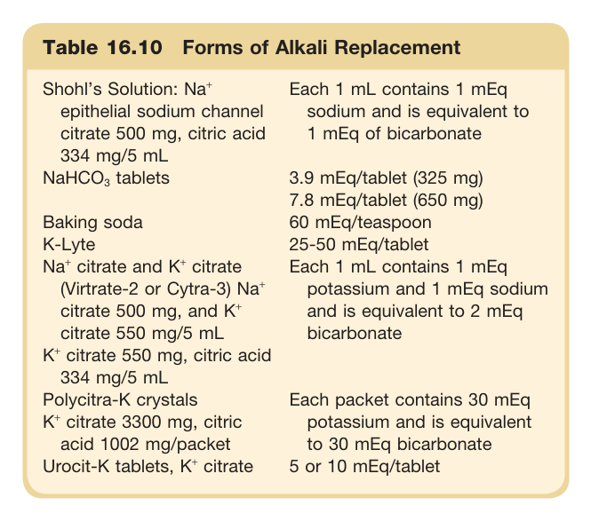

#### Table Data (CSV: [Table_16_10.csv](Table_16_10.csv))

```markdown
| Table Text (OCR) |
| :--- |
| Table 16.10 Forms of Alkali Replacement |
```

Table 16.10 Forms of Alkali Replacement | Product | Composition | Bicarbonate Equivalent | | :----------------------------------------------------------- | :--------------------------------------------- | :----------------------------------------------------------- | | Shohl's Solution: Na+ epithelial sodium channel citrate 500 mg, citric acid 334 mg/5 mL | | Each 1 mL contains 1 mEq sodium and is equivalent to 1 mEq of bicarbonate | | NaHCO3 tablets | | 3.9 mEq/tablet (325 mg), 7.8 mEq/tablet (650 mg) | | Baking soda | | 60 mEq/teaspoon | | K-Lyte | | 25-50 mEq/tablet | | Na+ citrate and K+ citrate (Virtrate-2 or Cytra-3) | Na+ citrate 500 mg, and K+ citrate 550 mg/5 mL | Each 1 mL contains 1 mEq potassium and 1 mEq sodium and is equivalent to 2 mEq bicarbonate | | K+ citrate | 550 mg, citric acid 334 mg/5 mL | | | Polycitra-K crystals | K+ citrate 3300 mg, citric acid 1002 mg/packet | Each packet contains 30 mEq potassium and is equivalent to 30 mEq bicarbonate | | Urocit-K tablets, K+ citrate | | 5 or 10 mEq/tablet | | <!-- audiobook-skip-end --> | | |

---

### Table_16_11

#### Table Image

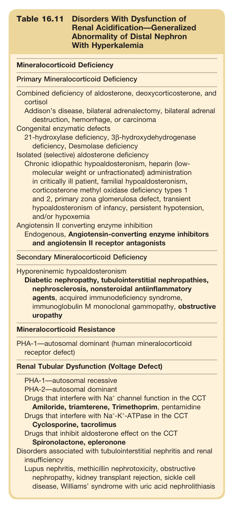

#### Table Data (CSV: [Table_16_11.csv](Table_16_11.csv))

```markdown
| Table Text (OCR) |
| :--- |
| Table 16.11 Disorders With Dysfunction of Renal Acidification—Generalized Abnormality of Distal Nephron With Hyperkalemia Mineralocorticoid Deficiency Primary Mineralocorticoid Deficiency |
```

Table 16.11 Disorders With Dysfunction of Renal Acidification-Generalized Abnormality of Distal Nephron With Hyperkalemia | Category | Subcategory | Details | | :--------------------------------------------- | :----------------------------------------- | :----------------------------------------------------------- | | **Mineralocorticoid Deficiency** | **Primary Mineralocorticoid Deficiency** | Combined deficiency of aldosterone, deoxycorticosterone, and cortisol (Addison's disease, etc.); Congenital enzymatic defects; Isolated (selective) aldosterone deficiency; Angiotensin II converting enzyme inhibition | | | **Secondary Mineralocorticoid Deficiency** | Hyporeninemic hypoaldosteronism (Diabetic nephropathy, tubulointerstitial nephropathies, etc.) | | **Mineralocorticoid Resistance** | | PHA-1-autosomal dominant (human mineralocorticoid receptor defect) | | **Renal Tubular Dysfunction (Voltage Defect)** | | PHA-1-autosomal recessive; PHA-2-autosomal dominant; Drugs that interfere with Na+ channel function in the CCT (Amiloride, etc.); Drugs that interfere with Na+-K+-ATPase in the CCT (Cyclosporine, tacrolimus); Drugs that inhibit aldosterone effect on the CCT (Spironolactone, epleronone); Disorders associated with tubulointerstitial nephritis and renal insufficiency (Lupus nephritis, etc.) | | <!-- audiobook-skip-end --> | | |

---

### Table_16_12

#### Table Image

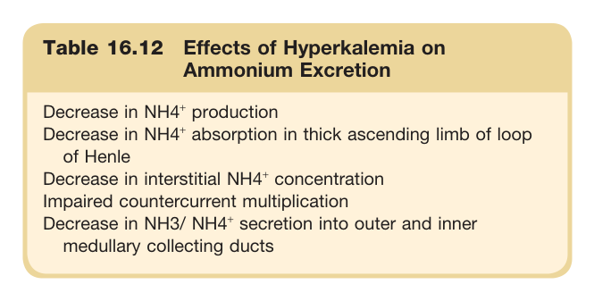

#### Table Data (CSV: [Table_16_12.csv](Table_16_12.csv))

```markdown
| Table Text (OCR) |
| :--- |
| Table 16.12 Effects of Hyperkalemia on Ammonium Excretion |
```

Table 16.12 Effects of Hyperkalemia on Ammonium Excretion * Decrease in NH4+ production * Decrease in NH4+ absorption in thick ascending limb of loop of Henle * Decrease in interstitial NH4+ concentration * Impaired countercurrent multiplication * Decrease in NH3/NH4+ secretion into outer and inner medullary collecting ducts

---

### Table_16_13

#### Table Image

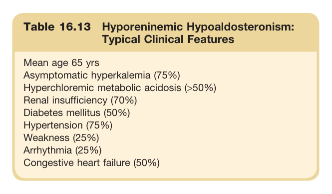

#### Table Data (CSV: [Table_16_13.csv](Table_16_13.csv))

```markdown
| Table Text (OCR) |
| :--- |
| Table 16.13 Hyporeninemic Hypoaldosteronism: Typical Clinical Features |
```

Table 16.13 Hyporeninemic Hypoaldosteronism: Typical Clinical Features * Mean age 65 yrs * Asymptomatic hyperkalemia (75%) * Hyperchloremic metabolic acidosis (>50%) * Renal insufficiency (70%) * Diabetes mellitus (50%) * Hypertension (75%) * Weakness (25%) * Arrhythmia (25%) * Congestive heart failure (50%)

---

### Table_16_14

#### Table Image

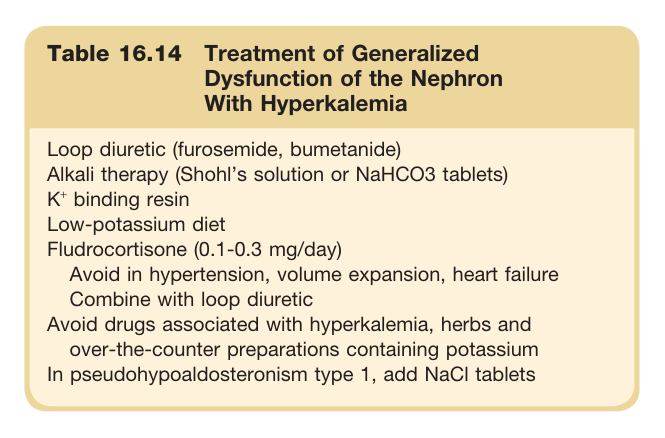

#### Table Data (CSV: [Table_16_14.csv](Table_16_14.csv))

```markdown
| Table Text (OCR) |
| :--- |
| Table 16.14 Treatment of Generalized Dysfunction of the Nephron With Hyperkalemia |
```

Table 16.14 Treatment of Generalized Dysfunction of the Nephron With Hyperkalemia * Loop diuretic (furosemide, bumetanide) * Alkali therapy (Shohl's solution or NaHCO3 tablets) * K+ binding resin * Low-potassium diet * Fludrocortisone (0.1-0.3 mg/day) * Avoid in hypertension, volume expansion, heart failure * Combine with loop diuretic * Avoid drugs associated with hyperkalemia, herbs and over-the-counter preparations containing potassium * In pseudohypoaldosteronism type 1, add NaCl tablets

---

### Table_16_15

#### Table Image

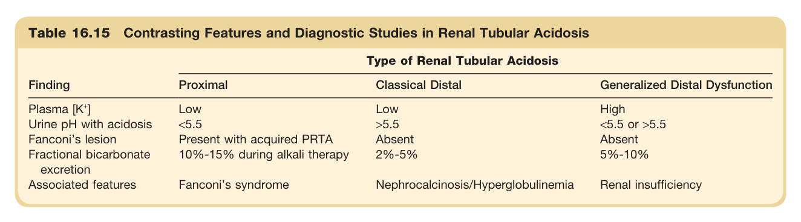

#### Table Data (CSV: [Table_16_15.csv](Table_16_15.csv))

```markdown
| Table Text (OCR) |
| :--- |
| Table 16.15 Contrasting Features and Diagnostic Studies in Renal Tubular Acidosis |
```

Table 16.15 Contrasting Features and Diagnostic Studies in Renal Tubular Acidosis | Finding | Type of Renal Tubular Acidosis | | | | :------------------------------- | :----------------------------- | :--------------------------------- | :--------------------------------- | | | **Proximal** | **Classical Distal** | **Generalized Distal Dysfunction** | | Plasma [K+] | Low | Low | High | | Urine pH with acidosis | <5.5 | >5.5 | <5.5 or >5.5 | | Fanconi's lesion | Present with acquired PRTA | Absent | Absent | | Fractional bicarbonate excretion | 10%-15% during alkali therapy | 2%-5% | 5%-10% | | Associated features | Fanconi's syndrome | Nephrocalcinosis/Hyperglobulinemia | Renal insufficiency | | <!-- audiobook-skip-end --> | | | |

---

### Table_16_16

#### Table Image

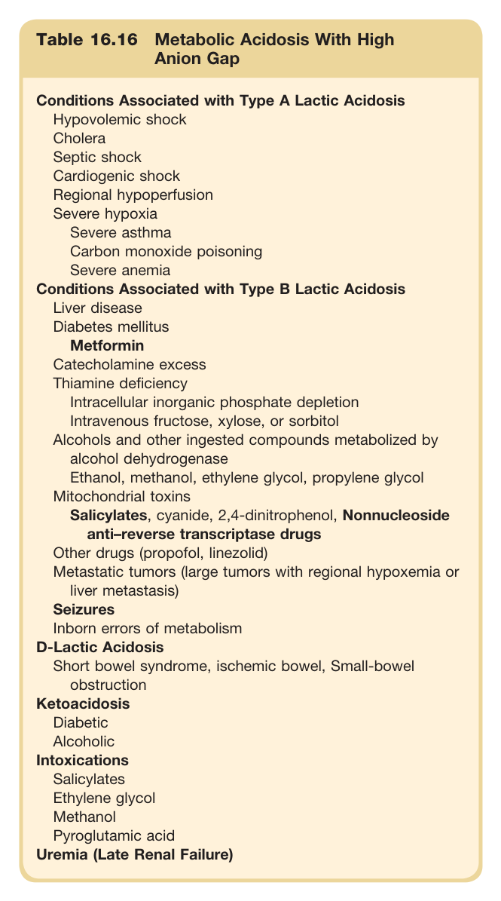

#### Table Data (CSV: [Table_16_16.csv](Table_16_16.csv))

```markdown
| Table Text (OCR) |
| :--- |
| Table 16.16 Metabolic Acidosis With High Anion Gap Conditions Associated with Type A Lactic Acidosis |
```

Table 16.16 Metabolic Acidosis With High Anion Gap | Category | Conditions | | :---------------------------------------------------- | :----------------------------------------------------------- | | **Conditions Associated with Type A Lactic Acidosis** | Hypovolemic shock, Cholera, Septic shock, Cardiogenic shock, Regional hypoperfusion, Severe hypoxia, Severe asthma, Carbon monoxide poisoning, Severe anemia | | **Conditions Associated with Type B Lactic Acidosis** | Liver disease, Diabetes mellitus, Metformin, Catecholamine excess, Thiamine deficiency, Intracellular inorganic phosphate depletion, Intravenous fructose, xylose, or sorbitol, Alcohols and other ingested compounds metabolized by alcohol dehydrogenase (Ethanol, methanol, ethylene glycol, propylene glycol), Mitochondrial toxins (Salicylates, cyanide, 2,4-dinitrophenol, Nonnucleoside anti-reverse transcriptase drugs), Other drugs (propofol, linezolid), Metastatic tumors (large tumors with regional hypoxemia or liver metastasis), Seizures, Inborn errors of metabolism | | **D-Lactic Acidosis** | Short bowel syndrome, ischemic bowel, Small-bowel obstruction | | **Ketoacidosis** | Diabetic, Alcoholic | | **Intoxications** | Salicylates, Ethylene glycol, Methanol, Pyroglutamic acid | | **Uremia (Late Renal Failure)** | | | <!-- audiobook-skip-end --> | |

---

### Table_16_17

#### Table Image

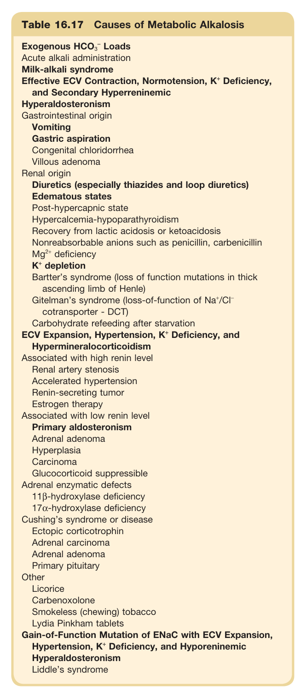

#### Table Data (CSV: [Table_16_17.csv](Table_16_17.csv))

```markdown
| Table Text (OCR) |
| :--- |
| Table 16.17 Causes of Metabolic Alkalosis |
```

Table 16.17 Causes of Metabolic Alkalosis | Category | Subcategory | Details | | :----------------------------------------------------------- | :------------------------------- | :----------------------------------------------------------- | | **Exogenous HCO3 Loads** | | Acute alkali administration, Milk-alkali syndrome | | **Effective ECV Contraction, Normotension, K+ Deficiency, and Secondary Hyperreninemic Hyperaldosteronism** | Gastrointestinal origin | Vomiting, Gastric aspiration, Congenital chloridorrhea, Villous adenoma | | | Renal origin | Diuretics (especially thiazides and loop diuretics), Edematous states, Post-hypercapnic state, Hypercalcemia-hypoparathyroidism, Recovery from lactic acidosis or ketoacidosis, Nonreabsorbable anions such as penicillin, carbenicillin, Mg2+ deficiency, K+ depletion, Bartter's syndrome (loss of function mutations in thick ascending limb of Henle), Gitelman's syndrome (loss-of-function of Na+/Cl- cotransporter - DCT), Carbohydrate refeeding after starvation | | **ECV Expansion, Hypertension, K+ Deficiency, and Hypermineralocorticoidism** | Associated with high renin level | Renal artery stenosis, Accelerated hypertension, Renin-secreting tumor, Estrogen therapy | | | Associated with low renin level | Primary aldosteronism (Adrenal adenoma, Hyperplasia, Carcinoma, Glucocorticoid suppressible), Adrenal enzymatic defects (11ẞ-hydroxylase deficiency, 17a-hydroxylase deficiency), Cushing's syndrome or disease (Ectopic corticotrophin, Adrenal carcinoma, Adrenal adenoma, Primary pituitary), Other (Licorice, Carbenoxolone, Smokeless (chewing) tobacco, Lydia Pinkham tablets) | | **Gain-of-Function Mutation of ENaC with ECV Expansion, Hypertension, K+ Deficiency, and Hyporeninemic Hyperaldosteronism** | | Liddle's syndrome | | <!-- audiobook-skip-end --> | | |

---

### Table_16_18

#### Table Image

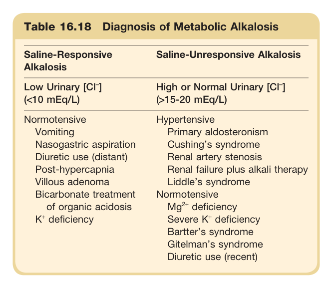

#### Table Data (CSV: [Table_16_18.csv](Table_16_18.csv))

```markdown
| Table Text (OCR) |
| :--- |
| Table 16.18 Diagnosis of Metabolic Alkalosis |
```

Table 16.18 Diagnosis of Metabolic Alkalosis | Saline-Responsive Alkalosis | Saline-Unresponsive Alkalosis | | :---------------------------------------- | :--------------------------------------------- | | **Low Urinary [CI] (<10 mEq/L)** | **High or Normal Urinary [CI] (>15-20 mEq/L)** | | **Normotensive** | **Hypertensive** | | Vomiting | Primary aldosteronism | | Nasogastric aspiration | Cushing's syndrome | | Diuretic use (distant) | Renal artery stenosis | | Post-hypercapnia | Renal failure plus alkali therapy | | Villous adenoma | Liddle's syndrome | | Bicarbonate treatment of organic acidosis | **Normotensive** | | K+ deficiency | Mg2+ deficiency | | | Severe K+ deficiency | | | Bartter's syndrome | | | Gitelman's syndrome | | | Diuretic use (recent) | | <!-- audiobook-skip-end --> | |

---
