# 17. Disorders of Potassium Balance - Figures and Tables Index

This document lists all figures, tables and boxes extracted from `17. Disorders of Potassium Balance.pdf`.

## Table of Contents
- [Figures](#figures)
- [Tables](#tables)
- [Boxes](#boxes)

---

## Figures

### Fig_17_1

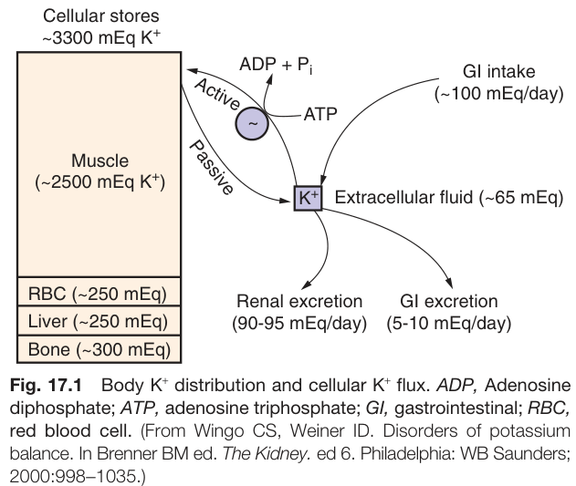

Fig. 17.1 Body K+ distribution and cellular K+ flux. ADP, Adenosine diphosphate; ATP, adenosine triphosphate; Gl, gastrointestinal; RBC, red blood cell. (From Wingo CS, Weiner ID. Disorders of potassium balance. In Brenner BM ed. The Kidney. ed 6. Philadelphia: WB Saunders; 2000:998-1035.)

---

### Fig_17_2

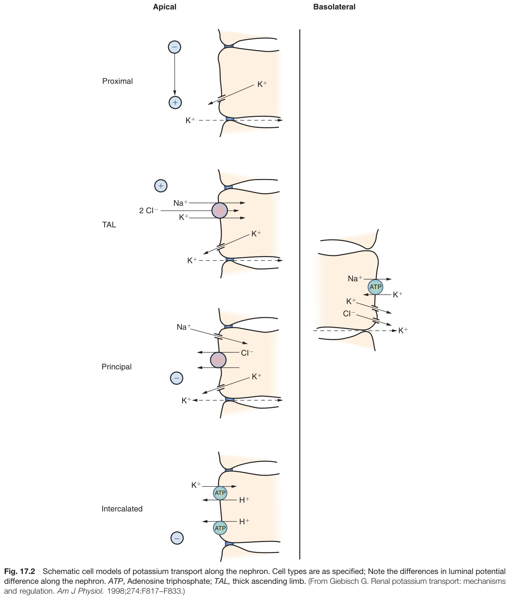

Fig. 17.2 Schematic cell models of potassium transport along the nephron. Cell types are as specified; Note the differences in luminal potential difference along the nephron. ATP, Adenosine triphosphate; TAL, thick ascending limb. (From Giebisch G. Renal potassium transport: mechanisms and regulation. Am J Physiol. 1998;274:F817-F833.)

---

### Fig_17_3

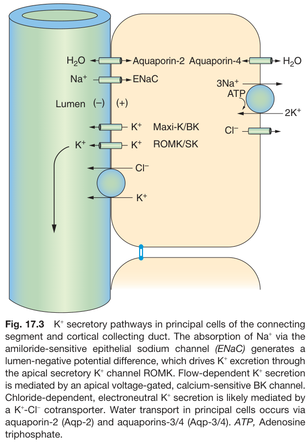

Fig. 17.3 K+ secretory pathways in principal cells of the connecting segment and cortical collecting duct. The absorption of Na+ via the amiloride-sensitive epithelial sodium channel (ENaC) generates a lumen-negative potential difference, which drives K+ excretion through the apical secretory K+ channel ROMK. Flow-dependent K+ secretion is mediated by an apical voltage-gated, calcium-sensitive BK channel. Chloride-dependent, electroneutral K+ secretion is likely mediated by a K+-Cl cotransporter. Water transport in principal cells occurs via aquaporin-2 (Aqp-2) and aquaporins-3/4 (Aqp-3/4). ATP, Adenosine triphosphate.

---

### Fig_17_4

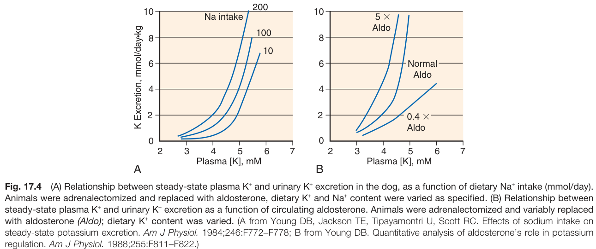

Fig. 17.4 (A) Relationship between steady-state plasma K+ and urinary K+ excretion in the dog, as a function of dietary Na+ intake (mmol/day). (B) Relationship between steady-state plasma K+ and urinary K+ excretion as a function of circulating aldosterone. Animals were adrenalectomized and replaced with aldosterone, dietary K+ and Na+ content were varied as specified. (B) Relationship between steady-state plasma K+ and urinary K+ excretion as a function of circulating aldosterone. Animals were adrenalectomized and variably replaced with aldosterone (Aldo); dietary K+ content was varied. (A from Young DB, Jackson TE, Tipayamontri U, Scott RC. Effects of sodium intake on steady-state potassium excretion. Am J Physiol. 1984;246:F772-F778; B from Young DB. Quantitative analysis of aldosterone's role in potassium regulation. Am J Physiol. 1988;255:F811-F822.)

---

### Fig_17_5

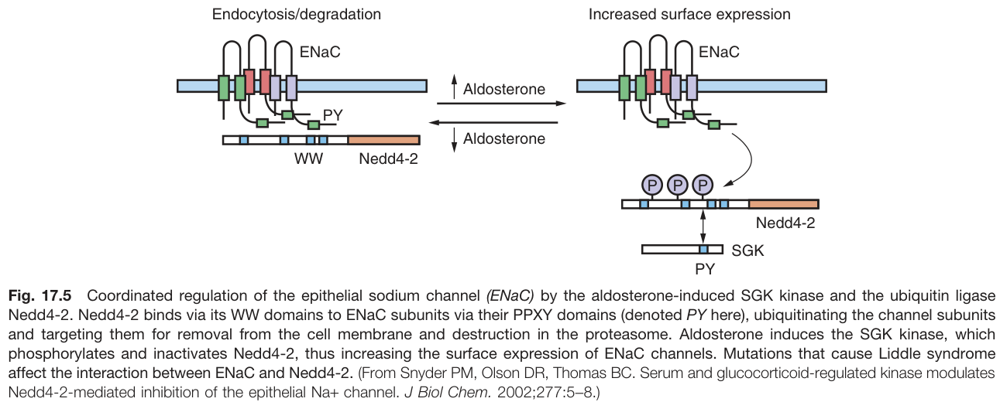

Fig. 17.5 Coordinated regulation of the epithelial sodium channel (ENaC) by the aldosterone-induced SGK kinase and the ubiquitin ligase Nedd4-2. Nedd4-2 binds via its WW domains to ENaC subunits via their PPXY domains (denoted PY here), ubiquitinating the channel subunits and targeting them for removal from the cell membrane and destruction in the proteasome. Aldosterone induces the SGK kinase, which phosphorylates and inactivates Nedd4-2, thus increasing the surface expression of ENaC channels. Mutations that cause Liddle syndrome affect the interaction between ENaC and Nedd4-2. (From Snyder PM, Olson DR, Thomas BC. Serum and glucocorticoid-regulated kinase modulates Nedd4-2-mediated inhibition of the epithelial Na+ channel. J Biol Chem. 2002;277:5-8.)

---

### Fig_17_6

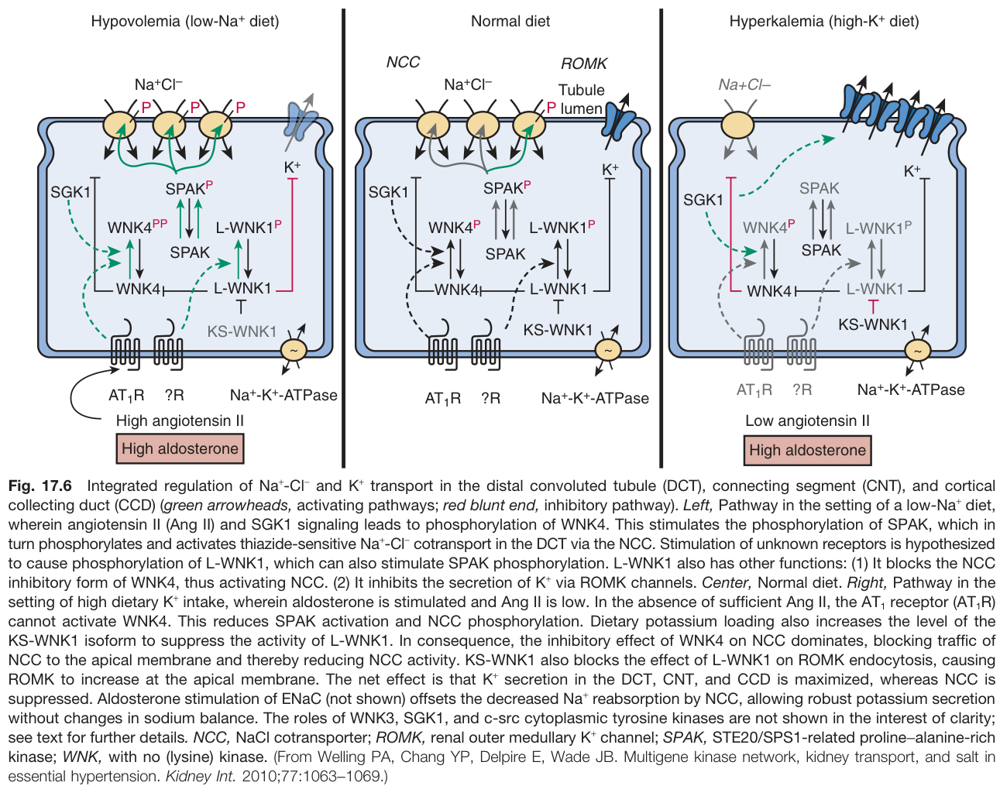

Fig. 17.6 Integrated regulation of Na+-Cl and K+ transport in the distal convoluted tubule (DCT), connecting segment (CNT), and cortical collecting duct (CCD). (green arrowheads, activating pathways; red blunt end, inhibitory pathway). Left, Pathway in the setting of a low-Na+ diet, wherein angiotensin II (Ang II) and SGK1 signaling leads to phosphorylation of WNK4. This stimulates the phosphorylation of SPAK, which in turn phosphorylates and activates thiazide-sensitive Na+-Cl cotransport in the DCT via the NCC. Stimulation of unknown receptors is hypothesized to cause phosphorylation of L-WNK1, which can also stimulate SPAK phosphorylation. L-WNK1 also has other functions: (1) It blocks the NCC inhibitory form of WNK4, thus activating NCC. (2) It inhibits the secretion of K+ via ROMK channels. Center, Normal diet. Right, Pathway in the setting of high dietary K+ intake, wherein aldosterone is stimulated and Ang II is low. In the absence of sufficient Ang II, the AT₁ receptor (AT₁R) cannot activate WNK4. This reduces SPAK activation and NCC phosphorylation. Dietary potassium loading also increases the level of the KS-WNK1 isoform to suppress the activity of L-WNK1. In consequence, the inhibitory effect of WNK4 on NCC dominates, blocking traffic of NCC to the apical membrane and thereby reducing NCC activity. KS-WNK1 also blocks the effect of L-WNK1 on ROMK endocytosis, causing ROMK to increase at the apical membrane. The net effect is that K+ secretion in the DCT, CNT, and CCD is maximized, whereas NCC is suppressed. Aldosterone stimulation of ENaC (not shown) offsets the decreased Na+ reabsorption by NCC, allowing robust potassium secretion without changes in sodium balance. The roles of WNK3, SGK1, and c-src cytoplasmic tyrosine kinases are not shown in the interest of clarity; see text for further details. NCC, NaCl cotransporter; ROMK, renal outer medullary K+ channel; SPAK, STE20/SPS1-related proline-alanine-rich kinase; WNK, with no (lysine) kinase. (From Welling PA, Chang YP, Delpire E, Wade JB. Multigene kinase network, kidney transport, and salt in essential hypertension. Kidney Int. 2010;77:1063-1069.)

---

### Fig_17_7

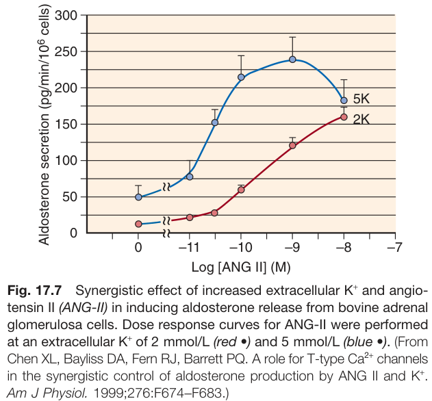

Fig. 17.7 Synergistic effect of increased extracellular K+ and angiotensin II (ANG-II) in inducing aldosterone release from bovine adrenal glomerulosa cells. Dose response curves for ANG-II were performed at an extracellular K+ of 2 mmol/L (red) and 5 mmol/L (blue). (From Chen XL, Bayliss DA, Fern RJ, Barrett PQ. A role for T-type Ca2+ channels in the synergistic control of aldosterone production by ANG II and K+. Am J Physiol. 1999;276:F674-F683.)

---

### Fig_17_8

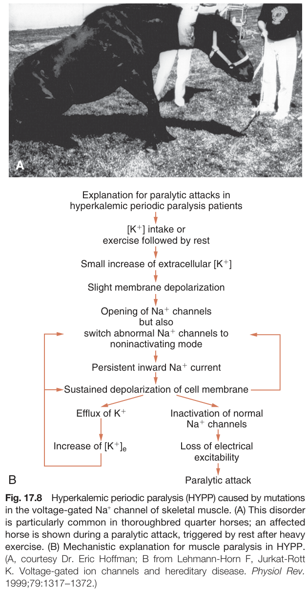

Fig. 17.8 Hyperkalemic periodic paralysis (HYPP) caused by mutations in the voltage-gated Na+ channel of skeletal muscle. (A) This disorder is particularly common in thoroughbred quarter horses; an affected horse is shown during a paralytic attack, triggered by rest after heavy exercise. (B) Mechanistic explanation for muscle paralysis in HYPP. (A, courtesy Dr. Eric Hoffman; B from Lehmann-Horn F, Jurkat-Rott K. Voltage-gated ion channels and hereditary disease. Physiol Rev. 1999;79:1317-1372.)

---

### Fig_17_9

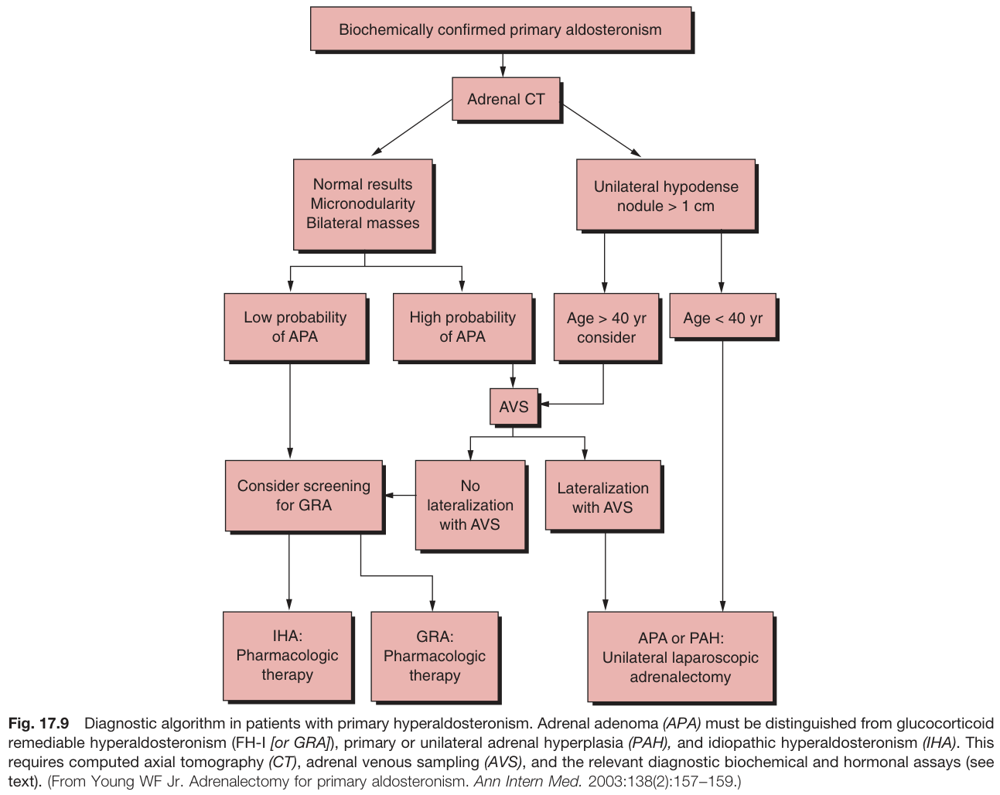

Fig. 17.9 Diagnostic algorithm in patients with primary hyperaldosteronism. Adrenal adenoma (APA) must be distinguished from glucocorticoid remediable hyperaldosteronism (FH-I [or GRA]), primary or unilateral adrenal hyperplasia (PAH), and idiopathic hyperaldosteronism (IHA). This requires computed axial tomography (CT), adrenal venous sampling (AVS), and the relevant diagnostic biochemical and hormonal assays (see text). (From Young WF Jr. Adrenalectomy for primary aldosteronism. Ann Intern Med. 2003:138(2):157-159.)

---

### Fig_17_10

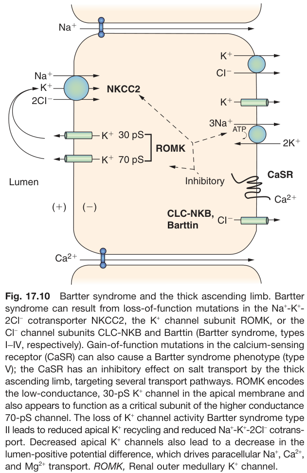

Fig. 17.10 Bartter syndrome and the thick ascending limb. Bartter syndrome can result from loss-of-function mutations in the Na+-K+-2CI cotransporter NKCC2, the K+ channel subunit ROMK, or the Cl channel subunits CLC-NKB and Barttin (Bartter syndrome, types I-IV, respectively). Gain-of-function mutations in the calcium-sensing receptor (CaSR) can also cause a Bartter syndrome phenotype (type V); the CaSR has an inhibitory effect on salt transport by the thick ascending limb, targeting several transport pathways. ROMK encodes the low-conductance, 30-pS K+ channel in the apical membrane and also appears to function as a critical subunit of the higher conductance 70-pS channel. The loss of K+ channel activity Bartter syndrome type II leads to reduced apical K+ recycling and reduced Na+-K+-2Cl cotransport. Decreased apical K+ channels also lead to a decrease in the lumen-positive potential difference, which drives paracellular Na+, Ca2+, and Mg2+ transport. ROMK, Renal outer medullary K+ channel.

---

### Fig_17_11

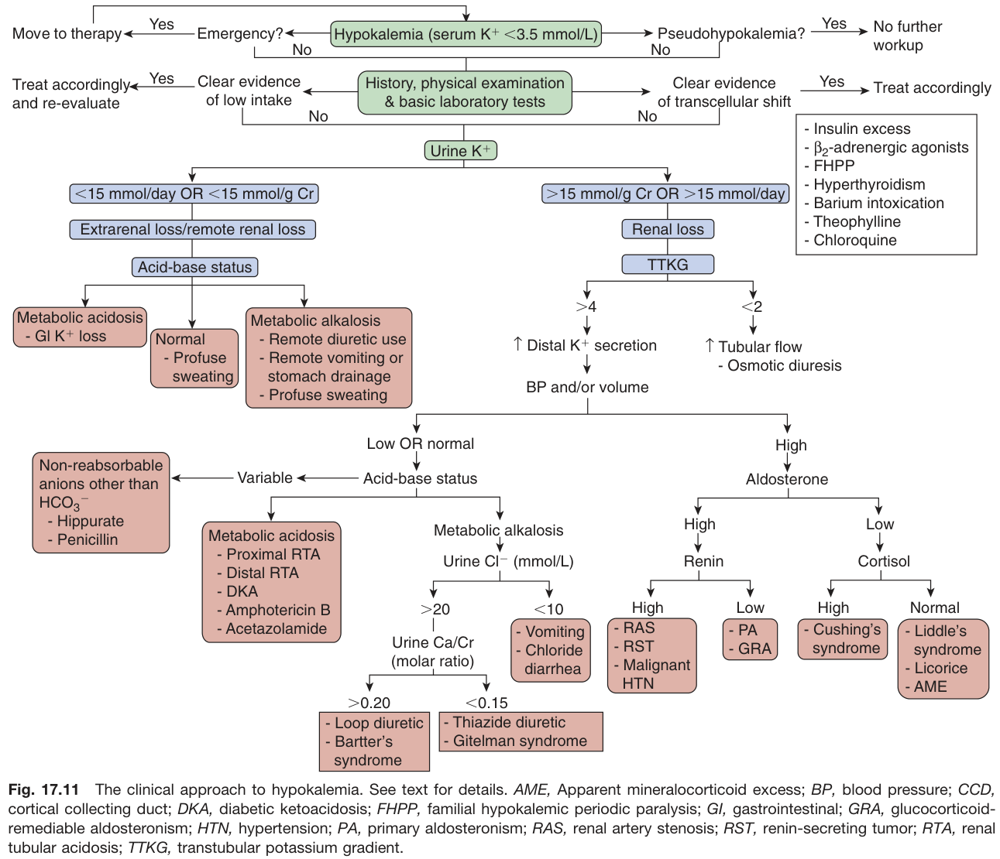

Fig. 17.11 The clinical approach to hypokalemia. See text for details. AME, Apparent mineralocorticoid excess; BP, blood pressure; CCD, cortical collecting duct; DKA, diabetic ketoacidosis; FHPP, familial hypokalemic periodic paralysis; Gl, gastrointestinal; GRA, glucocorticoid-remediable aldosteronism; HTN, hypertension; PA, primary aldosteronism; RAS, renal artery stenosis; RST, renin-secreting tumor; RTA, renal tubular acidosis; TTKG, transtubular potassium gradient.

---

### Fig_17_12

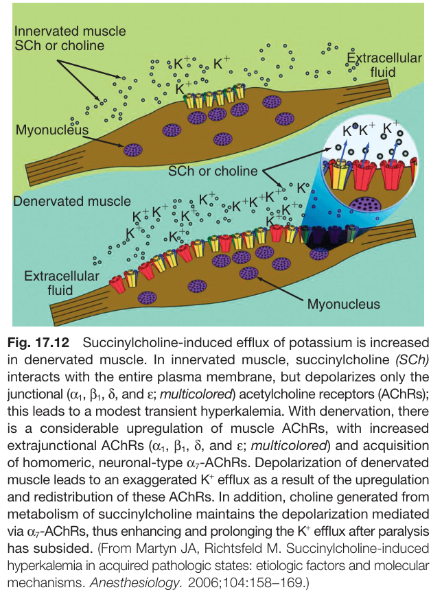

Fig. 17.12 Succinylcholine-induced efflux of potassium is increased in denervated muscle. In innervated muscle, succinylcholine (SCh) interacts with the entire plasma membrane, but depolarizes only the junctional (₁, β₁, δ, and ε; multicolored) acetylcholine receptors (AChRs); this leads to a modest transient hyperkalemia. With denervation, there is a considerable upregulation of muscle AChRs, with increased extrajunctional AChRs (α₁, β₁, δ, and ε; multicolored) and acquisition of homomeric, neuronal-type α7-AChRs. Depolarization of denervated muscle leads to an exaggerated K+ efflux as a result of the upregulation and redistribution of these AChRs. In addition, choline generated from metabolism of succinylcholine maintains the depolarization mediated via 07-AChRs, thus enhancing and prolonging the K+ efflux after paralysis has subsided. (From Martyn JA, Richtsfeld M. Succinylcholine-induced hyperkalemia in acquired pathologic states: etiologic factors and molecular mechanisms. Anesthesiology. 2006;104:158-169.)

---

### Fig_17_13

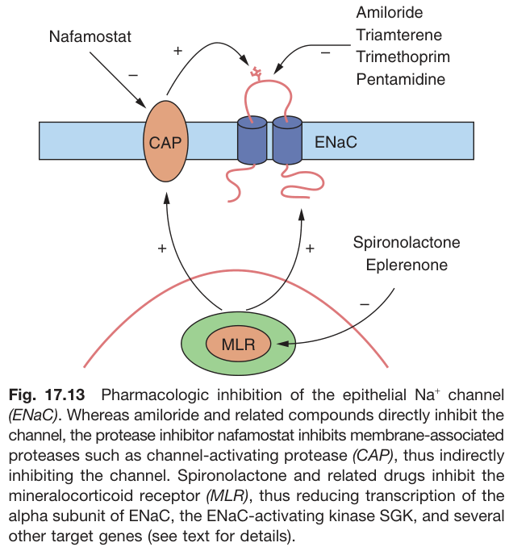

Fig. 17.13 Pharmacologic inhibition of the epithelial Na+ channel (ENaC). Whereas amiloride and related compounds directly inhibit the channel, the protease inhibitor nafamostat inhibits membrane-associated proteases such as channel-activating protease (CAP), thus indirectly inhibiting the channel. Spironolactone and related drugs inhibit the mineralocorticoid receptor (MLR), thus reducing transcription of the alpha subunit of ENaC, the ENaC-activating kinase SGK, and several other target genes (see text for details).

---

### Fig_17_14

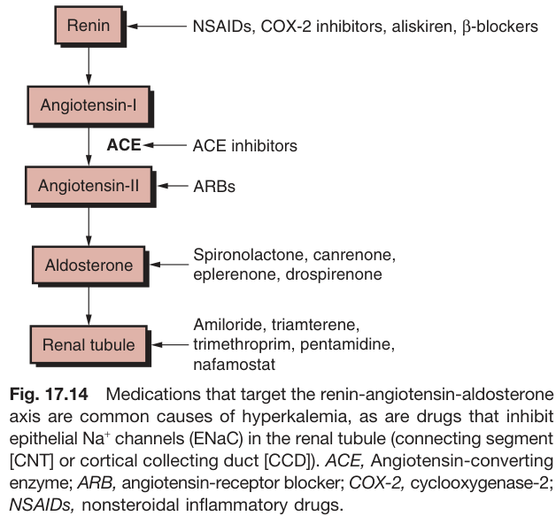

Fig. 17.14 Medications that target the renin-angiotensin-aldosterone axis are common causes of hyperkalemia, as are drugs that inhibit epithelial Na+ channels (ENaC) in the renal tubule. (connecting segment [CNT] or cortical collecting duct [CCD]). ACE, Angiotensin-converting enzyme; ARB, angiotensin-receptor blocker; COX-2, cyclooxygenase-2; NSAIDs, nonsteroidal inflammatory drugs.

---

### Fig_17_15

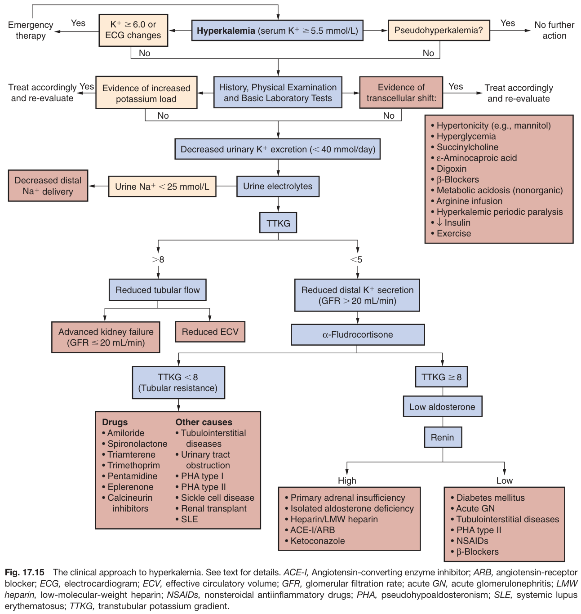

Fig. 17.15 The clinical approach to hyperkalemia. See text for details. ACE-I, Angiotensin-converting enzyme inhibitor; ARB, angiotensin-receptor blocker; ECG, electrocardiogram; ECV, effective circulatory volume; GFR, glomerular filtration rate; acute GN, acute glomerulonephritis; LMW heparin, low-molecular-weight heparin; NSAIDs, nonsteroidal antiinflammatory drugs; PHA, pseudohypoaldosteronism; SLE, systemic lupus erythematosus; TTKG, transtubular potassium gradient.

---

### Fig_17_16

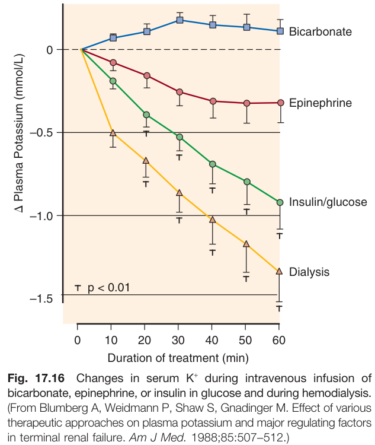

Fig. 17.16 Changes in serum K+ during intravenous infusion of bicarbonate, epinephrine, or insulin in glucose and during hemodialysis. (From Blumberg A, Weidmann P, Shaw S, Gnadinger M. Effect of various therapeutic approaches on plasma potassium and major regulating factors in terminal renal failure. Am J Med. 1988;85:507-512.)

---

## Tables

### Table_17_1

#### Table Image

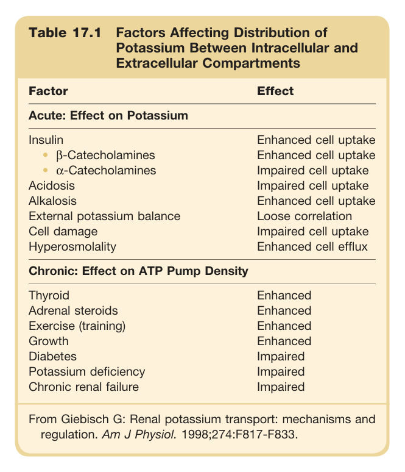

#### Table Data (CSV: [Table_17_1.csv](Table_17_1.csv))

```markdown
| Table Text (OCR) |
| :--- |
| Table 17.1 Factors Affecting Distribution of Potassium Between Intracellular and Extracellular Compartments  From Giebisch G: Renal potassium transport: mechanisms and regulation. Am J Physiol. 1998;274:F817-F833. |
```

Table 17.1 Factors Affecting Distribution of Potassium Between Intracellular and Extracellular Compartments | Factor | Effect | | :----------------------------------------------------------- | :------------------- | | **Acute: Effect on Potassium** | | | Insulin | Enhanced cell uptake | | • ẞ-Catecholamines | Enhanced cell uptake | | • α-Catecholamines | Impaired cell uptake | | Acidosis | Impaired cell uptake | | Alkalosis | Enhanced cell uptake | | External potassium balance | Loose correlation | | Cell damage | Impaired cell uptake | | Hyperosmolality | Enhanced cell efflux | | **Chronic: Effect on ATP Pump Density** | | | Thyroid | Enhanced | | Adrenal steroids | Enhanced | | Exercise (training) | Enhanced | | Growth | Enhanced | | Diabetes | Impaired | | Potassium deficiency | Impaired | | Chronic renal failure | Impaired | | From Giebisch G: Renal potassium transport: mechanisms and regulation. Am J Physiol. 1998;274:F817-F833. | |

---

### Table_17_2

#### Table Image

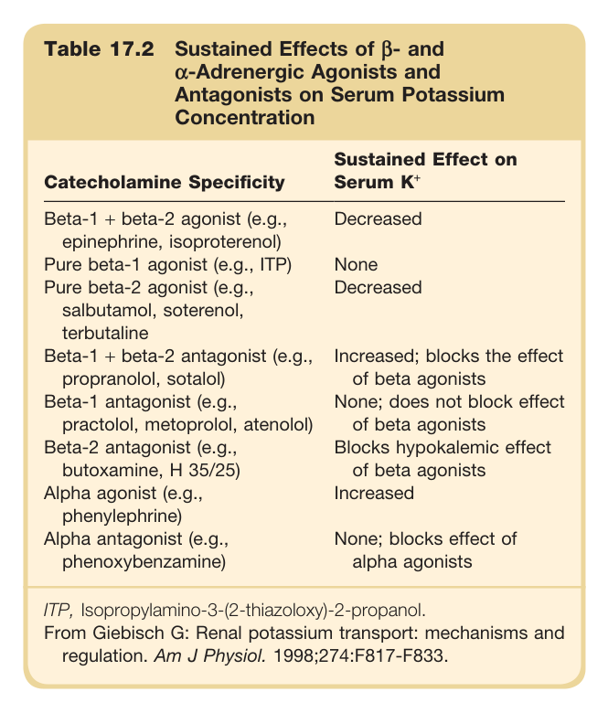

#### Table Data (CSV: [Table_17_2.csv](Table_17_2.csv))

```markdown
| Table Text (OCR) |
| :--- |
| Table 17.2 Sustained Effects of β- and α-Adrenergic Agonists and Antagonists on Serum Potassium Concentration  ITP, Isopropylamino-3-(2-thiazoloxy)-2-propanol. From Giebisch G: Renal potassium transport: mechanisms and regulation. Am J Physiol. 1998;274:F817-F833. |
```

Table 17.2 Sustained Effects of ẞ- and α-Adrenergic Agonists and Antagonists on Serum Potassium Concentration | Catecholamine Specificity | Sustained Effect on Serum K+ | | :----------------------------------------------------------- | :-------------------------------------------- | | Beta-1 + beta-2 agonist (e.g., epinephrine, isoproterenol) | Decreased | | Pure beta-1 agonist (e.g., ITP) | None | | Pure beta-2 agonist (e.g., salbutamol, soterenol, terbutaline | Decreased | | Beta-1 + beta-2 antagonist (e.g., propranolol, sotalol) | Increased; blocks the effect of beta agonists | | Beta-1 antagonist (e.g., practolol, metoprolol, atenolol) | None; does not block effect of beta agonists | | Beta-2 antagonist (e.g., butoxamine, H 35/25) | Blocks hypokalemic effect of beta agonists | | Alpha agonist (e.g., phenylephrine) | Increased | | Alpha antagonist (e.g., phenoxybenzamine) | None; blocks effect of alpha agonists | | ITP, Isopropylamino-3-(2-thiazoloxy)-2-propanol. | | | From Giebisch G: Renal potassium transport: mechanisms and regulation. Am J Physiol. 1998;274:F817-F833. | |

---

### Table_17_3

#### Table Image

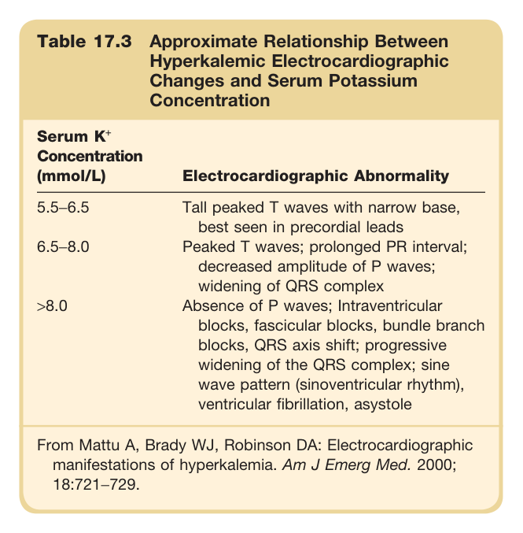

#### Table Data (CSV: [Table_17_3.csv](Table_17_3.csv))

```markdown
| Table Text (OCR) |
| :--- |
| Table 17.3 Approximate Relationship Between Hyperkalemic Electrocardiographic Changes and Serum Potassium Concentration |
```

Table 17.3 Approximate Relationship Between Hyperkalemic Electrocardiographic Changes and Serum Potassium Concentration | Serum K+ Concentration (mmol/L) | Electrocardiographic Abnormality | | :----------------------------------------------------------- | :----------------------------------------------------------- | | 5.5-6.5 | Tall peaked T waves with narrow base, best seen in precordial leads | | 6.5-8.0 | Peaked T waves; prolonged PR interval; decreased amplitude of P waves; widening of QRS complex | | >8.0 | Absence of P waves; Intraventricular blocks, fascicular blocks, bundle branch blocks, QRS axis shift; progressive widening of the QRS complex; sine wave pattern (sinoventricular rhythm), ventricular fibrillation, asystole | | From Mattu A, Brady WJ, Robinson DA: Electrocardiographic manifestations of hyperkalemia. Am J Emerg Med. 2000; 18:721-729. | |

---

### Table_17_4

#### Table Image

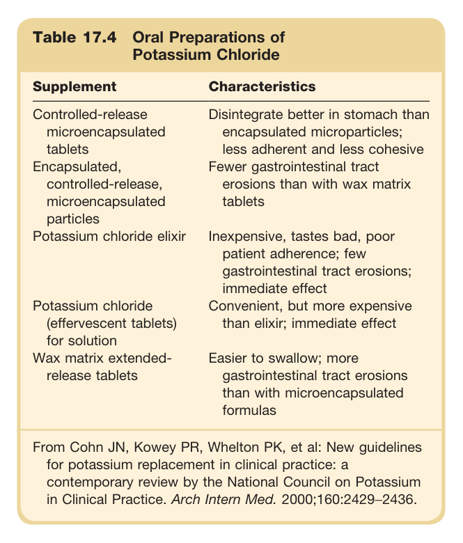

#### Table Data (CSV: [Table_17_4.csv](Table_17_4.csv))

```markdown
| Table Text (OCR) |
| :--- |
| Table 17.4 Oral Preparations of Potassium Chloride  From Cohn JN, Kowey PR, Whelton PK, et al: New guidelines for potassium replacement in clinical practice: a contemporary review by the National Council on Potassium in Clinical Practice. Arch Intern Med. 2000;160:2429−2436. |
```

Table 17.4 Oral Preparations of Potassium Chloride | Supplement | Characteristics | | :----------------------------------------------------------- | :----------------------------------------------------------- | | Controlled-release microencapsulated tablets | Disintegrate better in stomach than encapsulated microparticles; less adherent and less cohesive | | Encapsulated, controlled-release, microencapsulated particles | Fewer gastrointestinal tract erosions than with wax matrix tablets | | Potassium chloride elixir | Inexpensive, tastes bad, poor patient adherence; few gastrointestinal tract erosions; immediate effect | | Potassium chloride (effervescent tablets) for solution | Convenient, but more expensive than elixir; immediate effect | | Wax matrix extended-release tablets | Easier to swallow; more gastrointestinal tract erosions than with microencapsulated formulas | | From Cohn JN, Kowey PR, Whelton PK, et al: New guidelines for potassium replacement in clinical practice: a contemporary review by the National Council on Potassium in Clinical Practice. Arch Intern Med. 2000;160:2429-2436. | |

---

## Boxes

### Box_17_1

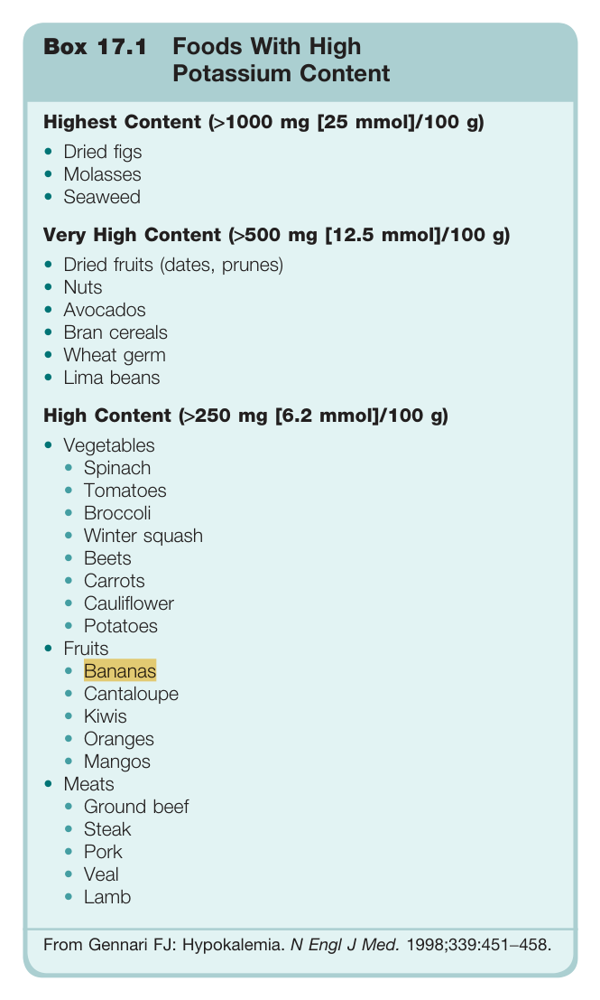

#### Box Text

```markdown
Box 17.1 Foods With High Potassium Content Highest Content (>1000 mg [25 mmol]/100 g) Very High Content (>500 mg [12.5 mmol]/100 g) High Content (>250 mg [6.2 mmol]/100 g) • Vegetables • Fruits • Meats From Gennari FJ: Hypokalemia. N Engl J Med. 1998;339:451−458.
```

Box 17.1 Foods With High Potassium Content **Highest Content (>1000 mg [25 mmol]/100 g)** * Dried figs * Molasses * Seaweed **Very High Content (>500 mg [12.5 mmol]/100 g)** * Dried fruits (dates, prunes) * Nuts * Avocados * Bran cereals * Wheat germ * Lima beans **High Content (>250 mg [6.2 mmol]/100 g)** * Vegetables * Spinach * Tomatoes * Broccoli * Winter squash * Beets * Carrots * Cauliflower * Potatoes * Fruits * Bananas * Cantaloupe * Kiwis * Oranges * Mangos * Meats * Ground beef * Steak * Pork * Veal * Lamb From Gennari FJ: Hypokalemia. N Engl J Med. 1998;339:451-458.

---
