# 18. Disorders of Calcium, Magnesium, and Phosphate Balance - Figures and Tables Index

This document lists all figures, tables and boxes extracted from `18. Disorders of Calcium, Magnesium, and Phosphate Balance.pdf`.

## Table of Contents
- [Figures](#figures)
- [Tables](#tables)
- [Boxes](#boxes)

---

## Figures

### Fig_18_1

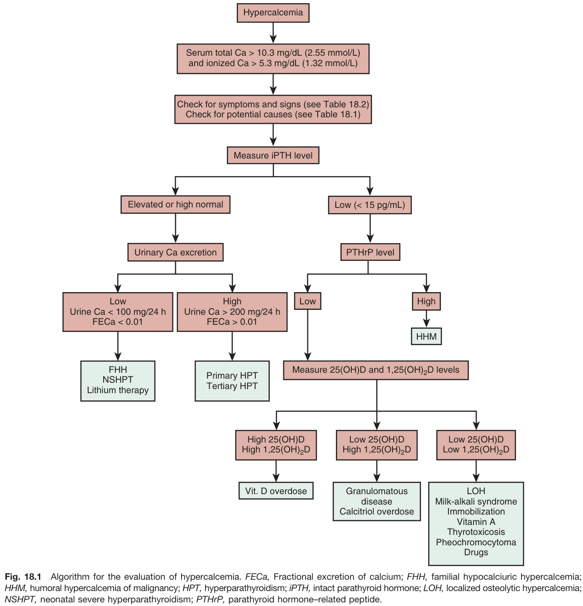

Fig. 18.1 Algorithm for the evaluation of hypercalcemia. FECa, Fractional excretion of calcium; FHH, familial hypocalciuric hypercalcemia; HHM, humoral hypercalcemia of malignancy; HPT, hyperparathyroidism; iPTH, intact parathyroid hormone; LOH, localized osteolytic hypercalcemia; NSHPT, neonatal severe hyperparathyroidism; PTHrP, parathyroid hormone-related peptide.

---

### Fig_18_2

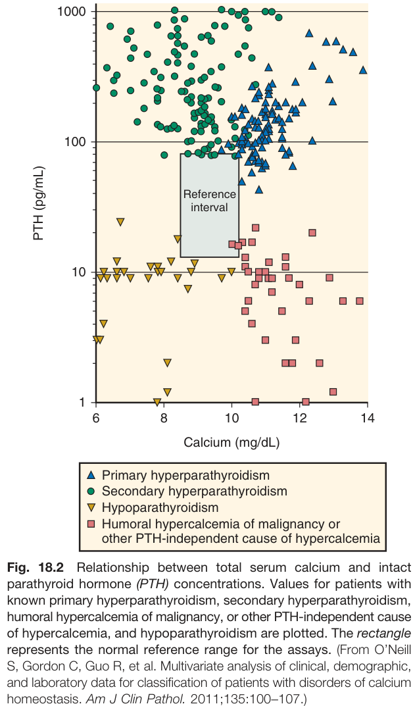

Fig. 18.2 Relationship between total serum calcium and intact parathyroid hormone (PTH) concentrations. Values for patients with known primary hyperparathyroidism, secondary hyperparathyroidism, humoral hypercalcemia of malignancy, or other PTH-independent cause of hypercalcemia, and hypoparathyroidism are plotted. The rectangle represents the normal reference range for the assays. (From O'Neill S, Gordon C, Guo R, et al. Multivariate analysis of clinical, demographic, and laboratory data for classification of patients with disorders of calcium homeostasis. Am J Clin Pathol. 2011;135:100-107.)

---

### Fig_18_3

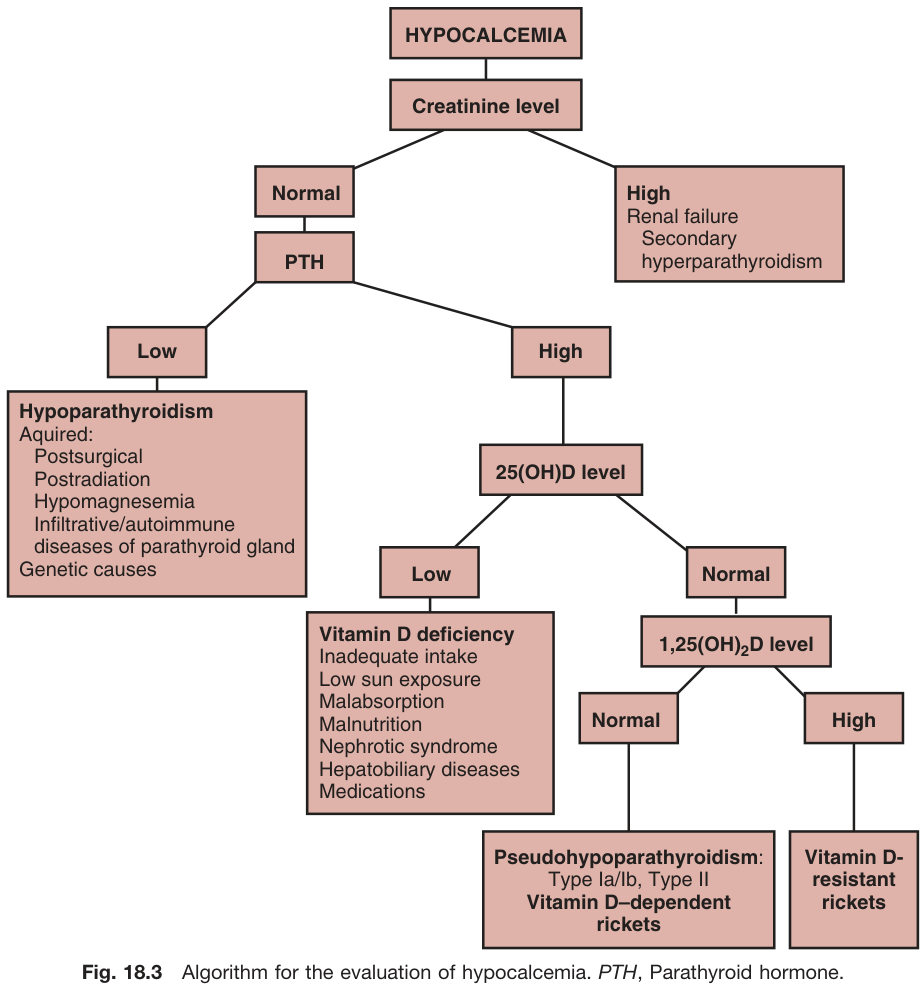

Fig. 18.3 Algorithm for the evaluation of hypocalcemia. PTH, Parathyroid hormone.

---

### Fig_18_4

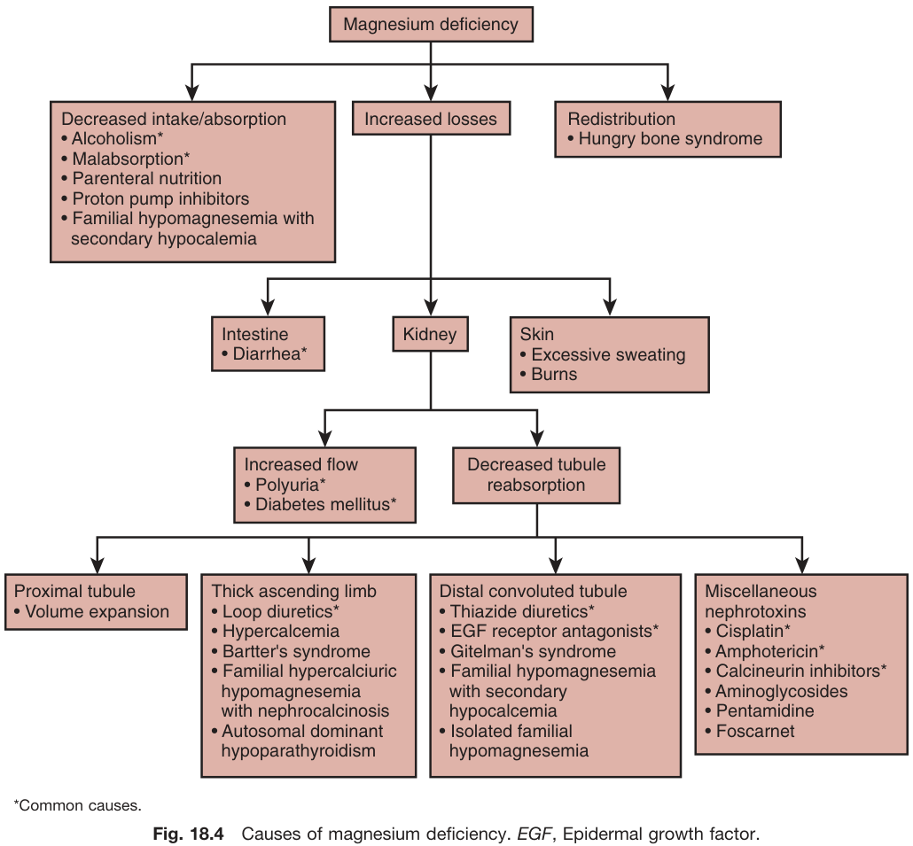

Fig. 18.4 Causes of magnesium deficiency. EGF, Epidermal growth factor.

---

### Fig_18_5

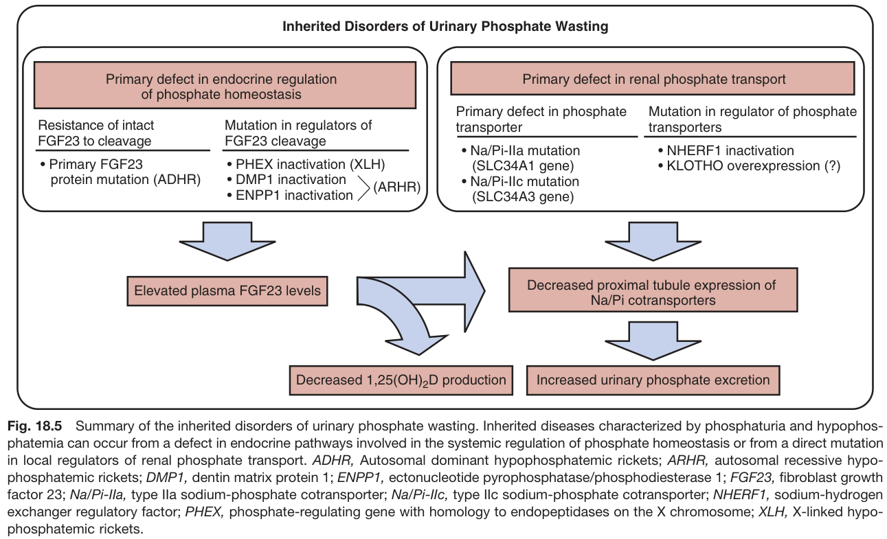

Fig. 18.5 Summary of the inherited disorders of urinary phosphate wasting. Inherited diseases characterized by phosphaturia and hypophosphatemia can occur from a defect in endocrine pathways involved in the systemic regulation of phosphate homeostasis or from a direct mutation in local regulators of renal phosphate transport. ADHR, Autosomal dominant hypophosphatemic rickets; ARHR, autosomal recessive hypophosphatemic rickets; DMP1, dentin matrix protein 1; ENPP1, ectonucleotide pyrophosphatase/phosphodiesterase 1; FGF23, fibroblast growth factor 23; Na/Pi-lla, type Ila sodium-phosphate cotransporter; Na/Pi-llc, type IIc sodium-phosphate cotransporter; NHERF1, sodium-hydrogen exchanger regulatory factor; PHEX, phosphate-regulating gene with homology to endopeptidases on the X chromosome; XLH, X-linked hypophosphatemic rickets.

---

## Tables

### Table_18_1

#### Table Image

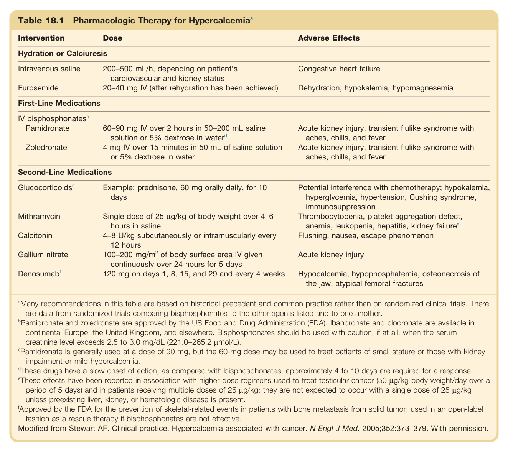

#### Table Data (CSV: [Table_18_1.csv](Table_18_1.csv))

```markdown
| Table Text (OCR) |
| :--- |
| Table 18.1 Pharmacologic Therapy for Hypercalcemia<sup>a</sup>  <sup>a</sup>Many recommendations in this table are based on historical precedent and common practice rather than on randomized clinical trials. There are data from randomized trials comparing bisphosphonates to the other agents listed and to one another. <sup>b</sup>Pamidronate and zoledronate are approved by the US Food and Drug Administration (FDA). Ibandronate and clodronate are available in continental Europe, the United Kingdom, and elsewhere. Bisphosphonates should be used with caution, if at all, when the serum creatinine level exceeds 2.5 to 3.0 mg/dL (221.0−265.2 µmol/L). <sup>c</sup>Pamidronate is generally used at a dose of 90 mg, but the 60-mg dose may be used to treat patients of small stature or those with kidney impairment or mild hypercalcemia. <sup>d</sup>These drugs have a slow onset of action, as compared with bisphosphonates; approximately 4 to 10 days are required for a response. <sup>e</sup>These effects have been reported in association with higher dose regimens used to treat testicular cancer (50 µg/kg body weight/day over a period of 5 days) and in patients receiving multiple doses of 25 µg/kg; they are not expected to occur with a single dose of 25 µg/kg unless preexisting liver, kidney, or hematologic disease is present. <sup>f</sup>Approved by the FDA for the prevention of skeletal-related events in patients with bone metastasis from solid tumor; used in an open-label fashion as a rescue therapy if bisphosphonates are not effective. Modified from Stewart AF. Clinical practice. Hypercalcemia associated with cancer. N Engl J Med. 2005;352:373−379. With permission. |
```

Table 18.1 Pharmacologic Therapy for Hypercalcemia **Intervention, Dose, Adverse Effects** **Hydration or Calciuresis** * **Intravenous saline:** 200-500 mL/h, depending on patient's cardiovascular and kidney status. Adverse Effects: Congestive heart failure. * **Furosemide:** 20-40 mg IV (after rehydration has been achieved). Adverse Effects: Dehydration, hypokalemia, hypomagnesemia. **First-Line Medications** * **IV bisphosphonates** * **Pamidronate:** 60-90 mg IV over 2 hours in 50-200 mL saline solution or 5% dextrose in water. Adverse Effects: Acute kidney injury, transient flulike syndrome with aches, chills, and fever. * **Zoledronate:** 4 mg IV over 15 minutes in 50 mL of saline solution or 5% dextrose in water. Adverse Effects: Acute kidney injury, transient flulike syndrome with aches, chills, and fever. **Second-Line Medications** * **Glucocorticoids:** Example: prednisone, 60 mg orally daily, for 10 days. Adverse Effects: Potential interference with chemotherapy; hypokalemia, hyperglycemia, hypertension, Cushing syndrome, immunosuppression. * **Mithramycin:** Single dose of 25 µg/kg of body weight over 4-6 hours in saline. Adverse Effects: Thrombocytopenia, platelet aggregation defect, anemia, leukopenia, hepatitis, kidney failure. * **Calcitonin:** 4-8 U/kg subcutaneously or intramuscularly every 12 hours. Adverse Effects: Flushing, nausea, escape phenomenon. * **Gallium nitrate:** 100-200 mg/m² of body surface area IV given continuously over 24 hours for 5 days. Adverse Effects: Acute kidney injury. * **Denosumab:** 120 mg on days 1, 8, 15, and 29 and every 4 weeks. Adverse Effects: Hypocalcemia, hypophosphatemia, osteonecrosis of the jaw, atypical femoral fractures. *Many recommendations in this table are based on historical precedent and common practice rather than on randomized clinical trials. There are data from randomized trials comparing bisphosphonates to the other agents listed and to one another.* *Pamidronate and zoledronate are approved by the US Food and Drug Administration (FDA). Ibandronate and clodronate are available in continental Europe, the United Kingdom, and elsewhere. Bisphosphonates should be used with caution, if at all, when the serum creatinine level exceeds 2.5 to 3.0 mg/dL (221.0-265.2 µmol/L).* *Pamidronate is generally used at a dose of 90 mg, but the 60-mg dose may be used to treat patients of small stature or those with kidney impairment or mild hypercalcemia.* *These drugs have a slow onset of action, as compared with bisphosphonates; approximately 4 to 10 days are required for a response.* *These effects have been reported in association with higher dose regimens used to treat testicular cancer (50 µg/kg body weight/day over a period of 5 days) and in patients receiving multiple doses of 25 µg/kg; they are not expected to occur with a single dose of 25 µg/kg unless preexisting liver, kidney, or hematologic disease is present.* *Approved by the FDA for the prevention of skeletal-related events in patients with bone metastasis from solid tumor; used in an open-label fashion as a rescue therapy if bisphosphonates are not effective.* *Modified from Stewart AF. Clinical practice. Hypercalcemia associated with cancer. N Engl J Med. 2005;352:373-379. With permission.*

---

### Table_18_2

#### Table Image

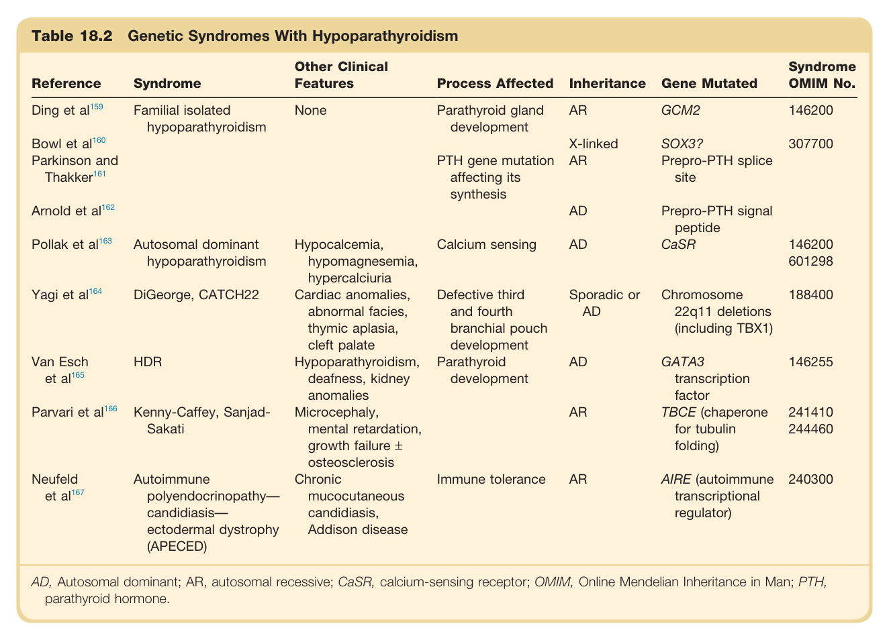

#### Table Data (CSV: [Table_18_2.csv](Table_18_2.csv))

```markdown
| Table Text (OCR) |
| :--- |
| Table 18.2 Genetic Syndromes With Hypoparathyroidism  AD, Autosomal dominant; AR, autosomal recessive; CaSR, calcium-sensing receptor; OMIM, Online Mendelian Inheritance in Man; PTH, parathyroid hormone. |
```

Table 18.2 Genetic Syndromes With Hypoparathyroidism **Reference, Syndrome, Other Clinical Features, Process Affected, Inheritance, Gene Mutated, Syndrome OMIM No.** * Ding et al: Familial isolated hypoparathyroidism, None, Parathyroid gland development, AR, GCM2, 146200 * Bowl et al; Parkinson and Thakker: Familial isolated hypoparathyroidism, None, PTH gene mutation affecting its synthesis, X-linked AR, SOX3? Prepro-PTH splice site, 307700 * Arnold et al: Familial isolated hypoparathyroidism, None, PTH gene mutation affecting its synthesis, AD, Prepro-PTH signal peptide * Pollak et al: Autosomal dominant hypoparathyroidism, Hypocalcemia, hypomagnesemia, hypercalciuria, Calcium sensing, AD, CaSR, 146200 601298 * Yagi et al: DiGeorge, CATCH22, Cardiac anomalies, abnormal facies, thymic aplasia, cleft palate, Defective third and fourth branchial pouch development, Sporadic or AD, Chromosome 22q11 deletions (including TBX1), 188400 * Van Esch et al: HDR, Hypoparathyroidism, deafness, kidney anomalies, Parathyroid development, AD, GATA3 transcription factor, 146255 * Parvari et al: Kenny-Caffey, Sanjad-Sakati, Microcephaly, mental retardation, growth failure ± osteosclerosis, Parathyroid development, AR, TBCE (chaperone for tubulin folding), 241410 244460 * Neufeld et al: Autoimmune polyendocrinopathy-candidiasis-ectodermal dystrophy (APECED), Chronic mucocutaneous candidiasis, Addison disease, Immune tolerance, AR, AIRE (autoimmune transcriptional regulator), 240300 *AD, Autosomal dominant; AR, autosomal recessive; CaSR, calcium-sensing receptor; OMIM, Online Mendelian Inheritance in Man; PTH, parathyroid hormone.*

---

## Boxes

### Box_18_1

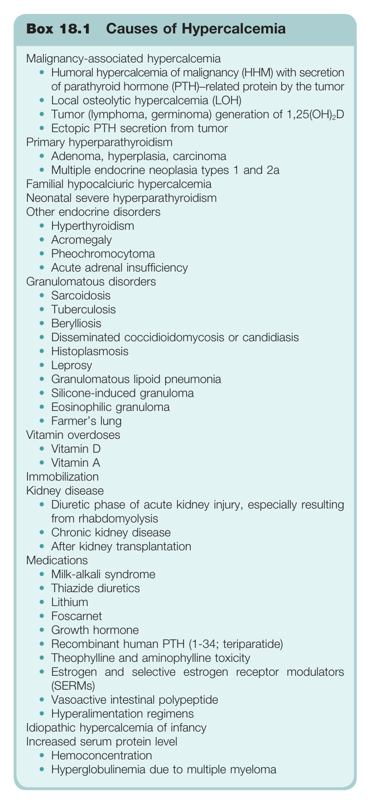

#### Box Text

```markdown
Box 18.1 Causes of Hypercalcemia Malignancy-associated hypercalcemia Primary hyperparathyroidism Familial hypocalciuric hypercalcemia Neonatal severe hyperparathyroidism Other endocrine disorders Granulomatous disorders • Disseminated coccidioidomycosis or candidiasis Vitamin overdoses • Vitamin D • Vitamin A Immobilization Kidney disease Medications Idiopathic hypercalcemia of infancy Increased serum protein level
```

Box 18.1 Causes of Hypercalcemia **Malignancy-associated hypercalcemia** * Humoral hypercalcemia of malignancy (HHM) with secretion of parathyroid hormone (PTH)-related protein by the tumor * Local osteolytic hypercalcemia (LOH) * Tumor (lymphoma, germinoma) generation of 1,25(OH)2D * Ectopic PTH secretion from tumor **Primary hyperparathyroidism** * Adenoma, hyperplasia, carcinoma * Multiple endocrine neoplasia types 1 and 2a **Familial hypocalciuric hypercalcemia** **Neonatal severe hyperparathyroidism** **Other endocrine disorders** * Hyperthyroidism * Acromegaly * Pheochromocytoma * Acute adrenal insufficiency **Granulomatous disorders** * Sarcoidosis * Tuberculosis * Berylliosis * Disseminated coccidioidomycosis or candidiasis * Histoplasmosis * Leprosy * Granulomatous lipoid pneumonia * Silicone-induced granuloma * Eosinophilic granuloma * Farmer's lung **Vitamin overdoses** * Vitamin D * Vitamin A **Immobilization** **Kidney disease** * Diuretic phase of acute kidney injury, especially resulting from rhabdomyolysis * Chronic kidney disease * After kidney transplantation **Medications** * Milk-alkali syndrome * Thiazide diuretics * Lithium * Foscarnet * Growth hormone * Recombinant human PTH (1-34; teriparatide) * Theophylline and aminophylline toxicity * Estrogen and selective estrogen receptor modulators (SERMS) * Vasoactive intestinal polypeptide * Hyperalimentation regimens **Idiopathic hypercalcemia of infancy** **Increased serum protein level** * Hemoconcentration * Hyperglobulinemia due to multiple myeloma

---

### Box_18_2

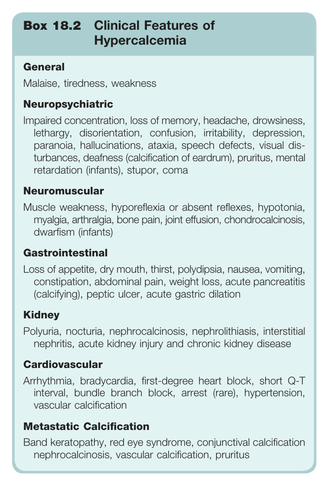

#### Box Text

```markdown
Box 18.2 Clinical Features of Hypercalcemia General Malaise, tiredness, weakness Neuropsychiatric Impaired concentration, loss of memory, headache, drowsiness, lethargy, disorientation, confusion, irritability, depression, paranoia, hallucinations, ataxia, speech defects, visual dis- turbances, deafness (calcification of eardrum), pruritus, mental retardation (infants), stupor, coma Neuromuscular Muscle weakness, hyporeflexia or absent reflexes, hypotonia, myalgia, arthralgia, bone pain, joint effusion, chondrocalcinosis, dwarfism (infants) Gastrointestinal Loss of appetite, dry mouth, thirst, polydipsia, nausea, vomiting, constipation, abdominal pain, weight loss, acute pancreatitis (calcifying), peptic ulcer, acute gastric dilation Kidney Polyuria, nocturia, nephrocalcinosis, nephrolithiasis, interstitial nephritis, acute kidney injury and chronic kidney disease Cardiovascular Arrhythmia, bradycardia, first-degree heart block, short Q-T interval, bundle branch block, arrest (rare), hypertension, vascular calcification Metastatic Calcification Band keratopathy, red eye syndrome, conjunctival calcification nephrocalcinosis, vascular calcification, pruritus
```

Box 18.2 Clinical Features of Hypercalcemia **General** Malaise, tiredness, weakness **Neuropsychiatric** Impaired concentration, loss of memory, headache, drowsiness, lethargy, disorientation, confusion, irritability, depression, paranoia, hallucinations, ataxia, speech defects, visual disturbances, deafness (calcification of eardrum), pruritus, mental retardation (infants), stupor, coma **Neuromuscular** Muscle weakness, hyporeflexia or absent reflexes, hypotonia, myalgia, arthralgia, bone pain, joint effusion, chondrocalcinosis, dwarfism (infants) **Gastrointestinal** Loss of appetite, dry mouth, thirst, polydipsia, nausea, vomiting, constipation, abdominal pain, weight loss, acute pancreatitis (calcifying), peptic ulcer, acute gastric dilation **Kidney** Polyuria, nocturia, nephrocalcinosis, nephrolithiasis, interstitial nephritis, acute kidney injury and chronic kidney disease **Cardiovascular** Arrhythmia, bradycardia, first-degree heart block, short Q-T interval, bundle branch block, arrest (rare), hypertension, vascular calcification **Metastatic Calcification** Band keratopathy, red eye syndrome, conjunctival calcification nephrocalcinosis, vascular calcification, pruritus

---

### Box_18_3

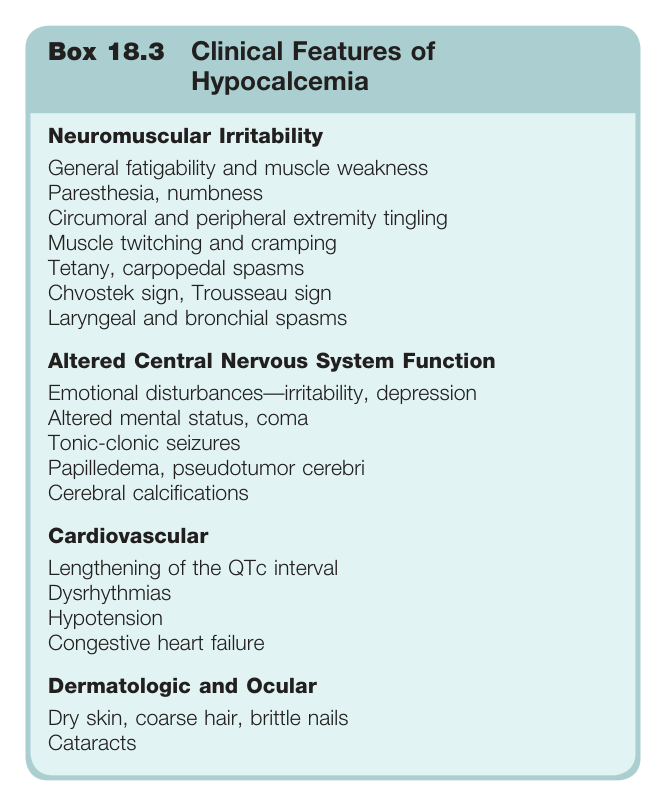

#### Box Text

```markdown
Box 18.3 Clinical Features of Hypocalcemia Neuromuscular Irritability General fatigability and muscle weakness Paresthesia, numbness Circumoral and peripheral extremity tingling Muscle twitching and cramping Tetany, carpopedal spasms Chvostek sign, Trousseau sign Laryngeal and bronchial spasms Altered Central Nervous System Function Emotional disturbances—irritability, depression Altered mental status, coma Tonic-clonic seizures Papilledema, pseudotumor cerebri Cerebral calcifications Cardiovascular Lengthening of the QTc interval Dysrhythmias Hypotension Congestive heart failure Dermatologic and Ocular Dry skin, coarse hair, brittle nails Cataracts
```

Box 18.3 Clinical Features of Hypocalcemia **Neuromuscular Irritability** * General fatigability and muscle weakness * Paresthesia, numbness * Circumoral and peripheral extremity tingling * Muscle twitching and cramping * Tetany, carpopedal spasms * Chvostek sign, Trousseau sign * Laryngeal and bronchial spasms **Altered Central Nervous System Function** * Emotional disturbances-irritability, depression * Altered mental status, coma * Tonic-clonic seizures * Papilledema, pseudotumor cerebri * Cerebral calcifications **Cardiovascular** * Lengthening of the QTc interval * Dysrhythmias * Hypotension * Congestive heart failure **Dermatologic and Ocular** * Dry skin, coarse hair, brittle nails * Cataracts

---

### Box_18_4

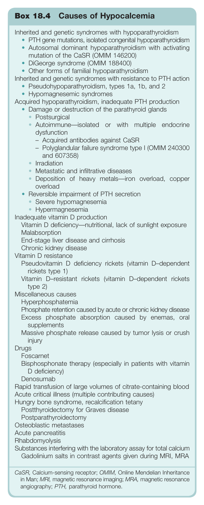

#### Box Text

```markdown
Box 18.4 Causes of Hypocalcemia Inherited and genetic syndromes with hypoparathyroidism Inherited and genetic syndromes with resistance to PTH action Acquired hypoparathyroidism, inadequate PTH production • Damage or destruction of the parathyroid glands • Reversible impairment of PTH secretion Inadequate vitamin D production Vitamin D deficiency—nutritional, lack of sunlight exposure Vitamin D resistance Miscellaneous causes Drugs Rapid transfusion of large volumes of citrate-containing blood Acute critical illness (multiple contributing causes) Hungry bone syndrome, recalcification tetany Osteoblastic metastases Acute pancreatitis Rhabdomyolysis Substances interfering with the laboratory assay for total calcium Gadolinium salts in contrast agents given during MRI, MRA CaSR, Calcium-sensing receptor; OMIM, Online Mendelian Inheritance in Man; MRI, magnetic resonance imaging; MRA, magnetic resonance angiography; PTH, parathyroid hormone.
```

Box 18.4 Causes of Hypocalcemia **Inherited and genetic syndromes with hypoparathyroidism** * PTH gene mutations, isolated congenital hypoparathyroidism * Autosomal dominant hypoparathyroidism with activating mutation of the CaSR (OMIM 146200) * DiGeorge syndrome (OMIM 188400) * Other forms of familial hypoparathyroidism **Inherited and genetic syndromes with resistance to PTH action** * Pseudohypoparathyroidism, types 1a, 1b, and 2 * Hypomagnesemic syndromes **Acquired hypoparathyroidism, inadequate PTH production** * Damage or destruction of the parathyroid glands * Postsurgical * Autoimmune-isolated or with multiple endocrine dysfunction * Acquired antibodies against CaSR * Polyglandular failure syndrome type I (OMIM 240300 and 607358) * Irradiation * Metastatic and infiltrative diseases * Deposition of heavy metals-iron overload, copper overload * Reversible impairment of PTH secretion * Severe hypomagnesemia * Hypermagnesemia **Inadequate vitamin D production** * Vitamin D deficiency-nutritional, lack of sunlight exposure * Malabsorption * End-stage liver disease and cirrhosis **Chronic kidney disease** **Vitamin D resistance** * Pseudovitamin D deficiency rickets (vitamin D-dependent rickets type 1) * Vitamin D-resistant rickets (vitamin D-dependent rickets type 2) **Miscellaneous causes** * Hyperphosphatemia * Phosphate retention caused by acute or chronic kidney disease * Excess phosphate absorption caused by enemas, oral supplements * Massive phosphate release caused by tumor lysis or crush injury * Drugs * Foscarnet * Bisphosphonate therapy (especially in patients with vitamin D deficiency) * Denosumab * Rapid transfusion of large volumes of citrate-containing blood * Acute critical illness (multiple contributing causes) * Hungry bone syndrome, recalcification tetany * Postthyroidectomy for Graves disease * Postparathyroidectomy * Osteoblastic metastases * Acute pancreatitis * Rhabdomyolysis * Substances interfering with the laboratory assay for total calcium * Gadolinium salts in contrast agents given during MRI, MRA *CaSR, Calcium-sensing receptor; OMIM, Online Mendelian Inheritance in Man; MRI, magnetic resonance imaging; MRA, magnetic resonance angiography; PTH, parathyroid hormone.*

---

### Box_18_5

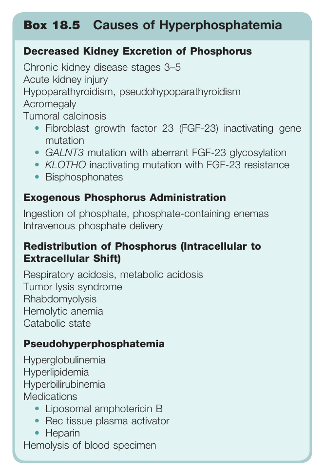

#### Box Text

```markdown
Box 18.5 Causes of Hyperphosphatemia Decreased Kidney Excretion of Phosphorus Chronic kidney disease stages 3–5 Acute kidney injury Hypoparathyroidism, pseudohypoparathyroidism Acromegaly Tumoral calcinosis Exogenous Phosphorus Administration Ingestion of phosphate, phosphate-containing enemas Intravenous phosphate delivery Redistribution of Phosphorus (Intracellular to Extracellular Shift) Respiratory acidosis, metabolic acidosis Tumor lysis syndrome Rhabdomyolysis Hemolytic anemia Catabolic state Pseudohyperphosphatemia Hyperglobulinemia Hyperlipidemia Hyperbilirubinemia Medications Hemolysis of blood specimen
```

Box 18.5 Causes of Hyperphosphatemia **Decreased Kidney Excretion of Phosphorus** * Chronic kidney disease stages 3-5 * Acute kidney injury * Hypoparathyroidism, pseudohypoparathyroidism * Acromegaly * Tumoral calcinosis * Fibroblast growth factor 23 (FGF-23) inactivating gene mutation * GALNT3 mutation with aberrant FGF-23 glycosylation * KLOTHO inactivating mutation with FGF-23 resistance * Bisphosphonates **Exogenous Phosphorus Administration** * Ingestion of phosphate, phosphate-containing enemas * Intravenous phosphate delivery **Redistribution of Phosphorus (Intracellular to Extracellular Shift)** * Respiratory acidosis, metabolic acidosis * Tumor lysis syndrome * Rhabdomyolysis * Hemolytic anemia * Catabolic state **Pseudohyperphosphatemia** * Hyperglobulinemia * Hyperlipidemia * Hyperbilirubinemia * Medications * Liposomal amphotericin B * Rec tissue plasma activator * Heparin * Hemolysis of blood specimen

---

### Box_18_6

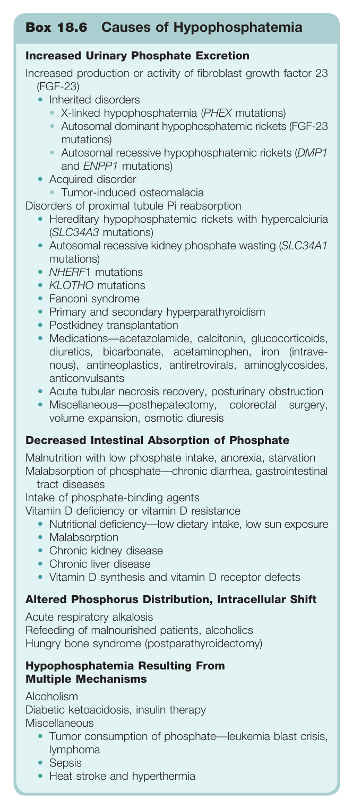

#### Box Text

```markdown
Box 18.6 Causes of Hypophosphatemia Increased Urinary Phosphate Excretion Increased production or activity of fibroblast growth factor 23 (FGF-23) • Acquired disorder • Tumor-induced osteomalacia Disorders of proximal tubule Pi reabsorption Decreased Intestinal Absorption of Phosphate Malnutrition with low phosphate intake, anorexia, starvation Malabsorption of phosphate—chronic diarrhea, gastrointestina tract diseases Intake of phosphate-binding agents Vitamin D deficiency or vitamin D resistance Altered Phosphorus Distribution, Intracellular Shift Acute respiratory alkalosis Refeeding of malnourished patients, alcoholics Hungry bone syndrome (postparathyroidectomy) Hypophosphatemia Resulting From Multiple Mechanisms Alcoholism Diabetic ketoacidosis, insulin therapy Miscellaneous
```

Box 18.6 Causes of Hypophosphatemia **Increased Urinary Phosphate Excretion** * Increased production or activity of fibroblast growth factor 23 (FGF-23) * Inherited disorders * X-linked hypophosphatemia (PHEX mutations) * Autosomal dominant hypophosphatemic rickets (FGF-23 mutations) * Autosomal recessive hypophosphatemic rickets (DMP1 and ENPP1 mutations) * Acquired disorder * Tumor-induced osteomalacia * Disorders of proximal tubule Pi reabsorption * Hereditary hypophosphatemic rickets with hypercalciuria (SLC34A3 mutations) * Autosomal recessive kidney phosphate wasting (SLC34A1 mutations) * NHERF1 mutations * KLOTHO mutations * Fanconi syndrome * Primary and secondary hyperparathyroidism * Postkidney transplantation * Medications-acetazolamide, calcitonin, glucocorticoids, diuretics, bicarbonate, acetaminophen, iron (intravenous), antineoplastics, antiretrovirals, aminoglycosides, anticonvulsants * Acute tubular necrosis recovery, posturinary obstruction * Miscellaneous-posthepatectomy, colorectal surgery, volume expansion, osmotic diuresis **Decreased Intestinal Absorption of Phosphate** * Malnutrition with low phosphate intake, anorexia, starvation * Malabsorption of phosphate-chronic diarrhea, gastrointestinal tract diseases * Intake of phosphate-binding agents * Vitamin D deficiency or vitamin D resistance * Nutritional deficiency-low dietary intake, low sun exposure * Malabsorption * Chronic kidney disease * Chronic liver disease * Vitamin D synthesis and vitamin D receptor defects **Altered Phosphorus Distribution, Intracellular Shift** * Acute respiratory alkalosis * Refeeding of malnourished patients, alcoholics * Hungry bone syndrome (postparathyroidectomy) **Hypophosphatemia Resulting From Multiple Mechanisms** * Alcoholism * Diabetic ketoacidosis, insulin therapy * Miscellaneous * Tumor consumption of phosphate-leukemia blast crisis, lymphoma * Sepsis * Heat stroke and hyperthermia

---
