# 19. Epidemiology of Kidney Disease - Figures and Tables Index

This document lists all figures and tables extracted from `19. Epidemiology of Kidney Disease.pdf`.

## Table of Contents
- [Figures](#figures)
- [Tables](#tables)

---

## Figures

### Fig_19_1

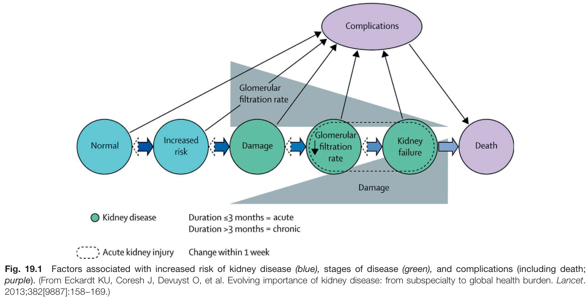

Fig. 19.1 Factors associated with increased risk of kidney disease (blue), stages of disease (green), and complications (including death; purple). (From Eckardt KU, Coresh J, Devuyst O, et al. Evolving importance of kidney disease: from subspecialty to global health burden. Lancet. 2013;382[9887]:158-169.)

---

### Fig_19_2

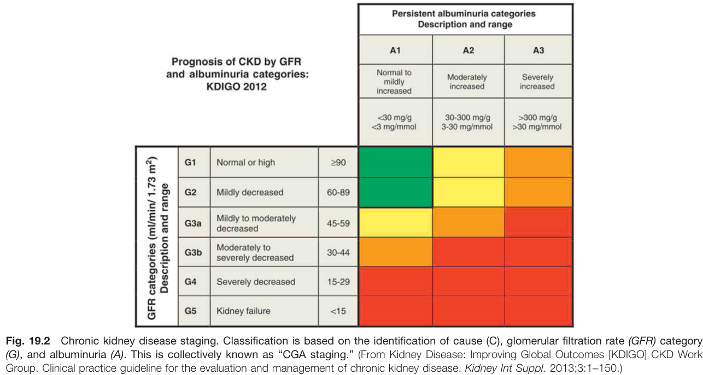

Fig. 19.2 Chronic kidney disease staging. Classification is based on the identification of cause (C), glomerular filtration rate (GFR) category (G), and albuminuria (A). This is collectively known as "CGA staging." (From Kidney Disease: Improving Global Outcomes [KDIGO] CKD Work Group. Clinical practice guideline for the evaluation and management of chronic kidney disease. Kidney Int Suppl. 2013;3:1-150.)

---

### Fig_19_3

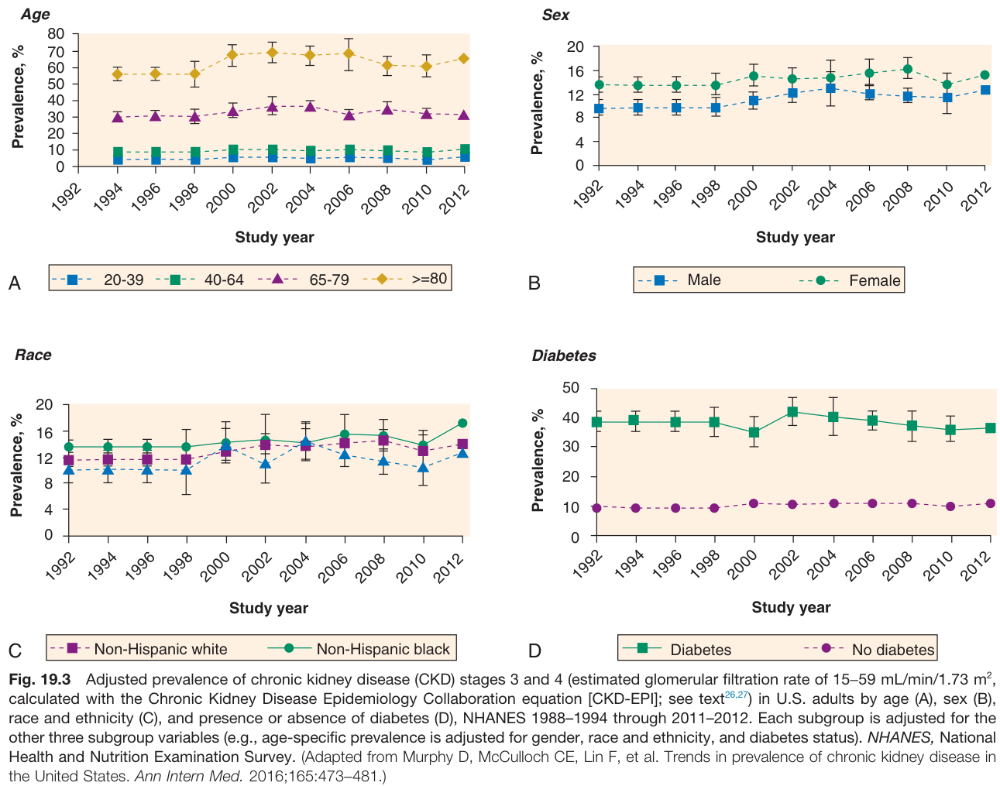

Fig. 19.3 Adjusted prevalence of chronic kidney disease (CKD) stages 3 and 4 (estimated glomerular filtration rate of 15-59 mL/min/1.73 m², calculated with the Chronic Kidney Disease Epidemiology Collaboration equation [CKD-EPI]; see text26,27) in U.S. adults by age (A), sex (B), race and ethnicity (C), and presence or absence of diabetes (D), NHANES 1988-1994 through 2011-2012. Each subgroup is adjusted for the other three subgroup variables (e.g., age-specific prevalence is adjusted for gender, race and ethnicity, and diabetes status). NHANES, National Health and Nutrition Examination Survey. (Adapted from Murphy D, McCulloch CE, Lin F, et al. Trends in prevalence of chronic kidney disease in the United States. Ann Intern Med. 2016;165:473-481.)

---

### Fig_19_4

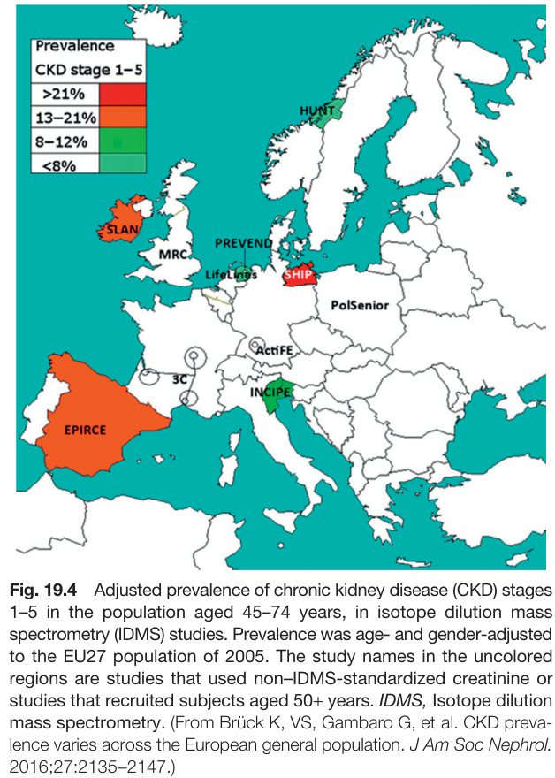

Fig. 19.4 Adjusted prevalence of chronic kidney disease (CKD) stages 1-5 in the population aged 45-74 years, in isotope dilution mass spectrometry (IDMS) studies. Prevalence was age- and gender-adjusted to the EU27 population of 2005. The study names in the uncolored regions are studies that used non-IDMS-standardized creatinine or studies that recruited subjects aged 50+ years. IDMS, Isotope dilution mass spectrometry. (From Brück K, VS, Gambaro G, et al. CKD prevalence varies across the European general population. J Am Soc Nephrol. 2016;27:2135-2147.)

---

### Fig_19_5

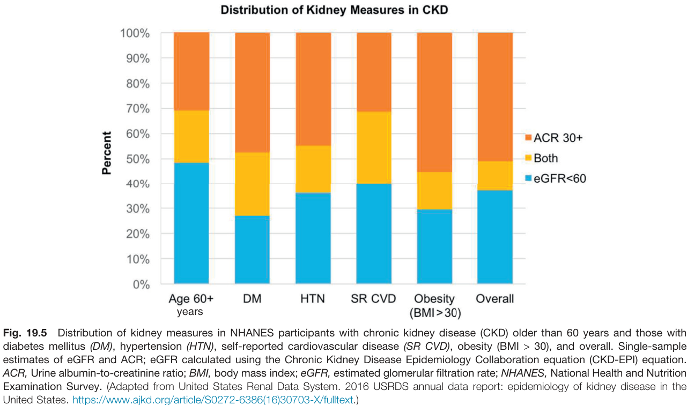

Fig. 19.5 Distribution of kidney measures in NHANES participants with chronic kidney disease (CKD) older than 60 years and those with diabetes mellitus (DM), hypertension (HTN), self-reported cardiovascular disease (SR CVD), obesity (BMI > 30), and overall. Single-sample estimates of eGFR and ACR; eGFR calculated using the Chronic Kidney Disease Epidemiology Collaboration equation (CKD-EPI) equation. ACR, Urine albumin-to-creatinine ratio; BMI, body mass index; eGFR, estimated glomerular filtration rate; NHANES, National Health and Nutrition Examination Survey. (Adapted from United States Renal Data System. 2016 USRDS annual data report: epidemiology of kidney disease in the United States. https://www.ajkd.org/article/S0272-6386(16)30703-X/fulltext.)

---

### Fig_19_6

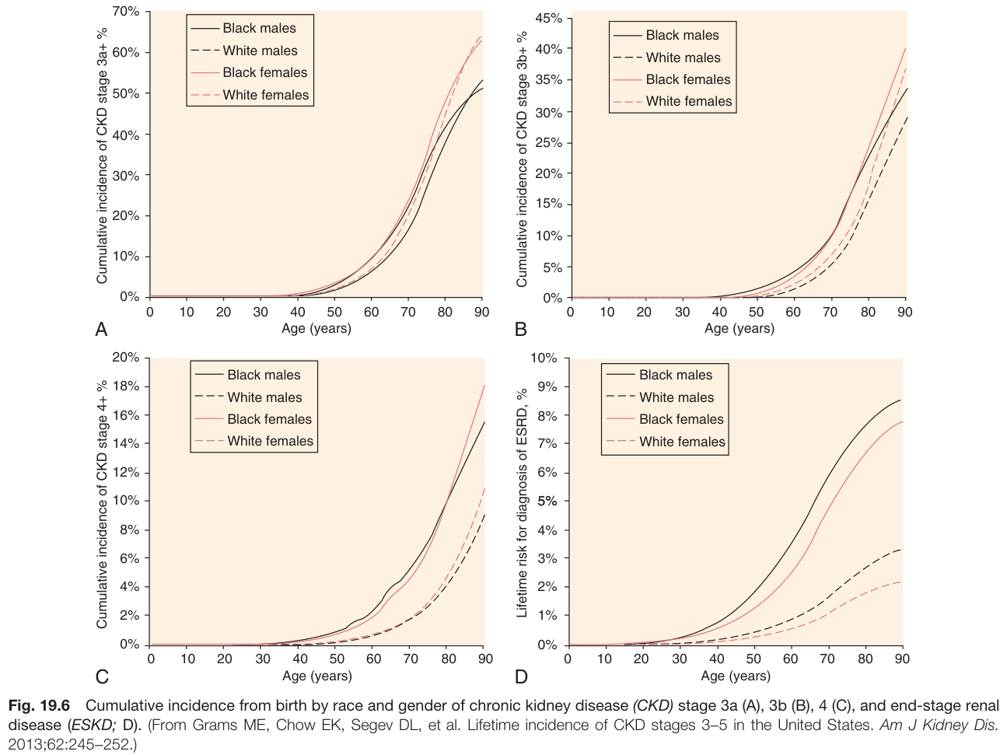

Fig. 19.6 Cumulative incidence from birth by race and gender of chronic kidney disease (CKD) stage 3a (A), 3b (B), 4 (C), and end-stage renal disease (ESKD; D). (From Grams ME, Chow EK, Segev DL, et al. Lifetime incidence of CKD stages 3-5 in the United States. Am J Kidney Dis. 2013;62:245-252.)

---

### Fig_19_7

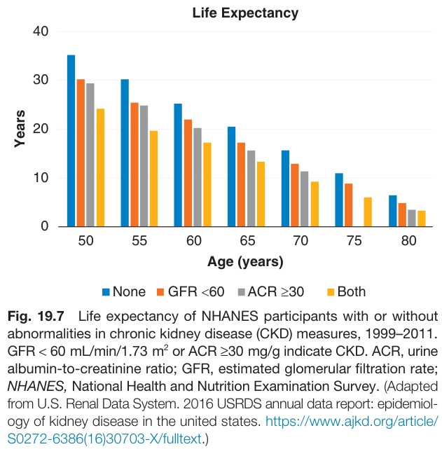

Fig. 19.7 Life expectancy of NHANES participants with or without abnormalities in chronic kidney disease (CKD) measures, 1999-2011. GFR < 60 mL/min/1.73 m² or ACR ≥30 mg/g indicate CKD. ACR, urine albumin-to-creatinine ratio; GFR, estimated glomerular filtration rate; NHANES, National Health and Nutrition Examination Survey. (Adapted from U.S. Renal Data System. 2016 USRDS annual data report: epidemiology of kidney disease in the united states. https://www.ajkd.org/article/S0272-6386(16)30703-X/fulltext.)

---

### Fig_19_8

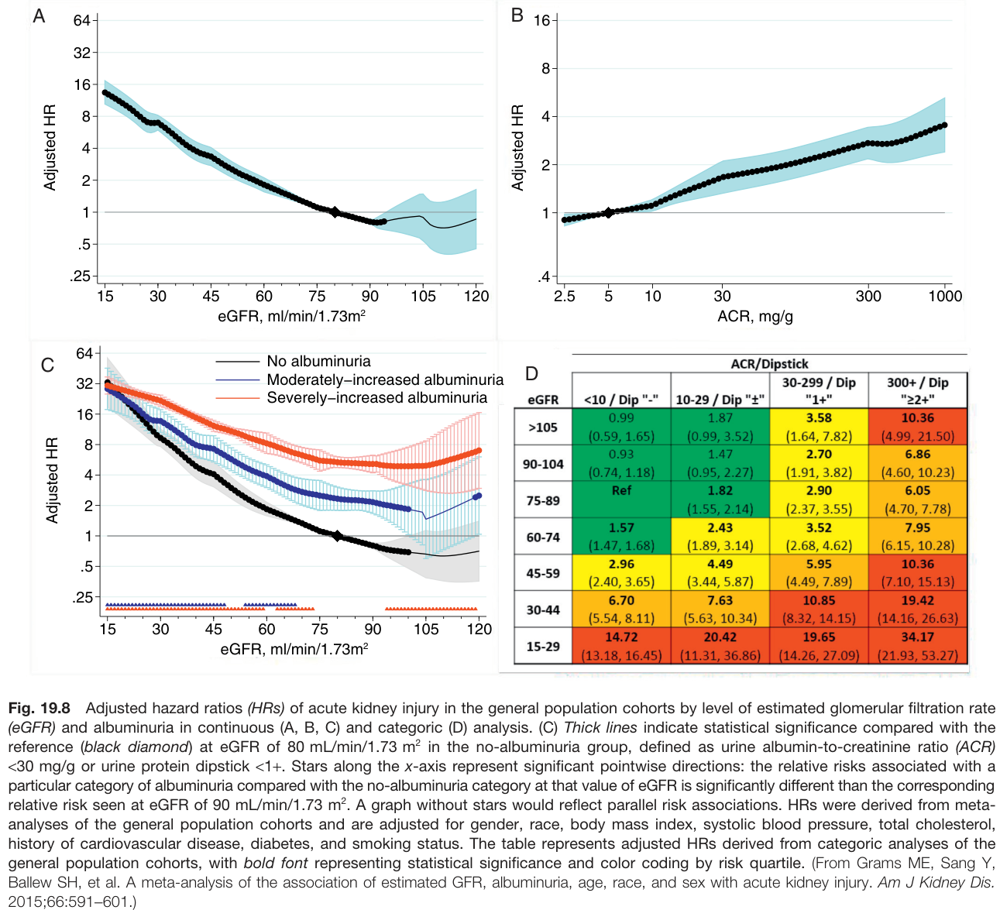

Fig. 19.8 Adjusted hazard ratios (HRs) of acute kidney injury in the general population cohorts by level of estimated glomerular filtration rate (eGFR) and albuminuria in continuous (A, B, C) and categoric (D) analysis. (C) Thick lines indicate statistical significance compared with the reference (black diamond) at eGFR of 80 mL/min/1.73 m² in the no-albuminuria group, defined as urine albumin-to-creatinine ratio (ACR) <30 mg/g or urine protein dipstick <1+. Stars along the x-axis represent significant pointwise directions: the relative risks associated with a particular category of albuminuria compared with the no-albuminuria category at that value of eGFR is significantly different than the corresponding relative risk seen at eGFR of 90 mL/min/1.73 m². A graph without stars would reflect parallel risk associations. HRs were derived from meta-analyses of the general population cohorts and are adjusted for gender, race, body mass index, systolic blood pressure, total cholesterol, history of cardiovascular disease, diabetes, and smoking status. The table represents adjusted HRs derived from categoric analyses of the general population cohorts, with bold font representing statistical significance and color coding by risk quartile. (From Grams ME, Sang Y, Ballew SH, et al. A meta-analysis of the association of estimated GFR, albuminuria, age, race, and sex with acute kidney injury. Am J Kidney Dis. 2015;66:591-601.)

---

### Fig_19_9

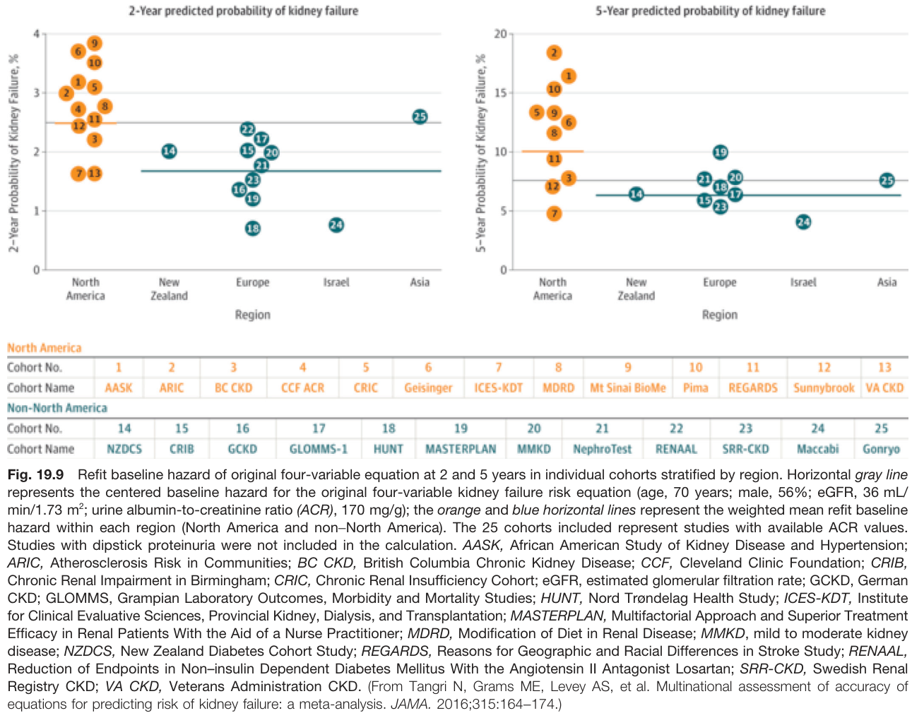

Fig. 19.9 Refit baseline hazard of original four-variable equation at 2 and 5 years in individual cohorts stratified by region. Horizontal gray line represents the centered baseline hazard for the original four-variable kidney failure risk equation (age, 70 years; male, 56%; eGFR, 36 mL/min/1.73 m²; urine albumin-to-creatinine ratio (ACR), 170 mg/g); the orange and blue horizontal lines represent the weighted mean refit baseline hazard within each region (North America and non-North America). The 25 cohorts included represent studies with available ACR values. Studies with dipstick proteinuria were not included in the calculation. AASK, African American Study of Kidney Disease and Hypertension; ARIC, Atherosclerosis Risk in Communities; BC CKD, British Columbia Chronic Kidney Disease; CCF, Cleveland Clinic Foundation; CRIB, Chronic Renal Impairment in Birmingham; CRIC, Chronic Renal Insufficiency Cohort; eGFR, estimated glomerular filtration rate; GCKD, German CKD; GLOMMS, Grampian Laboratory Outcomes, Morbidity and Mortality Studies; HUNT, Nord Trøndelag Health Study; ICES-KDT, Institute for Clinical Evaluative Sciences, Provincial Kidney, Dialysis, and Transplantation; MASTERPLAN, Multifactorial Approach and Superior Treatment Efficacy in Renal Patients With the Aid of a Nurse Practitioner; MDRD, Modification of Diet in Renal Disease; MMKD, mild to moderate kidney disease; NZDCS, New Zealand Diabetes Cohort Study; REGARDS, Reasons for Geographic and Racial Differences in Stroke Study; RENAAL, Reduction of Endpoints in Non-insulin Dependent Diabetes Mellitus With the Angiotensin II Antagonist Losartan; SRR-CKD, Swedish Renal Registry CKD; VA CKD, Veterans Administration CKD. (From Tangri N, Grams ME, Levey AS, et al. Multinational assessment of accuracy of equations for predicting risk of kidney failure: a meta-analysis. JAMA. 2016;315:164-174.)

---

### Fig_19_10

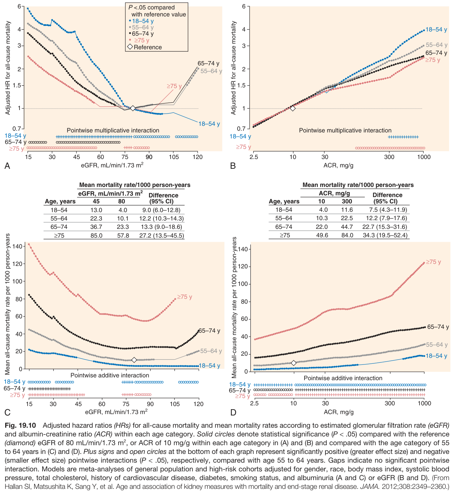

Fig. 19.10 Adjusted hazard ratios (HRs) for all-cause mortality and mean mortality rates according to estimated glomerular filtration rate (eGFR) and albumin-creatinine ratio (ACR) within each age category. Solid circles denote statistical significance (P < .05) compared with the reference (diamond) eGFR of 80 mL/min/1.73 m², or ACR of 10 mg/g within each age category in (A) and (B) and compared with the age category of 55 to 64 years in (C) and (D). Plus signs and open circles at the bottom of each graph represent significantly positive (greater effect size) and negative (smaller effect size) pointwise interactions (P < .05), respectively, compared with age 55 to 64 years. Gaps indicate no significant pointwise interaction. Models are meta-analyses of general population and high-risk cohorts adjusted for gender, race, body mass index, systolic blood pressure, total cholesterol, history of cardiovascular disease, diabetes, smoking status, and albuminuria (A and C) or eGFR (B and D). (From Hallan SI, Matsushita K, Sang Y, et al. Age and association of kidney measures with mortality and end-stage renal disease. JAMA. 2012;308:2349-2360.)

---

### Fig_19_11

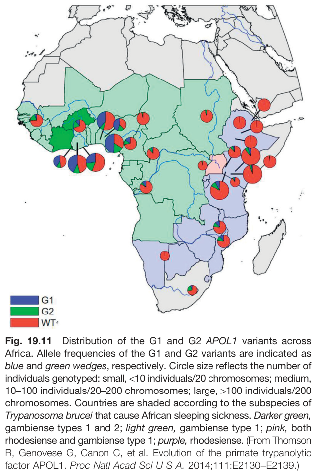

Fig. 19.11 Distribution of the G1 and G2 APOL1 variants across Africa. Allele frequencies of the G1 and G2 variants are indicated as blue and green wedges, respectively. Circle size reflects the number of individuals genotyped: small, <10 individuals/20 chromosomes; medium, 10-100 individuals/20-200 chromosomes; large, >100 individuals/200 chromosomes. Countries are shaded according to the subspecies of Trypanosoma brucei that cause African sleeping sickness. Darker green, gambiense types 1 and 2; light green, gambiense type 1; pink, both rhodesiense and gambiense type 1; purple, rhodesiense. (From Thomson R, Genovese G, Canon C, et al. Evolution of the primate trypanolytic factor APOL1. Proc Natl Acad Sci US A. 2014;111:E2130-E2139.)

---

### Fig_19_12

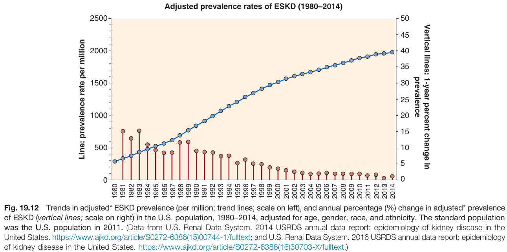

Fig. 19.12 Trends in adjusted* ESKD prevalence (per million; trend lines; scale on left), and annual percentage (%) change in adjusted* prevalence of ESKD (vertical lines; scale on right) in the U.S. population, 1980-2014, adjusted for age, gender, race, and ethnicity. The standard population was the U.S. population in 2011. (Data from U.S. Renal Data System. 2014 USRDS annual data report: epidemiology of kidney disease in the United States. https://www.ajkd.org/article/S0272-6386(15)00744-1/fulltext; and U.S. Renal Data System. 2016 USRDS annual data report: epidemiology of kidney disease in the United States. https://www.ajkd.org/article/S0272-6386(16)30703-X/fulltext.)

---

### Fig_19_13

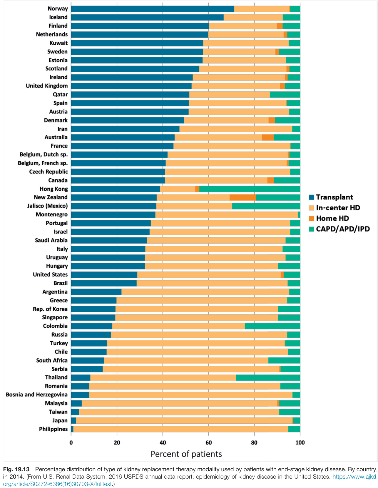

Fig. 19.13 Percentage distribution of type of kidney replacement therapy modality used by patients with end-stage kidney disease. By country, in 2014. (From U.S. Renal Data System. 2016 USRDS annual data report: epidemiology of kidney disease in the United States. https://www.ajkd.org/article/S0272-6386(16)30703-X/fulltext.)

---

### Fig_19_14

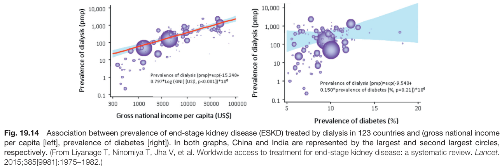

Fig. 19.14 Association between prevalence of end-stage kidney disease (ESKD) treated by dialysis in 123 countries and (gross national income per capita [left], prevalence of diabetes [right]). In both graphs, China and India are represented by the largest and second largest circles, respectively. (From Liyanage T, Ninomiya T, Jha V, et al. Worldwide access to treatment for end-stage kidney disease: a systematic review. Lancet. 2015;385[9981]:1975-1982.)

---

### Fig_19_15

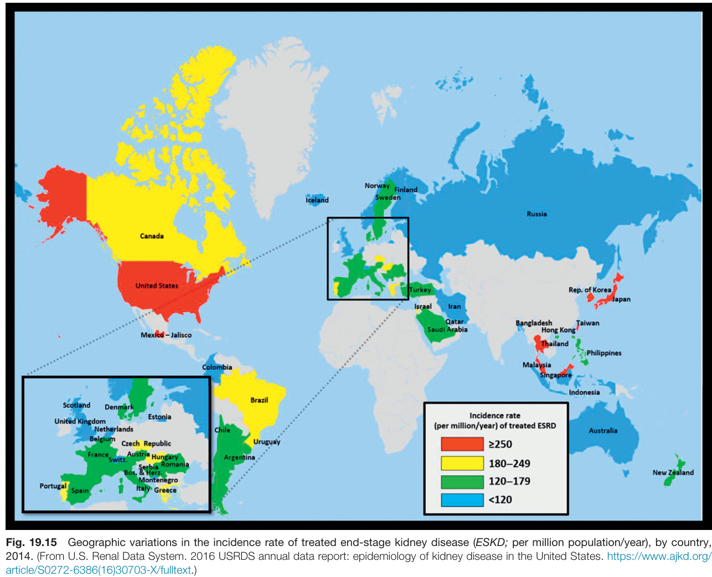

Fig. 19.15 Geographic variations in the incidence rate of treated end-stage kidney disease (ESKD; per million population/year), by country, 2014. (From U.S. Renal Data System. 2016 USRDS annual data report: epidemiology of kidney disease in the United States. https://www.ajkd.org/article/S0272-6386(16)30703-X/fulltext.)

---

### Fig_19_16

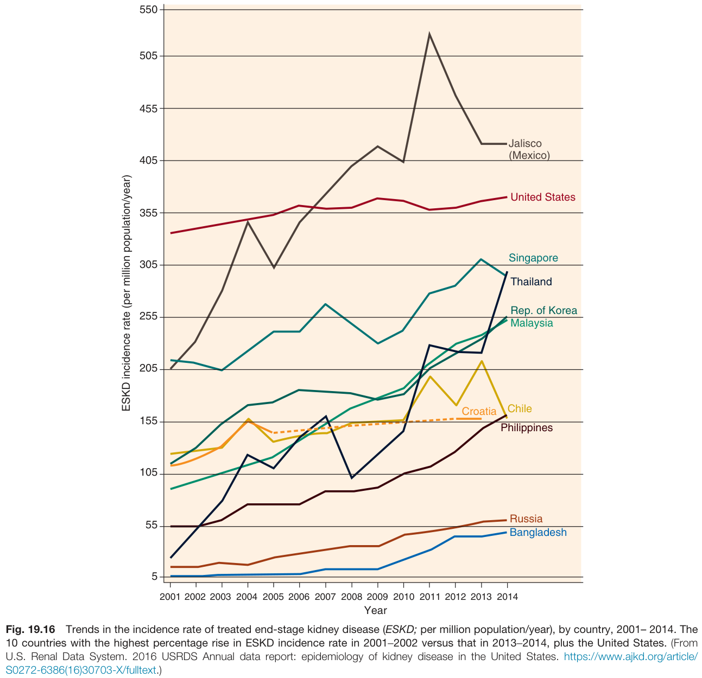

Fig. 19.16 Trends in the incidence rate of treated end-stage kidney disease (ESKD; per million population/year), by country, 2001-2014. The 10 countries with the highest percentage rise in ESKD incidence rate in 2001-2002 versus that in 2013-2014, plus the United States. (From U.S. Renal Data System. 2016 USRDS Annual data report: epidemiology of kidney disease in the United States. https://www.ajkd.org/article/S0272-6386(16)30703-X/fulltext.)

---

### Fig_19_17

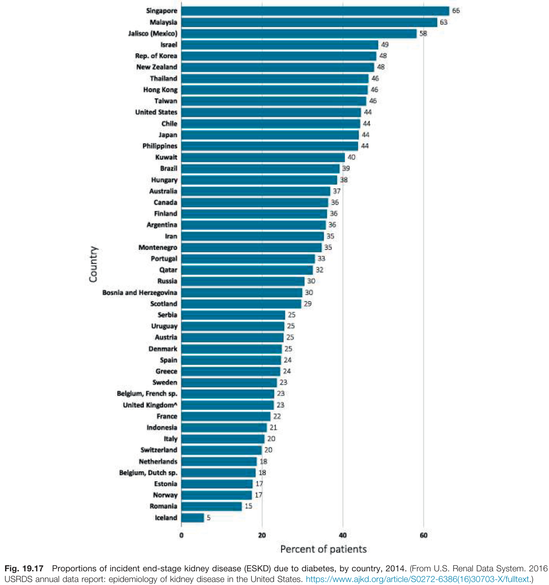

Fig. 19.17 Proportions of incident end-stage kidney disease (ESKD) due to diabetes, by country, 2014. (From U.S. Renal Data System. 2016 USRDS annual data report: epidemiology of kidney disease in the United States. https://www.ajkd.org/article/S0272-6386(16)30703-X/fulltext.)

---

### Fig_19_18

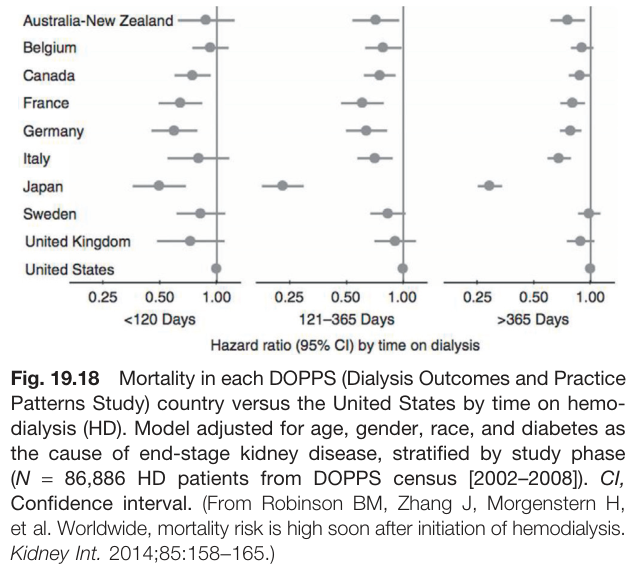

Fig. 19.18 Mortality in each DOPPS (Dialysis Outcomes and Practice Patterns Study) country versus the United States by time on hemodialysis (HD). Model adjusted for age, gender, race, and diabetes as the cause of end-stage kidney disease, stratified by study phase (N = 86,886 HD patients from DOPPS census [2002-2008]). CI, Confidence interval. (From Robinson BM, Zhang J, Morgenstern H, et al. Worldwide, mortality risk is high soon after initiation of hemodialysis. Kidney Int. 2014;85:158-165.)

---

### Fig_19_19

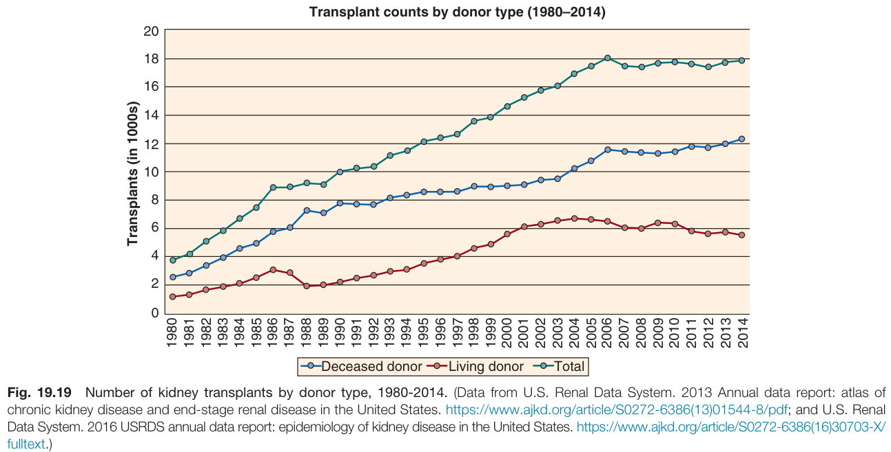

Fig. 19.19 Number of kidney transplants by donor type, 1980-2014. (Data from U.S. Renal Data System. 2013 Annual data report: atlas of chronic kidney disease and end-stage renal disease in the United States. https://www.ajkd.org/article/S0272-6386(13)01544-8/pdf; and U.S. Renal Data System. 2016 USRDS annual data report: epidemiology of kidney disease in the United States. https://www.ajkd.org/article/S0272-6386(16)30703-X/fulltext.)

---

### Fig_19_20

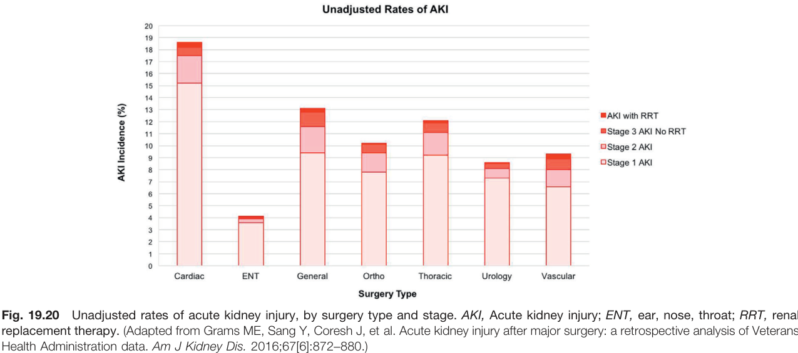

Fig. 19.20 Unadjusted rates of acute kidney injury, by surgery type and stage. AKI, Acute kidney injury; ENT, ear, nose, throat; RRT, renal replacement therapy. (Adapted from Grams ME, Sang Y, Coresh J, et al. Acute kidney injury after major surgery: a retrospective analysis of Veterans Health Administration data. Am J Kidney Dis. 2016;67 [6]:872-880.)

---

### Fig_19_21

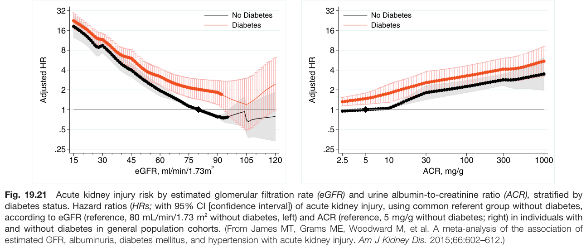

Fig. 19.21 Acute kidney injury risk by estimated glomerular filtration rate (eGFR) and urine albumin-to-creatinine ratio (ACR), stratified by diabetes status. Hazard ratios (HRs; with 95% CI [confidence interval]) of acute kidney injury, using common referent group without diabetes, according to eGFR (reference, 80 mL/min/1.73 m² without diabetes, left) and ACR (reference, 5 mg/g without diabetes; right) in individuals with and without diabetes in general population cohorts. (From James MT, Grams ME, Woodward M, et al. A meta-analysis of the association of estimated GFR, albuminuria, diabetes mellitus, and hypertension with acute kidney injury. Am J Kidney Dis. 2015;66:602-612.)

---

## Tables

### Table_19_1

#### Table Image

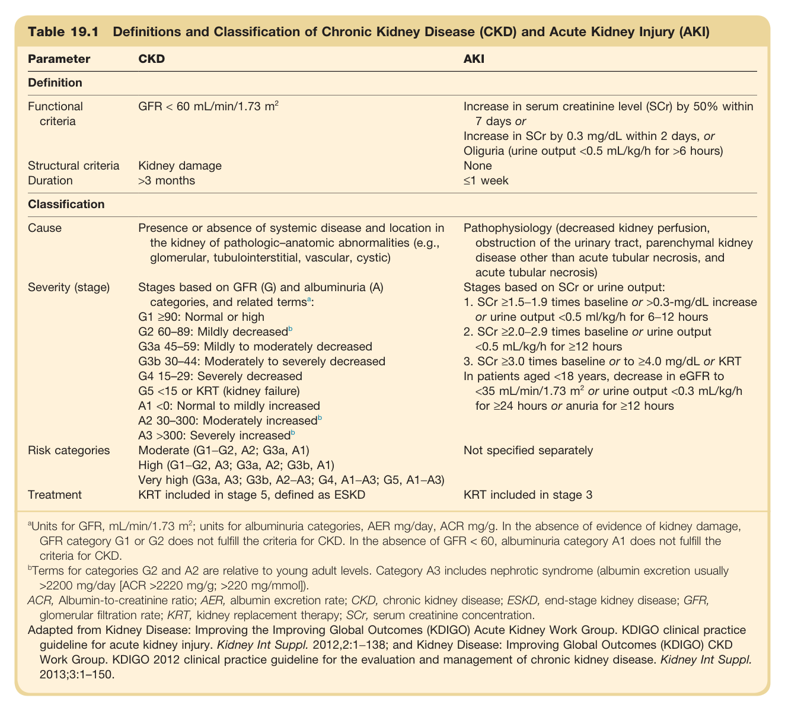

#### Table Data (CSV: [Table_19_1.csv](Table_19_1.csv))

```markdown
| Table Text (OCR) |
| :--- |
| Table 19.1 Definitions and Classification of Chronic Kidney Disease (CKD) and Acute Kidney Injury (AKI) Parameter  CKD  AKI    Definition    Functional criteria  GFR < 60 mL/min/1.73  m^2   Increase in serum creatinine level (SCr) by 50% within 7 days orIncrease in SCr by 0.3 mg/dL within 2 days, orOliguria (urine output <0.5 mL/kg/h for >6 hours)    Structural criteria  Kidney damage  None    Duration  >3 months  ≤1 week    Classification    Cause  Presence or absence of systemic disease and location in the kidney of pathologic-anatomic abnormalities (e.g., glomerular, tubulointerstitial, vascular, cystic)  Pathophysiology (decreased kidney perfusion, obstruction of the urinary tract, parenchymal kidney disease other than acute tubular necrosis, and acute tubular necrosis)    Severity (stage)  Stages based on GFR (G) and albuminuria (A) categories, and related  terms^a :G1 ≥90: Normal or highG2 60-89: Mildly  decreased^b G3a 45-59: Mildly to moderately decreasedG3b 30-44: Moderately to severely decreasedG4 15-29: Severely decreasedG5 <15 or KRT (kidney failure)A1 <0: Normal to mildly increasedA2 30-300: Moderately  increased^b A3 >300:  Severely increased^b   Stages based on SCr or urine output:1. SCr ≥1.5-1.9 times baseline or >0.3-mg/dL increase or urine output <0.5 ml/kg/h for 6-12 hours2. SCr ≥2.0-2.9 times baseline or urine output <0.5 mL/kg/h for ≥12 hours3. SCr ≥3.0 times baseline or to ≥4.0 mg/dL or KRT In patients aged <18 years, decrease in eGFR to <35 mL/min/1.73  m^2  or urine output <0.3 mL/kg/h for ≥24 hours or anuria for ≥12 hours    Risk categories  Moderate (G1-G2, A2; G3a, A1)High (G1-G2, A3; G3a, A2; G3b, A1)Very high (G3a, A3; G3b, A2-A3; G4, A1-A3; G5, A1-A3)  Not specified separately    Treatment  KRT included in stage 5, defined as ESKD  KRT included in stage 3 <sup>a</sup>Units for GFR, mL/min/1.73 m<sup>2</sup>; units for albuminuria categories, AER mg/day, ACR mg/g. In the absence of evidence of kidney damage, GFR category G1 or G2 does not fulfill the criteria for CKD. In the absence of GFR < 60, albuminuria category A1 does not fulfill the criteria for CKD. <sup>b</sup>Terms for categories G2 and A2 are relative to young adult levels. Category A3 includes nephrotic syndrome (albumin excretion usually >2200 mg/day [ACR >2220 mg/g; >220 mg/mmol]). ACR, Albumin-to-creatinine ratio; AER, albumin excretion rate; CKD, chronic kidney disease; ESKD, end-stage kidney disease; GFR, glomerular filtration rate; KRT, kidney replacement therapy; SCr, serum creatinine concentration. Adapted from Kidney Disease: Improving the Improving Global Outcomes (KDIGO) Acute Kidney Work Group. KDIGO clinical practice guideline for acute kidney injury. Kidney Int Suppl. 2012,2:1−138; and Kidney Disease: Improving Global Outcomes (KDIGO) CKD Work Group. KDIGO 2012 clinical practice guideline for the evaluation and management of chronic kidney disease. Kidney Int Suppl. 2013;3:1–150. |
```

Table 19.1 Definitions and Classification of Chronic Kidney Disease (CKD) and Acute Kidney Injury (AKI) | Parameter | CKD | AKI | | :--- | :--- | :--- | | **Definition** | | | | Functional criteria | GFR < 60 mL/min/1.73 m² | Increase in serum creatinine level (SCr) by 50% within 7 days or Increase in SCr by 0.3 mg/dL within 2 days, or Oliguria (urine output <0.5 mL/kg/h for >6 hours) | | Structural criteria | Kidney damage | None | | Duration | >3 months | ≤1 week | | **Classification** | | | | Cause | Presence or absence of systemic disease and location in the kidney of pathologic-anatomic abnormalities (e.g., glomerular, tubulointerstitial, vascular, cystic) | Pathophysiology (decreased kidney perfusion, obstruction of the urinary tract, parenchymal kidney disease other than acute tubular necrosis, and acute tubular necrosis) | | Severity (stage) | Stages based on GFR (G) and albuminuria (A) categories, and related termsª: G1 ≥90: Normal or high, G2 60-89: Mildly decreasedb, G3a 45-59: Mildly to moderately decreased, G3b 30-44: Moderately to severely decreased, G4 15-29: Severely decreased, G5 <15 or KRT (kidney failure). A1 <0: Normal to mildly increased, A2 30-300: Moderately increasedb, A3 >300: Severely increasedb | Stages based on SCr or urine output: 1. SCr ≥1.5-1.9 times baseline or >0.3-mg/dL increase or urine output <0.5 ml/kg/h for 6-12 hours, 2. SCr ≥2.0-2.9 times baseline or urine output <0.5 mL/kg/h for ≥12 hours, 3. SCr ≥3.0 times baseline or to ≥4.0 mg/dL or KRT. In patients aged <18 years, decrease in eGFR to <35 mL/min/1.73 m² or urine output <0.3 mL/kg/h for ≥24 hours or anuria for ≥12 hours | | Risk categories | Moderate (G1-G2, A2; G3a, A1), High (G1-G2, A3; G3a, A2; G3b, A1), Very high (G3a, A3; G3b, A2-A3; G4, A1-A3; G5, A1-A3) | Not specified separately | | Treatment | KRT included in stage 5, defined as ESKD | KRT included in stage 3 | Units for GFR, mL/min/1.73 m²; units for albuminuria categories, AER mg/day, ACR mg/g. In the absence of evidence of kidney damage, GFR category G1 or G2 does not fulfill the criteria for CKD. In the absence of GFR < 60, albuminuria category A1 does not fulfill the criteria for CKD. Terms for categories G2 and A2 are relative to young adult levels. Category A3 includes nephrotic syndrome (albumin excretion usually >2200 mg/day [ACR >2220 mg/g; >220 mg/mmol]). ACR, Albumin-to-creatinine ratio; AER, albumin excretion rate; CKD, chronic kidney disease; ESKD, end-stage kidney disease; GFR, glomerular filtration rate; KRT, kidney replacement therapy; SCr, serum creatinine concentration. Adapted from Kidney Disease: Improving the Improving Global Outcomes (KDIGO) Acute Kidney Work Group. KDIGO clinical practice guideline for acute kidney injury. Kidney Int Suppl. 2012, 2:1-138; and Kidney Disease: Improving Global Outcomes (KDIGO) CKD Work Group. KDIGO 2012 clinical practice guideline for the evaluation and management of chronic kidney disease. Kidney Int Suppl. 2013;3:1-150.

---

### Table_19_2

#### Table Image

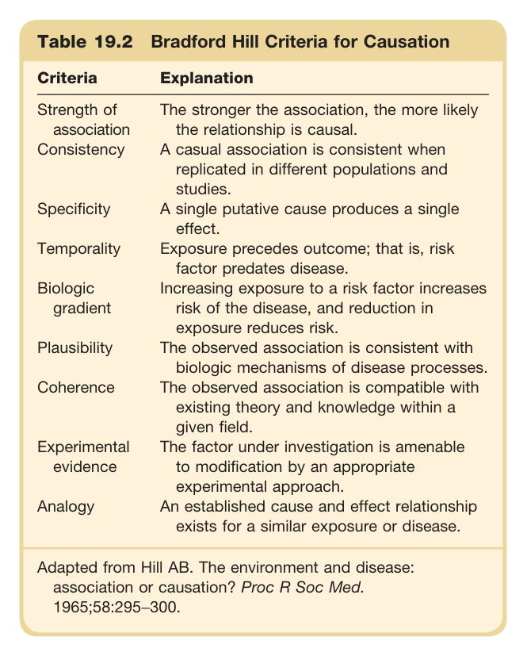

#### Table Data (CSV: [Table_19_2.csv](Table_19_2.csv))

```markdown
| Table Text (OCR) |
| :--- |
| Table 19.2 Bradford Hill Criteria for Causation Criteria  Explanation    Strength of association  The stronger the association, the more likely the relationship is causal.    Consistency  A casual association is consistent when replicated in different populations and studies.    Specificity  A single putative cause produces a single effect.    Temporality  Exposure precedes outcome; that is, risk factor predates disease.    Biologic gradient  Increasing exposure to a risk factor increases risk of the disease, and reduction in exposure reduces risk.    Plausibility  The observed association is consistent with biologic mechanisms of disease processes.    Coherence  The observed association is compatible with existing theory and knowledge within a given field.    Experimental evidence  The factor under investigation is amenable to modification by an appropriate experimental approach.    Analogy  An established cause and effect relationship exists for a similar exposure or disease.    Adapted from Hill AB. The environment and disease:association or causation? Proc R Soc Med.1965;58:295–300. |
```

Table 19.2 Bradford Hill Criteria for Causation | Criteria | Explanation | | :--- | :--- | | Strength of association | The stronger the association, the more likely the relationship is causal. | | Consistency | A casual association is consistent when replicated in different populations and studies. | | Specificity | A single putative cause produces a single effect. | | Temporality | Exposure precedes outcome; that is, risk factor predates disease. | | Biologic gradient | Increasing exposure to a risk factor increases risk of the disease, and reduction in exposure reduces risk. | | Plausibility | The observed association is consistent with biologic mechanisms of disease processes. | | Coherence | The observed association is compatible with existing theory and knowledge within a given field. | | Experimental evidence | The factor under investigation is amenable to modification by an appropriate experimental approach. | | Analogy | An established cause and effect relationship exists for a similar exposure or disease. | Adapted from Hill AB. The environment and disease: association or causation? Proc R Soc Med. 1965:58:295-300.

---

### Table_19_3

#### Table Image

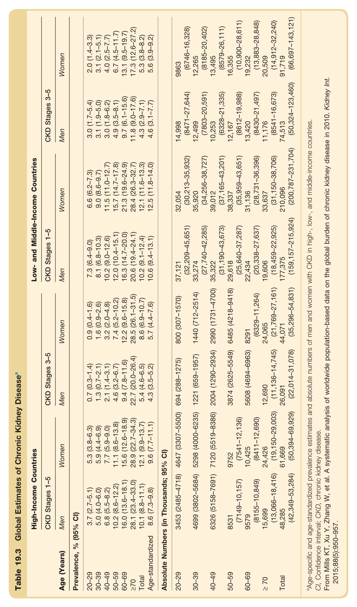

#### Table Data (CSV: [Table_19_3.csv](Table_19_3.csv))

```markdown
| Table Text (OCR) |
| :--- |
| Table 19.3 Global Estimates of Chronic Kidney Diseasea \| \| **High-Income Countries** \| **Low- and Middle-Income Countries** \| \| :--- \| :--- \| :--- \| \| \| **CKD Stages 1-5** \| **CKD Stages 3-5** \| **CKD Stages 1-5** \| **CKD Stages 3-5** \| \| **Age (Years)** \| **Men** \| **Women** \| **Men** \| **Women** \| **Men** \| **Women** \| **Men** \| **Women** \| \| **Prevalence, % (95% CI)** \| \| \| \| \| \| \| \| \| \| 20-29 \| 3.7 (2.7-5.1) \| 5.3 (3.8-6.3) \| 0.7 (0.3-1.4) \| 0.9 (0.4-1.6) \| 7.3 (6.4-9.0) \| 6.6 (6.2-7.3) \| 3.0 (1.7-5.4) \| 2.0 (1.4-3.3) \| \| 30-39 \| 5.0 (4.0-6.0) \| 5.9 (4.4-6.9) \| 1.3 (0.7-2.1) \| 1.6 (0.9-2.6) \| 8.1 (6.8-10.3) \| 9.0 (8.6-9.7) \| 3.1 (1.9-5.0) \| 3.1 (2.1-5.1) \| \| 40-49 \| 6.8 (5.5-8.2) \| 7.7 (5.9-9.0) \| 2.1 (1.4-3.1) \| 3.2 (2.0-4.8) \| 10.2 (9.0-12.6) \| 11.5 (11.0-12.7) \| 3.0 (1.8-6.2) \| 4.0 (2.5-7.7) \| \| 50-59 \| 10.2 (8.6-12.2) \| 11.1 (8.6-13.8) \| 4.6 (3.2-6.7) \| 7.4 (5.2-10.2) \| 12.0 (10.4-15.1) \| 15.7 (14.7-17.8) \| 4.9 (3.5-8.1) \| 6.7 (4.5-11.7) \| \| 60-69 \| 16.0 (13.6-18.1) \| 15.6 (12.6-18.9) \| 9.4 (7.8-11.6) \| 12.2 (9.6-15.8) \| 16.3 (14.7-20.0) \| 21.3 (19.6-24.9) \| 9.7 (6.1-15.6) \| 13.1 (9.5-19.7) \| \| ≥70 \| 28.1 (23.4-33.0) \| 28.9 (22.7-34.3) \| 22.7 (20.0-26.4) \| 28.5 (26.1-31.5) \| 20.6 (19.4-24.1) \| 28.4 (26.3-32.7) \| 11.8 (9.0-17.6) \| 17.3 (12.6-27.2) \| \| Total Age-standardized \| 10.1 (8.8-11.1) \| 12.1 (9.9-13.7) \| 5.4 (4.6-6.5) \| 8.6 (6.9-10.7) \| 10.2 (9.1-12.4) \| 12.1 (11.6-13.3) \| 4.3 (2.9-7.1) \| 5.3 (3.8-8.2) \| \| \| 8.6 (7.3-9.8) \| 9.6 (7.7-11.1) \| 4.3 (3.5-5.2) \| 5.7 (4.4-7.6) \| 10.6 (9.4-13.1) \| 12.5 (11.8-14.0) \| 4.6 (3.1-7.7) \| 5.6 (3.9-9.2) \| \| **Absolute Numbers (in Thousands; 95% CI)** \| \| \| \| \| \| \| \| \| \| 20-29 \| 3453 (2485-4718) \| 4647 (3307-5500) \| 694 (288-1275) \| 800 (307-1570) \| 37,121 (32,209-45,651) \| 32,054 (30,213-35,932) \| 14,998 (8471-27,644) \| 9863 (6746-16,328) \| \| 30-39 \| 4699 (3802-5684) \| 5298 (4000-6235) \| 1221 (659-1957) \| 1440 (712-2514) \| 33,274 (27,740-42,285) \| 35,920 (34,256-38,727) \| 12,499 (7803-20,591) \| 12,265 (8185-20,402) \| \| 40-49 \| 6326 (5158-7691) \| 7120 (5519-8386) \| 2004 (1290-2934) \| 2990 (1731-4700) \| 35,322 (31,190-43,673) \| 39,012 (37,165-43,201) \| 10,253 (6328-21,335) \| 13,495 (8579-26,111) \| \| 50-59 \| 8531 (7149-10,157) \| 9752 (7541-12,136) \| 3874 (2625-5549) \| 6485 (4218-9418) \| 29,618 (25,640-37,287) \| 38,337 (35,959-43,651) \| 12,167 (8612-19,988) \| 16,355 (10,900-28,611) \| \| 60-69 \| 9579 (8155-10,849) \| 10,425 (8411-12,690) \| 5608 (4694-6963) \| 8291 (6329-11,264) \| 22,434 (20,338-27,637) \| 31,136 (28,731-36,396) \| 13,420 (8430-21,497) \| 19,232 (13,883-28,848) \| \| ≥ 70 \| 15,699 (13,066-18,416) \| 24,426 (19,150-29,003) \| 12,690 (11,136-14,745) \| 24,065 (21,769-27,161) \| 19,606 (18,459-22,925) \| 33,637 (31,150-38,706) \| 11,176 (8541-16,673) \| 20,509 (14,912-32,240) \| \| Total \| 48,285 (42,349-53,284) \| 61,669 (50,394-69,929) \| 26,091 (22,014-31,078) \| 44,071 (35,296-54,831) \| 177,375 (159,157-215,924) \| 210,096 (200,787-231,704) \| 74,513 (50,324-123,460) \| 91,719 (66,697-143,121) \| Age-specific and age-standardized prevalence estimates and absolute numbers of men and women with CKD in high-, low-, and middle-income countries. CI, Confidence interval; CKD, chronic kidney disease. From Mills KT, Xu Y, Zhang W, et al. A systematic analysis of worldwide population-based data on the global burden of chronic kidney disease in 2010. Kidney Int. 2015;88(5):950-957. |
```

Table 19.3 Global Estimates of Chronic Kidney Diseasea | | **High-Income Countries** | **Low- and Middle-Income Countries** | | :--- | :--- | :--- | | | **CKD Stages 1-5** | **CKD Stages 3-5** | **CKD Stages 1-5** | **CKD Stages 3-5** | | **Age (Years)** | **Men** | **Women** | **Men** | **Women** | **Men** | **Women** | **Men** | **Women** | | **Prevalence, % (95% CI)** | | | | | | | | | | 20-29 | 3.7 (2.7-5.1) | 5.3 (3.8-6.3) | 0.7 (0.3-1.4) | 0.9 (0.4-1.6) | 7.3 (6.4-9.0) | 6.6 (6.2-7.3) | 3.0 (1.7-5.4) | 2.0 (1.4-3.3) | | 30-39 | 5.0 (4.0-6.0) | 5.9 (4.4-6.9) | 1.3 (0.7-2.1) | 1.6 (0.9-2.6) | 8.1 (6.8-10.3) | 9.0 (8.6-9.7) | 3.1 (1.9-5.0) | 3.1 (2.1-5.1) | | 40-49 | 6.8 (5.5-8.2) | 7.7 (5.9-9.0) | 2.1 (1.4-3.1) | 3.2 (2.0-4.8) | 10.2 (9.0-12.6) | 11.5 (11.0-12.7) | 3.0 (1.8-6.2) | 4.0 (2.5-7.7) | | 50-59 | 10.2 (8.6-12.2) | 11.1 (8.6-13.8) | 4.6 (3.2-6.7) | 7.4 (5.2-10.2) | 12.0 (10.4-15.1) | 15.7 (14.7-17.8) | 4.9 (3.5-8.1) | 6.7 (4.5-11.7) | | 60-69 | 16.0 (13.6-18.1) | 15.6 (12.6-18.9) | 9.4 (7.8-11.6) | 12.2 (9.6-15.8) | 16.3 (14.7-20.0) | 21.3 (19.6-24.9) | 9.7 (6.1-15.6) | 13.1 (9.5-19.7) | | ≥70 | 28.1 (23.4-33.0) | 28.9 (22.7-34.3) | 22.7 (20.0-26.4) | 28.5 (26.1-31.5) | 20.6 (19.4-24.1) | 28.4 (26.3-32.7) | 11.8 (9.0-17.6) | 17.3 (12.6-27.2) | | Total Age-standardized | 10.1 (8.8-11.1) | 12.1 (9.9-13.7) | 5.4 (4.6-6.5) | 8.6 (6.9-10.7) | 10.2 (9.1-12.4) | 12.1 (11.6-13.3) | 4.3 (2.9-7.1) | 5.3 (3.8-8.2) | | | 8.6 (7.3-9.8) | 9.6 (7.7-11.1) | 4.3 (3.5-5.2) | 5.7 (4.4-7.6) | 10.6 (9.4-13.1) | 12.5 (11.8-14.0) | 4.6 (3.1-7.7) | 5.6 (3.9-9.2) | | **Absolute Numbers (in Thousands; 95% CI)** | | | | | | | | | | 20-29 | 3453 (2485-4718) | 4647 (3307-5500) | 694 (288-1275) | 800 (307-1570) | 37,121 (32,209-45,651) | 32,054 (30,213-35,932) | 14,998 (8471-27,644) | 9863 (6746-16,328) | | 30-39 | 4699 (3802-5684) | 5298 (4000-6235) | 1221 (659-1957) | 1440 (712-2514) | 33,274 (27,740-42,285) | 35,920 (34,256-38,727) | 12,499 (7803-20,591) | 12,265 (8185-20,402) | | 40-49 | 6326 (5158-7691) | 7120 (5519-8386) | 2004 (1290-2934) | 2990 (1731-4700) | 35,322 (31,190-43,673) | 39,012 (37,165-43,201) | 10,253 (6328-21,335) | 13,495 (8579-26,111) | | 50-59 | 8531 (7149-10,157) | 9752 (7541-12,136) | 3874 (2625-5549) | 6485 (4218-9418) | 29,618 (25,640-37,287) | 38,337 (35,959-43,651) | 12,167 (8612-19,988) | 16,355 (10,900-28,611) | | 60-69 | 9579 (8155-10,849) | 10,425 (8411-12,690) | 5608 (4694-6963) | 8291 (6329-11,264) | 22,434 (20,338-27,637) | 31,136 (28,731-36,396) | 13,420 (8430-21,497) | 19,232 (13,883-28,848) | | ≥ 70 | 15,699 (13,066-18,416) | 24,426 (19,150-29,003) | 12,690 (11,136-14,745) | 24,065 (21,769-27,161) | 19,606 (18,459-22,925) | 33,637 (31,150-38,706) | 11,176 (8541-16,673) | 20,509 (14,912-32,240) | | Total | 48,285 (42,349-53,284) | 61,669 (50,394-69,929) | 26,091 (22,014-31,078) | 44,071 (35,296-54,831) | 177,375 (159,157-215,924) | 210,096 (200,787-231,704) | 74,513 (50,324-123,460) | 91,719 (66,697-143,121) | Age-specific and age-standardized prevalence estimates and absolute numbers of men and women with CKD in high-, low-, and middle-income countries. CI, Confidence interval; CKD, chronic kidney disease. From Mills KT, Xu Y, Zhang W, et al. A systematic analysis of worldwide population-based data on the global burden of chronic kidney disease in 2010. Kidney Int. 2015;88(5):950-957.

---
