# 20. Risk Prediction in Chronic Kidney Disease - Figures and Tables Index

This document lists all figures and tables extracted from `20. Risk Prediction in Chronic Kidney Disease.pdf`.

## Table of Contents
- [Figures](#figures)
- [Tables](#tables)

---

## Figures

### Fig_20_1

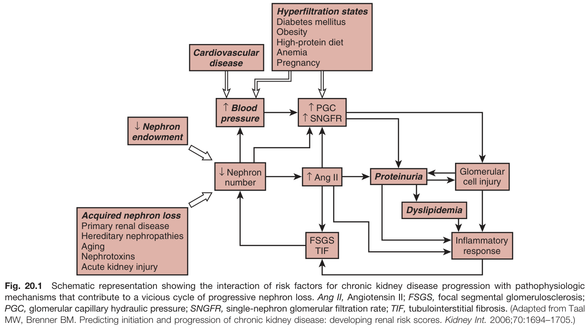

Fig. 20.1 Schematic representation showing the interaction of risk factors for chronic kidney disease progression with pathophysiologic mechanisms that contribute to a vicious cycle of progressive nephron loss. Ang II, Angiotensin II; FSGS, focal segmental glomerulosclerosis; PGC, glomerular capillary hydraulic pressure; SNGFR, single-nephron glomerular filtration rate; TIF, tubulointerstitial fibrosis. (Adapted from Taal MW, Brenner BM. Predicting initiation and progression of chronic kidney disease: developing renal risk scores. Kidney Int. 2006;70:1694-1705.)

---

### Fig_20_2

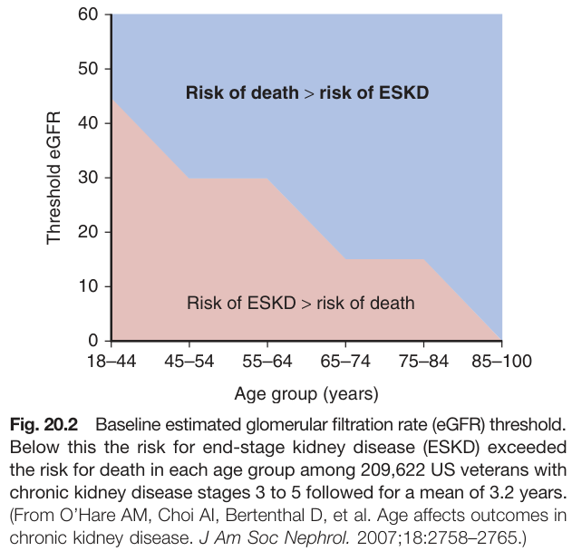

Fig. 20.2 Baseline estimated glomerular filtration rate (eGFR) threshold. Below this the risk for end-stage kidney disease (ESKD) exceeded the risk for death in each age group among 209,622 US veterans with chronic kidney disease stages 3 to 5 followed for a mean of 3.2 years. (From O'Hare AM, Choi Al, Bertenthal D, et al. Age affects outcomes in chronic kidney disease. J Am Soc Nephrol. 2007;18:2758-2765.)

---

### Fig_20_3

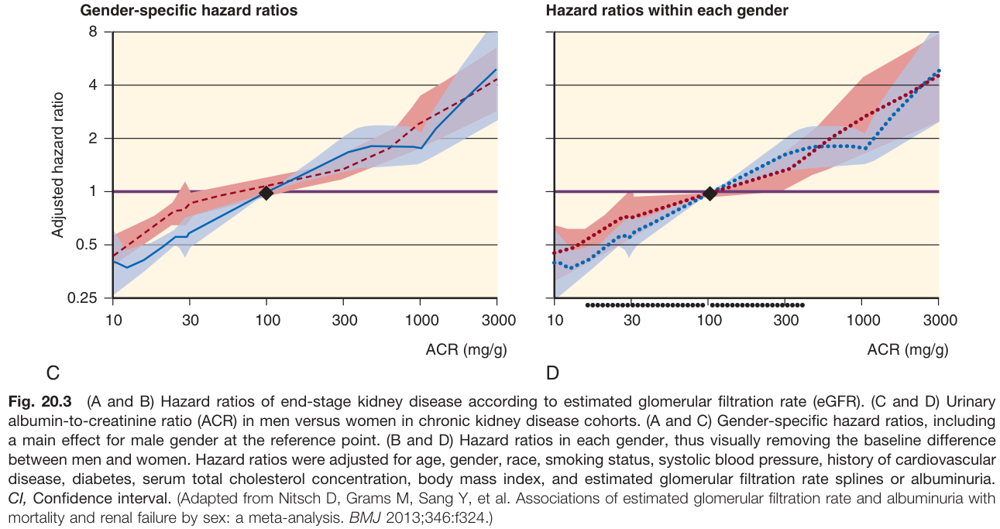

Fig. 20.3 (A and B) Hazard ratios of end-stage kidney disease according to estimated glomerular filtration rate (eGFR). (C and D) Urinary albumin-to-creatinine ratio (ACR) in men versus women in chronic kidney disease cohorts. (A and C) Gender-specific hazard ratios, including a main effect for male gender at the reference point. (B and D) Hazard ratios in each gender, thus visually removing the baseline difference between men and women. Hazard ratios were adjusted for age, gender, race, smoking status, systolic blood pressure, history of cardiovascular disease, diabetes, serum total cholesterol concentration, body mass index, and estimated glomerular filtration rate splines or albuminuria. Cl, Confidence interval. (Adapted from Nitsch D, Grams M, Sang Y, et al. Associations of estimated glomerular filtration rate and albuminuria with mortality and renal failure by sex: a meta-analysis. BMJ 2013;346:f324.)

---

### Fig_20_4

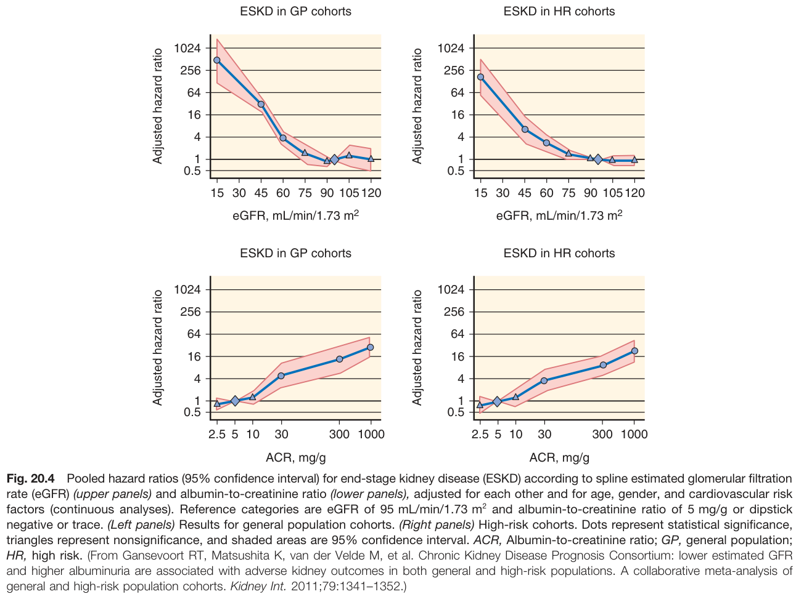

Fig. 20.4 Pooled hazard ratios (95% confidence interval) for end-stage kidney disease (ESKD) according to spline estimated glomerular filtration rate (eGFR) (upper panels) and albumin-to-creatinine ratio (lower panels), adjusted for each other and for age, gender, and cardiovascular risk factors (continuous analyses). Reference categories are eGFR of 95 mL/min/1.73 m² and albumin-to-creatinine ratio of 5 mg/g or dipstick negative or trace. (Left panels) Results for general population cohorts. (Right panels) High-risk cohorts. Dots represent statistical significance, triangles represent nonsignificance, and shaded areas are 95% confidence interval. ACR, Albumin-to-creatinine ratio; GP, general population; HR, high risk. (From Gansevoort RT, Matsushita K, van der Velde M, et al. Chronic Kidney Disease Prognosis Consortium: lower estimated GFR and higher albuminuria are associated with adverse kidney outcomes in both general and high-risk populations. A collaborative meta-analysis of general and high-risk population cohorts. Kidney Int. 2011;79:1341-1352.)

---

### Fig_20_5

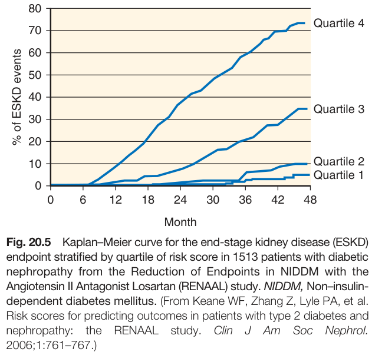

Fig. 20.5 Kaplan-Meier curve for the end-stage kidney disease (ESKD) endpoint stratified by quartile of risk score in 1513 patients with diabetic nephropathy from the Reduction of Endpoints in NIDDM with the Angiotensin II Antagonist Losartan (RENAAL) study. NIDDM, Non-insulin-dependent diabetes mellitus. (From Keane WF, Zhang Z, Lyle PA, et al. Risk scores for predicting outcomes in patients with type 2 diabetes and nephropathy: the RENAAL study. Clin J Am Soc Nephrol. 2006;1:761-767.)

---

### Fig_20_6

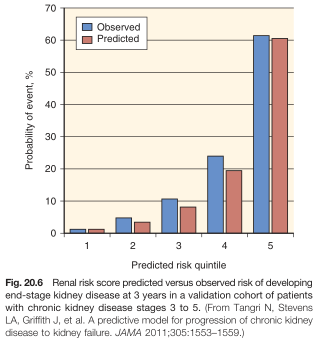

Fig. 20.6 Renal risk score predicted versus observed risk of developing end-stage kidney disease at 3 years in a validation cohort of patients with chronic kidney disease stages 3 to 5. (From Tangri N, Stevens LA, Griffith J, et al. A predictive model for progression of chronic kidney disease to kidney failure. JAMA 2011;305:1553-1559.)

---

### Fig_20_7

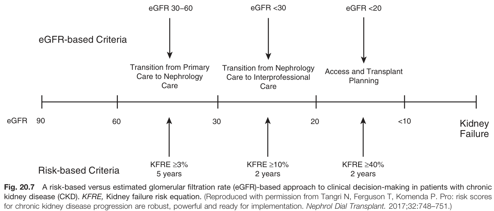

Fig. 20.7 A risk-based versus estimated glomerular filtration rate (eGFR)-based approach to clinical decision-making in patients with chronic kidney disease (CKD). KFRE, Kidney failure risk equation. (Reproduced with permission from Tangri N, Ferguson T, Komenda P. Pro: risk scores for chronic kidney disease progression are robust, powerful and ready for implementation. Nephrol Dial Transplant. 2017;32:748-751.)

---

## Tables

### Table_20_1

#### Table Image

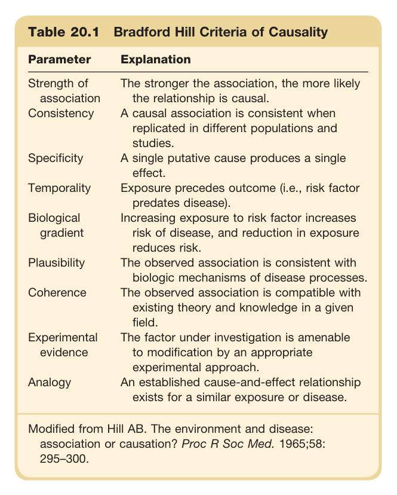

#### Table Data (CSV: [Table_20_1.csv](Table_20_1.csv))

```markdown
| Table Text (OCR) |
| :--- |
| Table 20.1 Bradford Hill Criteria of Causality Parameter  Explanation    Strength of association  The stronger the association, the more likely the relationship is causal.    Consistency  A causal association is consistent when replicated in different populations and studies.    Specificity  A single putative cause produces a single effect.    Temporality  Exposure precedes outcome (i.e., risk factor predates disease).    Biological gradient  Increasing exposure to risk factor increases risk of disease, and reduction in exposure reduces risk.    Plausibility  The observed association is consistent with biologic mechanisms of disease processes.    Coherence  The observed association is compatible with existing theory and knowledge in a given field.    Experimental evidence  The factor under investigation is amenable to modification by an appropriate experimental approach.    Analogy  An established cause-and-effect relationship exists for a similar exposure or disease. Modified from Hill AB. The environment and disease: association or causation? Proc R Soc Med. 1965;58: 295–300. |
```

Table 20.1 Bradford Hill Criteria of Causality | Parameter | Explanation | | :--- | :--- | | **Strength of association** | The stronger the association, the more likely the relationship is causal. | | **Consistency** | A causal association is consistent when replicated in different populations and studies. | | **Specificity** | A single putative cause produces a single effect. | | **Temporality** | Exposure precedes outcome (i.e., risk factor predates disease). | | **Biological gradient** | Increasing exposure to risk factor increases risk of disease, and reduction in exposure reduces risk. | | **Plausibility** | The observed association is consistent with biologic mechanisms of disease processes. | | **Coherence** | The observed association is compatible with existing theory and knowledge in a given field. | | **Experimental evidence** | The factor under investigation is amenable to modification by an appropriate experimental approach. | | **Analogy** | An established cause-and-effect relationship exists for a similar exposure or disease. | Modified from Hill AB. The environment and disease: association or causation? Proc R Soc Med. 1965;58: 295-300.

---

### Table_20_2

#### Table Image

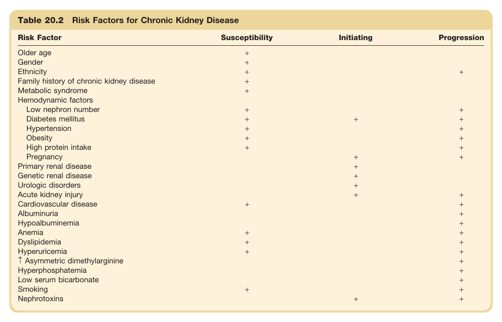

#### Table Data (CSV: [Table_20_2.csv](Table_20_2.csv))

```markdown
| Table Text (OCR) |
| :--- |
| Table 20.2 Risk Factors for Chronic Kidney Disease Risk Factor  Susceptibility  Initiating  Progression    Older age  +        Gender  +        Ethnicity  +    +    Family history of chronic kidney disease  +        Metabolic syndrome  +        Hemodynamic factors          Low nephron number  +    +    Diabetes mellitus  +  +  +    Hypertension  +    +    Obesity  +    +    High protein intake  +    +    Pregnancy    +  +    Primary renal disease    +      Genetic renal disease    +      Urologic disorders    +      Acute kidney injury    +  +    Cardiovascular disease  +    +    Albuminuria      +    Hypoalbuminemia      +    Anemia  +    +    Dyslipidemia  +    +    Hyperuricemia  +    +    ↑ Asymmetric dimethylarginine      +    Hyperphosphatemia      +    Low serum bicarbonate      +    Smoking  +    +    Nephrotoxins    +  + |
```

Table 20.2 Risk Factors for Chronic Kidney Disease | Risk Factor | Susceptibility | Initiating | Progression | | :--- | :--- | :--- | :--- | | Older age | + | | | | Gender | + | | + | | Ethnicity | + | | + | | Family history of chronic kidney disease | + | | | | Metabolic syndrome | + | | + | | **Hemodynamic factors** | | | | | Low nephron number | + | | + | | Diabetes mellitus | + | + | + | | Hypertension | + | | + | | Obesity | + | | + | | High protein intake | + | | + | | Pregnancy | + | | + | | Primary renal disease | | + | | | Genetic renal disease | | + | | | Urologic disorders | | + | | | Acute kidney injury | | + | | | Cardiovascular disease | + | | + | | Albuminuria | | | + | | Hypoalbuminemia | | | + | | Anemia | + | | + | | Dyslipidemia | + | | + | | Hyperuricemia | + | | + | | ↑ Asymmetric dimethylarginine | | | + | | Hyperphosphatemia | | | + | | Low serum bicarbonate | | | + | | Smoking | + | | + | | Nephrotoxins | | + | + |

---

### Table_20_3

#### Table Image

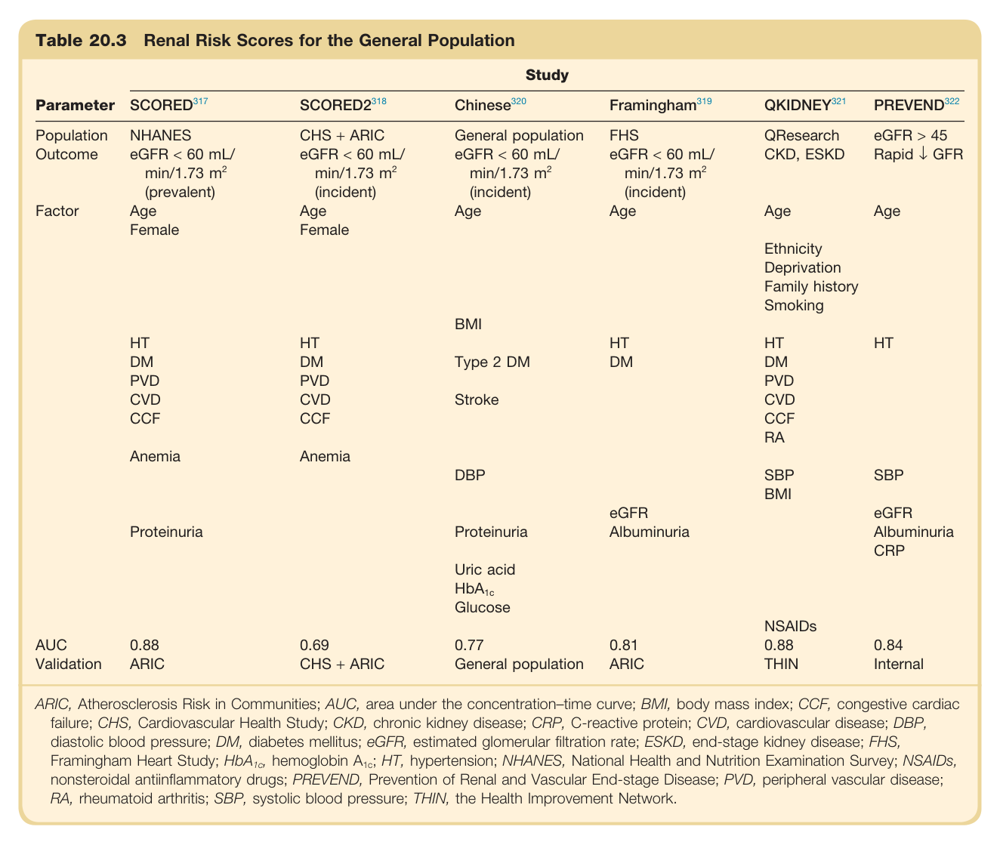

#### Table Data (CSV: [Table_20_3.csv](Table_20_3.csv))

```markdown
| Table Text (OCR) |
| :--- |
| Table 20.3 Renal Risk Scores for the General Population Parameter   SCORED^{317}    SCORED2^{318}    Chinese^{320}    Framingham^{319}    QKIDNEY^{321}    PREVEND^{322}     Population Outcome  NHANESeGFR < 60 mL/min/1.73  m^2 (prevalent)  CHS + ARICeGFR < 60 mL/min/1.73  m^2 (incident)  General populationeGFR < 60 mL/min/1.73  m^2 (incident)  FHSeGFR < 60 mL/min/1.73  m^2 (incident)  QResearchCKD, ESKD  eGFR > 45Rapid ↓ GFR    Factor  AgeFemale  AgeFemale  Age  Age  AgeEthnicityDeprivationFamily historySmoking  Age    BMI      HT  HT    HT  HT  HT    DM  DM  Type 2 DM  DM  DM      PVD  PVD      PVD      CVD  CVD  Stroke    CVD      CCF  CCF      CCFRA      Anemia  Anemia            DBP    SBP  SBP      eGFR    eGFR    Proteinuria    Proteinuria  Albuminuria    AlbuminuriaCRP      Uric acid HbA_{1c} Glucose                NSAIDs      AUC  0.88  0.69  0.77  0.81  0.88  0.84    Validation  ARIC  CHS + ARIC  General population  ARIC  THIN  Internal ARIC, Atherosclerosis Risk in Communities; AUC, area under the concentration–time curve; BMI, body mass index; CCF, congestive cardiac failure; CHS, Cardiovascular Health Study; CKD, chronic kidney disease; CRP, C-reactive protein; CVD, cardiovascular disease; DBP, diastolic blood pressure; DM, diabetes mellitus; eGFR, estimated glomerular filtration rate; ESKD, end-stage kidney disease; FHS, Framingham Heart Study; HbA , hemoglobin A ; HT, hypertension; NHANES, National Health and Nutrition Examination Survey; NSAIDs, nonsteroidal antiinflammatory drugs; PREVEND, Prevention of Renal and Vascular End-stage Disease; PVD, peripheral vascular disease; RA, rheumatoid arthritis; SBP, systolic blood pressure; THIN, the Health Improvement Network. |
```

Table 20.3 Renal Risk Scores for the General Population | Parameter | SCORED | SCORED2 | Chinese | Framingham | QKIDNEY | PREVEND | | :--- | :--- | :--- | :--- | :--- | :--- | :--- | | **Study** | | | | | | | | **Population** | NHANES | CHS + ARIC | General population | FHS | QResearch | eGFR > 45 | | **Outcome** | eGFR < 60 mL/min/1.73 m² (prevalent) | eGFR < 60 mL/min/1.73 m² (incident) | eGFR < 60 mL/min/1.73 m² (incident) | eGFR < 60 mL/min/1.73 m² (incident) | CKD, ESKD | Rapid ↓ GFR | | **Factor** | Age, Female | Age, Female | Age | Age | Age | Age | | | HT, DM, PVD, CVD, CCF | HT, DM, PVD, CVD, CCF | BMI, Type 2 DM, Stroke | HT, DM | Ethnicity, Deprivation, Family history, Smoking | HT | | | Anemia | Anemia | DBP | | HT, DM, PVD, CVD, CCF, RA | SBP | | | Proteinuria | | Proteinuria, Uric acid, HbA1c, Glucose | eGFR, Albuminuria | SBP, BMI, NSAIDs | eGFR, Albuminuria, CRP | | **AUC** | 0.88 | 0.69 | 0.77 | 0.81 | 0.88 | 0.84 | | **Validation** | ARIC | CHS + ARIC | General population | ARIC | THIN | Internal | ARIC, Atherosclerosis Risk in Communities; AUC, area under the concentration-time curve; BMI, body mass index; CCF, congestive cardiac failure; CHS, Cardiovascular Health Study; CKD, chronic kidney disease; CRP, C-reactive protein; CVD, cardiovascular disease; DBP, diastolic blood pressure; DM, diabetes mellitus; eGFR, estimated glomerular filtration rate; ESKD, end-stage kidney disease; FHS, Framingham Heart Study; HbA1c, hemoglobin A1c; HT, hypertension; NHANES, National Health and Nutrition Examination Survey; NSAIDs, nonsteroidal antiinflammatory drugs; PREVEND, Prevention of Renal and Vascular End-stage Disease; PVD, peripheral vascular disease; RA, rheumatoid arthritis; SBP, systolic blood pressure; THIN, the Health Improvement Network.

---

### Table_20_4

#### Table Image

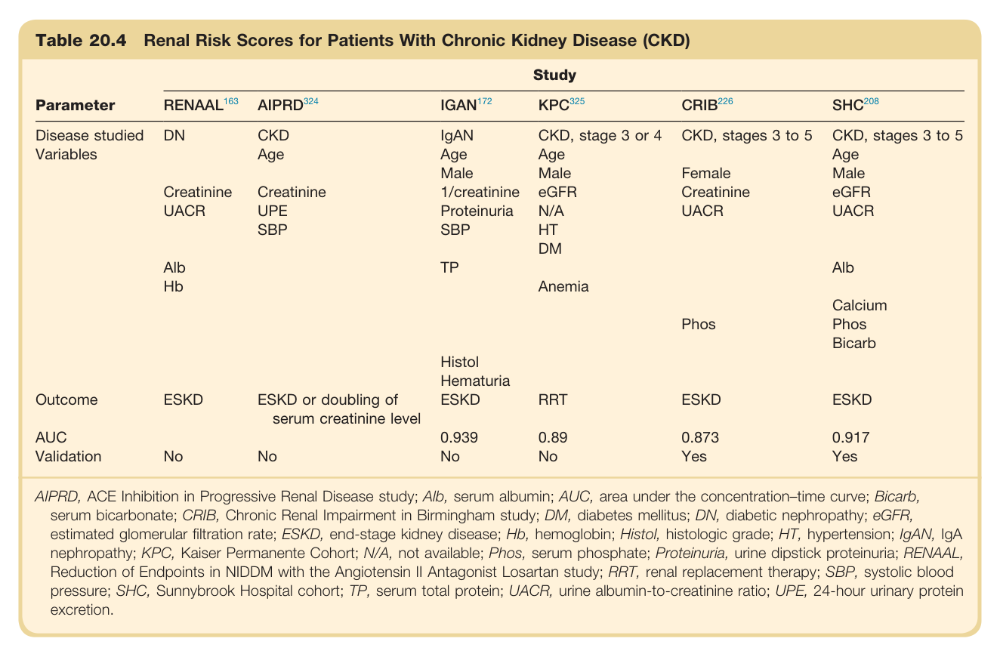

#### Table Data (CSV: [Table_20_4.csv](Table_20_4.csv))

```markdown
| Table Text (OCR) |
| :--- |
| Table 20.4 Renal Risk Scores for Patients With Chronic Kidney Disease (CKD) Parameter  Study     RENAAL^{163}    AIPRD^{324}    IGAN^{172}    KPC^{325}    CRIB^{226}    SHC^{208}     Disease studied  DN  CKD  IgAN  CKD, stage 3 or 4  CKD, stages 3 to 5  CKD, stages 3 to 5    Variables    Age  Age  Age    Age          Male  Male  Female  Male      Creatinine  Creatinine  1/creatinine  eGFR  Creatinine  eGFR      UACR  UPE  Proteinuria  N/A  UACR  UACR        SBP  SBP  HT                DM          Alb    TP      Alb      Hb      Anemia                  Phos  Calcium                Phos                Bicarb          Histol                Hematuria          Outcome  ESKD  ESKD or doubling of serum creatinine level  ESKD  RRT  ESKD  ESKD    AUC      0.939  0.89  0.873  0.917    Validation  No  No  No  No  Yes  Yes AIPRD, ACE Inhibition in Progressive Renal Disease study; Alb, serum albumin; AUC, area under the concentration–time curve; Bicarb, serum bicarbonate; CRIB, Chronic Renal Impairment in Birmingham study; DM, diabetes mellitus; DN, diabetic nephropathy; eGFR, estimated glomerular filtration rate; ESKD, end-stage kidney disease; Hb, hemoglobin; Histol, histologic grade; HT, hypertension; IgAN, IgA nephropathy; KPC, Kaiser Permanente Cohort; N/A, not available; Phos, serum phosphate; Proteinuria, urine dipstick proteinuria; RENAAL, Reduction of Endpoints in NIDDM with the Angiotensin II Antagonist Losartan study; RRT, renal replacement therapy; SBP, systolic blood pressure; SHC, Sunnybrook Hospital cohort; TP, serum total protein; UACR, urine albumin-to-creatinine ratio; UPE, 24-hour urinary protein excretion. |
```

Table 20.4 Renal Risk Scores for Patients With Chronic Kidney Disease (CKD) | Parameter | RENAAL | AIPRD | IGAN | KPC | CRIB | SHC | | :--- | :--- | :--- | :--- | :--- | :--- | :--- | | **Study** | | | | | | | | **Disease studied** | DN | CKD | IgAN | CKD, stage 3 or 4 | CKD, stages 3 to 5 | CKD, stages 3 to 5 | | **Variables** | Creatinine, UACR, Alb, Hb | Age, Creatinine, UPE, SBP | Age, Male, Creatinine, Proteinuria, SBP, TP, Histol, Hematuria | Age, Male, 1/creatinine, N/A, HT, DM, Anemia | Age, Male, Female, eGFR, Creatinine, UACR, Phos | Age, Male, eGFR, UACR, Alb, Calcium, Phos, Bicarb | | **Outcome** | ESKD | ESKD or doubling of serum creatinine level | ESKD | RRT | ESKD | ESKD | | **AUC** | | | 0.939 | 0.89 | 0.873 | 0.917 | | **Validation** | No | No | No | No | Yes | Yes | AIPRD, ACE Inhibition in Progressive Renal Disease study; Alb, serum albumin; AUC, area under the concentration-time curve; Bicarb, serum bicarbonate; CRIB, Chronic Renal Impairment in Birmingham study; DM, diabetes mellitus; DN, diabetic nephropathy; eGFR, estimated glomerular filtration rate; ESKD, end-stage kidney disease; Hb, hemoglobin; Histol, histologic grade; HT, hypertension; IgAN, IgA nephropathy; KPC, Kaiser Permanente Cohort; N/A, not available; Phos, serum phosphate; Proteinuria, urine dipstick proteinuria; RENAAL, Reduction of Endpoints in NIDDM with the Angiotensin II Antagonist Losartan study; RRT, renal replacement therapy; SBP, systolic blood pressure; SHC, Sunnybrook Hospital cohort; TP, serum total protein; UACR, urine albumin-to-creatinine ratio; UPE, 24-hour urinary protein excretion.

---

### Table_20_5

#### Table Image

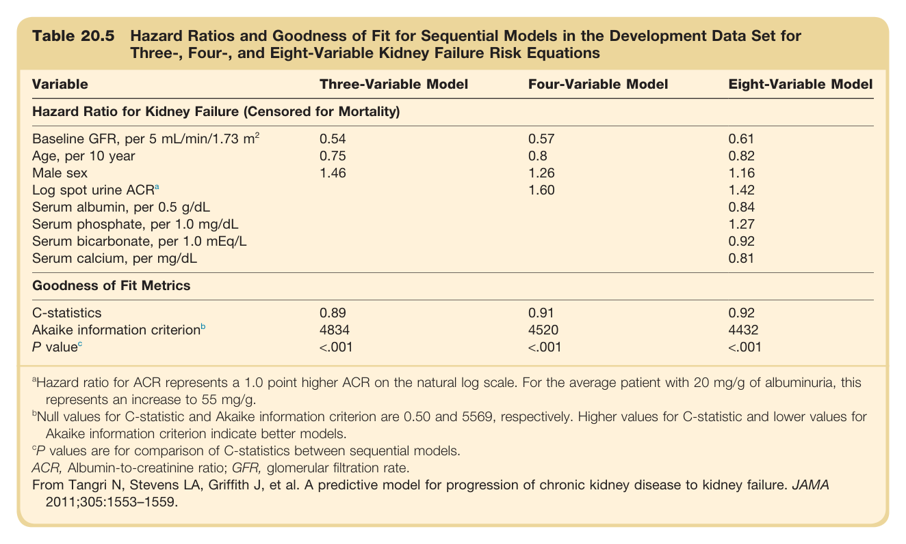

#### Table Data (CSV: [Table_20_5.csv](Table_20_5.csv))

```markdown
| Table Text (OCR) |
| :--- |
| Table 20.5 Hazard Ratios and Goodness of Fit for Sequential Models in the Development Data Set for Three-, Four-, and Eight-Variable Kidney Failure Risk Equations Variable  Three-Variable Model  Four-Variable Model  Eight-Variable Model    Hazard Ratio for Kidney Failure (Censored for Mortality)    Baseline GFR, per 5 mL/min/1.73  m^2   0.54  0.57  0.61    Age, per 10 year  0.75  0.8  0.82    Male sex  1.46  1.26  1.16    Log spot urine  ACR^a     1.60  1.42    Serum albumin, per 0.5 g/dL      0.84    Serum phosphate, per 1.0 mg/dL      1.27    Serum bicarbonate, per 1.0 mEq/L      0.92    Serum calcium, per mg/dL      0.81    Goodness of Fit Metrics    C-statistics  0.89  0.91  0.92    Akaike information  criterion^b   4834  4520  4432     P\ value^c   <.001  <.001  <.001 <sup>a</sup>Hazard ratio for ACR represents a 1.0 point higher ACR on the natural log scale. For the average patient with 20 mg/g of albuminuria, this represents an increase to 55 mg/g. <sup>b</sup>Null values for C-statistic and Akaike information criterion are 0.50 and 5569, respectively. Higher values for C-statistic and lower values for Akaike information criterion indicate better models. <sup>c</sup>P values are for comparison of C-statistics between sequential models. ACR, Albumin-to-creatinine ratio; GFR, glomerular filtration rate. From Tangri N, Stevens LA, Griffith J, et al. A predictive model for progression of chronic kidney disease to kidney failure. JAMA 2011;305:1553–1559. |
```

Table 20.5 Hazard Ratios and Goodness of Fit for Sequential Models in the Development Data Set for Three-, Four-, and Eight-Variable Kidney Failure Risk Equations | Variable | Three-Variable Model | Four-Variable Model | Eight-Variable Model | | :--- | :--- | :--- | :--- | | **Hazard Ratio for Kidney Failure (Censored for Mortality)** | | | | | Baseline GFR, per 5 mL/min/1.73 m² | 0.54 | 0.57 | 0.61 | | Age, per 10 year | 0.75 | 0.8 | 0.82 | | Male sex | 1.46 | 1.26 | 1.16 | | Log spot urine ACRª | | 1.60 | 1.42 | | Serum albumin, per 0.5 g/dL | | | 0.84 | | Serum phosphate, per 1.0 mg/dL | | | 1.27 | | Serum bicarbonate, per 1.0 mEq/L | | | 0.92 | | Serum calcium, per mg/dL | | | 0.81 | | **Goodness of Fit Metrics** | | | | | C-statistics | 0.89 | 0.91 | 0.92 | | Akaike information criterion | 4834 | 4520 | 4432 | | P value | <.001 | <.001 | <.001 | Hazard ratio for ACR represents a 1.0 point higher ACR on the natural log scale. For the average patient with 20 mg/g of albuminuria, this represents an increase to 55 mg/g. Null values for C-statistic and Akaike information criterion are 0.50 and 5569, respectively. Higher values for C-statistic and lower values for Akaike information criterion indicate better models. °P values are for comparison of C-statistics between sequential models. ACR, Albumin-to-creatinine ratio; GFR, glomerular filtration rate. From Tangri N, Stevens LA, Griffith J, et al. A predictive model for progression of chronic kidney disease to kidney failure. JAMA 2011;305:1553-1559.

---
