# 21. Developmental Programming of Blood Pressure and Renal Function Through the Life Course - Figures and Tables Index

This document lists all figures and tables extracted from `21. Developmental Programming of Blood Pressure and Renal Function Through the Life Course.pdf`.

## Table of Contents
- [Figures](#figures)
- [Tables](#tables)

---

## Figures

### Fig_21_1

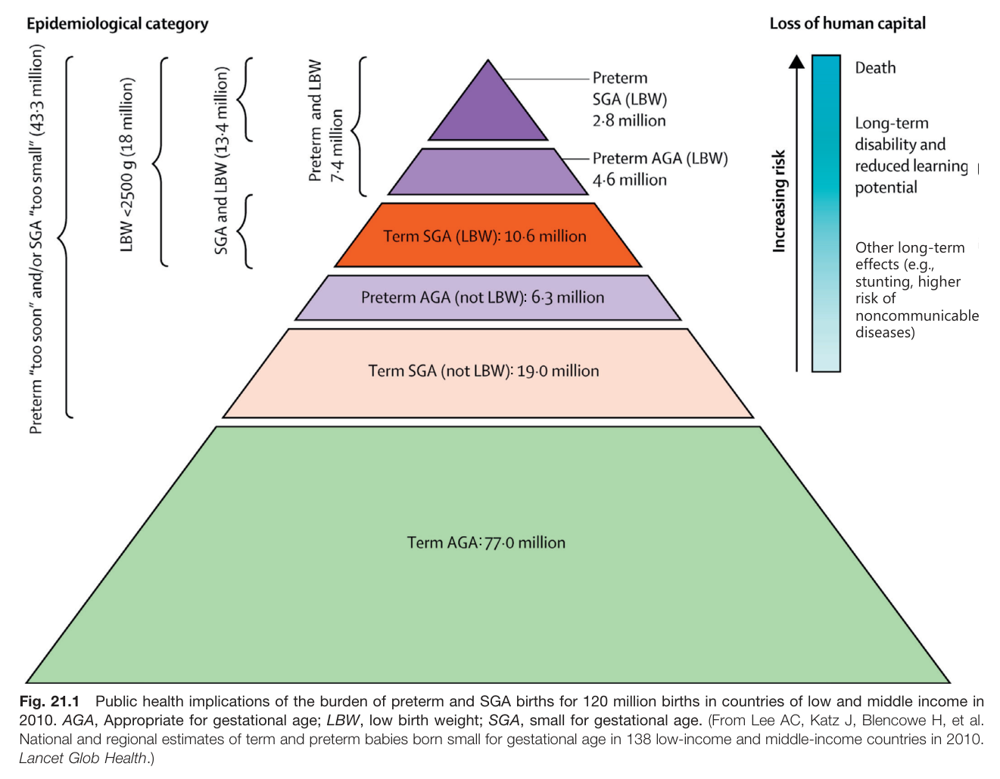

Fig. 21.1 Public health implications of the burden of preterm and SGA births for 120 million births in countries of low and middle income in 2010. This figure is a pyramid diagram illustrating the loss of human capital associated with different categories of birth. The base of the pyramid represents the largest group with the lowest risk, and the top represents the smallest group with the highest risk. **Epidemiological category (from top to bottom):** * **Top (Highest Risk):** * Preterm SGA (LBW): 2.8 million * Preterm AGA (LBW): 4-6 million * **Second Level:** * Term SGA (LBW): 10.6 million * **Third Level:** * Preterm AGA (not LBW): 6.3 million * **Fourth Level:** * Term SGA (not LBW): 19.0 million * **Base (Lowest Risk):** * Term AGA: 77.0 million **Associated Loss of human capital (from top to bottom):** * Death * Long-term disability and reduced learning potential * Other long-term effects (e.g., stunting, higher risk of noncommunicable diseases) A side bar indicates the scale of the issue: * Preterm "too soon" and/or SGA "too small" (43.3 million) * LBW <2500 g (18 million) * SGA and LBW (13.4 million) * Preterm and LBW 7.4 million AGA, Appropriate for gestational age; LBW, low birth weight; SGA, small for gestational age. (From Lee AC, Katz J, Blencowe H, et al. National and regional estimates of term and preterm babies born small for gestational age in 138 low-income and middle-income countries in 2010. Lancet Glob Health.)

---

### Fig_21_2

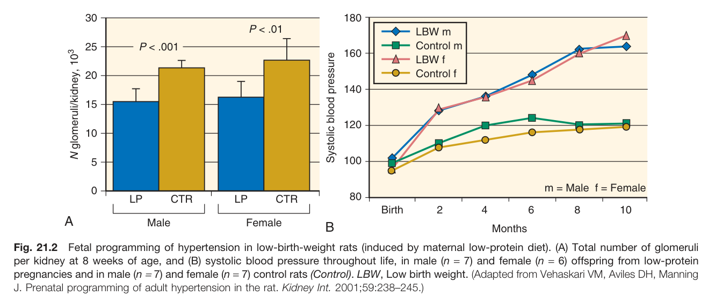

Fig. 21.2 Fetal programming of hypertension in low-birth-weight rats (induced by maternal low-protein diet). (A) A bar chart shows the total number of glomeruli per kidney at 8 weeks of age in male and female rats from low-protein (LP) and control (CTR) pregnancies. In males, the LP group had significantly fewer glomeruli than the CTR group (P < .001). In females, the LP group also had significantly fewer glomeruli than the CTR group (P < .01). (B) A line graph shows systolic blood pressure throughout life in male (m) and female (f) offspring from low-birth-weight (LBW) and control groups. The LBW male and female rats had consistently higher systolic blood pressure from 2 to 10 months of age compared to their respective controls. LBW, Low birth weight. (Adapted from Vehaskari VM, Aviles DH, Manning J. Prenatal programming of adult hypertension in the rat. Kidney Int. 2001;59:238-245.)

---

### Fig_21_3

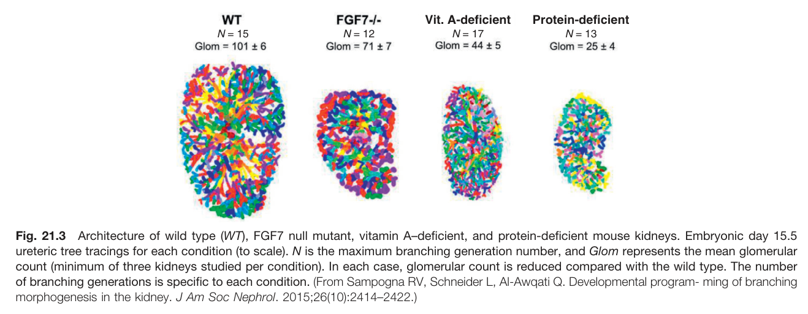

Fig. 21.3 Architecture of wild type (WT), FGF7 null mutant, vitamin A-deficient, and protein-deficient mouse kidneys. Embryonic day 15.5 ureteric tree tracings for each condition (to scale). N is the maximum branching generation number, and Glom represents the mean glomerular count (minimum of three kidneys studied per condition). In each case, glomerular count is reduced compared with the wild type. The number of branching generations is specific to each condition. * **WT:** N=15, Glom 101 ± 6 * **FGF7-/-:** N=12, Glom 71 ± 7 * **Vit. A-deficient:** N=17, Glom 44 ± 5 * **Protein-deficient:** N=13, Glom 25 ± 4 (From Sampogna RV, Schneider L, Al-Awqati Q. Developmental program- ming of branching morphogenesis in the kidney. J Am Soc Nephrol. 2015;26(10):2414-2422.)

---

### Fig_21_4

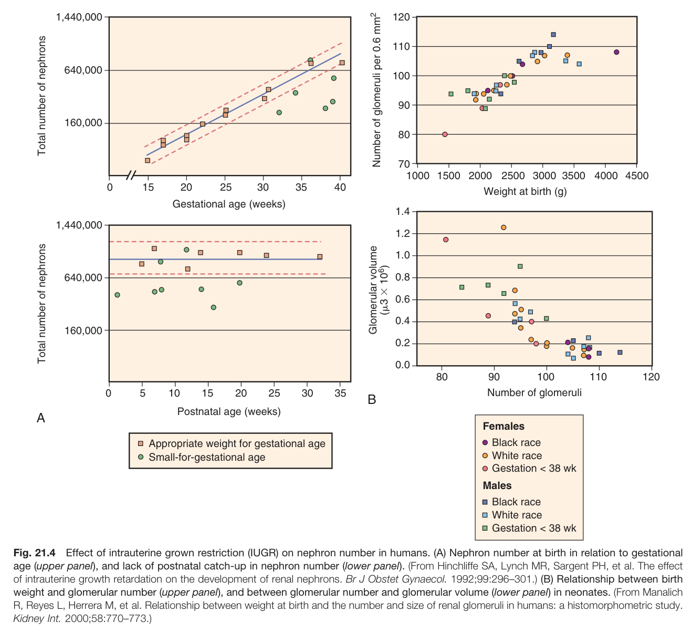

Fig. 21.4 Effect of intrauterine grown restriction (IUGR) on nephron number in humans. (A) Two graphs are shown. The upper panel shows a positive correlation between nephron number at birth and gestational age. The lower panel shows that there is no change in nephron number with postnatal age, indicating a lack of postnatal catch-up. (B) Two scatterplots are shown. The upper panel shows a positive correlation between birth weight and the number of glomeruli. The lower panel shows an inverse correlation between the number of glomeruli and glomerular volume in neonates. (From Hinchliffe SA, Lynch MR, Sargent PH, et al. The effect of intrauterine growth retardation on the development of renal nephrons. Br J Obstet Gynaecol. 1992;99:296-301.) (B) (From Manalich R, Reyes L, Herrera M, et al. Relationship between weight at birth and the number and size of renal glomeruli in humans: a histomorphometric study. Kidney Int. 2000;58:770-773.)

---

### Fig_21_5

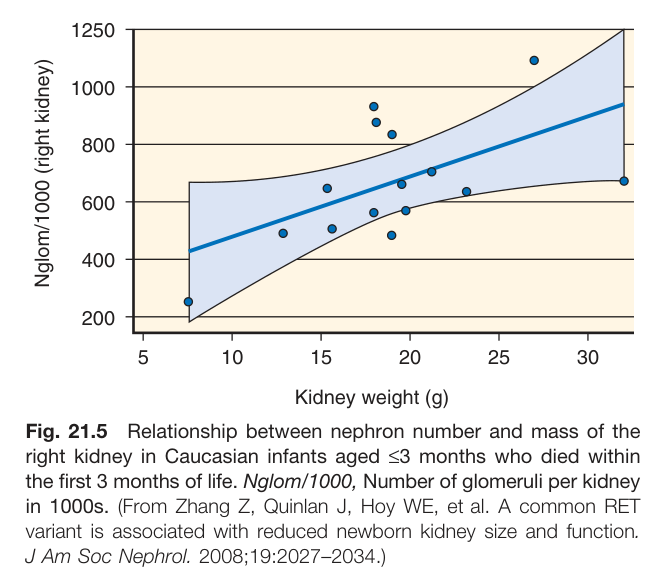

Fig. 21.5 Relationship between nephron number and mass of the right kidney in Caucasian infants aged ≤3 months who died within the first 3 months of life. A scatter plot shows a positive linear correlation between kidney weight (g) on the x-axis and the number of glomeruli per kidney (Nglom/1000) on the y-axis. As kidney weight increases, the number of glomeruli also increases. (From Zhang Z, Quinlan J, Hoy WE, et al. A common RET variant is associated with reduced newborn kidney size and function. J Am Soc Nephrol. 2008;19:2027-2034.)

---

### Fig_21_6

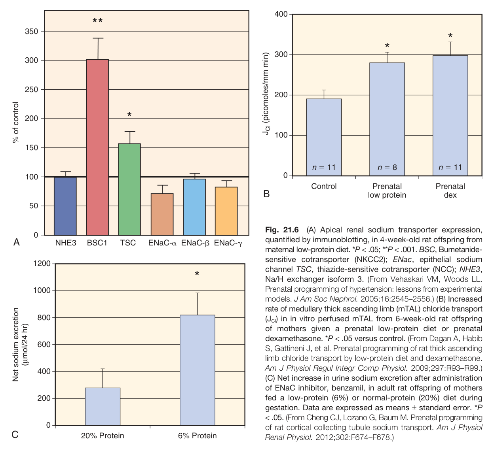

Fig. 21.6 (A) Apical renal sodium transporter expression, quantified by immunoblotting, in 4-week-old rat offspring from maternal low-protein diet. (A) A bar chart shows the percent of control for various sodium transporters. NHE3 and ENaC-α, -β, and -γ are around 100%. BSC1 is significantly increased to ~300% (**P < .001**). TSC is significantly increased to ~150% (*P < .05*). (B) A bar chart shows the rate of chloride transport in the medullary thick ascending limb. Both prenatal low protein and prenatal dexamethasone groups show significantly increased transport compared to the control group (*P < .05*). (C) A bar chart shows net sodium excretion after administration of an ENaC inhibitor. The 6% protein group shows significantly higher sodium excretion compared to the 20% protein group (*P < .05*). (From Vehaskari VM, Woods LL. Prenatal programming of hypertension: lessons from experimental models. J Am Soc Nephrol. 2005;16:2545-2556.) (B) (From Dagan A, Habib S, Gattineni J, et al. Prenatal programming of rat thick ascending limb chloride transport by low-protein diet and dexamethasone. Am J Physiol Regul Integr Comp Physiol. 2009;297:R93-R99.) (C) (From Cheng CJ, Lozano G, Baum M. Prenatal programming of rat cortical collecting tubule sodium transport. Am J Physiol Renal Physiol. 2012;302:F674-F678.)

---

### Fig_21_7

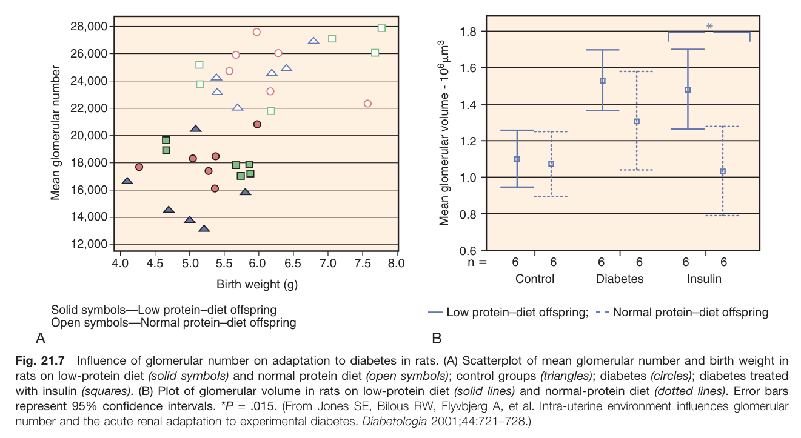

Fig. 21.7 Influence of glomerular number on adaptation to diabetes in rats. (A) A scatterplot shows the relationship between mean glomerular number and birth weight. There appears to be a general positive correlation, with higher birth weights associated with higher glomerular numbers. (B) A plot of glomerular volume in rats on low-protein diet (solid lines) and normal-protein diet (dotted lines) is shown for control, diabetic, and insulin-treated diabetic groups. In the low-protein diet group, diabetic rats had a significantly larger glomerular volume compared to controls and insulin-treated rats (*P = .015*). (From Jones SE, Bilous RW, Flyvbjerg A, et al. Intra-uterine environment influences glomerular number and the acute renal adaptation to experimental diabetes. Diabetologia 2001;44:721-728.)

---

### Fig_21_8

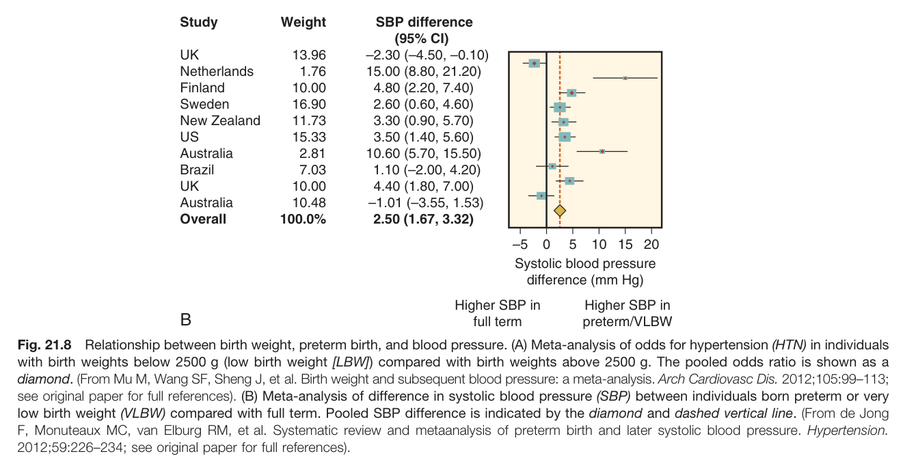

Fig. 21.8 Relationship between birth weight, preterm birth, and blood pressure. (A) A forest plot shows a meta-analysis of the odds for hypertension (HTN) in individuals with low birth weight (LBW) compared to normal birth weight. The overall pooled odds ratio is 1.21 (95% CI: 1.13, 1.30), indicating an increased risk of HTN with LBW. (B) A forest plot shows a meta-analysis of the difference in systolic blood pressure (SBP) between individuals born preterm or with very low birth weight (VLBW) compared with full term. The overall pooled SBP difference is 2.50 mmHg (95% CI: 1.67, 3.32), indicating higher SBP in the preterm/VLBW group. (From Mu M, Wang SF, Sheng J, et al. Birth weight and subsequent blood pressure: a meta-analysis. Arch Cardiovasc Dis. 2012;105:99-113; see original paper for full references). (B) (From de Jong F, Monuteaux MC, van Elburg RM, et al. Systematic review and metaanalysis of preterm birth and later systolic blood pressure. Hypertension. 2012;59:226-234; see original paper for full references).

---

### Fig_21_9

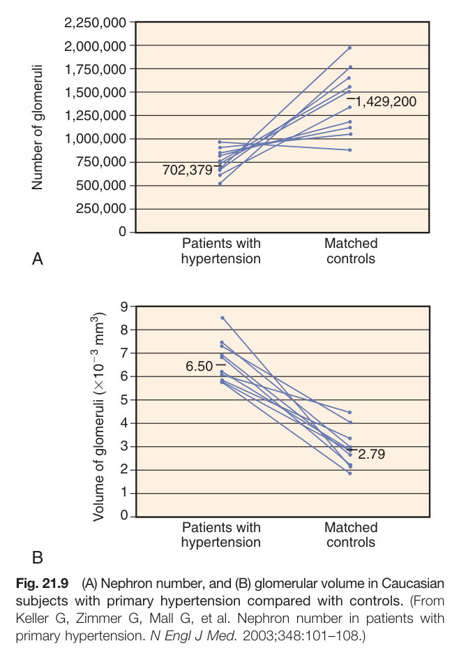

Fig. 21.9 (A) Nephron number, and (B) glomerular volume in Caucasian subjects with primary hypertension compared with controls. (A) A line graph shows the number of glomeruli for individual patients with hypertension and their matched controls. Patients with hypertension consistently have a lower number of glomeruli (mean 702,379) compared to matched controls (mean 1,429,200). (B) A line graph shows the volume of glomeruli for the same subjects. Patients with hypertension consistently have a larger glomerular volume (mean 6.50 x 10^-3 mm^3) compared to matched controls (mean 2.79 x 10^-3 mm^3). (From Keller G, Zimmer G, Mall G, et al. Nephron number in patients with primary hypertension. N Engl J Med. 2003;348:101-108.)

---

### Fig_21_10

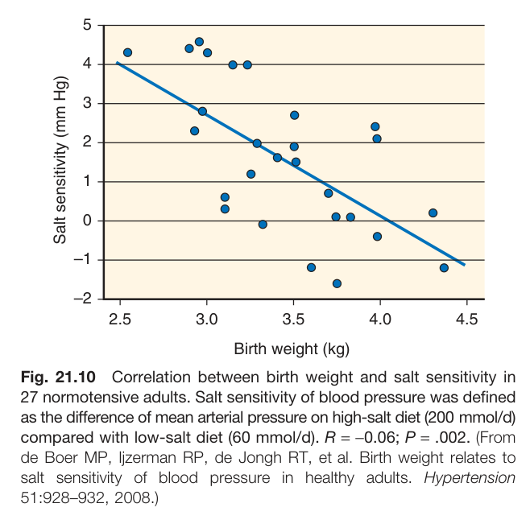

Fig. 21.10 Correlation between birth weight and salt sensitivity in 27 normotensive adults. A scatter plot shows an inverse correlation between birth weight (kg) and salt sensitivity (mm Hg). As birth weight increases, salt sensitivity of blood pressure decreases (R = −0.06; P = .002). (From de Boer MP, Ijzerman RP, de Jongh RT, et al. Birth weight relates to salt sensitivity of blood pressure in healthy adults. Hypertension 51:928-932, 2008.)

---

### Fig_21_11

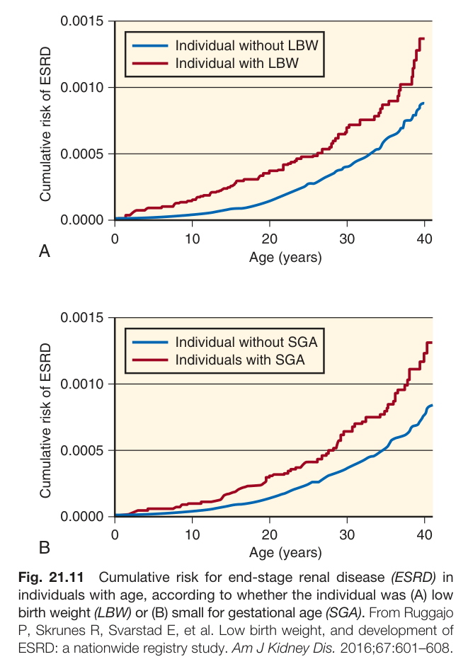

Fig. 21.11 Cumulative risk for end-stage renal disease (ESRD) in individuals with age, according to whether the individual was (A) low birth weight (LBW) or (B) small for gestational age (SGA). (A) A line graph shows the cumulative risk of ESRD over age. Individuals with LBW have a progressively higher cumulative risk of ESRD compared to individuals without LBW. (B) A similar line graph shows that individuals with SGA also have a progressively higher cumulative risk of ESRD compared to those without SGA. From Ruggajo P, Skrunes R, Svarstad E, et al. Low birth weight, and development of ESRD: a nationwide registry study. Am J Kidney Dis. 2016;67:601-608.

---

### Fig_21_12

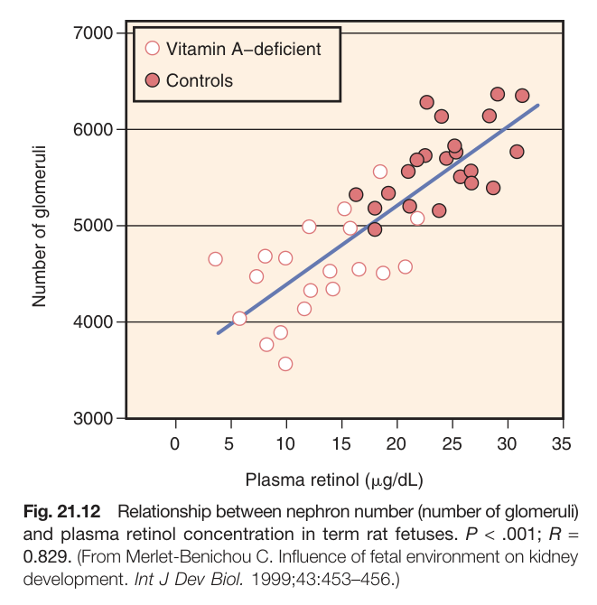

Fig. 21.12 Relationship between nephron number (number of glomeruli) and plasma retinol concentration in term rat fetuses. A scatter plot shows a strong positive correlation between plasma retinol concentration (µg/dL) and the number of glomeruli in term rat fetuses. As plasma retinol increases, the number of glomeruli increases (P < .001; R = 0.829). There are two groups shown: Vitamin A-deficient and Controls. (From Merlet-Benichou C. Influence of fetal environment on kidney development. Int J Dev Biol. 1999;43:453-456.)

---

### Fig_21_13

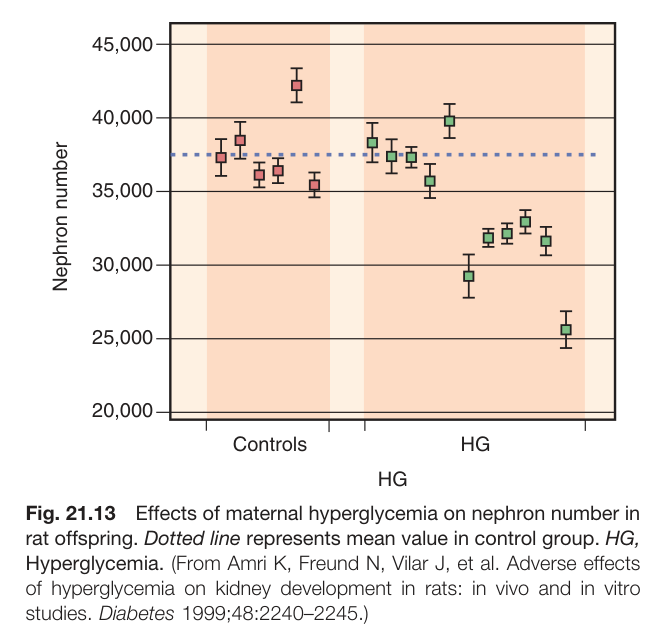

Fig. 21.13 Effects of maternal hyperglycemia on nephron number in rat offspring. A scatter plot shows the nephron number for individual rat offspring from control and hyperglycemic (HG) groups. The mean value for the control group is represented by a dotted line. Offspring from the HG group generally have a lower nephron number compared to the controls. (From Amri K, Freund N, Vilar J, et al. Adverse effects of hyperglycemia on kidney development in rats: in vivo and in vitro studies. Diabetes 1999;48:2240-2245.)

---

### Fig_21_14

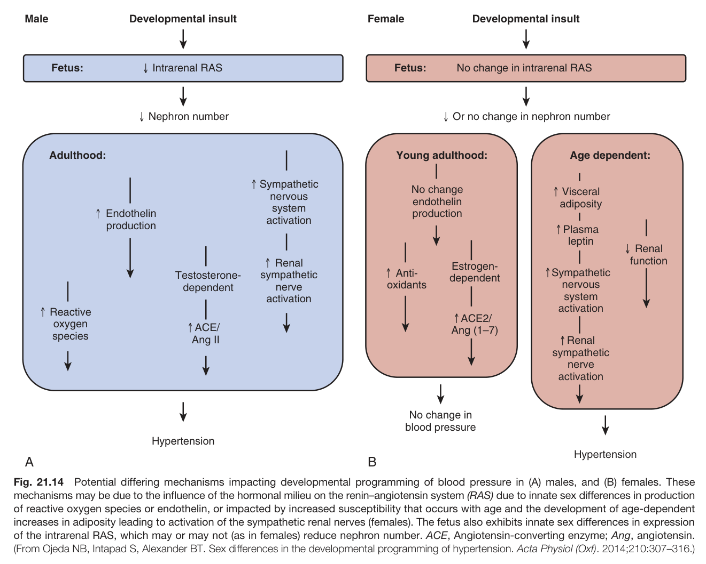

Fig. 21.14 Potential differing mechanisms impacting developmental programming of blood pressure in (A) males, and (B) females. This figure shows two flowcharts. (A) In males, a developmental insult leads to decreased intrarenal RAS and a lower nephron number in the fetus. In adulthood, this results in increased reactive oxygen species, endothelin production, and testosterone-dependent increases in ACE/Ang II. This leads to sympathetic nervous system activation and renal sympathetic nerve activation, ultimately causing hypertension. (B) In females, a developmental insult leads to no change in intrarenal RAS and a normal or slightly lower nephron number in the fetus. In young adulthood, there is no change in endothelin production, increased antioxidants, and estrogen-dependent increases in ACE2/Ang (1-7), resulting in no change in blood pressure. However, with age, increased visceral adiposity and plasma leptin lead to sympathetic nervous system activation, renal sympathetic nerve activation, and a decline in renal function, ultimately causing hypertension. (From Ojeda NB, Intapad S, Alexander BT. Sex differences in the developmental programming of hypertension. Acta Physiol (Oxf). 2014;210:307-316.)

---

### Fig_21_15

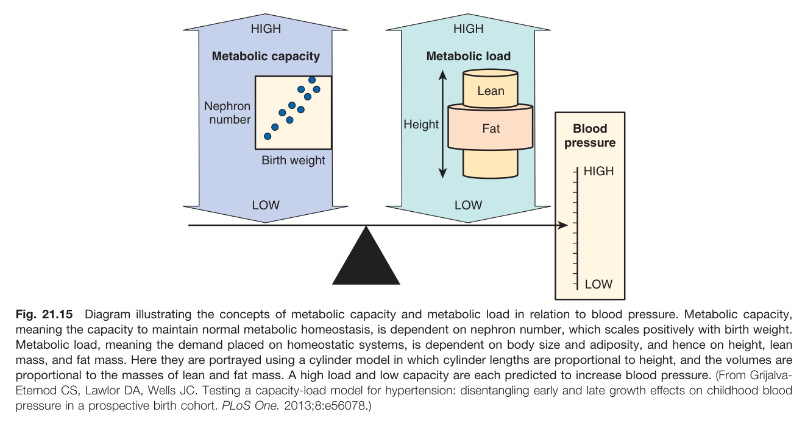

Fig. 21.15 Diagram illustrating the concepts of metabolic capacity and metabolic load in relation to blood pressure. This diagram shows two cylinders. The first, labeled "Metabolic capacity," is determined by nephron number, which is positively correlated with birth weight. High birth weight corresponds to high capacity, and low birth weight to low capacity. The second cylinder, labeled "Metabolic load," is determined by height, lean mass, and fat mass. The diagram illustrates that a high load and low capacity are each predicted to increase blood pressure. (From Grijalva-Eternod CS, Lawlor DA, Wells JC. Testing a capacity-load model for hypertension: disentangling early and late growth effects on childhood blood pressure in a prospective birth cohort. PLoS One. 2013;8:e56078.)

---

### Fig_21_16

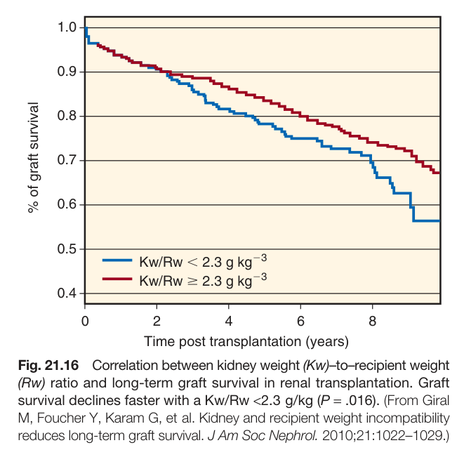

Fig. 21.16 Correlation between kidney weight (Kw)-to-recipient weight (Rw) ratio and long-term graft survival in renal transplantation. A Kaplan-Meier survival curve shows the percentage of graft survival over time post-transplantation (in years). The group with a kidney weight to recipient weight ratio (Kw/Rw) of less than 2.3 g/kg^-3 shows a significantly steeper decline in graft survival compared to the group with a ratio greater than or equal to 2.3 g/kg^-3 (P = .016). (From Giral M, Foucher Y, Karam G, et al. Kidney and recipient weight incompatibility reduces long-term graft survival. J Am Soc Nephrol. 2010;21:1022-1029.)

---

### Fig_21_17

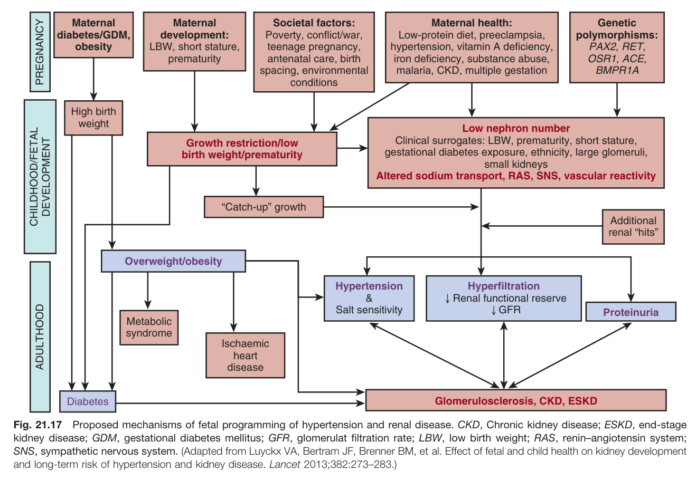

Fig. 21.17 Proposed mechanisms of fetal programming of hypertension and renal disease. This is a flowchart illustrating the pathways from pregnancy to adult disease. **Pregnancy:** Various factors (Maternal diabetes/GDM/obesity, Maternal development factors like LBW, societal factors, maternal health issues, and genetic polymorphisms) can lead to either high birth weight or growth restriction/low birth weight/prematurity. **Childhood/Fetal Development:** Growth restriction leads to a low nephron number and altered sodium transport, RAS, SNS, and vascular reactivity. High birth weight can also lead to similar outcomes. Postnatal "catch-up" growth can occur, leading to overweight/obesity. **Adulthood:** Overweight/obesity can lead to metabolic syndrome and ischemic heart disease. A low nephron number can lead to hypertension and salt sensitivity, as well as hyperfiltration and reduced renal functional reserve/GFR. Additional renal "hits" can exacerbate these issues. Hypertension and hyperfiltration can both lead to proteinuria, and ultimately all these pathways converge on glomerulosclerosis, CKD, and ESKD. Diabetes is also shown as an outcome in adulthood. CKD, Chronic kidney disease; ESKD, end-stage kidney disease; GDM, gestational diabetes mellitus; GFR, glomerulat filtration rate; LBW, low birth weight; RAS, renin-angiotensin system; SNS, sympathetic nervous system. (Adapted from Luyckx VA, Bertram JF, Brenner BM, et al. Effect of fetal and child health on kidney development and long-term risk of hypertension and kidney disease. Lancet 2013;382:273-283.)

---

## Tables

### Table_21_1

#### Table Image

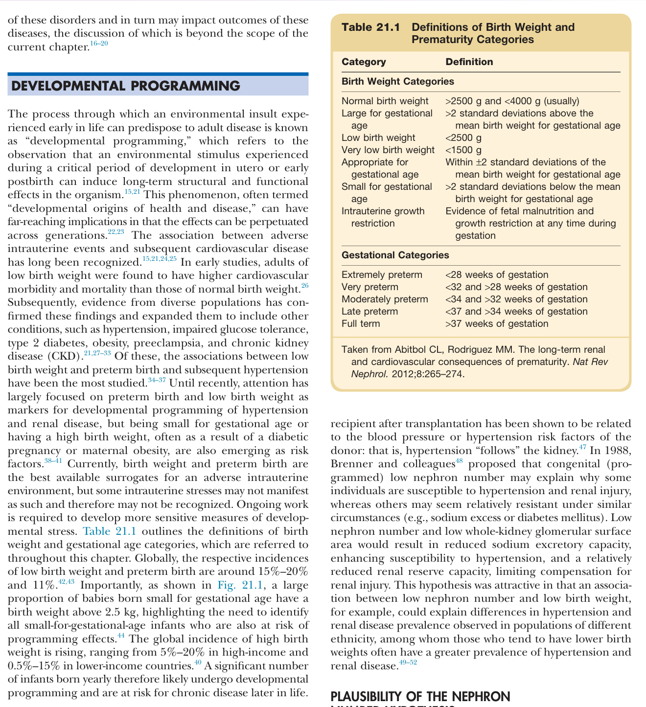

#### Table Data (CSV: [Table_21_1.csv](Table_21_1.csv))

```markdown
| Table Text (OCR) |
| :--- |
| Table 21.1 Definitions of Birth Weight and Prematurity Categories Category  Definition    Birth Weight Categories    Normal birth weight  >2500 g and <4000 g (usually)    Large for gestational age  >2 standard deviations above the mean birth weight for gestational age    Low birth weight  <2500 g    Very low birth weight  <1500 g    Appropriate for gestational age  Within ±2 standard deviations of the mean birth weight for gestational age    Small for gestational age  >2 standard deviations below the mean birth weight for gestational age    Intrauterine growth restriction  Evidence of fetal malnutrition and growth restriction at any time during gestation    Gestational Categories    Extremely preterm  <28 weeks of gestation    Very preterm  <32 and >28 weeks of gestation    Moderately preterm  <34 and >32 weeks of gestation    Late preterm  <37 and >34 weeks of gestation    Full term  >37 weeks of gestation    Taken from Abitbol CL, Rodriguez MM. The long-term renal and cardiovascular consequences of prematurity. Nat Rev Nephrol. 2012;8:265–274. |
```

Table 21.1 Definitions of Birth Weight and Prematurity Categories | Category | Definition | | :------------------------------ | :----------------------------------------------------------- | | **Birth Weight Categories** | | | Normal birth weight | >2500 g and <4000 g (usually) | | Large for gestational age | >2 standard deviations above the mean birth weight for gestational age | | Low birth weight | <2500 g | | Very low birth weight | <1500 g | | Appropriate for gestational age | Within ±2 standard deviations of the mean birth weight for gestational age | | Small for gestational age | >2 standard deviations below the mean birth weight for gestational age | | Intrauterine growth restriction | Evidence of fetal malnutrition and growth restriction at any time during gestation | | **Gestational Categories** | | | Extremely preterm | <28 weeks of gestation | | Very preterm | <32 and >28 weeks of gestation | | Moderately preterm | <34 and >32 weeks of gestation | | Late preterm | <37 and >34 weeks of gestation | | Full term | >37 weeks of gestation | Taken from Abitbol CL, Rodriguez MM. The long-term renal and cardiovascular consequences of prematurity. Nat Rev Nephrol. 2012;8:265-274.

---

### Table_21_2

#### Table Image

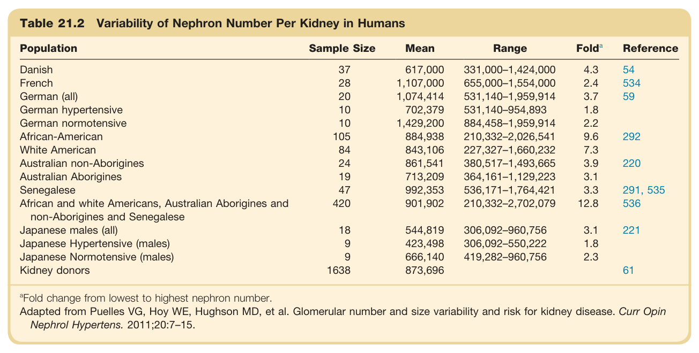

#### Table Data (CSV: [Table_21_2.csv](Table_21_2.csv))

```markdown
| Table Text (OCR) |
| :--- |
| Table 21.2 Variability of Nephron Number Per Kidney in Humans Population  Sample Size  Mean  Range   Fold^a   Reference    Danish  37  617,000  331,000-1,424,000  4.3  54    French  28  1,107,000  655,000-1,554,000  2.4  534    German (all)  20  1,074,414  531,140-1,959,914  3.7  59    German hypertensive  10  702,379  531,140-954,893  1.8      German normotensive  10  1,429,200  884,458-1,959,914  2.2      African-American  105  884,938  210,332-2,026,541  9.6  292    White American  84  843,106  227,327-1,660,232  7.3      Australian non-Aborigines  24  861,541  380,517-1,493,665  3.9  220    Australian Aborigines  19  713,209  364,161-1,129,223  3.1      Senegalese  47  992,353  536,171-1,764,421  3.3  291, 535    African and white Americans, Australian Aborigines and non-Aborigines and Senegalese  420  901,902  210,332-2,702,079  12.8  536    Japanese males (all)  18  544,819  306,092-960,756  3.1  221    Japanese Hypertensive (males)  9  423,498  306,092-550,222  1.8      Japanese Normotensive (males)  9  666,140  419,282-960,756  2.3      Kidney donors  1638  873,696      61 <sup>a</sup>Fold change from lowest to highest nephron number. Adapted from Puelles VG, Hoy WE, Hughson MD, et al. Glomerular number and size variability and risk for kidney disease. Curr Opin Nephrol Hypertens. 2011;20:7–15. |
```

Table 21.2 Variability of Nephron Number Per Kidney in Humans | Population | Sample Size | Mean | Range | Folda | Reference | | :----------------------------------------------------------- | :---------- | :-------- | :---------------- | :---- | :-------- | | Danish | 37 | 617,000 | 331,000-1,424,000 | 4.3 | 54 | | French | 28 | 1,107,000 | 655,000-1,554,000 | 2.4 | 534 | | German (all) | 20 | 1,074,414 | 531,140-1,959,914 | 3.7 | 59 | | German hypertensive | 10 | 702,379 | 531,140-954,893 | 1.8 | | | German normotensive | 10 | 1,429,200 | 884,458-1,959,914 | 2.2 | | | African-American | 105 | 884,938 | 210,332-2,026,541 | 9.6 | 292 | | White American | 84 | 843,106 | 227,327-1,660,232 | 7.3 | | | Australian non-Aborigines | 24 | 861,541 | 380,517-1,493,665 | 3.9 | 220 | | Australian Aborigines | 19 | 713,209 | 364,161-1,129,223 | 3.1 | | | Senegalese | 47 | 992,353 | 536,171-1,764,421 | 3.3 | 291, 535 | | African and white Americans, Australian Aborigines and non-Aborigines and Senegalese | 420 | 901,902 | 210,332-2,702,079 | 12.8 | 536 | | Japanese males (all) | 18 | 544,819 | 306,092-960,756 | 3.1 | 221 | | Japanese Hypertensive (males) | 9 | 423,498 | 306,092-550,222 | 1.8 | | | Japanese Normotensive (males) | 9 | 666,140 | 419,282-960,756 | 2.3 | | | Kidney donors | 1638 | 873,696 | | | 61 | Fold change from lowest to highest nephron number. Adapted from Puelles VG, Hoy WE, Hughson MD, et al. Glomerular number and size variability and risk for kidney disease. Curr Opin Nephrol Hypertens. 2011;20:7-15.

---

### Table_21_3

#### Table Image

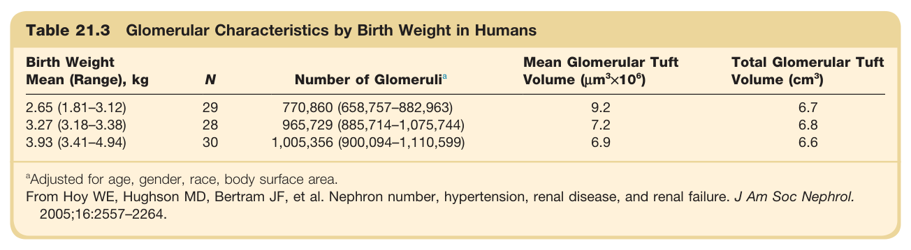

#### Table Data (CSV: [Table_21_3.csv](Table_21_3.csv))

```markdown
| Table Text (OCR) |
| :--- |
| Table 21.3 Glomerular Characteristics by Birth Weight in Humans Birth Weight Mean (Range), kg  N  Number of Glomeruli ^{a}   Mean Glomerular Tuft Volume ( \mu m^{3} \times 10^{6} )  Total Glomerular Tuft Volume (cm ^{3} )    2.65 (1.81–3.12)  29  770,860 (658,757–882,963)  9.2  6.7    3.27 (3.18–3.38)  28  965,729 (885,714–1,075,744)  7.2  6.8    3.93 (3.41–4.94)  30  1,005,356 (900,094–1,110,599)  6.9  6.6 <sup>a</sup>Adjusted for age, gender, race, body surface area. From Hoy WE, Hughson MD, Bertram JF, et al. Nephron number, hypertension, renal disease, and renal failure. J Am Soc Nephrol. 2005;16:2557–2264. |
```

Table 21.3 Glomerular Characteristics by Birth Weight in Humans | Birth Weight Mean (Range), kg | N | Number of Glomerulia | Mean Glomerular Tuft Volume (µm³×10°) | Total Glomerular Tuft Volume (cm³) | | :---------------------------- | :--- | :---------------------------- | :------------------------------------ | :--------------------------------- | | 2.65 (1.81-3.12) | 29 | 770,860 (658,757-882,963) | 9.2 | 6.7 | | 3.27 (3.18-3.38) | 28 | 965,729 (885,714-1,075,744) | 7.2 | 6.8 | | 3.93 (3.41-4.94) | 30 | 1,005,356 (900,094-1,110,599) | 6.9 | 6.6 | Adjusted for age, gender, race, body surface area. From Hoy WE, Hughson MD, Bertram JF, et al. Nephron number, hypertension, renal disease, and renal failure. J Am Soc Nephrol. 2005;16:2557-2264.

---

### Table_21_4

#### Table Images (2 Parts)

- **Part 1 (Page 6)**:
  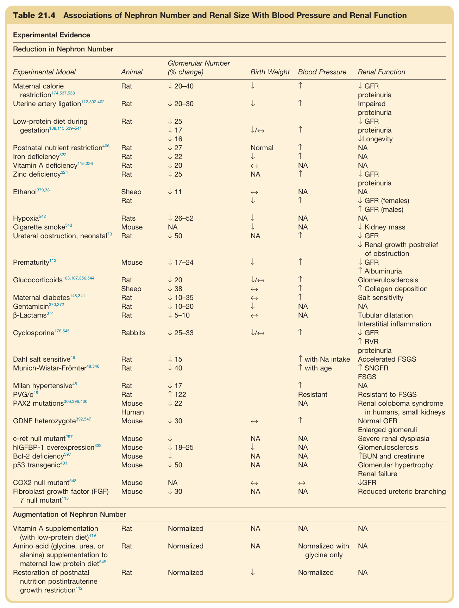

- **Part 2 (Page 7)**:
  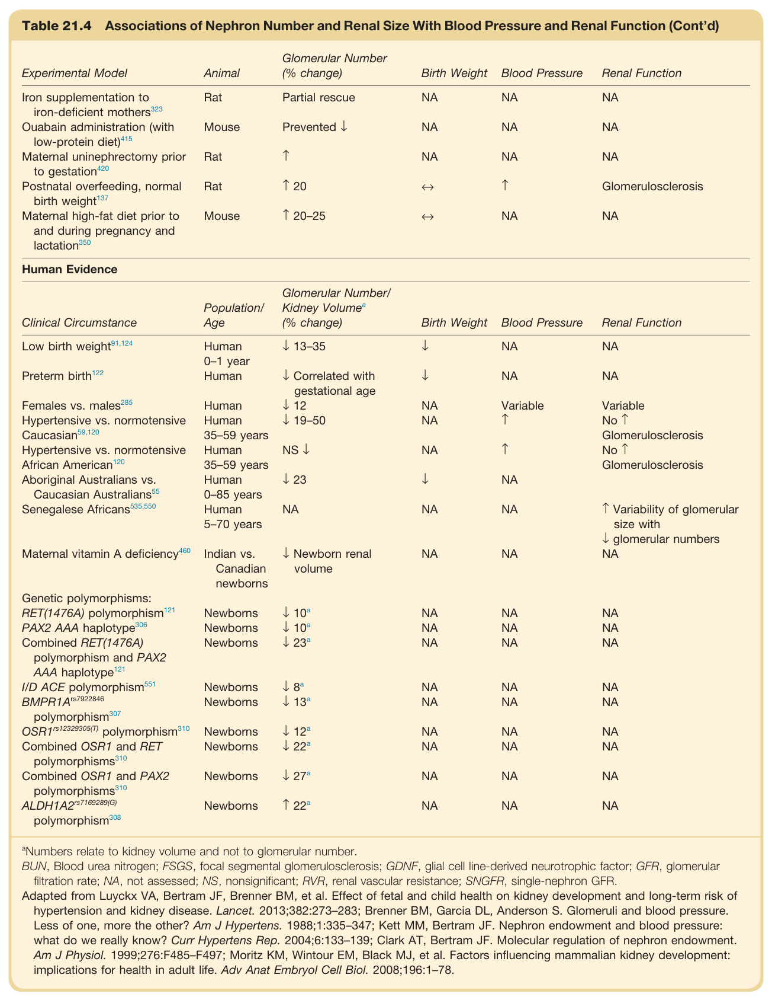

#### Table Data (CSV: [Table_21_4.csv](Table_21_4.csv))

```markdown
| Table Text (OCR) |
| :--- |
| Table 21.4 Associations of Nephron Number and Renal Size With Blood Pressure and Renal Function Experimental Evidence Reduction in Nephron Number Experimental Model  Animal  Glomerular Number (% change)  Birth Weight  Blood Pressure  Renal Function    Maternal calorie restriction ^{174,537,538}   Rat  ↓ 20-40  ↓  ↑  ↓ GFRproteinuria    Uterine artery ligation ^{112,302,402}   Rat  ↓ 20-30  ↓  ↑  Impairedproteinuria    Low-protein diet during gestation ^{108,115,539-541}   Rat  ↓ 25↓ 17↓ 16  ↓/↔  ↑  ↓ GFRproteinuria↓Longevity    Postnatal nutrient restriction ^{406}   Rat  ↓ 27  Normal  ↑  NA    Iron deficiency ^{322}   Rat  ↓ 22  ↓  ↑  NA    Vitamin A deficiency ^{115,326}   Rat  ↓ 20  ↔  NA  NA    Zinc deficiency ^{324}   Rat  ↓ 25  NA  ↑  ↓ GFRproteinuria    Ethanol ^{379,381}   Sheep  ↓ 11  ↔  NA  NA    Rat    ↓  ↑  ↓ GFR (females)↑ GFR (males)    Hypoxia ^{542}   Rats  ↓ 26-52  ↓  NA  NA    Cigarette smoke ^{543}   Mouse  NA  ↓  NA  ↓ Kidney mass    Ureteral obstruction, neonatal ^{73}   Rat  ↓ 50  NA  ↑  ↓ GFR↓ Renal growth postrelief of obstruction    Prematurity ^{113}   Mouse  ↓ 17-24  ↓  ↑  ↓ GFR↑ Albuminuria    Glucocorticoids ^{103,107,356,544}   Rat  ↓ 20  ↓/↔  ↑  Glomerulosclerosis    Sheep  ↓ 38  ↔  ↑  ↑ Collagen deposition    Maternal diabetes ^{148,341}   Rat  ↓ 10-35  ↔  ↑  Salt sensitivity    Gentamicin ^{370,372}   Rat  ↓ 10-20  ↓  NA  NA    β-Lactams ^{374}   Rat  ↓ 5-10  ↔  NA  Tubular dilatation    Cyclosporine ^{176,545}   Rabbits  ↓ 25-33  ↓/↔  ↑  Interstitial inflammation↓ GFR↑ RVRproteinuria    Dahl salt sensitive ^{48}   Rat  ↓ 15    ↑ with Na intake  Accelerated FSGS    Munich-Wistar-Frömter ^{48,546}   Rat  ↓ 40    ↑ with age  ↑ SNGFRFSGS    Milan hypertensive ^{48}   Rat  ↓ 17    ↑  NA    PVG/c ^{48}   Rat  ↑ 122    Resistant  Resistant to FSGS    PAX2 mutations ^{306,396,400}   Mouse  ↓ 22    NA  Renal coloboma syndrome in humans, small kidneys    Human            GDNF heterozygote ^{392,547}   Mouse  ↓ 30  ↔  ↑  Normal GFREnlarged glomeruli    c-ret null mutant ^{297}   Mouse  ↓  NA  NA  Severe renal dysplasia    hIGFBP-1 overexpression ^{339}   Mouse  ↓ 18-25  ↓  NA  Glomerulosclerosis    Bcl-2 deficiency ^{397}   Mouse  ↓  NA  NA  ↑BUN and creatinine    p53 transgenic ^{401}   Mouse  ↓ 50  NA  NA  Glomerular hypertrophyRenal failure    COX2 null mutant ^{548}   Mouse  NA  ↔  ↔  ↓GFR    Fibroblast growth factor (FGF)7 null mutant ^{115}   Mouse  ↓ 30  NA  NA  Reduced ureteric branching    Augmentation of Nephron Number    Vitamin A supplementation (with low-protein diet) ^{419}   Rat  Normalized  NA  NA  NA    Amino acid (glycine, urea, or alanine) supplementation to maternal low protein diet ^{549}   Rat  Normalized  NA  Normalized with glycine only  NA    Restoration of postnatal nutrition postintrauterine growth restriction ^{112}   Rat  Normalized  ↓  Normalized  NA    Iron supplementation to iron-deficient mothers323  Rat  Partial rescue  NA  NA  NA    Ouabain administration (with low-protein diet)415  Mouse  Prevented ↓  NA  NA  NA    Maternal uninephrectomy prior to gestation420  Rat  ↑  NA  NA  NA    Postnatal overfeeding, normal birth weight137  Rat  ↑ 20  ↔  ↑  Glomerulosclerosis    Maternal high-fat diet prior to and during pregnancy and lactation350  Mouse  ↑ 20–25  ↔  NA  NA |
```

Table 21.4 Associations of Nephron Number and Renal Size With Blood Pressure and Renal Function **Experimental Evidence** **Reduction in Nephron Number** | Experimental Model | Animal | Glomerular Number (% change) | Birth Weight | Blood Pressure | Renal Function | | :------------------------------------------- | :------ | :--------------------------- | :----------- | :--------------- | :----------------------------------------------------------- | | Maternal calorie restriction | Rat | ↓20-40 | ↓ | ↑ | ↓ GFR, proteinuria | | Uterine artery ligation | Rat | ↓20-30 | ↓ | ↑ | Impaired proteinuria | | Low-protein diet during gestation | Rat | ↓25 | | | ↓ GFR | | | | ↓17 | ↓/↔ | ↑ | proteinuria | | | | ↓16 | | | ↓Longevity | | Postnatal nutrient restriction | Rat | ↓27 | Normal | ↑ | NA | | Iron deficiency | Rat | ↓22 | ↓ | ↑ | NA | | Vitamin A deficiency | Rat | ↓20 | ↔ | NA | NA | | Zinc deficiency | Rat | ↓25 | NA | ↑ | ↓ GFR, proteinuria | | Ethanol | Sheep | ↓11 | ↔ | NA | NA | | | Rat | | ↓ | ↑ | ↓ GFR (females), ↑ GFR (males) | | Hypoxia | Rats | ↓26-52 | ↓ | NA | NA | | Cigarette smoke | Mouse | NA | ↓ | NA | ↓ Kidney mass | | Ureteral obstruction, neonatal | Rat | ↓50 | NA | ↑ | ↓ GFR, ↓ Renal growth postrelief of obstruction | | Prematurity | Mouse | ↓17-24 | ↓ | ↑ | ↓GFR, ↑ Albuminuria, Glomerulosclerosis, ↑ Collagen deposition | | Glucocorticoids | Rat | ↓20 | ↓/↔ | ↑ | Salt sensitivity | | | Sheep | ↓38 | ↔ | ↑ | | | Maternal diabetes | Rat | ↓10-35 | ↔ | ↑ | NA | | Gentamicin | Rat | ↓10-20 | ↓ | NA | Tubular dilatation | | B-Lactams | Rat | ↓5-10 | ↔ | NA | Interstitial inflammation | | Cyclosporine | Rabbits | ↓25-33 | ↓/↔ | ↑ | ↓GFR, ↑ RVR, proteinuria | | Dahl salt sensitive | Rat | ↓15 | | ↑ with Na intake | Accelerated FSGS | | Munich-Wistar-Frömter | Rat | ↓40 | | ↑ with age | ↑ SNGFR | | Milan hypertensive | Rat | ↓17 | | ↑ | FSGS | | PVG/c | Rat | ↑ 122 | | Resistant | NA | | PAX2 mutations | Mouse | ↓22 | | NA | Resistant to FSGS | | | Human | | | | Renal coloboma syndrome in humans, small kidneys | | GDNF heterozygote | Mouse | ↓30 | ↔ | ↑ | Normal GFR, Enlarged glomeruli | | c-ret null mutant | Mouse | ↓ | NA | NA | Severe renal dysplasia | | hIGFBP-1 overexpression | Mouse | ↓18-25 | ↓ | NA | Glomerulosclerosis | | Bcl-2 deficiency | Mouse | ↓ | NA | NA | ↑BUN and creatinine | | p53 transgenic | Mouse | ↓50 | NA | NA | Glomerular hypertrophy | | COX2 null mutant | Mouse | NA | ↔ | ↔ | Renal failure, ↓GFR | | Fibroblast growth factor (FGF) 7 null mutant | Mouse | ↓30 | NA | NA | Reduced ureteric branching | **Augmentation of Nephron Number** | Experimental Model | Animal | Glomerular Number (% change) | Birth Weight | Blood Pressure | Renal Function | | :----------------------------------------------------------- | :----- | :--------------------------- | :----------- | :--------------------------- | :----------------- | | Vitamin A supplementation (with low-protein diet) | Rat | Normalized | NA | NA | NA | | Amino acid (glycine, urea, or alanine) supplementation to maternal low protein diet | Rat | Normalized | NA | Normalized with glycine only | NA | | Restoration of postnatal nutrition postintrauterine growth restriction | Rat | Normalized | ↓ | Normalized | NA | | Iron supplementation to iron-deficient mothers | Rat | Partial rescue | NA | NA | NA | | Ouabain administration (with low-protein diet) | Mouse | Prevented↓ | NA | NA | NA | | Maternal uninephrectomy prior to gestation | Rat | ↑ | NA | NA | NA | | Postnatal overfeeding, normal birth weight | Rat | ↑ 20 | ↔ | ↑ | Glomerulosclerosis | | Maternal high-fat diet prior to and during pregnancy and lactation | Mouse | ↑ 20-25 | ↔ | NA | NA | **Human Evidence** | Clinical Circumstance | Population/ Age | Glomerular Number/ Kidney Volumea (% change) | Birth Weight | Blood Pressure | Renal Function | | :------------------------------------------------------ | :--------------------------- | :------------------------------------------- | :----------- | :------------- | :--------------------------------------------------------- | | Low birth weight | Human 0-1 year | ↓13-35 | ↓ | NA | NA | | Preterm birth | Human | ↓ Correlated with gestational age | ↓ | NA | NA | | Females vs. males | Human | ↓12 | NA | Variable | Variable | | Hypertensive vs. normotensive Caucasian | Human 35-59 years | ↓19-50 | NA | ↑ | No ↑ Glomerulosclerosis | | Hypertensive vs. normotensive African American | Human 35-59 years | NS↓ | NA | ↑ | No ↑ Glomerulosclerosis | | Aboriginal Australians vs. Caucasian Australians | Human 0-85 years | ↓23 | ↓ | NA | NA | | Senegalese Africans | Human 5-70 years | NA | NA | NA | ↑ Variability of glomerular size with ↓ glomerular numbers | | Maternal vitamin A deficiency | Indian vs. Canadian newborns | ↓ Newborn renal volume | NA | NA | NA | | Genetic polymorphisms: | | | | | | | RET(1476A) polymorphism | Newborns | ↓10a | NA | NA | NA | | PAX2 AAA haplotype | Newborns | ↓10a | NA | NA | NA | | Combined RET(1476A) polymorphism and PAX2 AAA haplotype | Newborns | ↓23a | NA | NA | NA | | I/D ACE polymorphism | Newborns | ↓8a | NA | NA | NA | | BMPR1A rs7922846 polymorphism | Newborns | ↓13a | NA | NA | NA | | OSR1rs12329305(T) polymorphism | Newborns | ↓12a | NA | NA | NA | | Combined OSR1 and RET polymorphisms | Newborns | ↓22a | NA | NA | NA | | Combined OSR1 and PAX2 polymorphisms | Newborns | ↓27a | NA | NA | NA | | ALDH1A2rs7169289(G) polymorphism | Newborns | ↑ 22a | NA | NA | NA | @Numbers relate to kidney volume and not to glomerular number. BUN, Blood urea nitrogen; FSGS, focal segmental glomerulosclerosis; GDNF, glial cell line-derived neurotrophic factor; GFR, glomerular filtration rate; NA, not assessed; NS, nonsignificant; RVR, renal vascular resistance; SNGFR, single-nephron GFR. Adapted from Luyckx VA, Bertram JF, Brenner BM, et al. Effect of fetal and child health on kidney development and long-term risk of hypertension and kidney disease. Lancet. 2013;382:273-283; Brenner BM, Garcia DL, Anderson S. Glomeruli and blood pressure. Less of one, more the other? Am J Hypertens. 1988;1:335-347; Kett MM, Bertram JF. Nephron endowment and blood pressure: what do we really know? Curr Hypertens Rep. 2004;6:133-139; Clark AT, Bertram JF. Molecular regulation of nephron endowment. Am J Physiol. 1999;276:F485-F497; Moritz KM, Wintour EM, Black MJ, et al. Factors influencing mammalian kidney development: implications for health in adult life. Adv Anat Embryol Cell Biol. 2008;196:1-78.

---

### Table_21_5

#### Table Image

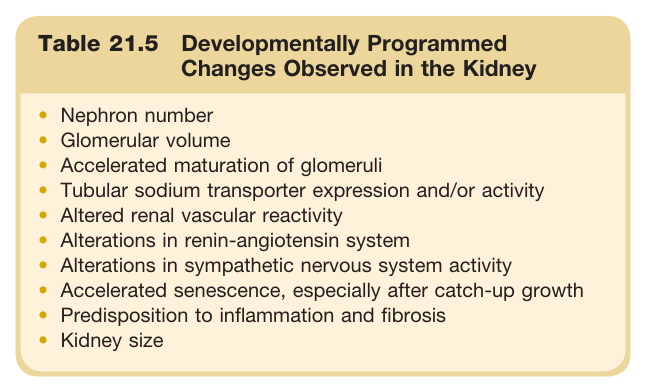

#### Table Data (CSV: [Table_21_5.csv](Table_21_5.csv))

```markdown
| Table Text (OCR) |
| :--- |
| Table 21.5 Developmentally Programmed Changes Observed in the Kidney • Nephron number • Glomerular volume • Accelerated maturation of glomeruli • Tubular sodium transporter expression and/or activity • Altered renal vascular reactivity • Alterations in renin-angiotensin system • Alterations in sympathetic nervous system activity • Accelerated senescence, especially after catch-up growth • Predisposition to inflammation and fibrosis • Kidney size |
```

Table 21.5 Developmentally Programmed Changes Observed in the Kidney * Nephron number * Glomerular volume * Accelerated maturation of glomeruli * Tubular sodium transporter expression and/or activity * Altered renal vascular reactivity * Alterations in renin-angiotensin system * Alterations in sympathetic nervous system activity * Accelerated senescence, especially after catch-up growth * Predisposition to inflammation and fibrosis * Kidney size

---

### Table_21_6

#### Table Image

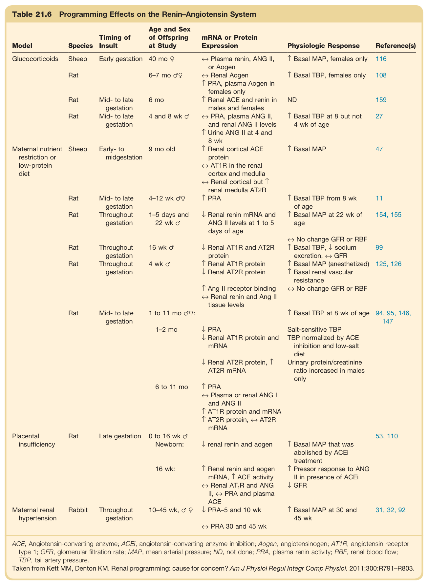

#### Table Data (CSV: [Table_21_6.csv](Table_21_6.csv))

```markdown
| Table Text (OCR) |
| :--- |
| Table 21.6 Programming Effects on the Renin–Angiotensin System Model  Species  Timing of Insult  Age and Sex of Offspring at Study  mRNA or Protein Expression  Physiologic Response  Reference(s)    Glucocorticoids  Sheep  Early gestation  40 mo ♀  ↔ Plasma renin, ANG II, or Aogen  ↑ Basal MAP, females only  116    Rat    6-7 mo ♂♀  ↔ Renal Aogen↑ PRA, plasma Aogen in females only  ↑ Basal TBP, females only  108    Rat  Mid- to late gestation  6 mo  ↑ Renal ACE and renin in males and females  ND  159    Rat  Mid- to late gestation  4 and 8 wk ♂  ↔ PRA, plasma ANG II, and renal ANG II levels↑ Urine ANG II at 4 and 8 wk  ↑ Basal TBP at 8 but not 4 wk of age  27    Maternal nutrient restriction or low-protein diet  Sheep  Early- to midgestation  9 mo old  ↑ Renal cortical ACE protein↔ AT1R in the renal cortex and medulla↔ Renal cortical but ↑ renal medulla AT2R  ↑ Basal MAP  47    Rat  Mid- to late gestation  4-12 wk ♂♀  ↑ PRA  ↑ Basal TBP from 8 wk of age  11    Rat  Throughout gestation  1-5 days and 22 wk ♂  ↓ Renal renin mRNA and ANG II levels at 1 to 5 days of age  ↑ Basal MAP at 22 wk of age  154, 155    Rat  Throughout gestation  16 wk ♂  ↓ Renal AT1R and AT2R protein  ↔ No change GFR or RBF↑ Basal TBP, ↓ sodium excretion, ↔ GFR  99    Rat  Throughout gestation  4 wk ♂  ↑ Renal AT1R protein↓ Renal AT2R protein  ↑ Basal MAP (anesthetized)↑ Basal renal vascular resistance  125, 126          ↑ Ang II receptor binding↔ Renal renin and Ang II tissue levels  ↔ No change GFR or RBF      Rat  Mid- to late gestation  1 to 11 mo ♂♀:    ↑ Basal TBP at 8 wk of age  94, 95, 146, 147        1-2 mo  ↓ PRA↓ Renal AT1R protein and mRNA  Salt-sensitive TBPTBP normalized by ACE inhibition and low-salt diet            ↓ Renal AT2R protein, ↑ AT2R mRNA  Urinary protein/creatinine ratio increased in males only          6 to 11 mo  ↑ PRA↔ Plasma or renal ANG I and ANG II↑ AT1R protein and mRNA↑ AT2R protein, ↔ AT2R mRNA        Placental insufficiency  Rat  Late gestation  0 to 16 wk ♂Newborn:  ↓ renal renin and aogen  ↑ Basal MAP that was abolished by ACEi treatment  53, 110        16 wk:  ↑ Renal renin and aogen mRNA, ↑ ACE activity↔ Renal AT1R and ANG II, ↔ PRA and plasma ACE  ↑ Pressor response to ANG II in presence of ACEi↓ GFR      Maternal renal hypertension  Rabbit  Throughout gestation  10-45 wk, ♂♀  ↓ PRA-5 and 10 wk↔ PRA 30 and 45 wk  ↑ Basal MAP at 30 and 45 wk  31, 32, 92 ACE, Angiotensin-converting enzyme; ACEi, angiotensin-converting enzyme inhibition; Aogen, angiotensinogen; AT1R, angiotensin receptor type 1; GFR, glomerular filtration rate; MAP, mean arterial pressure; ND, not done; PRA, plasma renin activity; RBF, renal blood flow; TBP, tail artery pressure. Taken from Kett MM, Denton KM. Renal programming: cause for concern? Am J Physiol Regul Integr Comp Physiol. 2011;300:R791–R803. |
```

Table 21.6 Programming Effects on the Renin-Angiotensin System | Model | Species | Timing of Insult | Age and Sex of Offspring at Study | mRNA or Protein Expression | Physiologic Response | Reference(s) | | :------------------------------------------------ | :------ | :--------------------- | :-------------------------------- | :----------------------------------------------------------- | :----------------------------------------------------------- | :--------------- | | Glucocorticoids | Sheep | Early gestation | 40 mo | → Plasma renin, ANG II, or Aogen; → Renal Aogen | ↑ Basal MAP, females only | 116 | | | Rat | 6-7 mo ơ | | ↑ PRA, plasma Aogen in females only | ↑ Basal TBP, females only | 108 | | | Rat | Mid- to late gestation | 6 mo | ↑ Renal ACE and renin in males and females | ND | 159 | | | Rat | Mid- to late gestation | 4 and 8 wk ở | → PRA, plasma ANG II, and renal ANG II levels; ↑ Urine ANG II at 4 and 8 wk | ↑ Basal TBP at 8 but not 4 wk of age | 27 | | Maternal nutrient restriction or low-protein diet | Sheep | Early- to midgestation | 9 mo old | ↑ Renal cortical ACE protein; → AT1R in the renal cortex and medulla; → Renal cortical but ↑ renal medulla AT2R | ↑ Basal MAP | 47 | | | Rat | Mid- to late gestation | 4-12 wk ơ | ↑ PRA | ↑ Basal TBP from 8 wk of age | 11 | | | Rat | Throughout gestation | 1-5 days and 22 wk ở | ↓Renal renin mRNA and ANG II levels at 1 to 5 days of age | ↑ Basal MAP at 22 wk of age; → No change GFR or RBF | 154, 155 | | | Rat | Throughout gestation | 16 wk ở | ↓Renal AT1R and AT2R protein | ↑ Basal TBP,↓ sodium excretion, → GFR | 99 | | | Rat | Throughout gestation | 4 wk ở | ↑ Renal AT1R protein; ↓ Renal AT2R protein | ↑ Basal MAP (anesthetized); ↑ Basal renal vascular resistance; → No change GFR or RBF | 125, 126 | | | Rat | Mid- to late gestation | 1 to 11 mo ơ: 1-2 mo | ↑ Ang II receptor binding; → Renal renin and Ang II tissue levels; ↓PRA; ↓ Renal AT1R protein and mRNA; ↓ Renal AT2R protein, ↑ AT2R mRNA | ↑ Basal TBP at 8 wk of age; Salt-sensitive TBP; TBP normalized by ACE inhibition and low-salt diet; Urinary protein/creatinine ratio increased in males only | 94, 95, 146, 147 | | Placental insufficiency | Rat | Late gestation | 0 to 16 wk ở Newborn: | ↑ PRA; → Plasma or renal ANG I and ANG II; ↑ AT1R protein and mRNA; ↑ AT2R protein, ↔ AT2R mRNA | ↑ Basal MAP that was abolished by ACEi treatment; ↑ Pressor response to ANG II in presence of ACEi; ↓ GFR | 53, 110 | | Maternal renal hypertension | Rabbit | Throughout gestation | 10-45 wk, ở | ↓ renal renin and aogen; ↑ Renal renin and aogen mRNA, ↑ ACE activity; → Renal ATR and ANG II, → PRA and plasma ACE; ↓ PRA-5 and 10 wk; → PRA 30 and 45 wk | ↑ Basal MAP at 30 and 45 wk | 31, 32, 92 | ACE, Angiotensin-converting enzyme; ACEi, angiotensin-converting enzyme inhibition; Aogen, angiotensinogen; AT1R, angiotensin receptor type 1; GFR, glomerular filtration rate; MAP, mean arterial pressure; ND, not done; PRA, plasma renin activity; RBF, renal blood flow; TBP, tail artery pressure. Taken from Kett MM, Denton KM. Renal programming: cause for concern? Am J Physiol Regul Integr Comp Physiol. 2011;300:R791-R803.

---

### Table_21_7

#### Table Image

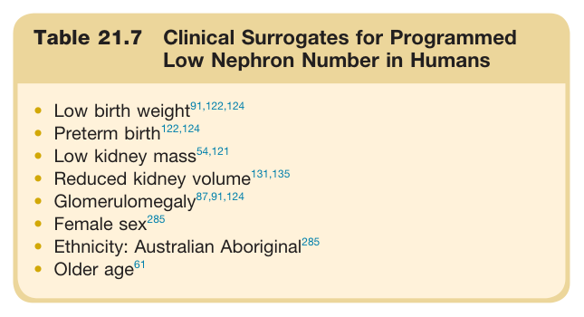

#### Table Data (CSV: [Table_21_7.csv](Table_21_7.csv))

```markdown
| Table Text (OCR) |
| :--- |
| Table 21.7 Clinical Surrogates for Programmed Low Nephron Number in Humans • Low birth weight<sup>91,122,124</sup> • Preterm birth<sup>122,124</sup> • Low kidney mass<sup>54,121</sup> • Reduced kidney volume<sup>131,135</sup> • Glomerulomegaly<sup>87,91,124</sup> • Female sex<sup>285</sup> • Ethnicity: Australian Aboriginal<sup>285</sup> • Older age<sup>61</sup> |
```

Table 21.7 Clinical Surrogates for Programmed Low Nephron Number in Humans * Low birth weight * Preterm birth * Low kidney mass * Reduced kidney volume * Glomerulomegaly * Female sex * Ethnicity: Australian Aboriginal * Older age

---

### Table_21_8

#### Table Images (2 Parts)

- **Part 1 (Page 19)**:
  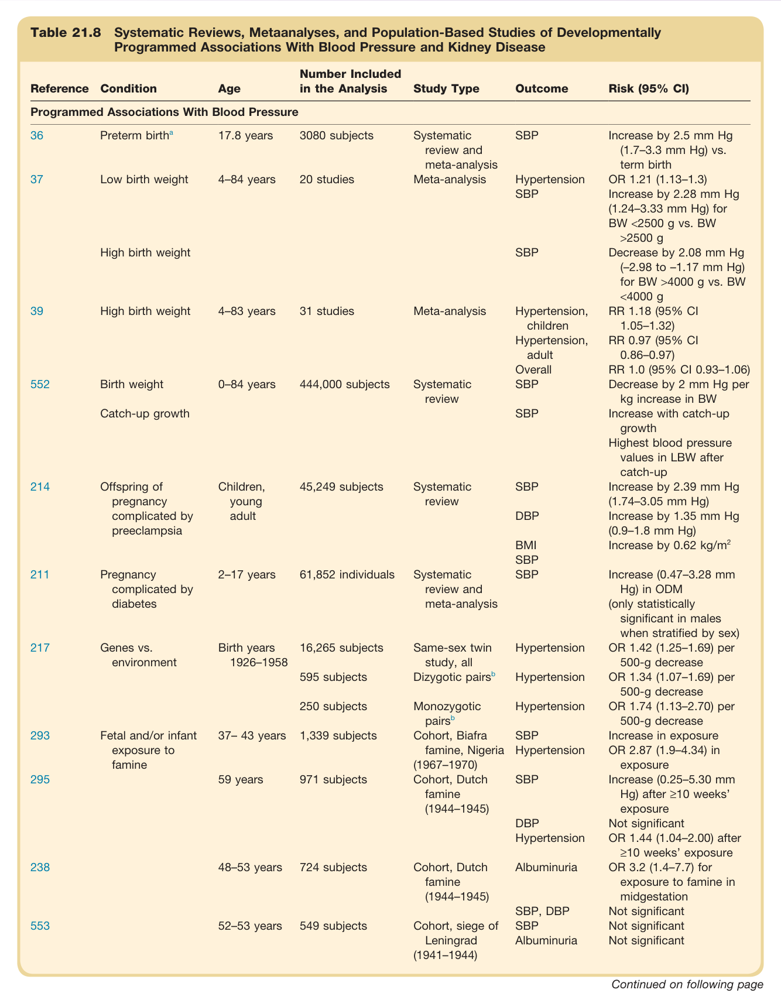

- **Part 2 (Page 20)**:
  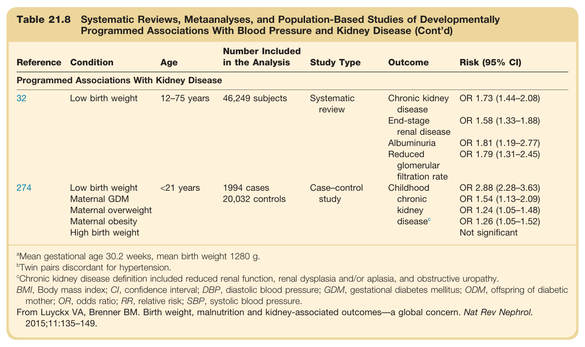

#### Table Data (CSV: [Table_21_8.csv](Table_21_8.csv))

```markdown
| Table Text (OCR) |
| :--- |
| Table 21.8 Systematic Reviews, Metaanalyses, and Population-Based Studies of Developmentally Programmed Associations With Blood Pressure and Kidney Disease Reference  Condition  Age  Number Included in the Analysis  Study Type  Outcome  Risk (95% CI)    Programmed Associations With Blood Pressure    36  Preterm  birth^a   17.8 years  3080 subjects  Systematic review and meta-analysis  SBP  Increase by 2.5 mm Hg (1.7-3.3 mm Hg) vs. term birth    37  Low birth weight  4-84 years  20 studies  Meta-analysis  Hypertension  OR 1.21 (1.13-1.3) Increase by 2.28 mm Hg (1.24-3.33 mm Hg) for BW <2500 g vs. BW >2500 g    High birth weight        SBP  Decrease by 2.08 mm Hg (-2.98 to -1.17 mm Hg) for BW >4000 g vs. BW <4000 g    39  High birth weight  4-83 years  31 studies  Meta-analysis  Hypertension, children  RR 1.18 (95% CI 1.05-1.32)    Hypertension, adult  RR 0.97 (95% CI 0.86-0.97)    Overall  RR 1.0 (95% CI 0.93-1.06)    552  Birth weight  0-84 years  444,000 subjects  Systematic review  SBP  Decrease by 2 mm Hg per kg increase in BW    Catch-up growth        SBP  Increase with catch-up growth Highest blood pressure values in LBW after catch-up    214  Offspring of pregnancy complicated by preeclampsia  Children, young adult  45,249 subjects  Systematic review  SBP  Increase by 2.39 mm Hg (1.74-3.05 mm Hg)    DBP  Increase by 1.35 mm Hg (0.9-1.8 mm Hg)    BMI  Increase by 0.62  kg/m^2     SBP      211  Pregnancy complicated by diabetes  2-17 years  61,852 individuals  Systematic review and meta-analysis  SBP  Increase (0.47-3.28 mm Hg) in ODM (only statistically significant in males when stratified by sex)    217  Genes vs. environment  Birth years 1926-1958  16,265 subjects  Same-sex twin study, all  Hypertension  OR 1.42 (1.25-1.69) per 500-g decrease    595 subjects  Dizygotic  pairs^b   Hypertension  OR 1.34 (1.07-1.69) per 500-g decrease    250 subjects  Monozygotic  pairs^b   Hypertension  OR 1.74 (1.13-2.70) per 500-g decrease    293  Fetal and/or infant exposure to famine  37-43 years  1,339 subjects  Cohort, Biafra famine, Nigeria (1967-1970)  SBP  Increase in exposure    Hypertension  OR 2.87 (1.9-4.34) in exposure    295    59 years  971 subjects  Cohort, Dutch famine (1944-1945)  SBP  Increase (0.25-5.30 mm Hg) after ≥10 weeks' exposure    DBP  Not significant    Hypertension  OR 1.44 (1.04-2.00) after ≥10 weeks' exposure    238    48-53 years  724 subjects  Cohort, Dutch famine (1944-1945)  Albuminuria  OR 3.2 (1.4-7.7) for exposure to famine in midgestation    SBP, DBP  Not significant    553    52-53 years  549 subjects  Cohort, siege of Leningrad (1941-1944)  SBP  Not significant    Albuminuria  Not significant    Programmed Associations With Kidney Disease    32  Low birth weight  12–75 years  46,249 subjects  Systematic review  Chronic kidney disease  OR 1.73 (1.44–2.08)    End-stage renal disease  OR 1.58 (1.33–1.88)    Albuminuria  OR 1.81 (1.19–2.77)    Reduced glomerular filtration rate  OR 1.79 (1.31–2.45)    274  Low birth weight  <21 years  1994 cases  Case–control study  Childhood chronic kidney disease ^{c}   OR 2.88 (2.28–3.63)    Maternal GDM  20,032 controls  OR 1.54 (1.13–2.09)    Maternal overweight  OR 1.24 (1.05–1.48)    Maternal obesity  OR 1.26 (1.05–1.52)    High birth weight  Not significant <sup>a</sup>Mean gestational age 30.2 weeks, mean birth weight 1280 g. <sup>b</sup>Twin pairs discordant for hypertension. <sup>c</sup>Chronic kidney disease definition included reduced renal function, renal dysplasia and/or aplasia, and obstructive uropathy. BMI, Body mass index; CI, confidence interval; DBP, diastolic blood pressure; GDM, gestational diabetes mellitus; ODM, offspring of diabetic mother; OR, odds ratio; RR, relative risk; SBP, systolic blood pressure. From Luyckx VA, Brenner BM. Birth weight, malnutrition and kidney-associated outcomes—a global concern. Nat Rev Nephrol. 2015;11:135–149. |
```

Table 21.8 Systematic Reviews, Metaanalyses, and Population-Based Studies of Developmentally Programmed Associations With Blood Pressure and Kidney Disease **Programmed Associations With Blood Pressure** | Reference | Condition | Age | Number Included in the Analysis | Study Type | Outcome | Risk (95% CI) | | :-------- | :------------------------------------------------- | :-------------------- | :------------------------------------------ | :----------------------------------------------------------- | :--------------------------------------------------- | :----------------------------------------------------------- | | 36 | Preterm birtha | 17.8 years | 3080 subjects | Systematic review and meta-analysis | SBP | Increase by 2.5 mm Hg (1.7-3.3 mm Hg) vs. term birth | | 37 | Low birth weight | 4-84 years | 20 studies | Meta-analysis | SBP, Hypertension | OR 1.21 (1.13-1.3). Increase by 2.28 mm Hg (1.24-3.33 mm Hg) for BW <2500 g vs. BW >2500 g | | | High birth weight | | | | SBP | Decrease by 2.08 mm Hg (-2.98 to -1.17 mm Hg) for BW >4000 g vs. BW <4000 g | | 39 | High birth weight | 4-83 years | 31 studies | Meta-analysis | Hypertension, children; Hypertension, adult; Overall | RR 1.18 (95% CI 1.05-1.32); RR 0.97 (95% CI 0.86-0.97); RR 1.0 (95% CI 0.93-1.06) | | 552 | Birth weight | 0-84 years | 444,000 subjects | Systematic review | SBP | Decrease by 2 mm Hg per kg increase in BW | | | Catch-up growth | | | | SBP | Increase with catch-up growth; Highest blood pressure values in LBW after catch-up | | 214 | Offspring of pregnancy complicated by preeclampsia | Children, young adult | 45,249 subjects | Systematic review | SBP, DBP, BMI | Increase by 2.39 mm Hg (1.74-3.05 mm Hg); Increase by 1.35 mm Hg (0.9-1.8 mm Hg); Increase by 0.62 kg/m² | | 211 | Pregnancy complicated by diabetes | 2-17 years | 61,852 individuals | Systematic review and meta-analysis | SBP | Increase (0.47-3.28 mm Hg) in ODM (only statistically significant in males when stratified by sex) | | 217 | Genes vs. environment | Birth years 1926-1958 | 16,265 subjects, 595 subjects, 250 subjects | Same-sex twin study, all Dizygotic pairsb, Monozygotic pairsb | Hypertension | OR 1.42 (1.25-1.69) per 500-g decrease; OR 1.34 (1.07-1.69) per 500-g decrease; OR 1.74 (1.13-2.70) per 500-g decrease | | 293 | Fetal and/or infant exposure to famine | 37-43 years | 1,339 subjects | Cohort, Biafra famine, Nigeria (1967-1970) | SBP, Hypertension | Increase in exposure; OR 2.87 (1.9-4.34) in exposure | | 295 | | 59 years | 971 subjects | Cohort, Dutch famine (1944-1945) | SBP, DBP, Hypertension | Increase (0.25-5.30 mm Hg) after ≥10 weeks' exposure; Not significant; OR 1.44 (1.04-2.00) after ≥10 weeks' exposure | | 238 | | 48-53 years | 724 subjects | Cohort, Dutch famine (1944-1945) | Albuminuria, SBP, DBP | OR 3.2 (1.4-7.7) for exposure to famine in midgestation; Not significant | | 553 | | 52-53 years | 549 subjects | Cohort, siege of Leningrad (1941-1944) | SBP, Albuminuria | Not significant; Not significant | **Programmed Associations With Kidney Disease** | Reference | Condition | Age | Number Included in the Analysis | Study Type | Outcome | Risk (95% CI) | | :-------- | :----------------------------------------------------------- | :---------- | :------------------------------ | :----------------- | :----------------------------------------------------------- | :----------------------------------------------------------- | | 32 | Low birth weight | 12-75 years | 46,249 subjects | Systematic review | Chronic kidney disease; End-stage renal disease; Albuminuria; Reduced glomerular filtration rate | OR 1.73 (1.44-2.08); OR 1.58 (1.33-1.88); OR 1.81 (1.19-2.77); OR 1.79 (1.31-2.45) | | 274 | Low birth weight, Maternal GDM, Maternal overweight, Maternal obesity, High birth weight | <21 years | 1994 cases, 20,032 controls | Case-control study | Childhood chronic kidney diseasec | OR 2.88 (2.28-3.63); OR 1.54 (1.13-2.09); OR 1.24 (1.05-1.48); OR 1.26 (1.05-1.52); Not significant | aMean gestational age 30.2 weeks, mean birth weight 1280 g. bTwin pairs discordant for hypertension. cChronic kidney disease definition included reduced renal function, renal dysplasia and/or aplasia, and obstructive uropathy. BMI, Body mass index; Cl, confidence interval; DBP, diastolic blood pressure; GDM, gestational diabetes mellitus; ODM, offspring of diabetic mother; OR, odds ratio; RR, relative risk; SBP, systolic blood pressure. From Luyckx VA, Brenner BM. Birth weight, malnutrition and kidney-associated outcomes—a global concern. Nat Rev Nephrol. 2015;11:135-149.

---

### Table_21_9

#### Table Image

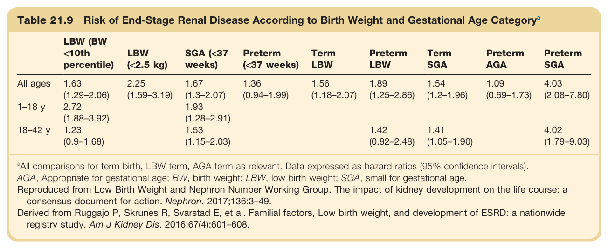

#### Table Data (CSV: [Table_21_9.csv](Table_21_9.csv))

```markdown
| Table Text (OCR) |
| :--- |
| Table 21.9 Risk of End-Stage Renal Disease According to Birth Weight and Gestational Age Category<sup>a</sup> LBW (BW <10th percentile)  LBW (<2.5 kg)  SGA (<37 weeks)  Preterm (<37 weeks)  Term LBW  Preterm LBW  Term SGA  Preterm AGA  Preterm SGA    All ages  1.63(1.29–2.06)  2.25(1.59–3.19)  1.67(1.3–2.07)  1.36(0.94–1.99)  1.56(1.18–2.07)  1.89(1.25–2.86)  1.54(1.2–1.96)  1.09(0.69–1.73)  4.03(2.08–7.80)    1–18 y  2.72(1.88–3.92)    1.93(1.28–2.91)                18–42 y  1.23(0.9–1.68)    1.53(1.15–2.03)      1.42(0.82–2.48)  1.41(1.05–1.90)    4.02(1.79–9.03) <sup>a</sup>All comparisons for term birth, LBW term, AGA term as relevant. Data expressed as hazard ratios (95% confidence intervals). AGA, Appropriate for gestational age; BW, birth weight; LBW, low birth weight; SGA, small for gestational age. Reproduced from Low Birth Weight and Nephron Number Working Group. The impact of kidney development on the life course: a consensus document for action. Nephron. 2017;136:3–49. Derived from Ruggajo P, Skrunes R, Svarstad E, et al. Familial factors, Low birth weight, and development of ESRD: a nationwide registry study. Am J Kidney Dis. 2016;67(4):601–608. |
```

Table 21.9 Risk of End-Stage Renal Disease According to Birth Weight and Gestational Age Category | | LBW (BW <10th percentile) | LBW (<2.5 kg) | SGA (<37 weeks) | Preterm (<37 weeks) | Term LBW | Preterm LBW | Term SGA | Preterm AGA | Preterm SGA | | :------- | :------------------------ | :--------------- | :--------------- | :------------------ | :--------------- | :--------------- | :--------------- | :--------------- | :--------------- | | All ages | 1.63 (1.29-2.06) | 2.25 (1.59-3.19) | 1.67 (1.3-2.07) | 1.36 (0.94-1.99) | 1.56 (1.18-2.07) | 1.89 (1.25-2.86) | 1.54 (1.2-1.96) | 1.09 (0.69-1.73) | 4.03 (2.08-7.80) | | 1-18 y | 2.72 (1.88-3.92) | | 1.93 (1.28-2.91) | | | | | | | | 18-42 y | 1.23 (0.9-1.68) | | 1.53 (1.15-2.03) | | | 1.42 (0.82-2.48) | 1.41 (1.05-1.90) | | 4.02 (1.79-9.03) | All comparisons for term birth, LBW term, AGA term as relevant. Data expressed as hazard ratios (95% confidence intervals). AGA, Appropriate for gestational age; BW, birth weight; LBW, low birth weight; SGA, small for gestational age. Reproduced from Low Birth Weight and Nephron Number Working Group. The impact of kidney development on the life course: a consensus document for action. Nephron. 2017;136:3-49. Derived from Ruggajo P, Skrunes R, Svarstad E, et al. Familial factors, Low birth weight, and development of ESRD: a nationwide registry study. Am J Kidney Dis. 2016;67(4):601-608.

---

### Table_21_10

#### Table Image

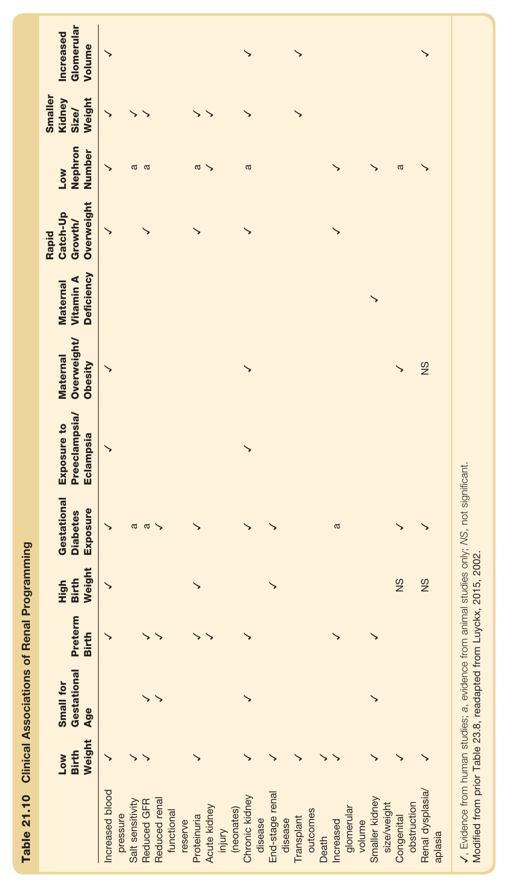

#### Table Data (CSV: [Table_21_10.csv](Table_21_10.csv))

```markdown
| Table Text (OCR) |
| :--- |
| Table 21.10 Clinical Associations of Renal Programming \|                                  \| Low Birth Weight \| Small for Gestational Age \| Preterm Birth \| High Birth Weight \| Gestational Diabetes Exposure \| Exposure to Preeclampsia/Eclampsia \| Maternal Overweight/Obesity \| Maternal Vitamin A Deficiency \| Rapid Catch-Up Growth/Overweight \| Low Nephron Number \| Smaller Kidney Size/Weight \| Increased Glomerular Volume \| \| :------------------------------- \| :--------------: \| :-----------------------: \| :-----------: \| :---------------: \| :---------------------------: \| :--------------------------------: \| :-------------------------: \| :---------------------------: \| :------------------------------: \| :----------------: \| :------------------------: \| :-------------------------: \| \| Increased blood pressure         \|        ✓         \|             ✓             \|       ✓       \|         ✓         \|               a               \|                 ✓                  \|              ✓              \|                               \|                ✓                 \|         a          \|                            \|              a              \| \| Salt sensitivity                 \|        ✓         \|                           \|               \|                   \|               a               \|                                    \|                             \|                               \|                                  \|         a          \|                            \|                             \| \| Reduced GFR                      \|        ✓         \|             ✓             \|       ✓       \|                   \|               ✓               \|                                    \|                             \|                               \|                                  \|         a          \|             ✓              \|                             \| \| Reduced renal functional reserve \|        ✓         \|                           \|               \|                   \|               ✓               \|                                    \|                             \|                               \|                                  \|                    \|                            \|                             \| \| Proteinuria                      \|        ✓         \|             ✓             \|       ✓       \|         ✓         \|               ✓               \|                 ✓                  \|                             \|                               \|                                  \|         a          \|             ✓              \|                             \| \| Acute kidney injury (neonates)   \|        ✓         \|             ✓             \|       ✓       \|                   \|               ✓               \|                 ✓                  \|                             \|                               \|                                  \|                    \|                            \|                             \| \| Chronic kidney disease           \|        ✓         \|             ✓             \|       ✓       \|                   \|               ✓               \|                 ✓                  \|              ✓              \|                               \|                                  \|         a          \|             ✓              \|                             \| \| End-stage renal disease          \|        ✓         \|             ✓             \|       ✓       \|                   \|                               \|                                    \|                             \|                               \|                                  \|                    \|                            \|                             \| \| Transplant outcomes              \|                  \|                           \|               \|                   \|                               \|                                    \|                             \|                               \|                                  \|                    \|                            \|                             \| \| Death                            \|        ✓         \|                           \|       ✓       \|                   \|                               \|                 ✓                  \|                             \|                               \|                ✓                 \|                    \|                            \|                             \| \| Increased glomerular volume      \|        ✓         \|                           \|       ✓       \|                   \|                               \|                                    \|                             \|                               \|                                  \|         a          \|                            \|              ✓              \| \| Smaller kidney size/weight       \|        ✓         \|             ✓             \|       ✓       \|                   \|               a               \|                 ✓                  \|                             \|               ✓               \|                                  \|                    \|             ✓              \|                             \| \| Congenital obstruction           \|                  \|                           \|               \|                   \|               ✓               \|                                    \|              ✓              \|                               \|                                  \|                    \|                            \|                             \| \| Renal dysplasia/aplasia          \|        ✓         \|                           \|       ✓       \|                   \|              NS               \|                                    \|             NS              \|                               \|                NS                \|                    \|             a              \|                             \| ✓, Evidence from human studies; a, evidence from animal studies only; NS, not significant. Modified from prior Table 23.8, readapted from Luyckx, 2015, 2002. |
```

Table 21.10 Clinical Associations of Renal Programming | | Low Birth Weight | Small for Gestational Age | Preterm Birth | High Birth Weight | Gestational Diabetes Exposure | Exposure to Preeclampsia/Eclampsia | Maternal Overweight/Obesity | Maternal Vitamin A Deficiency | Rapid Catch-Up Growth/Overweight | Low Nephron Number | Smaller Kidney Size/Weight | Increased Glomerular Volume | | :------------------------------- | :--------------: | :-----------------------: | :-----------: | :---------------: | :---------------------------: | :--------------------------------: | :-------------------------: | :---------------------------: | :------------------------------: | :----------------: | :------------------------: | :-------------------------: | | Increased blood pressure | ✓ | ✓ | ✓ | ✓ | a | ✓ | ✓ | | ✓ | a | | a | | Salt sensitivity | ✓ | | | | a | | | | | a | | | | Reduced GFR | ✓ | ✓ | ✓ | | ✓ | | | | | a | ✓ | | | Reduced renal functional reserve | ✓ | | | | ✓ | | | | | | | | | Proteinuria | ✓ | ✓ | ✓ | ✓ | ✓ | ✓ | | | | a | ✓ | | | Acute kidney injury (neonates) | ✓ | ✓ | ✓ | | ✓ | ✓ | | | | | | | | Chronic kidney disease | ✓ | ✓ | ✓ | | ✓ | ✓ | ✓ | | | a | ✓ | | | End-stage renal disease | ✓ | ✓ | ✓ | | | | | | | | | | | Transplant outcomes | | | | | | | | | | | | | | Death | ✓ | | ✓ | | | ✓ | | | ✓ | | | | | Increased glomerular volume | ✓ | | ✓ | | | | | | | a | | ✓ | | Smaller kidney size/weight | ✓ | ✓ | ✓ | | a | ✓ | | ✓ | | | ✓ | | | Congenital obstruction | | | | | ✓ | | ✓ | | | | | | | Renal dysplasia/aplasia | ✓ | | ✓ | | NS | | NS | | NS | | a | | ✓, Evidence from human studies; a, evidence from animal studies only; NS, not significant. Modified from prior Table 23.8, readapted from Luyckx, 2015, 2002.

---

### Table_21_11

#### Table Image

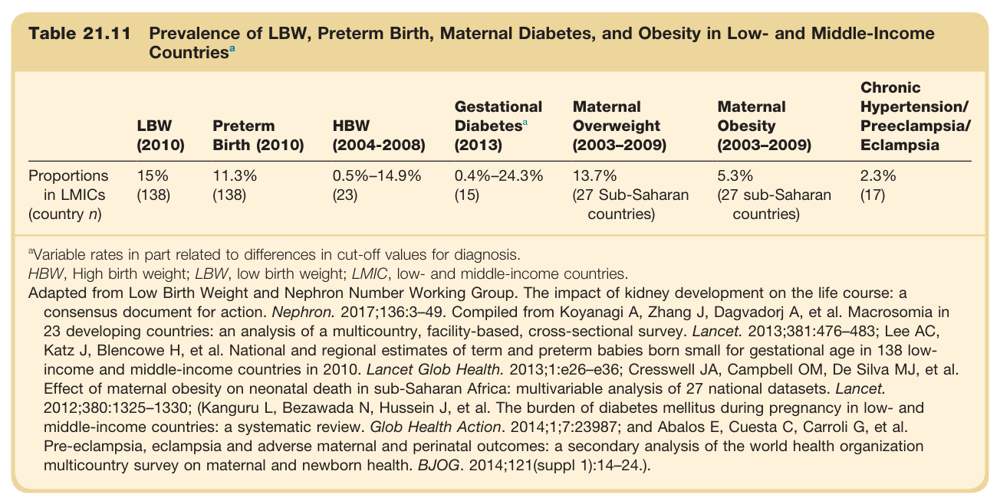

#### Table Data (CSV: [Table_21_11.csv](Table_21_11.csv))

```markdown
| Table Text (OCR) |
| :--- |
| Table 21.11 Prevalence of LBW, Preterm Birth, Maternal Diabetes, and Obesity in Low- and Middle-Income Countries<sup>a</sup> LBW(2010)  Preterm Birth (2010)  HBW(2004-2008)  Gestational Diabetesa(2013)  Maternal Overweight(2003-2009)  Maternal Obesity(2003-2009)  Chronic Hypertension/Preeclampsia/Eclampsia    Proportions in LMICs (country n)  15%(138)  11.3%(138)  0.5%-14.9%(23)  0.4%-24.3%(15)  13.7%(27 Sub-Saharan countries)  5.3%(27 sub-Saharan countries)  2.3%(17) <sup>a</sup>Variable rates in part related to differences in cut-off values for diagnosis. HBW, High birth weight; LBW, low birth weight; LMIC, low- and middle-income countries. Adapted from Low Birth Weight and Nephron Number Working Group. The impact of kidney development on the life course: a consensus document for action. Nephron. 2017;136:3–49. Compiled from Koyanagi A, Zhang J, Dagvadorj A, et al. Macrosomia in 23 developing countries: an analysis of a multicountry, facility-based, cross-sectional survey. Lancet. 2013;381:476–483; Lee AC, Katz J, Blencowe H, et al. National and regional estimates of term and preterm babies born small for gestational age in 138 low- income and middle-income countries in 2010. Lancet Glob Health. 2013;1:e26–e36; Cresswell JA, Campbell OM, De Silva MJ, et al Effect of maternal obesity on neonatal death in sub-Saharan Africa: multivariable analysis of 27 national datasets. Lancet. 2012;380:1325–1330; (Kanguru L, Bezawada N, Hussein J, et al. The burden of diabetes mellitus during pregnancy in low- and middle-income countries: a systematic review. Glob Health Action. 2014;1;7:23987; and Abalos E, Cuesta C, Carroli G, et al. Pre-eclampsia, eclampsia and adverse maternal and perinatal outcomes: a secondary analysis of the world health organization multicountry survey on maternal and newborn health. BJOG. 2014;121(suppl 1):14–24.). |
```

Table 21.11 Prevalence of LBW, Preterm Birth, Maternal Diabetes, and Obesity in Low- and Middle-Income Countries | | LBW (2010) | Preterm Birth (2010) | HBW (2004-2008) | Gestational Diabetesa (2013) | Maternal Overweight (2003-2009) | Maternal Obesity (2003-2009) | Chronic Hypertension/Preeclampsia/Eclampsia | | :------------------------------- | :--------- | :------------------- | :-------------- | :--------------------------- | :------------------------------- | :------------------------------ | :------------------------------------------ | | Proportions in LMICS (country n) | 15% (138) | 11.3% (138) | 0.5%-14.9% (23) | 0.4%-24.3% (15) | 13.7% (27 Sub-Saharan countries) | 5.3% (27 sub-Saharan countries) | 2.3% (17) | @Variable rates in part related to differences in cut-off values for diagnosis. HBW, High birth weight; LBW, low birth weight; LMIC, low- and middle-income countries. Adapted from Low Birth Weight and Nephron Number Working Group. The impact of kidney development on the life course: a consensus document for action. Nephron. 2017;136:3–49. Compiled from Koyanagi A, Zhang J, Dagvadorj A, et al. Macrosomia in 23 developing countries: an analysis of a multicountry, facility-based, cross-sectional survey. Lancet. 2013;381:476-483; Lee AC, Katz J, Blencowe H, et al. National and regional estimates of term and preterm babies born small for gestational age in 138 low-income and middle-income countries in 2010. Lancet Glob Health. 2013;1:e26-e36; Cresswell JA, Campbell OM, De Silva MJ, et al. Effect of maternal obesity on neonatal death in sub-Saharan Africa: multivariable analysis of 27 national datasets. Lancet. 2012;380:1325-1330; (Kanguru L, Bezawada N, Hussein J, et al. The burden of diabetes mellitus during pregnancy in low- and middle-income countries: a systematic review. Glob Health Action. 2014;1;7:23987; and Abalos E, Cuesta C, Carroli G, et al. Pre-eclampsia, eclampsia and adverse maternal and perinatal outcomes: a secondary analysis of the world health organization multicountry survey on maternal and newborn health. BJOG. 2014;121(suppl 1):14-24.).

---

### Table_21_12

#### Table Image

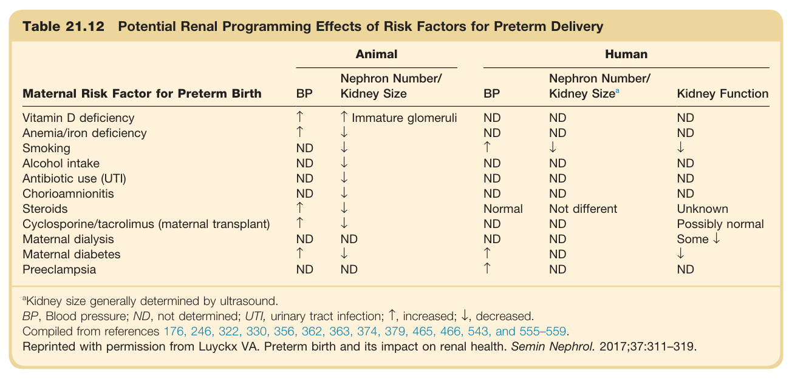

#### Table Data (CSV: [Table_21_12.csv](Table_21_12.csv))

```markdown
| Table Text (OCR) |
| :--- |
| Table 21.12 Potential Renal Programming Effects of Risk Factors for Preterm Delivery Maternal Risk Factor for Preterm Birth  Animal  Human    BP  Nephron Number/ Kidney Size  BP  Nephron Number/ Kidney  Size^a   Kidney Function    Vitamin D deficiency  ↑  ↑ Immature glomeruli  ND  ND  ND    Anemia/iron deficiency  ↑  ↓  ND  ND  ND    Smoking  ND  ↓  ↑  ↓  ↓    Alcohol intake  ND  ↓  ND  ND  ND    Antibiotic use (UTI)  ND  ↓  ND  ND  ND    Chorioamnionitis  ND  ↓  ND  ND  ND    Steroids  ↑  ↓  Normal  Not different  Unknown    Cyclosporine/tacrolimus (maternal transplant)  ↑  ↓  ND  ND  Possibly normal    Maternal dialysis  ND  ND  ND  ND  Some ↓    Maternal diabetes  ↑  ↓  ↑  ND  ↓    Preeclampsia  ND  ND  ↑  ND  ND <sup>a</sup>Kidney size generally determined by ultrasound. BP, Blood pressure; ND, not determined; UTI, urinary tract infection; ↑, increased; ↓, decreased. Compiled from references 176, 246, 322, 330, 356, 362, 363, 374, 379, 465, 466, 543, and 555–559. Reprinted with permission from Luyckx VA. Preterm birth and its impact on renal health. Semin Nephrol. 2017;37:311–319. |
```

Table 21.12 Potential Renal Programming Effects of Risk Factors for Preterm Delivery | | Animal | Human | | :-------------------------------------------- | :----- | :------------------------- | | Maternal Risk Factor for Preterm Birth | BP | Nephron Number/Kidney Size | | Vitamin D deficiency | ↑ | ↑ Immature glomeruli | | Anemia/iron deficiency | ↑ | ↓ | | Smoking | ND | ↓ | | Alcohol intake | ND | ↓ | | Antibiotic use (UTI) | ND | ↓ | | Chorioamnionitis | ND | ↓ | | Steroids | ↑ | ↓ | | Cyclosporine/tacrolimus (maternal transplant) | ↑ | ↓ | | Maternal dialysis | ND | ND | | Maternal diabetes | ↑ | ↓ | | Preeclampsia | ND | ND | Kidney size generally determined by ultrasound. BP, Blood pressure; ND, not determined; UTI, urinary tract infection; ↑, increased; ↓, decreased. Compiled from references 176, 246, 322, 330, 356, 362, 363, 374, 379, 465, 466, 543, and 555-559. Reprinted with permission from Luyckx VA. Preterm birth and its impact on renal health. Semin Nephrol. 2017;37:311-319.

---

### Table_21_13

#### Table Image

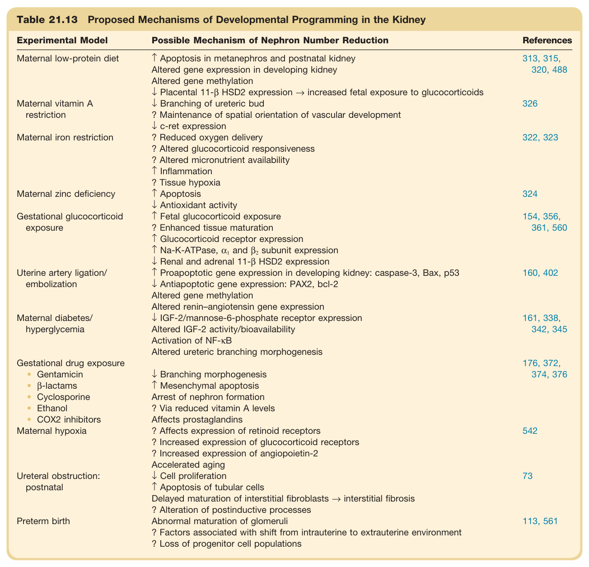

#### Table Data (CSV: [Table_21_13.csv](Table_21_13.csv))

```markdown
| Table Text (OCR) |
| :--- |
| Table 21.13 Proposed Mechanisms of Developmental Programming in the Kidney Experimental Model  Possible Mechanism of Nephron Number Reduction  References    Maternal low-protein diet  ↑ Apoptosis in metanephros and postnatal kidney  313, 315, 320, 488    Altered gene expression in developing kidney    Altered gene methylation    ↓ Placental 11-β HSD2 expression → increased fetal exposure to glucocorticoids    Maternal vitamin A restriction  ↓ Branching of ureteric bud  326    ? Maintenance of spatial orientation of vascular development    ↓ c-ret expression    Maternal iron restriction  ? Reduced oxygen delivery  322, 323    ? Altered glucocorticoid responsiveness    ? Altered micronutrient availability    ↑ Inflammation    ? Tissue hypoxia    Maternal zinc deficiency  ↑ Apoptosis  324    ↓ Antioxidant activity    Gestational glucocorticoid exposure  ↑ Fetal glucocorticoid exposure  154, 356, 361, 560    ? Enhanced tissue maturation    ↑ Glucocorticoid receptor expression    ↑ Na-K-ATPase,  \alpha_1  and  \beta_2  subunit expression    ↓ Renal and adrenal 11-β HSD2 expression    Uterine artery ligation/embolization  ↑ Proapoptotic gene expression in developing kidney: caspase-3, Bax, p53  160, 402    ↓ Antiapoptotic gene expression: PAX2, bcl-2    Altered gene methylation    Altered renin-angiotensin gene expression    Maternal diabetes/hyperglycemia  ↓ IGF-2/mannose-6-phosphate receptor expression  161, 338, 342, 345    Altered IGF-2 activity/bioavailability    Activation of NF- \kappa B    Altered ureteric branching morphogenesis    Gestational drug exposure    176, 372, 374, 376    • Gentamicin  ↓ Branching morphogenesis    • β-lactams  ↑ Mesenchymal apoptosis    • Cyclosporine  Arrest of nephron formation    • Ethanol  ? Via reduced vitamin A levels    • COX2 inhibitors  Affects prostaglandins    Maternal hypoxia  ? Affects expression of retinoid receptors  542    ? Increased expression of glucocorticoid receptors    ? Increased expression of angiopoietin-2    Accelerated aging    Ureteral obstruction: postnatal  ↓ Cell proliferation  73    ↑ Apoptosis of tubular cells    Delayed maturation of interstitial fibroblasts → interstitial fibrosis    ? Alteration of postinductive processes    Preterm birth  Abnormal maturation of glomeruli  113, 561    ? Factors associated with shift from intrauterine to extrauterine environment    ? Loss of progenitor cell populations |
```

Table 21.13 Proposed Mechanisms of Developmental Programming in the Kidney | Experimental Model | Possible Mechanism of Nephron Number Reduction | References | | :----------------------------------------------------------- | :----------------------------------------------------------- | :----------------- | | Maternal low-protein diet | ↑ Apoptosis in metanephros and postnatal kidney, Altered gene expression in developing kidney, Altered gene methylation, ↓Placental 11-ẞ HSD2 expression → increased fetal exposure to glucocorticoids | 313, 315, 320, 488 | | Maternal vitamin A restriction | ↓Branching of ureteric bud, ? Maintenance of spatial orientation of vascular development, ↓c-ret expression | 326 | | Maternal iron restriction | ? Reduced oxygen delivery, ? Altered glucocorticoid responsiveness, ? Altered micronutrient availability | 322, 323 | | Maternal zinc deficiency | ↑ Inflammation, ? Tissue hypoxia, ↑ Apoptosis, ↓ Antioxidant activity | 324 | | Gestational glucocorticoid exposure | ↑ Fetal glucocorticoid exposure, ? Enhanced tissue maturation, ↑ Glucocorticoid receptor expression, ↑ Na-K-ATPase, a₁ and ẞ₂ subunit expression | 154, 356, 361, 560 | | Uterine artery ligation/embolization | ↓ Renal and adrenal 11-ẞ HSD2 expression, ↑ Proapoptotic gene expression in developing kidney: caspase-3, Bax, p53, ↓ Antiapoptotic gene expression: PAX2, bcl-2, Altered gene methylation | 160, 402 | | Maternal diabetes/hyperglycemia | Altered renin-angiotensin gene expression, ↓IGF-2/mannose-6-phosphate receptor expression, Altered IGF-2 activity/bioavailability, Activation of NF-kB, Altered ureteric branching morphogenesis | 161, 338, 342, 345 | | Gestational drug exposure • Gentamicin • ẞ-lactams • Cyclosporine • Ethanol • COX2 inhibitors | ↓Branching morphogenesis, ↑ Mesenchymal apoptosis, Arrest of nephron formation, ? Via reduced vitamin A levels, Affects prostaglandins | 176, 372, 374, 376 | | Maternal hypoxia | ? Affects expression of retinoid receptors, ? Increased expression of glucocorticoid receptors, ? Increased expression of angiopoietin-2 | 542 | | Ureteral obstruction: postnatal | Accelerated aging, ↓Cell proliferation, ↑ Apoptosis of tubular cells, Delayed maturation of interstitial fibroblasts → interstitial fibrosis, ? Alteration of postinductive processes | 73 | | Preterm birth | Abnormal maturation of glomeruli, ? Factors associated with shift from intrauterine to extrauterine environment, ? Loss of progenitor cell populations | 113, 561 |

---

### Table_21_14

#### Table Image

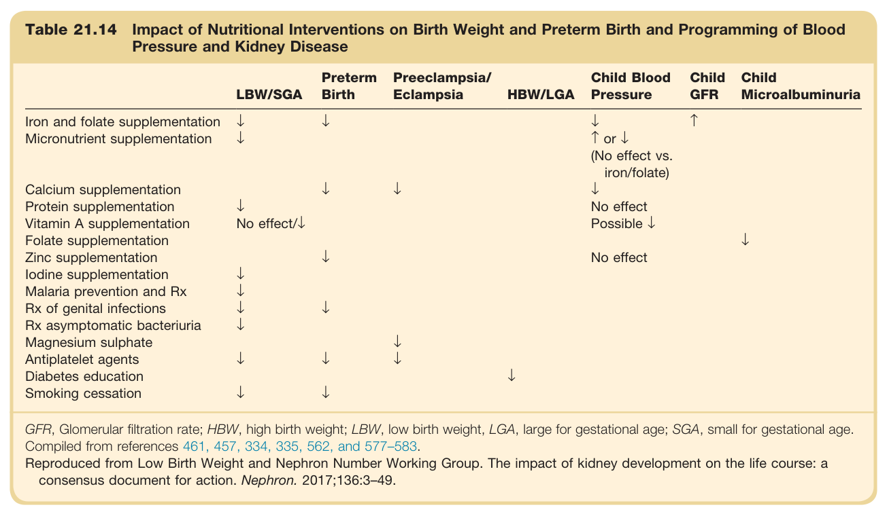

#### Table Data (CSV: [Table_21_14.csv](Table_21_14.csv))

```markdown
| Table Text (OCR) |
| :--- |
| Table 21.14 Impact of Nutritional Interventions on Birth Weight and Preterm Birth and Programming of Blood Pressure and Kidney Disease LBW/SGA  Preterm Birth  Preeclampsia/Eclampsia  HBW/LGA  Child Blood Pressure  Child GFR  Child Microalbuminuria    Iron and folate supplementation  ↓  ↓      ↓  ↑      Micronutrient supplementation  ↓        ↑ or ↓(No effect vs. iron/folate)        Calcium supplementation    ↓  ↓    ↓        Protein supplementation  ↓        No effect        Vitamin A supplementation  No effect/↓        Possible ↓        Folate supplementation              ↓    Zinc supplementation    ↓      No effect        Iodine supplementation  ↓                Malaria prevention and Rx  ↓                Rx of genital infections  ↓  ↓              Rx asymptomatic bacteriuria  ↓                Magnesium sulphate      ↓            Antiplatelet agents  ↓  ↓  ↓            Diabetes education        ↓          Smoking cessation  ↓  ↓ GFR, Glomerular filtration rate; HBW, high birth weight; LBW, low birth weight, LGA, large for gestational age; SGA, small for gestational age. Compiled from references 461, 457, 334, 335, 562, and 577–583. Reproduced from Low Birth Weight and Nephron Number Working Group. The impact of kidney development on the life course: a consensus document for action. Nephron. 2017;136:3–49. |
```

Table 21.14 Impact of Nutritional Interventions on Birth Weight and Preterm Birth and Programming of Blood Pressure and Kidney Disease | | LBW/SGA | Preterm Birth | Preeclampsia/Eclampsia | HBW/LGA | Child Blood Pressure | Child GFR | Child Microalbuminuria | | :------------------------------ | :---------- | :------------ | :--------------------- | :------ | :-------------------------------- | :-------- | :--------------------- | | Iron and folate supplementation | ↓ | ↓ | ↓ | | ↑ | | ↓ | | Micronutrient supplementation | ↓ | | | ↑ | ↑ or↓ (No effect vs. iron/folate) | | | | Calcium supplementation | | ↓ | ↓ | | ↓ | | | | Protein supplementation | ↓ | ↓ | ↓ | | No effect | | | | Vitamin A supplementation | No effect/↓ | | | | Possible↓ | | | | Folate supplementation | | | | | | ↓ | | | Zinc supplementation | | ↓ | | | No effect | | | | lodine supplementation | ↓ | | | | | | | | Malaria prevention and Rx | ↓ | | | | | | | | Rx of genital infections | ↓ | ↓ | | | | | | | Rx asymptomatic bacteriuria | ↓ | | | | | | | | Magnesium sulphate | | ↓ | ↓ | | | | | | Antiplatelet agents | ↓ | ↓ | ↓ | | | | | | Diabetes education | | | | ↓ | | | | | Smoking cessation | ↓ | ↓ | | | | | | GFR, Glomerular filtration rate; HBW, high birth weight; LBW, low birth weight, LGA, large for gestational age; SGA, small for gestational age. Compiled from references 461, 457, 334, 335, 562, and 577-583. Reproduced from Low Birth Weight and Nephron Number Working Group. The impact of kidney development on the life course: a consensus document for action. Nephron. 2017;136:3-49.

---

### Table_21_15

#### Table Image

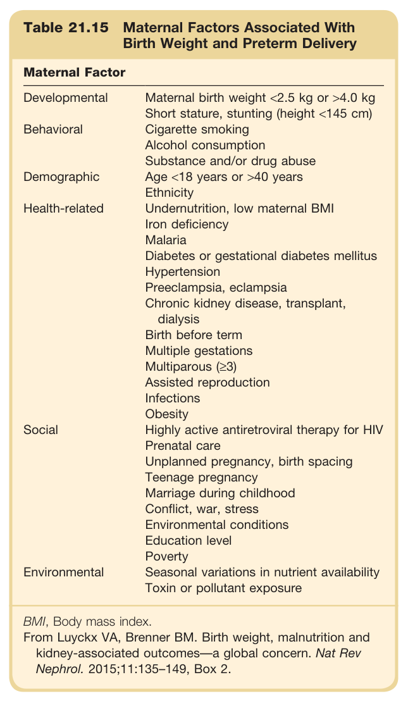

#### Table Data (CSV: [Table_21_15.csv](Table_21_15.csv))

```markdown
| Table Text (OCR) |
| :--- |
| Table 21.15 Maternal Factors Associated With Birth Weight and Preterm Delivery Maternal Factor Developmental  Maternal birth weight <2.5 kg or >4.0 kgShort stature, stunting (height <145 cm)    Behavioral  Cigarette smokingAlcohol consumptionSubstance and/or drug abuse    Demographic  Age <18 years or >40 yearsEthnicity    Health-related  Undernutrition, low maternal BMIIron deficiencyMalariaDiabetes or gestational diabetes mellitusHypertensionPreeclampsia, eclampsiaChronic kidney disease, transplant, dialysisBirth before termMultiple gestationsMultiparous (≥3)Assisted reproductionInfectionsObesity    Social  Highly active antiretroviral therapy for HIVPrenatal careUnplanned pregnancy, birth spacingTeenage pregnancyMarriage during childhoodConflict, war, stressEnvironmental conditionsEducation levelPoverty    Environmental  Seasonal variations in nutrient availabilityToxin or pollutant exposure BMI, Body mass index. From Luyckx VA, Brenner BM. Birth weight, malnutrition and kidney-associated outcomes—a global concern. Nat Rev Nephrol. 2015;11:135–149, Box 2. |
```

Table 21.15 Maternal Factors Associated With Birth Weight and Preterm Delivery | Maternal Factor | | | :-------------- | :----------------------------------------------------------- | | Developmental | Maternal birth weight <2.5 kg or >4.0 kg, Short stature, stunting (height <145 cm) | | Behavioral | Cigarette smoking, Alcohol consumption, Substance and/or drug abuse | | Demographic | Age <18 years or >40 years, Ethnicity | | Health-related | Undernutrition, low maternal BMI, Iron deficiency, Malaria, Diabetes or gestational diabetes mellitus, Hypertension, Preeclampsia, eclampsia, Chronic kidney disease, transplant, dialysis, Birth before term, Multiple gestations, Multiparous (≥3), Assisted reproduction, Infections, Obesity, Highly active antiretroviral therapy for HIV | | Social | Prenatal care, Unplanned pregnancy, birth spacing, Teenage pregnancy, Marriage during childhood, Conflict, war, stress | | Environmental | Environmental conditions, Education level, Poverty, Seasonal variations in nutrient availability, Toxin or pollutant exposure | BMI, Body mass index. From Luyckx VA, Brenner BM. Birth weight, malnutrition and kidney-associated outcomes-a global concern. Nat Rev Nephrol. 2015;11:135-149, Box 2.

---

### Table_21_16

#### Table Image

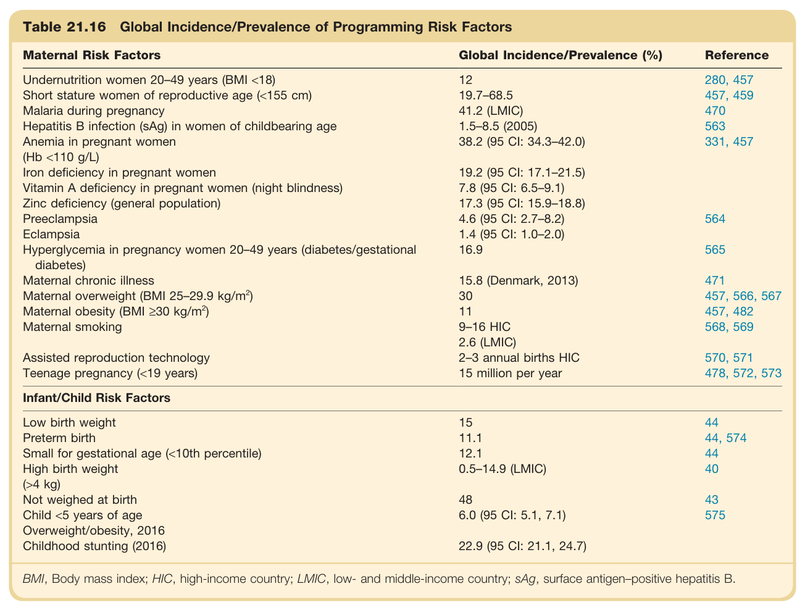

#### Table Data (CSV: [Table_21_16.csv](Table_21_16.csv))

```markdown
| Table Text (OCR) |
| :--- |
| Table 21.16 Global Incidence/Prevalence of Programming Risk Factors Maternal Risk Factors  Global Incidence/Prevalence (%)  Reference    Undernutrition women 20–49 years (BMI <18)  12  280, 457    Short stature women of reproductive age (<155 cm)  19.7–68.5  457, 459    Malaria during pregnancy  41.2 (LMIC)  470    Hepatitis B infection (sAg) in women of childbearing age  1.5–8.5 (2005)  563    Anemia in pregnant women(Hb <110 g/L)  38.2 (95 CI: 34.3–42.0)  331, 457    Iron deficiency in pregnant women  19.2 (95 CI: 17.1–21.5)      Vitamin A deficiency in pregnant women (night blindness)  7.8 (95 CI: 6.5–9.1)      Zinc deficiency (general population)  17.3 (95 CI: 15.9–18.8)      Preeclampsia  4.6 (95 CI: 2.7–8.2)  564    Eclampsia  1.4 (95 CI: 1.0–2.0)      Hyperglycemia in pregnancy women 20–49 years (diabetes/gestational diabetes)  16.9  565    Maternal chronic illness  15.8 (Denmark, 2013)  471    Maternal overweight (BMI 25–29.9 kg/m2)  30  457, 566, 567    Maternal obesity (BMI ≥30 kg/m2)  11  457, 482    Maternal smoking  9–16 HIC2.6 (LMIC)  568, 569    Assisted reproduction technology  2–3 annual births HIC  570, 571    Teenage pregnancy (<19 years)  15 million per year  478, 572, 573    Infant/Child Risk Factors    Low birth weight  15  44    Preterm birth  11.1  44, 574    Small for gestational age (<10th percentile)  12.1  44    High birth weight(>4 kg)  0.5–14.9 (LMIC)  40    Not weighed at birth  48  43    Child <5 years of age  6.0 (95 CI: 5.1, 7.1)  575    Overweight/obesity, 2016        Childhood stunting (2016)  22.9 (95 CI: 21.1, 24.7) BMI, Body mass index; HIC, high-income country; LMIC, low- and middle-income country; sAg, surface antigen–positive hepatitis B. |
```

Table 21.16 Global Incidence/Prevalence of Programming Risk Factors | Maternal Risk Factors | Global Incidence/Prevalence (%) | Reference | | :----------------------------------------------------------- | :------------------------------ | :------------ | | Undernutrition women 20-49 years (BMI <18) | 12 | 280, 457 | | Short stature women of reproductive age (<155 cm) | 19.7-68.5 | 457, 459 | | Malaria during pregnancy | 41.2 (LMIC) | 470 | | Hepatitis B infection (sAg) in women of childbearing age | 1.5-8.5 (2005) | 563 | | Anemia in pregnant women (Hb <110 g/L) | 38.2 (95 CI: 34.3-42.0) | 331, 457 | | Iron deficiency in pregnant women | 19.2 (95 CI: 17.1-21.5) | | | Vitamin A deficiency in pregnant women (night blindness) | 7.8 (95 CI: 6.5-9.1) | | | Zinc deficiency (general population) | 17.3 (95 CI: 15.9-18.8) | | | Preeclampsia | 4.6 (95 CI: 2.7-8.2) | 564 | | Eclampsia | 1.4 (95 CI: 1.0-2.0) | | | Hyperglycemia in pregnancy women 20-49 years (diabetes/gestational diabetes) | 16.9 | 565 | | Maternal chronic illness | 15.8 (Denmark, 2013) | 471 | | Maternal overweight (BMI 25-29.9 kg/m²) | 30 | 457, 566, 567 | | Maternal obesity (BMI ≥30 kg/m²) | 11 | 457, 482 | | Maternal smoking | 9-16 HIC, 2.6 (LMIC) | 568, 569 | | Assisted reproduction technology | 2-3 annual births HIC | 570, 571 | | Teenage pregnancy (<19 years) | 15 million per year | 478, 572, 573 | | **Infant/Child Risk Factors** | | | | Low birth weight | 15 | 44 | | Preterm birth | 11.1 | 44, 574 | | Small for gestational age (<10th percentile) | 12.1 | 44 | | High birth weight (>4 kg) | 0.5-14.9 (LMIC) | 40 | | Not weighed at birth | 48 | 43 | | Child <5 years of age, Overweight/obesity, 2016 | 6.0 (95 CI: 5.1, 7.1) | 575 | | Childhood stunting (2016) | 22.9 (95 CI: 21.1, 24.7) | | BMI, Body mass index; HIC, high-income country; LMIC, low- and middle-income country; sAg, surface antigen-positive hepatitis B.

---

### Table_21_17

#### Table Image

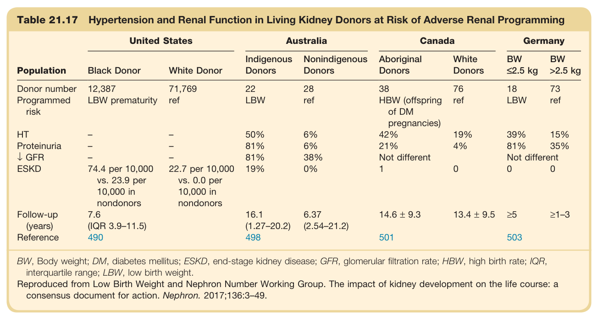

#### Table Data (CSV: [Table_21_17.csv](Table_21_17.csv))

```markdown
| Table Text (OCR) |
| :--- |
| Table 21.17 Hypertension and Renal Function in Living Kidney Donors at Risk of Adverse Renal Programming Population  United States  Australia  Canada  Germany    Black Donor  White Donor  Indigenous Donors  Nonindigenous Donors  Aboriginal Donors  White Donors  BW ≤2.5 kg  BW >2.5 kg    Donor number  12,387  71,769  22  28  38  76  18  73    Programmed risk  LBW prematurity  ref  LBW  ref  HBW (offspring of DM pregnancies)  ref  LBW  ref    HT  -  -  50%  6%  42%  19%  39%  15%    Proteinuria  -  -  81%  6%  21%  4%  81%  35%    ↓ GFR  -  -  81%  38%  Not different    Not different    ESKD  74.4 per 10,000 vs. 23.9 per 10,000 in nondonors  22.7 per 10,000 vs. 0.0 per 10,000 in nondonors  19%  0%  1  0  0  0    Follow-up (years)  7.6(IQR 3.9–11.5)    16.1(1.27–20.2)  6.37(2.54–21.2)  14.6 ± 9.3  13.4 ± 9.5  ≥5  ≥1–3    Reference  490    498    501    503 BW, Body weight; DM, diabetes mellitus; ESKD, end-stage kidney disease; GFR, glomerular filtration rate; HBW, high birth rate; IQR, interquartile range; LBW, low birth weight. Reproduced from Low Birth Weight and Nephron Number Working Group. The impact of kidney development on the life course: a consensus document for action. Nephron. 2017;136:3–49. |
```

Table 21.17 Hypertension and Renal Function in Living Kidney Donors at Risk of Adverse Renal Programming | | United States | Australia | Canada | Germany | | :---------------- | :----------------------------------------------- | :---------------------------------------------- | :---------------- | :------------------- | | Population | Black Donor | White Donor | Indigenous Donors | Nonindigenous Donors | | Donor number | 12,387 | 71,769 | 22 | 28 | | Programmed risk | LBW prematurity | ref | LBW | ref | | HT | | | 50% | 6% | | Proteinuria | | | 81% | 6% | | ↓ GFR | | | 81% | 38% | | ESKD | 74.4 per 10,000 vs. 23.9 per 10,000 in nondonors | 22.7 per 10,000 vs. 0.0 per 10,000 in nondonors | 19% | 0% | | Follow-up (years) | 7.6 (IQR 3.9-11.5) | | 16.1 (1.27-20.2) | 6.37 (2.54-21.2) | | Reference | 490 | | 498 | | BW, Body weight; DM, diabetes mellitus; ESKD, end-stage kidney disease; GFR, glomerular filtration rate; HBW, high birth rate; IQR, interquartile range; LBW, low birth weight. Reproduced from Low Birth Weight and Nephron Number Working Group. The impact of kidney development on the life course: a consensus document for action. Nephron. 2017;136:3-49.

---
