# 22. The Physiology and Pathophysiology of the Kidneys in Aging - Figures and Tables Index

This document lists all figures, tables and boxes extracted from `22. The Physiology and Pathophysiology of the Kidneys in Aging.pdf`.

## Table of Contents
- [Figures](#figures)
- [Tables](#tables)
- [Boxes](#boxes)

---

## Figures

### Fig_22_1

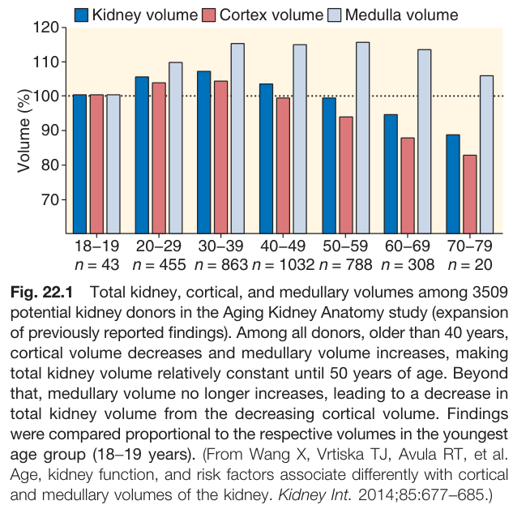

Fig. 22.1 Total kidney, cortical, and medullary volumes among 3509 potential kidney donors in the Aging Kidney Anatomy study (expansion of previously reported findings). Among all donors, older than 40 years, cortical volume decreases and medullary volume increases, making total kidney volume relatively constant until 50 years of age. Beyond that, medullary volume no longer increases, leading to a decrease in total kidney volume from the decreasing cortical volume. Findings were compared proportional to the respective volumes in the youngest age group (18-19 years). (From Wang X, Vrtiska TJ, Avula RT, et al. Age, kidney function, and risk factors associate differently with cortical and medullary volumes of the kidney. Kidney Int. 2014;85:677-685.)

---

### Fig_22_2

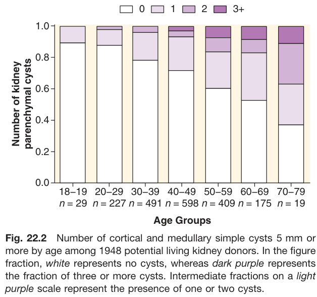

Fig. 22.2 Number of cortical and medullary simple cysts 5 mm or more by age among 1948 potential living kidney donors. In the figure fraction, white represents no cysts, whereas dark purple represents the fraction of three or more cysts. Intermediate fractions on a light purple scale represent the presence of one or two cysts.

---

### Fig_22_3

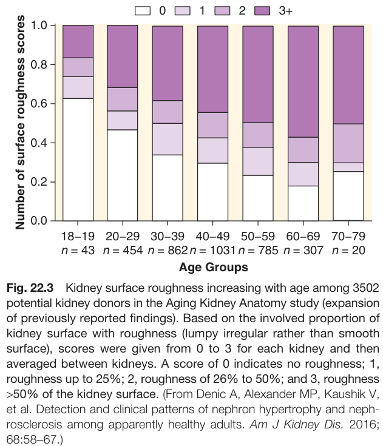

Fig. 22.3 Kidney surface roughness increasing with age among 3502 potential kidney donors in the Aging Kidney Anatomy study (expansion of previously reported findings). Based on the involved proportion of kidney surface with roughness (lumpy irregular rather than smooth surface), scores were given from 0 to 3 for each kidney and then averaged between kidneys. A score of 0 indicates no roughness; 1, roughness up to 25%; 2, roughness of 26% to 50%; and 3, roughness >50% of the kidney surface. (From Denic A, Alexander MP, Kaushik V, et al. Detection and clinical patterns of nephron hypertrophy and neph-rosclerosis among apparently healthy adults. Am J Kidney Dis. 2016; 68:58-67.)

---

### Fig_22_4

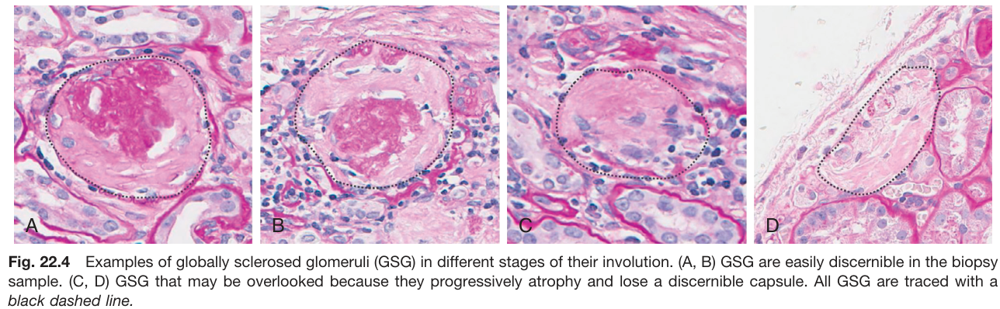

Fig. 22.4 Examples of globally sclerosed glomeruli (GSG) in different stages of their involution. (A, B) GSG are easily discernible in the biopsy sample. (C, D) GSG that may be overlooked because they progressively atrophy and lose a discernible capsule. All GSG are traced with a black dashed line.

---

### Fig_22_5

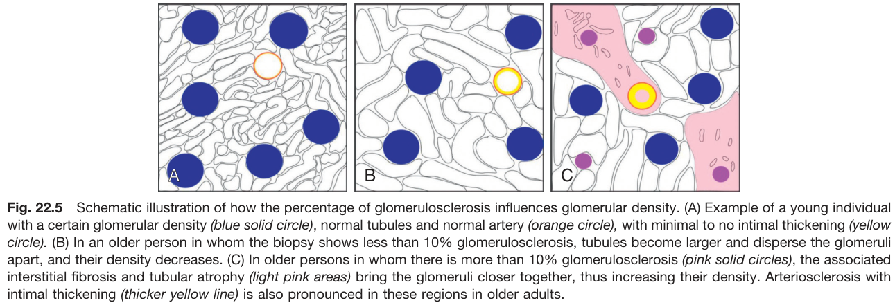

Fig. 22.5 Schematic illustration of how the percentage of glomerulosclerosis influences glomerular density. (A) Example of a young individual with a certain glomerular density (blue solid circle), normal tubules and normal artery (orange circle), with minimal to no intimal thickening (yellow circle). (B) In an older person in whom the biopsy shows less than 10% glomerulosclerosis, tubules become larger and disperse the glomeruli apart, and their density decreases. (C) In older persons in whom there is more than 10% glomerulosclerosis (pink solid circles), the associated interstitial fibrosis and tubular atrophy (light pink areas) bring the glomeruli closer together, thus increasing their density. Arteriosclerosis with intimal thickening (thicker yellow line) is also pronounced in these regions in older adults.

---

### Fig_22_6

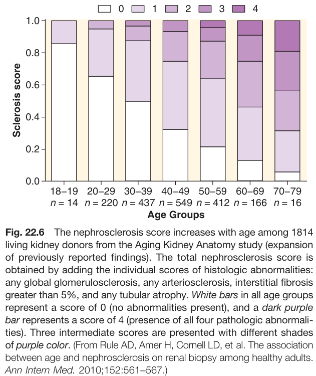

Fig. 22.6 The nephrosclerosis score increases with age among 1814 living kidney donors from the Aging Kidney Anatomy study (expansion of previously reported findings). The total nephrosclerosis score is obtained by adding the individual scores of histologic abnormalities: any global glomerulosclerosis, any arteriosclerosis, interstitial fibrosis greater than 5%, and any tubular atrophy. White bars in all age groups represent a score of 0 (no abnormalities present), and a dark purple bar represents a score of 4 (presence of all four pathologic abnormalities). Three intermediate scores are presented with different shades of purple color. (From Rule AD, Amer H, Cornell LD, et al. The association between age and nephrosclerosis on renal biopsy among healthy adults. Ann Intern Med. 2010;152:561-567.)

---

### Fig_22_7

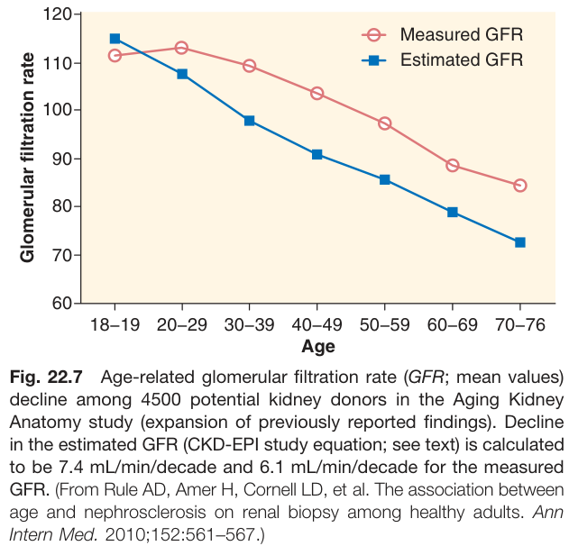

Fig. 22.7 Age-related glomerular filtration rate (GFR; mean values) decline among 4500 potential kidney donors in the Aging Kidney Anatomy study (expansion of previously reported findings). Decline in the estimated GFR (CKD-EPI study equation; see text) is calculated to be 7.4 mL/min/decade and 6.1 mL/min/decade for the measured GFR. (From Rule AD, Amer H, Cornell LD, et al. The association between age and nephrosclerosis on renal biopsy among healthy adults. Ann Intern Med. 2010;152:561-567.)

---

## Tables

### Table_22_1

#### Table Image

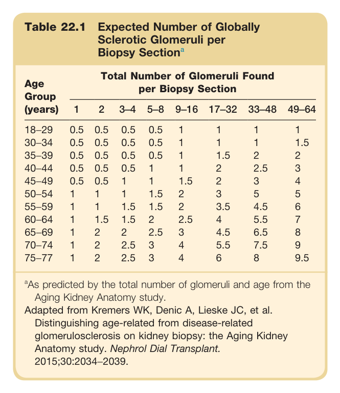

#### Table Data (CSV: [Table_22_1.csv](Table_22_1.csv))

```markdown
| Table Text (OCR) |
| :--- |
| Table 22.1 Expected Number of Globally Sclerotic Glomeruli per Biopsy Section<sup>a</sup> Age Group (years)  Total Number of Glomeruli Found per Biopsy Section    1  2  3-4  5-8  9-16  17-32  33-48  49-64    18-29  0.5  0.5  0.5  0.5  1  1  1  1    30-34  0.5  0.5  0.5  0.5  1  1  1  1.5    35-39  0.5  0.5  0.5  0.5  1  1.5  2  2    40-44  0.5  0.5  0.5  1  1  2  2.5  3    45-49  0.5  0.5  1  1  1.5  2  3  4    50-54  1  1  1  1.5  2  3  5  5    55-59  1  1  1.5  1.5  2  3.5  4.5  6    60-64  1  1.5  1.5  2  2.5  4  5.5  7    65-69  1  2  2  2.5  3  4.5  6.5  8    70-74  1  2  2.5  3  4  5.5  7.5  9    75-77  1  2  2.5  3  4  6  8  9.5 <sup>a</sup>As predicted by the total number of glomeruli and age from the Aging Kidney Anatomy study. Adapted from Kremers WK, Denic A, Lieske JC, et al. Distinguishing age-related from disease-related glomerulosclerosis on kidney biopsy: the Aging Kidney Anatomy study. Nephrol Dial Transplant. 2015;30:2034−2039. |
```

Table 22.1 Expected Number of Globally Sclerotic Glomeruli per Biopsy Section | Age Group (years) | Total Number of Glomeruli Found per Biopsy Section | | | | | | | | :--- | :-: | :-: | :-: | :-: | :-: | :-: | :-: | | | **1** | **2** | **3-4** | **5-8** | **9-16** | **17-32** | **33-48** | **49-64** | | 18-29 | 0.5 | 0.5 | 0.5 | 0.5 | 1 | 1 | 1 | 1 | | 30-34 | 0.5 | 0.5 | 0.5 | 0.5 | 1 | 1 | 1 | 1.5 | | 35-39 | 0.5 | 0.5 | 0.5 | 0.5 | 1 | 1.5 | 2 | 2 | | 40-44 | 0.5 | 0.5 | 0.5 | 1 | 1 | 2 | 2.5 | 3 | | 45-49 | 0.5 | 0.5 | 1 | 1 | 1.5 | 2 | 3 | 4 | | 50-54 | 1 | 1 | 1 | 1.5 | 2 | 3 | 5 | 5 | | 55-59 | 1 | 1 | 1.5 | 1.5 | 2 | 3.5 | 4.5 | 6 | | 60-64 | 1 | 1.5 | 1.5 | 2 | 2.5 | 4 | 5.5 | 7 | | 65-69 | 1 | 2 | 2 | 2.5 | 3 | 4.5 | 6.5 | 8 | | 70-74 | 1 | 2 | 2.5 | 3 | 4 | 5.5 | 7.5 | 9 | | 75-77 | 1 | 2 | 2.5 | 3 | 4 | 6 | 8 | 9.5 | *As predicted by the total number of glomeruli and age from the Aging Kidney Anatomy study.* *Adapted from Kremers WK, Denic A, Lieske JC, et al. Distinguishing age-related from disease-related glomerulosclerosis on kidney biopsy: the Aging Kidney Anatomy study. Nephrol Dial Transplant. 2015;30:2034-2039.*

---

### Table_22_2

#### Table Image

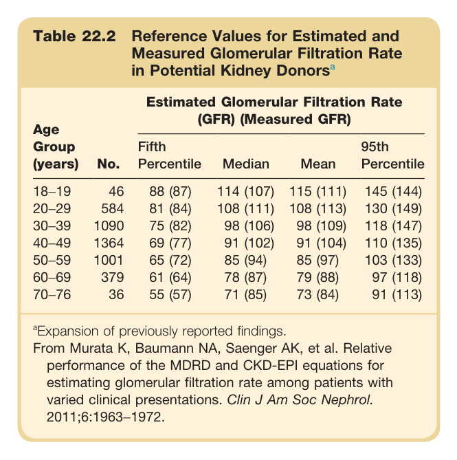

#### Table Data (CSV: [Table_22_2.csv](Table_22_2.csv))

```markdown
| Table Text (OCR) |
| :--- |
| Table 22.2 Reference Values for Estimated and Measured Glomerular Filtration Rate in Potential Kidney Donors<sup>a</sup> Age Group (years)  No.  Estimated Glomerular Filtration Rate (GFR) (Measured GFR)    Fifth Percentile  Median  Mean  95th Percentile    18–19  46  88 (87)  114 (107)  115 (111)  145 (144)    20–29  584  81 (84)  108 (111)  108 (113)  130 (149)    30–39  1090  75 (82)  98 (106)  98 (109)  118 (147)    40–49  1364  69 (77)  91 (102)  91 (104)  110 (135)    50–59  1001  65 (72)  85 (94)  85 (97)  103 (133)    60–69  379  61 (64)  78 (87)  79 (88)  97 (118)    70–76  36  55 (57)  71 (85)  73 (84)  91 (113) <sup>a</sup>Expansion of previously reported findings. From Murata K, Baumann NA, Saenger AK, et al. Relative performance of the MDRD and CKD-EPI equations for estimating glomerular filtration rate among patients with varied clinical presentations. Clin J Am Soc Nephrol. 2011;6:1963−1972. |
```

Table 22.2 Reference Values for Estimated and Measured Glomerular Filtration Rate in Potential Kidney Donors | Age Group (years) | No. | Estimated Glomerular Filtration Rate (GFR) (Measured GFR) | | | | | :--- | :-: | :--- | :--- | :--- | :--- | | | | **Fifth Percentile** | **Median** | **Mean** | **95th Percentile** | | 18-19 | 46 | 88 (87) | 114 (107) | 115 (111) | 145 (144) | | 20-29 | 584 | 81 (84) | 108 (111) | 108 (113) | 130 (149) | | 30-39 | 1090 | 75 (82) | 98 (106) | 98 (109) | 118 (147) | | 40-49 | 1364 | 69 (77) | 91 (102) | 91 (104) | 110 (135) | | 50-59 | 1001 | 65 (72) | 85 (94) | 85 (97) | 103 (133) | | 60-69 | 379 | 61 (64) | 78 (87) | 79 (88) | 97 (118) | | 70-76 | 36 | 55 (57) | 71 (85) | 73 (84) | 91 (113) | *Expansion of previously reported findings.* *From Murata K, Baumann NA, Saenger AK, et al. Relative performance of the MDRD and CKD-EPI equations for estimating glomerular filtration rate among patients with varied clinical presentations. Clin J Am Soc Nephrol. 2011;6:1963-1972.*

---

## Boxes

### Box_22_1

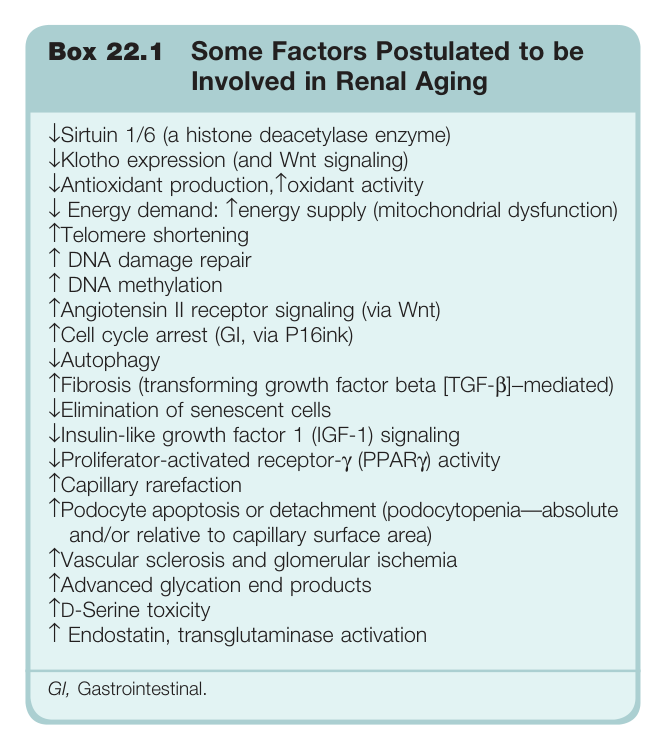

#### Box Text

```markdown
Box 22.1 Some Factors Postulated to be Involved in Renal Aging ↓Sirtuin 1/6 (a histone deacetylase enzyme) ↓Klotho expression (and Wnt signaling) ↓Antioxidant production, Toxidant activity ↓ Energy demand: Tenergy supply (mitochondrial dysfunction) ↑Telomere shortening ↑ DNA damage repair ↑ DNA methylation ↑Angiotensin II receptor signaling (via Wnt) ↑Cell cycle arrest (Gl, via P16ink) ↓Autophagy ↑Fibrosis (transforming growth factor beta [TGF-β]-mediated) ↓Elimination of senescent cells ↓Insulin-like growth factor 1 (IGF-1) signaling ↓Proliferator-activated receptor-y (PPARy) activity ↑Capillary rarefaction ↑Podocyte apoptosis or detachment (podocytopenia-absolute and/or relative to capillary surface area) ↑Vascular sclerosis and glomerular ischemia ↑Advanced glycation end products ↑D-Serine toxicity ↑ Endostatin, transglutaminase activation Gl, Gastrointestinal.
```

Box 22.1 Some Factors Postulated to be Involved in Renal Aging ↓Sirtuin 1/6 (a histone deacetylase enzyme) ↓Klotho expression (and Wnt signaling) ↓Antioxidant production, Toxidant activity ↓ Energy demand: Tenergy supply (mitochondrial dysfunction) ↑Telomere shortening ↑ DNA damage repair ↑ DNA methylation ↑Angiotensin II receptor signaling (via Wnt) ↑Cell cycle arrest (Gl, via P16ink) ↓Autophagy ↑Fibrosis (transforming growth factor beta [TGF-β]-mediated) ↓Elimination of senescent cells ↓Insulin-like growth factor 1 (IGF-1) signaling ↓Proliferator-activated receptor-y (PPARy) activity ↑Capillary rarefaction ↑Podocyte apoptosis or detachment (podocytopenia-absolute and/or relative to capillary surface area) ↑Vascular sclerosis and glomerular ischemia ↑Advanced glycation end products ↑D-Serine toxicity ↑ Endostatin, transglutaminase activation Gl, Gastrointestinal.

---

### Box_22_2

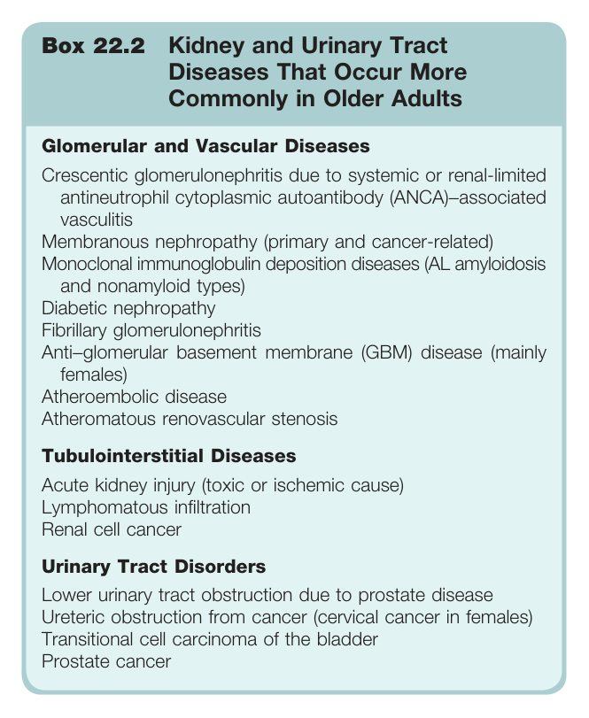

#### Box Text

```markdown
Box 22.2 Kidney and Urinary Tract Diseases That Occur More Commonly in Older Adults **Glomerular and Vascular Diseases** Crescentic glomerulonephritis due to systemic or renal-limited antineutrophil cytoplasmic autoantibody (ANCA)-associated vasculitis Membranous nephropathy (primary and cancer-related) Monoclonal immunoglobulin deposition diseases (AL amyloidosis and nonamyloid types) Diabetic nephropathy Fibrillary glomerulonephritis Anti-glomerular basement membrane (GBM) disease (mainly females) Atheroembolic disease Atheromatous renovascular stenosis **Tubulointerstitial Diseases** Acute kidney injury (toxic or ischemic cause) Lymphomatous infiltration Renal cell cancer **Urinary Tract Disorders** Lower urinary tract obstruction due to prostate disease Ureteric obstruction from cancer (cervical cancer in females) Transitional cell carcinoma of the bladder Prostate cancer
```

Box 22.2 Kidney and Urinary Tract Diseases That Occur More Commonly in Older Adults **Glomerular and Vascular Diseases** Crescentic glomerulonephritis due to systemic or renal-limited antineutrophil cytoplasmic autoantibody (ANCA)-associated vasculitis Membranous nephropathy (primary and cancer-related) Monoclonal immunoglobulin deposition diseases (AL amyloidosis and nonamyloid types) Diabetic nephropathy Fibrillary glomerulonephritis Anti-glomerular basement membrane (GBM) disease (mainly females) Atheroembolic disease Atheromatous renovascular stenosis **Tubulointerstitial Diseases** Acute kidney injury (toxic or ischemic cause) Lymphomatous infiltration Renal cell cancer **Urinary Tract Disorders** Lower urinary tract obstruction due to prostate disease Ureteric obstruction from cancer (cervical cancer in females) Transitional cell carcinoma of the bladder Prostate cancer

---
