# 23. Laboratory Assessment of Kidney Disease-Glomerular Filtration Rate, Urinalysis, and Proteinuria - Figures and Tables Index

This document lists all figures and tables extracted from `23. Laboratory Assessment of Kidney Disease-Glomerular Filtration Rate, Urinalysis, and Proteinuria.pdf`.

## Table of Contents
- [Figures](#figures)
- [Tables](#tables)

---

## Figures

### Fig_23_1

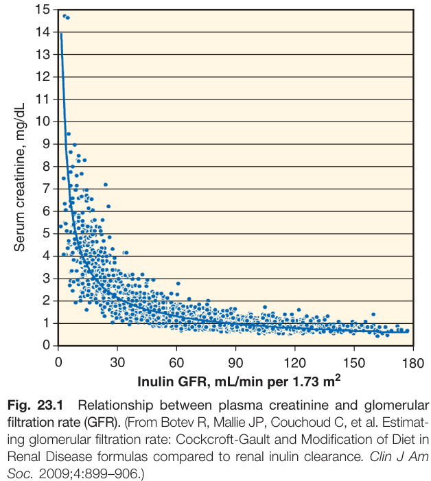

Fig. 23.1 Relationship between plasma creatinine and glomerular filtration rate (GFR). (From Botev R, Mallie JP, Couchoud C, et al. Estimating glomerular filtration rate: Cockcroft-Gault and Modification of Diet in Renal Disease formulas compared to renal inulin clearance. Clin J Am Soc. 2009;4:899-906.)

---

### Fig_23_2

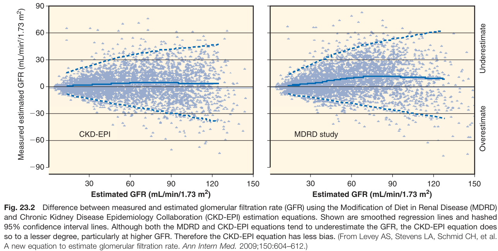

Fig. 23.2 Difference between measured and estimated glomerular filtration rate (GFR) using the Modification of Diet in Renal Disease (MDRD) and Chronic Kidney Disease Epidemiology Collaboration (CKD-EPI) estimation equations. Shown are smoothed regression lines and hashed 95% confidence interval lines. Although both the MDRD and CKD-EPI equations tend to underestimate the GFR, the CKD-EPI equation does so to a lesser degree, particularly at higher GFR. Therefore the CKD-EPI equation has less bias. (From Levey AS, Stevens LA, Schmid CH, et al. A new equation to estimate glomerular filtration rate. Ann Intern Med. 2009;150:604-612.)

---

### Fig_23_3

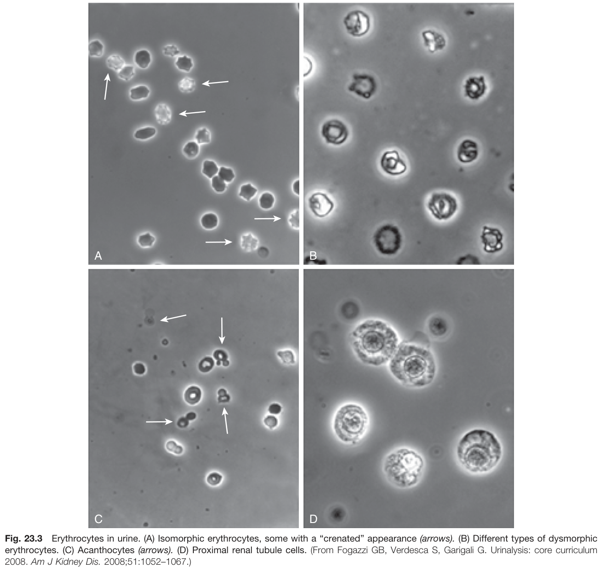

Fig. 23.3 Erythrocytes in urine. (A) Isomorphic erythrocytes, some with a "crenated" appearance (arrows). (B) Different types of dysmorphic erythrocytes. (C) Acanthocytes (arrows). (D) Proximal renal tubule cells. (From Fogazzi GB, Verdesca S, Garigali G. Urinalysis: core curriculum 2008. Am J Kidney Dis. 2008;51:1052-1067.)

---

### Fig_23_4

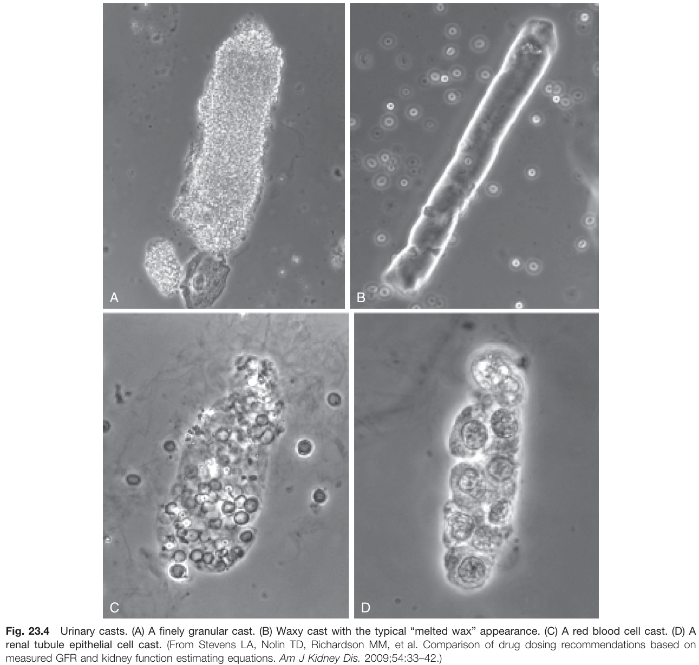

Fig. 23.4 Urinary casts. (A) A finely granular cast. (B) Waxy cast with the typical "melted wax" appearance. (C) A red blood cell cast. (D) A renal tubule epithelial cell cast. (From Stevens LA, Nolin TD, Richardson MM, et al. Comparison of drug dosing recommendations based on measured GFR and kidney function estimating equations. Am J Kidney Dis. 2009;54:33-42.)

---

## Tables

### Table_23_1

#### Table Image

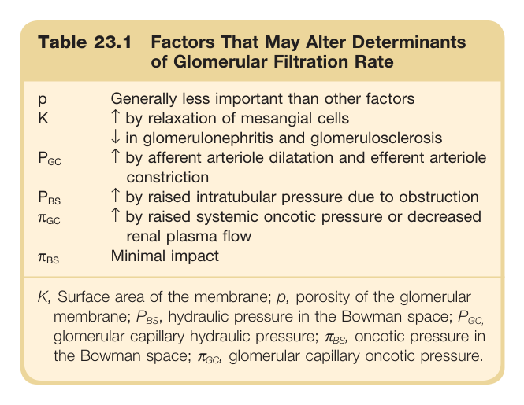

#### Table Data (CSV: [Table_23_1.csv](Table_23_1.csv))

```markdown
| Table Text (OCR) |
| :--- |
| Table 23.1 Factors That May Alter Determinants of Glomerular Filtration Rate p  Generally less important than other factors    K  ↑ by relaxation of mesangial cells↓ in glomerulonephritis and glomerulosclerosis     P_{GC}   ↑ by afferent arteriole dilatation and efferent arteriole constriction     P_{BS}   ↑ by raised intratubular pressure due to obstruction     \pi_{GC}   ↑ by raised systemic oncotic pressure or decreased renal plasma flow     \pi_{BS}   Minimal impact    K, Surface area of the membrane; p, porosity of the glomerular membrane;  P_{BS} , hydraulic pressure in the Bowman space;  P_{GC} , glomerular capillary hydraulic pressure;  \pi_{BS} , oncotic pressure in the Bowman space;  \pi_{GC} , glomerular capillary oncotic pressure. |
```

Table 23.1 Factors That May Alter Determinants of Glomerular Filtration Rate | | | | :--- | :--- | | p | Generally less important than other factors | | K | ↑ by relaxation of mesangial cells<br>↓ in glomerulonephritis and glomerulosclerosis | | PGC | ↑ by afferent arteriole dilatation and efferent arteriole constriction | | PBS | ↑ by raised intratubular pressure due to obstruction | | ΠGC | ↑ by raised systemic oncotic pressure or decreased renal plasma flow | | πβς | Minimal impact | K, Surface area of the membrane; p, porosity of the glomerular membrane; PBS, hydraulic pressure in the Bowman space; PGC, glomerular capillary hydraulic pressure; ABS, oncotic pressure in the Bowman space; Gc, glomerular capillary oncotic pressure.

---

### Table_23_2

#### Table Image

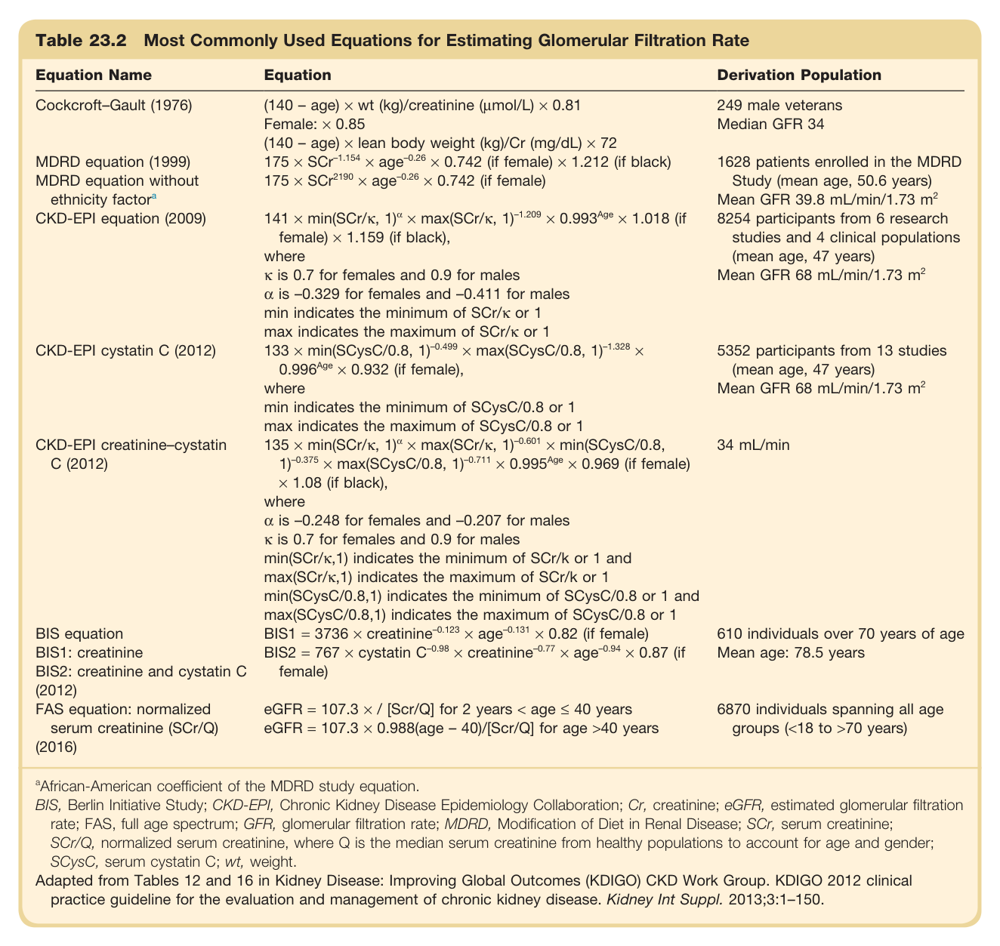

#### Table Data (CSV: [Table_23_2.csv](Table_23_2.csv))

```markdown
| Table Text (OCR) |
| :--- |
| Table 23.2 Most Commonly Used Equations for Estimating Glomerular Filtration Rate Equation Name  Equation  Derivation Population    Cockcroft-Gault (1976)  (140 - age) × wt (kg)/creatinine (μmol/L) × 0.81Female: × 0.85(140 - age) × lean body weight (kg)/Cr (mg/dL) × 72  249 male veteransMedian GFR 34    MDRD equation (1999)   175 \times \text{SCr}^{-1.154} \times \text{age}^{-0.26} \times 0.742  (if female) × 1.212 (if black)  1628 patients enrolled in the MDRD Study (mean age, 50.6 years)Mean GFR 39.8 mL/min/1.73  m^2     MDRD equation without ethnicity  factor^a    175 \times \text{SCr}^{2190} \times \text{age}^{-0.26} \times 0.742  (if female)    CKD-EPI equation (2009)   141 \times \min(\text{SCr}/\kappa, 1)^{\alpha} \times \max(\text{SCr}/\kappa, 1)^{-1.209} \times 0.993^{Age} \times 1.018  (if female) × 1.159 (if black),where \kappa  is 0.7 for females and 0.9 for males \alpha  is -0.329 for females and -0.411 for malesmin indicates the minimum of SCr/κ or 1max indicates the maximum of SCr/κ or 1  8254 participants from 6 research studies and 4 clinical populations (mean age, 47 years)Mean GFR 68 mL/min/1.73  m^2     CKD-EPI cystatin C (2012)   133 \times \min(\text{SCysC}/0.8, 1)^{-0.499} \times \max(\text{SCysC}/0.8, 1)^{-1.328} \times 0.996^{Age} \times 0.932  (if female),wheremin indicates the minimum of SCysC/0.8 or 1max indicates the maximum of SCysC/0.8 or 1  5352 participants from 13 studies (mean age, 47 years)Mean GFR 68 mL/min/1.73  m^2     CKD-EPI creatinine-cystatin C (2012)   135 \times \min(\text{SCr}/\kappa, 1)^{\alpha} \times \max(\text{SCr}/\kappa, 1)^{-0.601} \times \min(\text{SCysC}/0.8, 1)^{-0.375} \times \max(\text{SCysC}/0.8, 1)^{-0.711} \times 0.995^{Age} \times 0.969  (if female) × 1.08 (if black),where \alpha  is -0.248 for females and -0.207 for males \kappa  is 0.7 for females and 0.9 for malesmin(SCr/κ,1) indicates the minimum of SCr/k or 1 andmax(SCr/κ,1) indicates the maximum of SCr/k or 1min(SCysC/0.8,1) indicates the minimum of SCysC/0.8 or 1 andmax(SCysC/0.8,1) indicates the maximum of SCysC/0.8 or 1  34 mL/min    BIS equation   \text{BIS1} = 3736 \times \text{creatinine}^{-0.123} \times \text{age}^{-0.131} \times 0.82  (if female)  610 individuals over 70 years of age    BIS1: creatinine   \text{BIS2} = 767 \times \text{cystatin C}^{-0.98} \times \text{creatinine}^{-0.77} \times \text{age}^{-0.94} \times 0.87  (if female)  Mean age: 78.5 years    BIS2: creatinine and cystatin C (2012)        FAS equation: normalized serum creatinine (SCr/Q) (2016)   \text{eGFR} = 107.3 \times / [\text{Scr/Q}]  for 2 years < age ≤ 40 years \text{eGFR} = 107.3 \times 0.988  (age - 40)/[Scr/Q] for age >40 years  6870 individuals spanning all age groups (<18 to >70 years) <sup>a</sup>African-American coefficient of the MDRD study equation. BIS, Berlin Initiative Study; CKD-EPI, Chronic Kidney Disease Epidemiology Collaboration; Cr, creatinine; eGFR, estimated glomerular filtration rate; FAS, full age spectrum; GFR, glomerular filtration rate; MDRD, Modification of Diet in Renal Disease; SCr, serum creatinine; SCr/Q, normalized serum creatinine, where Q is the median serum creatinine from healthy populations to account for age and gender; SCysC, serum cystatin C; wt, weight. Adapted from Tables 12 and 16 in Kidney Disease: Improving Global Outcomes (KDIGO) CKD Work Group. KDIGO 2012 clinical practice guideline for the evaluation and management of chronic kidney disease. Kidney Int Suppl. 2013;3:1–150. |
```

Table 23.2 Most Commonly Used Equations for Estimating Glomerular Filtration Rate | Equation Name | Equation | Derivation Population | | :--- | :--- | :--- | | Cockcroft-Gault (1976) | (140 - age) x wt (kg)/creatinine (µmol/L) × 0.81<br>Female: × 0.85<br>(140 - age) x lean body weight (kg)/Cr (mg/dL) × 72 | 249 male veterans<br>Median GFR 34 | | MDRD equation (1999) | 175 × SCr-1.154 × age-0.26 × 0.742 (if female) × 1.212 (if black) | 1628 patients enrolled in the MDRD Study (mean age, 50.6 years)<br>Mean GFR 39.8 mL/min/1.73 m² | | MDRD equation without ethnicity factora | 175 × SCr2190 × age-0.26 x 0.742 (if female) | | | CKD-EPI equation (2009) | 141 × min(SCr/к, 1) × max(SCr/к, 1)-1.209 × 0.993Age × 1.018 (if female) x 1.159 (if black), where к is 0.7 for females and 0.9 for males, a is -0.329 for females and -0.411 for males, min indicates the minimum of SCr/к or 1, max indicates the maximum of SCr/к or 1 | 8254 participants from 6 research studies and 4 clinical populations (mean age, 47 years)<br>Mean GFR 68 mL/min/1.73 m² | | CKD-EPI cystatin C (2012) | 133 × min(SCysC/0.8, 1)-0.499 × max(SCysC/0.8, 1)-1.328 × 0.996Age x 0.932 (if female), where min indicates the minimum of SCysC/0.8 or 1, max indicates the maximum of SCysC/0.8 or 1 | 5352 participants from 13 studies (mean age, 47 years)<br>Mean GFR 68 mL/min/1.73 m² | | CKD-EPI creatinine-cystatin C (2012) | 135 × min(SCr/к, 1)% × max(SCr/к, 1)-0.601 × min(SCysC/0.8, 1)-0.375 x max(SCysC/0.8, 1)-0.711 × 0.995Age × 0.969 (if female) x 1.08 (if black), where a is -0.248 for females and -0.207 for males, K is 0.7 for females and 0.9 for males, min(SCr/к, 1) indicates the minimum of SCr/k or 1 and max(SCr/к, 1) indicates the maximum of SCr/k or 1, min(SCysC/0.8,1) indicates the minimum of SCysC/0.8 or 1 and max(SCysC/0.8,1) indicates the maximum of SCysC/0.8 or 1 | 34 mL/min | | BIS equation<br>BIS1: creatinine<br>BIS2: creatinine and cystatin C (2012) | BIS1 = 3736 x creatinine-0.123 × age-0.131 × 0.82 (if female)<br>BIS2 = 767 x cystatin C-0.98 × creatinine-0.77 × age-0.94 x 0.87 (if female) | 610 individuals over 70 years of age<br>Mean age: 78.5 years | | FAS equation: normalized serum creatinine (SCr/Q) (2016) | eGFR = 107.3 × / [Scr/Q] for 2 years < age ≤ 40 years<br>eGFR = 107.3 × 0.988(age – 40)/[Scr/Q] for age >40 years | 6870 individuals spanning all age groups (<18 to >70 years) | @African-American coefficient of the MDRD study equation. BIS, Berlin Initiative Study; CKD-EPI, Chronic Kidney Disease Epidemiology Collaboration; Cr, creatinine; eGFR, estimated glomerular filtration rate; FAS, full age spectrum; GFR, glomerular filtration rate; MDRD, Modification of Diet in Renal Disease; SCr, serum creatinine; SCr/Q, normalized serum creatinine, where Q is the median serum creatinine from healthy populations to account for age and gender; SCysC, serum cystatin C; wt, weight. Adapted from Tables 12 and 16 in Kidney Disease: Improving Global Outcomes (KDIGO) CKD Work Group. KDIGO 2012 clinical practice guideline for the evaluation and management of chronic kidney disease. Kidney Int Suppl. 2013;3:1-150.

---

### Table_23_3

#### Table Image

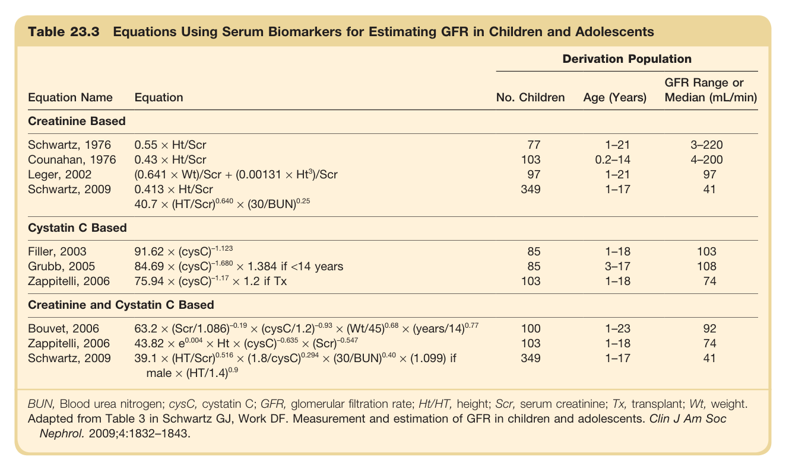

#### Table Data (CSV: [Table_23_3.csv](Table_23_3.csv))

```markdown
| Table Text (OCR) |
| :--- |
| Table 23.3 Equations Using Serum Biomarkers for Estimating GFR in Children and Adolescents Equation Name  Equation  Derivation Population    No. Children  Age (Years)  GFR Range or Median (mL/min)    Creatinine Based    Schwartz, 1976  0.55 × Ht/Scr  77  1-21  3-220    Counahan, 1976  0.43 × Ht/Scr  103  0.2-14  4-200    Leger, 2002  (0.641 × Wt)/Scr + (0.00131 × Ht3)/Scr  97  1-21  97    Schwartz, 2009  0.413 × Ht/Scr  349  1-17  41      40.7 × (HT/Scr)0.640 × (30/BUN)0.25          Cystatin C Based    Filler, 2003  91.62 × (cysC)-1.123  85  1-18  103    Grubb, 2005  84.69 × (cysC)-1.680 × 1.384 if <14 years  85  3-17  108    Zappitelli, 2006  75.94 × (cysC)-1.17 × 1.2 if Tx  103  1-18  74    Creatinine and Cystatin C Based    Bouvet, 2006  63.2 × (Scr/1.086)-0.19 × (cysC/1.2)-0.93 × (Wt/45)0.68 × (years/14)0.77  100  1-23  92    Zappitelli, 2006  43.82 × e0.004 × Ht × (cysC)-0.635 × (Scr)-0.547  103  1-18  74    Schwartz, 2009  39.1 × (HT/Scr)0.516 × (1.8/cysC)0.294 × (30/BUN)0.40 × (1.099) if male × (HT/1.4)0.9  349  1-17  41 BUN, Blood urea nitrogen; cysC, cystatin C; GFR, glomerular filtration rate; Ht/HT, height; Scr, serum creatinine; Tx, transplant; Wt, weight. Adapted from Table 3 in Schwartz GJ, Work DF. Measurement and estimation of GFR in children and adolescents. Clin J Am Soc Nephrol. 2009;4:1832–1843. |
```

Table 23.3 Equations Using Serum Biomarkers for Estimating GFR in Children and Adolescents | Equation Name | Equation | Derivation Population | | :--- | :--- | :--- | | | | No. Children | Age (Years) | GFR Range or Median (mL/min) | | **Creatinine Based** | | | | | | Schwartz, 1976 | 0.55 x Ht/Scr | 77 | 1-21 | 3-220 | | Counahan, 1976 | 0.43 x Ht/Scr | 103 | 0.2-14 | 4-200 | | Leger, 2002 | (0.641 × Wt)/Scr + (0.00131 × Ht³)/Scr | 97 | 1-21 | 97 | | Schwartz, 2009 | 0.413 x Ht/Scr<br>40.7 x (HT/Scr) 0.640 × (30/BUN) 0.25 | 349 | 1-17 | 41 | | **Cystatin C Based** | | | | | | Filler, 2003 | 91.62 x (cysC)-1.123 | 85 | 1-18 | 103 | | Grubb, 2005 | 84.69 x (cysC)-1.680 × 1.384 if <14 years | 85 | 3-17 | 108 | | Zappitelli, 2006 | 75.94 x (cysC)-1.17 x 1.2 if Tx | 103 | 1-18 | 74 | | **Creatinine and Cystatin C Based** | | | | | | Bouvet, 2006 | 63.2 × (Scr/1.086)-0.19 × (cysC/1.2)-0.93 × (Wt/45)0.68 × (years/14)0.77 | 100 | 1-23 | 92 | | Zappitelli, 2006 | 43.82 x e0.004 × Ht × (cysC)-0.635 × (Scr)-0.547 | 103 | 1-18 | 74 | | Schwartz, 2009 | 39.1 x (HT/Scr) 0.516 × (1.8/cysC) 0.294 × (30/BUN)0.40 × (1.099) if male x (HT/1.4)0.9 | 349 | 1-17 | 41 | BUN, Blood urea nitrogen; cysC, cystatin C; GFR, glomerular filtration rate; Ht/HT, height; Scr, serum creatinine; Tx, transplant; Wt, weight. Adapted from Table 3 in Schwartz GJ, Work DF. Measurement and estimation of GFR in children and adolescents. Clin J Am Soc Nephrol. 2009;4:1832-1843.

---

### Table_23_4

#### Table Image

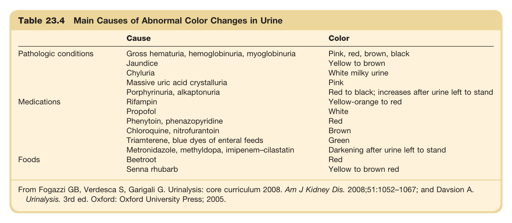

#### Table Data (CSV: [Table_23_4.csv](Table_23_4.csv))

```markdown
| Table Text (OCR) |
| :--- |
| Table 23.4 Main Causes of Abnormal Color Changes in Urine Cause  Color    Pathologic conditions  Gross hematuria, hemoglobinuria, myoglobinuria  Pink, red, brown, black    Jaundice  Yellow to brown    Chyluria  White milky urine    Massive uric acid crystalluria  Pink    Porphyrinuria, alkaptonuria  Red to black; increases after urine left to stand    Medications  Rifampin  Yellow-orange to red    Propofol  White    Phenytoin, phenazopyridine  Red    Chloroquine, nitrofurantoin  Brown    Triamterene, blue dyes of enteral feeds  Green    Metronidazole, methyldopa, imipenem-cilastatin  Darkening after urine left to stand    Foods  Beetroot  Red    Senna rhubarb  Yellow to brown red From Fogazzi GB, Verdesca S, Garigali G. Urinalysis: core curriculum 2008. Am J Kidney Dis. 2008;51:1052–1067; and Davsion A. Urinalysis. 3rd ed. Oxford: Oxford University Press; 2005. |
```

Table 23.4 Main Causes of Abnormal Color Changes in Urine | | Cause | Color | | :--- | :--- | :--- | | Pathologic conditions | Gross hematuria, hemoglobinuria, myoglobinuria | Pink, red, brown, black | | | Jaundice | Yellow to brown | | | Chyluria | White milky urine | | | Massive uric acid crystalluria | Pink | | | Porphyrinuria, alkaptonuria | Red to black; increases after urine left to stand | | Medications | Rifampin | Yellow-orange to red | | | Propofol | White | | | Phenytoin, phenazopyridine | Red | | | Chloroquine, nitrofurantoin | Brown | | | Triamterene, blue dyes of enteral feeds | Green | | | Metronidazole, methyldopa, imipenem-cilastatin | Darkening after urine left to stand | | Foods | Beetroot | Red | | | Senna rhubarb | Yellow to brown red | From Fogazzi GB, Verdesca S, Garigali G. Urinalysis: core curriculum 2008. Am J Kidney Dis. 2008;51:1052-1067; and Davsion A. Urinalysis. 3rd ed. Oxford: Oxford University Press; 2005.

---

### Table_23_5

#### Table Image

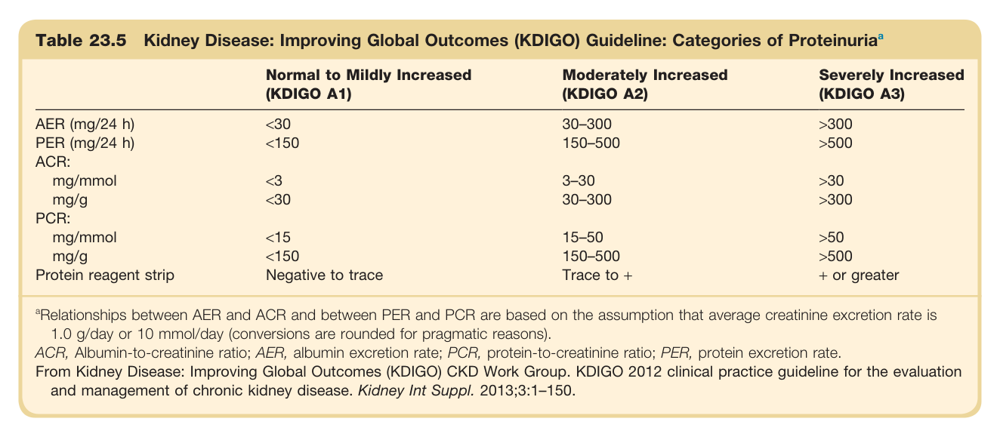

#### Table Data (CSV: [Table_23_5.csv](Table_23_5.csv))

```markdown
| Table Text (OCR) |
| :--- |
| Table 23.5 Kidney Disease: Improving Global Outcomes (KDIGO) Guideline: Categories of Proteinuria<sup>a</sup> Normal to Mildly Increased (KDIGO A1)  Moderately Increased (KDIGO A2)  Severely Increased (KDIGO A3)    AER (mg/24 h)  <30  30–300  >300    PER (mg/24 h)  <150  150–500  >500    ACR:          mg/mmol  <3  3–30  >30    mg/g  <30  30–300  >300    PCR:          mg/mmol  <15  15–50  >50    mg/g  <150  150–500  >500    Protein reagent strip  Negative to trace  Trace to +  + or greater <sup>a</sup>Relationships between AER and ACR and between PER and PCR are based on the assumption that average creatinine excretion rate is 1.0 g/day or 10 mmol/day (conversions are rounded for pragmatic reasons). ACR, Albumin-to-creatinine ratio; AER, albumin excretion rate; PCR, protein-to-creatinine ratio; PER, protein excretion rate. From Kidney Disease: Improving Global Outcomes (KDIGO) CKD Work Group. KDIGO 2012 clinical practice guideline for the evaluation and management of chronic kidney disease. Kidney Int Suppl. 2013;3:1–150. |
```

Table 23.5 Kidney Disease: Improving Global Outcomes (KDIGO) Guideline: Categories of Proteinuriaª | | Normal to Mildly Increased (KDIGO A1) | Moderately Increased (KDIGO A2) | Severely Increased (KDIGO A3) | | :--- | :--- | :--- | :--- | | AER (mg/24 h) | <30 | 30-300 | >300 | | PER (mg/24 h) | <150 | 150-500 | >500 | | **ACR:** | | | | | mg/mmol | <3 | 3-30 | >30 | | mg/g | <30 | 30-300 | >300 | | **PCR:** | | | | | mg/mmol | <15 | 15-50 | >50 | | mg/g | <150 | 150-500 | >500 | | Protein reagent strip | Negative to trace | Trace to + | + or greater | @Relationships between AER and ACR and between PER and PCR are based on the assumption that average creatinine excretion rate is 1.0 g/day or 10 mmol/day (conversions are rounded for pragmatic reasons). ACR, Albumin-to-creatinine ratio; AER, albumin excretion rate; PCR, protein-to-creatinine ratio; PER, protein excretion rate. From Kidney Disease: Improving Global Outcomes (KDIGO) CKD Work Group. KDIGO 2012 clinical practice guideline for the evaluation and management of chronic kidney disease. Kidney Int Suppl. 2013;3:1-150.

---

### Table_23_6

#### Table Image

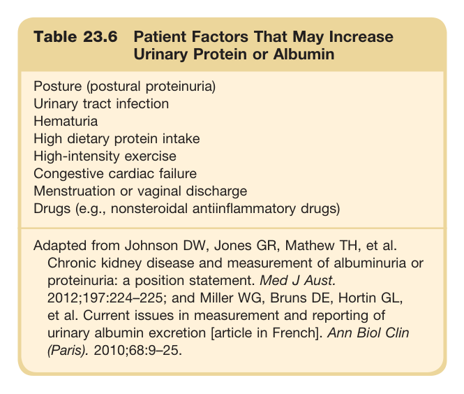

#### Table Data (CSV: [Table_23_6.csv](Table_23_6.csv))

```markdown
| Table Text (OCR) |
| :--- |
| Table 23.6 Patient Factors That May Increase Urinary Protein or Albumin Posture (postural proteinuria)    Urinary tract infection    Hematuria    High dietary protein intake    High-intensity exercise    Congestive cardiac failure    Menstruation or vaginal discharge    Drugs (e.g., nonsteroidal antiinflammatory drugs) Adapted from Johnson DW, Jones GR, Mathew TH, et al. Chronic kidney disease and measurement of albuminuria or proteinuria: a position statement. Med J Aust. 2012;197:224–225; and Miller WG, Bruns DE, Hortin GL, et al. Current issues in measurement and reporting of urinary albumin excretion [article in French]. Ann Biol Clin (Paris). 2010;68:9–25. |
```

Table 23.6 Patient Factors That May Increase Urinary Protein or Albumin * Posture (postural proteinuria) * Urinary tract infection * Hematuria * High dietary protein intake * High-intensity exercise * Congestive cardiac failure * Menstruation or vaginal discharge * Drugs (e.g., nonsteroidal antiinflammatory drugs) Adapted from Johnson DW, Jones GR, Mathew TH, et al. Chronic kidney disease and measurement of albuminuria or proteinuria: a position statement. Med J Aust. 2012;197:224-225; and Miller WG, Bruns DE, Hortin GL, et al. Current issues in measurement and reporting of urinary albumin excretion [article in French]. Ann Biol Clin (Paris). 2010;68:9-25.

---

### Table_23_7

#### Table Image

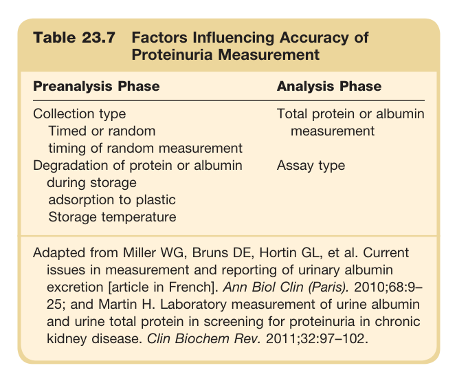

#### Table Data (CSV: [Table_23_7.csv](Table_23_7.csv))

```markdown
| Table Text (OCR) |
| :--- |
| Table 23.7 Factors Influencing Accuracy of Proteinuria Measurement Preanalysis Phase  Analysis Phase    Collection typeTimed or random timing of random measurement  Total protein or albumin measurement    Degradation of protein or albumin during storageadsorption to plasticStorage temperature  Assay type Adapted from Miller WG, Bruns DE, Hortin GL, et al. Current issues in measurement and reporting of urinary albumin excretion [article in French]. Ann Biol Clin (Paris). 2010;68:9– 25; and Martin H. Laboratory measurement of urine albumin and urine total protein in screening for proteinuria in chronic kidney disease. Clin Biochem Rev. 2011;32:97–102. |
```

Table 23.7 Factors Influencing Accuracy of Proteinuria Measurement | Preanalysis Phase | Analysis Phase | | :--- | :--- | | Collection type<br>Timed or random<br>timing of random measurement<br>Degradation of protein or albumin during storage<br>adsorption to plastic<br>Storage temperature | Total protein or albumin measurement<br>Assay type | Adapted from Miller WG, Bruns DE, Hortin GL, et al. Current issues in measurement and reporting of urinary albumin excretion [article in French]. Ann Biol Clin (Paris). 2010;68:9-25; and Martin H. Laboratory measurement of urine albumin and urine total protein in screening for proteinuria in chronic kidney disease. Clin Biochem Rev. 2011;32:97-102.

---

### Table_23_8

#### Table Image

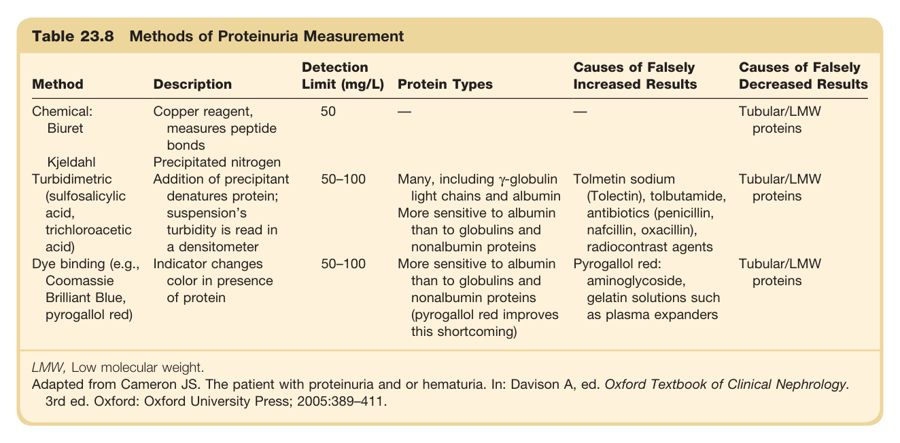

#### Table Data (CSV: [Table_23_8.csv](Table_23_8.csv))

```markdown
| Table Text (OCR) |
| :--- |
| Table 23.8 Methods of Proteinuria Measurement Method  Description  Detection Limit (mg/L)  Protein Types  Causes of Falsely Increased Results  Causes of Falsely Decreased Results    Chemical: Biuret  Copper reagent, measures peptide bonds  50  —  —  Tubular/LMW proteins    Kjeldahl Turbidimetric (sulfosalicylic acid, trichloroacetic acid)  Precipitated nitrogen Addition of precipitant denatures protein; suspension's turbidity is read in a densitometer  50–100  Many, including γ-globulin light chains and albumin More sensitive to albumin than to globulins and nonalbumin proteins  Tolmetin sodium (Tolectin), tolbutamide, antibiotics (penicillin, nafcillin, oxacillin), radiocontrast agents  Tubular/LMW proteins    Dye binding (e.g., Coomassie Brilliant Blue, pyrogallol red)  Indicator changes color in presence of protein  50–100  More sensitive to albumin than to globulins and nonalbumin proteins (pyrogallol red improves this shortcoming)  Pyrogallol red: aminoglycoside, gelatin solutions such as plasma expanders  Tubular/LMW proteins LMW, Low molecular weight. Adapted from Cameron JS. The patient with proteinuria and or hematuria. In: Davison A, ed. Oxford Textbook of Clinical Nephrology. 3rd ed. Oxford: Oxford University Press; 2005:389–411. |
```

Table 23.8 Methods of Proteinuria Measurement | Method | Description | Detection Limit (mg/L) | Protein Types | Causes of Falsely Increased Results | Causes of Falsely Decreased Results | | :--- | :--- | :--- | :--- | :--- | :--- | | **Chemical:** Biuret | Copper reagent, measures peptide bonds | 50 | — | — | Tubular/LMW proteins | | Kjeldahl | Precipitated nitrogen | — | — | — | — | | **Turbidimetric** (sulfosalicylic acid, trichloroacetic acid) | Addition of precipitant denatures protein; suspension's turbidity is read in a densitometer | 50-100 | Many, including y-globulin light chains and albumin | Tolmetin sodium (Tolectin), tolbutamide, antibiotics (penicillin, nafcillin, oxacillin), radiocontrast agents | Tubular/LMW proteins | | **Dye binding** (e.g., Coomassie Brilliant Blue, pyrogallol red) | Indicator changes color in presence of protein | 50-100 | More sensitive to albumin than to globulins and nonalbumin proteins (pyrogallol red improves this shortcoming) | Pyrogallol red: aminoglycoside, gelatin solutions such as plasma expanders | Tubular/LMW proteins | LMW, Low molecular weight. Adapted from Cameron JS. The patient with proteinuria and or hematuria. In: Davison A, ed. Oxford Textbook of Clinical Nephrology. 3rd ed. Oxford: Oxford University Press; 2005:389-411.

---

### Table_23_9

#### Table Image

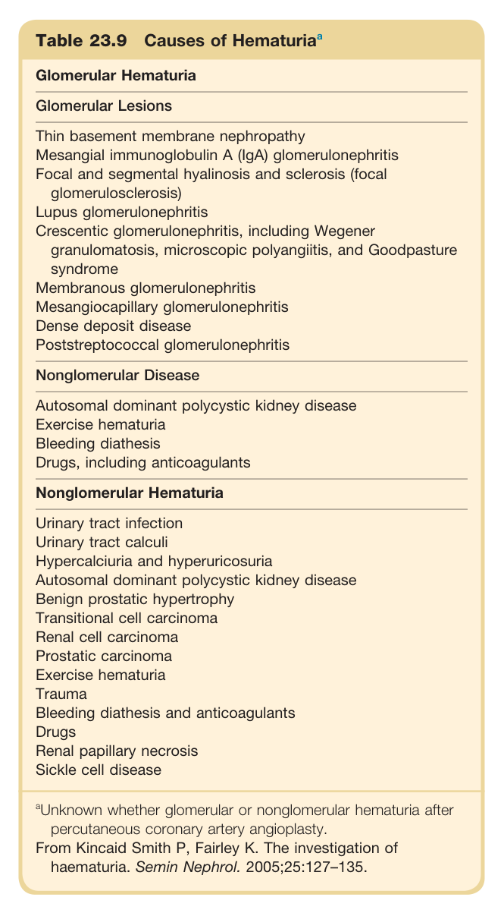

#### Table Data (CSV: [Table_23_9.csv](Table_23_9.csv))

```markdown
| Table Text (OCR) |
| :--- |
| Table 23.9 Causes of Hematuria<sup>a</sup> Glomerular Hematuria    Glomerular Lesions    Thin basement membrane nephropathyMesangial immunoglobulin A (IgA) glomerulonephritisFocal and segmental hyalinosis and sclerosis (focal glomerulosclerosis)Lupus glomerulonephritisCrescentic glomerulonephritis, including Wegener granulomatosis, microscopic polyangiitis, and Goodpasture syndromeMembranous glomerulonephritisMesangiocapillary glomerulonephritisDense deposit diseasePoststreptococcal glomerulonephritis    Nonglomerular Disease    Autosomal dominant polycystic kidney diseaseExercise hematuriaBleeding diathesisDrugs, including anticoagulants    Nonglomerular Hematuria    Urinary tract infectionUrinary tract calculiHypercalciuria and hyperuricosuriaAutosomal dominant polycystic kidney diseaseBenign prostatic hypertrophyTransitional cell carcinomaRenal cell carcinomaProstatic carcinomaExercise hematuriaTraumaBleeding diathesis and anticoagulantsDrugsRenal papillary necrosisSickle cell disease     ^{a} Unknown whether glomerular or nonglomerular hematuria after percutaneous coronary artery angioplasty.From Kincaid Smith P, Fairley K. The investigation of haematuria. Semin Nephrol. 2005;25:127-135. |
```

Table 23.9 Causes of Hematuriaa | | | :--- | | **Glomerular Hematuria** | | Glomerular Lesions | | Thin basement membrane nephropathy<br>Mesangial immunoglobulin A (IgA) glomerulonephritis<br>Focal and segmental hyalinosis and sclerosis (focal glomerulosclerosis)<br>Lupus glomerulonephritis<br>Crescentic glomerulonephritis, including Wegener granulomatosis, microscopic polyangiitis, and Goodpasture syndrome<br>Membranous glomerulonephritis<br>Mesangiocapillary glomerulonephritis<br>Dense deposit disease<br>Poststreptococcal glomerulonephritis | | **Nonglomerular Disease** | | Autosomal dominant polycystic kidney disease<br>Exercise hematuria<br>Bleeding diathesis<br>Drugs, including anticoagulants | | **Nonglomerular Hematuria** | | Urinary tract infection<br>Urinary tract calculi<br>Hypercalciuria and hyperuricosuria<br>Autosomal dominant polycystic kidney disease<br>Benign prostatic hypertrophy<br>Transitional cell carcinoma<br>Renal cell carcinoma<br>Prostatic carcinoma<br>Exercise hematuria<br>Trauma<br>Bleeding diathesis and anticoagulants<br>Drugs<br>Renal papillary necrosis<br>Sickle cell disease | aUnknown whether glomerular or nonglomerular hematuria after percutaneous coronary artery angioplasty. From Kincaid Smith P, Fairley K. The investigation of haematuria. Semin Nephrol. 2005;25:127-135.

---

### Table_23_10

#### Table Image

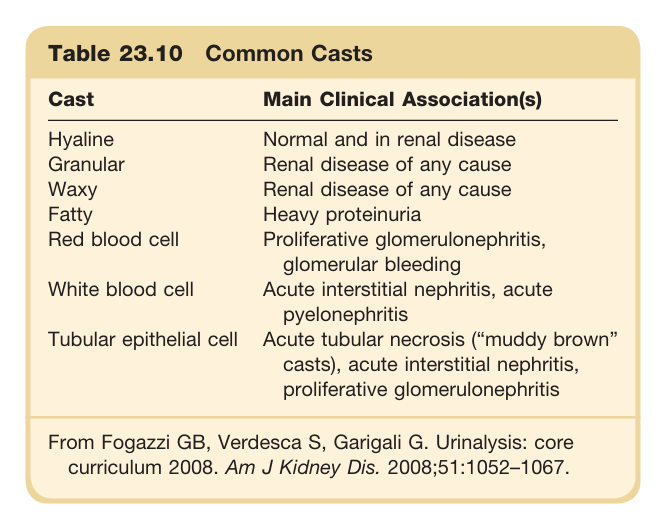

#### Table Data (CSV: [Table_23_10.csv](Table_23_10.csv))

```markdown
| Table Text (OCR) |
| :--- |
| Table 23.10 Common Casts Cast  Main Clinical Association(s)    Hyaline  Normal and in renal disease    Granular  Renal disease of any cause    Waxy  Renal disease of any cause    Fatty  Heavy proteinuria    Red blood cell  Proliferative glomerulonephritis, glomerular bleeding    White blood cell  Acute interstitial nephritis, acute pyelonephritis    Tubular epithelial cell  Acute tubular necrosis (“muddy brown” casts), acute interstitial nephritis, proliferative glomerulonephritis    From Fogazzi GB, Verdesca S, Garigali G. Urinalysis: core curriculum 2008. Am J Kidney Dis. 2008;51:1052–1067. |
```

Table 23.10 Common Casts | Cast | Main Clinical Association(s) | | :--- | :--- | | Hyaline | Normal and in renal disease | | Granular | Renal disease of any cause | | Waxy | Renal disease of any cause | | Fatty | Heavy proteinuria | | Red blood cell | Proliferative glomerulonephritis, glomerular bleeding | | White blood cell | Acute interstitial nephritis, acute pyelonephritis | | Tubular epithelial cell | Acute tubular necrosis ("muddy brown" casts), acute interstitial nephritis, proliferative glomerulonephritis | From Fogazzi GB, Verdesca S, Garigali G. Urinalysis: core curriculum 2008. Am J Kidney Dis. 2008;51:1052-1067.

---

### Table_23_11

#### Table Image

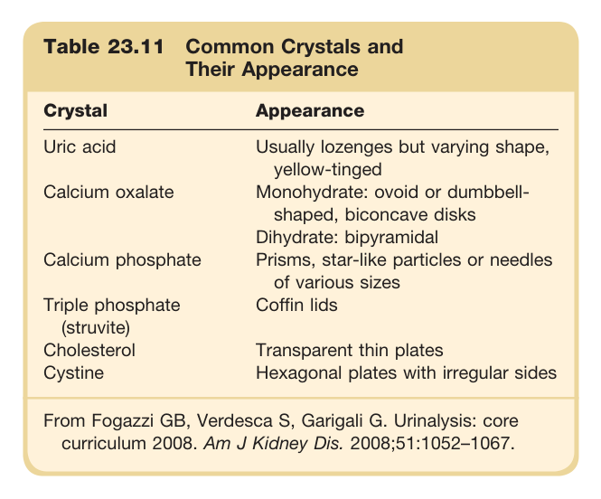

#### Table Data (CSV: [Table_23_11.csv](Table_23_11.csv))

```markdown
| Table Text (OCR) |
| :--- |
| Table 23.11 Common Crystals and Their Appearance Crystal  Appearance    Uric acid  Usually lozenges but varying shape, yellow-tinged    Calcium oxalate  Monohydrate: ovoid or dumbbell-shaped, biconcave disksDihydrate: bipyramidal    Calcium phosphate  Prisms, star-like particles or needles of various sizes    Triple phosphate (struvite)  Coffin lids    Cholesterol  Transparent thin plates    Cystine  Hexagonal plates with irregular sides    From Fogazzi GB, Verdesca S, Garigali G. Urinalysis: core curriculum 2008. Am J Kidney Dis. 2008;51:1052–1067. |
```

Table 23.11 Common Crystals and Their Appearance | Crystal | Appearance | | :--- | :--- | | Uric acid | Usually lozenges but varying shape, yellow-tinged | | Calcium oxalate | Monohydrate: ovoid or dumbbell-shaped, biconcave disks<br>Dihydrate: bipyramidal | | Calcium phosphate | Prisms, star-like particles or needles of various sizes | | Triple phosphate (struvite) | Coffin lids | | Cholesterol | Transparent thin plates | | Cystine | Hexagonal plates with irregular sides | From Fogazzi GB, Verdesca S, Garigali G. Urinalysis: core curriculum 2008. Am J Kidney Dis. 2008;51:1052-1067.

---
