# 24. Interpretation of Electrolyte and Acid-Base Parameters in Blood and Urine - Figures, Flow Charts and Tables Index

This document lists all figures, flow charts and tables extracted from `24. Interpretation of Electrolyte and Acid-Base Parameters in Blood and Urine.pdf`.

## Table of Contents
- [Figures](#figures)
- [Flow Charts](#flow-charts)
- [Tables](#tables)

---

## Figures

### Fig_24_1

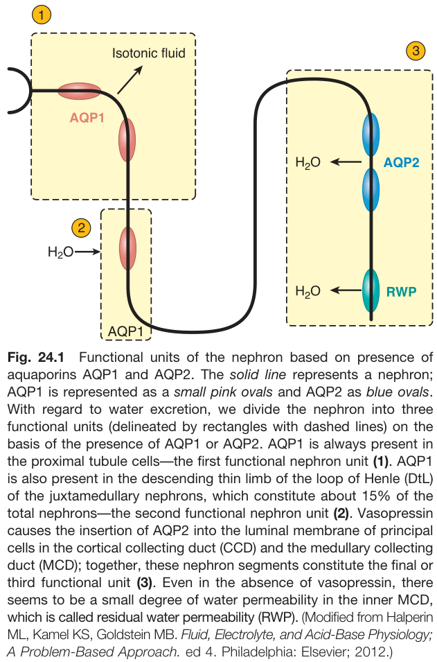

Fig. 24.1 Functional units of the nephron based on presence of aquaporins AQP1 and AQP2. The solid line represents a nephron; AQP1 is represented as a small pink ovals and AQP2 as blue ovals. With regard to water excretion, we divide the nephron into three functional units (delineated by rectangles with dashed lines) on the basis of the presence of AQP1 or AQP2. AQP1 is always present in the proximal tubule cells-the first functional nephron unit (1). AQP1 is also present in the descending thin limb of the loop of Henle (DtL) of the juxtamedullary nephrons, which constitute about 15% of the total nephrons-the second functional nephron unit (2). Vasopressin causes the insertion of AQP2 into the luminal membrane of principal cells in the cortical collecting duct (CCD) and the medullary collecting duct (MCD); together, these nephron segments constitute the final or third functional unit (3). Even in the absence of vasopressin, there seems to be a small degree of water permeability in the inner MCD, which is called residual water permeability (RWP). (Modified from Halperin ML, Kamel KS, Goldstein MB. Fluid, Electrolyte, and Acid-Base Physiology; A Problem-Based Approach. ed 4. Philadelphia: Elsevier; 2012.)

---

### Fig_24_2

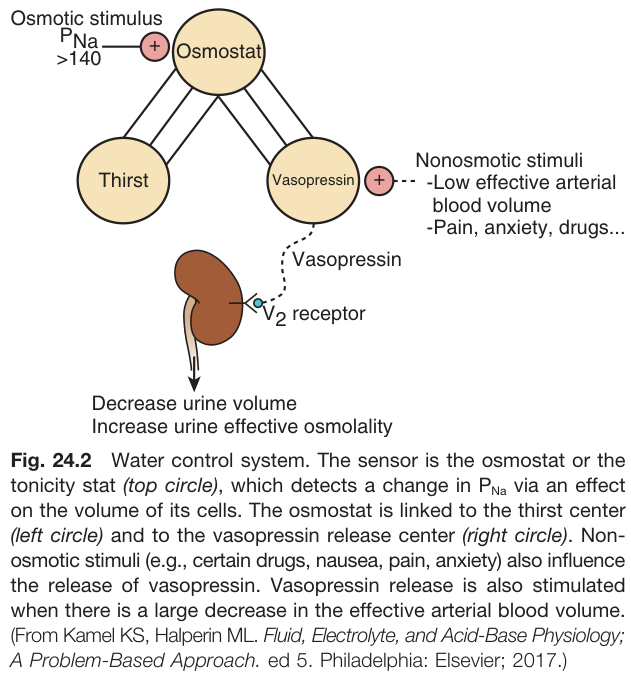

Fig. 24.2 Water control system. The sensor is the osmostat or the tonicity stat (top circle), which detects a change in PNa via an effect on the volume of its cells. The osmostat is linked to the thirst center (left circle) and to the vasopressin release center (right circle). Non-osmotic stimuli (e.g., certain drugs, nausea, pain, anxiety) also influence the release of vasopressin. Vasopressin release is also stimulated when there is a large decrease in the effective arterial blood volume. (From Kamel KS, Halperin ML. Fluid, Electrolyte, and Acid-Base Physiology; A Problem-Based Approach. ed 5. Philadelphia: Elsevier; 2017.)

---

### Fig_24_3

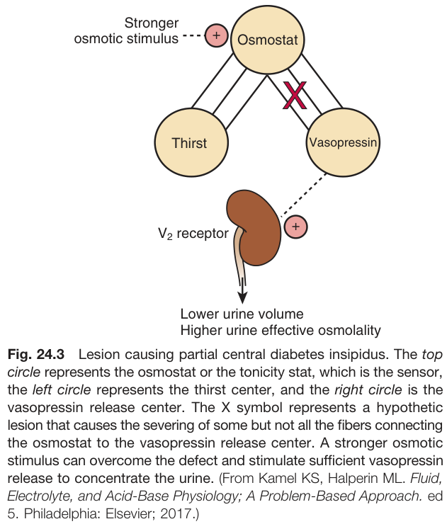

Fig. 24.3 Lesion causing partial central diabetes insipidus. The top circle represents the osmostat or the tonicity stat, which is the sensor, the left circle represents the thirst center, and the right circle is the vasopressin release center. The X symbol represents a hypothetic lesion that causes the severing of some but not all the fibers connecting the osmostat to the vasopressin release center. A stronger osmotic stimulus can overcome the defect and stimulate sufficient vasopressin release to concentrate the urine. (From Kamel KS, Halperin ML. Fluid, Electrolyte, and Acid-Base Physiology; A Problem-Based Approach. ed 5. Philadelphia: Elsevier; 2017.)

---

### Fig_24_4

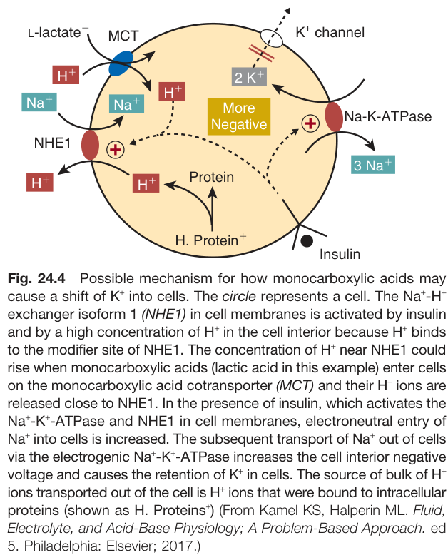

Fig. 24.4 Possible mechanism for how monocarboxylic acids may cause a shift of K+ into cells. The circle represents a cell. The Na+-H+ exchanger isoform 1 (NHE1) in cell membranes is activated by insulin and by a high concentration of Ht in the cell interior because H+ binds to the modifier site of NHE1. The concentration of H+ near NHE1 could rise when monocarboxylic acids (lactic acid in this example) enter cells on the monocarboxylic acid cotransporter (MCT) and their H+ ions are released close to NHE1. In the presence of insulin, which activates the Na+-K+-ATPase and NHE1 in cell membranes, electroneutral entry of Nat into cells is increased. The subsequent transport of Nat out of cells via the electrogenic Na+-K+-ATPase increases the cell interior negative voltage and causes the retention of K+ in cells. The source of bulk of H+ ions transported out of the cell is H+ ions that were bound to intracellular proteins (shown as H. Proteins+) (From Kamel KS, Halperin ML. Fluid, Electrolyte, and Acid-Base Physiology; A Problem-Based Approach. ed 5. Philadelphia: Elsevier; 2017.)

---

### Fig_24_5

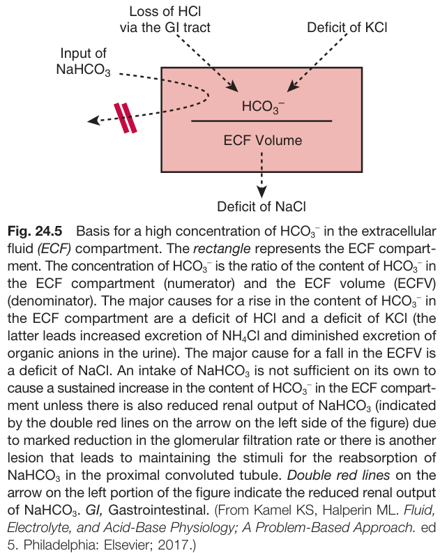

Fig. 24.5 Basis for a high concentration of HCO3 in the extracellular fluid (ECF) compartment. The rectangle represents the ECF compartment. The concentration of HCO3 is the ratio of the content of HCO3 in the ECF compartment (numerator) and the ECF volume (ECFV) (denominator). The major causes for a rise in the content of HCO3 in the ECF compartment are a deficit of HCl and a deficit of KCI (the latter leads increased excretion of NH4Cl and diminished excretion of organic anions in the urine). The major cause for a fall in the ECFV is a deficit of NaCl. An intake of NaHCO3 is not sufficient on its own to cause a sustained increase in the content of HCO3 in the ECF compartment unless there is also reduced renal output of NaHCO3 (indicated by the double red lines on the arrow on the left side of the figure) due to marked reduction in the glomerular filtration rate or there is another lesion that leads to maintaining the stimuli for the reabsorption of NaHCO3 in the proximal convoluted tubule. Double red lines on the arrow on the left portion of the figure indicate the reduced renal output of NaHCO3. Gl, Gastrointestinal. (From Kamel KS, Halperin ML. Fluid, Electrolyte, and Acid-Base Physiology; A Problem-Based Approach. ed 5. Philadelphia: Elsevier; 2017.)

---

### Fig_24_6

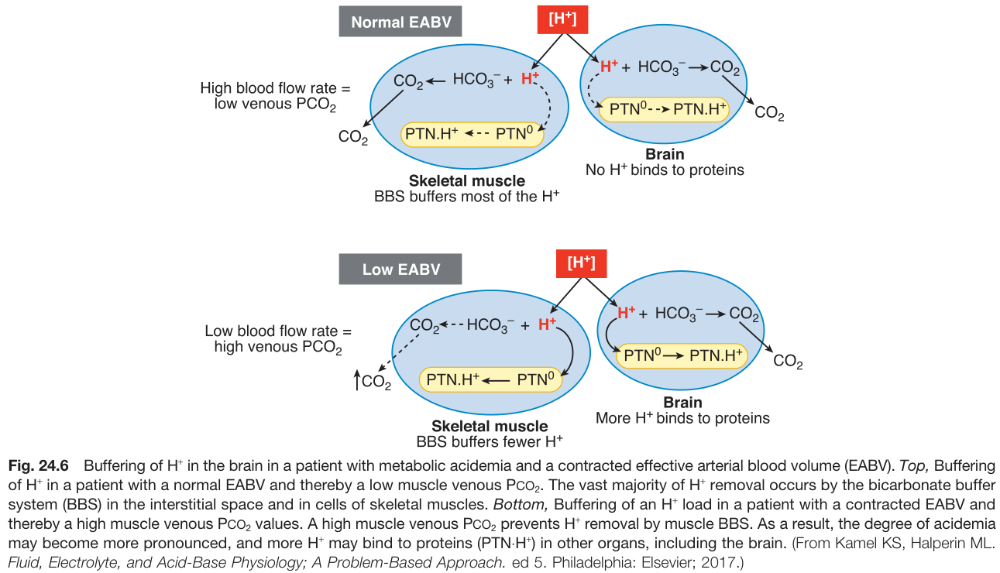

Fig. 24.6 Buffering of H+ in the brain in a patient with metabolic acidemia and a contracted effective arterial blood volume (EABV). Top, Buffering of H+ in a patient with a normal EABV and thereby a low muscle venous PCO2. The vast majority of H+ removal occurs by the bicarbonate buffer system (BBS) in the interstitial space and in cells of skeletal muscles. Bottom, Buffering of an H+ load in a patient with a contracted EABV and thereby a high muscle venous PCO2 values. A high muscle venous PCO2 prevents H+ removal by muscle BBS. As a result, the degree of acidemia may become more pronounced, and more H+ may bind to proteins (PTN-H+) in other organs, including the brain. (From Kamel KS, Halperin ML. Fluid, Electrolyte, and Acid-Base Physiology; A Problem-Based Approach. ed 5. Philadelphia: Elsevier; 2017.)

---

### Fig_24_7

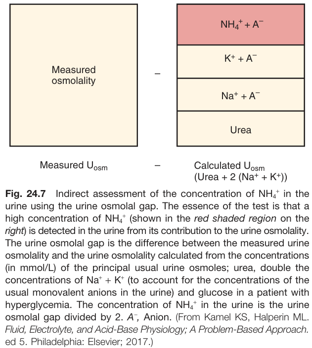

Fig. 24.7 Indirect assessment of the concentration of NH4+ in the urine using the urine osmolal gap. The essence of the test is that a high concentration of NH4+ (shown in the red shaded region on the right) is detected in the urine from its contribution to the urine osmolality. The urine osmolal gap is the difference between the measured urine osmolality and the urine osmolality calculated from the concentrations (in mmol/L) of the principal usual urine osmoles; urea, double the concentrations of Na+ + K+ (to account for the concentrations of the usual monovalent anions in the urine) and glucose in a patient with hyperglycemia. The concentration of NH4+ in the urine is the urine osmolal gap divided by 2. A, Anion. (From Kamel KS, Halperin ML. Fluid, Electrolyte, and Acid-Base Physiology; A Problem-Based Approach. ed 5. Philadelphia: Elsevier; 2017.)

---

### Fig_24_8

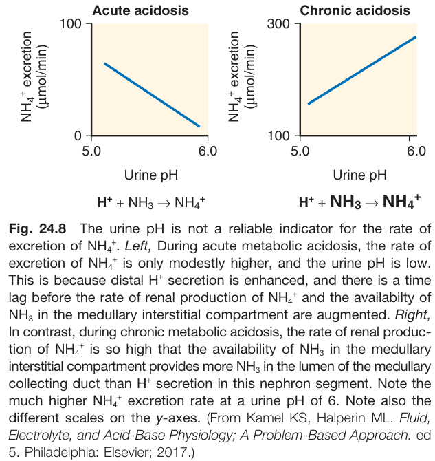

Fig. 24.8 The urine pH is not a reliable indicator for the rate of excretion of NH4+. Left, During acute metabolic acidosis, the rate of excretion of NH4+ is only modestly higher, and the urine pH is low. This is because distal H+ secretion is enhanced, and there is a time lag before the rate of renal production of NH4+ and the availabilty of NH3 in the medullary interstitial compartment are augmented. Right, In contrast, during chronic metabolic acidosis, the rate of renal production of NH4+ is so high that the availability of NH3 in the medullary interstitial compartment provides more NH3 in the lumen of the medullary collecting duct than H+ secretion in this nephron segment. Note the much higher NH4+ excretion rate at a urine pH of 6. Note also the different scales on the y-axes. (From Kamel KS, Halperin ML. Fluid, Electrolyte, and Acid-Base Physiology; A Problem-Based Approach. ed 5. Philadelphia: Elsevier; 2017.)

---

### Fig_24_9

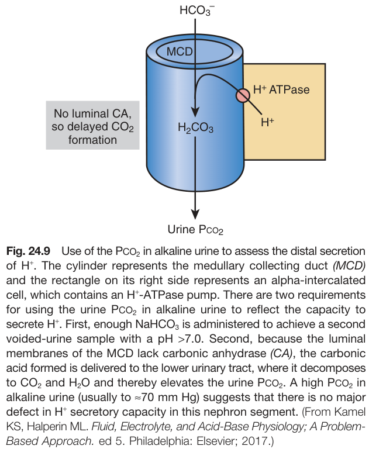

Fig. 24.9 Use of the PCO2 in alkaline urine to assess the distal secretion of H+. The cylinder represents the medullary collecting duct (MCD) and the rectangle on its right side represents an alpha-intercalated cell, which contains an H+-ATPase pump. There are two requirements for using the urine PCO2 in alkaline urine to reflect the capacity to secrete H+. First, enough NaHCO3 is administered to achieve a second voided-urine sample with a pH >7.0. Second, because the luminal membranes of the MCD lack carbonic anhydrase (CA), the carbonic acid formed is delivered to the lower urinary tract, where it decomposes to CO2 and H2O and thereby elevates the urine PCO2. A high PCO2 in alkaline urine (usually to ≈70 mm Hg) suggests that there is no major defect in H+ secretory capacity in this nephron segment. (From Kamel KS, Halperin ML. Fluid, Electrolyte, and Acid-Base Physiology; A Problem-Based Approach. ed 5. Philadelphia: Elsevier; 2017.)

---

## Flow Charts

### Flow_Chart_24_1

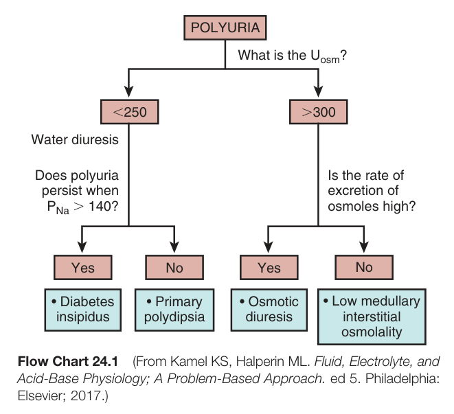

Flow Chart 24.1 (From Kamel KS, Halperin ML. Fluid, Electrolyte, and Acid-Base Physiology; A Problem-Based Approach. ed 5. Philadelphia: Elsevier; 2017.)

---

### Flow_Chart_24_2

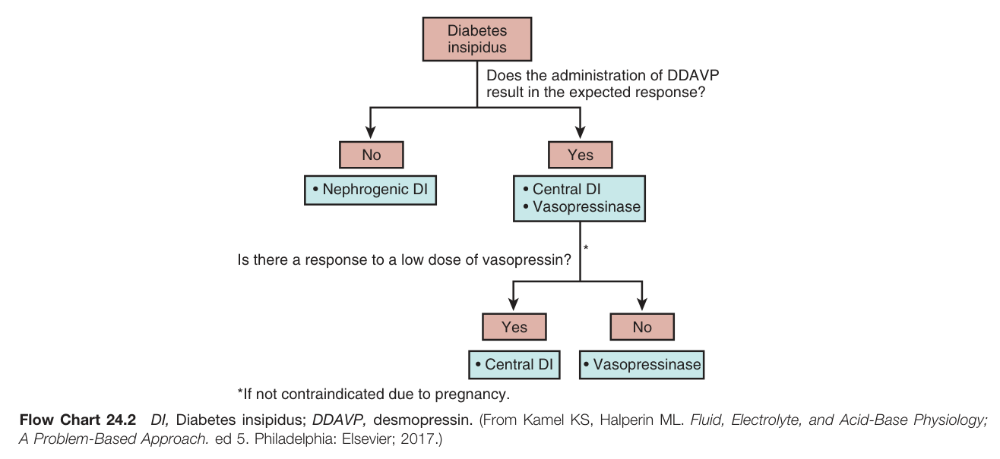

Flow Chart 24.2 DI, Diabetes insipidus; DDAVP, desmopressin. (From Kamel KS, Halperin ML. Fluid, Electrolyte, and Acid-Base Physiology; A Problem-Based Approach. ed 5. Philadelphia: Elsevier; 2017.)

---

### Flow_Chart_24_3

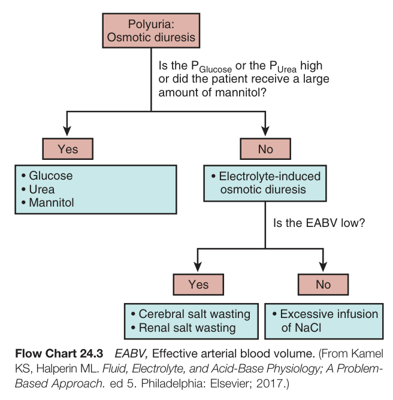

Flow Chart 24.3 EABV, Effective arterial blood volume. (From Kamel KS, Halperin ML. Fluid, Electrolyte, and Acid-Base Physiology; A Problem-Based Approach. ed 5. Philadelphia: Elsevier; 2017.)

---

### Flow_Chart_24_4

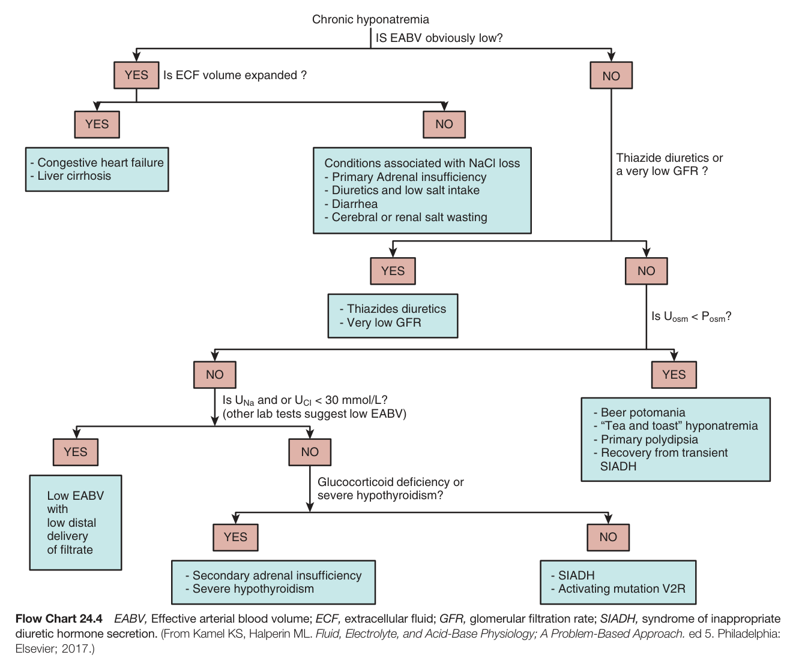

Flow Chart 24.4 EABV, Effective arterial blood volume; ECF, extracellular fluid; GFR, glomerular filtration rate; SIADH, syndrome of inappropriate diuretic hormone secretion. (From Kamel KS, Halperin ML. Fluid, Electrolyte, and Acid-Base Physiology; A Problem-Based Approach. ed 5. Philadelphia: Elsevier; 2017.)

---

### Flow_Chart_24_5

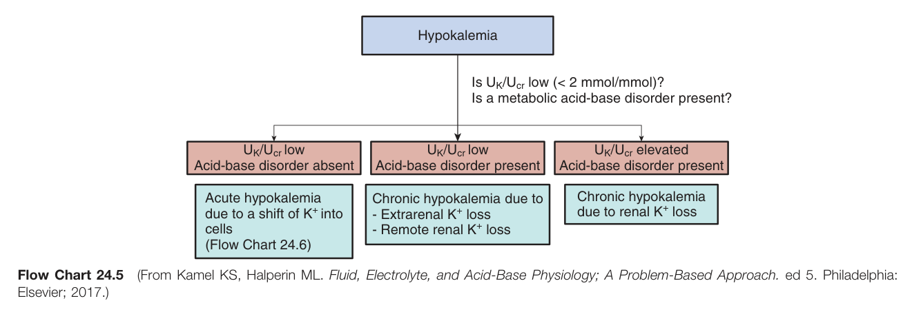

Flow Chart 24.5 (From Kamel KS, Halperin ML. Fluid, Electrolyte, and Acid-Base Physiology; A Problem-Based Approach. ed 5. Philadelphia: Elsevier; 2017.)

---

### Flow_Chart_24_6

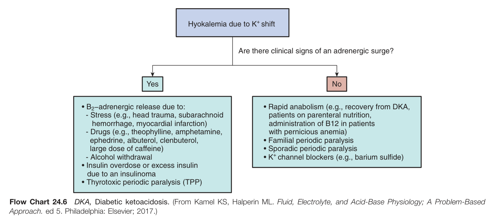

Flow Chart 24.6 DKA, Diabetic ketoacidosis. (From Kamel KS, Halperin ML. Fluid, Electrolyte, and Acid-Base Physiology; A Problem-Based Approach. ed 5. Philadelphia: Elsevier; 2017.)

---

### Flow_Chart_24_7

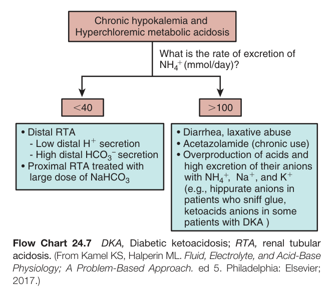

Flow Chart 24.7 DKA, Diabetic ketoacidosis; RTA, renal tubular acidosis. (From Kamel KS, Halperin ML. Fluid, Electrolyte, and Acid-Base Physiology; A Problem-Based Approach. ed 5. Philadelphia: Elsevier; 2017.)

---

### Flow_Chart_24_8

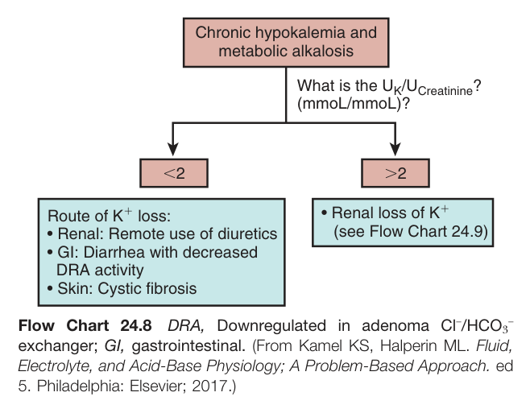

Flow Chart 24.8 DRA, Downregulated in adenoma Cl/HCO3 exchanger; Gl, gastrointestinal. (From Kamel KS, Halperin ML. Fluid, Electrolyte, and Acid-Base Physiology; A Problem-Based Approach. ed 5. Philadelphia: Elsevier; 2017.)

---

### Flow_Chart_24_9

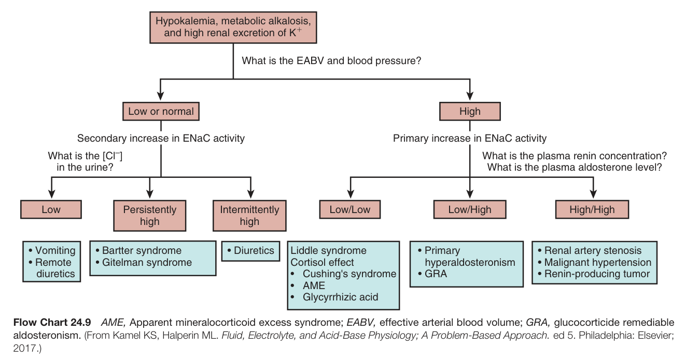

Flow Chart 24.9 AME, Apparent mineralocorticoid excess syndrome; EABV, effective arterial blood volume; GRA, glucocorticide remediable aldosteronism. (From Kamel KS, Halperin ML. Fluid, Electrolyte, and Acid-Base Physiology; A Problem-Based Approach. ed 5. Philadelphia: Elsevier; 2017.)

---

### Flow_Chart_24_10

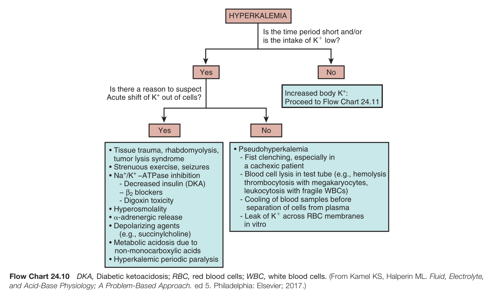

Flow Chart 24.10 DKA, Diabetic ketoacidosis; RBC, red blood cells; WBC, white blood cells. (From Kamel KS, Halperin ML. Fluid, Electrolyte, and Acid-Base Physiology; A Problem-Based Approach. ed 5. Philadelphia: Elsevier; 2017.)

---

### Flow_Chart_24_11

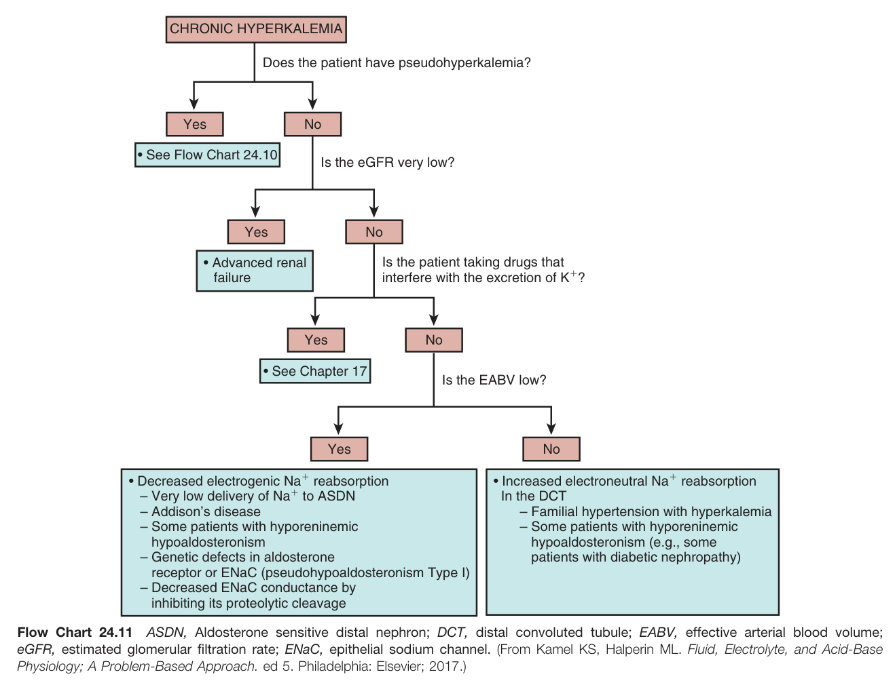

Flow Chart 24.11 ASDN, Aldosterone sensitive distal nephron; DCT, distal convoluted tubule; EABV, effective arterial blood volume; eGFR, estimated glomerular filtration rate; ENaC, epithelial sodium channel. (From Kamel KS, Halperin ML. Fluid, Electrolyte, and Acid-Base Physiology; A Problem-Based Approach. ed 5. Philadelphia: Elsevier; 2017.)

---

### Flow_Chart_24_12

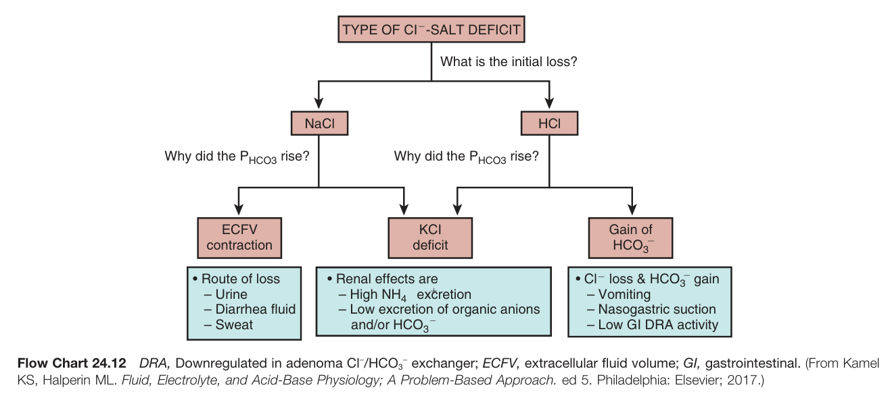

Flow Chart 24.12 DRA, Downregulated in adenoma Cl/HCO3 exchanger; ECFV, extracellular fluid volume; Gl, gastrointestinal. (From Kamel KS, Halperin ML. Fluid, Electrolyte, and Acid-Base Physiology; A Problem-Based Approach. ed 5. Philadelphia: Elsevier; 2017.)

---

### Flow_Chart_24_13

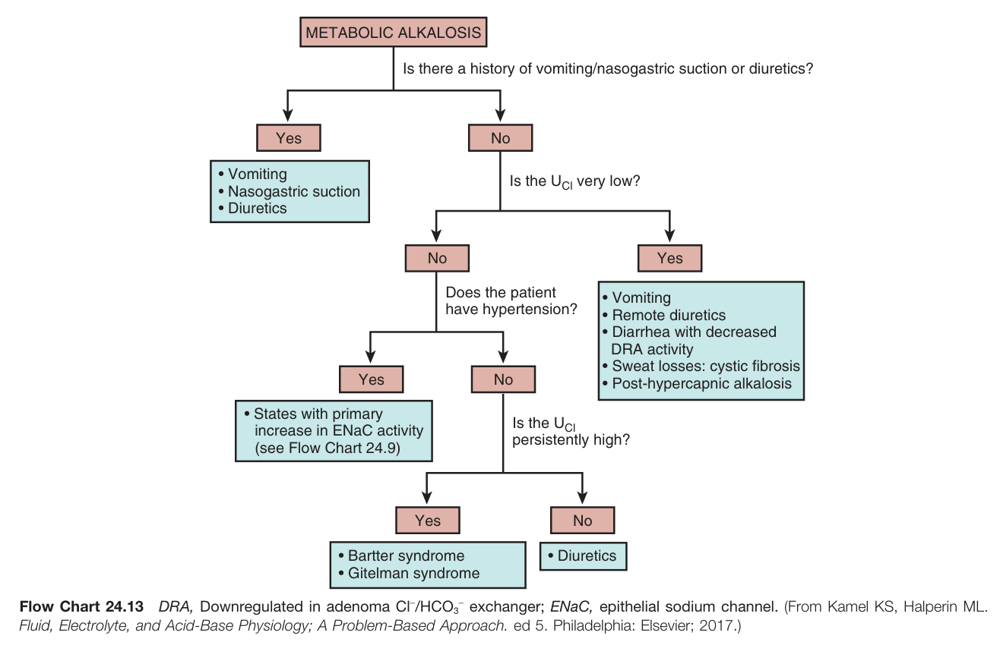

Flow Chart 24.13 DRA, Downregulated in adenoma Cl-/HCO3 exchanger; ENaC, epithelial sodium channel. (From Kamel KS, Halperin ML. Fluid, Electrolyte, and Acid-Base Physiology; A Problem-Based Approach. ed 5. Philadelphia: Elsevier; 2017.)

---

### Flow_Chart_24_14

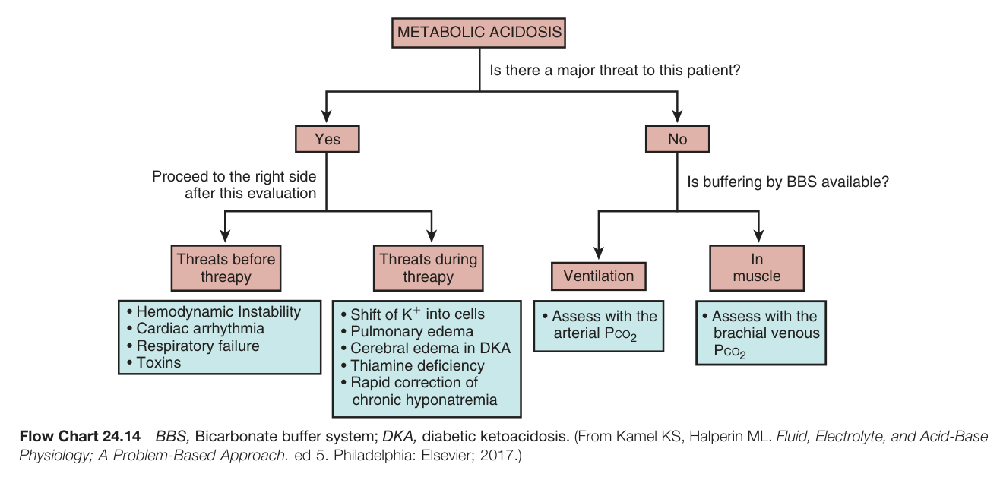

Flow Chart 24.14 BBS, Bicarbonate buffer system; DKA, diabetic ketoacidosis. (From Kamel KS, Halperin ML. Fluid, Electrolyte, and Acid-Base Physiology; A Problem-Based Approach. ed 5. Philadelphia: Elsevier; 2017.)

---

### Flow_Chart_24_15

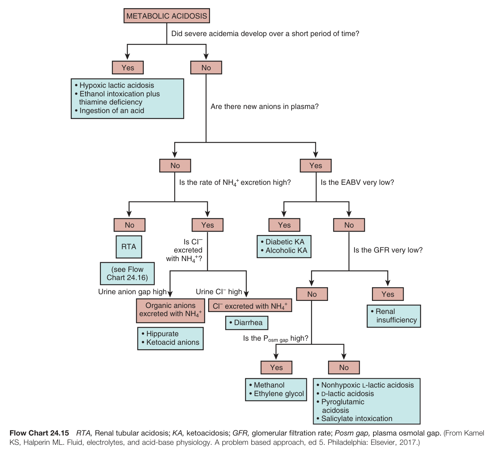

Flow Chart 24.15 RTA, Renal tubular acidosis; KA, ketoacidosis; GFR, glomerular filtration rate; Posm gap, plasma osmolal gap. (From Kamel KS, Halperin ML. Fluid, electrolytes, and acid-base physiology. A problem based approach, ed 5. Philadelphia: Elsevier, 2017.)

---

### Flow_Chart_24_16

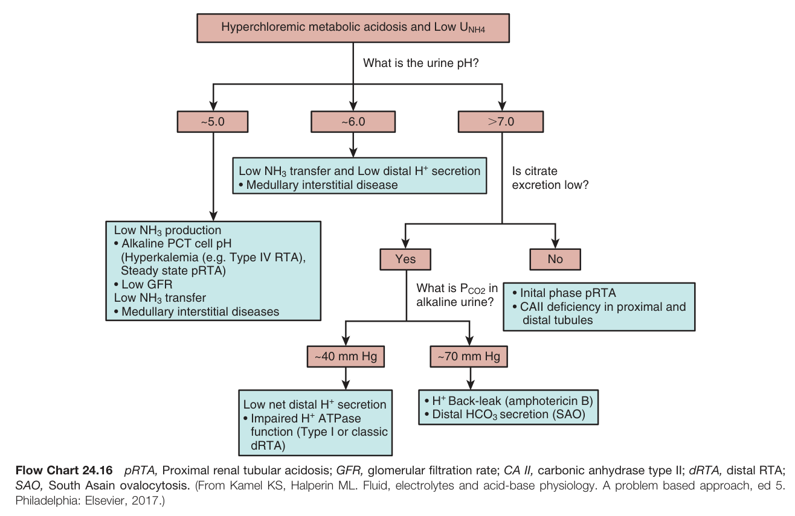

Flow Chart 24.16 pRTA, Proximal renal tubular acidosis; GFR, glomerular filtration rate; CA II, carbonic anhydrase type II; dRTA, distal RTA; SAO, South Asain ovalocytosis. (From Kamel KS, Halperin ML. Fluid, electrolytes and acid-base physiology. A problem based approach, ed 5. Philadelphia: Elsevier, 2017.)

---
## Tables

### Table_24_1

#### Table Image

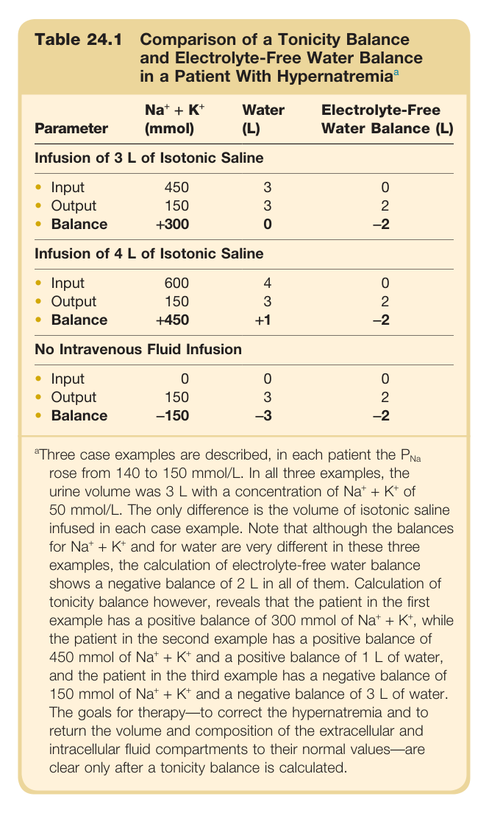

#### Table Data (CSV: [Table_24_1.csv](Table_24_1.csv))

```markdown
| Table Text (OCR) |
| :--- |
| Table 24.1 Comparison of a Tonicity Balance and Electrolyte-Free Water Balance in a Patient With Hypernatremia<sup>a</sup>  <sup>a</sup>Three case examples are described, in each patient the \mathsf { P _ { N a } } rose from 140 to 150 mmol/L. In all three examples, the urine volume was 3 L with a concentration of \mathsf { N a } ^ { + } + \mathsf { K } ^ { + } of 50 mmol/L. The only difference is the volume of isotonic saline infused in each case example. Note that although the balances for \mathsf { N a } ^ { + } + \mathsf { K } ^ { + } and for water are very different in these three examples, the calculation of electrolyte-free water balance shows a negative balance of 2 L in all of them. Calculation of tonicity balance however, reveals that the patient in the first example has a positive balance of 300 mmol of \mathsf { N a } ^ { + } + \mathsf { K } ^ { + } , , while the patient in the second example has a positive balance of 450 mmol of \mathsf { N a } ^ { + } + \mathsf { K } ^ { + } and a positive balance of 1 L of water, and the patient in the third example has a negative balance of 150 mmol of \mathsf { N a } ^ { + } + \mathsf { K } ^ { + } and a negative balance of 3 L of water. The goals for therapy—to correct the hypernatremia and to return the volume and composition of the extracellular and intracellular fluid compartments to their normal values—are clear only after a tonicity balance is calculated. |
```

Table 24.1 Comparison of a Tonicity Balance and Electrolyte-Free Water Balance in a Patient With Hypernatremiaa | Parameter | Na+ + K+ (mmol) | Water (L) | Electrolyte-Free Water Balance (L) | | :--- | :--- | :--- | :--- | | **Infusion of 3 L of Isotonic Saline** | | | | | • Input | 450 | 3 | 0 | | • Output | 150 | 3 | 2 | | • Balance | +300 | 0 | -2 | | **Infusion of 4 L of Isotonic Saline** | | | | | • Input | 600 | 4 | 0 | | • Output | 150 | 3 | 2 | | • Balance | +450 | +1 | -2 | | **No Intravenous Fluid Infusion** | | | | | • Input | 0 | 0 | 0 | | • Output | 150 | 3 | 2 | | • Balance | -150 | -3 | -2 | Three case examples are described, in each patient the PNa rose from 140 to 150 mmol/L. In all three examples, the urine volume was 3 L with a concentration of Na+ + K+ of 50 mmol/L. The only difference is the volume of isotonic saline infused in each case example. Note that although the balances for Na+ + K+ and for water are very different in these three examples, the calculation of electrolyte-free water balance shows a negative balance of 2 L in all of them. Calculation of tonicity balance however, reveals that the patient in the first example has a positive balance of 300 mmol of Na+ + K+, while the patient in the second example has a positive balance of 450 mmol of Na+ + K+ and a positive balance of 1 L of water, and the patient in the third example has a negative balance of 150 mmol of Na+ + K+ and a negative balance of 3 L of water. The goals for therapy-to correct the hypernatremia and to return the volume and composition of the extracellular and intracellular fluid compartments to their normal values-are clear only after a tonicity balance is calculated.

---

### Table_24_2

#### Table Image

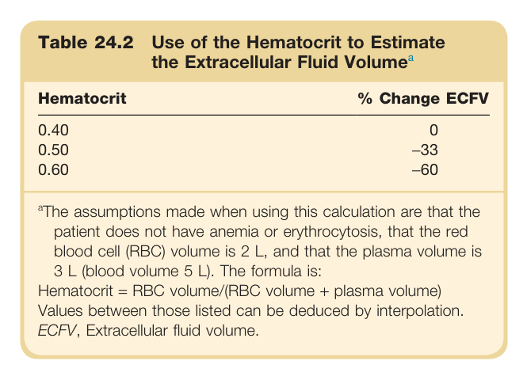

#### Table Data (CSV: [Table_24_2.csv](Table_24_2.csv))

```markdown
| Table Text (OCR) |
| :--- |
| Table 24.2 Use of the Hematocrit to Estimate the Extracellular Fluid Volume<sup>a</sup>  <sup>a</sup>The assumptions made when using this calculation are that the patient does not have anemia or erythrocytosis, that the red blood cell (RBC) volume is 2 L, and that the plasma volume is 3 L (blood volume 5 L). The formula is: Hematocrit = RBC volume/(RBC volume + plasma volume) Values between those listed can be deduced by interpolation. ECFV, Extracellular fluid volume. |
```

Table 24.2 Use of the Hematocrit to Estimate the Extracellular Fluid Volumea | Hematocrit | % Change ECFV | | :--- | :--- | | 0.40 | 0 | | 0.50 | -33 | | 0.60 | -60 | The assumptions made when using this calculation are that the patient does not have anemia or erythrocytosis, that the red blood cell (RBC) volume is 2 L, and that the plasma volume is 3 L (blood volume 5 L). The formula is: Hematocrit = RBC volume/(RBC volume + plasma volume) Values between those listed can be deduced by interpolation. ECFV, Extracellular fluid volume.

---

### Table_24_3

#### Table Image

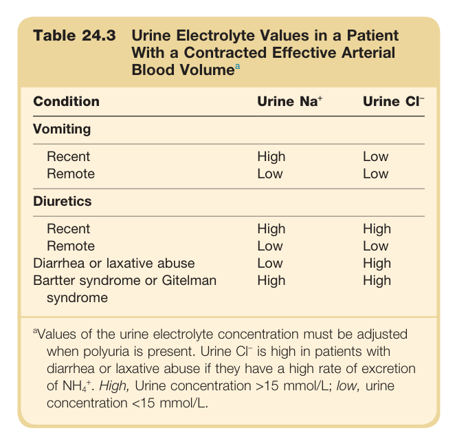

#### Table Data (CSV: [Table_24_3.csv](Table_24_3.csv))

```markdown
| Table Text (OCR) |
| :--- |
| Table 24.3 Urine Electrolyte Values in a Patient With a Contracted Effective Arterial Blood Volume<sup>a</sup>  <sup>a</sup>Values of the urine electrolyte concentration must be adjusted when polyuria is present. Urine Cl<sup>−</sup> is high in patients with diarrhea or laxative abuse if they have a high rate of excretion of NH <sup>+</sup>. High, Urine concentration >15 mmol/L; low, urine concentration <15 mmol/L. |
```

Table 24.3 Urine Electrolyte Values in a Patient With a Contracted Effective Arterial Blood Volumea | Condition | Urine Na+ | Urine CI- | | :--- | :--- | :--- | | **Vomiting** | | | | Recent | High | Low | | Remote | Low | Low | | **Diuretics** | | | | Recent | High | High | | Remote | Low | Low | | Diarrhea or laxative abuse | Low | High | | Bartter syndrome or Gitelman syndrome | High | High | Values of the urine electrolyte concentration must be adjusted when polyuria is present. Urine Cl is high in patients with diarrhea or laxative abuse if they have a high rate of excretion of NH4+. High, Urine concentration >15 mmol/L; low, urine concentration <15 mmol/L.

---

### Table_24_4

#### Table Image

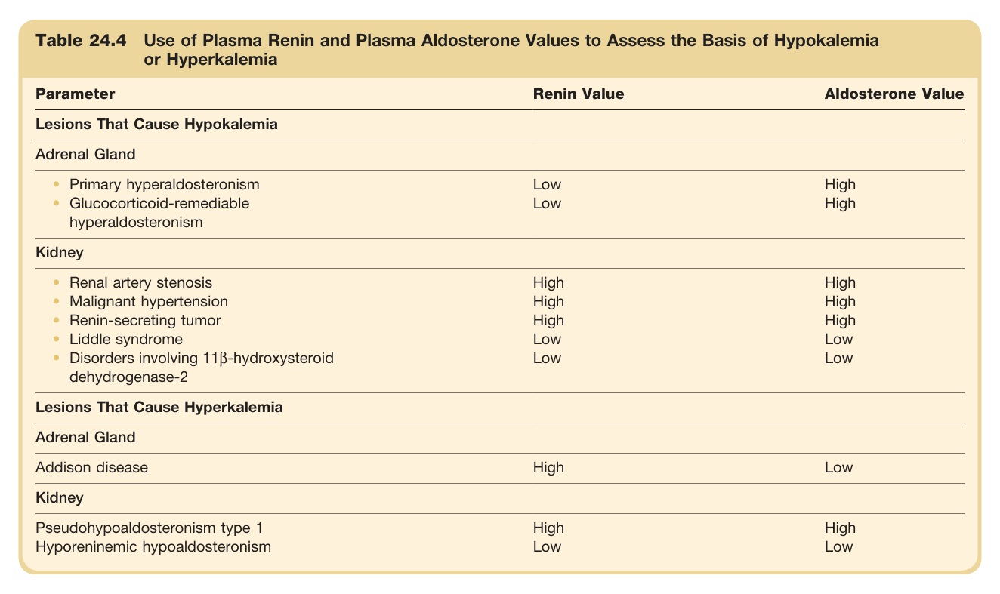

#### Table Data (CSV: [Table_24_4.csv](Table_24_4.csv))

```markdown
| Table Text (OCR) |
| :--- |
| Table 24.4 Use of Plasma Renin and Plasma Aldosterone Values to Assess the Basis of Hypokalemia or Hyperkalemia |
```

Table 24.4 Use of Plasma Renin and Plasma Aldosterone Values to Assess the Basis of Hypokalemia or Hyperkalemia | Parameter | Renin Value | Aldosterone Value | | :--- | :--- | :--- | | **Lesions That Cause Hypokalemia** | | | | **Adrenal Gland** | | | | • Primary hyperaldosteronism | Low | High | | • Glucocorticoid-remediable hyperaldosteronism | Low | High | | **Kidney** | | | | • Renal artery stenosis | High | High | | • Malignant hypertension | High | High | | • Renin-secreting tumor | High | High | | • Liddle syndrome | Low | Low | | • Disorders involving 11ẞ-hydroxysteroid dehydrogenase-2 | Low | Low | | **Lesions That Cause Hyperkalemia** | | | | **Adrenal Gland** | | | | Addison disease | High | Low | | **Kidney** | | | | Pseudohypoaldosteronism type 1 | High | High | | Hyporeninemic hypoaldosteronism | Low | Low |

---

### Table_24_5

#### Table Image

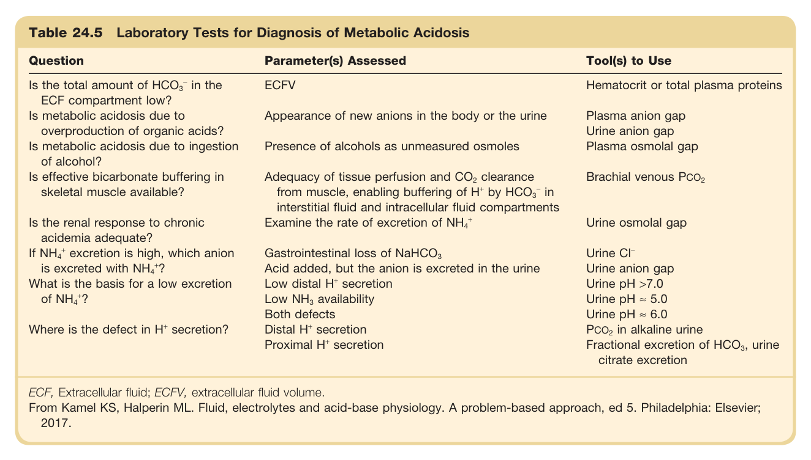

#### Table Data (CSV: [Table_24_5.csv](Table_24_5.csv))

```markdown
| Table Text (OCR) |
| :--- |
| Table 24.5 Laboratory Tests for Diagnosis of Metabolic Acidosis  ECF, Extracellular fluid; ECFV, extracellular fluid volume. From Kamel KS, Halperin ML. Fluid, electrolytes and acid-base physiology. A problem-based approach, ed 5. Philadelphia: Elsevier; |
```

Table 24.5 Laboratory Tests for Diagnosis of Metabolic Acidosis | Question | Parameter(s) Assessed | Tool(s) to Use | | :--- | :--- | :--- | | Is the total amount of HCO3 in the ECF compartment low? | ECFV | Hematocrit or total plasma proteins | | Is metabolic acidosis due to overproduction of organic acids? | Appearance of new anions in the body or the urine | Plasma anion gap, Urine anion gap | | Is metabolic acidosis due to ingestion of alcohol? | Presence of alcohols as unmeasured osmoles | Plasma osmolal gap | | Is effective bicarbonate buffering in skeletal muscle available? | Adequacy of tissue perfusion and CO2 clearance from muscle, enabling buffering of H+ by HCO3 in interstitial fluid and intracellular fluid compartments | Brachial venous PCO2 | | Is the renal response to chronic acidemia adequate? | Examine the rate of excretion of NH4+ | Urine osmolal gap | | If NH4+ excretion is high, which anion is excreted with NH4+? | Gastrointestinal loss of NaHCO3, Acid added, but the anion is excreted in the urine | Urine CI-, Urine anion gap | | What is the basis for a low excretion of NH4+? | Low distal H+ secretion, Low NH3 availability, Both defects | Urine pH >7.0, Urine pH ≈ 5.0, Urine pH ≈ 6.0 | | Where is the defect in H+ secretion? | Distal H+ secretion, Proximal H+ secretion | PCO2 in alkaline urine, Fractional excretion of HCO3, urine citrate excretion | ECF, Extracellular fluid; ECFV, extracellular fluid volume. From Kamel KS, Halperin ML. Fluid, electrolytes and acid-base physiology. A problem-based approach, ed 5. Philadelphia: Elsevier; 2017.

---
