# 25. Diagnostic Kidney Imaging - Figures and Tables Index

This document lists all figures and tables extracted from `25. Diagnostic Kidney Imaging.pdf`.

## Table of Contents
- [Figures](#figures)
- [Tables](#tables)

---

## Figures

### Fig_25_1

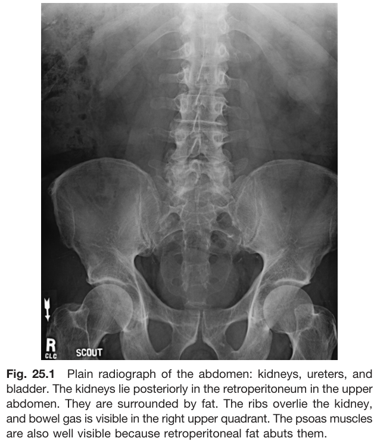

Fig. 25.1 Plain radiograph of the abdomen: kidneys, ureters, and bladder. The kidneys lie posteriorly in the retroperitoneum in the upper abdomen. They are surrounded by fat. The ribs overlie the kidney, and bowel gas is visible in the right upper quadrant. The psoas muscles are also well visible because retroperitoneal fat abuts them.

---

### Fig_25_2

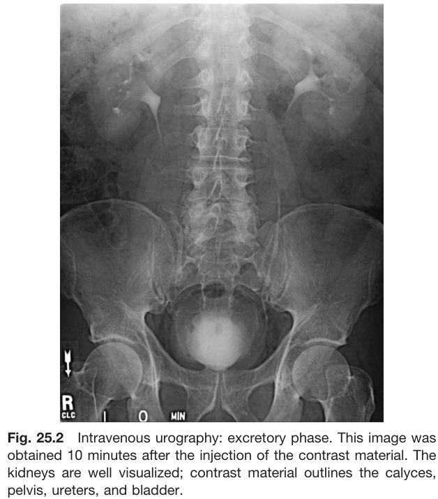

Fig. 25.2 Intravenous urography: excretory phase. This image was obtained 10 minutes after the injection of the contrast material. The kidneys are well visualized; contrast material outlines the calyces, pelvis, ureters, and bladder.

---

### Fig_25_3

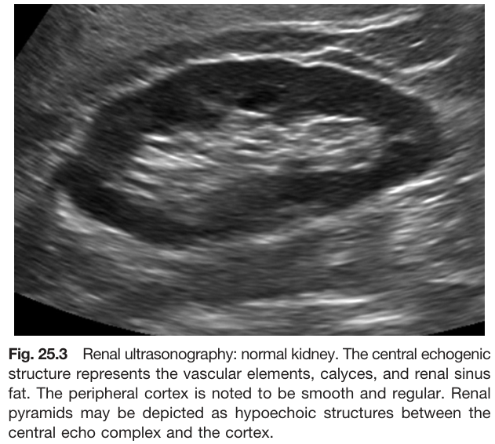

Fig. 25.3 Renal ultrasonography: normal kidney. The central echogenic structure represents the vascular elements, calyces, and renal sinus fat. The peripheral cortex is noted to be smooth and regular. Renal pyramids may be depicted as hypoechoic structures between the central echo complex and the cortex.

---

### Fig_25_4

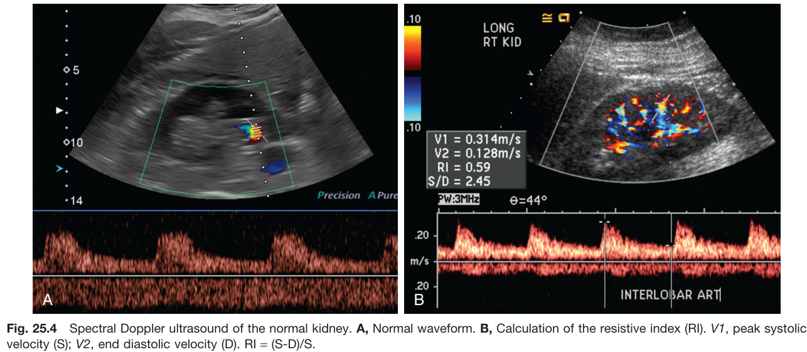

Fig. 25.4 Spectral Doppler ultrasound of the normal kidney. A, Normal waveform. B, Calculation of the resistive index (RI). V1, peak systolic velocity (S); V2, end diastolic velocity (D). RI = (S-D)/S.

---

### Fig_25_5

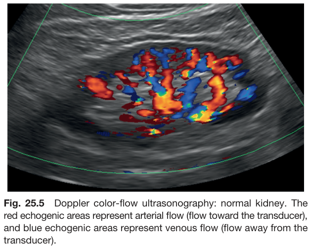

Fig. 25.5 Doppler color-flow ultrasonography: normal kidney. The red echogenic areas represent arterial flow (flow toward the transducer), and blue echogenic areas represent venous flow (flow away from the transducer).

---

### Fig_25_6

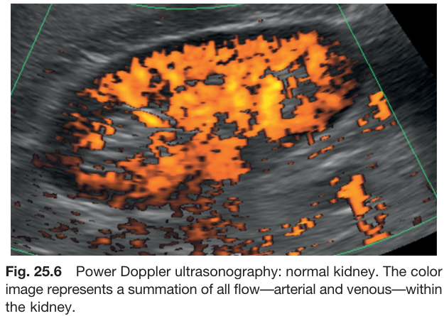

Fig. 25.6 Power Doppler ultrasonography: normal kidney. The color image represents a summation of all flow-arterial and venous-within the kidney.

---

### Fig_25_7

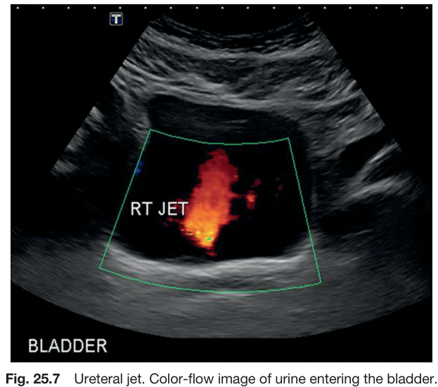

Fig. 25.7 Ureteral jet. Color-flow image of urine entering the bladder.

---

### Fig_25_8

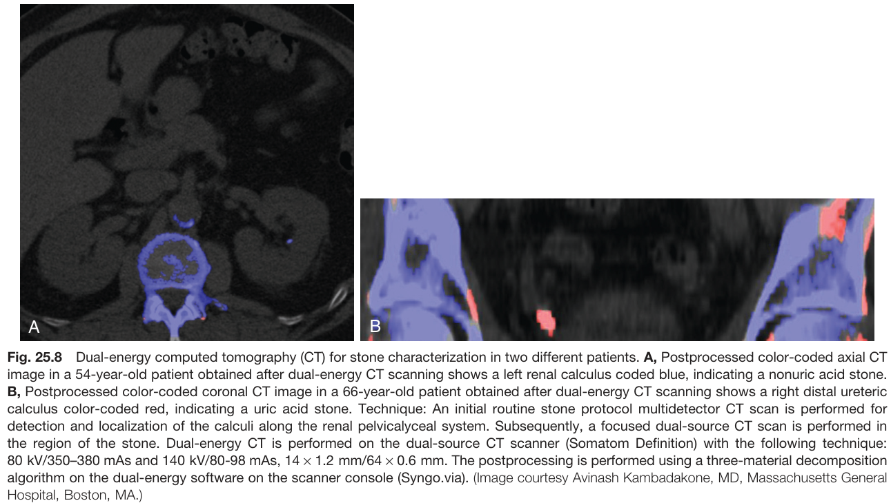

Fig. 25.8 Dual-energy computed tomography (CT) for stone characterization in two different patients. A, Postprocessed color-coded axial CT image in a 54-year-old patient obtained after dual-energy CT scanning shows a left renal calculus coded blue, indicating a nonuric acid stone. B, Postprocessed color-coded coronal CT image in a 66-year-old patient obtained after dual-energy CT scanning shows a right distal ureteric calculus color-coded red, indicating a uric acid stone. Technique: An initial routine stone protocol multidetector CT scan is performed for detection and localization of the calculi along the renal pelvicalyceal system. Subsequently, a focused dual-source CT scan is performed in the region of the stone. Dual-energy CT is performed on the dual-source CT scanner (Somatom Definition) with the following technique: 80 kV/350-380 mAs and 140 kV/80-98 mAs, 14 x 1.2 mm/64 × 0.6 mm. The postprocessing is performed using a three-material decomposition algorithm on the dual-energy software on the scanner console (Syngo.via). (Image courtesy Avinash Kambadakone, MD, Massachusetts General Hospital, Boston, MA.)

---

### Fig_25_9

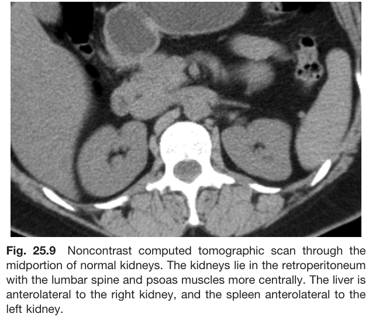

Fig. 25.9 Noncontrast computed tomographic scan through the midportion of normal kidneys. The kidneys lie in the retroperitoneum with the lumbar spine and psoas muscles more centrally. The liver is anterolateral to the right kidney, and the spleen anterolateral to the left kidney.

---

### Fig_25_10

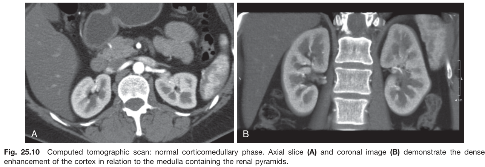

Fig. 25.10 Computed tomographic scan: normal corticomedullary phase. Axial slice (A) and coronal image (B) demonstrate the dense enhancement of the cortex in relation to the medulla containing the renal pyramids.

---

### Fig_25_11

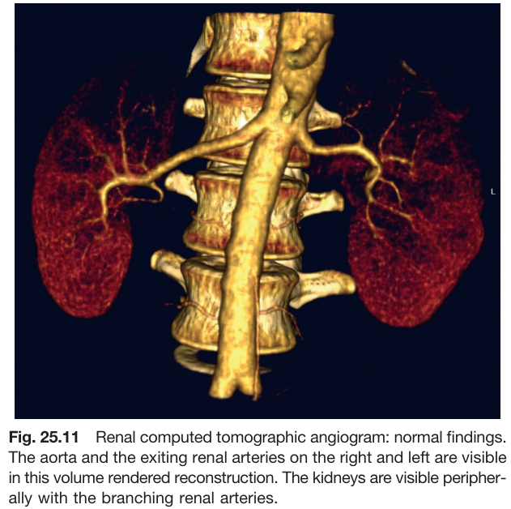

Fig. 25.11 Renal computed tomographic angiogram: normal findings. The aorta and the exiting renal arteries on the right and left are visible in this volume rendered reconstruction. The kidneys are visible peripher- ally with the branching renal arteries.

---

### Fig_25_12

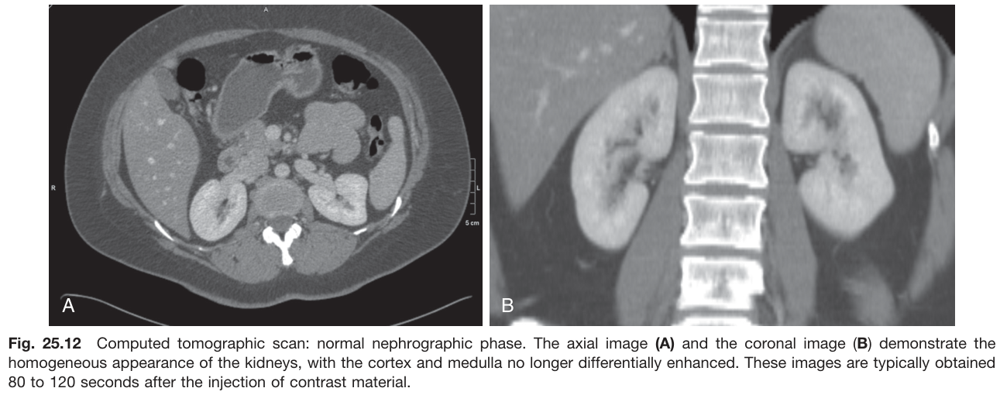

Fig. 25.12 Computed tomographic scan: normal nephrographic phase. The axial image (A) and the coronal image (B) demonstrate the homogeneous appearance of the kidneys, with the cortex and medulla no longer differentially enhanced. These images are typically obtained 80 to 120 seconds after the injection of contrast material.

---

### Fig_25_13

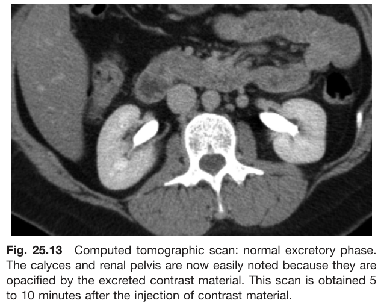

Fig. 25.13 Computed tomographic scan: normal excretory phase. The calyces and renal pelvis are now easily noted because they are opacified by the excreted contrast material. This scan is obtained 5 to 10 minutes after the injection of contrast material.

---

### Fig_25_14

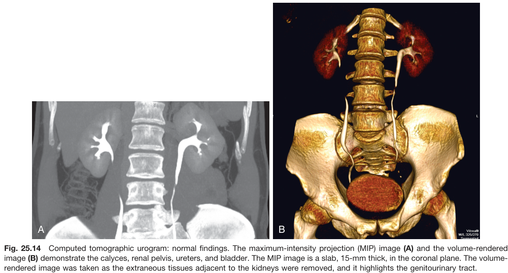

Fig. 25.14 Computed tomographic urogram: normal findings. The maximum-intensity projection (MIP) image (A) and the volume-rendered image (B) demonstrate the calyces, renal pelvis, ureters, and bladder. The MIP image is a slab, 15-mm thick, in the coronal plane. The volume- rendered image was taken as the extraneous tissues adjacent to the kidneys were removed, and it highlights the genitourinary tract.

---

### Fig_25_15

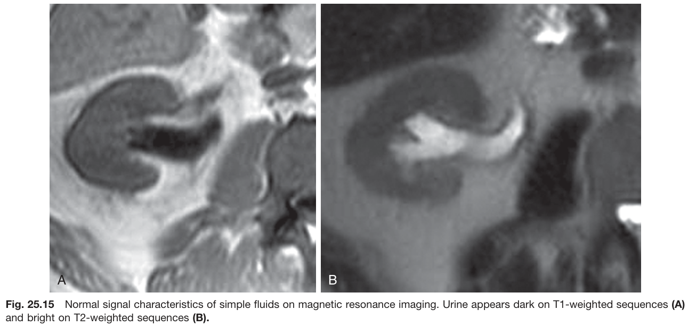

Fig. 25.15 Normal signal characteristics of simple fluids on magnetic resonance imaging. Urine appears dark on T1-weighted sequences (A) and bright on T2-weighted sequences (B).

---

### Fig_25_16

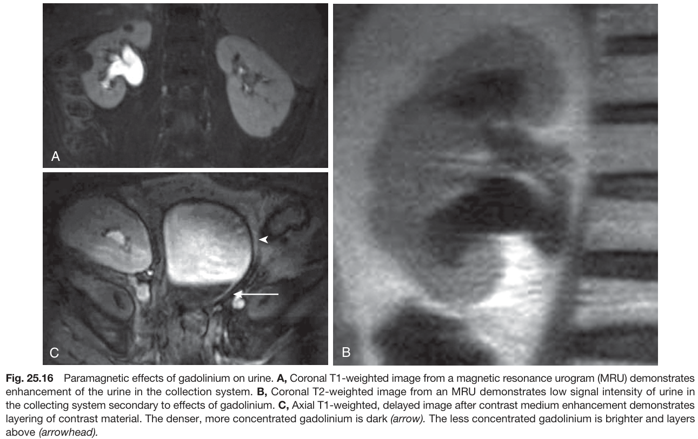

Fig. 25.16 Paramagnetic effects of gadolinium on urine. A, Coronal T1-weighted image from a magnetic resonance urogram (MRU) demonstrates enhancement of the urine in the collection system. B, Coronal T2-weighted image from an MRU demonstrates low signal intensity of urine in the collecting system secondary to effects of gadolinium. C, Axial T1-weighted, delayed image after contrast medium enhancement demonstrates layering of contrast material. The denser, more concentrated gadolinium is dark (arrow). The less concentrated gadolinium is brighter and layers above (arrowhead).

---

### Fig_25_17

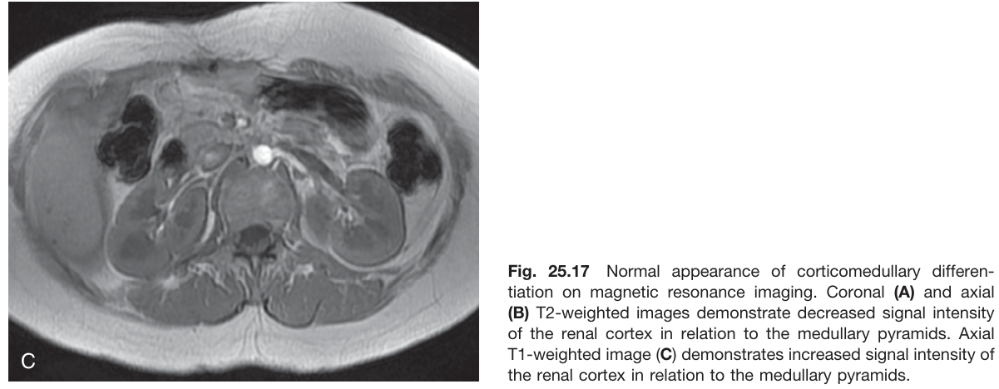

Fig. 25.17 Normal appearance of corticomedullary differentiation on magnetic resonance imaging. Coronal (A) and axial (B) T2-weighted images demonstrate decreased signal intensity of the renal cortex in relation to the medullary pyramids. Axial T1-weighted image (C) demonstrates increased signal intensity of the renal cortex in relation to the medullary pyramids.

---

### Fig_25_18

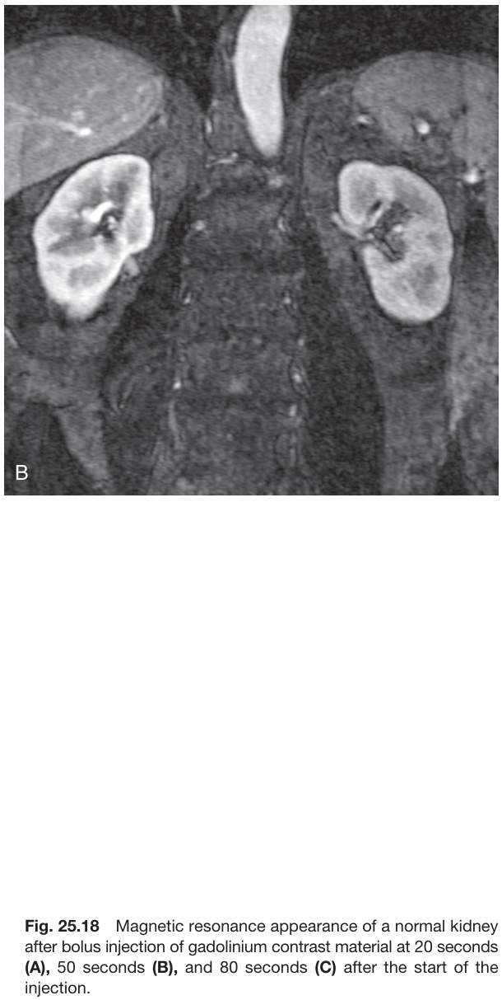

Fig. 25.18 Magnetic resonance appearance of a normal kidney after bolus injection of gadolinium contrast material at 20 seconds (A), 50 seconds (B), and 80 seconds (C) after the start of the injection.

---

### Fig_25_19

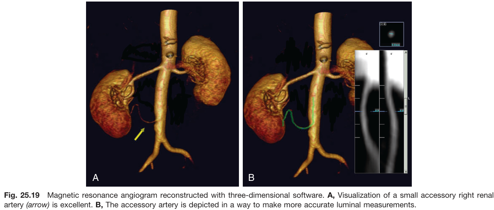

Fig. 25.19 Magnetic resonance angiogram reconstructed with three-dimensional software. A, Visualization of a small accessory right renal artery (arrow) is excellent. B, The accessory artery is depicted in a way to make more accurate luminal measurements.

---

### Fig_25_20

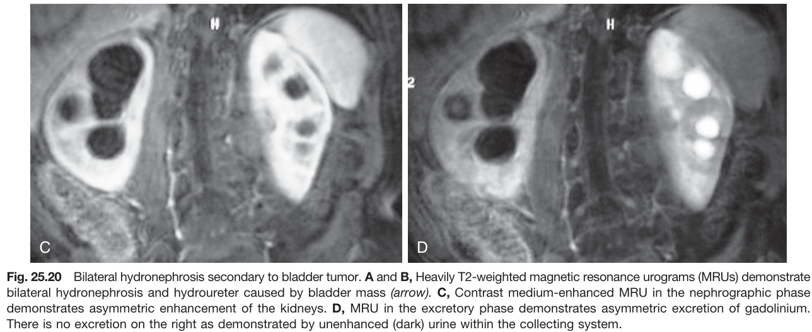

Fig. 25.20 Bilateral hydronephrosis secondary to bladder tumor. A and B, Heavily T2-weighted magnetic resonance urograms (MRUs) demonstrate bilateral hydronephrosis and hydroureter caused by bladder mass (arrow). C, Contrast medium-enhanced MRU in the nephrographic phase demonstrates asymmetric enhancement of the kidneys. D, MRU in the excretory phase demonstrates asymmetric excretion of gadolinium. There is no excretion on the right as demonstrated by unenhanced (dark) urine within the collecting system.

---

### Fig_25_21

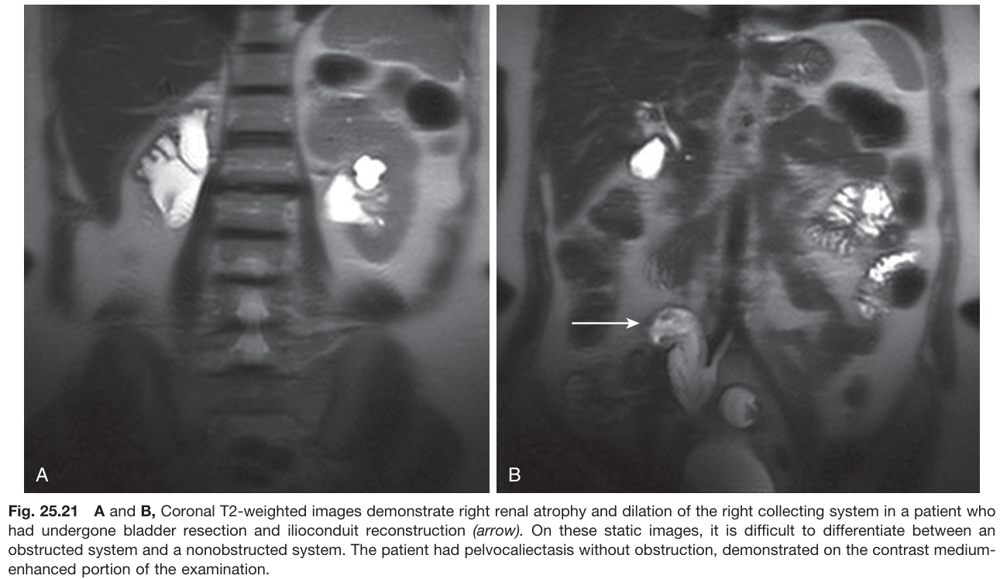

Fig. 25.21 A and B, Coronal T2-weighted images demonstrate right renal atrophy and dilation of the right collecting system in a patient who had undergone bladder resection and ilioconduit reconstruction (arrow). On these static images, it is difficult to differentiate between an obstructed system and a nonobstructed system. The patient had pelvocaliectasis without obstruction, demonstrated on the contrast medium- enhanced portion of the examination.

---

### Fig_25_22

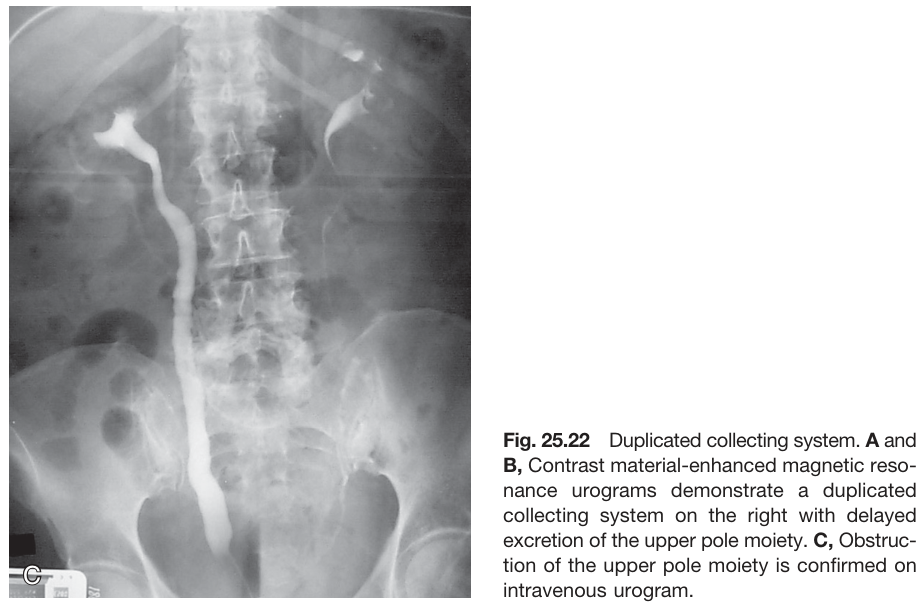

Fig. 25.22 Duplicated collecting system. A and B, Contrast material-enhanced magnetic reso- nance urograms demonstrate a duplicated collecting system on the right with delayed excretion of the upper pole moiety. C, Obstruc- tion of the upper pole moiety is confirmed on intravenous urogram.

---

### Fig_25_23

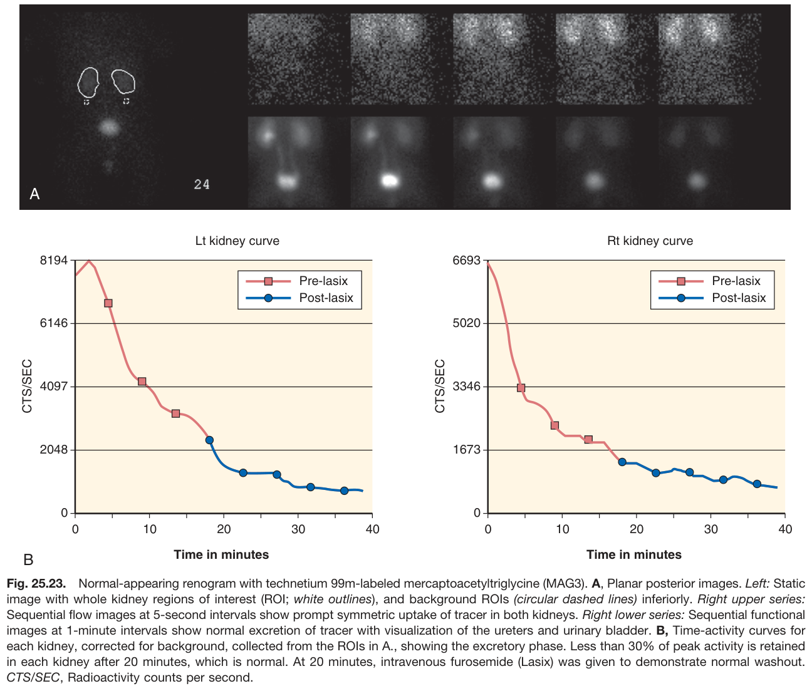

Fig. 25.23 Normal-appearing renogram with technetium 99m-labeled mercaptoacetyltriglycine (MAG3). A, Planar posterior images. Left: Static image with whole kidney regions of interest (ROI; white outlines), and background ROIs (circular dashed lines) inferiorly. Right upper series: Sequential flow images at 5-second intervals show prompt symmetric uptake of tracer in both kidneys. Right lower series: Sequential functional images at 1-minute intervals show normal excretion of tracer with visualization of the ureters and urinary bladder. B, Time-activity curves for each kidney, corrected for background, collected from the ROIs in A., showing the excretory phase. Less than 30% of peak activity is retained in each kidney after 20 minutes, which is normal. At 20 minutes, intravenous furosemide (Lasix) was given to demonstrate normal washout. CTS/SEC, Radioactivity counts per second.

---

### Fig_25_24

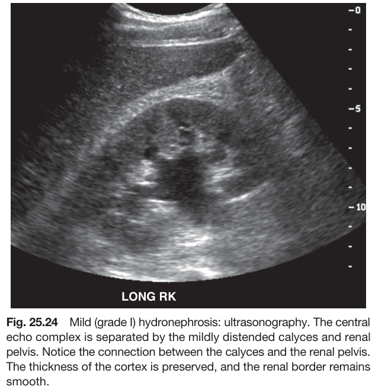

Fig. 25.24 Mild (grade I) hydronephrosis: ultrasonography. The central echo complex is separated by the mildly distended calyces and renal pelvis. Notice the connection between the calyces and the renal pelvis. The thickness of the cortex is preserved, and the renal border remains smooth.

---

### Fig_25_25

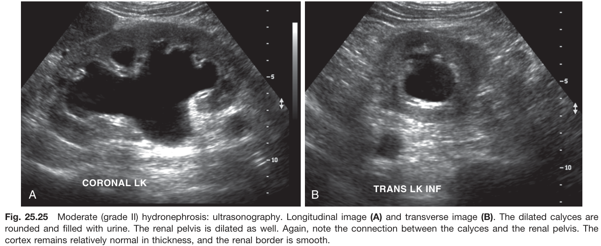

Fig. 25.25 Moderate (grade II) hydronephrosis: ultrasonography. Longitudinal image (A) and transverse image (B). The dilated calyces are rounded and filled with urine. The renal pelvis is dilated as well. Again, note the connection between the calyces and the renal pelvis. The cortex remains relatively normal in thickness, and the renal border is smooth.

---

### Fig_25_26

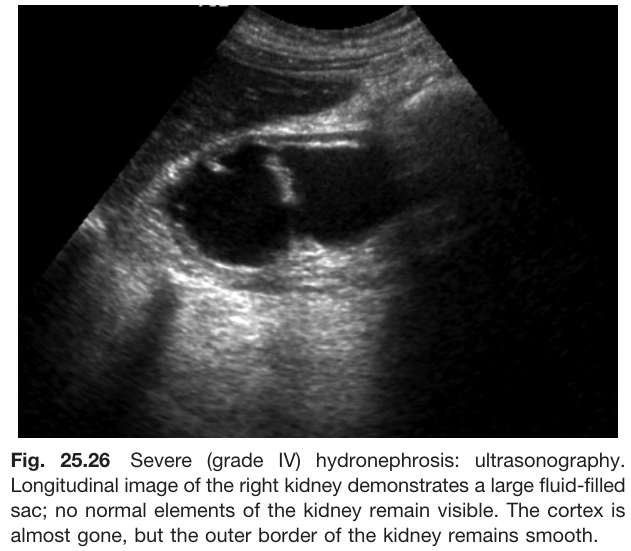

Fig. 25.26 Severe (grade IV) hydronephrosis: ultrasonography. Longitudinal image of the right kidney demonstrates a large fluid-filled sac; no normal elements of the kidney remain visible. The cortex is almost gone, but the outer border of the kidney remains smooth.

---

### Fig_25_27

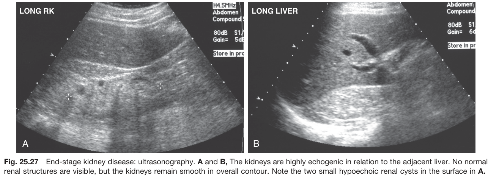

Fig. 25.27 End-stage kidney disease: ultrasonography. A and B, The kidneys are highly echogenic in relation to the adjacent liver. No normal renal structures are visible, but the kidneys remain smooth in overall contour. Note the two small hypoechoic renal cysts in the surface in A.

---

### Fig_25_28

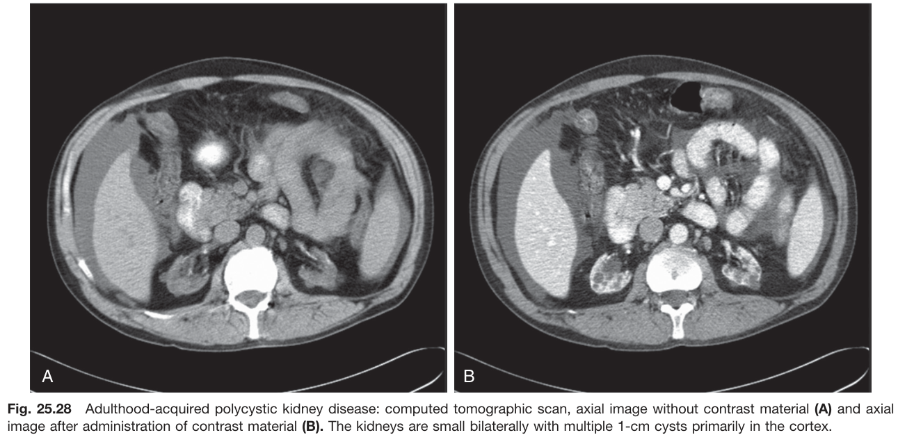

Fig. 25.28 Adulthood-acquired polycystic kidney disease: computed tomographic scan, axial image without contrast material (A) and axial image after administration of contrast material (B). The kidneys are small bilaterally with multiple 1-cm cysts primarily in the cortex.

---

### Fig_25_29

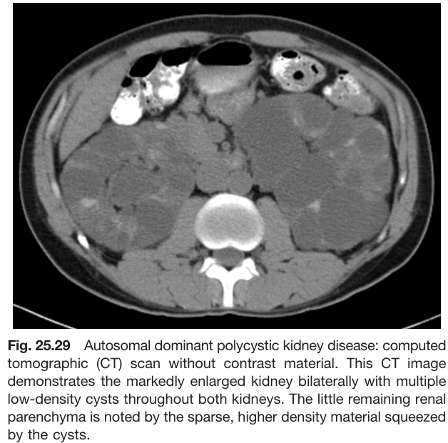

Fig. 25.29 Autosomal dominant polycystic kidney disease: computed tomographic (CT) scan without contrast material. This CT image demonstrates the markedly enlarged kidney bilaterally with multiple low-density cysts throughout both kidneys. The little remaining renal parenchyma is noted by the sparse, higher density material squeezed by the cysts.

---

### Fig_25_30

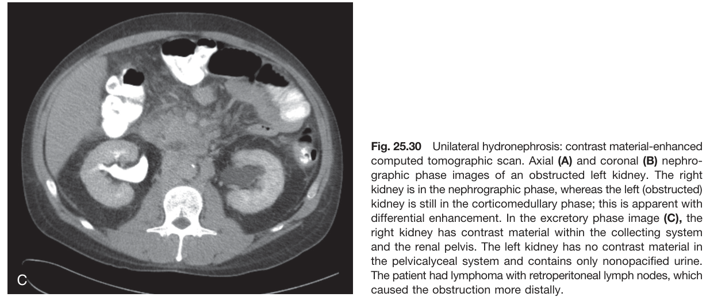

Fig. 25.30 Unilateral hydronephrosis: contrast material-enhanced computed tomographic scan. Axial (A) and coronal (B) nephro- graphic phase images of an obstructed left kidney. The right kidney is in the nephrographic phase, whereas the left (obstructed) kidney is still in the corticomedullary phase; this is apparent with differential enhancement. In the excretory phase image (C), the right kidney has contrast material within the collecting system and the renal pelvis. The left kidney has no contrast material in the pelvicalyceal system and contains only nonopacified urine. The patient had lymphoma with retroperitoneal lymph nodes, which caused the obstruction more distally.

---

### Fig_25_31

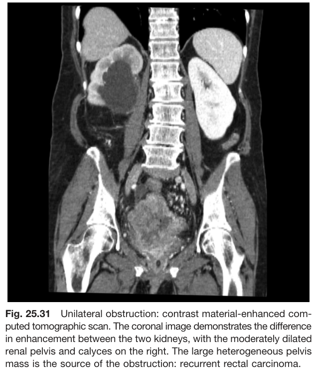

Fig. 25.31 Unilateral obstruction: contrast material-enhanced computed tomographic scan. The coronal image demonstrates the difference in enhancement between the two kidneys, with the moderately dilated renal pelvis and calyces on the right. The large heterogeneous pelvis mass is the source of the obstruction: recurrent rectal carcinoma.

---

### Fig_25_32

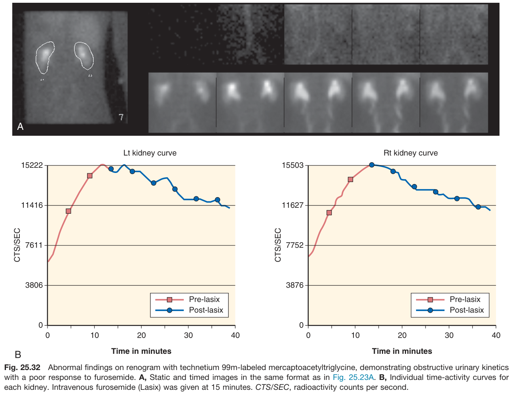

Fig. 25.32 Abnormal findings on renogram with technetium 99m-labeled mercaptoacetyltriglycine, demonstrating obstructive urinary kinetics with a poor response to furosemide. A, Static and timed images in the same format as in Fig. 25.23A. B, Individual time-activity curves for each kidney. Intravenous furosemide (Lasix) was given at 15 minutes. CTS/SEC, radioactivity counts per second.

---

### Fig_25_33

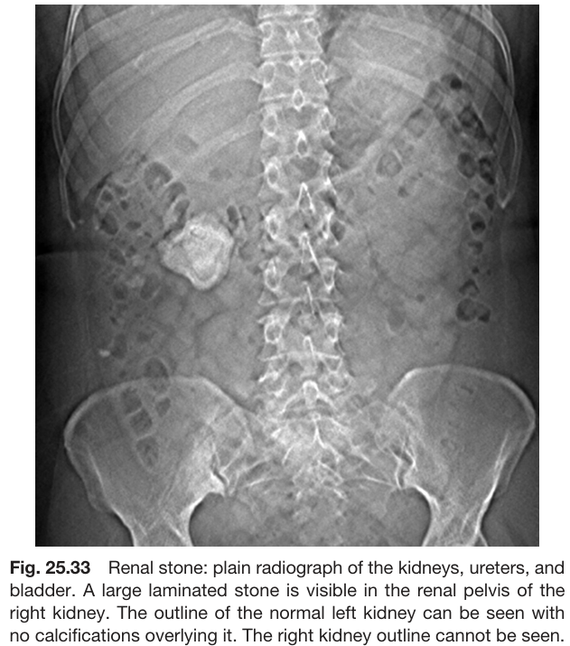

Fig. 25.33 Renal stone: plain radiograph of the kidneys, ureters, and bladder. A large laminated stone is visible in the renal pelvis of the right kidney. The outline of the normal left kidney can be seen with no calcifications overlying it. The right kidney outline cannot be seen.

---

### Fig_25_34

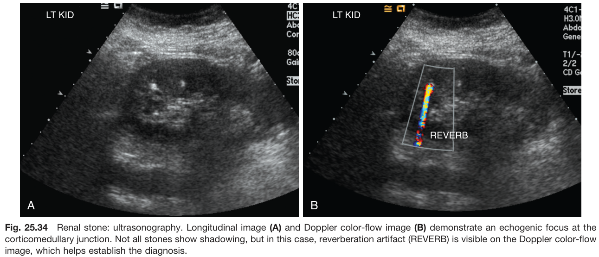

Fig. 25.34 Renal stone: ultrasonography. Longitudinal image (A) and Doppler color-flow image (B) demonstrate an echogenic focus at the corticomedullary junction. Not all stones show shadowing, but in this case, reverberation artifact (REVERB) is visible on the Doppler color-flow image, which helps establish the diagnosis.

---

### Fig_25_35

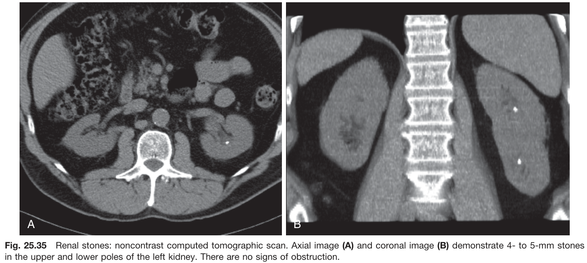

Fig. 25.35 Renal stones: noncontrast computed tomographic scan. Axial image (A) and coronal image (B) demonstrate 4- to 5-mm stones in the upper and lower poles of the left kidney. There are no signs of obstruction.

---

### Fig_25_36

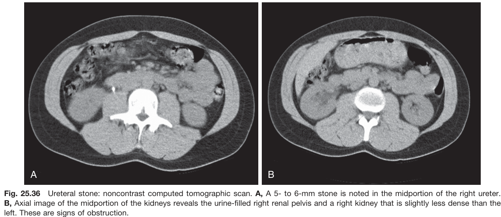

Fig. 25.36 Ureteral stone: noncontrast computed tomographic scan. A, A 5- to 6-mm stone is noted in the midportion of the right ureter. B, Axial image of the midportion of the kidneys reveals the urine-filled right renal pelvis and a right kidney that is slightly less dense than the left. These are signs of obstruction.

---

### Fig_25_37

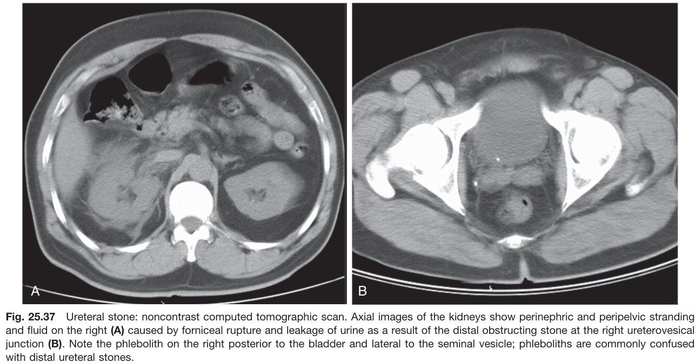

Fig. 25.37 Ureteral stone: noncontrast computed tomographic scan. Axial images of the kidneys show perinephric and peripelvic stranding and fluid on the right (A) caused by forniceal rupture and leakage of urine as a result of the distal obstructing stone at the right ureterovesical junction (B). Note the phlebolith on the right posterior to the bladder and lateral to the seminal vesicle; phleboliths are commonly confused with distal ureteral stones.

---

### Fig_25_38

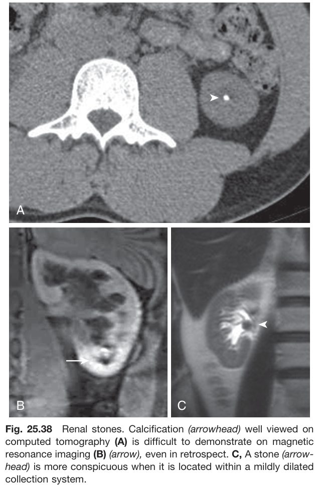

Fig. 25.38 Renal stones. Calcification (arrowhead) well viewed on computed tomography (A) is difficult to demonstrate on magnetic resonance imaging (B) (arrow), even in retrospect. C, A stone (arrow- head) is more conspicuous when it is located within a mildly dilated collection system.

---

### Fig_25_39

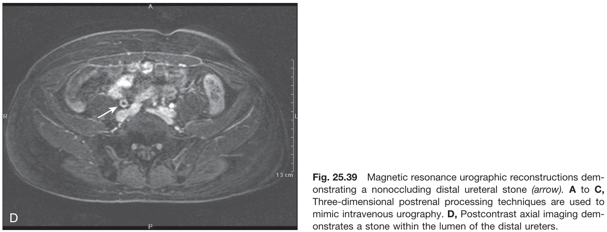

Fig. 25.39 Magnetic resonance urographic reconstructions demonstrating a nonoccluding distal ureteral stone (arrow). A to C, Three-dimensional postrenal processing techniques are used to mimic intravenous urography. D, Postcontrast axial imaging dem- onstrates a stone within the lumen of the distal ureters.

---

### Fig_25_40

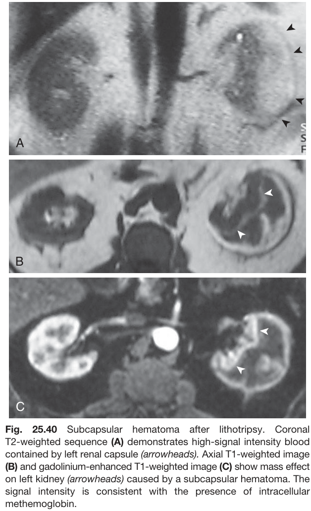

Fig. 25.40 Subcapsular hematoma after lithotripsy. Coronal T2-weighted sequence (A) demonstrates high-signal intensity blood contained by left renal capsule (arrowheads). Axial T1-weighted image (B) and gadolinium-enhanced T1-weighted image (C) show mass effect on left kidney (arrowheads) caused by a subcapsular hematoma. The signal intensity is consistent with the presence of intracellular methemoglobin.

---

### Fig_25_41

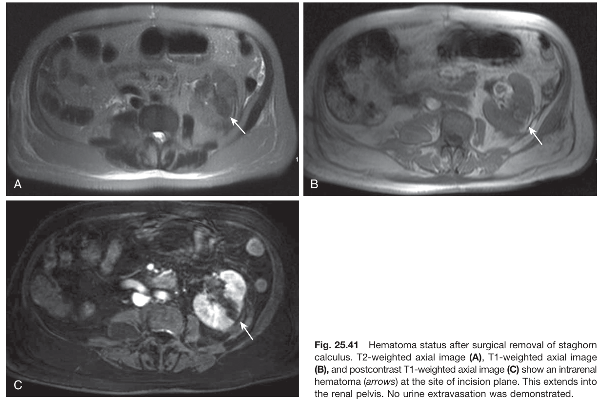

Fig. 25.41 Hematoma status after surgical removal of staghorn calculus. T2-weighted axial image (A), T1-weighted axial image (B), and postcontrast T1-weighted axial image (C) show an intrarenal hematoma (arrows) at the site of incision plane. This extends into the renal pelvis. No urine extravasation was demonstrated.

---

### Fig_25_42

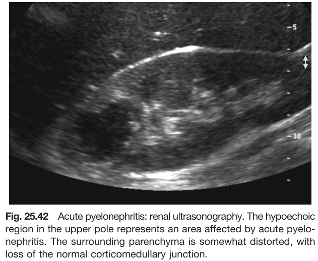

Fig. 25.42 Acute pyelonephritis: renal ultrasonography. The hypoechoic region in the upper pole represents an area affected by acute pyelo- nephritis. The surrounding parenchyma is somewhat distorted, with loss of the normal corticomedullary junction.

---

### Fig_25_43

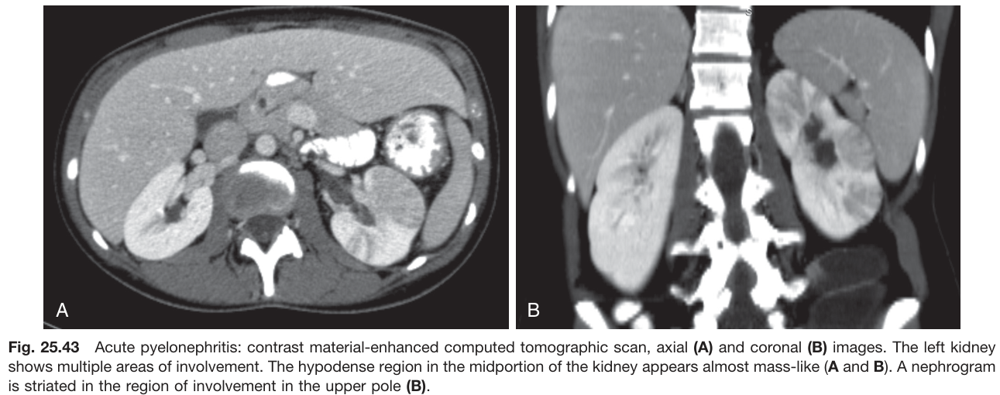

Fig. 25.43 Acute pyelonephritis: contrast material-enhanced computed tomographic scan, axial (A) and coronal (B) images. The left kidney shows multiple areas of involvement. The hypodense region in the midportion of the kidney appears almost mass-like (A and B). A nephrogram is striated in the region of involvement in the upper pole (B).

---

### Fig_25_44

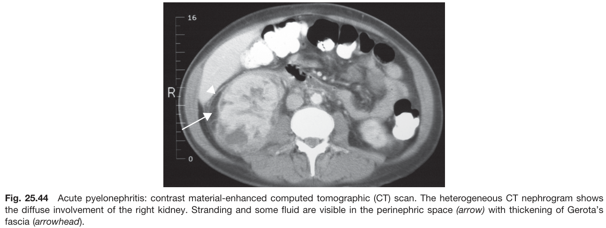

Fig. 25.44 Acute pyelonephritis: contrast material-enhanced computed tomographic (CT) scan. The heterogeneous CT nephrogram shows the diffuse involvement of the right kidney. Stranding and some fluid are visible in the perinephric space (arrow) with thickening of Gerota's fascia (arrowhead).

---

### Fig_25_45

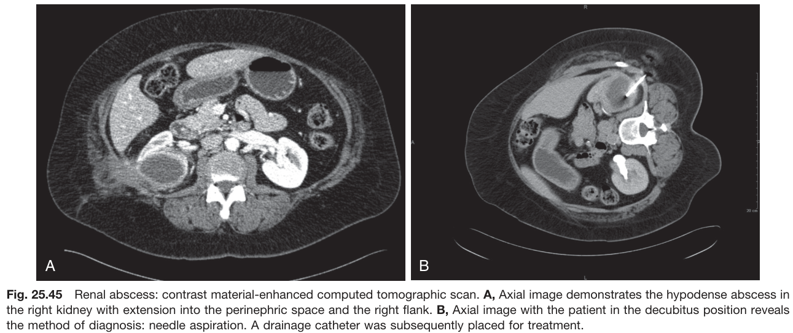

Fig. 25.45 Renal abscess: contrast material-enhanced computed tomographic scan. A, Axial image demonstrates the hypodense abscess in the right kidney with extension into the perinephric space and the right flank. B, Axial image with the patient in the decubitus position reveals the method of diagnosis: needle aspiration. A drainage catheter was subsequently placed for treatment.

---

### Fig_25_46

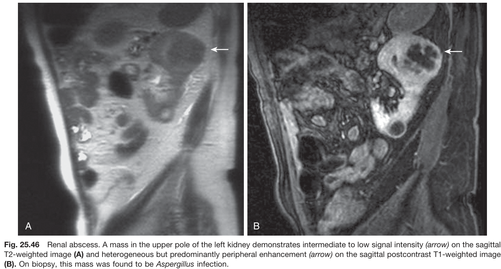

Fig. 25.46 Renal abscess. A mass in the upper pole of the left kidney demonstrates intermediate to low signal intensity (arrow) on the sagittal T2-weighted image (A) and heterogeneous but predominantly peripheral enhancement (arrow) on the sagittal postcontrast T1-weighted image (B). On biopsy, this mass was found to be Aspergillus infection.

---

### Fig_25_47

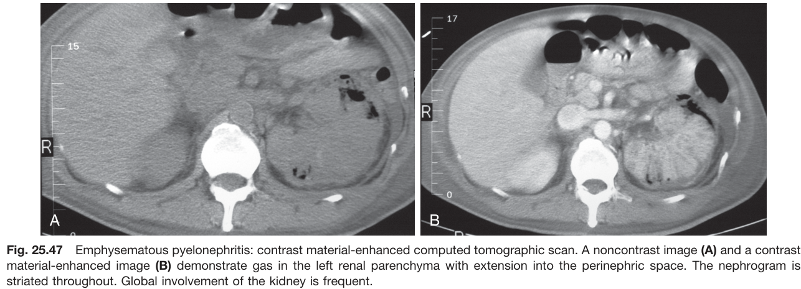

Fig. 25.47 Emphysematous pyelonephritis: contrast material-enhanced computed tomographic scan. A noncontrast image (A) and a contrast material-enhanced image (B) demonstrate gas in the left renal parenchyma with extension into the perinephric space. The nephrogram is striated throughout. Global involvement of the kidney is frequent.

---

### Fig_25_48

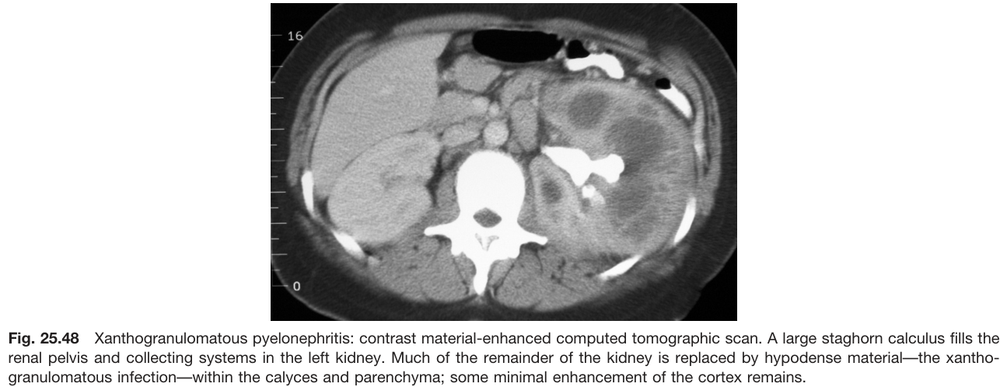

Fig. 25.48 Xanthogranulomatous pyelonephritis: contrast material-enhanced computed tomographic scan. A large staghorn calculus fills the renal pelvis and collecting systems in the left kidney. Much of the remainder of the kidney is replaced by hypodense material-the xantho- granulomatous infection-within the calyces and parenchyma; some minimal enhancement of the cortex remains.

---

### Fig_25_49

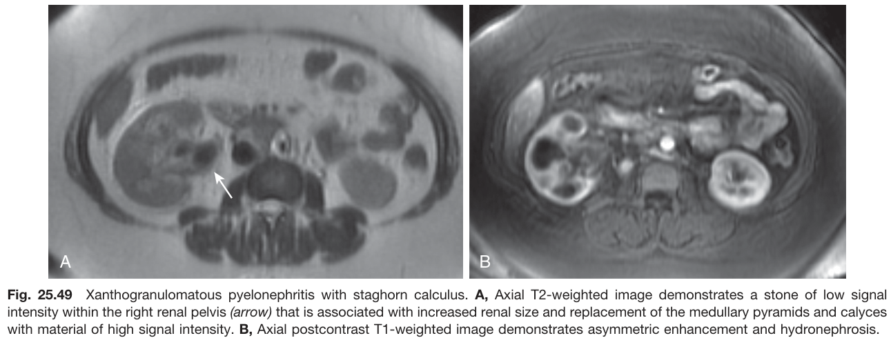

Fig. 25.49 Xanthogranulomatous pyelonephritis with staghorn calculus. A, Axial T2-weighted image demonstrates a stone of low signal intensity within the right renal pelvis (arrow) that is associated with increased renal size and replacement of the medullary pyramids and calyces with material of high signal intensity. B, Axial postcontrast T1-weighted image demonstrates asymmetric enhancement and hydronephrosis.

---

### Fig_25_50

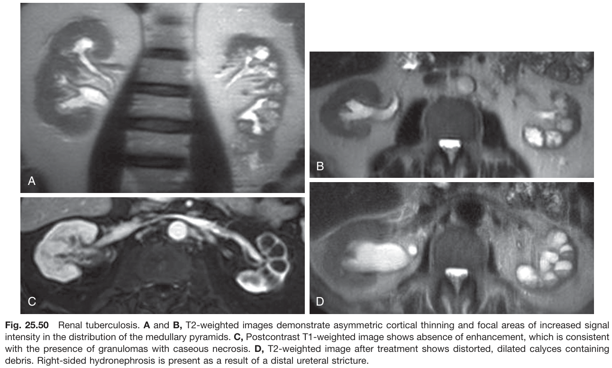

Fig. 25.50 Renal tuberculosis. A and B, T2-weighted images demonstrate asymmetric cortical thinning and focal areas of increased signal intensity in the distribution of the medullary pyramids. C, Postcontrast T1-weighted image shows absence of enhancement, which is consistent with the presence of granulomas with caseous necrosis. D, T2-weighted image after treatment shows distorted, dilated calyces containing debris. Right-sided hydronephrosis is present as a result of a distal ureteral stricture.

---

### Fig_25_51


Fig. 25.51 Renal tuberculosis: contrast material-enhanced computed tomographic scan. Axial (A) and coronal (B) images show the destruction of the right kidney as a result of renal tuberculosis. Parenchymal calcifications are present with dilated calyces as a result of the attenuation and truncation of the renal pelvis and ureter.

---

### Fig_25_52


Fig. 25.52 Acquired immunodeficiency syndrome-related nephropathy: ultrasonography. Longitudinal image of the right kidney. The size of the kidney is normal to slightly increased. The corticomedullary distinction is lost with diffuse increased cortical echogenicity.

---

### Fig_25_53


Fig. 25.53 Renal mass: nephrotomogram. A slightly hypodense mass projects off the lateral border of the left kidney (arrow). Subsequent imaging proved this to be a renal cyst.

---

### Fig_25_54


Fig. 25.54 Renal cyst: ultrasonography. A large, anechoic renal mass projects off the lateral border of the right kidney. The features of the cyst include a well-circumscribed lesion with a sharp back wall and increased through-transmission. There are no internal echoes or nodularity, and the wall is smooth. There is a clear interface with the kidney.

---

### Fig_25_55


Fig. 25.55 Gray-scale ultrasonographic longitudinal image reveals a cyst (white arrowheads) that is completely anechoic, and there are no septations in it. The appearance of posterior acoustic enhancement (black arrowheads) further confirms that the lesion is a cyst. The small, more superficial lesion (small white arrow) has a single thin septation, thus representing a Bosniak category II cyst.

---

### Fig_25_56


Fig. 25.56 Renal cyst: computed tomographic (CT) scan. Noncontrast (A) and postcontrast (B) axial images. The cyst is well circumscribed with no enhancement. It displays water density with CT numbers of 0 to 5. There is a sharp interface with the kidney and no perceptible wall. No nodules are visible, and the cyst is uniform throughout.

---

### Fig_25_57


Fig. 25.57 Simple cysts follow simple fluid signal intensity. A, On T2-weighted images, cysts appear bright. B, On T1-weighted images, cysts appear dark. C, No enhancement is visible on gadolinium-enhanced T1-weighted images.

---

### Fig_25_58


Fig. 25.58 Complex cyst confirmed by magnetic resonance imaging with image subtraction. A, T2-weighted axial image shows a bright left upper pole structure. B, T1-weighted axial image shows the same structure as intermediate in signal intensity. The cyst has internal debris that is visible on both sequences. Because the postcontrast T1-weighted coronal image (C) shows higher signal intensity than expected for a cyst (arrow), postcontrast subtraction images (D) are needed to confirm absence of enhancement (arrow).

---

### Fig_25_59


Fig. 25.59 Complex hemorrhagic cyst. A, T1-weighted axial images show a complex right renal structure, bright on both sequences and with internal septations (arrow). B, Gadolinium on T1-weighted images produced no enhancement (arrow). This structure was diagnosed on fine-needle aspiration as a hemorrhagic cyst.

---

### Fig_25_60


Fig. 25.60 Autosomal dominant polycystic kidney disease: computed tomographic scan. Noncontrast (A), nephrographic phase (B), and excretory phase (C) axial images. The kidneys are bilaterally enlarged, and the multiple various-sized cysts involve both kidneys. The calyces are splayed apart and appear distorted in the excretory phase image (C). Note the multiple small cysts also present in the involved liver.

---

### Fig_25_61


Fig. 25.61 Autosomal dominant polycystic kidney disease. Axial (A) and coronal (C) T2-weighted images show bilateral renal cortical atrophy and multiple cysts, most of which are bright. Axial T1-weighted image (B) shows multiple bright and dark structures that are not enhanced after gadolinium injection; this appearance was confirmed with subtraction image (D) and is therefore consistent with cysts.

---

### Fig_25_62


Fig. 25.62 End-stage kidney disease. T2-weighted coronal image shows diffuse atrophy and multiple acquired cysts in a patient on chronic dialysis.

---

### Fig_25_63


Fig. 25.63 Lithium toxicity. Coronal T2-weighted image demonstrates innumerable small renal cortical cysts, characteristic of lithium toxicity.

---

### Fig_25_64


Fig. 25.64 Bilateral clear cell carcinoma in von Hippel-Lindau syndrome. Bilateral heterogeneous renal masses and left renal cyst are visible on T2-weighted image (A) and T1-weighted image (B). C, The larger right renal mass demonstrates heterogeneous enhancement, and two smaller left renal masses demonstrate more homogeneous enhancement. D, Maximum-intensity projection depicts the multiple renal masses in angiographic format.

---

### Fig_25_65


Fig. 25.65 Hyperdense renal cyst: computed tomographic scan, axial noncontrast image. A single well-circumscribed hyperdense mass is visible in the right kidney. This represents a Bosniak category II renal cyst. It is sharply defined and less than 3 cm in diameter, and it will demonstrate no enhancement on the contrast material-enhanced scan.

---

### Fig_25_66


Fig. 25.66 Bosniak category IIF renal cyst: computed tomographic (CT) scan, axial nephrographic phase image. A cystic lesion in the right kidney also demonstrates large clumps of calcification on the outer wall and on internal septa. There was no change in the CT numbers between the noncontrast scan and the enhanced images. This cyst necessitates follow-up. Note the Bosniak category I cysts in the left kidney.

---

### Fig_25_67


Fig. 25.67 Bosniak category IV left renal cyst: computed tomographic scan, coronal nephrographic phase image. A cystic mass is visible in the left kidney with an internal solid component in the lower pole. In the lower pole of the right kidney, there is a solid mass with central necrosis, which represents a renal cell carcinoma. Note the Bosniak category I cysts in the upper pole of the right kidney. A renal calculus is also present in the midportion of the left kidney. The left lower pole cystic lesion proved to be a renal cell carcinoma, papillary type.

---

### Fig_25_68


Fig. 25.68 A Bosniak category IV cyst in a 58-year-old woman. A, Gray-scale ultrasonogram reveals a complex cyst with a solid nodular component (arrow). B, Power Doppler image reveals flow within the nodular component of the lesion (arrow), confirming its vascularized nature. C, Composite image including a contrast material-enhanced image on the left and a gray-scale image on the right. The nodule (arrow) reveals dense arterial phase enhance- ment with heterogeneous washout. The findings were consistent with a neoplastic cyst. The lesion was subsequently resected and was found to be a clear cell carcinoma, Fuhrman grade 2.

---

### Fig_25_69


Fig. 25.69 Angiomyolipoma: computed tomographic scan, noncontrast (A), corticomedullary phase (B), nephrographic phase (C), and excretory phase (D) axial images. The fat-containing mass is visible projecting anteriorly from the left kidney. The internal structure in this very vascular benign tumor demonstrates enhancement.

---

### Fig_25_70


Fig. 25.70 Renal cell carcinoma: computed tomographic scan. Noncontrast (A), nephrographic phase (B), and excretory phase (C) axial images combined with a coronal nephrographic phase image (D). On the noncontrast scan (A), the right renal mass appears slightly hyperdense in relation to the rest of the kidney. Contrast material-enhanced scans (B, C, and D) show the enhanced structure surrounded by the normal renal parenchyma. This proved to be a renal cell carcinoma, chromophobe type.

---

### Fig_25_71


Fig. 25.71 Renal cell carcinoma: computed tomographic scan. Contrast material-enhanced axial image in the corticomedullary phase. Note the heterogeneously enhanced mass in the anterior aspect of the left kidney. This is a stage II renal cell carcinoma, inasmuch as it has extended through the renal capsule into Gerota's fascia. This proved to be a renal cell carcinoma, clear cell type.

---

### Fig_25_72


Fig. 25.72 Clear cell renal cell carcinoma, stage IIIA. A, Axial T2-weighted image shows a 7.5-cm right renal mass with areas of high signal intensity, consistent with necrosis and cystic degeneration. B, Axial T1-weighted image shows a heterogeneous, isointense mass with increased perinephric fat stranding. Axial (C) and coronal (D) gadolinium-enhanced images confirm central areas of necrosis. No venous invasion is visible. Focal microinvasion of the perinephric fat was found at surgery.

---

### Fig_25_73


Fig. 25.73 Metastatic clear cell renal cell carcinoma, stage IV. T2-weighted (A) and gadolinium-enhanced T1-weighted (B) axial images show a large, heterogeneous mass with invasion of the adjacent liver and peritoneal metastases (arrowheads). C and D, Coronal gadolinium-enhanced T1-weighted images show the large mass extending inferiorly and medially, with invasion of the inferior vena cava to the level of the hepatic veins (arrowheads).

---

### Fig_25_74


Fig. 25.74 Papillary renal cell carcinoma, stage I. Sagittal T1-weighted images before (arrow) (A) and after (B) the administration of gadolinium show a subtle mass (arrow) in the anterior cortex and multiple nonenhanced cysts. No perinephric invasion was found at surgery.

---

### Fig_25_75


Fig. 25.75 Renal cell carcinoma with pseudocapsule, stage I. A, T2-weighted image shows a heterogeneous, bright mass on the left with a well-defined pseudocapsule. B, T1-weighted image confirms a well-defined dark mass involving the left renal cortex. C to E, Axial gadolinium-enhanced T1-weighted images in the arterial, venous, and excretory phases demonstrate heteroge- neous enhancement and no evidence of renal vein involvement. No perinephric invasion was found at surgery.

---

### Fig_25_76


Fig. 25.76 Renal cell carcinoma, stage IIIA: computed tomographic scan. Coronal contrast medium-enhanced image (A) shows a stage IIIA mass in the right kidney and a tumor thrombus extending into the right renal vein (white arrow). In a different patient, axial (B) and coronal (C) contrast medium-enhanced images also show a right renal mass with a tumor thrombus, but the thrombus has extended into the inferior vena cava (white arrows). Both these tumors proved to be of the clear cell type.

---

### Fig_25_77


Fig. 25.77 Poorly differentiated renal cell carcinoma, stage IV. Coronal (A) and axial (B) T2-weighted images show a heteroge- neous mass in the lower pole of the left kidney with infiltration of the perinephric fat and extensive retroperitoneal lymphadenopathy. T1-weighted image (C) shows the masses to be intermediate in signal intensity. Gadolinium enhancement of axial T1-weighted images (D and E) make the local invasion and adenopathy more conspicuous and show that the left renal vein is encased, not invaded (arrows).

---

### Fig_25_78


Fig. 25.78 Transitional cell carcinoma: intravenous urogram. The irregular filling defect in the left renal pelvis represents a transitional cell carcinoma. Note that there is no significant obstruction of the left kidney, and the calyces appear normal.

---

### Fig_25_79


Fig. 25.79 Transitional cell carcinoma. Coronal (A) and axial (B) T2-weighted images show intermediate signal intensity and an infiltrating mass (arrow) within the atrophic lower pole moiety of a duplicated left kidney. Coronal (C) and axial (D) gadolinium-enhanced T1-weighted images show enhancing material within dilated calyces and pelvis of the lower pole moiety (arrow). The cortical atrophy is well demonstrated.

---

### Fig_25_80


Fig. 25.80 Lymphoma. A, Coronal T2-weighted image shows a large, infiltrating left renal mass extending into the perirenal fat. B, Coronal gadolinium-enhanced T1-weighted image better differentiates the mass (arrowhead) from the renal cortex. C, Axial gadolinium-enhanced T1-weighted image shows encase- ment of the left renal vein (arrows).

---

### Fig_25_81


Fig. 25.81 Metastases to the kidney: computed tomographic scan. Axial (A) and coronal (B) contrast material-enhanced images in the nephrographic phase. Multiple heterogeneous but hypodense lesions are visible in the kidneys bilaterally; the largest is in the left upper pole. These appeared in a 2-month period in a patient with metastatic lung carcinoma. Note the metastases also present in the liver.

---

### Fig_25_82


Fig. 25.82 Renal cell carcinoma.

---

### Fig_25_83


Fig. 25.83 Renal artery stenosis: computed tomographic angiogram, axial image with vessel analysis.

---

### Fig_25_84


Fig. 25.84 Renal artery stent: computed tomographic scan.

---

### Fig_25_85


Fig. 25.85 Renal artery stenosis: computed tomographic angiography (CTA).

---

### Fig_25_86


Fig. 25.86 Renal artery stenosis: abdominal computed tomographic angiography (CTA) with image processing.

---

### Fig_25_87


Fig. 25.87 Renal artery stenosis.

---

### Fig_25_88


Fig. 25.88 Magnetic resonance angiography in a patient with bilateral renal artery stents (arrowheads).

---

### Fig_25_89


Fig. 25.89 A and B, Magnetic resonance angiography with volume reconstruction demonstrates a subtle irregularity in the midportion of the right renal artery (arrow).

---

### Fig_25_90


Fig. 25.90 Renal infarcts caused by embolic disease.

---

### Fig_25_91


Fig. 25.91 Technetium 99m-labeled mercaptoacetyltriglycine renograms before (A) and after (B) angiotensin-converting enzyme (ACE) inhibition with captopril.

---

### Fig_25_92


Fig. 25.92 Normal renal transplant: ultrasonography.

---

### Fig_25_93


Fig. 25.93 Renal transplant with acute tubular necrosis: ultrasonography.

---

### Fig_25_94


Fig. 25.94 Renal transplant with hematoma: ultrasonography.

---

### Fig_25_95


Fig. 25.95 Renal transplant with urinoma: ultrasonography.

---

### Fig_25_96


Fig. 25.96 Renal transplant magnetic resonance angiogram, showing normal arterial (A) and normal venous (B) anastomoses (arrows).

---

### Fig_25_97


Fig. 25.97 Renal transplant with normal function.

---

### Fig_25_98


Fig. 25.98 Abnormal technetium 99m-labeled mercaptoacetyltriglycine renogram.

---

## Tables

### Table_25_1

#### Table Image


#### Table Data (CSV: [Table_25_1.csv](Table_25_1.csv))

```markdown
| Table Text (OCR) |
| :--- |
| Table 25.1 Classification of Gadolinium-Based Contrast Agents Relative to Risk of Nephrogenic Systemic Fibrosis Group I: associated with greatest number of nephrogenic systemic fibrosis (NSF) cases  Gadodiamide (Omniscan®) Gadopentetate dimeglumine (Magnevist®) Gadoversetamide (OptiMARK®)    Group II: associated with few/none unconfounded NSF cases  Gadobenate dimeglumine (MultiHance®) Gadoteridol (ProHance®) Gadobutrol (Gadavist®/ Gadovist) Gadoterate acid (Dotarem®)    Group III: data remain limited regarding NSF risk  Gadoxetic acid (Eovist®/ Primovis) Modified from the ACR contrast manual 10.3, https://www.acr. org/Clinical-Resources/Contrast-Manual |
```

Table 25.1 Classification of Gadolinium-Based Contrast Agents Relative to Risk of Nephrogenic Systemic Fibrosis | | | | :----------------------------------------------------------- | :----------------------------------------------------------- | | **Group I:** associated with greatest number of nephrogenic systemic fibrosis (NSF) cases | Gadodiamide (Omniscan®) <br> Gadopentetate dimeglumine (Magnevist®) <br> Gadoversetamide (OptiMARK®) | | **Group II:** associated with few/none unconfounded NSF cases | Gadobenate dimeglumine (MultiHance®) <br> Gadoteridol (ProHance®) <br> Gadobutrol (Gadavist®/Gadovist) <br> Gadoterate acid (Dotarem®) <br> Gadoxetic acid (Eovist®/Primovist) | | **Group III:** data remain limited regarding NSF risk | | Modified from the ACR contrast manual 10.3, https://www.acr.org/Clinical-Resources/Contrast-Manual

---
