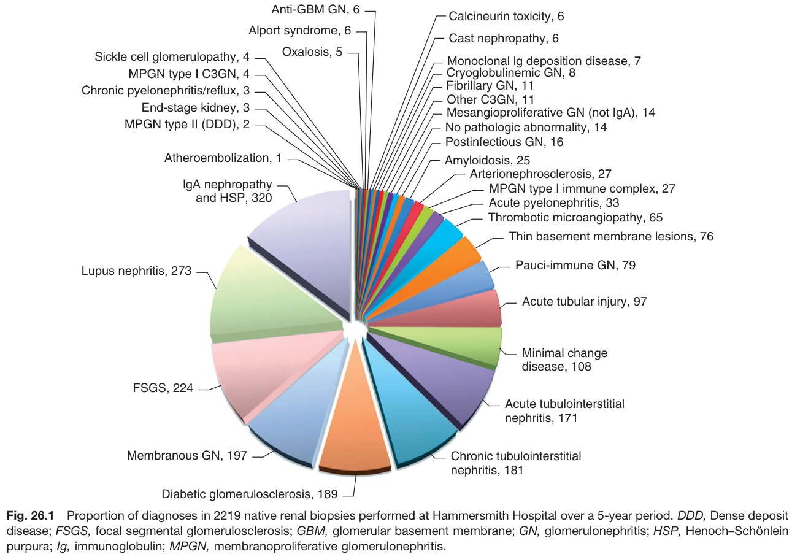
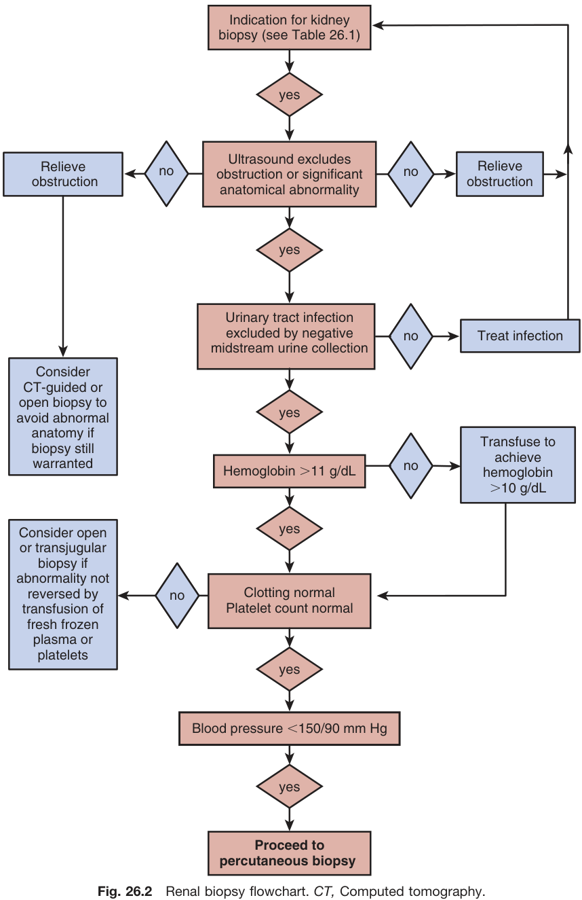
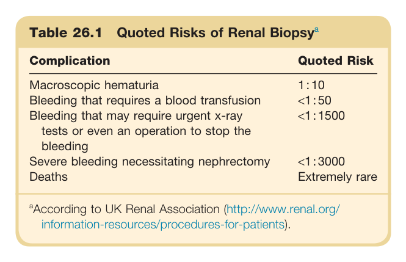
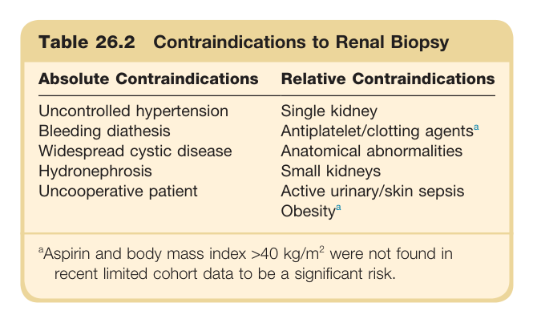
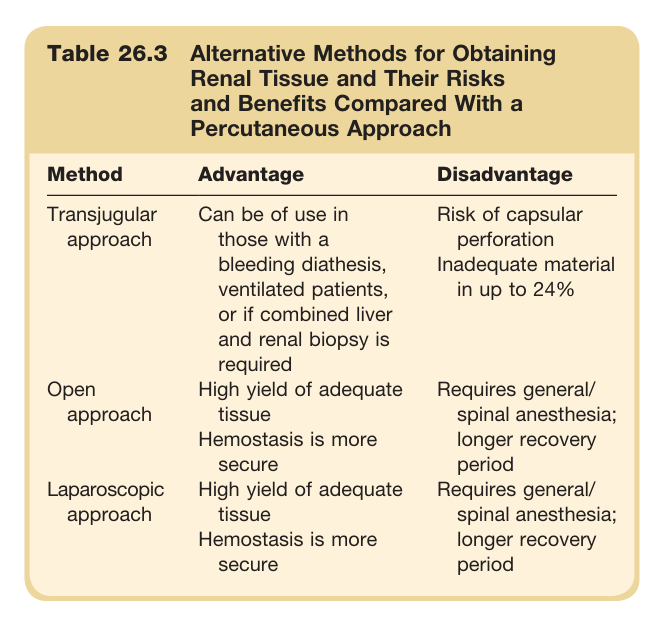
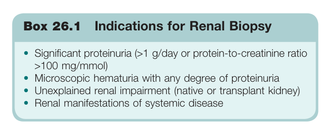
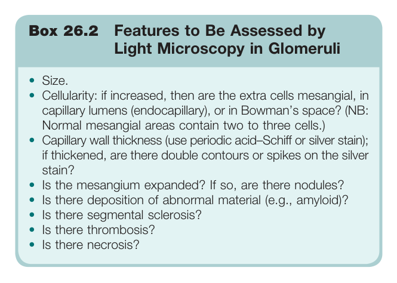
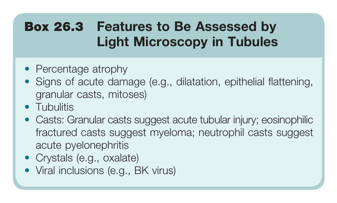
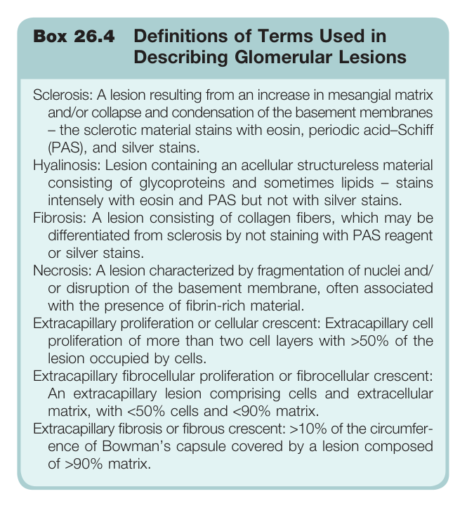
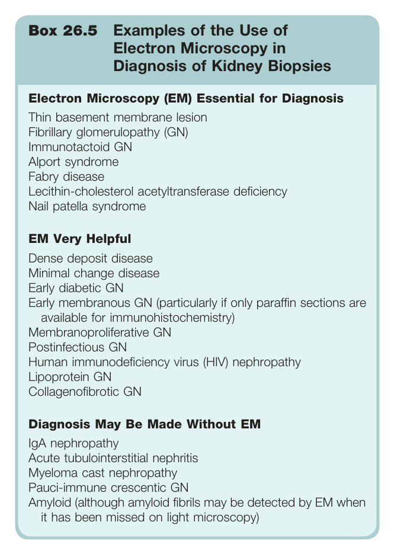

# 26. The Renal Biopsy - Figures and Tables Index

This document lists all figures, tables and boxes extracted from `26. The Renal Biopsy.pdf`.

## Table of Contents
- [Figures](#figures)
- [Tables](#tables)
- [Boxes](#boxes)

---

## Figures

### Fig_26_1



Fig. 26.1 Proportion of diagnoses in 2219 native renal biopsies performed at Hammersmith Hospital over a 5-year period. DDD, Dense deposit disease; FSGS, focal segmental glomerulosclerosis; GBM, glomerular basement membrane; GN, glomerulonephritis; HSP, Henoch-Schönlein purpura; Ig, immunoglobulin; MPGN, membranoproliferative glomerulonephritis.

---

### Fig_26_2



Fig. 26.2 Renal biopsy flowchart. CT, Computed tomography.

---

## Tables

### Table_26_1

#### Table Image



#### Table Data (CSV: [Table_26_1.csv](Table_26_1.csv))

```markdown
| Table Text (OCR) |
| :--- |
| Table 26.1 Quoted Risks of Renal Biopsy<sup>a</sup>  <sup>a</sup>According to UK Renal Association (http://www.renal.org/ information-resources/procedures-for-patients). |
```

Table 26.1 Quoted Risks of Renal Biopsy | Complication | Quoted Risk | | :--- | :--- | | Macroscopic hematuria | 1:10 | | Bleeding that requires a blood transfusion | <1:50 | | Bleeding that may require urgent x-ray tests or even an operation to stop the bleeding | <1:1500 | | Severe bleeding necessitating nephrectomy | <1:3000 | | Deaths | Extremely rare | *According to UK Renal Association (http://www.renal.org/information-resources/procedures-for-patients).*

---

### Table_26_2

#### Table Image



#### Table Data (CSV: [Table_26_2.csv](Table_26_2.csv))

```markdown
| Table Text (OCR) |
| :--- |
| Table 26.2 Contraindications to Renal Biopsy  <sup>a</sup>Aspirin and body mass index >40 kg/m<sup>2</sup> were not found in recent limited cohort data to be a significant risk. |
```

Table 26.2 Contraindications to Renal Biopsy | Absolute Contraindications | Relative Contraindications | | :--- | :--- | | Uncontrolled hypertension | Single kidney | | Bleeding diathesis | Antiplatelet/clotting agentsª | | Widespread cystic disease | Anatomical abnormalities | | Hydronephrosis | Small kidneys | | Uncooperative patient | Active urinary/skin sepsis | | | Obesityª | *ªAspirin and body mass index >40 kg/m² were not found in recent limited cohort data to be a significant risk.*

---

### Table_26_3

#### Table Image



#### Table Data (CSV: [Table_26_3.csv](Table_26_3.csv))

```markdown
| Table Text (OCR) |
| :--- |
| Table 26.3 Alternative Methods for Obtaining Renal Tissue and Their Risks and Benefits Compared With a Percutaneous Approach |
```

Table 26.3 Alternative Methods for Obtaining Renal Tissue and Their Risks and Benefits Compared With a Percutaneous Approach | Method | Advantage | Disadvantage | | :--- | :--- | :--- | | Transjugular approach | Can be of use in those with a bleeding diathesis, ventilated patients, or if combined liver and renal biopsy is required | Risk of capsular perforation Inadequate material in up to 24% | | Open approach | High yield of adequate tissue Hemostasis is more secure | Requires general/spinal anesthesia; longer recovery period | | Laparoscopic approach | High yield of adequate tissue Hemostasis is more secure | Requires general/spinal anesthesia; longer recovery period |

---

## Boxes

### Box_26_1



#### Box Text

```markdown
Box 26.1 Indications for Renal Biopsy
```

Box 26.1 Indications for Renal Biopsy * Significant proteinuria (>1 g/day or protein-to-creatinine ratio >100 mg/mmol) * Microscopic hematuria with any degree of proteinuria * Unexplained renal impairment (native or transplant kidney) * Renal manifestations of systemic disease

---

### Box_26_2



#### Box Text

```markdown
Box 26.2 Features to Be Assessed by Light Microscopy in Glomeruli
```

Box 26.2 Features to Be Assessed by Light Microscopy in Glomeruli * Size. * Cellularity: if increased, then are the extra cells mesangial, in capillary lumens (endocapillary), or in Bowman's space? (NB: Normal mesangial areas contain two to three cells.) * Capillary wall thickness (use periodic acid-Schiff or silver stain); if thickened, are there double contours or spikes on the silver stain? * Is the mesangium expanded? If so, are there nodules? * Is there deposition of abnormal material (e.g., amyloid)? * Is there segmental sclerosis? * Is there thrombosis? * Is there necrosis?

---

### Box_26_3



#### Box Text

```markdown
Box 26.3 Features to Be Assessed by Light Microscopy in Tubules
```

Box 26.3 Features to Be Assessed by Light Microscopy in Tubules * Percentage atrophy * Signs of acute damage (e.g., dilatation, epithelial flattening, granular casts, mitoses) * Tubulitis * Casts: Granular casts suggest acute tubular injury; eosinophilic fractured casts suggest myeloma; neutrophil casts suggest acute pyelonephritis * Crystals (e.g., oxalate) * Viral inclusions (e.g., BK virus)

---

### Box_26_4



#### Box Text

```markdown
Box 26.4 Definitions of Terms Used in Describing Glomerular Lesions Sclerosis: A lesion resulting from an increase in mesangial matrix and/or collapse and condensation of the basement membranes – the sclerotic material stains with eosin, periodic acid–Schiff (PAS), and silver stains. Hyalinosis: Lesion containing an acellular structureless material consisting of glycoproteins and sometimes lipids – stains intensely with eosin and PAS but not with silver stains. Fibrosis: A lesion consisting of collagen fibers, which may be differentiated from sclerosis by not staining with PAS reagent or silver stains. Necrosis: A lesion characterized by fragmentation of nuclei and/ or disruption of the basement membrane, often associated with the presence of fibrin-rich material. Extracapillary proliferation or cellular crescent: Extracapillary cell proliferation of more than two cell layers with >50% of the lesion occupied by cells. Extracapillary fibrocellular proliferation or fibrocellular crescent: An extracapillary lesion comprising cells and extracellular matrix, with <50% cells and <90% matrix. Extracapillary fibrosis or fibrous crescent: >10% of the circumfer- ence of Bowman’s capsule covered by a lesion composed of >90% matrix.
```

Box 26.4 Definitions of Terms Used in Describing Glomerular Lesions * **Sclerosis:** A lesion resulting from an increase in mesangial matrix and/or collapse and condensation of the basement membranes the sclerotic material stains with eosin, periodic acid-Schiff (PAS), and silver stains. * **Hyalinosis:** Lesion containing an acellular structureless material consisting of glycoproteins and sometimes lipids stains intensely with eosin and PAS but not with silver stains. * **Fibrosis:** A lesion consisting of collagen fibers, which may be differentiated from sclerosis by not staining with PAS reagent or silver stains. * **Necrosis:** A lesion characterized by fragmentation of nuclei and/or disruption of the basement membrane, often associated with the presence of fibrin-rich material. * **Extracapillary proliferation or cellular crescent:** Extracapillary cell proliferation of more than two cell layers with >50% of the lesion occupied by cells. * **Extracapillary fibrocellular proliferation or fibrocellular crescent:** An extracapillary lesion comprising cells and extracellular matrix, with <50% cells and <90% matrix. * **Extracapillary fibrosis or fibrous crescent:** >10% of the circumference of Bowman's capsule covered by a lesion composed of >90% matrix.

---

### Box_26_5



#### Box Text

```markdown
Box 26.5 Examples of the Use of Electron Microscopy in Diagnosis of Kidney Biopsies Electron Microscopy (EM) Essential for Diagnosis Thin basement membrane lesion Fibrillary glomerulopathy (GN) Immunotactoid GN Alport syndrome Fabry disease Lecithin-cholesterol acetyltransferase deficiency Nail patella syndrome EM Very Helpful Dense deposit disease Minimal change disease Early diabetic GN Early membranous GN (particularly if only paraffin sections are available for immunohistochemistry) Membranoproliferative GN Postinfectious GN Human immunodeficiency virus (HIV) nephropathy Lipoprotein GN Collagenofibrotic GN Diagnosis May Be Made Without EM IgA nephropathy Acute tubulointerstitial nephritis Myeloma cast nephropathy Pauci-immune crescentic GN Amyloid (although amyloid fibrils may be detected by EM when it has been missed on light microscopy)
```

Box 26.5 Examples of the Use of Electron Microscopy in Diagnosis of Kidney Biopsies **Electron Microscopy (EM) Essential for Diagnosis** * Thin basement membrane lesion * Fibrillary glomerulopathy (GN) * Immunotactoid GN * Alport syndrome * Fabry disease * Lecithin-cholesterol acetyltransferase deficiency * Nail patella syndrome **EM Very Helpful** * Dense deposit disease * Minimal change disease * Early diabetic GN * Early membranous GN (particularly if only paraffin sections are available for immunohistochemistry) * Membranoproliferative GN * Postinfectious GN * Human immunodeficiency virus (HIV) nephropathy * Lipoprotein GN * Collagenofibrotic GN **Diagnosis May Be Made Without EM** * IgA nephropathy * Acute tubulointerstitial nephritis * Myeloma cast nephropathy * Pauci-immune crescentic GN * Amyloid (although amyloid fibrils may be detected by EM when it has been missed on light microscopy)

---
