# 27. Biomarkers in Acute and Chronic Kidney Diseases - Figures and Tables Index

This document lists all figures, tables and boxes extracted from `27. Biomarkers in Acute and Chronic Kidney Diseases.pdf`.

## Table of Contents
- [Figures](#figures)
- [Tables](#tables)
- [Boxes](#boxes)

---

## Figures

### Fig_27_1

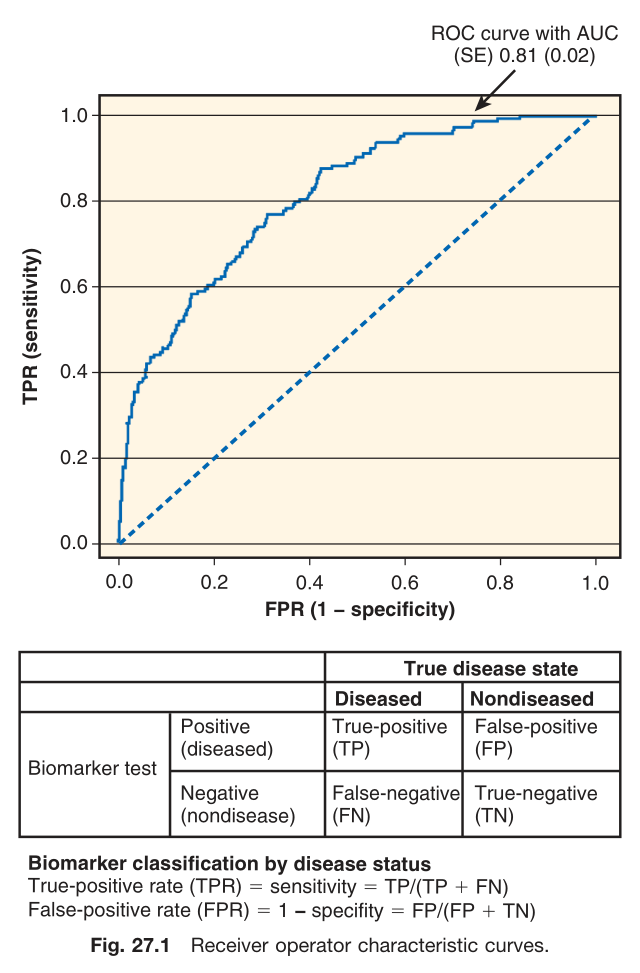

Fig. 27.1 Receiver operator characteristic curves. An image of a Receiver Operator Characteristic (ROC) curve is shown, with TPR (sensitivity) on the y-axis and FPR (1 - specificity) on the x-axis. The curve shows an AUC (SE) of 0.81 (0.02). Below the graph is a table illustrating the classification of a biomarker test by disease status: * Positive (diseased): True-positive (TP) * Positive (nondiseased): False-positive (FP) * Negative (diseased): False-negative (FN) * Negative (nondiseased): True-negative (TN) Equations for calculating rates are also provided: * True-positive rate (TPR) = sensitivity = TP/(TP + FN) * False-positive rate (FPR) = 1 - specifity = FP/(FP + TN)

---

### Fig_27_2

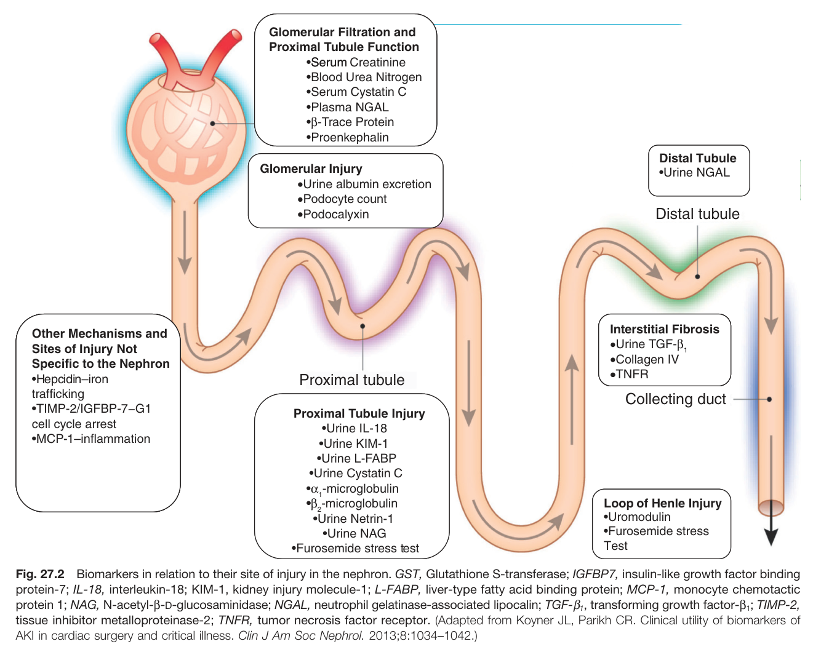

Fig. 27.2 Biomarkers in relation to their site of injury in the nephron. This diagram illustrates the different parts of a nephron and lists biomarkers associated with injury at each site. * **Glomerular Filtration and Proximal Tubule Function:** Serum Creatinine, Blood Urea Nitrogen, Serum Cystatin C, Plasma NGAL, B-Trace Protein, Proenkephalin * **Glomerular Injury:** Urine albumin excretion, Podocyte count, Podocalyxin * **Proximal Tubule Injury:** Urine IL-18, Urine KIM-1, Urine L-FABP, Urine Cystatin C, α,-microglobulin, B2-microglobulin, Urine Netrin-1, Urine NAG, Furosemide stress test * **Loop of Henle Injury:** Uromodulin, Furosemide stress Test * **Distal Tubule:** Urine NGAL * **Interstitial Fibrosis:** Urine TGF-β₁, Collagen IV, TNFR * **Other Mechanisms and Sites of Injury Not Specific to the Nephron:** Hepcidin-iron trafficking, TIMP-2/IGFBP-7-G1 cell cycle arrest, MCP-1-inflammation GST, Glutathione S-transferase; IGFBP7, insulin-like growth factor binding protein-7; IL-18, interleukin-18; KIM-1, kidney injury molecule-1; L-FABP, liver-type fatty acid binding protein; MCP-1, monocyte chemotactic protein 1; NAG, N-acetyl-ẞ-D-glucosaminidase; NGAL, neutrophil gelatinase-associated lipocalin; TGF-β1, transforming growth factor-ẞ1; TIMP-2, tissue inhibitor metalloproteinase-2; TNFR, tumor necrosis factor receptor. (Adapted from Koyner JL, Parikh CR. Clinical utility of biomarkers of AKI in cardiac surgery and critical illness. Clin J Am Soc Nephrol. 2013;8:1034-1042.)

---

## Tables

### Table_27_1

#### Table Image

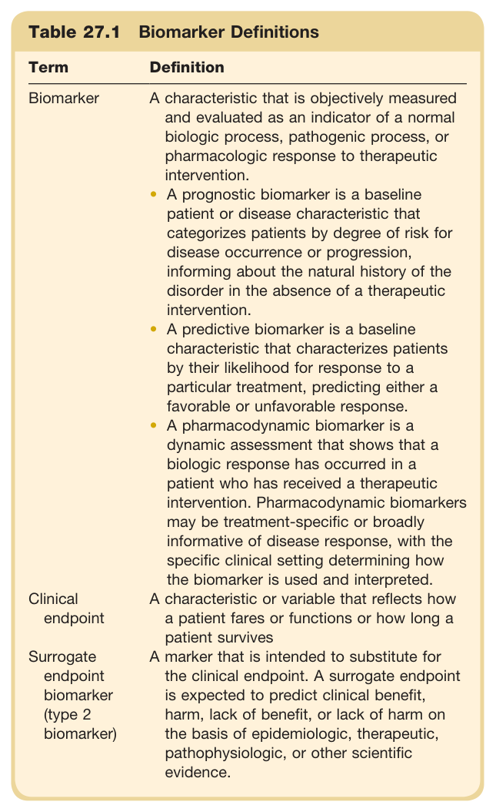

#### Table Data (CSV: [Table_27_1.csv](Table_27_1.csv))

```markdown
| Table Text (OCR) |
| :--- |
| Table 27.1 Biomarker Definitions Term  Definition    Biomarker  A characteristic that is objectively measured and evaluated as an indicator of a normal biologic process, pathogenic process, or pharmacologic response to therapeutic intervention.A prognostic biomarker is a baseline patient or disease characteristic that categorizes patients by degree of risk for disease occurrence or progression, informing about the natural history of the disorder in the absence of a therapeutic intervention.A predictive biomarker is a baseline characteristic that characterizes patients by their likelihood for response to a particular treatment, predicting either a favorable or unfavorable response.A pharmacodynamic biomarker is a dynamic assessment that shows that a biologic response has occurred in a patient who has received a therapeutic intervention. Pharmacodynamic biomarkers may be treatment-specific or broadly informative of disease response, with the specific clinical setting determining how the biomarker is used and interpreted.    Clinical endpoint  A characteristic or variable that reflects how a patient fares or functions or how long a patient survives    Surrogate endpoint biomarker (type 2 biomarker)  A marker that is intended to substitute for the clinical endpoint. A surrogate endpoint is expected to predict clinical benefit, harm, lack of benefit, or lack of harm on the basis of epidemiologic, therapeutic, pathophysiologic, or other scientific evidence. |
```

Table 27.1 Biomarker Definitions | Term | Definition | | :--- | :--- | | **Biomarker** | A characteristic that is objectively measured and evaluated as an indicator of a normal biologic process, pathogenic process, or pharmacologic response to therapeutic intervention. • A prognostic biomarker is a baseline patient or disease characteristic that categorizes patients by degree of risk for disease occurrence or progression, informing about the natural history of the disorder in the absence of a therapeutic intervention. • A predictive biomarker is a baseline characteristic that characterizes patients by their likelihood for response to a particular treatment, predicting either a favorable or unfavorable response. • A pharmacodynamic biomarker is a dynamic assessment that shows that a biologic response has occurred in a patient who has received a therapeutic intervention. Pharmacodynamic biomarkers may be treatment-specific or broadly informative of disease response, with the specific clinical setting determining how the biomarker is used and interpreted. | | **Clinical endpoint** | A characteristic or variable that reflects how a patient fares or functions or how long a patient survives. | | **Surrogate endpoint biomarker (type 2 biomarker)** | A marker that is intended to substitute for the clinical endpoint. A surrogate endpoint is expected to predict clinical benefit, harm, lack of benefit, or lack of harm on the basis of epidemiologic, therapeutic, pathophysiologic, or other scientific evidence. |

---

### Table_27_2

#### Table Image

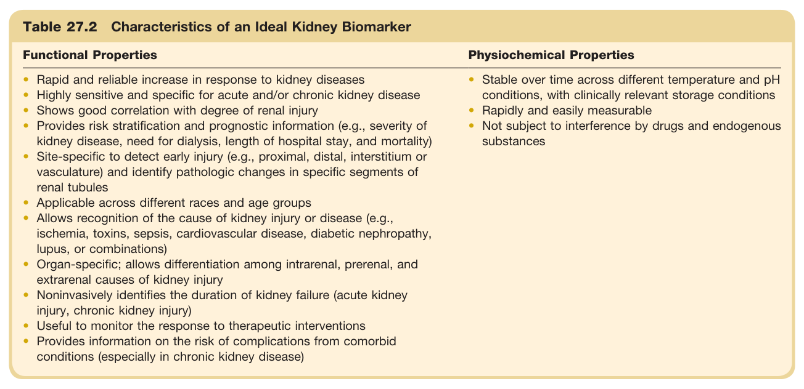

#### Table Data (CSV: [Table_27_2.csv](Table_27_2.csv))

```markdown
| Table Text (OCR) |
| :--- |
| Table 27.2 Characteristics of an Ideal Kidney Biomarker Functional Properties  Physiochemical Properties    Rapid and reliable increase in response to kidney diseasesHighly sensitive and specific for acute and/or chronic kidney diseaseShows good correlation with degree of renal injuryProvides risk stratification and prognostic information (e.g., severity of kidney disease, need for dialysis, length of hospital stay, and mortality)Site-specific to detect early injury (e.g., proximal, distal, interstitium or vasculature) and identify pathologic changes in specific segments of renal tubulesApplicable across different races and age groupsAllows recognition of the cause of kidney injury or disease (e.g., ischemia, toxins, sepsis, cardiovascular disease, diabetic nephropathy, lupus, or combinations)Organ-specific; allows differentiation among intrarenal, prerenal, and extrarenal causes of kidney injuryNoninvasively identifies the duration of kidney failure (acute kidney injury, chronic kidney injury)Useful to monitor the response to therapeutic interventionsProvides information on the risk of complications from comorbid conditions (especially in chronic kidney disease)  Stable over time across different temperature and pH conditions, with clinically relevant storage conditionsRapidly and easily measurableNot subject to interference by drugs and endogenous substances |
```

Table 27.2 Characteristics of an Ideal Kidney Biomarker | Functional Properties | Physiochemical Properties | | :--- | :--- | | • Rapid and reliable increase in response to kidney diseases | • Stable over time across different temperature and pH conditions, with clinically relevant storage conditions | | • Highly sensitive and specific for acute and/or chronic kidney disease | • Rapidly and easily measurable | | • Shows good correlation with degree of renal injury | • Not subject to interference by drugs and endogenous substances | | • Provides risk stratification and prognostic information (e.g., severity of kidney disease, need for dialysis, length of hospital stay, and mortality) | | | • Site-specific to detect early injury (e.g., proximal, distal, interstitium or vasculature) and identify pathologic changes in specific segments of renal tubules | | | • Applicable across different races and age groups | | | • Allows recognition of the cause of kidney injury or disease (e.g., ischemia, toxins, sepsis, cardiovascular disease, diabetic nephropathy, lupus, or combinations) | | | • Organ-specific; allows differentiation among intrarenal, prerenal, and extrarenal causes of kidney injury | | | • Noninvasively identifies the duration of kidney failure (acute kidney injury, chronic kidney injury) | | | • Useful to monitor the response to therapeutic interventions | | | • Provides information on the risk of complications from comorbid conditions (especially in chronic kidney disease) | |

---

### Table_27_3

#### Table Image

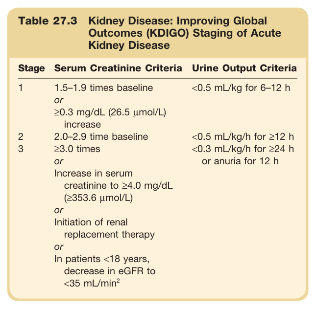

#### Table Data (CSV: [Table_27_3.csv](Table_27_3.csv))

```markdown
| Table Text (OCR) |
| :--- |
| Table 27.3 Kidney Disease: Improving Global Outcomes (KDIGO) Staging of Acute Kidney Disease Stage  Serum Creatinine Criteria  Urine Output Criteria    1  1.5–1.9 times baselineor \geq 0.3  mg/dL (26.5  \mu mol/L)increase  <0.5 mL/kg for 6–12 h    2  2.0–2.9 time baseline  <0.5 mL/kg/h for  \geq 12  h    3   \geq 3.0  timesorIncrease in serum creatinine to  \geq 4.0  mg/dL ( \geq 353.6   \mu mol/L)orInitiation of renal replacement therapyorIn patients <18 years, decrease in eGFR to <35 mL/min ^{2}   <0.3 mL/kg/h for  \geq 24  h or anuria for 12 h |
```

Table 27.3 Kidney Disease: Improving Global Outcomes (KDIGO) Staging of Acute Kidney Disease | Stage | Serum Creatinine Criteria | Urine Output Criteria | | :--- | :--- | :--- | | **1** | 1.5-1.9 times baseline or ≥0.3 mg/dL (26.5 µmol/L) increase | <0.5 mL/kg for 6-12 h | | **2** | 2.0-2.9 time baseline | <0.5 mL/kg/h for ≥12 h | | **3** | ≥3.0 times or Increase in serum creatinine to ≥4.0 mg/dL (≥353.6 µmol/L) or Initiation of renal replacement therapy or In patients <18 years, decrease in eGFR to <35 mL/min² | <0.3 mL/kg/h for ≥24 h or anuria for 12 h |

---

### Table_27_4

#### Table Image

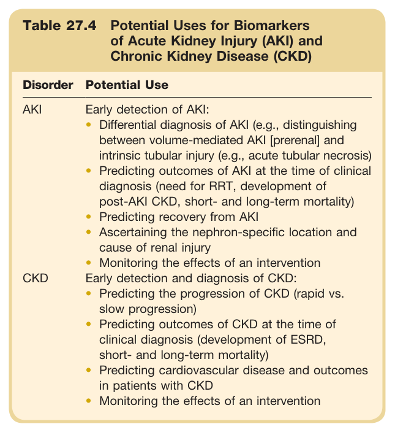

#### Table Data (CSV: [Table_27_4.csv](Table_27_4.csv))

```markdown
| Table Text (OCR) |
| :--- |
| Table 27.4 Potential Uses for Biomarkers of Acute Kidney Injury (AKI) and Chronic Kidney Disease (CKD) Disorder Potential Use AKI  Early detection of AKI:Differential diagnosis of AKI (e.g., distinguishing between volume-mediated AKI [prerenal] and intrinsic tubular injury (e.g., acute tubular necrosis)Predicting outcomes of AKI at the time of clinical diagnosis (need for RRT, development of post-AKI CKD, short- and long-term mortality)Predicting recovery from AKIAscertaining the nephron-specific location and cause of renal injuryMonitoring the effects of an intervention    CKD  Early detection and diagnosis of CKD:Predicting the progression of CKD (rapid vs. slow progression)Predicting outcomes of CKD at the time of clinical diagnosis (development of ESRD, short- and long-term mortality)Predicting cardiovascular disease and outcomes in patients with CKDMonitoring the effects of an intervention |
```

Table 27.4 Potential Uses for Biomarkers of Acute Kidney Injury (AKI) and Chronic Kidney Disease (CKD) | Disorder | Potential Use | | :--- | :--- | | **AKI** | Early detection of AKI:<br>• Differential diagnosis of AKI (e.g., distinguishing between volume-mediated AKI [prerenal] and intrinsic tubular injury (e.g., acute tubular necrosis)<br>• Predicting outcomes of AKI at the time of clinical diagnosis (need for RRT, development of post-AKI CKD, short- and long-term mortality)<br>• Predicting recovery from AKI<br>• Ascertaining the nephron-specific location and cause of renal injury<br>• Monitoring the effects of an intervention | | **CKD** | Early detection and diagnosis of CKD:<br>• Predicting the progression of CKD (rapid vs. slow progression)<br>• Predicting outcomes of CKD at the time of clinical diagnosis (development of ESRD, short- and long-term mortality)<br>• Predicting cardiovascular disease and outcomes in patients with CKD<br>• Monitoring the effects of an intervention |

---

### Table_27_5

#### Table Image

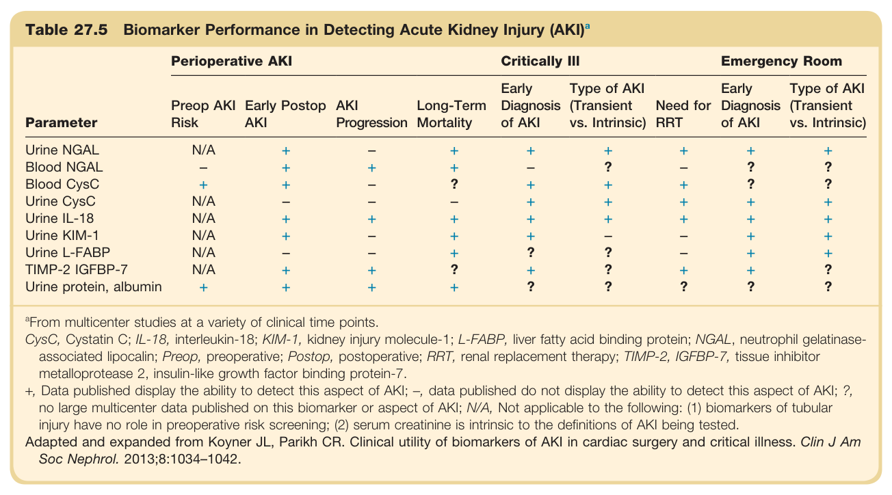

#### Table Data (CSV: [Table_27_5.csv](Table_27_5.csv))

```markdown
| Table Text (OCR) |
| :--- |
| Table 27.5 Biomarker Performance in Detecting Acute Kidney Injury (AKI)<sup>a</sup> Parameter  Perioperative AKI  Critically III  Emergency Room    Preop AKI Risk  Early Postop AKI  AKI Progression  Long-Term Mortality  Early Diagnosis of AKI  Type of AKI (Transient vs. Intrinsic)  Need for RRT  Early Diagnosis of AKI  Type of AKI (Transient vs. Intrinsic)    Urine NGAL  N/A  +  -  +  +  +  +  +  +    Blood NGAL  -  +  +  +  -  ?  -  ?  ?    Blood CysC  +  +  -  ?  +  +  +  ?  ?    Urine CysC  N/A  -  -  -  +  +  +  +  +    Urine IL-18  N/A  +  +  +  +  +  +  +  +    Urine KIM-1  N/A  +  -  +  +  -  -  +  +    Urine L-FABP  N/A  -  -  +  ?  ?  -  +  +    TIMP-2 IGFBP-7  N/A  +  +  ?  +  ?  +  +  ?    Urine protein, albumin  +  +  +  +  ?  ?  ?  ?  ? <sup>a</sup>From multicenter studies at a variety of clinical time points. CysC, Cystatin C; IL-18, interleukin-18; KIM-1, kidney injury molecule-1; L-FABP, liver fatty acid binding protein; NGAL, neutrophil gelatinase- associated lipocalin; Preop, preoperative; Postop, postoperative; RRT, renal replacement therapy; TIMP-2, IGFBP-7, tissue inhibitor metalloprotease 2, insulin-like growth factor binding protein-7. +, Data published display the ability to detect this aspect of AKI; −, data published do not display the ability to detect this aspect of AKI; ?, no large multicenter data published on this biomarker or aspect of AKI; N/A, Not applicable to the following: (1) biomarkers of tubular injury have no role in preoperative risk screening; (2) serum creatinine is intrinsic to the definitions of AKI being tested. Adapted and expanded from Koyner JL, Parikh CR. Clinical utility of biomarkers of AKI in cardiac surgery and critical illness. Clin J Am Soc Nephrol. 2013;8:1034–1042. |
```

Table 27.5 Biomarker Performance in Detecting Acute Kidney Injury (AKI)ª | Parameter | Perioperative AKI | Critically Ill | Emergency Room | | :--- | :--- | :--- | :--- | | | Preop AKI Risk | Early Postop AKI | Progression | Long-Term Mortality | Early Diagnosis of AKI | Type of AKI (Transient vs. Intrinsic) | Need for RRT | Early Diagnosis of AKI | Type of AKI (Transient vs. Intrinsic) | | Urine NGAL | N/A | + | + | + | + | + | + | + | + | | Blood NGAL | + | + | + | ? | + | + | + | ? | ? | | Blood CysC | + | + | – | ? | + | + | + | ? | ? | | Urine CysC | N/A | + | – | – | + | + | + | + | + | | Urine IL-18 | N/A | + | + | + | + | + | + | + | + | | Urine KIM-1 | N/A | + | + | + | ? | + | + | ? | ? | | Urine L-FABP | N/A | + | – | ? | + | – | + | ? | ? | | TIMP-2 IGFBP-7 | N/A | + | + | + | + | + | + | + | + | | Urine protein, albumin | + | + | ? | + | ? | ? | ? | + | ? | *From multicenter studies at a variety of clinical time points. CysC, Cystatin C; IL-18, interleukin-18; KIM-1, kidney injury molecule-1; L-FABP, liver fatty acid binding protein; NGAL, neutrophil gelatinase-associated lipocalin; Preop, preoperative; Postop, postoperative; RRT, renal replacement therapy; TIMP-2, IGFBP-7, tissue inhibitor metalloprotease 2, insulin-like growth factor binding protein-7. +, Data published display the ability to detect this aspect of AKI; -, data published do not display the ability to detect this aspect of AKI; ?, no large multicenter data published on this biomarker or aspect of AKI; N/A, Not applicable to the following: (1) biomarkers of tubular injury have no role in preoperative risk screening; (2) serum creatinine is intrinsic to the definitions of AKI being tested. Adapted and expanded from Koyner JL, Parikh CR. Clinical utility of biomarkers of AKI in cardiac surgery and critical illness. Clin J Am Soc Nephrol. 2013;8:1034-1042.

---

### Table_27_6

#### Table Image

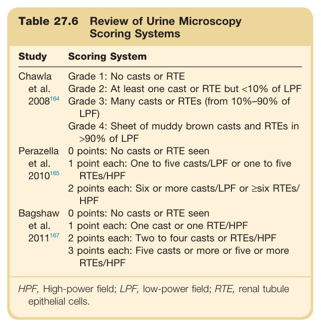

#### Table Data (CSV: [Table_27_6.csv](Table_27_6.csv))

```markdown
| Table Text (OCR) |
| :--- |
| Table 27.6 Review of Urine Microscopy Scoring Systems Study  Scoring System    Chawla et al.  2008^{164}   Grade 1: No casts or RTEGrade 2: At least one cast or RTE but <10% of LPFGrade 3: Many casts or RTEs (from 10%–90% of LPF)Grade 4: Sheet of muddy brown casts and RTEs in >90% of LPF    Perazella et al.  2010^{165}   0 points: No casts or RTE seen1 point each: One to five casts/LPF or one to five RTEs/HPF2 points each: Six or more casts/LPF or ≥six RTEs/HPF    Bagshaw et al.  2011^{167}   0 points: No casts or RTE seen1 point each: One cast or one RTE/HPF2 points each: Two to four casts or RTEs/HPF3 points each: Five casts or more or five or more RTEs/HPF    HPF, High-power field; LPF, low-power field; RTE, renal tubule epithelial cells. |
```

Table 27.6 Review of Urine Microscopy Scoring Systems | Study | Scoring System | | :--- | :--- | | **Chawla et al. 2008** | Grade 1: No casts or RTE<br>Grade 2: At least one cast or RTE but <10% of LPF<br>Grade 3: Many casts or RTEs (from 10%-90% of LPF)<br>Grade 4: Sheet of muddy brown casts and RTEs in >90% of LPF | | **Perazella et al. 2010** | 0 points: No casts or RTE seen<br>1 point each: One to five casts/LPF or one to five RTEs/HPF<br>2 points each: Six or more casts/LPF or ≥six RTEs/HPF | | **Bagshaw et al. 2011** | 0 points: No casts or RTE seen<br>1 point each: One cast or one RTE/HPF<br>2 points each: Two to four casts or RTEs/HPF<br>3 points each: Five casts or more or five or more RTEs/HPF | HPF, High-power field; LPF, low-power field; RTE, renal tubule epithelial cells.

---

### Table_27_7

#### Table Image

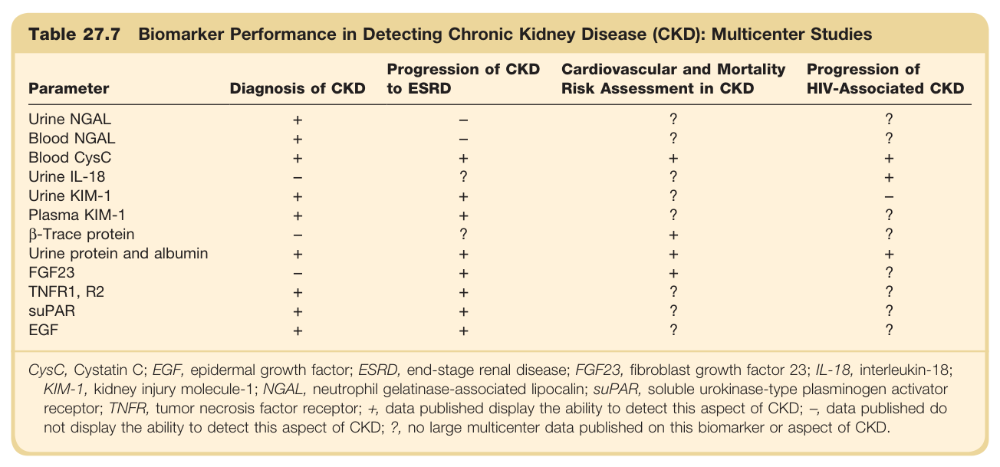

#### Table Data (CSV: [Table_27_7.csv](Table_27_7.csv))

```markdown
| Table Text (OCR) |
| :--- |
| Table 27.7 Biomarker Performance in Detecting Chronic Kidney Disease (CKD): Multicenter Studies Parameter  Diagnosis of CKD  Progression of CKD to ESRD  Cardiovascular and Mortality Risk Assessment in CKD  Progression of HIV-Associated CKD    Urine NGAL  +  -  ?  ?    Blood NGAL  +  -  ?  ?    Blood CysC  +  +  +  +    Urine IL-18  -  ?  ?  +    Urine KIM-1  +  +  ?  -    Plasma KIM-1  +  +  ?  ?    β-Trace protein  -  ?  +  ?    Urine protein and albumin  +  +  +  +    FGF23  -  +  +  ?    TNFR1, R2  +  +  ?  ?    suPAR  +  +  ?  ?    EGF  +  +  ?  ? CysC, Cystatin C; EGF, epidermal growth factor; ESRD, end-stage renal disease; FGF23, fibroblast growth factor 23; IL-18, interleukin-18; KIM-1, kidney injury molecule-1; NGAL, neutrophil gelatinase-associated lipocalin; suPAR, soluble urokinase-type plasminogen activator receptor; TNFR, tumor necrosis factor receptor; +, data published display the ability to detect this aspect of CKD; −, data published do not display the ability to detect this aspect of CKD; ?, no large multicenter data published on this biomarker or aspect of CKD. |
```

Table 27.7 Biomarker Performance in Detecting Chronic Kidney Disease (CKD): Multicenter Studies | Parameter | Diagnosis of CKD | Progression of CKD to ESRD | Cardiovascular and Mortality Risk Assessment in CKD | Progression of HIV-Associated CKD | | :--- | :--- | :--- | :--- | :--- | | Urine NGAL | + | - | ? | ? | | Blood NGAL | + | ? | + | ? | | Blood CysC | + | + | + | + | | Urine IL-18 | + | + | ? | + | | Urine KIM-1 | + | - | + | ? | | Plasma KIM-1 | + | ? | ? | ? | | ẞ-Trace protein | + | ? | + | ? | | Urine protein and albumin | + | + | + | ? | | FGF23 | + | ? | + | ? | | TNFR1, R2 | + | + | ? | ? | | suPAR | + | + | ? | ? | | EGF | + | ? | ? | ? | CysC, Cystatin C; EGF, epidermal growth factor; ESRD, end-stage renal disease; FGF23, fibroblast growth factor 23; IL-18, interleukin-18; KIM-1, kidney injury molecule-1; NGAL, neutrophil gelatinase-associated lipocalin; suPAR, soluble urokinase-type plasminogen activator receptor; TNFR, tumor necrosis factor receptor; +, data published display the ability to detect this aspect of CKD; -, data published do not display the ability to detect this aspect of CKD; ?, no large multicenter data published on this biomarker or aspect of CKD.

---

## Boxes

### Box_27_1

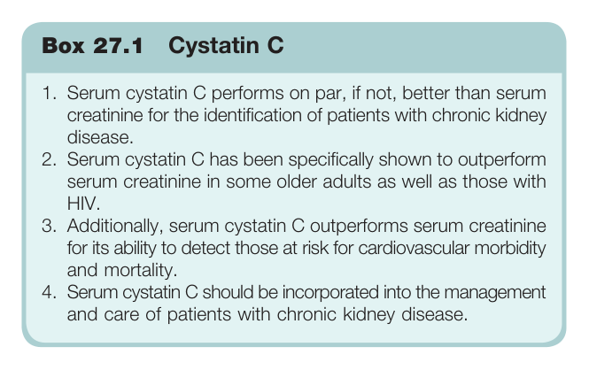

#### Box Text

```markdown
Box 27.1 Cystatin C 1. Serum cystatin C performs on par, if not, better than serum creatinine for the identification of patients with chronic kidney disease. 2. Serum cystatin C has been specifically shown to outperform serum creatinine in some older adults as well as those with HIV. 3. Additionally, serum cystatin C outperforms serum creatinine for its ability to detect those at risk for cardiovascular morbidity and mortality. 4. Serum cystatin C should be incorporated into the management and care of patients with chronic kidney disease.
```

Box 27.1 Cystatin C 1. Serum cystatin C performs on par, if not, better than serum creatinine for the identification of patients with chronic kidney disease. 2. Serum cystatin C has been specifically shown to outperform serum creatinine in some older adults as well as those with HIV. 3. Additionally, serum cystatin C outperforms serum creatinine for its ability to detect those at risk for cardiovascular morbidity and mortality. 4. Serum cystatin C should be incorporated into the management and care of patients with chronic kidney disease.

---

### Box_27_2

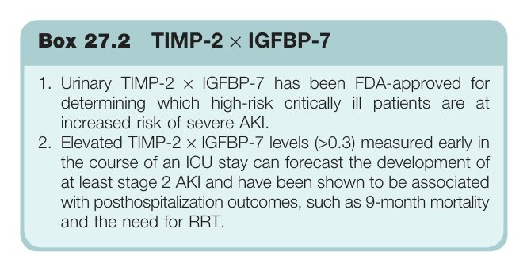

#### Box Text

```markdown
Box 27.2 TIMP-2 × IGFBP-7 1. Urinary TIMP-2 × IGFBP-7 has been FDA-approved for determining which high-risk critically ill patients are at increased risk of severe AKI. 2. Elevated TIMP-2 × IGFBP-7 levels (>0.3) measured early in the course of an ICU stay can forecast the development of at least stage 2 AKI and have been shown to be associated with posthospitalization outcomes, such as 9-month mortality and the need for RRT.
```

Box 27.2 TIMP-2 × IGFBP-7 1. Urinary TIMP-2 × IGFBP-7 has been FDA-approved for determining which high-risk critically ill patients are at increased risk of severe AKI. 2. Elevated TIMP-2 × IGFBP-7 levels (>0.3) measured early in the course of an ICU stay can forecast the development of at least stage 2 AKI and have been shown to be associated with posthospitalization outcomes, such as 9-month mortality and the need for RRT.

---

### Box_27_3

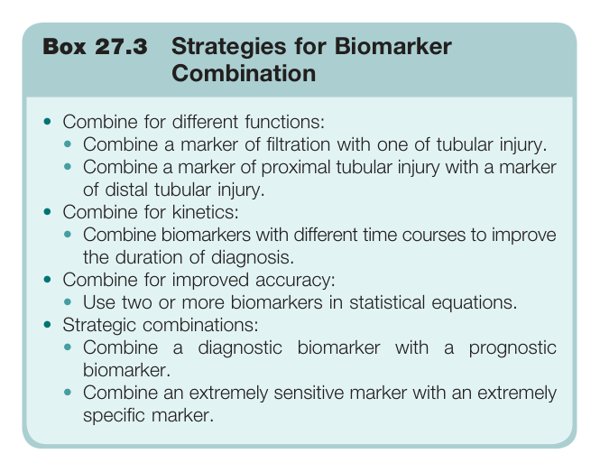

#### Box Text

```markdown
Box 27.3 Strategies for Biomarker Combination * **Combine for different functions:** * Combine a marker of filtration with one of tubular injury. * Combine a marker of proximal tubular injury with a marker of distal tubular injury. * **Combine for kinetics:** * Combine biomarkers with different time courses to improve the duration of diagnosis. * **Combine for improved accuracy:** * Use two or more biomarkers in statistical equations. * **Strategic combinations:** * Combine a diagnostic biomarker with a prognostic biomarker. * Combine an extremely sensitive marker with an extremely specific marker.
```

Box 27.3 Strategies for Biomarker Combination * **Combine for different functions:** * Combine a marker of filtration with one of tubular injury. * Combine a marker of proximal tubular injury with a marker of distal tubular injury. * **Combine for kinetics:** * Combine biomarkers with different time courses to improve the duration of diagnosis. * **Combine for improved accuracy:** * Use two or more biomarkers in statistical equations. * **Strategic combinations:** * Combine a diagnostic biomarker with a prognostic biomarker. * Combine an extremely sensitive marker with an extremely specific marker.

---
