# 28. Pathophysiology of Acute Kidney Injury - Figures and Tables Index

This document lists all figures and tables extracted from `28. Pathophysiology of Acute Kidney Injury.pdf`.

## Table of Contents
- [Figures](#figures)
- [Tables](#tables)

---

## Figures

### Fig_28_1

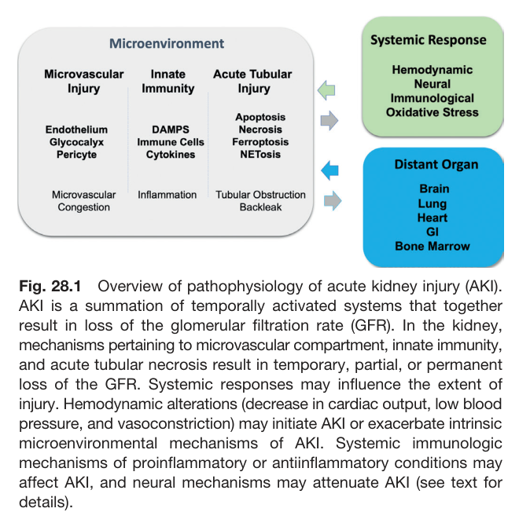

Fig. 28.1 Overview of pathophysiology of acute kidney injury (AKI). AKI is a summation of temporally activated systems that together result in loss of the glomerular filtration rate (GFR). In the kidney, mechanisms pertaining to microvascular compartment, innate immunity, and acute tubular necrosis result in temporary, partial, or permanent loss of the GFR. Systemic responses may influence the extent of injury. Hemodynamic alterations (decrease in cardiac output, low blood pressure, and vasoconstriction) may initiate AKI or exacerbate intrinsic microenvironmental mechanisms of AKI. Systemic immunologic mechanisms of proinflammatory or antiinflammatory conditions may affect AKI, and neural mechanisms may attenuate AKI (see text for details).

---

### Fig_28_2

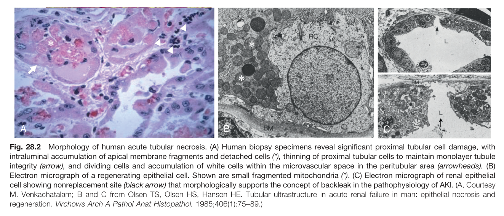

Fig. 28.2 Morphology of human acute tubular necrosis. (A) Human biopsy specimens reveal significant proximal tubular cell damage, with intraluminal accumulation of apical membrane fragments and detached cells (*), thinning of proximal tubular cells to maintain monolayer tubule integrity (arrow), and dividing cells and accumulation of white cells within the microvascular space in the peritubular area (arrowheads). (B) Electron micrograph of a regenerating epithelial cell. Shown are small fragmented mitochondria (*). (C) Electron micrograph of renal epithelial cell showing nonreplacement site (black arrow) that morphologically supports the concept of backleak in the pathophysiology of AKI. (A, Courtesy M. Venkachatalam; B and C from Olsen TS, Olsen HS, Hansen HE. Tubular ultrastructure in acute renal failure in man: epithelial necrosis and regeneration. Virchows Arch A Pathol Anat Histopathol. 1985;406(1):75-89.)

---

### Fig_28_3

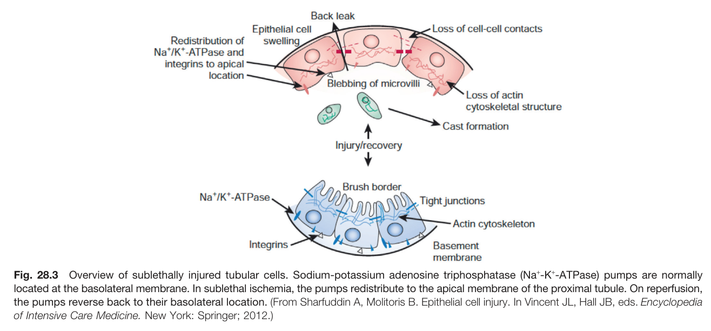

Fig. 28.3 Overview of sublethally injured tubular cells. Sodium-potassium adenosine triphosphatase (Na+-K+-ATPase) pumps are normally located at the basolateral membrane. In sublethal ischemia, the pumps redistribute to the apical membrane of the proximal tubule. On reperfusion, the pumps reverse back to their basolateral location. (From Sharfuddin A, Molitoris B. Epithelial cell injury. In Vincent JL, Hall JB, eds. Encyclopedia of Intensive Care Medicine. New York: Springer; 2012.)

---

### Fig_28_4

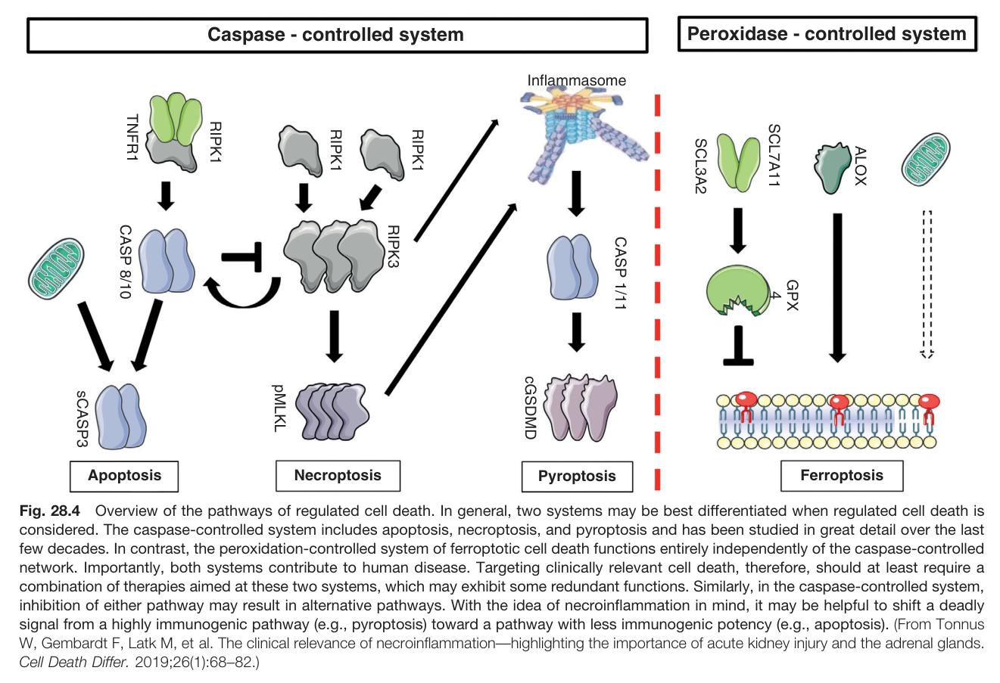

Fig. 28.4 Overview of the pathways of regulated cell death. In general, two systems may be best differentiated when regulated cell death is considered. The caspase-controlled system includes apoptosis, necroptosis, and pyroptosis and has been studied in great detail over the last few decades. In contrast, the peroxidation-controlled system of ferroptotic cell death functions entirely independently of the caspase-controlled network. Importantly, both systems contribute to human disease. Targeting clinically relevant cell death, therefore, should at least require a combination of therapies aimed at these two systems, which may exhibit some redundant functions. Similarly, in the caspase-controlled system, inhibition of either pathway may result in alternative pathways. With the idea of necroinflammation in mind, it may be helpful to shift a deadly signal from a highly immunogenic pathway (e.g., pyroptosis) toward a pathway with less immunogenic potency (e.g., apoptosis). (From Tonnus W, Gembardt F, Latk M, et al. The clinical relevance of necroinflammation-highlighting the importance of acute kidney injury and the adrenal glands. Cell Death Differ. 2019;26(1):68-82.)

---

### Fig_28_5

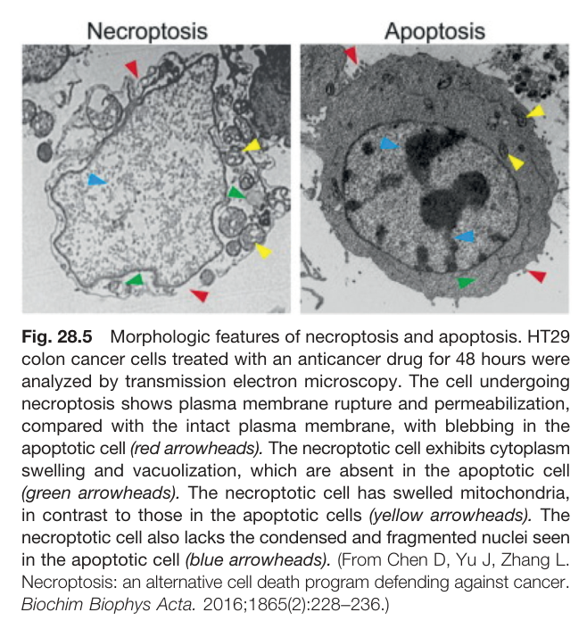

Fig. 28.5 Morphologic features of necroptosis and apoptosis. HT29 colon cancer cells treated with an anticancer drug for 48 hours were analyzed by transmission electron microscopy. The cell undergoing necroptosis shows plasma membrane rupture and permeabilization, compared with the intact plasma membrane, with blebbing in the apoptotic cell (red arrowheads). The necroptotic cell exhibits cytoplasm swelling and vacuolization, which are absent in the apoptotic cell (green arrowheads). The necroptotic cell has swelled mitochondria, in contrast to those in the apoptotic cells (yellow arrowheads). The necroptotic cell also lacks the condensed and fragmented nuclei seen in the apoptotic cell (blue arrowheads). (From Chen D, Yu J, Zhang L. Necroptosis: an alternative cell death program defending against cancer. Biochim Biophys Acta. 2016;1865(2):228-236.)

---

### Fig_28_6

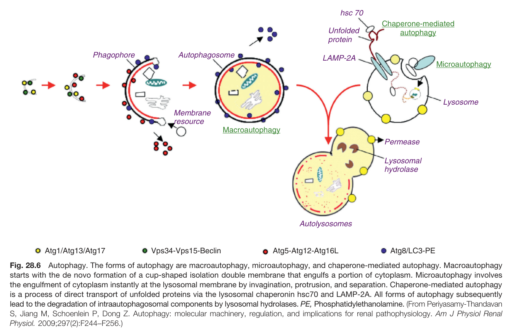

Fig. 28.6 Autophagy. The forms of autophagy are macroautophagy, microautophagy, and chaperone-mediated autophagy. Macroautophagy starts with the de novo formation of a cup-shaped isolation double membrane that engulfs a portion of cytoplasm. Microautophagy involves the engulfment of cytoplasm instantly at the lysosomal membrane by invagination, protrusion, and separation. Chaperone-mediated autophagy is a process of direct transport of unfolded proteins via the lysosomal chaperonin hsc70 and LAMP-2A. All forms of autophagy subsequently lead to the degradation of intraautophagosomal components by lysosomal hydrolases. PE, Phosphatidylethanolamine. (From Periyasamy-Thandavan S, Jiang M, Schoenlein P, Dong Z. Autophagy: molecular machinery, regulation, and implications for renal pathophysiology. Am J Physiol Renal Physiol. 2009;297(2):F244-F256.)

---

### Fig_28_7

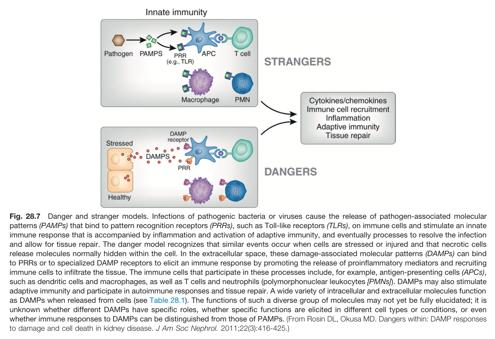

Fig. 28.7 Danger and stranger models. Infections of pathogenic bacteria or viruses cause the release of pathogen-associated molecular patterns (PAMPs) that bind to pattern recognition receptors (PRRs), such as Toll-like receptors (TLRs), on immune cells and stimulate an innate immune response that is accompanied by inflammation and activation of adaptive immunity, and eventually processes to resolve the infection and allow for tissue repair. The danger model recognizes that similar events occur when cells are stressed or injured and that necrotic cells release molecules normally hidden within the cell. In the extracellular space, these damage-associated molecular patterns (DAMPs) can bind to PRRs or to specialized DAMP receptors to elicit an immune response by promoting the release of proinflammatory mediators and recruiting immune cells to infiltrate the tissue. The immune cells that participate in these processes include, for example, antigen-presenting cells (APCs), such as dendritic cells and macrophages, as well as T cells and neutrophils (polymorphonuclear leukocytes [PMNs]). DAMPs may also stimulate adaptive immunity and participate in autoimmune responses and tissue repair. A wide variety of intracellular and extracellular molecules function as DAMPs when released from cells (see Table 28.1). The functions of such a diverse group of molecules may not yet be fully elucidated; it is unknown whether different DAMPs have specific roles, whether specific functions are elicited in different cell types or conditions, or even whether immune responses to DAMPs can be distinguished from those of PAMPs. (From Rosin DL, Okusa MD. Dangers within: DAMP responses to damage and cell death in kidney disease. J Am Soc Nephrol. 2011;22(3):416-425.)

---

### Fig_28_8

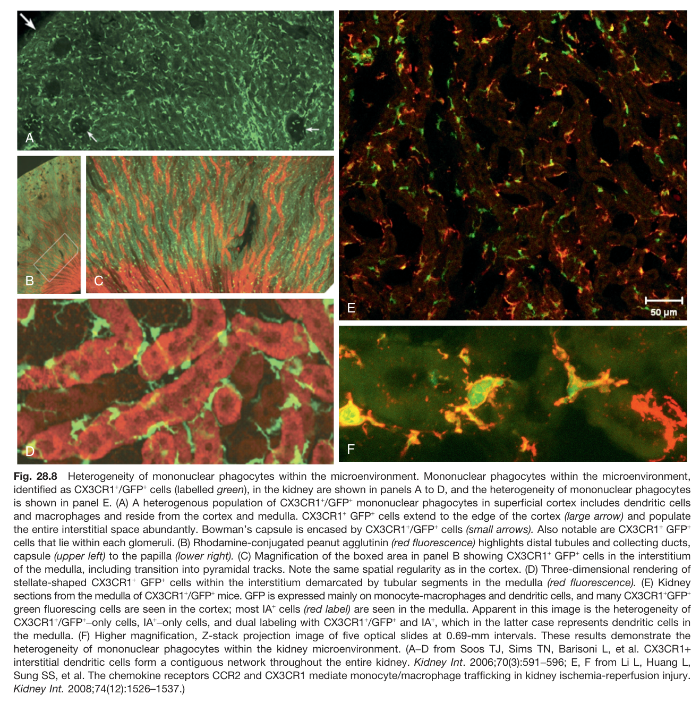

Fig. 28.8 Heterogeneity of mononuclear phagocytes within the microenvironment. Mononuclear phagocytes within the microenvironment, identified as CX3CR1+/GFP+ cells (labelled green), in the kidney are shown in panels A to D, and the heterogeneity of mononuclear phagocytes is shown in panel E. (A) A heterogenous population of CX3CR1+/GFP+ mononuclear phagocytes in superficial cortex includes dendritic cells and macrophages and reside from the cortex and medulla. CX3CR1+ GFP+ cells extend to the edge of the cortex (large arrow) and populate the entire interstitial space abundantly. Bowman's capsule is encased by CX3CR1+/GFP+ cells (small arrows). Also notable are CX3CR1+ GFP+ cells that lie within each glomeruli. (B) Rhodamine-conjugated peanut agglutinin (red fluorescence) highlights distal tubules and collecting ducts, capsule (upper left) to the papilla (lower right). (C) Magnification of the boxed area in panel B showing CX3CR1+ GFP+ cells in the interstitium of the medulla, including transition into pyramidal tracks. Note the same spatial regularity as in the cortex. (D) Three-dimensional rendering of stellate-shaped CX3CR1+ GFP+ cells within the interstitium demarcated by tubular segments in the medulla (red fluorescence). (E) Kidney sections from the medulla of CX3CR1+/GFP+ mice. GFP is expressed mainly on monocyte-macrophages and dendritic cells, and many CX3CR1+GFP+ green fluorescing cells are seen in the cortex; most IA+ cells (red label) are seen in the medulla. Apparent in this image is the heterogeneity of CX3CR1+/GFP+-only cells, IA+-only cells, and dual labeling with CX3CR1+/GFP+ and IA+, which in the latter case represents dendritic cells in the medulla. (F) Higher magnification, Z-stack projection image of five optical slides at 0.69-mm intervals. These results demonstrate the heterogeneity of mononuclear phagocytes within the kidney microenvironment. (A-D from Soos TJ, Sims TN, Barisoni L, et al. CX3CR1+ interstitial dendritic cells form a contiguous network throughout the entire kidney. Kidney Int. 2006;70(3):591–596; E, F from Li L, Huang L, Sung SS, et al. The chemokine receptors CCR2 and CX3CR1 mediate monocyte/macrophage trafficking in kidney ischemia-reperfusion injury. Kidney Int. 2008;74(12):1526-1537.)

---

### Fig_28_9

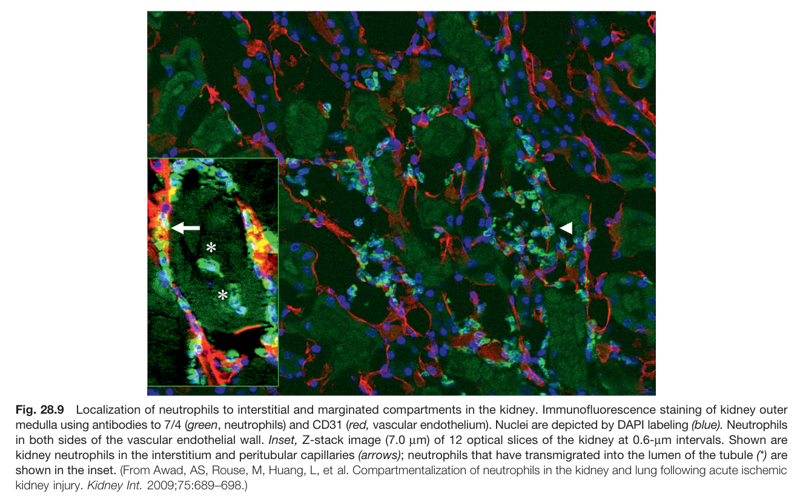

Fig. 28.9 Localization of neutrophils to interstitial and marginated compartments in the kidney. Immunofluorescence staining of kidney outer medulla using antibodies to 7/4 (green, neutrophils) and CD31 (red, vascular endothelium). Nuclei are depicted by DAPI labeling (blue). Neutrophils in both sides of the vascular endothelial wall. Inset, Z-stack image (7.0 µm) of 12 optical slices of the kidney at 0.6-µm intervals. Shown are kidney neutrophils in the interstitium and peritubular capillaries (arrows); neutrophils that have transmigrated into the lumen of the tubule (*) are shown in the inset. (From Awad, AS, Rouse, M, Huang, L, et al. Compartmentalization of neutrophils in the kidney and lung following acute ischemic kidney injury. Kidney Int. 2009;75:689-698.)

---

### Fig_28_10

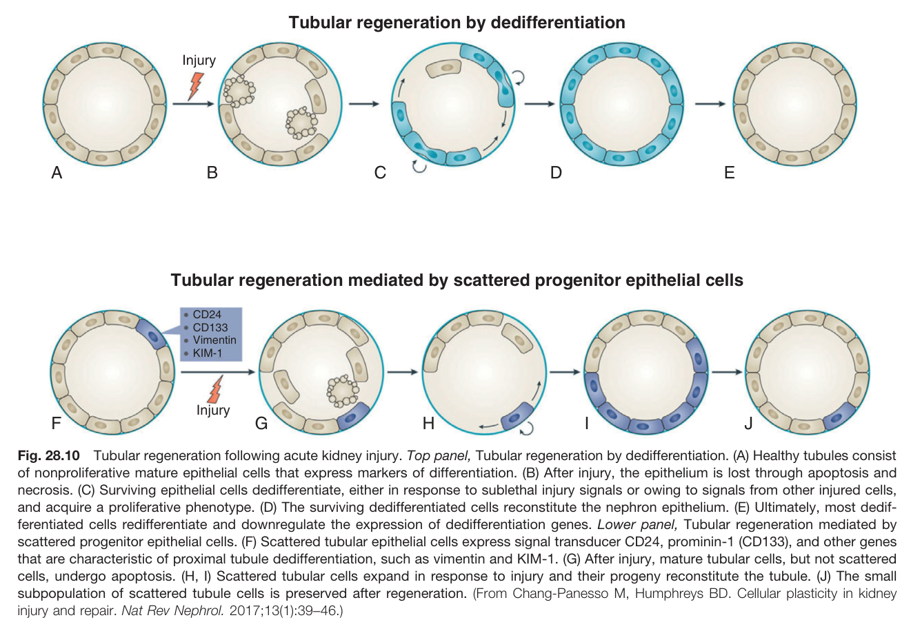

Fig. 28.10 Tubular regeneration following acute kidney injury. Top panel, Tubular regeneration by dedifferentiation. (A) Healthy tubules consist of nonproliferative mature epithelial cells that express markers of differentiation. (B) After injury, the epithelium is lost through apoptosis and necrosis. (C) Surviving epithelial cells dedifferentiate, either in response to sublethal injury signals or owing to signals from other injured cells, and acquire a proliferative phenotype. (D) The surviving dedifferentiated cells reconstitute the nephron epithelium. (E) Ultimately, most dedifferentiated cells redifferentiate and downregulate the expression of dedifferentiation genes. Lower panel, Tubular regeneration mediated by scattered progenitor epithelial cells. (F) Scattered tubular epithelial cells express signal transducer CD24, prominin-1 (CD133), and other genes that are characteristic of proximal tubule dedifferentiation, such as vimentin and KIM-1. (G) After injury, mature tubular cells, but not scattered cells, undergo apoptosis. (H, I) Scattered tubular cells expand in response to injury and their progeny reconstitute the tubule. (J) The small subpopulation of scattered tubule cells is preserved after regeneration. (From Chang-Panesso M, Humphreys BD. Cellular plasticity in kidney injury and repair. Nat Rev Nephrol. 2017;13(1):39-46.)

---

### Fig_28_11

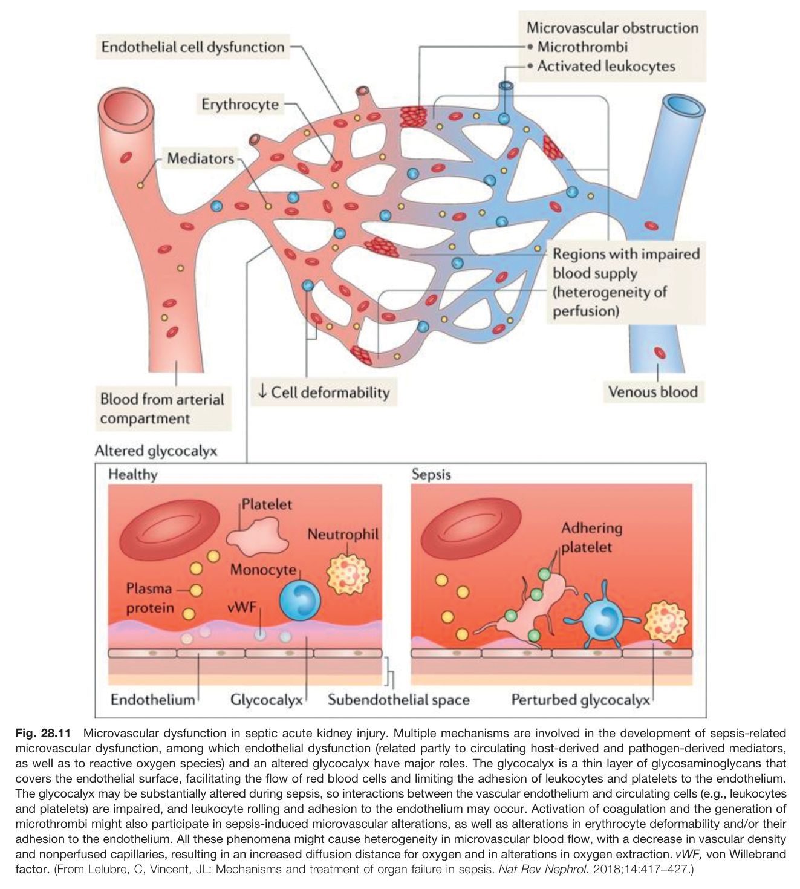

Fig. 28.11 Microvascular dysfunction in septic acute kidney injury. Multiple mechanisms are involved in the development of sepsis-related microvascular dysfunction, among which endothelial dysfunction (related partly to circulating host-derived and pathogen-derived mediators, as well as to reactive oxygen species) and an altered glycocalyx have major roles. The glycocalyx is a thin layer of glycosaminoglycans that covers the endothelial surface, facilitating the flow of red blood cells and limiting the adhesion of leukocytes and platelets to the endothelium. The glycocalyx may be substantially altered during sepsis, so interactions between the vascular endothelium and circulating cells (e.g., leukocytes and platelets) are impaired, and leukocyte rolling and adhesion to the endothelium may occur. Activation of coagulation and the generation of microthrombi might also participate in sepsis-induced microvascular alterations, as well as alterations in erythrocyte deformability and/or their adhesion to the endothelium. All these phenomena might cause heterogeneity in microvascular blood flow, with a decrease in vascular density and nonperfused capillaries, resulting in an increased diffusion distance for oxygen and in alterations in oxygen extraction. vWF, von Willebrand factor. (From Lelubre, C, Vincent, JL: Mechanisms and treatment of organ failure in sepsis. Nat Rev Nephrol. 2018;14:417-427.)

---

### Fig_28_12

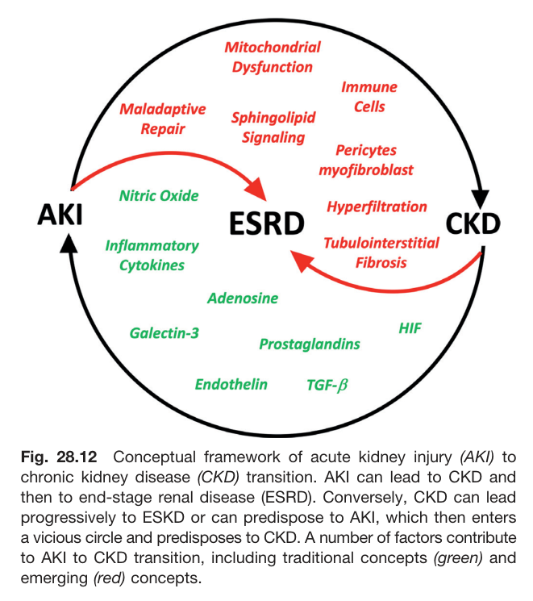

Fig. 28.12 Conceptual framework of acute kidney injury (AKI) to chronic kidney disease (CKD) transition. AKI can lead to CKD and then to end-stage renal disease (ESRD). Conversely, CKD can lead progressively to ESKD or can predispose to AKI, which then enters a vicious circle and predisposes to CKD. A number of factors contribute to AKI to CKD transition, including traditional concepts (green) and emerging (red) concepts.

---

### Fig_28_13

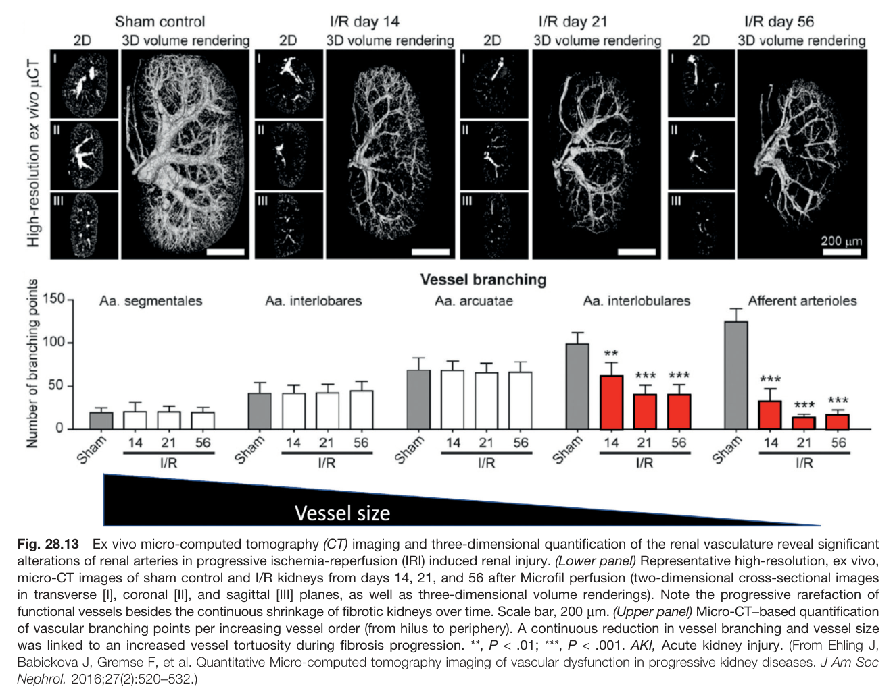

Fig. 28.13 Ex vivo micro-computed tomography (CT) imaging and three-dimensional quantification of the renal vasculature reveal significant alterations of renal arteries in progressive ischemia-reperfusion (IRI) induced renal injury. (Lower panel) Representative high-resolution, ex vivo, micro-CT images of sham control and I/R kidneys from days 14, 21, and 56 after Microfil perfusion (two-dimensional cross-sectional images in transverse [I], coronal [II], and sagittal [III] planes, as well as three-dimensional volume renderings). Note the progressive rarefaction of functional vessels besides the continuous shrinkage of fibrotic kidneys over time. Scale bar, 200 µm. (Upper panel) Micro-CT-based quantification of vascular branching points per increasing vessel order (from hilus to periphery). A continuous reduction in vessel branching and vessel size was linked to an increased vessel tortuosity during fibrosis progression. **, P < .01; ***, P < .001. AKI, Acute kidney injury. (From Ehling J, Babickova J, Gremse F, et al. Quantitative Micro-computed tomography imaging of vascular dysfunction in progressive kidney diseases. J Am Soc Nephrol. 2016;27(2):520-532.)

---

### Fig_28_14

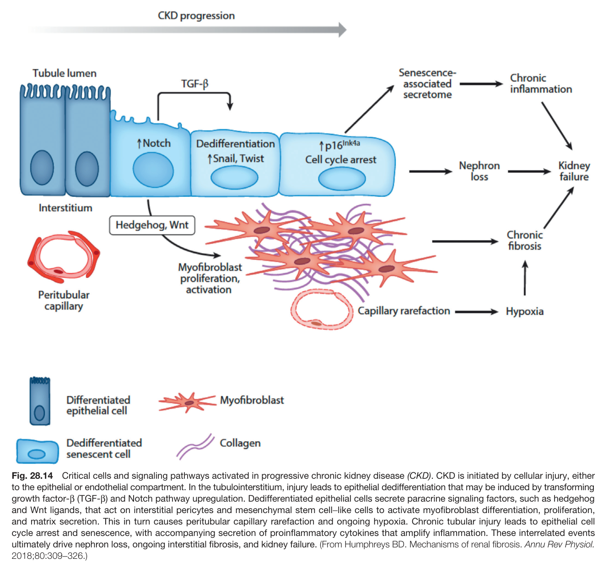

Fig. 28.14 Critical cells and signaling pathways activated in progressive chronic kidney disease (CKD). CKD is initiated by cellular injury, either to the epithelial or endothelial compartment. In the tubulointerstitium, injury leads to epithelial dedifferentiation that may be induced by transforming growth factor-ẞ (TGF-β) and Notch pathway upregulation. Dedifferentiated epithelial cells secrete paracrine signaling factors, such as hedgehog and Wnt ligands, that act on interstitial pericytes and mesenchymal stem cell-like cells to activate myofibroblast differentiation, proliferation, and matrix secretion. This in turn causes peritubular capillary rarefaction and ongoing hypoxia. Chronic tubular injury leads to epithelial cell cycle arrest and senescence, with accompanying secretion of proinflammatory cytokines that amplify inflammation. These interrelated events ultimately drive nephron loss, ongoing interstitial fibrosis, and kidney failure. (From Humphreys BD. Mechanisms of renal fibrosis. Annu Rev Physiol. 2018;80:309-326.)

---

### Fig_28_15

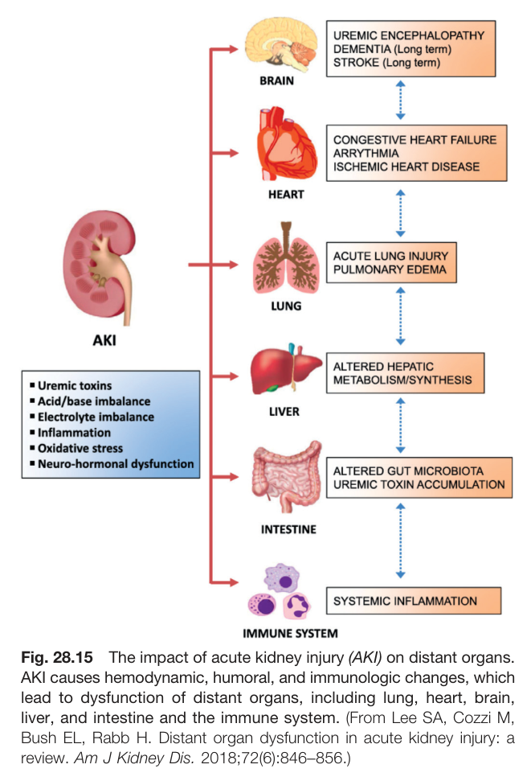

Fig. 28.15 The impact of acute kidney injury (AKI) on distant organs. AKI causes hemodynamic, humoral, and immunologic changes, which lead to dysfunction of distant organs, including lung, heart, brain, liver, and intestine and the immune system. (From Lee SA, Cozzi M, Bush EL, Rabb H. Distant organ dysfunction in acute kidney injury: a review. Am J Kidney Dis. 2018;72(6):846-856.)

---

## Tables

### Table_28_1

#### Table Image

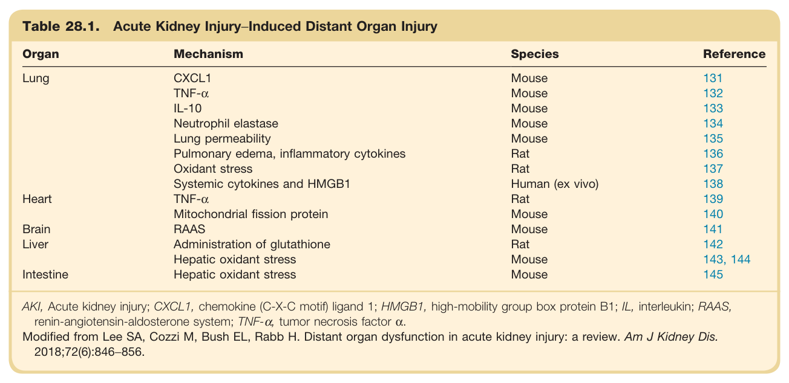

#### Table Data (CSV: [Table_28_1.csv](Table_28_1.csv))

```markdown
| Table Text (OCR) |
| :--- |
| Table 28.1. Acute Kidney Injury−Induced Distant Organ Injury Organ  Mechanism  Species  Reference    Lung  CXCL1  Mouse  131    TNF-α  Mouse  132    IL-10  Mouse  133    Neutrophil elastase  Mouse  134    Lung permeability  Mouse  135    Pulmonary edema, inflammatory cytokines  Rat  136    Oxidant stress  Rat  137    Systemic cytokines and HMGB1  Human (ex vivo)  138    Heart  TNF-α  Rat  139    Mitochondrial fission protein  Mouse  140    Brain  RAAS  Mouse  141    Liver  Administration of glutathione  Rat  142    Hepatic oxidant stress  Mouse  143, 144    Intestine  Hepatic oxidant stress  Mouse  145 AKI, Acute kidney injury; CXCL1, chemokine (C-X-C motif) ligand 1; HMGB1, high-mobility group box protein B1; IL, interleukin; RAAS, renin-angiotensin-aldosterone system; TNF-α, tumor necrosis factor α. Modified from Lee SA, Cozzi M, Bush EL, Rabb H. Distant organ dysfunction in acute kidney injury: a review. Am J Kidney Dis. 2018;72(6):846−856. |
```

Table 28.1 Acute Kidney Injury-Induced Distant Organ Injury | Organ | Mechanism | Species | Reference | | :-------- | :-------------------------------------- | :-------------- | :-------- | | Lung | CXCL1 | Mouse | 131 | | | TNF-α | Mouse | 132 | | | IL-10 | Mouse | 133 | | | Neutrophil elastase | Mouse | 134 | | | Lung permeability | Mouse | 135 | | | Pulmonary edema, inflammatory cytokines | Rat | 136 | | | Oxidant stress | Rat | 137 | | | Systemic cytokines and HMGB1 | Human (ex vivo) | 138 | | Heart | TNF-α | Rat | 139 | | | Mitochondrial fission protein | Mouse | 140 | | Brain | RAAS | Mouse | 141 | | Liver | Administration of glutathione | Rat | 142 | | | Hepatic oxidant stress | Mouse | 143, 144 | | Intestine | Hepatic oxidant stress | Mouse | 145 | AKI, Acute kidney injury; CXCL1, chemokine (C-X-C motif) ligand 1; HMGB1, high-mobility group box protein B1; IL, interleukin; RAAS, renin-angiotensin-aldosterone system; TNF-a, tumor necrosis factor α. Modified from Lee SA, Cozzi M, Bush EL, Rabb H. Distant organ dysfunction in acute kidney injury: a review. Am J Kidney Dis. 2018;72(6):846-856.

---
