# 29. Prevention and Management of Acute Kidney Injury - Figures and Tables Index

This document lists all figures, tables and boxes extracted from `29. Prevention and Management of Acute Kidney Injury.pdf`.

## Table of Contents
- [Figures](#figures)
- [Tables](#tables)
- [Boxes](#boxes)

---

## Figures

### Fig_29_1

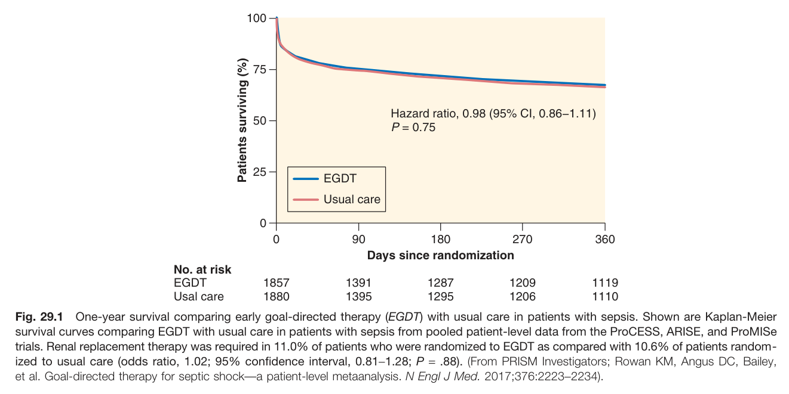

Fig. 29.1 One-year survival comparing early goal-directed therapy (EGDT) with usual care in patients with sepsis. Shown are Kaplan-Meier survival curves comparing EGDT with usual care in patients with sepsis from pooled patient-level data from the ProCESS, ARISE, and ProMISe trials. Renal replacement therapy was required in 11.0% of patients who were randomized to EGDT as compared with 10.6% of patients randomized to usual care (odds ratio, 1.02; 95% confidence interval, 0.81-1.28; P = .88). (From PRISM Investigators; Rowan KM, Angus DC, Bailey, et al. Goal-directed therapy for septic shock-a patient-level metaanalysis. N Engl J Med. 2017;376:2223-2234).

---

### Fig_29_2

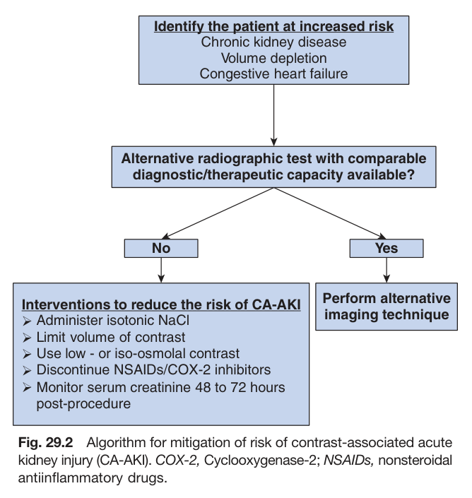

Fig. 29.2 Algorithm for mitigation of risk of contrast-associated acute kidney injury (CA-AKI). COX-2, Cyclooxygenase-2; NSAIDs, nonsteroidal antiinflammatory drugs. A flowchart shows the process for mitigating risk of CA-AKI. 1. Identify the patient at increased risk: Chronic kidney disease, Volume depletion, Congestive heart failure. 2. Question: Alternative radiographic test with comparable diagnostic/therapeutic capacity available? 3. If Yes: Perform alternative imaging technique. 4. If No: Interventions to reduce the risk of CA-AKI: Administer isotonic NaCl, Limit volume of contrast, Use low- or iso-osmolal contrast, Discontinue NSAIDs/COX-2 inhibitors, Monitor serum creatinine 48 to 72 hours post-procedure.

---

### Fig_29_3

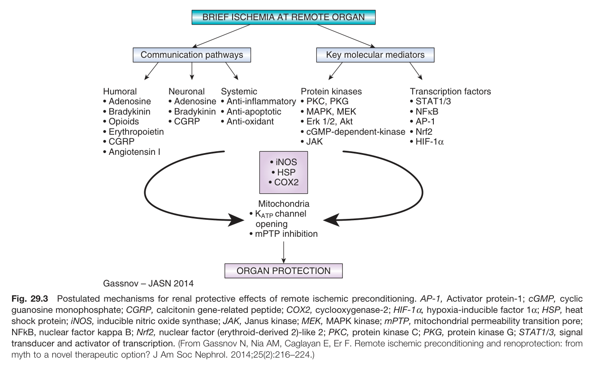

Fig. 29.3 Postulated mechanisms for renal protective effects of remote ischemic preconditioning. AP-1, Activator protein-1; cGMP, cyclic guanosine monophosphate; CGRP, calcitonin gene-related peptide; COX2, cyclooxygenase-2; HIF-1α, hypoxia-inducible factor 1α; HSP, heat shock protein; iNOS, inducible nitric oxide synthase; JAK, Janus kinase; MEK, MAPK kinase; mPTP, mitochondrial permeability transition pore; NFkB, nuclear factor kappa B; Nrf2, nuclear factor (erythroid-derived 2)-like 2; PKC, protein kinase C; PKG, protein kinase G; STAT1/3, signal transducer and activator of transcription. (From Gassnov N, Nia AM, Caglayan E, Er F. Remote ischemic preconditioning and renoprotection: from myth to a novel therapeutic option? J Am Soc Nephrol. 2014;25(2):216-224.)

---

### Fig_29_4

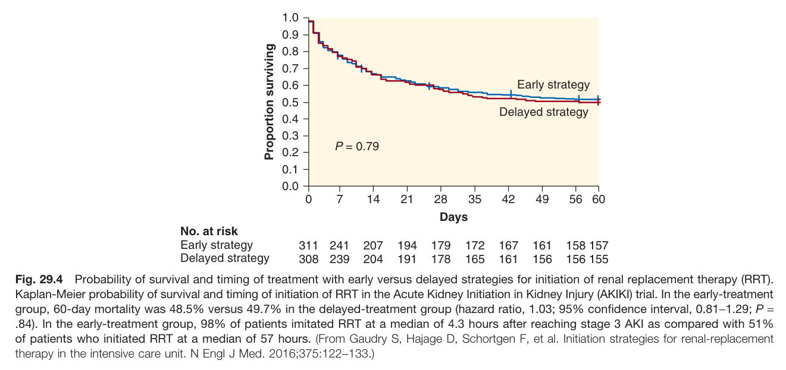

Fig. 29.4 Probability of survival and timing of treatment with early versus delayed strategies for initiation of renal replacement therapy (RRT). Kaplan-Meier probability of survival and timing of initiation of RRT in the Acute Kidney Initiation in Kidney Injury (AKIKI) trial. In the early-treatment group, 60-day mortality was 48.5% versus 49.7% in the delayed-treatment group (hazard ratio, 1.03; 95% confidence interval, 0.81-1.29; P = .84). In the early-treatment group, 98% of patients imitated RRT at a median of 4.3 hours after reaching stage 3 AKI as compared with 51% of patients who initiated RRT at a median of 57 hours. (From Gaudry S, Hajage D, Schortgen F, et al. Initiation strategies for renal-replacement therapy in the intensive care unit. N Engl J Med. 2016;375:122-133.)

---

### Fig_29_5

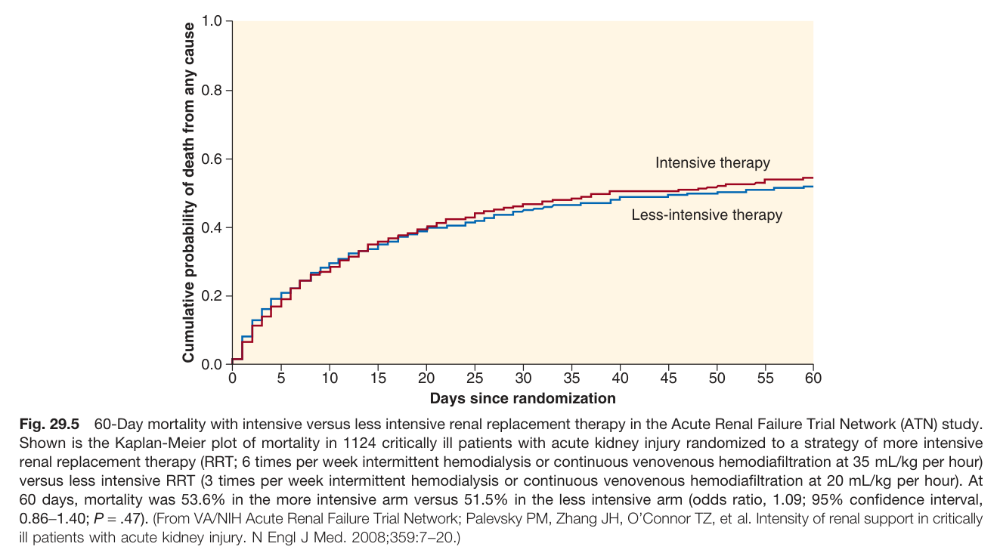

Fig. 29.5 60-Day mortality with intensive versus less intensive renal replacement therapy in the Acute Renal Failure Trial Network (ATN) study. Shown is the Kaplan-Meier plot of mortality in 1124 critically ill patients with acute kidney injury randomized to a strategy of more intensive renal replacement therapy (RRT; 6 times per week intermittent hemodialysis or continuous venovenous hemodiafiltration at 35 mL/kg per hour) versus less intensive RRT (3 times per week intermittent hemodialysis or continuous venovenous hemodiafiltration at 20 mL/kg per hour). At 60 days, mortality was 53.6% in the more intensive arm versus 51.5% in the less intensive arm (odds ratio, 1.09; 95% confidence interval, 0.86-1.40; P = .47). (From VA/NIH Acute Renal Failure Trial Network; Palevsky PM, Zhang JH, O'Connor TZ, et al. Intensity of renal support in critically ill patients with acute kidney injury. N Engl J Med. 2008;359:7-20.)

---

### Fig_29_6

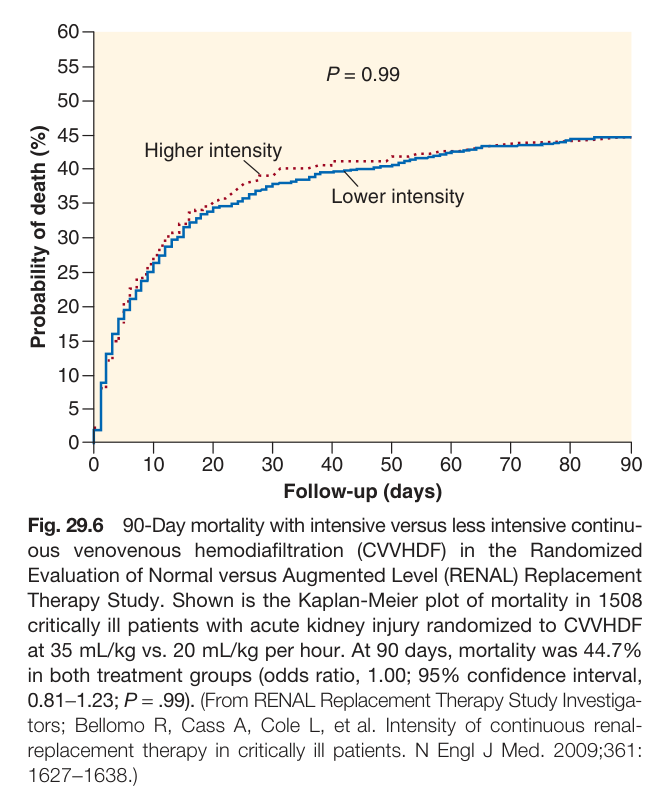

Fig. 29.6 90-Day mortality with intensive versus less intensive continuous venovenous hemodiafiltration (CVVHDF) in the Randomized Evaluation of Normal versus Augmented Level (RENAL) Replacement Therapy Study. Shown is the Kaplan-Meier plot of mortality in 1508 critically ill patients with acute kidney injury randomized to CVVHDF at 35 mL/kg vs. 20 mL/kg per hour. At 90 days, mortality was 44.7% in both treatment groups (odds ratio, 1.00; 95% confidence interval, 0.81-1.23; P = .99). (From RENAL Replacement Therapy Study Investigators; Bellomo R, Cass A, Cole L, et al. Intensity of continuous renal-replacement therapy in critically ill patients. N Engl J Med. 2009;361: 1627-1638.)

---

### Fig_29_7

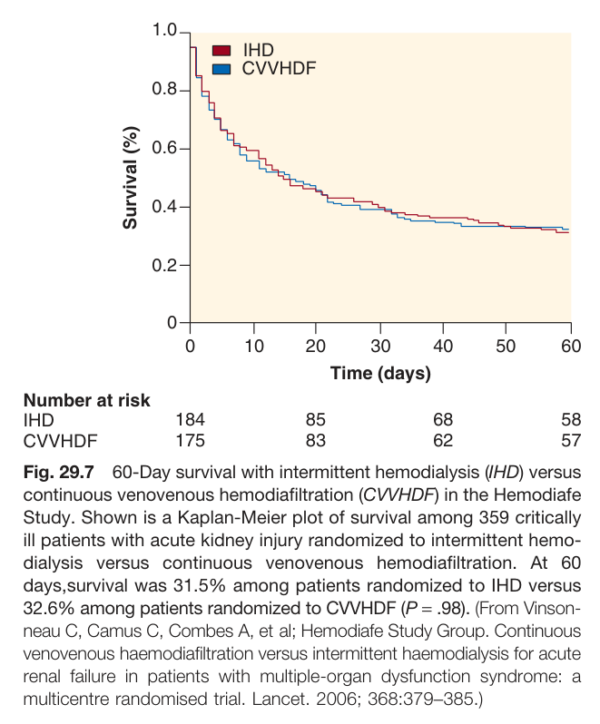

Fig. 29.7 60-Day survival with intermittent hemodialysis (IHD) versus continuous venovenous hemodiafiltration (CVVHDF) in the Hemodiafe Study. Shown is a Kaplan-Meier plot of survival among 359 critically ill patients with acute kidney injury randomized to intermittent hemodialysis versus continuous venovenous hemodiafiltration. At 60 days, survival was 31.5% among patients randomized to IHD versus 32.6% among patients randomized to CVVHDF (P = .98). (From Vinsonneau C, Camus C, Combes A, et al; Hemodiafe Study Group. Continuous venovenous haemodiafiltration versus intermittent haemodialysis for acute renal failure in patients with multiple-organ dysfunction syndrome: a multicentre randomised trial. Lancet. 2006; 368:379-385.)

---

## Tables

### Table_29_1

#### Table Image

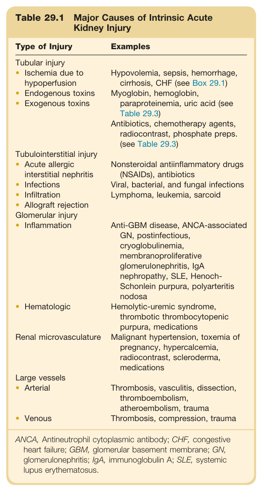

#### Table Data (CSV: [Table_29_1.csv](Table_29_1.csv))

```markdown
| Table Text (OCR) |
| :--- |
| Table 29.1 Major Causes of Intrinsic Acute Kidney Injury Type of Injury  Examples    Tubular injury    • Ischemia due to hypoperfusion  Hypovolemia, sepsis, hemorrhage, cirrhosis, CHF (see Box 29.1)    • Endogenous toxins  Myoglobin, hemoglobin, paraproteinemia, uric acid (see Table 29.3)    • Exogenous toxins  Antibiotics, chemotherapy agents, radiocontrast, phosphate preps. (see Table 29.3)    Tubulointerstitial injury    • Acute allergic interstitial nephritis  Nonsteroidal antiinflammatory drugs (NSAIDs), antibiotics    • Infections  Viral, bacterial, and fungal infections    • Infiltration  Lymphoma, leukemia, sarcoid    • Allograft rejection      Glomerular injury    • Inflammation  Anti-GBM disease, ANCA-associated GN, postinfectious, cryoglobulinemia, membranoproliferative glomerulonephritis, IgA nephropathy, SLE, Henoch-Schonlein purpura, polyarteritis nodosa    • Hematologic  Hemolytic-uremic syndrome, thrombotic thrombocytopenic purpura, medications    Renal microvasculature  Malignant hypertension, toxemia of pregnancy, hypercalcemia, radiocontrast, scleroderma, medications    Large vessels    • Arterial  Thrombosis, vasculitis, dissection, thromboembolism, atheroembolism, trauma    • Venous  Thrombosis, compression, trauma ANCA, Antineutrophil cytoplasmic antibody; CHF, congestive heart failure; GBM, glomerular basement membrane; GN, glomerulonephritis; IgA, immunoglobulin A; SLE, systemic lupus erythematosus. |
```

Table 29.1 Major Causes of Intrinsic Acute Kidney Injury | Type of Injury | Examples | | :-------------------------------------- | :----------------------------------------------------------- | | **Tubular injury** | | | • Ischemia due to hypoperfusion | Hypovolemia, sepsis, hemorrhage, cirrhosis, CHF (see Box 29.1) | | • Endogenous toxins | Myoglobin, hemoglobin, paraproteinemia, uric acid (see Table 29.3) | | • Exogenous toxins | Antibiotics, chemotherapy agents, radiocontrast, phosphate preps. (see Table 29.3) | | **Tubulointerstitial injury** | | | • Acute allergic interstitial nephritis | Nonsteroidal antiinflammatory drugs (NSAIDs), antibiotics | | • Infections | Viral, bacterial, and fungal infections | | • Infiltration | Lymphoma, leukemia, sarcoid | | • Allograft rejection | | | **Glomerular injury** | | | • Inflammation | Anti-GBM disease, ANCA-associated GN, postinfectious, cryoglobulinemia, membranoproliferative glomerulonephritis, IgA nephropathy, SLE, Henoch-Schonlein purpura, polyarteritis nodosa | | • Hematologic | Hemolytic-uremic syndrome, thrombotic thrombocytopenic purpura, medications | | **Renal microvasculature** | Malignant hypertension, toxemia of pregnancy, hypercalcemia, radiocontrast, scleroderma, medications | | **Large vessels** | | | • Arterial | Thrombosis, vasculitis, dissection, thromboembolism, atheroembolism, trauma | | • Venous | Thrombosis, compression, trauma | *ANCA, Antineutrophil cytoplasmic antibody; CHF, congestive heart failure; GBM, glomerular basement membrane; GN, glomerulonephritis; IgA, immunoglobulin A; SLE, systemic lupus erythematosus.*

---

### Table_29_2

#### Table Image

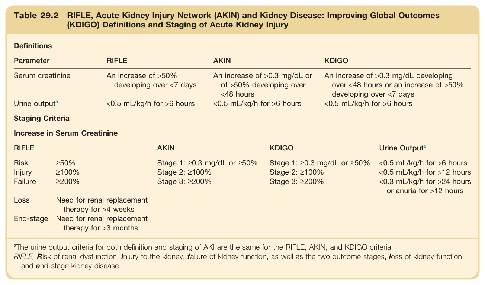

#### Table Data (CSV: [Table_29_2.csv](Table_29_2.csv))

```markdown
| Table Text (OCR) |
| :--- |
| Table 29.2 RIFLE, Acute Kidney Injury Network (AKIN) and Kidney Disease: Improving Global Outcomes (KDIGO) Definitions and Staging of Acute Kidney Injury Definitions Parameter  RIFLE  AKIN  KDIGO    Serum creatinine  An increase of >50% developing over <7 days  An increase of >0.3 mg/dL or of >50% developing over <48 hours  An increase of >0.3 mg/dL developing over <48 hours or an increase of >50% developing over <7 days    Urine output ^{a}   <0.5 mL/kg/h for >6 hours  <0.5 mL/kg/h for >6 hours  <0.5 mL/kg/h for >6 hours Staging Criteria |
```

Table 29.2 RIFLE, Acute Kidney Injury Network (AKIN) and Kidney Disease: Improving Global Outcomes (KDIGO) Definitions and Staging of Acute Kidney Injury **Definitions** | Parameter | RIFLE | AKIN | KDIGO | | :--------------- | :------------------------------------------ | :----------------------------------------------------------- | :----------------------------------------------------------- | | Serum creatinine | An increase of >50% developing over <7 days | An increase of >0.3 mg/dL or of >50% developing over <48 hours | An increase of >0.3 mg/dL developing over <48 hours or an increase of >50% developing over <7 days | | Urine outputª | <0.5 mL/kg/h for >6 hours | <0.5 mL/kg/h for >6 hours | <0.5 mL/kg/h for >6 hours | **Staging Criteria** | Increase in Serum Creatinine | | | | | :--------------------------- | :----------------------------------------------- | :-------------------------- | :-------------------------- | | **RIFLE** | **AKIN** | **KDIGO** | **Urine Outputª** | | Risk | ≥50% | Stage 1: ≥0.3 mg/dL or ≥50% | Stage 1: ≥0.3 mg/dL or ≥50% | | Injury | ≥100% | Stage 2: ≥100% | Stage 2: ≥100% | | Failure | ≥200% | Stage 3: ≥200% | Stage 3: ≥200% | | Loss | Need for renal replacement therapy for >4 weeks | | | | End-stage | Need for renal replacement therapy for >3 months | | | ªThe urine output criteria for both definition and staging of AKI are the same for the RIFLE, AKIN, and KDIGO criteria. *RIFLE, Risk of renal dysfunction, injury to the kidney, failure of kidney function, as well as the two outcome stages, loss of kidney function and end-stage kidney disease.*

---

### Table_29_3

#### Table Image

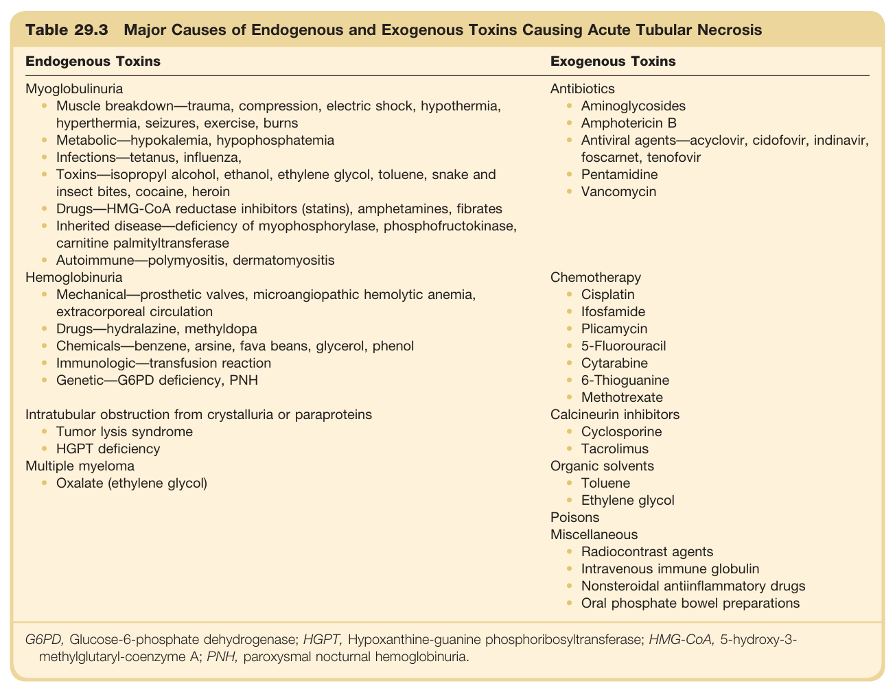

#### Table Data (CSV: [Table_29_3.csv](Table_29_3.csv))

```markdown
| Table Text (OCR) |
| :--- |
| Table 29.3 Major Causes of Endogenous and Exogenous Toxins Causing Acute Tubular Necrosis Endogenous Toxins  Exogenous Toxins    MyoglobinuriaMuscle breakdown—trauma, compression, electric shock, hypothermia, hyperthermia, seizures, exercise, burnsMetabolic—hypokalemia, hypophosphatemiaInfections—tetanus, influenza,Toxins—isopropyl alcohol, ethanol, ethylene glycol, toluene, snake and insect bites, cocaine, heroinDrugs—HMG-CoA reductase inhibitors (statins), amphetamines, fibratesInherited disease—deficiency of myophosphorylase, phosphofructokinase, carnitine palmityltransferaseAutoimmune—polymyositis, dermatomyositis  AntibioticsAminoglycosidesAmphotericin BAntiviral agents—acyclovir, cidofovir, indinavir, foscarnet, tenofovirPentamidineVancomycin    HemoglobinuriaMechanical—prosthetic valves, microangiopathic hemolytic anemia, extracorporeal circulationDrugs—hydralazine, methyldopaChemicals—benzene, arsine, fava beans, glycerol, phenolImmunologic—transfusion reactionGenetic—G6PD deficiency, PNH  ChemotherapyCisplatinIfosfamidePlicamycin5-FluorouracilCytarabine6-ThioguanineMethotrexate    Intratubular obstruction from crystalluria or paraproteinsTumor lysis syndromeHGPT deficiency  Calcineurin inhibitorsCyclosporineTacrolimus    Multiple myelomaOxalate (ethylene glycol)  Organic solventsTolueneEthylene glycolPoisonsMiscellaneousRadiocontrast agentsIntravenous immune globulinNonsteroidal antiinflammatory drugsOral phosphate bowel preparations G6PD, Glucose-6-phosphate dehydrogenase; HGPT, Hypoxanthine-guanine phosphoribosyltransferase; HMG-CoA, 5-hydroxy-3- methylglutaryl-coenzyme A; PNH, paroxysmal nocturnal hemoglobinuria. |
```

Table 29.3 Major Causes of Endogenous and Exogenous Toxins Causing Acute Tubular Necrosis | Endogenous Toxins | Exogenous Toxins | | :----------------------------------------------------------- | :----------------------------------------------------------- | | **Myoglobulinuria** | **Antibiotics** | | • Muscle breakdown—trauma, compression, electric shock, hypothermia, hyperthermia, seizures, exercise, burns | • Aminoglycosides | | • Metabolic—hypokalemia, hypophosphatemia | • Amphotericin B | | • Infections—tetanus, influenza, | • Antiviral agents—acyclovir, cidofovir, indinavir, foscarnet, tenofovir | | • Toxins—isopropyl alcohol, ethanol, ethylene glycol, toluene, snake and insect bites, cocaine, heroin | • Pentamidine | | • Drugs—HMG-CoA reductase inhibitors (statins), amphetamines, fibrates | • Vancomycin | | • Inherited disease—deficiency of myophosphorylase, phosphofructokinase, carnitine palmityltransferase | **Chemotherapy** | | • Autoimmune—polymyositis, dermatomyositis | • Cisplatin | | **Hemoglobinuria** | • Ifosfamide | | • Mechanical—prosthetic valves, microangiopathic hemolytic anemia, extracorporeal circulation | • Plicamycin | | • Drugs—hydralazine, methyldopa | • 5-Fluorouracil | | • Chemicals—benzene, arsine, fava beans, glycerol, phenol | • Cytarabine | | • Immunologic—transfusion reaction | • 6-Thioguanine | | • Genetic—G6PD deficiency, PNH | • Methotrexate | | **Intratubular obstruction from crystalluria or paraproteins** | **Calcineurin inhibitors** | | • Tumor lysis syndrome | • Cyclosporine | | • HGPT deficiency | • Tacrolimus | | Multiple myeloma | **Organic solvents** | | • Oxalate (ethylene glycol) | • Toluene | | | • Ethylene glycol | | | **Poisons** | | | **Miscellaneous** | | | • Radiocontrast agents | | | • Intravenous immune globulin | | | • Nonsteroidal antiinflammatory drugs | | | • Oral phosphate bowel preparations | *G6PD, Glucose-6-phosphate dehydrogenase; HGPT, Hypoxanthine-guanine phosphoribosyltransferase; HMG-CoA, 5-hydroxy-3-methylglutaryl-coenzyme A; PNH, paroxysmal nocturnal hemoglobinuria.*

---

### Table_29_4

#### Table Images (2 Parts)

- **Part 1 (Page 7)**:
  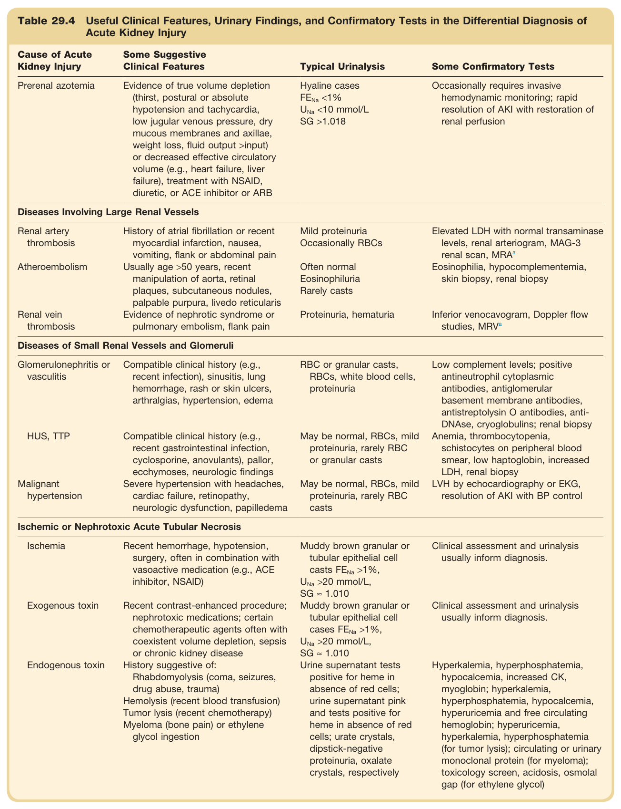

- **Part 2 (Page 8)**:
  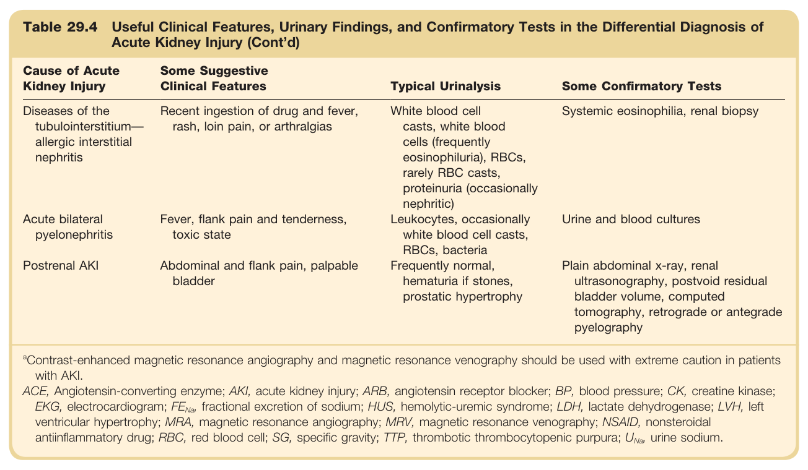

#### Table Data (CSV: [Table_29_4.csv](Table_29_4.csv))

```markdown
| Table Text (OCR) |
| :--- |
| Table 29.4 Useful Clinical Features, Urinary Findings, and Confirmatory Tests in the Differential Diagnosis of Acute Kidney Injury Cause of Acute Kidney Injury  Some Suggestive Clinical Features  Typical Urinalysis  Some Confirmatory Tests    Prerenal azotemia  Evidence of true volume depletion (thirst, postural or absolute hypotension and tachycardia, low jugular venous pressure, dry mucous membranes and axillae, weight loss, fluid output >input) or decreased effective circulatory volume (e.g., heart failure, liver failure), treatment with NSAID, diuretic, or ACE inhibitor or ARB  Hyaline cases FE_{Na} <1\%  U_{Na} <10  mmol/LSG >1.018  Occasionally requires invasive hemodynamic monitoring; rapid resolution of AKI with restoration of renal perfusion    Diseases Involving Large Renal Vessels    Renal artery thrombosis  History of atrial fibrillation or recent myocardial infarction, nausea, vomiting, flank or abdominal pain  Mild proteinuriaOccasionally RBCs  Elevated LDH with normal transaminase levels, renal arteriogram, MAG-3 renal scan, MRA ^{a}     Atheroembolism  Usually age >50 years, recent manipulation of aorta, retinal plaques, subcutaneous nodules, palpable purpura, livedo reticularis  Often normalEosinophiluriaRarely casts  Eosinophilia, hypocomplementemia, skin biopsy, renal biopsy    Renal vein thrombosis  Evidence of nephrotic syndrome or pulmonary embolism, flank pain  Proteinuria, hematuria  Inferior venocavogram, Doppler flow studies, MRVa    Diseases of Small Renal Vessels and Glomeruli    Glomerulonephritis or vasculitis  Compatible clinical history (e.g., recent infection), sinusitis, lung hemorrhage, rash or skin ulcers, arthralgias, hypertension, edema  RBC or granular casts, RBCs, white blood cells, proteinuria  Low complement levels; positive antineutrophil cytoplasmic antibodies, antiglomerular basement membrane antibodies, antistreptolysin O antibodies, anti-DNase, cryoglobulins; renal biopsy    HUS, TTP  Compatible clinical history (e.g., recent gastrointestinal infection, cyclosporine, anovulants), pallor, ecchymoses, neurologic findings  May be normal, RBCs, mild proteinuria, rarely RBC or granular casts  Anemia, thrombocytopenia, schistocytes on peripheral blood smear, low haptoglobin, increased LDH, renal biopsy    Malignant hypertension  Severe hypertension with headaches, cardiac failure, retinopathy, neurologic dysfunction, papilledema  May be normal, RBCs, mild proteinuria, rarely RBC casts  LVH by echocardiography or EKG, resolution of AKI with BP control    Ischemic or Nephrotoxic Acute Tubular Necrosis    Ischemia  Recent hemorrhage, hypotension, surgery, often in combination with vasoactive medication (e.g., ACE inhibitor, NSAID)  Muddy brown granular or tubular epithelial cell casts  FE_{Na} >1\% , U_{Na} >20  mmol/L,SG ≈ 1.010  Clinical assessment and urinalysis usually inform diagnosis.    Exogenous toxin  Recent contrast-enhanced procedure; nephrotoxic medications; certain chemotherapeutic agents often with coexistent volume depletion, sepsis or chronic kidney disease  Muddy brown granular or tubular epithelial cell cases  FE_{Na} >1\% , U_{Na} >20  mmol/L,SG ≈ 1.010  Clinical assessment and urinalysis usually inform diagnosis.    Endogenous toxin  History suggestive of: Rhabdomyolysis (coma, seizures, drug abuse, trauma)Hemolysis (recent blood transfusion)Tumor lysis (recent chemotherapy)Myeloma (bone pain) or ethylene glycol ingestion  Urine supernatant tests positive for heme in absence of red cells; urine supernatant pink and tests positive for heme in absence of red cells; urate crystals, dipstick-negative proteinuria, oxalate crystals, respectively  Hyperkalemia, hyperphosphatemia, hypocalcemia, increased CK, myoglobin; hyperkalemia, hyperphosphatemia, hypocalcemia, hyperuricemia and free circulating hemoglobin; hyperuricemia, hyperkalemia, hyperphosphatemia (for tumor lysis); circulating or urinary monoclonal protein (for myeloma); toxicology screen, acidosis, osmolal gap (for ethylene glycol)    Diseases of the tubulointerstitium-allergic interstitial nephritis  Recent ingestion of drug and fever, rash, loin pain, or arthralgias  White blood cell casts, white blood cells (frequently eosinophiluria), RBCs, rarely RBC casts, proteinuria (occasionally nephritic)  Systemic eosinophilia, renal biopsy    Acute bilateral pyelonephritis  Fever, flank pain and tenderness, toxic state  Leukocytes, occasionally white blood cell casts, RBCs, bacteria  Urine and blood cultures    Postrenal AKI  Abdominal and flank pain, palpable bladder  Frequently normal, hematuria if stones, prostatic hypertrophy  Plain abdominal x-ray, renal ultrasonography, postvoid residual bladder volume, computed tomography, retrograde or antegrade pyelography <sup>a</sup>Contrast-enhanced magnetic resonance angiography and magnetic resonance venography should be used with extreme caution in patients with AKI. ACE, Angiotensin-converting enzyme; AKI, acute kidney injury; ARB, angiotensin receptor blocker; BP, blood pressure; CK, creatine kinase; EKG, electrocardiogram; FE , fractional excretion of sodium; HUS, hemolytic-uremic syndrome; LDH, lactate dehydrogenase; LVH, left ventricular hypertrophy; MRA, magnetic resonance angiography; MRV, magnetic resonance venography; NSAID, nonsteroidal antiinflammatory drug; RBC, red blood cell; SG, specific gravity; TTP, thrombotic thrombocytopenic purpura; U<sub>Na</sub>, urine sodium. |
```

Table 29.4 Useful Clinical Features, Urinary Findings, and Confirmatory Tests in the Differential Diagnosis of Acute Kidney Injury | Cause of Acute Kidney Injury | Some Suggestive Clinical Features | Typical Urinalysis | Some Confirmatory Tests | | :----------------------------------------------------------- | :----------------------------------------------------------- | :----------------------------------------------------------- | :----------------------------------------------------------- | | **Prerenal azotemia** | Evidence of true volume depletion (thirst, postural or absolute hypotension and tachycardia, low jugular venous pressure, dry mucous membranes and axillae, weight loss, fluid output >input) or decreased effective circulatory volume (e.g., heart failure, liver failure), treatment with NSAID, diuretic, or ACE inhibitor or ARB | Hyaline cases, FENa <1%, UNa <10 mmol/L, SG >1.018 | Occasionally requires invasive hemodynamic monitoring; rapid resolution of AKI with restoration of renal perfusion | | **Diseases Involving Large Renal Vessels** | | | | | Renal artery thrombosis | History of atrial fibrillation or recent myocardial infarction, nausea, vomiting, flank or abdominal pain | Mild proteinuria, Occasionally RBCs | Elevated LDH with normal transaminase levels, renal arteriogram, MAG-3 renal scan, MRAª | | Atheroembolism | Usually age >50 years, recent manipulation of aorta, retinal plaques, subcutaneous nodules, palpable purpura, livedo reticularis | Often normal, Eosinophiluria, Rarely casts | Eosinophilia, hypocomplementemia, skin biopsy, renal biopsy | | Renal vein thrombosis | Evidence of nephrotic syndrome or pulmonary embolism, flank pain | Proteinuria, hematuria | Inferior venocavogram, Doppler flow studies, MRVª | | **Diseases of Small Renal Vessels and Glomeruli** | | | | | Glomerulonephritis or vasculitis | Compatible clinical history (e.g., recent infection), sinusitis, lung hemorrhage, rash or skin ulcers, arthralgias, hypertension, edema | RBC or granular casts, RBCs, white blood cells, proteinuria | Low complement levels; positive antineutrophil cytoplasmic antibodies, antiglomerular basement membrane antibodies, antistreptolysin O antibodies, anti-DNAse, cryoglobulins; renal biopsy | | HUS, TTP | Compatible clinical history (e.g., recent gastrointestinal infection, cyclosporine, anovulants), pallor, ecchymoses, neurologic findings | May be normal, RBCs, mild proteinuria, rarely RBC or granular casts | Anemia, thrombocytopenia, schistocytes on peripheral blood smear, low haptoglobin, increased LDH, renal biopsy | | Malignant hypertension | Severe hypertension with headaches, cardiac failure, retinopathy, neurologic dysfunction, papilledema | May be normal, RBCs, mild proteinuria, rarely RBC casts | LVH by echocardiography or EKG, resolution of AKI with BP control | | **Ischemic or Nephrotoxic Acute Tubular Necrosis** | | | | | Ischemia | Recent hemorrhage, hypotension, surgery, often in combination with vasoactive medication (e.g., ACE inhibitor, NSAID) | Muddy brown granular or tubular epithelial cell casts FENa >1%, UNa >20 mmol/L, SG ≈ 1.010 | Clinical assessment and urinalysis usually inform diagnosis. | | Exogenous toxin | Recent contrast-enhanced procedure; nephrotoxic medications; certain chemotherapeutic agents often with coexistent volume depletion, sepsis or chronic kidney disease | Muddy brown granular or tubular epithelial cell cases FENa >1%, UNa >20 mmol/L, SG ≈ 1.010 | Clinical assessment and urinalysis usually inform diagnosis. | | Endogenous toxin | History suggestive of: Rhabdomyolysis (coma, seizures, drug abuse, trauma) Hemolysis (recent blood transfusion) Tumor lysis (recent chemotherapy) Myeloma (bone pain) or ethylene glycol ingestion | Urine supernatant tests positive for heme in absence of red cells; urine supernatant pink and tests positive for heme in absence of red cells; urate crystals, dipstick-negative proteinuria, oxalate crystals, respectively | Hyperkalemia, hyperphosphatemia, hypocalcemia, increased CK, myoglobin; hyperkalemia, hyperphosphatemia, hypocalcemia, hyperuricemia and free circulating hemoglobin; hyperuricemia, hyperkalemia, hyperphosphatemia (for tumor lysis); circulating or urinary monoclonal protein (for myeloma); toxicology screen, acidosis, osmolal gap (for ethylene glycol) | | **Diseases of the tubulointerstitium—allergic interstitial nephritis** | Recent ingestion of drug and fever, rash, loin pain, or arthralgias | White blood cell casts, white blood cells (frequently eosinophiluria), RBCs, rarely RBC casts, proteinuria (occasionally nephritic) | Systemic eosinophilia, renal biopsy | | **Acute bilateral pyelonephritis** | Fever, flank pain and tenderness, toxic state | Leukocytes, occasionally white blood cell casts, RBCs, bacteria | Urine and blood cultures | | **Postrenal ΑΚΙ** | Abdominal and flank pain, palpable bladder | Frequently normal, hematuria if stones, prostatic hypertrophy | Plain abdominal x-ray, renal ultrasonography, postvoid residual bladder volume, computed tomography, retrograde or antegrade pyelography | *ªContrast-enhanced magnetic resonance angiography and magnetic resonance venography should be used with extreme caution in patients with AKI.* *ACE, Angiotensin-converting enzyme; AKI, acute kidney injury; ARB, angiotensin receptor blocker; BP, blood pressure; CK, creatine kinase; EKG, electrocardiogram; FENa, fractional excretion of sodium; HUS, hemolytic-uremic syndrome; LDH, lactate dehydrogenase; LVH, left ventricular hypertrophy; MRA, magnetic resonance angiography; MRV, magnetic resonance venography; NSAID, nonsteroidal antiinflammatory drug; RBC, red blood cell; SG, specific gravity; TTP, thrombotic thrombocytopenic purpura; UNa, urine sodium.*

---

### Table_29_5

#### Table Image

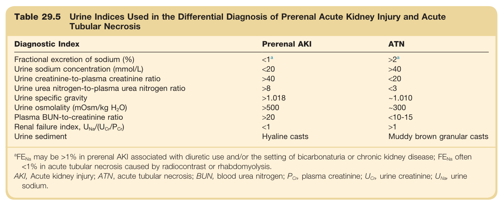

#### Table Data (CSV: [Table_29_5.csv](Table_29_5.csv))

```markdown
| Table Text (OCR) |
| :--- |
| Table 29.5 Urine Indices Used in the Differential Diagnosis of Prerenal Acute Kidney Injury and Acute Tubular Necrosis Diagnostic Index  Prerenal AKI  ATN    Fractional excretion of sodium (%)   <1^a    >2^a     Urine sodium concentration (mmol/L)  <20  >40    Urine creatinine-to-plasma creatinine ratio  >40  <20    Urine urea nitrogen-to-plasma urea nitrogen ratio  >8  <3    Urine specific gravity  >1.018  ~1.010    Urine osmolality (mOsm/kg  H_2O )  >500  ~300    Plasma BUN-to-creatinine ratio  >20  <10-15    Renal failure index,  U_{Na}/(U_{Cr}/P_{Cr})   <1  >1    Urine sediment  Hyaline casts  Muddy brown granular casts <sup>a</sup>FE may be >1% in prerenal AKI associated with diuretic use and/or the setting of bicarbonaturia or chronic kidney disease; FE often <1% in acute tubular necrosis caused by radiocontrast or rhabdomyolysis. AKI, Acute kidney injury; ATN, acute tubular necrosis; BUN, blood urea nitrogen; P<sub>Cr</sub>, plasma creatinine; U<sub>Cr</sub>, urine creatinine; U<sub>Na</sub>, urine sodi um. |
```

Table 29.5 Urine Indices Used in the Differential Diagnosis of Prerenal Acute Kidney Injury and Acute Tubular Necrosis | Diagnostic Index | Prerenal AKI | ATN | | :------------------------------------------------ | :------------ | :------------------------- | | Fractional excretion of sodium (%) | <1ª | >2ª | | Urine sodium concentration (mmol/L) | <20 | >40 | | Urine creatinine-to-plasma creatinine ratio | >40 | <20 | | Urine urea nitrogen-to-plasma urea nitrogen ratio | >8 | <3 | | Urine specific gravity | >1.018 | ~1.010 | | Urine osmolality (mOsm/kg H₂O) | >500 | ~300 | | Plasma BUN-to-creatinine ratio | >20 | <10-15 | | Renal failure index, UNa/(UCr/Pcr) | <1 | >1 | | Urine sediment | Hyaline casts | Muddy brown granular casts | *ªFENa may be >1% in prerenal AKI associated with diuretic use and/or the setting of bicarbonaturia or chronic kidney disease; FENa often <1% in acute tubular necrosis caused by radiocontrast or rhabdomyolysis.* *AKI, Acute kidney injury; ATN, acute tubular necrosis; BUN, blood urea nitrogen; Pcr, plasma creatinine; Ucr, urine creatinine; UNa, urine sodium.*

---

### Table_29_6

#### Table Image

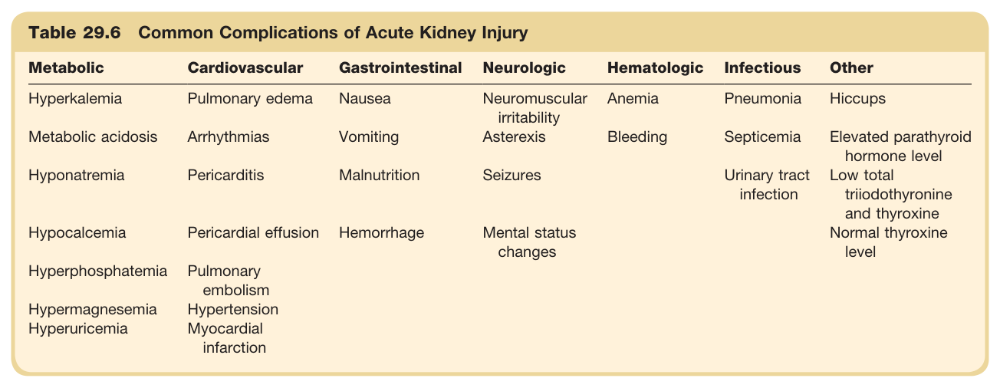

#### Table Data (CSV: [Table_29_6.csv](Table_29_6.csv))

```markdown
| Table Text (OCR) |
| :--- |
| Table 29.6 Common Complications of Acute Kidney Injury Metabolic  Cardiovascular  Gastrointestinal  Neurologic  Hematologic  Infectious  Other    Hyperkalemia  Pulmonary edema  Nausea  Neuromuscular irritability  Anemia  Pneumonia  Hiccups    Metabolic acidosis  Arrhythmias  Vomiting  Asterexis  Bleeding  Septicemia  Elevated parathyroid hormone level    Hyponatremia  Pericarditis  Malnutrition  Seizures    Urinary tract infection  Low total triiodothyronine and thyroxine    Hypocalcemia  Pericardial effusion  Hemorrhage  Mental status changes      Normal thyroxine level    Hyperphosphatemia  Pulmonary embolism              Hypermagnesemia  Hypertension              Hyperuricemia  Myocardial infarction |
```

Table 29.6 Common Complications of Acute Kidney Injury | Metabolic | Cardiovascular | Gastrointestinal | Neurologic | Hematologic | Infectious | Other | | :-------------------------- | :-------------------- | :--------------- | :------------------------- | :---------- | :---------------------- | :--------------------------------------- | | Hyperkalemia | Pulmonary edema | Nausea | Neuromuscular irritability | Anemia | Pneumonia | Hiccups | | Metabolic acidosis | Arrhythmias | Vomiting | Asterexis | Bleeding | Septicemia | Elevated parathyroid hormone level | | Hyponatremia | Pericarditis | Malnutrition | Seizures | | Urinary tract infection | Low total triiodothyronine and thyroxine | | Hypocalcemia | Pericardial effusion | Hemorrhage | Mental status changes | | | Normal thyroxine level | | Hyperphosphatemia | Pulmonary embolism | | | | | | | Hypermagnesemia | Hypertension | | | | | | | Hyperuricemia | Myocardial infarction | | | | | |

---

### Table_29_7

#### Table Image

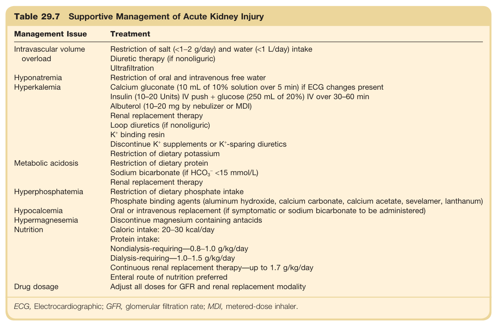

#### Table Data (CSV: [Table_29_7.csv](Table_29_7.csv))

```markdown
| Table Text (OCR) |
| :--- |
| Table 29.7 Supportive Management of Acute Kidney Injury Management Issue  Treatment    Intravascular volume overload  Restriction of salt (<1–2 g/day) and water (<1 L/day) intakeDiuretic therapy (if nonoliguric)Ultrafiltration    Hyponatremia  Restriction of oral and intravenous free water    Hyperkalemia  Calcium gluconate (10 mL of 10% solution over 5 min) if ECG changes presentInsulin (10–20 Units) IV push + glucose (250 mL of 20%) IV over 30–60 minAlbuterol (10–20 mg by nebulizer or MDI)Renal replacement therapyLoop diuretics (if nonoliguric)K+binding resinDiscontinue K+supplements or K+-sparing diureticsRestriction of dietary potassium    Metabolic acidosis  Restriction of dietary proteinSodium bicarbonate (if HCO3-<15 mmol/L)Renal replacement therapy    Hyperphosphatemia  Restriction of dietary phosphate intakePhosphate binding agents (aluminum hydroxide, calcium carbonate, calcium acetate, sevelamer, lanthanum)    Hypocalcemia  Oral or intravenous replacement (if symptomatic or sodium bicarbonate to be administered)    Hypermagnesemia  Discontinue magnesium containing antacids    Nutrition  Caloric intake: 20–30 kcal/dayProtein intake:Nondialysis-requiring—0.8–1.0 g/kg/dayDialysis-requiring—1.0–1.5 g/kg/dayContinuous renal replacement therapy—up to 1.7 g/kg/dayEnteral route of nutrition preferred    Drug dosage  Adjust all doses for GFR and renal replacement modality ECG, Electrocardiographic; GFR, glomerular filtration rate; MDI, metered-dose inhaler. |
```

Table 29.7 Supportive Management of Acute Kidney Injury | Management Issue | Treatment | | :-------------------------------- | :----------------------------------------------------------- | | **Intravascular volume overload** | Restriction of salt (<1-2 g/day) and water (<1 L/day) intake | | | Diuretic therapy (if nonoliguric) | | | Ultrafiltration | | **Hyponatremia** | Restriction of oral and intravenous free water | | **Hyperkalemia** | Calcium gluconate (10 mL of 10% solution over 5 min) if ECG changes present | | | Insulin (10-20 Units) IV push + glucose (250 mL of 20%) IV over 30-60 min | | | Albuterol (10-20 mg by nebulizer or MDI) | | | Renal replacement therapy | | | Loop diuretics (if nonoliguric) | | | K+ binding resin | | | Discontinue K+ supplements or Kt-sparing diuretics | | | Restriction of dietary potassium | | **Metabolic acidosis** | Restriction of dietary protein | | | Sodium bicarbonate (if HCO3¯ <15 mmol/L) | | | Renal replacement therapy | | **Hyperphosphatemia** | Restriction of dietary phosphate intake | | | Phosphate binding agents (aluminum hydroxide, calcium carbonate, calcium acetate, sevelamer, lanthanum) | | **Hypocalcemia** | Oral or intravenous replacement (if symptomatic or sodium bicarbonate to be administered) | | **Hypermagnesemia** | Discontinue magnesium containing antacids | | **Nutrition** | Caloric intake: 20-30 kcal/day | | | Protein intake: | | | Nondialysis-requiring—0.8-1.0 g/kg/day | | | Dialysis-requiring—1.0-1.5 g/kg/day | | | Continuous renal replacement therapy—up to 1.7 g/kg/day | | | Enteral route of nutrition preferred | | **Drug dosage** | Adjust all doses for GFR and renal replacement modality | *ECG, Electrocardiographic; GFR, glomerular filtration rate; MDI, metered-dose inhaler.*

---

### Table_29_8

#### Table Image

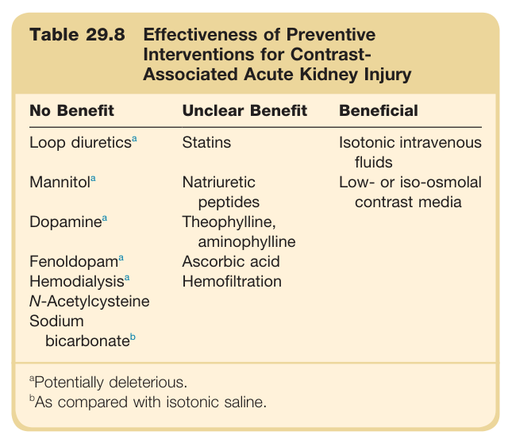

#### Table Data (CSV: [Table_29_8.csv](Table_29_8.csv))

```markdown
| Table Text (OCR) |
| :--- |
| Table 29.8 Effectiveness of Preventive Interventions for Contrast- Associated Acute Kidney Injury No Benefit  Unclear Benefit  Beneficial    Loop diuretics ^{a}   Statins  Isotonic intravenous fluids    Mannitol ^{a}   Natriuretic peptides  Low- or iso-osmolal contrast media    Dopamine ^{a}   Theophylline, aminophylline      Fenoldopam ^{a}   Ascorbic acid      Hemodialysis ^{a}   Hemofiltration      N-Acetylcysteine Sodium bicarbonate ^{b}          ^{a} Potentially deleterious. ^{b} As compared with isotonic saline. |
```

Table 29.8 Effectiveness of Preventive Interventions for Contrast-Associated Acute Kidney Injury | No Benefit | Unclear Benefit | Beneficial | | :------------------ | :-------------------------- | :--------------------------------- | | Loop diureticsª | Statins | Isotonic intravenous fluids | | Mannitolª | Natriuretic peptides | Low- or iso-osmolal contrast media | | Dopamineª | Theophylline, aminophylline | | | Fenoldopamª | Ascorbic acid | | | Hemodialysisª | Hemofiltration | | | N-Acetylcysteine | | | | Sodium bicarbonateb | | | *ªPotentially deleterious.* *bAs compared with isotonic saline.*

---

## Boxes

### Box_29_1

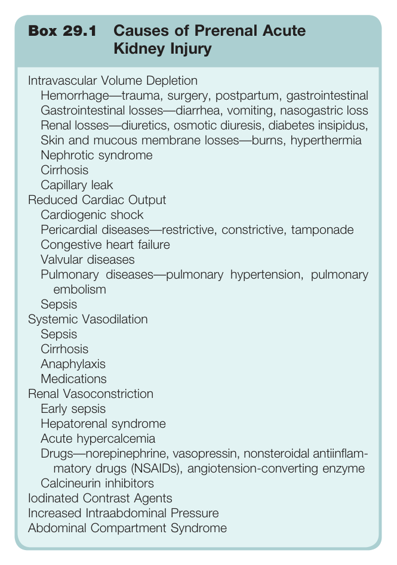

#### Box Text

```markdown
Box 29.1 Causes of Prerenal Acute Kidney Injury **Intravascular Volume Depletion** * Hemorrhage-trauma, surgery, postpartum, gastrointestinal * Gastrointestinal losses-diarrhea, vomiting, nasogastric loss * Renal losses-diuretics, osmotic diuresis, diabetes insipidus, * Skin and mucous membrane losses-burns, hyperthermia * Nephrotic syndrome * Cirrhosis * Capillary leak **Reduced Cardiac Output** * Cardiogenic shock * Pericardial diseases-restrictive, constrictive, tamponade * Congestive heart failure * Valvular diseases * Pulmonary diseases-pulmonary hypertension, pulmonary embolism * Sepsis **Systemic Vasodilation** * Sepsis * Cirrhosis * Anaphylaxis * Medications **Renal Vasoconstriction** * Early sepsis * Hepatorenal syndrome * Acute hypercalcemia * Drugs-norepinephrine, vasopressin, nonsteroidal antiinflammatory drugs (NSAIDs), angiotension-converting enzyme * Calcineurin inhibitors * lodinated Contrast Agents * Increased Intraabdominal Pressure * Abdominal Compartment Syndrome
```

Box 29.1 Causes of Prerenal Acute Kidney Injury **Intravascular Volume Depletion** * Hemorrhage-trauma, surgery, postpartum, gastrointestinal * Gastrointestinal losses-diarrhea, vomiting, nasogastric loss * Renal losses-diuretics, osmotic diuresis, diabetes insipidus, * Skin and mucous membrane losses-burns, hyperthermia * Nephrotic syndrome * Cirrhosis * Capillary leak **Reduced Cardiac Output** * Cardiogenic shock * Pericardial diseases-restrictive, constrictive, tamponade * Congestive heart failure * Valvular diseases * Pulmonary diseases-pulmonary hypertension, pulmonary embolism * Sepsis **Systemic Vasodilation** * Sepsis * Cirrhosis * Anaphylaxis * Medications **Renal Vasoconstriction** * Early sepsis * Hepatorenal syndrome * Acute hypercalcemia * Drugs-norepinephrine, vasopressin, nonsteroidal antiinflammatory drugs (NSAIDs), angiotension-converting enzyme * Calcineurin inhibitors * lodinated Contrast Agents * Increased Intraabdominal Pressure * Abdominal Compartment Syndrome

---

### Box_29_2

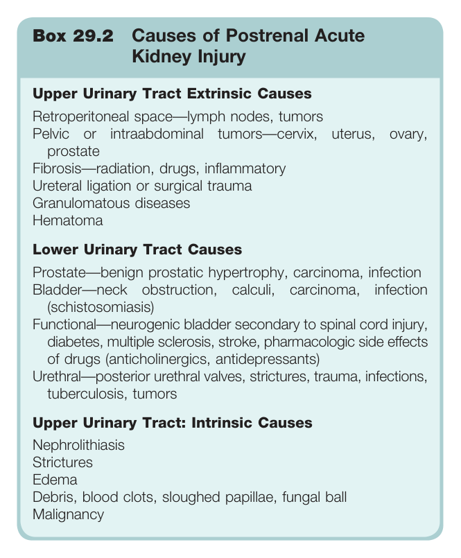

#### Box Text

```markdown
Box 29.2 Causes of Postrenal Acute Kidney Injury **Upper Urinary Tract Extrinsic Causes** * Retroperitoneal space-lymph nodes, tumors * Pelvic or intraabdominal tumors-cervix, uterus, ovary, prostate * Fibrosis-radiation, drugs, inflammatory * Ureteral ligation or surgical trauma * Granulomatous diseases * Hematoma **Lower Urinary Tract Causes** * Prostate-benign prostatic hypertrophy, carcinoma, infection * Bladder-neck obstruction, calculi, carcinoma, infection (schistosomiasis) * Functional-neurogenic bladder secondary to spinal cord injury, diabetes, multiple sclerosis, stroke, pharmacologic side effects of drugs (anticholinergics, antidepressants) * Urethral posterior urethral valves, strictures, trauma, infections, tuberculosis, tumors **Upper Urinary Tract: Intrinsic Causes** * Nephrolithiasis * Strictures * Edema * Debris, blood clots, sloughed papillae, fungal ball * Malignancy
```

Box 29.2 Causes of Postrenal Acute Kidney Injury **Upper Urinary Tract Extrinsic Causes** * Retroperitoneal space-lymph nodes, tumors * Pelvic or intraabdominal tumors-cervix, uterus, ovary, prostate * Fibrosis-radiation, drugs, inflammatory * Ureteral ligation or surgical trauma * Granulomatous diseases * Hematoma **Lower Urinary Tract Causes** * Prostate-benign prostatic hypertrophy, carcinoma, infection * Bladder-neck obstruction, calculi, carcinoma, infection (schistosomiasis) * Functional-neurogenic bladder secondary to spinal cord injury, diabetes, multiple sclerosis, stroke, pharmacologic side effects of drugs (anticholinergics, antidepressants) * Urethral posterior urethral valves, strictures, trauma, infections, tuberculosis, tumors **Upper Urinary Tract: Intrinsic Causes** * Nephrolithiasis * Strictures * Edema * Debris, blood clots, sloughed papillae, fungal ball * Malignancy

---

### Box_29_3

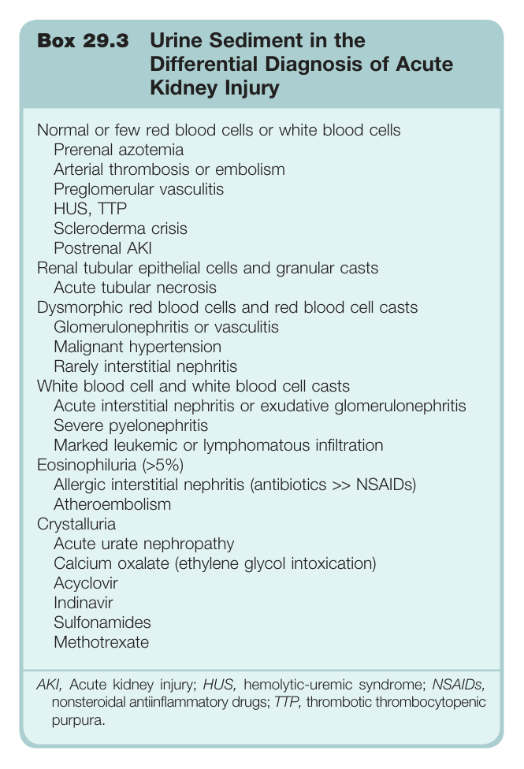

#### Box Text

```markdown
Box 29.3 Urine Sediment in the Differential Diagnosis of Acute Kidney Injury **Normal or few red blood cells or white blood cells** * Prerenal azotemia * Arterial thrombosis or embolism * Preglomerular vasculitis * HUS, TTP * Scleroderma crisis * Postrenal AKI **Renal tubular epithelial cells and granular casts** * Acute tubular necrosis **Dysmorphic red blood cells and red blood cell casts** * Glomerulonephritis or vasculitis * Malignant hypertension * Rarely interstitial nephritis **White blood cell and white blood cell casts** * Acute interstitial nephritis or exudative glomerulonephritis * Severe pyelonephritis * Marked leukemic or lymphomatous infiltration **Eosinophiluria (>5%)** * Allergic interstitial nephritis (antibiotics >> NSAIDs) * Atheroembolism **Crystalluria** * Acute urate nephropathy * Calcium oxalate (ethylene glycol intoxication) * Acyclovir * Indinavir * Sulfonamides * Methotrexate *AKI, Acute kidney injury; HUS, hemolytic-uremic syndrome; NSAIDs, nonsteroidal antiinflammatory drugs; TTP, thrombotic thrombocytopenic purpura.*
```

Box 29.3 Urine Sediment in the Differential Diagnosis of Acute Kidney Injury **Normal or few red blood cells or white blood cells** * Prerenal azotemia * Arterial thrombosis or embolism * Preglomerular vasculitis * HUS, TTP * Scleroderma crisis * Postrenal AKI **Renal tubular epithelial cells and granular casts** * Acute tubular necrosis **Dysmorphic red blood cells and red blood cell casts** * Glomerulonephritis or vasculitis * Malignant hypertension * Rarely interstitial nephritis **White blood cell and white blood cell casts** * Acute interstitial nephritis or exudative glomerulonephritis * Severe pyelonephritis * Marked leukemic or lymphomatous infiltration **Eosinophiluria (>5%)** * Allergic interstitial nephritis (antibiotics >> NSAIDs) * Atheroembolism **Crystalluria** * Acute urate nephropathy * Calcium oxalate (ethylene glycol intoxication) * Acyclovir * Indinavir * Sulfonamides * Methotrexate *AKI, Acute kidney injury; HUS, hemolytic-uremic syndrome; NSAIDs, nonsteroidal antiinflammatory drugs; TTP, thrombotic thrombocytopenic purpura.*

---

### Box_29_4

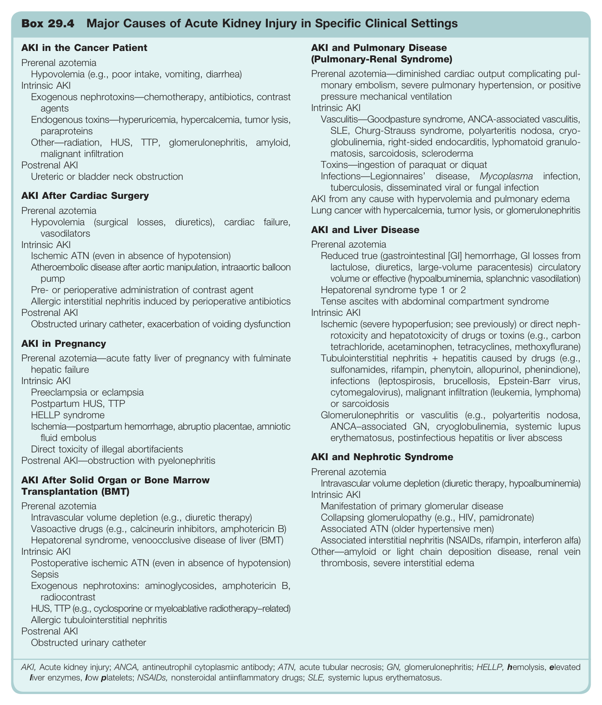

#### Box Text

```markdown
Box 29.4 Major Causes of Acute Kidney Injury in Specific Clinical Settings **AKI in the Cancer Patient** * Prerenal azotemia * Hypovolemia (e.g., poor intake, vomiting, diarrhea) * Intrinsic AKI * Exogenous nephrotoxins—chemotherapy, antibiotics, contrast agents * Endogenous toxins—hyperuricemia, hypercalcemia, tumor lysis, paraproteins * Other—radiation, HUS, TTP, glomerulonephritis, amyloid, malignant infiltration * Postrenal AKI * Ureteric or bladder neck obstruction **AKI After Cardiac Surgery** * Prerenal azotemia * Hypovolemia (surgical losses, diuretics), cardiac failure, vasodilators * Intrinsic AKI * Ischemic ATN (even in absence of hypotension) * Atheroembolic disease after aortic manipulation, intraaortic balloon pump * Pre- or perioperative administration of contrast agent * Allergic interstitial nephritis induced by perioperative antibiotics * Postrenal AKI * Obstructed urinary catheter, exacerbation of voiding dysfunction **AKI in Pregnancy** * Prerenal azotemia—acute fatty liver of pregnancy with fulminate hepatic failure * Intrinsic AKI * Preeclampsia or eclampsia * Postpartum HUS, TTP * HELLP syndrome * Ischemia—postpartum hemorrhage, abruptio placentae, amniotic fluid embolus * Direct toxicity of illegal abortifacients * Postrenal AKI—obstruction with pyelonephritis **AKI After Solid Organ or Bone Marrow Transplantation (BMT)** * Prerenal azotemia * Intravascular volume depletion (e.g., diuretic therapy) * Vasoactive drugs (e.g., calcineurin inhibitors, amphotericin B) * Hepatorenal syndrome, venoocclusive disease of liver (BMT) * Intrinsic AKI * Postoperative ischemic ATN (even in absence of hypotension) * Sepsis * Exogenous nephrotoxins: aminoglycosides, amphotericin B, radiocontrast * HUS, TTP (e.g., cyclosporine or myeloablative radiotherapy-related) * Allergic tubulointerstitial nephritis * Postrenal AKI * Obstructed urinary catheter **AKI and Pulmonary Disease (Pulmonary-Renal Syndrome)** * Prerenal azotemia—diminished cardiac output complicating pulmonary embolism, severe pulmonary hypertension, or positive pressure mechanical ventilation * Intrinsic AKI * Vasculitis—Goodpasture syndrome, ANCA-associated vasculitis, SLE, Churg-Strauss syndrome, polyarteritis nodosa, cryoglobulinemia, right-sided endocarditis, lyphomatoid granulomatosis, sarcoidosis, scleroderma * Toxins—ingestion of paraquat or diquat * Infections—Legionnaires' disease, Mycoplasma infection, tuberculosis, disseminated viral or fungal infection * AKI from any cause with hypervolemia and pulmonary edema * Lung cancer with hypercalcemia, tumor lysis, or glomerulonephritis **AKI and Liver Disease** * Prerenal azotemia * Reduced true (gastrointestinal [GI] hemorrhage, GI losses from lactulose, diuretics, large-volume paracentesis) circulatory volume or effective (hypoalbuminemia, splanchnic vasodilation) * Hepatorenal syndrome type 1 or 2 * Tense ascites with abdominal compartment syndrome * Intrinsic AKI * Ischemic (severe hypoperfusion; see previously) or direct nephrotoxicity and hepatotoxicity of drugs or toxins (e.g., carbon tetrachloride, acetaminophen, tetracyclines, methoxyflurane) * Tubulointerstitial nephritis + hepatitis caused by drugs (e.g., sulfonamides, rifampin, phenytoin, allopurinol, phenindione), infections (leptospirosis, brucellosis, Epstein-Barr virus, cytomegalovirus), malignant infiltration (leukemia, lymphoma) or sarcoidosis * Glomerulonephritis or vasculitis (e.g., polyarteritis nodosa, ANCA-associated GN, cryoglobulinemia, systemic lupus erythematosus, postinfectious hepatitis or liver abscess) **AKI and Nephrotic Syndrome** * Prerenal azotemia * Intravascular volume depletion (diuretic therapy, hypoalbuminemia) * Intrinsic AKI * Manifestation of primary glomerular disease * Collapsing glomerulopathy (e.g., HIV, pamidronate) * Associated ATN (older hypertensive men) * Associated interstitial nephritis (NSAIDs, rifampin, interferon alfa) * Other—amyloid or light chain deposition disease, renal vein thrombosis, severe interstitial edema *AKI, Acute kidney injury; ANCA, antineutrophil cytoplasmic antibody; ATN, acute tubular necrosis; GN, glomerulonephritis; HELLP, hemolysis, elevated liver enzymes, low platelets; NSAIDs, nonsteroidal antiinflammatory drugs; SLE, systemic lupus erythematosus.*
```

Box 29.4 Major Causes of Acute Kidney Injury in Specific Clinical Settings **AKI in the Cancer Patient** * Prerenal azotemia * Hypovolemia (e.g., poor intake, vomiting, diarrhea) * Intrinsic AKI * Exogenous nephrotoxins—chemotherapy, antibiotics, contrast agents * Endogenous toxins—hyperuricemia, hypercalcemia, tumor lysis, paraproteins * Other—radiation, HUS, TTP, glomerulonephritis, amyloid, malignant infiltration * Postrenal AKI * Ureteric or bladder neck obstruction **AKI After Cardiac Surgery** * Prerenal azotemia * Hypovolemia (surgical losses, diuretics), cardiac failure, vasodilators * Intrinsic AKI * Ischemic ATN (even in absence of hypotension) * Atheroembolic disease after aortic manipulation, intraaortic balloon pump * Pre- or perioperative administration of contrast agent * Allergic interstitial nephritis induced by perioperative antibiotics * Postrenal AKI * Obstructed urinary catheter, exacerbation of voiding dysfunction **AKI in Pregnancy** * Prerenal azotemia—acute fatty liver of pregnancy with fulminate hepatic failure * Intrinsic AKI * Preeclampsia or eclampsia * Postpartum HUS, TTP * HELLP syndrome * Ischemia—postpartum hemorrhage, abruptio placentae, amniotic fluid embolus * Direct toxicity of illegal abortifacients * Postrenal AKI—obstruction with pyelonephritis **AKI After Solid Organ or Bone Marrow Transplantation (BMT)** * Prerenal azotemia * Intravascular volume depletion (e.g., diuretic therapy) * Vasoactive drugs (e.g., calcineurin inhibitors, amphotericin B) * Hepatorenal syndrome, venoocclusive disease of liver (BMT) * Intrinsic AKI * Postoperative ischemic ATN (even in absence of hypotension) * Sepsis * Exogenous nephrotoxins: aminoglycosides, amphotericin B, radiocontrast * HUS, TTP (e.g., cyclosporine or myeloablative radiotherapy-related) * Allergic tubulointerstitial nephritis * Postrenal AKI * Obstructed urinary catheter **AKI and Pulmonary Disease (Pulmonary-Renal Syndrome)** * Prerenal azotemia—diminished cardiac output complicating pulmonary embolism, severe pulmonary hypertension, or positive pressure mechanical ventilation * Intrinsic AKI * Vasculitis—Goodpasture syndrome, ANCA-associated vasculitis, SLE, Churg-Strauss syndrome, polyarteritis nodosa, cryoglobulinemia, right-sided endocarditis, lyphomatoid granulomatosis, sarcoidosis, scleroderma * Toxins—ingestion of paraquat or diquat * Infections—Legionnaires' disease, Mycoplasma infection, tuberculosis, disseminated viral or fungal infection * AKI from any cause with hypervolemia and pulmonary edema * Lung cancer with hypercalcemia, tumor lysis, or glomerulonephritis **AKI and Liver Disease** * Prerenal azotemia * Reduced true (gastrointestinal [GI] hemorrhage, GI losses from lactulose, diuretics, large-volume paracentesis) circulatory volume or effective (hypoalbuminemia, splanchnic vasodilation) * Hepatorenal syndrome type 1 or 2 * Tense ascites with abdominal compartment syndrome * Intrinsic AKI * Ischemic (severe hypoperfusion; see previously) or direct nephrotoxicity and hepatotoxicity of drugs or toxins (e.g., carbon tetrachloride, acetaminophen, tetracyclines, methoxyflurane) * Tubulointerstitial nephritis + hepatitis caused by drugs (e.g., sulfonamides, rifampin, phenytoin, allopurinol, phenindione), infections (leptospirosis, brucellosis, Epstein-Barr virus, cytomegalovirus), malignant infiltration (leukemia, lymphoma) or sarcoidosis * Glomerulonephritis or vasculitis (e.g., polyarteritis nodosa, ANCA-associated GN, cryoglobulinemia, systemic lupus erythematosus, postinfectious hepatitis or liver abscess) **AKI and Nephrotic Syndrome** * Prerenal azotemia * Intravascular volume depletion (diuretic therapy, hypoalbuminemia) * Intrinsic AKI * Manifestation of primary glomerular disease * Collapsing glomerulopathy (e.g., HIV, pamidronate) * Associated ATN (older hypertensive men) * Associated interstitial nephritis (NSAIDs, rifampin, interferon alfa) * Other—amyloid or light chain deposition disease, renal vein thrombosis, severe interstitial edema *AKI, Acute kidney injury; ANCA, antineutrophil cytoplasmic antibody; ATN, acute tubular necrosis; GN, glomerulonephritis; HELLP, hemolysis, elevated liver enzymes, low platelets; NSAIDs, nonsteroidal antiinflammatory drugs; SLE, systemic lupus erythematosus.*

---

### Box_29_5

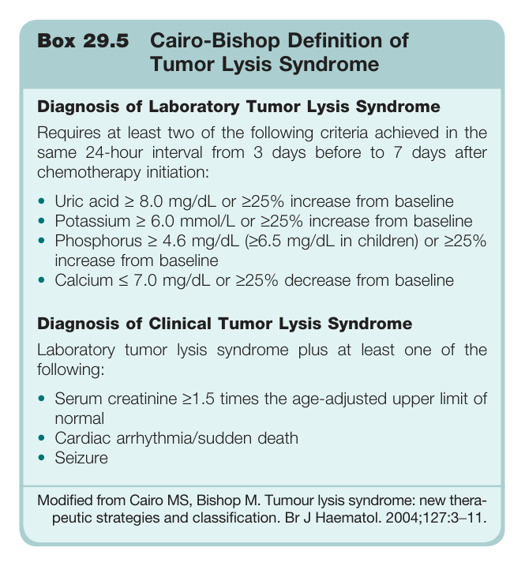

#### Box Text

```markdown
Box 29.5 Cairo-Bishop Definition of Tumor Lysis Syndrome **Diagnosis of Laboratory Tumor Lysis Syndrome** Requires at least two of the following criteria achieved in the same 24-hour interval from 3 days before to 7 days after chemotherapy initiation: * Uric acid ≥ 8.0 mg/dL or ≥25% increase from baseline * Potassium ≥ 6.0 mmol/L or ≥25% increase from baseline * Phosphorus ≥ 4.6 mg/dL (≥6.5 mg/dL in children) or ≥25% increase from baseline * Calcium ≤ 7.0 mg/dL or ≥25% decrease from baseline **Diagnosis of Clinical Tumor Lysis Syndrome** Laboratory tumor lysis syndrome plus at least one of the following: * Serum creatinine ≥1.5 times the age-adjusted upper limit of normal * Cardiac arrhythmia/sudden death * Seizure *Modified from Cairo MS, Bishop M. Tumour lysis syndrome: new therapeutic strategies and classification. Br J Haematol. 2004;127:3-11.*
```

Box 29.5 Cairo-Bishop Definition of Tumor Lysis Syndrome **Diagnosis of Laboratory Tumor Lysis Syndrome** Requires at least two of the following criteria achieved in the same 24-hour interval from 3 days before to 7 days after chemotherapy initiation: * Uric acid ≥ 8.0 mg/dL or ≥25% increase from baseline * Potassium ≥ 6.0 mmol/L or ≥25% increase from baseline * Phosphorus ≥ 4.6 mg/dL (≥6.5 mg/dL in children) or ≥25% increase from baseline * Calcium ≤ 7.0 mg/dL or ≥25% decrease from baseline **Diagnosis of Clinical Tumor Lysis Syndrome** Laboratory tumor lysis syndrome plus at least one of the following: * Serum creatinine ≥1.5 times the age-adjusted upper limit of normal * Cardiac arrhythmia/sudden death * Seizure *Modified from Cairo MS, Bishop M. Tumour lysis syndrome: new therapeutic strategies and classification. Br J Haematol. 2004;127:3-11.*

---

### Box_29_6

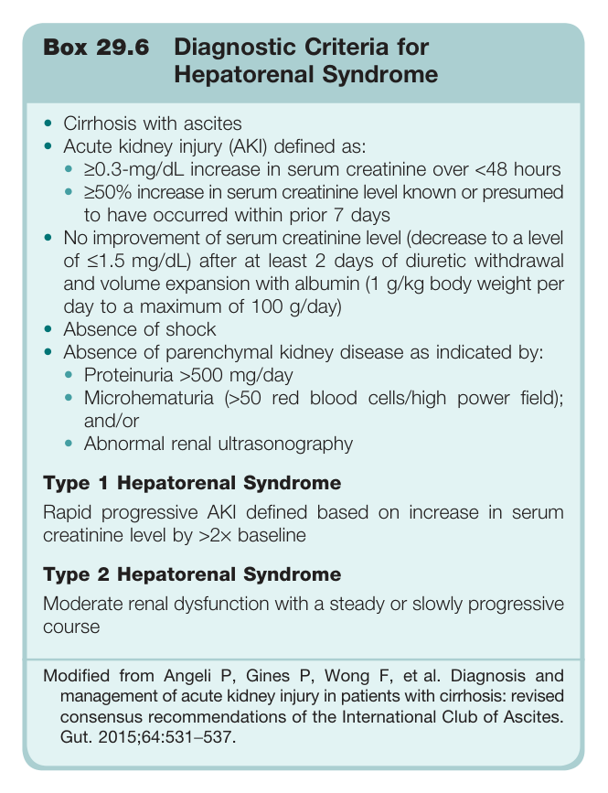

#### Box Text

```markdown
Box 29.6 Diagnostic Criteria for Hepatorenal Syndrome * Cirrhosis with ascites * Acute kidney injury (AKI) defined as: * ≥0.3-mg/dL increase in serum creatinine over <48 hours * ≥50% increase in serum creatinine level known or presumed to have occurred within prior 7 days * No improvement of serum creatinine level (decrease to a level of ≤1.5 mg/dL) after at least 2 days of diuretic withdrawal and volume expansion with albumin (1 g/kg body weight per day to a maximum of 100 g/day) * Absence of shock * Absence of parenchymal kidney disease as indicated by: * Proteinuria >500 mg/day * Microhematuria (>50 red blood cells/high power field); and/or * Abnormal renal ultrasonography **Type 1 Hepatorenal Syndrome** Rapid progressive AKI defined based on increase in serum creatinine level by >2x baseline **Type 2 Hepatorenal Syndrome** Moderate renal dysfunction with a steady or slowly progressive course *Modified from Angeli P, Gines P, Wong F, et al. Diagnosis and management of acute kidney injury in patients with cirrhosis: revised consensus recommendations of the International Club of Ascites. Gut. 2015;64:531-537.*
```

Box 29.6 Diagnostic Criteria for Hepatorenal Syndrome * Cirrhosis with ascites * Acute kidney injury (AKI) defined as: * ≥0.3-mg/dL increase in serum creatinine over <48 hours * ≥50% increase in serum creatinine level known or presumed to have occurred within prior 7 days * No improvement of serum creatinine level (decrease to a level of ≤1.5 mg/dL) after at least 2 days of diuretic withdrawal and volume expansion with albumin (1 g/kg body weight per day to a maximum of 100 g/day) * Absence of shock * Absence of parenchymal kidney disease as indicated by: * Proteinuria >500 mg/day * Microhematuria (>50 red blood cells/high power field); and/or * Abnormal renal ultrasonography **Type 1 Hepatorenal Syndrome** Rapid progressive AKI defined based on increase in serum creatinine level by >2x baseline **Type 2 Hepatorenal Syndrome** Moderate renal dysfunction with a steady or slowly progressive course *Modified from Angeli P, Gines P, Wong F, et al. Diagnosis and management of acute kidney injury in patients with cirrhosis: revised consensus recommendations of the International Club of Ascites. Gut. 2015;64:531-537.*

---

### Box_29_7

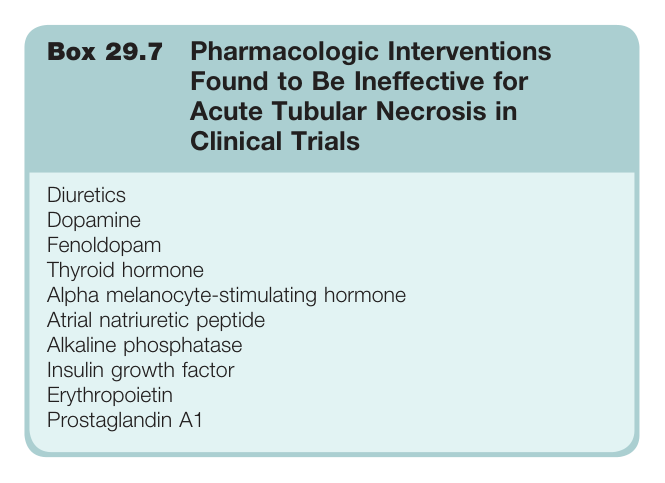

#### Box Text

```markdown
Box 29.7 Pharmacologic Interventions Found to Be Ineffective for Acute Tubular Necrosis in Clinical Trials * Diuretics * Dopamine * Fenoldopam * Thyroid hormone * Alpha melanocyte-stimulating hormone * Atrial natriuretic peptide * Alkaline phosphatase * Insulin growth factor * Erythropoietin * Prostaglandin A1
```

Box 29.7 Pharmacologic Interventions Found to Be Ineffective for Acute Tubular Necrosis in Clinical Trials * Diuretics * Dopamine * Fenoldopam * Thyroid hormone * Alpha melanocyte-stimulating hormone * Atrial natriuretic peptide * Alkaline phosphatase * Insulin growth factor * Erythropoietin * Prostaglandin A1

---

### Box_29_8

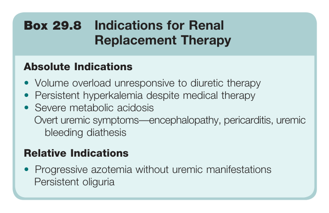

#### Box Text

```markdown
Box 29.8 Indications for Renal Replacement Therapy **Absolute Indications** * Volume overload unresponsive to diuretic therapy * Persistent hyperkalemia despite medical therapy * Severe metabolic acidosis * Overt uremic symptoms-encephalopathy, pericarditis, uremic bleeding diathesis **Relative Indications** * Progressive azotemia without uremic manifestations * Persistent oliguria
```

Box 29.8 Indications for Renal Replacement Therapy **Absolute Indications** * Volume overload unresponsive to diuretic therapy * Persistent hyperkalemia despite medical therapy * Severe metabolic acidosis * Overt uremic symptoms-encephalopathy, pericarditis, uremic bleeding diathesis **Relative Indications** * Progressive azotemia without uremic manifestations * Persistent oliguria

---
