# 31. Primary Glomerular Disease - Figures and Tables Index

This document lists all figures, tables and boxes extracted from `31. Primary Glomerular Disease.pdf`.

## Table of Contents
- [Figures](#figures)
- [Tables](#tables)
- [Boxes](#boxes)

---

## Figures

### Fig_31_1

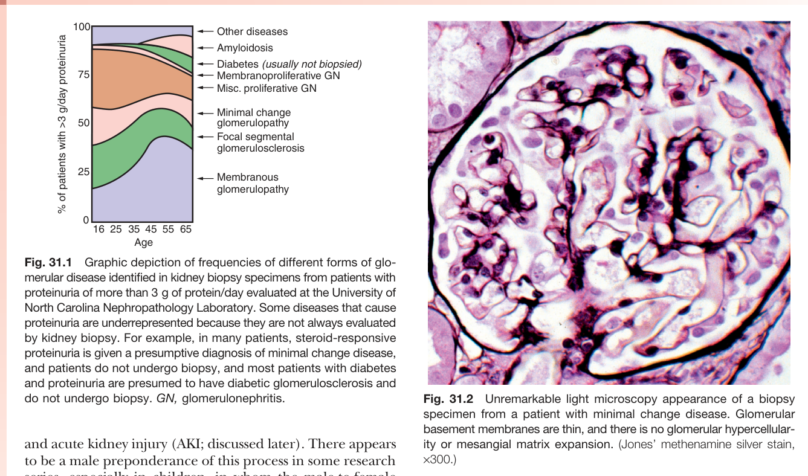

Fig. 31.1 Graphic depiction of frequencies of different forms of glo merular disease identified in kidney biopsy specimens from patients with proteinuria of more than 3 g of protein/day evaluated at the University ofNorth Carolina Nephropathology Laboratory. Some diseases that cause proteinuria are underrepresented because they are not always evaluated by kidney biopsy. For example, in many patients, steroid-responsive proteinuria is given a presumptive diagnosis of minimal change disease, and patients do not undergo biopsy, and most patients with diabetes and proteinuria are presumed to have diabetic glomerulosclerosis and do not undergo biopsy. GN, glomerulonephritis. (Image depicting a graph showing the percentage of patients with >3 g/day proteinuria by age for various glomerular diseases like amyloidosis, membranoproliferative GN, minimal change glomerulopathy, FSGS, and membranous glomerulopathy.)

---

### Fig_31_2

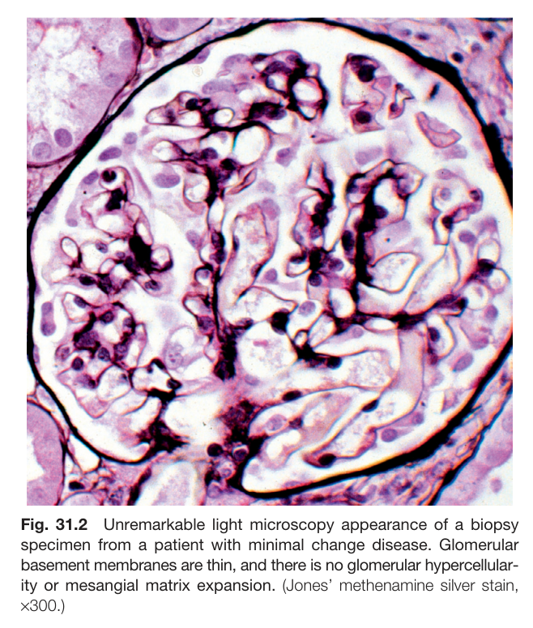

Fig. 31.2 Unremarkable light microscopy appearance of a biopsy specimen from a patient with minimal change disease. Glomerular basement membranes are thin, and there is no glomerular hypercellular ity or mesangial matrix expansion. (Jones’ methenamine silver stain, ×300.) (Image of a glomerulus under a microscope, showing thin basement membranes and no hypercellularity.)

---

### Fig_31_3

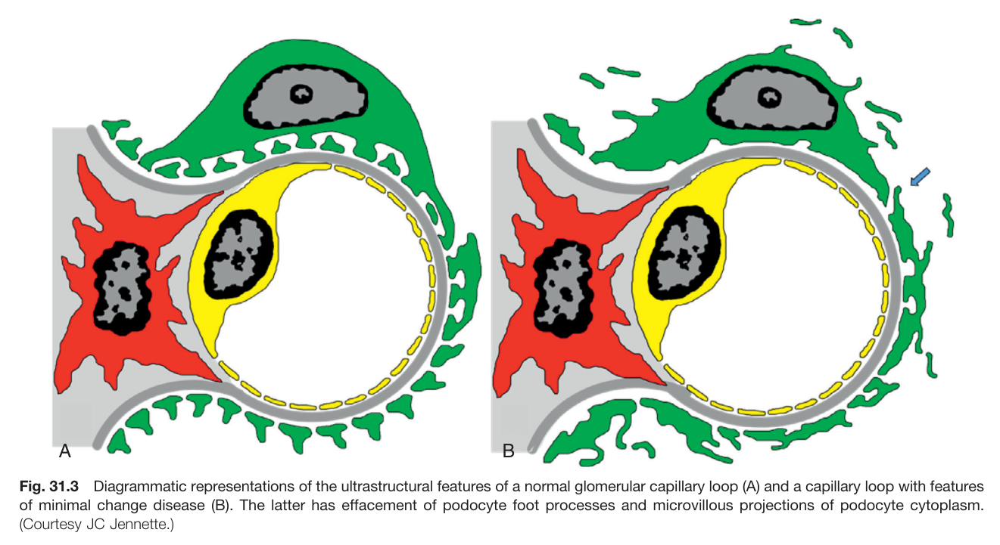

Fig. 31.3 Diagrammatic representations of the ultrastructural features of a normal glomerular capillary loop (A) and a capillary loop with features of minimal change disease (B). The latter has effacement of podocyte foot processes and microvillous projections of podocyte cytoplasm. (Courtesy JC Jennette.) (Diagram comparing a normal capillary loop with one showing features of minimal change disease.)

---

### Fig_31_4

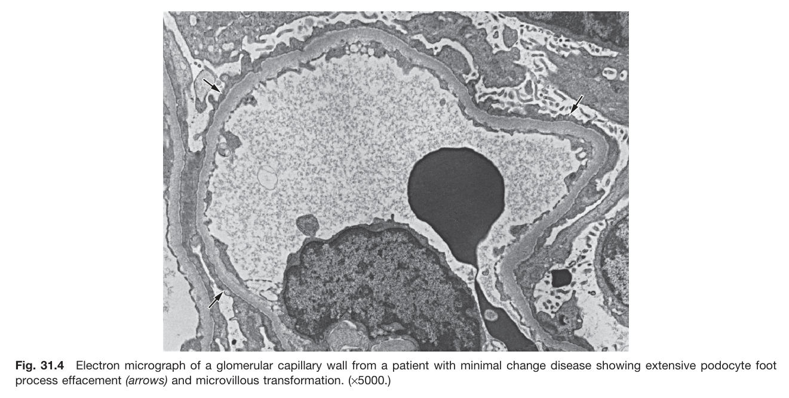

Fig. 31.4 Electron micrograph of a glomerular capillary wall from a patient with minimal change disease showing extensive podocyte foot process effacement (arrows) and microvillous transformation. (×5000.) (Electron micrograph image showing extensive podocyte foot process effacement and microvillous transformation.)

---

### Fig_31_5

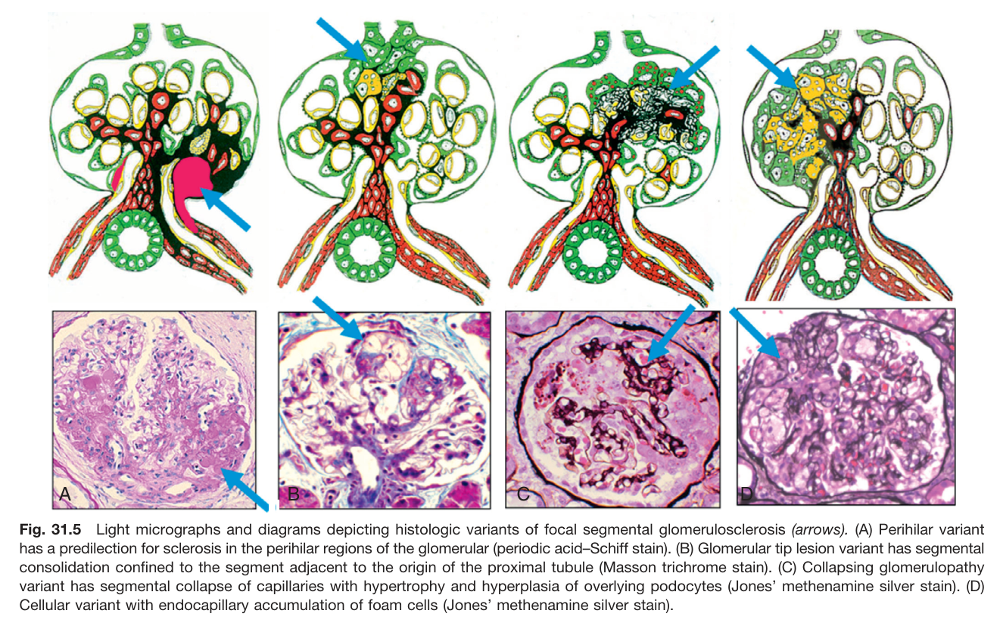

Fig. 31.5 Light micrographs and diagrams depicting histologic variants of focal segmental glomerulosclerosis (arrows). (A) Perihilar variant has a predilection for sclerosis in the perihilar regions of the glomerular (periodic acid–Schiff stain). (B) Glomerular tip lesion variant has segmental consolidation confined to the segment adjacent to the origin of the proximal tubule (Masson trichrome stain). (C) Collapsing glomerulopathy variant has segmental collapse of capillaries with hypertrophy and hyperplasia of overlying podocytes (Jones’ methenamine silver stain). (D) Cellular variant with endocapillary accumulation of foam cells (Jones’ methenamine silver stain). (Four-panel image showing different histologic variants of FSGS.)

---

### Fig_31_6

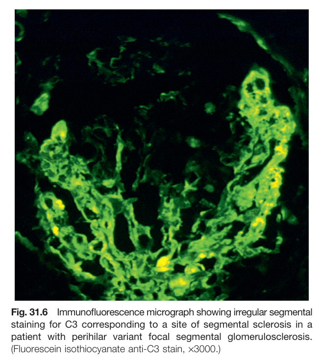

Fig. 31.6 Immunofluorescence micrograph showing irregular segmental staining for C3 corresponding to a site of segmental sclerosis in a patient with perihilar variant focal segmental glomerulosclerosis. (Fluorescein isothiocyanate anti-C3 stain, ×3000.) (Micrograph showing segmental staining for C3 in a glomerulus.)

---

### Fig_31_7

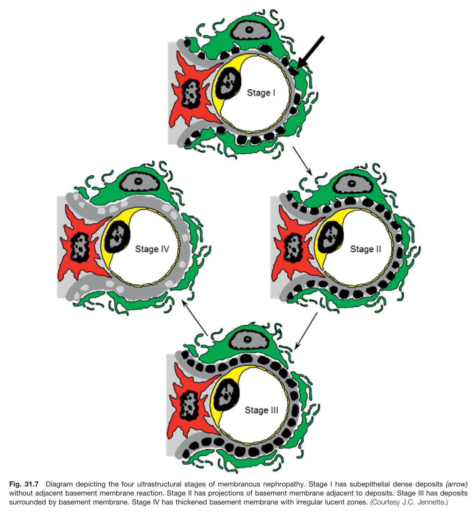

Fig. 31.7 Diagram depicting the four ultrastructural stages of membranous nephropathy. Stage I has subepithelial dense deposits (arrow) without adjacent basement membrane reaction. Stage II has projections of basement membrane adjacent to deposits. Stage III has deposits surrounded by basement membrane. Stage IV has thickened basement membrane with irregular lucent zones. (Courtesy J.C. Jennette.) (Diagram showing the four stages of membranous nephropathy.)

---

### Fig_31_8

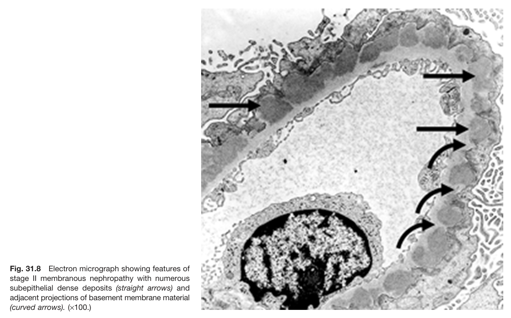

Fig. 31.8 Electron micrograph showing features of stage II membranous nephropathy with numerous subepithelial dense deposits (straight arrows) and adjacent projections of basement membrane material (curved arrows). (×100.) (Electron micrograph image of stage II membranous nephropathy.)

---

### Fig_31_9

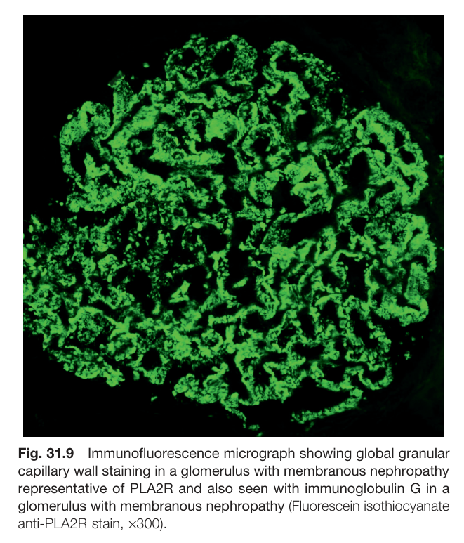

Fig. 31.9 Immunofluorescence micrograph showing global granular capillary wall staining in a glomerulus with membranous nephropathy representative of PLA2R and also seen with immunoglobulin G in a glomerulus with membranous nephropathy (Fluorescein isothiocyanate anti-PLA2R stain, ×300). (Micrograph showing capillary wall staining in a glomerulus.)

---

### Fig_31_10

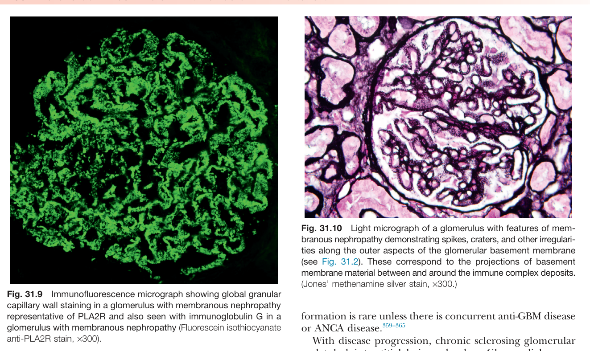

Fig. 31.10 Light micrograph of a glomerulus with features of mem branous nephropathy demonstrating spikes, craters, and other irregulari ties along the outer aspects of the glomerular basement membrane (see Fig. 31.2). These correspond to the projections of basement membrane material between and around the immune complex deposits. (Jones’ methenamine silver stain, ×300.) (Micrograph of a glomerulus showing spikes and craters along the basement membrane.)

---

### Fig_31_11

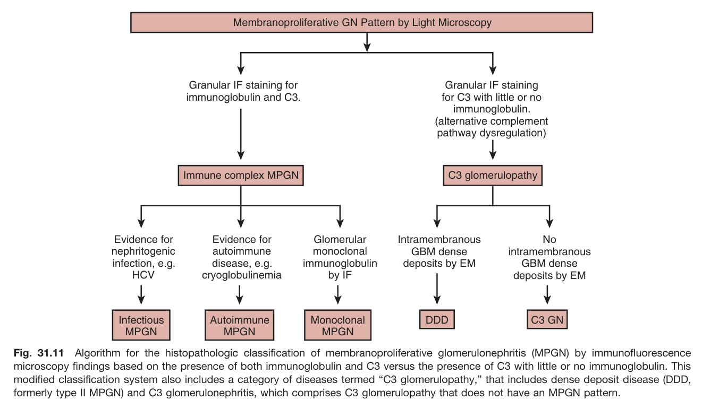

Fig. 31.11 Algorithm for the histopathologic classification of membranoproliferative glomerulonephritis (MPGN) by immunofluorescence microscopy findings based on the presence of both immunoglobulin and C3 versus the presence of C3 with little or no immunoglobulin. This modified classification system also includes a category of diseases termed “C3 glomerulopathy,” that includes dense deposit disease (DDD, formerly type II MPGN) and C3 glomerulonephritis, which comprises C3 glomerulopathy that does not have an MPGN pattern. (Flowchart showing the classification of MPGN based on IF staining.)

---

### Fig_31_12

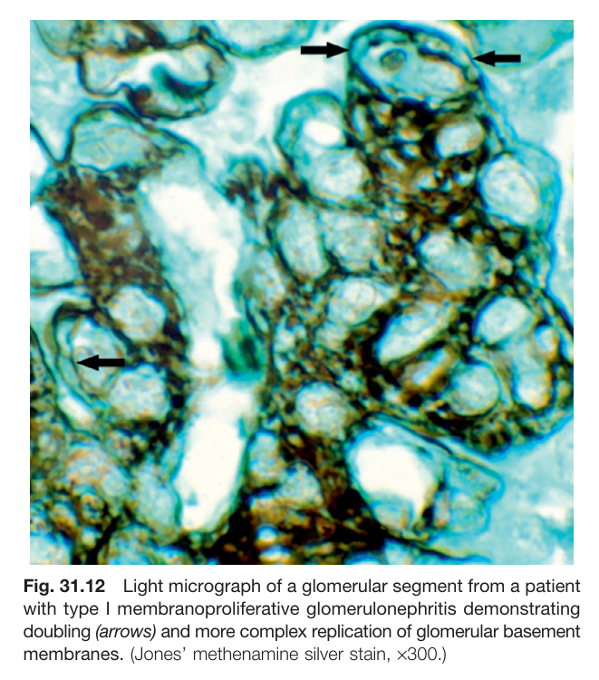

Fig. 31.12 Light micrograph of a glomerular segment from a patient with type I membranoproliferative glomerulonephritis demonstrating doubling (arrows) and more complex replication of glomerular basement membranes. (Jones’ methenamine silver stain, ×300.) (Micrograph showing doubling of glomerular basement membranes.)

---

### Fig_31_13

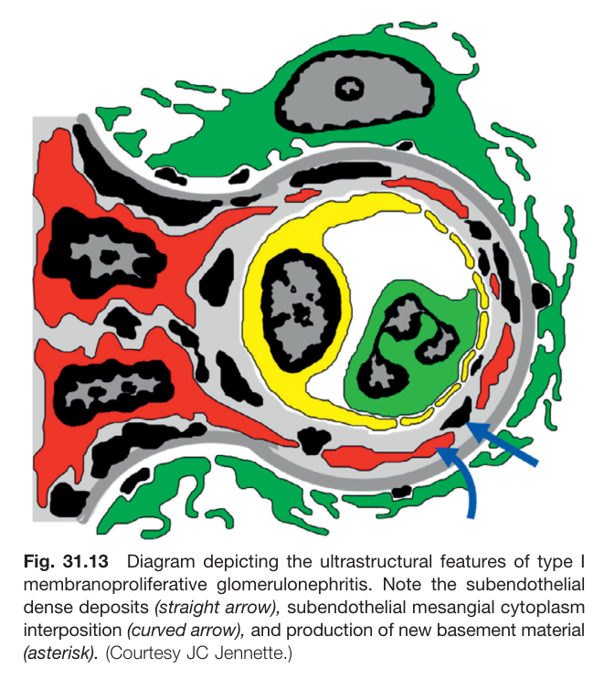

Fig. 31.13 Diagram depicting the ultrastructural features of type I membranoproliferative glomerulonephritis. Note the subendothelial dense deposits (straight arrow), subendothelial mesangial cytoplasm interposition (curved arrow), and production of new basement material (asterisk). (Courtesy JC Jennette.) (Diagram showing ultrastructural features of type I MPGN.)

---

### Fig_31_14

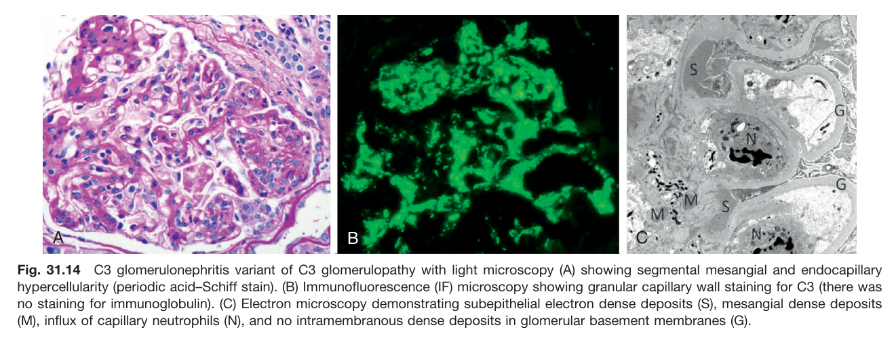

Fig. 31.14 C3 glomerulonephritis variant of C3 glomerulopathy with light microscopy (A) showing segmental mesangial and endocapillary hypercellularity (periodic acid–Schiff stain). (B) Immunofluorescence (IF) microscopy showing granular capillary wall staining for C3 (there was no staining for immunoglobulin). (C) Electron microscopy demonstrating subepithelial electron dense deposits (S), mesangial dense deposits (M), influx of capillary neutrophils (N), and no intramembranous dense deposits in glomerular basement membranes (G). (Three-panel image showing light microscopy, IF, and electron microscopy of C3 glomerulonephritis.)

---

### Fig_31_15

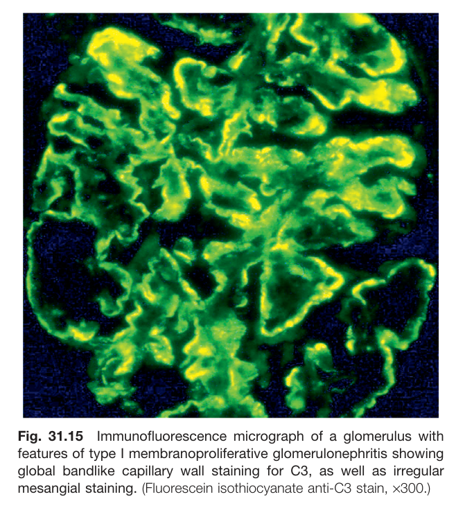

Fig. 31.15 Immunofluorescence micrograph of a glomerulus with features of type I membranoproliferative glomerulonephritis showing global bandlike capillary wall staining for C3, as well as irregular mesangial staining. (Fluorescein isothiocyanate anti-C3 stain, ×300.) (Micrograph showing capillary wall staining for C3.)

---

### Fig_31_16

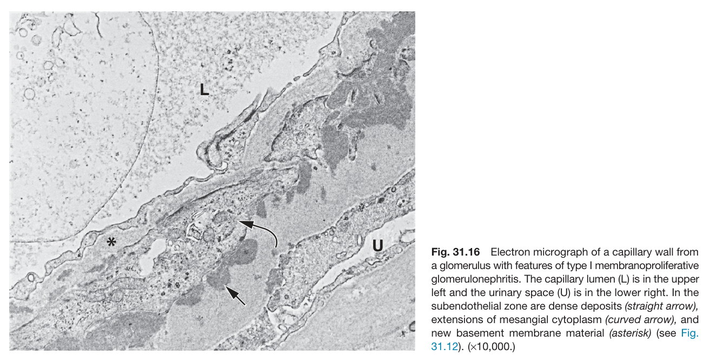

Fig. 31.16 Electron micrograph of a capillary wall from a glomerulus with features of type I membranoproliferative glomerulonephritis. The capillary lumen (L) is in the upper left and the urinary space (U) is in the lower right. In the subendothelial zone are dense deposits (straight arrow), extensions of mesangial cytoplasm (curved arrow), and new basement membrane material (asterisk) (see Fig. 31.12). (×10,000.) (Electron micrograph of a capillary wall showing features of type I MPGN.)

---

### Fig_31_17

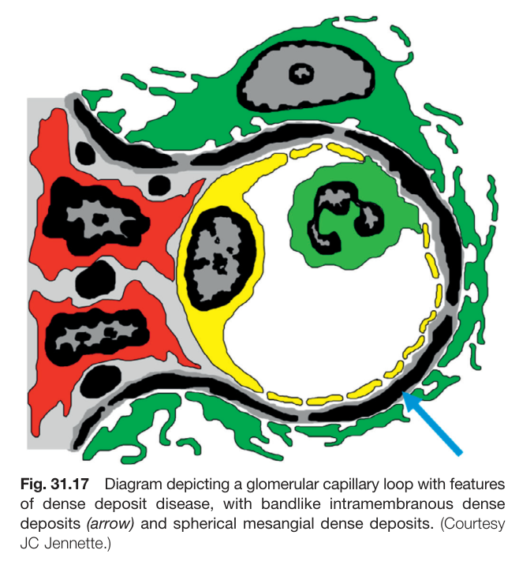

Fig. 31.17 Diagram depicting a glomerular capillary loop with features of dense deposit disease, with bandlike intramembranous dense deposits (arrow) and spherical mesangial dense deposits. (Courtesy JC Jennette.) (Diagram showing a capillary loop with features of dense deposit disease.)

---

### Fig_31_18

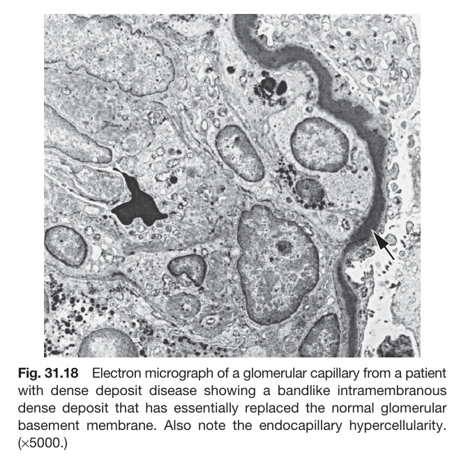

Fig. 31.18 Electron micrograph of a glomerular capillary from a patient with dense deposit disease showing a bandlike intramembranous dense deposit that has essentially replaced the normal glomerular basement membrane. Also note the endocapillary hypercellularity. (×5000.) (Electron micrograph showing features of dense deposit disease.)

---

### Fig_31_19

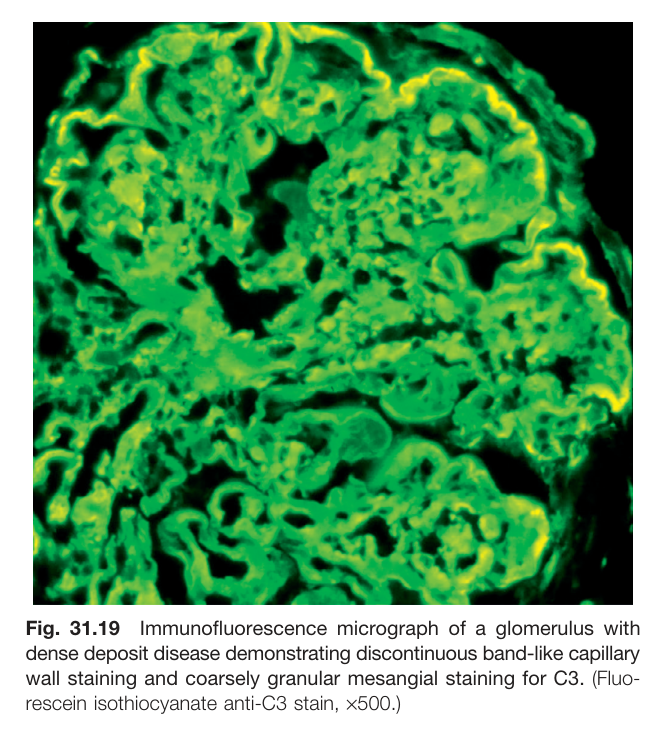

Fig. 31.19 Immunofluorescence micrograph of a glomerulus with dense deposit disease demonstrating discontinuous band-like capillary wall staining and coarsely granular mesangial staining for C3. (Fluo rescein isothiocyanate anti-C3 stain, ×500.) (Micrograph showing capillary wall and mesangial staining for C3.)

---

### Fig_31_20

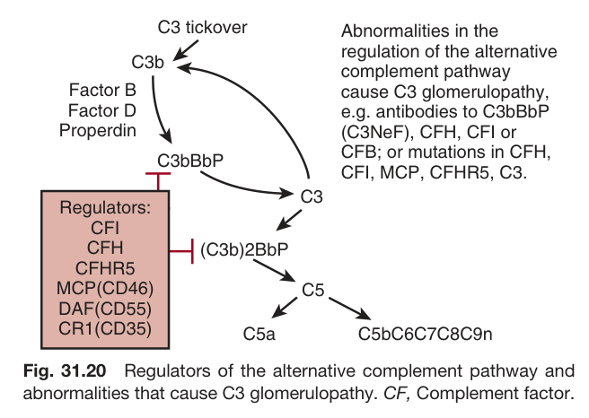

Fig. 31.20 Regulators of the alternative complement pathway and abnormalities that cause C3 glomerulopathy. CF, Complement factor. (Diagram showing the alternative complement pathway and its regulators.)

---

### Fig_31_21

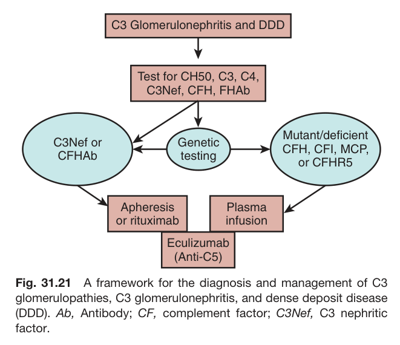

Fig. 31.21 A framework for the diagnosis and management of C3 glomerulopathies, C3 glomerulonephritis, and dense deposit disease (DDD). Ab, Antibody; CF, complement factor; C3Nef, C3 nephritic factor. (Flowchart for the diagnosis and management of C3 glomerulopathies, starting with "Test for CH50, C3, C4...". Branches lead to Genetic testing, Plasma infusion, Apheresis/rituximab, or Eculizumab based on findings like Mutant/deficient CFH, C3Nef, or CFHAb.)

---

### Fig_31_22

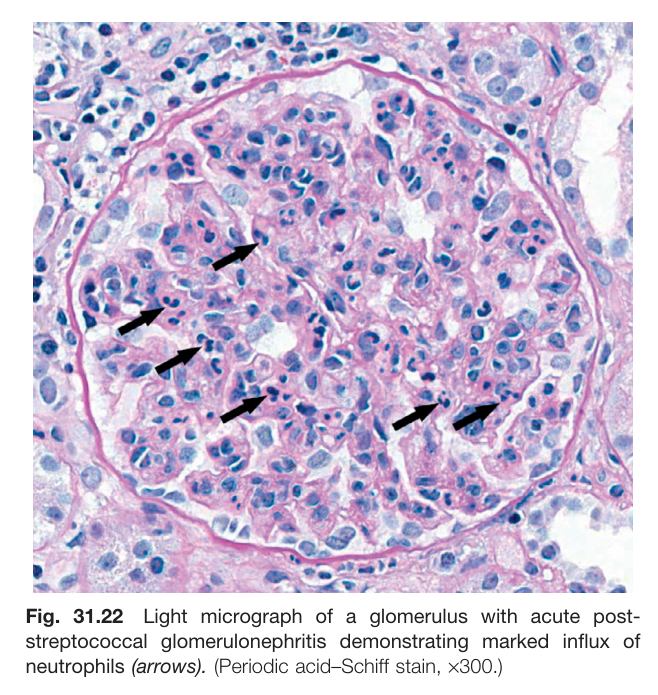

Fig. 31.22 Light micrograph of a glomerulus with acute post streptococcal glomerulonephritis demonstrating marked influx of neutrophils (arrows). (Periodic acid–Schiff stain, ×300.) (Micrograph image showing a glomerulus with a marked influx of neutrophils.)

---

### Fig_31_23

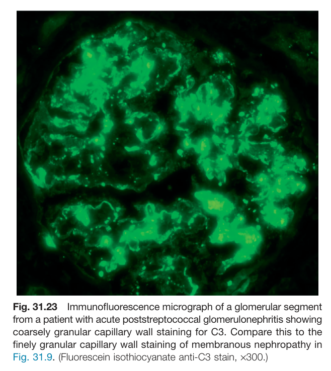

Fig. 31.23 Immunofluorescence micrograph of a glomerular segment from a patient with acute poststreptococcal glomerulonephritis showing coarsely granular capillary wall staining for C3. Compare this to the finely granular capillary wall staining of membranous nephropathy in Fig. 31.9. (Fluorescein isothiocyanate anti-C3 stain, ×300.) (Micrograph showing coarse granular staining for C3 in a glomerulus.)

---

### Fig_31_24

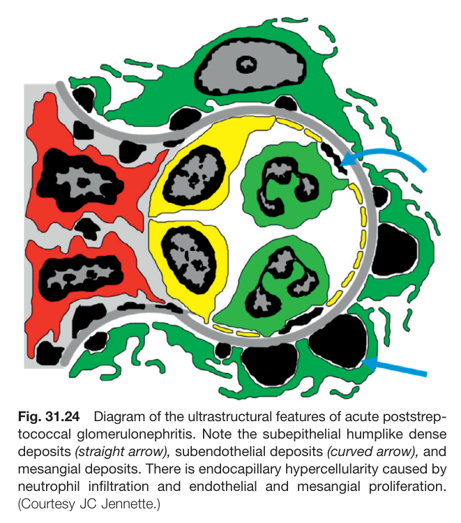

Fig. 31.24 Diagram of the ultrastructural features of acute poststrep tococcal glomerulonephritis. Note the subepithelial humplike dense deposits (straight arrow), subendothelial deposits (curved arrow), and mesangial deposits. There is endocapillary hypercellularity caused by neutrophil infiltration and endothelial and mesangial proliferation. (Courtesy JC Jennette.) (Diagram showing ultrastructural features of acute poststreptococcal glomerulonephritis.)

---

### Fig_31_25

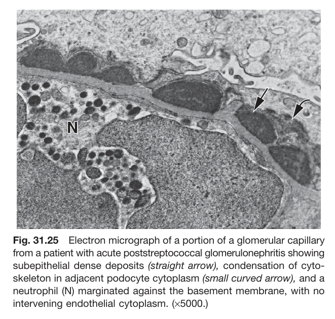

Fig. 31.25 Electron micrograph of a portion of a glomerular capillary from a patient with acute poststreptococcal glomerulonephritis showing subepithelial dense deposits (straight arrow), condensation of cyto skeleton in adjacent podocyte cytoplasm (small curved arrow), and a neutrophil (N) marginated against the basement membrane, with no intervening endothelial cytoplasm. (×5000.) (Electron micrograph showing features of acute poststreptococcal glomerulonephritis.)

---

### Fig_31_26

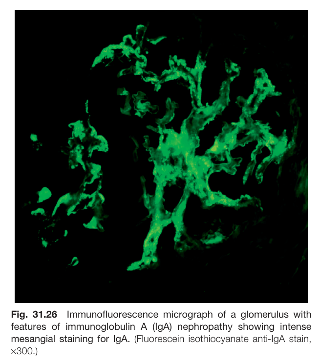

Fig. 31.26 Immunofluorescence micrograph of a glomerulus with features of immunoglobulin A (IgA) nephropathy showing intense mesangial staining for IgA. (Fluorescein isothiocyanate anti-IgA stain, ×300.) (Micrograph showing intense mesangial staining for IgA.)

---

### Fig_31_27

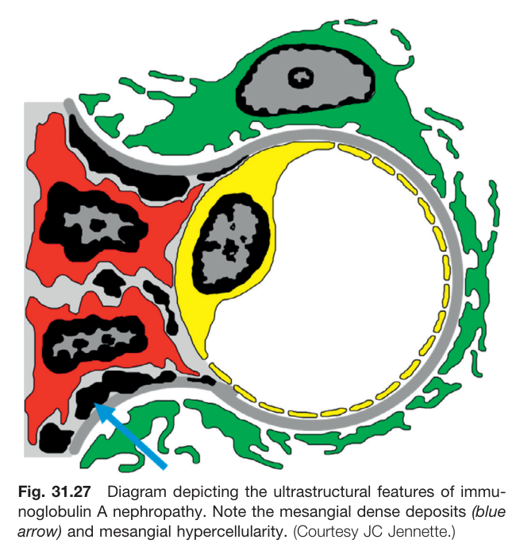

Fig. 31.27 Diagram depicting the ultrastructural features of immu noglobulin A nephropathy. Note the mesangial dense deposits (blue arrow) and mesangial hypercellularity. (Courtesy JC Jennette.) (Diagram showing mesangial dense deposits and hypercellularity.)

---

### Fig_31_28

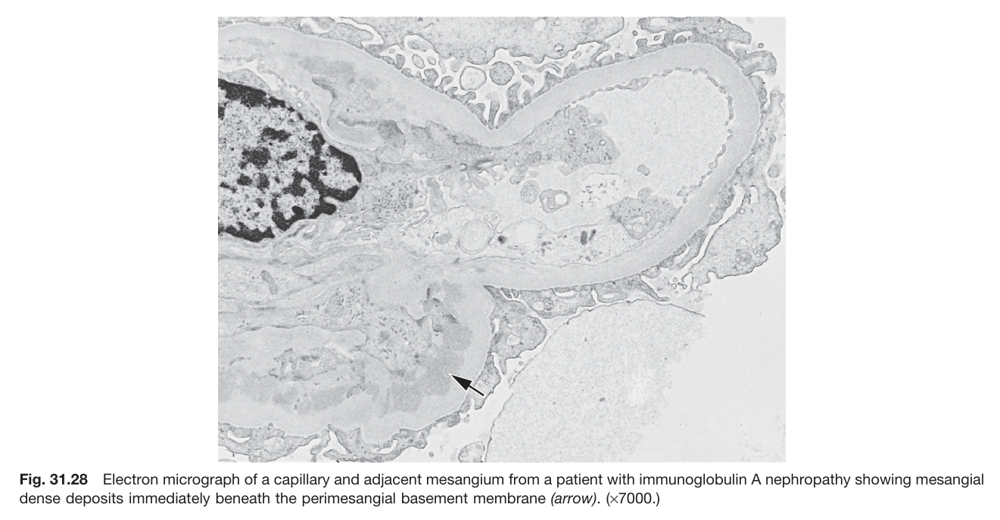

Fig. 31.28 Electron micrograph of a capillary and adjacent mesangium from a patient with immunoglobulin A nephropathy showing mesangial dense deposits immediately beneath the perimesangial basement membrane (arrow). (×7000.) (Electron micrograph showing mesangial dense deposits.)

---

### Fig_31_29

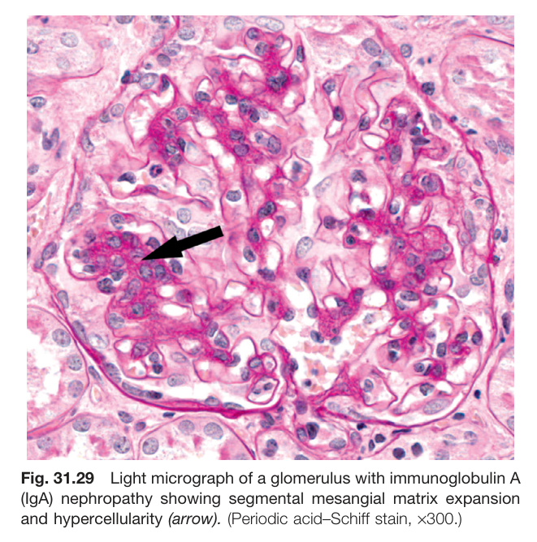

Fig. 31.29 Light micrograph of a glomerulus with immunoglobulin A (IgA) nephropathy showing segmental mesangial matrix expansion and hypercellularity (arrow). (Periodic acid–Schiff stain, ×300.) (Micrograph showing segmental mesangial matrix expansion.)

---

### Fig_31_30

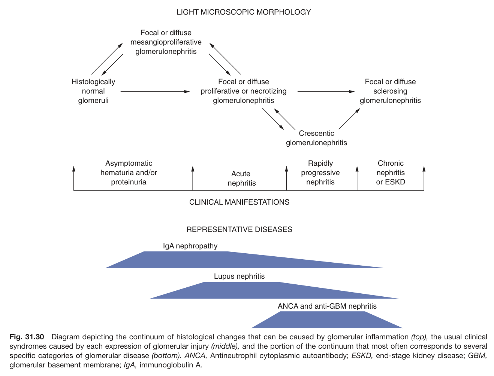

Fig. 31.30 Diagram depicting the continuum of histological changes that can be caused by glomerular inflammation (top), the usual clinical syndromes caused by each expression of glomerular injury (middle), and the portion of the continuum that most often corresponds to several specific categories of glomerular disease (bottom). ANCA, Antineutrophil cytoplasmic autoantibody; ESKD, end-stage kidney disease; GBM, glomerular basement membrane; IgA, immunoglobulin A. (Diagram showing continuum of histological changes in glomerular inflammation, clinical syndromes, and representative diseases.)

---

### Fig_31_31

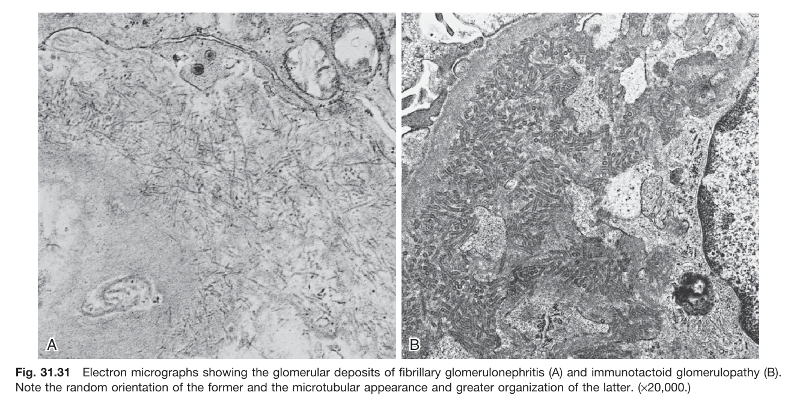

Fig. 31.31 Electron micrographs showing the glomerular deposits of fibrillary glomerulonephritis (A) and immunotactoid glomerulopathy (B). Note the random orientation of the former and the microtubular appearance and greater organization of the latter. (×20,000.) (Two-panel electron micrograph comparing fibrillary glomerulonephritis and immunotactoid glomerulopathy.)

---

### Fig_31_32

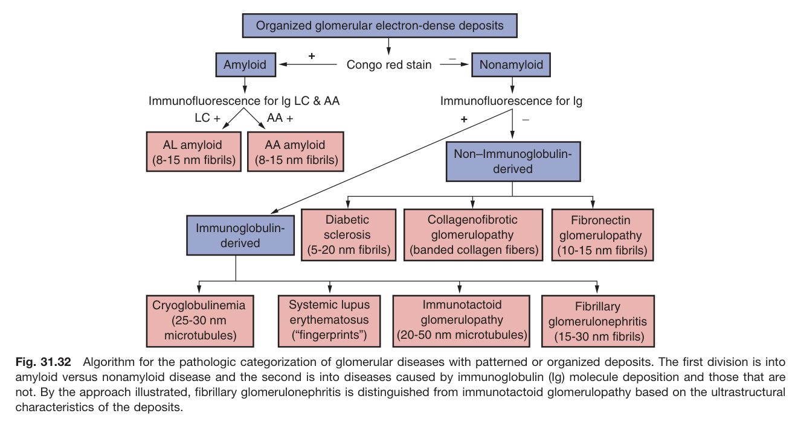

Fig. 31.32 Algorithm for the pathologic categorization of glomerular diseases with patterned or organized deposits. The first division is into amyloid versus nonamyloid disease and the second is into diseases caused by immunoglobulin (Ig) molecule deposition and those that are not. By the approach illustrated, fibrillary glomerulonephritis is distinguished from immunotactoid glomerulopathy based on the ultrastructural characteristics of the deposits. (Flowchart showing the categorization of glomerular diseases with organized deposits.)

---

### Fig_31_33

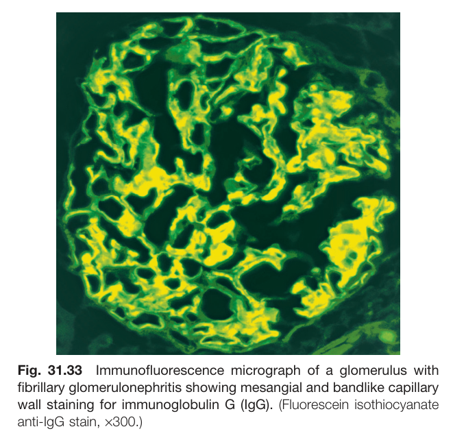

Fig. 31.33 Immunofluorescence micrograph of a glomerulus with fibrillary glomerulonephritis showing mesangial and bandlike capillary wall staining for immunoglobulin G (IgG). (Fluorescein isothiocyanate anti-IgG stain, ×300.) (Micrograph showing mesangial and capillary wall staining for IgG.)

---

### Fig_31_34

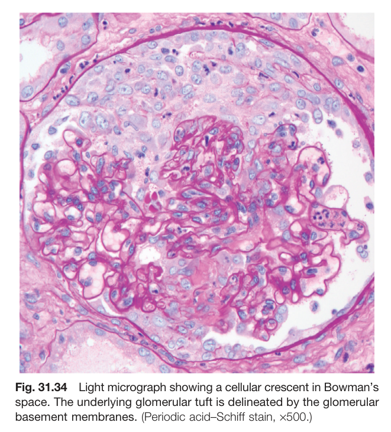

Fig. 31.34 Light micrograph showing a cellular crescent in Bowman’s space. The underlying glomerular tuft is delineated by the glomerular basement membranes. (Periodic acid–Schiff stain, ×500.) (Micrograph showing a cellular crescent in Bowman's space.)

---

### Fig_31_35

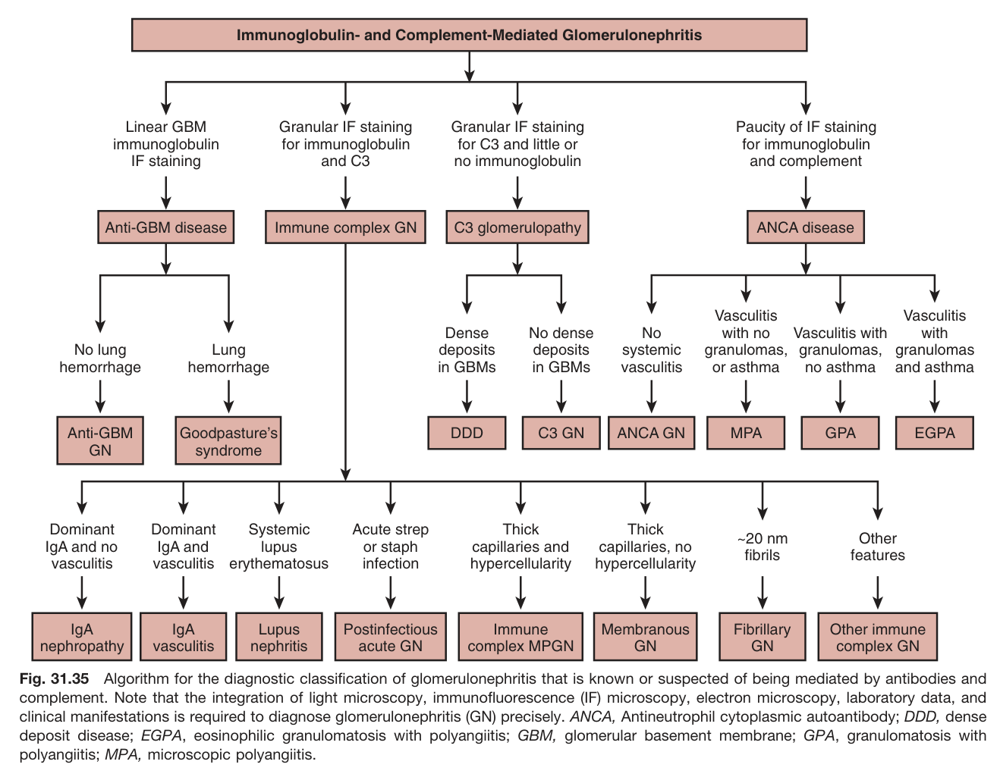

Fig. 31.35 Algorithm for the diagnostic classification of glomerulonephritis that is known or suspected of being mediated by antibodies and complement. Note that the integration of light microscopy, immunofluorescence (IF) microscopy, electron microscopy, laboratory data, and clinical manifestations is required to diagnose glomerulonephritis (GN) precisely. ANCA, Antineutrophil cytoplasmic autoantibody; DDD, dense deposit disease; EGPA, eosinophilic granulomatosis with polyangiitis; GBM, glomerular basement membrane; GPA, granulomatosis with polyangiitis; MPA, microscopic polyangiitis. (Flowchart for diagnostic classification of glomerulonephritis.)

---

### Fig_31_36

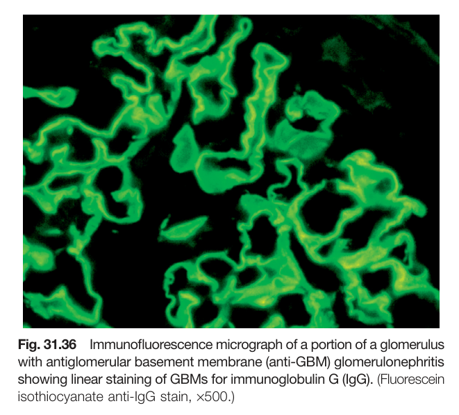

Fig. 31.36 Immunofluorescence micrograph of a portion of a glomerulus with antiglomerular basement membrane (anti-GBM) glomerulonephritis showing linear staining of GBMs for immunoglobulin G (IgG). (Fluorescein isothiocyanate anti-IgG stain, ×500.) (Micrograph showing linear staining of GBMs for IgG.)

---

### Fig_31_37

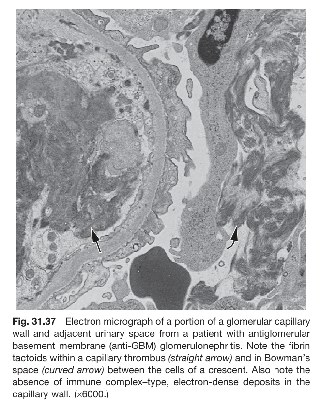

Fig. 31.37 Electron micrograph of a portion of a glomerular capillary wall and adjacent urinary space from a patient with antiglomerular basement membrane (anti-GBM) glomerulonephritis. Note the fibrin tactoids within a capillary thrombus (straight arrow) and in Bowman’s space (curved arrow) between the cells of a crescent. Also note the absence of immune complex–type, electron-dense deposits in the capillary wall. (×6000.) (Electron micrograph showing fibrin tactoids and absence of immune complex deposits.)

---

### Fig_31_38

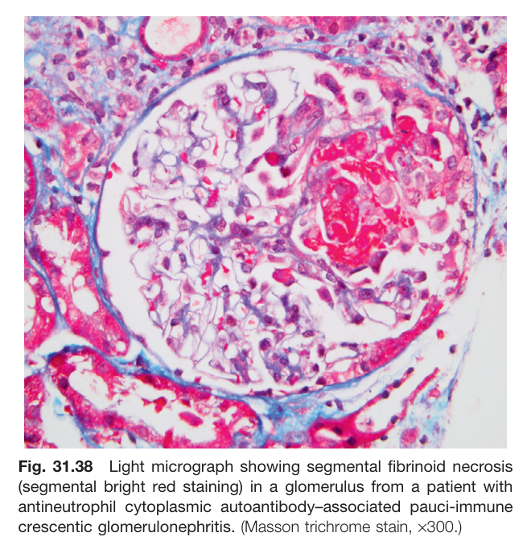

Fig. 31.38 Light micrograph showing segmental fibrinoid necrosis (segmental bright red staining) in a glomerulus from a patient with antineutrophil cytoplasmic autoantibody–associated pauci-immune crescentic glomerulonephritis. (Masson trichrome stain, ×300.) (Micrograph showing segmental fibrinoid necrosis in a glomerulus.)

---

## Tables

### Table_31_1

#### Table Image

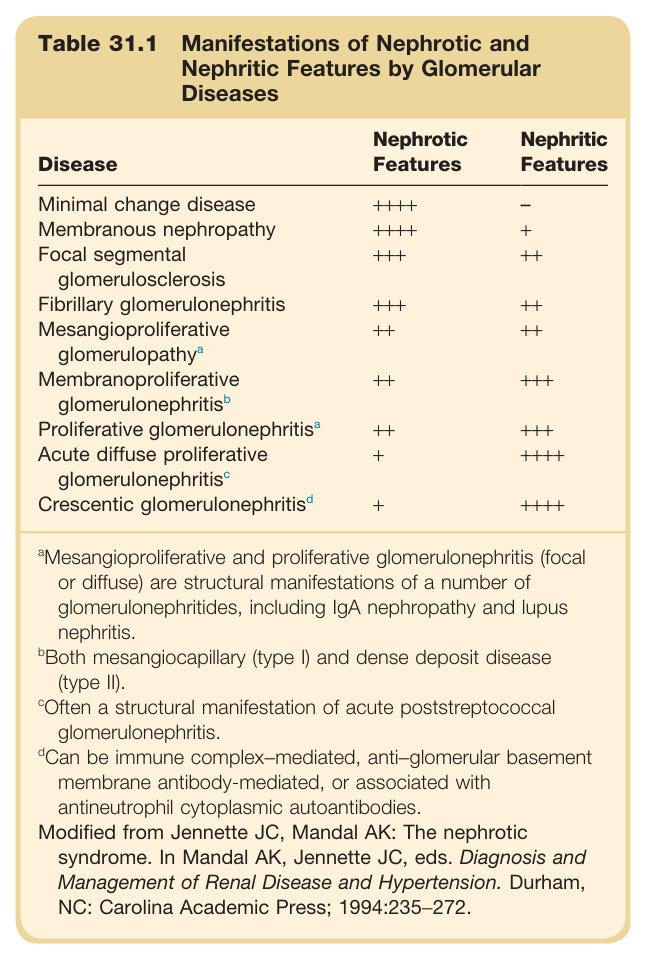

#### Table Data (CSV: [Table_31_1.csv](Table_31_1.csv))

```markdown
| Table Text (OCR) |
| :--- |
| Table 31.1 Manifestations of Nephrotic and Nephritic Features by Glomerular Diseases Disease  Nephrotic Features  Nephritic Features    Minimal change disease  ++++  -    Membranous nephropathy  ++++  +    Focal segmental glomerulosclerosis  +++  ++    Fibrillary glomerulonephritis  +++  ++    Mesangioproliferative glomerulopathya  ++  ++    Membranoproliferative glomerulonephritisb  ++  +++    Proliferative glomerulonephritisa  ++  +++    Acute diffuse proliferative glomerulonephritisc  +  ++++    Crescentic glomerulonephritisd  +  ++++ |
```

Table 31.1 Manifestations of Nephrotic and Nephritic Features by Glomerular Diseases | Disease | Nephrotic Features | Nephritic Features | | :---------------------------------------------- | :----------------- | :----------------- | | Minimal change disease | ++++ | – | | Membranous nephropathy | ++++ | + | | Focal segmental glomerulosclerosis | +++ | ++ | | Fibrillary glomerulonephritis | +++ | ++ | | Mesangioproliferative glomerulopathya | ++ | ++ | | Membranoproliferative glomerulonephritisb | ++ | +++ | | Proliferative glomerulonephritisa | ++ | +++ | | Acute diffuse proliferative glomerulonephritisc | + | ++++ | | Crescentic glomerulonephritisd | + | ++++ | aMesangioproliferative and proliferative glomerulonephritis (focal or diffuse) are structural manifestations of a number of glomerulonephritides, including IgA nephropathy and lupus nephritis. bBoth mesangiocapillary (type I) and dense deposit disease (type II). cOften a structural manifestation of acute poststreptococcal glomerulonephritis. dCan be immune complex−mediated, anti−glomerular basement membrane antibody-mediated, or associated with antineutrophil cytoplasmic autoantibodies. Modified from Jennette JC, Mandal AK: The nephrotic syndrome. In Mandal AK, Jennette JC, eds. Diagnosis and Management of Renal Disease and Hypertension. Durham, NC: Carolina Academic Press; 1994:235−272.

---

### Table_31_2

#### Table Image

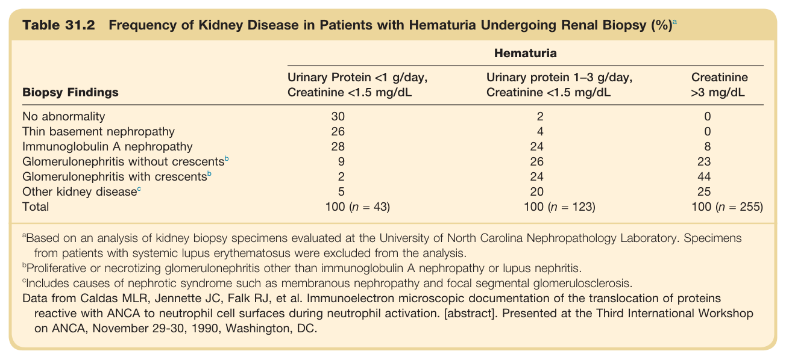

#### Table Data (CSV: [Table_31_2.csv](Table_31_2.csv))

```markdown
| Table Text (OCR) |
| :--- |
| Table 31.2 Frequency of Kidney Disease in Patients with Hematuria Undergoing Renal Biopsy (%)<sup>a</sup> Biopsy Findings  Hematuria    Urinary Protein <1 g/day, Creatinine <1.5 mg/dL  Urinary protein 1–3 g/day, Creatinine <1.5 mg/dL  Creatinine >3 mg/dL    No abnormality  30  2  0    Thin basement nephropathy  26  4  0    Immunoglobulin A nephropathy  28  24  8    Glomerulonephritis without  crescents^b   9  26  23    Glomerulonephritis with  crescents^b   2  24  44    Other kidney  disease^c   5  20  25    Total  100 (n = 43)  100 (n = 123)  100 (n = 255) <sup>a</sup>Based on an analysis of kidney biopsy specimens evaluated at the University of North Carolina Nephropathology Laboratory. Specimens from patients with systemic lupus erythematosus were excluded from the analysis. <sup>b</sup>Proliferative or necrotizing glomerulonephritis other than immunoglobulin A nephropathy or lupus nephritis. <sup>c</sup>Includes causes of nephrotic syndrome such as membranous nephropathy and focal segmental glomerulosclerosis. Data from Caldas MLR, Jennette JC, Falk RJ, et al. Immunoelectron microscopic documentation of the translocation of proteins reactive with ANCA to neutrophil cell surfaces during neutrophil activation. [abstract]. Presented at the Third International Workshop on ANCA, November 29-30, 1990, Washington, DC. |
```

Table 31.2 Frequency of Kidney Disease in Patients with Hematuria Undergoing Renal Biopsy (%)a | Biopsy Findings | Hematuria | | | | :----------------------------------------------------------- | :-------------------------------------------------- | :--------------------------------------------------- | :---------------------- | | | **Urinary Protein <1 g/day, Creatinine <1.5 mg/dL** | **Urinary protein 1−3 g/day, Creatinine <1.5 mg/dL** | **Creatinine >3 mg/dL** | | No abnormality | 30 | 2 | 0 | | Thin basement nephropathy | 26 | 4 | 0 | | Immunoglobulin A nephropathy | 28 | 24 | 8 | | Glomerulonephritis without crescentsb | 9 | 26 | 23 | | Glomerulonephritis with crescentsb | 2 | 24 | 44 | | Other kidney diseasec | 5 | 20 | 25 | | Total | 100 (n = 43) | 100 (n = 123) | 100 (n = 255) | | aBased on an analysis of kidney biopsy specimens evaluated at the University of North Carolina Nephropathology Laboratory. Specimens from patients with systemic lupus erythematosus were excluded from the analysis. | | | | | bProliferative or necrotizing glomerulonephritis other than immunoglobulin A nephropathy or lupus nephritis. | | | | | cIncludes causes of nephrotic syndrome such as membranous nephropathy and focal segmental glomerulosclerosis. | | | | | Data from Caldas MLR, Jennette JC, Falk RJ, et al. Immunoelectron microscopic documentation of the translocation of proteins reactive with ANCA to neutrophil cell surfaces during neutrophil activation. [abstract]. Presented at the Third International Workshop on ANCA, November 29-30, 1990, Washington, DC. | | | |

---

### Table_31_3

#### Table Image

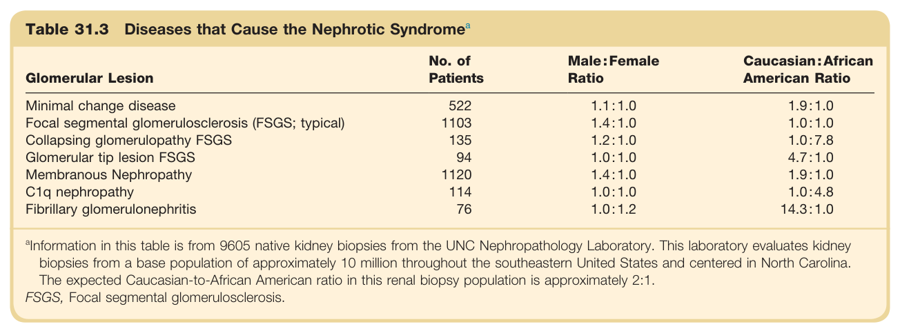

#### Table Data (CSV: [Table_31_3.csv](Table_31_3.csv))

```markdown
| Table Text (OCR) |
| :--- |
| Table 31.3 Diseases that Cause the Nephrotic Syndrome<sup>a</sup> Glomerular Lesion  No. of Patients  Male:Female Ratio  Caucasian:African American Ratio    Minimal change disease  522  1.1:1.0  1.9:1.0    Focal segmental glomerulosclerosis (FSGS; typical)  1103  1.4:1.0  1.0:1.0    Collapsing glomerulopathy FSGS  135  1.2:1.0  1.0:7.8    Glomerular tip lesion FSGS  94  1.0:1.0  4.7:1.0    Membranous Nephropathy  1120  1.4:1.0  1.9:1.0    C1q nephropathy  114  1.0:1.0  1.0:4.8    Fibrillary glomerulonephritis  76  1.0:1.2  14.3:1.0 |
```

Table 31.3 Diseases that Cause the Nephrotic Syndromea | Glomerular Lesion | No. of Patients | Male:Female Ratio | Caucasian:African American Ratio | | :------------------------------------------------- | :-------------- | :---------------- | :------------------------------- | | Minimal change disease | 522 | 1.1:1.0 | 1.9:1.0 | | Focal segmental glomerulosclerosis (FSGS; typical) | 1103 | 1.4:1.0 | 1.0:1.0 | | Collapsing glomerulopathy FSGS | 135 | 1.2:1.0 | 1.0:7.8 | | Glomerular tip lesion FSGS | 94 | 1.0:1.0 | 4.7:1.0 | | Membranous Nephropathy | 1120 | 1.4:1.0 | 1.9:1.0 | | C1q nephropathy | 114 | 1.0:1.0 | 1.0:4.8 | | Fibrillary glomerulonephritis | 76 | 1.0:1.2 | 14.3:1.0 | aInformation in this table is from 9605 native kidney biopsies from the UNC Nephropathology Laboratory. This laboratory evaluates kidney biopsies from a base population of approximately 10 million throughout the southeastern United States and centered in North Carolina. The expected Caucasian-to-African American ratio in this renal biopsy population is approximately 2:1. FSGS, Focal segmental glomerulosclerosis.

---

### Table_31_4

#### Table Image

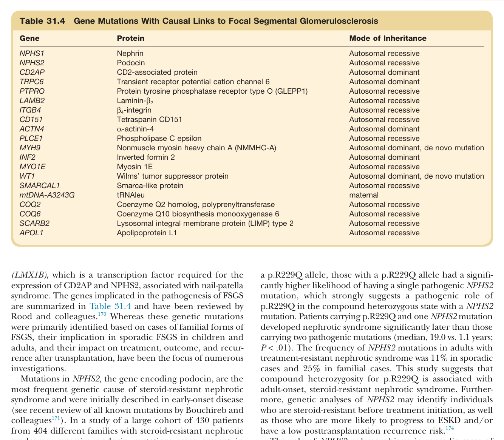

#### Table Data (CSV: [Table_31_4.csv](Table_31_4.csv))

```markdown
| Table Text (OCR) |
| :--- |
| Table 31.4 Gene Mutations With Causal Links to Focal Segmental Glomerulosclerosis Gene  Protein  Mode of Inheritance    NPHS1  Nephrin  Autosomal recessive    NPHS2  Podocin  Autosomal recessive    CD2AP  CD2-associated protein  Autosomal dominant    TRPC6  Transient receptor potential cation channel 6  Autosomal dominant    PTPRO  Protein tyrosine phosphatase receptor type O (GLEPP1)  Autosomal recessive    LAMB2  Laminin- \beta_{2}   Autosomal recessive    ITGB4   \beta_{4} -integrin  Autosomal recessive    CD151  Tetraspanin CD151  Autosomal recessive    ACTN4   \alpha -actinin-4  Autosomal dominant    PLCE1  Phospholipase C epsilon  Autosomal recessive    MYH9  Nonmuscle myosin heavy chain A (NMMHC-A)  Autosomal dominant, de novo mutation    INF2  Inverted formin 2  Autosomal dominant    MYO1E  Myosin 1E  Autosomal recessive    WT1  Wilms' tumor suppressor protein  Autosomal dominant, de novo mutation    SMARCAL1  Smarca-like protein  Autosomal recessive    mtDNA-A3243G  tRNAleu  maternal    COQ2  Coenzyme Q2 homolog, polyprenyltransferase  Autosomal recessive    COQ6  Coenzyme Q10 biosynthesis monooxygenase 6  Autosomal recessive    SCARB2  Lysosomal integral membrane protein (LIMP) type 2  Autosomal recessive    APOL1  Apolipoprotein L1  Autosomal recessive |
```

Table 31.4 Gene Mutations With Causal Links to Focal Segmental Glomerulosclerosis | Gene | Protein | Mode of Inheritance | | :-------------------------- | :---------------------------------------------------- | :----------------------------------- | | NPHS1 | Nephrin | Autosomal recessive | | NPHS2 | Podocin | Autosomal recessive | | CD2AP | CD2-associated protein | Autosomal dominant | | TRPC6 | Transient receptor potential cation channel 6 | Autosomal dominant | | PTPRO | Protein tyrosine phosphatase receptor type O (GLEPP1) | Autosomal recessive | | LAMB2 | Laminin-β2 | Autosomal recessive | | ITGB4 | β4-integrin | Autosomal recessive | | CD151 | Tetraspanin CD151 | Autosomal recessive | | ACTN4 | α-actinin-4 | Autosomal dominant | | PLCE1 | Phospholipase C epsilon | Autosomal recessive | | MYH9 | Nonmuscle myosin heavy chain A (NMMHC-A) | Autosomal dominant, de novo mutation | | INF2 | Inverted formin 2 | Autosomal dominant | | MYO1E | Myosin 1E | Autosomal recessive | | WT1 | Wilms’ tumor suppressor protein | Autosomal dominant, de novo mutation | | SMARCAL1 | Smarca-like protein | Autosomal recessive | | mtDNA-A3243G | tRNAleu | maternal | | COQ2 | Coenzyme Q2 homolog, polyprenyltransferase | Autosomal recessive | | COQ6 | Coenzyme Q10 biosynthesis monooxygenase 6 | Autosomal recessive | | SCARB2 | Lysosomal integral membrane protein (LIMP) type 2 | Autosomal recessive | | APOL1 | Apolipoprotein L1 | Autosomal recessive |

---

### Table_31_5

#### Table Image

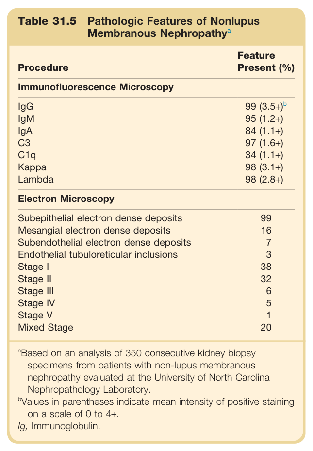

#### Table Data (CSV: [Table_31_5.csv](Table_31_5.csv))

```markdown
| Table Text (OCR) |
| :--- |
| Table 31.5 Pathologic Features of Nonlupus Membranous Nephropathy<sup>a</sup> Procedure  Feature Present (%)    Immunofluorescence Microscopy    IgG  99 (3.5+)b    IgM  95 (1.2+)    IgA  84 (1.1+)    C3  97 (1.6+)    C1q  34 (1.1+)    Kappa  98 (3.1+)    Lambda  98 (2.8+)    Electron Microscopy    Subepithelial electron dense deposits  99    Mesangial electron dense deposits  16    Subendothelial electron dense deposits  7    Endothelial tubuloreticular inclusions  3    Stage I  38    Stage II  32    Stage III  6    Stage IV  5    Stage V  1    Mixed Stage  20    aBased on an analysis of 350 consecutive kidney biopsy specimens from patients with non-lupus membranous nephropathy evaluated at the University of North Carolina Nephropathology Laboratory. bValues in parentheses indicate mean intensity of positive staining on a scale of 0 to 4+. lg, Immunoglobulin. |
```

Table 31.5 Pathologic Features of Nonlupus Membranous Nephropathya | Procedure | Feature Present (%) | | :------------------------------------- | :------------------ | | **Immunofluorescence Microscopy** | | | IgG | 99 (3.5+)b | | IgM | 95 (1.2+) | | IgA | 84 (1.1+) | | C3 | 97 (1.6+) | | C1q | 34 (1.1+) | | Kappa | 98 (3.1+) | | Lambda | 98 (2.8+) | | **Electron Microscopy** | | | Subepithelial electron dense deposits | 99 | | Mesangial electron dense deposits | 16 | | Subendothelial electron dense deposits | 7 | | Endothelial tubuloreticular inclusions | 3 | | Stage I | 38 | | Stage II | 32 | | Stage III | 6 | | Stage IV | 5 | | Stage V | 1 | | Mixed Stage | 20 | aBased on an analysis of 350 consecutive kidney biopsy specimens from patients with non-lupus membranous nephropathy evaluated at the University of North Carolina Nephropathology Laboratory. bValues in parentheses indicate mean intensity of positive staining on a scale of 0 to 4+. Ig, Immunoglobulin.

---

### Table_31_6

#### Table Image

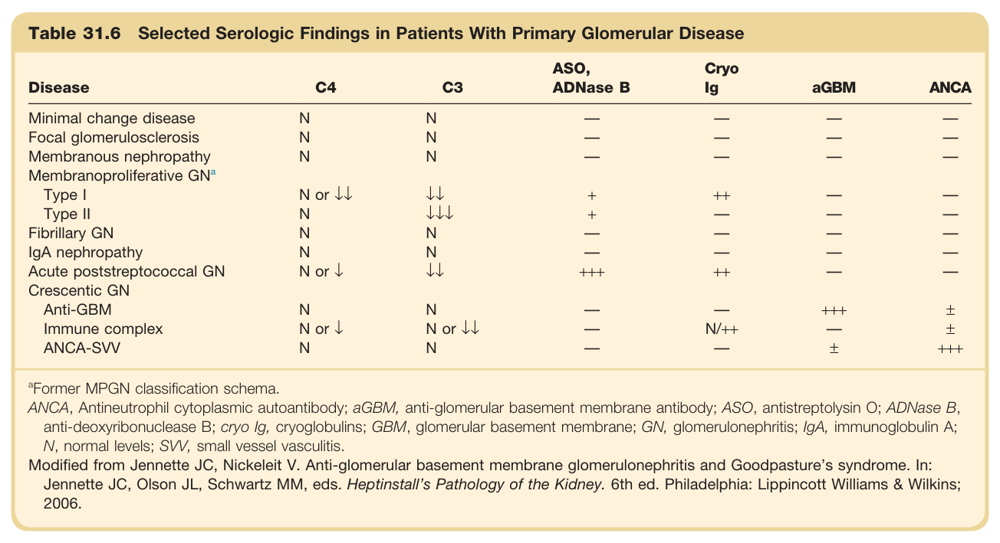

#### Table Data (CSV: [Table_31_6.csv](Table_31_6.csv))

```markdown
| Table Text (OCR) |
| :--- |
| Table 31.6 Selected Serologic Findings in Patients With Primary Glomerular Disease Disease  C4  C3  ASO,ADNase B  CryoIg  aGBM  ANCA    Minimal change disease  N  N  —  —  —  —    Focal glomerulosclerosis  N  N  —  —  —  —    Membranous nephropathy  N  N  —  —  —  —    Membranoproliferative  GN^a                 Type I  N or ↓↓  ↓↓  +  ++  —  —    Type II  N  ↓↓↓  +  —  —  —    Fibrillary GN  N  N  —  —  —  —    IgA nephropathy  N  N  —  —  —  —    Acute poststreptococcal GN  N or ↓  ↓↓  +++  ++  —  —    Crescentic GN                Anti-GBM  N  N  —  —  +++  ±    Immune complex  N or ↓  N or ↓↓  —  N/++  —  ±    ANCA-SVV  N  N  —  —  ±  +++ <sup>a</sup>Former MPGN classification schema. ANCA, Antineutrophil cytoplasmic autoantibody; aGBM, anti-glomerular basement membrane antibody; ASO, antistreptolysin O; ADNase B, anti-deoxyribonuclease B; cryo Ig, cryoglobulins; GBM, glomerular basement membrane; GN, glomerulonephritis; IgA, immunoglobulin A; N, normal levels; SVV, small vessel vasculitis. Modified from Jennette JC, Nickeleit V. Anti-glomerular basement membrane glomerulonephritis and Goodpasture’s syndrome. In: Jennette JC, Olson JL, Schwartz MM, eds. Heptinstall’s Pathology of the Kidney. 6th ed. Philadelphia: Lippincott Williams & Wilkins; 2006. |
```

Table 31.6 Selected Serologic Findings in Patients With Primary Glomerular Disease | Disease | C4 | C3 | ASO, ADNase B | Cryo Ig | aGBM | ANCA | | :------------------------- | :------ | :------ | :------------ | :------ | :--- | :--- | | Minimal change disease | N | N | — | — | — | — | | Focal glomerulosclerosis | N | N | — | — | — | — | | Membranous nephropathy | N | N | — | — | — | — | | Membranoproliferative GNa | | | | | | | | Type I | N or ↓↓ | ↓↓ | + | ++ | — | — | | Type II | N | ↓↓↓ | + | — | — | — | | Fibrillary GN | N | N | — | — | — | — | | IgA nephropathy | N | N | — | — | — | — | | Acute poststreptococcal GN | N or ↓ | ↓↓ | +++ | ++ | — | — | | Crescentic GN | | | | | | | | Anti-GBM | N | N | — | — | +++ | ± | | Immune complex | N or ↓ | N or ↓↓ | — | N/++ | — | ± | | ANCA-SVV | N | N | — | — | ± | +++ | aFormer MPGN classification schema. ANCA, Antineutrophil cytoplasmic autoantibody; aGBM, anti-glomerular basement membrane antibody; ASO, antistreptolysin O; ADNase B, anti-deoxyribonuclease B; cryo Ig, cryoglobulins; GBM, glomerular basement membrane; GN, glomerulonephritis; IgA, immunoglobulin A; N, normal levels; SVV, small vessel vasculitis. Modified from Jennette JC, Nickeleit V. Anti-glomerular basement membrane glomerulonephritis and Goodpasture’s syndrome. In: Jennette JC, Olson JL, Schwartz MM, eds. Heptinstall’s Pathology of the Kidney. 6th ed. Philadelphia: Lippincott Williams & Wilkins; 2006.

---

### Table_31_7

#### Table Image

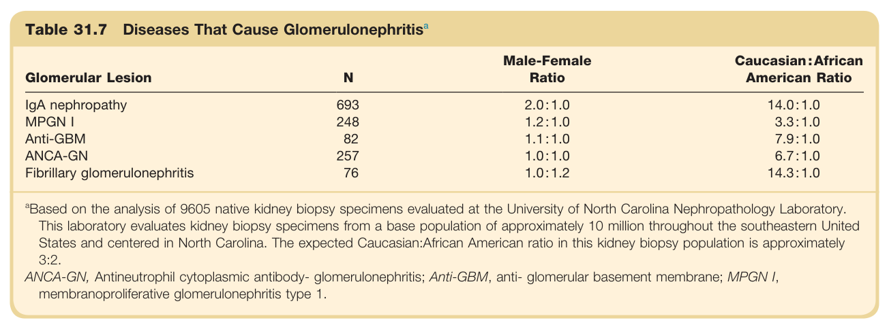

#### Table Data (CSV: [Table_31_7.csv](Table_31_7.csv))

```markdown
| Table Text (OCR) |
| :--- |
| Table 31.7 Diseases That Cause Glomerulonephritis<sup>a</sup> Glomerular Lesion  N  Male-Female Ratio  Caucasian: African American Ratio    IgA nephropathy  693  2.0:1.0  14.0:1.0    MPGN I  248  1.2:1.0  3.3:1.0    Anti-GBM  82  1.1:1.0  7.9:1.0    ANCA-GN  257  1.0:1.0  6.7:1.0    Fibrillary glomerulonephritis  76  1.0:1.2  14.3:1.0 <sup>a</sup>Based on the analysis of 9605 native kidney biopsy specimens evaluated at the University of North Carolina Nephropathology Laboratory. This laboratory evaluates kidney biopsy specimens from a base population of approximately 10 million throughout the southeastern United States and centered in North Carolina. The expected Caucasian:African American ratio in this kidney biopsy population is approximately 3:2. ANCA-GN, Antineutrophil cytoplasmic antibody- glomerulonephritis; Anti-GBM, anti- glomerular basement membrane; MPGN I, membranoproliferative glomerulonephritis type 1. |
```

Table 31.7 Diseases That Cause Glomerulonephritisa | Glomerular Lesion | N | Male-Female Ratio | Caucasian:African American Ratio | | :---------------------------- | :--- | :---------------- | :------------------------------- | | IgA nephropathy | 693 | 2.0:1.0 | 14.0:1.0 | | MPGN I | 248 | 1.2:1.0 | 3.3:1.0 | | Anti-GBM | 82 | 1.1:1.0 | 7.9:1.0 | | ANCA-GN | 257 | 1.0:1.0 | 6.7:1.0 | | Fibrillary glomerulonephritis | 76 | 1.0:1.2 | 14.3:1.0 | aBased on the analysis of 9605 native kidney biopsy specimens evaluated at the University of North Carolina Nephropathology Laboratory. This laboratory evaluates kidney biopsy specimens from a base population of approximately 10 million throughout the southeastern United States and centered in North Carolina. The expected Caucasian:African American ratio in this kidney biopsy population is approximately 3:2. ANCA-GN, Antineutrophil cytoplasmic antibody- glomerulonephritis; Anti-GBM, anti- glomerular basement membrane; MPGN I, membranoproliferative glomerulonephritis type 1.

---

### Table_31_8

#### Table Image

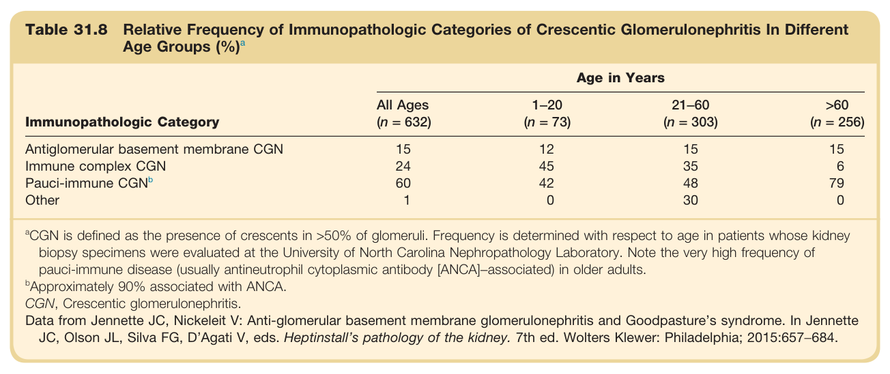

#### Table Data (CSV: [Table_31_8.csv](Table_31_8.csv))

```markdown
| Table Text (OCR) |
| :--- |
| Table 31.8 Relative Frequency of Immunopathologic Categories of Crescentic Glomerulonephritis In Different Age Groups (%)<sup>a</sup> Immunopathologic Category  Age in Years    All Ages(n = 632)  1–20(n = 73)  21–60(n = 303)  >60(n = 256)    Antiglomerular basement membrane CGN  15  12  15  15    Immune complex CGN  24  45  35  6    Pauci-immune CGNb  60  42  48  79    Other  1  0  30  0 <sup>a</sup>CGN is defined as the presence of crescents in >50% of glomeruli. Frequency is determined with respect to age in patients whose kidney biopsy specimens were evaluated at the University of North Carolina Nephropathology Laboratory. Note the very high frequency of pauci-immune disease (usually antineutrophil cytoplasmic antibody [ANCA]−associated) in older adults. <sup>b</sup>Approximately 90% associated with ANCA. CGN, Crescentic glomerulonephritis. Data from Jennette JC, Nickeleit V: Anti-glomerular basement membrane glomerulonephritis and Goodpasture’s syndrome. In Jennette JC, Olson JL, Silva FG, D’Agati V, eds. Heptinstall’s pathology of the kidney. 7th ed. Wolters Klewer: Philadelphia; 2015:657−684. |
```

Table 31.8 Relative Frequency of Immunopathologic Categories of Crescentic Glomerulonephritis In Different Age Groups (%)a | Immunopathologic Category | All Ages (n = 632) | 1−20 (n = 73) | 21−60 (n = 303) | >60 (n = 256) | | :----------------------------------- | :----------------- | :------------ | :-------------- | :------------ | | Antiglomerular basement membrane CGN | 15 | 12 | 15 | 15 | | Immune complex CGN | 24 | 45 | 35 | 6 | | Pauci-immune CGNb | 60 | 42 | 48 | 79 | | Other | 1 | 0 | 30 | 0 | aCGN is defined as the presence of crescents in >50% of glomeruli. Frequency is determined with respect to age in patients whose kidney biopsy specimens were evaluated at the University of North Carolina Nephropathology Laboratory. Note the very high frequency of pauci-immune disease (usually antineutrophil cytoplasmic antibody [ANCA]−associated) in older adults. bApproximately 90% associated with ANCA. CGN, Crescentic glomerulonephritis. Data from Jennette JC, Nickeleit V: Anti-glomerular basement membrane glomerulonephritis and Goodpasture’s syndrome. In Jennette JC, Olson JL, Silva FG, D’Agati V, eds. Heptinstall’s pathology of the kidney. 7th ed. Wolters Klewer: Philadelphia; 2015:657−684.

---

### Table_31_9

#### Table Image

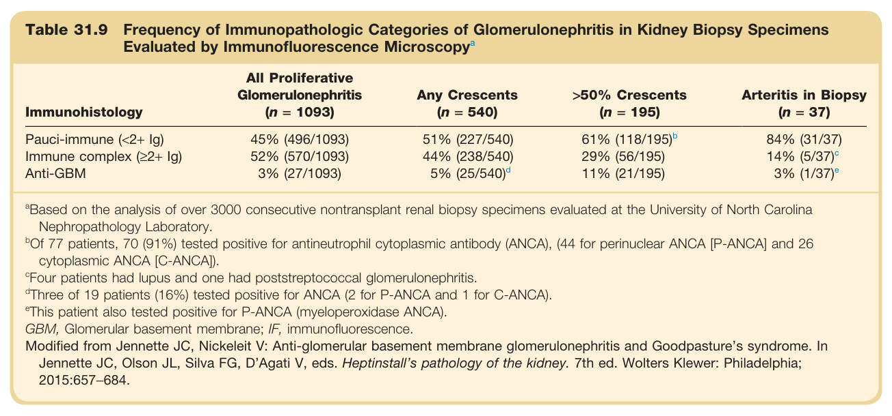

#### Table Data (CSV: [Table_31_9.csv](Table_31_9.csv))

```markdown
| Table Text (OCR) |
| :--- |
| Table 31.9 Frequency of Immunopathologic Categories of Glomerulonephritis in Kidney Biopsy Specimens Evaluated by Immunofluorescence Microscopy<sup>a</sup> Immunohistology  All Proliferative Glomerulonephritis (n = 1093)  Any Crescents (n = 540)  >50% Crescents (n = 195)  Arteritis in Biopsy (n = 37)    Pauci-immune (<2+ lg)  45% (496/1093)  51% (227/540)  61% (118/195)b  84% (31/37)    Immune complex (≥2+ lg)  52% (570/1093)  44% (238/540)  29% (56/195)  14% (5/37)c    Anti-GBM  3% (27/1093)  5% (25/540)d  11% (21/195)  3% (1/37)e <sup>a</sup>Based on the analysis of over 3000 consecutive nontransplant renal biopsy specimens evaluated at the University of North Carolina Nephropathology Laboratory. <sup>b</sup>Of 77 patients, 70 (91%) tested positive for antineutrophil cytoplasmic antibody (ANCA), (44 for perinuclear ANCA [P-ANCA] and 26 cytoplasmic ANCA [C-ANCA]). <sup>c</sup>Four patients had lupus and one had poststreptococcal glomerulonephritis. <sup>d</sup>Three of 19 patients (16%) tested positive for ANCA (2 for P-ANCA and 1 for C-ANCA). <sup>e</sup>This patient also tested positive for P-ANCA (myeloperoxidase ANCA). GBM, Glomerular basement membrane; IF, immunofluorescence. Modified from Jennette JC, Nickeleit V: Anti-glomerular basement membrane glomerulonephritis and Goodpasture’s syndrome. In Jennette JC, Olson JL, Silva FG, D’Agati V, eds. Heptinstall’s pathology of the kidney. 7th ed. Wolters Klewer: Philadelphia; 2015:657−684. |
```

Table 31.9 Frequency of Immunopathologic Categories of Glomerulonephritis in Kidney Biopsy Specimens Evaluated by Immunofluorescence Microscopya | Immunohistology | All Proliferative Glomerulonephritis (n = 1093) | Any Crescents (n = 540) | >50% Crescents (n = 195) | Arteritis in Biopsy (n = 37) | | :---------------------- | :---------------------------------------------- | :---------------------- | :----------------------- | :--------------------------- | | Pauci-immune (<2+ Ig) | 45% (496/1093) | 51% (227/540) | 61% (118/195)b | 84% (31/37) | | Immune complex (≥2+ Ig) | 52% (570/1093) | 44% (238/540) | 29% (56/195) | 14% (5/37)c | | Anti-GBM | 3% (27/1093) | 5% (25/540)d | 11% (21/195) | 3% (1/37)e | aBased on the analysis of over 3000 consecutive nontransplant renal biopsy specimens evaluated at the University of North Carolina Nephropathology Laboratory. bOf 77 patients, 70 (91%) tested positive for antineutrophil cytoplasmic antibody (ANCA), (44 for perinuclear ANCA [P-ANCA] and 26 cytoplasmic ANCA [C-ANCA]). cFour patients had lupus and one had poststreptococcal glomerulonephritis. dThree of 19 patients (16%) tested positive for ANCA (2 for P-ANCA and 1 for C-ANCA). eThis patient also tested positive for P-ANCA (myeloperoxidase ANCA). GBM, Glomerular basement membrane; IF, immunofluorescence. Modified from Jennette JC, Nickeleit V: Anti-glomerular basement membrane glomerulonephritis and Goodpasture’s syndrome. In Jennette JC, Olson JL, Silva FG, D’Agati V, eds. Heptinstall’s pathology of the kidney. 7th ed. Wolters Klewer: Philadelphia; 2015:657−684.

---

### Table_31_10

#### Table Image

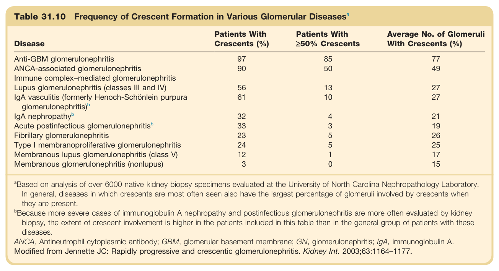

#### Table Data (CSV: [Table_31_10.csv](Table_31_10.csv))

```markdown
| Table Text (OCR) |
| :--- |
| Table 31.10 Frequency of Crescent Formation in Various Glomerular Diseases<sup>a</sup> Disease  Patients With Crescents (%)  Patients With ≥50% Crescents  Average No. of Glomeruli With Crescents (%)    Anti-GBM glomerulonephritis  97  85  77    ANCA-associated glomerulonephritis  90  50  49    Immune complex-mediated glomerulonephritis          Lupus glomerulonephritis (classes III and IV)  56  13  27    IgA vasculitis (formerly Henoch-Schönlein purpura glomerulonephritis) ^b   61  10  27    IgA nephropathy ^b   32  4  21    Acute postinfectious glomerulonephritis ^b   33  3  19    Fibrillary glomerulonephritis  23  5  26    Type I membranoproliferative glomerulonephritis  24  5  25    Membranous lupus glomerulonephritis (class V)  12  1  17    Membranous glomerulonephritis (nonlupus)  3  0  15 <sup>a</sup>Based on analysis of over 6000 native kidney biopsy specimens evaluated at the University of North Carolina Nephropathology Laboratory. In general, diseases in which crescents are most often seen also have the largest percentage of glomeruli involved by crescents when they are present. <sup>b</sup>Because more severe cases of immunoglobulin A nephropathy and postinfectious glomerulonephritis are more often evaluated by kidney biopsy, the extent of crescent involvement is higher in the patients included in this table than in the general group of patients with these diseases. ANCA, Antineutrophil cytoplasmic antibody; GBM, glomerular basement membrane; GN, glomerulonephritis; IgA, immunoglobulin A. Modified from Jennette JC: Rapidly progressive and crescentic glomerulonephritis. Kidney Int. 2003;63:1164–1177. |
```

Table 31.10 Frequency of Crescent Formation in Various Glomerular Diseasesa | Disease | Patients With Crescents (%) | Patients With ≥50% Crescents | Average No. of Glomeruli With Crescents (%) | | :----------------------------------------------------------- | :-------------------------- | :--------------------------- | :------------------------------------------ | | Anti-GBM glomerulonephritis | 97 | 85 | 77 | | ANCA-associated glomerulonephritis | 90 | 50 | 49 | | Immune complex−mediated glomerulonephritis | | | | | Lupus glomerulonephritis (classes III and IV) | 56 | 13 | 27 | | IgA vasculitis (formerly Henoch-Schönlein purpura glomerulonephritis)b | 61 | 10 | 27 | | IgA nephropathyb | 32 | 4 | 21 | | Acute postinfectious glomerulonephritisb | 33 | 3 | 19 | | Fibrillary glomerulonephritis | 23 | 5 | 26 | | Type I membranoproliferative glomerulonephritis | 24 | 5 | 25 | | Membranous lupus glomerulonephritis (class V) | 12 | 1 | 17 | | Membranous glomerulonephritis (nonlupus) | 3 | 0 | 15 | aBased on analysis of over 6000 native kidney biopsy specimens evaluated at the University of North Carolina Nephropathology Laboratory. In general, diseases in which crescents are most often seen also have the largest percentage of glomeruli involved by crescents when they are present. bBecause more severe cases of immunoglobulin A nephropathy and postinfectious glomerulonephritis are more often evaluated by kidney biopsy, the extent of crescent involvement is higher in the patients included in this table than in the general group of patients with these diseases. ANCA, Antineutrophil cytoplasmic antibody; GBM, glomerular basement membrane; GN, glomerulonephritis; IgA, immunoglobulin A. Modified from Jennette JC: Rapidly progressive and crescentic glomerulonephritis. Kidney Int. 2003;63:1164–1177.

---

## Boxes

### Box_31_1

#### Box Images (2 Parts)

- **Part 1 (Page 5)**:
  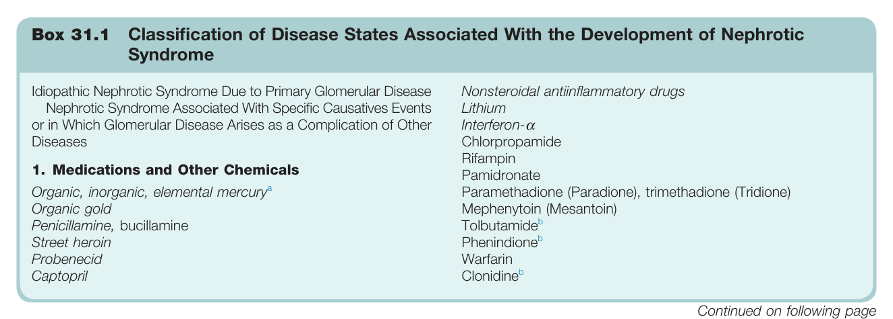

- **Part 2 (Page 6)**:
  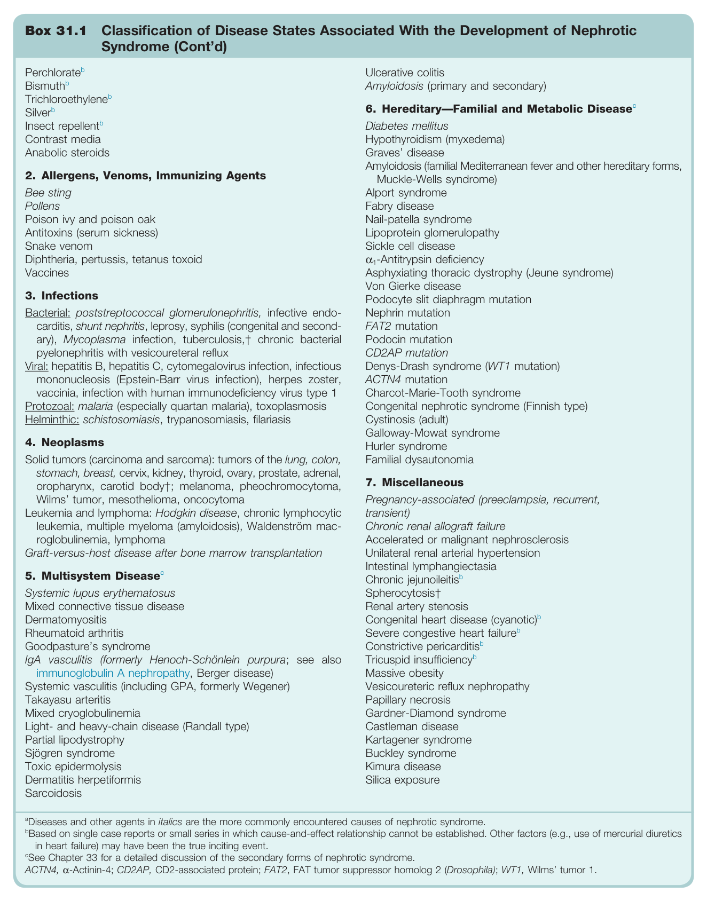

#### Box Text

```markdown
Box 31.1 Classification of Disease States Associated With the Development of Nephrotic Syndrome Idiopathic Nephrotic Syndrome Due to Primary Glomerular Disease Nephrotic Syndrome Associated With Specific Causatives Events or in Which Glomerular Disease Arises as a Complication of Other Diseases **1. Medications and Other Chemicals** * Organic, inorganic, elemental mercurya * Organic gold * Penicillamine, bucillamine * Street heroin * Probenecid * Captopril * Nonsteroidal antiinflammatory drugs * Lithium * Interferon-α * Chlorpropamide * Rifampin * Pamidronate * Paramethadione (Paradione), trimethadione (Tridione) * Mephenytoin (Mesantoin) * Tolbutamideb * Phenindioneb * Warfarin * Clonidineb * Perchlorateb * Bismuthb * Trichloroethyleneb * Silverb * Insect repellentb * Contrast media * Anabolic steroids **2. Allergens, Venoms, Immunizing Agents** * Bee sting * Pollens * Poison ivy and poison oak * Antitoxins (serum sickness) * Snake venom * Diphtheria, pertussis, tetanus toxoid * Vaccines **3. Infections** * Bacterial: poststreptococcal glomerulonephritis, infective endocarditis, shunt nephritis, leprosy, syphilis (congenital and secondary), Mycoplasma infection, tuberculosis,† chronic bacterial pyelonephritis with vesicoureteral reflux * Viral: hepatitis B, hepatitis C, cytomegalovirus infection, infectious mononucleosis (Epstein-Barr virus infection), herpes zoster, vaccinia, infection with human immunodeficiency virus type 1 * Protozoal: malaria (especially quartan malaria), toxoplasmosis * Helminthic: schistosomiasis, trypanosomiasis, filariasis **4. Neoplasms** * Solid tumors (carcinoma and sarcoma): tumors of the lung, colon, stomach, breast, cervix, kidney, thyroid, ovary, prostate, adrenal, oropharynx, carotid body†; melanoma, pheochromocytoma, Wilms’ tumor, mesothelioma, oncocytoma * Leukemia and lymphoma: Hodgkin disease, chronic lymphocytic leukemia, multiple myeloma (amyloidosis), Waldenström macroglobulinemia, lymphoma * Graft-versus-host disease after bone marrow transplantation **5. Multisystem Diseasec** * Systemic lupus erythematosus * Mixed connective tissue disease * Dermatomyositis * Rheumatoid arthritis * Goodpasture’s syndrome * IgA vasculitis (formerly Henoch-Schönlein purpura; see also immunoglobulin A nephropathy, Berger disease) * Systemic vasculitis (including GPA, formerly Wegener) * Takayasu arteritis * Mixed cryoglobulinemia * Light- and heavy-chain disease (Randall type) * Partial lipodystrophy * Sjögren syndrome * Toxic epidermolysis * Dermatitis herpetiformis * Sarcoidosis * Ulcerative colitis * Amyloidosis (primary and secondary) **6. Hereditary—Familial and Metabolic Diseasec** * Diabetes mellitus * Hypothyroidism (myxedema) * Graves’ disease * Amyloidosis (familial Mediterranean fever and other hereditary forms, Muckle-Wells syndrome) * Alport syndrome * Fabry disease * Nail-patella syndrome * Lipoprotein glomerulopathy * Sickle cell disease * α1-Antitrypsin deficiency * Asphyxiating thoracic dystrophy (Jeune syndrome) * Von Gierke disease * Podocyte slit diaphragm mutation * Nephrin mutation * FAT2 mutation * Podocin mutation * CD2AP mutation * Denys-Drash syndrome (WT1 mutation) * ACTN4 mutation * Charcot-Marie-Tooth syndrome * Congenital nephrotic syndrome (Finnish type) * Cystinosis (adult) * Galloway-Mowat syndrome * Hurler syndrome * Familial dysautonomia **7. Miscellaneous** * Pregnancy-associated (preeclampsia, recurrent, transient) * Chronic renal allograft failure * Accelerated or malignant nephrosclerosis * Unilateral renal arterial hypertension * Intestinal lymphangiectasia * Chronic jejunoileitisb * Spherocytosis† * Renal artery stenosis * Congenital heart disease (cyanotic)b * Severe congestive heart failureb * Constrictive pericarditisb * Tricuspid insufficiencyb * Massive obesity * Vesicoureteric reflux nephropathy * Papillary necrosis * Gardner-Diamond syndrome * Castleman disease * Kartagener syndrome * Buckley syndrome * Kimura disease * Silica exposure aDiseases and other agents in italics are the more commonly encountered causes of nephrotic syndrome. bBased on single case reports or small series in which cause-and-effect relationship cannot be established. Other factors (e.g., use of mercurial diuretics in heart failure) may have been the true inciting event. cSee Chapter 33 for a detailed discussion of the secondary forms of nephrotic syndrome. ACTN4, α-Actinin-4; CD2AP, CD2-associated protein; FAT2, FAT tumor suppressor homolog 2 (Drosophila); WT1, Wilms’ tumor 1.
```

Box 31.1 Classification of Disease States Associated With the Development of Nephrotic Syndrome Idiopathic Nephrotic Syndrome Due to Primary Glomerular Disease Nephrotic Syndrome Associated With Specific Causatives Events or in Which Glomerular Disease Arises as a Complication of Other Diseases **1. Medications and Other Chemicals** * Organic, inorganic, elemental mercurya * Organic gold * Penicillamine, bucillamine * Street heroin * Probenecid * Captopril * Nonsteroidal antiinflammatory drugs * Lithium * Interferon-α * Chlorpropamide * Rifampin * Pamidronate * Paramethadione (Paradione), trimethadione (Tridione) * Mephenytoin (Mesantoin) * Tolbutamideb * Phenindioneb * Warfarin * Clonidineb * Perchlorateb * Bismuthb * Trichloroethyleneb * Silverb * Insect repellentb * Contrast media * Anabolic steroids **2. Allergens, Venoms, Immunizing Agents** * Bee sting * Pollens * Poison ivy and poison oak * Antitoxins (serum sickness) * Snake venom * Diphtheria, pertussis, tetanus toxoid * Vaccines **3. Infections** * Bacterial: poststreptococcal glomerulonephritis, infective endocarditis, shunt nephritis, leprosy, syphilis (congenital and secondary), Mycoplasma infection, tuberculosis,† chronic bacterial pyelonephritis with vesicoureteral reflux * Viral: hepatitis B, hepatitis C, cytomegalovirus infection, infectious mononucleosis (Epstein-Barr virus infection), herpes zoster, vaccinia, infection with human immunodeficiency virus type 1 * Protozoal: malaria (especially quartan malaria), toxoplasmosis * Helminthic: schistosomiasis, trypanosomiasis, filariasis **4. Neoplasms** * Solid tumors (carcinoma and sarcoma): tumors of the lung, colon, stomach, breast, cervix, kidney, thyroid, ovary, prostate, adrenal, oropharynx, carotid body†; melanoma, pheochromocytoma, Wilms’ tumor, mesothelioma, oncocytoma * Leukemia and lymphoma: Hodgkin disease, chronic lymphocytic leukemia, multiple myeloma (amyloidosis), Waldenström macroglobulinemia, lymphoma * Graft-versus-host disease after bone marrow transplantation **5. Multisystem Diseasec** * Systemic lupus erythematosus * Mixed connective tissue disease * Dermatomyositis * Rheumatoid arthritis * Goodpasture’s syndrome * IgA vasculitis (formerly Henoch-Schönlein purpura; see also immunoglobulin A nephropathy, Berger disease) * Systemic vasculitis (including GPA, formerly Wegener) * Takayasu arteritis * Mixed cryoglobulinemia * Light- and heavy-chain disease (Randall type) * Partial lipodystrophy * Sjögren syndrome * Toxic epidermolysis * Dermatitis herpetiformis * Sarcoidosis * Ulcerative colitis * Amyloidosis (primary and secondary) **6. Hereditary—Familial and Metabolic Diseasec** * Diabetes mellitus * Hypothyroidism (myxedema) * Graves’ disease * Amyloidosis (familial Mediterranean fever and other hereditary forms, Muckle-Wells syndrome) * Alport syndrome * Fabry disease * Nail-patella syndrome * Lipoprotein glomerulopathy * Sickle cell disease * α1-Antitrypsin deficiency * Asphyxiating thoracic dystrophy (Jeune syndrome) * Von Gierke disease * Podocyte slit diaphragm mutation * Nephrin mutation * FAT2 mutation * Podocin mutation * CD2AP mutation * Denys-Drash syndrome (WT1 mutation) * ACTN4 mutation * Charcot-Marie-Tooth syndrome * Congenital nephrotic syndrome (Finnish type) * Cystinosis (adult) * Galloway-Mowat syndrome * Hurler syndrome * Familial dysautonomia **7. Miscellaneous** * Pregnancy-associated (preeclampsia, recurrent, transient) * Chronic renal allograft failure * Accelerated or malignant nephrosclerosis * Unilateral renal arterial hypertension * Intestinal lymphangiectasia * Chronic jejunoileitisb * Spherocytosis† * Renal artery stenosis * Congenital heart disease (cyanotic)b * Severe congestive heart failureb * Constrictive pericarditisb * Tricuspid insufficiencyb * Massive obesity * Vesicoureteric reflux nephropathy * Papillary necrosis * Gardner-Diamond syndrome * Castleman disease * Kartagener syndrome * Buckley syndrome * Kimura disease * Silica exposure aDiseases and other agents in italics are the more commonly encountered causes of nephrotic syndrome. bBased on single case reports or small series in which cause-and-effect relationship cannot be established. Other factors (e.g., use of mercurial diuretics in heart failure) may have been the true inciting event. cSee Chapter 33 for a detailed discussion of the secondary forms of nephrotic syndrome. ACTN4, α-Actinin-4; CD2AP, CD2-associated protein; FAT2, FAT tumor suppressor homolog 2 (Drosophila); WT1, Wilms’ tumor 1.

---

### Box_31_2

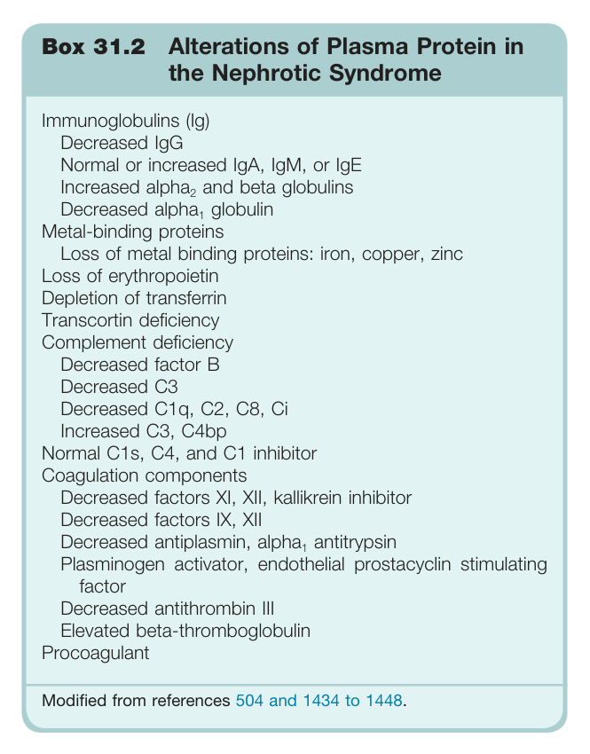

#### Box Text

```markdown
Box 31.2 Alterations of Plasma Protein in the Nephrotic Syndrome * Immunoglobulins (Ig) * Decreased IgG * Normal or increased IgA, IgM, or IgE * Increased alpha2 and beta globulins * Decreased alpha1 globulin * Metal-binding proteins * Loss of metal binding proteins: iron, copper, zinc * Loss of erythropoietin * Depletion of transferrin * Transcortin deficiency * Complement deficiency * Decreased factor B * Decreased C3 * Decreased C1q, C2, C8, Ci * Increased C3, C4bp * Normal C1s, C4, and C1 inhibitor * Coagulation components * Decreased factors XI, XII, kallikrein inhibitor * Decreased factors IX, XII * Decreased antiplasmin, alpha1 antitrypsin * Plasminogen activator, endothelial prostacyclin stimulating factor * Decreased antithrombin III * Elevated beta-thromboglobulin * Procoagulant Modified from references 504 and 1434 to 1448.
```

Box 31.2 Alterations of Plasma Protein in the Nephrotic Syndrome * Immunoglobulins (Ig) * Decreased IgG * Normal or increased IgA, IgM, or IgE * Increased alpha2 and beta globulins * Decreased alpha1 globulin * Metal-binding proteins * Loss of metal binding proteins: iron, copper, zinc * Loss of erythropoietin * Depletion of transferrin * Transcortin deficiency * Complement deficiency * Decreased factor B * Decreased C3 * Decreased C1q, C2, C8, Ci * Increased C3, C4bp * Normal C1s, C4, and C1 inhibitor * Coagulation components * Decreased factors XI, XII, kallikrein inhibitor * Decreased factors IX, XII * Decreased antiplasmin, alpha1 antitrypsin * Plasminogen activator, endothelial prostacyclin stimulating factor * Decreased antithrombin III * Elevated beta-thromboglobulin * Procoagulant Modified from references 504 and 1434 to 1448.

---

### Box_31_3

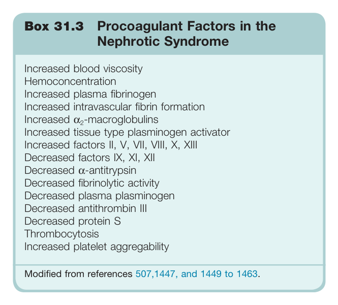

#### Box Text

```markdown
Box 31.3 Procoagulant Factors in the Nephrotic Syndrome * Increased blood viscosity * Hemoconcentration * Increased plasma fibrinogen * Increased intravascular fibrin formation * Increased α2-macroglobulins * Increased tissue type plasminogen activator * Increased factors II, V, VII, VIII, X, XIII * Decreased factors IX, XI, XII * Decreased α-antitrypsin * Decreased fibrinolytic activity * Decreased plasma plasminogen * Decreased antithrombin III * Decreased protein S * Thrombocytosis * Increased platelet aggregability Modified from references 507,1447, and 1449 to 1463.
```

Box 31.3 Procoagulant Factors in the Nephrotic Syndrome * Increased blood viscosity * Hemoconcentration * Increased plasma fibrinogen * Increased intravascular fibrin formation * Increased α2-macroglobulins * Increased tissue type plasminogen activator * Increased factors II, V, VII, VIII, X, XIII * Decreased factors IX, XI, XII * Decreased α-antitrypsin * Decreased fibrinolytic activity * Decreased plasma plasminogen * Decreased antithrombin III * Decreased protein S * Thrombocytosis * Increased platelet aggregability Modified from references 507,1447, and 1449 to 1463.

---

### Box_31_4

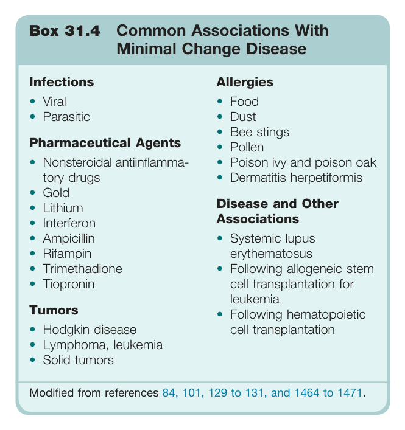

#### Box Text

```markdown
Box 31.4 Common Associations With Minimal Change Disease * Infections * Viral * Parasitic * Pharmaceutical Agents * Nonsteroidal antiinflammatory drugs * Gold * Lithium * Interferon * Ampicillin * Rifampin * Trimethadione * Tiopronin * Tumors * Hodgkin disease * Lymphoma, leukemia * Solid tumors * Allergies * Food * Dust * Bee stings * Pollen * Poison ivy and poison oak * Dermatitis herpetiformis * Disease and Other Associations * Systemic lupus erythematosus * Following allogeneic stem cell transplantation for leukemia * Following hematopoietic cell transplantation Modified from references 84, 101, 129 to 131, and 1464 to 1471.
```

Box 31.4 Common Associations With Minimal Change Disease * Infections * Viral * Parasitic * Pharmaceutical Agents * Nonsteroidal antiinflammatory drugs * Gold * Lithium * Interferon * Ampicillin * Rifampin * Trimethadione * Tiopronin * Tumors * Hodgkin disease * Lymphoma, leukemia * Solid tumors * Allergies * Food * Dust * Bee stings * Pollen * Poison ivy and poison oak * Dermatitis herpetiformis * Disease and Other Associations * Systemic lupus erythematosus * Following allogeneic stem cell transplantation for leukemia * Following hematopoietic cell transplantation Modified from references 84, 101, 129 to 131, and 1464 to 1471.

---

### Box_31_5

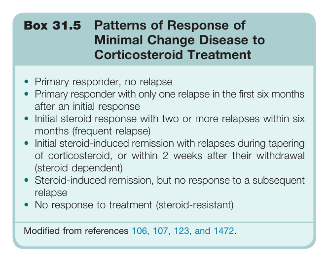

#### Box Text

```markdown
Box 31.5 Patterns of Response of Minimal Change Disease to Corticosteroid Treatment * Primary responder, no relapse * Primary responder with only one relapse in the first six months after an initial response * Initial steroid response with two or more relapses within six months (frequent relapse) * Initial steroid-induced remission with relapses during tapering of corticosteroid, or within 2 weeks after their withdrawal (steroid dependent) * Steroid-induced remission, but no response to a subsequent relapse * No response to treatment (steroid-resistant) Modified from references 106, 107, 123, and 1472.
```

Box 31.5 Patterns of Response of Minimal Change Disease to Corticosteroid Treatment * Primary responder, no relapse * Primary responder with only one relapse in the first six months after an initial response * Initial steroid response with two or more relapses within six months (frequent relapse) * Initial steroid-induced remission with relapses during tapering of corticosteroid, or within 2 weeks after their withdrawal (steroid dependent) * Steroid-induced remission, but no response to a subsequent relapse * No response to treatment (steroid-resistant) Modified from references 106, 107, 123, and 1472.

---

### Box_31_6

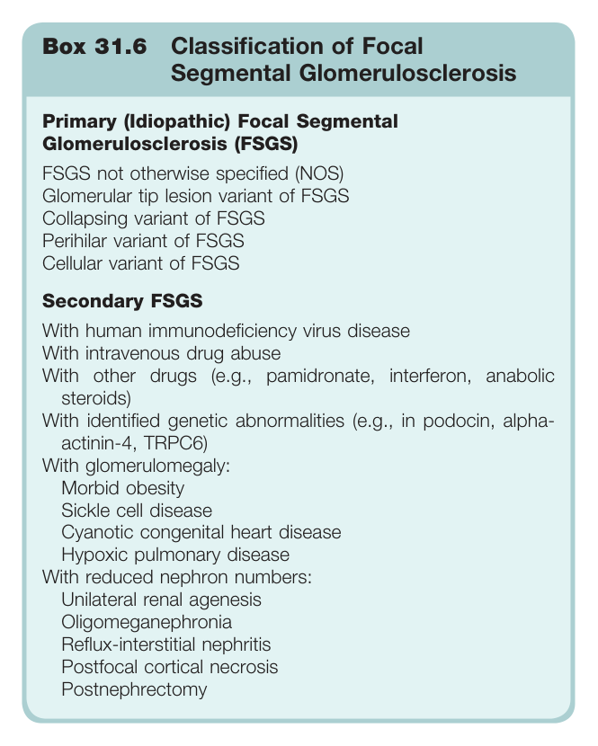

#### Box Text

```markdown
Box 31.6 Classification of Focal Segmental Glomerulosclerosis **Primary (Idiopathic) Focal Segmental Glomerulosclerosis (FSGS)** * FSGS not otherwise specified (NOS) * Glomerular tip lesion variant of FSGS * Collapsing variant of FSGS * Perihilar variant of FSGS * Cellular variant of FSGS **Secondary FSGS** * With human immunodeficiency virus disease * With intravenous drug abuse * With other drugs (e.g., pamidronate, interferon, anabolic steroids) * With identified genetic abnormalities (e.g., in podocin, alpha actinin-4, TRPC6) * With glomerulomegaly: * Morbid obesity * Sickle cell disease * Cyanotic congenital heart disease * Hypoxic pulmonary disease * With reduced nephron numbers: * Unilateral renal agenesis * Oligomeganephronia * Reflux-interstitial nephritis * Postfocal cortical necrosis * Postnephrectomy
```

Box 31.6 Classification of Focal Segmental Glomerulosclerosis **Primary (Idiopathic) Focal Segmental Glomerulosclerosis (FSGS)** * FSGS not otherwise specified (NOS) * Glomerular tip lesion variant of FSGS * Collapsing variant of FSGS * Perihilar variant of FSGS * Cellular variant of FSGS **Secondary FSGS** * With human immunodeficiency virus disease * With intravenous drug abuse * With other drugs (e.g., pamidronate, interferon, anabolic steroids) * With identified genetic abnormalities (e.g., in podocin, alpha actinin-4, TRPC6) * With glomerulomegaly: * Morbid obesity * Sickle cell disease * Cyanotic congenital heart disease * Hypoxic pulmonary disease * With reduced nephron numbers: * Unilateral renal agenesis * Oligomeganephronia * Reflux-interstitial nephritis * Postfocal cortical necrosis * Postnephrectomy

---

### Box_31_7

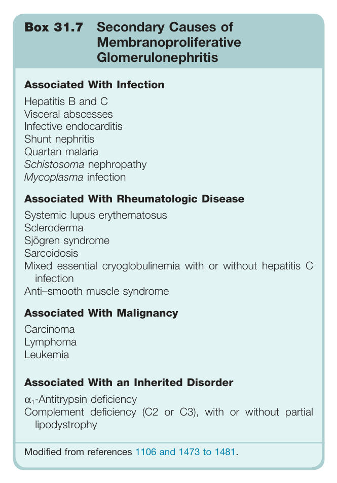

#### Box Text

```markdown
Box 31.7 Secondary Causes of Membranoproliferative Glomerulonephritis * **Associated With Infection** * Hepatitis B and C * Visceral abscesses * Infective endocarditis * Shunt nephritis * Quartan malaria * Schistosoma nephropathy * Mycoplasma infection * **Associated With Rheumatologic Disease** * Systemic lupus erythematosus * Scleroderma * Sjögren syndrome * Sarcoidosis * Mixed essential cryoglobulinemia with or without hepatitis C infection * Anti–smooth muscle syndrome * **Associated With Malignancy** * Carcinoma * Lymphoma * Leukemia * **Associated With an Inherited Disorder** * α1-Antitrypsin deficiency * Complement deficiency (C2 or C3), with or without partial lipodystrophy Modified from references 1106 and 1473 to 1481.
```

Box 31.7 Secondary Causes of Membranoproliferative Glomerulonephritis * **Associated With Infection** * Hepatitis B and C * Visceral abscesses * Infective endocarditis * Shunt nephritis * Quartan malaria * Schistosoma nephropathy * Mycoplasma infection * **Associated With Rheumatologic Disease** * Systemic lupus erythematosus * Scleroderma * Sjögren syndrome * Sarcoidosis * Mixed essential cryoglobulinemia with or without hepatitis C infection * Anti–smooth muscle syndrome * **Associated With Malignancy** * Carcinoma * Lymphoma * Leukemia * **Associated With an Inherited Disorder** * α1-Antitrypsin deficiency * Complement deficiency (C2 or C3), with or without partial lipodystrophy Modified from references 1106 and 1473 to 1481.

---

### Box_31_8

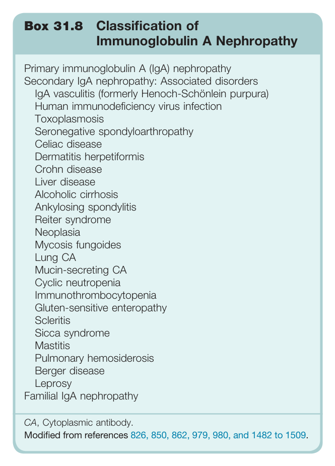

#### Box Text

```markdown
Box 31.8 Classification of Immunoglobulin A Nephropathy * Primary immunoglobulin A (IgA) nephropathy * Secondary IgA nephropathy: Associated disorders * IgA vasculitis (formerly Henoch-Schönlein purpura) * Human immunodeficiency virus infection * Toxoplasmosis * Seronegative spondyloarthropathy * Celiac disease * Dermatitis herpetiformis * Crohn disease * Liver disease * Alcoholic cirrhosis * Ankylosing spondylitis * Reiter syndrome * Neoplasia * Mycosis fungoides * Lung CA * Mucin-secreting CA * Cyclic neutropenia * Immunothrombocytopenia * Gluten-sensitive enteropathy * Scleritis * Sicca syndrome * Mastitis * Pulmonary hemosiderosis * Berger disease * Leprosy * Familial IgA nephropathy CA, Cytoplasmic antibody. Modified from references 826, 850, 862, 979, 980, and 1482 to 1509.
```

Box 31.8 Classification of Immunoglobulin A Nephropathy * Primary immunoglobulin A (IgA) nephropathy * Secondary IgA nephropathy: Associated disorders * IgA vasculitis (formerly Henoch-Schönlein purpura) * Human immunodeficiency virus infection * Toxoplasmosis * Seronegative spondyloarthropathy * Celiac disease * Dermatitis herpetiformis * Crohn disease * Liver disease * Alcoholic cirrhosis * Ankylosing spondylitis * Reiter syndrome * Neoplasia * Mycosis fungoides * Lung CA * Mucin-secreting CA * Cyclic neutropenia * Immunothrombocytopenia * Gluten-sensitive enteropathy * Scleritis * Sicca syndrome * Mastitis * Pulmonary hemosiderosis * Berger disease * Leprosy * Familial IgA nephropathy CA, Cytoplasmic antibody. Modified from references 826, 850, 862, 979, 980, and 1482 to 1509.

---
