# 32. Secondary Glomerular Disease - Figures and Tables Index

This document lists all figures and tables extracted from `32. Secondary Glomerular Disease.pdf`.

## Table of Contents
- [Figures](#figures)
- [Tables](#tables)

---

## Figures

### Fig_32_1

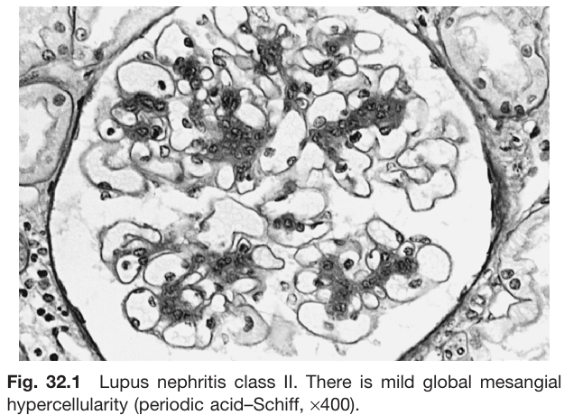

Fig. 32.1 Lupus nephritis class II. There is mild global mesangial hypercellularity (periodic acid–Schiff, ×400).

---

### Fig_32_2

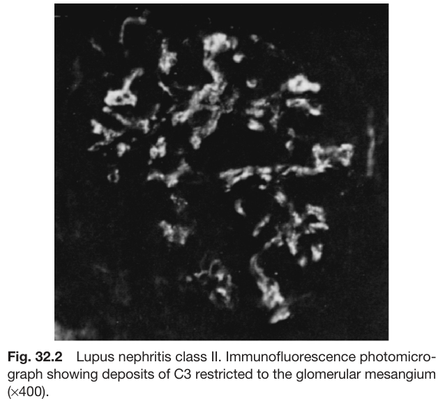

Fig. 32.2 Lupus nephritis class II. Immunofluorescence photomicrograph showing deposits of C3 restricted to the glomerular mesangium (×400).

---

### Fig_32_3

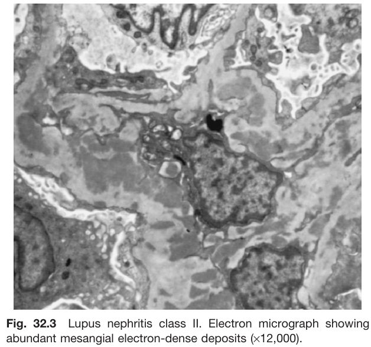

Fig. 32.3 Lupus nephritis class II. Electron micrograph showing abundant mesangial electron-dense deposits (×12,000).

---

### Fig_32_4

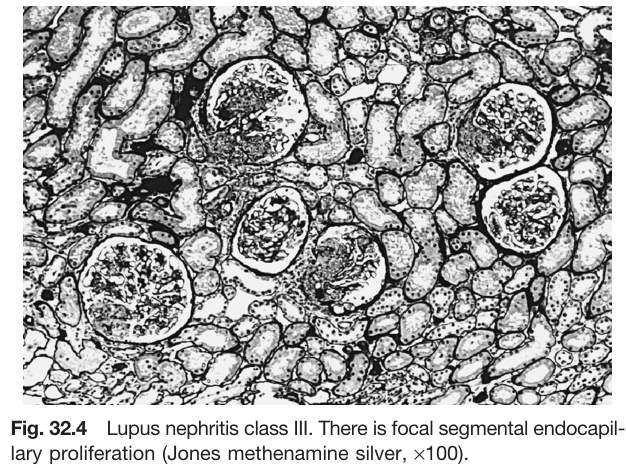

Fig. 32.4 Lupus nephritis class III. There is focal segmental endocapillary proliferation (Jones methenamine silver, ×100).

---

### Fig_32_5

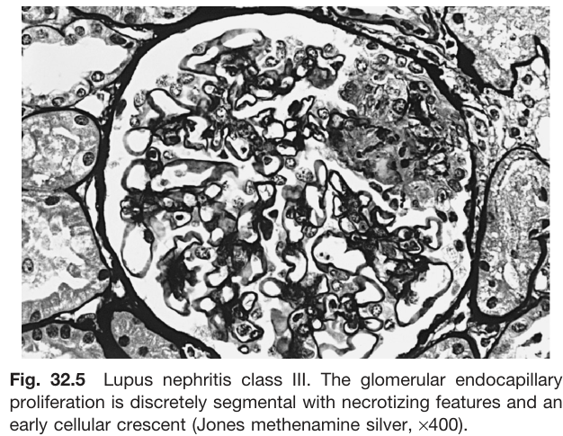

Fig. 32.5 Lupus nephritis class III. The glomerular endocapillary proliferation is discretely segmental with necrotizing features and an early cellular crescent (Jones methenamine silver, ×400).

---

### Fig_32_6

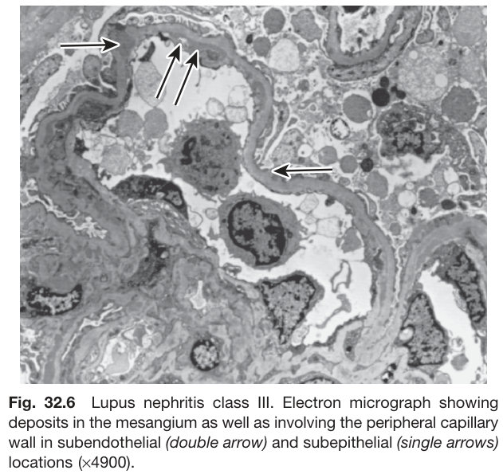

Fig. 32.6 Lupus nephritis class III. Electron micrograph showing deposits in the mesangium as well as involving the peripheral capillary wall in subendothelial (double arrow) and subepithelial (single arrows) locations (×4900).

---

### Fig_32_7

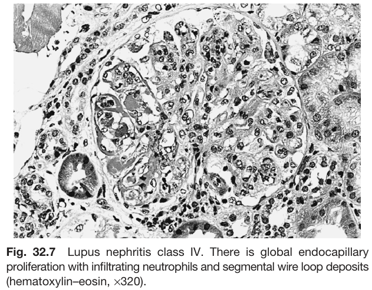

Fig. 32.7 Lupus nephritis class IV. There is global endocapillary proliferation with infiltrating neutrophils and segmental wire loop deposits (hematoxylin–eosin, ×320).

---

### Fig_32_8

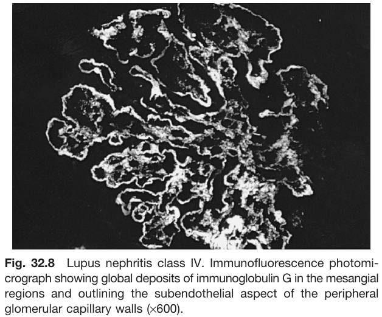

Fig. 32.8 Lupus nephritis class IV. Immunofluorescence photomicrograph showing global deposits of immunoglobulin G in the mesangial regions and outlining the subendothelial aspect of the peripheral glomerular capillary walls (×600).

---

### Fig_32_9

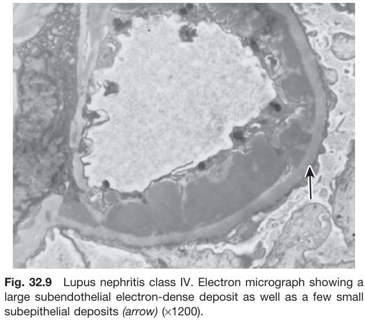

Fig. 32.9 Lupus nephritis class IV. Electron micrograph showing a large subendothelial electron-dense deposit as well as a few small subepithelial deposits (arrow) (×1200).

---

### Fig_32_10

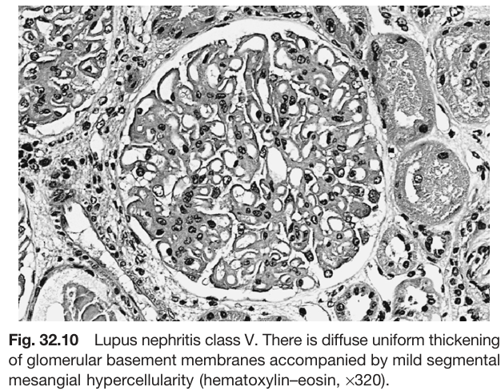

Fig. 32.10 Lupus nephritis class V. There is diffuse uniform thickening of glomerular basement membranes accompanied by mild segmental mesangial hypercellularity (hematoxylin–eosin, ×320).

---

### Fig_32_11

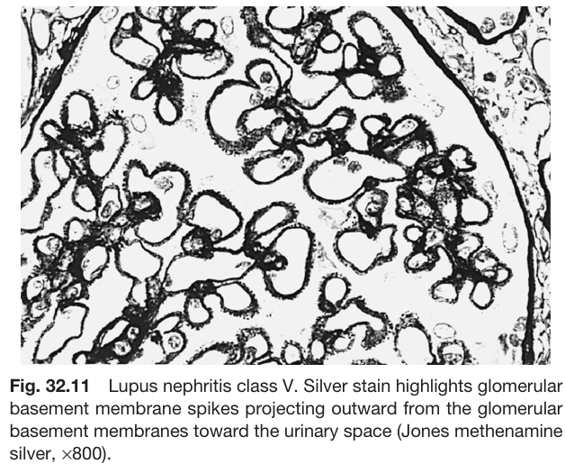

Fig. 32.11 Lupus nephritis class V. Silver stain highlights glomerular basement membrane spikes projecting outward from the glomerular basement membranes toward the urinary space (Jones methenamine silver, ×800).

---

### Fig_32_12

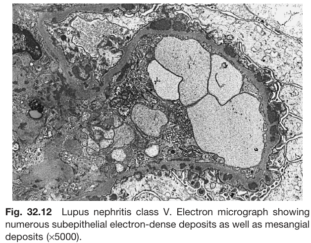

Fig. 32.12 Lupus nephritis class V. Electron micrograph showing numerous subepithelial electron-dense deposits as well as mesangial deposits (×5000).

---

### Fig_32_13

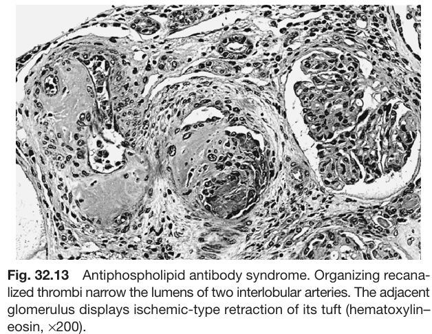

Fig. 32.13 Antiphospholipid antibody syndrome. Organizing recanalized thrombi narrow the lumens of two interlobular arteries. The adjacent glomerulus displays ischemic-type retraction of its tuft (hematoxylin–eosin, ×200).

---

### Fig_32_14

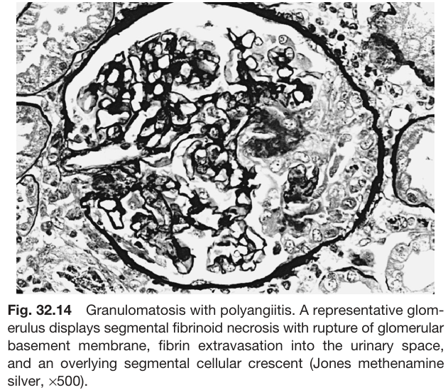

Fig. 32.14 Granulomatosis with polyangiitis. A representative glomerulus displays segmental fibrinoid necrosis with rupture of glomerular basement membrane, fibrin extravasation into the urinary space, and an overlying segmental cellular crescent (Jones methenamine silver, ×500).

---

### Fig_32_15

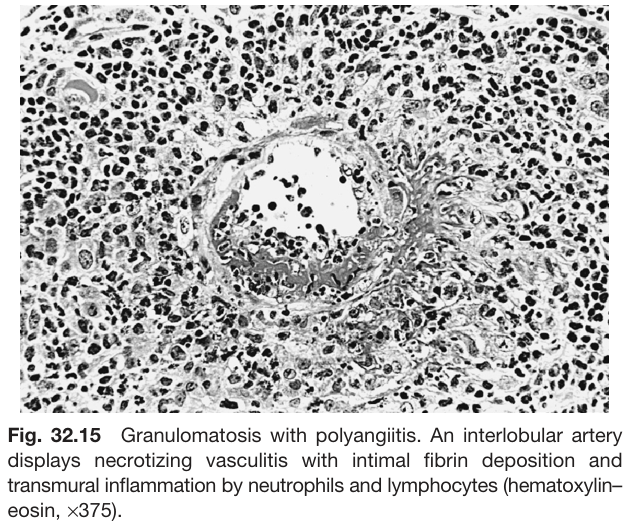

Fig. 32.15 Granulomatosis with polyangiitis. An interlobular artery displays necrotizing vasculitis with intimal fibrin deposition and transmural inflammation by neutrophils and lymphocytes (hematoxylin–eosin, ×375).

---

### Fig_32_16

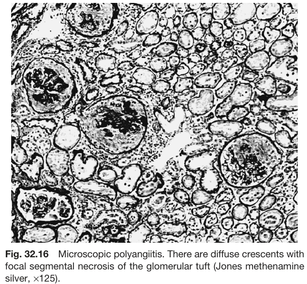

Fig. 32.16 Microscopic polyangiitis. There are diffuse crescents with focal segmental necrosis of the glomerular tuft (Jones methenamine silver, ×125).

---

### Fig_32_17

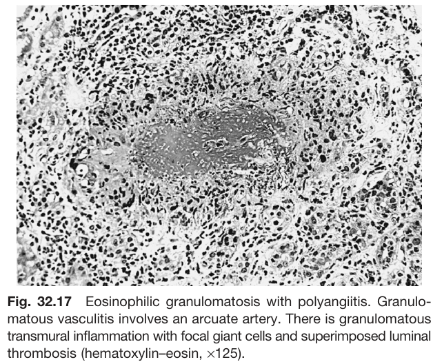

Fig. 32.17 Eosinophilic granulomatosis with polyangiitis. Granulomatous vasculitis involves an arcuate artery. There is granulomatous transmural inflammation with focal giant cells and superimposed luminal thrombosis (hematoxylin–eosin, ×125).

---

### Fig_32_18

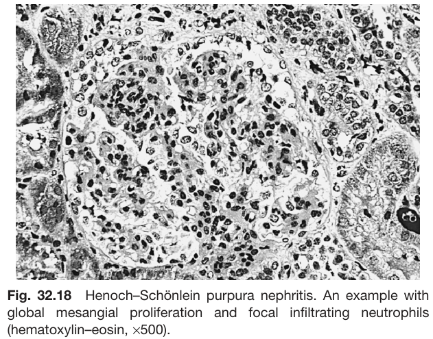

Fig. 32.18 Henoch–Schönlein purpura nephritis. An example with global mesangial proliferation and focal infiltrating neutrophils (hematoxylin–eosin, ×500).

---

### Fig_32_19

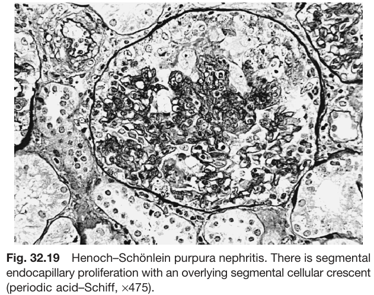

Fig. 32.19 Henoch–Schönlein purpura nephritis. There is segmental endocapillary proliferation with an overlying segmental cellular crescent (periodic acid–Schiff, ×475).

---

### Fig_32_20

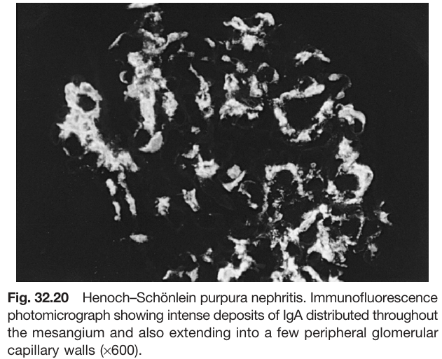

Fig. 32.20 Henoch–Schönlein purpura nephritis. Immunofluorescence photomicrograph showing intense deposits of IgA distributed throughout the mesangium and also extending into a few peripheral glomerular capillary walls (×600).

---

### Fig_32_21

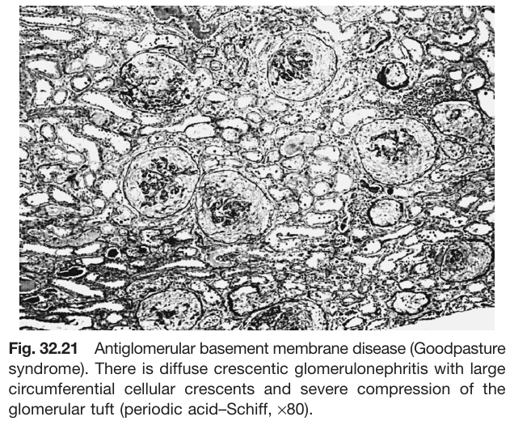

Fig. 32.21 Antiglomerular basement membrane disease (Goodpasture syndrome). There is diffuse crescentic glomerulonephritis with large circumferential cellular crescents and severe compression of the glomerular tuft (periodic acid–Schiff, ×80).

---

### Fig_32_22

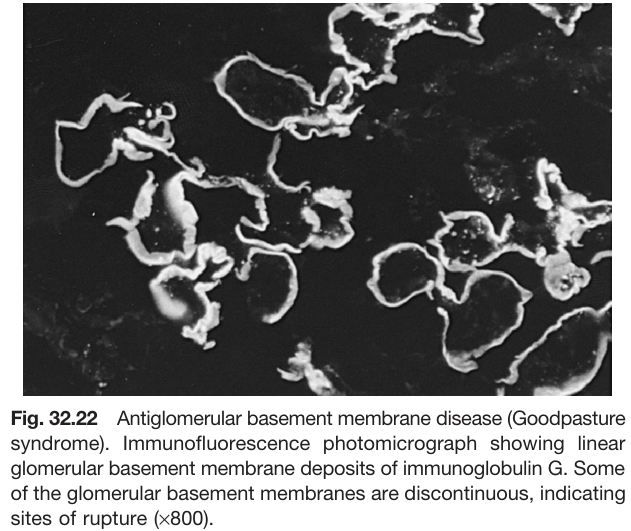

Fig. 32.22 Antiglomerular basement membrane disease (Goodpasture syndrome). Immunofluorescence photomicrograph showing linear glomerular basement membrane deposits of immunoglobulin G. Some of the glomerular basement membranes are discontinuous, indicating sites of rupture (×800).

---

### Fig_32_23

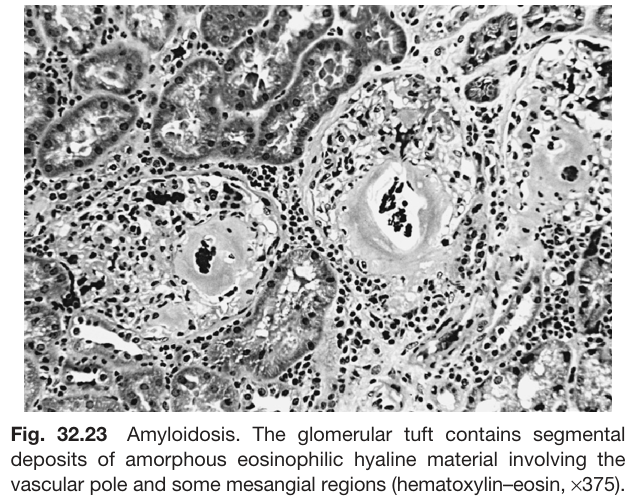

Fig. 32.23 Amyloidosis. The glomerular tuft contains segmental deposits of amorphous eosinophilic hyaline material involving the vascular pole and some mesangial regions (hematoxylin–eosin, ×375).

---

### Fig_32_24

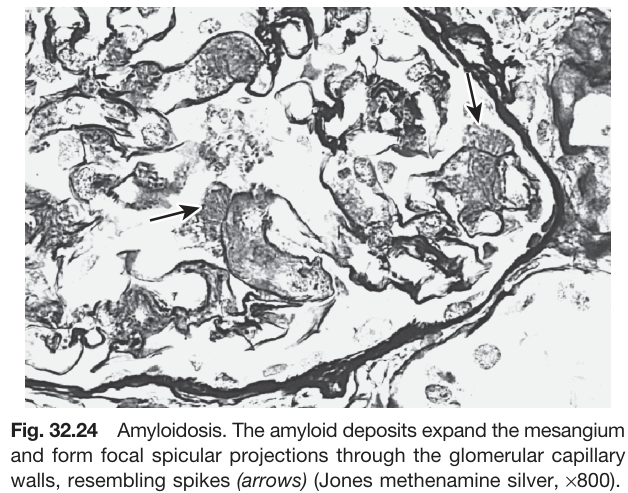

Fig. 32.24 Amyloidosis. The amyloid deposits expand the mesangium and form focal spicular projections through the glomerular capillary walls, resembling spikes (arrows) (Jones methenamine silver, ×800).

---

### Fig_32_25

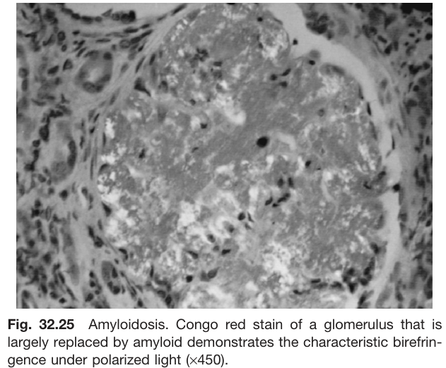

Fig. 32.25 Amyloidosis. Congo red stain of a glomerulus that is largely replaced by amyloid demonstrates the characteristic birefringence under polarized light (×450).

---

### Fig_32_26

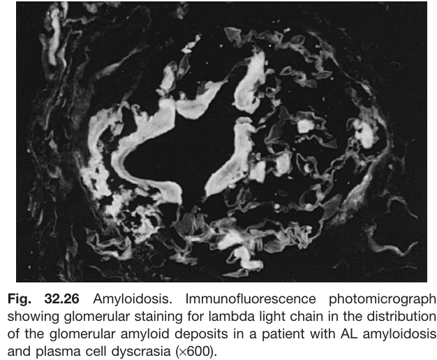

Fig. 32.26 Amyloidosis. Immunofluorescence photomicrograph showing glomerular staining for lambda light chain in the distribution of the glomerular amyloid deposits in a patient with AL amyloidosis and plasma cell dyscrasia (×600).

---

### Fig_32_27

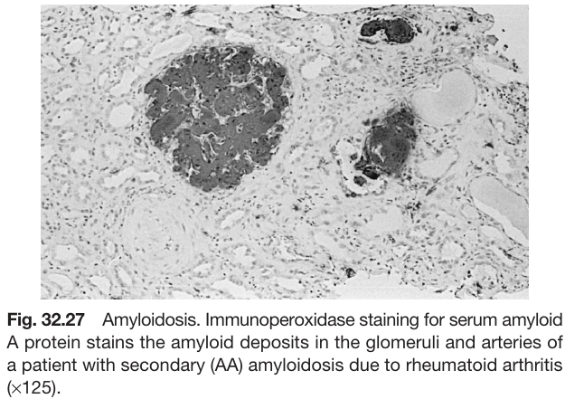

Fig. 32.27 Amyloidosis. Immunoperoxidase staining for serum amyloid A protein stains the amyloid deposits in the glomeruli and arteries of a patient with secondary (AA) amyloidosis due to rheumatoid arthritis (×125).

---

### Fig_32_28

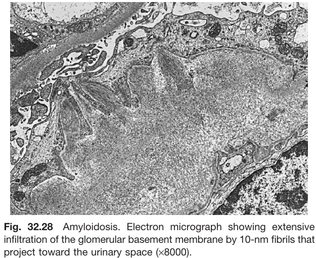

Fig. 32.28 Amyloidosis. Electron micrograph showing extensive infiltration of the glomerular basement membrane by 10-nm fibrils that project toward the urinary space (×8000).

---

### Fig_32_29

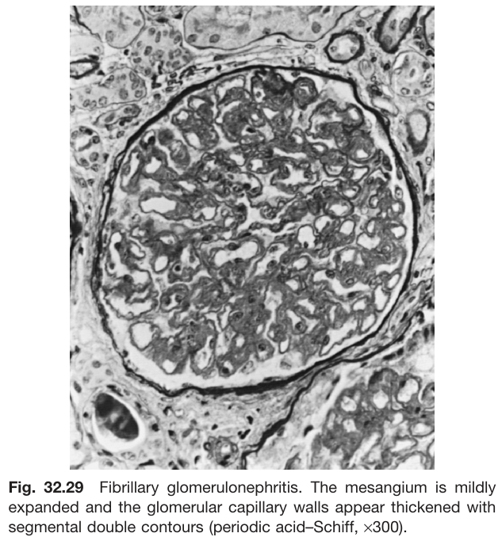

Fig. 32.29 Fibrillary glomerulonephritis. The mesangium is mildly expanded and the glomerular capillary walls appear thickened with segmental double contours (periodic acid–Schiff, ×300).

---

### Fig_32_30

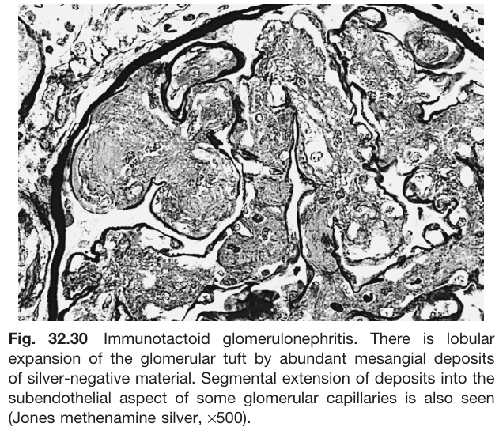

Fig. 32.30 Immunotactoid glomerulonephritis. There is lobular expansion of the glomerular tuft by abundant mesangial deposits of silver-negative material. Segmental extension of deposits into the subendothelial aspect of some glomerular capillaries is also seen (Jones methenamine silver, ×500).

---

### Fig_32_31

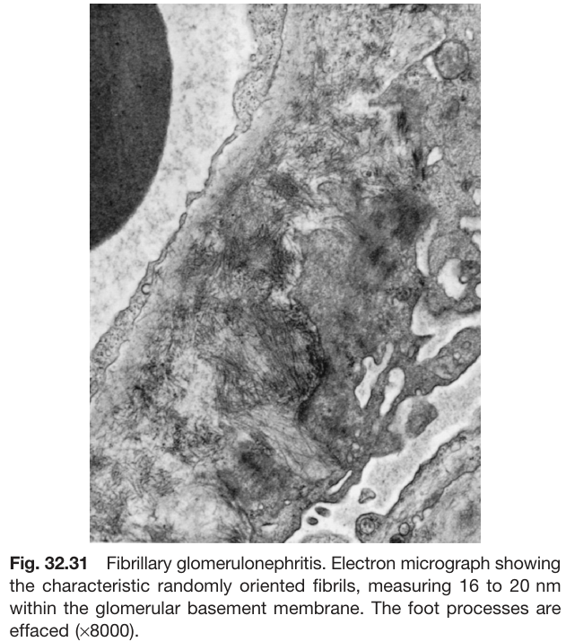

Fig. 32.31 Fibrillary glomerulonephritis. Electron micrograph showing the characteristic randomly oriented fibrils, measuring 16 to 20 nm within the glomerular basement membrane. The foot processes are effaced (×8000).

---

### Fig_32_32

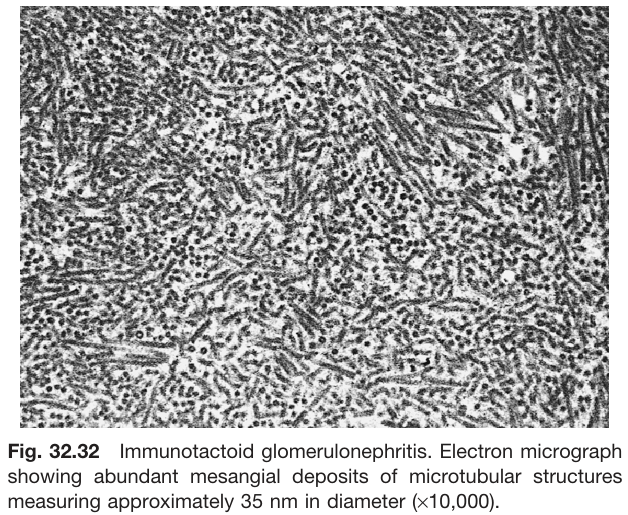

Fig. 32.32 Immunotactoid glomerulonephritis. Electron micrograph showing abundant mesangial deposits of microtubular structures measuring approximately 35 nm in diameter (×10,000).

---

### Fig_32_33

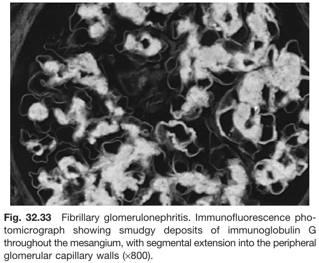

Fig. 32.33 Fibrillary glomerulonephritis. Immunofluorescence photomicrograph showing smudgy deposits of immunoglobulin G throughout the mesangium, with segmental extension into the peripheral glomerular capillary walls (×800).

---

### Fig_32_34

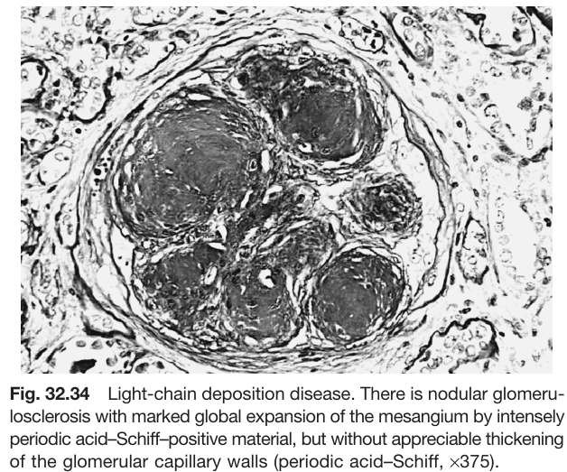

Fig. 32.34 Light-chain deposition disease. There is nodular glomerulosclerosis with marked global expansion of the mesangium by intensely periodic acid–Schiff–positive material, but without appreciable thickening of the glomerular capillary walls (periodic acid–Schiff, ×375).

---

### Fig_32_35

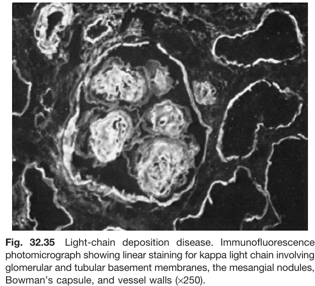

Fig. 32.35 Light-chain deposition disease. Immunofluorescence photomicrograph showing linear staining for kappa light chain involving glomerular and tubular basement membranes, the mesangial nodules, Bowman’s capsule, and vessel walls (×250).

---

### Fig_32_36

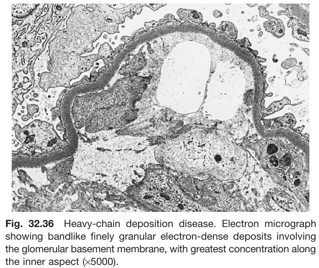

Fig. 32.36 Heavy-chain deposition disease. Electron micrograph showing bandlike finely granular electron-dense deposits involving the glomerular basement membrane, with greatest concentration along the inner aspect (×5000).

---

### Fig_32_37

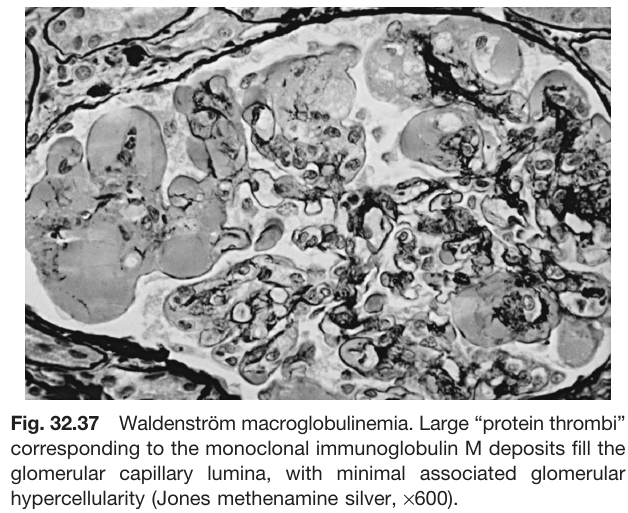

Fig. 32.37 Waldenström macroglobulinemia. Large “protein thrombi” corresponding to the monoclonal immunoglobulin M deposits fill the glomerular capillary lumina, with minimal associated glomerular hypercellularity (Jones methenamine silver, ×600).

---

### Fig_32_38

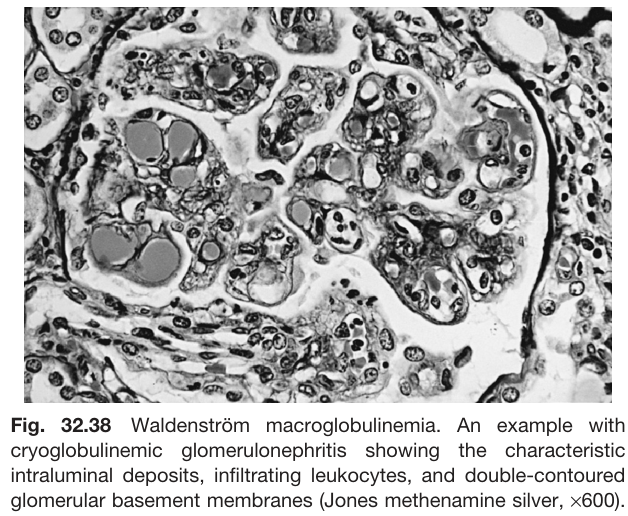

Fig. 32.38 Waldenström macroglobulinemia. An example with cryoglobulinemic glomerulonephritis showing the characteristic intraluminal deposits, infiltrating leukocytes, and double-contoured glomerular basement membranes (Jones methenamine silver, ×600).

---

### Fig_32_39

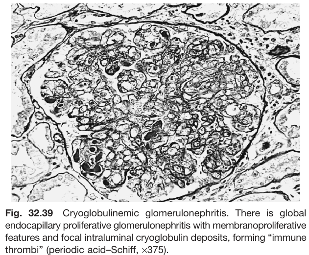

Fig. 32.39 Cryoglobulinemic glomerulonephritis. There is global endocapillary proliferative glomerulonephritis with membranoproliferative features and focal intraluminal cryoglobulin deposits, forming “immune thrombi” (periodic acid–Schiff, ×375).

---

### Fig_32_40

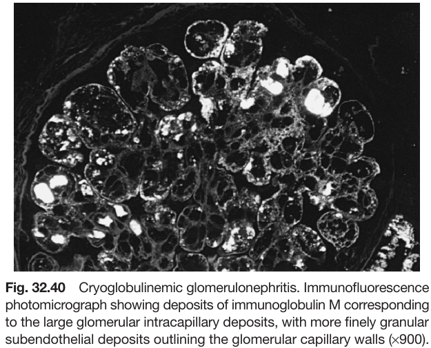

Fig. 32.40 Cryoglobulinemic glomerulonephritis. Immunofluorescence photomicrograph showing deposits of immunoglobulin M corresponding to the large glomerular intracapillary deposits, with more finely granular subendothelial deposits outlining the glomerular capillary walls (×900).

---

### Fig_32_41

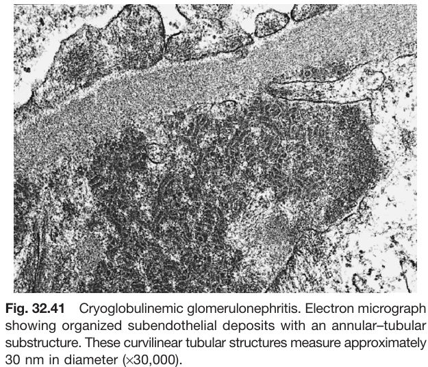

Fig. 32.41 Cryoglobulinemic glomerulonephritis. Electron micrograph showing organized subendothelial deposits with an annular–tubular substructure. These curvilinear tubular structures measure approximately 30 nm in diameter (×30,000).

---

### Fig_32_42

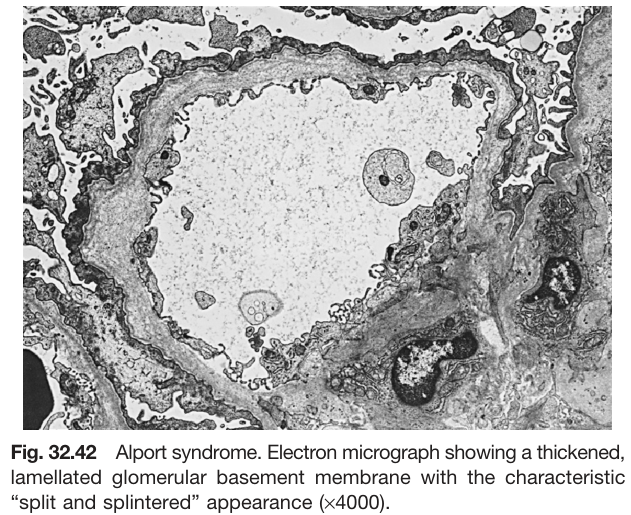

Fig. 32.42 Alport syndrome. Electron micrograph showing a thickened, lamellated glomerular basement membrane with the characteristic “split and splintered” appearance (×4000).

---

### Fig_32_43

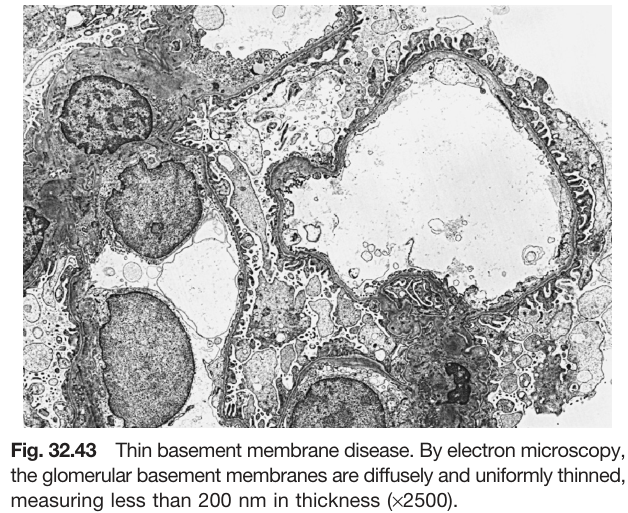

Fig. 32.43 Thin basement membrane disease. By electron microscopy, the glomerular basement membranes are diffusely and uniformly thinned, measuring less than 200 nm in thickness (×2500).

---

### Fig_32_44

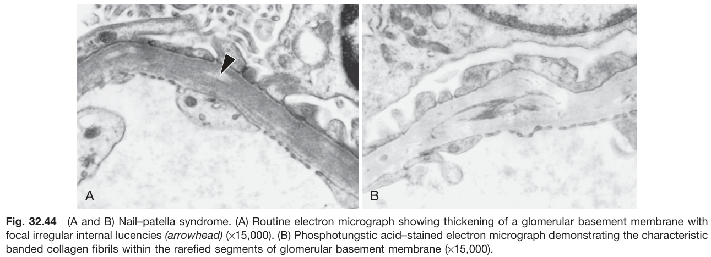

Fig. 32.44 (A and B) Nail–patella syndrome. (A) Routine electron micrograph showing thickening of a glomerular basement membrane with focal irregular internal lucencies (arrowhead) (×15,000). (B) Phosphotungstic acid–stained electron micrograph demonstrating the characteristic banded collagen fibrils within the rarefied segments of glomerular basement membrane (×15,000).

---

### Fig_32_45

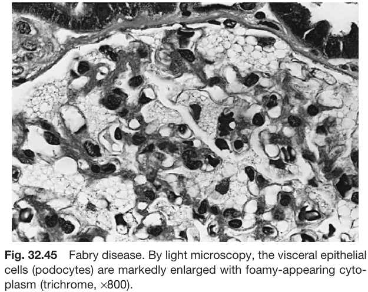

Fig. 32.45 Fabry disease. By light microscopy, the visceral epithelial cells (podocytes) are markedly enlarged with foamy-appearing cytoplasm (trichrome, ×800).

---

### Fig_32_46

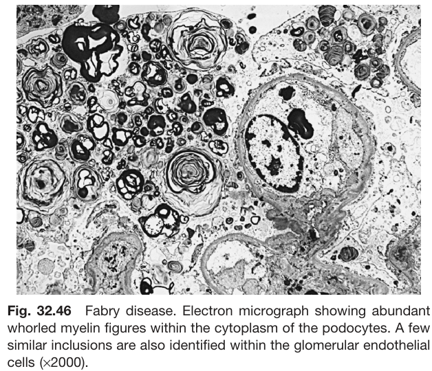

Fig. 32.46 Fabry disease. Electron micrograph showing abundant whorled myelin figures within the cytoplasm of the podocytes. A few similar inclusions are also identified within the glomerular endothelial cells (×2000).

---

### Fig_32_47

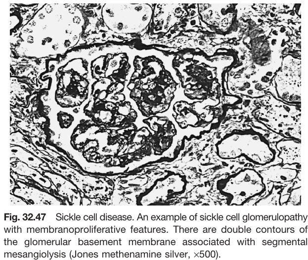

Fig. 32.47 Sickle cell disease. An example of sickle cell glomerulopathy with membranoproliferative features. There are double contours of the glomerular basement membrane associated with segmental mesangiolysis (Jones methenamine silver, ×500).

---

### Fig_32_48

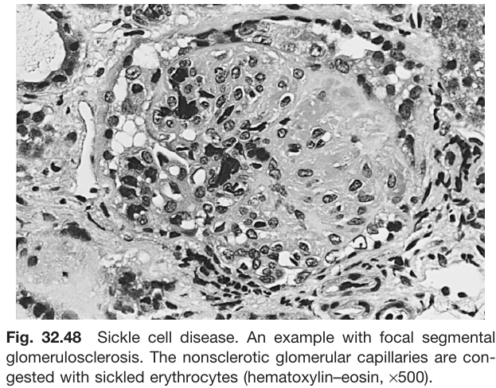

Fig. 32.48 Sickle cell disease. An example with focal segmental glomerulosclerosis. The nonsclerotic glomerular capillaries are congested with sickled erythrocytes (hematoxylin–eosin, ×500).

---

### Fig_32_49

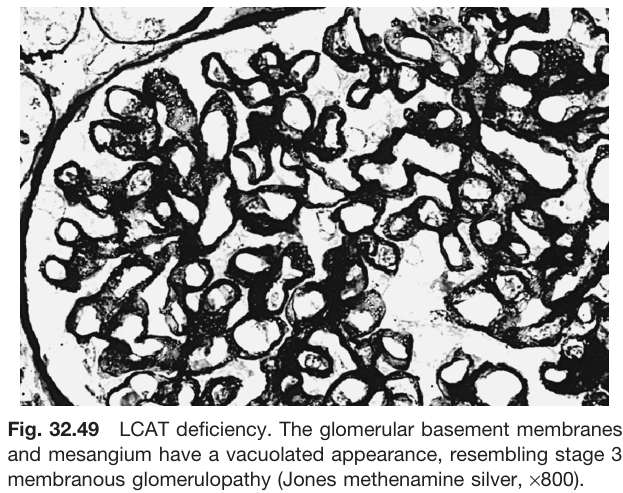

Fig. 32.49 LCAT deficiency. The glomerular basement membranes and mesangium have a vacuolated appearance, resembling stage 3 membranous glomerulopathy (Jones methenamine silver, ×800).

---

### Fig_32_50

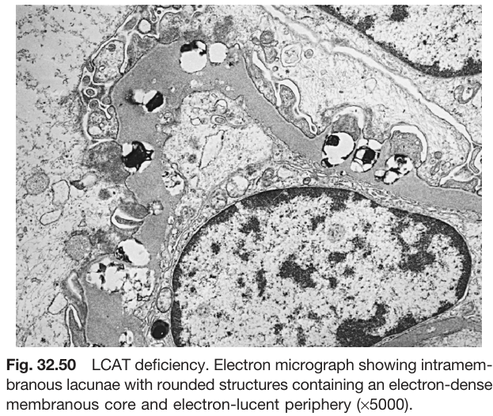

Fig. 32.50 LCAT deficiency. Electron micrograph showing intramembranous lacunae with rounded structures containing an electron-dense membranous core and electron-lucent periphery (×5000).

---

### Fig_32_51

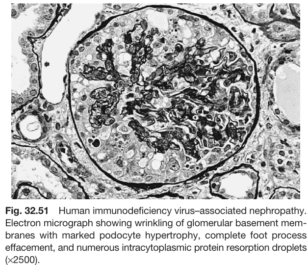

Fig. 32.51 Human immunodeficiency virus–associated nephropathy. Electron micrograph showing wrinkling of glomerular basement membranes with marked podocyte hypertrophy, complete foot process effacement, and numerous intracytoplasmic protein resorption droplets (×2500).

---

### Fig_32_52

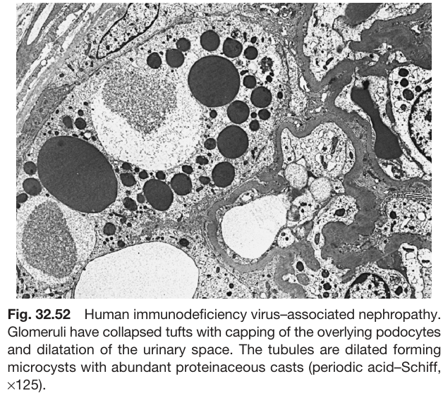

Fig. 32.52 Human immunodeficiency virus–associated nephropathy. Glomeruli have collapsed tufts with capping of the overlying podocytes and dilatation of the urinary space. The tubules are dilated forming microcysts with abundant proteinaceous casts (periodic acid–Schiff, ×125).

---

### Fig_32_53

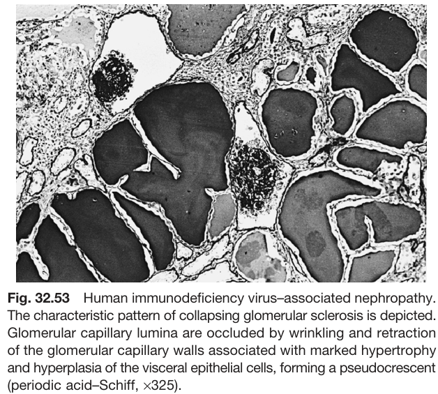

Fig. 32.53 Human immunodeficiency virus–associated nephropathy. The characteristic pattern of collapsing glomerular sclerosis is depicted. Glomerular capillary lumina are occluded by wrinkling and retraction of the glomerular capillary walls associated with marked hypertrophy and hyperplasia of the visceral epithelial cells, forming a pseudocrescent (periodic acid–Schiff, ×325).

---

### Fig_32_54

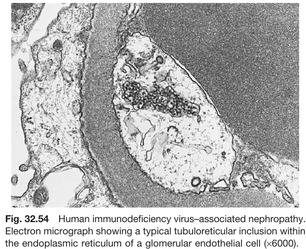

Fig. 32.54 Human immunodeficiency virus–associated nephropathy. Electron micrograph showing a typical tubuloreticular inclusion within the endoplasmic reticulum of a glomerular endothelial cell (×6000).

---

### Fig_32_55

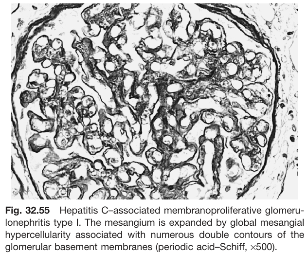

Fig. 32.55 Hepatitis C–associated membranoproliferative glomerulonephritis type I. The mesangium is expanded by global mesangial hypercellularity associated with numerous double contours of the glomerular basement membranes (periodic acid–Schiff, ×500).

---

### Fig_32_56

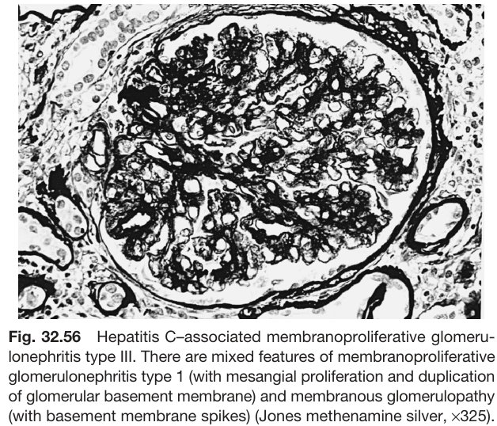

Fig. 32.56 Hepatitis C–associated membranoproliferative glomerulonephritis type III. There are mixed features of membranoproliferative glomerulonephritis type 1 (with mesangial proliferation and duplication of glomerular basement membrane) and membranous glomerulopathy (with basement membrane spikes) (Jones methenamine silver, ×325).

---

### Fig_32_57

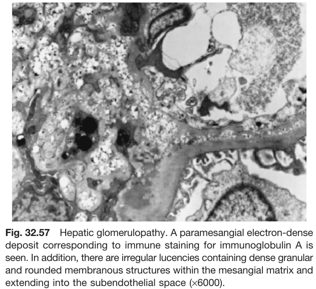

Fig. 32.57 Hepatic glomerulopathy. A paramesangial electron-dense deposit corresponding to immune staining for immunoglobulin A is seen. In addition, there are irregular lucencies containing dense granular and rounded membranous structures within the mesangial matrix and extending into the subendothelial space (×6000).

---

## Tables

### Table_32_1

#### Table Image

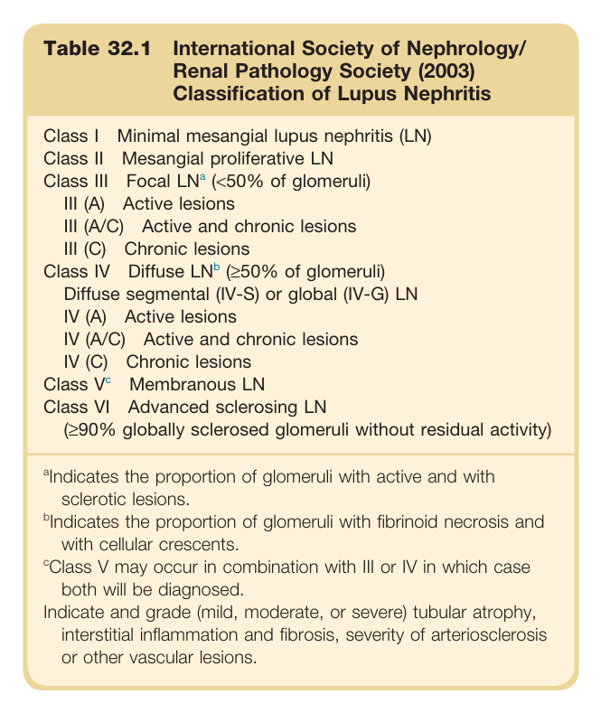

#### Table Data (CSV: [Table_32_1.csv](Table_32_1.csv))

```markdown
| Table Text (OCR) |
| :--- |
| Table 32.1 International Society of Nephrology/ Renal Pathology Society (2003) Classification of Lupus Nephritis |
```

Table 32.1 International Society of Nephrology/ Renal Pathology Society (2003) Classification of Lupus Nephritis Class I Minimal mesangial lupus nephritis (LN) Class II Mesangial proliferative LN Class III Focal LNa (<50% of glomeruli) III (A) Active lesions III (A/C) Active and chronic lesions III (C) Chronic lesions Class IV Diffuse LNb (≥50% of glomeruli) Diffuse segmental (IV-S) or global (IV-G) LN IV (A) Active lesions IV (A/C) Active and chronic lesions IV (C) Chronic lesions Class Vc Membranous LN Class VI Advanced sclerosing LN (≥90% globally sclerosed glomeruli without residual activity) aIndicates the proportion of glomeruli with active and with sclerotic lesions. bIndicates the proportion of glomeruli with fibrinoid necrosis and with cellular crescents. cClass V may occur in combination with III or IV in which case both will be diagnosed. Indicate and grade (mild, moderate, or severe) tubular atrophy, interstitial inflammation and fibrosis, severity of arteriosclerosis or other vascular lesions.

---

### Table_32_2

#### Table Image

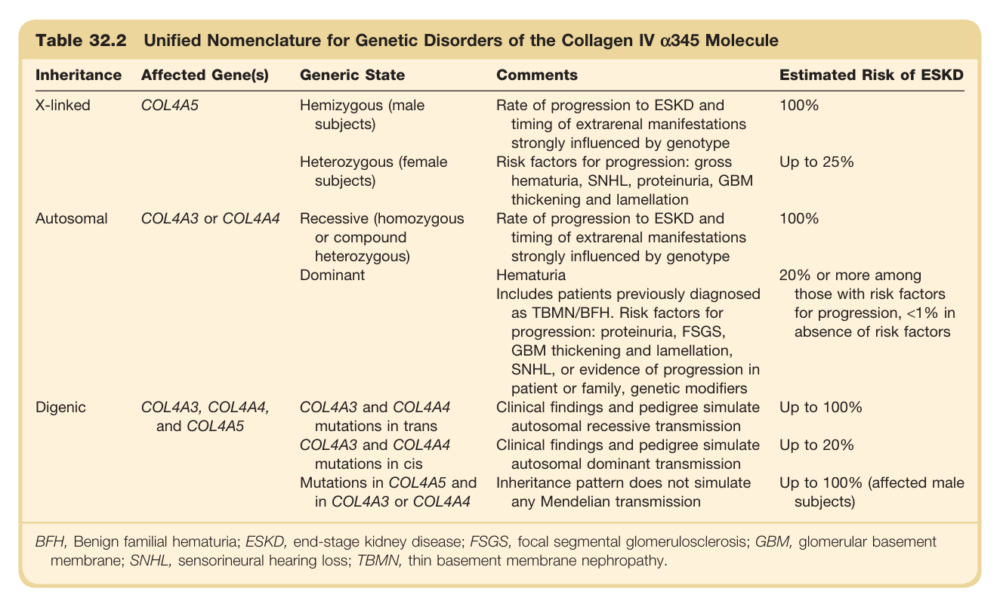

#### Table Data (CSV: [Table_32_2.csv](Table_32_2.csv))

```markdown
| Table Text (OCR) |
| :--- |
| Table 32.2 Unified Nomenclature for Genetic Disorders of the Collagen IV α345 Molecule  BFH, Benign familial hematuria; ESKD, end-stage kidney disease; FSGS, focal segmental glomerulosclerosis; GBM, glomerular basement membrane; SNHL, sensorineural hearing loss; TBMN, thin basement membrane nephropathy. |
```

Table 32.2 Unified Nomenclature for Genetic Disorders of the Collagen IV α345 Molecule | Inheritance | Affected Gene(s) | Generic State | Comments | Estimated Risk of ESKD | | :---------- | :------------------------- | :---------------------------------------------- | :----------------------------------------------------------- | :----------------------------------------------------------- | | X-linked | COL4A5 | Hemizygous (male subjects) | Rate of progression to ESKD and timing of extrarenal manifestations strongly influenced by genotype | 100% | | | | Heterozygous (female subjects) | Risk factors for progression: gross hematuria, SNHL, proteinuria, GBM thickening and lamellation | Up to 25% | | Autosomal | COL4A3 or COL4A4 | Recessive (homozygous or compound heterozygous) | Rate of progression to ESKD and timing of extrarenal manifestations strongly influenced by genotype | 100% | | | | Dominant Hematuria | Includes patients previously diagnosed as TBMN/BFH. Risk factors for progression: proteinuria, FSGS, GBM thickening and lamellation, SNHL, or evidence of progression in patient or family, genetic modifiers | 20% or more among those with risk factors for progression, <1% in absence of risk factors | | Digenic | COL4A3, COL4A4, and COL4A5 | COL4A3 and COL4A4 mutations in trans | Clinical findings and pedigree simulate autosomal recessive transmission | Up to 100% | | | | COL4A3 and COL4A4 mutations in cis | Clinical findings and pedigree simulate autosomal dominant transmission | Up to 20% | | | | Mutations in COL4A5 and in COL4A3 or COL4A4 | Inheritance pattern does not simulate any Mendelian transmission | Up to 100% (affected male subjects) | BFH, Benign familial hematuria; ESKD, end-stage kidney disease; FSGS, focal segmental glomerulosclerosis; GBM, glomerular basement membrane; SNHL, sensorineural hearing loss; TBMN, thin basement membrane nephropathy.

---

### Table_32_3

#### Table Image

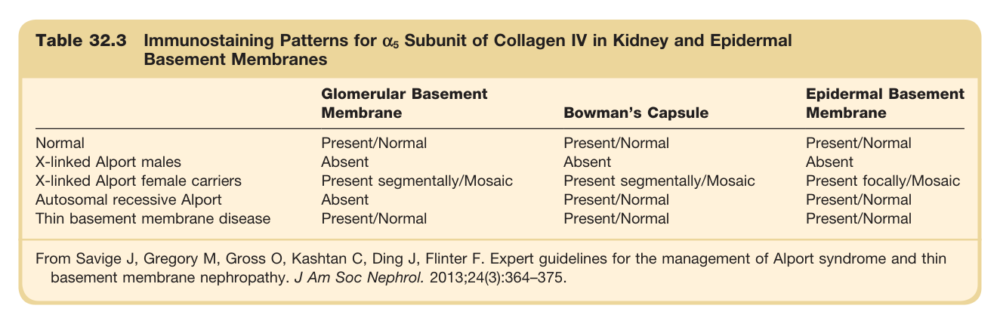

#### Table Data (CSV: [Table_32_3.csv](Table_32_3.csv))

```markdown
| Table Text (OCR) |
| :--- |
| Table 32.3 Immunostaining Patterns for { \tt G } _ { 5 } Subunit of Collagen IV in Kidney and Epidermal Basement Membranes  From Savige J, Gregory M, Gross O, Kashtan C, Ding J, Flinter F. Expert guidelines for the management of Alport syndrome and thin basement membrane nephropathy. J Am Soc Nephrol. 2013;24(3):364–375. |
```

Table 32.3 Immunostaining Patterns for α5 Subunit of Collagen IV in Kidney and Epidermal Basement Membranes | | Glomerular Basement Membrane | Bowman’s Capsule | Epidermal Basement Membrane | | :------------------------------ | :--------------------------- | :------------------------- | :-------------------------- | | Normal | Present/Normal | Present/Normal | Present/Normal | | X-linked Alport males | Absent | Absent | Absent | | X-linked Alport female carriers | Present segmentally/Mosaic | Present segmentally/Mosaic | Present focally/Mosaic | | Autosomal recessive Alport | Absent | Present/Normal | Present/Normal | | Thin basement membrane disease | Present/Normal | Present/Normal | Present/Normal | | <!-- audiobook-skip-end --> | | | |

---
