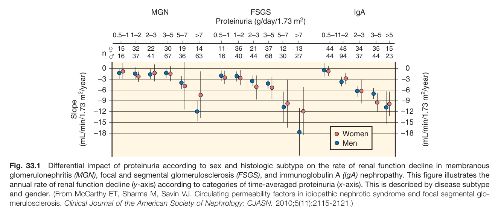
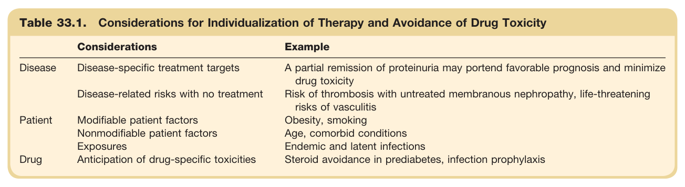
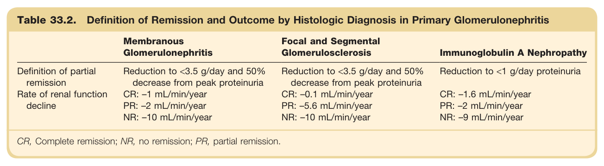

# 33. Treatment of Glomerulonephritis - Figures and Tables Index

This document lists all figures and tables extracted from `33. Treatment of Glomerulonephritis.pdf`.

## Table of Contents
- [Figures](#figures)
- [Tables](#tables)

---

## Figures

### Fig_33_1



Fig. 33.1 Differential impact of proteinuria according to sex and histologic subtype on the rate of renal function decline in membranous glomerulonephritis (MGN), focal and segmental glomerulosclerosis (FSGS), and immunoglobulin A (IgA) nephropathy. This figure illustrates the annual rate of renal function decline (y-axis) according to categories of time-averaged proteinuria (x-axis). This is described by disease subtype and gender. (From McCarthy ET, Sharma M, Savin VJ. Circulating permeability factors in idiopathic nephrotic syndrome and focal segmental glomerulosclerosis. Clinical Journal of the American Society of Nephrology: CJASN. 2010;5(11):2115-2121.)

---

## Tables

### Table_33_1

#### Table Image



#### Table Data (CSV: [Table_33_1.csv](Table_33_1.csv))

```markdown
| Table Text (OCR) |
| :--- |
| Table 33.1. Considerations for Individualization of Therapy and Avoidance of Drug Toxicity Considerations  Example    Disease  Disease-specific treatment targets  A partial remission of proteinuria may portend favorable prognosis and minimize drug toxicity    Disease-related risks with no treatment  Risk of thrombosis with untreated membranous nephropathy, life-threatening risks of vasculitis    Patient  Modifiable patient factors  Obesity, smoking    Nonmodifiable patient factors  Age, comorbid conditions    Exposures  Endemic and latent infections    Drug  Anticipation of drug-specific toxicities  Steroid avoidance in prediabetes, infection prophylaxis |
```

Table 33.1 Considerations for Individualization of Therapy and Avoidance of Drug Toxicity | Considerations | Example | | :--- | :--- | | **Disease** | | | Disease-specific treatment targets | A partial remission of proteinuria may portend favorable prognosis and minimize drug toxicity | | Disease-related risks with no treatment | Risk of thrombosis with untreated membranous nephropathy, life-threatening risks of vasculitis | | **Patient** | | | Modifiable patient factors | Obesity, smoking | | Nonmodifiable patient factors | Age, comorbid conditions | | Exposures | Endemic and latent infections | | **Drug** | | | Anticipation of drug-specific toxicities | Steroid avoidance in prediabetes, infection prophylaxis |

---

### Table_33_2

#### Table Image



#### Table Data (CSV: [Table_33_2.csv](Table_33_2.csv))

```markdown
| Table Text (OCR) |
| :--- |
| Table 33.2. Definition of Remission and Outcome by Histologic Diagnosis in Primary Glomerulonephritis Membranous Glomerulonephritis  Focal and Segmental Glomerulosclerosis  Immunoglobulin A Nephropathy    Definition of partial remission  Reduction to <3.5 g/day and 50% decrease from peak proteinuria  Reduction to <3.5 g/day and 50% decrease from peak proteinuria  Reduction to <1 g/day proteinuria    Rate of renal function decline  CR: -1 mL/min/year  CR: -0.1 mL/min/year  CR: -1.6 mL/min/year    PR: -2 mL/min/year  PR: -5.6 mL/min/year  PR: -2 mL/min/year    NR: -10 mL/min/year  NR: -10 mL/min/year  NR: -9 mL/min/year CR, Complete remission; NR, no remission; PR, partial remission. |
```

Table 33.2 Definition of Remission and Outcome by Histologic Diagnosis in Primary Glomerulonephritis | | Membranous Glomerulonephritis | Focal and Segmental Glomerulosclerosis | Immunoglobulin A Nephropathy | | :--- | :--- | :--- | :--- | | **Definition of partial remission** | Reduction to <3.5 g/day and 50% decrease from peak proteinuria | Reduction to <3.5 g/day and 50% decrease from peak proteinuria | Reduction to <1 g/day proteinuria | | **Rate of renal function decline** | CR: -1 mL/min/year<br>PR: -2 mL/min/year<br>NR: -10 mL/min/year | CR: -0.1 mL/min/year<br>PR: -5.6 mL/min/year<br>NR: -10 mL/min/year | CR: -1.6 mL/min/year<br>PR: -2 mL/min/year<br>NR: -9 mL/min/year | CR, Complete remission; NR, no remission; PR, partial remission.

---
