# 34. Thrombotic Microangiopathies - Figures and Tables Index

This document lists all figures, tables and boxes extracted from `34. Thrombotic Microangiopathies.pdf`.

## Table of Contents
- [Figures](#figures)
- [Tables](#tables)
- [Boxes](#boxes)

---

## Figures

### Fig_34_1

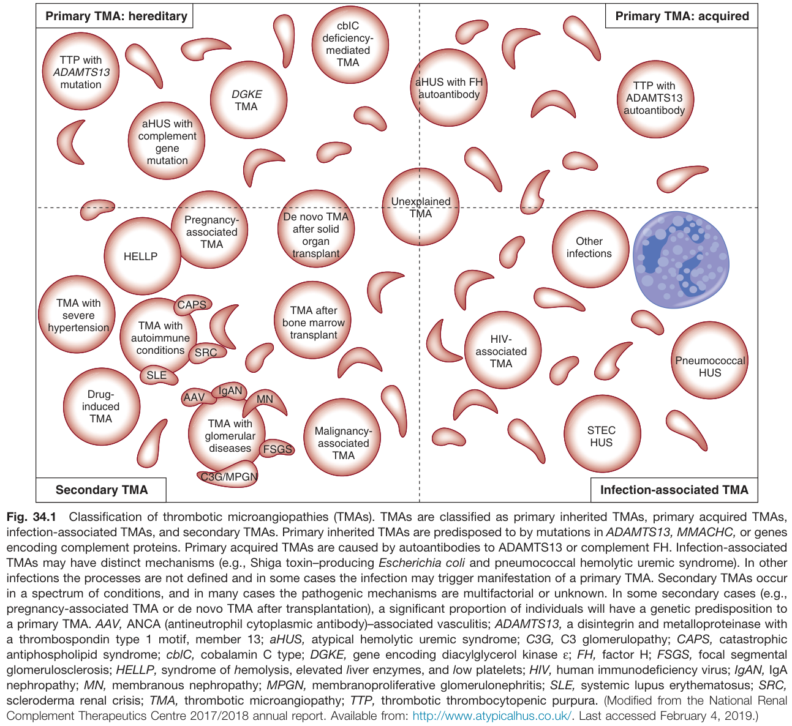

Fig. 34.1 Classification of thrombotic microangiopathies (TMAs). TMAs are classified as primary inherited TMAs, primary acquired TMAs, infection-associated TMAs, and secondary TMAs. Primary inherited TMAs are predisposed to by mutations in ADAMTS13, MMACHC, or genes encoding complement proteins. Primary acquired TMAs are caused by autoantibodies to ADAMTS13 or complement FH. Infection-associated TMAs may have distinct mechanisms (e.g., Shiga toxin-producing Escherichia coli and pneumococcal hemolytic uremic syndrome). In other infections the processes are not defined and in some cases the infection may trigger manifestation of a primary TMA. Secondary TMAs occur in a spectrum of conditions, and in many cases the pathogenic mechanisms are multifactorial or unknown. In some secondary cases (e.g., pregnancy-associated TMA or de novo TMA after transplantation), a significant proportion of individuals will have a genetic predisposition to a primary TMA. AAV, ANCA (antineutrophil cytoplasmic antibody)-associated vasculitis; ADAMTS13, a disintegrin and metalloproteinase with a thrombospondin type 1 motif, member 13; aHUS, atypical hemolytic uremic syndrome; C3G, C3 glomerulopathy; CAPS, catastrophic antiphospholipid syndrome; cbIC, cobalamin C type; DGKE, gene encoding diacylglycerol kinase ε; FH, factor H; FSGS, focal segmental glomerulosclerosis; HELLP, syndrome of hemolysis, elevated liver enzymes, and low platelets; HIV, human immunodeficiency virus; IgAN, IgA nephropathy; MN, membranous nephropathy; MPGN, membranoproliferative glomerulonephritis; SLE, systemic lupus erythematosus; SRC, scleroderma renal crisis; TMA, thrombotic microangiopathy; TTP, thrombotic thrombocytopenic purpura. (Modified from the National Renal Complement Therapeutics Centre 2017/2018 annual report. Available from: http://www.atypicalhus.co.uk/. Last accessed February 4, 2019.)

---

### Fig_34_2

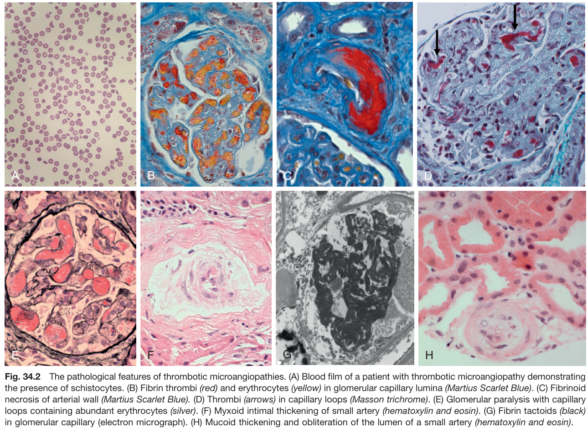

Fig. 34.2 The pathological features of thrombotic microangiopathies. (A) Blood film of a patient with thrombotic microangiopathy demonstrating the presence of schistocytes. (B) Fibrin thrombi (red) and erythrocytes (yellow) in glomerular capillary lumina (Martius Scarlet Blue). (C) Fibrinoid necrosis of arterial wall (Martius Scarlet Blue). (D) Thrombi (arrows) in capillary loops (Masson trichrome). (E) Glomerular paralysis with capillary loops containing abundant erythrocytes (silver). (F) Myxoid intimal thickening of small artery (hematoxylin and eosin). (G) Fibrin tactoids (black) in glomerular capillary (electron micrograph). (H) Mucoid thickening and obliteration of the lumen of a small artery (hematoxylin and eosin).

---

### Fig_34_3

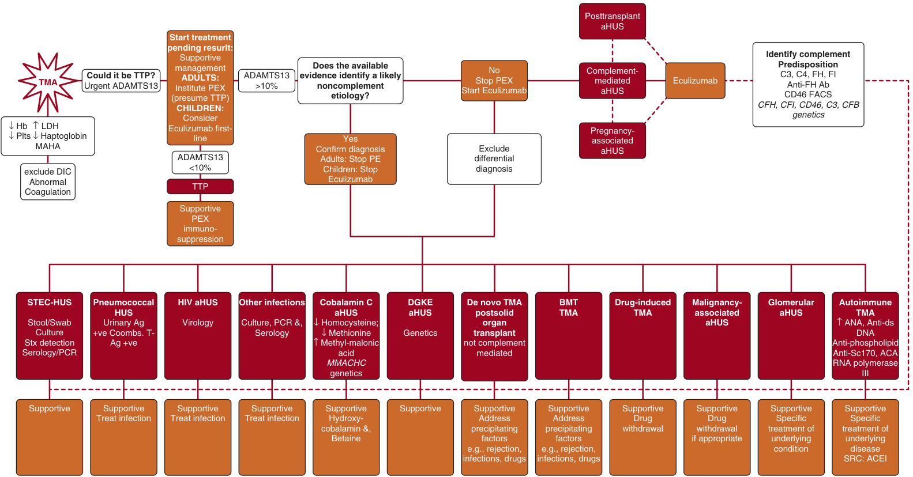

Fig. 34.3 Algorithm for the investigation and management of a patient presenting with thrombotic microangiopathy. Urgent treatment is critical given the high mortality if untreated. In adults, plasma exchange (PEX) should be instituted on the presumption that it is thrombocytopenic purpura (TTP) unless strong evidence suggests otherwise. In children, TTP is rarer and initial treatment with eculizumab should be considered if complement-mediated atypical hemolytic uremic syndrome (aHUS) is suspected and should not be delayed while ADAMTS13 activity is determined. There is no rapid diagnostic test which identifies complement-mediated aHUS in the acute phase and in those with ADAMTS13 activity greater than 10% without an obvious other etiology, eculizumab should be commenced. A diagnostic screen for noncomplement etiologies should then be commenced to determine optimal long-term treatment. Where eculizumab is not available, PEX should be continued until remission is established. Complement evaluation is recommended in all cases due to secondary causes of TMA unmasking latent complement defects. BMT, Bone marrow transplant; DGKE, diacylglycerol kinase ε; DIC, disseminated intravascular coagulation; FACS, fluorescence-activated cell sorting; FH, factor H; FI, factor I; Hb, hemoglobin; HIV, human immunodeficiency virus; LDH, lactate dehydrogenase; MAHA, microangiopathic hemolytic anemia; MMACHC, methylmalonic aciduria and homocystinuria type C protein; PCR, polymerase chain reaction; Plts, platelets; STEC-HUS, Shiga-toxin–producing Escherichia coli-HUS; TMA, thrombotic microangiopathy.

---

### Fig_34_4

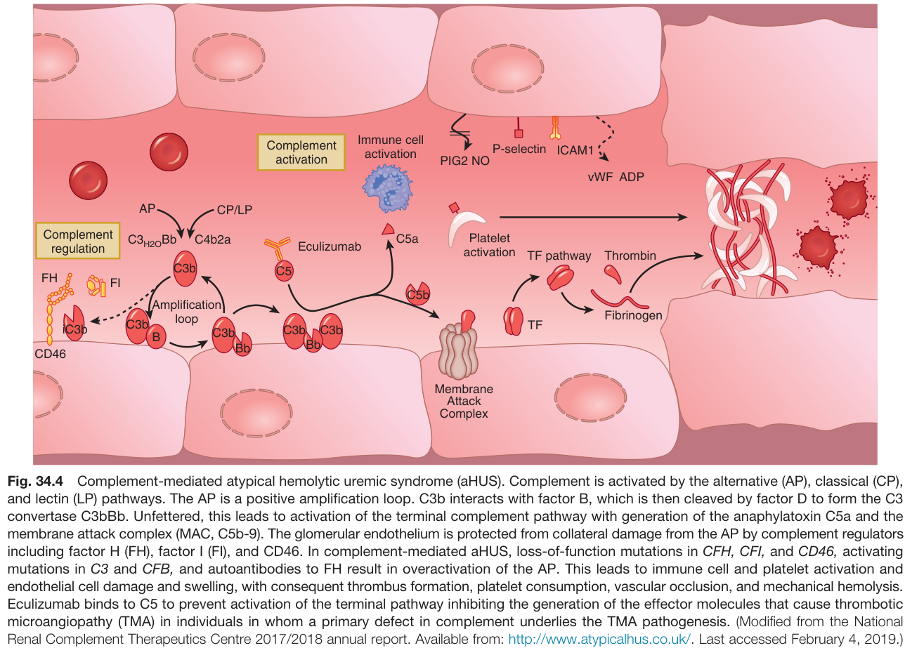

Fig. 34.4 Complement-mediated atypical hemolytic uremic syndrome (aHUS). Complement is activated by the alternative (AP), classical (CP), and lectin (LP) pathways. The AP is a positive amplification loop. C3b interacts with factor B, which is then cleaved by factor D to form the C3 convertase C3bBb. Unfettered, this leads to activation of the terminal complement pathway with generation of the anaphylatoxin C5a and the membrane attack complex (MAC, C5b-9). The glomerular endothelium is protected from collateral damage from the AP by complement regulators including factor H (FH), factor I (FI), and CD46. In complement-mediated aHUS, loss-of-function mutations in CFH, CFI, and CD46, activating mutations in C3 and CFB, and autoantibodies to FH result in overactivation of the AP. This leads to immune cell and platelet activation and endothelial cell damage and swelling, with consequent thrombus formation, platelet consumption, vascular occlusion, and mechanical hemolysis. Eculizumab binds to C5 to prevent activation of the terminal pathway inhibiting the generation of the effector molecules that cause thrombotic microangiopathy (TMA) in individuals in whom a primary defect in complement underlies the TMA pathogenesis. (Modified from the National Renal Complement Therapeutics Centre 2017/2018 annual report. Available from: http://www.atypicalhus.co.uk/. Last accessed February 4, 2019.)

---

### Fig_34_5

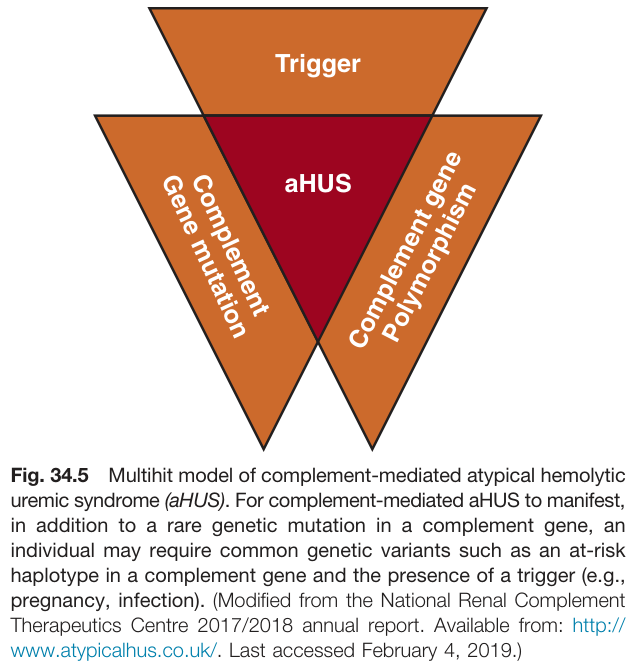

Fig. 34.5 Multihit model of complement-mediated atypical hemolytic uremic syndrome (aHUS). For complement-mediated aHUS to manifest, in addition to a rare genetic mutation in a complement gene, an individual may require common genetic variants such as an at-risk haplotype in a complement gene and the presence of a trigger (e.g., pregnancy, infection). (Modified from the National Renal Complement Therapeutics Centre 2017/2018 annual report. Available from: http:// www.atypicalhus.co.uk/. Last accessed February 4, 2019.)

---

### Fig_34_6

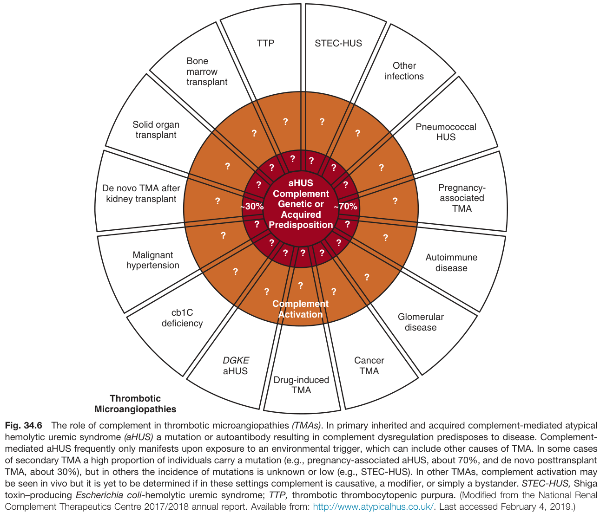

Fig. 34.6 The role of complement in thrombotic microangiopathies (TMAs). In primary inherited and acquired complement-mediated atypical hemolytic uremic syndrome (aHUS) a mutation or autoantibody resulting in complement dysregulation predisposes to disease. Complement-mediated aHUS frequently only manifests upon exposure to an environmental trigger, which can include other causes of TMA. In some cases of secondary TMA a high proportion of individuals carry a mutation (e.g., pregnancy-associated aHUS, about 70%, and de novo posttransplant TMA, about 30%), but in others the incidence of mutations is unknown or low (e.g., STEC-HUS). In other TMAs, complement activation may be seen in vivo but it is yet to be determined if in these settings complement is causative, a modifier, or simply a bystander. STEC-HUS, Shiga toxin-producing Escherichia coli-hemolytic uremic syndrome; TTP, thrombotic thrombocytopenic purpura. (Modified from the National Renal Complement Therapeutics Centre 2017/2018 annual report. Available from: http://www.atypicalhus.co.uk/. Last accessed February 4, 2019.)

---

### Fig_34_7

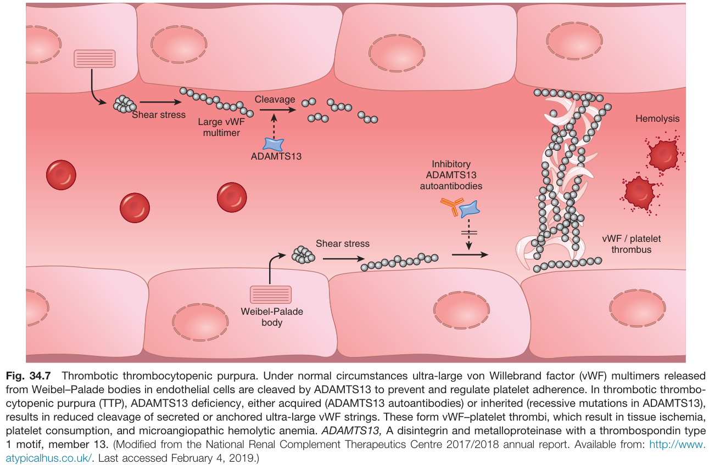

Fig. 34.7 Thrombotic thrombocytopenic purpura. Under normal circumstances ultra-large von Willebrand factor (vWF) multimers released from Weibel-Palade bodies in endothelial cells are cleaved by ADAMTS13 to prevent and regulate platelet adherence. In thrombotic thrombocytopenic purpura (TTP), ADAMTS13 deficiency, either acquired (ADAMTS13 autoantibodies) or inherited (recessive mutations in ADAMTS13), results in reduced cleavage of secreted or anchored ultra-large vWF strings. These form vWF-platelet thrombi, which result in tissue ischemia, platelet consumption, and microangiopathic hemolytic anemia. ADAMTS13, A disintegrin and metalloproteinase with a thrombospondin type 1 motif, member 13. (Modified from the National Renal Complement Therapeutics Centre 2017/2018 annual report. Available from: http://www. atypicalhus.co.uk/. Last accessed February 4, 2019.)

---

### Fig_34_8

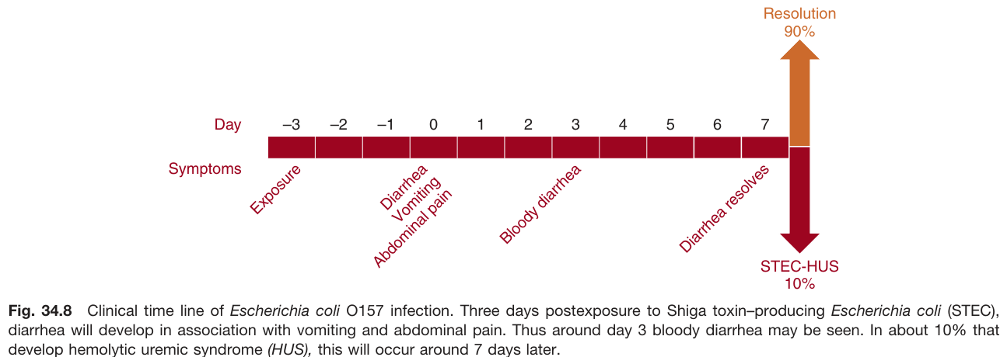

Fig. 34.8 Clinical time line of Escherichia coli O157 infection. Three days postexposure to Shiga toxin-producing Escherichia coli (STEC), diarrhea will develop in association with vomiting and abdominal pain. Thus around day 3 bloody diarrhea may be seen. In about 10% that develop hemolytic uremic syndrome (HUS), this will occur around 7 days later.

---

### Fig_34_9

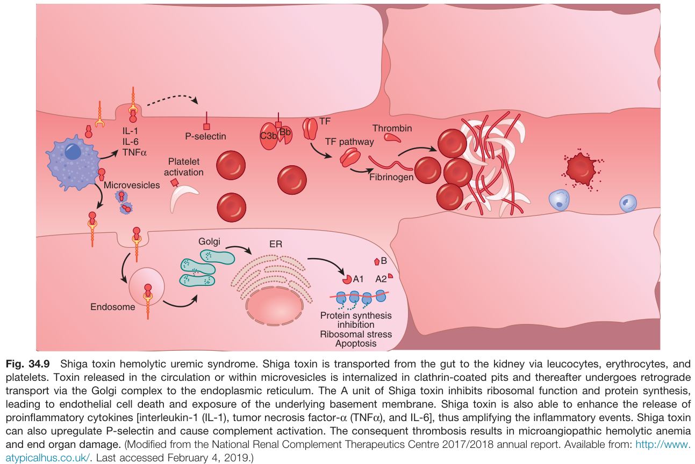

Fig. 34.9 Shiga toxin hemolytic uremic syndrome. Shiga toxin is transported from the gut to the kidney via leucocytes, erythrocytes, and platelets. Toxin released in the circulation or within microvesicles is internalized in clathrin-coated pits and thereafter undergoes retrograde transport via the Golgi complex to the endoplasmic reticulum. The A unit of Shiga toxin inhibits ribosomal function and protein synthesis, leading to endothelial cell death and exposure of the underlying basement membrane. Shiga toxin is also able to enhance the release of proinflammatory cytokines [interleukin-1 (IL-1), tumor necrosis factor-α (TNFα), and IL-6], thus amplifying the inflammatory events. Shiga toxin can also upregulate P-selectin and cause complement activation. The consequent thrombosis results in microangiopathic hemolytic anemia and end organ damage. (Modified from the National Renal Complement Therapeutics Centre 2017/2018 annual report. Available from: http://www. atypicalhus.co.uk/. Last accessed February 4, 2019.)

---

### Fig_34_10

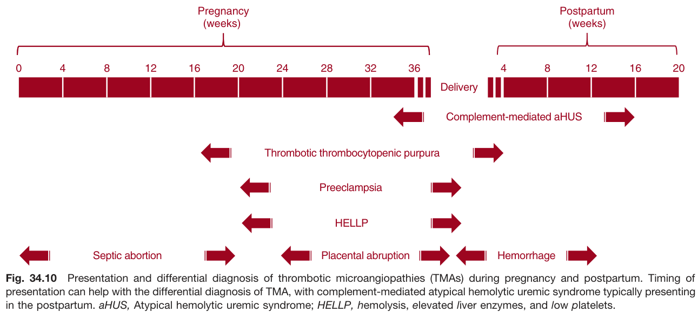

Fig. 34.10 Presentation and differential diagnosis of thrombotic microangiopathies (TMAs) during pregnancy and postpartum. Timing of presentation can help with the differential diagnosis of TMA, with complement-mediated atypical hemolytic uremic syndrome typically presenting in the postpartum. aHUS, Atypical hemolytic uremic syndrome; HELLP, hemolysis, elevated liver enzymes, and low platelets.

---

## Tables

*No tables resolved for this chapter.*

## Boxes

### Box_34_1

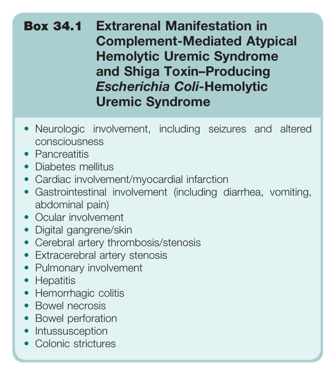

#### Box Text

```markdown
Box 34.1 Extrarenal Manifestation in Complement-Mediated Atypical Hemolytic Uremic Syndrome and Shiga Toxin–Producing Escherichia Coli-Hemolytic Uremic Syndrome • Neurologic involvement, including seizures and altered consciousness • Pancreatitis • Diabetes mellitus • Cardiac involvement/myocardial infarction • Gastrointestinal involvement (including diarrhea, vomiting, abdominal pain) • Ocular involvement • Digital gangrene/skin • Cerebral artery thrombosis/stenosis • Extracerebral artery stenosis • Pulmonary involvement • Hepatitis • Hemorrhagic colitis • Bowel necrosis • Bowel perforation • Intussusception • Colonic strictures
```

Box 34.1 Extrarenal Manifestation in Complement-Mediated Atypical Hemolytic Uremic Syndrome and Shiga Toxin-Producing Escherichia Coli-Hemolytic Uremic Syndrome * Neurologic involvement, including seizures and altered consciousness * Pancreatitis * Diabetes mellitus * Cardiac involvement/myocardial infarction * Gastrointestinal involvement (including diarrhea, vomiting, abdominal pain) * Ocular involvement * Digital gangrene/skin * Cerebral artery thrombosis/stenosis * Extracerebral artery stenosis * Pulmonary involvement * Hepatitis * Hemorrhagic colitis * Bowel necrosis * Bowel perforation * Intussusception * Colonic strictures

---

### Box_34_2

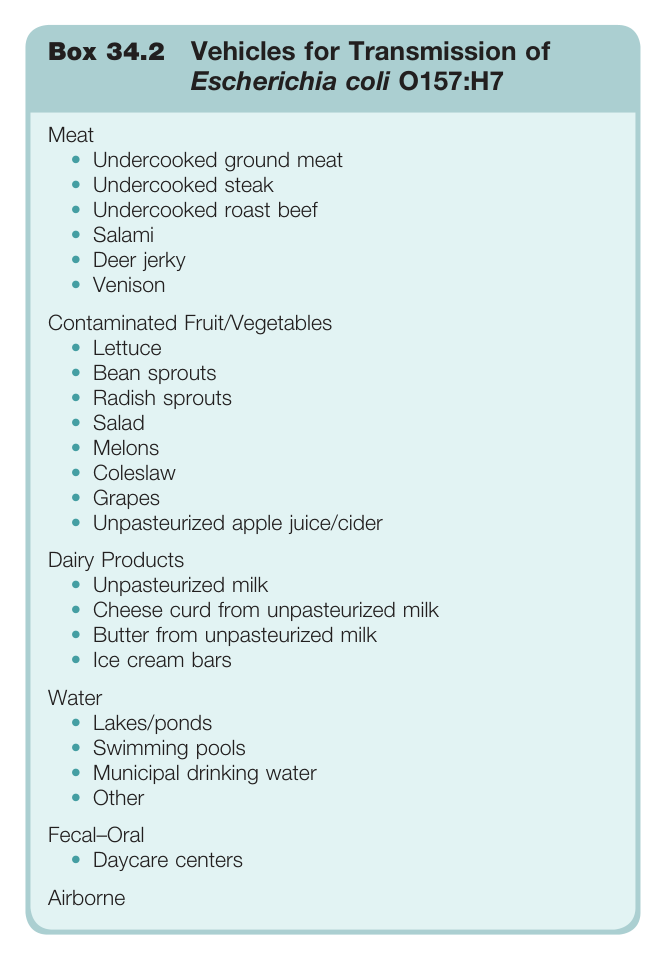

#### Box Text

```markdown
Box 34.2 Vehicles for Transmission of Escherichia coli 0157:H7 **Meat** * Undercooked ground meat * Undercooked steak * Undercooked roast beef * Salami * Deer jerky * Venison **Contaminated Fruit/Vegetables** * Lettuce * Bean sprouts * Radish sprouts * Salad * Melons * Coleslaw * Grapes * Unpasteurized apple juice/cider **Dairy Products** * Unpasteurized milk * Cheese curd from unpasteurized milk * Butter from unpasteurized milk * Ice cream bars **Water** * Lakes/ponds * Swimming pools * Municipal drinking water * Other **Fecal-Oral** * Daycare centers **Airborne**
```

Box 34.2 Vehicles for Transmission of Escherichia coli 0157:H7 **Meat** * Undercooked ground meat * Undercooked steak * Undercooked roast beef * Salami * Deer jerky * Venison **Contaminated Fruit/Vegetables** * Lettuce * Bean sprouts * Radish sprouts * Salad * Melons * Coleslaw * Grapes * Unpasteurized apple juice/cider **Dairy Products** * Unpasteurized milk * Cheese curd from unpasteurized milk * Butter from unpasteurized milk * Ice cream bars **Water** * Lakes/ponds * Swimming pools * Municipal drinking water * Other **Fecal-Oral** * Daycare centers **Airborne**

---

### Box_34_3

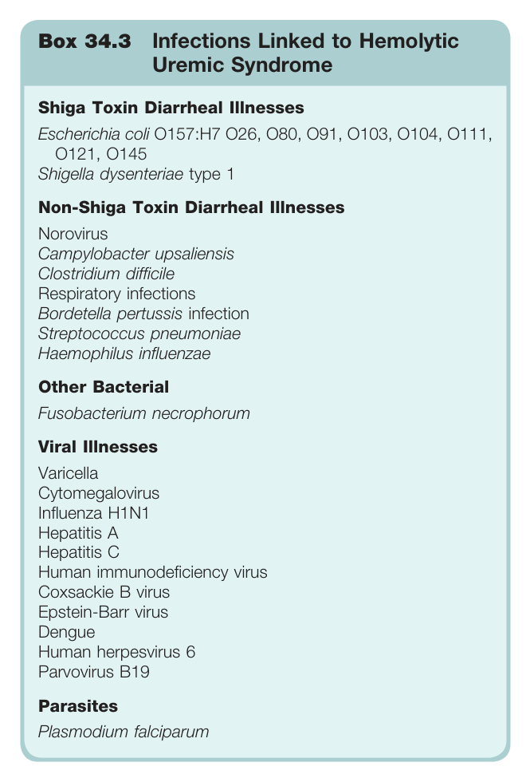

#### Box Text

```markdown
Box 34.3 Infections Linked to Hemolytic Uremic Syndrome **Shiga Toxin Diarrheal Illnesses** * Escherichia coli O157:H7 O26, 080, 091, 0103, 0104, 0111, 0121, 0145 * Shigella dysenteriae type 1 **Non-Shiga Toxin Diarrheal Illnesses** * Norovirus * Campylobacter upsaliensis * Clostridium difficile * Respiratory infections * Bordetella pertussis infection * Streptococcus pneumoniae * Haemophilus influenzae **Other Bacterial** * Fusobacterium necrophorum **Viral Illnesses** * Varicella * Cytomegalovirus * Influenza H1N1 * Hepatitis A * Hepatitis C * Human immunodeficiency virus * Coxsackie B virus * Epstein-Barr virus * Dengue * Human herpesvirus 6 * Parvovirus B19 **Parasites** * Plasmodium falciparum
```

Box 34.3 Infections Linked to Hemolytic Uremic Syndrome **Shiga Toxin Diarrheal Illnesses** * Escherichia coli O157:H7 O26, 080, 091, 0103, 0104, 0111, 0121, 0145 * Shigella dysenteriae type 1 **Non-Shiga Toxin Diarrheal Illnesses** * Norovirus * Campylobacter upsaliensis * Clostridium difficile * Respiratory infections * Bordetella pertussis infection * Streptococcus pneumoniae * Haemophilus influenzae **Other Bacterial** * Fusobacterium necrophorum **Viral Illnesses** * Varicella * Cytomegalovirus * Influenza H1N1 * Hepatitis A * Hepatitis C * Human immunodeficiency virus * Coxsackie B virus * Epstein-Barr virus * Dengue * Human herpesvirus 6 * Parvovirus B19 **Parasites** * Plasmodium falciparum

---

### Box_34_4

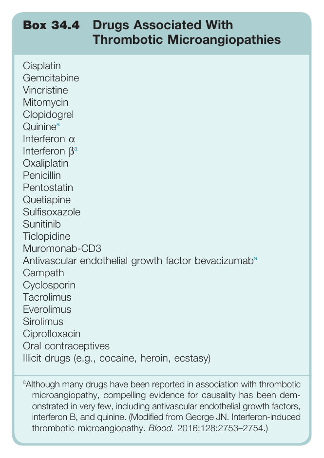

#### Box Text

```markdown
Box 34.4 Drugs Associated With Thrombotic Microangiopathies * Cisplatin * Gemcitabine * Vincristine * Mitomycin * Clopidogrel * Quinine * Interferon α * Interferon β * Oxaliplatin * Penicillin * Pentostatin * Quetiapine * Sulfisoxazole * Sunitinib * Ticlopidine * Muromonab-CD3 * Antivascular endothelial growth factor bevacizumab * Campath * Cyclosporin * Tacrolimus * Everolimus * Sirolimus * Ciprofloxacin * Oral contraceptives * Illicit drugs (e.g., cocaine, heroin, ecstasy) *Although many drugs have been reported in association with thrombotic microangiopathy, compelling evidence for causality has been demonstrated in very few, including antivascular endothelial growth factors, interferon B, and quinine. (Modified from George JN. Interferon-induced thrombotic microangiopathy. Blood. 2016;128:2753-2754.)*
```

Box 34.4 Drugs Associated With Thrombotic Microangiopathies * Cisplatin * Gemcitabine * Vincristine * Mitomycin * Clopidogrel * Quinine * Interferon α * Interferon β * Oxaliplatin * Penicillin * Pentostatin * Quetiapine * Sulfisoxazole * Sunitinib * Ticlopidine * Muromonab-CD3 * Antivascular endothelial growth factor bevacizumab * Campath * Cyclosporin * Tacrolimus * Everolimus * Sirolimus * Ciprofloxacin * Oral contraceptives * Illicit drugs (e.g., cocaine, heroin, ecstasy) *Although many drugs have been reported in association with thrombotic microangiopathy, compelling evidence for causality has been demonstrated in very few, including antivascular endothelial growth factors, interferon B, and quinine. (Modified from George JN. Interferon-induced thrombotic microangiopathy. Blood. 2016;128:2753-2754.)*

---
