# 35. Tubulointerstitial Diseases - Figures and Tables Index

This document lists all figures and tables extracted from `35. Tubulointerstitial Diseases.pdf`.

## Table of Contents
- [Figures](#figures)
- [Tables](#tables)

---

## Figures

### Fig_35_1

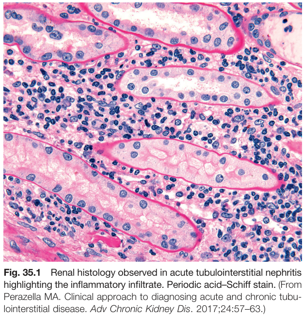

Fig. 35.1 Renal histology observed in acute tubulointerstitial nephritis highlighting the inflammatory infiltrate. Periodic acid-Schiff stain. (From Perazella MA. Clinical approach to diagnosing acute and chronic tubulointerstitial disease. Adv Chronic Kidney Dis. 2017;24:57-63.)

---

### Fig_35_2

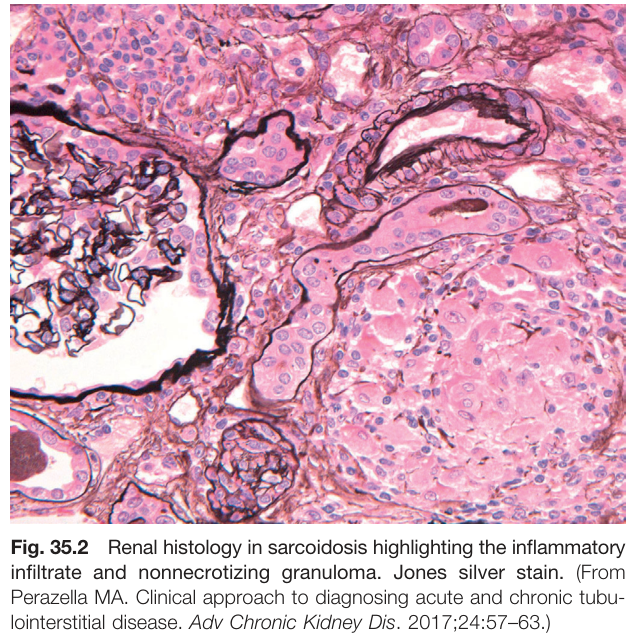

Fig. 35.2 Renal histology in sarcoidosis highlighting the inflammatory infiltrate and nonnecrotizing granuloma. Jones silver stain. (From Perazella MA. Clinical approach to diagnosing acute and chronic tubulointerstitial disease. Adv Chronic Kidney Dis. 2017;24:57-63.)

---

### Fig_35_3

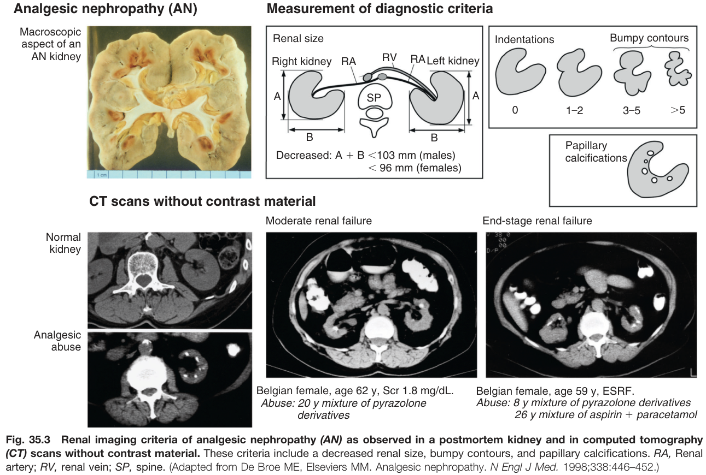

Fig. 35.3 Renal imaging criteria of analgesic nephropathy (AN) as observed in a postmortem kidney and in computed tomography (CT) scans without contrast material. These criteria include a decreased renal size, bumpy contours, and papillary calcifications. RA, Renal artery; RV, renal vein; SP, spine. (Adapted from De Broe ME, Elseviers MM. Analgesic nephropathy. N Engl J Med. 1998;338:446-452.)

---

### Fig_35_4

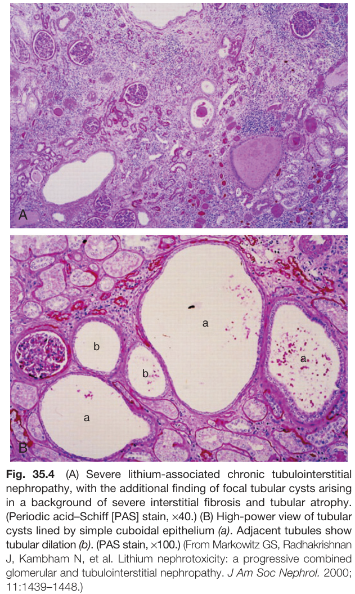

Fig. 35.4 (A) Severe lithium-associated chronic tubulointerstitial nephropathy, with the additional finding of focal tubular cysts arising in a background of severe interstitial fibrosis and tubular atrophy. (Periodic acid-Schiff [PAS] stain, x40.) (B) High-power view of tubular cysts lined by simple cuboidal epithelium (a). Adjacent tubules show tubular dilation (b). (PAS stain, x100.) (From Markowitz GS, Radhakrishnan J, Kambham N, et al. Lithium nephrotoxicity: a progressive combined glomerular and tubulointerstitial nephropathy. J Am Soc Nephrol. 2000; 11:1439-1448.)

---

### Fig_35_5

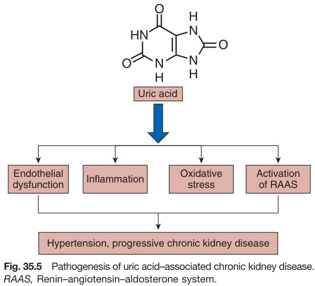

Fig. 35.5 Pathogenesis of uric acid-associated chronic kidney disease. RAAS, Renin-angiotensin-aldosterone system.

---

## Tables

### Table_35_1

#### Table Image

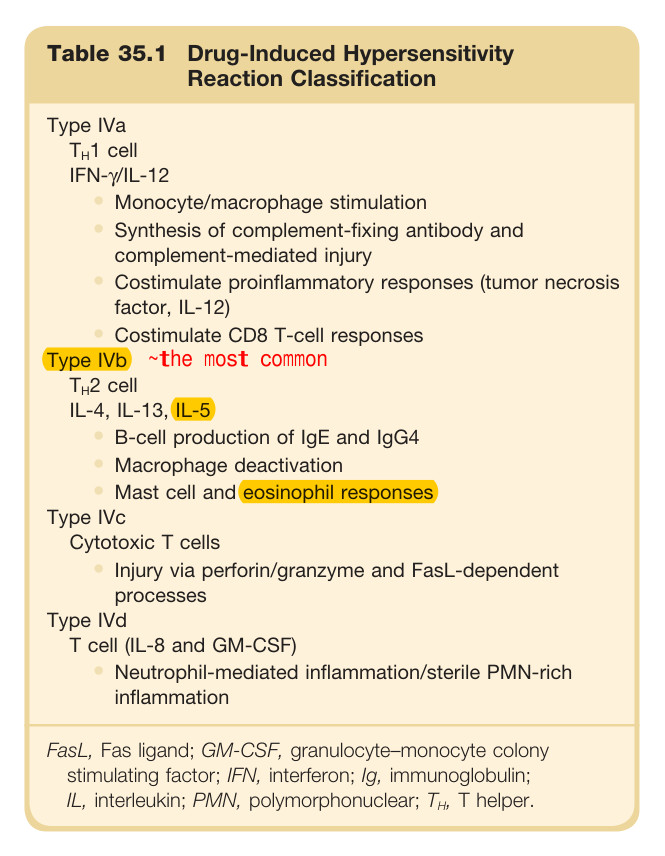

#### Table Data (CSV: [Table_35_1.csv](Table_35_1.csv))

```markdown
| Table Text (OCR) |
| :--- |
| Table 35.1 Drug-Induced Hypersensitivity Reaction Classification Type IVa     T_{H}1  cell    IFN-γ/IL-12    Monocyte/macrophage stimulationSynthesis of complement-fixing antibody and complement-mediated injuryCostimulate proinflammatory responses (tumor necrosis factor, IL-12)Costimulate CD8 T-cell responses    Type IVb ~the most common     T_{H}2  cell    IL-4, IL-13, IL-5    B-cell production of IgE and IgG4Macrophage deactivationMast cell and eosinophil responses    Type IVc    Cytotoxic T cellsInjury via perforin/granzyme and FasL-dependent processes    Type IVd    T cell (IL-8 and GM-CSF)Neutrophil-mediated inflammation/sterile PMN-rich inflammation FasL, Fas ligand; GM-CSF, granulocyte–monocyte colony stimulating factor; IFN, interferon; Ig, immunoglobulin; IL, interleukin; PMN, polymorphonuclear; T , T helper. |
```

Table 35.1 Drug-Induced Hypersensitivity Reaction Classification | Type | Cell | Cytokines | Effects | | :--- | :--- | :--- | :--- | | **Type IVa** | TH1 cell | IFN-γ/IL-12 | • Monocyte/macrophage stimulation<br>• Synthesis of complement-fixing antibody and complement-mediated injury<br>• Costimulate proinflammatory responses (tumor necrosis factor, IL-12)<br>• Costimulate CD8 T-cell responses | | **Type IVb** | TH2 cell | IL-4, IL-13, IL-5 | • B-cell production of IgE and IgG4<br>• Macrophage deactivation<br>• Mast cell and eosinophil responses | | **Type IVc** | Cytotoxic T cells | | • Injury via perforin/granzyme and FasL-dependent processes | | **Type IVd** | T cell | IL-8 and GM-CSF | • Neutrophil-mediated inflammation/sterile PMN-rich inflammation | *FasL, Fas ligand; GM-CSF, granulocyte-monocyte colony stimulating factor; IFN, interferon; Ig, immunoglobulin; IL, interleukin; PMN, polymorphonuclear; TH, T helper.*

---

### Table_35_2

#### Table Image

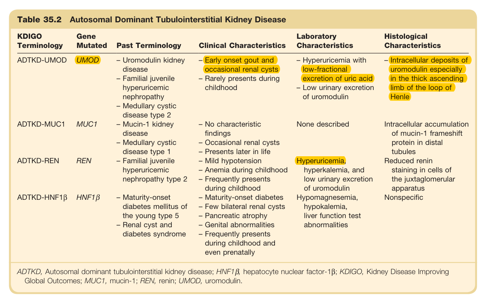

#### Table Data (CSV: [Table_35_2.csv](Table_35_2.csv))

```markdown
| Table Text (OCR) |
| :--- |
| Table 35.2 Autosomal Dominant Tubulointerstitial Kidney Disease KDIGO Terminology  Gene Mutated  Past Terminology  Clinical Characteristics  Laboratory Characteristics  Histological Characteristics    ADTKD-UMOD  UMOD  - Uromodulin kidney disease- Familial juvenile hyperuricemic nephropathy- Medullary cystic disease type 2  - Early onset gout and occasional renal cysts- Rarely presents during childhood  - Hyperuricemia with low-fractional excretion of uric acid- Low urinary excretion of uromodulin  - Intracellular deposits of uromodulin especially in the thick ascending limb of the loop of Henle    ADTKD-MUC1  MUC1  - Mucin-1 kidney disease- Medullary cystic disease type 1  - No characteristic findings- Occasional renal cysts- Presents later in life  None described  Intracellular accumulation of mucin-1 frameshift protein in distal tubules    ADTKD-REN  REN  - Familial juvenile hyperuricemic nephropathy type 2  - Mild hypotension- Anemia during childhood- Frequently presents during childhood  Hyperuricemia, hyperkalemia, and low urinary excretion of uromodulin  Reduced renin staining in cells of the juxtaglomerular apparatus    ADTKD-HNF1β  HNF1β  - Maturity-onset diabetes mellitus of the young type 5- Renal cyst and diabetes syndrome  - Maturity-onset diabetes- Few bilateral renal cysts- Pancreatic atrophy- Genital abnormalities- Frequently presents during childhood and even prenatally  Hypomagnesemia, hypokalemia, liver function test abnormalities  Nonspecific ADTKD, Autosomal dominant tubulointerstitial kidney disease; HNF1β, hepatocyte nuclear factor-1β; KDIGO, Kidney Disease Improving Global Outcomes; MUC1, mucin-1; REN, renin; UMOD, uromodulin. |
```

Table 35.2 Autosomal Dominant Tubulointerstitial Kidney Disease | KDIGO Terminology | Gene Mutated | Past Terminology | Clinical Characteristics | Laboratory Characteristics | Histological Characteristics | | :--- | :--- | :--- | :--- | :--- | :--- | | ADTKD-UMOD | UMOD | - Uromodulin kidney disease<br>- Familial juvenile hyperuricemic nephropathy<br>- Medullary cystic disease type 2 | - Early onset gout and occasional renal cysts<br>- Rarely presents during childhood | - Hyperuricemia with low-fractional excretion of uric acid<br>- Low urinary excretion of uromodulin | Intracellular deposits of uromodulin especially in the thick ascending limb of the loop of Henle | | ADTKD-MUC1 | MUC1 | - Mucin-1 kidney disease<br>- Medullary cystic disease type 1 | - No characteristic findings<br>- Occasional renal cysts<br>- Presents later in life | None described | Intracellular accumulation of mucin-1 frameshift protein in distal tubules | | ADTKD-REN | REN | - Familial juvenile hyperuricemic nephropathy type 2 | - Mild hypotension<br>- Anemia during childhood | Hyperuricemia, hyperkalemia, and low urinary excretion of uromodulin | Reduced renin staining in cells of the juxtaglomerular apparatus | | ADTKD-HNF1B | HNF1β | - Maturity-onset diabetes mellitus of the young type 5<br>- Renal cyst and diabetes syndrome | - Frequently presents during childhood<br>- Maturity-onset diabetes<br>- Few bilateral renal cysts<br>- Pancreatic atrophy<br>- Genital abnormalities<br>- Frequently presents during childhood and even prenatally | Hypomagnesemia, hypokalemia, liver function test abnormalities | Nonspecific | *ADTKD, Autosomal dominant tubulointerstitial kidney disease; HNF1β, hepatocyte nuclear factor-1β; KDIGO, Kidney Disease Improving Global Outcomes; MUC1, mucin-1; REN, renin; UMOD, uromodulin.*

---

### Table_35_3

#### Table Image

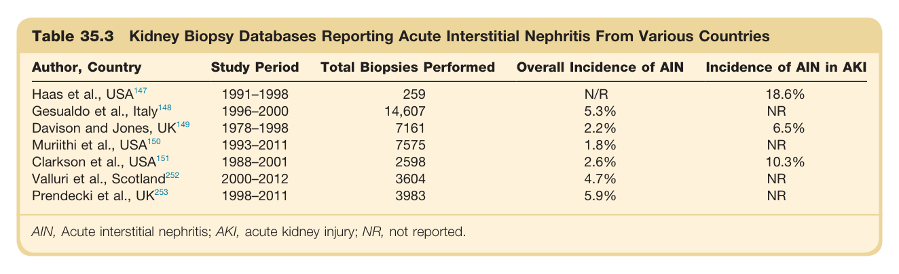

#### Table Data (CSV: [Table_35_3.csv](Table_35_3.csv))

```markdown
| Table Text (OCR) |
| :--- |
| Table 35.3 Kidney Biopsy Databases Reporting Acute Interstitial Nephritis From Various Countries Author, Country  Study Period  Total Biopsies Performed  Overall Incidence of AIN  Incidence of AIN in AKI    Haas et al.,  USA^{147}   1991–1998  259  N/R  18.6%    Gesualdo et al.,  Italy^{148}   1996–2000  14,607  5.3%  NR    Davison and Jones,  UK^{149}   1978–1998  7161  2.2%  6.5%    Muriithi et al.,  USA^{150}   1993–2011  7575  1.8%  NR    Clarkson et al.,  USA^{151}   1988–2001  2598  2.6%  10.3%    Valluri et al.,  Scotland^{252}   2000–2012  3604  4.7%  NR    Prendecki et al.,  UK^{253}   1998–2011  3983  5.9%  NR AIN, Acute interstitial nephritis; AKI, acute kidney injury; NR, not reported. |
```

Table 35.3 Kidney Biopsy Databases Reporting Acute Interstitial Nephritis From Various Countries | Author, Country | Study Period | Total Biopsies Performed | Overall Incidence of AIN | Incidence of AIN in AKI | | :--- | :--- | :--- | :--- | :--- | | Haas et al., USA | 1991-1998 | 359 | N/R | 18.6% | | Gesualdo et al., Italy | 1996-2000 | 14,607 | 3.3% | NR | | Davison and Jones, UK | 1978-1998 | 7571 | 2.2% | 4.5% | | Muriithi et al., USA | 1993-2011 | 751 | 1.0% | NR | | Clarkson et al., USA | 1988-2001 | 2598 | 2.6% | 10.3% | | Valluri et al., Scotland | 2000-2012 | 3604 | 4.1% | NR | | Prendecki et al., UK | 1998-2011 | 3083 | 5.9% | NR | *AIN, Acute interstitial nephritis; AKI, acute kidney injury; NR, not reported.*

---

### Table_35_4

#### Table Image

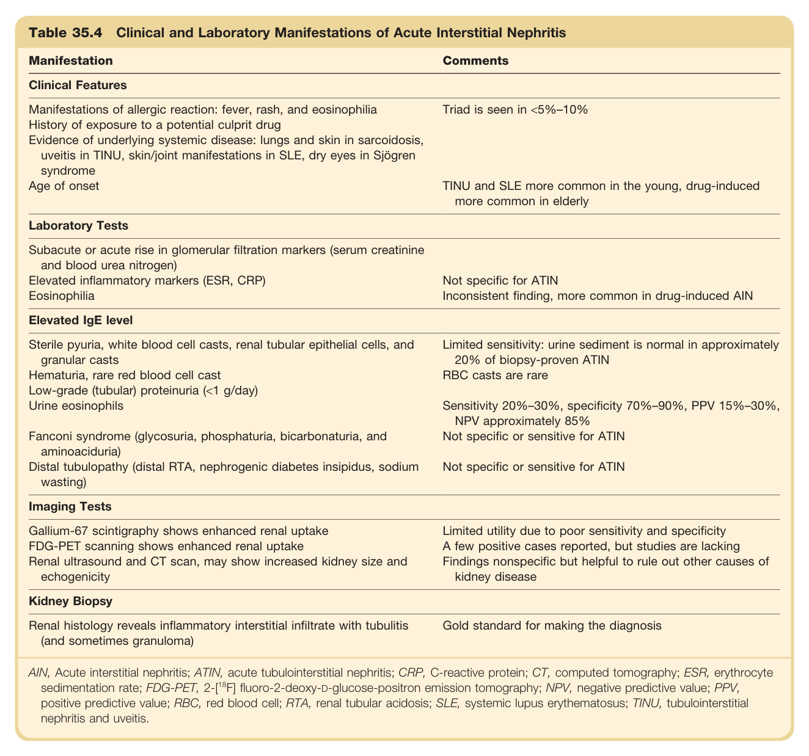

#### Table Data (CSV: [Table_35_4.csv](Table_35_4.csv))

```markdown
| Table Text (OCR) |
| :--- |
| Table 35.4 Clinical and Laboratory Manifestations of Acute Interstitial Nephritis Manifestation  Comments    Clinical Features    Manifestations of allergic reaction: fever, rash, and eosinophiliaHistory of exposure to a potential culprit drugEvidence of underlying systemic disease: lungs and skin in sarcoidosis, uveitis in TINU, skin/joint manifestations in SLE, dry eyes in Sjögren syndromeAge of onset  Triad is seen in <5%-10%TINU and SLE more common in the young, drug-induced more common in elderly    Laboratory Tests    Subacute or acute rise in glomerular filtration markers (serum creatinine and blood urea nitrogen)Elevated inflammatory markers (ESR, CRP)Eosinophilia  Not specific for ATINInconsistent finding, more common in drug-induced AIN    Elevated IgE level    Sterile pyuria, white blood cell casts, renal tubular epithelial cells, and granular castsHematuria, rare red blood cell castLow-grade (tubular) proteinuria (<1 g/day)Urine eosinophilsFanconi syndrome (glycosuria, phosphaturia, bicarbonaturia, and aminoaciduria)Distal tubulopathy (distal RTA, nephrogenic diabetes insipidus, sodium wasting)  Limited sensitivity: urine sediment is normal in approximately 20% of biopsy-proven ATINRBC casts are rareSensitivity 20%-30%, specificity 70%-90%, PPV 15%-30%, NPV approximately 85%Not specific or sensitive for ATINNot specific or sensitive for ATIN    Imaging Tests    Gallium-67 scintigraphy shows enhanced renal uptakeFDG-PET scanning shows enhanced renal uptakeRenal ultrasound and CT scan, may show increased kidney size and echogenicity  Limited utility due to poor sensitivity and specificityA few positive cases reported, but studies are lackingFindings nonspecific but helpful to rule out other causes of kidney disease    Kidney Biopsy    Renal histology reveals inflammatory interstitial infiltrate with tubulitis (and sometimes granuloma)  Gold standard for making the diagnosis    AIN, Acute interstitial nephritis; ATIN, acute tubulointerstitial nephritis; CRP, C-reactive protein; CT, computed tomography; ESR, erythrocyte sedimentation rate; FDG-PET, 2-[18F] fluoro-2-deoxy-D-glucose-positron emission tomography; NPV, negative predictive value; PPV, positive predictive value; RBC, red blood cell; RTA, renal tubular acidosis; SLE, systemic lupus erythematosus; TINU, tubulointerstitial nephritis and uveitis. |
```

Table 35.4 Clinical and Laboratory Manifestations of Acute Interstitial Nephritis | Manifestation | Comments | | :--- | :--- | | **Clinical Features** | | | Manifestations of allergic reaction: fever, rash, and eosinophilia | Triad is seen in <5%-10% | | History of exposure to a potential culprit drug | | | Evidence of underlying systemic disease: lungs and skin in sarcoidosis, uveitis in TINU, skin/joint manifestations in SLE, dry eyes in Sjögren syndrome | | | Age of onset | TINU and SLE more common in the young, drug-induced more common in elderly | | **Laboratory Tests** | | | Subacute or acute rise in glomerular filtration markers (serum creatinine and blood urea nitrogen) | | | Elevated inflammatory markers (ESR, CRP) | Not specific for ATIN | | Eosinophilia | Inconsistent finding, more common in drug-induced AIN | | Elevated IgE level | | | Sterile pyuria, white blood cell casts, renal tubular epithelial cells, and granular casts | Limited sensitivity: urine sediment is normal in approximately 20% of biopsy-proven ATIN | | Hematuria, rare red blood cell cast | RBC casts are rare | | Low-grade (tubular) proteinuria (<1 g/day) | | | Urine eosinophils | Sensitivity 20%-30%, specificity 70%-90%, PPV 15%-30%, NPV approximately 85% | | Fanconi syndrome (glycosuria, phosphaturia, bicarbonaturia, and aminoaciduria) | Not specific or sensitive for ATIN | | Distal tubulopathy (distal RTA, nephrogenic diabetes insipidus, sodium wasting) | Not specific or sensitive for ATIN | | **Imaging Tests** | | | Gallium-67 scintigraphy shows enhanced renal uptake | Limited utility due to poor sensitivity and specificity | | FDG-PET scanning shows enhanced renal uptake | A few positive cases reported, but studies are lacking | | Renal ultrasound and CT scan, may show increased kidney size and echogenicity | Findings nonspecific but helpful to rule out other causes of kidney disease | | **Kidney Biopsy** | | | Renal histology reveals inflammatory interstitial infiltrate with tubulitis (and sometimes granuloma) | Gold standard for making the diagnosis | *AIN, Acute interstitial nephritis; ATIN, acute tubulointerstitial nephritis; CRP, C-reactive protein; CT, computed tomography; ESR, erythrocyte sedimentation rate; FDG-PET, 2-[18F] fluoro-2-deoxy-D-glucose-positron emission tomography; NPV, negative predictive value; PPV, positive predictive value; RBC, red blood cell; RTA, renal tubular acidosis; SLE, systemic lupus erythematosus; TINU, tubulointerstitial nephritis and uveitis.*

---

### Table_35_5

#### Table Image

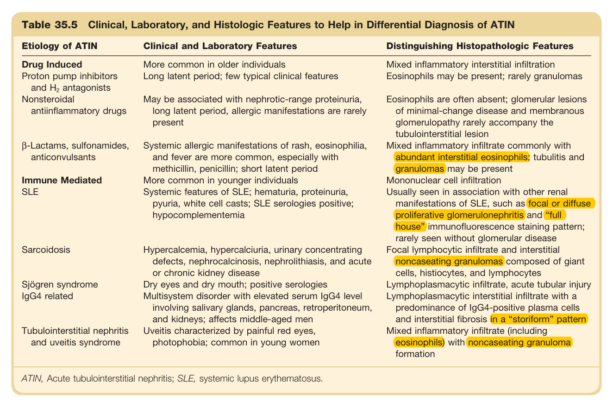

#### Table Data (CSV: [Table_35_5.csv](Table_35_5.csv))

```markdown
| Table Text (OCR) |
| :--- |
| Table 35.5 Clinical, Laboratory, and Histologic Features to Help in Differential Diagnosis of ATIN Etiology of ATIN  Clinical and Laboratory Features  Distinguishing Histopathologic Features    Drug Induced  More common in older individuals  Mixed inflammatory interstitial infiltration    Proton pump inhibitors and  H_{2}  antagonists  Long latent period; few typical clinical features  Eosinophils may be present; rarely granulomas    Nonsteroidal antiinflammatory drugs  May be associated with nephrotic-range proteinuria,long latent period, allergic manifestations are rarely present  Eosinophils are often absent; glomerular lesions of minimal-change disease and membranous glomerulopathy rarely accompany the tubulointerstitial lesion    β-Lactams, sulfonamides, anticonvulsants  Systemic allergic manifestations of rash, eosinophilia, and fever are more common, especially with methicillin, penicillin; short latent period  Mixed inflammatory infiltrate commonly with abundant interstitial eosinophils; tubulitis and granulomas may be present    Immune Mediated SLE  More common in younger individuals  Mononuclear cell infiltration    Systemic features of SLE; hematuria, proteinuria, pyuria, white cell casts; SLE serologies positive; hypocomplementemia  Usually seen in association with other renal manifestations of SLE, such as focal or diffuse proliferative glomerulonephritis and “full house” immunofluorescence staining pattern; rarely seen without glomerular disease    Sarcoidosis  Hypercalcemia, hypercalciuria, urinary concentrating defects, nephrocalcinosis, nephrolithiasis, and acute or chronic kidney disease  Focal lymphocytic infiltrate and interstitial noncaseating granulomas composed of giant cells, histiocytes, and lymphocytes    Sjögren syndrome  Dry eyes and dry mouth; positive serologies  Lymphoplasmacytic infiltrate, acute tubular injury    IgG4 related  Multisystem disorder with elevated serum IgG4 level involving salivary glands, pancreas, retroperitoneum, and kidneys; affects middle-aged men  Lymphoplasmacytic interstitial infiltrate with a predominance of IgG4-positive plasma cells and interstitial fibrosis in a “storiform” pattern    Tubulointerstitial nephritis and uveitis syndrome  Uveitis characterized by painful red eyes, photophobia; common in young women  Mixed inflammatory infiltrate (including eosinophils) with noncaseating granuloma formation ATIN, Acute tubulointerstitial nephritis; SLE, systemic lupus erythematosus. |
```

Table 35.5 Clinical, Laboratory, and Histologic Features to Help in Differential Diagnosis of ATIN | Etiology of ATIN | Clinical and Laboratory Features | Distinguishing Histopathologic Features | | :--- | :--- | :--- | | **Drug Induced** | | | | Proton pump inhibitors and H2 antagonists | More common in older individuals. Long latent period; few typical clinical features | Mixed inflammatory interstitial infiltration. Eosinophils may be present; rarely granulomas | | Nonsteroidal antiinflammatory drugs | May be associated with nephrotic-range proteinuria, long latent period, allergic manifestations are rarely present | Eosinophils are often absent; glomerular lesions of minimal-change disease and membranous glomerulopathy rarely accompany the tubulointerstitial lesion | | ẞ-Lactams, sulfonamides, anticonvulsants | Systemic allergic manifestations of rash, eosinophilia, and fever are more common, especially with methicillin, penicillin; short latent period | Mixed inflammatory infiltrate commonly with abundant interstitial eosinophils; tubulitis and granulomas may be present | | **Immune Mediated** | | | | SLE | More common in younger individuals. Systemic features of SLE; hematuria, proteinuria, pyuria, white cell casts; SLE serologies positive; hypocomplementemia | Mononuclear cell infiltration. Usually seen in association with other renal manifestations of SLE, such as focal or diffuse proliferative glomerulonephritis and "full house" immunofluorescence staining pattern; rarely seen without glomerular disease | | Sarcoidosis | Hypercalcemia, hypercalciuria, urinary concentrating defects, nephrocalcinosis, nephrolithiasis, and acute or chronic kidney disease | Focal lymphocytic infiltrate and interstitial noncaseating granulomas composed of giant cells, histiocytes, and lymphocytes | | Sjögren syndrome | Dry eyes and dry mouth; positive serologies | Lymphoplasmacytic infiltrate, acute tubular injury | | IgG4 related | Multisystem disorder with elevated serum IgG4 level involving salivary glands, pancreas, retroperitoneum, and kidneys; affects middle-aged men | Lymphoplasmacytic interstitial infiltrate with a predominance of IgG4-positive plasma cells and interstitial fibrosis in a "storiform" pattern | | Tubulointerstitial nephritis and uveitis syndrome | Uveitis characterized by painful red eyes, photophobia; common in young women | Mixed inflammatory infiltrate (including eosinophils) with noncaseating granuloma formation | *ATIN, Acute tubulointerstitial nephritis; SLE, systemic lupus erythematosus.*

---

### Table_35_6

#### Table Image

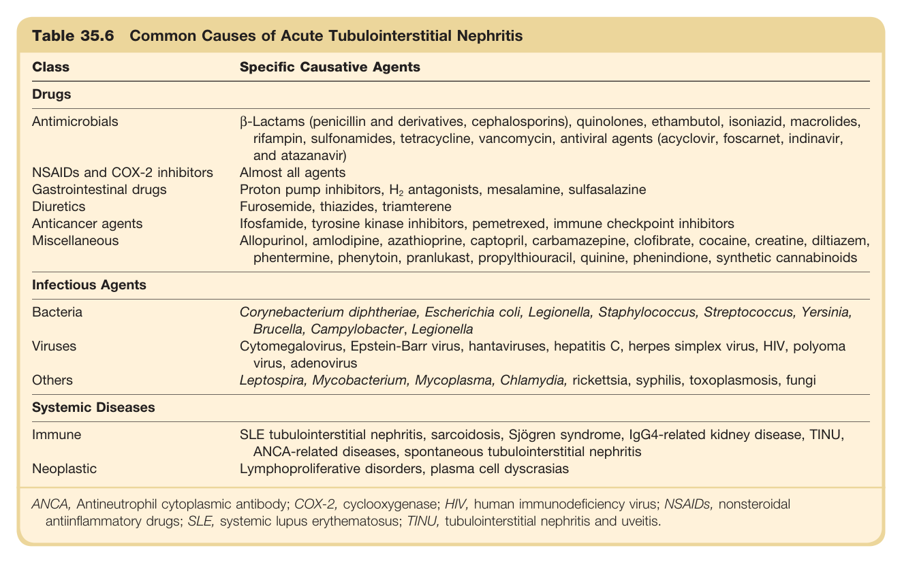

#### Table Data (CSV: [Table_35_6.csv](Table_35_6.csv))

```markdown
| Table Text (OCR) |
| :--- |
| Table 35.6 Common Causes of Acute Tubulointerstitial Nephritis Class  Specific Causative Agents    Drugs    Antimicrobials  β-Lactams (penicillin and derivatives, cephalosporins), quinolones, ethambutol, isoniazid, macrolides, rifampin, sulfonamides, tetracycline, vancomycin, antiviral agents (acyclovir, foscarnet, indinavir, and atazanavir)    NSAIDs and COX-2 inhibitors  Almost all agents    Gastrointestinal drugs  Proton pump inhibitors,  H_{2}  antagonists, mesalamine, sulfasalazine    Diuretics  Furosemide, thiazides, triamterene    Anticancer agents  Ifosfamide, tyrosine kinase inhibitors, pemetrexed, immune checkpoint inhibitors    Miscellaneous  Allopurinol, amlodipine, azathioprine, captopril, carbamazepine, clofibrate, cocaine, creatine, diltiazem, phentermine, phenytoin, pranlukast, propylthiouracil, quinine, phenindione, synthetic cannabinoids    Infectious Agents    Bacteria  Corynebacterium diphtheriae, Escherichia coli, Legionella, Staphylococcus, Streptococcus, Yersinia, Brucella, Campylobacter, Legionella    Viruses  Cytomegalovirus, Epstein-Barr virus, hantaviruses, hepatitis C, herpes simplex virus, HIV, polyoma virus, adenovirus    Others  Leptospira, Mycobacterium, Mycoplasma, Chlamydia, rickettsia, syphilis, toxoplasmosis, fungi    Systemic Diseases    Immune  SLE tubulointerstitial nephritis, sarcoidosis, Sjögren syndrome, IgG4-related kidney disease, TINU, ANCA-related diseases, spontaneous tubulointerstitial nephritis    Neoplastic  Lymphoproliferative disorders, plasma cell dyscrasias    ANCA, Antineutrophil cytoplasmic antibody; COX-2, cyclooxygenase; HIV, human immunodeficiency virus; NSAIDs, nonsteroidal antiinflammatory drugs; SLE, systemic lupus erythematosus; TINU, tubulointerstitial nephritis and uveitis. |
```

Table 35.6 Common Causes of Acute Tubulointerstitial Nephritis | Class | Specific Causative Agents | | :--- | :--- | | **Drugs** | | | Antimicrobials | ẞ-Lactams (penicillin and derivatives, cephalosporins), quinolones, ethambutol, isoniazid, macrolides, rifampin, sulfonamides, tetracycline, vancomycin, antiviral agents (acyclovir, foscarnet, indinavir, and atazanavir) | | NSAIDs and COX-2 inhibitors | Almost all agents | | Gastrointestinal drugs | Proton pump inhibitors, H₂ antagonists, mesalamine, sulfasalazine | | Diuretics | Furosemide, thiazides, triamterene | | Anticancer agents | Ifosfamide, tyrosine kinase inhibitors, pemetrexed, immune checkpoint inhibitors | | Miscellaneous | Allopurinol, amlodipine, azathioprine, captopril, carbamazepine, clofibrate, cocaine, creatine, diltiazem, phentermine, phenytoin, pranlukast, propylthiouracil, quinine, phenindione, synthetic cannabinoids | | **Infectious Agents** | | | Bacteria | Corynebacterium diphtheriae, Escherichia coli, Legionella, Staphylococcus, Streptococcus, Yersinia, Brucella, Campylobacter, Legionella | | Viruses | Cytomegalovirus, Epstein-Barr virus, hantaviruses, hepatitis C, herpes simplex virus, HIV, polyoma virus, adenovirus | | Others | Leptospira, Mycobacterium, Mycoplasma, Chlamydia, rickettsia, syphilis, toxoplasmosis, fungi | | **Systemic Diseases** | | | Immune | SLE tubulointerstitial nephritis, sarcoidosis, Sjögren syndrome, IgG4-related kidney disease, TINU, ANCA-related diseases, spontaneous tubulointerstitial nephritis | | Neoplastic | Lymphoproliferative disorders, plasma cell dyscrasias | *ANCA, Antineutrophil cytoplasmic antibody; COX-2, cyclooxygenase; HIV, human immunodeficiency virus; NSAIDs, nonsteroidal antiinflammatory drugs; SLE, systemic lupus erythematosus; TINU, tubulointerstitial nephritis and uveitis.*

---

### Table_35_7

#### Table Image

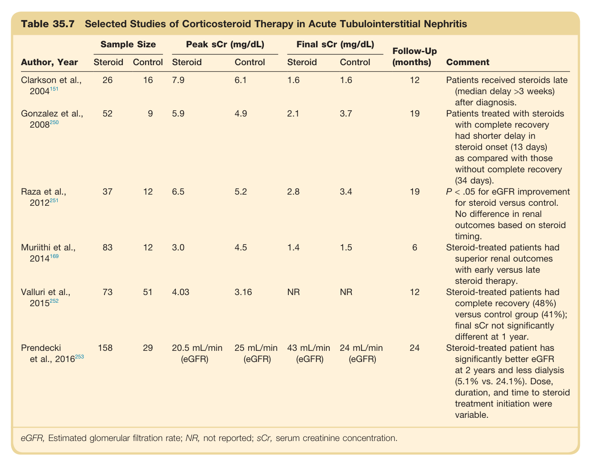

#### Table Data (CSV: [Table_35_7.csv](Table_35_7.csv))

```markdown
| Table Text (OCR) |
| :--- |
| Table 35.7 Selected Studies of Corticosteroid Therapy in Acute Tubulointerstitial Nephritis Author, Year  Sample Size  Peak sCr (mg/dL)  Final sCr (mg/dL)  Follow-Up (months)  Comment    Steroid  Control  Steroid  Control  Steroid  Control    Clarkson et al., 2004151  26  16  7.9  6.1  1.6  1.6  12  Patients received steroids late (median delay >3 weeks) after diagnosis.    Gonzalez et al., 2008250  52  9  5.9  4.9  2.1  3.7  19  Patients treated with steroids with complete recovery had shorter delay in steroid onset (13 days) as compared with those without complete recovery (34 days).    Raza et al., 2012251  37  12  6.5  5.2  2.8  3.4  19  P<.05 for eGFR improvement for steroid versus control. No difference in renal outcomes based on steroid timing.    Muriithi et al., 2014169  83  12  3.0  4.5  1.4  1.5  6  Steroid-treated patients had superior renal outcomes with early versus late steroid therapy.    Valluri et al., 2015252  73  51  4.03  3.16  NR  NR  12  Steroid-treated patients had complete recovery (48%) versus control group (41%); final sCr not significantly different at 1 year.    Prendecki et al., 2016253  158  29  20.5 mL/min (eGFR)  25 mL/min (eGFR)  43 mL/min (eGFR)  24 mL/min (eGFR)  24  Steroid-treated patient has significantly better eGFR at 2 years and less dialysis (5.1% vs. 24.1%). Dose, duration, and time to steroid treatment initiation were variable. eGFR, Estimated glomerular filtration rate; NR, not reported; sCr, serum creatinine concentration. |
```

Table 35.7 Selected Studies of Corticosteroid Therapy in Acute Tubulointerstitial Nephritis | Author, Year | Steroid | Control | Peak sCr (mg/dL) Steroid | Peak sCr (mg/dL) Control | Final sCr (mg/dL) Steroid | Final sCr (mg/dL) Control | Follow-Up (months) | Comment | | :--- | :--- | :--- | :--- | :--- | :--- | :--- | :--- | :--- | | Clarkson et al., 2004 | 26 | 16 | 7.9 | 6.1 | 1.6 | 1.6 | 12 | Patients received steroids late (median delay >3 weeks) after diagnosis. | | Gonzalez et al., 2008 | 52 | 9 | 5.9 | 4.9 | 2.1 | 3.7 | 19 | Patients treated with steroids with complete recovery had shorter delay in steroid onset (13 days) as compared with those without complete recovery (34 days). | | Raza et al., 2012 | 37 | 12 | 6.5 | 5.2 | 2.8 | 3.4 | 19 | P < .05 for eGFR improvement for steroid versus control. No difference in renal outcomes based on steroid timing. | | Muriithi et al., 2014 | 83 | 12 | 3.0 | 4.5 | 1.4 | 1.5 | 6 | Steroid-treated patients had superior renal outcomes with early versus late steroid therapy. | | Valluri et al., 2015 | 73 | 51 | 4.03 | 3.16 | NR | NR | 12 | Steroid-treated patients had complete recovery (48%) versus control group (41%); final sCr not significantly different at 1 year. | | Prendecki et al., 2016 | 158 | 29 | 20.5 mL/min (eGFR) | 25 mL/min (eGFR) | 43 mL/min (eGFR) | 24 mL/min (eGFR) | 24 | Steroid-treated patient has significantly better eGFR at 2 years and less dialysis (5.1% vs. 24.1%). Dose, duration, and time to steroid treatment initiation were variable. | *eGFR, Estimated glomerular filtration rate; NR, not reported; sCr, serum creatinine concentration.*

---

### Table_35_8

#### Table Image

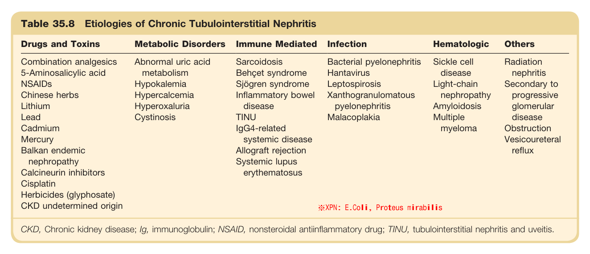

#### Table Data (CSV: [Table_35_8.csv](Table_35_8.csv))

```markdown
| Table Text (OCR) |
| :--- |
| Table 35.8 Etiologies of Chronic Tubulointerstitial Nephritis Drugs and Toxins  Metabolic Disorders  Immune Mediated  Infection  Hematologic  Others    Combination analgesics  Abnormal uric acid metabolism  Sarcoidosis  Bacterial pyelonephritis  Sickle cell disease  Radiation nephritis    5-Aminosalicylic acid  Behçet syndrome  Hantavirus    NSAIDs  Hypokalemia  Sjögren syndrome  Leptospirosis  Light-chain nephropathy  Secondary to progressive glomerular disease    Chinese herbs  Hypercalcemia  Inflammatory bowel disease  Xanthogranulomatous pyelonephritis  Amyloidosis    Lithium  Hyperoxaluria    Lead  Cystinosis  TINU  Malacoplakia  Multiple myeloma    Cadmium    IgG4-related systemic disease      Obstruction Vesicoureteral reflux    Mercury          Balkan endemic nephropathy    Allograft rejection        Calcineurin inhibitors    Systemic lupus erythematosus        Cisplatin            Herbicides (glyphosate)            CKD undetermined origin      ※XPN: E.Coli, Proteus mirabilis CKD, Chronic kidney disease; Ig, immunoglobulin; NSAID, nonsteroidal antiinflammatory drug; TINU, tubulointerstitial nephritis and uveitis. |
```

Table 35.8 Etiologies of Chronic Tubulointerstitial Nephritis | Category | Examples | | :--- | :--- | | **Drugs and Toxins** | Combination analgesics, 5-Aminosalicylic acid, NSAIDS, Chinese herbs, Lithium, Lead, Cadmium, Mercury, Balkan endemic nephropathy, Calcineurin inhibitors, Cisplatin, Herbicides (glyphosate), CKD undetermined origin | | **Metabolic Disorders** | Abnormal uric acid metabolism, Hypokalemia, Hypercalcemia, Hyperoxaluria, Cystinosis | | **Immune Mediated** | Sarcoidosis, Behçet syndrome, Sjögren syndrome, Inflammatory bowel disease, TINU, IgG4-related systemic disease, Allograft rejection, Systemic lupus erythematosus | | **Infection** | Bacterial pyelonephritis, Hantavirus, Leptospirosis, Xanthogranulomatous pyelonephritis, Malacoplakia | | **Hematologic** | Sickle cell disease, Light-chain nephropathy, Amyloidosis, Multiple myeloma | | **Others** | Radiation nephritis, Secondary to progressive glomerular disease, Obstruction, Vesicoureteral reflux | *CKD, Chronic kidney disease; Ig, immunoglobulin; NSAID, nonsteroidal antiinflammatory drug; TINU, tubulointerstitial nephritis and uveitis.*

---
