# 36. Urinary Tract Infection in Adults - Figures and Tables Index

This document lists all figures and tables extracted from `36. Urinary Tract Infection in Adults.pdf`.

## Table of Contents
- [Figures](#figures)
- [Tables](#tables)

---

## Figures

### Fig_36_1

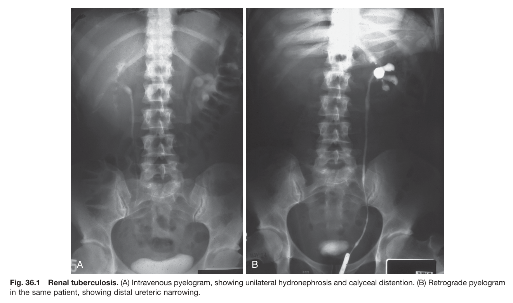

Fig. 36.1 Renal tuberculosis. (A) Intravenous pyelogram, showing unilateral hydronephrosis and calyceal distention. (B) Retrograde pyelogram in the same patient, showing distal ureteric narrowing.

---

## Tables

### Table_36_1

#### Table Image

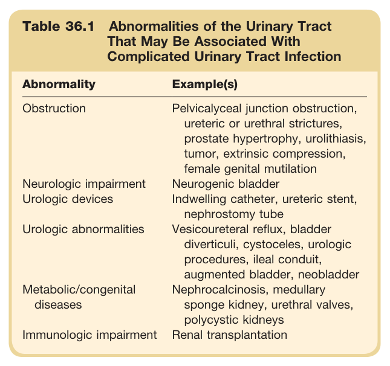

#### Table Data (CSV: [Table_36_1.csv](Table_36_1.csv))

```markdown
| Table Text (OCR) |
| :--- |
| Table 36.1 Abnormalities of the Urinary Tract That May Be Associated With Complicated Urinary Tract Infection Abnormality  Example(s)    Obstruction  Pelvicalyceal junction obstruction, ureteric or urethral strictures, prostate hypertrophy, urolithiasis, tumor, extrinsic compression, female genital mutilation    Neurologic impairment  Neurogenic bladder    Urologic devices  Indwelling catheter, ureteric stent, nephrostomy tube    Urologic abnormalities  Vesicoureteral reflux, bladder diverticuli, cystoceles, urologic procedures, ileal conduit, augmented bladder, neobladder    Metabolic/congenital diseases  Nephrocalcinosis, medullary sponge kidney, urethral valves, polycystic kidneys    Immunologic impairment  Renal transplantation |
```

Table 36.1 Abnormalities of the Urinary Tract That May Be Associated With Complicated Urinary Tract Infection | Abnormality | Example(s) | | :--- | :--- | | **Obstruction** | Pelvicalyceal junction obstruction, ureteric or urethral strictures, prostate hypertrophy, urolithiasis, tumor, extrinsic compression, female genital mutilation | | **Neurologic impairment** | Neurogenic bladder | | **Urologic devices** | Indwelling catheter, ureteric stent, nephrostomy tube | | **Urologic abnormalities** | Vesicoureteral reflux, bladder diverticuli, cystoceles, urologic procedures, ileal conduit, augmented bladder, neobladder | | **Metabolic/congenital diseases** | Nephrocalcinosis, medullary sponge kidney, urethral valves, polycystic kidneys | | **Immunologic impairment** | Renal transplantation |

---

### Table_36_2

#### Table Image

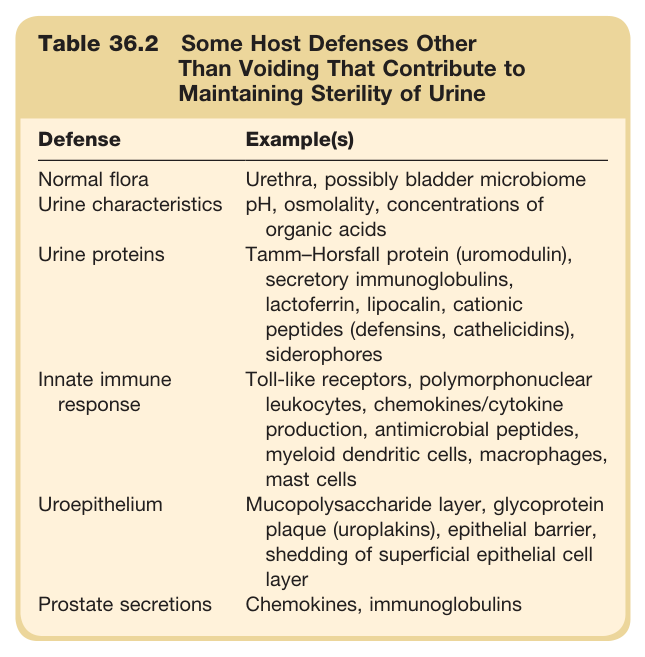

#### Table Data (CSV: [Table_36_2.csv](Table_36_2.csv))

```markdown
| Table Text (OCR) |
| :--- |
| Table 36.2 Some Host Defenses Other Than Voiding That Contribute to Maintaining Sterility of Urine Defense  Example(s)    Normal flora  Urethra, possibly bladder microbiome    Urine characteristics  pH, osmolality, concentrations of organic acids    Urine proteins  Tamm–Horsfall protein (uromodulin), secretory immunoglobulins, lactoferrin, lipocalin, cationic peptides (defensins, cathelicidins), siderophores    Innate immune response  Toll-like receptors, polymorphonuclear leukocytes, chemokines/cytokine production, antimicrobial peptides, myeloid dendritic cells, macrophages, mast cells    Uroepithelium  Mucopolysaccharide layer, glycoprotein plaque (uroplakins), epithelial barrier, shedding of superficial epithelial cell layer    Prostate secretions  Chemokines, immunoglobulins |
```

Table 36.2 Some Host Defenses Other Than Voiding That Contribute to Maintaining Sterility of Urine | Defense | Example(s) | | :--- | :--- | | **Normal flora** | Urethra, possibly bladder microbiome | | **Urine characteristics** | pH, osmolality, concentrations of organic acids | | **Urine proteins** | Tamm-Horsfall protein (uromodulin), secretory immunoglobulins, lactoferrin, lipocalin, cationic peptides (defensins, cathelicidins), siderophores | | **Innate immune response** | Toll-like receptors, polymorphonuclear leukocytes, chemokines/cytokine production, antimicrobial peptides, myeloid dendritic cells, macrophages, mast cells | | **Uroepithelium** | Mucopolysaccharide layer, glycoprotein plaque (uroplakins), epithelial barrier, shedding of superficial epithelial cell layer | | **Prostate secretions** | Chemokines, immunoglobulins |

---

### Table_36_3

#### Table Image

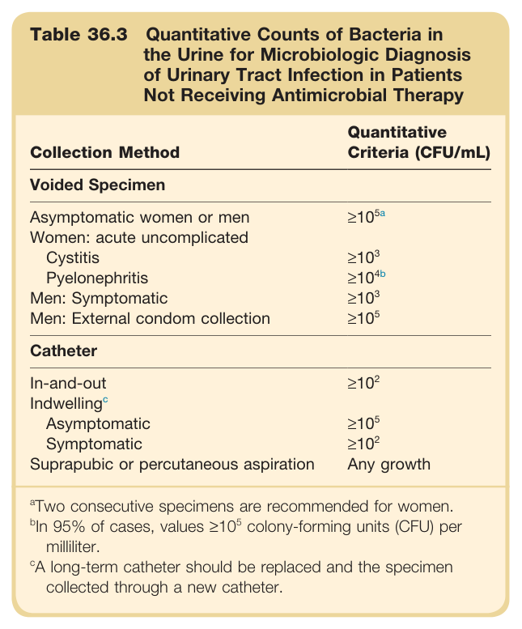

#### Table Data (CSV: [Table_36_3.csv](Table_36_3.csv))

```markdown
| Table Text (OCR) |
| :--- |
| Table 36.3 Quantitative Counts of Bacteria in the Urine for Microbiologic Diagnosis of Urinary Tract Infection in Patients Not Receiving Antimicrobial Therapy Collection Method  Quantitative Criteria (CFU/mL)    Voided Specimen    Asymptomatic women or men   \geq 10^{5a}     Women: acute uncomplicated      Cystitis   \geq 10^{3}     Pyelonephritis   \geq 10^{4b}     Men: Symptomatic   \geq 10^{3}     Men: External condom collection   \geq 10^{5}     Catheter    In-and-out   \geq 10^{2}     Indwellingc      Asymptomatic   \geq 10^{5}     Symptomatic   \geq 10^{2}     Suprapubic or percutaneous aspiration  Any growth <sup>a</sup>Two consecutive specimens are recommended for women. <sup>b</sup>In 95% of cases, values ≥10<sup>5</sup> colony-forming units (CFU) per milliliter. <sup>c</sup>A long-term catheter should be replaced and the specimen collected through a new catheter. |
```

Table 36.3 Quantitative Counts of Bacteria in the Urine for Microbiologic Diagnosis of Urinary Tract Infection in Patients Not Receiving Antimicrobial Therapy | Collection Method | Quantitative Criteria (CFU/mL) | | :--- | :--- | | **Voided Specimen** | | | Asymptomatic women or men | ≥10⁵ᵃ | | Women: acute uncomplicated Cystitis | ≥10³ | | Pyelonephritis | ≥10⁴ᵇ | | Men: Symptomatic | ≥10³ | | Men: External condom collection | ≥10⁵ | | **Catheter** | | | In-and-out | ≥10² | | Indwelling | | | Asymptomatic | ≥10⁵ | | Symptomatic | ≥10² | | Suprapubic or percutaneous aspiration | Any growth | *ᵃTwo consecutive specimens are recommended for women.* *ᵇIn 95% of cases, values ≥10⁵ colony-forming units (CFU) per milliliter.* *A long-term catheter should be replaced and the specimen collected through a new catheter.*

---

### Table_36_4

#### Table Images (2 Parts)

- **Part 1 (Page 5)**:
  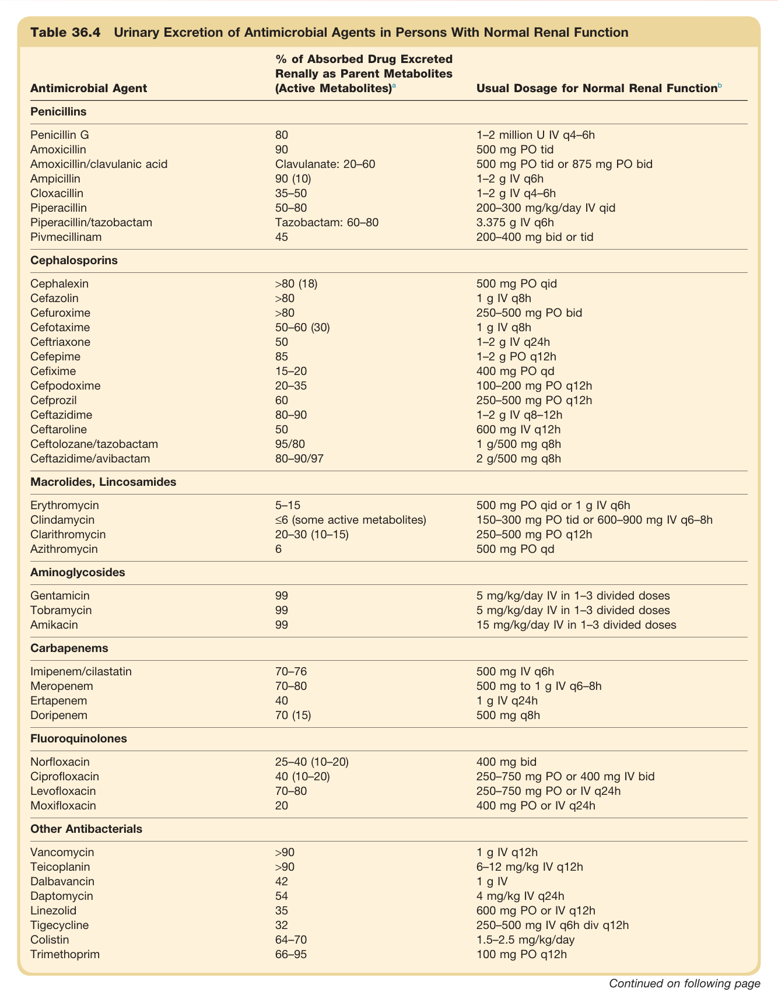

- **Part 2 (Page 6)**:
  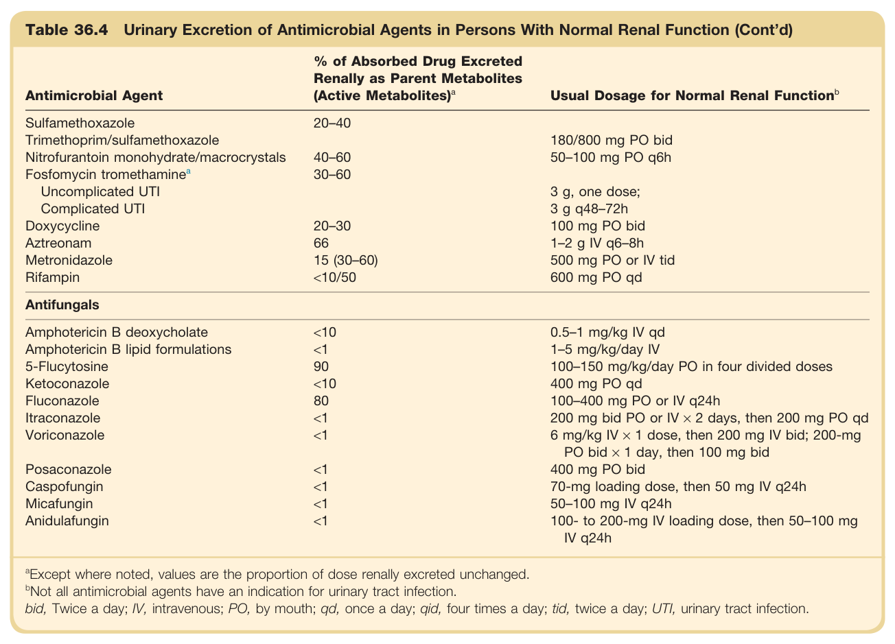

#### Table Data (CSV: [Table_36_4.csv](Table_36_4.csv))

```markdown
| Table Text (OCR) |
| :--- |
| Table 36.4 Urinary Excretion of Antimicrobial Agents in Persons With Normal Renal Function Antimicrobial Agent  % of Absorbed Drug Excreted Renally as Parent Metabolites (Active Metabolites) ^a   Usual Dosage for Normal Renal Function ^b     Penicillins    Penicillin G  80  1-2 million U IV q4-6h    Amoxicillin  90  500 mg PO tid    Amoxicillin/clavulanic acid  Clavulanate: 20-60  500 mg PO tid or 875 mg PO bid    Ampicillin  90 (10)  1-2 g IV q6h    Cloxacillin  35-50  1-2 g IV q4-6h    Piperacillin  50-80  200-300 mg/kg/day IV qid    Piperacillin/tazobactam  Tazobactam: 60-80  3.375 g IV q6h    Pivmecillinam  45  200-400 mg bid or tid    Cephalosporins    Cephalexin  >80 (18)  500 mg PO qid    Cefazolin  >80  1 g IV q8h    Cefuroxime  >80  250-500 mg PO bid    Cefotaxime  50-60 (30)  1 g IV q8h    Ceftriaxone  50  1-2 g IV q24h    Cefepime  85  1-2 g PO q12h    Cefixime  15-20  400 mg PO qd    Cefpodoxime  20-35  100-200 mg PO q12h    Cefprozil  60  250-500 mg PO q12h    Ceftazidime  80-90  1-2 g IV q8-12h    Ceftaroline  50  600 mg IV q12h    Ceftolozane/tazobactam  95/80  1 g/500 mg q8h    Ceftazidime/avibactam  80-90/97  2 g/500 mg q8h    Macrolides, Lincosamides    Erythromycin  5-15  500 mg PO qid or 1 g IV q6h    Clindamycin  ≤6 (some active metabolites)  150-300 mg PO tid or 600-900 mg IV q6-8h    Clarithromycin  20-30 (10-15)  250-500 mg PO q12h    Azithromycin  6  500 mg PO qd    Aminoglycosides    Gentamicin  99  5 mg/kg/day IV in 1-3 divided doses    Tobramycin  99  5 mg/kg/day IV in 1-3 divided doses    Amikacin  99  15 mg/kg/day IV in 1-3 divided doses    Carbapenems    Imipenem/cilastatin  70-76  500 mg IV q6h    Meropenem  70-80  500 mg to 1 g IV q6-8h    Ertapenem  40  1 g IV q24h    Doripenem  70 (15)  500 mg q8h    Fluoroquinolones    Norfloxacin  25-40 (10-20)  400 mg bid    Ciprofloxacin  40 (10-20)  250-750 mg PO or 400 mg IV bid    Levofloxacin  70-80  250-750 mg PO or IV q24h    Moxifloxacin  20  400 mg PO or IV q24h    Other Antibacterials    Vancomycin  >90  1 g IV q12h    Teicoplanin  >90  6-12 mg/kg IV q12h    Dalbavancin  42  1 g IV    Daptomycin  54  4 mg/kg IV q24h    Linezolid  35  600 mg PO or IV q12h    Tigecycline  32  250-500 mg IV q6h div q12h    Colistin  64-70  1.5-2.5 mg/kg/day    Trimethoprim  66-95  100 mg PO q12h    Sulfamethoxazole  20-40      Trimethoprim/sulfamethoxazole    180/800 mg PO bid    Nitrofurantoin monohydrate/macrocrystals  40-60  50-100 mg PO q6h     Fosfomycin\ tromethamine^a   30-60      Uncomplicated UTI    3 g, one dose;    Complicated UTI    3 g q48-72h    Doxycycline  20-30  100 mg PO bid    Aztreonam  66  1-2 g IV q6-8h    Metronidazole  15 (30-60)  500 mg PO or IV tid    Rifampin  <10/50  600 mg PO qd    Antifungals    Amphotericin B deoxycholate  <10  0.5-1 mg/kg IV qd    Amphotericin B lipid formulations  <1  1-5 mg/kg/day IV    5-Flucytosine  90  100-150 mg/kg/day PO in four divided doses    Ketoconazole  <10  400 mg PO qd    Fluconazole  80  100-400 mg PO or IV q24h    Itraconazole  <1  200 mg bid PO or IV × 2 days, then 200 mg PO qd    Voriconazole  <1  6 mg/kg IV × 1 dose, then 200 mg IV bid; 200-mg PO bid × 1 day, then 100 mg bid    Posaconazole  <1  400 mg PO bid    Caspofungin  <1  70-mg loading dose, then 50 mg IV q24h    Micafungin  <1  50-100 mg IV q24h    Anidulafungin  <1  100- to 200-mg IV loading dose, then 50-100 mg IV q24h <sup>a</sup>Except where noted, values are the proportion of dose renally excreted unchanged. <sup>b</sup>Not all antimicrobial agents have an indication for urinary tract infection. bid, Twice a day; IV, intravenous; PO, by mouth; qd, once a day; qid, four times a day; tid, twice a day; UTI, urinary tract infection. |
```

Table 36.4 Urinary Excretion of Antimicrobial Agents in Persons With Normal Renal Function | Antimicrobial Agent | % of Absorbed Drug Excreted Renally as Parent Metabolites (Active Metabolites)ᵃ | Usual Dosage for Normal Renal Functionᵇ | | :--- | :--- | :--- | | **Penicillins** | | | | Penicillin G | 80 | 1-2 million U IV q4-6h | | Amoxicillin | 90 | 500 mg PO tid | | Amoxicillin/clavulanic acid | Clavulanate: 20-60 | 500 mg PO tid or 875 mg PO bid | | Ampicillin | 90 (10) | 1-2 g IV q6h | | Cloxacillin | 35-50 | 1-2 g IV q4-6h | | Piperacillin | 50-80 | 200-300 mg/kg/day IV qid | | Piperacillin/tazobactam | Tazobactam: 60-80 | 3.375 g IV q6h | | Pivmecillinam | 45 | 200-400 mg bid or tid | | **Cephalosporins** | | | | Cephalexin | >80 (18) | 500 mg PO qid | | Cefazolin | >80 | 1 g IV q8h | | Cefuroxime | >80 | 250-500 mg PO bid | | Cefotaxime | 50-60 (30) | 1 g IV q8h | | Ceftriaxone | 50 | 1-2 g IV q24h | | Cefepime | 85 | 1-2 g PO q12h | | Cefixime | 15-20 | 400 mg PO qd | | Cefpodoxime | 20-35 | 100-200 mg PO q12h | | Cefprozil | 60 | 250-500 mg PO q12h | | Ceftazidime | 80-90 | 1-2 g IV q8-12h | | Ceftaroline | 50 | 600 mg IV q12h | | Ceftolozane/tazobactam | 95/80 | 1 g/500 mg q8h | | Ceftazidime/avibactam | 80-90/97 | 2 g/500 mg q8h | | **Macrolides, Lincosamides** | | | | Erythromycin | 5-15 | 500 mg PO qid or 1 g IV q6h | | Clindamycin | ≤6 (some active metabolites) | 150-300 mg PO tid or 600-900 mg IV q6-8h | | Clarithromycin | 20-30 (10-15) | 250-500 mg PO q12h | | Azithromycin | 6 | 500 mg PO qd | | **Aminoglycosides** | | | | Gentamicin | 99 | 5 mg/kg/day IV in 1-3 divided doses | | Tobramycin | 99 | 5 mg/kg/day IV in 1-3 divided doses | | Amikacin | 99 | 15 mg/kg/day IV in 1-3 divided doses | | **Carbapenems** | | | | Imipenem/cilastatin | 70-76 | 500 mg IV q6h | | Meropenem | 70-80 | 500 mg to 1 g IV q6-8h | | Ertapenem | 40 | 1 g IV q24h | | Doripenem | 70 (15) | 500 mg q8h | | **Fluoroquinolones** | | | | Norfloxacin | 25-40 (10-20) | 400 mg bid | | Ciprofloxacin | 40 (10-20) | 250-750 mg PO or 400 mg IV bid | | Levofloxacin | 70-80 | 250-750 mg PO or IV q24h | | Moxifloxacin | 20 | 400 mg PO or IV q24h | | **Other Antibacterials** | | | | Vancomycin | >90 | 1 g IV q12h | | Teicoplanin | >90 | 6-12 mg/kg IV q12h | | Dalbavancin | 42 | 1 g IV | | Daptomycin | 54 | 4 mg/kg IV q24h | | Linezolid | 35 | 600 mg PO or IV q12h | | Tigecycline | 32 | 250-500 mg IV q6h div q12h | | Colistin | 64-70 | 1.5-2.5 mg/kg/day | | Trimethoprim | 66-95 | 100 mg PO q12h | | **Sulfamethoxazole** | 20-40 | | | Trimethoprim/sulfamethoxazole | | 180/800 mg PO bid | | Nitrofurantoin monohydrate/macrocrystals | 40-60 | 50-100 mg PO q6h | | Fosfomycin tromethamineᵃ | 30-60 | | | Uncomplicated UTI | | 3 g, one dose; | | Complicated UTI | | 3 g q48-72h | | Doxycycline | 20-30 | 100 mg PO bid | | Aztreonam | 66 | 1-2 g IV q6-8h | | Metronidazole | 15 (30-60) | 500 mg PO or IV tid | | Rifampin | <10/50 | 600 mg PO qd | | **Antifungals** | | | | Amphotericin B deoxycholate | <10 | 0.5-1 mg/kg IV qd | | Amphotericin B lipid formulations | <1 | 1-5 mg/kg/day IV | | 5-Flucytosine | 90 | 100-150 mg/kg/day PO in four divided doses | | Ketoconazole | <10 | 400 mg PO qd | | Fluconazole | 80 | 100-400 mg PO or IV q24h | | Itraconazole | <1 | 200 mg bid PO or IV × 2 days, then 200 mg PO qd | | Voriconazole | <1 | 6 mg/kg IV x 1 dose, then 200 mg IV bid; 200-mg PO bid x 1 day, then 100 mg bid | | Posaconazole | <1 | 400 mg PO bid | | Caspofungin | <1 | 70-mg loading dose, then 50 mg IV q24h | | Micafungin | <1 | 50-100 mg IV q24h | | Anidulafungin | <1 | 100- to 200-mg IV loading dose, then 50-100 mg IV q24h | *ᵃExcept where noted, values are the proportion of dose renally excreted unchanged.* *ᵇNot all antimicrobial agents have an indication for urinary tract infection.* *bid, Twice a day; IV, intravenous; PO, by mouth; qd, once a day; qid, four times a day; tid, twice a day; UTI, urinary tract infection.*

---

### Table_36_5

#### Table Image

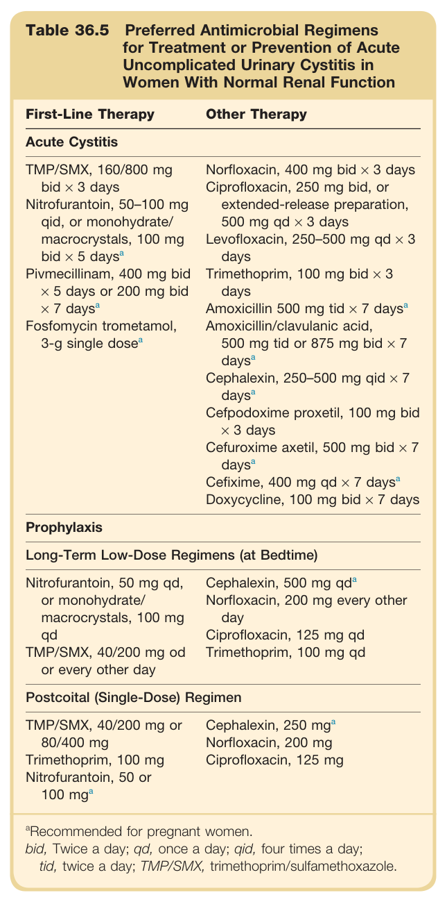

#### Table Data (CSV: [Table_36_5.csv](Table_36_5.csv))

```markdown
| Table Text (OCR) |
| :--- |
| Table 36.5 Preferred Antimicrobial Regimens for Treatment or Prevention of Acute Uncomplicated Urinary Cystitis in Women With Normal Renal Function First-Line Therapy  Other Therapy    Acute Cystitis    TMP/SMX, 160/800 mg bid × 3 daysNitrofurantoin, 50–100 mg qid, or monohydrate/ macrocrystals, 100 mg bid × 5 days ^{a} Pivmecillinam, 400 mg bid × 5 days or 200 mg bid × 7 days ^{a} Fosfomycin trometamol, 3-g single dose ^{a}   Norfloxacin, 400 mg bid × 3 daysCiprofloxacin, 250 mg bid, or extended-release preparation, 500 mg qd × 3 daysLevofloxacin, 250–500 mg qd × 3 daysTrimethoprim, 100 mg bid × 3 daysAmoxicillin 500 mg tid × 7 days ^{a} Amoxicillin/clavulanic acid, 500 mg tid or 875 mg bid × 7 days ^{a} Cephalexin, 250–500 mg qid × 7 days ^{a} Cefpodoxime proxetil, 100 mg bid × 3 daysCefuroxime axetil, 500 mg bid × 7 days ^{a} Cefixime, 400 mg qd × 7 days ^{a} Doxycycline, 100 mg bid × 7 days    Prophylaxis    Long-Term Low-Dose Regimens (at Bedtime)    Nitrofurantoin, 50 mg qd, or monohydrate/ macrocrystals, 100 mg qdTMP/SMX, 40/200 mg od or every other day  Cephalexin, 500 mg qdaNorfloxacin, 200 mg every other dayCiprofloxacin, 125 mg qdTrimethoprim, 100 mg qd    Postcoital (Single-Dose) Regimen    TMP/SMX, 40/200 mg or 80/400 mgTrimethoprim, 100 mgNitrofurantoin, 50 or 100 mga  Cephalexin, 250 mgaNorfloxacin, 200 mgCiprofloxacin, 125 mg     ^{a} Recommended for pregnant women.bid, Twice a day; qd, once a day; qid, four times a day; tid, twice a day; TMP/SMX, trimethoprim/sulfamethoxazole. |
```

Table 36.5 Preferred Antimicrobial Regimens for Treatment or Prevention of Acute Uncomplicated Urinary Cystitis in Women With Normal Renal Function | | First-Line Therapy | Other Therapy | | :--- | :--- | :--- | | **Acute Cystitis** | | | | | TMP/SMX, 160/800 mg bid × 3 days | Norfloxacin, 400 mg bid × 3 days | | | Nitrofurantoin, 50-100 mg qid, or monohydrate/macrocrystals, 100 mg bid x 5 daysª | Ciprofloxacin, 250 mg bid, or extended-release preparation, 500 mg qd × 3 days | | | Pivmecillinam, 400 mg bid × 5 days or 200 mg bid × 7 daysᵃ | Levofloxacin, 250-500 mg qd × 3 days | | | Fosfomycin trometamol, 3-g single doseᵃ | Trimethoprim, 100 mg bid × 3 days | | | | Amoxicillin 500 mg tid × 7 daysᵃ | | | | Amoxicillin/clavulanic acid, 500 mg tid or 875 mg bid x 7 daysᵃ | | | | Cephalexin, 250-500 mg qid x 7 daysᵃ | | | | Cefpodoxime proxetil, 100 mg bid × 3 days | | | | Cefuroxime axetil, 500 mg bid x 7 daysᵃ | | | | Cefixime, 400 mg qd × 7 daysᵃ | | | | Doxycycline, 100 mg bid x 7 days | | **Prophylaxis** | | | | **Long-Term Low-Dose Regimens (at Bedtime)** | | | | | Nitrofurantoin, 50 mg qd, or monohydrate/macrocrystals, 100 mg qd | Cephalexin, 500 mg qdᵃ | | | TMP/SMX, 40/200 mg od or every other day | Norfloxacin, 200 mg every other day | | | | Ciprofloxacin, 125 mg qd | | | | Trimethoprim, 100 mg qd | | **Postcoital (Single-Dose) Regimen** | | | | | TMP/SMX, 40/200 mg or 80/400 mg | Cephalexin, 250 mgᵃ | | | Trimethoprim, 100 mg | Norfloxacin, 200 mg | | | Nitrofurantoin, 50 or 100 mgᵃ | Ciprofloxacin, 125 mg | *ᵃRecommended for pregnant women.* *bid, Twice a day; qd, once a day; qid, four times a day; tid, twice a day; TMP/SMX, trimethoprim/sulfamethoxazole.*

---

### Table_36_6

#### Table Image

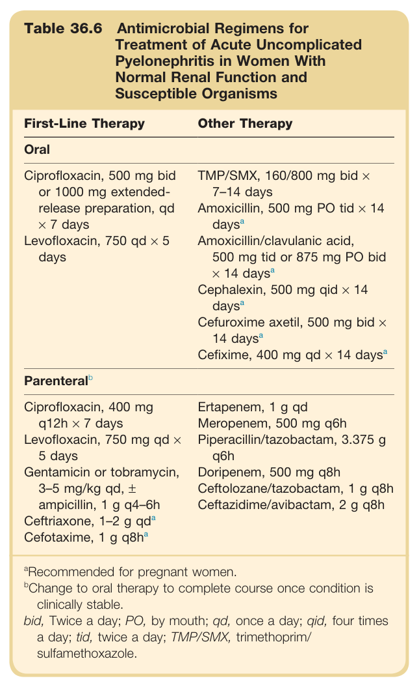

#### Table Data (CSV: [Table_36_6.csv](Table_36_6.csv))

```markdown
| Table Text (OCR) |
| :--- |
| Table 36.6 Antimicrobial Regimens for Treatment of Acute Uncomplicated Pyelonephritis in Women With Normal Renal Function and Susceptible Organisms First-Line Therapy  Other Therapy    Oral    Ciprofloxacin, 500 mg bid or 1000 mg extended-release preparation, qd × 7 daysLevofloxacin, 750 qd × 5 days  TMP/SMX, 160/800 mg bid × 7-14 daysAmoxicillin, 500 mg PO tid × 14 days ^{a} Amoxicillin/clavulanic acid, 500 mg tid or 875 mg PO bid × 14 days ^{a} Cephalexin, 500 mg qid × 14 days ^{a} Cefuroxime axetil, 500 mg bid × 14 days ^{a} Cefixime, 400 mg qd × 14 days ^{a}     Parenteral ^{b}     Ciprofloxacin, 400 mg q12h × 7 daysLevofloxacin, 750 mg qd × 5 daysGentamicin or tobramycin, 3-5 mg/kg qd, ± ampicillin, 1 g q4-6hCeftriaxone, 1-2 g qdaCefotaxime, 1 g q8ha  Ertapenem, 1 g qdMeropenem, 500 mg q6hPiperacillin/tazobactam, 3.375 g q6hDoripenem, 500 mg q8hCeftolozane/tazobactam, 1 g q8hCeftazidime/avibactam, 2 g q8h     ^{a} Recommended for pregnant women. ^{b} Change to oral therapy to complete course once condition is clinically stable.bid, Twice a day; PO, by mouth; qd, once a day; qid, four times a day; tid, twice a day; TMP/SMX, trimethoprim/sulfamethoxazole. |
```

Table 36.6 Antimicrobial Regimens for Treatment of Acute Uncomplicated Pyelonephritis in Women With Normal Renal Function and Susceptible Organisms | | First-Line Therapy | Other Therapy | | :--- | :--- | :--- | | **Oral** | | | | | Ciprofloxacin, 500 mg bid or 1000 mg extended-release preparation, qd × 7 days | TMP/SMX, 160/800 mg bid x 7-14 days | | | Levofloxacin, 750 qd x 5 days | Amoxicillin, 500 mg PO tid × 14 daysᵃ | | | | Amoxicillin/clavulanic acid, 500 mg tid or 875 mg PO bid × 14 daysᵃ | | | | Cephalexin, 500 mg qid × 14 daysᵃ | | | | Cefuroxime axetil, 500 mg bid x 14 daysᵃ | | | | Cefixime, 400 mg qd × 14 daysᵃ | | **Parenteralᵇ** | | | | | Ciprofloxacin, 400 mg q12h x 7 days | Ertapenem, 1 g qd | | | Levofloxacin, 750 mg qd x 5 days | Meropenem, 500 mg q6h | | | Gentamicin or tobramycin, 3-5 mg/kg qd, ± ampicillin, 1 g q4-6h | Piperacillin/tazobactam, 3.375 g q6h | | | Ceftriaxone, 1-2 g qdᵃ | Doripenem, 500 mg q8h | | | Cefotaxime, 1 g q8hᵃ | Ceftolozane/tazobactam, 1 g q8h | | | | Ceftazidime/avibactam, 2 g q8h | *ᵃRecommended for pregnant women.* *ᵇChange to oral therapy to complete course once condition is clinically stable.* *bid, Twice a day; PO, by mouth; qd, once a day; qid, four times a day; tid, twice a day; TMP/SMX, trimethoprim/sulfamethoxazole.*

---

### Table_36_7

#### Table Image

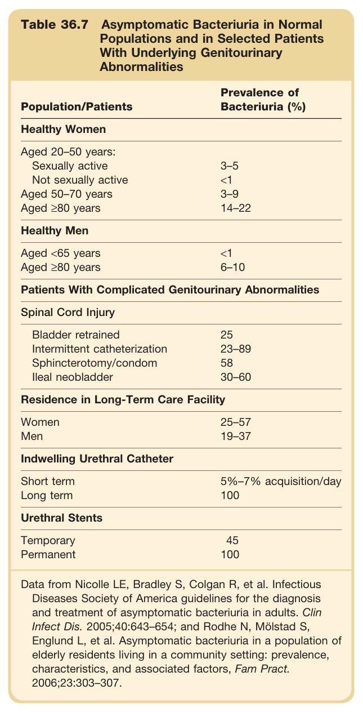

#### Table Data (CSV: [Table_36_7.csv](Table_36_7.csv))

```markdown
| Table Text (OCR) |
| :--- |
| Table 36.7 Asymptomatic Bacteriuria in Normal Populations and in Selected Patients With Underlying Genitourinary Abnormalities Population/Patients  Prevalence of Bacteriuria (%)    Healthy Women    Aged 20–50 years:      Sexually active  3–5    Not sexually active  <1    Aged 50–70 years  3–9    Aged ≥80 years  14–22    Healthy Men    Aged <65 years  <1    Aged ≥80 years  6–10    Patients With Complicated Genitourinary Abnormalities    Spinal Cord Injury    Bladder retrained  25    Intermittent catheterization  23–89    Sphincterotomy/condom  58    Ileal neobladder  30–60    Residence in Long-Term Care Facility    Women  25–57    Men  19–37    Indwelling Urethral Catheter    Short term  5%–7% acquisition/day    Long term  100    Urethral Stents    Temporary  45    Permanent  100    Data from Nicolle LE, Bradley S, Colgan R, et al. Infectious Diseases Society of America guidelines for the diagnosis and treatment of asymptomatic bacteriuria in adults. Clin Infect Dis. 2005;40:643–654; and Rodhe N, Mölstad S, Englund L, et al. Asymptomatic bacteriuria in a population of elderly residents living in a community setting: prevalence, characteristics, and associated factors, Fam Pract. 2006;23:303–307. |
```

Table 36.7 Asymptomatic Bacteriuria in Normal Populations and in Selected Patients With Underlying Genitourinary Abnormalities | Population/Patients | Prevalence of Bacteriuria (%) | | :--- | :--- | | **Healthy Women** | | | Aged 20-50 years: Sexually active | 3-5 | | Not sexually active | <1 | | Aged 50-70 years | 3-9 | | Aged ≥80 years | 14-22 | | **Healthy Men** | | | Aged <65 years | <1 | | Aged ≥80 years | 6-10 | | **Patients With Complicated Genitourinary Abnormalities** | | | **Spinal Cord Injury** | | | Bladder retrained | 25 | | Intermittent catheterization | 23-89 | | Sphincterotomy/condom | 58 | | Ileal neobladder | 30-60 | | **Residence in Long-Term Care Facility** | | | Women | 25-57 | | Men | 19-37 | | **Indwelling Urethral Catheter** | | | Short term | 5%-7% acquisition/day | | Long term | 100 | | **Urethral Stents** | | | Temporary | 45 | | Permanent | 100 |

---

### Table_36_8

#### Table Image

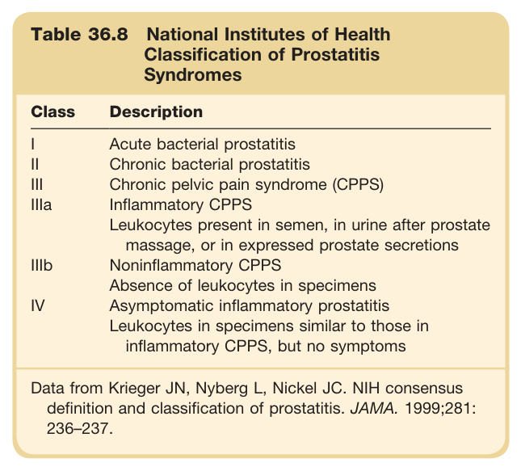

#### Table Data (CSV: [Table_36_8.csv](Table_36_8.csv))

```markdown
| Table Text (OCR) |
| :--- |
| Table 36.8 National Institutes of Health Classification of Prostatitis Syndromes Class  Description    I  Acute bacterial prostatitis    II  Chronic bacterial prostatitis    III  Chronic pelvic pain syndrome (CPPS)    IIIa  Inflammatory CPPS    Leukocytes present in semen, in urine after prostate massage, or in expressed prostate secretions    IIIb  Noninflammatory CPPS    Absence of leukocytes in specimens    IV  Asymptomatic inflammatory prostatitis    Leukocytes in specimens similar to those in inflammatory CPPS, but no symptoms    Data from Krieger JN, Nyberg L, Nickel JC. NIH consensus definition and classification of prostatitis. JAMA. 1999;281:236–237. |
```

Table 36.8 National Institutes of Health Classification of Prostatitis Syndromes | Class | Description | | :--- | :--- | | I | Acute bacterial prostatitis | | II | Chronic bacterial prostatitis | | III | Chronic pelvic pain syndrome (CPPS) | | IIIa | Inflammatory CPPS<br>Leukocytes present in semen, in urine after prostate massage, or in expressed prostate secretions | | IIIb | Noninflammatory CPPS<br>Absence of leukocytes in specimens | | IV | Asymptomatic inflammatory prostatitis<br>Leukocytes in specimens similar to those in inflammatory CPPS, but no symptoms |

---

### Table_36_9

#### Table Image

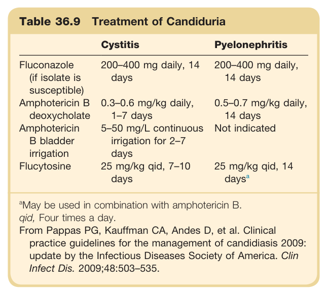

#### Table Data (CSV: [Table_36_9.csv](Table_36_9.csv))

```markdown
| Table Text (OCR) |
| :--- |
| Table 36.9 Treatment of Candiduria Cystitis  Pyelonephritis    Fluconazole (if isolate is susceptible)  200–400 mg daily, 14 days  200–400 mg daily, 14 days    Amphotericin B deoxycholate  0.3–0.6 mg/kg daily, 1–7 days  0.5–0.7 mg/kg daily, 14 days    Amphotericin B bladder irrigation  5–50 mg/L continuous irrigation for 2–7 days  Not indicated    Flucytosine  25 mg/kg qid, 7–10 days  25 mg/kg qid, 14 days ^a <sup>a</sup>May be used in combination with amphotericin B. qid, Four times a day. From Pappas PG, Kauffman CA, Andes D, et al. Clinical practice guidelines for the management of candidiasis 2009: update by the Infectious Diseases Society of America. Clin Infect Dis. 2009;48:503–535. |
```

Table 36.9 Treatment of Candiduria | | Cystitis | Pyelonephritis | | :--- | :--- | :--- | | Fluconazole (if isolate is susceptible) | 200-400 mg daily, 14 days | 200-400 mg daily, 14 days | | Amphotericin B deoxycholate | 0.3-0.6 mg/kg daily, 1-7 days | 0.5-0.7 mg/kg daily, 14 days | | Amphotericin B bladder irrigation | 5-50 mg/L continuous irrigation for 2-7 days | Not indicated | | Flucytosine | 25 mg/kg qid, 7-10 days | 25 mg/kg qid, 14 daysᵃ | *ᵃMay be used in combination with amphotericin B.* *qid, Four times a day.* *From Pappas PG, Kauffman CA, Andes D, et al. Clinical practice guidelines for the management of candidiasis 2009: update by the Infectious Diseases Society of America. Clin Infect Dis. 2009;48:503-535.*

---
