# 37. Urinary Tract Obstruction - Figures and Tables Index

This document lists all figures, tables and boxes extracted from `37. Urinary Tract Obstruction.pdf`.

## Table of Contents
- [Figures](#figures)
- [Tables](#tables)
- [Boxes](#boxes)

---

## Figures

### Fig_37_1

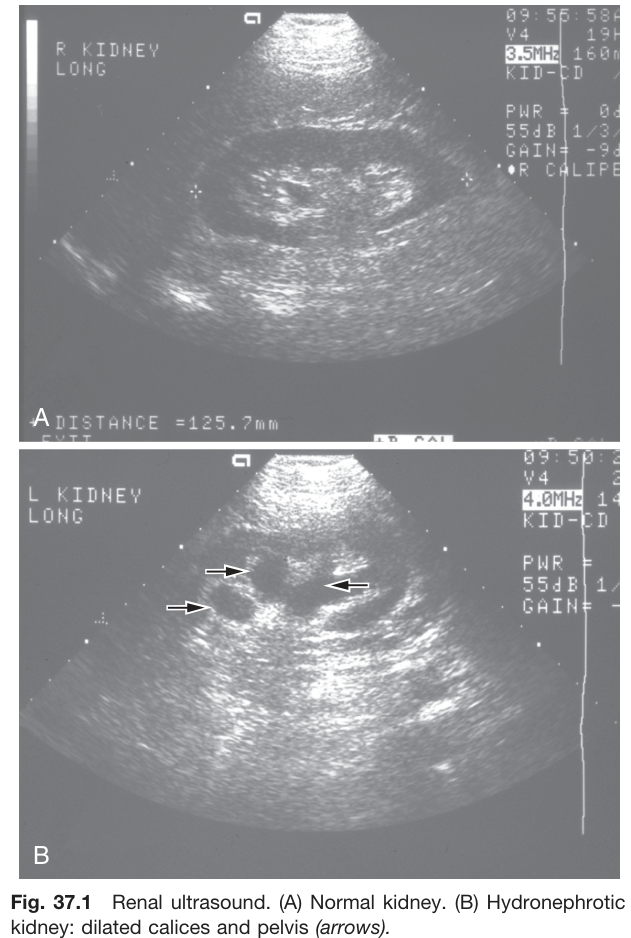

Fig. 37.1 Renal ultrasound. (A) Normal kidney. (B) Hydronephrotic kidney: dilated calices and pelvis (arrows).

---

### Fig_37_2

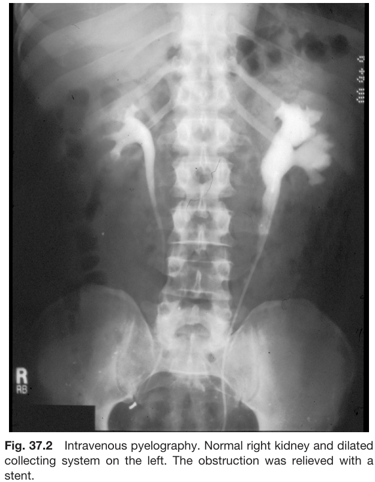

Fig. 37.2 Intravenous pyelography. Normal right kidney and dilated collecting system on the left. The obstruction was relieved with a stent.

---

### Fig_37_3

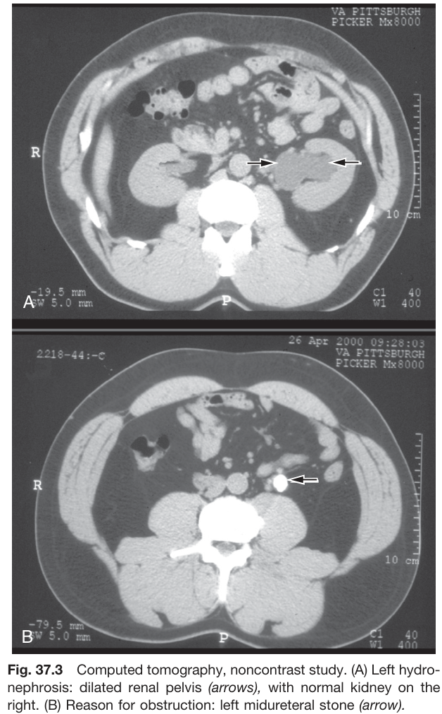

Fig. 37.3 Computed tomography, noncontrast study. (A) Left hydronephrosis: dilated renal pelvis (arrows), with normal kidney on the right. (B) Reason for obstruction: left midureteral stone (arrow).

---

### Fig_37_4

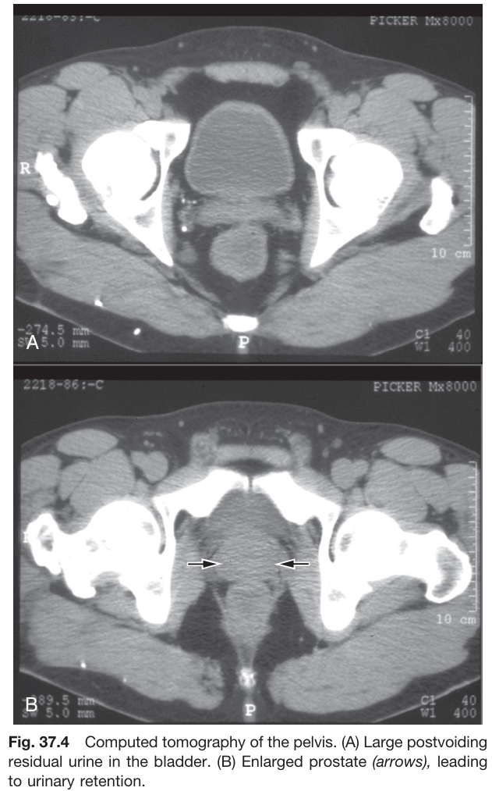

Fig. 37.4 Computed tomography of the pelvis. (A) Large postvoiding residual urine in the bladder. (B) Enlarged prostate (arrows), leading to urinary retention.

---

### Fig_37_5

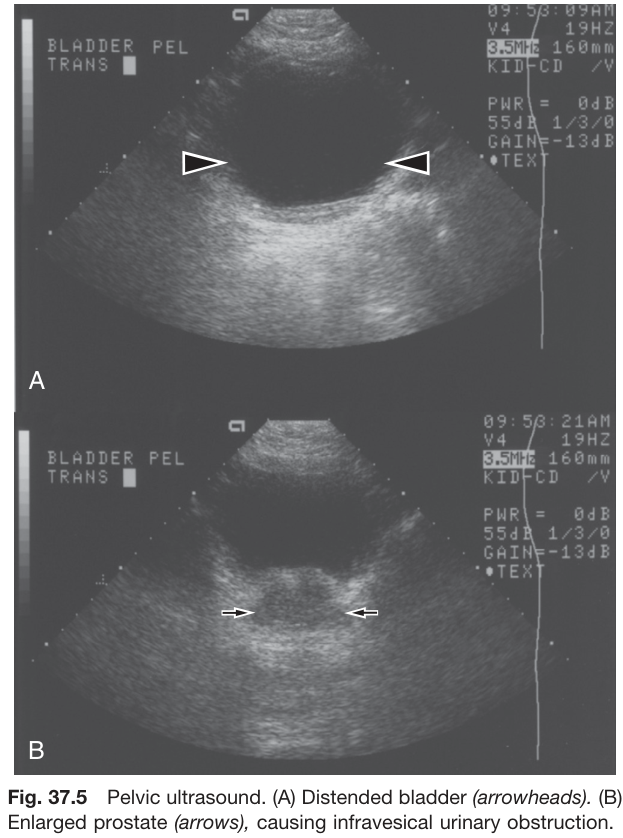

Fig. 37.5 Pelvic ultrasound. (A) Distended bladder (arrowheads). (B) Enlarged prostate (arrows), causing infravesical urinary obstruction.

---

### Fig_37_6

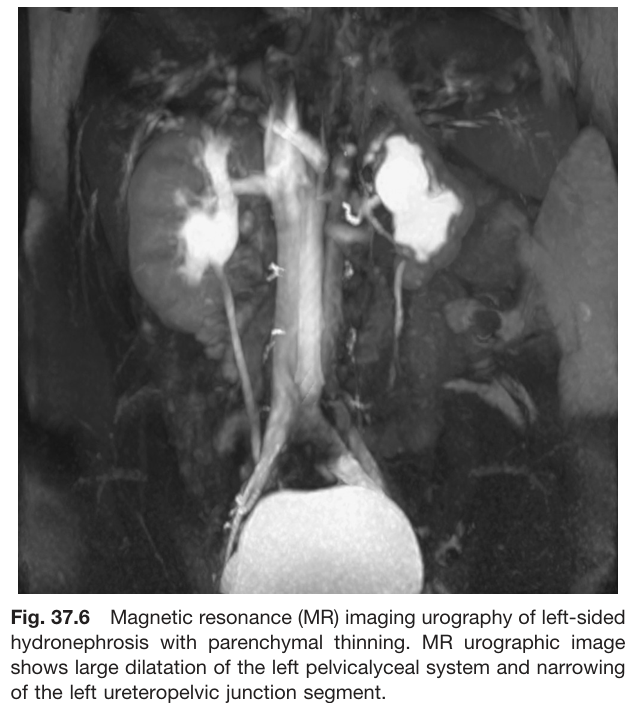

Fig. 37.6 Magnetic resonance (MR) imaging urography of left-sided hydronephrosis with parenchymal thinning. MR urographic image shows large dilatation of the left pelvicalyceal system and narrowing of the left ureteropelvic junction segment.

---

### Fig_37_7

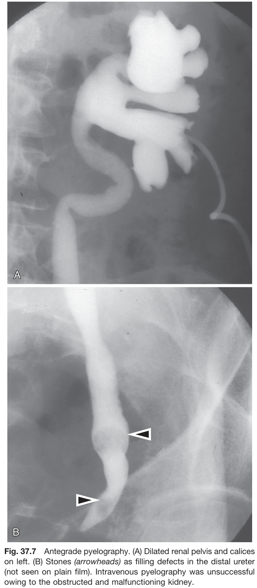

Fig. 37.7 Antegrade pyelography. (A) Dilated renal pelvis and calices on left. (B) Stones (arrowheads) as filling defects in the distal ureter (not seen on plain film). Intravenous pyelography was unsuccessful owing to the obstructed and malfunctioning kidney.

---

### Fig_37_8

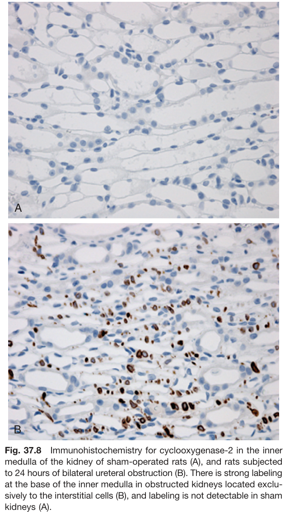

Fig. 37.8 Immunohistochemistry for cyclooxygenase-2 in the inner medulla of the kidney of sham-operated rats (A), and rats subjected to 24 hours of bilateral ureteral obstruction (B). There is strong labeling at the base of the inner medulla in obstructed kidneys located exclusively to the interstitial cells (B), and labeling is not detectable in sham kidneys (A).

---

### Fig_37_9

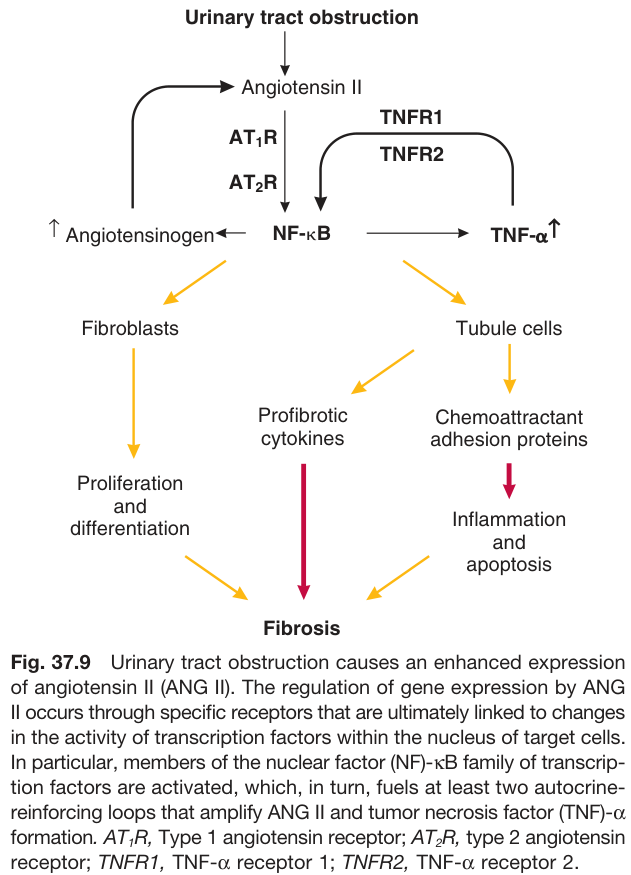

Fig. 37.9 Urinary tract obstruction causes an enhanced expression of angiotensin II (ANG II). The regulation of gene expression by ANG II occurs through specific receptors that are ultimately linked to changes in the activity of transcription factors within the nucleus of target cells. In particular, members of the nuclear factor (NF)-KB family of transcription factors are activated, which, in turn, fuels at least two autocrine-reinforcing loops that amplify ANG II and tumor necrosis factor (TNF)-α formation. AT,R, Type 1 angiotensin receptor; AT₂R, type 2 angiotensin receptor; TNFR1, TNF-a receptor 1; TNFR2, TNF-α receptor 2.

---

## Tables

### Table_37_1

#### Table Image

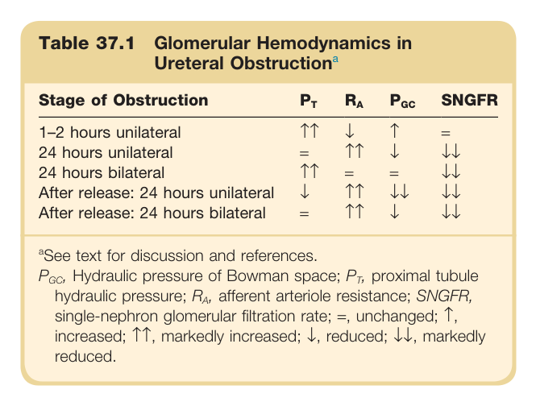

#### Table Data (CSV: [Table_37_1.csv](Table_37_1.csv))

```markdown
| Table Text (OCR) |
| :--- |
| Table 37.1 Glomerular Hemodynamics in Ureteral Obstruction<sup>a</sup> Stage of Obstruction   P_T    R_A    P_{GC}   SNGFR    1-2 hours unilateral  ↑↑  ↓  ↑  =    24 hours unilateral  =  ↑↑  ↓  ↓↓    24 hours bilateral  ↑↑  =  =  ↓↓    After release: 24 hours unilateral  ↓  ↑↑  ↓↓  ↓↓    After release: 24 hours bilateral  =  ↑↑  ↓  ↓↓ |
```

Table 37.1 Glomerular Hemodynamics in Ureteral Obstructiona | Stage of Obstruction | PT | RA | PGC | SNGFR | | :--- | :-: | :-: | :-: | :-: | | 1-2 hours unilateral | ↑↑ | ↓ | ↑ | = | | 24 hours unilateral | ↑ | ↑↑ | ↓ | ↓↓ | | 24 hours bilateral | ↑↑ | ↑ | = | ↓↓ | | After release: 24 hours unilateral | ↓ | ↑↑ | ↓ | ↓↓ | | After release: 24 hours bilateral | ↓ | ↑ | = | ↓↓ | aSee text for discussion and references. PGC, Hydraulic pressure of Bowman space; PT, proximal tubule hydraulic pressure; RA, afferent arteriole resistance; SNGFR, single-nephron glomerular filtration rate; =, unchanged; ↑, increased; ↑↑, markedly increased; ↓, reduced; ↓↓, markedly reduced.

---

### Table_37_2

#### Table Image

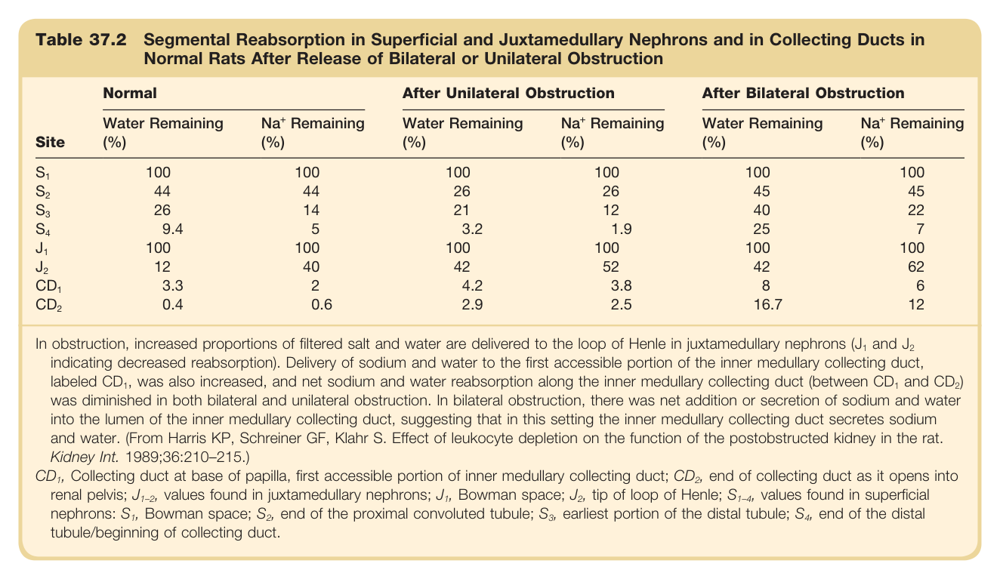

#### Table Data (CSV: [Table_37_2.csv](Table_37_2.csv))

```markdown
| Table Text (OCR) |
| :--- |
| Table 37.2 Segmental Reabsorption in Superficial and Juxtamedullary Nephrons and in Collecting Ducts in Normal Rats After Release of Bilateral or Unilateral Obstruction Site  Normal  After Unilateral Obstruction  After Bilateral Obstruction    Water Remaining (%)   Na^+  Remaining (%)  Water Remaining (%)   Na^+  Remaining (%)  Water Remaining (%)   Na^+  Remaining (%)     S_1   100  100  100  100  100  100     S_2   44  44  26  26  45  45     S_3   26  14  21  12  40  22     S_4   9.4  5  3.2  1.9  25  7     J_1   100  100  100  100  100  100     J_2   12  40  42  52  42  62     CD_1   3.3  2  4.2  3.8  8  6     CD_2   0.4  0.6  2.9  2.5  16.7  12 In obstruction, increased proportions of filtered salt and water are delivered to the loop of Henle in juxtamedullary nephrons (J and J indicating decreased reabsorption). Delivery of sodium and water to the first accessible portion of the inner medullary collecting duct, labeled CD , was also increased, and net sodium and water reabsorption along the inner medullary collecting duct (between CD and CD ) was diminished in both bilateral and unilateral obstruction. In bilateral obstruction, there was net addition or secretion of sodium and water into the lumen of the inner medullary collecting duct, suggesting that in this setting the inner medullary collecting duct secretes sodium and water. (From Harris KP, Schreiner GF, Klahr S. Effect of leukocyte depletion on the function of the postobstructed kidney in the rat. Kidney Int. 1989;36:210–215.) CD<sub>1</sub>, Collecting duct at base of papilla, first accessible portion of inner medullary collecting duct; CD<sub>2</sub>, end of collecting duct as it opens into renal pelvis; J<sub>1–2</sub>, values found in juxtamedullary nephrons; J<sub>1</sub>, Bowman space; J<sub>2</sub>, tip of loop of Henle; S<sub>1–4</sub>, values found in superficial nephrons: S<sub>1</sub>, Bowman space; S<sub>2</sub>, end of the proximal convoluted tubule; S<sub>3</sub>, earliest portion of the distal tubule; S<sub>4</sub>, end of the distal tubule/beginning of collecting duct. |
```

Table 37.2 Segmental Reabsorption in Superficial and Juxtamedullary Nephrons and in Collecting Ducts in Normal Rats After Release of Bilateral or Unilateral Obstruction | | Normal | After Unilateral Obstruction | After Bilateral Obstruction | | :--- | :--- | :--- | :--- | | **Site** | **Water Remaining (%)** | **Nat Remaining (%)** | **Water Remaining (%)** | **Na+ Remaining (%)** | **Water Remaining (%)** | **Nat Remaining (%)** | | S1 | 100 | 100 | 100 | 100 | 100 | 100 | | S2 | 44 | 44 | 26 | 26 | 45 | 45 | | S3 | 26 | 14 | 21 | 12 | 40 | 22 | | S4 | 9.4 | 5 | 3.2 | 1.9 | 25 | 7 | | J₁ | 100 | 100 | 100 | 100 | 100 | 100 | | J2 | 12 | 40 | 42 | 52 | 42 | 62 | | CD1 | 3.3 | 2 | 4.2 | 3.8 | 8 | 6 | | CD2 | 0.4 | 0.6 | 2.9 | 2.5 | 16.7 | 12 | In obstruction, increased proportions of filtered salt and water are delivered to the loop of Henle in juxtamedullary nephrons (J₁ and J2 indicating decreased reabsorption). Delivery of sodium and water to the first accessible portion of the inner medullary collecting duct, labeled CD₁, was also increased, and net sodium and water reabsorption along the inner medullary collecting duct (between CD₁ and CD2) was diminished in both bilateral and unilateral obstruction. In bilateral obstruction, there was net addition or secretion of sodium and water into the lumen of the inner medullary collecting duct, suggesting that in this setting the inner medullary collecting duct secretes sodium and water. (From Harris KP, Schreiner GF, Klahr S. Effect of leukocyte depletion on the function of the postobstructed kidney in the rat. Kidney Int. 1989;36:210-215.) CD1, Collecting duct at base of papilla, first accessible portion of inner medullary collecting duct; CD2, end of collecting duct as it opens into renal pelvis; J1-2, values found in juxtamedullary nephrons; J1, Bowman space; J2, tip of loop of Henle; S1-4, values found in superficial nephrons: S1, Bowman space; S2, end of the proximal convoluted tubule; S3, earliest portion of the distal tubule; S4, end of the distal tubule/beginning of collecting duct.

---

### Table_37_3

#### Table Image

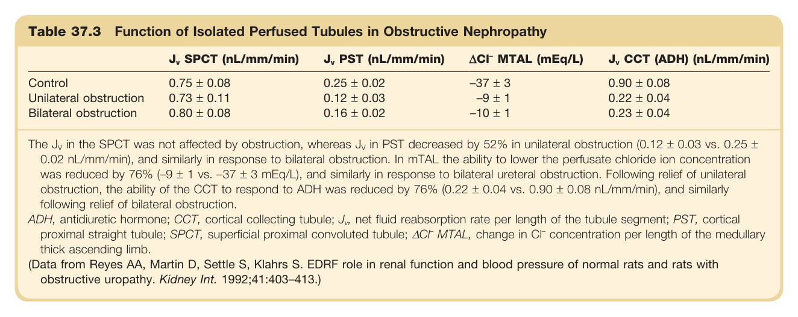

#### Table Data (CSV: [Table_37_3.csv](Table_37_3.csv))

```markdown
| Table Text (OCR) |
| :--- |
| Table 37.3 Function of Isolated Perfused Tubules in Obstructive Nephropathy J_v  SPCT (nL/mm/min)   J_v  PST (nL/mm/min)   \Delta Cl^-  MTAL (mEq/L)   J_v  CCT (ADH) (nL/mm/min)    Control  0.75 ± 0.08  0.25 ± 0.02  -37 ± 3  0.90 ± 0.08    Unilateral obstruction  0.73 ± 0.11  0.12 ± 0.03  -9 ± 1  0.22 ± 0.04    Bilateral obstruction  0.80 ± 0.08  0.16 ± 0.02  -10 ± 1  0.23 ± 0.04 The J in the SPCT was not affected by obstruction, whereas J in PST decreased by 52% in unilateral obstruction (0.12 ± 0.03 vs. 0.25 ± 0.02 nL/mm/min), and similarly in response to bilateral obstruction. In mTAL the ability to lower the perfusate chloride ion concentration was reduced by 76% (–9 ± 1 vs. –37 ± 3 mEq/L), and similarly in response to bilateral ureteral obstruction. Following relief of unilateral obstruction, the ability of the CCT to respond to ADH was reduced by 76% (0.22 ± 0.04 vs. 0.90 ± 0.08 nL/mm/min), and similarly following relief of bilateral obstruction ADH, antidiuretic hormone; CCT, cortical collecting tubule; J , net fluid reabsorption rate per length of the tubule segment; PST, cortical proximal straight tubule; SPCT, superficial proximal convoluted tubule; ΔCl<sup>–</sup> MTAL, change in Cl<sup>–</sup> concentration per length of the medullary thick ascending limb. (Data from Reyes AA, Martin D, Settle S, Klahrs S. EDRF role in renal function and blood pressure of normal rats and rats with obstructive uropathy. Kidney Int. 1992;41:403–413.) |
```

Table 37.3 Function of Isolated Perfused Tubules in Obstructive Nephropathy | | J, SPCT (nL/mm/min) | J, PST (nL/mm/min) | ACI MTAL (mEq/L) | J, CCT (ADH) (nL/mm/min) | | :--- | :--- | :--- | :--- | :--- | | **Control** | 0.75 ± 0.08 | 0.25 ± 0.02 | -37 ± 3 | 0.90 ± 0.08 | | **Unilateral obstruction** | 0.73 ± 0.11 | 0.12 ± 0.03 | -9 ± 1 | 0.22 ± 0.04 | | **Bilateral obstruction** | 0.80 ± 0.08 | 0.16 ± 0.02 | -10 ± 1 | 0.23 ± 0.04 | The Jy in the SPCT was not affected by obstruction, whereas Jy in PST decreased by 52% in unilateral obstruction (0.12 ± 0.03 vs. 0.25 ± 0.02 nL/mm/min), and similarly in response to bilateral obstruction. In mTAL the ability to lower the perfusate chloride ion concentration was reduced by 76% (-9 ± 1 vs. -37 ± 3 mEq/L), and similarly in response to bilateral ureteral obstruction. Following relief of unilateral obstruction, the ability of the CCT to respond to ADH was reduced by 76% (0.22 ± 0.04 vs. 0.90 ± 0.08 nL/mm/min), and similarly following relief of bilateral obstruction. ADH, antidiuretic hormone; CCT, cortical collecting tubule; J, net fluid reabsorption rate per length of the tubule segment; PST, cortical proximal straight tubule; SPCT, superficial proximal convoluted tubule; ACF MTAL, change in C concentration per length of the medullary thick ascending limb. (Data from Reyes AA, Martin D, Settle S, Klahrs S. EDRF role in renal function and blood pressure of normal rats and rats with obstructive uropathy. Kidney Int. 1992;41:403-413.)

---

## Boxes

### Box_37_1

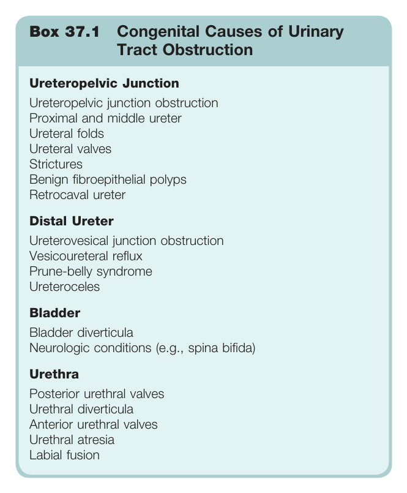

#### Box Text

```markdown
Box 37.1 Congenital Causes of Urinary Tract Obstruction * **Ureteropelvic Junction** * Ureteropelvic junction obstruction * Proximal and middle ureter * Ureteral folds * Ureteral valves * Strictures * Benign fibroepithelial polyps * Retrocaval ureter * **Distal Ureter** * Ureterovesical junction obstruction * Vesicoureteral reflux * Prune-belly syndrome * Ureteroceles * **Bladder** * Bladder diverticula * Neurologic conditions (e.g., spina bifida) * **Urethra** * Posterior urethral valves * Urethral diverticula * Anterior urethral valves * Urethral atresia * Labial fusion
```

Box 37.1 Congenital Causes of Urinary Tract Obstruction * **Ureteropelvic Junction** * Ureteropelvic junction obstruction * Proximal and middle ureter * Ureteral folds * Ureteral valves * Strictures * Benign fibroepithelial polyps * Retrocaval ureter * **Distal Ureter** * Ureterovesical junction obstruction * Vesicoureteral reflux * Prune-belly syndrome * Ureteroceles * **Bladder** * Bladder diverticula * Neurologic conditions (e.g., spina bifida) * **Urethra** * Posterior urethral valves * Urethral diverticula * Anterior urethral valves * Urethral atresia * Labial fusion

---

### Box_37_2

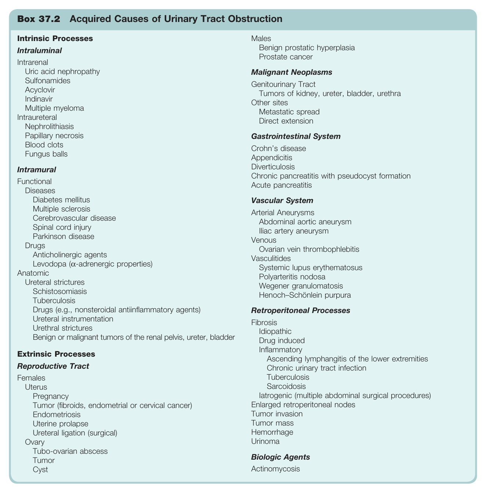

#### Box Text

```markdown
Box 37.2 Acquired Causes of Urinary Tract Obstruction * **Intrinsic Processes** * **Intraluminal** * Intrarenal * Uric acid nephropathy * Sulfonamides * Acyclovir * Indinavir * Multiple myeloma * Intraureteral * Nephrolithiasis * Papillary necrosis * Blood clots * Fungus balls * **Intramural** * Functional * Diseases: Diabetes mellitus, Multiple sclerosis, Cerebrovascular disease, Spinal cord injury, Parkinson disease * Drugs: Anticholinergic agents, Levodopa (a-adrenergic properties) * Anatomic * Ureteral strictures * Schistosomiasis * Tuberculosis * Drugs (e.g., nonsteroidal antiinflammatory agents) * Ureteral instrumentation * Urethral strictures * Benign or malignant tumors of the renal pelvis, ureter, bladder * **Extrinsic Processes** * **Reproductive Tract** * Females: Uterus (Pregnancy, Tumor, Endometriosis, Uterine prolapse, Ureteral ligation), Ovary (Tubo-ovarian abscess, Tumor, Cyst) * Males: Benign prostatic hyperplasia, Prostate cancer * **Malignant Neoplasms** * Genitourinary Tract: Tumors of kidney, ureter, bladder, urethra * Other sites: Metastatic spread, Direct extension * **Gastrointestinal System** * Crohn's disease * Appendicitis * Diverticulosis * Chronic pancreatitis with pseudocyst formation * Acute pancreatitis * **Vascular System** * Arterial Aneurysms: Abdominal aortic aneurysm, Iliac artery aneurysm * Venous: Ovarian vein thrombophlebitis * Vasculitides: Systemic lupus erythematosus, Polyarteritis nodosa, Wegener granulomatosis, Henoch-Schönlein purpura * **Retroperitoneal Processes** * Fibrosis: Idiopathic, Drug induced * Inflammatory: Ascending lymphangitis of the lower extremities, Chronic urinary tract infection, Tuberculosis, Sarcoidosis * Iatrogenic (multiple abdominal surgical procedures) * Enlarged retroperitoneal nodes * Tumor invasion * Tumor mass * Hemorrhage * Urinoma * **Biologic Agents** * Actinomycosis
```

Box 37.2 Acquired Causes of Urinary Tract Obstruction * **Intrinsic Processes** * **Intraluminal** * Intrarenal * Uric acid nephropathy * Sulfonamides * Acyclovir * Indinavir * Multiple myeloma * Intraureteral * Nephrolithiasis * Papillary necrosis * Blood clots * Fungus balls * **Intramural** * Functional * Diseases: Diabetes mellitus, Multiple sclerosis, Cerebrovascular disease, Spinal cord injury, Parkinson disease * Drugs: Anticholinergic agents, Levodopa (a-adrenergic properties) * Anatomic * Ureteral strictures * Schistosomiasis * Tuberculosis * Drugs (e.g., nonsteroidal antiinflammatory agents) * Ureteral instrumentation * Urethral strictures * Benign or malignant tumors of the renal pelvis, ureter, bladder * **Extrinsic Processes** * **Reproductive Tract** * Females: Uterus (Pregnancy, Tumor, Endometriosis, Uterine prolapse, Ureteral ligation), Ovary (Tubo-ovarian abscess, Tumor, Cyst) * Males: Benign prostatic hyperplasia, Prostate cancer * **Malignant Neoplasms** * Genitourinary Tract: Tumors of kidney, ureter, bladder, urethra * Other sites: Metastatic spread, Direct extension * **Gastrointestinal System** * Crohn's disease * Appendicitis * Diverticulosis * Chronic pancreatitis with pseudocyst formation * Acute pancreatitis * **Vascular System** * Arterial Aneurysms: Abdominal aortic aneurysm, Iliac artery aneurysm * Venous: Ovarian vein thrombophlebitis * Vasculitides: Systemic lupus erythematosus, Polyarteritis nodosa, Wegener granulomatosis, Henoch-Schönlein purpura * **Retroperitoneal Processes** * Fibrosis: Idiopathic, Drug induced * Inflammatory: Ascending lymphangitis of the lower extremities, Chronic urinary tract infection, Tuberculosis, Sarcoidosis * Iatrogenic (multiple abdominal surgical procedures) * Enlarged retroperitoneal nodes * Tumor invasion * Tumor mass * Hemorrhage * Urinoma * **Biologic Agents** * Actinomycosis

---

### Box_37_3

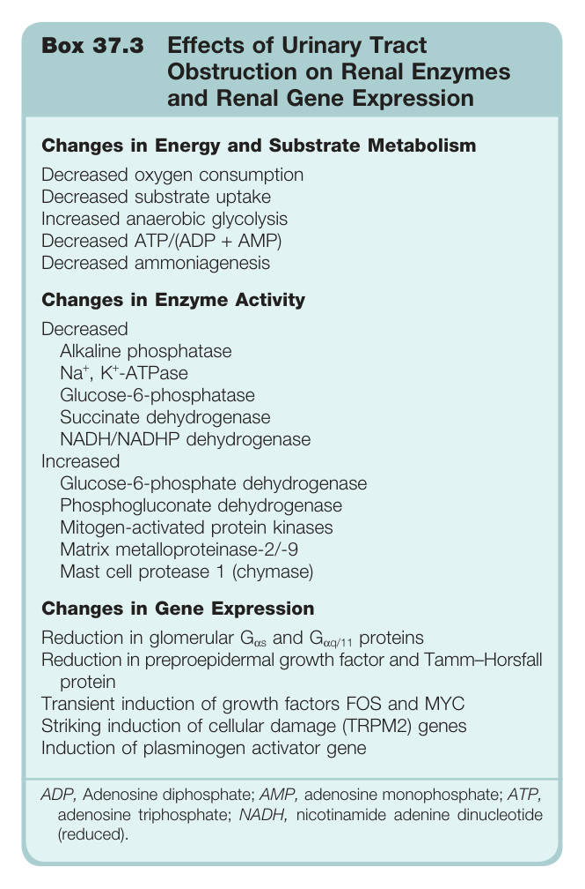

#### Box Text

```markdown
Box 37.3 Effects of Urinary Tract Obstruction on Renal Enzymes and Renal Gene Expression * **Changes in Energy and Substrate Metabolism** * Decreased oxygen consumption * Decreased substrate uptake * Increased anaerobic glycolysis * Decreased ATP/(ADP + AMP) * Decreased ammoniagenesis * **Changes in Enzyme Activity** * Decreased * Alkaline phosphatase * Na+, K+-ATPase * Glucose-6-phosphatase * Succinate dehydrogenase * NADH/NADHP dehydrogenase * Increased * Glucose-6-phosphate dehydrogenase * Phosphogluconate dehydrogenase * Mitogen-activated protein kinases * Matrix metalloproteinase-2/-9 * Mast cell protease 1 (chymase) * **Changes in Gene Expression** * Reduction in glomerular Gas and Gaq/11 proteins * Reduction in preproepidermal growth factor and Tamm-Horsfall protein * Transient induction of growth factors FOS and MYC * Striking induction of cellular damage (TRPM2) genes * Induction of plasminogen activator gene ADP, Adenosine diphosphate; AMP, adenosine monophosphate; ATP, adenosine triphosphate; NADH, nicotinamide adenine dinucleotide (reduced).
```

Box 37.3 Effects of Urinary Tract Obstruction on Renal Enzymes and Renal Gene Expression * **Changes in Energy and Substrate Metabolism** * Decreased oxygen consumption * Decreased substrate uptake * Increased anaerobic glycolysis * Decreased ATP/(ADP + AMP) * Decreased ammoniagenesis * **Changes in Enzyme Activity** * Decreased * Alkaline phosphatase * Na+, K+-ATPase * Glucose-6-phosphatase * Succinate dehydrogenase * NADH/NADHP dehydrogenase * Increased * Glucose-6-phosphate dehydrogenase * Phosphogluconate dehydrogenase * Mitogen-activated protein kinases * Matrix metalloproteinase-2/-9 * Mast cell protease 1 (chymase) * **Changes in Gene Expression** * Reduction in glomerular Gas and Gaq/11 proteins * Reduction in preproepidermal growth factor and Tamm-Horsfall protein * Transient induction of growth factors FOS and MYC * Striking induction of cellular damage (TRPM2) genes * Induction of plasminogen activator gene ADP, Adenosine diphosphate; AMP, adenosine monophosphate; ATP, adenosine triphosphate; NADH, nicotinamide adenine dinucleotide (reduced).

---
