# 38. Urolithiasis - Figures and Tables Index

This document lists all figures and tables extracted from `38. Urolithiasis.pdf`.

## Table of Contents
- [Figures](#figures)
- [Tables](#tables)

---

## Figures

### Fig_38_1

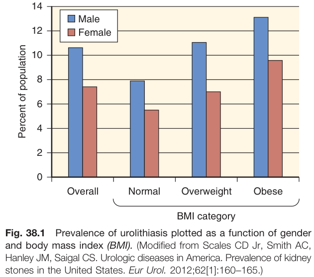

Fig. 38.1 Prevalence of urolithiasis plotted as a function of gender and body mass index (BMI). (Modified from Scales CD Jr, Smith AC, Hanley JM, Saigal CS. Urologic diseases in America. Prevalence of kidney stones in the United States. Eur Urol. 2012;62[1]:160-165.)

---

### Fig_38_2

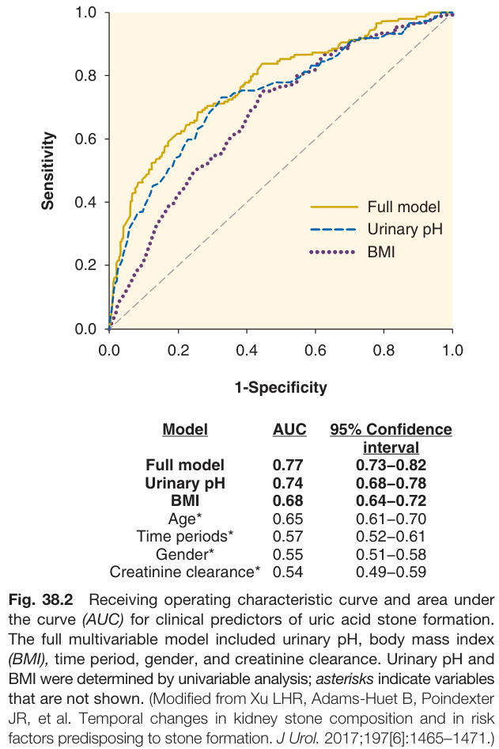

Fig. 38.2 Receiving operating characteristic curve and area under the curve (AUC) for clinical predictors of uric acid stone formation. The full multivariable model included urinary pH, body mass index (BMI), time period, gender, and creatinine clearance. Urinary pH and BMI were determined by univariable analysis; asterisks indicate variables that are not shown. (Modified from Xu LHR, Adams-Huet B, Poindexter JR, et al. Temporal changes in kidney stone composition and in risk factors predisposing to stone formation. J Urol. 2017;197[6]:1465-1471.)

---

### Fig_38_3

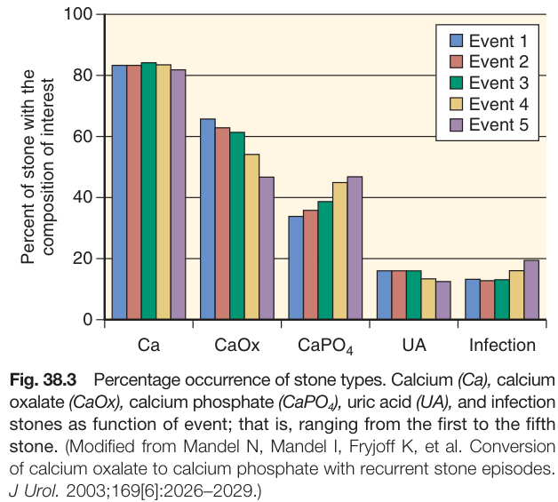

Fig. 38.3 Percentage occurrence of stone types. Calcium (Ca), calcium oxalate (CaOx), calcium phosphate (CaPO₄), uric acid (UA), and infection stones as function of event; that is, ranging from the first to the fifth stone. (Modified from Mandel N, Mandel I, Fryjoff K, et al. Conversion of calcium oxalate to calcium phosphate with recurrent stone episodes. J Urol. 2003;169[6]:2026-2029.)

---

### Fig_38_4

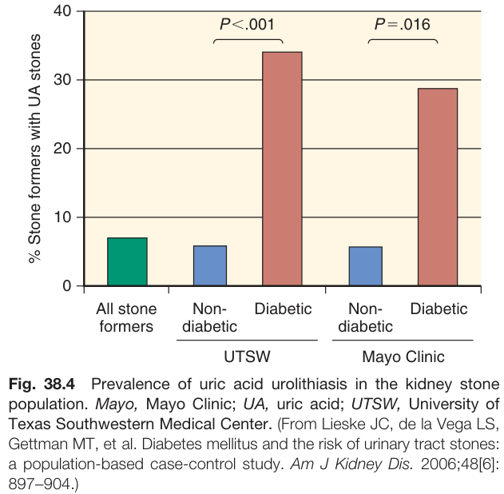

Fig. 38.4 Prevalence of uric acid urolithiasis in the kidney stone population. Mayo, Mayo Clinic; UA, uric acid; UTSW, University of Texas Southwestern Medical Center. (From Lieske JC, de la Vega LS, Gettman MT, et al. Diabetes mellitus and the risk of urinary tract stones: a population-based case-control study. Am J Kidney Dis. 2006;48[6]: 897-904.)

---

### Fig_38_5

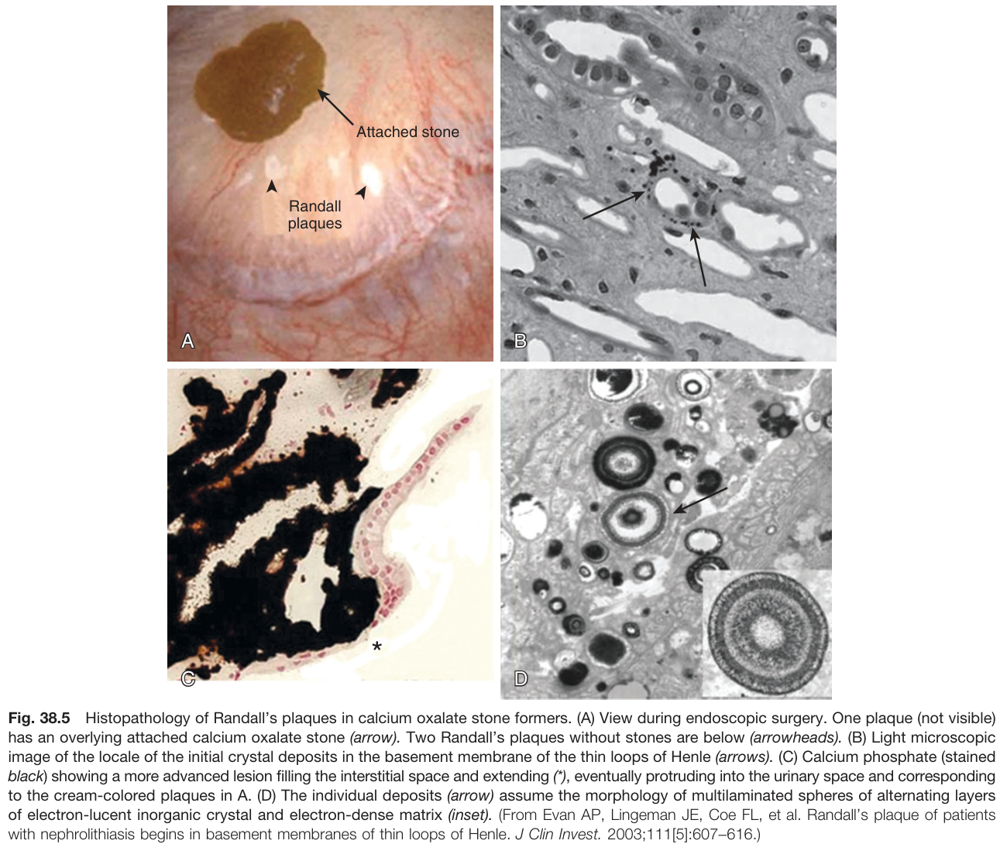

Fig. 38.5 Histopathology of Randall's plaques in calcium oxalate stone formers. (A) View during endoscopic surgery. One plaque (not visible) has an overlying attached calcium oxalate stone (arrow). Two Randall's plaques without stones are below (arrowheads). (B) Light microscopic image of the locale of the initial crystal deposits in the basement membrane of the thin loops of Henle (arrows). (C) Calcium phosphate (stained black) showing a more advanced lesion filling the interstitial space and extending (*), eventually protruding into the urinary space and corresponding to the cream-colored plaques in A. (D) The individual deposits (arrow) assume the morphology of multilaminated spheres of alternating layers of electron-lucent inorganic crystal and electron-dense matrix (inset). (From Evan AP, Lingeman JE, Coe FL, et al. Randall's plaque of patients with nephrolithiasis begins in basement membranes of thin loops of Henle. J Clin Invest. 2003;111[5]:607-616.)

---

### Fig_38_6

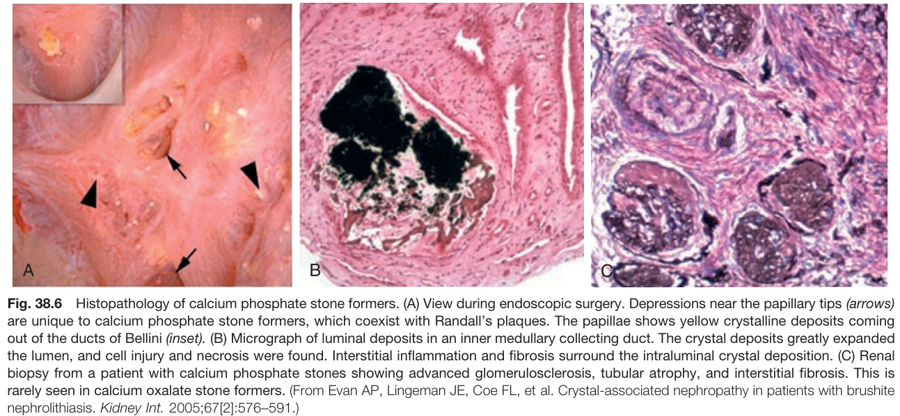

Fig. 38.6 Histopathology of calcium phosphate stone formers. (A) View during endoscopic surgery. Depressions near the papillary tips (arrows) are unique to calcium phosphate stone formers, which coexist with Randall's plaques. The papillae shows yellow crystalline deposits coming out of the ducts of Bellini (inset). (B) Micrograph of luminal deposits in an inner medullary collecting duct. The crystal deposits greatly expanded the lumen, and cell injury and necrosis were found. Interstitial inflammation and fibrosis surround the intraluminal crystal deposition. (C) Renal biopsy from a patient with calcium phosphate stones showing advanced glomerulosclerosis, tubular atrophy, and interstitial fibrosis. This is rarely seen in calcium oxalate stone formers. (From Evan AP, Lingeman JE, Coe FL, et al. Crystal-associated nephropathy in patients with brushite nephrolithiasis. Kidney Int. 2005;67[2]:576-591.)

---

### Fig_38_7

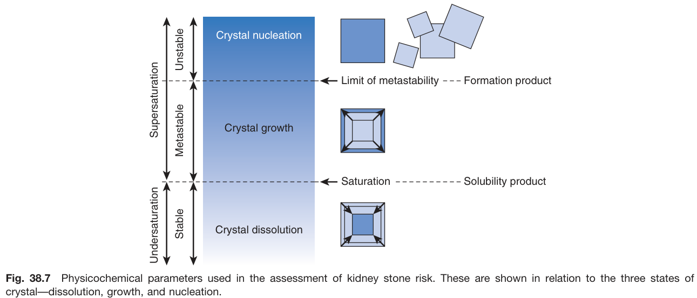

Fig. 38.7 Physicochemical parameters used in the assessment of kidney stone risk. These are shown in relation to the three states of crystal—dissolution, growth, and nucleation.

---

### Fig_38_8

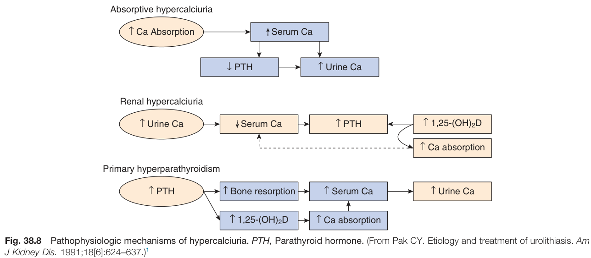

Fig. 38.8 Pathophysiologic mechanisms of hypercalciuria. PTH, Parathyroid hormone. (From Pak CY. Etiology and treatment of urolithiasis. Am J Kidney Dis. 1991;18[6]:624-637.)

---

### Fig_38_9

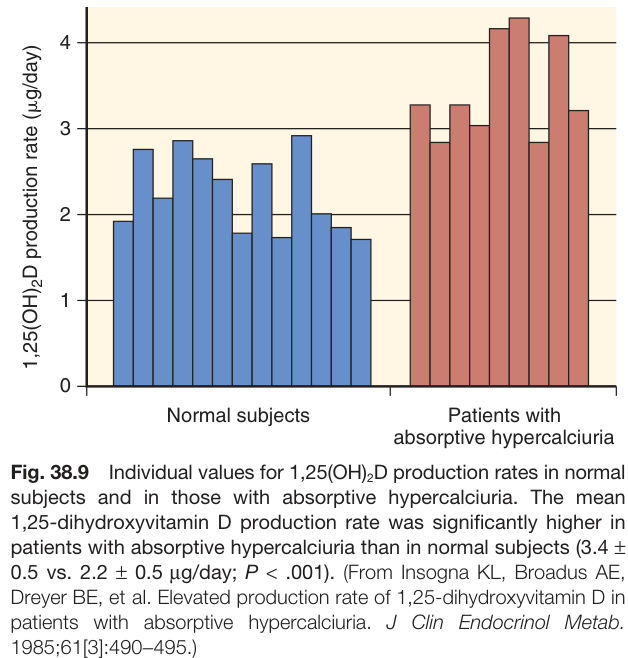

Fig. 38.9 Individual values for 1,25(OH)2D production rates in normal subjects and in those with absorptive hypercalciuria. The mean 1,25-dihydroxyvitamin D production rate was significantly higher in patients with absorptive hypercalciuria than in normal subjects (3.4 ± 0.5 vs. 2.2 ± 0.5 µg/day; P < .001). (From Insogna KL, Broadus AE, Dreyer BE, et al. Elevated production rate of 1,25-dihydroxyvitamin D in patients with absorptive hypercalciuria. J Clin Endocrinol Metab. 1985;61[3]:490-495.)

---

### Fig_38_10

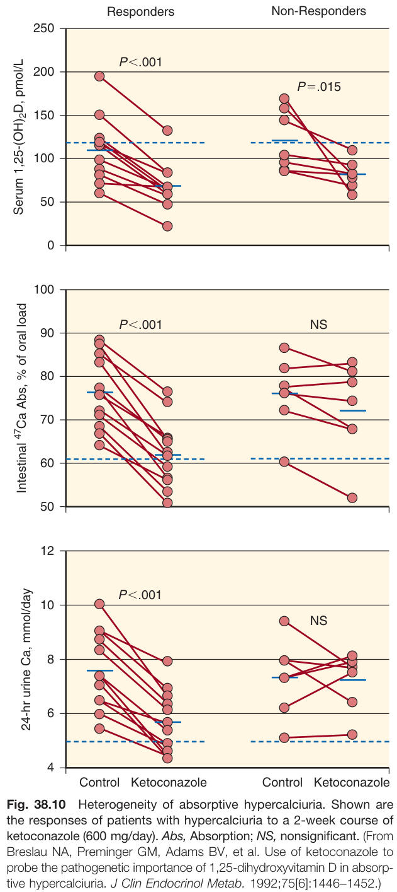

Fig. 38.10 Heterogeneity of absorptive hypercalciuria. Shown are the responses of patients with hypercalciuria to a 2-week course of ketoconazole (600 mg/day). Abs, Absorption; NS, nonsignificant. (From Breslau NA, Preminger GM, Adams BV, et al. Use of ketoconazole to probe the pathogenetic importance of 1,25-dihydroxyvitamin D in absorptive hypercalciuria. J Clin Endocrinol Metab. 1992;75[6]:1446-1452.)

---

### Fig_38_11

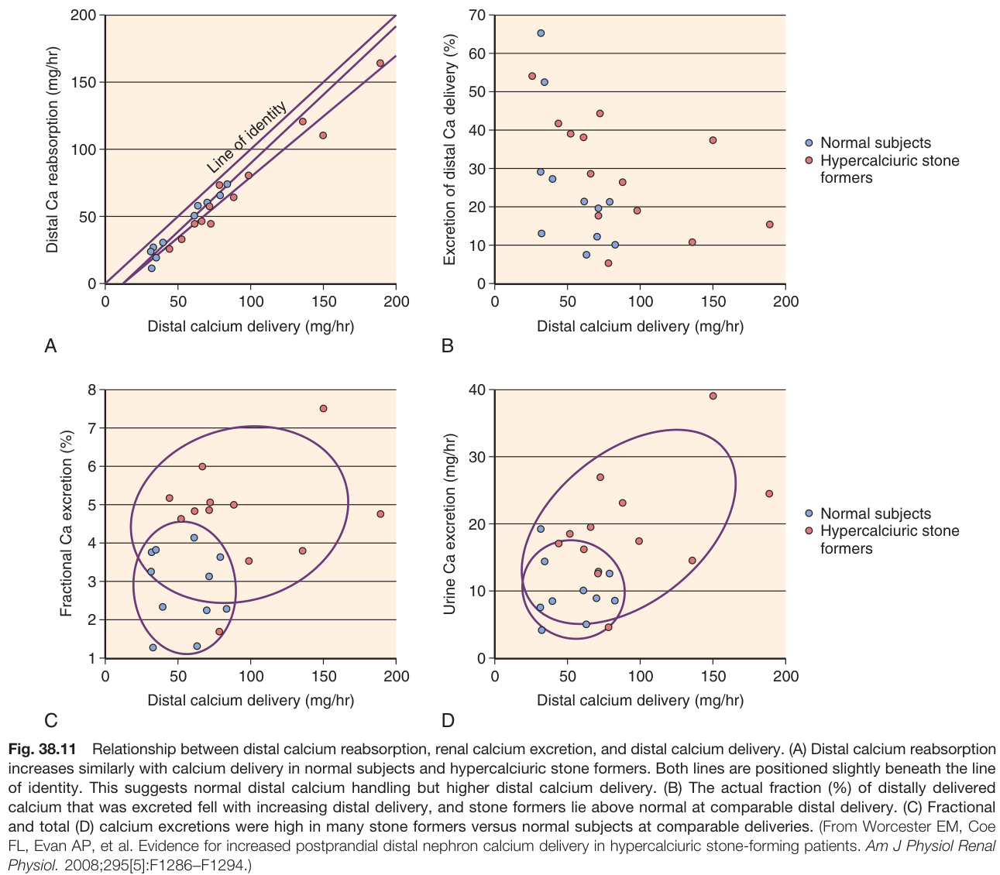

Fig. 38.11 Relationship between distal calcium reabsorption, renal calcium excretion, and distal calcium delivery. (A) Distal calcium reabsorption increases similarly with calcium delivery in normal subjects and hypercalciuric stone formers. Both lines are positioned slightly beneath the line of identity. This suggests normal distal calcium handling but higher distal calcium delivery. (B) The actual fraction (%) of distally delivered calcium that was excreted fell with increasing distal delivery, and stone formers lie above normal at comparable distal delivery. (C) Fractional and total (D) calcium excretions were high in many stone formers versus normal subjects at comparable deliveries. (From Worcester EM, Coe FL, Evan AP, et al. Evidence for increased postprandial distal nephron calcium delivery in hypercalciuric stone-forming patients. Am J Physiol Renal Physiol. 2008;295[5]:F1286-F1294.)

---

### Fig_38_12

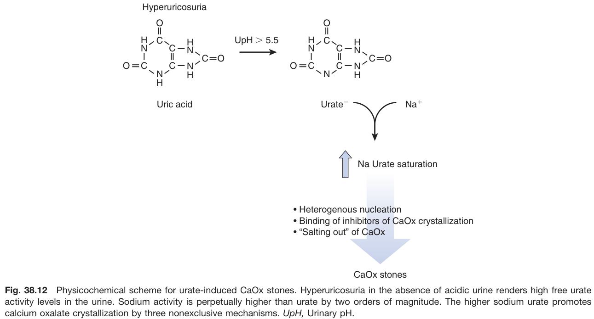

Fig. 38.12 Physicochemical scheme for urate-induced CaOx stones. Hyperuricosuria in the absence of acidic urine renders high free urate activity levels in the urine. Sodium activity is perpetually higher than urate by two orders of magnitude. The higher sodium urate promotes calcium oxalate crystallization by three nonexclusive mechanisms. UpH, Urinary pH.

---

### Fig_38_13

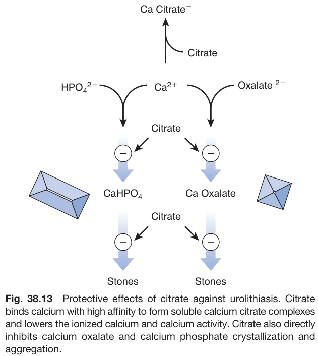

Fig. 38.13 Protective effects of citrate against urolithiasis. Citrate binds calcium with high affinity to form soluble calcium citrate complexes and lowers the ionized calcium and calcium activity. Citrate also directly inhibits calcium oxalate and calcium phosphate crystallization and aggregation.

---

### Fig_38_14

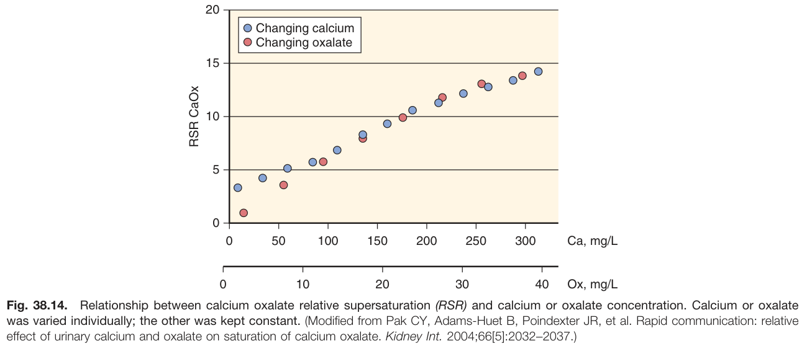

Fig. 38.14 Relationship between calcium oxalate relative supersaturation (RSR) and calcium or oxalate concentration. Calcium or oxalate was varied individually; the other was kept constant. (Modified from Pak CY, Adams-Huet B, Poindexter JR, et al. Rapid communication: relative effect of urinary calcium and oxalate on saturation of calcium oxalate. Kidney Int. 2004;66[5]:2032-2037.)

---

### Fig_38_15

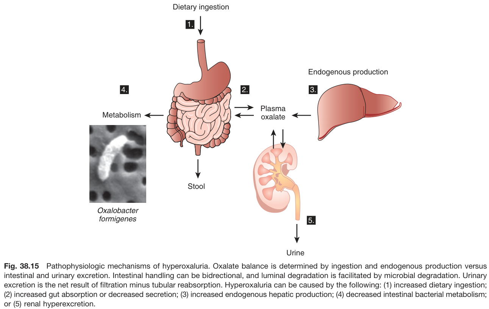

Fig. 38.15 Pathophysiologic mechanisms of hyperoxaluria. Oxalate balance is determined by ingestion and endogenous production versus intestinal and urinary excretion. Intestinal handling can be bidrectional, and luminal degradation is facilitated by microbial degradation. Urinary excretion is the net result of filtration minus tubular reabsorption. Hyperoxaluria can be caused by the following: (1) increased dietary ingestion; (2) increased gut absorption or decreased secretion; (3) increased endogenous hepatic production; (4) decreased intestinal bacterial metabolism; or (5) renal hyperexcretion.

---

### Fig_38_16

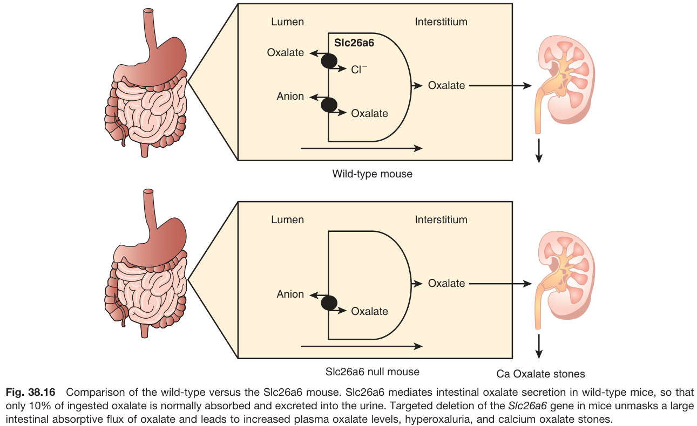

Fig. 38.16 Comparison of the wild-type versus the Slc26a6 mouse. Slc26a6 mediates intestinal oxalate secretion in wild-type mice, so that only 10% of ingested oxalate is normally absorbed and excreted into the urine. Targeted deletion of the Slc26a6 gene in mice unmasks a large intestinal absorptive flux of oxalate and leads to increased plasma oxalate levels, hyperoxaluria, and calcium oxalate stones.

---

### Fig_38_17

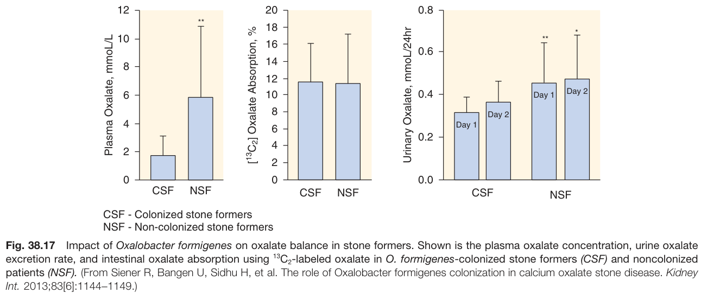

Fig. 38.17 Impact of Oxalobacter formigenes on oxalate balance in stone formers. Shown is the plasma oxalate concentration, urine oxalate excretion rate, and intestinal oxalate absorption using 13C2-labeled oxalate in O. formigenes-colonized stone formers (CSF) and noncolonized patients (NSF). (From Siener R, Bangen U, Sidhu H, et al. The role of Oxalobacter formigenes colonization in calcium oxalate stone disease. Kidney Int. 2013;83[6]:1144-1149.)

---

### Fig_38_18

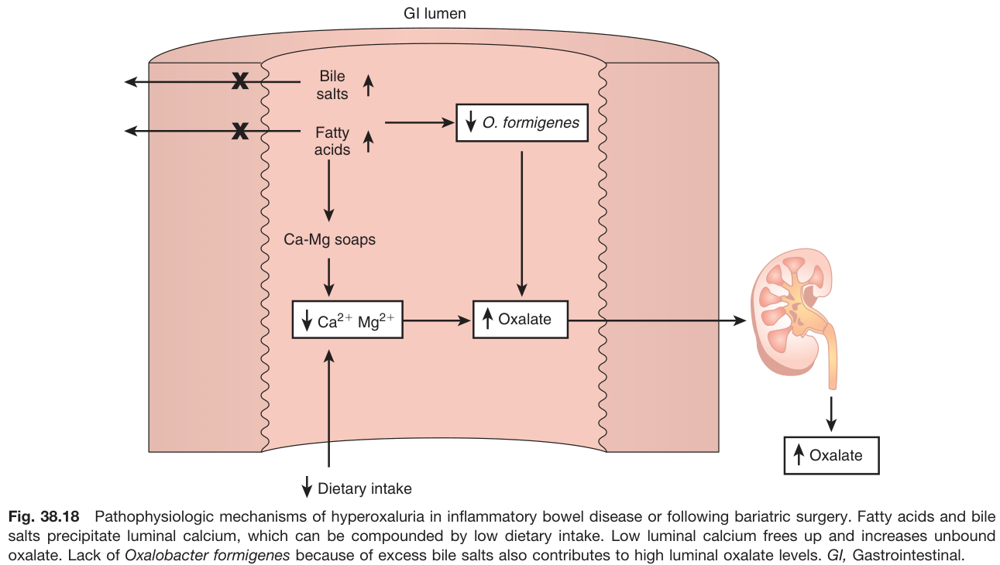

Fig. 38.18 Pathophysiologic mechanisms of hyperoxaluria in inflammatory bowel disease or following bariatric surgery. Fatty acids and bile salts precipitate luminal calcium, which can be compounded by low dietary intake. Low luminal calcium frees up and increases unbound oxalate. Lack of Oxalobacter formigenes because of excess bile salts also contributes to high luminal oxalate levels. GI, Gastrointestinal.

---

### Fig_38_19

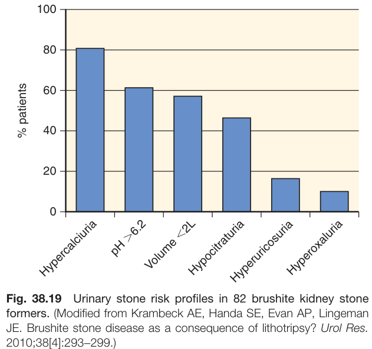

Fig. 38.19 Urinary stone risk profiles in 82 brushite kidney stone formers. (Modified from Krambeck AE, Handa SE, Evan AP, Lingeman JE. Brushite stone disease as a consequence of lithotripsy? Urol Res. 2010;38[4]:293-299.)

---

### Fig_38_20

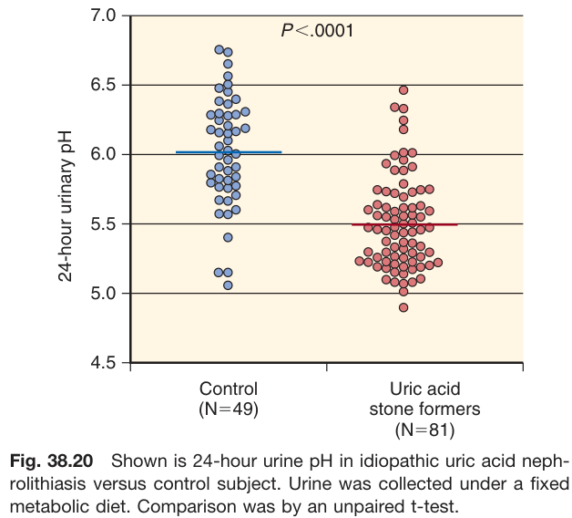

Fig. 38.20 Shown is 24-hour urine pH in idiopathic uric acid nephrolithiasis versus control subject. Urine was collected under a fixed metabolic diet. Comparison was by an unpaired t-test.

---

### Fig_38_21

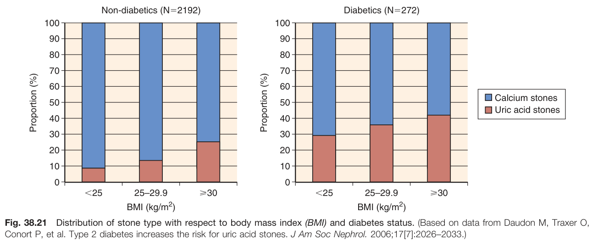

Fig. 38.21 Distribution of stone type with respect to body mass index (BMI) and diabetes status. (Based on data from Daudon M, Traxer O, Conort P, et al. Type 2 diabetes increases the risk for uric acid stones. J Am Soc Nephrol. 2006;17[7]:2026-2033.)

---

### Fig_38_22

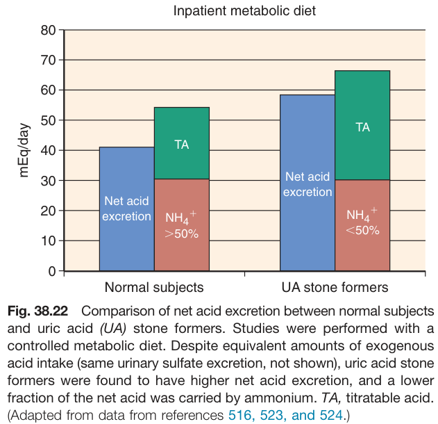

Fig. 38.22 Comparison of net acid excretion between normal subjects and uric acid (UA) stone formers. Studies were performed with a controlled metabolic diet. Despite equivalent amounts of exogenous acid intake (same urinary sulfate excretion, not shown), uric acid stone formers were found to have higher net acid excretion, and a lower fraction of the net acid was carried by ammonium. TA, titratable acid. (Adapted from data from references 516, 523, and 524.)

---

### Fig_38_23

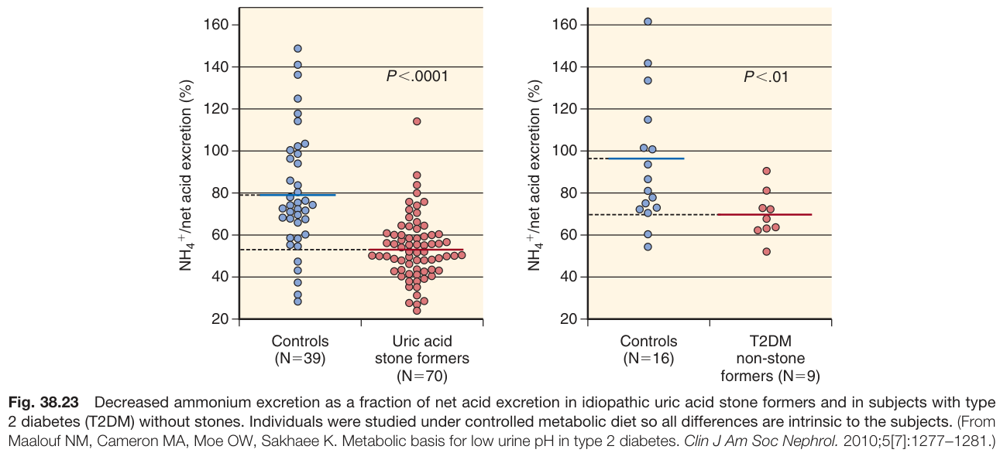

Fig. 38.23 Decreased ammonium excretion as a fraction of net acid excretion in idiopathic uric acid stone formers and in subjects with type 2 diabetes (T2DM) without stones. Individuals were studied under controlled metabolic diet so all differences are intrinsic to the subjects. (From Maalouf NM, Cameron MA, Moe OW, Sakhaee K. Metabolic basis for low urine pH in type 2 diabetes. Clin J Am Soc Nephrol. 2010;5[7]:1277-1281.)

---

### Fig_38_24

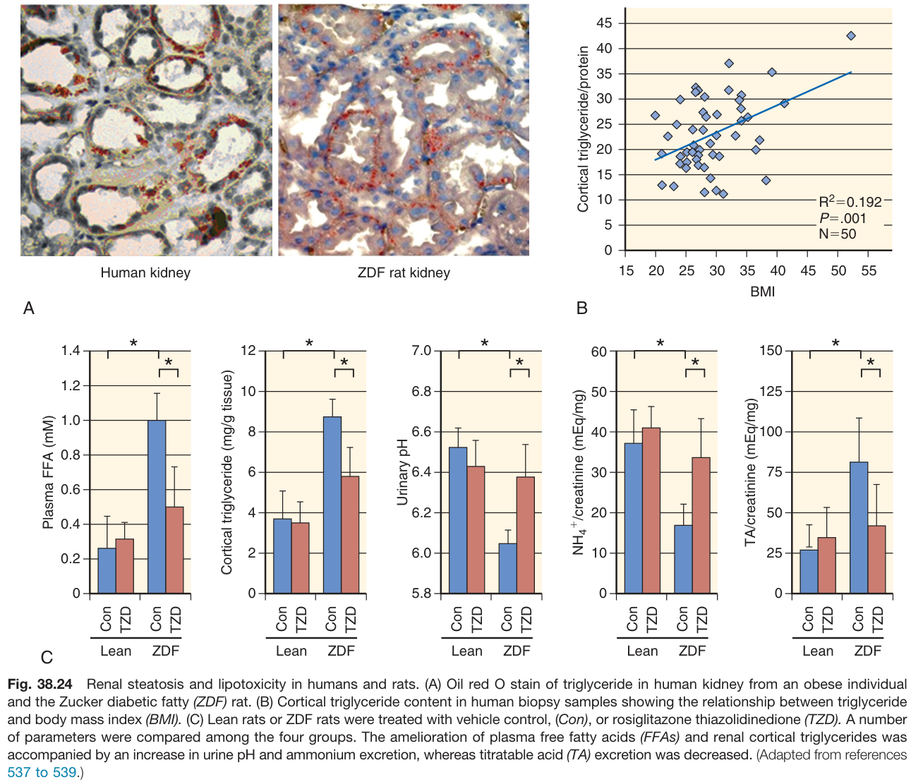

Fig. 38.24 Renal steatosis and lipotoxicity in humans and rats. (A) Oil red O stain of triglyceride in human kidney from an obese individual and the Zucker diabetic fatty (ZDF) rat. (B) Cortical triglyceride content in human biopsy samples showing the relationship between triglyceride and body mass index (BMI). (C) Lean rats or ZDF rats were treated with vehicle control, (Con), or rosiglitazone thiazolidinedione (TZD). A number of parameters were compared among the four groups. The amelioration of plasma free fatty acids (FFAs) and renal cortical triglycerides was accompanied by an increase in urine pH and ammonium excretion, whereas titratable acid (TA) excretion was decreased. (Adapted from references 537 to 539.)

---

### Fig_38_25

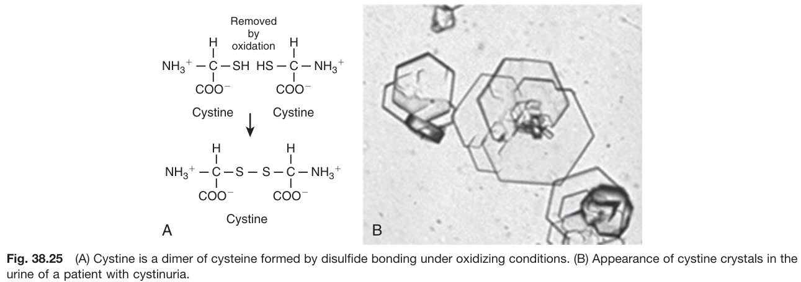

Fig. 38.25 (A) Cystine is a dimer of cysteine formed by disulfide bonding under oxidizing conditions. (B) Appearance of cystine crystals in the urine of a patient with cystinuria.

---

### Fig_38_26

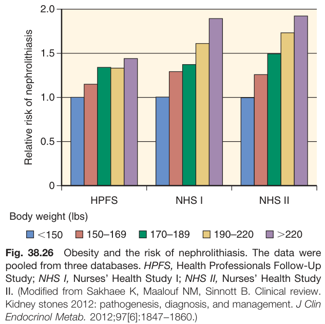

Fig. 38.26 Obesity and the risk of nephrolithiasis. The data were pooled from three databases. HPFS, Health Professionals Follow-Up Study; NHS I, Nurses' Health Study I; NHS II, Nurses' Health Study II. (Modified from Sakhaee K, Maalouf NM, Sinnott B. Clinical review. Kidney stones 2012: pathogenesis, diagnosis, and management. J Clin Endocrinol Metab. 2012;97[6]:1847-1860.)

---

### Fig_38_27

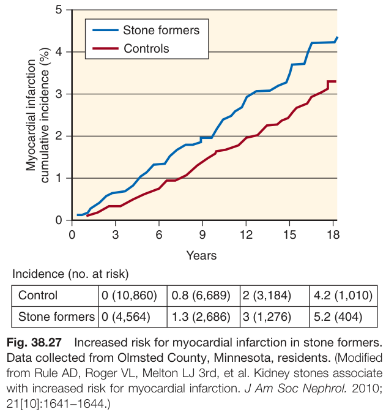

Fig. 38.27 Increased risk for myocardial infarction in stone formers. Data collected from Olmsted County, Minnesota, residents. (Modified from Rule AD, Roger VL, Melton LJ 3rd, et al. Kidney stones associate with increased risk for myocardial infarction. J Am Soc Nephrol. 2010; 21[10]:1641-1644.)

---

### Fig_38_28

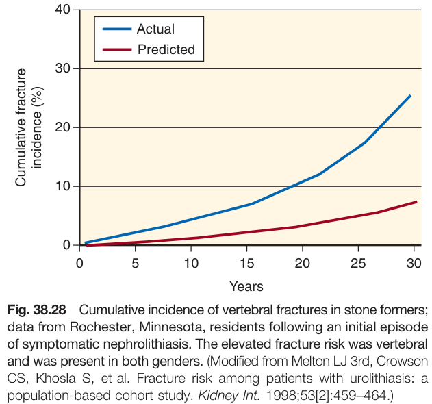

Fig. 38.28 Cumulative incidence of vertebral fractures in stone formers; data from Rochester, Minnesota, residents following an initial episode of symptomatic nephrolithiasis. The elevated fracture risk was vertebral and was present in both genders. (Modified from Melton LJ 3rd, Crowson CS, Khosla S, et al. Fracture risk among patients with urolithiasis: a population-based cohort study. Kidney Int. 1998;53[2]:459-464.)

---

## Tables

### Table_38_1

#### Table Image

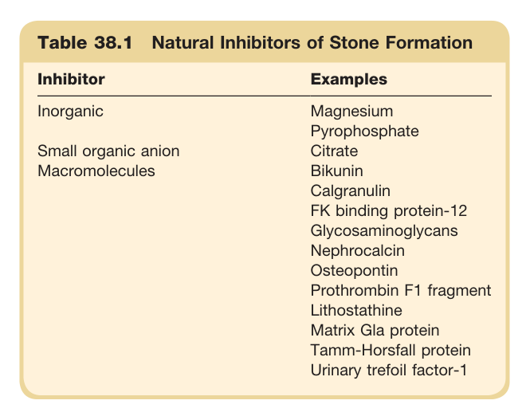

#### Table Data (CSV: [Table_38_1.csv](Table_38_1.csv))

```markdown
| Table Text (OCR) |
| :--- |
| Table 38.1 Natural Inhibitors of Stone Formation Inhibitor  Examples    Inorganic  Magnesium    Pyrophosphate    Small organic anion  Citrate    Macromolecules  Bikunin    Calgranulin    FK binding protein-12    Glycosaminoglycans    Nephrocalcin    Osteopontin    Prothrombin F1 fragment    Lithostathine    Matrix Gla protein    Tamm-Horsfall protein    Urinary trefoil factor-1 |
```

Table 38.1 Natural Inhibitors of Stone Formation | Inhibitor | Examples | | :--- | :--- | | Inorganic | Magnesium<br>Pyrophosphate | | Small organic anion | Citrate | | Macromolecules | Bikunin<br>Calgranulin<br>FK binding protein-12<br>Glycosaminoglycans<br>Nephrocalcin<br>Osteopontin<br>Prothrombin F1 fragment<br>Lithostathine<br>Matrix Gla protein<br>Tamm-Horsfall protein<br>Urinary trefoil factor-1 |

---

### Table_38_2

#### Table Image

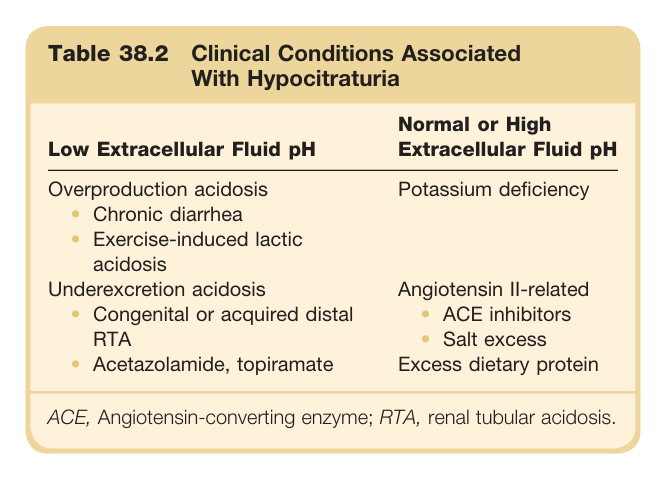

#### Table Data (CSV: [Table_38_2.csv](Table_38_2.csv))

```markdown
| Table Text (OCR) |
| :--- |
| Table 38.2 Clinical Conditions Associated With Hypocitraturia Low Extracellular Fluid pH  Normal or High Extracellular Fluid pH    Overproduction acidosisChronic diarrheaExercise-induced lactic acidosis  Potassium deficiency    Underexcretion acidosisCongenital or acquired distal RTAAcetazolamide, topiramate  Angiotensin II-relatedACE inhibitorsSalt excessExcess dietary protein    ACE, Angiotensin-converting enzyme; RTA, renal tubular acidosis. |
```

Table 38.2 Clinical Conditions Associated With Hypocitraturia | Low Extracellular Fluid pH | Normal or High Extracellular Fluid pH | | :--- | :--- | | Overproduction acidosis<br>• Chronic diarrhea<br>• Exercise-induced lactic acidosis | Potassium deficiency | | Underexcretion acidosis<br>• Congenital or acquired distal RTA<br>• Acetazolamide, topiramate | Angiotensin II-related<br>• ACE inhibitors<br>• Salt excess<br>Excess dietary protein | *ACE, Angiotensin-converting enzyme; RTA, renal tubular acidosis.*

---

### Table_38_3

#### Table Image

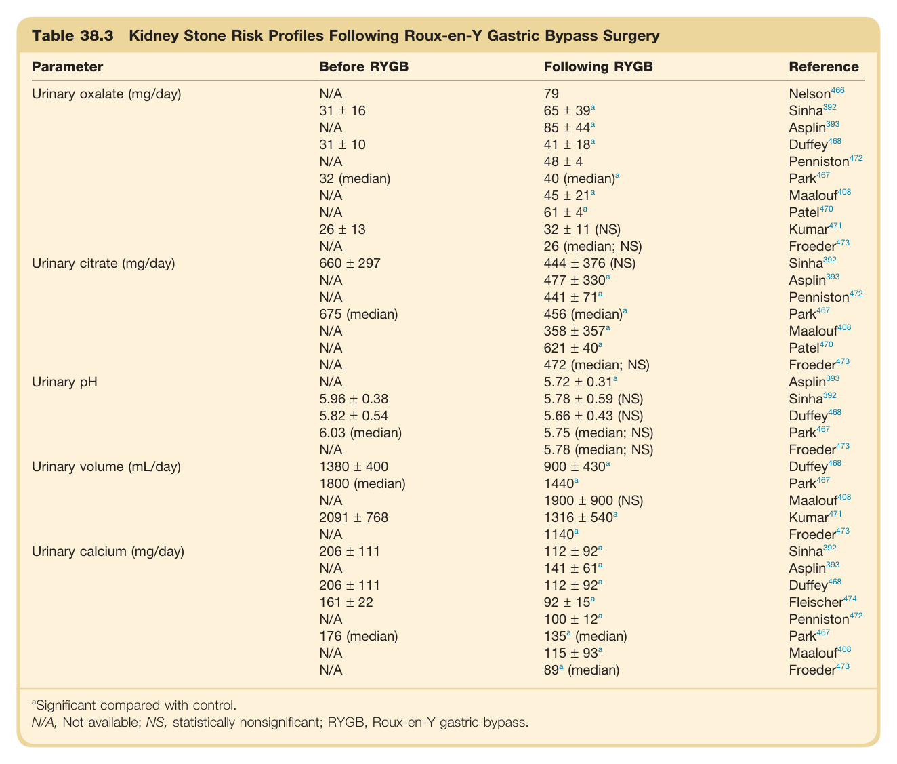

#### Table Data (CSV: [Table_38_3.csv](Table_38_3.csv))

```markdown
| Table Text (OCR) |
| :--- |
| Table 38.3 Kidney Stone Risk Profiles Following Roux-en-Y Gastric Bypass Surgery Parameter  Before RYGB  Following RYGB  Reference    Urinary oxalate (mg/day)  N/A  79   Nelson^{466}     31 ± 16   65 ± 39^a    Sinha^{392}     N/A   85 ± 44^a    Asplin^{393}     31 ± 10   41 ± 18^a    Duffey^{468}     N/A  48 ± 4   Penniston^{472}     32 (median)   40 (median)^a    Park^{467}     N/A   45 ± 21^a    Maalouf^{408}     N/A   61 ± 4^a    Patel^{470}     26 ± 13  32 ± 11 (NS)   Kumar^{471}     N/A  26 (median; NS)   Froeder^{473}     Urinary citrate (mg/day)  660 ± 297  444 ± 376 (NS)   Sinha^{392}     N/A   477 ± 330^a    Asplin^{393}     N/A   441 ± 71^a    Penniston^{472}     675 (median)   456 (median)^a    Park^{467}     N/A   358 ± 357^a    Maalouf^{408}     N/A   621 ± 40^a    Patel^{470}     N/A  472 (median; NS)   Froeder^{473}     Urinary pH  N/A   5.72 ± 0.31^a    Asplin^{393}     5.96 ± 0.38  5.78 ± 0.59 (NS)   Sinha^{392}     5.82 ± 0.54  5.66 ± 0.43 (NS)   Duffey^{468}     6.03 (median)  5.75 (median; NS)   Park^{467}     N/A  5.78 (median; NS)   Froeder^{473}     Urinary volume (mL/day)  1380 ± 400   900 ± 430^a    Duffey^{468}     1800 (median)   1440^a    Park^{467}     N/A  1900 ± 900 (NS)   Maalouf^{408}     2091 ± 768   1316 ± 540^a    Kumar^{471}     N/A   1140^a    Froeder^{473}     Urinary calcium (mg/day)  206 ± 111   112 ± 92^a    Sinha^{392}     N/A   141 ± 61^a    Asplin^{393}     206 ± 111   112 ± 92^a    Duffey^{468}     161 ± 22   92 ± 15^a    Fleischer^{474}     N/A   100 ± 12^a    Penniston^{472}     176 (median)   135^a (median)    Park^{467}     N/A   115 ± 93^a    Maalouf^{408}     N/A   89^a (median)    Froeder^{473} <sup>a</sup>Significant compared with control. N/A, Not available; NS, statistically nonsignificant; RYGB, Roux-en-Y gastric bypass. |
```

Table 38.3 Kidney Stone Risk Profiles Following Roux-en-Y Gastric Bypass Surgery | Parameter | Before RYGB | Following RYGB | | :--- | :--- | :--- | | Urinary oxalate (mg/day) | N/A | 79 | | | 31 ± 16 | 65 ± 39a | | | N/A | 85 ± 44a | | | 31 ± 10 | 41 ± 18a | | | N/A | 48 ± 4 | | | 32 (median) | 40 (median)a | | | N/A | 45 ± 21a | | | N/A | 61 ± 4a | | | 26 ± 13 | 32 ± 11 (NS) | | | N/A | 26 (median; NS) | | Urinary citrate (mg/day) | 660 ± 297 | 444 ± 376 (NS) | | | N/A | 477 ± 330a | | | N/A | 441 ± 71a | | | 675 (median) | 456 (median)a | | | N/A | 358 ± 357a | | | N/A | 621 ± 40a | | | N/A | 472 (median; NS) | | Urinary pH | N/A | 5.72 ± 0.31a | | | 5.96 ± 0.38 | 5.78 ± 0.59 (NS) | | | 5.82 ± 0.54 | 5.66 ± 0.43 (NS) | | | 6.03 (median) | 5.75 (median; NS) | | | N/A | 5.78 (median; NS) | | Urinary volume (mL/day) | 1380 ± 400 | 900 ± 430a | | | 1800 (median) | 1440a | | | N/A | 1900 ± 900 (NS) | | | 2091 ± 768 | 1316 ± 540a | | | N/A | 1140a | | Urinary calcium (mg/day) | 206 ± 111 | 112 ± 92a | | | N/A | 141 ± 61a | | | 206 ± 111 | 112 ± 92a | | | 161 ± 22 | 92 ± 15a | | | N/A | 100 ± 12a | | | 176 (median) | 135a (median) | | | N/A | 115 ± 93a | | | N/A | 89a (median) | *aSignificant compared with control.* *N/A, Not available; NS, statistically nonsignificant; RYGB, Roux-en-Y gastric bypass.*

---

### Table_38_4

#### Table Image

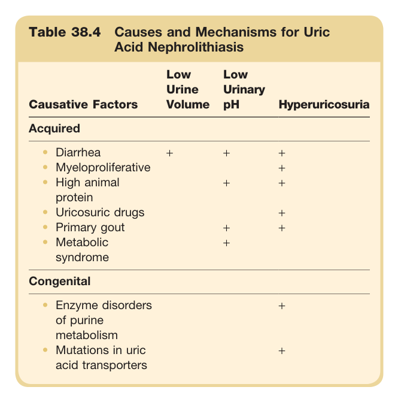

#### Table Data (CSV: [Table_38_4.csv](Table_38_4.csv))

```markdown
| Table Text (OCR) |
| :--- |
| Table 38.4 Causes and Mechanisms for Uric Acid Nephrolithiasis Causative Factors  Low Urine Volume  Low Urinary pH  Hyperuricosuria    Acquired    Diarrhea  +  +  +    Myeloproliferative      +    High animal protein    +  +    Uricosuric drugs      +    Primary gout    +  +    Metabolic syndrome    +      Congenital    Enzyme disorders of purine metabolism      +    Mutations in uric acid transporters      + |
```

Table 38.4 Causes and Mechanisms for Uric Acid Nephrolithiasis | Causative Factors | Low Urine Volume | Low Urinary pH | Hyperuricosuria | | :--- | :--- | :--- | :--- | | **Acquired** | | | | | • Diarrhea | + | + | + | | • Myeloproliferative | | | + | | • High animal protein | | + | + | | • Uricosuric drugs | | | + | | • Primary gout | | + | + | | • Metabolic syndrome | | + | | | **Congenital** | | | | | • Enzyme disorders of purine metabolism | | | + | | • Mutations in uric acid transporters | | | + |

---

### Table_38_5

#### Table Image

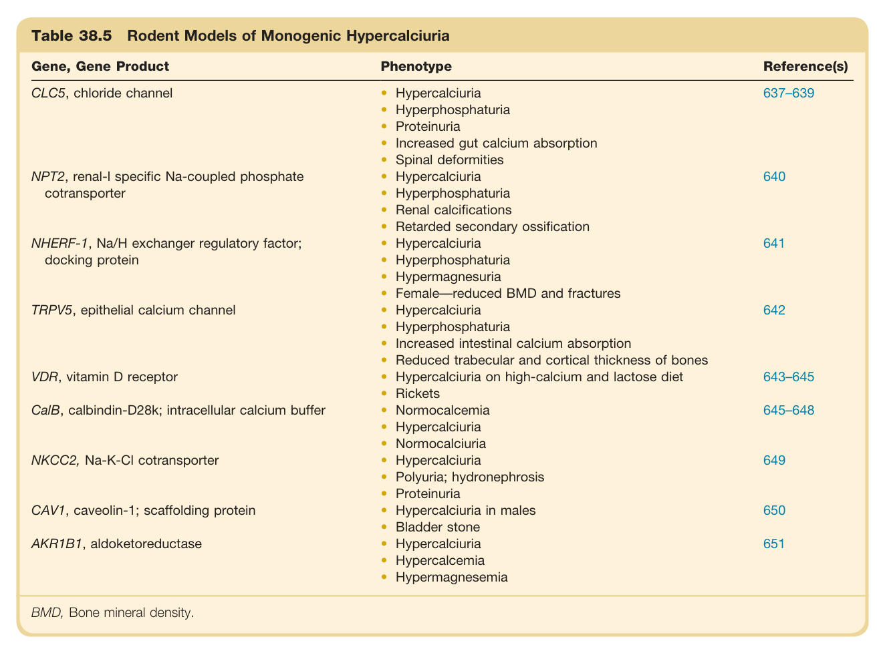

#### Table Data (CSV: [Table_38_5.csv](Table_38_5.csv))

```markdown
| Table Text (OCR) |
| :--- |
| Table 38.5 Rodent Models of Monogenic Hypercalciuria Gene, Gene Product  Phenotype  Reference(s)    CLC5, chloride channel  HypercalciuriaHyperphosphaturiaProteinuriaIncreased gut calcium absorptionSpinal deformities  637-639    NPT2, renal-I specific Na-coupled phosphate cotransporter  HypercalciuriaHyperphosphaturiaRenal calcificationsRetarded secondary ossification  640    NHERF-1, Na/H exchanger regulatory factor; docking protein  HypercalciuriaHyperphosphaturiaHypermagnesuriaFemale—reduced BMD and fractures  641    TRPV5, epithelial calcium channel  HypercalciuriaHyperphosphaturiaIncreased intestinal calcium absorptionReduced trabecular and cortical thickness of bones  642    VDR, vitamin D receptor  Hypercalciuria on high-calcium and lactose dietRickets  643-645    CalB, calbindin-D28k; intracellular calcium buffer  NormocalcemiaHypercalciuriaNormocalciuria  645-648    NKCC2, Na-K-Cl cotransporter  HypercalciuriaPolyuria; hydronephrosisProteinuria  649    CAV1, caveolin-1; scaffolding protein  Hypercalciuria in malesBladder stone  650    AKR1B1, aldoketoreductase  HypercalciuriaHypercalcemiaHypermagnesemia  651 BMD, Bone mineral density. |
```

Table 38.5 Rodent Models of Monogenic Hypercalciuria | Gene, Gene Product | Phenotype | | :--- | :--- | | CLC5, chloride channel | • Hypercalciuria<br>• Hyperphosphaturia<br>• Proteinuria<br>• Increased gut calcium absorption<br>• Spinal deformities | | NPT2, renal-l specific Na-coupled phosphate cotransporter | • Hypercalciuria<br>• Hyperphosphaturia<br>• Renal calcifications<br>• Retarded secondary ossification | | NHERF-1, Na/H exchanger regulatory factor; docking protein | • Hypercalciuria<br>• Hyperphosphaturia<br>• Hypermagnesuria<br>• Female-reduced BMD and fractures | | TRPV5, epithelial calcium channel | • Hypercalciuria<br>• Hyperphosphaturia<br>• Increased intestinal calcium absorption<br>• Reduced trabecular and cortical thickness of bones | | VDR, vitamin D receptor | • Hypercalciuria on high-calcium and lactose diet<br>• Rickets | | CalB, calbindin-D28k; intracellular calcium buffer | • Normocalcemia<br>• Hypercalciuria | | NKCC2, Na-K-Cl cotransporter | • Normocalciuria<br>• Hypercalciuria<br>• Polyuria; hydronephrosis<br>• Proteinuria | | CAV1, caveolin-1; scaffolding protein | • Hypercalciuria in males<br>• Bladder stone | | AKR1B1, aldoketoreductase | • Hypercalciuria<br>• Hypercalcemia<br>• Hypermagnesemia | *BMD, Bone mineral density.*

---

### Table_38_6

#### Table Image

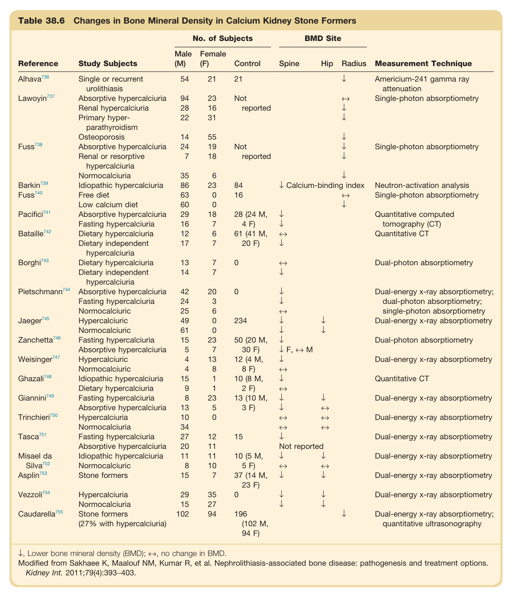

#### Table Data (CSV: [Table_38_6.csv](Table_38_6.csv))

```markdown
| Table Text (OCR) |
| :--- |
| Table 38.6 Changes in Bone Mineral Density in Calcium Kidney Stone Formers Reference  Study Subjects  No. of Subjects  BMD Site  Measurement Technique    Male (M)  Female (F)  Control  Spine  Hip  Radius     Alhava^{736}   Single or recurrent urolithiasis  54  21  21      ↓  Americium-241 gamma ray attenuation     Lawoyin^{737}   Absorptive hypercalciuria  94  23  Not reported       \leftrightarrow   Single-photon absorptiometry    Renal hypercalciuria  28  16      ↓    Primary hyper-parathyroidism  22  31      ↓    Osteoporosis  14  55        ↓     Fuss^{738}   Absorptive hypercalciuria  24  19  Not reported      ↓  Single-photon absorptiometry    Renal or resorptive hypercalciuria  7  18      ↓    Normocalciuria  35  6        ↓     Barkin^{739}   Idiopathic hypercalciuria  86  23  84  ↓ Calcium-binding index  Neutron-activation analysis     Fuss^{740}   Free diet  63  0  16       \leftrightarrow   Single-photon absorptiometry    Low calcium diet  60  0        ↓     Pacifici^{741}   Absorptive hypercalciuria  29  18  28 (24 M, 4 F)  ↓      Quantitative computed tomography (CT)    Fasting hypercalciuria  16  7  ↓         Bataille^{742}   Dietary hypercalciuria  12  6  61 (41 M, 20 F)   \leftrightarrow       Quantitative CT    Dietary independent hypercalciuria  17  7  ↓         Borghi^{743}   Dietary hypercalciuria  13  7  0   \leftrightarrow       Dual-photon absorptiometry    Dietary independent hypercalciuria  14  7    ↓         Pietschmann^{744}   Absorptive hypercalciuria  42  20  0  ↓      Dual-energy x-ray absorptiometry; dual-photon absorptiometry; single-photon absorptiometry    Fasting hypercalciuria  24  3    ↓        Normocalciuric  25  6     \leftrightarrow          Jaeger^{745}   Hypercalciuric  49  0  234  ↓  ↓    Dual-energy x-ray absorptiometry    Normocalciuric  61  0    ↓  ↓       Zanchetta^{746}   Fasting hypercalciuria  15  23  50 (20 M, 30 F)  ↓      Dual-photon absorptiometry    Absorptive hypercalciuria  5  7  ↓ F,  \leftrightarrow  M         Weisinger^{747}   Hypercalciuric  4  13  12 (4 M, 8 F)  ↓      Dual-energy x-ray absorptiometry    Normocalciuric  4  8   \leftrightarrow          Ghazali^{748}   Idiopathic hypercalciuria  15  1  10 (8 M, 2 F)  ↓      Quantitative CT    Dietary hypercalciuria  9  1   \leftrightarrow          Giannini^{749}   Fasting hypercalciuria  8  23  13 (10 M, 3 F)  ↓  ↓    Dual-energy x-ray absorptiometry    Absorptive hypercalciuria  13  5  ↓   \leftrightarrow        Trinchieri^{750}   Hypercalciuria  10  0     \leftrightarrow    \leftrightarrow     Dual-energy x-ray absorptiometry    Normocalciuria  34       \leftrightarrow    \leftrightarrow        Tasca^{751}   Fasting hypercalciuria  27  12  15  ↓      Dual-energy x-ray absorptiometry    Absorptive hypercalciuria  20  11    Not reported    Misael da Silva ^{752}   Idiopathic hypercalciuria  11  11  10 (5 M, 5 F)  ↓  ↓    Dual-energy x-ray absorptiometry    Normocalciuric  8  10   \leftrightarrow    \leftrightarrow        Asplin^{753}   Stone formers  15  7  37 (14 M, 23 F)  ↓  ↓    Dual-energy x-ray absorptiometry     Vezzoli^{754}   Hypercalciuria  29  35  0  ↓  ↓    Dual-energy x-ray absorptiometry    Normocalciuria  15  27    ↓  ↓       Caudarella^{755}   Stone formers (27% with hypercalciuria)  102  94  196 (102 M, 94 F)      ↓  Dual-energy x-ray absorptiometry; quantitative ultrasonography ↓, Lower bone mineral density (BMD); ↔, no change in BMD. Modified from Sakhaee K, Maalouf NM, Kumar R, et al. Nephrolithiasis-associated bone disease: pathogenesis and treatment options. Kidney Int. 2011;79(4):393−403. |
```

Table 38.6 Changes in Bone Mineral Density in Calcium Kidney Stone Formers *This table presents data from various studies on bone mineral density (BMD) in different types of kidney stone formers, showing varied results (decreased ↓, no change ↔, or increased ↑) across different skeletal sites (Spine, Hip, Radius) and measurement techniques.*

---

### Table_38_7

#### Table Image

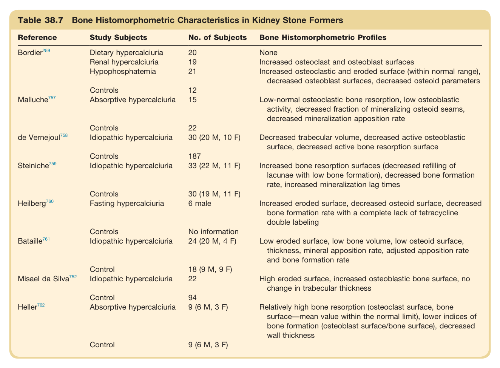

#### Table Data (CSV: [Table_38_7.csv](Table_38_7.csv))

```markdown
| Table Text (OCR) |
| :--- |
| Table 38.7 Bone Histomorphometric Characteristics in Kidney Stone Formers Reference  Study Subjects  No. of Subjects  Bone Histomorphometric Profiles     Bordier^{259}   Dietary hypercalciuria  20  None    Renal hypercalciuria  19  Increased osteoclast and osteoblast surfaces    Hypophosphatemia  21  Increased osteoclastic and eroded surface (within normal range), decreased osteoblast surfaces, decreased osteoid parameters    Controls  12       Malluche^{757}   Absorptive hypercalciuria  15  Low-normal osteoclastic bone resorption, low osteoblastic activity, decreased fraction of mineralizing osteoid seams, decreased mineralization apposition rate    Controls  22       de Vernejoul^{758}   Idiopathic hypercalciuria  30 (20 M, 10 F)  Decreased trabecular volume, decreased active osteoblastic surface, decreased active bone resorption surface    Controls  187       Steiniche^{759}   Idiopathic hypercalciuria  33 (22 M, 11 F)  Increased bone resorption surfaces (decreased refilling of lacunae with low bone formation), decreased bone formation rate, increased mineralization lag times    Controls  30 (19 M, 11 F)       Heilberg^{760}   Fasting hypercalciuria  6 male  Increased eroded surface, decreased osteoid surface, decreased bone formation rate with a complete lack of tetracycline double labeling    Controls  No information       Bataille^{761}   Idiopathic hypercalciuria  24 (20 M, 4 F)  Low eroded surface, low bone volume, low osteoid surface, thickness, mineral apposition rate, adjusted apposition rate and bone formation rate    Control  18 (9 M, 9 F)       Misael da Silva^{752}   Idiopathic hypercalciuria  22  High eroded surface, increased osteoblastic bone surface, no change in trabecular thickness    Control  94       Heller^{762}   Absorptive hypercalciuria  9 (6 M, 3 F)  Relatively high bone resorption (osteoclast surface, bone surface—mean value within the normal limit), lower indices of bone formation (osteoblast surface/bone surface), decreased wall thickness    Control  9 (6 M, 3 F) |
```

Table 38.7 Bone Histomorphometric Characteristics in Kidney Stone Formers *This table summarizes findings from several studies on bone histomorphometry in kidney stone formers, detailing profiles such as increased/decreased osteoclast/osteoblast surfaces, bone resorption, and bone formation rates for different patient groups (e.g., dietary, absorptive, fasting hypercalciuria).*

---

### Table_38_8

#### Table Image

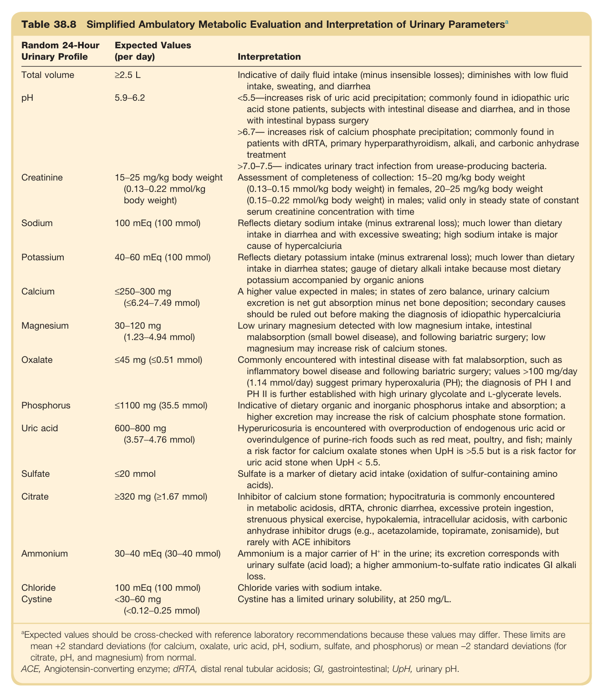

#### Table Data (CSV: [Table_38_8.csv](Table_38_8.csv))

```markdown
| Table Text (OCR) |
| :--- |
| Table 38.8 Simplified Ambulatory Metabolic Evaluation and Interpretation of Urinary Parameters<sup>a</sup> Random 24-Hour Urinary Profile  Expected Values (per day)  Interpretation    Total volume  ≥2.5 L  Indicative of daily fluid intake (minus insensible losses); diminishes with low fluid intake, sweating, and diarrhea    pH  5.9–6.2  <5.5—increases risk of uric acid precipitation; commonly found in idiopathic uric acid stone patients, subjects with intestinal disease and diarrhea, and in those with intestinal bypass surgery>6.7—increases risk of calcium phosphate precipitation; commonly found in patients with dRTA, primary hyperparathyroidism, alkali, and carbonic anhydrase treatment>7.0–7.5—indicates urinary tract infection from urease-producing bacteria.    Creatinine  15–25 mg/kg body weight (0.13–0.22 mmol/kg body weight)  Assessment of completeness of collection: 15–20 mg/kg body weight (0.13–0.15 mmol/kg body weight) in females, 20–25 mg/kg body weight (0.15–0.22 mmol/kg body weight) in males; valid only in steady state of constant serum creatinine concentration with time    Sodium  100 mEq (100 mmol)  Reflects dietary sodium intake (minus extrarenal loss); much lower than dietary intake in diarrhea and with excessive sweating; high sodium intake is major cause of hypercalciuria    Potassium  40–60 mEq (100 mmol)  Reflects dietary potassium intake (minus extrarenal loss); much lower than dietary intake in diarrhea states; gauge of dietary alkali intake because most dietary potassium accompanied by organic anions    Calcium  ≤250–300 mg (≤6.24–7.49 mmol)  A higher value expected in males; in states of zero balance, urinary calcium excretion is net gut absorption minus net bone deposition; secondary causes should be ruled out before making the diagnosis of idiopathic hypercalciuria    Magnesium  30–120 mg (1.23–4.94 mmol)  Low urinary magnesium detected with low magnesium intake, intestinal malabsorption (small bowel disease), and following bariatric surgery; low magnesium may increase risk of calcium stones.    Oxalate  ≤45 mg (≤0.51 mmol)  Commonly encountered with intestinal disease with fat malabsorption, such as inflammatory bowel disease and following bariatric surgery; values >100 mg/day (1.14 mmol/day) suggest primary hyperoxaluria (PH); the diagnosis of PH I and PH II is further established with high urinary glycolate and L-glycerate levels.    Phosphorus  ≤1100 mg (35.5 mmol)  Indicative of dietary organic and inorganic phosphorus intake and absorption; a higher excretion may increase the risk of calcium phosphate stone formation.    Uric acid  600–800 mg (3.57–4.76 mmol)  Hyperuricosuria is encountered with overproduction of endogenous uric acid or overindulgence of purine-rich foods such as red meat, poultry, and fish; mainly a risk factor for calcium oxalate stones when UpH is >5.5 but is a risk factor for uric acid stone when UpH < 5.5.    Sulfate  ≤20 mmol  Sulfate is a marker of dietary acid intake (oxidation of sulfur-containing amino acids).    Citrate  ≥320 mg (≥1.67 mmol)  Inhibitor of calcium stone formation; hypocitraturia is commonly encountered in metabolic acidosis, dRTA, chronic diarrhea, excessive protein ingestion, strenuous physical exercise, hypokalemia, intracellular acidosis, with carbonic anhydrase inhibitor drugs (e.g., acetazolamide, topiramate, zonisamide), but rarely with ACE inhibitors    Ammonium  30–40 mEq (30–40 mmol)  Ammonium is a major carrier of H+ in the urine; its excretion corresponds with urinary sulfate (acid load); a higher ammonium-to-sulfate ratio indicates GI alkali loss.    Chloride  100 mEq (100 mmol)  Chloride varies with sodium intake.    Cystine  <30–60 mg (<0.12–0.25 mmol)  Cystine has a limited urinary solubility, at 250 mg/L. <sup>a</sup>Expected values should be cross-checked with reference laboratory recommendations because these values may differ. These limits are mean +2 standard deviations (for calcium, oxalate, uric acid, pH, sodium, sulfate, and phosphorus) or mean –2 standard deviations (for citrate, pH, and magnesium) from normal. ACE, Angiotensin-converting enzyme; dRTA, distal renal tubular acidosis; GI, gastrointestinal; UpH, urinary pH. |
```

Table 38.8 Simplified Ambulatory Metabolic Evaluation and Interpretation of Urinary Parameters *This table provides expected values and interpretations for a random 24-hour urinary profile, covering parameters like volume, pH, creatinine, sodium, potassium, calcium, magnesium, oxalate, phosphorus, uric acid, sulfate, citrate, ammonium, chloride, and cystine. It explains how each parameter can indicate dietary habits, underlying conditions (like dRTA or hyperoxaluria), and risk for specific types of stones.*

---

### Table_38_9

#### Table Image

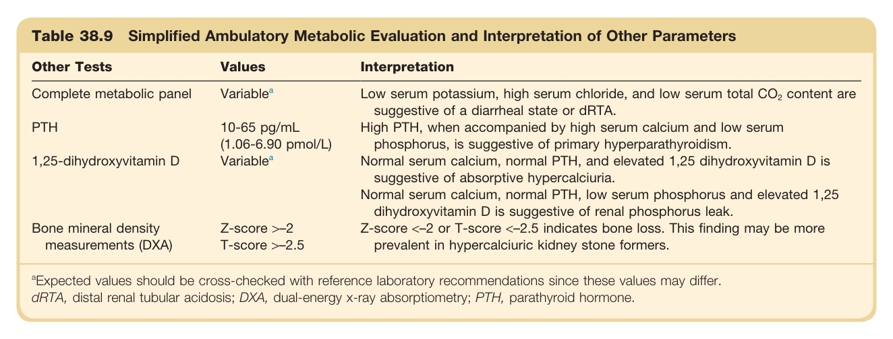

#### Table Data (CSV: [Table_38_9.csv](Table_38_9.csv))

```markdown
| Table Text (OCR) |
| :--- |
| Table 38.9 Simplified Ambulatory Metabolic Evaluation and Interpretation of Other Parameters Other Tests  Values  Interpretation    Complete metabolic panel  Variablea  Low serum potassium, high serum chloride, and low serum total CO2content are suggestive of a diarrheal state or dRTA.    PTH  10-65 pg/mL (1.06-6.90 pmol/L)  High PTH, when accompanied by high serum calcium and low serum phosphorus, is suggestive of primary hyperparathyroidism.    1,25-dihydroxyvitamin D  Variablea  Normal serum calcium, normal PTH, and elevated 1,25 dihydroxyvitamin D is suggestive of absorptive hypercalciuria.    Normal serum calcium, normal PTH, low serum phosphorus and elevated 1,25 dihydroxyvitamin D is suggestive of renal phosphorus leak.    Bone mineral density measurements (DXA)  Z-score >-2  Z-score <-2 or T-score <-2.5 indicates bone loss. This finding may be more prevalent in hypercalciuric kidney stone formers.    T-score >-2.5 <sup>a</sup>Expected values should be cross-checked with reference laboratory recommendations since these values may differ. dRTA, distal renal tubular acidosis; DXA, dual-energy x-ray absorptiometry; PTH, parathyroid hormone. |
```

Table 38.9 Simplified Ambulatory Metabolic Evaluation and Interpretation of Other Parameters | Other Tests | Values | Interpretation | | :--- | :--- | :--- | | Complete metabolic panel | Variable | Low serum potassium, high serum chloride, and low serum total CO2 content are suggestive of a diarrheal state or dRTA. | | PTH | 10-65 pg/mL (1.06-6.90 pmol/L) | High PTH, when accompanied by high serum calcium and low serum phosphorus, is suggestive of primary hyperparathyroidism. | | 1,25-dihydroxyvitamin D | Variable | Normal serum calcium, normal PTH, and elevated 1,25 dihydroxyvitamin D is suggestive of absorptive hypercalciuria. Normal serum calcium, normal PTH, low serum phosphorus and elevated 1,25 dihydroxyvitamin D is suggestive of renal phosphorus leak. | | Bone mineral density measurements (DXA) | Z-score >-2 T-score >-2.5 | Z-score <-2 or T-score <-2.5 indicates bone loss. This finding may be more prevalent in hypercalciuric kidney stone formers. | *Expected values should be cross-checked with reference laboratory recommendations since these values may differ. dRTA, distal renal tubular acidosis; DXA, dual-energy x-ray absorptiometry; PTH, parathyroid hormone.*

---

### Table_38_10

#### Table Image

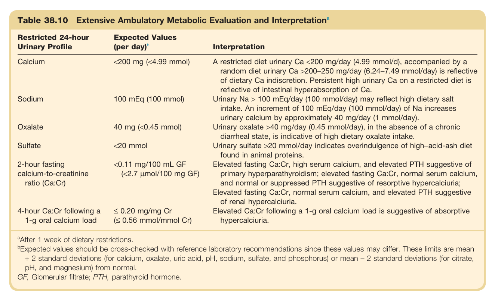

#### Table Data (CSV: [Table_38_10.csv](Table_38_10.csv))

```markdown
| Table Text (OCR) |
| :--- |
| Table 38.10 Extensive Ambulatory Metabolic Evaluation and Interpretation<sup>a</sup> Restricted 24-hour Urinary Profile  Expected Values (per day) ^b   Interpretation    Calcium  <200 mg (<4.99 mmol)  A restricted diet urinary Ca <200 mg/day (4.99 mmol/d), accompanied by a random diet urinary Ca >200–250 mg/day (6.24–7.49 mmol/day) is reflective of dietary Ca indiscretion. Persistent high urinary Ca on a restricted diet is reflective of intestinal hyperabsorption of Ca.    Sodium  100 mEq (100 mmol)  Urinary Na >100 mEq/day (100 mmol/day) may reflect high dietary salt intake. An increment of 100 mEq/day (100 mmol/day) of Na increases urinary calcium by approximately 40 mg/day (1 mmol/day).    Oxalate  40 mg (<0.45 mmol)  Urinary oxalate >40 mg/day (0.45 mmol/day), in the absence of a chronic diarrheal state, is indicative of high dietary oxalate intake.    Sulfate  <20 mmol  Urinary sulfate >20 mmol/day indicates overindulgence of high-acid-ash diet found in animal proteins.    2-hour fasting calcium-to-creatinine ratio (Ca:Cr)  <0.11 mg/100 mL GF (<2.7 μmol/100 mg GF)  Elevated fasting Ca:Cr, high serum calcium, and elevated PTH suggestive of primary hyperparathyroidism; elevated fasting Ca:Cr, normal serum calcium, and normal or suppressed PTH suggestive of resorptive hypercalciuria; Elevated fasting Ca:Cr, normal serum calcium, and elevated PTH suggestive of renal hypercalciuria.    4-hour Ca:Cr following a 1-g oral calcium load  ≤ 0.20 mg/mg Cr (≤ 0.56 mmol/mmol Cr)  Elevated Ca:Cr following a 1-g oral calcium load is suggestive of absorptive hypercalciuria. <sup>a</sup>After 1 week of dietary restrictions. <sup>b</sup>Expected values should be cross-checked with reference laboratory recommendations since these values may differ. These limits are mean + 2 standard deviations (for calcium, oxalate, uric acid, pH, sodium, sulfate, and phosphorus) or mean – 2 standard deviations (for citrate, pH, and magnesium) from normal. GF, Glomerular filtrate; PTH, parathyroid hormone. |
```

Table 38.10 Extensive Ambulatory Metabolic Evaluation and Interpretation | Restricted 24-hour Urinary Profile | Expected Values (per day) | Interpretation | | :--- | :--- | :--- | | Calcium | <200 mg (<4.99 mmol) | A restricted diet urinary Ca <200 mg/day (4.99 mmol/d), accompanied by a random diet urinary Ca >200-250 mg/day (6.24-7.49 mmol/day) is reflective of dietary Ca indiscretion. Persistent high urinary Ca on a restricted diet is reflective of intestinal hyperabsorption of Ca. | | Sodium | 100 mEq (100 mmol) | Urinary Na > 100 mEq/day (100 mmol/day) may reflect high dietary salt intake. An increment of 100 mEq/day (100 mmol/day) of Na increases urinary calcium by approximately 40 mg/day (1 mmol/day). | | Oxalate | 40 mg (<0.45 mmol) | Urinary oxalate >40 mg/day (0.45 mmol/day), in the absence of a chronic diarrheal state, is indicative of high dietary oxalate intake. | | Sulfate | <20 mmol | Urinary sulfate >20 mmol/day indicates overindulgence of high-acid-ash diet found in animal proteins. | | 2-hour fasting calcium-to-creatinine ratio (Ca:Cr) | <0.11 mg/100 mL GF (<2.7 µmol/100 mg GF) | Elevated fasting Ca:Cr, high serum calcium, and elevated PTH suggestive of primary hyperparathyroidism; elevated fasting Ca:Cr, normal serum calcium, and normal or suppressed PTH suggestive of resorptive hypercalciuria; | | 4-hour Ca:Cr following a 1-g oral calcium load | ≤ 0.20 mg/mg Cr (≤ 0.56 mmol/mmol Cr) | Elevated fasting Ca:Cr, normal serum calcium, and elevated PTH suggestive of renal hypercalciuria. Elevated Ca:Cr following a 1-g oral calcium load is suggestive of absorptive hypercalciuria. | *After 1 week of dietary restrictions.*

---

### Table_38_11

#### Table Image

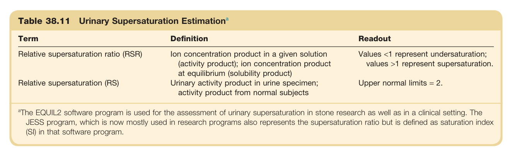

#### Table Data (CSV: [Table_38_11.csv](Table_38_11.csv))

```markdown
| Table Text (OCR) |
| :--- |
| Table 38.11 Urinary Supersaturation Estimation<sup>a</sup> Term  Definition  Readout    Relative supersaturation ratio (RSR)  Ion concentration product in a given solution (activity product); ion concentration product at equilibrium (solubility product)  Values <1 represent undersaturation; values >1 represent supersaturation.    Relative supersaturation (RS)  Urinary activity product in urine specimen; activity product from normal subjects  Upper normal limits = 2. <sup>a</sup>The EQUIL2 software program is used for the assessment of urinary supersaturation in stone research as well as in a clinical setting. The JESS program, which is now mostly used in research programs also represents the supersaturation ratio but is defined as saturation index (SI) in that software program. |
```

Table 38.11 Urinary Supersaturation Estimation | Term | Definition | Readout | | :--- | :--- | :--- | | Relative supersaturation ratio (RSR) | Ion concentration product in a given solution (activity product); ion concentration product at equilibrium (solubility product) | Values <1 represent undersaturation; values >1 represent supersaturation. | | Relative supersaturation (RS) | Urinary activity product in urine specimen; activity product from normal subjects | Upper normal limits = 2. | *The EQUIL2 software program is used for the assessment of urinary supersaturation in stone research as well as in a clinical setting. The JESS program, which is now mostly used in research programs also represents the supersaturation ratio but is defined as saturation index (SI) in that software program.*

---

### Table_38_12

#### Table Image

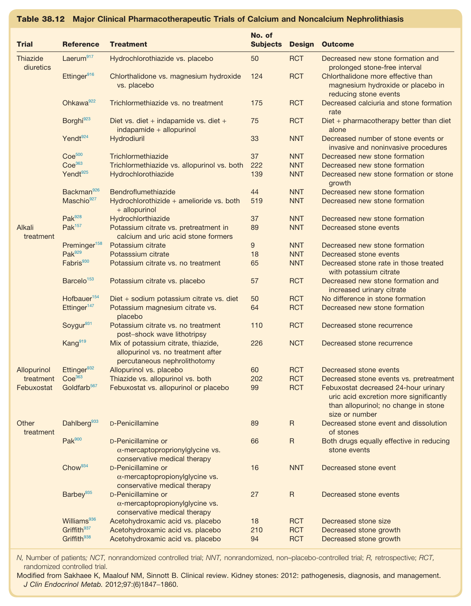

#### Table Data (CSV: [Table_38_12.csv](Table_38_12.csv))

```markdown
| Table Text (OCR) |
| :--- |
| Table 38.12 Major Clinical Pharmacotherapeutic Trials of Calcium and Noncalcium Nephrolithiasis Trial  Reference  Treatment  No. of Subjects  Design  Outcome    Thiazide diuretics  Laerum917  Hydrochlorothiazide vs. placebo  50  RCT  Decreased new stone formation and prolonged stone-free interval    Ettinger916  Chlorthalidone vs. magnesium hydroxide vs. placebo  124  RCT  Chlorthalidone more effective than magnesium hydroxide or placebo in reducing stone events    Ohkawa922  Trichlormethiazide vs. no treatment  175  RCT  Decreased calciuria and stone formation rate    Borghi923  Diet vs. diet + indapamide vs. diet + indapamide + allopurinol  75  RCT  Diet + pharmacotherapy better than diet alone    Yendt924  Hydrodiuril  33  NNT  Decreased number of stone events or invasive and noninvasive procedures    Coe500  Trichlormethiazide  37  NNT  Decreased new stone formation    Coe363  Trichlormethiazide vs. allopurinol vs. both  222  NNT  Decreased new stone formation    Yendt925  Hydrochlorothiazide  139  NNT  Decreased new stone formation or stone growth    Backman926  Bendroflumethiazide  44  NNT  Decreased new stone formation    Maschio927  Hydrochlorothiazide + amelioride vs. both + allopurinol  519  NNT  Decreased new stone formation    Alkali treatment  Pak928  Hydrochlorthiazide  37  NNT  Decreased new stone formation    Pak157  Potassium citrate vs. pretreatment in calcium and uric acid stone formers  89  NNT  Decreased stone events    Preminger158  Potassium citrate  9  NNT  Decreased new stone formation    Pak929  Potassium citrate  18  NNT  Decreased stone events    Fabris930  Potassium citrate vs. no treatment  65  NNT  Decreased stone rate in those treated with potassium citrate    Barcelo153  Potassium citrate vs. placebo  57  RCT  Decreased new stone formation and increased urinary citrate    Hofbauer154  Diet + sodium potassium citrate vs. diet  50  RCT  No difference in stone formation    Ettinger147  Potassium magnesium citrate vs. placebo  64  RCT  Decreased new stone formation    Soygur931  Potassium citrate vs. no treatment post-shock wave lithotripsy  110  RCT  Decreased stone recurrence    Kang919  Mix of potassium citrate, thiazide, allopurinol vs. no treatment after percutaneous nephrolithotomy  226  NCT  Decreased stone recurrence    Allopurinol treatment  Ettinger932  Allopurinol vs. placebo  60  RCT  Decreased stone events    Febuxostat  Coe363  Thiazide vs. allopurinol vs. both  202  RCT  Decreased stone events vs. pretreatment    Goldfarb567  Febuxostat vs. allopurinol or placebo  99  RCT  Febuxostat decreased 24-hour urinary uric acid excretion more significantly than allopurinol; no change in stone size or number    Other treatment  Dahlberg933  D-Penicillamine  89  R  Decreased stone event and dissolution of stones    Pak900  D-Penicillamine or α-mercaptopropionylglycine vs. conservative medical therapy  66  R  Both drugs equally effective in reducing stone events    Chow934  D-Penicillamine or α-mercaptopropionylglycine vs. conservative medical therapy  16  NNT  Decreased stone event    Barbey935  D-Penicillamine or α-mercaptopropionylglycine vs. conservative medical therapy  27  R  Decreased stone events    Williams936  Acetohydroxamic acid vs. placebo  18  RCT  Decreased stone size    Griffith937  Acetohydroxamic acid vs. placebo  210  RCT  Decreased stone growth    Griffith938  Acetohydroxamic acid vs. placebo  94  RCT  Decreased stone growth N, Number of patients; NCT, nonrandomized controlled trial; NNT, nonrandomized, non–placebo-controlled trial; R, retrospective; RCT, randomized controlled trial. Modified from Sakhaee K, Maalouf NM, Sinnott B. Clinical review. Kidney stones: 2012: pathogenesis, diagnosis, and management. J Clin Endocrinol Metab. 2012;97:(6)1847−1860. |
```

Table 38.12 Major Clinical Pharmacotherapeutic Trials of Calcium and Noncalcium Nephrolithiasis *This table summarizes major clinical trials for various treatments of nephrolithiasis, including thiazide diuretics, alkali treatment (potassium citrate), allopurinol, febuxostat, and other agents like D-Penicillamine and acetohydroxamic acid. It outlines the treatment comparisons, number of subjects, study design (e.g., RCT, NNT), and the primary outcome, such as decreased new stone formation or recurrence.*

---

### Table_38_13

#### Table Image

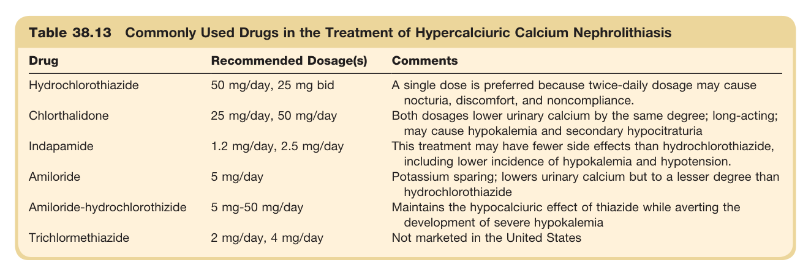

#### Table Data (CSV: [Table_38_13.csv](Table_38_13.csv))

```markdown
| Table Text (OCR) |
| :--- |
| Table 38.13 Commonly Used Drugs in the Treatment of Hypercalciuric Calcium Nephrolithiasis Drug  Recommended Dosage(s)  Comments    Hydrochlorothiazide  50 mg/day, 25 mg bid  A single dose is preferred because twice-daily dosage may cause nocturia, discomfort, and noncompliance.    Chlorthalidone  25 mg/day, 50 mg/day  Both dosages lower urinary calcium by the same degree; long-acting; may cause hypokalemia and secondary hypocitraturia    Indapamide  1.2 mg/day, 2.5 mg/day  This treatment may have fewer side effects than hydrochlorothiazide, including lower incidence of hypokalemia and hypotension.    Amiloride  5 mg/day  Potassium sparing; lowers urinary calcium but to a lesser degree than hydrochlorothiazide    Amiloride-hydrochlorothizide  5 mg-50 mg/day  Maintains the hypocalciuric effect of thiazide while averting the development of severe hypokalemia    Trichlormethiazide  2 mg/day, 4 mg/day  Not marketed in the United States |
```

Table 38.13 Commonly Used Drugs in the Treatment of Hypercalciuric Calcium Nephrolithiasis | Drug | Recommended Dosage(s) | Comments | | :--- | :--- | :--- | | Hydrochlorothiazide | 50 mg/day, 25 mg bid | A single dose is preferred because twice-daily dosage may cause nocturia, discomfort, and noncompliance. | | Chlorthalidone | 25 mg/day, 50 mg/day | Both dosages lower urinary calcium by the same degree; long-acting; may cause hypokalemia and secondary hypocitraturia | | Indapamide | 1.2 mg/day, 2.5 mg/day | This treatment may have fewer side effects than hydrochlorothiazide, including lower incidence of hypokalemia and hypotension. | | Amiloride | 5 mg/day | Potassium sparing; lowers urinary calcium but to a lesser degree than hydrochlorothiazide | | Amiloride-hydrochlorothizide | 5 mg-50 mg/day | Maintains the hypocalciuric effect of thiazide while averting the development of severe hypokalemia | | Trichlormethiazide | 2 mg/day, 4 mg/day | Not marketed in the United States |

---
