# 39. Epidemiology of Diabetic Kidney Disease - Figures and Tables Index

This document lists all figures, tables and boxes extracted from `39. Epidemiology of Diabetic Kidney Disease.pdf`.

## Table of Contents
- [Figures](#figures)
- [Tables](#tables)
- [Boxes](#boxes)

---

## Figures

### Fig_39_1

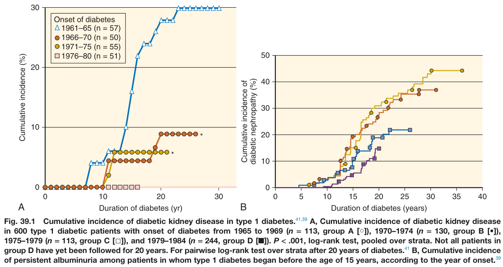

Fig. 39.1 Cumulative incidence of diabetic kidney disease in type 1 diabetes. A, Cumulative incidence of diabetic kidney disease in 600 type 1 diabetic patients with onset of diabetes from 1965 to 1969 (n = 113, group A []), 1970-1974 (n = 130, group B [•]), 1975-1979 (n = 113, group C []), and 1979-1984 (n = 244, group D [■]). P < .001, log-rank test, pooled over strata. Not all patients in group D have yet been followed for 20 years. For pairwise log-rank test over strata after 20 years of diabetes. B, Cumulative incidence of persistent albuminuria among patients in whom type 1 diabetes began before the age of 15 years, according to the year of onset.

---

### Fig_39_2

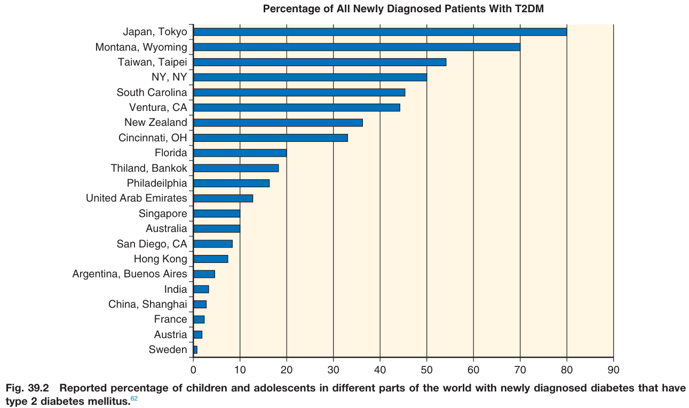

Fig. 39.2 Reported percentage of children and adolescents in different parts of the world with newly diagnosed diabetes that have type 2 diabetes mellitus. A bar chart shows the percentage of all newly diagnosed patients with T2DM in children and adolescents across various locations.

---

### Fig_39_3

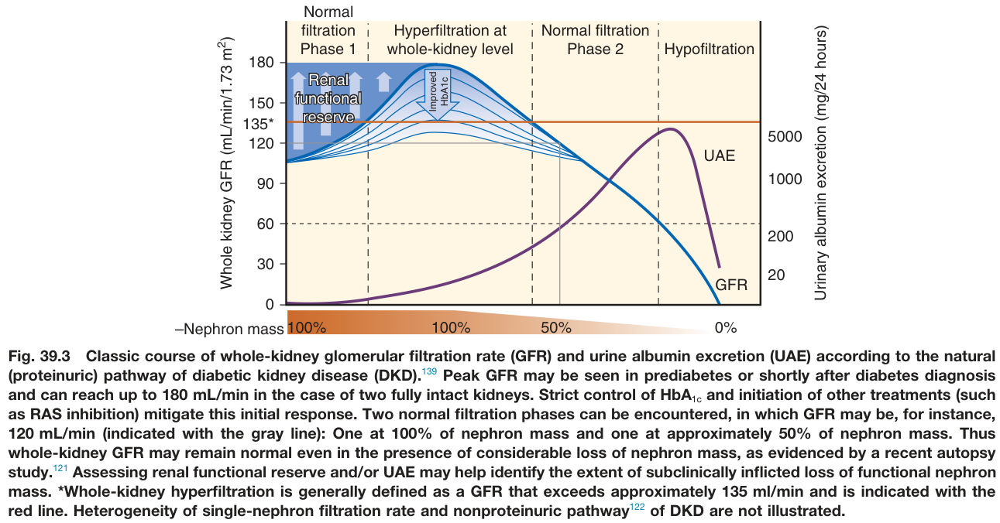

Fig. 39.3 Classic course of whole-kidney glomerular filtration rate (GFR) and urine albumin excretion (UAE) according to the natural (proteinuric) pathway of diabetic kidney disease (DKD). Peak GFR may be seen in prediabetes or shortly after diabetes diagnosis and can reach up to 180 mL/min in the case of two fully intact kidneys. Strict control of HbA1c and initiation of other treatments (such as RAS inhibition) mitigate this initial response. Two normal filtration phases can be encountered, in which GFR may be, for instance, 120 mL/min (indicated with the gray line): One at 100% of nephron mass and one at approximately 50% of nephron mass. Thus whole-kidney GFR may remain normal even in the presence of considerable loss of nephron mass, as evidenced by a recent autopsy study. Assessing renal functional reserve and/or UAE may help identify the extent of subclinically inflicted loss of functional nephron mass. *Whole-kidney hyperfiltration is generally defined as a GFR that exceeds approximately 135 ml/min and is indicated with the red line. Heterogeneity of single-nephron filtration rate and nonproteinuric pathway of DKD are not illustrated.

---

### Fig_39_4

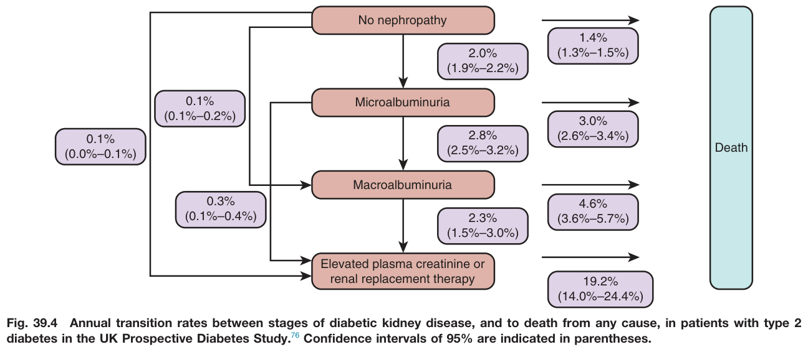

Fig. 39.4 Annual transition rates between stages of diabetic kidney disease, and to death from any cause, in patients with type 2 diabetes in the UK Prospective Diabetes Study. Confidence intervals of 95% are indicated in parentheses.

---

### Fig_39_5

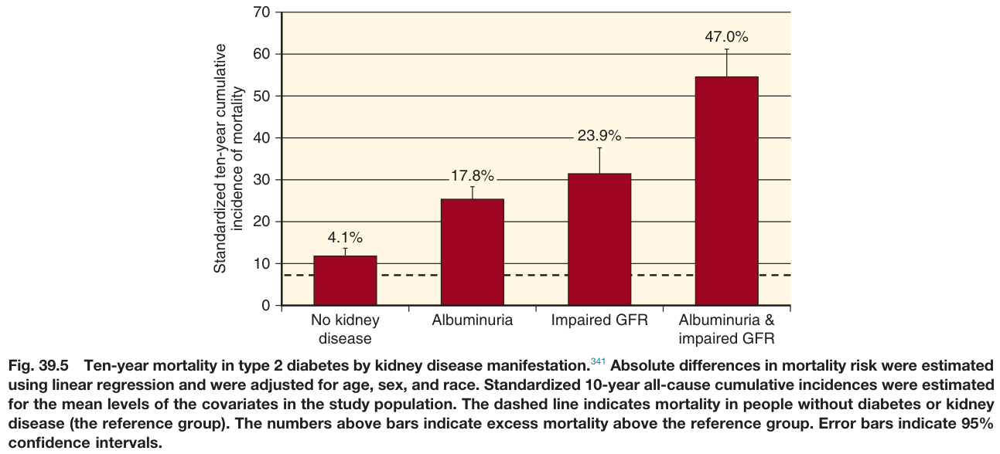

Fig. 39.5 Ten-year mortality in type 2 diabetes by kidney disease manifestation. Absolute differences in mortality risk were estimated using linear regression and were adjusted for age, sex, and race. Standardized 10-year all-cause cumulative incidences were estimated for the mean levels of the covariates in the study population. The dashed line indicates mortality in people without diabetes or kidney disease (the reference group). The numbers above bars indicate excess mortality above the reference group. Error bars indicate 95% confidence intervals.

---

### Fig_39_6

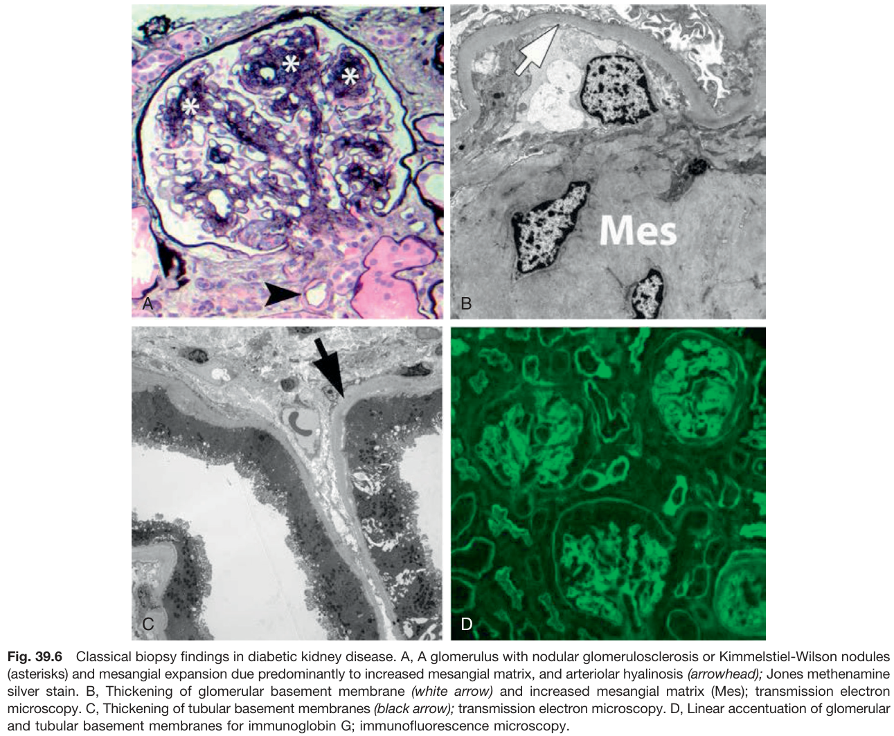

Fig. 39.6 Classical biopsy findings in diabetic kidney disease. A, A glomerulus with nodular glomerulosclerosis or Kimmelstiel-Wilson nodules (asterisks) and mesangial expansion due predominantly to increased mesangial matrix, and arteriolar hyalinosis (arrowhead); Jones methenamine silver stain. B, Thickening of glomerular basement membrane (white arrow) and increased mesangial matrix (Mes); transmission electron microscopy. C, Thickening of tubular basement membranes (black arrow); transmission electron microscopy. D, Linear accentuation of glomerular and tubular basement membranes for immunoglobin G; immunofluorescence microscopy.

---

### Fig_39_7

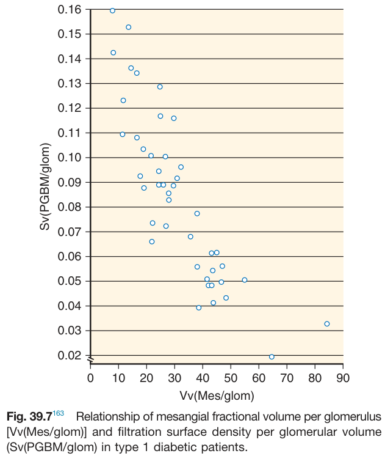

Fig. 39.7 Relationship of mesangial fractional volume per glomerulus [Vv(Mes/glom)] and filtration surface density per glomerular volume (Sv(PGBM/glom) in type 1 diabetic patients. A scatter plot showing an inverse relationship between Vv(Mes/glom) on the x-axis and Sv(PGBM/glom) on the y-axis.

---

### Fig_39_8

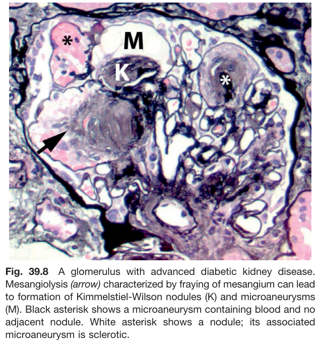

Fig. 39.8 A glomerulus with advanced diabetic kidney disease. Mesangiolysis (arrow) characterized by fraying of mesangium can lead to formation of Kimmelstiel-Wilson nodules (K) and microaneurysms (M). Black asterisk shows a microaneurysm containing blood and no adjacent nodule. White asterisk shows a nodule; its associated microaneurysm is sclerotic.

---

### Fig_39_9

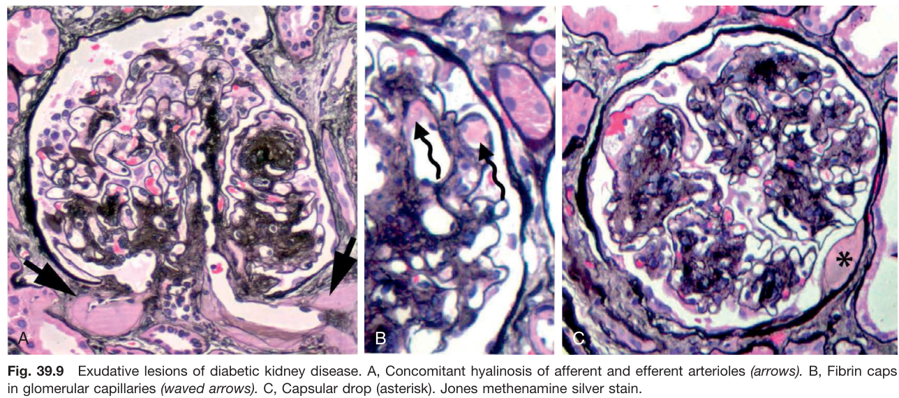

Fig. 39.9 Exudative lesions of diabetic kidney disease. A, Concomitant hyalinosis of afferent and efferent arterioles (arrows). B, Fibrin caps in glomerular capillaries (waved arrows). C, Capsular drop (asterisk). Jones methenamine silver stain.

---

### Fig_39_10

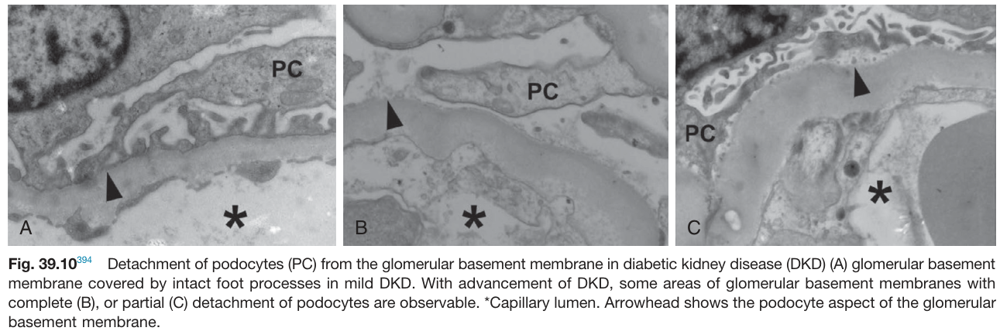

Fig. 39.10 Detachment of podocytes (PC) from the glomerular basement membrane in diabetic kidney disease (DKD). (A) glomerular basement membrane covered by intact foot processes in mild DKD. With advancement of DKD, some areas of glomerular basement membranes with complete (B), or partial (C) detachment of podocytes are observable. *Capillary lumen. Arrowhead shows the podocyte aspect of the glomerular basement membrane.

---

### Fig_39_11

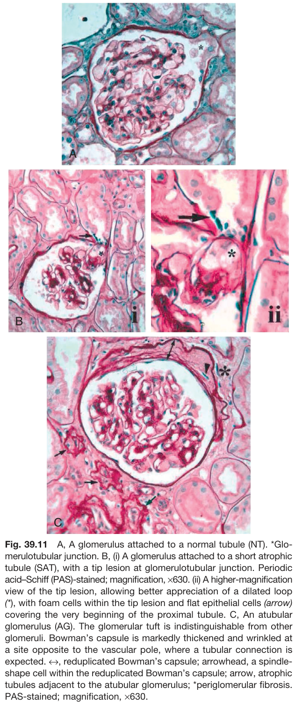

Fig. 39.11 A, A glomerulus attached to a normal tubule (NT). *Glomerulotubular junction. B, (i) A glomerulus attached to a short atrophic tubule (SAT), with a tip lesion at glomerulotubular junction. Periodic acid-Schiff (PAS)-stained; magnification, ×630. (ii) A higher-magnification view of the tip lesion, allowing better appreciation of a dilated loop (*), with foam cells within the tip lesion and flat epithelial cells (arrow) covering the very beginning of the proximal tubule. C, An atubular glomerulus (AG). The glomerular tuft is indistinguishable from other glomeruli. Bowman's capsule is markedly thickened and wrinkled at a site opposite to the vascular pole, where a tubular connection is expected. →, reduplicated Bowman's capsule; arrowhead, a spindle-shape cell within the reduplicated Bowman's capsule; arrow, atrophic tubules adjacent to the atubular glomerulus; *periglomerular fibrosis. PAS-stained; magnification, x630.

---

### Fig_39_12

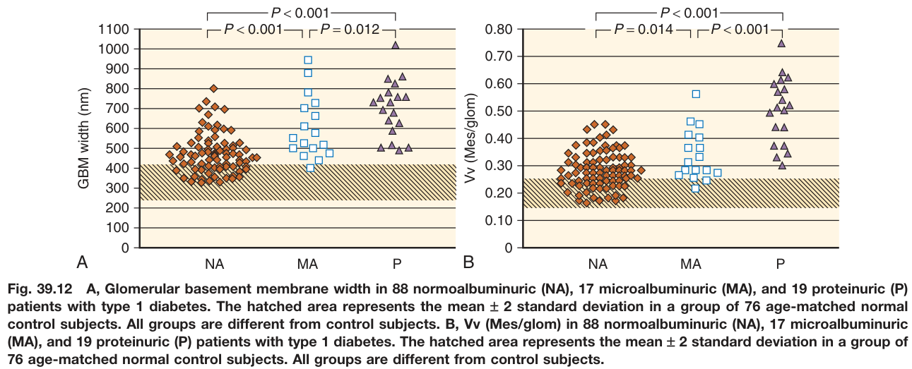

Fig. 39.12 A, Glomerular basement membrane width in 88 normoalbuminuric (NA), 17 microalbuminuric (MA), and 19 proteinuric (P) patients with type 1 diabetes. The hatched area represents the mean ± 2 standard deviation in a group of 76 age-matched normal control subjects. All groups are different from control subjects. B, Vv (Mes/glom) in 88 normoalbuminuric (NA), 17 microalbuminuric (MA), and 19 proteinuric (P) patients with type 1 diabetes. The hatched area represents the mean ± 2 standard deviation in a group of 76 age-matched normal control subjects. All groups are different from control subjects.

---

### Fig_39_13

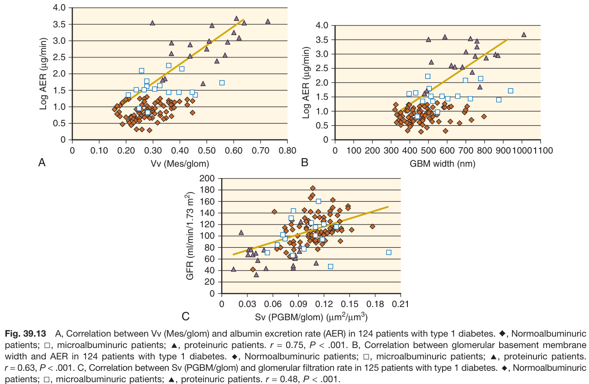

Fig. 39.13 A, Correlation between Vv (Mes/glom) and albumin excretion rate (AER) in 124 patients with type 1 diabetes. , Normoalbuminuric patients; , microalbuminuric patients; ▲, proteinuric patients. r = 0.75, P < .001. B, Correlation between glomerular basement membrane width and AER in 124 patients with type 1 diabetes. , Normoalbuminuric patients; , microalbuminuric patients; ▲, proteinuric patients. r = 0.63, P < .001. C, Correlation between Sv (PGBM/glom) and glomerular filtration rate in 125 patients with type 1 diabetes. , Normoalbuminuric patients; , microalbuminuric patients; ▲, proteinuric patients. r = 0.48, P < .001.

---

### Fig_39_14

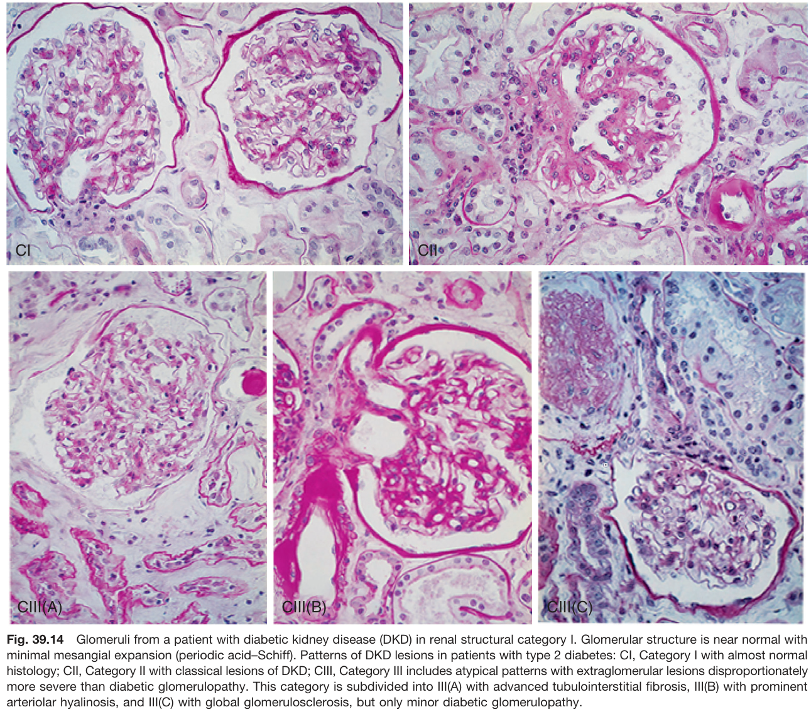

Fig. 39.14 Glomeruli from a patient with diabetic kidney disease (DKD) in renal structural category I. Glomerular structure is near normal with minimal mesangial expansion (periodic acid-Schiff). Patterns of DKD lesions in patients with type 2 diabetes: CI, Category I with almost normal histology; CII, Category II with classical lesions of DKD; CIII, Category III includes atypical patterns with extraglomerular lesions disproportionately more severe than diabetic glomerulopathy. This category is subdivided into III(A) with advanced tubulointerstitial fibrosis, III(B) with prominent arteriolar hyalinosis, and III(C) with global glomerulosclerosis, but only minor diabetic glomerulopathy.

---

### Fig_39_15

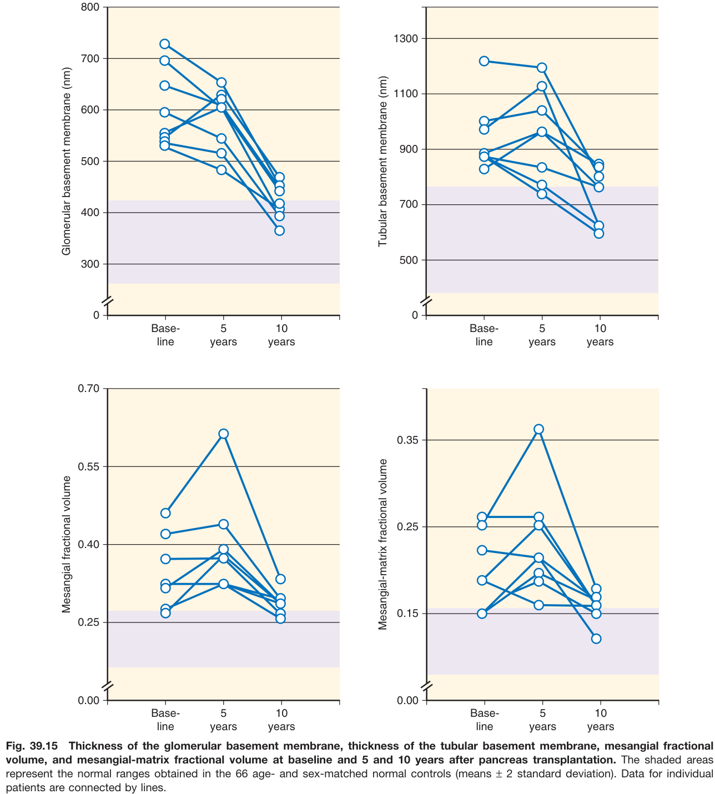

Fig. 39.15 Thickness of the glomerular basement membrane, thickness of the tubular basement membrane, mesangial fractional volume, and mesangial-matrix fractional volume at baseline and 5 and 10 years after pancreas transplantation. The shaded areas represent the normal ranges obtained in the 66 age- and sex-matched normal controls (means ± 2 standard deviation). Data for individual patients are connected by lines.

---

### Fig_39_16

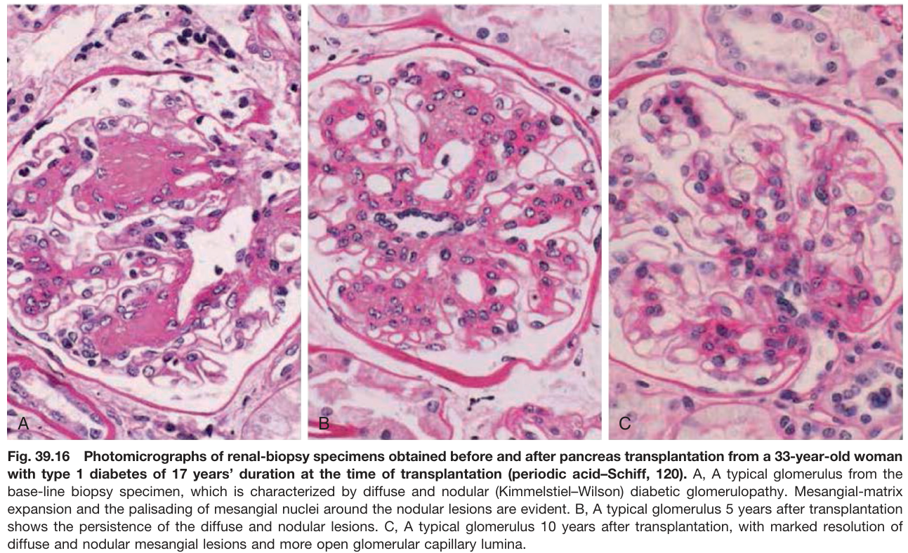

Fig. 39.16 Photomicrographs of renal-biopsy specimens obtained before and after pancreas transplantation from a 33-year-old woman with type 1 diabetes of 17 years' duration at the time of transplantation (periodic acid-Schiff, 120). A, A typical glomerulus from the base-line biopsy specimen, which is characterized by diffuse and nodular (Kimmelstiel-Wilson) diabetic glomerulopathy. Mesangial-matrix expansion and the palisading of mesangial nuclei around the nodular lesions are evident. B, A typical glomerulus 5 years after transplantation shows the persistence of the diffuse and nodular lesions. C, A typical glomerulus 10 years after transplantation, with marked resolution of diffuse and nodular mesangial lesions and more open glomerular capillary lumina.

---

### Fig_39_17

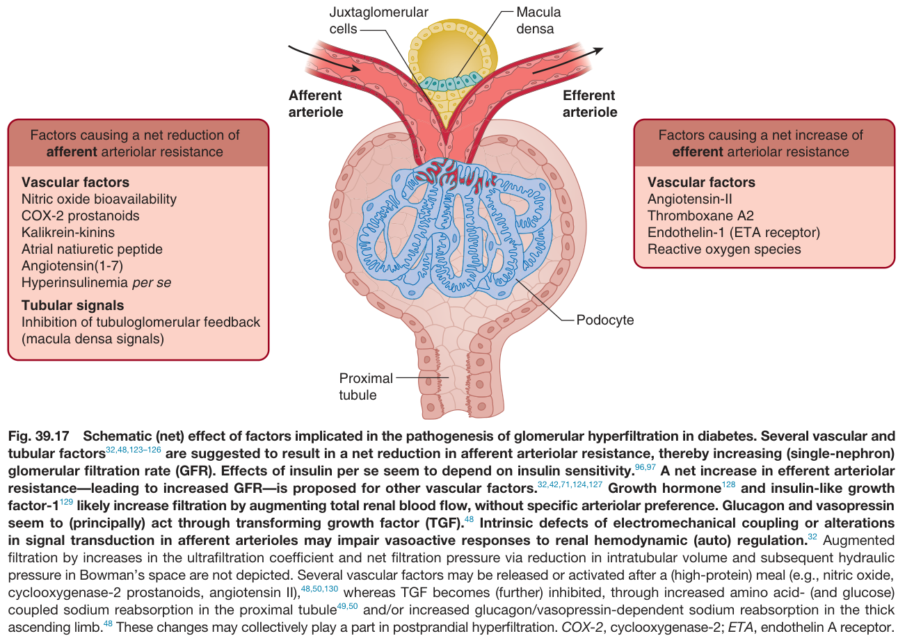

Fig. 39.17 Schematic (net) effect of factors implicated in the pathogenesis of glomerular hyperfiltration in diabetes. Several vascular and tubular factors are suggested to result in a net reduction in afferent arteriolar resistance, thereby increasing (single-nephron) glomerular filtration rate (GFR). Effects of insulin per se seem to depend on insulin sensitivity. A net increase in efferent arteriolar resistance-leading to increased GFR-is proposed for other vascular factors. Growth hormone and insulin-like growth factor-1 likely increase filtration by augmenting total renal blood flow, without specific arteriolar preference. Glucagon and vasopressin seem to (principally) act through transforming growth factor (TGF). Intrinsic defects of electromechanical coupling or alterations in signal transduction in afferent arterioles may impair vasoactive responses to renal hemodynamic (auto) regulation. Augmented filtration by increases in the ultrafiltration coefficient and net filtration pressure via reduction in intratubular volume and subsequent hydraulic pressure in Bowman's space are not depicted. Several vascular factors may be released or activated after a (high-protein) meal (e.g., nitric oxide, cyclooxygenase-2 prostanoids, angiotensin II), whereas TGF becomes (further) inhibited, through increased amino acid- (and glucose) coupled sodium reabsorption in the proximal tubule and/or increased glucagon/vasopressin-dependent sodium reabsorption in the thick ascending limb. These changes may collectively play a part in postprandial hyperfiltration. COX-2, cyclooxygenase-2; ETA, endothelin A receptor.

---

### Fig_39_18

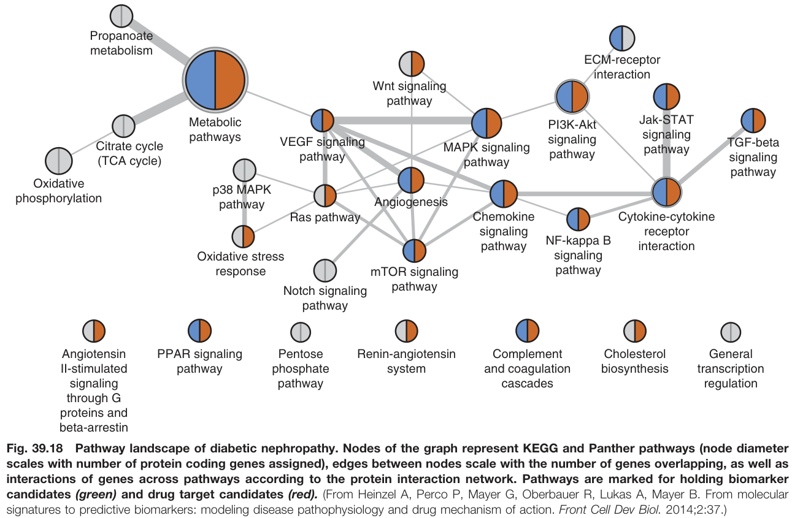

Fig. 39.18 Pathway landscape of diabetic nephropathy. Nodes of the graph represent KEGG and Panther pathways (node diameter scales with number of protein coding genes assigned), edges between nodes scale with the number of genes overlapping, as well as interactions of genes across pathways according to the protein interaction network. Pathways are marked for holding biomarker candidates (green) and drug target candidates (red). (From Heinzel A, Perco P, Mayer G, Oberbauer R, Lukas A, Mayer B. From molecular signatures to predictive biomarkers: modeling disease pathophysiology and drug mechanism of action. Front Cell Dev Biol. 2014;2:37.)

---

### Fig_39_19

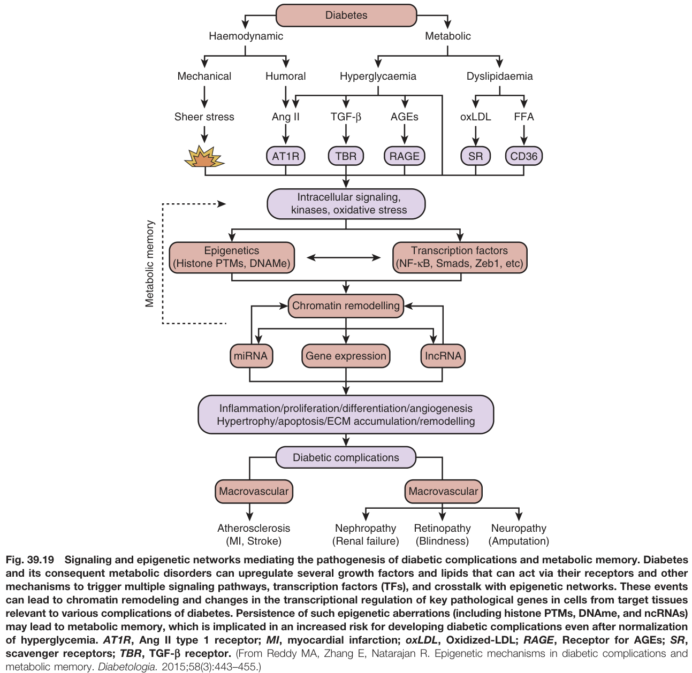

Fig. 39.19 Signaling and epigenetic networks mediating the pathogenesis of diabetic complications and metabolic memory. Diabetes and its consequent metabolic disorders can upregulate several growth factors and lipids that can act via their receptors and other mechanisms to trigger multiple signaling pathways, transcription factors (TFs), and crosstalk with epigenetic networks. These events can lead to chromatin remodeling and changes in the transcriptional regulation of key pathological genes in cells from target tissues relevant to various complications of diabetes. Persistence of such epigenetic aberrations (including histone PTMs, DNAme, and ncRNAs) may lead to metabolic memory, which is implicated in an increased risk for developing diabetic complications even after normalization of hyperglycemia. AT1R, Ang II type 1 receptor; MI, myocardial infarction; oxLDL, Oxidized-LDL; RAGE, Receptor for AGEs; SR, scavenger receptors; TBR, TGF-ẞ receptor. (From Reddy MA, Zhang E, Natarajan R. Epigenetic mechanisms in diabetic complications and metabolic memory. Diabetologia. 2015;58(3):443-455.)

---

### Fig_39_20

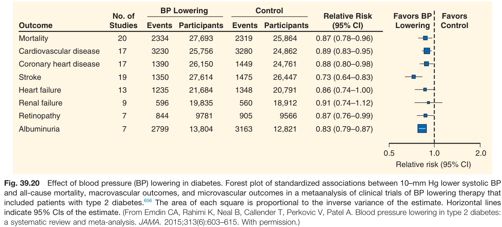

Fig. 39.20 Effect of blood pressure (BP) lowering in diabetes. Forest plot of standardized associations between 10-mm Hg lower systolic BP and all-cause mortality, macrovascular outcomes, and microvascular outcomes in a metaanalysis of clinical trials of BP lowering therapy that included patients with type 2 diabetes. The area of each square is proportional to the inverse variance of the estimate. Horizontal lines indicate 95% Cls of the estimate. (From Emdin CA, Rahimi K, Neal B, Callender T, Perkovic V, Patel A. Blood pressure lowering in type 2 diabetes: a systematic review and meta-analysis. JAMA. 2015;313(6):603-615. With permission.)

---

### Fig_39_21

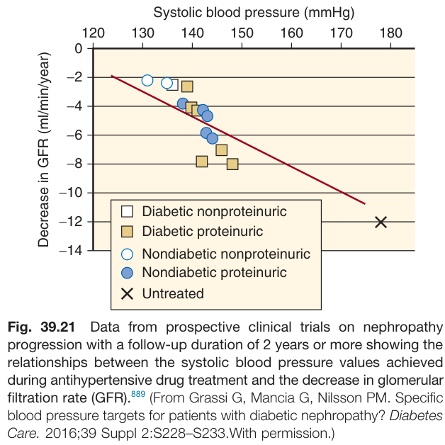

Fig. 39.21 Data from prospective clinical trials on nephropathy progression with a follow-up duration of 2 years or more showing the relationships between the systolic blood pressure values achieved during antihypertensive drug treatment and the decrease in glomerular filtration rate (GFR). (From Grassi G, Mancia G, Nilsson PM. Specific blood pressure targets for patients with diabetic nephropathy? Diabetes Care. 2016;39 Suppl 2:S228-S233.With permission.)

---

### Fig_39_22

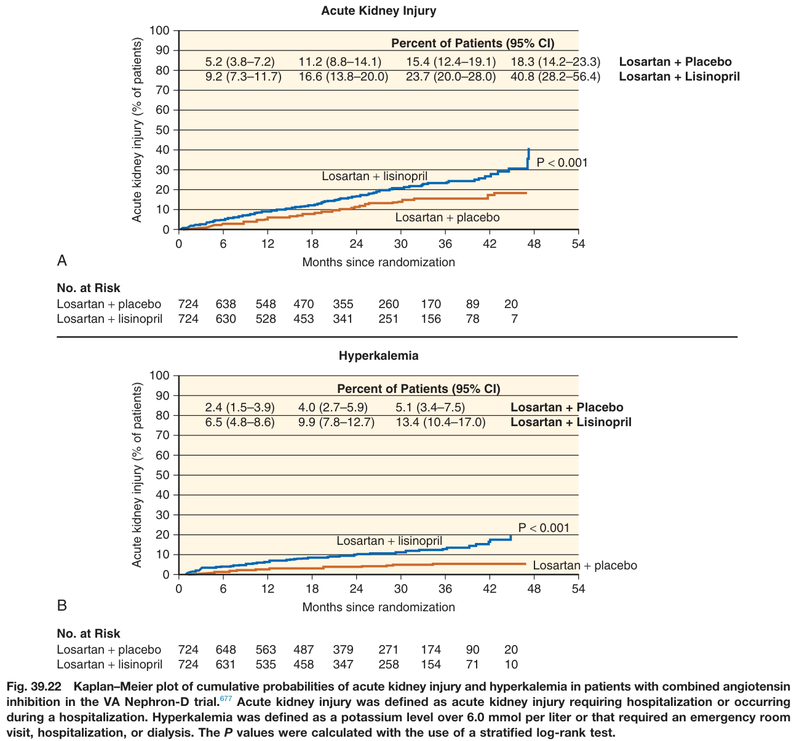

Fig. 39.22 Kaplan-Meier plot of cumulative probabilities of acute kidney injury and hyperkalemia in patients with combined angiotensin inhibition in the VA Nephron-D trial. Acute kidney injury was defined as acute kidney injury requiring hospitalization or occurring during a hospitalization. Hyperkalemia was defined as a potassium level over 6.0 mmol per liter or that required an emergency room visit, hospitalization, or dialysis. The P values were calculated with the use of a stratified log-rank test.

---

### Fig_39_23

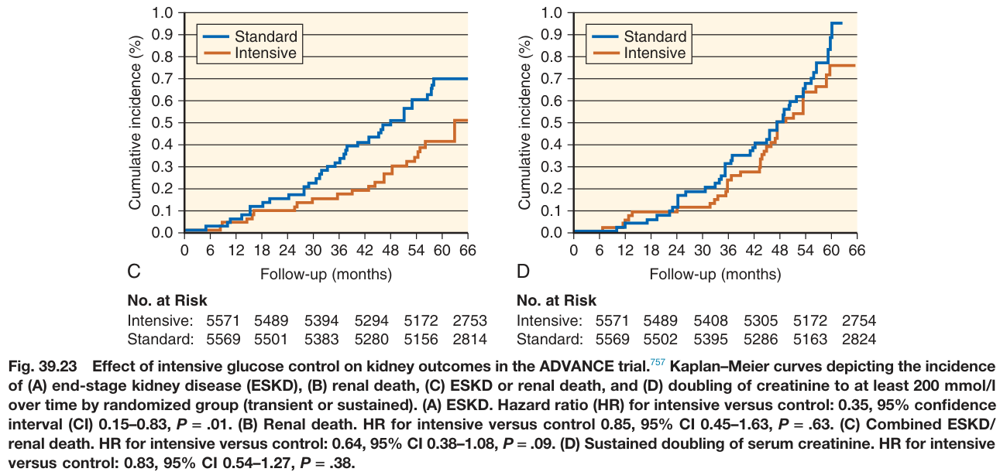

Fig. 39.23 Effect of intensive glucose control on kidney outcomes in the ADVANCE trial. Kaplan-Meier curves depicting the incidence of (A) end-stage kidney disease (ESKD), (B) renal death, (C) ESKD or renal death, and (D) doubling of creatinine to at least 200 mmol/l over time by randomized group (transient or sustained). (A) ESKD. Hazard ratio (HR) for intensive versus control: 0.35, 95% confidence interval (CI) 0.15-0.83, P = .01. (B) Renal death. HR for intensive versus control 0.85, 95% CI 0.45-1.63, P = .63. (C) Combined ESKD/renal death. HR for intensive versus control: 0.64, 95% CI 0.38-1.08, P = .09. (D) Sustained doubling of serum creatinine. HR for intensive versus control: 0.83, 95% CI 0.54-1.27, P = .38.

---

### Fig_39_24

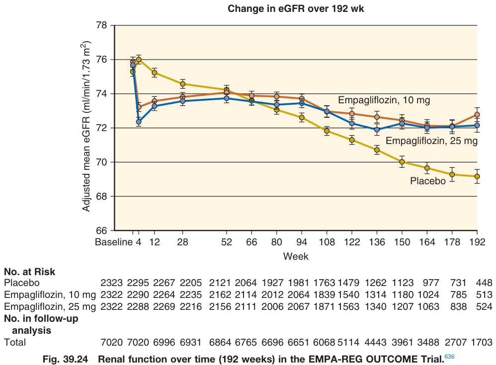

Fig. 39.24 Renal function over time (192 weeks) in the EMPA-REG OUTCOME Trial. A line graph showing changes in adjusted mean eGFR over 192 weeks for patients receiving Placebo, Empagliflozin 10 mg, and Empagliflozin 25 mg.

---

### Fig_39_25

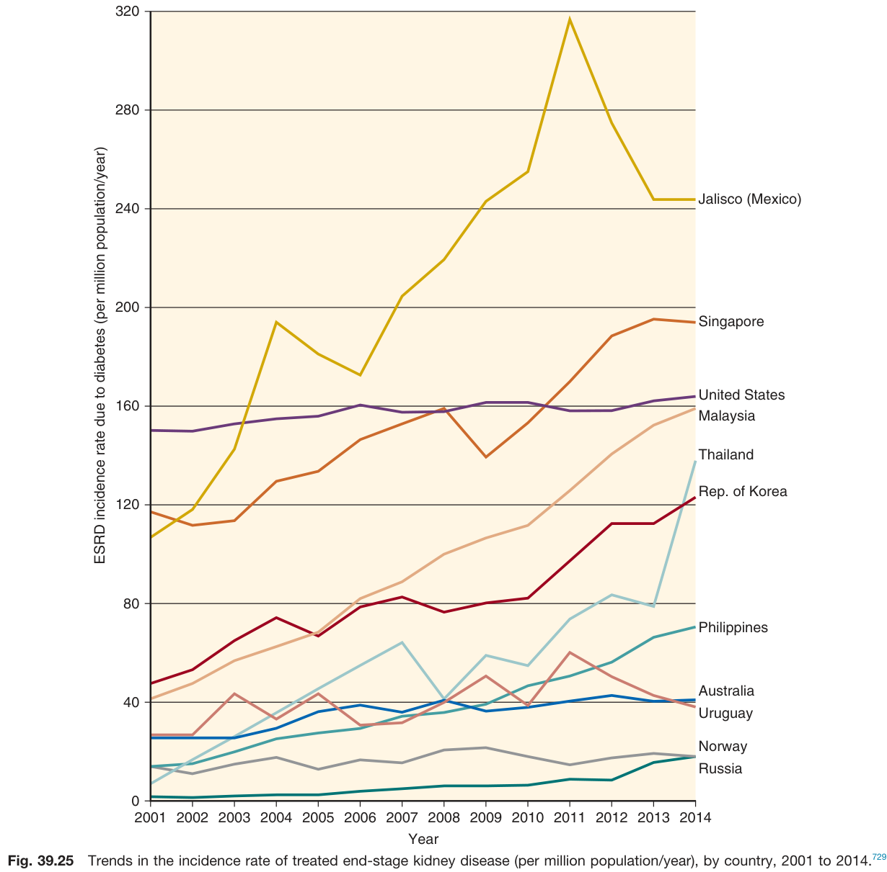

Fig. 39.25 Trends in the incidence rate of treated end-stage kidney disease (per million population/year), by country, 2001 to 2014. A line graph showing trends in ESRD incidence rates for various countries from 2001 to 2014.

---

### Fig_39_26

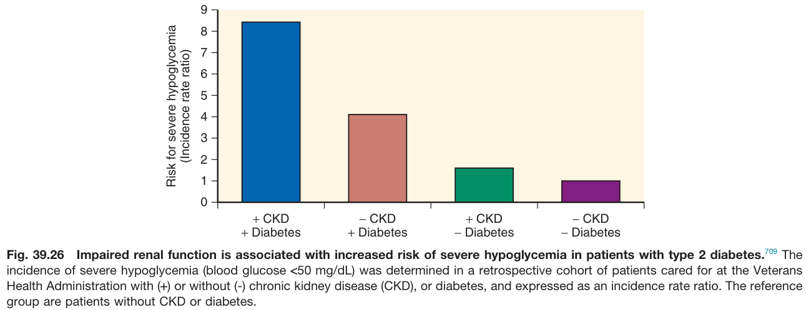

Fig. 39.26 Impaired renal function is associated with increased risk of severe hypoglycemia in patients with type 2 diabetes. The incidence of severe hypoglycemia (blood glucose <50 mg/dL) was determined in a retrospective cohort of patients cared for at the Veterans Health Administration with (+) or without (-) chronic kidney disease (CKD), or diabetes, and expressed as an incidence rate ratio. The reference group are patients without CKD or diabetes.

---

### Fig_39_27

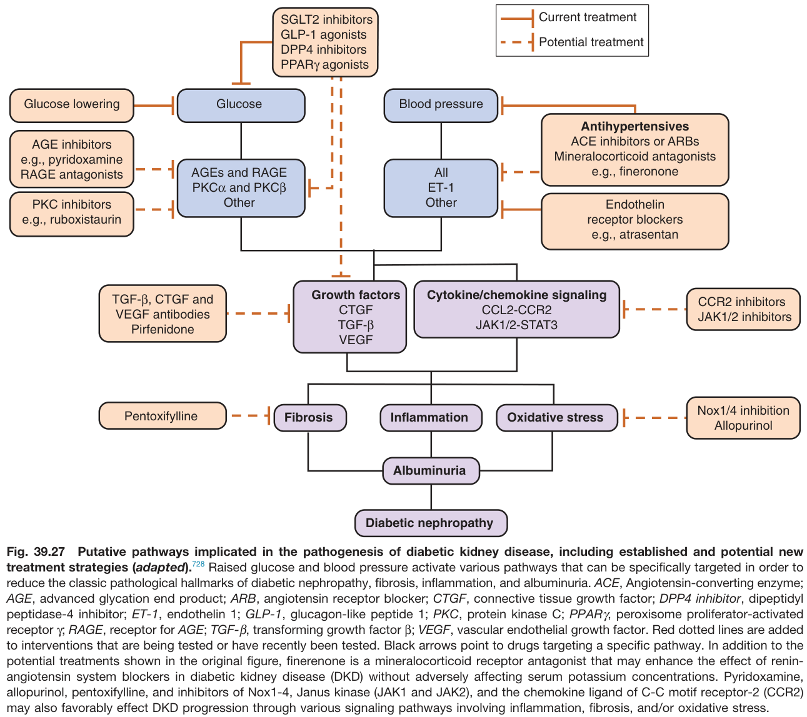

Fig. 39.27 Putative pathways implicated in the pathogenesis of diabetic kidney disease, including established and potential new treatment strategies (adapted). Raised glucose and blood pressure activate various pathways that can be specifically targeted in order to reduce the classic pathological hallmarks of diabetic nephropathy, fibrosis, inflammation, and albuminuria. ACE, Angiotensin-converting enzyme; AGE, advanced glycation end product; ARB, angiotensin receptor blocker; CTGF, connective tissue growth factor; DPP4 inhibitor, dipeptidyl peptidase-4 inhibitor; ET-1, endothelin 1; GLP-1, glucagon-like peptide 1; PKC, protein kinase C; PPARy, peroxisome proliferator-activated receptor γ; RAGE, receptor for AGE; TGF-β, transforming growth factor β; VEGF, vascular endothelial growth factor. Red dotted lines are added to interventions that are being tested or have recently been tested. Black arrows point to drugs targeting a specific pathway. In addition to the potential treatments shown in the original figure, finerenone is a mineralocorticoid receptor antagonist that may enhance the effect of renin-angiotensin system blockers in diabetic kidney disease (DKD) without adversely affecting serum potassium concentrations. Pyridoxamine, allopurinol, pentoxifylline, and inhibitors of Nox1-4, Janus kinase (JAK1 and JAK2), and the chemokine ligand of C-C motif receptor-2 (CCR2) may also favorably effect DKD progression through various signaling pathways involving inflammation, fibrosis, and/or oxidative stress.

---

### Fig_39_28

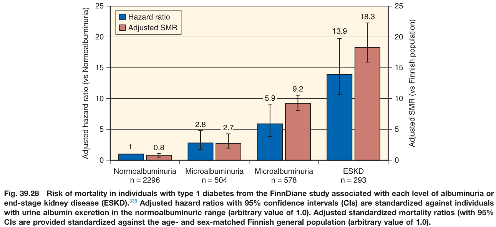

Fig. 39.28 Risk of mortality in individuals with type 1 diabetes from the FinnDiane study associated with each level of albuminuria or end-stage kidney disease (ESKD). Adjusted hazard ratios with 95% confidence intervals (Cls) are standardized against individuals with urine albumin excretion in the normoalbuminuric range (arbitrary value of 1.0). Adjusted standardized mortality ratios (with 95% Cls are provided standardized against the age- and sex-matched Finnish general population (arbitrary value of 1.0).

---

## Tables

### Table_39_1

#### Table Image

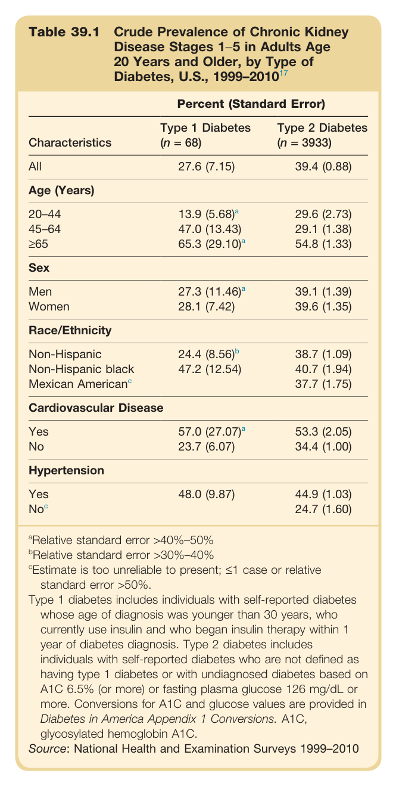

#### Table Data (CSV: [Table_39_1.csv](Table_39_1.csv))

```markdown
| Table Text (OCR) |
| :--- |
| Table 39.1 Crude Prevalence of Chronic Kidney Disease Stages 1−5 in Adults Age 20 Years and Older, by Type of Diabetes, U.S., 1999–2010<sup>17</sup> Percent (Standard Error)    Characteristics  Type 1 Diabetes (n = 68)  Type 2 Diabetes (n = 3933)    All  27.6 (7.15)  39.4 (0.88)    Age (Years)    20–44  13.9 (5.68)a  29.6 (2.73)    45–64  47.0 (13.43)  29.1 (1.38)    ≥65  65.3 (29.10)a  54.8 (1.33)    Sex    Men  27.3 (11.46)a  39.1 (1.39)    Women  28.1 (7.42)  39.6 (1.35)    Race/Ethnicity    Non-Hispanic  24.4 (8.56)b  38.7 (1.09)    Non-Hispanic black  47.2 (12.54)  40.7 (1.94)    Mexican Americanc    37.7 (1.75)    Cardiovascular Disease    Yes  57.0 (27.07)a  53.3 (2.05)    No  23.7 (6.07)  34.4 (1.00)    Hypertension    Yes  48.0 (9.87)  44.9 (1.03)    Noc    24.7 (1.60) <sup>a</sup>Relative standard error >40%–50% <sup>b</sup>Relative standard error >30%–40% <sup>c</sup>Estimate is too unreliable to present; ≤1 case or relative standard error >50%. Type 1 diabetes includes individuals with self-reported diabetes whose age of diagnosis was younger than 30 years, who currently use insulin and who began insulin therapy within 1 year of diabetes diagnosis. Type 2 diabetes includes individuals with self-reported diabetes who are not defined as having type 1 diabetes or with undiagnosed diabetes based on A1C 6.5% (or more) or fasting plasma glucose 126 mg/dL or more. Conversions for A1C and glucose values are provided in Diabetes in America Appendix 1 Conversions. A1C, glycosylated hemoglobin A1C. Source: National Health and Examination Surveys 1999–2010 |
```

Table 39.1 Crude Prevalence of Chronic Kidney Disease Stages 1-5 in Adults Age 20 Years and Older, by Type of Diabetes, U.S., 1999–2010 | Characteristics | Percent (Standard Error) | | | :------------------------- | :--------------------------- | :----------------------------- | | | **Type 1 Diabetes (n = 68)** | **Type 2 Diabetes (n = 3933)** | | **All** | 27.6 (7.15) | 39.4 (0.88) | | **Age (Years)** | | | | 20-44 | 13.9 (5.68)ª | 29.6 (2.73) | | 45-64 | 47.0 (13.43) | 29.1 (1.38) | | ≥65 | 65.3 (29.10)ª | 54.8 (1.33) | | **Sex** | | | | Men | 27.3 (11.46)ª | 39.1 (1.39) | | Women | 28.1 (7.42) | 39.6 (1.35) | | **Race/Ethnicity** | | | | Non-Hispanic | 24.4 (8.56) | 38.7 (1.09) | | Non-Hispanic black | 47.2 (12.54) | 40.7 (1.94) | | Mexican Americanᵇ | | 37.7 (1.75) | | **Cardiovascular Disease** | | | | Yes | 57.0 (27.07)ª | 53.3 (2.05) | | No | 23.7 (6.07) | 34.4 (1.00) | | **Hypertension** | | | | Yes | 48.0 (9.87) | 44.9 (1.03) | | Noᶜ | | 24.7 (1.60) | ªRelative standard error >40%-50% ᵇRelative standard error >30%-40% ᶜEstimate is too unreliable to present; ≤1 case or relative standard error >50%. Type 1 diabetes includes individuals with self-reported diabetes whose age of diagnosis was younger than 30 years, who currently use insulin and who began insulin therapy within 1 year of diabetes diagnosis. Type 2 diabetes includes individuals with self-reported diabetes who are not defined as having type 1 diabetes or with undiagnosed diabetes based on A1C 6.5% (or more) or fasting plasma glucose 126 mg/dL or more. Conversions for A1C and glucose values are provided in Diabetes in America Appendix 1 Conversions. A1C, glycosylated hemoglobin A1C. Source: National Health and Examination Surveys 1999-2010

---

### Table_39_2

#### Table Image

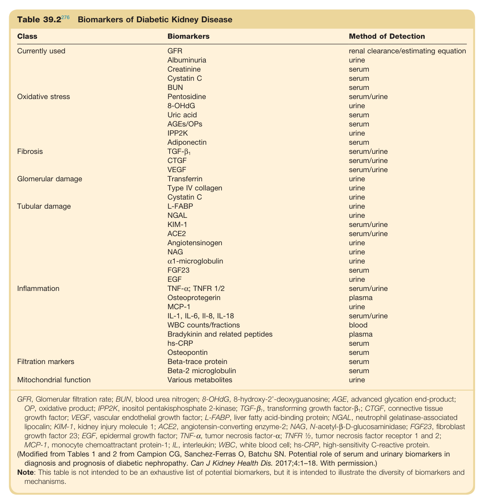

#### Table Data (CSV: [Table_39_2.csv](Table_39_2.csv))

```markdown
| Table Text (OCR) |
| :--- |
| Table 39.2<sup>276</sup> Biomarkers of Diabetic Kidney Disease Class  Biomarkers  Method of Detection    Currently used  GFR  renal clearance/estimating equation    Albuminuria  urine    Creatinine  serum    Cystatin C  serum    BUN  serum    Oxidative stress  Pentosidine  serum/urine    8-OHdG  urine    Uric acid  serum    AGEs/OPs  serum    IPP2K  urine    Adiponectin  serum    Fibrosis  TGF- \beta_1   serum/urine    CTGF  serum/urine    VEGF  serum/urine    Glomerular damage  Transferrin  urine    Type IV collagen  urine    Cystatin C  urine    Tubular damage  L-FABP  urine    NGAL  urine    KIM-1  serum/urine    ACE2  serum/urine    Angiotensinogen  urine    NAG  urine     \alpha 1 -microglobulin  urine    FGF23  serum    EGF  urine    Inflammation  TNF- \alpha ; TNFR 1/2  serum/urine    Osteoprotegerin  plasma    MCP-1  urine    IL-1, IL-6, IL-8, IL-18  serum/urine    WBC counts/fractions  blood    Bradykinin and related peptides  plasma    hs-CRP  serum    Osteopontin  serum    Filtration markers  Beta-trace protein  serum    Beta-2 microglobulin  serum    Mitochondrial function  Various metabolites  urine GFR, Glomerular filtration rate; BUN, blood urea nitrogen; 8-OHdG, 8-hydroxy-2’-deoxyguanosine; AGE, advanced glycation end-product; OP, oxidative product; IPP2K, inositol pentakisphosphate 2-kinase; TGF-β , transforming growth factor-β ; CTGF, connective tissue growth factor; VEGF, vascular endothelial growth factor; L-FABP, liver fatty acid-binding protein; NGAL, neutrophil gelatinase-associated lipocalin; KIM-1, kidney injury molecule 1; ACE2, angiotensin-converting enzyme-2; NAG, N-acetyl-β-D-glucosaminidase; FGF23, fibroblast growth factor 23; EGF, epidermal growth factor; TNF-α, tumor necrosis factor-α; TNFR ½, tumor necrosis factor receptor 1 and 2; MCP-1, monocyte chemoattractant protein-1; IL, interleukin; WBC, white blood cell; hs-CRP, high-sensitivity C-reactive protein. (Modified from Tables 1 and 2 from Campion CG, Sanchez-Ferras O, Batchu SN. Potential role of serum and urinary biomarkers in diagnosis and prognosis of diabetic nephropathy. Can J Kidney Health Dis. 2017;4:1–18. With permission.) Note: This table is not intended to be an exhaustive list of potential biomarkers, but it is intended to illustrate the diversity of biomarkers and mechanisms. |
```

Table 39.2 Biomarkers of Diabetic Kidney Disease | Class | Biomarkers | Method of Detection | | :------------------------- | :------------------------------ | :---------------------------------- | | **Currently used** | GFR | renal clearance/estimating equation | | | Albuminuria | urine | | | Creatinine | serum | | | Cystatin C | serum | | | BUN | serum | | **Oxidative stress** | Pentosidine | serum/urine | | | 8-OHdG | urine | | | Uric acid | serum | | | AGEs/OPs | serum | | | IPP2K | urine | | **Fibrosis** | Adiponectin | serum | | | TGF-β1 | serum/urine | | | CTGF | serum/urine | | | VEGF | serum/urine | | **Glomerular damage** | Transferrin | urine | | | Type IV collagen | urine | | | Cystatin C | urine | | **Tubular damage** | L-FABP | urine | | | NGAL | urine | | | KIM-1 | serum/urine | | | ACE2 | serum/urine | | | Angiotensinogen | urine | | | NAG | urine | | | a1-microglobulin | urine | | | FGF23 | serum | | | EGF | urine | | **Inflammation** | TNF-α; TNFR 1/2 | serum/urine | | | Osteoprotegerin | serum/plasma | | | MCP-1 | plasma | | | IL-1, IL-6, Il-8, IL-18 | urine | | | WBC counts/fractions | serum/urine | | | Bradykinin and related peptides | blood | | | hs-CRP | plasma | | | Osteopontin | serum | | **Filtration markers** | Beta-trace protein | serum | | | Beta-2 microglobulin | serum | | **Mitochondrial function** | Various metabolites | urine | GFR, Glomerular filtration rate; BUN, blood urea nitrogen; 8-OHdG, 8-hydroxy-2'-deoxyguanosine; AGE, advanced glycation end-product; OP, oxidative product; IPP2K, inositol pentakisphosphate 2-kinase; TGF-β1, transforming growth factor-β1; CTGF, connective tissue growth factor; VEGF, vascular endothelial growth factor; L-FABP, liver fatty acid-binding protein; NGAL, neutrophil gelatinase-associated lipocalin; KIM-1, kidney injury molecule 1; ACE2, angiotensin-converting enzyme-2; NAG, N-acetyl-B-D-glucosaminidase; FGF23, fibroblast growth factor 23; EGF, epidermal growth factor; TNF-a, tumor necrosis factor-α; TNFR 1/2, tumor necrosis factor receptor 1 and 2; MCP-1, monocyte chemoattractant protein-1; IL, interleukin; WBC, white blood cell; hs-CRP, high-sensitivity C-reactive protein. (Modified from Tables 1 and 2 from Campion CG, Sanchez-Ferras O, Batchu SN. Potential role of serum and urinary biomarkers in diagnosis and prognosis of diabetic nephropathy. Can J Kidney Health Dis. 2017;4:1-18. With permission.) Note: This table is not intended to be an exhaustive list of potential biomarkers, but it is intended to illustrate the diversity of biomarkers and mechanisms.

---

### Table_39_3

#### Table Image

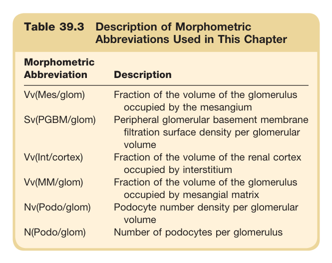

#### Table Data (CSV: [Table_39_3.csv](Table_39_3.csv))

```markdown
| Table Text (OCR) |
| :--- |
| Table 39.3 Description of Morphometric Abbreviations Used in This Chapter Morphometric Abbreviation  Description    Vv(Mes/glom)  Fraction of the volume of the glomerulus occupied by the mesangium    Sv(PGBM/glom)  Peripheral glomerular basement membrane filtration surface density per glomerular volume    Vv(Int/cortex)  Fraction of the volume of the renal cortex occupied by interstitium    Vv(MM/glom)  Fraction of the volume of the glomerulus occupied by mesangial matrix    Nv(Podo/glom)  Podocyte number density per glomerular volume    N(Podo/glom)  Number of podocytes per glomerulus |
```

Table 39.3 Description of Morphometric Abbreviations Used in This Chapter | Morphometric Abbreviation | Description | | :-------------------------- | :----------------------------------------------------------- | | Vv(Mes/glom) | Fraction of the volume of the glomerulus occupied by the mesangium | | Sv(PGBM/glom) | Peripheral glomerular basement membrane filtration surface density per glomerular volume | | Vv(Int/cortex) | Fraction of the volume of the renal cortex occupied by interstitium | | Vv(MM/glom) | Fraction of the volume of the glomerulus occupied by mesangial matrix | | Nv(Podo/glom) | Podocyte number density per glomerular volume | | N(Podo/glom) | Number of podocytes per glomerulus |

---

### Table_39_4

#### Table Image

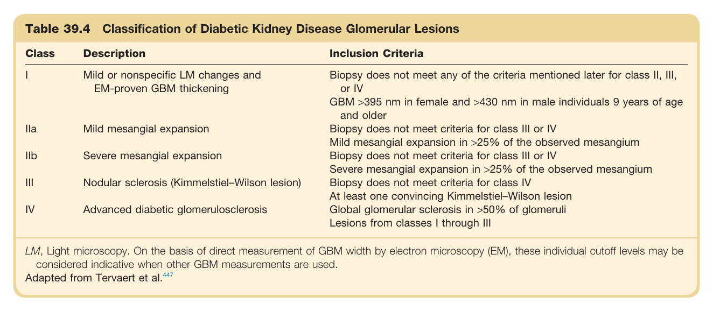

#### Table Data (CSV: [Table_39_4.csv](Table_39_4.csv))

```markdown
| Table Text (OCR) |
| :--- |
| Table 39.4 Classification of Diabetic Kidney Disease Glomerular Lesions Class  Description  Inclusion Criteria    I  Mild or nonspecific LM changes and EM-proven GBM thickening  Biopsy does not meet any of the criteria mentioned later for class II, III, or IVGBM >395 nm in female and >430 nm in male individuals 9 years of age and older    IIa  Mild mesangial expansion  Biopsy does not meet criteria for class III or IVMild mesangial expansion in >25% of the observed mesangium    IIb  Severe mesangial expansion  Biopsy does not meet criteria for class III or IVSevere mesangial expansion in >25% of the observed mesangium    III  Nodular sclerosis (Kimmelstiel–Wilson lesion)  Biopsy does not meet criteria for class IVAt least one convincing Kimmelstiel–Wilson lesion    IV  Advanced diabetic glomerulosclerosis  Global glomerular sclerosis in >50% of glomeruliLesions from classes I through III LM, Light microscopy. On the basis of direct measurement of GBM width by electron microscopy (EM), these individual cutoff levels may be considered indicative when other GBM measurements are used. Adapted from Tervaert et al.<sup>447</sup> |
```

Table 39.4 Classification of Diabetic Kidney Disease Glomerular Lesions | Class | Description | Inclusion Criteria | | :----------------------------------------------------------- | :---------------------------------------------------------- | :----------------------------------------------------------- | | I | Mild or nonspecific LM changes and EM-proven GBM thickening | Biopsy does not meet any of the criteria mentioned later for class II, III, or IV<br>GBM >395 nm in female and >430 nm in male individuals 9 years of age and older | | IIa | Mild mesangial expansion | Biopsy does not meet criteria for class III or IV<br>Mild mesangial expansion in >25% of the observed mesangium | | IIb | Severe mesangial expansion | Biopsy does not meet criteria for class III or IV<br>Severe mesangial expansion in >25% of the observed mesangium | | III | Nodular sclerosis (Kimmelstiel-Wilson lesion) | Biopsy does not meet criteria for class IV<br>At least one convincing Kimmelstiel-Wilson lesion | | IV | Advanced diabetic glomerulosclerosis | Global glomerular sclerosis in >50% of glomeruli<br>Lesions from classes I through III | | LM, Light microscopy. On the basis of direct measurement of GBM width by electron microscopy (EM), these individual cutoff levels may be considered indicative when other GBM measurements are used. | | | | Adapted from Tervaert et al. | | |

---

### Table_39_5

#### Table Image

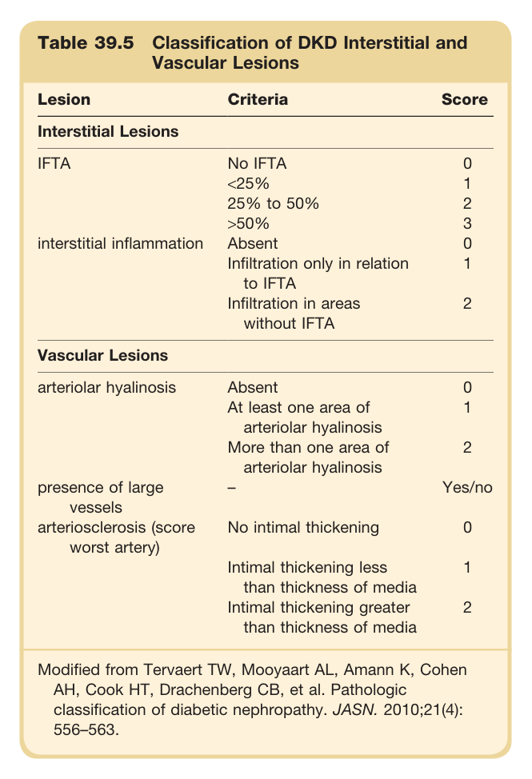

#### Table Data (CSV: [Table_39_5.csv](Table_39_5.csv))

```markdown
| Table Text (OCR) |
| :--- |
| Table 39.5 Classification of DKD Interstitial and Vascular Lesions Lesion  Criteria  Score    Interstitial Lesions    IFTA  No IFTA  0    <25%  1    25% to 50%  2    >50%  3    interstitial inflammation  Absent  0    Infiltration only in relation to IFTA  1    Infiltration in areas without IFTA  2    Vascular Lesions    arteriolar hyalinosis  Absent  0    At least one area of arteriolar hyalinosis  1    More than one area of arteriolar hyalinosis  2    presence of large vessels  -  Yes/no    arteriosclerosis (score worst artery)  No intimal thickening  0    Intimal thickening less than thickness of media  1    Intimal thickening greater than thickness of media  2    Modified from Tervaert TW, Mooyaart AL, Amann K, Cohen AH, Cook HT, Drachenberg CB, et al. Pathologic classification of diabetic nephropathy. JASN. 2010;21(4): 556-563. |
```

Table 39.5 Classification of DKD Interstitial and Vascular Lesions | Lesion | Criteria | Score | | :----------------------------------------------------------- | :------------------------------------------------- | :----- | | **Interstitial Lesions** | | | | IFTA | No IFTA | 0 | | | <25% | 1 | | | 25% to 50% | 2 | | | >50% | 3 | | interstitial inflammation | Absent | 0 | | | Infiltration only in relation to IFTA | 1 | | | Infiltration in areas without IFTA | 2 | | **Vascular Lesions** | | | | arteriolar hyalinosis | Absent | 0 | | | At least one area of arteriolar hyalinosis | 1 | | | More than one area of arteriolar hyalinosis | 2 | | presence of large vessels | | Yes/no | | arteriosclerosis (score worst artery) | No intimal thickening | 0 | | | Intimal thickening less than thickness of media | 1 | | | Intimal thickening greater than thickness of media | 2 | | Modified from Tervaert TW, Mooyaart AL, Amann K, Cohen AH, Cook HT, Drachenberg CB, et al. Pathologic classification of diabetic nephropathy. JASN. 2010;21(4): 556-563. | | |

---

### Table_39_6

#### Table Image

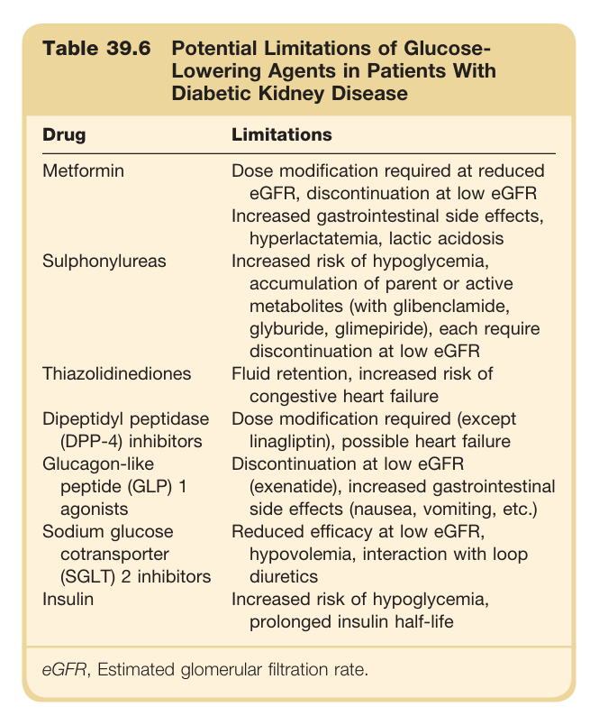

#### Table Data (CSV: [Table_39_6.csv](Table_39_6.csv))

```markdown
| Table Text (OCR) |
| :--- |
| Table 39.6 Potential Limitations of Glucose- Lowering Agents in Patients With Diabetic Kidney Disease Drug  Limitations    Metformin  Dose modification required at reduced eGFR, discontinuation at low eGFR    Increased gastrointestinal side effects, hyperlactatemia, lactic acidosis    Sulphonylureas  Increased risk of hypoglycemia, accumulation of parent or active metabolites (with glibenclamide, glyburide, glimepiride), each require discontinuation at low eGFR    Thiazolidinediones  Fluid retention, increased risk of congestive heart failure    Dipeptidyl peptidase (DPP-4) inhibitors  Dose modification required (except linagliptin), possible heart failure    Glucagon-like peptide (GLP) 1 agonists  Discontinuation at low eGFR (exenatide), increased gastrointestinal side effects (nausea, vomiting, etc.)    Sodium glucose cotransporter (SGLT) 2 inhibitors  Reduced efficacy at low eGFR, hypovolemia, interaction with loop diuretics    Insulin  Increased risk of hypoglycemia, prolonged insulin half-life eGFR, Estimated glomerular filtration rate. |
```

Table 39.6 Potential Limitations of Glucose-Lowering Agents in Patients With Diabetic Kidney Disease | Drug | Limitations | | :----------------------------------------------- | :----------------------------------------------------------- | | Metformin | Dose modification required at reduced eGFR, discontinuation at low eGFR | | | Increased gastrointestinal side effects, hyperlactatemia, lactic acidosis | | Sulphonylureas | Increased risk of hypoglycemia, accumulation of parent or active metabolites (with glibenclamide, glyburide, glimepiride), each require discontinuation at low eGFR | | Thiazolidinediones | Fluid retention, increased risk of congestive heart failure | | Dipeptidyl peptidase (DPP-4) inhibitors | Dose modification required (except linagliptin), possible heart failure | | Glucagon-like peptide (GLP) 1 agonists | Discontinuation at low eGFR (exenatide), increased gastrointestinal side effects (nausea, vomiting, etc.) | | Sodium glucose cotransporter (SGLT) 2 inhibitors | Reduced efficacy at low eGFR, hypovolemia, interaction with loop diuretics | | Insulin | Increased risk of hypoglycemia, prolonged insulin half-life | | eGFR, Estimated glomerular filtration rate. | |

---

## Boxes

### Box_39_1

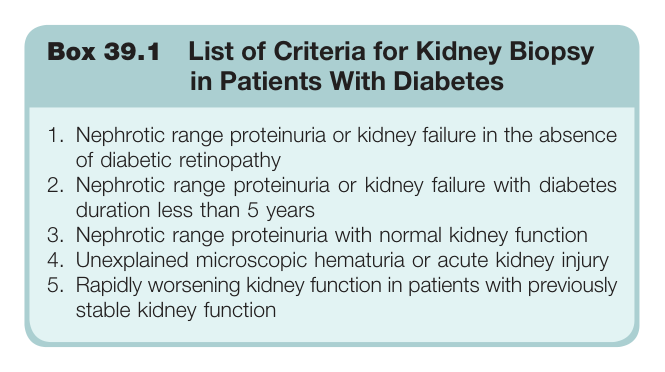

#### Box Text

```markdown
Box 39.1 List of Criteria for Kidney Biopsy in Patients With Diabetes 1. Nephrotic range proteinuria or kidney failure in the absence of diabetic retinopathy 2. Nephrotic range proteinuria or kidney failure with diabetes duration less than 5 years 3. Nephrotic range proteinuria with normal kidney function 4. Unexplained microscopic hematuria or acute kidney injury 5. Rapidly worsening kidney function in patients with previously stable kidney function
```

Box 39.1 List of Criteria for Kidney Biopsy in Patients With Diabetes 1. Nephrotic range proteinuria or kidney failure in the absence of diabetic retinopathy 2. Nephrotic range proteinuria or kidney failure with diabetes duration less than 5 years 3. Nephrotic range proteinuria with normal kidney function 4. Unexplained microscopic hematuria or acute kidney injury 5. Rapidly worsening kidney function in patients with previously stable kidney function

---
