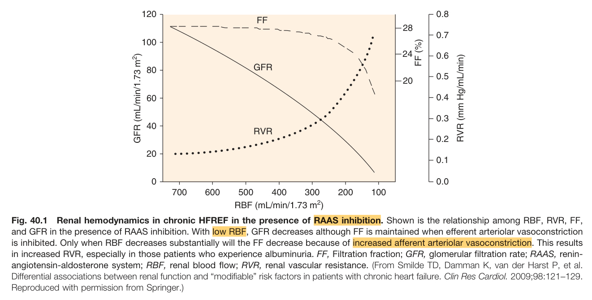
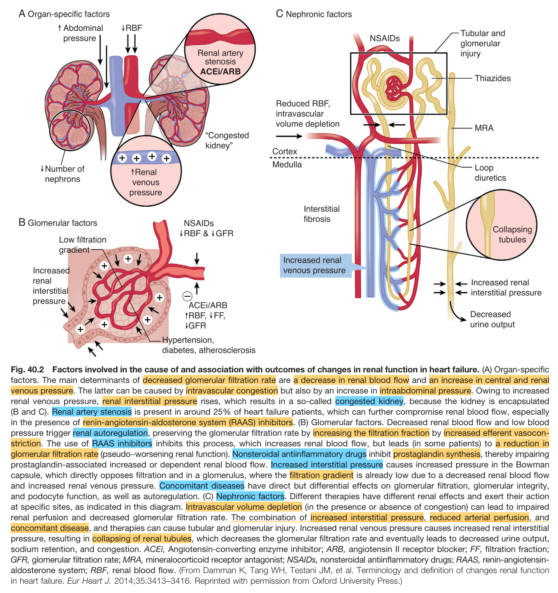
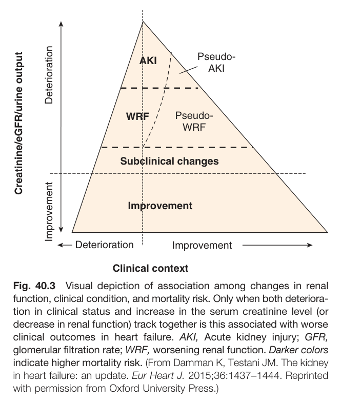
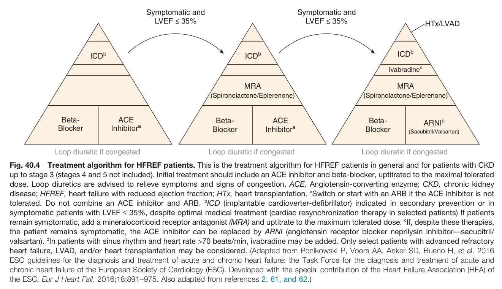
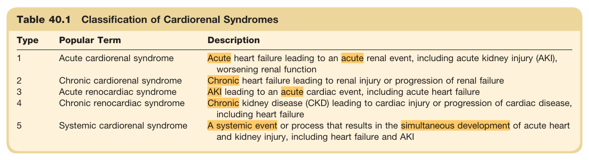
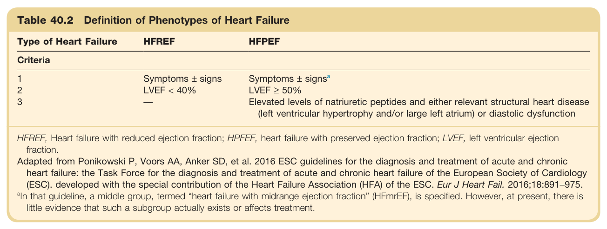
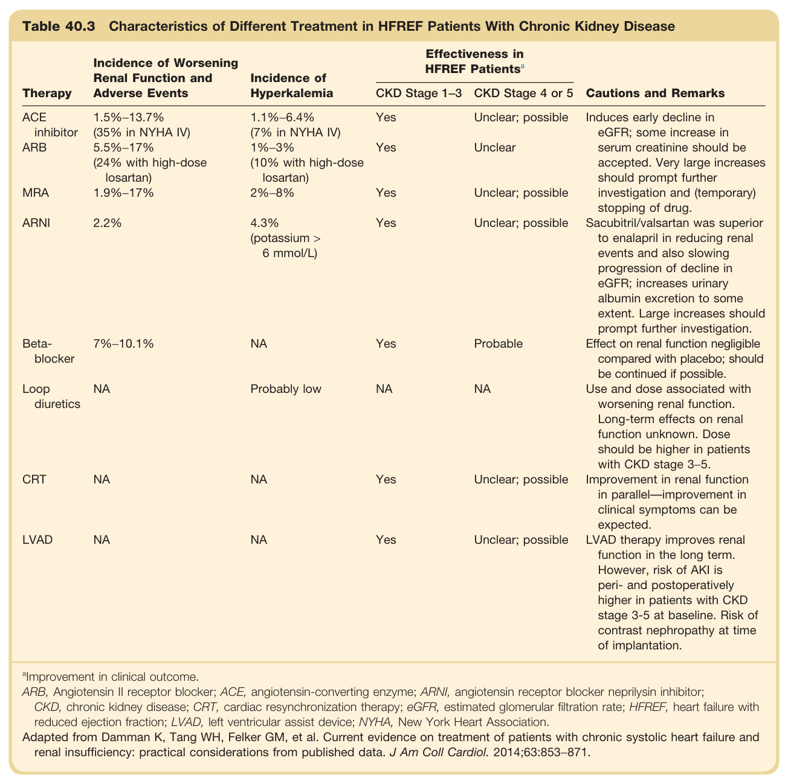

# 40. Cardiorenal Syndromes - Figures and Tables Index

This document lists all figures and tables extracted from `40. Cardiorenal Syndromes.pdf`.

## Table of Contents
- [Figures](#figures)
- [Tables](#tables)

---

## Figures

### Fig_40_1



Fig. 40.1 Renal hemodynamics in chronic HFREF in the presence of RAAS inhibition. Shown is the relationship among RBF, RVR, FF, and GFR in the presence of RAAS inhibition. With low RBF, GFR decreases although FF is maintained when efferent arteriolar vasoconstriction is inhibited. Only when RBF decreases substantially will the FF decrease because of increased afferent arteriolar vasoconstriction. This results in increased RVR, especially in those patients who experience albuminuria. FF, Filtration fraction; GFR, glomerular filtration rate; RAAS, renin-angiotensin-aldosterone system; RBF, renal blood flow; RVR, renal vascular resistance. (From Smilde TD, Damman K, van der Harst P, et al. Differential associations between renal function and "modifiable" risk factors in patients with chronic heart failure. Clin Res Cardiol. 2009;98:121-129. Reproduced with permission from Springer.)

---

### Fig_40_2



Fig. 40.2 Factors involved in the cause of and association with outcomes of changes in renal function in heart failure. (A) Organ-specific factors. The main determinants of decreased glomerular filtration rate are a decrease in renal blood flow and an increase in central and renal venous pressure. The latter can be caused by intravascular congestion but also by an increase in intraabdominal pressure. Owing to increased renal venous pressure, renal interstitial pressure rises, which results in a so-called congested kidney, because the kidney is encapsulated (B and C). Renal artery stenosis is present in around 25% of heart failure patients, which can further compromise renal blood flow, especially in the presence of renin-angiotensin-aldosterone system (RAAS) inhibitors. (B) Glomerular factors. Decreased renal blood flow and low blood pressure trigger renal autoregulation, preserving the glomerular filtration rate by increasing the filtration fraction by increased efferent vasoconstriction. The use of RAAS inhibitors inhibits this process, which increases renal blood flow, but leads (in some patients) to a reduction in glomerular filtration rate (pseudo-worsening renal function). Nonsteroidal antiinflammatory drugs inhibit prostaglandin synthesis, thereby impairing prostaglandin-associated increased or dependent renal blood flow. Increased interstitial pressure causes increased pressure in the Bowman capsule, which directly opposes filtration and in a glomerulus, where the filtration gradient is already low due to a decreased renal blood flow and increased renal venous pressure. Concomitant diseases have direct but differential effects on glomerular filtration, glomerular integrity, and podocyte function, as well as autoregulation. (C) Nephronic factors. Different therapies have different renal effects and exert their action at specific sites, as indicated in this diagram. Intravascular volume depletion (in the presence or absence of congestion) can lead to impaired renal perfusion and decreased glomerular filtration rate. The combination of increased interstitial pressure, reduced arterial perfusion, and concomitant disease, and therapies can cause tubular and glomerular injury. Increased renal venous pressure causes increased renal interstitial pressure, resulting in collapsing of renal tubules, which decreases the glomerular filtration rate and eventually leads to decreased urine output, sodium retention, and congestion. ACEi, Angiotensin-converting enzyme inhibitor; ARB, angiotensin II receptor blocker; FF, filtration fraction; GFR, glomerular filtration rate; MRA, mineralocorticoid receptor antagonist; NSAIDs, nonsteroidal antiinflammatory drugs; RAAS, renin-angiotensin-aldosterone system; RBF, renal blood flow. (From Damman K, Tang WH, Testani JM, et al. Terminology and definition of changes renal function in heart failure. Eur Heart J. 2014;35:3413-3416. Reprinted with permission from Oxford University Press.)

---

### Fig_40_3



Fig. 40.3 Visual depiction of association among changes in renal function, clinical condition, and mortality risk. Only when both deterioration in clinical status and increase in the serum creatinine level (or decrease in renal function) track together is this associated with worse clinical outcomes in heart failure. AKI, Acute kidney injury; GFR, glomerular filtration rate; WRF, worsening renal function. Darker colors indicate higher mortality risk. (From Damman K, Testani JM. The kidney in heart failure: an update. Eur Heart J. 2015;36:1437-1444. Reprinted with permission from Oxford University Press.)

---

### Fig_40_4



Fig. 40.4 Treatment algorithm for HFREF patients. This is the treatment algorithm for HFREF patients in general and for patients with CKD up to stage 3 (stages 4 and 5 not included). Initial treatment should include an ACE inhibitor and beta-blocker, uptitrated to the maximal tolerated dose. Loop diuretics are advised to relieve symptoms and signs of congestion. ACE, Angiotensin-converting enzyme; CKD, chronic kidney disease; HFREF, heart failure with reduced ejection fraction; HTx, heart transplantation. ªSwitch or start with an ARB if the ACE inhibitor is not tolerated. Do not combine an ACE inhibitor and ARB. ᵇICD (implantable cardioverter-defibrillator) indicated in secondary prevention or in symptomatic patients with LVEF ≤ 35%, despite optimal medical treatment (cardiac resynchronization therapy in selected patients) ᶜIf patients remain symptomatic, add a mineralocorticoid receptor antagonist (MRA) and uptitrate to the maximum tolerated dose. If, despite these therapies, the patient remains symptomatic, the ACE inhibitor can be replaced by ARNI (angiotensin receptor blocker neprilysin inhibitor-sacubitril/valsartan). ᵈIn patients with sinus rhythm and heart rate >70 beats/min, ivabradine may be added. Only select patients with advanced refractory heart failure, LVAD, and/or heart transplantation may be considered. (Adapted from Ponikowski P, Voors AA, Anker SD, Bueno H, et al. 2016 ESC guidelines for the diagnosis and treatment of acute and chronic heart failure: the Task Force for the diagnosis and treatment of acute and chronic heart failure of the European Society of Cardiology (ESC). Developed with the special contribution of the Heart Failure Association (HFA) of the ESC. Eur J Heart Fail. 2016;18:891-975. Also adapted from references 2, 61, and 62.)

---

## Tables

### Table_40_1

#### Table Image



#### Table Data (CSV: [Table_40_1.csv](Table_40_1.csv))

```markdown
| Table Text (OCR) |
| :--- |
| Table 40.1 Classification of Cardiorenal Syndromes Type  Popular Term  Description    1  Acute cardiorenal syndrome  Acute heart failure leading to an acute renal event, including acute kidney injury (AKI), worsening renal function    2  Chronic cardiorenal syndrome  Chronic heart failure leading to renal injury or progression of renal failure    3  Acute renocardiac syndrome  AKI leading to an acute cardiac event, including acute heart failure    4  Chronic renocardiac syndrome  Chronic kidney disease (CKD) leading to cardiac injury or progression of cardiac disease, including heart failure    5  Systemic cardiorenal syndrome  A systemic event or process that results in the simultaneous development of acute heart and kidney injury, including heart failure and AKI |
```

Table 40.1 Classification of Cardiorenal Syndromes | Type | Popular Term | Description | | :--- | :--- | :--- | | 1 | Acute cardiorenal syndrome | Acute heart failure leading to an acute renal event, including acute kidney injury (AKI), worsening renal function | | 2 | Chronic cardiorenal syndrome | Chronic heart failure leading to renal injury or progression of renal failure | | 3 | Acute renocardiac syndrome | AKI leading to an acute cardiac event, including acute heart failure | | 4 | Chronic renocardiac syndrome | Chronic kidney disease (CKD) leading to cardiac injury or progression of cardiac disease, including heart failure | | 5 | Systemic cardiorenal syndrome | A systemic event or process that results in the simultaneous development of acute heart and kidney injury, including heart failure and AKI |

---

### Table_40_2

#### Table Image



#### Table Data (CSV: [Table_40_2.csv](Table_40_2.csv))

```markdown
| Table Text (OCR) |
| :--- |
| Table 40.2 Definition of Phenotypes of Heart Failure Type of Heart Failure  HFREF  HFPEF    Criteria    1  Symptoms ± signs  Symptoms ±  signs^a     2  LVEF < 40%  LVEF ≥ 50%    3  —  Elevated levels of natriuretic peptides and either relevant structural heart disease (left ventricular hypertrophy and/or large left atrium) or diastolic dysfunction HFREF, Heart failure with reduced ejection fraction; HPFEF, heart failure with preserved ejection fraction; LVEF, left ventricular ejection fraction Adapted from Ponikowski P, Voors AA, Anker SD, et al. 2016 ESC guidelines for the diagnosis and treatment of acute and chronic heart failure: the Task Force for the diagnosis and treatment of acute and chronic heart failure of the European Society of Cardiology (ESC). developed with the special contribution of the Heart Failure Association (HFA) of the ESC. Eur J Heart Fail. 2016;18:891−975. <sup>a</sup>In that guideline, a middle group, termed “heart failure with midrange ejection fraction” (HFmrEF), is specified. However, at present, there is little evidence that such a subgroup actually exists or affects treatment. |
```

Table 40.2 Definition of Phenotypes of Heart Failure | Type of Heart Failure | HFREF | HFPEF | | :--- | :--- | :--- | | **Criteria** | | | | 1 | Symptoms ± signs | Symptoms ± signsª | | 2 | LVEF < 40% | LVEF ≥ 50% | | 3 | — | Elevated levels of natriuretic peptides and either relevant structural heart disease (left ventricular hypertrophy and/or large left atrium) or diastolic dysfunction | HFREF, Heart failure with reduced ejection fraction; HPFEF, heart failure with preserved ejection fraction; LVEF, left ventricular ejection fraction. Adapted from Ponikowski P, Voors AA, Anker SD, et al. 2016 ESC guidelines for the diagnosis and treatment of acute and chronic heart failure: the Task Force for the diagnosis and treatment of acute and chronic heart failure of the European Society of Cardiology (ESC). developed with the special contribution of the Heart Failure Association (HFA) of the ESC. Eur J Heart Fail. 2016;18:891-975. ªIn that guideline, a middle group, termed "heart failure with midrange ejection fraction" (HFmrEF), is specified. However, at present, there is little evidence that such a subgroup actually exists or affects treatment.

---

### Table_40_3

#### Table Image



#### Table Data (CSV: [Table_40_3.csv](Table_40_3.csv))

```markdown
| Table Text (OCR) |
| :--- |
| Table 40.3 Characteristics of Different Treatment in HFREF Patients With Chronic Kidney Disease Therapy  Incidence of Worsening Renal Function and Adverse Events  Incidence of Hyperkalemia  Effectiveness in HFREF  Patients^a   Cautions and Remarks    CKD Stage 1-3  CKD Stage 4 or 5    ACE inhibitor  1.5%-13.7%(35% in NYHA IV)  1.1%-6.4%(7% in NYHA IV)  Yes  Unclear; possible  Induces early decline in eGFR; some increase in serum creatinine should be accepted. Very large increases should prompt further investigation and (temporary) stopping of drug.    ARB  5.5%-17%(24% with high-dose losartan)  1%-3%(10% with high-dose losartan)  Yes  Unclear    MRA  1.9%-17%  2%-8%  Yes  Unclear; possible    ARNI  2.2%  4.3%(potassium > 6 mmol/L)  Yes  Unclear; possible  Sacubitril/valsartan was superior to enalapril in reducing renal events and also slowing progression of decline in eGFR; increases urinary albumin excretion to some extent. Large increases should prompt further investigation.    Beta-blocker  7%-10.1%  NA  Yes  Probable  Effect on renal function negligible compared with placebo; should be continued if possible.    Loop diuretics  NA  Probably low  NA  NA  Use and dose associated with worsening renal function. Long-term effects on renal function unknown. Dose should be higher in patients with CKD stage 3-5.    CRT  NA  NA  Yes  Unclear; possible  Improvement in renal function in parallel—improvement in clinical symptoms can be expected.    LVAD  NA  NA  Yes  Unclear; possible  LVAD therapy improves renal function in the long term. However, risk of AKI is peri- and postoperatively higher in patients with CKD stage 3-5 at baseline. Risk of contrast nephropathy at time of implantation. <sup>a</sup>Improvement in clinical outcome. ARB, Angiotensin II receptor blocker; ACE, angiotensin-converting enzyme; ARNI, angiotensin receptor blocker neprilysin inhibitor; CKD, chronic kidney disease; CRT, cardiac resynchronization therapy; eGFR, estimated glomerular filtration rate; HFREF, heart failure with reduced ejection fraction; LVAD, left ventricular assist device; NYHA, New York Heart Association. Adapted from Damman K, Tang WH, Felker GM, et al. Current evidence on treatment of patients with chronic systolic heart failure and renal insufficiency: practical considerations from published data. J Am Coll Cardiol. 2014;63:853−871. |
```

Table 40.3 Characteristics of Different Treatment in HFREF Patients With Chronic Kidney Disease | Therapy | Incidence of Worsening Renal Function and Adverse Events | Incidence of Hyperkalemia | Effectiveness in HFREF Patientsª | Cautions and Remarks | | :--- | :--- | :--- | :--- | :--- | | | | | **CKD Stage 1-3** | **CKD Stage 4 or 5** | | | ACE inhibitor | 1.5%-13.7% (35% in NYHA IV) | 1.1%-6.4% (7% in NYHA IV) | Yes | Unclear; possible | Induces early decline in eGFR; some increase in serum creatinine should be accepted. Very large increases should prompt further investigation and (temporary) stopping of drug. | | ARB | 5.5%-17% (24% with high-dose losartan) | 1%-3% (10% with high-dose losartan) | Yes | Unclear | | MRA | 1.9%-17% | 2%-8% | Yes | Unclear; possible | | ARNI | 2.2% | 4.3% (potassium > 6 mmol/L) | Yes | Unclear; possible | Sacubitril/valsartan was superior to enalapril in reducing renal events and also slowing progression of decline in eGFR; increases urinary albumin excretion to some extent. Large increases should prompt further investigation. | | Beta-blocker | 7%-10.1% | NA | Yes | Probable | Effect on renal function negligible compared with placebo; should be continued if possible. | | Loop diuretics | NA | Probably low | NA | NA | Use and dose associated with worsening renal function. Long-term effects on renal function unknown. Dose should be higher in patients with CKD stage 3-5. | | CRT | NA | NA | Yes | Unclear; possible | Improvement in renal function in parallel-improvement in clinical symptoms can be expected. | | LVAD | NA | NA | Yes | Unclear; possible | LVAD therapy improves renal function in the long term. However, risk of AKI is peri- and postoperatively higher in patients with CKD stage 3-5 at baseline. Risk of contrast nephropathy at time of implantation. | ªImprovement in clinical outcome. ARB, Angiotensin II receptor blocker; ACE, angiotensin-converting enzyme; ARNI, angiotensin receptor blocker neprilysin inhibitor; CKD, chronic kidney disease; CRT, cardiac resynchronization therapy; eGFR, estimated glomerular filtration rate; HFREF, heart failure with reduced ejection fraction; LVAD, left ventricular assist device; NYHA, New York Heart Association. Adapted from Damman K, Tang WH, Felker GM, et al. Current evidence on treatment of patients with chronic systolic heart failure and renal insufficiency: practical considerations from published data. J Am Coll Cardiol. 2014;63:853-871.

---
