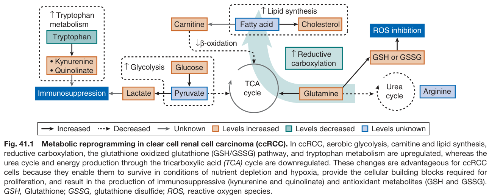
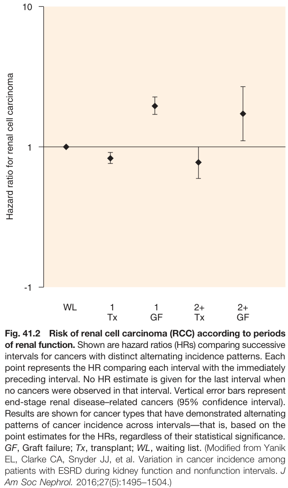
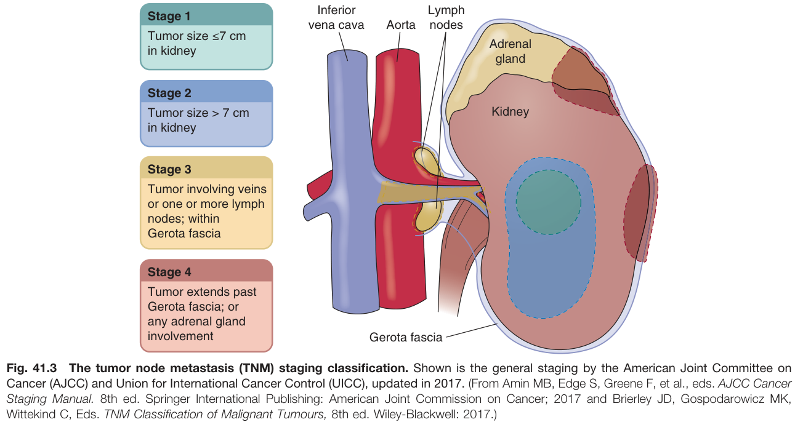
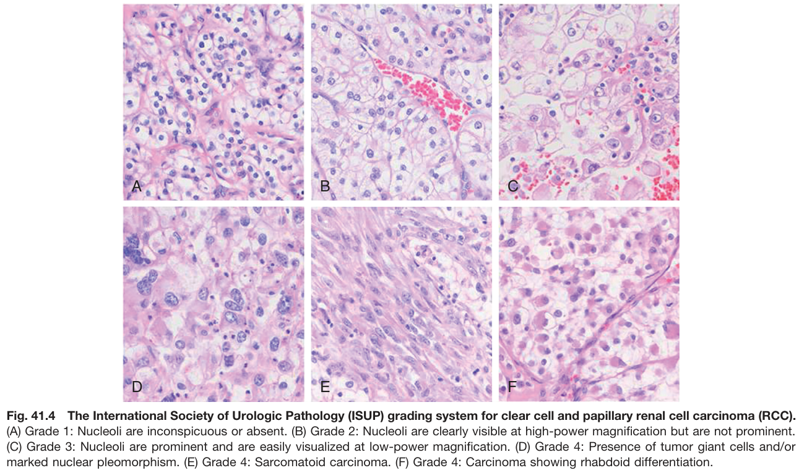
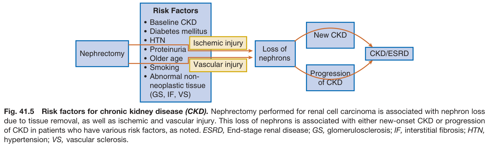
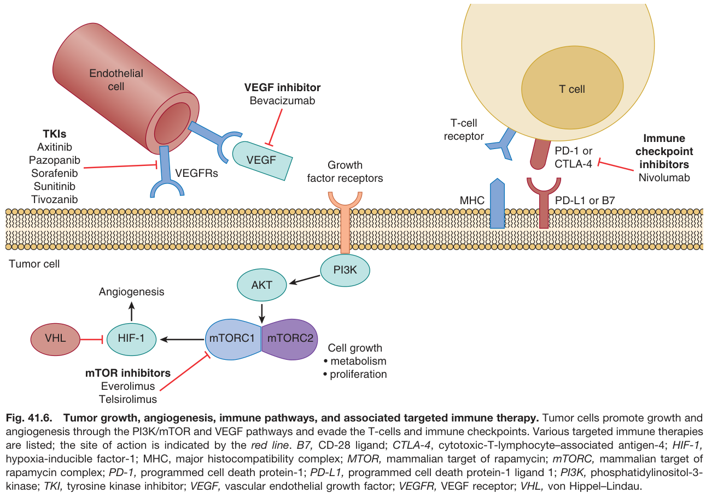
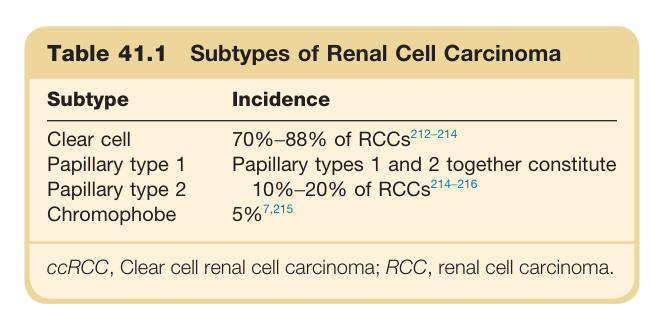
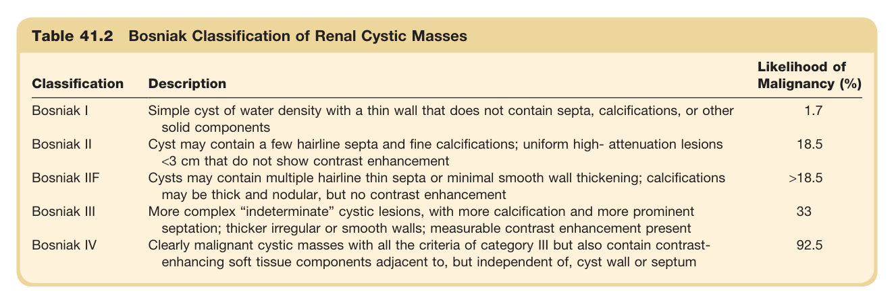
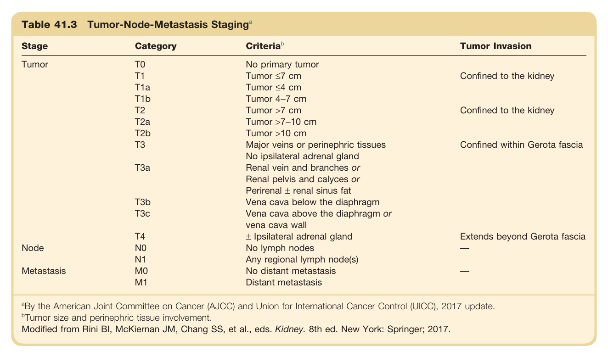
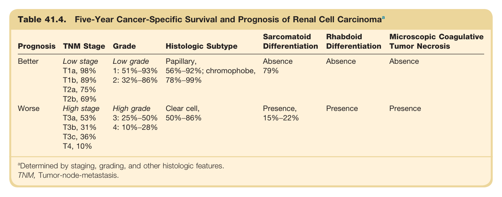

# 41. Kidney Cancer - Figures and Tables Index

This document lists all figures and tables extracted from `41. Kidney Cancer.pdf`.

## Table of Contents
- [Figures](#figures)
- [Tables](#tables)

---

## Figures

### Fig_41_1



Fig. 41.1 Metabolic reprogramming in clear cell renal cell carcinoma (ccRCC). In ccRCC, aerobic glycolysis, carnitine and lipid synthesis, reductive carboxylation, the glutathione oxidized glutathione (GSH/GSSG) pathway, and tryptophan metabolism are upregulated, whereas the urea cycle and energy production through the tricarboxylic acid (TCA) cycle are downregulated. These changes are advantageous for ccRCC cells because they enable them to survive in conditions of nutrient depletion and hypoxia, provide the cellular building blocks required for proliferation, and result in the production of immunosuppressive (kynurenine and quinolinate) and antioxidant metabolites (GSH and GSSG). GSH, Glutathione; GSSG, glutathione disulfide; ROS, reactive oxygen species.

---

### Fig_41_2



Fig. 41.2 Risk of renal cell carcinoma (RCC) according to periods of renal function. Shown are hazard ratios (HRs) comparing successive intervals for cancers with distinct alternating incidence patterns. Each point represents the HR comparing each interval with the immediately preceding interval. No HR estimate is given for the last interval when no cancers were observed in that interval. Vertical error bars represent end-stage renal disease-related cancers (95% confidence interval). Results are shown for cancer types that have demonstrated alternating patterns of cancer incidence across intervals-that is, based on the point estimates for the HRs, regardless of their statistical significance. GF, Graft failure; Tx, transplant; WL, waiting list. (Modified from Yanik EL, Clarke CA, Snyder JJ, et al. Variation in cancer incidence among patients with ESRD during kidney function and nonfunction intervals. J Am Soc Nephrol. 2016;27(5):1495-1504.)

---

### Fig_41_3



Fig. 41.3 The tumor node metastasis (TNM) staging classification. Shown is the general staging by the American Joint Committee on Cancer (AJCC) and Union for International Cancer Control (UICC), updated in 2017. (From Amin MB, Edge S, Greene F, et al., eds. AJCC Cancer Staging Manual. 8th ed. Springer International Publishing: American Joint Commission on Cancer; 2017 and Brierley JD, Gospodarowicz MK, Wittekind C, Eds. TNM Classification of Malignant Tumours, 8th ed. Wiley-Blackwell: 2017.)

---

### Fig_41_4



Fig. 41.4 The International Society of Urologic Pathology (ISUP) grading system for clear cell and papillary renal cell carcinoma (RCC). (A) Grade 1: Nucleoli are inconspicuous or absent. (B) Grade 2: Nucleoli are clearly visible at high-power magnification but are not prominent. (C) Grade 3: Nucleoli are prominent and are easily visualized at low-power magnification. (D) Grade 4: Presence of tumor giant cells and/or marked nuclear pleomorphism. (E) Grade 4: Sarcomatoid carcinoma. (F) Grade 4: Carcinoma showing rhabdoid differentiation.

---

### Fig_41_5



Fig. 41.5 Risk factors for chronic kidney disease (CKD). Nephrectomy performed for renal cell carcinoma is associated with nephron loss due to tissue removal, as well as ischemic and vascular injury. This loss of nephrons is associated with either new-onset CKD or progression of CKD in patients who have various risk factors, as noted. ESRD, End-stage renal disease; GS, glomerulosclerosis; IF, interstitial fibrosis; HTN, hypertension; VS, vascular sclerosis.

---

### Fig_41_6



Fig. 41.6 Tumor growth, angiogenesis, immune pathways, and associated targeted immune therapy. Tumor cells promote growth and angiogenesis through the PI3K/mTOR and VEGF pathways and evade the T-cells and immune checkpoints. Various targeted immune therapies are listed; the site of action is indicated by the red line. B7, CD-28 ligand; CTLA-4, cytotoxic-T-lymphocyte-associated antigen-4; HIF-1, hypoxia-inducible factor-1; MHC, major histocompatibility complex; MTOR, mammalian target of rapamycin; mTORC, mammalian target of rapamycin complex; PD-1, programmed cell death protein-1; PD-L1, programmed cell death protein-1 ligand 1; PI3K, phosphatidylinositol-3-kinase; TKI, tyrosine kinase inhibitor; VEGF, vascular endothelial growth factor; VEGFR, VEGF receptor; VHL, von Hippel-Lindau.

---

## Tables

### Table_41_1

#### Table Image



#### Table Data (CSV: [Table_41_1.csv](Table_41_1.csv))

```markdown
| Table Text (OCR) |
| :--- |
| Table 41.1 Subtypes of Renal Cell Carcinoma Subtype  Incidence    Clear cell  70%–88% of  RCCs^{212-214}     Papillary type 1  Papillary types 1 and 2 together constitute    Papillary type 2  10%–20% of  RCCs^{214-216}     Chromophobe   5\%^{7,215}     ccRCC, Clear cell renal cell carcinoma; RCC, renal cell carcinoma. |
```

Table 41.1 Subtypes of Renal Cell Carcinoma | Subtype | Incidence | | :--- | :--- | | Clear cell | 70%-88% of RCCS | | Papillary type 1 | Papillary types 1 and 2 together constitute | | Papillary type 2 | 10%-20% of RCCs | | Chromophobe | 5% | CCRCC, Clear cell renal cell carcinoma; RCC, renal cell carcinoma.

---

### Table_41_2

#### Table Image



#### Table Data (CSV: [Table_41_2.csv](Table_41_2.csv))

```markdown
| Table Text (OCR) |
| :--- |
| Table 41.2 Bosniak Classification of Renal Cystic Masses Classification  Description  Likelihood of Malignancy (%)    Bosniak I  Simple cyst of water density with a thin wall that does not contain septa, calcifications, or other solid components  1.7    Bosniak II  Cyst may contain a few hairline septa and fine calcifications; uniform high- attenuation lesions <3 cm that do not show contrast enhancement  18.5    Bosniak IIF  Cysts may contain multiple hairline thin septa or minimal smooth wall thickening; calcifications may be thick and nodular, but no contrast enhancement  >18.5    Bosniak III  More complex “indeterminate” cystic lesions, with more calcification and more prominent septation; thicker irregular or smooth walls; measurable contrast enhancement present  33    Bosniak IV  Clearly malignant cystic masses with all the criteria of category III but also contain contrast-enhancing soft tissue components adjacent to, but independent of, cyst wall or septum  92.5 |
```

Table 41.2 Bosniak Classification of Renal Cystic Masses | Classification | Description | Likelihood of Malignancy (%) | | :--- | :--- | :--- | | Bosniak I | Simple cyst of water density with a thin wall that does not contain septa, calcifications, or other solid components | 1.7 | | Bosniak II | Cyst may contain a few hairline septa and fine calcifications; uniform high- attenuation lesions <3 cm that do not show contrast enhancement | 18.5 | | Bosniak IIF | Cysts may contain multiple hairline thin septa or minimal smooth wall thickening; calcifications may be thick and nodular, but no contrast enhancement | >18.5 | | Bosniak III | More complex "indeterminate" cystic lesions, with more calcification and more prominent septation; thicker irregular or smooth walls; measurable contrast enhancement present | 33 | | Bosniak IV | Clearly malignant cystic masses with all the criteria of category III but also contain contrast-enhancing soft tissue components adjacent to, but independent of, cyst wall or septum | 92.5 |

---

### Table_41_3

#### Table Image



#### Table Data (CSV: [Table_41_3.csv](Table_41_3.csv))

```markdown
| Table Text (OCR) |
| :--- |
| Table 41.3 Tumor-Node-Metastasis Staging<sup>a</sup> Stage  Category  Criteria ^{b}   Tumor Invasion    Tumor  T0  No primary tumor      T1  Tumor ≤7 cm  Confined to the kidney    T1a  Tumor ≤4 cm      T1b  Tumor 4-7 cm      T2  Tumor >7 cm  Confined to the kidney    T2a  Tumor >7-10 cm      T2b  Tumor >10 cm      T3  Major veins or perinephric tissuesNo ipsilateral adrenal gland  Confined within Gerota fascia    T3a  Renal vein and branches orRenal pelvis and calyces orPerirenal ± renal sinus fat      T3b  Vena cava below the diaphragm      T3c  Vena cava above the diaphragm orvena cava wall      T4  ± Ipsilateral adrenal gland  Extends beyond Gerota fascia    Node  N0  No lymph nodes  —    N1  Any regional lymph node(s)      Metastasis  M0  No distant metastasis  —    M1  Distant metastasis <sup>a</sup>By the American Joint Committee on Cancer (AJCC) and Union for International Cancer Control (UICC), 2017 update. <sup>b</sup>Tumor size and perinephric tissue involvement. Modified from Rini BI, McKiernan JM, Chang SS, et al., eds. Kidney. 8th ed. New York: Springer; 2017. |
```

Table 41.3 Tumor-Node-Metastasis Staginga | Stage | Category | Criteriab | Tumor Invasion | | :--- | :--- | :--- | :--- | | Tumor | TO | No primary tumor | | | | T1 | Tumor ≤7 cm | Confined to the kidney | | | T1a | Tumor ≤4 cm | | | | T1b | Tumor 4-7 cm | | | | T2 | Tumor >7 cm | Confined to the kidney | | | T2a | Tumor >7-10 cm | | | | T2b | Tumor >10 cm | | | | T3 | Major veins or perinephric tissues | Confined within Gerota fascia | | | T3a | No ipsilateral adrenal gland | | | | | Renal vein and branches or | | | | | Renal pelvis and calyces or | | | | | Perirenal + renal sinus fat | | | | T3b | Vena cava below the diaphragm | | | | T3c | Vena cava above the diaphragm or | | | | | vena cava wall | | | | T4 | + Ipsilateral adrenal gland | Extends beyond Gerota fascia | | Node | NO | No lymph nodes | | | | N1 | Any regional lymph node(s) | | | Metastasis | MO | No distant metastasis | — | | | M1 | Distant metastasis | | aBy the American Joint Committee on Cancer (AJCC) and Union for International Cancer Control (UICC), 2017 update. bTumor size and perinephric tissue involvement. Modified from Rini BI, McKiernan JM, Chang SS, et al., eds. Kidney. 8th ed. New York: Springer; 2017.

---

### Table_41_4

#### Table Image



#### Table Data (CSV: [Table_41_4.csv](Table_41_4.csv))

```markdown
| Table Text (OCR) |
| :--- |
| Table 41.4. Five-Year Cancer-Specific Survival and Prognosis of Renal Cell Carcinoma<sup>a</sup> Prognosis  TNM Stage  Grade  Histologic Subtype  Sarcomatoid Differentiation  Rhabdoid Differentiation  Microscopic Coagulative Tumor Necrosis    Better  Low stage  Low grade  Papillary,  Absence  Absence  Absence    T1a, 98%  1: 51%–93%  56%–92%; chromophobe,  79%        T1b, 89%  2: 32%–86%  78%–99%          T2a, 75%              T2b, 69%              Worse  High stage  High grade  Clear cell,  Presence,  Presence  Presence    T3a, 53%  3: 25%–50%  50%–86%  15%–22%        T3b, 31%  4: 10%–28%            T3c, 36%              T4, 10% <sup>a</sup>Determined by staging, grading, and other histologic features. TNM, Tumor-node-metastasis. |
```

Table 41.4 Five-Year Cancer-Specific Survival and Prognosis of Renal Cell Carcinomaa | Prognosis | TNM Stage | Grade | Histologic Subtype | Sarcomatoid Differentiation | Rhabdoid Differentiation | Microscopic Coagulative Tumor Necrosis | | :--- | :--- | :--- | :--- | :--- | :--- | :--- | | Better | Low stage | Low grade | Papillary, | Absence | Absence | Absence | | | T1a, 98% | 1: 51%-93% | 56%-92%; chromophobe, | 79% | | | | | T1b, 89% | 2: 32%-86% | 78%-99% | | | | | | T2a, 75% | | | | | | | | T2b, 69% | | | | | | | Worse | High stage | High grade | Clear cell, | Presence, | Presence | Presence | | | T3a, 53% | 3: 25%-50% | 50%-86% | 15%-22% | | | | | T3b, 31% | 4: 10%-28% | | | | | | | T3c, 36% | | | | | | | | T4, 10% | | | | | | aDetermined by staging, grading, and other histologic features. TNM, Tumor-node-metastasis.

---
