# 42. Onconephrology-Kidney Disease and Cancer - Figures and Tables Index

This document lists all figures and tables extracted from `42. Onconephrology-Kidney Disease and Cancer.pdf`.

## Table of Contents
- [Figures](#figures)
- [Tables](#tables)

---

## Figures

### Fig_42_1

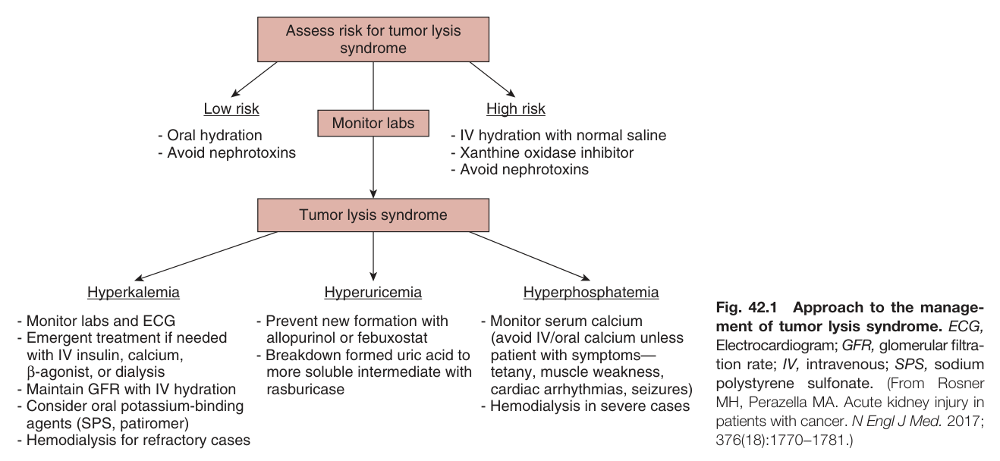

Fig. 42.1 Approach to the management of tumor lysis syndrome. ECG, Electrocardiogram; GFR, glomerular filtration rate; IV, intravenous; SPS, sodium polystyrene sulfonate. (From Rosner MH, Perazella MA. Acute kidney injury in patients with cancer. N Engl J Med. 2017; 376(18):1770-1781.)

---

### Fig_42_2

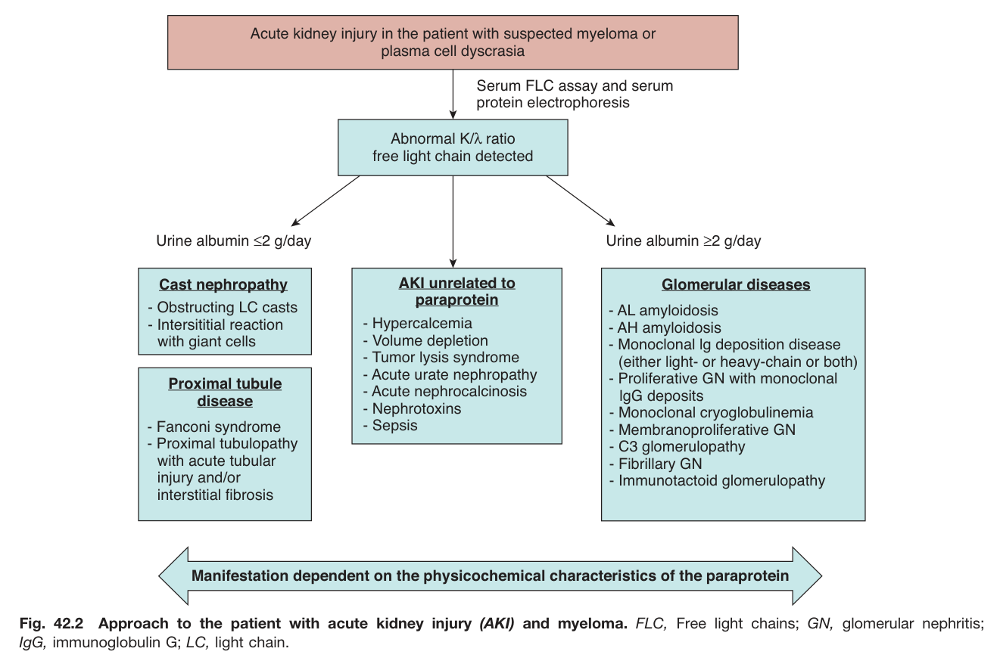

Fig. 42.2 Approach to the patient with acute kidney injury (AKI) and myeloma. FLC, Free light chains; GN, glomerular nephritis; IgG, immunoglobulin G; LC, light chain.

---

### Fig_42_3

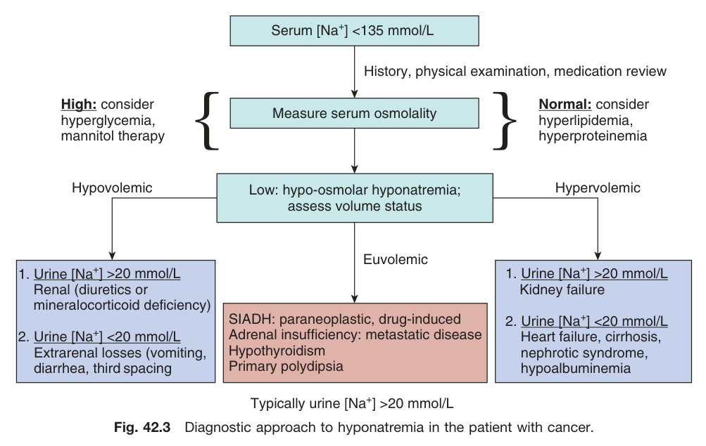

Fig. 42.3 Diagnostic approach to hyponatremia in the patient with cancer.

---

### Fig_42_4

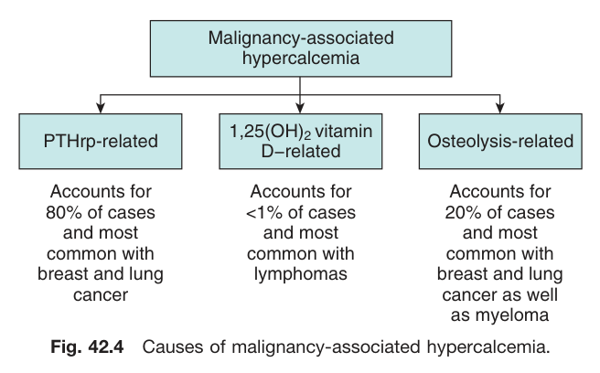

Fig. 42.4 Causes of malignancy-associated hypercalcemia.

---

### Fig_42_5

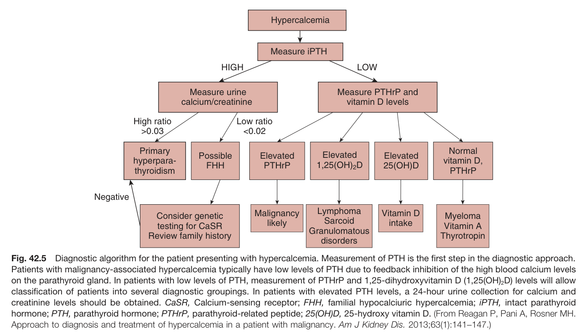

Fig. 42.5 Diagnostic algorithm for the patient presenting with hypercalcemia. Measurement of PTH is the first step in the diagnostic approach. Patients with malignancy-associated hypercalcemia typically have low levels of PTH due to feedback inhibition of the high blood calcium levels on the parathyroid gland. In patients with low levels of PTH, measurement of PTHrP and 1,25-dihydroxyvitamin D (1,25(OH)2D) levels will allow classification of patients into several diagnostic groupings. In patients with elevated PTH levels, a 24-hour urine collection for calcium and creatinine levels should be obtained. CaSR, Calcium-sensing receptor; FHH, familial hypocalciuric hypercalcemia; iPTH, intact parathyroid hormone; PTH, parathyroid hormone; PTHrP, parathyroid-related peptide; 25(OH)D, 25-hydroxy vitamin D. (From Reagan P, Pani A, Rosner MH. Approach to diagnosis and treatment of hypercalcemia in a patient with malignancy. Am J Kidney Dis. 2013;63(1):141-147.)

---

### Fig_42_6

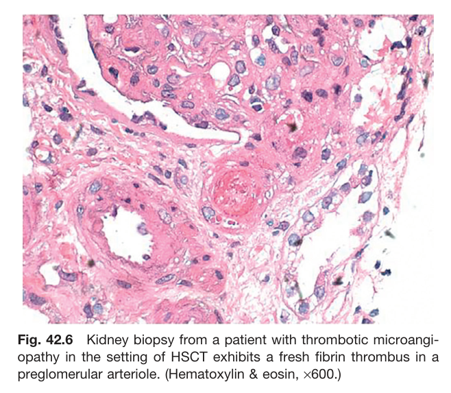

Fig. 42.6 Kidney biopsy from a patient with thrombotic microangiopathy in the setting of HSCT exhibits a fresh fibrin thrombus in a preglomerular arteriole. (Hematoxylin & eosin, ×600.)

---

## Tables

### Table_42_1

#### Table Image

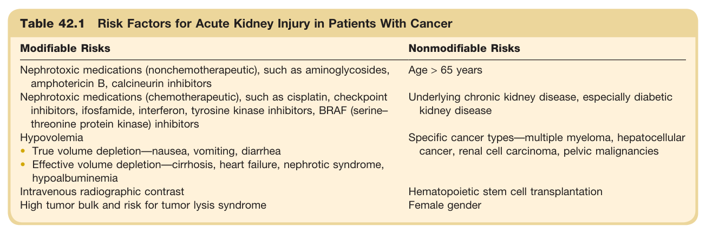

#### Table Data (CSV: [Table_42_1.csv](Table_42_1.csv))

```markdown
| Table Text (OCR) |
| :--- |
| Table 42.1 Risk Factors for Acute Kidney Injury in Patients With Cancer Modifiable Risks  Nonmodifiable Risks    Nephrotoxic medications (nonchemotherapeutic), such as aminoglycosides, amphotericin B, calcineurin inhibitors  Age > 65 years    Nephrotoxic medications (chemotherapeutic), such as cisplatin, checkpoint inhibitors, ifosfamide, interferon, tyrosine kinase inhibitors, BRAF (serine-threonine protein kinase) inhibitors  Underlying chronic kidney disease, especially diabetic kidney disease    HypovolemiaTrue volume depletion—nausea, vomiting, diarrheaEffective volume depletion—cirrhosis, heart failure, nephrotic syndrome, hypoalbuminemia  Specific cancer types—multiple myeloma, hepatocellular cancer, renal cell carcinoma, pelvic malignancies    Intravenous radiographic contrastHigh tumor bulk and risk for tumor lysis syndrome  Hematopoietic stem cell transplantationFemale gender |
```

Table 42.1 Risk Factors for Acute Kidney Injury in Patients With Cancer | Modifiable Risks | Nonmodifiable Risks | | :--- | :--- | | Nephrotoxic medications (nonchemotherapeutic), such as aminoglycosides, amphotericin B, calcineurin inhibitors | Age > 65 years | | Nephrotoxic medications (chemotherapeutic), such as cisplatin, checkpoint inhibitors, ifosfamide, interferon, tyrosine kinase inhibitors, BRAF (serine-threonine protein kinase) inhibitors | Underlying chronic kidney disease, especially diabetic kidney disease | | Hypovolemia | Specific cancer types—multiple myeloma, hepatocellular cancer, renal cell carcinoma, pelvic malignancies | | • True volume depletion—nausea, vomiting, diarrhea | Hematopoietic stem cell transplantation | | • Effective volume depletion—cirrhosis, heart failure, nephrotic syndrome, hypoalbuminemia | Female gender | | Intravenous radiographic contrast | | | High tumor bulk and risk for tumor lysis syndrome | |

---

### Table_42_2

#### Table Image

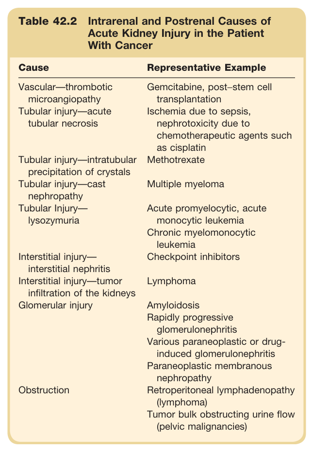

#### Table Data (CSV: [Table_42_2.csv](Table_42_2.csv))

```markdown
| Table Text (OCR) |
| :--- |
| Table 42.2 Intrarenal and Postrenal Causes of Acute Kidney Injury in the Patient With Cancer Cause  Representative Example    Vascular—thrombotic microangiopathy  Gemcitabine, post–stem cell transplantation    Tubular injury—acute tubular necrosis  Ischemia due to sepsis, nephrotoxicity due to chemotherapeutic agents such as cisplatin    Tubular injury—intratubular precipitation of crystals  Methotrexate    Tubular injury—cast nephropathy  Multiple myeloma    Tubular Injury—lysozymuria  Acute promyelocytic, acute monocytic leukemiaChronic myelomonocytic leukemia    Interstitial injury—interstitial nephritis  Checkpoint inhibitors    Interstitial injury—tumor infiltration of the kidneys  Lymphoma    Glomerular injury  AmyloidosisRapidly progressive glomerulonephritisVarious paraneoplastic or drug-induced glomerulonephritisParaneoplastic membranous nephropathy    Obstruction  Retroperitoneal lymphadenopathy (lymphoma)Tumor bulk obstructing urine flow (pelvic malignancies) |
```

Table 42.2 Intrarenal and Postrenal Causes of Acute Kidney Injury in the Patient With Cancer | Cause | Representative Example | | :--- | :--- | | Vascular-thrombotic microangiopathy | Gemcitabine, post-stem cell transplantation | | Tubular injury-acute tubular necrosis | Ischemia due to sepsis, nephrotoxicity due to chemotherapeutic agents such as cisplatin | | Tubular injury-intratubular precipitation of crystals | Methotrexate | | Tubular injury-cast nephropathy | Multiple myeloma | | Tubular Injury-lysozymuria | Acute promyelocytic, acute monocytic leukemia Chronic myelomonocytic leukemia | | Interstitial injury-interstitial nephritis | Checkpoint inhibitors | | Interstitial injury-tumor infiltration of the kidneys | Lymphoma | | Glomerular injury | Amyloidosis Rapidly progressive glomerulonephritis Various paraneoplastic or drug-induced glomerulonephritis Paraneoplastic membranous nephropathy | | Obstruction | Retroperitoneal lymphadenopathy (lymphoma) Tumor bulk obstructing urine flow (pelvic malignancies) |

---

### Table_42_3

#### Table Image

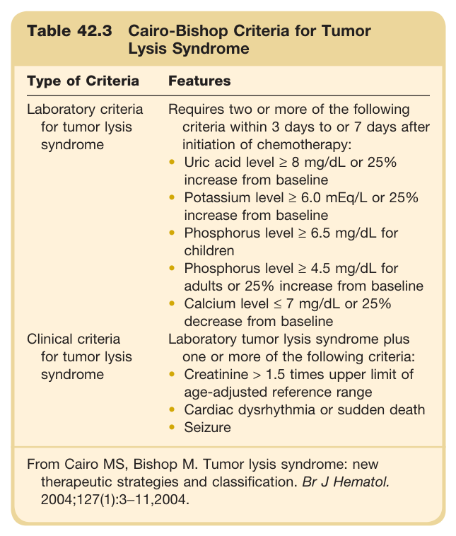

#### Table Data (CSV: [Table_42_3.csv](Table_42_3.csv))

```markdown
| Table Text (OCR) |
| :--- |
| Table 42.3 Cairo-Bishop Criteria for Tumor Lysis Syndrome Type of Criteria  Features    Laboratory criteria for tumor lysis syndrome  Requires two or more of the following criteria within 3 days to or 7 days after initiation of chemotherapy:Uric acid level  \geq 8  mg/dL or 25% increase from baselinePotassium level  \geq 6.0  mEq/L or 25% increase from baselinePhosphorus level  \geq 6.5  mg/dL for childrenPhosphorus level  \geq 4.5  mg/dL for adults or 25% increase from baselineCalcium level  \leq 7  mg/dL or 25% decrease from baseline    Clinical criteria for tumor lysis syndrome  Laboratory tumor lysis syndrome plus one or more of the following criteria:Creatinine  > 1.5  times upper limit of age-adjusted reference rangeCardiac dysrhythmia or sudden deathSeizure    From Cairo MS, Bishop M. Tumor lysis syndrome: new therapeutic strategies and classification.Br J Hematol.2004;127(1):3–11,2004. |
```

Table 42.3 Cairo-Bishop Criteria for Tumor Lysis Syndrome | Type of Criteria | Features | | :--- | :--- | | Laboratory criteria for tumor lysis syndrome | Requires two or more of the following criteria within 3 days to or 7 days after initiation of chemotherapy: • Uric acid level ≥ 8 mg/dL or 25% increase from baseline • Potassium level ≥ 6.0 mEq/L or 25% increase from baseline • Phosphorus level ≥ 6.5 mg/dL for children • Phosphorus level ≥ 4.5 mg/dL for adults or 25% increase from baseline • Calcium level ≤ 7 mg/dL or 25% decrease from baseline | | Clinical criteria for tumor lysis syndrome | Laboratory tumor lysis syndrome plus one or more of the following criteria: • Creatinine > 1.5 times upper limit of age-adjusted reference range • Cardiac dysrhythmia or sudden death • Seizure | From Cairo MS, Bishop M. Tumor lysis syndrome: new therapeutic strategies and classification. Br J Hematol. 2004;127(1):3-11,2004.

---

### Table_42_4

#### Table Image

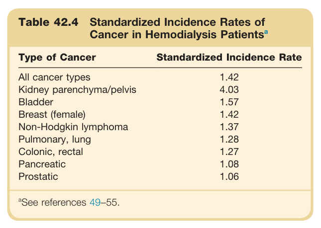

#### Table Data (CSV: [Table_42_4.csv](Table_42_4.csv))

```markdown
| Table Text (OCR) |
| :--- |
| Table 42.4 Standardized Incidence Rates of Cancer in Hemodialysis Patients<sup>a</sup> Type of Cancer  Standardized Incidence Rate    All cancer types  1.42    Kidney parenchyma/pelvis  4.03    Bladder  1.57    Breast (female)  1.42    Non-Hodgkin lymphoma  1.37    Pulmonary, lung  1.28    Colonic, rectal  1.27    Pancreatic  1.08    Prostatic  1.06     ^{a} See references 49–55. |
```

Table 42.4 Standardized Incidence Rates of Cancer in Hemodialysis Patientsa | Type of Cancer | Standardized Incidence Rate | | :--- | :--- | | All cancer types | 1.42 | | Kidney parenchyma/pelvis | 4.03 | | Bladder | 1.57 | | Breast (female) | 1.42 | | Non-Hodgkin lymphoma | 1.37 | | Pulmonary, lung | 1.28 | | Colonic, rectal | 1.27 | | Pancreatic | 1.08 | | Prostatic | 1.06 | aSee references 49-55.

---

### Table_42_5

#### Table Image

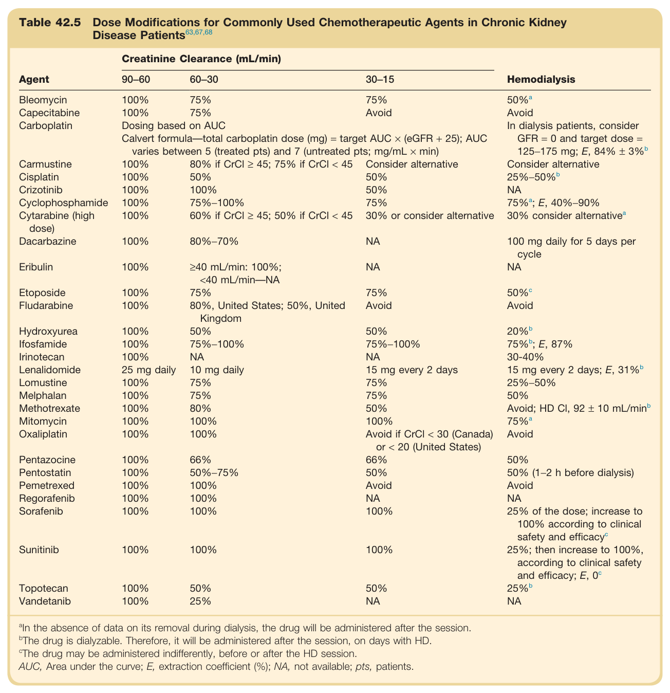

#### Table Data (CSV: [Table_42_5.csv](Table_42_5.csv))

```markdown
| Table Text (OCR) |
| :--- |
| Table 42.5 Dose Modifications for Commonly Used Chemotherapeutic Agents in Chronic Kidney Disease Patients<sup>63,67,68</sup> Agent  Creatinine Clearance (mL/min)  Hemodialysis    90-60  60-30  30-15    Bleomycin  100%  75%  75%   50\%^a     Capecitabine  100%  75%  Avoid  Avoid    Carboplatin  Dosing based on AUC  In dialysis patients, consider GFR = 0 and target dose = 125-175 mg; E, 84% ±  3\%^b     Calvert formula-total carboplatin dose (mg) = target AUC × (eGFR + 25); AUC varies between 5 (treated pts) and 7 (untreated pts; mg/mL × min)    Carmustine  100%  80% if CrCl ≥ 45; 75% if CrCl < 45  Consider alternative  Consider alternative    Cisplatin  100%  50%  50%   25\% -50\%^b     Crizotinib  100%  100%  50%  NA    Cyclophosphamide  100%  75%-100%  75%   75\%^a ; E, 40%-90%    Cytarabine (high dose)  100%  60% if CrCl ≥ 45; 50% if CrCl < 45  30% or consider alternative   30\%  consider  alternative^a     Dacarbazine  100%  80%-70%  NA  100 mg daily for 5 days per cycle    Eribulin  100%  ≥40 mL/min: 100%; <40 mL/min-NA  NA  NA    Etoposide  100%  75%  75%   50\%^c     Fludarabine  100%  80%, United States; 50%, United Kingdom  Avoid  Avoid    Hydroxyurea  100%  50%  50%   20\%^b     Ifosfamide  100%  75%-100%  75%-100%   75\%^b ; E, 87%    Irinotecan  100%  NA  NA  30-40%    Lenalidomide  25 mg daily  10 mg daily  15 mg every 2 days  15 mg every 2 days; E,  31\%^b     Lomustine  100%  75%  75%  25%-50%    Melphalan  100%  75%  75%  50%    Methotrexate  100%  80%  50%  Avoid; HD CI, 92 ± 10 mL/ min^b     Mitomycin  100%  100%  100%   75\%^a     Oxaliplatin  100%  100%  Avoid if CrCl < 30 (Canada) or < 20 (United States)  Avoid    Pentazocine  100%  66%  66%  50%    Pentostatin  100%  50%-75%  50%  50% (1-2 h before dialysis)    Pemetrexed  100%  100%  Avoid  Avoid    Regorafenib  100%  100%  NA  NA    Sorafenib  100%  100%  100%  25% of the dose; increase to 100% according to clinical safety and  efficacy^c     Sunitinib  100%  100%  100%  25%; then increase to 100%, according to clinical safety and efficacy; E,  0^c     Topotecan  100%  50%  50%   25\%^b     Vandetanib  100%  25%  NA  NA <sup>a</sup>In the absence of data on its removal during dialysis, the drug will be administered after the session. <sup>b</sup>The drug is dialyzable. Therefore, it will be administered after the session, on days with HD. <sup>c</sup>The drug may be administered indifferently, before or after the HD session. AUC, Area under the curve; E, extraction coefficient (%); NA, not available; pts, patients. |
```

Table 42.5 Dose Modifications for Commonly Used Chemotherapeutic Agents in Chronic Kidney Disease Patients | Agent | Creatinine Clearance (mL/min) 90-60 | Creatinine Clearance (mL/min) 60-30 | Creatinine Clearance (mL/min) 30-15 | Hemodialysis | | :--- | :--- | :--- | :--- | :--- | | Bleomycin | 100% | 75% | 75% | 50%a | | Capecitabine | 100% | 75% | Avoid | Avoid | | Carboplatin | Dosing based on AUC Calvert formula—total carboplatin dose (mg) = target AUC × (eGFR + 25); AUC varies between 5 (treated pts) and 7 (untreated pts; mg/mL × min) | | | In dialysis patients, consider GFR = 0 and target dose = 125–175 mg; E, 84% ± 3%b | | Carmustine | 100% | 80% if CrCl ≥ 45; 75% if CrCl < 45 | Consider alternative | Consider alternative | | Cisplatin | 100% | 50% | 50% | 25%-50% | | Crizotinib | 100% | 100% | 50% | NA | | Cyclophosphamide | 100% | 75%-100% | 75% | 75%; E, 40%-90% | | Cytarabine (high dose) | 100% | 60% if CrCl ≥ 45; 50% if CrCl < 45 | 30% or consider alternative | 30% consider alternativea | | Dacarbazine | 100% | 80%-70% | NA | 100 mg daily for 5 days per cycle | | Eribulin | 100% | ≥40 mL/min: 100%; <40 mL/min-NA | NA | NA | | Etoposide | 100% | 75% | 75% | 50%° | | Fludarabine | 100% | 80%, United States; 50%, United Kingdom | Avoid | Avoid | | Hydroxyurea | 100% | 50% | 50% | 20%b | | Ifosfamide | 100% | 75%-100% | 75%-100% | 75%; E, 87% | | Irinotecan | 100% | NA | NA | 30-40% | | Lenalidomide | 25 mg daily | 10 mg daily | 15 mg every 2 days | 15 mg every 2 days; E, 31%b | | Lomustine | 100% | 75% | 75% | 25%-50% | | Melphalan | 100% | 75% | 75% | 50% | | Methotrexate | 100% | 80% | 50% | Avoid; HD CI, 92 ± 10 mL/minb | | Mitomycin | 100% | 100% | 100% | 75%a | | Oxaliplatin | 100% | 100% | Avoid if CrCl < 30 (Canada) or < 20 (United States) | Avoid | | Pentazocine | 100% | 66% | 66% | 50% | | Pentostatin | 100% | 50%-75% | 50% | 50% (1–2 h before dialysis) | | Pemetrexed | 100% | 100% | Avoid | Avoid | | Regorafenib | 100% | 100% | NA | NA | | Sorafenib | 100% | 100% | 100% | 25% of the dose; increase to 100% according to clinical safety and efficacy | | Sunitinib | 100% | 100% | 100% | 25%; then increase to 100%, according to clinical safety and efficacy; E, 0° | | Topotecan | 100% | 50% | 50% | 25%b | | Vandetanib | 100% | 25% | NA | NA | In the absence of data on its removal during dialysis, the drug will be administered after the session. The drug is dialyzable. Therefore, it will be administered after the session, on days with HD. The drug may be administered indifferently, before or after the HD session. AUC, Area under the curve; E, extraction coefficient (%); NA, not available; pts, patients.

---

### Table_42_6

#### Table Image

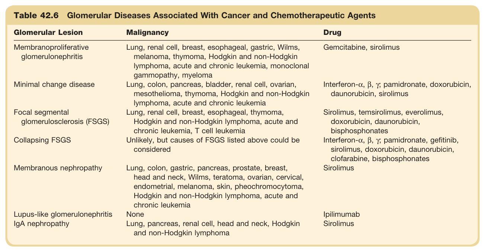

#### Table Data (CSV: [Table_42_6.csv](Table_42_6.csv))

```markdown
| Table Text (OCR) |
| :--- |
| Table 42.6 Glomerular Diseases Associated With Cancer and Chemotherapeutic Agents Glomerular Lesion  Malignancy  Drug    Membranoproliferative glomerulonephritis  Lung, renal cell, breast, esophageal, gastric, Wilms, melanoma, thymoma, Hodgkin and non-Hodgkin lymphoma, acute and chronic leukemia, monoclonal gammopathy, myeloma  Gemcitabine, sirolimus    Minimal change disease  Lung, colon, pancreas, bladder, renal cell, ovarian, mesothelioma, thymoma, Hodgkin and non-Hodgkin lymphoma, acute and chronic leukemia  Interferon-α, β, γ; pamidronate, doxorubicin, daunorubicin, sirolimus    Focal segmental glomerulosclerosis (FSGS)  Lung, renal cell, breast, esophageal, thymoma, Hodgkin and non-Hodgkin lymphoma, acute and chronic leukemia, T cell leukemia  Sirolimus, temsirolimus, everolimus, doxorubicin, daunorubicin, bisphosphonates    Collapsing FSGS  Unlikely, but causes of FSGS listed above could be considered  Interferon-α, β, γ; pamidronate, gefitinib, sirolimus, doxorubicin, daunorubicin, clofarabine, bisphosphonates    Membranous nephropathy  Lung, colon, gastric, pancreas, prostate, breast, head and neck, Wilms, teratoma, ovarian, cervical, endometrial, melanoma, skin, pheochromocytoma, Hodgkin and non-Hodgkin lymphoma, acute and chronic leukemia  Sirolimus    Lupus-like glomerulonephritis  None  Ipilimumab    IgA nephropathy  Lung, pancreas, renal cell, head and neck, Hodgkin and non-Hodgkin lymphoma  Sirolimus |
```

Table 42.6 Glomerular Diseases Associated With Cancer and Chemotherapeutic Agents | Glomerular Lesion | Malignancy | Drug | | :--- | :--- | :--- | | Membranoproliferative glomerulonephritis | Lung, renal cell, breast, esophageal, gastric, Wilms, melanoma, thymoma, Hodgkin and non-Hodgkin lymphoma, acute and chronic leukemia, monoclonal gammopathy, myeloma | Gemcitabine, sirolimus | | Minimal change disease | Lung, colon, pancreas, bladder, renal cell, ovarian, mesothelioma, thymoma, Hodgkin and non-Hodgkin lymphoma, acute and chronic leukemia | Interferon-α, β, γ; pamidronate, doxorubicin, daunorubicin, sirolimus | | Focal segmental glomerulosclerosis (FSGS) | Lung, renal cell, breast, esophageal, thymoma, Hodgkin and non-Hodgkin lymphoma, acute and chronic leukemia, T cell leukemia | Sirolimus, temsirolimus, everolimus, doxorubicin, daunorubicin, bisphosphonates | | Collapsing FSGS | Unlikely, but causes of FSGS listed above could be considered | Interferon-α, β, γ, pamidronate, gefitinib, sirolimus, doxorubicin, daunorubicin, clofarabine, bisphosphonates | | Membranous nephropathy | Lung, colon, gastric, pancreas, prostate, breast, head and neck, Wilms, teratoma, ovarian, cervical, endometrial, melanoma, skin, pheochromocytoma, Hodgkin and non-Hodgkin lymphoma, acute and chronic leukemia | Sirolimus | | Lupus-like glomerulonephritis | None | Ipilimumab | | IgA nephropathy | Lung, pancreas, renal cell, head and neck, Hodgkin and non-Hodgkin lymphoma | Sirolimus |

---

### Table_42_7

#### Table Image

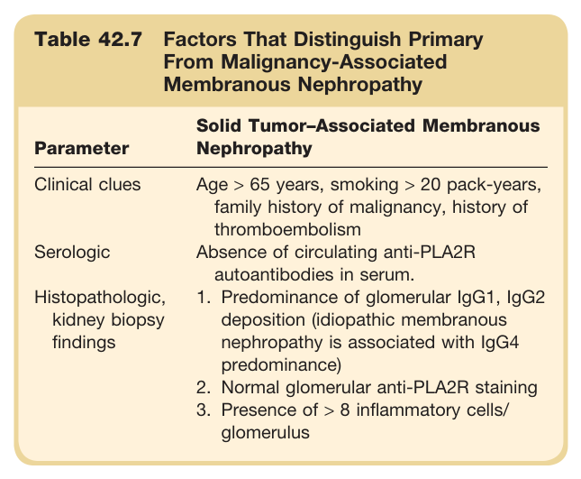

#### Table Data (CSV: [Table_42_7.csv](Table_42_7.csv))

```markdown
| Table Text (OCR) |
| :--- |
| Table 42.7 Factors That Distinguish Primary From Malignancy-Associated Membranous Nephropathy Parameter  Solid Tumor-Associated Membranous Nephropathy    Clinical clues  Age > 65 years, smoking > 20 pack-years, family history of malignancy, history of thromboembolism    Serologic  Absence of circulating anti-PLA2R autoantibodies in serum.    Histopathologic, kidney biopsy findings  1. Predominance of glomerular IgG1, IgG2 deposition (idiopathic membranous nephropathy is associated with IgG4 predominance)2. Normal glomerular anti-PLA2R staining3. Presence of > 8 inflammatory cells/glomerulus |
```

Table 42.7 Factors That Distinguish Primary From Malignancy-Associated Membranous Nephropathy | Parameter | Solid Tumor-Associated Membranous Nephropathy | | :--- | :--- | | Clinical clues | Age > 65 years, smoking > 20 pack-years, family history of malignancy, history of thromboembolism | | Serologic | Absence of circulating anti-PLA2R autoantibodies in serum. | | Histopathologic, kidney biopsy findings | 1. Predominance of glomerular IgG1, IgG2 deposition (idiopathic membranous nephropathy is associated with IgG4 predominance) <br> 2. Normal glomerular anti-PLA2R staining <br> 3. Presence of > 8 inflammatory cells/glomerulus |

---

### Table_42_8

#### Table Image

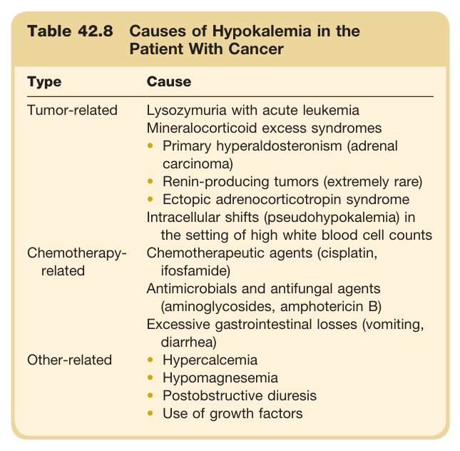

#### Table Data (CSV: [Table_42_8.csv](Table_42_8.csv))

```markdown
| Table Text (OCR) |
| :--- |
| Table 42.8 Causes of Hypokalemia in the Patient With Cancer Type  Cause    Tumor-related  Lysozymuria with acute leukemiaMineralocorticoid excess syndromesPrimary hyperaldosteronism (adrenal carcinoma)Renin-producing tumors (extremely rare)Ectopic adrenocorticotropin syndromeIntracellular shifts (pseudohypokalemia) in the setting of high white blood cell counts    Chemotherapy-related  Chemotherapeutic agents (cisplatin, ifosfamide)Antimicrobials and antifungal agents (aminoglycosides, amphotericin B)Excessive gastrointestinal losses (vomiting, diarrhea)    Other-related  HypercalcemiaHypomagnesemiaPostobstructive diuresisUse of growth factors |
```

Table 42.8 Causes of Hypokalemia in the Patient With Cancer | Type | Cause | | :--- | :--- | | Tumor-related | Lysozymuria with acute leukemia Mineralocorticoid excess syndromes • Primary hyperaldosteronism (adrenal carcinoma) • Renin-producing tumors (extremely rare) • Ectopic adrenocorticotropin syndrome Intracellular shifts (pseudohypokalemia) in the setting of high white blood cell counts | | Chemotherapy-related | Chemotherapeutic agents (cisplatin, ifosfamide) Antimicrobials and antifungal agents (aminoglycosides, amphotericin B) | | Other-related | Excessive gastrointestinal losses (vomiting, diarrhea) • Hypercalcemia • Hypomagnesemia • Postobstructive diuresis • Use of growth factors |

---

### Table_42_9

#### Table Image

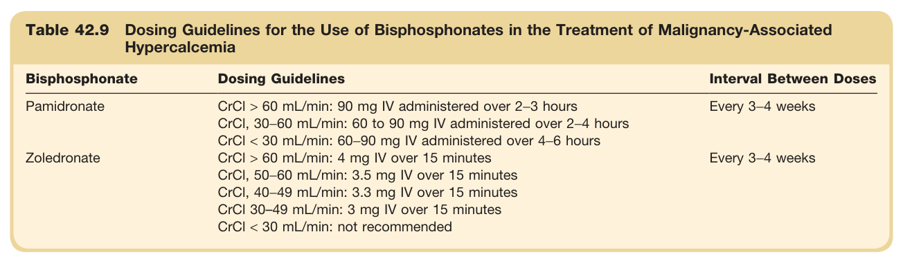

#### Table Data (CSV: [Table_42_9.csv](Table_42_9.csv))

```markdown
| Table Text (OCR) |
| :--- |
| Table 42.9 Dosing Guidelines for the Use of Bisphosphonates in the Treatment of Malignancy-Associated Hypercalcemia Bisphosphonate  Dosing Guidelines  Interval Between Doses    Pamidronate  CrCl > 60 mL/min: 90 mg IV administered over 2–3 hoursCrCl, 30–60 mL/min: 60 to 90 mg IV administered over 2–4 hoursCrCl < 30 mL/min: 60–90 mg IV administered over 4–6 hours  Every 3–4 weeks    Zoledronate  CrCl > 60 mL/min: 4 mg IV over 15 minutesCrCl, 50–60 mL/min: 3.5 mg IV over 15 minutesCrCl, 40–49 mL/min: 3.3 mg IV over 15 minutesCrCl 30–49 mL/min: 3 mg IV over 15 minutesCrCl < 30 mL/min: not recommended  Every 3–4 weeks |
```

Table 42.9 Dosing Guidelines for the Use of Bisphosphonates in the Treatment of Malignancy-Associated Hypercalcemia | Bisphosphonate | Dosing Guidelines | Interval Between Doses | | :--- | :--- | :--- | | Pamidronate | CrCl > 60 mL/min: 90 mg IV administered over 2–3 hours <br> CrCl, 30–60 mL/min: 60 to 90 mg IV administered over 2–4 hours <br> CrCl < 30 mL/min: 60–90 mg IV administered over 4–6 hours | Every 3–4 weeks | | Zoledronate | CrCl > 60 mL/min: 4 mg IV over 15 minutes <br> CrCl, 50–60 mL/min: 3.5 mg IV over 15 minutes <br> CrCl, 40–49 mL/min: 3.3 mg IV over 15 minutes <br> CrCl 30–49 mL/min: 3 mg IV over 15 minutes <br> CrCl < 30 mL/min: not recommended | Every 3–4 weeks |

---

### Table_42_10

#### Table Image

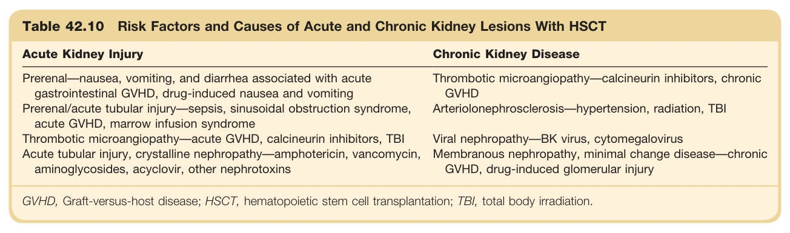

#### Table Data (CSV: [Table_42_10.csv](Table_42_10.csv))

```markdown
| Table Text (OCR) |
| :--- |
| Table 42.10 Risk Factors and Causes of Acute and Chronic Kidney Lesions With HSCT Acute Kidney Injury  Chronic Kidney Disease    Prerenal—nausea, vomiting, and diarrhea associated with acute gastrointestinal GVHD, drug-induced nausea and vomiting  Thrombotic microangiopathy—calcineurin inhibitors, chronic GVHD    Prerenal/acute tubular injury—sepsis, sinusoidal obstruction syndrome, acute GVHD, marrow infusion syndrome  Arteriolonephrosclerosis—hypertension, radiation, TBI    Thrombotic microangiopathy—acute GVHD, calcineurin inhibitors, TBI  Viral nephropathy—BK virus, cytomegalovirus    Acute tubular injury, crystalline nephropathy—amphotericin, vancomycin, aminoglycosides, acyclovir, other nephrotoxins  Membranous nephropathy, minimal change disease—chronic GVHD, drug-induced glomerular injury GVHD, Graft-versus-host disease; HSCT, hematopoietic stem cell transplantation; TBI, total body irradiation. |
```

Table 42.10 Risk Factors and Causes of Acute and Chronic Kidney Lesions With HSCT | Acute Kidney Injury | Chronic Kidney Disease | | :--- | :--- | | Prerenal—nausea, vomiting, and diarrhea associated with acute gastrointestinal GVHD, drug-induced nausea and vomiting | Thrombotic microangiopathy—calcineurin inhibitors, chronic GVHD | | Prerenal/acute tubular injury—sepsis, sinusoidal obstruction syndrome, acute GVHD, marrow infusion syndrome | Arteriolonephrosclerosis—hypertension, radiation, TBI | | Thrombotic microangiopathy—acute GVHD, calcineurin inhibitors, TBI | Viral nephropathy—BK virus, cytomegalovirus | | Acute tubular injury, crystalline nephropathy—amphotericin, vancomycin, aminoglycosides, acyclovir, other nephrotoxins | Membranous nephropathy, minimal change disease—chronic GVHD, drug-induced glomerular injury | GVHD, Graft-versus-host disease; HSCT, hematopoietic stem cell transplantation; TBI, total body irradiation.

---

### Table_42_11

#### Table Images (2 Parts)

- **Part 1 (Page 20)**:
  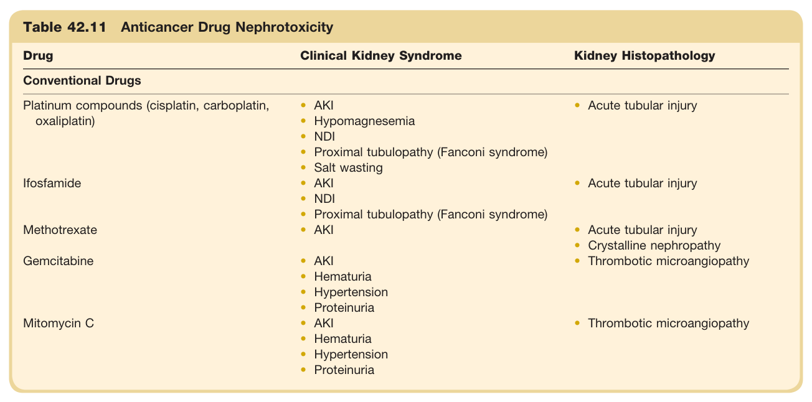

- **Part 2 (Page 21)**:
  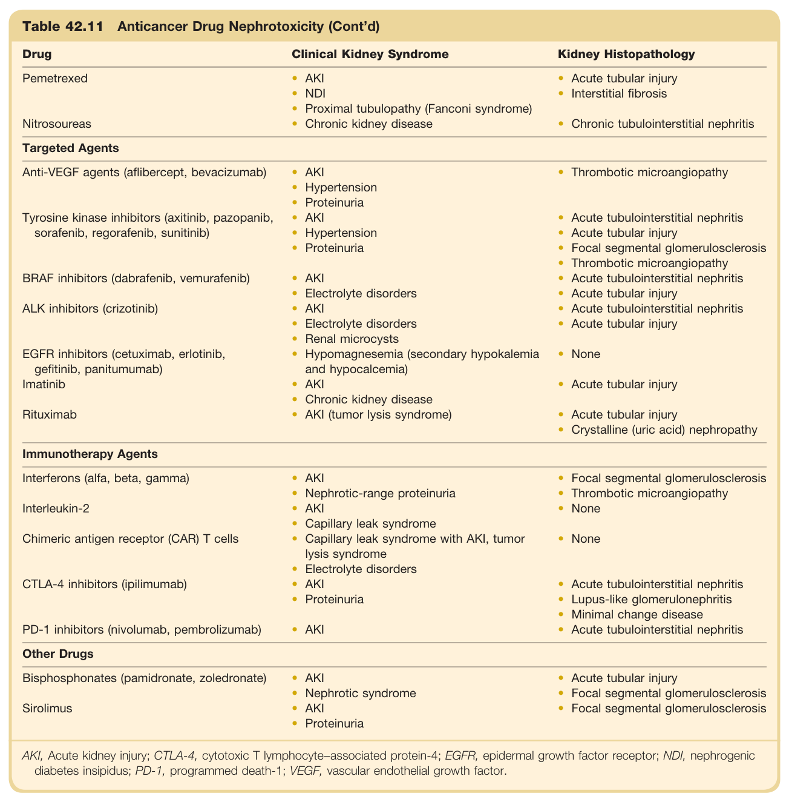

#### Table Data (CSV: [Table_42_11.csv](Table_42_11.csv))

```markdown
| Table Text (OCR) |
| :--- |
| Table 42.11 Anticancer Drug Nephrotoxicity Drug  Clinical Kidney Syndrome  Kidney Histopathology    Conventional Drugs    Platinum compounds (cisplatin, carboplatin, oxaliplatin)  AKIHypomagnesemiaNDIProximal tubulopathy (Fanconi syndrome)Salt wasting  Acute tubular injury    Ifosfamide  AKINDIProximal tubulopathy (Fanconi syndrome)  Acute tubular injury    Methotrexate  AKI  Acute tubular injuryCrystalline nephropathy    Gemcitabine  AKIHematuriaHypertensionProteinuria  Thrombotic microangiopathy    Mitomycin C  AKIHematuriaHypertensionProteinuria  Thrombotic microangiopathy    Pemetrexed  AKINDIProximal tubulopathy (Fanconi syndrome)  Acute tubular injuryInterstitial fibrosis    Nitrosoureas  Chronic kidney disease  Chronic tubulointerstitial nephritis    Targeted Agents    Anti-VEGF agents (aflibercept, bevacizumab)  AKIHypertensionProteinuria  Thrombotic microangiopathy    Tyrosine kinase inhibitors (axitinib, pazopanib, sorafenib, regorafenib, sunitinib)  AKIHypertensionProteinuria  Acute tubulointerstitial nephritisAcute tubular injuryFocal segmental glomerulosclerosisThrombotic microangiopathy    BRAF inhibitors (dabrafenib, vemurafenib)  AKIElectrolyte disorders  Acute tubulointerstitial nephritisAcute tubular injury    ALK inhibitors (crizotinib)  AKIElectrolyte disordersRenal microcysts  Acute tubulointerstitial nephritisAcute tubular injury    EGFR inhibitors (cetuximab, erlotinib, gefitinib, panitumumab)  Hypomagnesemia (secondary hypokalemia and hypocalcemia)  None    Imatinib  AKIChronic kidney disease  Acute tubular injury    Rituximab  AKI (tumor lysis syndrome)  Acute tubular injuryCrystalline (uric acid) nephropathy    Immunotherapy Agents    Interferons (alfa, beta, gamma)  AKINephrotic-range proteinuria  Focal segmental glomerulosclerosisThrombotic microangiopathy    Interleukin-2  AKICapillary leak syndrome  None    Chimeric antigen receptor (CAR) T cells  Capillary leak syndrome with AKI, tumor lysis syndromeElectrolyte disorders  None    CTLA-4 inhibitors (ipilimumab)  AKIProteinuria  Acute tubulointerstitial nephritisLupus-like glomerulonephritisMinimal change disease    PD-1 inhibitors (nivolumab, pembrolizumab)  AKI  Acute tubulointerstitial nephritis    Other Drugs    Bisphosphonates (pamidronate, zoledronate)  AKINephrotic syndrome  Acute tubular injuryFocal segmental glomerulosclerosis    Sirolimus  AKIProteinuria  Focal segmental glomerulosclerosis AKI, Acute kidney injury; CTLA-4, cytotoxic T lymphocyte−associated protein-4; EGFR, epidermal growth factor receptor; NDI, nephrogenic diabetes insipidus; PD-1, programmed death-1; VEGF, vascular endothelial growth factor. |
```

Table 42.11 Anticancer Drug Nephrotoxicity | Drug | Clinical Kidney Syndrome | Kidney Histopathology | | :--- | :--- | :--- | | **Conventional Drugs** | | | | Platinum compounds (cisplatin, carboplatin, oxaliplatin) | • AKI <br> • Hypomagnesemia <br> • NDI <br> • Proximal tubulopathy (Fanconi syndrome) <br> • Salt wasting | • Acute tubular injury | | Ifosfamide | • AKI <br> • NDI <br> • Proximal tubulopathy (Fanconi syndrome) | • Acute tubular injury | | Methotrexate | • AKI | • Acute tubular injury <br> • Crystalline nephropathy | | Gemcitabine | • AKI <br> • Hematuria <br> • Hypertension <br> • Proteinuria | • Thrombotic microangiopathy | | Mitomycin C | • AKI <br> • Hematuria <br> • Hypertension <br> • Proteinuria | • Thrombotic microangiopathy | | Pemetrexed | • AKI <br> • NDI <br> • Proximal tubulopathy (Fanconi syndrome) <br> • Chronic kidney disease | • Acute tubular injury <br> • Interstitial fibrosis | | Nitrosoureas | | • Chronic tubulointerstitial nephritis | | **Targeted Agents** | | | | Anti-VEGF agents (aflibercept, bevacizumab) | • AKI <br> • Hypertension <br> • Proteinuria | • Thrombotic microangiopathy | | Tyrosine kinase inhibitors (axitinib, pazopanib, sorafenib, regorafenib, sunitinib) | • AKI <br> • Hypertension <br> • Proteinuria | • Acute tubulointerstitial nephritis <br> • Acute tubular injury <br> • Focal segmental glomerulosclerosis <br> • Thrombotic microangiopathy | | BRAF inhibitors (dabrafenib, vemurafenib) | • AKI <br> • Electrolyte disorders | • Acute tubulointerstitial nephritis <br> • Acute tubular injury | | ALK inhibitors (crizotinib) | • AKI <br> • Electrolyte disorders <br> • Renal microcysts | • Acute tubulointerstitial nephritis <br> • Acute tubular injury | | EGFR inhibitors (cetuximab, erlotinib, gefitinib, panitumumab) | • Hypomagnesemia (secondary hypokalemia and hypocalcemia) | • None | | Imatinib | • AKI <br> • Chronic kidney disease <br> • AKI (tumor lysis syndrome) | • Acute tubular injury | | Rituximab | | • Acute tubular injury <br> • Crystalline (uric acid) nephropathy | | **Immunotherapy Agents** | | | | Interferons (alfa, beta, gamma) | • AKI <br> • Nephrotic-range proteinuria | • Focal segmental glomerulosclerosis <br> • Thrombotic microangiopathy | | Interleukin-2 | • AKI <br> • Capillary leak syndrome | • None | | Chimeric antigen receptor (CAR) T cells | • Capillary leak syndrome with AKI, tumor lysis syndrome <br> • Electrolyte disorders | • None | | CTLA-4 inhibitors (ipilimumab) | • AKI <br> • Proteinuria | • Acute tubulointerstitial nephritis <br> • Lupus-like glomerulonephritis <br> • Minimal change disease | | PD-1 inhibitors (nivolumab, pembrolizumab) | • AKI | • Acute tubulointerstitial nephritis | | **Other Drugs** | | | | Bisphosphonates (pamidronate, zoledronate) | • AKI <br> • Nephrotic syndrome | • Acute tubular injury <br> • Focal segmental glomerulosclerosis | | Sirolimus | • AKI <br> • Proteinuria | • Focal segmental glomerulosclerosis | AKI, Acute kidney injury; CTLA-4, cytotoxic T lymphocyte-associated protein-4; EGFR, epidermal growth factor receptor; NDI, nephrogenic diabetes insipidus; PD-1, programmed death-1; VEGF, vascular endothelial growth factor.

---
