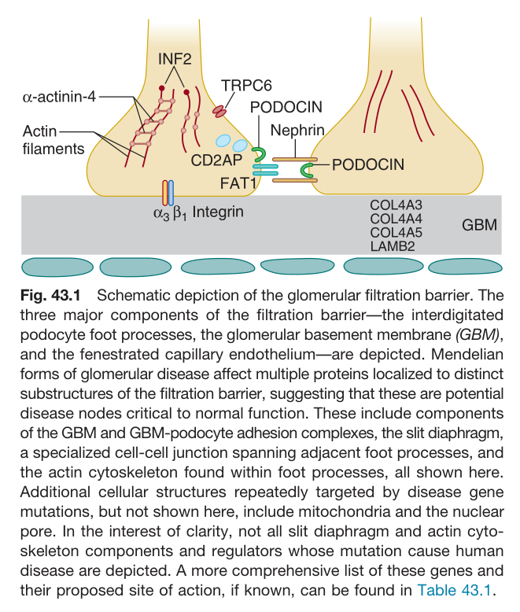
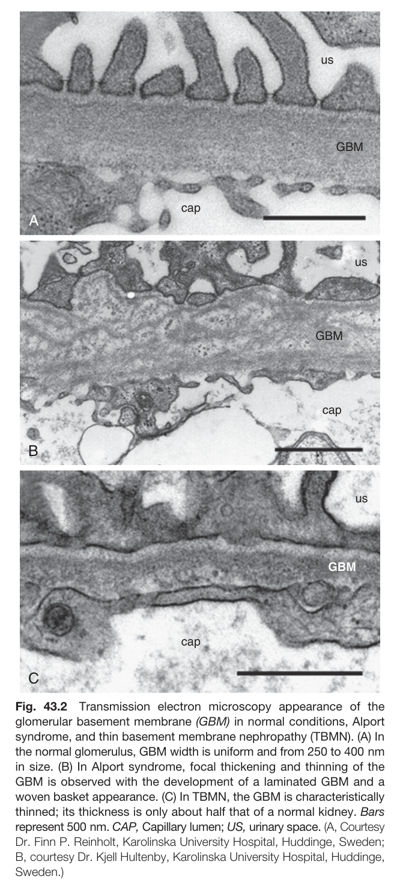
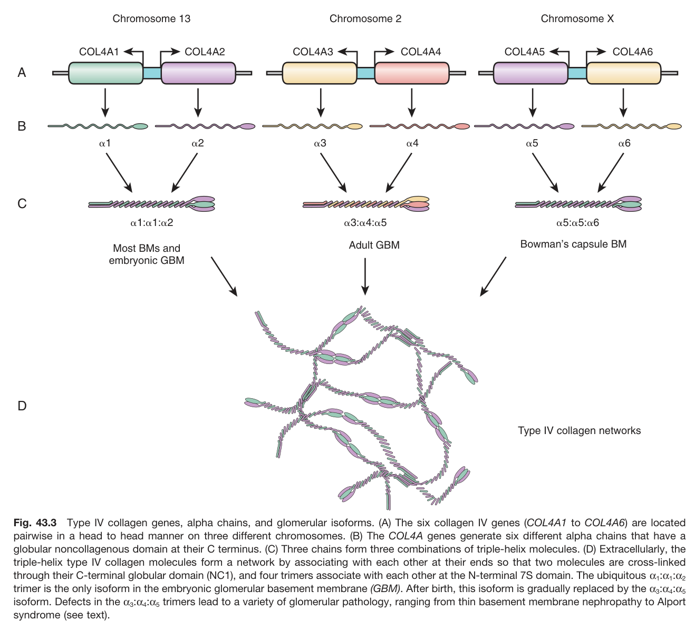
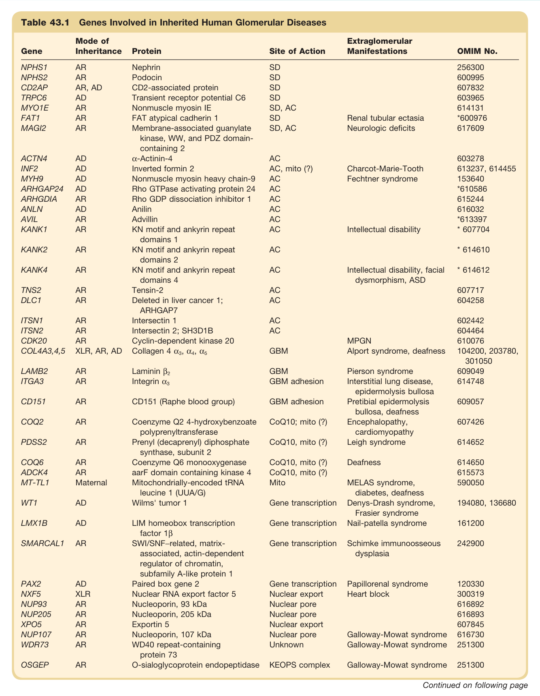
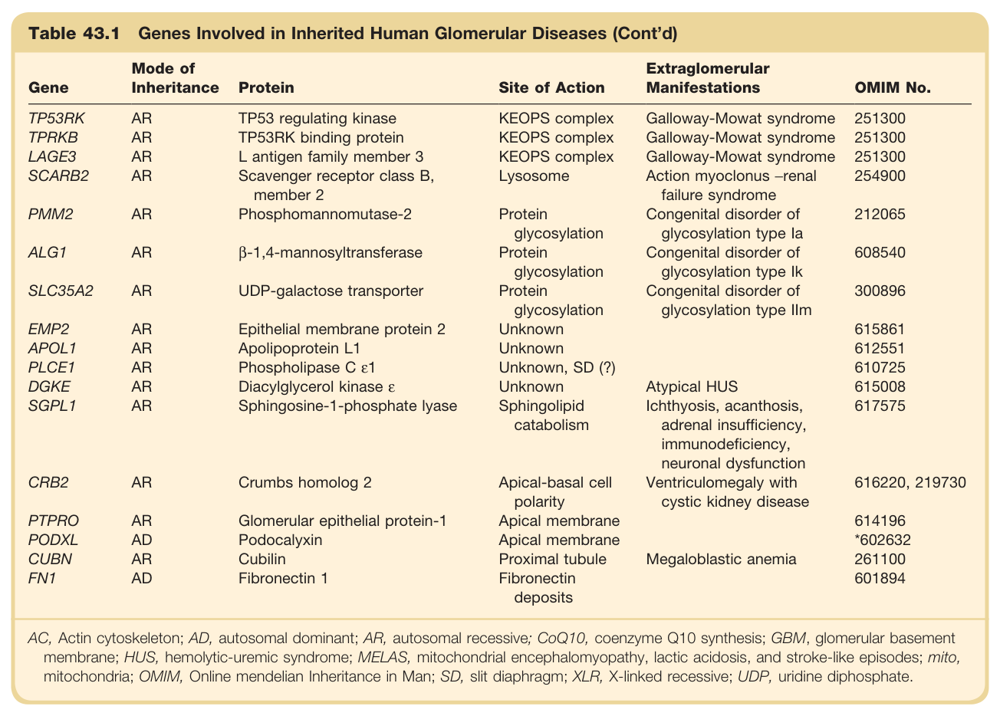

# 43. Inherited Disorders of the Glomerulus - Figures and Tables Index

This document lists all figures and tables extracted from `43. Inherited Disorders of the Glomerulus.pdf`.

## Table of Contents
- [Figures](#figures)
- [Tables](#tables)

---

## Figures

### Fig_43_1



Fig. 43.1 Schematic depiction of the glomerular filtration barrier. The three major components of the filtration barrier-the interdigitated podocyte foot processes, the glomerular basement membrane (GBM), and the fenestrated capillary endothelium-are depicted. Mendelian forms of glomerular disease affect multiple proteins localized to distinct substructures of the filtration barrier, suggesting that these are potential disease nodes critical to normal function. These include components of the GBM and GBM-podocyte adhesion complexes, the slit diaphragm, a specialized cell-cell junction spanning adjacent foot processes, and the actin cytoskeleton found within foot processes, all shown here. Additional cellular structures repeatedly targeted by disease gene mutations, but not shown here, include mitochondria and the nuclear pore. In the interest of clarity, not all slit diaphragm and actin cytoskeleton components and regulators whose mutation cause human disease are depicted. A more comprehensive list of these genes and their proposed site of action, if known, can be found in Table 43.1.

---

### Fig_43_2



Fig. 43.2 Transmission electron microscopy appearance of the glomerular basement membrane (GBM) in normal conditions, Alport syndrome, and thin basement membrane nephropathy (TBMN). (A) In the normal glomerulus, GBM width is uniform and from 250 to 400 nm in size. (B) In Alport syndrome, focal thickening and thinning of the GBM is observed with the development of a laminated GBM and a woven basket appearance. (C) In TBMN, the GBM is characteristically thinned; its thickness is only about half that of a normal kidney. Bars represent 500 nm. CAP, Capillary lumen; US, urinary space. (A, Courtesy Dr. Finn P. Reinholt, Karolinska University Hospital, Huddinge, Sweden; B, courtesy Dr. Kjell Hultenby, Karolinska University Hospital, Huddinge, Sweden.)

---

### Fig_43_3



Fig. 43.3 Type IV collagen genes, alpha chains, and glomerular isoforms. (A) The six collagen IV genes (COL4A1 to COL4A6) are located pairwise in a head to head manner on three different chromosomes. (B) The COL4A genes generate six different alpha chains that have a globular noncollagenous domain at their C terminus. (C) Three chains form three combinations of triple-helix molecules. (D) Extracellularly, the triple-helix type IV collagen molecules form a network by associating with each other at their ends so that two molecules are cross-linked through their C-terminal globular domain (NC1), and four trimers associate with each other at the N-terminal 7S domain. The ubiquitous α₁: 1:02 trimer is the only isoform in the embryonic glomerular basement membrane (GBM). After birth, this isoform is gradually replaced by the 03:04:05 isoform. Defects in the 23:04:05 trimers lead to a variety of glomerular pathology, ranging from thin basement membrane nephropathy to Alport syndrome (see text).

---

## Tables

### Table_43_1

#### Table Images (2 Parts)

- **Part 1 (Page 2)**:
  

- **Part 2 (Page 3)**:
  

#### Table Data (CSV: [Table_43_1.csv](Table_43_1.csv))

```markdown
| Table Text (OCR) |
| :--- |
| Table 43.1 Genes Involved in Inherited Human Glomerular Diseases Gene  Mode of Inheritance  Protein  Site of Action  Extraglomerular Manifestations  OMIM No.    NPHS1  AR  Nephrin  SD    256300    NPHS2  AR  Podocin  SD    600995    CD2AP  AR, AD  CD2-associated protein  SD    607832    TRPC6  AD  Transient receptor potential C6  SD    603965    MYO1E  AR  Nonmuscle myosin IE  SD, AC    614131    FAT1  AR  FAT atypical cadherin 1  SD  Renal tubular ectasia  *600976    MAGI2  AR  Membrane-associated guanylate kinase, WW, and PDZ domain-containing 2  SD, AC  Neurologic deficits  617609    ACTN4  AD  α-Actinin-4  AC    603278    INF2  AD  Inverted formin 2  AC, mito (?)  Charcot-Marie-Tooth  613237, 614455    MYH9  AD  Nonmuscle myosin heavy chain-9  AC  Fechtner syndrome  153640    ARHGAP24  AD  Rho GTPase activating protein 24  AC    *610586    ARHGDIA  AR  Rho GDP dissociation inhibitor 1  AC    615244    ANLN  AD  Anilin  AC    616032    AVIL  AR  Advillin  AC    *613397    KANK1  AR  KN motif and ankyrin repeat domains 1  AC  Intellectual disability  * 607704    KANK2  AR  KN motif and ankyrin repeat domains 2  AC    * 614610    KANK4  AR  KN motif and ankyrin repeat domains 4  AC  Intellectual disability, facial dysmorphism, ASD  * 614612    TNS2  AR  Tensin-2  AC    607717    DLC1  AR  Deleted in liver cancer 1; ARHGAP7  AC    604258    ITSN1  AR  Intersectin 1  AC    602442    ITSN2  AR  Intersectin 2; SH3D1B  AC    604464    CDK20  AR  Cyclin-dependent kinase 20    MPGN  610076    COL4A3,4,5  XLR, AR, AD  Collagen 4 α3, α4, α5  GBM  Alport syndrome, deafness  104200, 203780, 301050    LAMB2  AR  Laminin β2  GBM  Pierson syndrome  609049    ITGA3  AR  Integrin α3  GBM adhesion  Interstitial lung disease, epidermolysis bullosa  614748    CD151  AR  CD151 (Raphe blood group)  GBM adhesion  Pretibial epidermolysis bullosa, deafness  609057    COQ2  AR  Coenzyme Q2 4-hydroxybenzoate polyprenyltransferase  CoQ10; mito (?)  Encephalopathy, cardiomyopathy  607426    PDSS2  AR  Prenyl (decaprenyl) diphosphate synthase, subunit 2  CoQ10, mito (?)  Leigh syndrome  614652    COQ6  AR  Coenzyme Q6 monooxygenase  CoQ10, mito (?)  Deafness  614650    ADCK4  AR  aarF domain containing kinase 4  CoQ10, mito (?)    615573    MT-TL1  Maternal  Mitochondrially-encoded tRNA leucine 1 (UUA/G)  Mito  MELAS syndrome, diabetes, deafness  590050    WT1  AD  Wilms' tumor 1  Gene transcription  Denys-Drash syndrome, Frasier syndrome  194080, 136680    LMX1B  AD  LIM homeobox transcription factor 1β  Gene transcription  Nail-patella syndrome  161200    SMARCAL1  AR  SWI/SNF-related, matrix-associated, actin-dependent regulator of chromatin, subfamily A-like protein 1  Gene transcription  Schimke immunoosseous dysplasia  242900    PAX2  AD  Paired box gene 2  Gene transcription  Papillorenal syndrome  120330    NXF5  XLR  Nuclear RNA export factor 5  Nuclear export  Heart block  300319    NUP93  AR  Nucleoporin, 93 kDa  Nuclear pore    616892    NUP205  AR  Nucleoporin, 205 kDa  Nuclear pore    616893    XPO5  AR  Exportin 5  Nuclear export    607845    NUP107  AR  Nucleoporin, 107 kDa  Nuclear pore  Galloway-Mowat syndrome  616730    WDR73  AR  WD40 repeat-containing protein 73  Unknown  Galloway-Mowat syndrome  251300    OSGEP  AR  O-sialoglycoprotein endopeptidase  KEOPS complex  Galloway-Mowat syndrome  251300 |
```

Table 43.1 Genes Involved in Inherited Human Glomerular Diseases | Gene | Mode of Inheritance | Protein | Site of Action | Extraglomerular Manifestations | OMIM No. | | :--- | :--- | :--- | :--- | :--- | :--- | | NPHS1 | AR | Nephrin | SD | | 256300 | | NPHS2 | AR | Podocin | SD | | 600995 | | CD2AP | AR, AD | CD2-associated protein | SD | | 607832 | | TRPC6 | AD | Transient receptor potential C6 | SD | | 603965 | | MYO1E | AR | Nonmuscle myosin IE | SD, AC | | 614131 | | FAT1 | AR | FAT atypical cadherin 1 | SD | Renal tubular ectasia | *600976 | | MAGI2 | AR | Membrane-associated guanylate kinase, WW, and PDZ domain-containing 2 | SD, AC | Neurologic deficits | 617609 | | ACTN4 | AD | α-Actinin-4 | AC | | 603278 | | INF2 | AD | Inverted formin 2 | AC, mito (?) | Charcot-Marie-Tooth | 613237, 614455 | | MYH9 | AD | Nonmuscle myosin heavy chain-9 | AC | Fechtner syndrome | 153640 | | ARHGAP24 | AD | Rho GTPase activating protein 24 | AC | | *610586 | | ARHGDIA | AR | Rho GDP dissociation inhibitor 1 | AC | | 615244 | | ANLN | AD | Anilin | AC | | 616032 | | AVIL | AR | Advillin | AC | | *613397 | | KANK1 | AR | KN motif and ankyrin repeat domains 1 | AC | Intellectual disability | * 607704 | | KANK2 | AR | KN motif and ankyrin repeat domains 2 | AC | | * 614610 | | KANK4 | AR | KN motif and ankyrin repeat domains 4 | AC | Intellectual disability, facial dysmorphism, ASD | * 614612 | | TNS2 | AR | Tensin-2 | AC | | 607717 | | DLC1 | AR | Deleted in liver cancer 1; ARHGAP7 | AC | | 604258 | | ITSN1 | AR | Intersectin 1 | AC | | 602442 | | ITSN2 | AR | Intersectin 2; SH3D1B | AC | | 604464 | | CDK20 | AR | Cyclin-dependent kinase 20 | | MPGN | 610076 | | COL4A3,4,5 | XLR, AR, AD | Collagen 4 α3, α4, α5 | GBM | Alport syndrome, deafness | 104200, 203780, 301050 | | LAMB2 | AR | Laminin β2 | GBM | Pierson syndrome | 609049 | | ITGA3 | AR | Integrin α3 | GBM adhesion | Interstitial lung disease, epidermolysis bullosa | 614748 | | CD151 | AR | CD151 (Raphe blood group) | GBM adhesion | Pretibial epidermolysis bullosa, deafness | 609057 | | COQ2 | AR | Coenzyme Q2 4-hydroxybenzoate polyprenyltransferase | CoQ10; mito (?) | Encephalopathy, cardiomyopathy | 607426 | | PDSS2 | AR | Prenyl (decaprenyl) diphosphate synthase, subunit 2 | CoQ10, mito (?) | Leigh syndrome | 614652 | | COQ6 | AR | Coenzyme Q6 monooxygenase | CoQ10, mito (?) | Deafness | 614650 | | ADCK4 | AR | aarF domain containing kinase 4 | CoQ10, mito (?) | | 615573 | | MT-TL1 | Maternal | Mitochondrially-encoded tRNA leucine 1 (UUA/G) | Mito | MELAS syndrome, diabetes, deafness | 590050 | | WT1 | AD | Wilms' tumor 1 | Gene transcription | Denys-Drash syndrome, Frasier syndrome | 194080, 136680 | | LMX1B | AD | LIM homeobox transcription factor 1β | Gene transcription | Nail-patella syndrome | 161200 | | SMARCAL1 | AR | SWI/SNF-related, matrix-associated, actin-dependent regulator of chromatin, subfamily A-like protein 1 | Gene transcription | Schimke immunoosseous dysplasia | 242900 | | PAX2 | AD | Paired box gene 2 | Gene transcription | Papillorenal syndrome | 120330 | | NXF5 | XLR | Nuclear RNA export factor 5 | Nuclear export | Heart block | 300319 | | NUP93 | AR | Nucleoporin, 93 kDa | Nuclear pore | | 616892 | | NUP205 | AR | Nucleoporin, 205 kDa | Nuclear pore | | 616893 | | XPO5 | AR | Exportin 5 | Nuclear export | | 607845 | | NUP107 | AR | Nucleoporin, 107 kDa | Nuclear pore | Galloway-Mowat syndrome | 616730 | | WDR73 | AR | WD40 repeat-containing protein 73 | Unknown | Galloway-Mowat syndrome | 251300 | | OSGEP | AR | O-sialoglycoprotein endopeptidase | KEOPS complex | Galloway-Mowat syndrome | 251300 | | TP53RK | AR | TP53 regulating kinase | KEOPS complex | Galloway-Mowat syndrome | 251300 | | TPRKB | AR | TP53RK binding protein | KEOPS complex | Galloway-Mowat syndrome | 251300 | | LAGE3 | AR | L antigen family member 3 | KEOPS complex | Galloway-Mowat syndrome | 251300 | | SCARB2 | AR | Scavenger receptor class B, member 2 | Lysosome | Action myoclonus -renal failure syndrome | 254900 | | PMM2 | AR | Phosphomannomutase-2 | Protein glycosylation | Congenital disorder of glycosylation type la | 212065 | | ALG1 | AR | β-1,4-mannosyltransferase | Protein glycosylation | Congenital disorder of glycosylation type Ik | 608540 | | SLC35A2 | AR | UDP-galactose transporter | Protein glycosylation | Congenital disorder of glycosylation type IIm | 300896 | | EMP2 | AR | Epithelial membrane protein 2 | Unknown | | 615861 | | APOL1 | AR | Apolipoprotein L1 | Unknown | | 612551 | | PLCE1 | AR | Phospholipase C ε1 | Unknown, SD (?) | | 610725 | | DGKE | AR | Diacylglycerol kinase ε | Unknown | Atypical HUS | 615008 | | SGPL1 | AR | Sphingosine-1-phosphate lyase | Sphingolipid catabolism | Ichthyosis, acanthosis, adrenal insufficiency, immunodeficiency, neuronal dysfunction | 617575 | | CRB2 | AR | Crumbs homolog 2 | Apical-basal cell polarity | Ventriculomegaly with cystic kidney disease | 616220, 219730 | | PTPRO | AR | Glomerular epithelial protein-1 | Apical membrane | | 614196 | | PODXL | AD | Podocalyxin | Apical membrane | | *602632 | | CUBN | AR | Cubilin | Proximal tubule | Megaloblastic anemia | 261100 | | FN1 | AD | Fibronectin 1 | Fibronectin deposits | | 601894 | AC, Actin cytoskeleton; AD, autosomal dominant; AR, autosomal recessive; CoQ10, coenzyme Q10 synthesis; GBM, glomerular basement membrane; HUS, hemolytic-uremic syndrome; MELAS, mitochondrial encephalomyopathy, lactic acidosis, and stroke-like episodes; mito, mitochondria; OMIM, Online mendelian Inheritance in Man; SD, slit diaphragm; XLR, X-linked recessive; UDP, uridine diphosphate.

---
