# 44. Inherited Disorders of the Renal Tubule - Figures and Tables Index

This document lists all figures, tables and boxes extracted from `44. Inherited Disorders of the Renal Tubule.pdf`.

## Table of Contents
- [Figures](#figures)
- [Tables](#tables)
- [Boxes](#boxes)

---

## Figures

### Fig_44_1

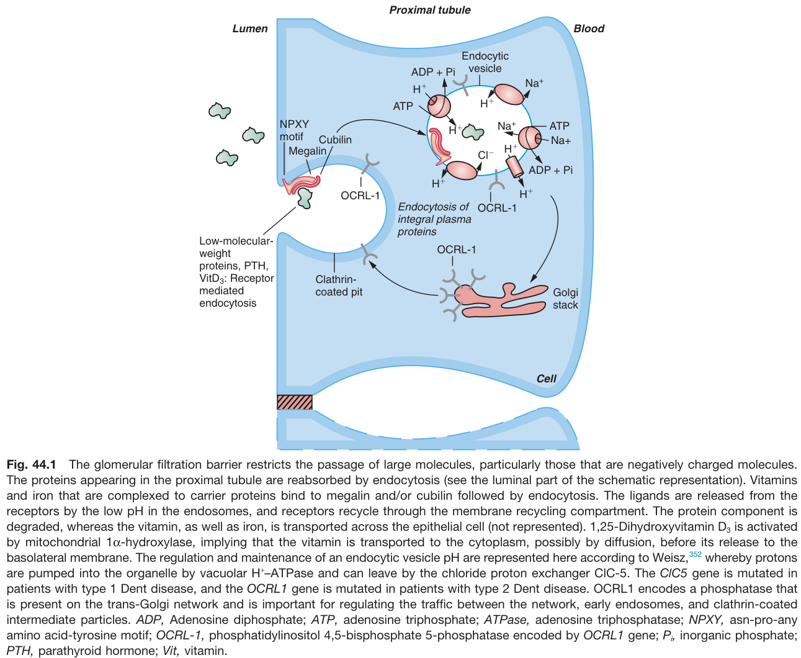

Fig. 44.1 The glomerular filtration barrier restricts the passage of large molecules, particularly those that are negatively charged molecules. The proteins appearing in the proximal tubule are reabsorbed by endocytosis (see the luminal part of the schematic representation). Vitamins and iron that are complexed to carrier proteins bind to megalin and/or cubilin followed by endocytosis. The ligands are released from the receptors by the low pH in the endosomes, and receptors recycle through the membrane recycling compartment. The protein component is degraded, whereas the vitamin, as well as iron, is transported across the epithelial cell (not represented). 1,25-Dihydroxyvitamin D3 is activated by mitochondrial 1a-hydroxylase, implying that the vitamin is transported to the cytoplasm, possibly by diffusion, before its release to the basolateral membrane. The regulation and maintenance of an endocytic vesicle pH are represented here according to Weisz, whereby protons are pumped into the organelle by vacuolar H+-ATPase and can leave by the chloride proton exchanger CIC-5. The C/C5 gene is mutated in patients with type 1 Dent disease, and the OCRL1 gene is mutated in patients with type 2 Dent disease. OCRL1 encodes a phosphatase that is present on the trans-Golgi network and is important for regulating the traffic between the network, early endosomes, and clathrin-coated intermediate particles. ADP, Adenosine diphosphate; ATP, adenosine triphosphate; ATPase, adenosine triphosphatase; NPXY, asn-pro-any amino acid-tyrosine motif; OCRL-1, phosphatidylinositol 4,5-bisphosphate 5-phosphatase encoded by OCRL1 gene; P₁, inorganic phosphate; PTH, parathyroid hormone; Vit, vitamin.

---

### Fig_44_2

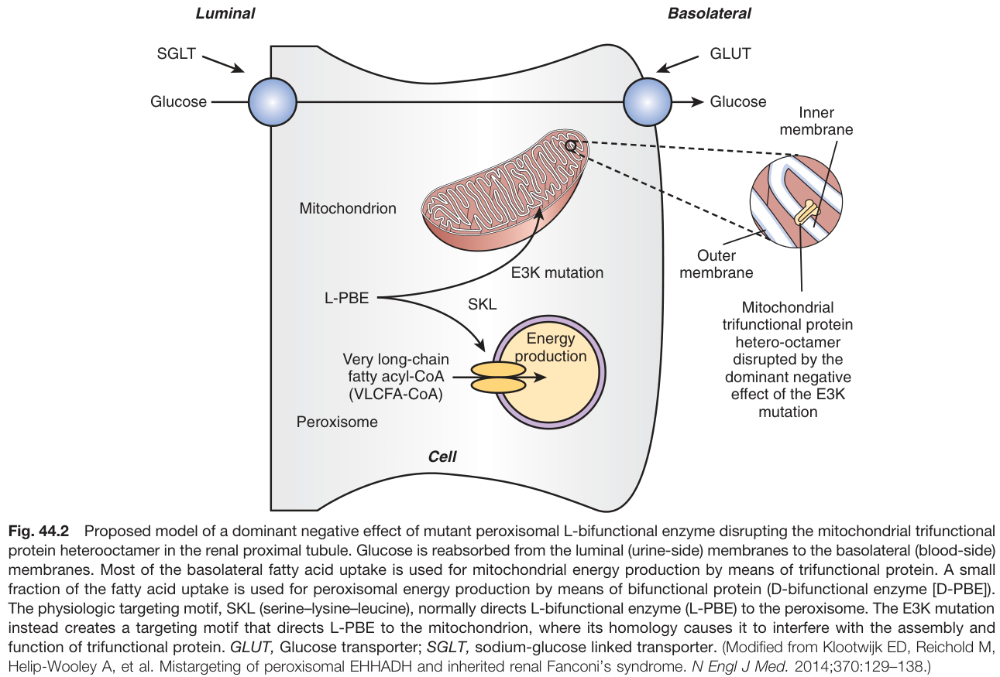

Fig. 44.2 Proposed model of a dominant negative effect of mutant peroxisomal L-bifunctional enzyme disrupting the mitochondrial trifunctional protein heterooctamer in the renal proximal tubule. Glucose is reabsorbed from the luminal (urine-side) membranes to the basolateral (blood-side) membranes. Most of the basolateral fatty acid uptake is used for mitochondrial energy production by means of trifunctional protein. A small fraction of the fatty acid uptake is used for peroxisomal energy production by means of bifunctional protein (D-bifunctional enzyme [D-PBE]). The physiologic targeting motif, SKL (serine-lysine-leucine), normally directs L-bifunctional enzyme (L-PBE) to the peroxisome. The E3K mutation instead creates a targeting motif that directs L-PBE to the mitochondrion, where its homology causes it to interfere with the assembly and function of trifunctional protein. GLUT, Glucose transporter; SGLT, sodium-glucose linked transporter. (Modified from Klootwijk ED, Reichold M, Helip-Wooley A, et al. Mistargeting of peroxisomal EHHADH and inherited renal Fanconi's syndrome. N Engl J Med. 2014;370:129-138.)

---

### Fig_44_3

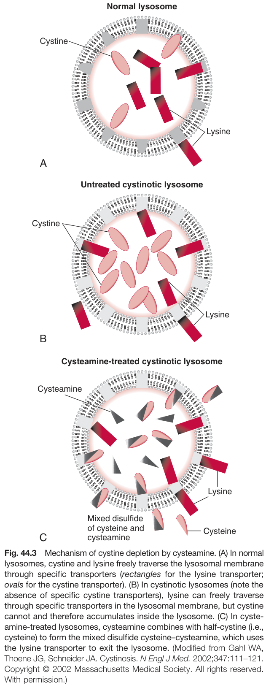

Fig. 44.3 Mechanism of cystine depletion by cysteamine. (A) In normal lysosomes, cystine and lysine freely traverse the lysosomal membrane through specific transporters (rectangles for the lysine transporter; ovals for the cystine transporter). (B) In cystinotic lysosomes (note the absence of specific cystine transporters), lysine can freely traverse through specific transporters in the lysosomal membrane, but cystine cannot and therefore accumulates inside the lysosome. (C) In cysteamine-treated lysosomes, cysteamine combines with half-cystine (i.e., cysteine) to form the mixed disulfide cysteine-cysteamine, which uses the lysine transporter to exit the lysosome. (Modified from Gahl WA, Thoene JG, Schneider JA. Cystinosis. N Engl J Med. 2002;347:111-121. Copyright © 2002 Massachusetts Medical Society. All rights reserved. With permission.)

---

### Fig_44_4

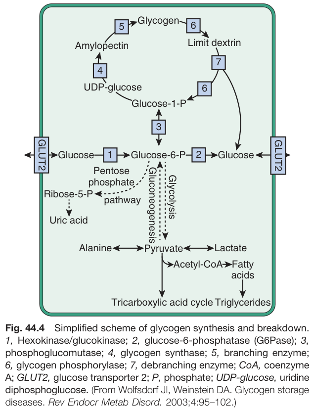

Fig. 44.4 Simplified scheme of glycogen synthesis and breakdown. 1, Hexokinase/glucokinase; 2, glucose-6-phosphatase (G6Pase); 3, phosphoglucomutase; 4, glycogen synthase; 5, branching enzyme; 6, glycogen phosphorylase; 7, debranching enzyme; CoA, coenzyme A; GLUT2, glucose transporter 2; P, phosphate; UDP-glucose, uridine diphosphoglucose. (From Wolfsdorf JI, Weinstein DA. Glycogen storage diseases. Rev Endocr Metab Disord. 2003;4:95-102.)

---

### Fig_44_5

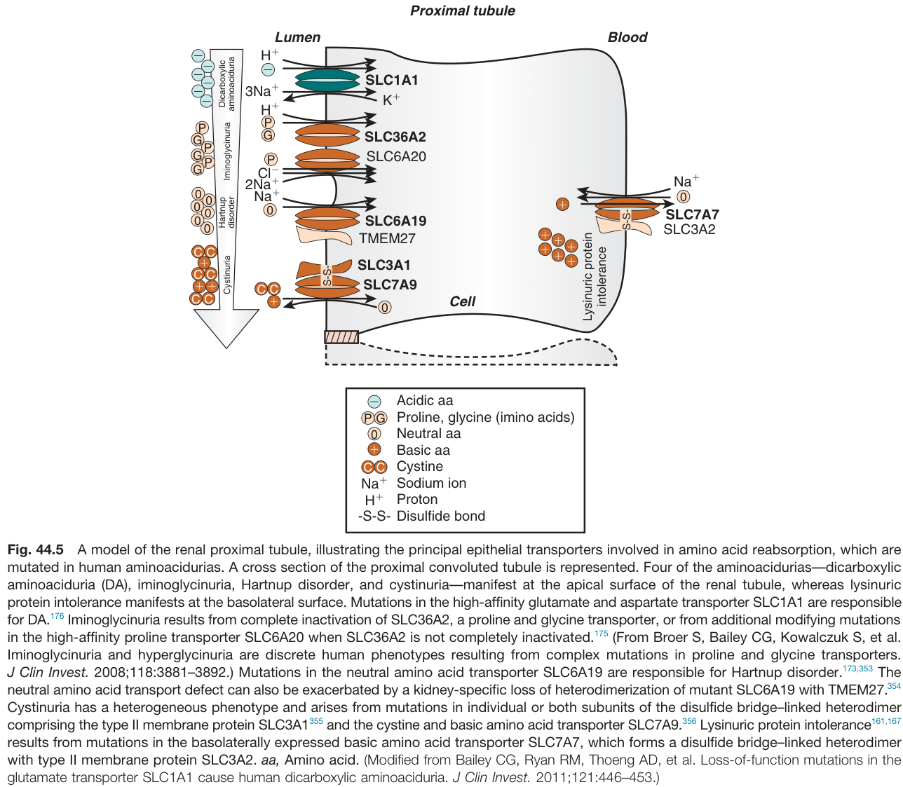

Fig. 44.5 A model of the renal proximal tubule, illustrating the principal epithelial transporters involved in amino acid reabsorption, which are mutated in human aminoacidurias. A cross section of the proximal convoluted tubule is represented. Four of the aminoacidurias—dicarboxylic aminoaciduria (DA), iminoglycinuria, Hartnup disorder, and cystinuria—manifest at the apical surface of the renal tubule, whereas lysinuric protein intolerance manifests at the basolateral surface. Mutations in the high-affinity glutamate and aspartate transporter SLC1A1 are responsible for DA. Iminoglycinuria results from complete inactivation of SLC36A2, a proline and glycine transporter, or from additional modifying mutations in the high-affinity proline transporter SLC6A20 when SLC36A2 is not completely inactivated. (From Broer S, Bailey CG, Kowalczuk S, et al. Iminoglycinuria and hyperglycinuria are discrete human phenotypes resulting from complex mutations in proline and glycine transporters. J Clin Invest. 2008;118:3881-3892.) Mutations in the neutral amino acid transporter SLC6A19 are responsible for Hartnup disorder. The neutral amino acid transport defect can also be exacerbated by a kidney-specific loss of heterodimerization of mutant SLC6A19 with TMEM27. Cystinuria has a heterogeneous phenotype and arises from mutations in individual or both subunits of the disulfide bridge-linked heterodimer comprising the type II membrane protein SLC3A1 and the cystine and basic amino acid transporter SLC7A9. Lysinuric protein intolerance results from mutations in the basolaterally expressed basic amino acid transporter SLC7A7, which forms a disulfide bridge-linked heterodimer with type II membrane protein SLC3A2. aa, Amino acid. (Modified from Bailey CG, Ryan RM, Thoeng AD, et al. Loss-of-function mutations in the glutamate transporter SLC1A1 cause human dicarboxylic aminoaciduria. J Clin Invest. 2011;121:446-453.)

---

### Fig_44_6

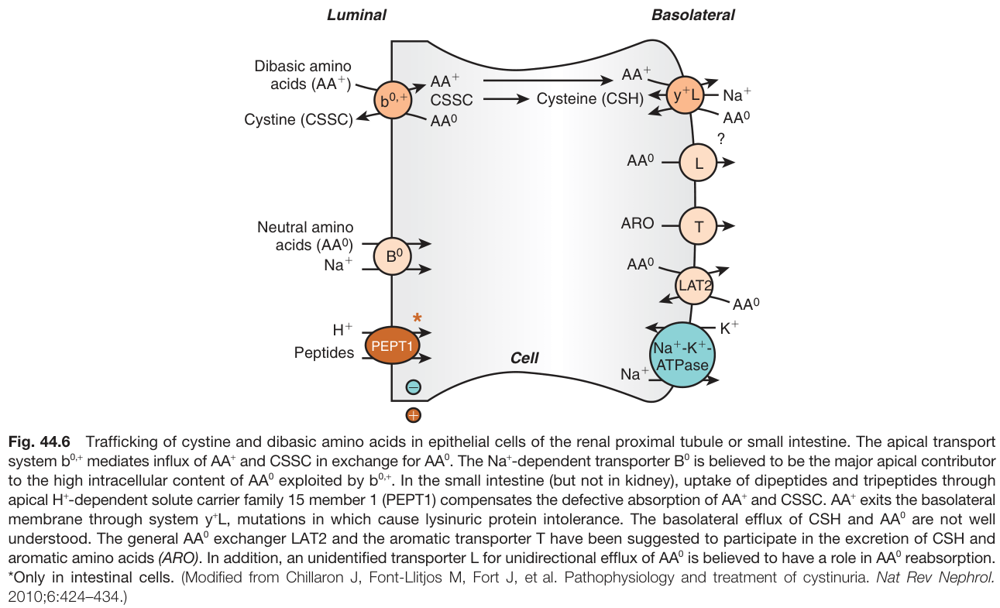

Fig. 44.6 Trafficking of cystine and dibasic amino acids in epithelial cells of the renal proximal tubule or small intestine. The apical transport system bº+ mediates influx of AA+ and CSSC in exchange for AA°. The Nat-dependent transporter Bº is believed to be the major apical contributor to the high intracellular content of AAº exploited by bº+. In the small intestine (but not in kidney), uptake of dipeptides and tripeptides through apical H+-dependent solute carrier family 15 member 1 (PEPT1) compensates the defective absorption of AA+ and CSSC. AA+ exits the basolateral membrane through system y+L, mutations in which cause lysinuric protein intolerance. The basolateral efflux of CSH and AAº are not well understood. The general AAº exchanger LAT2 and the aromatic transporter T have been suggested to participate in the excretion of CSH and aromatic amino acids (ARO). In addition, an unidentified transporter L for unidirectional efflux of AAº is believed to have a role in AAº reabsorption. *Only in intestinal cells. (Modified from Chillaron J, Font-Llitjos M, Fort J, et al. Pathophysiology and treatment of cystinuria. Nat Rev Nephrol. 2010;6:424-434.)

---

### Fig_44_7

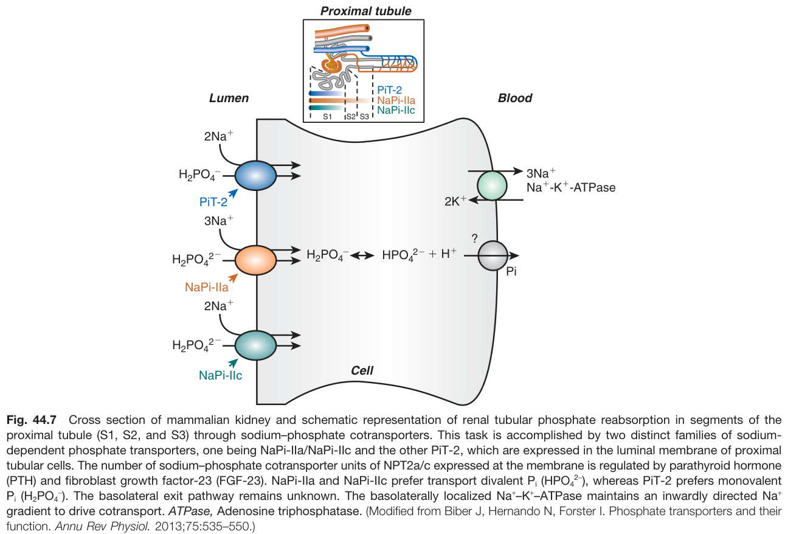

Fig. 44.7 Cross section of mammalian kidney and schematic representation of renal tubular phosphate reabsorption in segments of the proximal tubule (S1, S2, and S3) through sodium-phosphate cotransporters. This task is accomplished by two distinct families of sodium-dependent phosphate transporters, one being NaPi-lla/NaPi-Ilc and the other PiT-2, which are expressed in the luminal membrane of proximal tubular cells. The number of sodium-phosphate cotransporter units of NPT2a/c expressed at the membrane is regulated by parathyroid hormone (PTH) and fibroblast growth factor-23 (FGF-23). NaPi-lla and NaPi-llc prefer transport divalent P₁ (HPO₄²), whereas PiT-2 prefers monovalent P₁ (H₂PO₄). The basolateral exit pathway remains unknown. The basolaterally localized Nat-K+-ATPase maintains an inwardly directed Nat gradient to drive cotransport. ATPase, Adenosine triphosphatase. (Modified from Biber J, Hernando N, Forster I. Phosphate transporters and their function. Annu Rev Physiol. 2013;75:535-550.)

---

### Fig_44_8

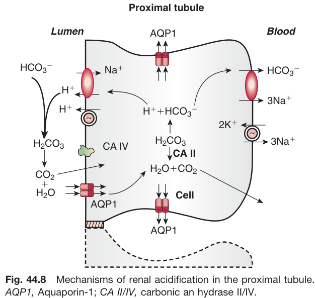

Fig. 44.8 Mechanisms of renal acidification in the proximal tubule. AQP1, Aquaporin-1; CA II/IV, carbonic an hydrase II/IV.

---

### Fig_44_9

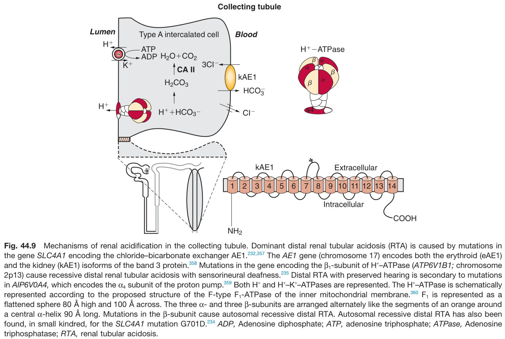

Fig. 44.9 Mechanisms of renal acidification in the collecting tubule. Dominant distal renal tubular acidosis (RTA) is caused by mutations in the gene SLC4A1 encoding the chloride-bicarbonate exchanger AE1. The AE1 gene (chromosome 17) encodes both the erythroid (eAE1) and the kidney (kAE1) isoforms of the band 3 protein. Mutations in the gene encoding the β₁-subunit of H+-ATPase (ATP6V1B1; chromosome 2p13) cause recessive distal renal tubular acidosis with sensorineural deafness. Distal RTA with preserved hearing is secondary to mutations in AIP6V0A4, which encodes the 24 subunit of the proton pump. Both H+ and H+-K+-ATPases are represented. The H+-ATPase is schematically represented according to the proposed structure of the F-type F₁-ATPase of the inner mitochondrial membrane. F₁ is represented as a flattened sphere 80 Å high and 100 Å across. The three a- and three β-subunits are arranged alternately like the segments of an orange around a central a-helix 90 Å long. Mutations in the β-subunit cause autosomal recessive distal RTA. Autosomal recessive distal RTA has also been found, in small kindred, for the SLC4A1 mutation G701D. ADP, Adenosine diphosphate; ATP, adenosine triphosphate; ATPase, Adenosine triphosphatase; RTA, renal tubular acidosis.

---

### Fig_44_10

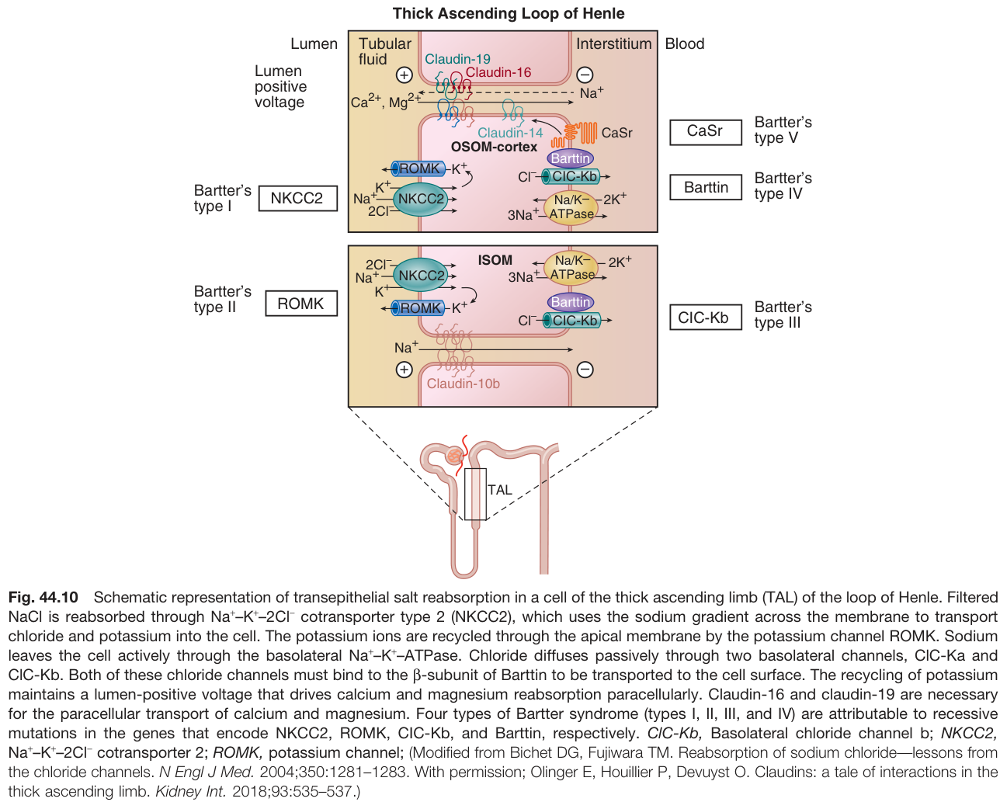

Fig. 44.10 Schematic representation of transepithelial salt reabsorption in a cell of the thick ascending limb (TAL) of the loop of Henle. Filtered NaCl is reabsorbed through Na+-K+-2Cl- cotransporter type 2 (NKCC2), which uses the sodium gradient across the membrane to transport chloride and potassium into the cell. The potassium ions are recycled through the apical membrane by the potassium channel ROMK. Sodium leaves the cell actively through the basolateral Na+-K+-ATPase. Chloride diffuses passively through two basolateral channels, CIC-Ka and CIC-Kb. Both of these chloride channels must bind to the β-subunit of Barttin to be transported to the cell surface. The recycling of potassium maintains a lumen-positive voltage that drives calcium and magnesium reabsorption paracellularly. Claudin-16 and claudin-19 are necessary for the paracellular transport of calcium and magnesium. Four types of Bartter syndrome (types I, II, III, and IV) are attributable to recessive mutations in the genes that encode NKCC2, ROMK, CIC-Kb, and Barttin, respectively. CIC-Kb, Basolateral chloride channel b; NKCC2, Na+-K+-2Cl- cotransporter 2; ROMK, potassium channel; (Modified from Bichet DG, Fujiwara TM. Reabsorption of sodium chloride-lessons from the chloride channels. N Engl J Med. 2004;350:1281-1283. With permission; Olinger E, Houillier P, Devuyst O. Claudins: a tale of interactions in the thick ascending limb. Kidney Int. 2018;93:535-537.)

---

### Fig_44_11

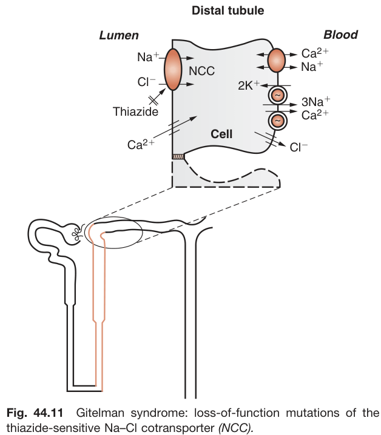

Fig. 44.11 Gitelman syndrome: loss-of-function mutations of the thiazide-sensitive Na-Cl cotransporter (NCC).

---

### Fig_44_12

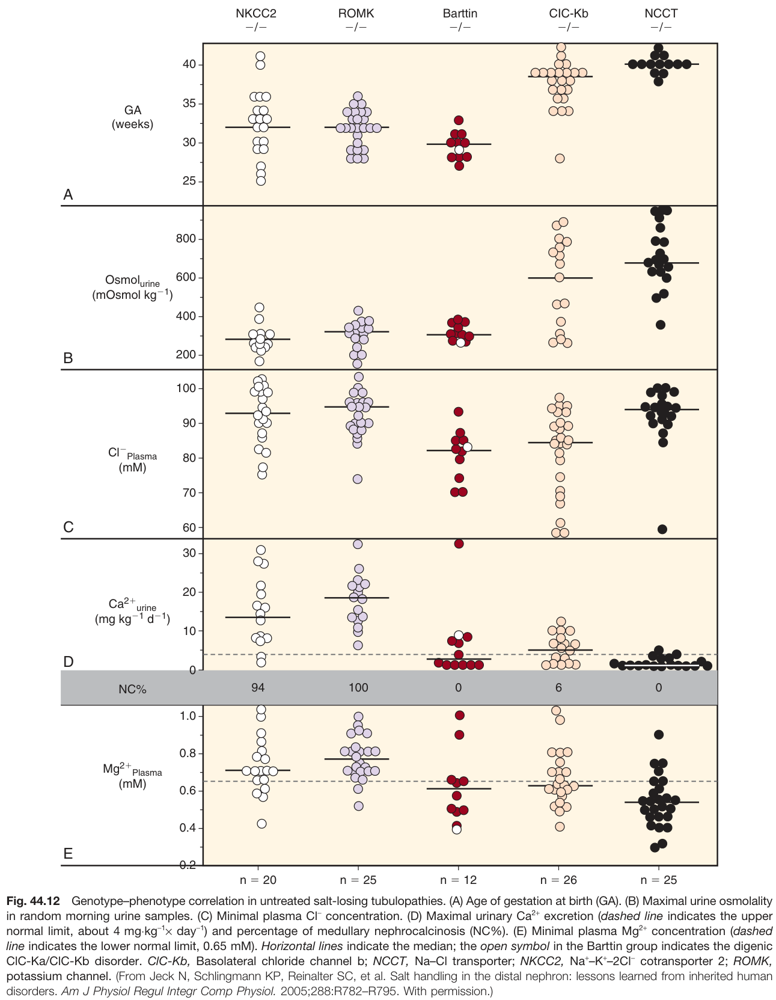

Fig. 44.12 Genotype-phenotype correlation in untreated salt-losing tubulopathies. (A) Age of gestation at birth (GA). (B) Maximal urine osmolality in random morning urine samples. (C) Minimal plasma Cl concentration. (D) Maximal urinary Ca²⁺ excretion (dashed line indicates the upper normal limit, about 4 mg·kg⁻¹x day⁻¹) and percentage of medullary nephrocalcinosis (NC%). (E) Minimal plasma Mg²⁺ concentration (dashed line indicates the lower normal limit, 0.65 mM). Horizontal lines indicate the median; the open symbol in the Barttin group indicates the digenic CIC-Ka/CIC-Kb disorder. CIC-Kb, Basolateral chloride channel b; NCCT, Na-Cl transporter; NKCC2, Na⁺-K⁺-2CI⁻ cotransporter 2; ROMK, potassium channel. (From Jeck N, Schlingmann KP, Reinalter SC, et al. Salt handling in the distal nephron: lessons learned from inherited human disorders. Am J Physiol Regul Integr Comp Physiol. 2005;288:R782-R795. With permission.)

---

### Fig_44_13

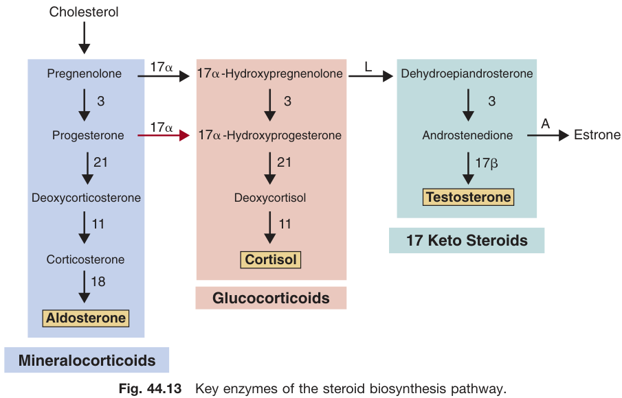

Fig. 44.13 Key enzymes of the steroid biosynthesis pathway.

---

### Fig_44_14

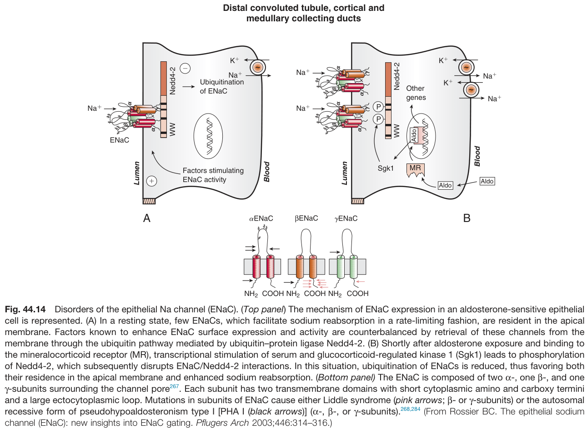

Fig. 44.14 Disorders of the epithelial Na channel (ENaC). (Top panel) The mechanism of ENaC expression in an aldosterone-sensitive epithelial cell is represented. (A) In a resting state, few ENaCs, which facilitate sodium reabsorption in a rate-limiting fashion, are resident in the apical membrane. Factors known to enhance ENaC surface expression and activity are counterbalanced by retrieval of these channels from the membrane through the ubiquitin pathway mediated by ubiquitin-protein ligase Nedd4-2. (B) Shortly after aldosterone exposure and binding to the mineralocorticoid receptor (MR), transcriptional stimulation of serum and glucocorticoid-regulated kinase 1 (Sgk1) leads to phosphorylation of Nedd4-2, which subsequently disrupts ENaC/Nedd4-2 interactions. In this situation, ubiquitination of ENaCs is reduced, thus favoring both their residence in the apical membrane and enhanced sodium reabsorption. (Bottom panel) The ENaC is composed of two a-, one β-, and one y-subunits surrounding the channel pore. Each subunit has two transmembrane domains with short cytoplasmic amino and carboxy termini and a large ectocytoplasmic loop. Mutations in subunits of ENaC cause either Liddle syndrome (pink arrows; β- or y-subunits) or the autosomal recessive form of pseudohypoaldosteronism type I [PHA I (black arrows)] (α-, β-, or γ-subunits). (From Rossier BC. The epithelial sodium channel (ENaC): new insights into ENaC gating. Pflugers Arch 2003;446:314-316.)

---

### Fig_44_15

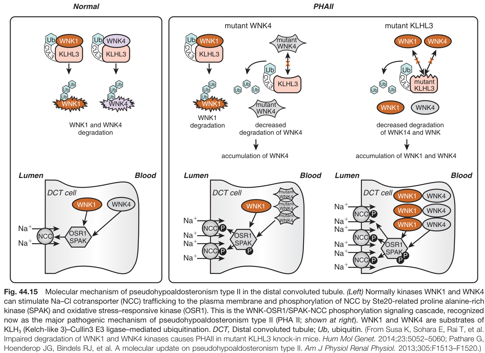

Fig. 44.15 Molecular mechanism of pseudohypoaldosteronism type II in the distal convoluted tubule. (Left) Normally kinases WNK1 and WNK4 can stimulate Na-Cl cotransporter (NCC) trafficking to the plasma membrane and phosphorylation of NCC by Ste20-related proline alanine-rich kinase (SPAK) and oxidative stress-responsive kinase (OSR1). This is the WNK-OSR1/SPAK-NCC phosphorylation signaling cascade, recognized now as the major pathogenic mechanism of pseudohypoaldosteronism type II (PHA II; shown at right). WNK1 and WNK4 are substrates of KLH3 (Kelch-like 3)-Cullin3 E3 ligase-mediated ubiquitination. DCT, Distal convoluted tubule; Ub, ubiquitin. (From Susa K, Sohara E, Rai T, et al. Impaired degradation of WNK1 and WNK4 kinases causes PHAll in mutant KLHL3 knock-in mice. Hum Mol Genet. 2014;23:5052-5060; Pathare G, Hoenderop JG, Bindels RJ, et al. A molecular update on pseudohypoaldosteronism type II. Am J Physiol Renal Physiol. 2013;305:F1513-F1520.)

---

### Fig_44_16

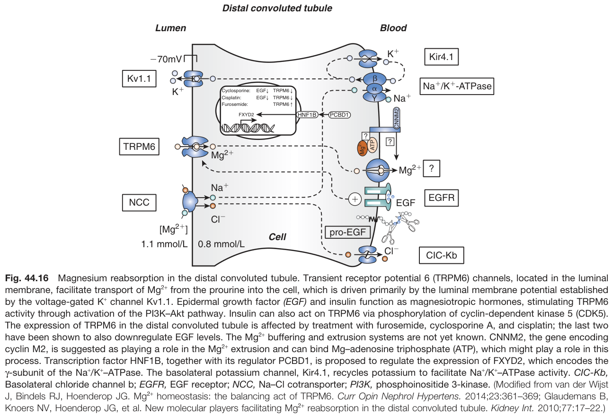

Fig. 44.16 Magnesium reabsorption in the distal convoluted tubule. Transient receptor potential 6 (TRPM6) channels, located in the luminal membrane, facilitate transport of Mg²⁺ from the prourine into the cell, which is driven primarily by the luminal membrane potential established by the voltage-gated K⁺ channel Kv1.1. Epidermal growth factor (EGF) and insulin function as magnesiotropic hormones, stimulating TRPM6 activity through activation of the PI3K-Akt pathway. Insulin can also act on TRPM6 via phosphorylation of cyclin-dependent kinase 5 (CDK5). The expression of TRPM6 in the distal convoluted tubule is affected by treatment with furosemide, cyclosporine A, and cisplatin; the last two have been shown to also downregulate EGF levels. The Mg²⁺ buffering and extrusion systems are not yet known. CNNM2, the gene encoding cyclin M2, is suggested as playing a role in the Mg²⁺ extrusion and can bind Mg-adenosine triphosphate (ATP), which might play a role in this process. Transcription factor HNF1B, together with its regulator PCBD1, is proposed to regulate the expression of FXYD2, which encodes the γ-subunit of the Na⁺/K⁺-ATPase. The basolateral potassium channel, Kir4.1, recycles potassium to facilitate Na⁺/K⁺-ATPase activity. CIC-Kb, Basolateral chloride channel b; EGFR, EGF receptor; NCC, Na-Cl cotransporter; PI3K, phosphoinositide 3-kinase. (Modified from van der Wijst J, Bindels RJ, Hoenderop JG. Mg²⁺ homeostasis: the balancing act of TRPM6. Curr Opin Nephrol Hypertens. 2014;23:361-369; Glaudemans B, Knoers NV, Hoenderop JG, et al. New molecular players facilitating Mg²⁺ reabsorption in the distal convoluted tubule. Kidney Int. 2010;77:17-22.)

---

### Fig_44_17

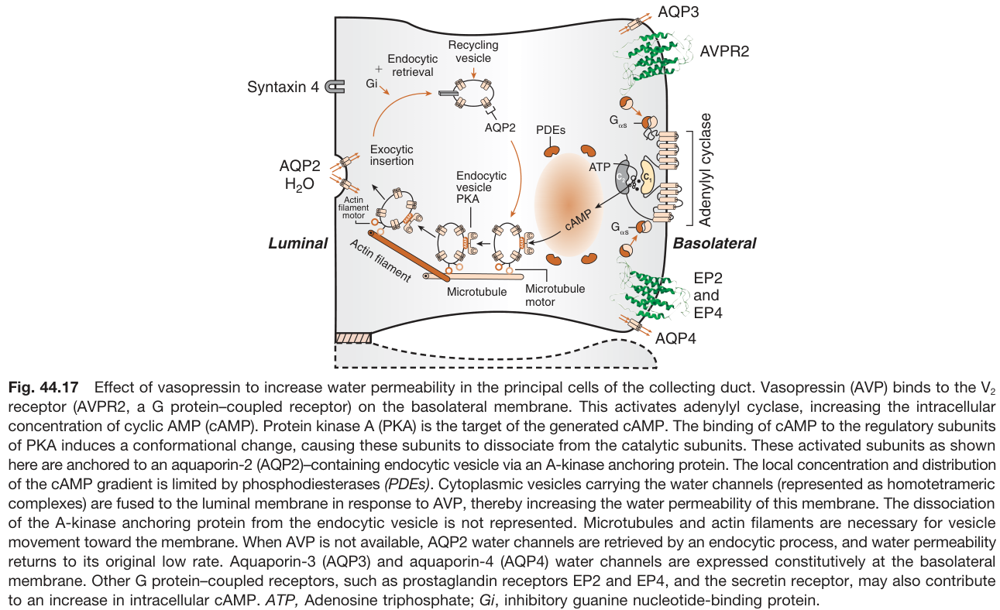

Fig. 44.17 Effect of vasopressin to increase water permeability in the principal cells of the collecting duct. Vasopressin (AVP) binds to the V₂ receptor (AVPR2, a G protein-coupled receptor) on the basolateral membrane. This activates adenylyl cyclase, increasing the intracellular concentration of cyclic AMP (CAMP). Protein kinase A (PKA) is the target of the generated cAMP. The binding of cAMP to the regulatory subunits of PKA induces a conformational change, causing these subunits to dissociate from the catalytic subunits. These activated subunits as shown here are anchored to an aquaporin-2 (AQP2)-containing endocytic vesicle via an A-kinase anchoring protein. The local concentration and distribution of the cAMP gradient is limited by phosphodiesterases (PDEs). Cytoplasmic vesicles carrying the water channels (represented as homotetrameric complexes) are fused to the luminal membrane in response to AVP, thereby increasing the water permeability of this membrane. The dissociation of the A-kinase anchoring protein from the endocytic vesicle is not represented. Microtubules and actin filaments are necessary for vesicle movement toward the membrane. When AVP is not available, AQP2 water channels are retrieved by an endocytic process, and water permeability returns to its original low rate. Aquaporin-3 (AQP3) and aquaporin-4 (AQP4) water channels are expressed constitutively at the basolateral membrane. Other G protein-coupled receptors, such as prostaglandin receptors EP2 and EP4, and the secretin receptor, may also contribute to an increase in intracellular cAMP. ATP, Adenosine triphosphate; Gi, inhibitory guanine nucleotide-binding protein.

---

### Fig_44_18

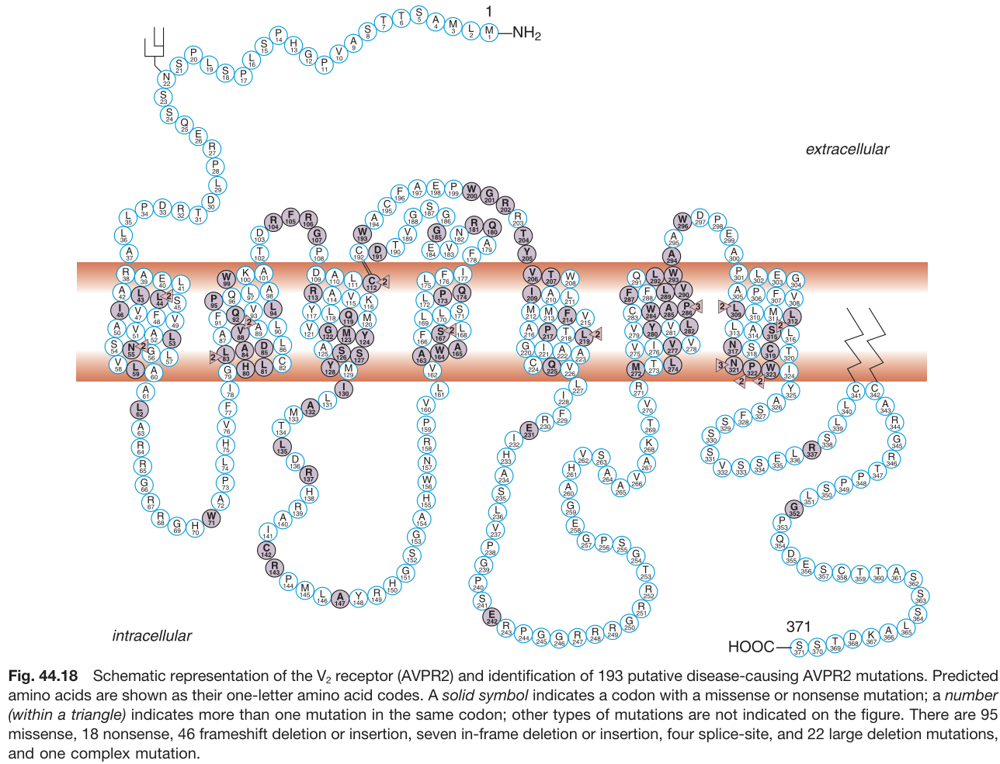

Fig. 44.18 Schematic representation of the V₂ receptor (AVPR2) and identification of 193 putative disease-causing AVPR2 mutations. Predicted amino acids are shown as their one-letter amino acid codes. A solid symbol indicates a codon with a missense or nonsense mutation; a number (within a triangle) indicates more than one mutation in the same codon; other types of mutations are not indicated on the figure. There are 95 missense, 18 nonsense, 46 frameshift deletion or insertion, seven in-frame deletion or insertion, four splice-site, and 22 large deletion mutations, and one complex mutation.

---

### Fig_44_19

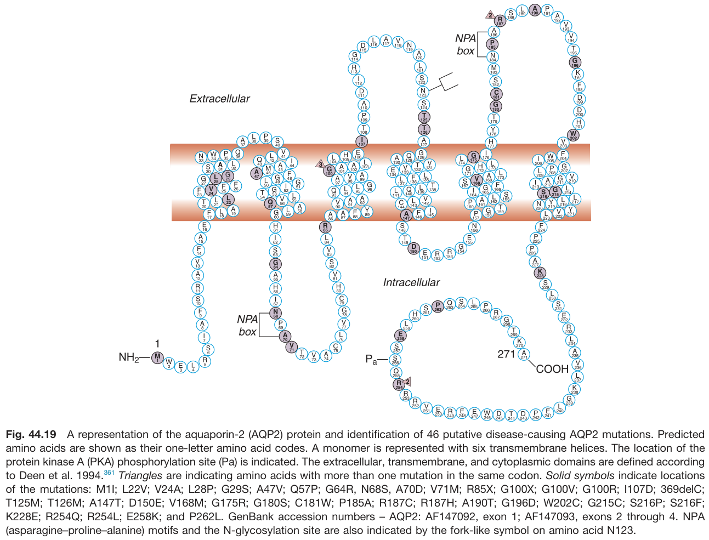

Fig. 44.19 A representation of the aquaporin-2 (AQP2) protein and identification of 46 putative disease-causing AQP2 mutations. Predicted amino acids are shown as their one-letter amino acid codes. A monomer is represented with six transmembrane helices. The location of the protein kinase A (PKA) phosphorylation site (Pa) is indicated. The extracellular, transmembrane, and cytoplasmic domains are defined according to Deen et al. 1994. Triangles are indicating amino acids with more than one mutation in the same codon. Solid symbols indicate locations of the mutations: M11; L22V; V24A; L28P; G29S; A47V; Q57P; G64R, N68S, A70D; V71M; R85X; G100X; G100V; G100R; I107D; 369delC; T125M; T126M; A147T; D150E; V168M; G175R; G180S; C181W; P185A; R187C; R187H; A190T; G196D; W202C; G215C; S216P; S216F; K228E; R254Q; R254L; E258K; and P262L. GenBank accession numbers - AQP2: AF147092, exon 1; AF147093, exons 2 through 4. NPA (asparagine-proline-alanine) motifs and the N-glycosylation site are also indicated by the fork-like symbol on amino acid N123.

---

## Tables

### Table_44_1

#### Table Image

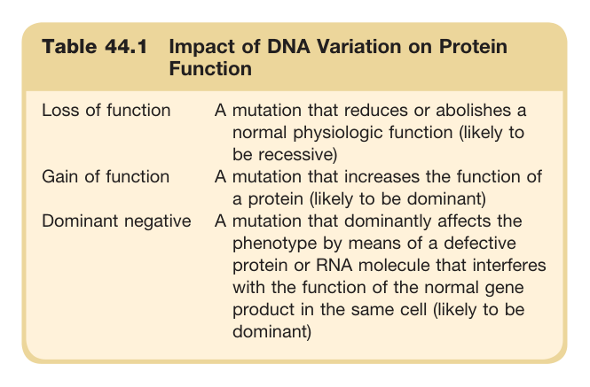

#### Table Data (CSV: [Table_44_1.csv](Table_44_1.csv))

```markdown
| Table Text (OCR) |
| :--- |
| Table 44.1 Impact of DNA Variation on Protein Function Loss of function  A mutation that reduces or abolishes a normal physiologic function (likely to be recessive)    Gain of function  A mutation that increases the function of a protein (likely to be dominant)    Dominant negative  A mutation that dominantly affects the phenotype by means of a defective protein or RNA molecule that interferes with the function of the normal gene product in the same cell (likely to be dominant) |
```

Table 44.1 Impact of DNA Variation on Protein Function | | Function | | :-------------------------- | :----------------------------------------------------------- | | **Loss of function** | A mutation that reduces or abolishes a normal physiologic function (likely to be recessive) | | **Gain of function** | A mutation that increases the function of a protein (likely to be dominant) | | **Dominant negative** | A mutation that dominantly affects the phenotype by means of a defective protein or RNA molecule that interferes with the function of the normal gene product in the same cell (likely to be dominant) |

---

### Table_44_2

#### Table Image

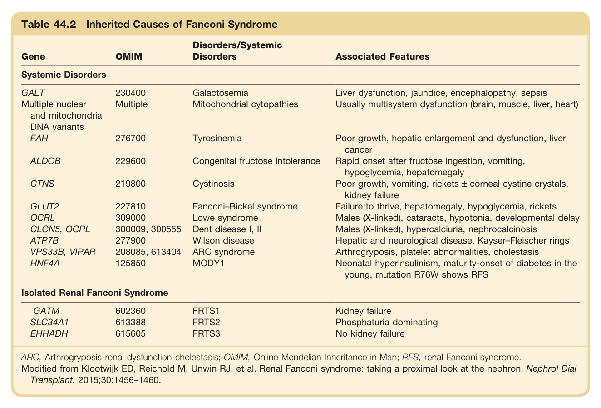

#### Table Data (CSV: [Table_44_2.csv](Table_44_2.csv))

```markdown
| Table Text (OCR) |
| :--- |
| Table 44.2 Inherited Causes of Fanconi Syndrome Gene  OMIM  Disorders/Systemic Disorders  Associated Features    Systemic Disorders    GALT  230400  Galactosemia  Liver dysfunction, jaundice, encephalopathy, sepsis    Multiple nuclear and mitochondrial DNA variants  Multiple  Mitochondrial cytopathies  Usually multisystem dysfunction (brain, muscle, liver, heart)    FAH  276700  Tyrosinemia  Poor growth, hepatic enlargement and dysfunction, liver cancer    ALDOB  229600  Congenital fructose intolerance  Rapid onset after fructose ingestion, vomiting, hypoglycemia, hepatomegaly    CTNS  219800  Cystinosis  Poor growth, vomiting, rickets ± corneal cystine crystals, kidney failure    GLUT2  227810  Fanconi-Bickel syndrome  Failure to thrive, hepatomegaly, hypoglycemia, rickets    OCRL  309000  Lowe syndrome  Males (X-linked), cataracts, hypotonia, developmental delay    CLCN5, OCRL  300009, 300555  Dent disease I, II  Males (X-linked), hypercalciuria, nephrocalcinosis    ATP7B  277900  Wilson disease  Hepatic and neurological disease, Kayser-Fleischer rings    VPS33B, VIPAR  208085, 613404  ARC syndrome  Arthrogryposis, platelet abnormalities, cholestasis    HNF4A  125850  MODY1  Neonatal hyperinsulinism, maturity-onset of diabetes in the young, mutation R76W shows RFS    Isolated Renal Fanconi Syndrome    GATM  602360  FRTS1  Kidney failure    SLC34A1  613388  FRTS2  Phosphaturia dominating    EHHADH  615605  FRTS3  No kidney failure ARC, Arthrogryposis-renal dysfunction-cholestasis; OMIM, Online Mendelian Inheritance in Man; RFS, renal Fanconi syndrome. Modified from Klootwijk ED, Reichold M, Unwin RJ, et al. Renal Fanconi syndrome: taking a proximal look at the nephron. Nephrol Dial Transplant. 2015;30:1456–1460. |
```

Table 44.2 Inherited Causes of Fanconi Syndrome | Gene | OMIM | Disorders/Systemic Disorders | Associated Features | | :---------------------------------------------- | :------------- | :------------------------------ | :----------------------------------------------------------- | | **Systemic Disorders** | | | | | GALT | 230400 | Galactosemia | Liver dysfunction, jaundice, encephalopathy, sepsis | | Multiple nuclear and mitochondrial DNA variants | Multiple | Mitochondrial cytopathies | Usually multisystem dysfunction (brain, muscle, liver, heart) | | FAH | 276700 | Tyrosinemia | Poor growth, hepatic enlargement and dysfunction, liver cancer | | ALDOB | 229600 | Congenital fructose intolerance | Rapid onset after fructose ingestion, vomiting, hypoglycemia, hepatomegaly | | CTNS | 219800 | Cystinosis | Poor growth, vomiting, rickets + corneal cystine crystals, kidney failure | | GLUT2 | 227810 | Fanconi-Bickel syndrome | Failure to thrive, hepatomegaly, hypoglycemia, rickets | | OCRL | 309000 | Lowe syndrome | Males (X-linked), cataracts, hypotonia, developmental delay | | CLCN5, OCRL | 300009, 300555 | Dent disease I, II | Males (X-linked), hypercalciuria, nephrocalcinosis | | ATP7B | 277900 | Wilson disease | Hepatic and neurological disease, Kayser-Fleischer rings | | VPS33B, VIPAR | 208085, 613404 | ARC syndrome | Arthrogryposis, platelet abnormalities, cholestasis | | HNF4A | 125850 | MODY1 | Neonatal hyperinsulinism, maturity-onset of diabetes in the young, mutation R76W shows RFS | | **Isolated Renal Fanconi Syndrome** | | | | | GATM | 602360 | FRTS1 | Kidney failure | | SLC34A1 | 613388 | FRTS2 | Phosphaturia dominating | | EHHADH | 615605 | FRTS3 | No kidney failure | *ARC, Arthrogryposis-renal dysfunction-cholestasis; OMIM, Online Mendelian Inheritance in Man; RFS, renal Fanconi syndrome.* *Modified from Klootwijk ED, Reichold M, Unwin RJ, et al. Renal Fanconi syndrome: taking a proximal look at the nephron. Nephrol Dial Transplant. 2015;30:1456-1460.*

---

### Table_44_3

#### Table Image

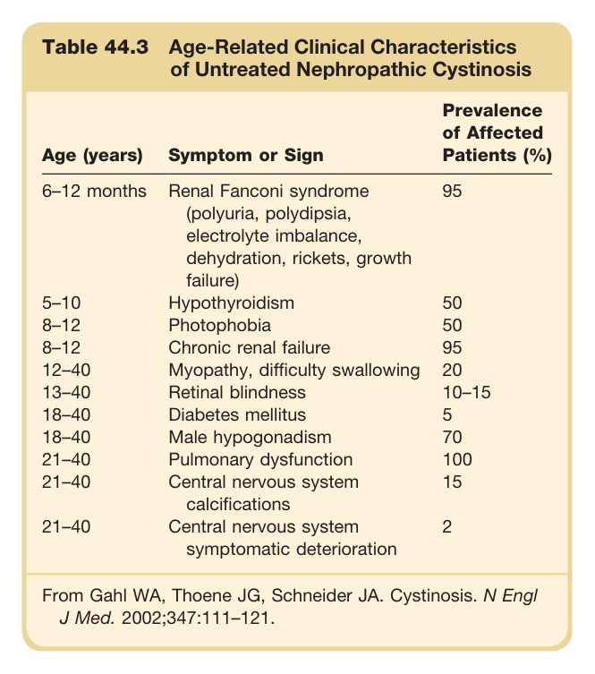

#### Table Data (CSV: [Table_44_3.csv](Table_44_3.csv))

```markdown
| Table Text (OCR) |
| :--- |
| Table 44.3 Age-Related Clinical Characteristics of Untreated Nephropathic Cystinosis Age (years)  Symptom or Sign  Prevalence of Affected Patients (%)    6-12 months  Renal Fanconi syndrome(polyuria, polydipsia, electrolyte imbalance, dehydration, rickets, growth failure)  95    5-10  Hypothyroidism  50    8-12  Photophobia  50    8-12  Chronic renal failure  95    12-40  Myopathy, difficulty swallowing  20    13-40  Retinal blindness  10-15    18-40  Diabetes mellitus  5    18-40  Male hypogonadism  70    21-40  Pulmonary dysfunction  100    21-40  Central nervous system calcifications  15    21-40  Central nervous system symptomatic deterioration  2    From Gahl WA, Thoene JG, Schneider JA. Cystinosis. N Engl J Med. 2002;347:111-121. |
```

Table 44.3 Age-Related Clinical Characteristics of Untreated Nephropathic Cystinosis | Age (years) | Symptom or Sign | Prevalence of Affected Patients (%) | | :---------- | :----------------------------------------------------------- | :---------------------------------- | | 6-12 months | Renal Fanconi syndrome (polyuria, polydipsia, electrolyte imbalance, dehydration, rickets, growth failure) | 95 | | 5-10 | Hypothyroidism | 50 | | 8-12 | Photophobia | 50 | | 8-12 | Chronic renal failure | 95 | | 12-40 | Myopathy, difficulty swallowing | 20 | | 13-40 | Retinal blindness | 10-15 | | 18-40 | Diabetes mellitus | 5 | | 18-40 | Male hypogonadism | 70 | | 21-40 | Pulmonary dysfunction | 100 | | 21-40 | Central nervous system calcifications | 15 | | 21-40 | Central nervous system symptomatic deterioration | 2 | *From Gahl WA, Thoene JG, Schneider JA. Cystinosis. N Engl J Med. 2002;347:111-121.*

---

### Table_44_4

#### Table Image

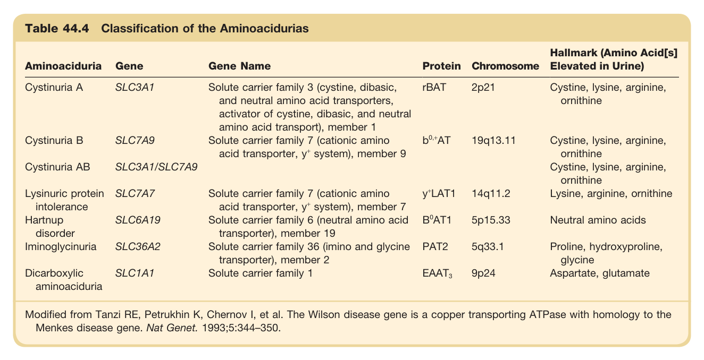

#### Table Data (CSV: [Table_44_4.csv](Table_44_4.csv))

```markdown
| Table Text (OCR) |
| :--- |
| Table 44.4 Classification of the Aminoacidurias Aminoaciduria  Gene  Gene Name  Protein  Chromosome  Hallmark (Amino Acid[s] Elevated in Urine)    Cystinuria A  SLC3A1  Solute carrier family 3 (cystine, dibasic, and neutral amino acid transporters, activator of cystine, dibasic, and neutral amino acid transport), member 1  rBAT  2p21  Cystine, lysine, arginine, ornithine    Cystinuria B  SLC7A9  Solute carrier family 7 (cationic amino acid transporter,  y^{+}  system), member 9   b^{0,+} AT  19q13.11  Cystine, lysine, arginine, ornithine    Cystinuria AB  SLC3A1/SLC7A9        Cystine, lysine, arginine, ornithine    Lysinuric protein intolerance  SLC7A7  Solute carrier family 7 (cationic amino acid transporter,  y^{+}  system), member 7   y^{+} LAT1  14q11.2  Lysine, arginine, ornithine    Hartnup disorder  SLC6A19  Solute carrier family 6 (neutral amino acid transporter), member 19   B^{0} AT1  5p15.33  Neutral amino acids    Iminoglycinuria  SLC36A2  Solute carrier family 36 (imino and glycine transporter), member 2  PAT2  5q33.1  Proline, hydroxyproline, glycine    Dicarboxylic aminoaciduria  SLC1A1  Solute carrier family 1   EAAT_{3}   9p24  Aspartate, glutamate Modified from Tanzi RE, Petrukhin K, Chernov I, et al. The Wilson disease gene is a copper transporting ATPase with homology to the Menkes disease gene. Nat Genet. 1993;5:344–350. |
```

Table 44.4 Classification of the Aminoacidurias | Aminoaciduria | Gene | Gene Name | Protein | Chromosome | Hallmark (Amino Acid[s] Elevated in Urine) | | :---------------------------- | :------------ | :----------------------------------------------------------- | :------ | :--------- | :----------------------------------------- | | Cystinuria A | SLC3A1 | Solute carrier family 3 (cystine, dibasic, and neutral amino acid transporters, activator of cystine, dibasic, and neutral amino acid transport), member 1 | rBAT | 2p21 | Cystine, lysine, arginine, ornithine | | Cystinuria B | SLC7A9 | Solute carrier family 7 (cationic amino acid transporter, yt system), member 9 | bo+AT | 19q13.11 | Cystine, lysine, arginine, ornithine | | Cystinuria AB | SLC3A1/SLC7A9 | | | | Cystine, lysine, arginine, ornithine | | Lysinuric protein intolerance | SLC7A7 | Solute carrier family 7 (cationic amino acid transporter, yt system), member 7 | y+LAT1 | 14q11.2 | Lysine, arginine, ornithine | | Hartnup disorder | SLC6A19 | Solute carrier family 6 (neutral amino acid transporter), member 19 | BºAT1 | 5p15.33 | Neutral amino acids | | Iminoglycinuria | SLC36A2 | Solute carrier family 36 (imino and glycine transporter), member 2 | PAT2 | 5q33.1 | Proline, hydroxyproline, glycine | | Dicarboxylic aminoaciduria | SLC1A1 | Solute carrier family 1 | EAAT 3 | 9p24 | Aspartate, glutamate | *Modified from Tanzi RE, Petrukhin K, Chernov I, et al. The Wilson disease gene is a copper transporting ATPase with homology to the Menkes disease gene. Nat Genet. 1993;5:344-350.*

---

### Table_44_5

#### Table Image

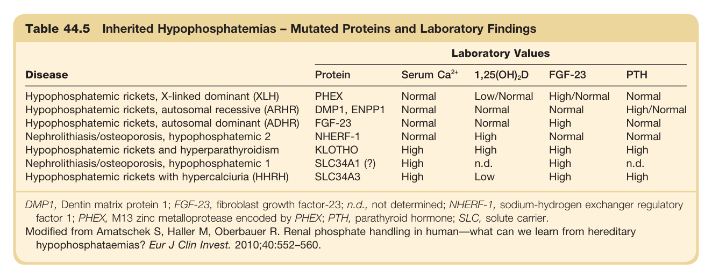

#### Table Data (CSV: [Table_44_5.csv](Table_44_5.csv))

```markdown
| Table Text (OCR) |
| :--- |
| Table 44.5 Inherited Hypophosphatemias – Mutated Proteins and Laboratory Findings Disease  Laboratory Values    Protein  Serum  Ca^{2+}   1,25(OH) _2 D  FGF-23  PTH    Hypophosphatemic rickets, X-linked dominant (XLH)  PHEX  Normal  Low/Normal  High/Normal  Normal    Hypophosphatemic rickets, autosomal recessive (ARHR)  DMP1, ENPP1  Normal  Normal  Normal  High/Normal    Hypophosphatemic rickets, autosomal dominant (ADHR)  FGF-23  Normal  Normal  High  Normal    Nephrolithiasis/osteoporosis, hypophosphatemic 2  NHERF-1  Normal  High  Normal  Normal    Hypophosphatemic rickets and hyperparathyroidism  KLOTHO  High  High  High  High    Nephrolithiasis/osteoporosis, hypophosphatemic 1  SLC34A1 (?)  High  n.d.  High  n.d.    Hypophosphatemic rickets with hypercalciuria (HHRH)  SLC34A3  High  Low  High  High DMP1, Dentin matrix protein 1; FGF-23, fibroblast growth factor-23; n.d., not determined; NHERF-1, sodium-hydrogen exchanger regulatory factor 1; PHEX, M13 zinc metalloprotease encoded by PHEX; PTH, parathyroid hormone; SLC, solute carrier. Modified from Amatschek S, Haller M, Oberbauer R. Renal phosphate handling in human—what can we learn from hereditary hypophosphataemias? Eur J Clin Invest. 2010;40:552–560. |
```

Table 44.5 Inherited Hypophosphatemias – Mutated Proteins and Laboratory Findings | Disease | Protein | Serum Ca²⁺ | 1,25(OH)₂D | FGF-23 | PTH | | :--------------------------------------------------- | :---------- | :--------- | :--------- | :---------- | :----- | | **Laboratory Values** | | | | | | | Hypophosphatemic rickets, X-linked dominant (XLH) | PHEX | Normal | Low/Normal | High/Normal | Normal | | Hypophosphatemic rickets, autosomal recessive (ARHR) | DMP1, ENPP1 | Normal | Normal | High/Normal | Normal | | Hypophosphatemic rickets, autosomal dominant (ADHR) | FGF-23 | Normal | Normal | High | Normal | | Nephrolithiasis/osteoporosis, hypophosphatemic 2 | NHERF-1 | Normal | High | Normal | Normal | | Hypophosphatemic rickets and hyperparathyroidism | KLOTHO | High | High | High | High | | Nephrolithiasis/osteoporosis, hypophosphatemic 1 | SLC34A1 (?) | High | n.d. | High | n.d. | | Hypophosphatemic rickets with hypercalciuria (HHRH) | SLC34A3 | High | Low | High | High | *DMP1, Dentin matrix protein 1; FGF-23, fibroblast growth factor-23; n.d., not determined; NHERF-1, sodium-hydrogen exchanger regulatory factor 1; PHEX, M13 zinc metalloprotease encoded by PHEX; PTH, parathyroid hormone; SLC, solute carrier.* *Modified from Amatschek S, Haller M, Oberbauer R. Renal phosphate handling in human-what can we learn from hereditary hypophosphataemias? Eur J Clin Invest. 2010;40:552-560.*

---

### Table_44_6

#### Table Image

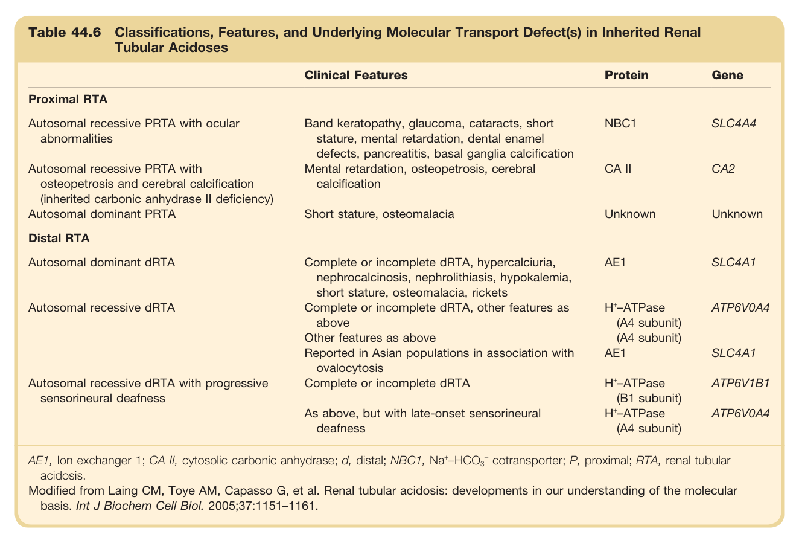

#### Table Data (CSV: [Table_44_6.csv](Table_44_6.csv))

```markdown
| Table Text (OCR) |
| :--- |
| Table 44.6 Classifications, Features, and Underlying Molecular Transport Defect(s) in Inherited Renal Tubular Acidoses Clinical Features  Protein  Gene    Proximal RTA    Autosomal recessive PRTA with ocular abnormalities  Band keratopathy, glaucoma, cataracts, short stature, mental retardation, dental enamel defects, pancreatitis, basal ganglia calcification  NBC1  SLC4A4    Autosomal recessive PRTA with osteopetrosis and cerebral calcification (inherited carbonic anhydrase II deficiency)  Mental retardation, osteopetrosis, cerebral calcification  CA II  CA2    Autosomal dominant PRTA  Short stature, osteomalacia  Unknown  Unknown    Distal RTA    Autosomal dominant dRTA  Complete or incomplete dRTA, hypercalciuria, nephrocalcinosis, nephrolithiasis, hypokalemia, short stature, osteomalacia, rickets  AE1  SLC4A1    Autosomal recessive dRTA  Complete or incomplete dRTA, other features as above   H^{+} -ATPase (A4 subunit) (A4 subunit)  ATP6V0A4    Other features as above    Reported in Asian populations in association with ovalocytosis  AE1  SLC4A1    Autosomal recessive dRTA with progressive sensorineural deafness  Complete or incomplete dRTA   H^{+} -ATPase (B1 subunit)  ATP6V1B1    As above, but with late-onset sensorineural deafness   H^{+} -ATPase (A4 subunit)  ATP6V0A4 AE1, Ion exchanger 1; CA II, cytosolic carbonic anhydrase; d, distal; NBC1, Na<sup>+</sup>–HCO<sub>3</sub><sup>−</sup> cotransporter; P, proximal; RTA, renal tubular acidosis Modified from Laing CM, Toye AM, Capasso G, et al. Renal tubular acidosis: developments in our understanding of the molecular basis. Int J Biochem Cell Biol. 2005;37:1151–1161. |
```

Table 44.6 Classifications, Features, and Underlying Molecular Transport Defect(s) in Inherited Renal Tubular Acidoses | | Clinical Features | Protein | Gene | | :----------------------------------------------------------- | :----------------------------------------------------------- | :--------------------------------------------- | :----------------- | | **Proximal RTA** | | | | | Autosomal recessive PRTA with ocular abnormalities | Band keratopathy, glaucoma, cataracts, short stature, mental retardation, dental enamel defects, pancreatitis, basal ganglia calcification | NBC1 | SLC4A4 | | Autosomal recessive PRTA with osteopetrosis and cerebral calcification (inherited carbonic anhydrase II deficiency) | Mental retardation, osteopetrosis, cerebral calcification | CA II | CA2 | | Autosomal dominant PRTA | Short stature, osteomalacia | Unknown | Unknown | | **Distal RTA** | | | | | Autosomal dominant dRTA | Complete or incomplete dRTA, hypercalciuria, nephrocalcinosis, nephrolithiasis, hypokalemia, short stature, osteomalacia, rickets | AE1 | SLC4A1 | | Autosomal recessive dRTA | Complete or incomplete dRTA, other features as above. Other features as above. Reported in Asian populations in association with ovalocytosis. | H⁺-ATPase (A4 subunit). AE1 | ATP6V0A4, SLC4A1 | | Autosomal recessive dRTA with progressive sensorineural deafness | Complete or incomplete dRTA. As above, but with late-onset sensorineural deafness. | H⁺-ATPase (B1 subunit), H⁺-ATPase (A4 subunit) | ATP6V1B1, ATP6V0A4 | *AE1, Ion exchanger 1; CA II, cytosolic carbonic anhydrase; d, distal; NBC1, Na⁺-HCO₃⁻ cotransporter; P, proximal; RTA, renal tubular acidosis.* *Modified from Laing CM, Toye AM, Capasso G, et al. Renal tubular acidosis: developments in our understanding of the molecular basis. Int J Biochem Cell Biol. 2005;37:1151-1161.*

---

### Table_44_7

#### Table Image

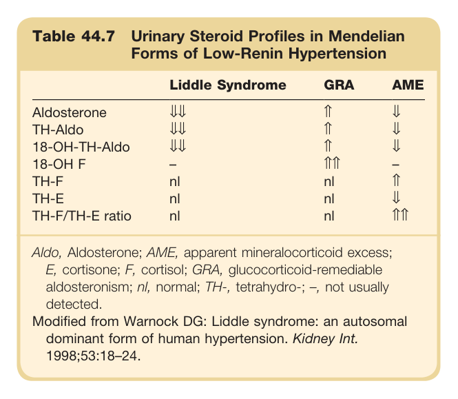

#### Table Data (CSV: [Table_44_7.csv](Table_44_7.csv))

```markdown
| Table Text (OCR) |
| :--- |
| Table 44.7 Urinary Steroid Profiles in Mendelian Forms of Low-Renin Hypertension Liddle Syndrome  GRA  AME    Aldosterone  ↓↓↓  ↑  ↓↓    TH-Aldo  ↓↓↓  ↑↑  ↓↓    18-OH-TH-Aldo  ↓↓↓  ↑↑  ↓↓    18-OH F  -  ↑↑↑  -    TH-F  nl  nl  ↑↑    TH-E  nl  nl  ↓↓    TH-F/TH-E ratio  nl  nl  ↑↑↑ Aldo, Aldosterone; AME, apparent mineralocorticoid excess; E, cortisone; F, cortisol; GRA, glucocorticoid-remediable aldosteronism; nl, normal; TH-, tetrahydro-; –, not usually detected. Modified from Warnock DG: Liddle syndrome: an autosomal dominant form of human hypertension. Kidney Int. 1998;53:18–24. |
```

Table 44.7 Urinary Steroid Profiles in Mendelian Forms of Low-Renin Hypertension | | Liddle Syndrome | GRA | AME | | :-------------- | :-------------- | :--- | :--- | | Aldosterone | ↓↓ | ↑ | ↓↓ | | TH-Aldo | ↓↓ | ↑ | ↓ | | 18-OH-TH-Aldo | ↓↓ | ↑ | | | 18-OH F | | ↑↑ | | | TH-F | nl | nl | ↑ | | TH-E | nl | nl | ↓↓ | | TH-F/TH-E ratio | nl | nl | ↑↑ | *Aldo, Aldosterone; AME, apparent mineralocorticoid excess; E, cortisone; F, cortisol; GRA, glucocorticoid-remediable aldosteronism; nl, normal; TH-, tetrahydro-; -, not usually detected.* *Modified from Warnock DG: Liddle syndrome: an autosomal dominant form of human hypertension. Kidney Int. 1998;53:18-24.*

---

### Table_44_8

#### Table Image

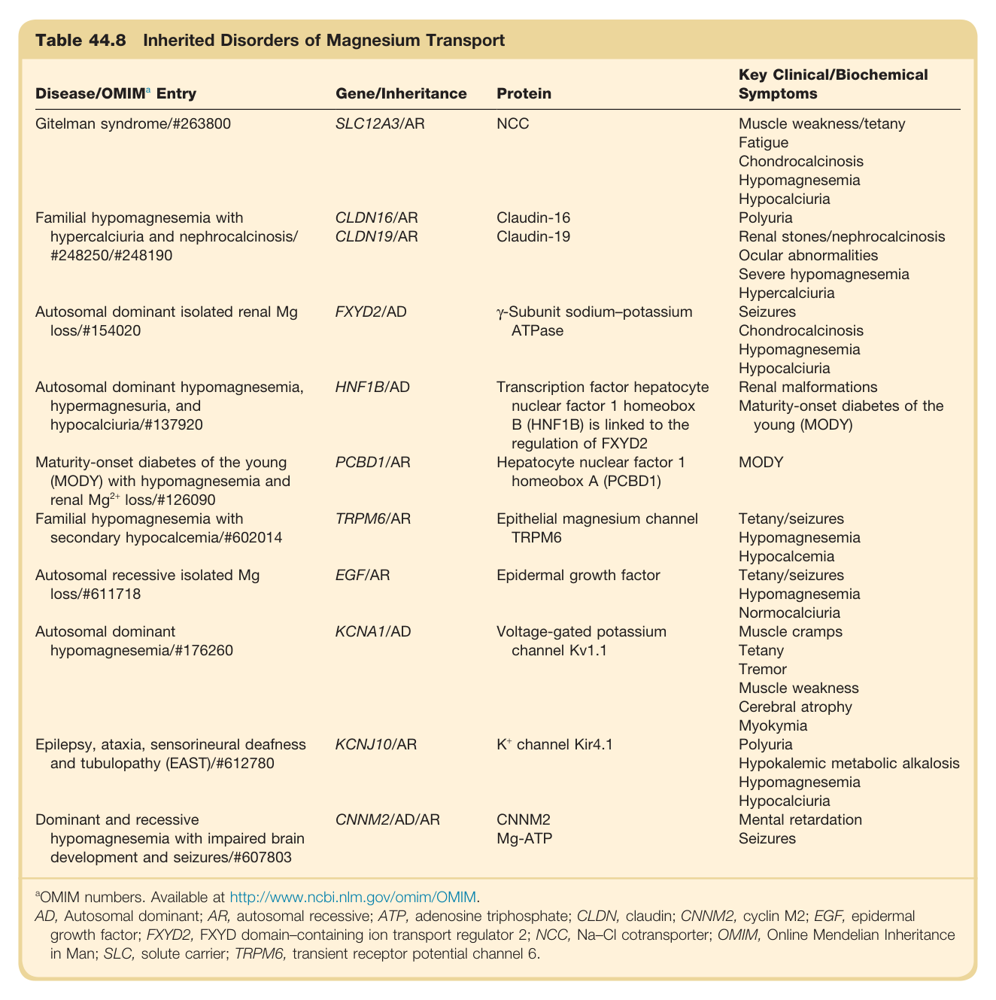

#### Table Data (CSV: [Table_44_8.csv](Table_44_8.csv))

```markdown
| Table Text (OCR) |
| :--- |
| Table 44.8 Inherited Disorders of Magnesium Transport Disease/OMIM ^a Entry  Gene/Inheritance  Protein  Key Clinical/Biochemical Symptoms    Gitelman syndrome/#263800  SLC12A3/AR  NCC  Muscle weakness/tetanyFatigueChondrocalcinosisHypomagnesemiaHypocalciuria    Familial hypomagnesemia with hypercalciuria and nephrocalcinosis/#248250/#248190  CLDN16/ARCLDN19/AR  Claudin-16Claudin-19  PolyuriaRenal stones/nephrocalcinosisOcular abnormalitiesSevere hypomagnesemiaHypercalciuria    Autosomal dominant isolated renal Mg loss/#154020  FXYD2/AD   \gamma -Subunit sodium-potassium ATPase  SeizuresChondrocalcinosisHypomagnesemiaHypocalciuria    Autosomal dominant hypomagnesemia, hypermagnesuria, and hypocalciuria/#137920  HNF1B/AD  Transcription factor hepatocyte nuclear factor 1 homeobox B (HNF1B) is linked to the regulation of FXYD2  Renal malformationsMaturity-onset diabetes of the young (MODY)    Maturity-onset diabetes of the young (MODY) with hypomagnesemia and renal  Mg^{2+}  loss/#126090  PCBD1/AR  Hepatocyte nuclear factor 1 homeobox A (PCBD1)  MODY    Familial hypomagnesemia with secondary hypocalcemia/#602014  TRPM6/AR  Epithelial magnesium channel TRPM6  Tetany/seizuresHypomagnesemiaHypocalcemia    Autosomal recessive isolated Mg loss/#611718  EGF/AR  Epidermal growth factor  Tetany/seizuresHypomagnesemiaNormocalciuria    Autosomal dominant hypomagnesemia/#176260  KCNA1/AD  Voltage-gated potassium channel Kv1.1  Muscle crampsTetanyTremorMuscle weaknessCerebral atrophyMyokymia    Epilepsy, ataxia, sensorineural deafness and tubulopathy (EAST)#612780  KCNJ10/AR   K^+ channel Kir4.1  PolyuriaHypokalemic metabolic alkalosisHypomagnesemiaHypocalciuria    Dominant and recessive hypomagnesemia with impaired brain development and seizures/#607803  CNNM2/AD/AR  CNNM2Mg-ATP  Mental retardationSeizures <sup>a</sup>OMIM numbers. Available at http://www.ncbi.nlm.gov/omim/OMIM. AD, Autosomal dominant; AR, autosomal recessive; ATP, adenosine triphosphate; CLDN, claudin; CNNM2, cyclin M2; EGF, epidermal growth factor; FXYD2, FXYD domain–containing ion transport regulator 2; NCC, Na–Cl cotransporter; OMIM, Online Mendelian Inheritance in Man; SLC, solute carrier; TRPM6, transient receptor potential channel 6. |
```

Table 44.8 Inherited Disorders of Magnesium Transport | Disease/OMIMª Entry | Gene/Inheritance | Protein | Key Clinical/Biochemical Symptoms | | :----------------------------------------------------------- | :------------------- | :----------------------------------------------------------- | :----------------------------------------------------------- | | Gitelman syndrome/#263800 | SLC12A3/AR | NCC | Muscle weakness/tetany, Fatigue, Chondrocalcinosis, Hypomagnesemia, Hypocalciuria | | Familial hypomagnesemia with hypercalciuria and nephrocalcinosis/ #248250/#248190 | CLDN16/AR, CLDN19/AR | Claudin-16, Claudin-19 | Polyuria, Renal stones/nephrocalcinosis, Ocular abnormalities, Severe hypomagnesemia, Hypercalciuria | | Autosomal dominant isolated renal Mg loss/#154020 | FXYD2/AD | γ-Subunit sodium-potassium ATPase | Seizures, Chondrocalcinosis, Hypomagnesemia, Hypocalciuria | | Autosomal dominant hypomagnesemia, hypermagnesuria, and hypocalciuria/#137920 | HNF1B/AD | Transcription factor hepatocyte nuclear factor 1 homeobox B (HNF1B) is linked to the regulation of FXYD2 | Renal malformations, Maturity-onset diabetes of the young (MODY) | | Maturity-onset diabetes of the young (MODY) with hypomagnesemia and renal Mg²⁺ loss/#126090 | PCBD1/AR | Hepatocyte nuclear factor 1 homeobox A (PCBD1) | MODY | | Familial hypomagnesemia with secondary hypocalcemia/#602014 | TRPM6/AR | Epithelial magnesium channel TRPM6 | Tetany/seizures, Hypomagnesemia, Hypocalcemia | | Autosomal recessive isolated Mg loss/#611718 | EGF/AR | Epidermal growth factor | Tetany/seizures, Hypomagnesemia, Normocalciuria | | Autosomal dominant hypomagnesemia/#176260 | KCNA1/AD | Voltage-gated potassium channel Kv1.1 | Muscle cramps, Tetany, Tremor, Muscle weakness, Cerebral atrophy | | Epilepsy, ataxia, sensorineural deafness and tubulopathy (EAST)/#612780 | KCNJ10/AR | K⁺ channel Kir4.1 | Myokymia, Polyuria, Hypokalemic metabolic alkalosis, Hypomagnesemia, Hypocalciuria | | Dominant and recessive hypomagnesemia with impaired brain development and seizures/#607803 | CNNM2/AD/AR | CNNM2, Mg-ATP | Mental retardation, Seizures | *ªOMIM numbers. Available at http://www.ncbi.nlm.gov/omim/OMIM.* *AD, Autosomal dominant; AR, autosomal recessive; ATP, adenosine triphosphate; CLDN, claudin; CNNM2, cyclin M2; EGF, epidermal growth factor; FXYD2, FXYD domain-containing ion transport regulator 2; NCC, Na-Cl cotransporter; OMIM, Online Mendelian Inheritance in Man; SLC, solute carrier; TRPM6, transient receptor potential channel 6.*

---

## Boxes

### Box_44_1

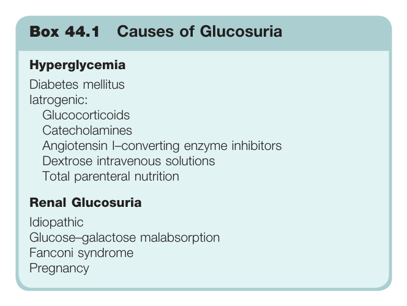

#### Box Text

```markdown
Box 44.1 Causes of Glucosuria **Hyperglycemia** * Diabetes mellitus * Iatrogenic: * Glucocorticoids * Catecholamines * Angiotensin I-converting enzyme inhibitors * Dextrose intravenous solutions * Total parenteral nutrition **Renal Glucosuria** * Idiopathic * Glucose-galactose malabsorption * Fanconi syndrome * Pregnancy
```

Box 44.1 Causes of Glucosuria **Hyperglycemia** * Diabetes mellitus * Iatrogenic: * Glucocorticoids * Catecholamines * Angiotensin I-converting enzyme inhibitors * Dextrose intravenous solutions * Total parenteral nutrition **Renal Glucosuria** * Idiopathic * Glucose-galactose malabsorption * Fanconi syndrome * Pregnancy

---
