# 45. Cystic Diseases of the Kidney - Figures and Tables Index

This document lists all figures, tables and boxes extracted from `45. Cystic Diseases of the Kidney.pdf`.

## Table of Contents
- [Figures](#figures)
- [Tables](#tables)
- [Boxes](#boxes)

---

## Figures

### Fig_45_1

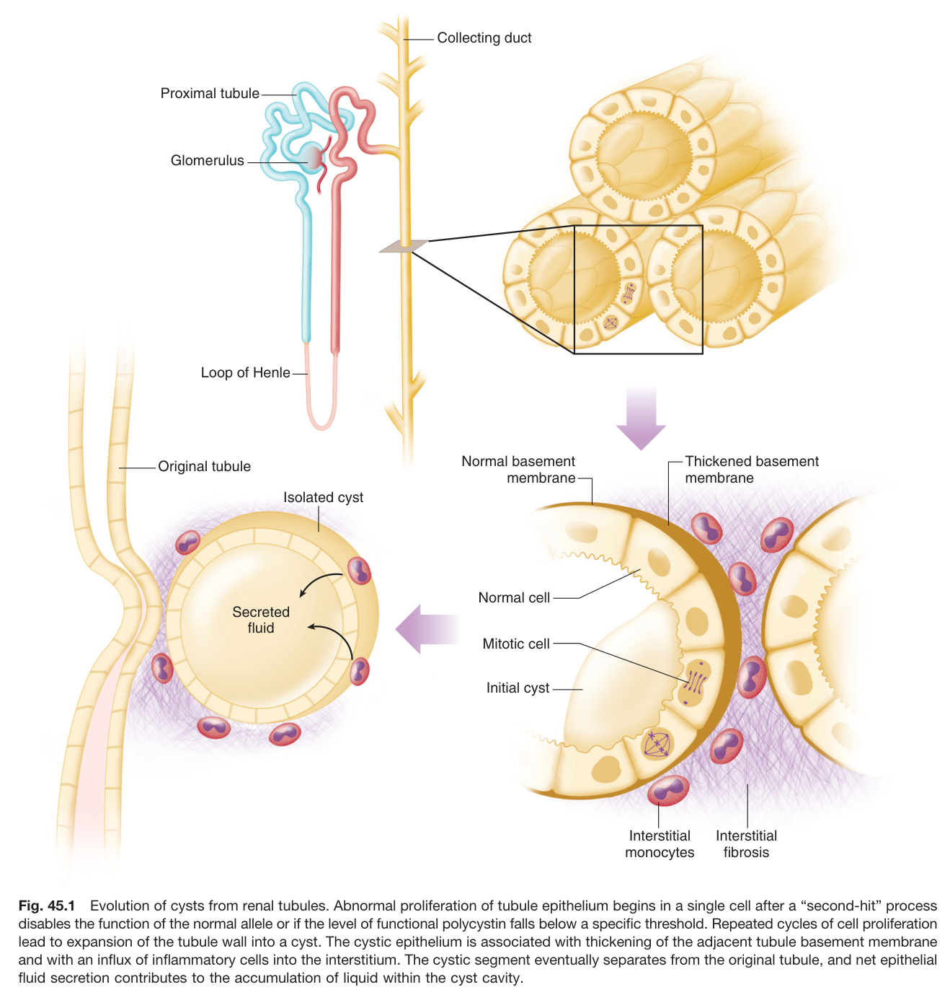

Fig. 45.1 Evolution of cysts from renal tubules. Abnormal proliferation of tubule epithelium begins in a single cell after a "second-hit" process disables the function of the normal allele or if the level of functional polycystin falls below a specific threshold. Repeated cycles of cell proliferation lead to expansion of the tubule wall into a cyst. The cystic epithelium is associated with thickening of the adjacent tubule basement membrane and with an influx of inflammatory cells into the interstitium. The cystic segment eventually separates from the original tubule, and net epithelial fluid secretion contributes to the accumulation of liquid within the cyst cavity.

---

### Fig_45_2

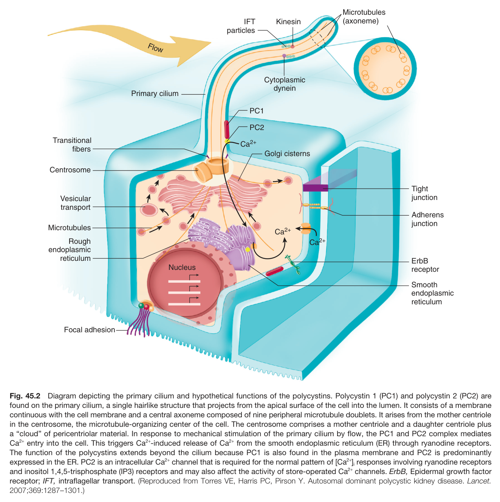

Fig. 45.2 Diagram depicting the primary cilium and hypothetical functions of the polycystins. Polycystin 1 (PC1) and polycystin 2 (PC2) are found on the primary cilium, a single hairlike structure that projects from the apical surface of the cell into the lumen. It consists of a membrane continuous with the cell membrane and a central axoneme composed of nine peripheral microtubule doublets. It arises from the mother centriole in the centrosome, the microtubule-organizing center of the cell. The centrosome comprises a mother centriole and a daughter centriole plus a "cloud" of pericentriolar material. In response to mechanical stimulation of the primary cilium by flow, the PC1 and PC2 complex mediates Ca2+ entry into the cell. This triggers Ca2+-induced release of Ca2+ from the smooth endoplasmic reticulum (ER) through ryanodine receptors. The function of the polycystins extends beyond the cilium because PC1 is also found in the plasma membrane and PC2 is predominantly expressed in the ER. PC2 is an intracellular Ca2+ channel that is required for the normal pattern of [Ca2+]; responses involving ryanodine receptors and inositol 1,4,5-trisphosphate (IP3) receptors and may also affect the activity of store-operated Ca2+ channels. ErbB, Epidermal growth factor receptor; IFT, intraflagellar transport. (Reproduced from Torres VE, Harris PC, Pirson Y. Autosomal dominant polycystic kidney disease. Lancet. 2007;369:1287-1301.)

---

### Fig_45_3

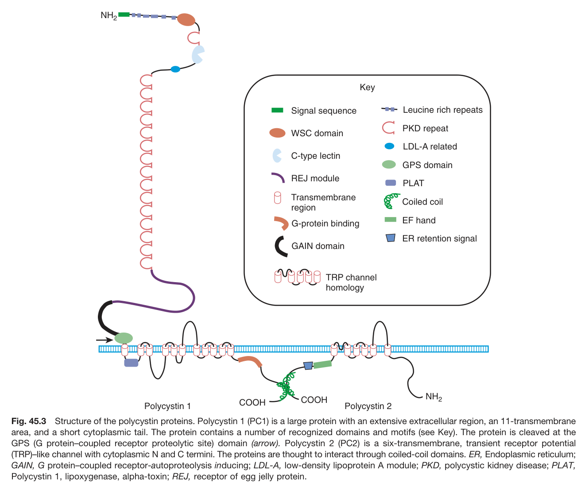

Fig. 45.3 Structure of the polycystin proteins. Polycystin 1 (PC1) is a large protein with an extensive extracellular region, an 11-transmembrane area, and a short cytoplasmic tail. The protein contains a number of recognized domains and motifs (see Key). The protein is cleaved at the GPS (G protein-coupled receptor proteolytic site) domain (arrow). Polycystin 2 (PC2) is a six-transmembrane, transient receptor potential (TRP)-like channel with cytoplasmic N and C termini. The proteins are thought to interact through coiled-coil domains. ER, Endoplasmic reticulum; GAIN, G protein-coupled receptor-autoproteolysis inducing; LDL-A, low-density lipoprotein A module; PKD, polycystic kidney disease; PLAT, Polycystin 1, lipoxygenase, alpha-toxin; REJ, receptor of egg jelly protein.

---

### Fig_45_4

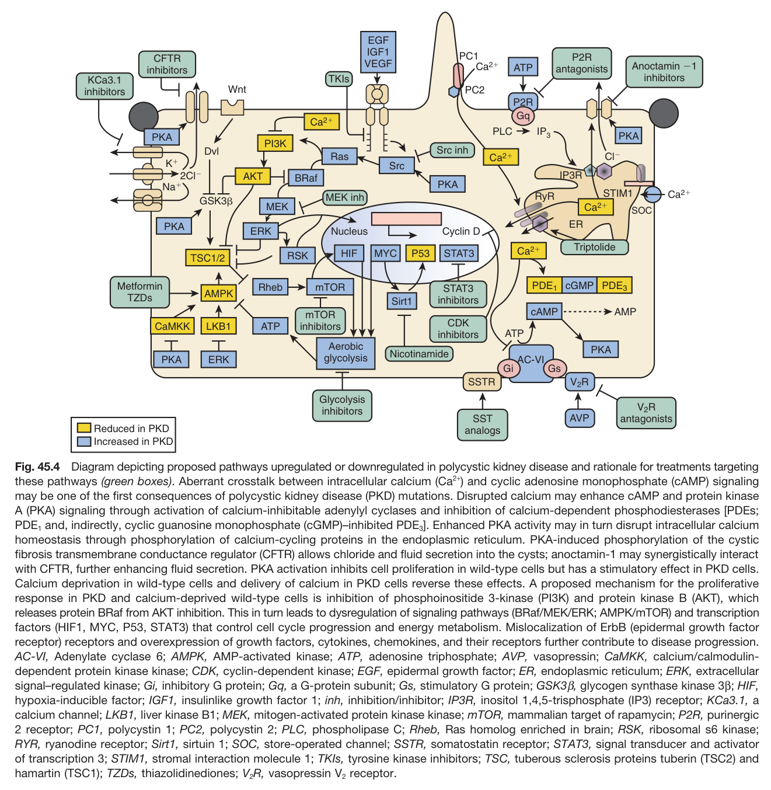

Fig. 45.4 Diagram depicting proposed pathways upregulated or downregulated in polycystic kidney disease and rationale for treatments targeting these pathways (green boxes). Aberrant crosstalk between intracellular calcium (Ca2+) and cyclic adenosine monophosphate (cAMP) signaling may be one of the first consequences of polycystic kidney disease (PKD) mutations. Disrupted calcium may enhance cAMP and protein kinase A (PKA) signaling through activation of calcium-inhibitable adenylyl cyclases and inhibition of calcium-dependent phosphodiesterases [PDEs; PDE₁ and, indirectly, cyclic guanosine monophosphate (cGMP)-inhibited PDE3]. Enhanced PKA activity may in turn disrupt intracellular calcium homeostasis through phosphorylation of calcium-cycling proteins in the endoplasmic reticulum. PKA-induced phosphorylation of the cystic fibrosis transmembrane conductance regulator (CFTR) allows chloride and fluid secretion into the cysts; anoctamin-1 may synergistically interact with CFTR, further enhancing fluid secretion. PKA activation inhibits cell proliferation in wild-type cells but has a stimulatory effect in PKD cells. Calcium deprivation in wild-type cells and delivery of calcium in PKD cells reverse these effects. A proposed mechanism for the proliferative response in PKD and calcium-deprived wild-type cells is inhibition of phosphoinositide 3-kinase (PI3K) and protein kinase B (AKT), which releases protein BRaf from AKT inhibition. This in turn leads to dysregulation of signaling pathways (BRaf/MEK/ERK; AMPK/mTOR) and transcription factors (HIF1, MYC, P53, STAT3) that control cell cycle progression and energy metabolism. Mislocalization of ErbB (epidermal growth factor receptor) receptors and overexpression of growth factors, cytokines, chemokines, and their receptors further contribute to disease progression. AC-VI, Adenylate cyclase 6; AMPK, AMP-activated kinase; ATP, adenosine triphosphate; AVP, vasopressin; CaMKK, calcium/calmodulin-dependent protein kinase kinase; CDK, cyclin-dependent kinase; EGF, epidermal growth factor; ER, endoplasmic reticulum; ERK, extracellular signal-regulated kinase; Gi, inhibitory G protein; Gq, a G-protein subunit; Gs, stimulatory G protein; GSK3ẞ, glycogen synthase kinase 3ẞ; HIF, hypoxia-inducible factor; IGF1, insulinlike growth factor 1; inh, inhibition/inhibitor; IP3R, inositol 1,4,5-trisphosphate (IP3) receptor; KCa3.1, a calcium channel; LKB1, liver kinase B1; MEK, mitogen-activated protein kinase kinase; mTOR, mammalian target of rapamycin; P2R, purinergic 2 receptor; PC1, polycystin 1; PC2, polycystin 2; PLC, phospholipase C; Rheb, Ras homolog enriched in brain; RSK, ribosomal s6 kinase; RYR, ryanodine receptor; Sirt1, sirtuin 1; SOC, store-operated channel; SSTR, somatostatin receptor; STAT3, signal transducer and activator of transcription 3; STIM1, stromal interaction molecule 1; TKIs, tyrosine kinase inhibitors; TSC, tuberous sclerosis proteins tuberin (TSC2) and hamartin (TSC1); TZDs, thiazolidinediones; V₂R, vasopressin V2 receptor.

---

### Fig_45_5

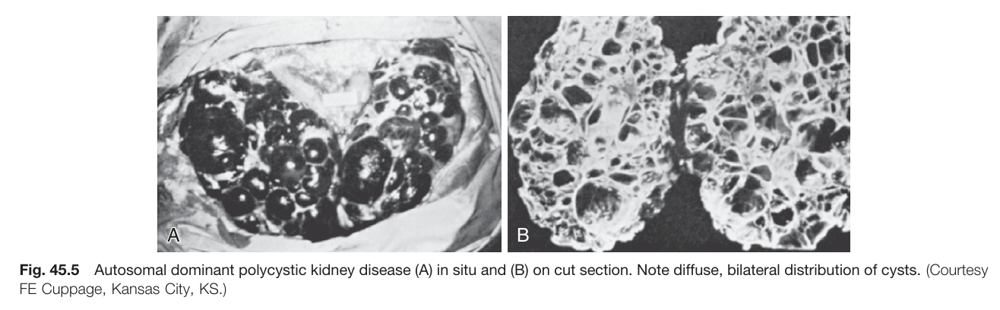

Fig. 45.5 Autosomal dominant polycystic kidney disease (A) in situ and (B) on cut section. Note diffuse, bilateral distribution of cysts. (Courtesy FE Cuppage, Kansas City, KS.)

---

### Fig_45_6

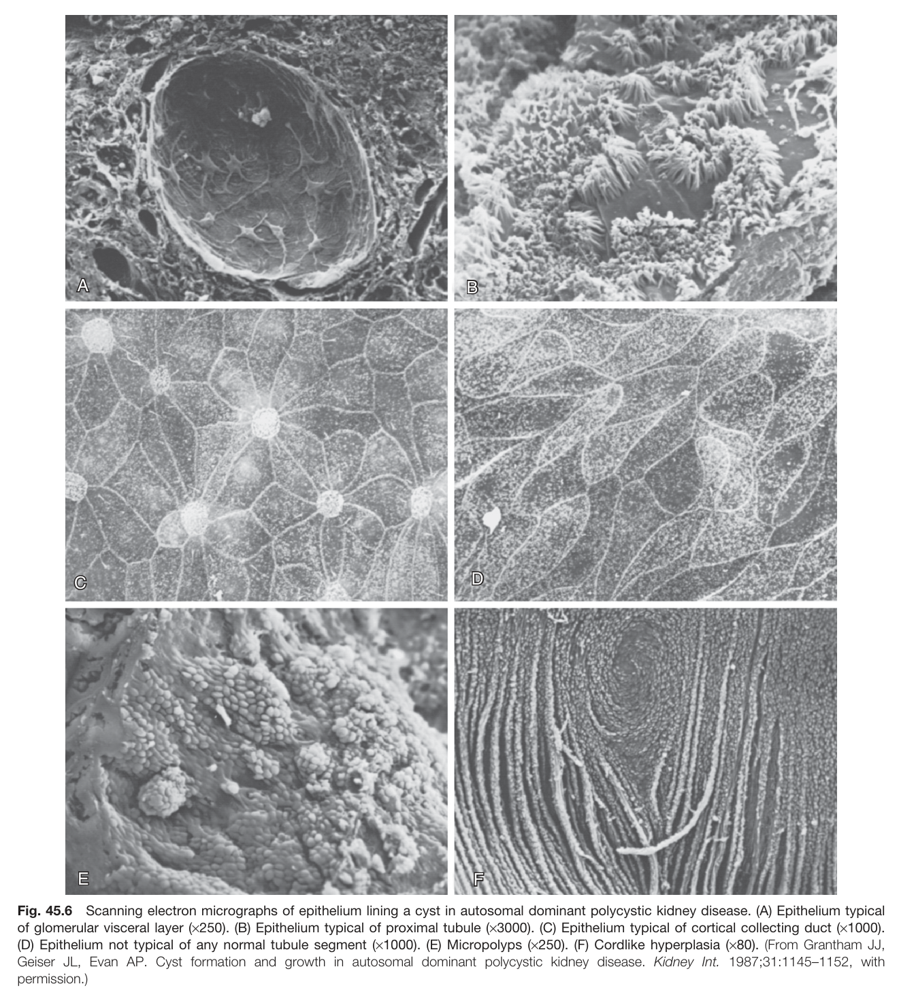

Fig. 45.6 Scanning electron micrographs of epithelium lining a cyst in autosomal dominant polycystic kidney disease. (A) Epithelium typical of glomerular visceral layer (x250). (B) Epithelium typical of proximal tubule (x3000). (C) Epithelium typical of cortical collecting duct (×1000). (D) Epithelium not typical of any normal tubule segment (×1000). (E) Micropolyps (×250). (F) Cordlike hyperplasia (x80). (From Grantham JJ, Geiser JL, Evan AP. Cyst formation and growth in autosomal dominant polycystic kidney disease. Kidney Int. 1987;31:1145-1152, with permission.)

---

### Fig_45_7

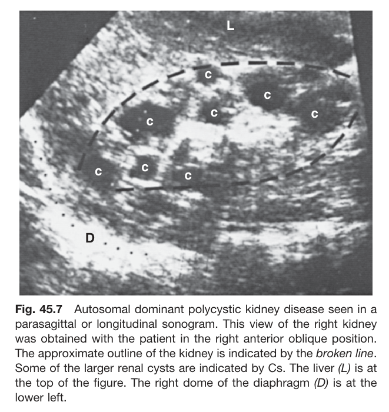

Fig. 45.7 Autosomal dominant polycystic kidney disease seen in a parasagittal or longitudinal sonogram. This view of the right kidney was obtained with the patient in the right anterior oblique position. The approximate outline of the kidney is indicated by the broken line. Some of the larger renal cysts are indicated by Cs. The liver (L) is at the top of the figure. The right dome of the diaphragm (D) is at the lower left.

---

### Fig_45_8

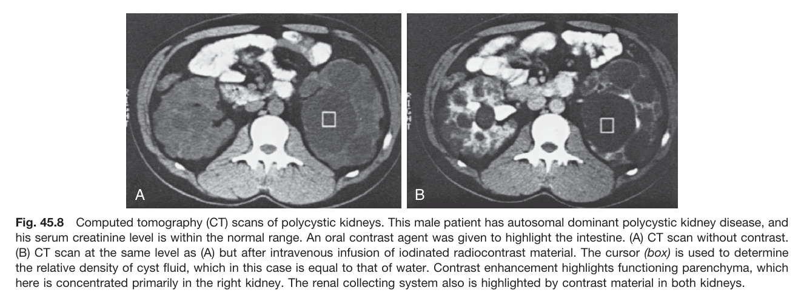

Fig. 45.8 Computed tomography (CT) scans of polycystic kidneys. This male patient has autosomal dominant polycystic kidney disease, and his serum creatinine level is within the normal range. An oral contrast agent was given to highlight the intestine. (A) CT scan without contrast. (B) CT scan at the same level as (A) but after intravenous infusion of iodinated radiocontrast material. The cursor (box) is used to determine the relative density of cyst fluid, which in this case is equal to that of water. Contrast enhancement highlights functioning parenchyma, which here is concentrated primarily in the right kidney. The renal collecting system also is highlighted by contrast material in both kidneys.

---

### Fig_45_9

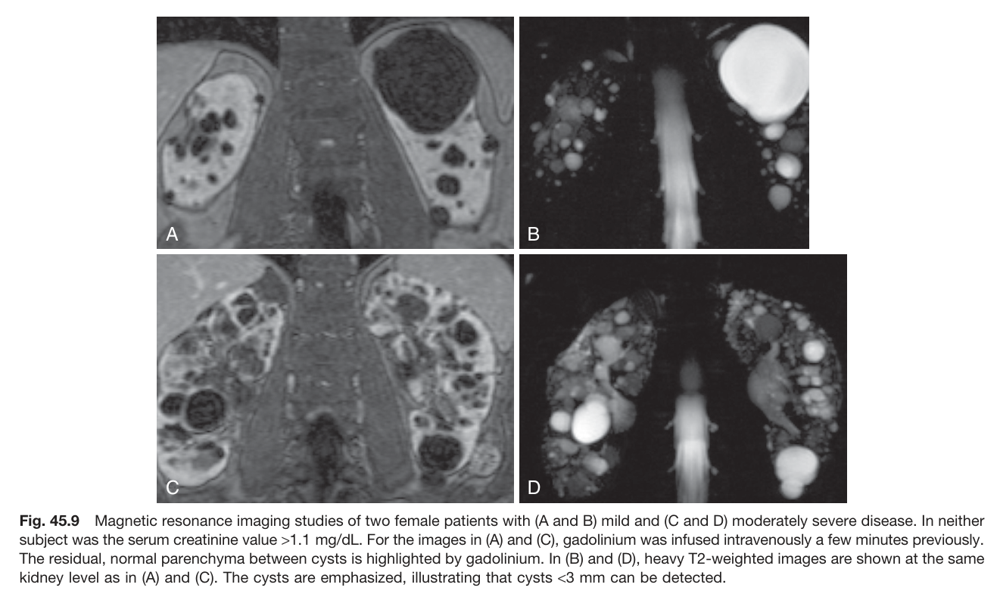

Fig. 45.9 Magnetic resonance imaging studies of two female patients with (A and B) mild and (C and D) moderately severe disease. In neither subject was the serum creatinine value >1.1 mg/dL. For the images in (A) and (C), gadolinium was infused intravenously a few minutes previously. The residual, normal parenchyma between cysts is highlighted by gadolinium. In (B) and (D), heavy T2-weighted images are shown at the same kidney level as in (A) and (C). The cysts are emphasized, illustrating that cysts <3 mm can be detected.

---

### Fig_45_10

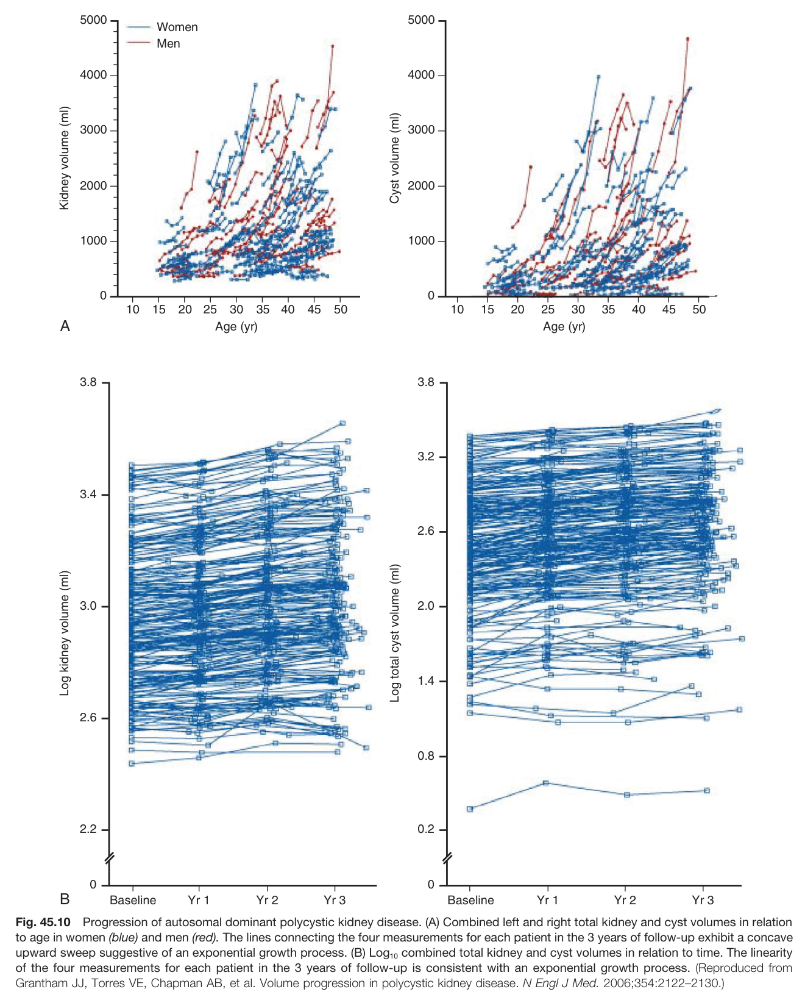

Fig. 45.10 Progression of autosomal dominant polycystic kidney disease. (A) Combined left and right total kidney and cyst volumes in relation to age in women (blue) and men (red). The lines connecting the four measurements for each patient in the 3 years of follow-up exhibit a concave upward sweep suggestive of an exponential growth process. (B) Log10 combined total kidney and cyst volumes in relation to time. The linearity of the four measurements for each patient in the 3 years of follow-up is consistent with an exponential growth process. (Reproduced from Grantham JJ, Torres VE, Chapman AB, et al. Volume progression in polycystic kidney disease. N Engl J Med. 2006;354:2122-2130.)

---

### Fig_45_11

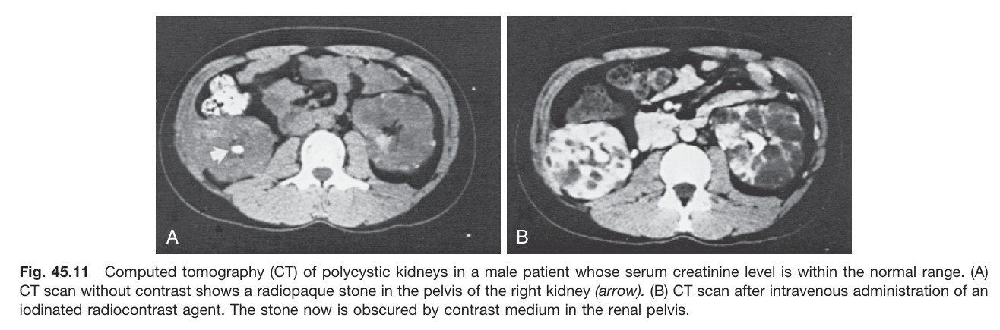

Fig. 45.11 Computed tomography (CT) of polycystic kidneys in a male patient whose serum creatinine level is within the normal range. (A) CT scan without contrast shows a radiopaque stone in the pelvis of the right kidney (arrow). (B) CT scan after intravenous administration of an iodinated radiocontrast agent. The stone now is obscured by contrast medium in the renal pelvis.

---

### Fig_45_12

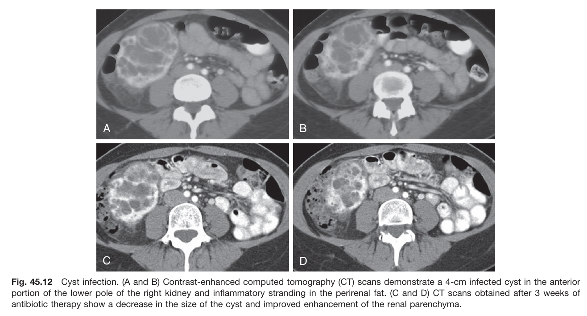

Fig. 45.12 Cyst infection. (A and B) Contrast-enhanced computed tomography (CT) scans demonstrate a 4-cm infected cyst in the anterior portion of the lower pole of the right kidney and inflammatory stranding in the perirenal fat. (C and D) CT scans obtained after 3 weeks of antibiotic therapy show a decrease in the size of the cyst and improved enhancement of the renal parenchyma.

---

### Fig_45_13

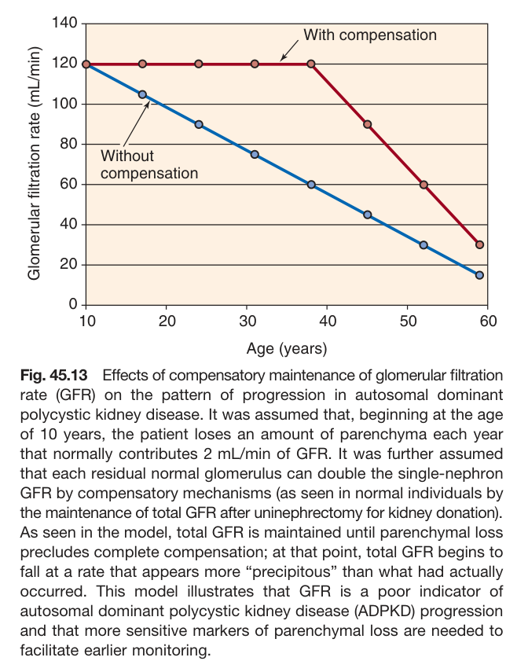

Fig. 45.13 Effects of compensatory maintenance of glomerular filtration rate (GFR) on the pattern of progression in autosomal dominant polycystic kidney disease. It was assumed that, beginning at the age of 10 years, the patient loses an amount of parenchyma each year that normally contributes 2 mL/min of GFR. It was further assumed that each residual normal glomerulus can double the single-nephron GFR by compensatory mechanisms (as seen in normal individuals by the maintenance of total GFR after uninephrectomy for kidney donation). As seen in the model, total GFR is maintained until parenchymal loss precludes complete compensation; at that point, total GFR begins to fall at a rate that appears more "precipitous" than what had actually occurred. This model illustrates that GFR is a poor indicator of autosomal dominant polycystic kidney disease (ADPKD) progression and that more sensitive markers of parenchymal loss are needed to facilitate earlier monitoring.

---

### Fig_45_14

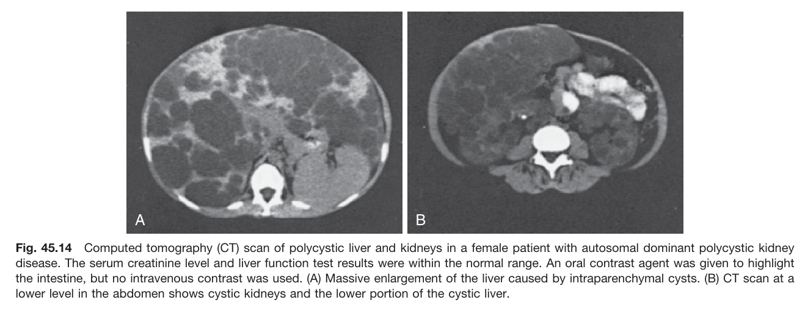

Fig. 45.14 Computed tomography (CT) scan of polycystic liver and kidneys in a female patient with autosomal dominant polycystic kidney disease. The serum creatinine level and liver function test results were within the normal range. An oral contrast agent was given to highlight the intestine, but no intravenous contrast was used. (A) Massive enlargement of the liver caused by intraparenchymal cysts. (B) CT scan at a lower level in the abdomen shows cystic kidneys and the lower portion of the cystic liver.

---

### Fig_45_15

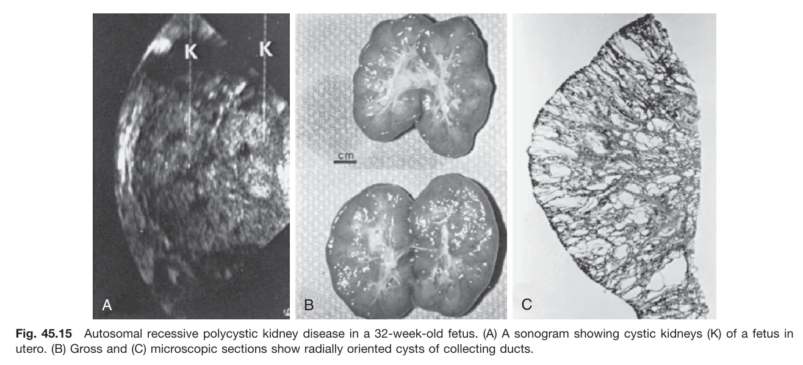

Fig. 45.15 Autosomal recessive polycystic kidney disease in a 32-week-old fetus. (A) A sonogram showing cystic kidneys (K) of a fetus in utero. (B) Gross and (C) microscopic sections show radially oriented cysts of collecting ducts.

---

### Fig_45_16

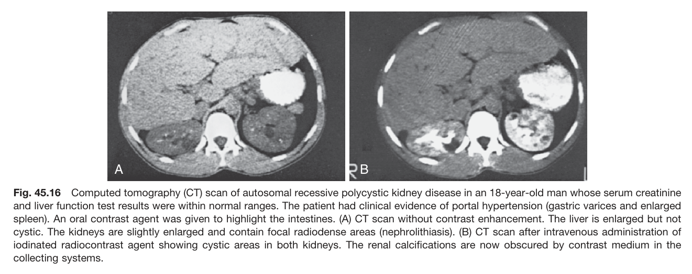

Fig. 45.16 Computed tomography (CT) scan of autosomal recessive polycystic kidney disease in an 18-year-old man whose serum creatinine and liver function test results were within normal ranges. The patient had clinical evidence of portal hypertension (gastric varices and enlarged spleen). An oral contrast agent was given to highlight the intestines. (A) CT scan without contrast enhancement. The liver is enlarged but not cystic. The kidneys are slightly enlarged and contain focal radiodense areas (nephrolithiasis). (B) CT scan after intravenous administration of iodinated radiocontrast agent showing cystic areas in both kidneys. The renal calcifications are now obscured by contrast medium in the collecting systems.

---

### Fig_45_17

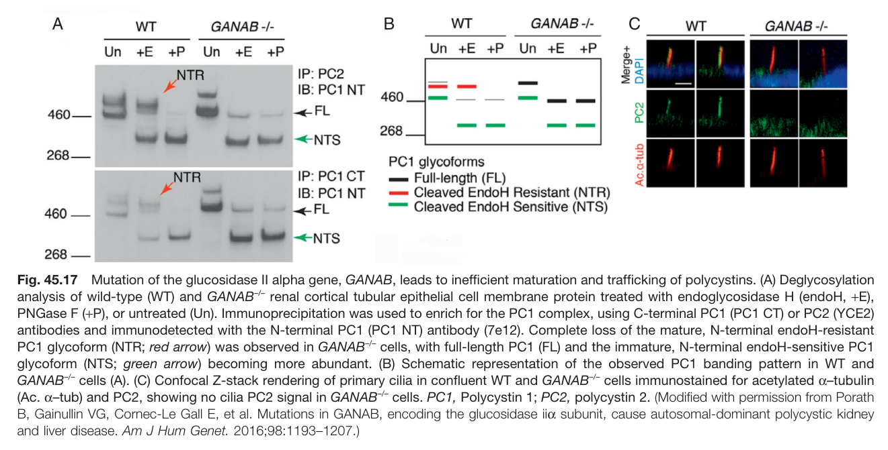

Fig. 45.17 Mutation of the glucosidase II alpha gene, GANAB, leads to inefficient maturation and trafficking of polycystins. (A) Deglycosylation analysis of wild-type (WT) and GANAB- renal cortical tubular epithelial cell membrane protein treated with endoglycosidase H (endoH, +E), PNGase F (+P), or untreated (Un). Immunoprecipitation was used to enrich for the PC1 complex, using C-terminal PC1 (PC1 CT) or PC2 (YCE2) antibodies and immunodetected with the N-terminal PC1 (PC1 NT) antibody (7e12). Complete loss of the mature, N-terminal endoH-resistant PC1 glycoform (NTR; red arrow) was observed in GANAB-- cells, with full-length PC1 (FL) and the immature, N-terminal endoH-sensitive PC1 glycoform (NTS; green arrow) becoming more abundant. (B) Schematic representation of the observed PC1 banding pattern in WT and GANAB- cells (A). (C) Confocal Z-stack rendering of primary cilia in confluent WT and GANAB¯¹- cells immunostained for acetylated a-tubulin (Ac. α-tub) and PC2, showing no cilia PC2 signal in GANAB-- cells. PC1, Polycystin 1; PC2, polycystin 2. (Modified with permission from Porath B, Gainullin VG, Cornec-Le Gall E, et al. Mutations in GANAB, encoding the glucosidase iia subunit, cause autosomal-dominant polycystic kidney and liver disease. Am J Hum Genet. 2016;98:1193-1207.)

---

### Fig_45_18

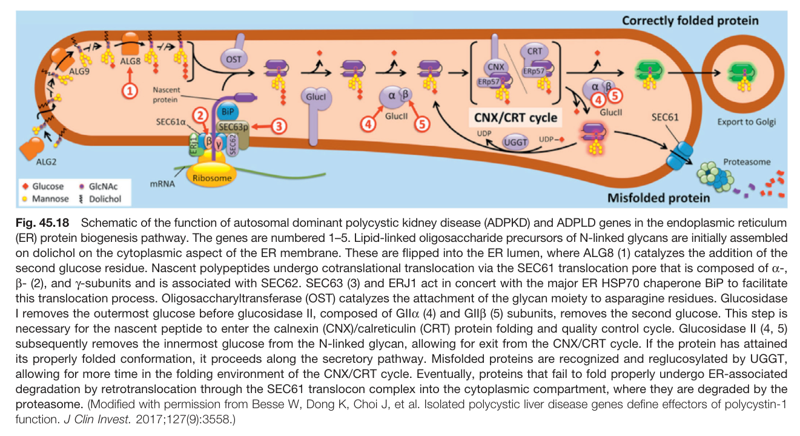

Fig. 45.18 Schematic of the function of autosomal dominant polycystic kidney disease (ADPKD) and ADPLD genes in the endoplasmic reticulum (ER) protein biogenesis pathway. The genes are numbered 1-5. Lipid-linked oligosaccharide precursors of N-linked glycans are initially assembled on dolichol on the cytoplasmic aspect of the ER membrane. These are flipped into the ER lumen, where ALG8 (1) catalyzes the addition of the second glucose residue. Nascent polypeptides undergo cotranslational translocation via the SEC61 translocation pore that is composed of α-, β- (2), and y-subunits and is associated with SEC62. SEC63 (3) and ERJ1 act in concert with the major ER HSP70 chaperone BiP to facilitate this translocation process. Oligosaccharyltransferase (OST) catalyzes the attachment of the glycan moiety to asparagine residues. Glucosidase I removes the outermost glucose before glucosidase II, composed of Glla (4) and GlIẞ (5) subunits, removes the second glucose. This step is necessary for the nascent peptide to enter the calnexin (CNX)/calreticulin (CRT) protein folding and quality control cycle. Glucosidase II (4, 5) subsequently removes the innermost glucose from the N-linked glycan, allowing for exit from the CNX/CRT cycle. If the protein has attained its properly folded conformation, it proceeds along the secretory pathway. Misfolded proteins are recognized and reglucosylated by UGGT, allowing for more time in the folding environment of the CNX/CRT cycle. Eventually, proteins that fail to fold properly undergo ER-associated degradation by retrotranslocation through the SEC61 translocon complex into the cytoplasmic compartment, where they are degraded by the proteasome. (Modified with permission from Besse W, Dong K, Choi J, et al. Isolated polycystic liver disease genes define effectors of polycystin 1 function. J Clin Invest. 2017;127(9):3558.)

---

### Fig_45_19

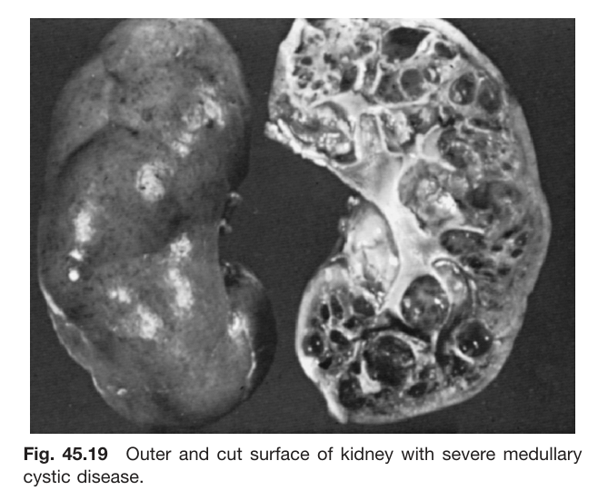

Fig. 45.19 Outer and cut surface of kidney with severe medullary cystic disease.

---

### Fig_45_20

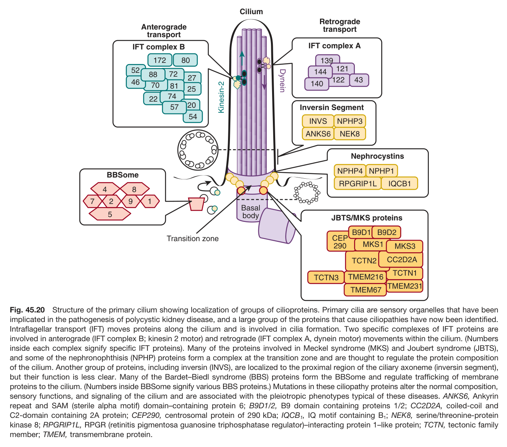

Fig. 45.20 Structure of the primary cilium showing localization of groups of cilioproteins. Primary cilia are sensory organelles that have been implicated in the pathogenesis of polycystic kidney disease, and a large group of the proteins that cause ciliopathies have now been identified. Intraflagellar transport (IFT) moves proteins along the cilium and is involved in cilia formation. Two specific complexes of IFT proteins are involved in anterograde (IFT complex B; kinesin 2 motor) and retrograde (IFT complex A, dynein motor) movements within the cilium. (Numbers inside each complex signify specific IFT proteins). Many of the proteins involved in Meckel syndrome (MKS) and Joubert syndrome (JBTS), and some of the nephronophthisis (NPHP) proteins form a complex at the transition zone and are thought to regulate the protein composition of the cilium. Another group of proteins, including inversin (INVS), are localized to the proximal region of the ciliary axoneme (inversin segment), but their function is less clear. Many of the Bardet-Biedl syndrome (BBS) proteins form the BBSome and regulate trafficking of membrane proteins to the cilium. (Numbers inside BBSome signify various BBS proteins.) Mutations in these ciliopathy proteins alter the normal composition, sensory functions, and signaling of the cilium and are associated with the pleiotropic phenotypes typical of these diseases. ANKS6, Ankyrin repeat and SAM (sterile alpha motif) domain-containing protein 6; B9D1/2, B9 domain containing proteins 1/2; CC2D2A, coiled-coil and C2-domain containing 2A protein; CEP290, centrosomal protein of 290 kDa; IQCB1, IQ motif containing B₁; NEK8, serine/threonine-protein kinase 8; RPGRIP1L, RPGR (retinitis pigmentosa guanosine triphosphatase regulator)-interacting protein 1-like protein; TCTN, tectonic family member; TMEM, transmembrane protein.

---

### Fig_45_21

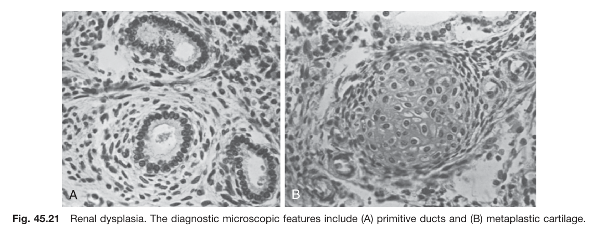

Fig. 45.21 Renal dysplasia. The diagnostic microscopic features include (A) primitive ducts and (B) metaplastic cartilage.

---

### Fig_45_22

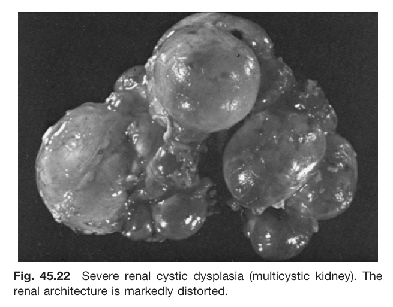

Fig. 45.22 Severe renal cystic dysplasia (multicystic kidney). The renal architecture is markedly distorted.

---

### Fig_45_23

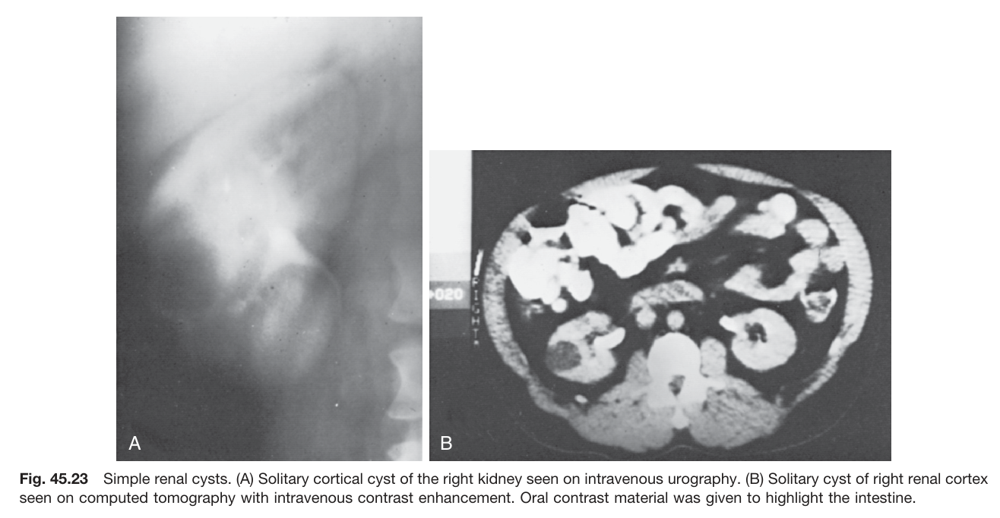

Fig. 45.23 Simple renal cysts. (A) Solitary cortical cyst of the right kidney seen on intravenous urography. (B) Solitary cyst of right renal cortex seen on computed tomography with intravenous contrast enhancement. Oral contrast material was given to highlight the intestine.

---

### Fig_45_24

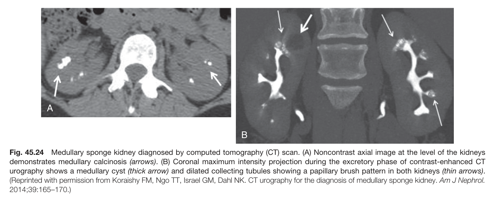

Fig. 45.24 Medullary sponge kidney diagnosed by computed tomography (CT) scan. (A) Noncontrast axial image at the level of the kidneys demonstrates medullary calcinosis (arrows). (B) Coronal maximum intensity projection during the excretory phase of contrast-enhanced CT urography shows a medullary cyst (thick arrow) and dilated collecting tubules showing a papillary brush pattern in both kidneys (thin arrows). (Reprinted with permission from Koraishy FM, Ngo TT, Israel GM, Dahl NK. CT urography for the diagnosis of medullary sponge kidney. Am J Nephrol. 2014;39:165-170.)

---

### Fig_45_25

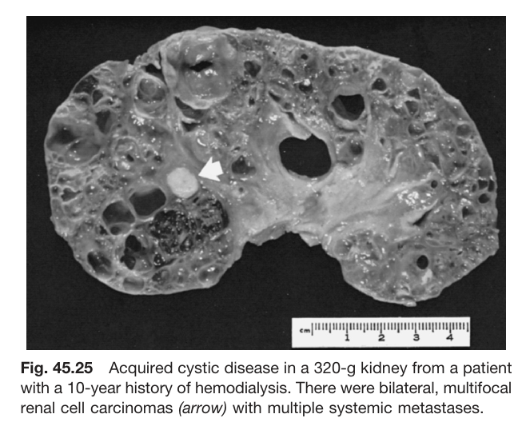

Fig. 45.25 Acquired cystic disease in a 320-g kidney from a patient with a 10-year history of hemodialysis. There were bilateral, multifocal renal cell carcinomas (arrow) with multiple systemic metastases.

---

### Fig_45_26

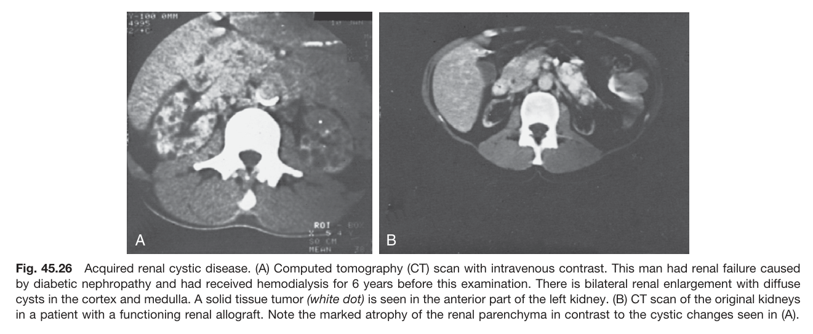

Fig. 45.26 Acquired renal cystic disease. (A) Computed tomography (CT) scan with intravenous contrast. This man had renal failure caused by diabetic nephropathy and had received hemodialysis for 6 years before this examination. There is bilateral renal enlargement with diffuse cysts in the cortex and medulla. A solid tissue tumor (white dot) is seen in the anterior part of the left kidney. (B) CT scan of the original kidneys in a patient with a functioning renal allograft. Note the marked atrophy of the renal parenchyma in contrast to the cystic changes seen in (A).

---

## Tables

### Table_45_1

#### Table Image

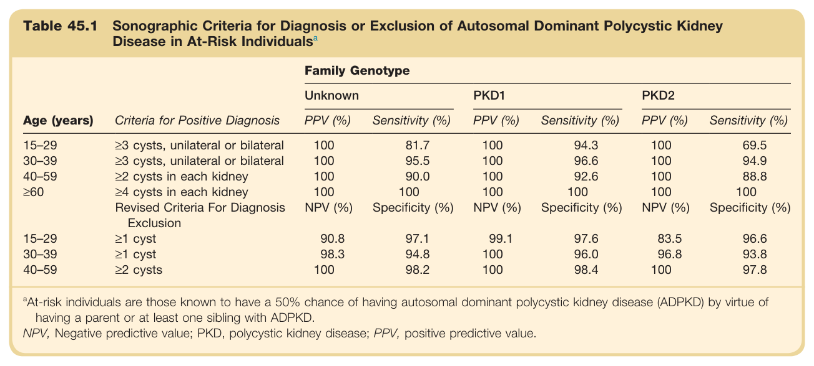

#### Table Data (CSV: [Table_45_1.csv](Table_45_1.csv))

```markdown
| Table Text (OCR) |
| :--- |
| Table 45.1 Sonographic Criteria for Diagnosis or Exclusion of Autosomal Dominant Polycystic Kidney Disease in At-Risk Individuals<sup>a</sup> Age (years)  Criteria for Positive Diagnosis  Family Genotype    Unknown  PKD1  PKD2    PPV (%)  Sensitivity (%)  PPV (%)  Sensitivity (%)  PPV (%)  Sensitivity (%)    15–29  ≥3 cysts, unilateral or bilateral  100  81.7  100  94.3  100  69.5    30–39  ≥3 cysts, unilateral or bilateral  100  95.5  100  96.6  100  94.9    40–59  ≥2 cysts in each kidney  100  90.0  100  92.6  100  88.8    ≥60  ≥4 cysts in each kidney  100  100  100  100  100  100      Revised Criteria For Diagnosis Exclusion  NPV (%)  Specificity (%)  NPV (%)  Specificity (%)  NPV (%)  Specificity (%)    15–29  ≥1 cyst  90.8  97.1  99.1  97.6  83.5  96.6    30–39  ≥1 cyst  98.3  94.8  100  96.0  96.8  93.8    40–59  ≥2 cysts  100  98.2  100  98.4  100  97.8 <sup>a</sup>At-risk individuals are those known to have a 50% chance of having autosomal dominant polycystic kidney disease (ADPKD) by virtue of having a parent or at least one sibling with ADPKD. NPV, Negative predictive value; PKD, polycystic kidney disease; PPV, positive predictive value. |
```

Table 45.1 Sonographic Criteria for Diagnosis or Exclusion of Autosomal Dominant Polycystic Kidney Disease in At-Risk Individuals | Age (years) | Criteria for Positive Diagnosis | Family Genotype | | | PKD1 | | PKD2 | | | :----------------------------------------------------------- | :------------------------------------------- | :-------------: | :-----------------: | :--: | :---------: | :-----------------: | :---------: | :-----------------: | | | | **PPV (%)** | **Sensitivity (%)** | | **PPV (%)** | **Sensitivity (%)** | **PPV (%)** | **Sensitivity (%)** | | 15-29 | ≥3 cysts, unilateral or bilateral | 100 | 81.7 | | 100 | 94.3 | 100 | 69.5 | | 30-39 | ≥3 cysts, unilateral or bilateral | 100 | 95.5 | | 100 | 96.6 | 100 | 94.9 | | 40-59 | ≥2 cysts in each kidney | 100 | 90.0 | | 100 | 92.6 | 100 | 88.8 | | ≥60 | ≥4 cysts in each kidney | 100 | 100 | | 100 | 100 | 100 | 100 | | | **Revised Criteria For Diagnosis Exclusion** | **NPV (%)** | **Specificity (%)** | | **NPV (%)** | **Specificity (%)** | **NPV (%)** | **Specificity (%)** | | 15-29 | ≥1 cyst | 90.8 | 97.1 | | 99.1 | 97.6 | 83.5 | 96.6 | | 30-39 | ≥1 cyst | 98.3 | 94.8 | | 100 | 96.0 | 96.8 | 93.8 | | 40-59 | ≥2 cysts | 100 | 98.2 | | 100 | 98.4 | 100 | 97.8 | | *At-risk individuals are those known to have a 50% chance of having autosomal dominant polycystic kidney disease (ADPKD) by virtue of having a parent or at least one sibling with ADPKD.* | | | | | | | | | | *NPV, Negative predictive value; PKD, polycystic kidney disease; PPV, positive predictive value.* | | | | | | | | |

---

### Table_45_2

#### Table Images (2 Parts)

- **Part 1 (Page 33)**:
  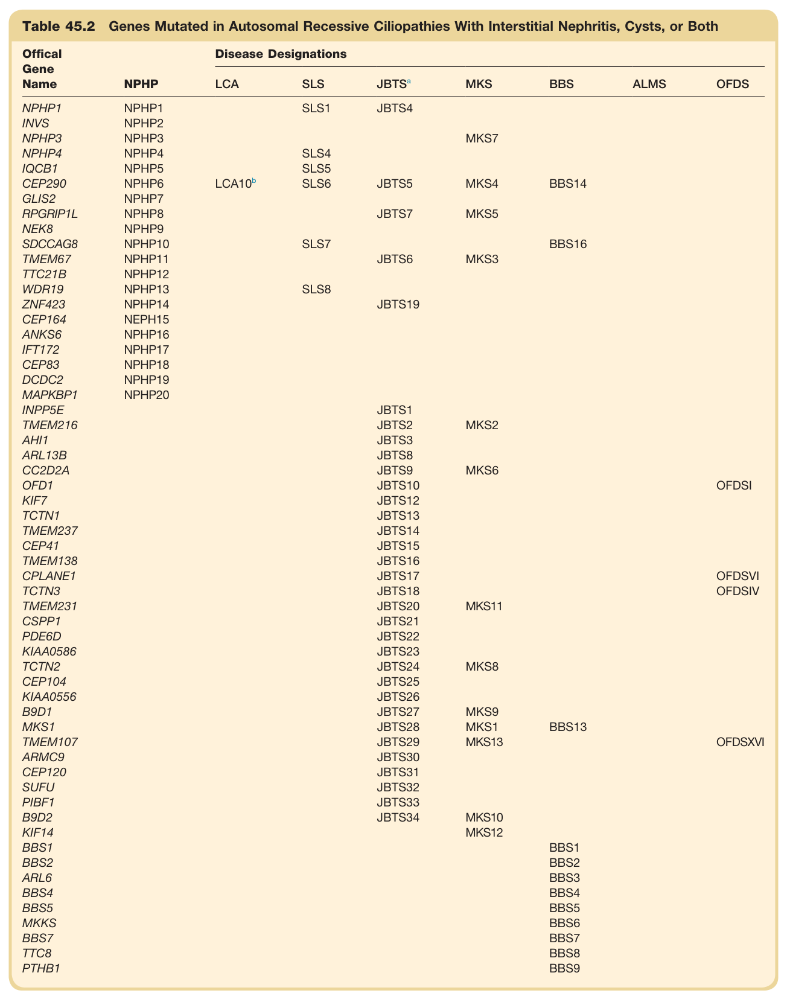

- **Part 2 (Page 34)**:
  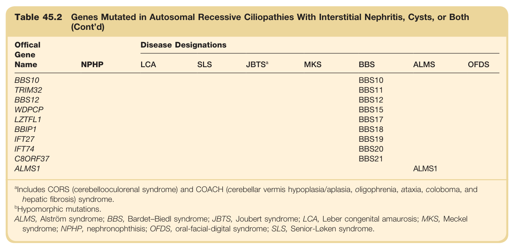

#### Table Data (CSV: [Table_45_2.csv](Table_45_2.csv))

```markdown
| Table Text (OCR) |
| :--- |
| Table 45.2 Genes Mutated in Autosomal Recessive Ciliopathies With Interstitial Nephritis, Cysts, or Both Official Gene Name  NPHP  Disease Designations    LCA  SLS   JBTS^a   MKS  BBS  ALMS  OFDS    NPHP1  NPHP1    SLS1  JBTS4            INVS  NPHP2                  NPHP3  NPHP3        MKS7          NPHP4  NPHP4    SLS4              IQCB1  NPHP5    SLS5              CEP290  NPHP6   LCA10^b   SLS6  JBTS5  MKS4  BBS14        GLIS2  NPHP7                  RPGRIP1L  NPHP8      JBTS7  MKS5          NEK8  NPHP9                  SDCCAG8  NPHP10    SLS7      BBS16        TMEM67  NPHP11      JBTS6  MKS3          TTC21B  NPHP12                  WDR19  NPHP13    SLS8              ZNF423  NPHP14      JBTS19            CEP164  NEPH15                  ANKS6  NPHP16                  IFT172  NPHP17                  CEP83  NPHP18                  DCDC2  NPHP19                  MAPKBP1  NPHP20                  INPP5E        JBTS1            TMEM216        JBTS2  MKS2          AHI1        JBTS3            ARL13B        JBTS8            CC2D2A        JBTS9  MKS6          OFD1        JBTS10        OFDSI    KIF7        JBTS12            TCTN1        JBTS13            TMEM237        JBTS14            CEP41        JBTS15            TMEM138        JBTS16            CPLANE1        JBTS17        OFDSVI    TCTN3        JBTS18        OFDSIV    TMEM231        JBTS20  MKS11          CSPP1        JBTS21            PDE6D        JBTS22            KIAA0586        JBTS23            TCTN2        JBTS24  MKS8          CEP104        JBTS25            KIAA0556        JBTS26            B9D1        JBTS27  MKS9          MKS1        JBTS28  MKS1  BBS13        TMEM107        JBTS29  MKS13      OFDSXVI    ARMC9        JBTS30            CEP120        JBTS31            SUFU        JBTS32            PIBF1        JBTS33            B9D2        JBTS34  MKS10          KIF14          MKS12          BBS1            BBS1        BBS2            BBS2        ARL6            BBS3        BBS4            BBS4        BBS5            BBS5        MKKS            BBS6        BBS7            BBS7        TTC8            BBS8        PTHB1            BBS9        BBS10            BBS10        TRIM32            BBS11        BBS12            BBS12        WDPCP            BBS15        LZTFL1            BBS17        BBIP1            BBS18        IFT27            BBS19        IFT74            BBS20        C8ORF37            BBS21        ALMS1              ALMS1 <sup>a</sup>Includes CORS (cerebellooculorenal syndrome) and COACH (cerebellar vermis hypoplasia/aplasia, oligophrenia, ataxia, coloboma, and hepatic fibrosis) syndrome. <sup>b</sup>Hypomorphic mutations. ALMS, Alström syndrome; BBS, Bardet–Biedl syndrome; JBTS, Joubert syndrome; LCA, Leber congenital amaurosis; MKS, Meckel syndrome; NPHP, nephronophthisis; OFDS, oral-facial-digital syndrome; SLS, Senior-Løken syndrome. |
```

Table 45.2 Genes Mutated in Autosomal Recessive Ciliopathies With Interstitial Nephritis, Cysts, or Both | Official Gene Name | Disease Designations | | | | | | | | | :----------------------------------------------------------- | :------------------- | :------ | :------ | :-------- | :------ | :------ | :------- | :------- | | | **NPHP** | **LCA** | **SLS** | **JBTSa** | **MKS** | **BBS** | **ALMS** | **OFDS** | | NPHP1 | NPHP1 | | SLS1 | JBTS4 | | | | | | INVS | NPHP2 | | | | | | | | | NPHP3 | NPHP3 | | | | MKS7 | | | | | NPHP4 | NPHP4 | | SLS4 | | | | | | | IQCB1 | NPHP5 | | SLS5 | | | | | | | CEP290 | NPHP6 | LCA10b | SLS6 | JBTS5 | MKS4 | BBS14 | | | | GLIS2 | NPHP7 | | | | | | | | | RPGRIP1L | NPHP8 | | | JBTS7 | MKS5 | | | | | NEK8 | NPHP9 | | | | | | | | | SDCCAG8 | NPHP10 | | SLS7 | | | BBS16 | | | | TMEM67 | NPHP11 | | | JBTS6 | MKS3 | | | | | TTC21B | NPHP12 | | | | | | | | | WDR19 | NPHP13 | | SLS8 | | | | | | | ZNF423 | NPHP14 | | | JBTS19 | | | | | | CEP164 | NEPH15 | | | | | | | | | ANKS6 | NPHP16 | | | | | | | | | IFT172 | NPHP17 | | | | | | | | | CEP83 | NPHP18 | | | | | | | | | DCDC2 | NPHP19 | | | | | | | | | MAPKBP1 | NPHP20 | | | | | | | | | INPP5E | | | | JBTS1 | | | | | | TMEM216 | | | | JBTS2 | MKS2 | | | | | AHI1 | | | | JBTS3 | | | | | | ARL13B | | | | JBTS8 | | | | | | CC2D2A | | | | JBTS9 | MKS6 | | | | | OFD1 | | | | JBTS10 | | | | OFDSI | | KIF7 | | | | JBTS12 | | | | | | TCTN1 | | | | JBTS13 | | | | | | TMEM237 | | | | JBTS14 | | | | | | CEP41 | | | | JBTS15 | | | | | | TMEM138 | | | | JBTS16 | | | | | | CPLANE1 | | | | JBTS17 | | | | OFDSVI | | TCTN3 | | | | JBTS18 | | | | OFDSIV | | TMEM231 | | | | JBTS20 | MKS11 | | | | | CSPP1 | | | | JBTS21 | | | | | | PDE6D | | | | JBTS22 | | | | | | KIAA0586 | | | | JBTS23 | | | | | | TCTN2 | | | | JBTS24 | MKS8 | | | | | CEP104 | | | | JBTS25 | | | | | | KIAA0556 | | | | JBTS26 | | | | | | B9D1 | | | | JBTS27 | MKS9 | | | | | MKS1 | | | | JBTS28 | MKS1 | BBS13 | | | | TMEM107 | | | | JBTS29 | MKS13 | | | OFDSXVI | | ARMC9 | | | | JBTS30 | | | | | | CEP120 | | | | JBTS31 | | | | | | SUFU | | | | JBTS32 | | | | | | PIBF1 | | | | JBTS33 | | | | | | B9D2 | | | | JBTS34 | MKS10 | | | | | KIF14 | | | | | MKS12 | | | | | BBS1 | | | | | | BBS1 | | | | BBS2 | | | | | | BBS2 | | | | ARL6 | | | | | | BBS3 | | | | BBS4 | | | | | | BBS4 | | | | BBS5 | | | | | | BBS5 | | | | MKKS | | | | | | BBS6 | | | | BBS7 | | | | | | BBS7 | | | | TTC8 | | | | | | BBS8 | | | | PTHB1 | | | | | | BBS9 | | | | BBS10 | | | | | | BBS10 | | | | TRIM32 | | | | | | BBS11 | | | | BBS12 | | | | | | BBS12 | | | | WDPCP | | | | | | BBS15 | | | | LZTFL1 | | | | | | BBS17 | | | | BBIP1 | | | | | | BBS18 | | | | IFT27 | | | | | | BBS19 | | | | IFT74 | | | | | | BBS20 | | | | C8ORF37 | | | | | | BBS21 | | | | ALMS1 | | | | | | | ALMS1 | | | *aIncludes CORS (cerebellooculorenal syndrome) and COACH (cerebellar vermis hypoplasia/aplasia, oligophrenia, ataxia, coloboma, and hepatic fibrosis) syndrome.* | | | | | | | | | | *bHypomorphic mutations.* | | | | | | | | | | *ALMS, Alström syndrome; BBS, Bardet-Biedl syndrome; JBTS, Joubert syndrome; LCA, Leber congenital amaurosis; MKS, Meckel syndrome; NPHP, nephronophthisis; OFDS, oral-facial-digital syndrome; SLS, Senior-Løken syndrome.* | | | | | | | | |

---

## Boxes

### Box_45_1

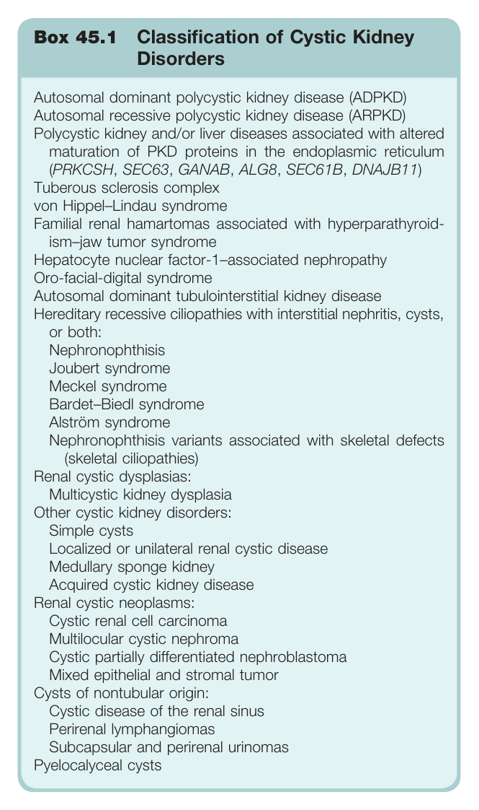

#### Box Text

```markdown
Box 45.1 Classification of Cystic Kidney Disorders * Autosomal dominant polycystic kidney disease (ADPKD) * Autosomal recessive polycystic kidney disease (ARPKD) * Polycystic kidney and/or liver diseases associated with altered maturation of PKD proteins in the endoplasmic reticulum (PRKCSH, SEC63, GANAB, ALG8, SEC61B, DNAJB11) * Tuberous sclerosis complex * von Hippel-Lindau syndrome * Familial renal hamartomas associated with hyperparathyroidism-jaw tumor syndrome * Hepatocyte nuclear factor-1-associated nephropathy * Oro-facial-digital syndrome * Autosomal dominant tubulointerstitial kidney disease * Hereditary recessive ciliopathies with interstitial nephritis, cysts, or both: * Nephronophthisis * Joubert syndrome * Meckel syndrome * Bardet-Biedl syndrome * Alström syndrome * Nephronophthisis variants associated with skeletal defects (skeletal ciliopathies) * Renal cystic dysplasias: * Multicystic kidney dysplasia * Other cystic kidney disorders: * Simple cysts * Localized or unilateral renal cystic disease * Medullary sponge kidney * Acquired cystic kidney disease * Renal cystic neoplasms: * Cystic renal cell carcinoma * Multilocular cystic nephroma * Cystic partially differentiated nephroblastoma * Mixed epithelial and stromal tumor * Cysts of nontubular origin: * Cystic disease of the renal sinus * Perirenal lymphangiomas * Subcapsular and perirenal urinomas * Pyelocalyceal cysts
```

Box 45.1 Classification of Cystic Kidney Disorders * Autosomal dominant polycystic kidney disease (ADPKD) * Autosomal recessive polycystic kidney disease (ARPKD) * Polycystic kidney and/or liver diseases associated with altered maturation of PKD proteins in the endoplasmic reticulum (PRKCSH, SEC63, GANAB, ALG8, SEC61B, DNAJB11) * Tuberous sclerosis complex * von Hippel-Lindau syndrome * Familial renal hamartomas associated with hyperparathyroidism-jaw tumor syndrome * Hepatocyte nuclear factor-1-associated nephropathy * Oro-facial-digital syndrome * Autosomal dominant tubulointerstitial kidney disease * Hereditary recessive ciliopathies with interstitial nephritis, cysts, or both: * Nephronophthisis * Joubert syndrome * Meckel syndrome * Bardet-Biedl syndrome * Alström syndrome * Nephronophthisis variants associated with skeletal defects (skeletal ciliopathies) * Renal cystic dysplasias: * Multicystic kidney dysplasia * Other cystic kidney disorders: * Simple cysts * Localized or unilateral renal cystic disease * Medullary sponge kidney * Acquired cystic kidney disease * Renal cystic neoplasms: * Cystic renal cell carcinoma * Multilocular cystic nephroma * Cystic partially differentiated nephroblastoma * Mixed epithelial and stromal tumor * Cysts of nontubular origin: * Cystic disease of the renal sinus * Perirenal lymphangiomas * Subcapsular and perirenal urinomas * Pyelocalyceal cysts

---
