# 46. Primary and Secondary Hypertension - Figures and Tables Index

This document lists all figures, tables and boxes extracted from `46. Primary and Secondary Hypertension.pdf`.

## Table of Contents
- [Figures](#figures)
- [Tables](#tables)
- [Boxes](#boxes)

---

## Figures

### Fig_46_1

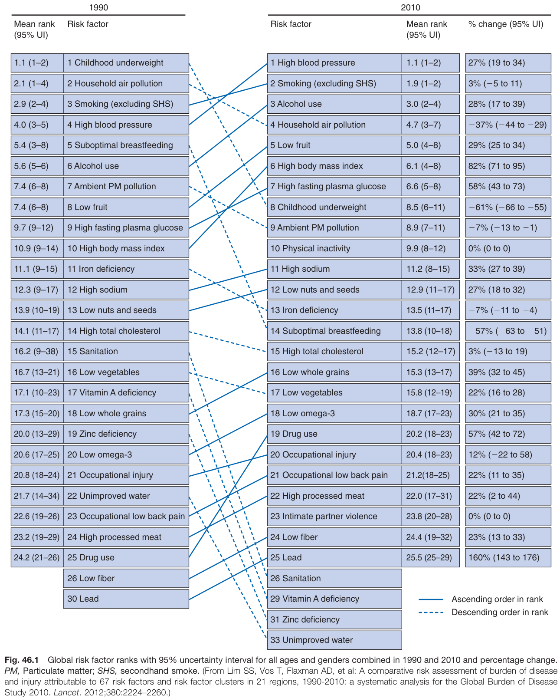

Fig. 46.1 Global risk factor ranks with 95% uncertainty interval for all ages and genders combined in 1990 and 2010 and percentage change. PM, Particulate matter; SHS, secondhand smoke. (From Lim SS, Vos T, Flaxman AD, et al: A comparative risk assessment of burden of disease and injury attributable to 67 risk factors and risk factor clusters in 21 regions, 1990-2010: a systematic analysis for the Global Burden of Disease Study 2010. Lancet. 2012;380:2224-2260.) **1990** | Mean rank (95% UI) | Risk factor | | :----------------- | :---------------------------- | | 1.1 (1-2) | 1 Childhood underweight | | 2.1 (1-4) | 2 Household air pollution | | 2.9 (2-4) | 3 Smoking (excluding SHS) | | 4.0 (3-5) | 4 High blood pressure | | 5.4 (3-8) | 5 Suboptimal breastfeeding | | 5.6 (5-6) | 6 Alcohol use | | 7.4 (6-8) | 7 Ambient PM pollution | | 7.4 (6-8) | 8 Low fruit | | 9.7 (9-12) | 9 High fasting plasma glucose | | 10.9 (9-14) | 10 High body mass index | | 11.1 (9-15) | 11 Iron deficiency | | 12.3 (9-17) | 12 High sodium | | 13.9 (10-19) | 13 Low nuts and seeds | | 14.1 (11-17) | 14 High total cholesterol | | 16.2 (9-38) | 15 Sanitation | | 16.7 (13-21) | 16 Low vegetables | | 17.1 (10-23) | 17 Vitamin A deficiency | | 17.3 (15-20) | 18 Low whole grains | | 20.0 (13-29) | 19 Zinc deficiency | | 20.6 (17-25) | 20 Low omega-3 | | 20.8 (18-24) | 21 Occupational injury | | 21.7 (14-34) | 22 Unimproved water | | 22.6 (19-26) | 23 Occupational low back pain | | 23.2 (19-29) | 24 High processed meat | | 24.2 (21-26) | 25 Drug use | | | 26 Low fiber | | | 30 Lead | **2010** | Risk factor | Mean rank (95% UI) | % change (95% UI) | | :---------------------------- | :----------------- | :---------------- | | 1 High blood pressure | 1.1 (1-2) | 27% (19 to 34) | | 2 Smoking (excluding SHS) | 1.9 (1-2) | 3% (-5 to 11) | | 3 Alcohol use | 3.0 (2-4) | 28% (17 to 39) | | 4 Household air pollution | 4.7 (3-7) | -37% (-44 to -29) | | 5 Low fruit | 5.0 (4-8) | 29% (25 to 34) | | 6 High body mass index | 6.1 (4-8) | 82% (71 to 95) | | 7 High fasting plasma glucose | 6.6 (5-8) | 58% (43 to 73) | | 8 Childhood underweight | 8.5 (6-11) | -61% (-66 to -55) | | 9 Ambient PM pollution | 8.9 (7-11) | -7% (-13 to -1) | | 10 Physical inactivity | 9.9 (8-12) | 0% (0 to 0) | | 11 High sodium | 11.2 (8-15) | 33% (27 to 39) | | 12 Low nuts and seeds | 12.9 (11-17) | 27% (18 to 32) | | 13 Iron deficiency | 13.5 (11-17) | -7% (-11 to -4) | | 14 Suboptimal breastfeeding | 13.8 (10-18) | -57% (-63 to -51) | | 15 High total cholesterol | 15.2 (12-17) | 3% (-13 to 19) | | 16 Low whole grains | 15.3 (13-17) | 39% (32 to 45) | | 17 Low vegetables | 15.8 (12-19) | 22% (16 to 28) | | 18 Low omega-3 | 18.7 (17-23) | 30% (21 to 35) | | 19 Drug use | 20.2 (18-23) | 57% (42 to 72) | | 20 Occupational injury | 20.4 (18-23) | 12% (-22 to 58) | | 21 Occupational low back pain | 21.2(18-25) | 22% (11 to 35) | | 22 High processed meat | 22.0 (17-31) | 22% (2 to 44) | | 23 Intimate partner violence | 23.8 (20-28) | 0% (0 to 0) | | 24 Low fiber | 24.4 (19-32) | 23% (13 to 33) | | 25 Lead | 25.5 (25-29) | 160% (143 to 176) | | 26 Sanitation | | | | 29 Vitamin A deficiency | | | | 31 Zinc deficiency | | | | 33 Unimproved water | | |

---

### Fig_46_2

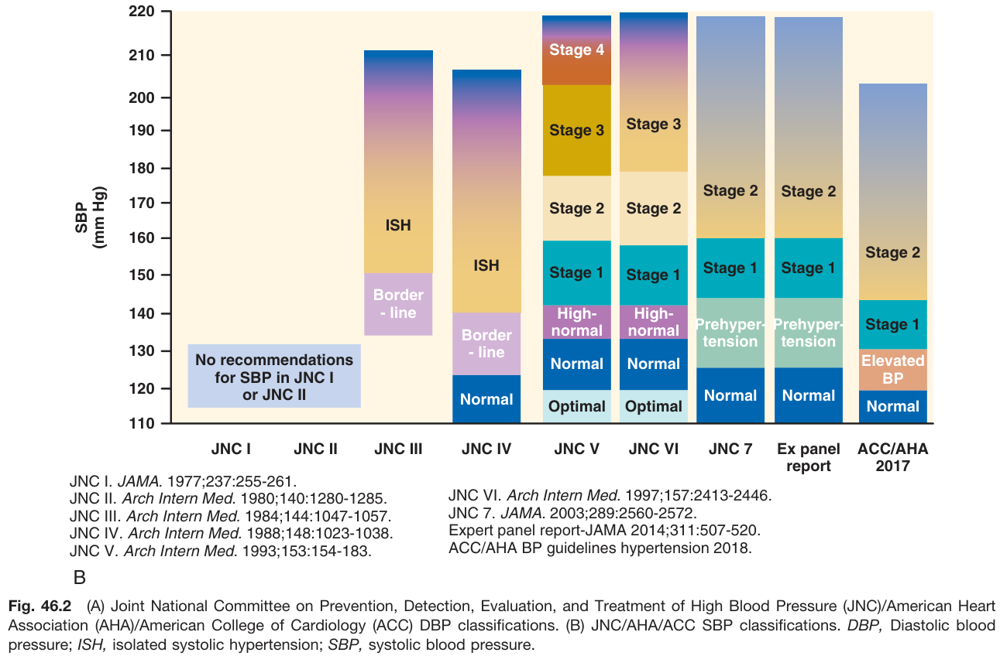

Fig. 46.2 (A) Joint National Committee on Prevention, Detection, Evaluation, and Treatment of High Blood Pressure (JNC)/American Heart Association (AHA)/American College of Cardiology (ACC) DBP classifications. (B) JNC/AHA/ACC SBP classifications. DBP, Diastolic blood pressure; ISH, isolated systolic hypertension; SBP, systolic blood pressure.

---

### Fig_46_3

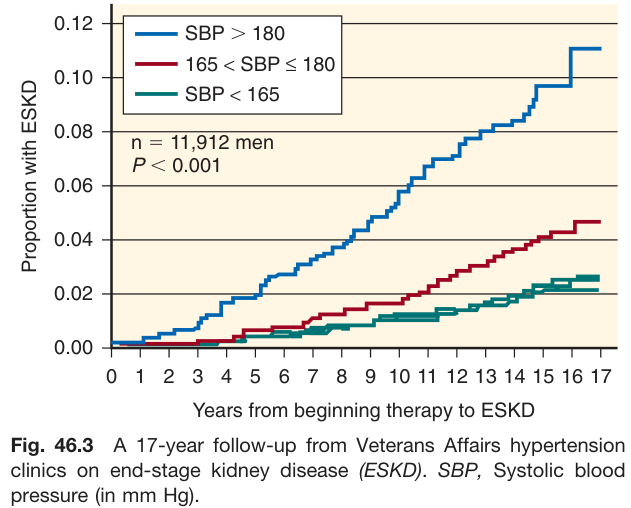

Fig. 46.3 A 17-year follow-up from Veterans Affairs hypertension clinics on end-stage kidney disease (ESKD). SBP, Systolic blood pressure (in mm Hg).

---

### Fig_46_4

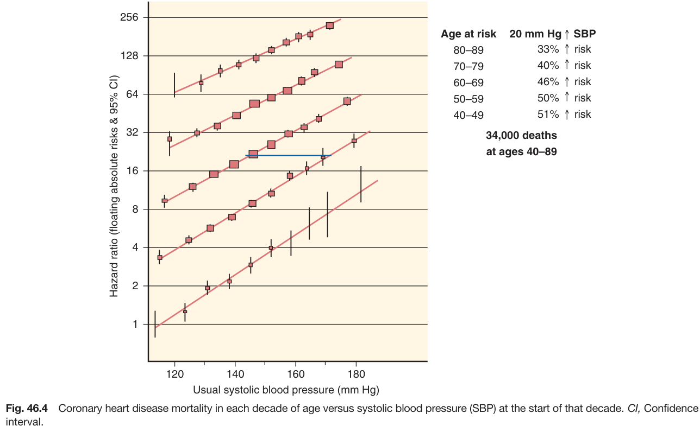

Fig. 46.4 Coronary heart disease mortality in each decade of age versus systolic blood pressure (SBP) at the start of that decade. Cl, Confidence interval.

---

### Fig_46_5

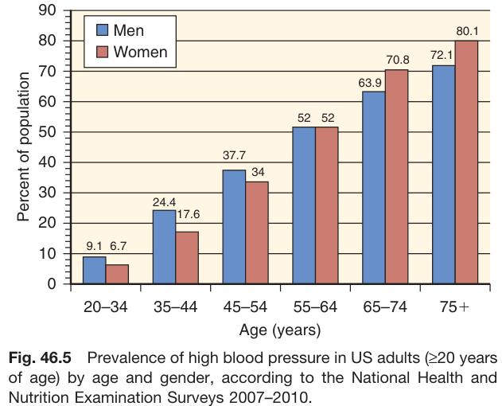

Fig. 46.5 Prevalence of high blood pressure in US adults (≥20 years of age) by age and gender, according to the National Health and Nutrition Examination Surveys 2007-2010.

---

### Fig_46_6

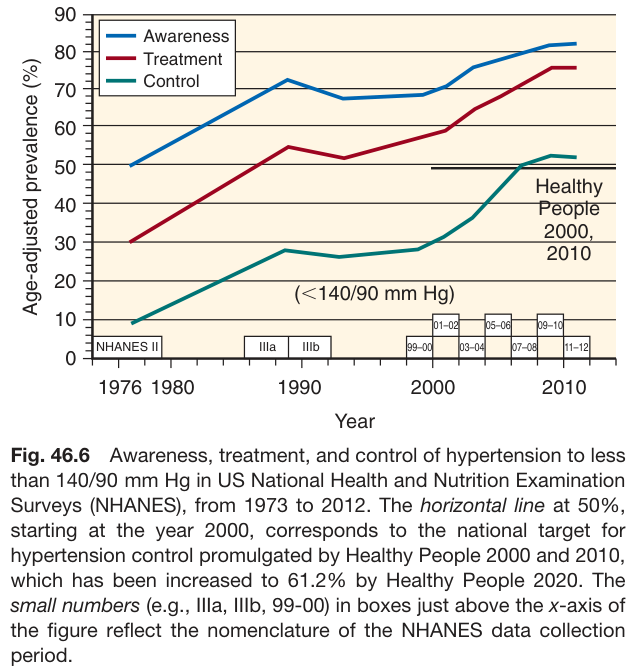

Fig. 46.6 Awareness, treatment, and control of hypertension to less than 140/90 mm Hg in US National Health and Nutrition Examination Surveys (NHANES), from 1973 to 2012. The horizontal line at 50%, starting at the year 2000, corresponds to the national target for hypertension control promulgated by Healthy People 2000 and 2010, which has been increased to 61.2% by Healthy People 2020. The small numbers (e.g., IIIa, IIIb, 99-00) in boxes just above the x-axis of the figure reflect the nomenclature of the NHANES data collection period.

---

### Fig_46_7

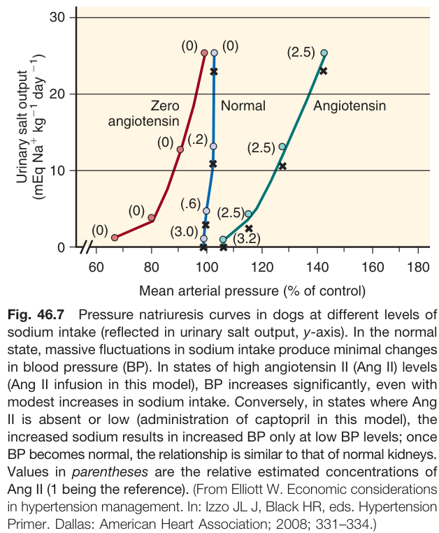

Fig. 46.7 Pressure natriuresis curves in dogs at different levels of sodium intake (reflected in urinary salt output, y-axis). In the normal state, massive fluctuations in sodium intake produce minimal changes in blood pressure (BP). In states of high angiotensin II (Ang II) levels (Ang II infusion in this model), BP increases significantly, even with modest increases in sodium intake. Conversely, in states where Ang II is absent or low (administration of captopril in this model), the increased sodium results in increased BP only at low BP levels; once BP becomes normal, the relationship is similar to that of normal kidneys. Values in parentheses are the relative estimated concentrations of Ang II (1 being the reference). (From Elliott W. Economic considerations in hypertension management. In: Izzo JL J, Black HR, eds. Hypertension Primer. Dallas: American Heart Association; 2008; 331-334.)

---

### Fig_46_8

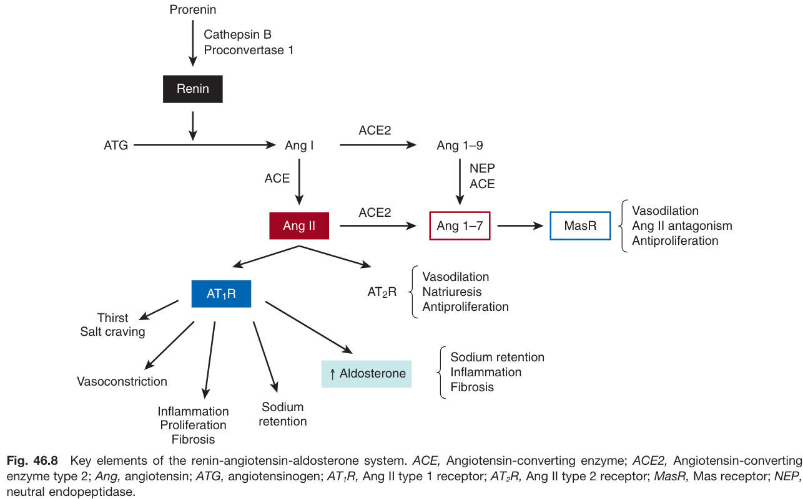

Fig. 46.8 Key elements of the renin-angiotensin-aldosterone system. ACE, Angiotensin-converting enzyme; ACE2, Angiotensin-converting enzyme type 2; Ang, angiotensin; ATG, angiotensinogen; AT₁R, Ang II type 1 receptor; AT2R, Ang II type 2 receptor; MasR, Mas receptor; NΕΡ, neutral endopeptidase.

---

### Fig_46_9

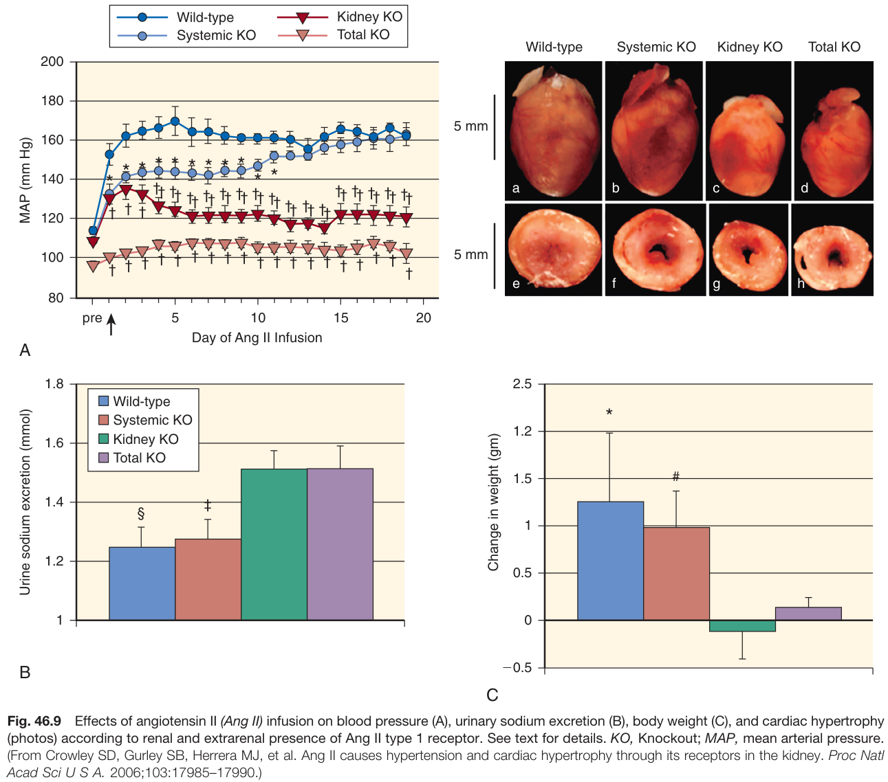

Fig. 46.9 Effects of angiotensin II (Ang II) infusion on blood pressure (A), urinary sodium excretion (B), body weight (C), and cardiac hypertrophy (photos) according to renal and extrarenal presence of Ang II type 1 receptor. See text for details. KO, Knockout; MAP, mean arterial pressure. (From Crowley SD, Gurley SB, Herrera MJ, et al. Ang II causes hypertension and cardiac hypertrophy through its receptors in the kidney. Proc Natl Acad Sci US A. 2006;103:17985-17990.)

---

### Fig_46_10

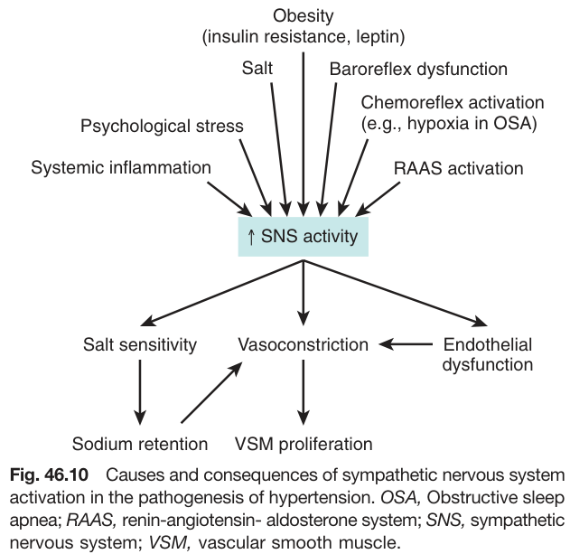

Fig. 46.10 Causes and consequences of sympathetic nervous system activation in the pathogenesis of hypertension. OSA, Obstructive sleep apnea; RAAS, renin-angiotensin- aldosterone system; SNS, sympathetic nervous system; VSM, vascular smooth muscle.

---

### Fig_46_11

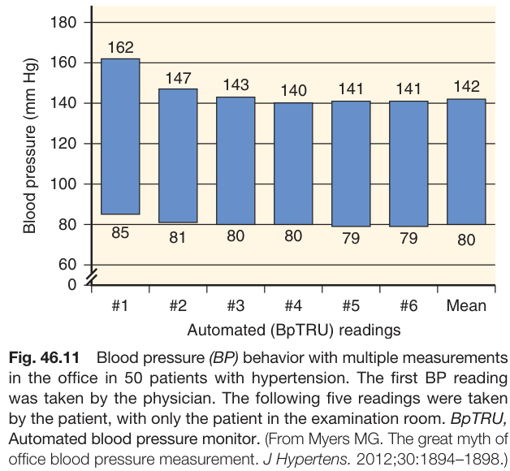

Fig. 46.11 Blood pressure (BP) behavior with multiple measurements in the office in 50 patients with hypertension. The first BP reading was taken by the physician. The following five readings were taken by the patient, with only the patient in the examination room. BpTRU, Automated blood pressure monitor. (From Myers MG. The great myth of office blood pressure measurement. J Hypertens. 2012;30:1894-1898.)

---

### Fig_46_12

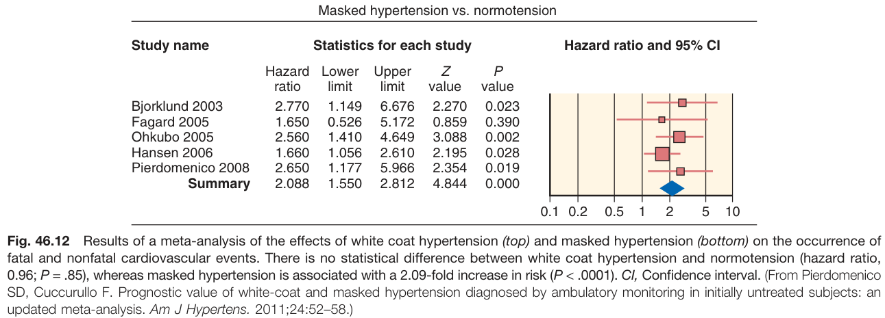

Fig. 46.12 Results of a meta-analysis of the effects of white coat hypertension (top) and masked hypertension (bottom) on the occurrence of fatal and nonfatal cardiovascular events. There is no statistical difference between white coat hypertension and normotension (hazard ratio, 0.96; P = .85), whereas masked hypertension is associated with a 2.09-fold increase in risk (P < .0001). Cl, Confidence interval. (From Pierdomenico SD, Cuccurullo F. Prognostic value of white-coat and masked hypertension diagnosed by ambulatory monitoring in initially untreated subjects: an updated meta-analysis. Am J Hypertens. 2011;24:52-58.)

---

### Fig_46_13

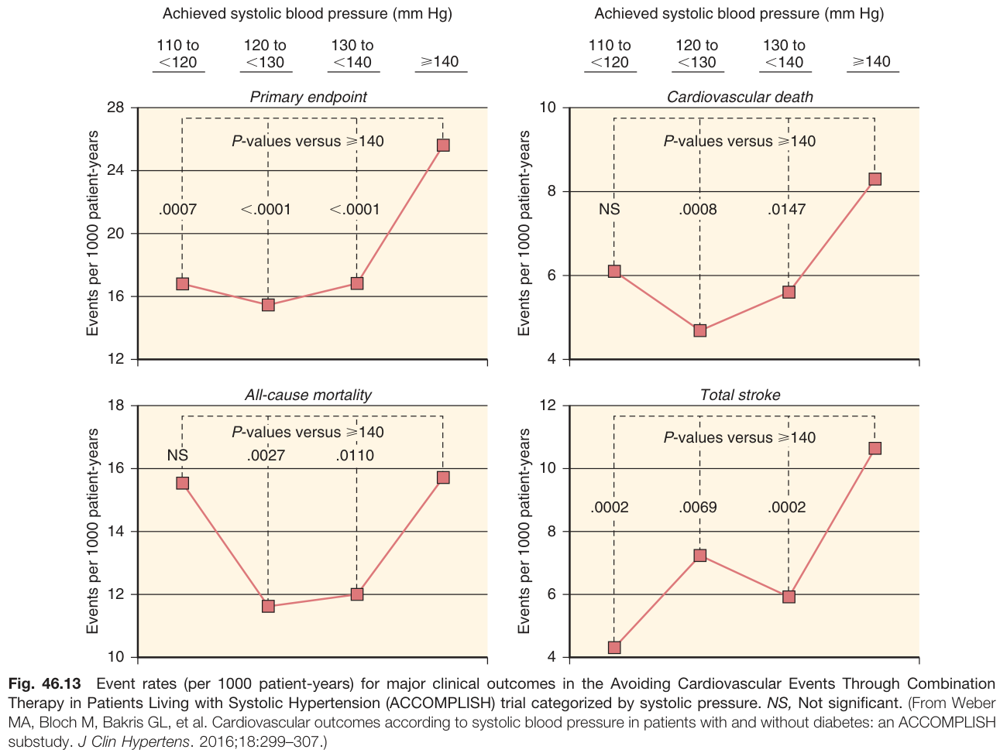

Fig. 46.13 Event rates (per 1000 patient-years) for major clinical outcomes in the Avoiding Cardiovascular Events Through Combination Therapy in Patients Living with Systolic Hypertension (ACCOMPLISH) trial categorized by systolic pressure. NS, Not significant. (From Weber MA, Bloch M, Bakris GL, et al. Cardiovascular outcomes according to systolic blood pressure in patients with and without diabetes: an ACCOMPLISH substudy. J Clin Hypertens. 2016;18:299-307.)

---

### Fig_46_14

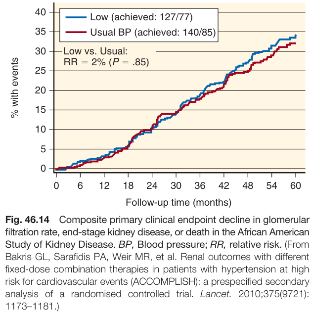

Fig. 46.14 Composite primary clinical endpoint decline in glomerular filtration rate, end-stage kidney disease, or death in the African American Study of Kidney Disease. BP, Blood pressure; RR, relative risk. (From Bakris GL, Sarafidis PA, Weir MR, et al. Renal outcomes with different fixed-dose combination therapies in patients with hypertension at high risk for cardiovascular events (ACCOMPLISH): a prespecified secondary analysis of a randomised controlled trial. Lancet. 2010;375(9721): 1173-1181.)

---

### Fig_46_15

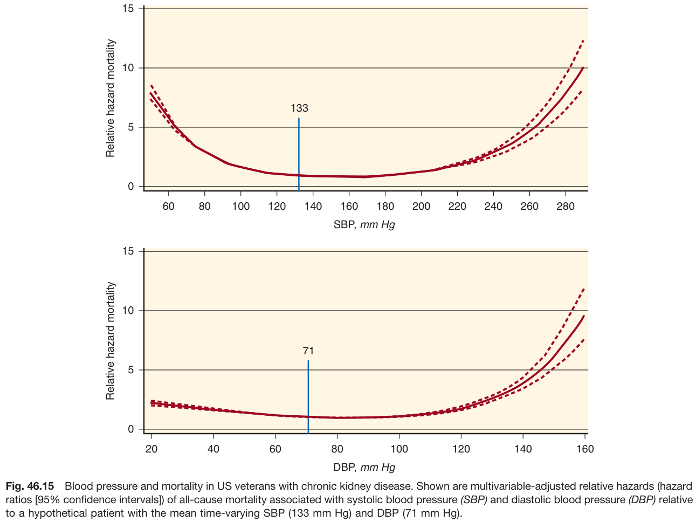

Fig. 46.15 Blood pressure and mortality in US veterans with chronic kidney disease. Shown are multivariable-adjusted relative hazards (hazard ratios [95% confidence intervals]) of all-cause mortality associated with systolic blood pressure (SBP) and diastolic blood pressure (DBP) relative to a hypothetical patient with the mean time-varying SBP (133 mm Hg) and DBP (71 mm Hg).

---

### Fig_46_16

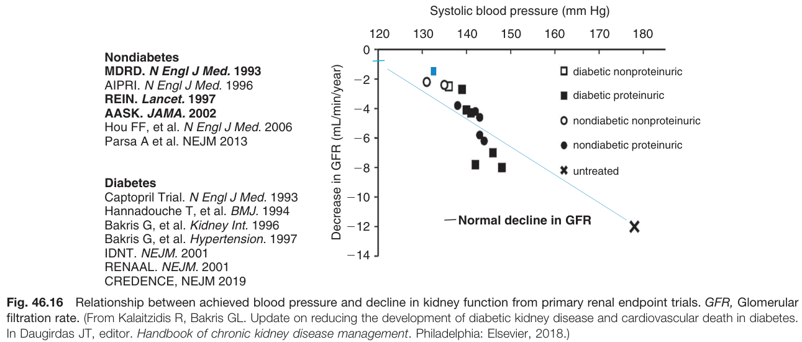

Fig. 46.16 Relationship between achieved blood pressure and decline in kidney function from primary renal endpoint trials. GFR, Glomerular filtration rate. (From Kalaitzidis R, Bakris GL. Update on reducing the development of diabetic kidney disease and cardiovascular death in diabetes. In Daugirdas JT, editor. Handbook of chronic kidney disease management. Philadelphia: Elsevier, 2018.)

---

### Fig_46_17

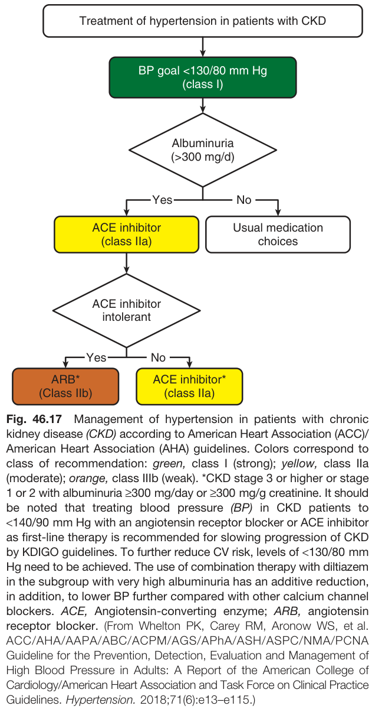

Fig. 46.17 Management of hypertension in patients with chronic kidney disease (CKD) according to American Heart Association (ACC)/ American Heart Association (AHA) guidelines. Colors correspond to class of recommendation: green, class I (strong); yellow, class Ila (moderate); orange, class IIIb (weak). *CKD stage 3 or higher or stage 1 or 2 with albuminuria ≥300 mg/day or ≥300 mg/g creatinine. It should be noted that treating blood pressure (BP) in CKD patients to <140/90 mm Hg with an angiotensin receptor blocker or ACE inhibitor as first-line therapy is recommended for slowing progression of CKD by KDIGO guidelines. To further reduce CV risk, levels of <130/80 mm Hg need to be achieved. The use of combination therapy with diltiazem in the subgroup with very high albuminuria has an additive reduction, in addition, to lower BP further compared with other calcium channel blockers. ACE, Angiotensin-converting enzyme; ARB, angiotensin receptor blocker. (From Whelton PK, Carey RM, Aronow WS, et al. ACC/AHA/AAPA/ABC/ACPM/AGS/APhA/ASH/ASPC/NMA/PCNA Guideline for the Prevention, Detection, Evaluation and Management of High Blood Pressure in Adults: A Report of the American College of Cardiology/American Heart Association and Task Force on Clinical Practice Guidelines. Hypertension. 2018;71(6):e13-e115.)

---

## Tables

### Table_46_1

#### Table Image

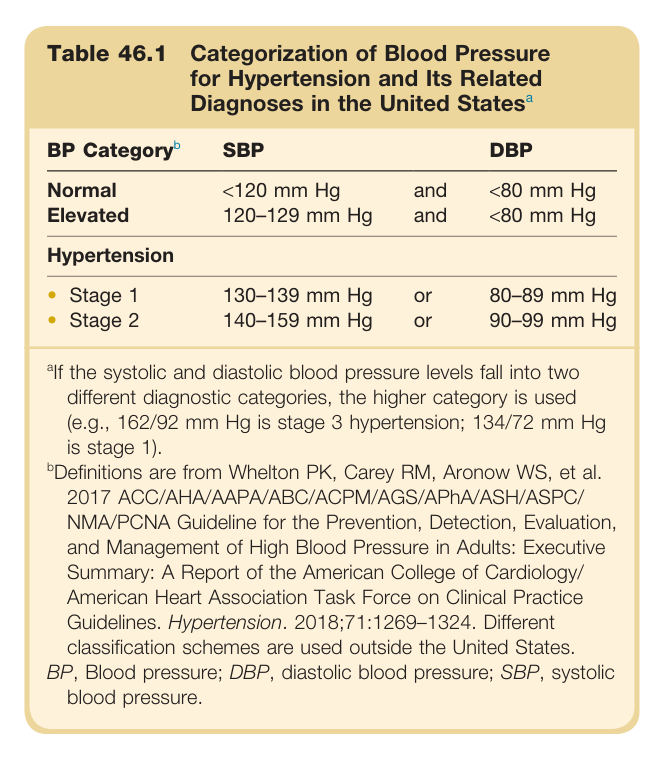

#### Table Data (CSV: [Table_46_1.csv](Table_46_1.csv))

```markdown
| Table Text (OCR) |
| :--- |
| Table 46.1 Categorization of Blood Pressure for Hypertension and Its Related Diagnoses in the United States<sup>a</sup> BP Categoryb  SBP    DBP    Normal  <120 mm Hg  and  <80 mm Hg    Elevated  120–129 mm Hg  and  <80 mm Hg    Hypertension    • Stage 1  130–139 mm Hg  or  80–89 mm Hg    • Stage 2  140–159 mm Hg  or  90–99 mm Hg |
```

Table 46.1 Categorization of Blood Pressure for Hypertension and Its Related Diagnoses in the United Statesa | BP Categoryb | SBP | | DBP | | :--------------- | :------------ | :--- | :---------- | | Normal | <120 mm Hg | and | <80 mm Hg | | Elevated | 120-129 mm Hg | and | <80 mm Hg | | **Hypertension** | | | | | • Stage 1 | 130-139 mm Hg | or | 80-89 mm Hg | | • Stage 2 | 140-159 mm Hg | or | 90-99 mm Hg | alf the systolic and diastolic blood pressure levels fall into two different diagnostic categories, the higher category is used (e.g., 162/92 mm Hg is stage 3 hypertension; 134/72 mm Hg is stage 1). Definitions are from Whelton PK, Carey RM, Aronow WS, et al. 2017 ACC/AHA/AAPA/ABC/ACPM/AGS/APhA/ASH/ASPC/ NMA/PCNA Guideline for the Prevention, Detection, Evaluation, and Management of High Blood Pressure in Adults: Executive Summary: A Report of the American College of Cardiology/ American Heart Association Task Force on Clinical Practice Guidelines. Hypertension. 2018;71:1269-1324. Different classification schemes are used outside the United States. BP, Blood pressure; DBP, diastolic blood pressure; SBP, systolic blood pressure.

---

### Table_46_2

#### Table Image

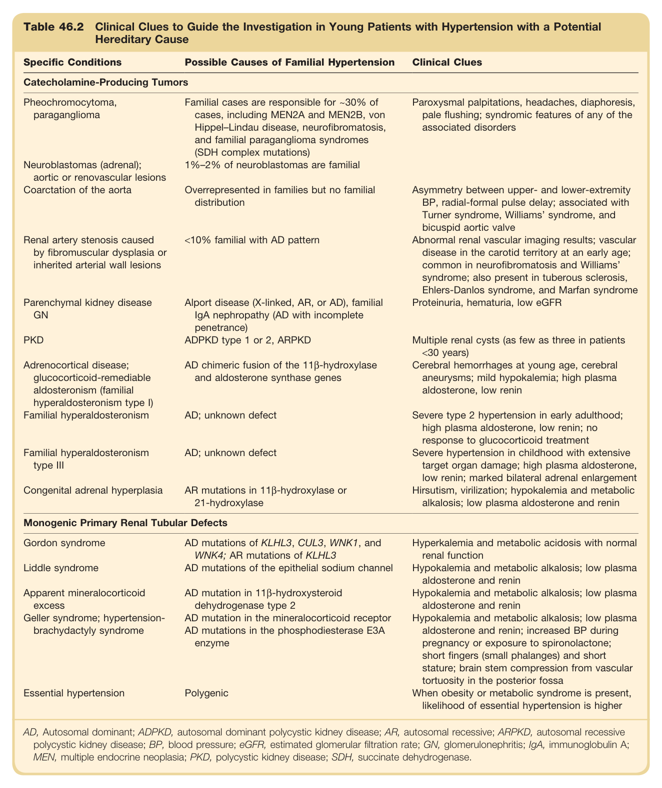

#### Table Data (CSV: [Table_46_2.csv](Table_46_2.csv))

```markdown
| Table Text (OCR) |
| :--- |
| Table 46.2 Clinical Clues to Guide the Investigation in Young Patients with Hypertension with a Potential Hereditary Cause Specific Conditions  Possible Causes of Familial Hypertension  Clinical Clues    Catecholamine-Producing Tumors    Pheochromocytoma, paraganglioma  Familial cases are responsible for ~30% of cases, including MEN2A and MEN2B, von Hippel-Lindau disease, neurofibromatosis, and familial paraganglioma syndromes (SDH complex mutations)  Paroxysmal palpitations, headaches, diaphoresis, pale flushing; syndromic features of any of the associated disorders    Neuroblastomas (adrenal); aortic or renovascular lesions  1%-2% of neuroblastomas are familial      Coarctation of the aorta  Overrepresented in families but no familial distribution  Asymmetry between upper- and lower-extremity BP, radial-formal pulse delay; associated with Turner syndrome, Williams' syndrome, and bicuspid aortic valve    Renal artery stenosis caused by fibromuscular dysplasia or inherited arterial wall lesions  <10% familial with AD pattern  Abnormal renal vascular imaging results; vascular disease in the carotid territory at an early age; common in neurofibromatosis and Williams' syndrome; also present in tuberous sclerosis, Ehlers-Danlos syndrome, and Marfan syndrome    Parenchymal kidney disease GN  Alport disease (X-linked, AR, or AD), familial IgA nephropathy (AD with incomplete penetrance)  Proteinuria, hematuria, low eGFR    PKD  ADPKD type 1 or 2, ARPKD  Multiple renal cysts (as few as three in patients <30 years)    Adrenocortical disease; glucocorticoid-remediable aldosteronism (familial hyperaldosteronism type I)  AD chimeric fusion of the 11β-hydroxylase and aldosterone synthase genes  Cerebral hemorrhages at young age, cerebral aneurysms; mild hypokalemia; high plasma aldosterone, low renin    Familial hyperaldosteronism  AD; unknown defect  Severe type 2 hypertension in early adulthood; high plasma aldosterone, low renin; no response to glucocorticoid treatment    Familial hyperaldosteronism type III  AD; unknown defect  Severe hypertension in childhood with extensive target organ damage; high plasma aldosterone, low renin; marked bilateral adrenal enlargement    Congenital adrenal hyperplasia  AR mutations in 11β-hydroxylase or 21-hydroxylase  Hirsutism, virilization; hypokalemia and metabolic alkalosis; low plasma aldosterone and renin    Monogenic Primary Renal Tubular Defects    Gordon syndrome  AD mutations of KLHL3, CUL3, WNK1, and WNK4; AR mutations of KLHL3  Hyperkalemia and metabolic acidosis with normal renal function    Liddle syndrome  AD mutations of the epithelial sodium channel  Hypokalemia and metabolic alkalosis; low plasma aldosterone and renin    Apparent mineralocorticoid excess  AD mutation in 11β-hydroxysteroid dehydrogenase type 2  Hypokalemia and metabolic alkalosis; low plasma aldosterone and renin    Geller syndrome; hypertension-brachydactyly syndrome  AD mutation in the mineralocorticoid receptor AD mutations in the phosphodiesterase E3A enzyme  Hypokalemia and metabolic alkalosis; low plasma aldosterone and renin; increased BP during pregnancy or exposure to spironolactone; short fingers (small phalanges) and short stature; brain stem compression from vascular tortuosity in the posterior fossa    Essential hypertension  Polygenic  When obesity or metabolic syndrome is present, likelihood of essential hypertension is higher AD, Autosomal dominant; ADPKD, autosomal dominant polycystic kidney disease; AR, autosomal recessive; ARPKD, autosomal recessive polycystic kidney disease; BP, blood pressure; eGFR, estimated glomerular filtration rate; GN, glomerulonephritis; IgA, immunoglobulin A; MEN, multiple endocrine neoplasia; PKD, polycystic kidney disease; SDH, succinate dehydrogenase. |
```

Table 46.2 Clinical Clues to Guide the Investigation in Young Patients with Hypertension with a Potential Hereditary Cause | Specific Conditions | Possible Causes of Familial Hypertension | Clinical Clues | | :----------------------------------------------------------- | :----------------------------------------------------------- | :----------------------------------------------------------- | | **Catecholamine-Producing Tumors** | | | | Pheochromocytoma, paraganglioma | Familial cases are responsible for ~30% of cases, including MEN2A and MEN2B, von Hippel-Lindau disease, neurofibromatosis, and familial paraganglioma syndromes (SDH complex mutations) | Paroxysmal palpitations, headaches, diaphoresis, pale flushing; syndromic features of any of the associated disorders | | Neuroblastomas (adrenal); aortic or renovascular lesions | 1%-2% of neuroblastomas are familial | | | Coarctation of the aorta | Overrepresented in families but no familial distribution | Asymmetry between upper- and lower-extremity BP, radial-formal pulse delay; associated with Turner syndrome, Williams' syndrome, and bicuspid aortic valve | | Renal artery stenosis caused by fibromuscular dysplasia or inherited arterial wall lesions | <10% familial with AD pattern | Abnormal renal vascular imaging results; vascular disease in the carotid territory at an early age; common in neurofibromatosis and Williams' syndrome; also present in tuberous sclerosis, Ehlers-Danlos syndrome, and Marfan syndrome | | Parenchymal kidney disease | | Proteinuria, hematuria, low eGFR | | GN | Alport disease (X-linked, AR, or AD), familial IgA nephropathy (AD with incomplete penetrance) | | | PKD | ADPKD type 1 or 2, ARPKD | Multiple renal cysts (as few as three in patients <30 years) | | Adrenocortical disease; glucocorticoid-remediable aldosteronism (familial hyperaldosteronism type I) | AD chimeric fusion of the 11ẞ-hydroxylase and aldosterone synthase genes | Cerebral hemorrhages at young age, cerebral aneurysms; mild hypokalemia; high plasma aldosterone, low renin | | Familial hyperaldosteronism | AD; unknown defect | Severe type 2 hypertension in early adulthood; high plasma aldosterone, low renin; no response to glucocorticoid treatment | | Familial hyperaldosteronism type III | AD; unknown defect | Severe hypertension in childhood with extensive target organ damage; high plasma aldosterone, low renin; marked bilateral adrenal enlargement | | Congenital adrenal hyperplasia | AR mutations in 11ẞ-hydroxylase or 21-hydroxylase | Hirsutism, virilization; hypokalemia and metabolic alkalosis; low plasma aldosterone and renin | | **Monogenic Primary Renal Tubular Defects** | | | | Gordon syndrome | AD mutations of KLHL3, CUL3, WNK1, and WNK4; AR mutations of KLHL3 | Hyperkalemia and metabolic acidosis with normal renal function | | Liddle syndrome | AD mutations of the epithelial sodium channel | Hypokalemia and metabolic alkalosis; low plasma aldosterone and renin | | Apparent mineralocorticoid excess | AD mutation in 11ẞ-hydroxysteroid dehydrogenase type 2 | Hypokalemia and metabolic alkalosis; low plasma aldosterone and renin | | Geller syndrome; hypertension-brachydactyly syndrome | AD mutation in the mineralocorticoid receptor AD mutations in the phosphodiesterase ЕЗА enzyme | Hypokalemia and metabolic alkalosis; low plasma aldosterone and renin; increased BP during pregnancy or exposure to spironolactone; short fingers (small phalanges) and short stature; brain stem compression from vascular tortuosity in the posterior fossa | | Essential hypertension | Polygenic | When obesity or metabolic syndrome is present, likelihood of essential hypertension is higher | AD, Autosomal dominant; ADPKD, autosomal dominant polycystic kidney disease; AR, autosomal recessive; ARPKD, autosomal recessive polycystic kidney disease; BP, blood pressure; eGFR, estimated glomerular filtration rate; GN, glomerulonephritis; IgA, immunoglobulin A; MEN, multiple endocrine neoplasia; PKD, polycystic kidney disease; SDH, succinate dehydrogenase.

---

### Table_46_3

#### Table Image

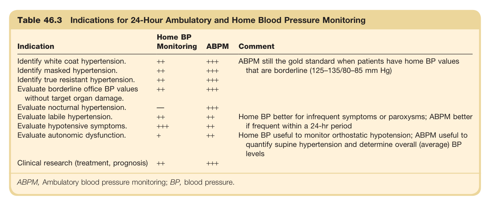

#### Table Data (CSV: [Table_46_3.csv](Table_46_3.csv))

```markdown
| Table Text (OCR) |
| :--- |
| Table 46.3 Indications for 24-Hour Ambulatory and Home Blood Pressure Monitoring Indication  Home BP Monitoring  ABPM  Comment    Identify white coat hypertension.  ++  +++  ABPM still the gold standard when patients have home BP values that are borderline (125–135/80–85 mm Hg)    Identify masked hypertension.  ++  +++    Identify true resistant hypertension.  ++  +++    Evaluate borderline office BP values without target organ damage.  ++  +++    Evaluate nocturnal hypertension.  —  +++    Evaluate labile hypertension.  ++  ++  Home BP better for infrequent symptoms or paroxysms; ABPM better if frequent within a 24-hr period    Evaluate hypotensive symptoms.  +++  ++    Evaluate autonomic dysfunction.  +  ++  Home BP useful to monitor orthostatic hypotension; ABPM useful to quantify supine hypertension and determine overall (average) BP levels    Clinical research (treatment, prognosis)  ++  +++ ABPM, Ambulatory blood pressure monitoring; BP, blood pressure. |
```

Table 46.3 Indications for 24-Hour Ambulatory and Home Blood Pressure Monitoring | Indication | Home BP Monitoring | ABPM | Comment | | :----------------------------------------------------------- | :----------------- | :--- | :----------------------------------------------------------- | | Identify white coat hypertension. | ++ | +++ | ABPM still the gold standard when patients have home BP values that are borderline (125-135/80-85 mm Hg) | | Identify masked hypertension. | ++ | +++ | | | Identify true resistant hypertension. | ++ | +++ | | | Evaluate borderline office BP values without target organ damage. | ++ | +++ | | | Evaluate nocturnal hypertension. | ++ | +++ | | | Evaluate labile hypertension. | ++ | ++ | Home BP better for infrequent symptoms or paroxysms; ABPM better if frequent within a 24-hr period | | Evaluate hypotensive symptoms. | ++ | +++ | Home BP useful to monitor orthostatic hypotension; ABPM useful to quantify supine hypertension and determine overall (average) BP levels | | Evaluate autonomic dysfunction. | + | +++ | | | Clinical research (treatment, prognosis) | ++ | +++ | | ABPM, Ambulatory blood pressure monitoring; BP, blood pressure.

---

### Table_46_4

#### Table Image

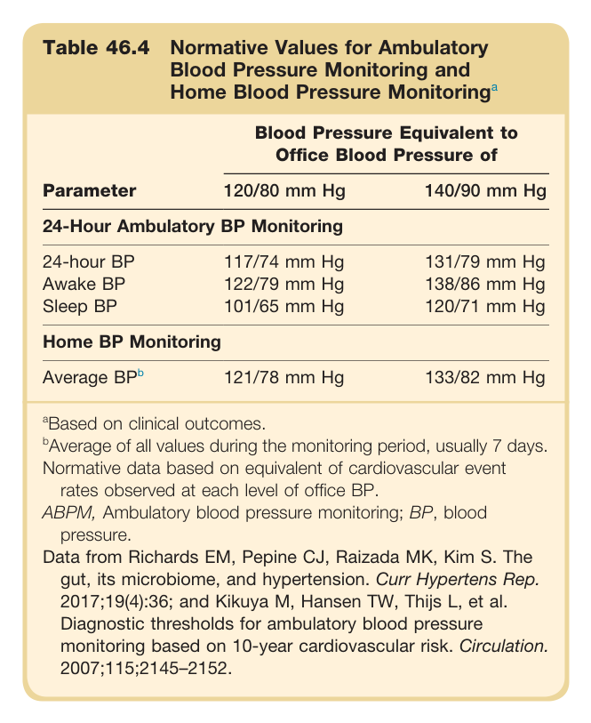

#### Table Data (CSV: [Table_46_4.csv](Table_46_4.csv))

```markdown
| Table Text (OCR) |
| :--- |
| Table 46.4 Normative Values for Ambulatory Blood Pressure Monitoring and Home Blood Pressure Monitoring<sup>a</sup> Parameter  Blood Pressure Equivalent to Office Blood Pressure of    120/80 mm Hg  140/90 mm Hg    24-Hour Ambulatory BP Monitoring    24-hour BP  117/74 mm Hg  131/79 mm Hg    Awake BP  122/79 mm Hg  138/86 mm Hg    Sleep BP  101/65 mm Hg  120/71 mm Hg    Home BP Monitoring    Average BPb  121/78 mm Hg  133/82 mm Hg <sup>a</sup>Based on clinical outcomes. <sup>b</sup>Average of all values during the monitoring period, usually 7 days. Normative data based on equivalent of cardiovascular event rates observed at each level of office BP. ABPM, Ambulatory blood pressure monitoring; BP, blood pressure. Data from Richards EM, Pepine CJ, Raizada MK, Kim S. The gut, its microbiome, and hypertension. Curr Hypertens Rep. 2017;19(4):36; and Kikuya M, Hansen TW, Thijs L, et al. Diagnostic thresholds for ambulatory blood pressure monitoring based on 10-year cardiovascular risk. Circulation. 2007;115;2145–2152. |
```

Table 46.4 Normative Values for Ambulatory Blood Pressure Monitoring and Home Blood Pressure Monitoringa | Parameter | Blood Pressure Equivalent to Office Blood Pressure of 120/80 mm Hg | 140/90 mm Hg | | :----------------------------------- | :----------------------------------------------------------- | :----------- | | **24-Hour Ambulatory BP Monitoring** | | | | 24-hour BP | 117/74 mm Hg | 131/79 mm Hg | | Awake BP | 122/79 mm Hg | 138/86 mm Hg | | Sleep BP | 101/65 mm Hg | 120/71 mm Hg | | **Home BP Monitoring** | | | | Average BPb | 121/78 mm Hg | 133/82 mm Hg | aBased on clinical outcomes. bAverage of all values during the monitoring period, usually 7 days. Normative data based on equivalent of cardiovascular event rates observed at each level of office BP. ABPM, Ambulatory blood pressure monitoring; BP, blood pressure. Data from Richards EM, Pepine CJ, Raizada MK, Kim S. The gut, its microbiome, and hypertension. Curr Hypertens Rep. 2017;19(4):36; and Kikuya M, Hansen TW, Thijs L, et al. Diagnostic thresholds for ambulatory blood pressure monitoring based on 10-year cardiovascular risk. Circulation. 2007;115;2145-2152.

---

### Table_46_5

#### Table Image

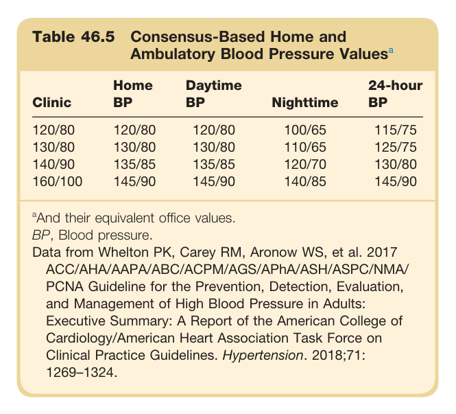

#### Table Data (CSV: [Table_46_5.csv](Table_46_5.csv))

```markdown
| Table Text (OCR) |
| :--- |
| Table 46.5 Consensus-Based Home and Ambulatory Blood Pressure Values<sup>a</sup> Clinic  Home BP  Daytime BP  Nighttime  24-hour BP    120/80  120/80  120/80  100/65  115/75    130/80  130/80  130/80  110/65  125/75    140/90  135/85  135/85  120/70  130/80    160/100  145/90  145/90  140/85  145/90 <sup>a</sup>And their equivalent office values. BP, Blood pressure. Data from Whelton PK, Carey RM, Aronow WS, et al. 2017 ACC/AHA/AAPA/ABC/ACPM/AGS/APhA/ASH/ASPC/NMA/ PCNA Guideline for the Prevention, Detection, Evaluation, and Management of High Blood Pressure in Adults: Executive Summary: A Report of the American College of Cardiology/American Heart Association Task Force on Clinical Practice Guidelines. Hypertension. 2018;71: 1269–1324. |
```

Table 46.5 Consensus-Based Home and Ambulatory Blood Pressure Valuesª | Clinic | Home BP | Daytime BP | Nighttime | 24-hour BP | | :------ | :------ | :--------- | :-------- | :--------- | | 120/80 | 120/80 | 120/80 | 100/65 | 115/75 | | 130/80 | 130/80 | 130/80 | 110/65 | 125/75 | | 140/90 | 135/85 | 135/85 | 120/70 | 130/80 | | 160/100 | 145/90 | 145/90 | 140/85 | 145/90 | And their equivalent office values. BP, Blood pressure. Data from Whelton PK, Carey RM, Aronow WS, et al. 2017 ACC/AHA/AAPA/ABC/ACPM/AGS/APhA/ASH/ASPC/NMA/ PCNA Guideline for the Prevention, Detection, Evaluation, and Management of High Blood Pressure in Adults: Executive Summary: A Report of the American College of Cardiology/American Heart Association Task Force on Clinical Practice Guidelines. Hypertension. 2018;71: 1269-1324.

---

### Table_46_6

#### Table Image

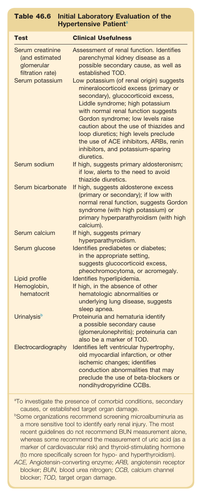

#### Table Data (CSV: [Table_46_6.csv](Table_46_6.csv))

```markdown
| Table Text (OCR) |
| :--- |
| Table 46.6 Initial Laboratory Evaluation of the Hypertensive Patient<sup>a</sup> Test  Clinical Usefulness    Serum creatinine (and estimated glomerular filtration rate)  Assessment of renal function. Identifies parenchymal kidney disease as a possible secondary cause, as well as established TOD.    Serum potassium  Low potassium (of renal origin) suggests mineralocorticoid excess (primary or secondary), glucocorticoid excess, Liddle syndrome; high potassium with normal renal function suggests Gordon syndrome; low levels raise caution about the use of thiazides and loop diuretics; high levels preclude the use of ACE inhibitors, ARBs, renin inhibitors, and potassium-sparing diuretics.    Serum sodium  If high, suggests primary aldosteronism; if low, alerts to the need to avoid thiazide diuretics.    Serum bicarbonate  If high, suggests aldosterone excess (primary or secondary); if low with normal renal function, suggests Gordon syndrome (with high potassium) or primary hyperparathyroidism (with high calcium).    Serum calcium  If high, suggests primary hyperparathyroidism.    Serum glucose  Identifies prediabetes or diabetes; in the appropriate setting, suggests glucocorticoid excess, pheochromocytoma, or acromegaly.    Lipid profile  Identifies hyperlipidemia.    Hemoglobin, hematocrit  If high, in the absence of other hematologic abnormalities or underlying lung disease, suggests sleep apnea.    Urinalysisb  Proteinuria and hematuria identify a possible secondary cause (glomerulonephritis); proteinuria can also be a marker of TOD.    Electrocardiography  Identifies left ventricular hypertrophy, old myocardial infarction, or other ischemic changes; identifies conduction abnormalities that may preclude the use of beta-blockers or nondihydropyridine CCBs. <sup>a</sup>To investigate the presence of comorbid conditions, secondary causes, or established target organ damage. <sup>b</sup>Some organizations recommend screening microalbuminuria as a more sensitive tool to identify early renal injury. The most recent guidelines do not recommend BUN measurement alone, whereas some recommend the measurement of uric acid (as a marker of cardiovascular risk) and thyroid-stimulating hormone (to more specifically screen for hypo- and hyperthyroidism). ACE, Angiotensin-converting enzyme; ARB, angiotensin receptor blocker; BUN, blood urea nitrogen; CCB, calcium channel blocker; TOD, target organ damage. |
```

Table 46.6 Initial Laboratory Evaluation of the Hypertensive Patienta | Test | Clinical Usefulness | | :---------------------------------------------------------- | :----------------------------------------------------------- | | Serum creatinine (and estimated glomerular filtration rate) | Assessment of renal function. Identifies parenchymal kidney disease as a possible secondary cause, as well as established TOD. | | Serum potassium | Low potassium (of renal origin) suggests mineralocorticoid excess (primary or secondary), glucocorticoid excess, Liddle syndrome; high potassium with normal renal function suggests Gordon syndrome; low levels raise caution about the use of thiazides and loop diuretics; high levels preclude the use of ACE inhibitors, ARBs, renin inhibitors, and potassium-sparing diuretics. | | Serum sodium | If high, suggests primary aldosteronism; if low, alerts to the need to avoid thiazide diuretics. | | Serum bicarbonate | If high, suggests aldosterone excess (primary or secondary); if low with normal renal function, suggests Gordon syndrome (with high potassium) or primary hyperparathyroidism (with high calcium). | | Serum calcium | If high, suggests primary hyperparathyroidism. | | Serum glucose | Identifies prediabetes or diabetes; in the appropriate setting, suggests glucocorticoid excess, pheochromocytoma, or acromegaly. | | Lipid profile | Identifies hyperlipidemia. | | Hemoglobin, hematocrit | If high, in the absence of other hematologic abnormalities or underlying lung disease, suggests sleep apnea. | | Urinalysisb | Proteinuria and hematuria identify a possible secondary cause (glomerulonephritis); proteinuria can also be a marker of TOD. | | Electrocardiography | Identifies left ventricular hypertrophy, old myocardial infarction, or other ischemic changes; identifies conduction abnormalities that may preclude the use of beta-blockers or nondihydropyridine CCBs. | To investigate the presence of comorbid conditions, secondary causes, or established target organ damage. Some organizations recommend screening microalbuminuria as a more sensitive tool to identify early renal injury. The most recent guidelines do not recommend BUN measurement alone, whereas some recommend the measurement of uric acid (as a marker of cardiovascular risk) and thyroid-stimulating hormone (to more specifically screen for hypo- and hyperthyroidism). ACE, Angiotensin-converting enzyme; ARB, angiotensin receptor blocker; BUN, blood urea nitrogen; CCB, calcium channel blocker; TOD, target organ damage.

---

### Table_46_7

#### Table Image

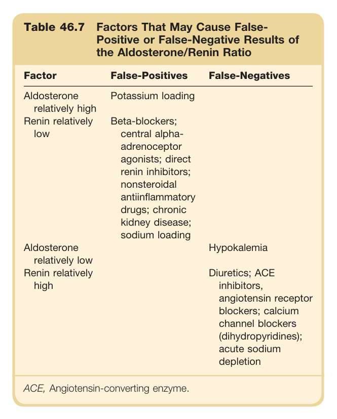

#### Table Data (CSV: [Table_46_7.csv](Table_46_7.csv))

```markdown
| Table Text (OCR) |
| :--- |
| Table 46.7 Factors That May Cause False- Positive or False-Negative Results of the Aldosterone/Renin Ratio Factor  False-Positives  False-Negatives    Aldosterone relatively high  Potassium loading      Renin relatively low  Beta-blockers; central alpha-adrenoceptor agonists; direct renin inhibitors; nonsteroidal antiinflammatory drugs; chronic kidney disease; sodium loading      Aldosterone relatively low    Hypokalemia    Renin relatively high    Diuretics; ACE inhibitors, angiotensin receptor blockers; calcium channel blockers (dihydropyridines); acute sodium depletion ACE, Angiotensin-converting enzyme. |
```

Table 46.7 Factors That May Cause False- Positive or False-Negative Results of the Aldosterone/Renin Ratio | Factor | False-Positives | False-Negatives | | :------------------------------------------------ | :----------------------------------------------------------- | :----------------------------------------------------------- | | Aldosterone relatively high, Renin relatively low | Potassium loading | | | | Beta-blockers; central alpha-adrenoceptor agonists; direct renin inhibitors; nonsteroidal antiinflammatory drugs; chronic kidney disease; sodium loading | Hypokalemia | | Aldosterone relatively low, Renin relatively high | | Diuretics; ACE inhibitors, angiotensin receptor blockers; calcium channel blockers (dihydropyridines); acute sodium depletion | ACE, Angiotensin-converting enzyme.

---

### Table_46_8

#### Table Image

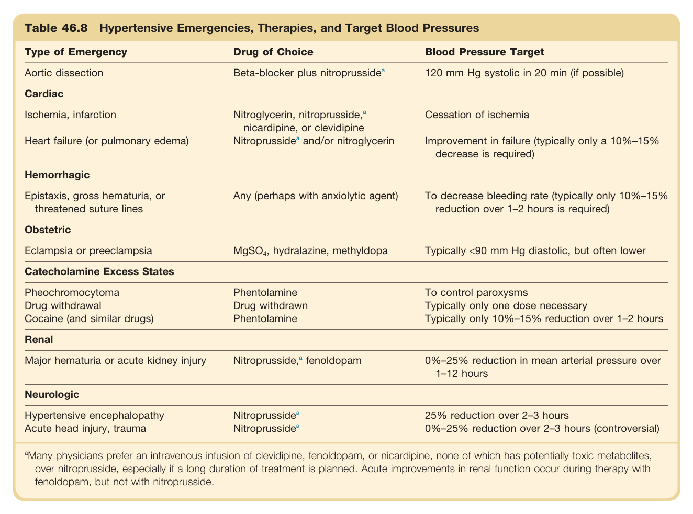

#### Table Data (CSV: [Table_46_8.csv](Table_46_8.csv))

```markdown
| Table Text (OCR) |
| :--- |
| Table 46.8 Hypertensive Emergencies, Therapies, and Target Blood Pressures Type of Emergency  Drug of Choice  Blood Pressure Target    Aortic dissection  Beta-blocker plus nitroprussidea  120 mm Hg systolic in 20 min (if possible)    Cardiac    Ischemia, infarction  Nitroglycerin, nitroprusside, nicardipine, or clevidipine  Cessation of ischemia    Heart failure (or pulmonary edema)  Nitroprussidea and/or nitroglycerin  Improvement in failure (typically only a 10%-15% decrease is required)    Hemorrhagic    Epistaxis, gross hematuria, or threatened suture lines  Any (perhaps with anxiolytic agent)  To decrease bleeding rate (typically only 10%-15% reduction over 1-2 hours is required)    Obstetric    Eclampsia or preeclampsia  MgSO4, hydralazine, methyldopa  Typically <90 mm Hg diastolic, but often lower    Catecholamine Excess States    Pheochromocytoma  Phentolamine  To control paroxysms    Drug withdrawal  Drug withdrawn  Typically only one dose necessary    Cocaine (and similar drugs)  Phentolamine  Typically only 10%-15% reduction over 1-2 hours    Renal    Major hematuria or acute kidney injury  Nitroprussidea fenoldopam  0%-25% reduction in mean arterial pressure over 1-12 hours    Neurologic    Hypertensive encephalopathy  Nitroprussidea  25% reduction over 2-3 hours    Acute head injury, trauma  Nitroprussidea  0%-25% reduction over 2-3 hours (controversial) <sup>a</sup>Many physicians prefer an intravenous infusion of clevidipine, fenoldopam, or nicardipine, none of which has potentially toxic metabolites, over nitroprusside, especially if a long duration of treatment is planned. Acute improvements in renal function occur during therapy with fenoldopam, but not with nitroprusside. |
```

Table 46.8 Hypertensive Emergencies, Therapies, and Target Blood Pressures | Type of Emergency | Drug of Choice | Blood Pressure Target | | :----------------------------------------------------- | :--------------------------------------------------------- | :----------------------------------------------------------- | | Aortic dissection | Beta-blocker plus nitroprussidea | 120 mm Hg systolic in 20 min (if possible) | | **Cardiac** | | | | Ischemia, infarction | Nitroglycerin, nitroprusside,ª nicardipine, or clevidipine | Cessation of ischemia | | Heart failure (or pulmonary edema) | Nitroprussidea and/or nitroglycerin | Improvement in failure (typically only a 10%-15% decrease is required) | | **Hemorrhagic** | | | | Epistaxis, gross hematuria, or threatened suture lines | Any (perhaps with anxiolytic agent) | To decrease bleeding rate (typically only 10%-15% reduction over 1-2 hours is required) | | **Obstetric** | | | | Eclampsia or preeclampsia | MgSO4, hydralazine, methyldopa | Typically <90 mm Hg diastolic, but often lower | | **Catecholamine Excess States** | | | | Pheochromocytoma | Phentolamine | To control paroxysms | | Drug withdrawal | Drug withdrawn | Typically only one dose necessary | | Cocaine (and similar drugs) | Phentolamine | Typically only 10%-15% reduction over 1-2 hours | | **Renal** | | | | Major hematuria or acute kidney injury | Nitroprusside,ª fenoldopam | 0%-25% reduction in mean arterial pressure over 1-12 hours | | **Neurologic** | | | | Hypertensive encephalopathy | Nitroprussidea | 25% reduction over 2-3 hours | | Acute head injury, trauma | Nitroprussidea | 0%-25% reduction over 2-3 hours (controversial) | Many physicians prefer an intravenous infusion of clevidipine, fenoldopam, or nicardipine, none of which has potentially toxic metabolites, over nitroprusside, especially if a long duration of treatment is planned. Acute improvements in renal function occur during therapy with fenoldopam, but not with nitroprusside.

---

### Table_46_9

#### Table Image

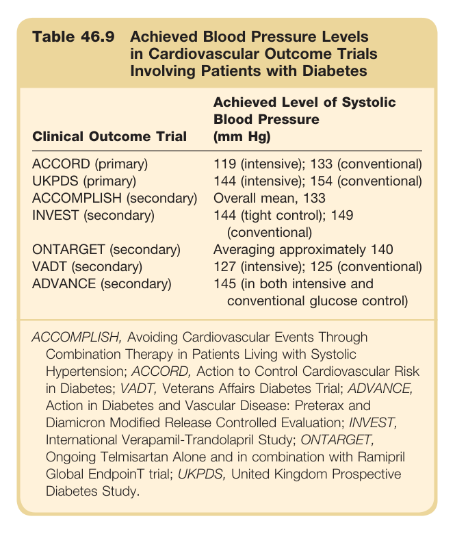

#### Table Data (CSV: [Table_46_9.csv](Table_46_9.csv))

```markdown
| Table Text (OCR) |
| :--- |
| Table 46.9 Achieved Blood Pressure Levels in Cardiovascular Outcome Trials Involving Patients with Diabetes Clinical Outcome Trial  Achieved Level of Systolic Blood Pressure (mm Hg)    ACCORD (primary)  119 (intensive); 133 (conventional)    UKPDS (primary)  144 (intensive); 154 (conventional)    ACCOMPLISH (secondary)  Overall mean, 133    INVEST (secondary)  144 (tight control); 149 (conventional)    ONTARGET (secondary)  Averaging approximately 140    VADT (secondary)  127 (intensive); 125 (conventional)    ADVANCE (secondary)  145 (in both intensive and conventional glucose control)    ACCOMPLISH, Avoiding Cardiovascular Events Through Combination Therapy in Patients Living with Systolic Hypertension; ACCORD, Action to Control Cardiovascular Risk in Diabetes; VADT, Veterans Affairs Diabetes Trial; ADVANCE, Action in Diabetes and Vascular Disease: Preterax and Diamicron Modified Release Controlled Evaluation; INVEST, International Verapamil-Trandolapril Study; ONTARGET, Ongoing Telmisartan Alone and in combination with Ramipril Global EndpoinT trial; UKPDS, United Kingdom Prospective Diabetes Study. |
```

Table 46.9 Achieved Blood Pressure Levels in Cardiovascular Outcome Trials Involving Patients with Diabetes | Clinical Outcome Trial | Achieved Level of Systolic Blood Pressure (mm Hg) | | :--------------------- | :------------------------------------------------------- | | ACCORD (primary) | 119 (intensive); 133 (conventional) | | UKPDS (primary) | 144 (intensive); 154 (conventional) | | ACCOMPLISH (secondary) | Overall mean, 133 | | INVEST (secondary) | 144 (tight control); 149 (conventional) | | ONTARGET (secondary) | Averaging approximately 140 | | VADT (secondary) | 127 (intensive); 125 (conventional) | | ADVANCE (secondary) | 145 (in both intensive and conventional glucose control) | ACCOMPLISH, Avoiding Cardiovascular Events Through Combination Therapy in Patients Living with Systolic Hypertension; ACCORD, Action to Control Cardiovascular Risk in Diabetes; VADT, Veterans Affairs Diabetes Trial; ADVANCE, Action in Diabetes and Vascular Disease: Preterax and Diamicron Modified Release Controlled Evaluation; INVEST, International Verapamil-Trandolapril Study; ONTARGET, Ongoing Telmisartan Alone and in combination with Ramipril Global Endpoint trial; UKPDS, United Kingdom Prospective Diabetes Study.

---

### Table_46_10

#### Table Image

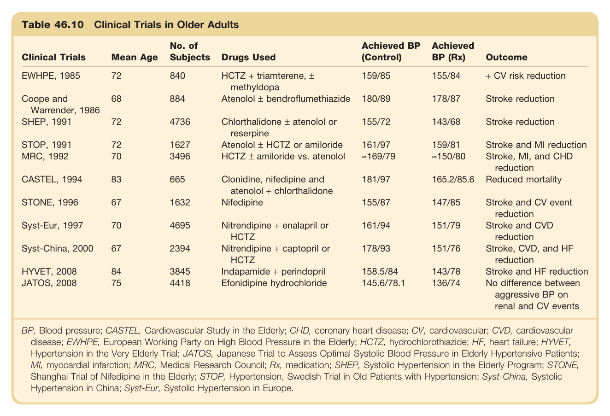

#### Table Data (CSV: [Table_46_10.csv](Table_46_10.csv))

```markdown
| Table Text (OCR) |
| :--- |
| Table 46.10 Clinical Trials in Older Adults Clinical Trials  Mean Age  No. of Subjects  Drugs Used  Achieved BP (Control)  Achieved BP (Rx)  Outcome    EWHPE, 1985  72  840  HCTZ + triamterene, ± methyldopa  159/85  155/84  + CV risk reduction    Coope and Warrender, 1986  68  884  Atenolol ± bendroflumethiazide  180/89  178/87  Stroke reduction    SHEP, 1991  72  4736  Chlorthalidone ± atenolol or reserpine  155/72  143/68  Stroke reduction    STOP, 1991  72  1627  Atenolol ± HCTZ or amiloride  161/97  159/81  Stroke and MI reduction    MRC, 1992  70  3496  HCTZ ± amiloride vs. atenolol  ≈169/79  ≈150/80  Stroke, MI, and CHD reduction    CASTEL, 1994  83  665  Clonidine, nifedipine and atenolol + chlorthalidone  181/97  165.2/85.6  Reduced mortality    STONE, 1996  67  1632  Nifedipine  155/87  147/85  Stroke and CV event reduction    Syst-Eur, 1997  70  4695  Nitrendipine + enalapril or HCTZ  161/94  151/79  Stroke and CVD reduction    Syst-China, 2000  67  2394  Nitrendipine + captopril or HCTZ  178/93  151/76  Stroke, CVD, and HF reduction    HYVET, 2008  84  3845  Indapamide + perindopril  158.5/84  143/78  Stroke and HF reduction    JATOS, 2008  75  4418  Efonidipine hydrochloride  145.6/78.1  136/74  No difference between aggressive BP on renal and CV events BP, Blood pressure; CASTEL, Cardiovascular Study in the Elderly; CHD, coronary heart disease; CV, cardiovascular; CVD, cardiovascular disease; EWHPE, European Working Party on High Blood Pressure in the Elderly; HCTZ, hydrochlorothiazide; HF, heart failure; HYVET, Hypertension in the Very Elderly Trial; JATOS, Japanese Trial to Assess Optimal Systolic Blood Pressure in Elderly Hypertensive Patients; MI, myocardial infarction; MRC, Medical Research Council; Rx, medication; SHEP, Systolic Hypertension in the Elderly Program; STONE Shanghai Trial of Nifedipine in the Elderly; STOP, Hypertension, Swedish Trial in Old Patients with Hypertension; Syst-China, Systolic Hypertension in China; Syst-Eur, Systolic Hypertension in Europe. |
```

Table 46.10 Clinical Trials in Older Adults | Clinical Trials | Mean Age | No. of Subjects | Drugs Used | Achieved BP (Control) | Achieved BP (Rx) | Outcome | | :------------------------ | :------- | :-------------- | :-------------------------------------------------- | :-------------------- | :--------------- | :--------------------------------------------------------- | | EWHPE, 1985 | 72 | 840 | HCTZ + triamterene, ± methyldopa | 159/85 | 155/84 | + CV risk reduction | | Coope and Warrender, 1986 | 68 | 884 | Atenolol + bendroflumethiazide | 180/89 | 178/87 | Stroke reduction | | SHEP, 1991 | 72 | 4736 | Chlorthalidone + atenolol or reserpine | 155/72 | 143/68 | Stroke reduction | | STOP, 1991 | 72 | 1627 | Atenolol + HCTZ or amiloride | 161/97 | 159/81 | Stroke and MI reduction | | MRC, 1992 | 70 | 3496 | HCTZ ± amiloride vs. atenolol | ≈169/79 | ≈150/80 | Stroke, MI, and CHD reduction | | CASTEL, 1994 | 83 | 665 | Clonidine, nifedipine and atenolol + chlorthalidone | 181/97 | 165.2/85.6 | Reduced mortality | | STONE, 1996 | 67 | 1632 | Nifedipine | 155/87 | 147/85 | Stroke and CV event reduction | | Syst-Eur, 1997 | 70 | 4695 | Nitrendipine + enalapril or HCTZ | 161/94 | 151/79 | Stroke and CVD reduction | | Syst-China, 2000 | 67 | 2394 | Nitrendipine + captopril or HCTZ | 178/93 | 151/76 | Stroke, CVD, and HF reduction | | HYVET, 2008 | 84 | 3845 | Indapamide + perindopril | 158.5/84 | 143/78 | Stroke and HF reduction | | JATOS, 2008 | 75 | 4418 | Efonidipine hydrochloride | 145.6/78.1 | 136/74 | No difference between aggressive BP on renal and CV events | BP, Blood pressure; CASTEL, Cardiovascular Study in the Elderly; CHD, coronary heart disease; CV, cardiovascular; CVD, cardiovascular disease; EWHPE, European Working Party on High Blood Pressure in the Elderly; HCTZ, hydrochlorothiazide; HF, heart failure; HYVET, Hypertension in the Very Elderly Trial; JATOS, Japanese Trial to Assess Optimal Systolic Blood Pressure in Elderly Hypertensive Patients; MI, myocardial infarction; MRC, Medical Research Council; Rx, medication; SHEP, Systolic Hypertension in the Elderly Program; STONE, Shanghai Trial of Nifedipine in the Elderly; STOP, Hypertension, Swedish Trial in Old Patients with Hypertension; Syst-China, Systolic Hypertension in China; Syst-Eur, Systolic Hypertension in Europe.

---

## Boxes

### Box_46_1

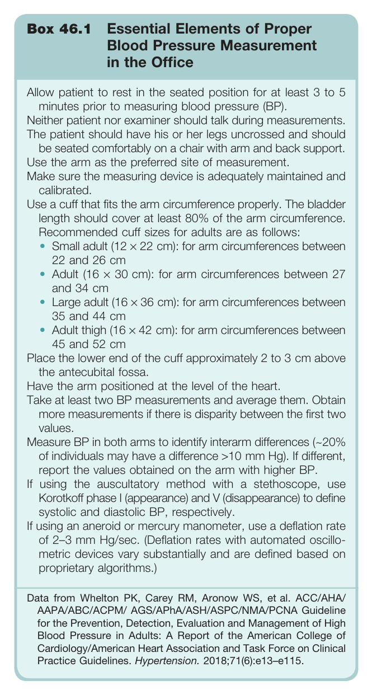

#### Box Text

```markdown
Box 46.1 Essential Elements of Proper Blood Pressure Measurement in the Office Allow patient to rest in the seated position for at least 3 to 5 minutes prior to measuring blood pressure (BP). Neither patient nor examiner should talk during measurements. The patient should have his or her legs uncrossed and should be seated comfortably on a chair with arm and back support. Use the arm as the preferred site of measurement. Make sure the measuring device is adequately maintained and calibrated. Use a cuff that fits the arm circumference properly. The bladder length should cover at least 80% of the arm circumference. Recommended cuff sizes for adults are as follows: • Small adult (12 × 22 cm): for arm circumferences between 22 and 26 cm Adult (16 × 30 cm): for arm circumferences between 27 and 34 cm • Large adult (16 × 36 cm): for arm circumferences between 35 and 44 cm • Adult thigh (16 × 42 cm): for arm circumferences between 45 and 52 cm Place the lower end of the cuff approximately 2 to 3 cm above the antecubital fossa. Have the arm positioned at the level of the heart. Take at least two BP measurements and average them. Obtain more measurements if there is disparity between the first two values. Measure BP in both arms to identify interarm differences (~20% of individuals may have a difference >10 mm Hg). If different, report the values obtained on the arm with higher BP. If using the auscultatory method with a stethoscope, use Korotkoff phase I (appearance) and V (disappearance) to define systolic and diastolic BP, respectively. If using an aneroid or mercury manometer, use a deflation rate of 2–3 mm Hg/sec. (Deflation rates with automated oscillo- metric devices vary substantially and are defined based on proprietary algorithms.) Data from Whelton PK, Carey RM, Aronow WS, et al. ACC/AHA/ AAPA/ABC/ACPM/ AGS/APhA/ASH/ASPC/NMA/PCNA Guideline for the Prevention, Detection, Evaluation and Management of High Blood Pressure in Adults: A Report of the American College of Cardiology/American Heart Association and Task Force on Clinical Practice Guidelines. Hypertension. 2018;71(6):e13–e115.
```

Box 46.1 Essential Elements of Proper Blood Pressure Measurement in the Office Allow patient to rest in the seated position for at least 3 to 5 minutes prior to measuring blood pressure (BP). Neither patient nor examiner should talk during measurements. The patient should have his or her legs uncrossed and should be seated comfortably on a chair with arm and back support. Use the arm as the preferred site of measurement. Make sure the measuring device is adequately maintained and calibrated. Use a cuff that fits the arm circumference properly. The bladder length should cover at least 80% of the arm circumference. Recommended cuff sizes for adults are as follows: • Small adult (12 x 22 cm): for arm circumferences between 22 and 26 cm • Adult (16 x 30 cm): for arm circumferences between 27 and 34 cm • Large adult (16 x 36 cm): for arm circumferences between 35 and 44 cm • Adult thigh (16 x 42 cm): for arm circumferences between 45 and 52 cm Place the lower end of the cuff approximately 2 to 3 cm above the antecubital fossa. Have the arm positioned at the level of the heart. Take at least two BP measurements and average them. Obtain more measurements if there is disparity between the first two values. Measure BP in both arms to identify interarm differences (~20% of individuals may have a difference >10 mm Hg). If different, report the values obtained on the arm with higher BP. If using the auscultatory method with a stethoscope, use Korotkoff phase I (appearance) and V (disappearance) to define systolic and diastolic BP, respectively. If using an aneroid or mercury manometer, use a deflation rate of 2-3 mm Hg/sec. (Deflation rates with automated oscillo-metric devices vary substantially and are defined based on proprietary algorithms.) Data from Whelton PK, Carey RM, Aronow WS, et al. ACC/AHA/ AAPA/ABC/ACPM/AGS/APhA/ASH/ASPC/NMA/PCNA Guideline for the Prevention, Detection, Evaluation and Management of High Blood Pressure in Adults: A Report of the American College of Cardiology/American Heart Association and Task Force on Clinical Practice Guidelines. Hypertension. 2018;71(6):e13-e115.

---

### Box_46_2

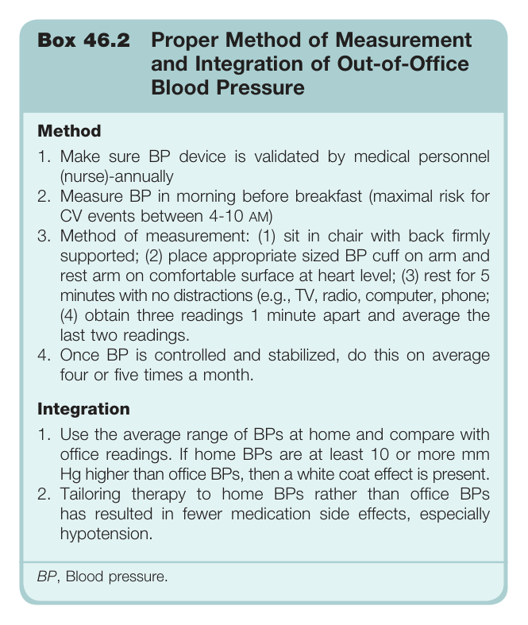

#### Box Text

```markdown
Box 46.2 Proper Method of Measurement and Integration of Out-of-Office Blood Pressure **Method** 1. Make sure BP device is validated by medical personnel (nurse)-annually 2. Measure BP in morning before breakfast (maximal risk for CV events between 4-10 AM) 3. Method of measurement: (1) sit in chair with back firmly supported; (2) place appropriate sized BP cuff on arm and rest arm on comfortable surface at heart level; (3) rest for 5 minutes with no distractions (e.g., TV, radio, computer, phone; (4) obtain three readings 1 minute apart and average the last two readings. 4. Once BP is controlled and stabilized, do this on average four or five times a month. **Integration** 1. Use the average range of BPs at home and compare with office readings. If home BPs are at least 10 or more mm Hg higher than office BPs, then a white coat effect is present. 2. Tailoring therapy to home BPs rather than office BPs has resulted in fewer medication side effects, especially hypotension. BP, Blood pressure.
```

Box 46.2 Proper Method of Measurement and Integration of Out-of-Office Blood Pressure **Method** 1. Make sure BP device is validated by medical personnel (nurse)-annually 2. Measure BP in morning before breakfast (maximal risk for CV events between 4-10 AM) 3. Method of measurement: (1) sit in chair with back firmly supported; (2) place appropriate sized BP cuff on arm and rest arm on comfortable surface at heart level; (3) rest for 5 minutes with no distractions (e.g., TV, radio, computer, phone; (4) obtain three readings 1 minute apart and average the last two readings. 4. Once BP is controlled and stabilized, do this on average four or five times a month. **Integration** 1. Use the average range of BPs at home and compare with office readings. If home BPs are at least 10 or more mm Hg higher than office BPs, then a white coat effect is present. 2. Tailoring therapy to home BPs rather than office BPs has resulted in fewer medication side effects, especially hypotension. BP, Blood pressure.

---

### Box_46_3

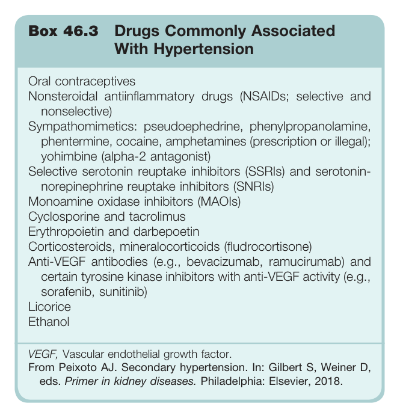

#### Box Text

```markdown
Box 46.3 Drugs Commonly Associated With Hypertension * Oral contraceptives * Nonsteroidal antiinflammatory drugs (NSAIDs; selective and nonselective) * Sympathomimetics: pseudoephedrine, phenylpropanolamine, phentermine, cocaine, amphetamines (prescription or illegal); yohimbine (alpha-2 antagonist) * Selective serotonin reuptake inhibitors (SSRIs) and serotonin-norepinephrine reuptake inhibitors (SNRIs) * Monoamine oxidase inhibitors (MAOIs) * Cyclosporine and tacrolimus * Erythropoietin and darbepoetin * Corticosteroids, mineralocorticoids (fludrocortisone) * Anti-VEGF antibodies (e.g., bevacizumab, ramucirumab) and certain tyrosine kinase inhibitors with anti-VEGF activity (e.g., sorafenib, sunitinib) * Licorice * Ethanol VEGF, Vascular endothelial growth factor. From Peixoto AJ. Secondary hypertension. In: Gilbert S, Weiner D, eds. Primer in kidney diseases. Philadelphia: Elsevier, 2018.
```

Box 46.3 Drugs Commonly Associated With Hypertension * Oral contraceptives * Nonsteroidal antiinflammatory drugs (NSAIDs; selective and nonselective) * Sympathomimetics: pseudoephedrine, phenylpropanolamine, phentermine, cocaine, amphetamines (prescription or illegal); yohimbine (alpha-2 antagonist) * Selective serotonin reuptake inhibitors (SSRIs) and serotonin-norepinephrine reuptake inhibitors (SNRIs) * Monoamine oxidase inhibitors (MAOIs) * Cyclosporine and tacrolimus * Erythropoietin and darbepoetin * Corticosteroids, mineralocorticoids (fludrocortisone) * Anti-VEGF antibodies (e.g., bevacizumab, ramucirumab) and certain tyrosine kinase inhibitors with anti-VEGF activity (e.g., sorafenib, sunitinib) * Licorice * Ethanol VEGF, Vascular endothelial growth factor. From Peixoto AJ. Secondary hypertension. In: Gilbert S, Weiner D, eds. Primer in kidney diseases. Philadelphia: Elsevier, 2018.

---

### Box_46_4

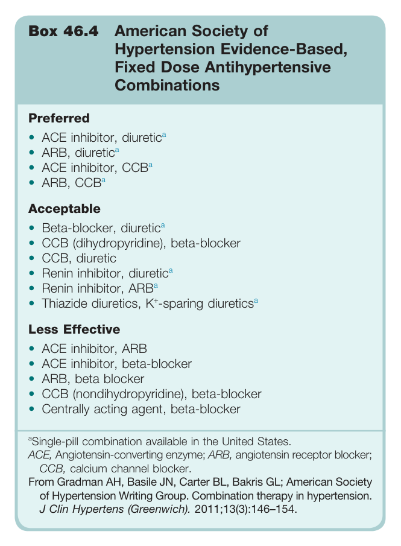

#### Box Text

```markdown
Box 46.4 American Society of Hypertension Evidence-Based, Fixed Dose Antihypertensive Combinations Preferred • ACE inhibitor, diuretic<sup>a</sup> • ARB, diuretic<sup>a</sup> • ACE inhibitor, CCB<sup>a</sup> • ARB, CCB<sup>a</sup> Acceptable • Beta-blocker, diuretic<sup>a</sup> • CCB (dihydropyridine), beta-blocker • CCB, diuretic • Renin inhibitor, diuretic<sup>a</sup> • Renin inhibitor, ARB • Thiazide diuretics, K<sup>+</sup>-sparing diuretics<sup>a</sup> Less Effective • ACE inhibitor, ARB • ACE inhibitor, beta-blocker • ARB, beta blocker • CCB (nondihydropyridine), beta-blocker • Centrally acting agent, beta-blocker <sup>a</sup>Single-pill combination available in the United States. ACE, Angiotensin-converting enzyme; ARB, angiotensin receptor blocker; CCB, calcium channel blocker. From Gradman AH, Basile JN, Carter BL, Bakris GL; American Society of Hypertension Writing Group. Combination therapy in hypertension. J Clin Hypertens (Greenwich). 2011;13(3):146–154.
```

Box 46.4 American Society of Hypertension Evidence-Based, Fixed Dose Antihypertensive Combinations **Preferred** * ACE inhibitor, diuretica * ARB, diuretica * ACE inhibitor, CCBa * ARB, CCBа **Acceptable** * Beta-blocker, diuretica * CCB (dihydropyridine), beta-blocker * CCB, diuretic * Renin inhibitor, diuretica * Renin inhibitor, ARBa * Thiazide diuretics, K+-sparing diureticsa **Less Effective** * ACE inhibitor, ARB * ACE inhibitor, beta-blocker * ARB, beta blocker * CCB (nondihydropyridine), beta-blocker * Centrally acting agent, beta-blocker aSingle-pill combination available in the United States. ACE, Angiotensin-converting enzyme; ARB, angiotensin receptor blocker; CCB, calcium channel blocker. From Gradman AH, Basile JN, Carter BL, Bakris GL; American Society of Hypertension Writing Group. Combination therapy in hypertension. J Clin Hypertens (Greenwich). 2011;13(3):146-154.

---
