# 47. Renovascular Hypertension and Ischemic Nephropathy - Figures and Tables Index

This document lists all figures, tables and boxes extracted from `47. Renovascular Hypertension and Ischemic Nephropathy.pdf`.

## Table of Contents
- [Figures](#figures)
- [Tables](#tables)
- [Boxes](#boxes)

---

## Figures

### Fig_47_1

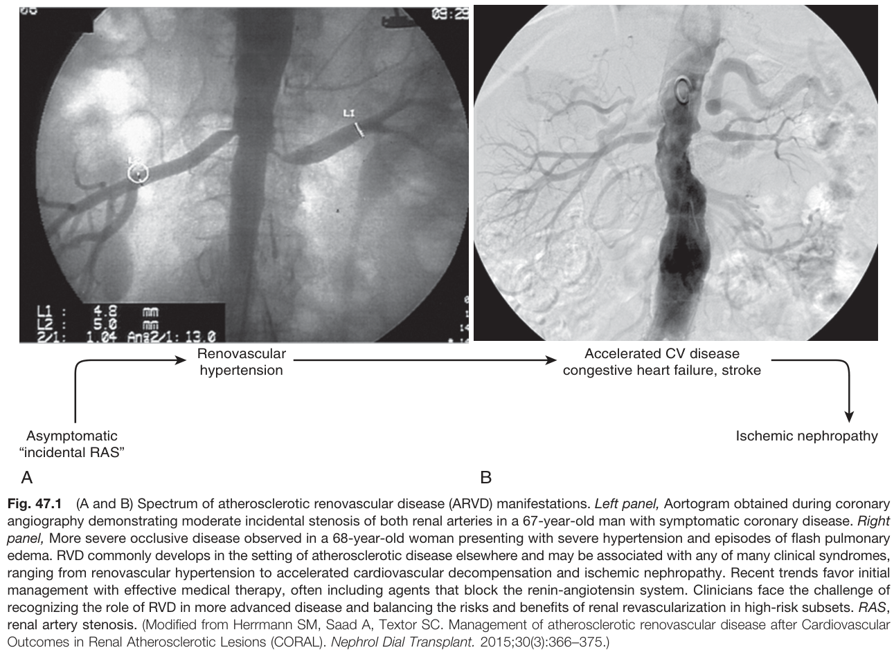

Fig. 47.1 (A and B) Spectrum of atherosclerotic renovascular disease (ARVD) manifestations. Left panel, Aortogram obtained during coronary angiography demonstrating moderate incidental stenosis of both renal arteries in a 67-year-old man with symptomatic coronary disease. Right panel, More severe occlusive disease observed in a 68-year-old woman presenting with severe hypertension and episodes of flash pulmonary edema. RVD commonly develops in the setting of atherosclerotic disease elsewhere and may be associated with any of many clinical syndromes, ranging from renovascular hypertension to accelerated cardiovascular decompensation and ischemic nephropathy. Recent trends favor initial management with effective medical therapy, often including agents that block the renin-angiotensin system. Clinicians face the challenge of recognizing the role of RVD in more advanced disease and balancing the risks and benefits of renal revascularization in high-risk subsets. RAS, renal artery stenosis. (Modified from Herrmann SM, Saad A, Textor SC. Management of atherosclerotic renovascular disease after Cardiovascular Outcomes in Renal Atherosclerotic Lesions (CORAL). Nephrol Dial Transplant. 2015;30(3):366-375.)

---

### Fig_47_2

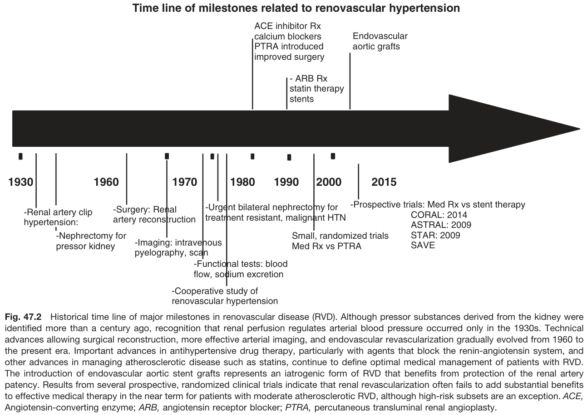

Fig. 47.2 Historical time line of major milestones in renovascular disease (RVD). Although pressor substances derived from the kidney were identified more than a century ago, recognition that renal perfusion regulates arterial blood pressure occurred only in the 1930s. Technical advances allowing surgical reconstruction, more effective arterial imaging, and endovascular revascularization gradually evolved from 1960 to the present era. Important advances in antihypertensive drug therapy, particularly with agents that block the renin-angiotensin system, and other advances in managing atherosclerotic disease such as statins, continue to define optimal medical management of patients with RVD. The introduction of endovascular aortic stent grafts represents an iatrogenic form of RVD that benefits from protection of the renal artery patency. Results from several prospective, randomized clinical trials indicate that renal revascularization often fails to add substantial benefits to effective medical therapy in the near term for patients with moderate atherosclerotic RVD, although high-risk subsets are an exception. ACE, Angiotensin-converting enzyme; ARB, angiotensin receptor blocker; PTRA, percutaneous transluminal renal angioplasty.

---

### Fig_47_3

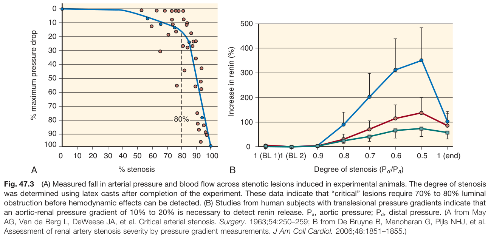

Fig. 47.3 (A) Measured fall in arterial pressure and blood flow across stenotic lesions induced in experimental animals. The degree of stenosis was determined using latex casts after completion of the experiment. These data indicate that "critical" lesions require 70% to 80% luminal obstruction before hemodynamic effects can be detected. (B) Studies from human subjects with translesional pressure gradients indicate that an aortic-renal pressure gradient of 10% to 20% is necessary to detect renin release. Pa, aortic pressure; Pd, distal pressure. (A from May AG, Van de Berg L, DeWeese JA, et al. Critical arterial stenosis. Surgery. 1963;54:250-259; B from De Bruyne B, Manoharan G, Pijls NHJ, et al. Assessment of renal artery stenosis severity by pressure gradient measurements. J Am Coll Cardiol. 2006;48:1851-1855.)

---

### Fig_47_4

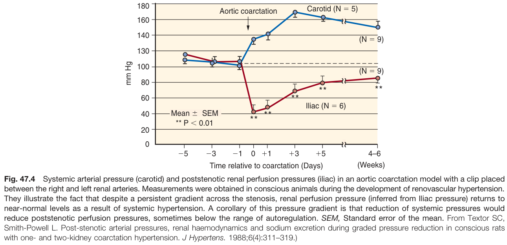

Fig. 47.4 Systemic arterial pressure (carotid) and poststenotic renal perfusion pressures (iliac) in an aortic coarctation model with a clip placed between the right and left renal arteries. Measurements were obtained in conscious animals during the development of renovascular hypertension. They illustrate the fact that despite a persistent gradient across the stenosis, renal perfusion pressure (inferred from Iliac pressure) returns to near-normal levels as a result of systemic hypertension. A corollary of this pressure gradient is that reduction of systemic pressures would reduce poststenotic perfusion pressures, sometimes below the range of autoregulation. SEM, Standard error of the mean. From Textor SC, Smith-Powell L. Post-stenotic arterial pressures, renal haemodynamics and sodium excretion during graded pressure reduction in conscious rats with one- and two-kidney coarctation hypertension. J Hypertens. 1988;6(4):311-319.)

---

### Fig_47_5

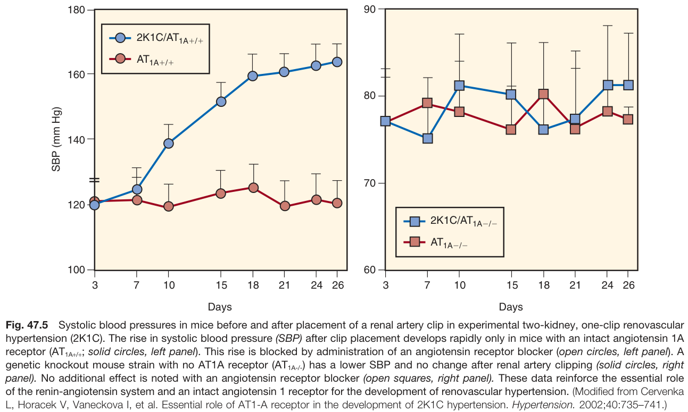

Fig. 47.5 Systolic blood pressures in mice before and after placement of a renal artery clip in experimental two-kidney, one-clip renovascular hypertension (2K1C). The rise in systolic blood pressure (SBP) after clip placement develops rapidly only in mice with an intact angiotensin 1A receptor (AT1A+/+; solid circles, left panel). This rise is blocked by administration of an angiotensin receptor blocker (open circles, left panel). A genetic knockout mouse strain with no AT1A receptor (AT1A-/-) has a lower SBP and no change after renal artery clipping (solid circles, right panel). No additional effect is noted with an angiotensin receptor blocker (open squares, right panel). These data reinforce the essential role of the renin-angiotensin system and an intact angiotensin 1 receptor for the development of renovascular hypertension. (Modified from Cervenka L, Horacek V, Vaneckova I, et al. Essential role of AT1-A receptor in the development of 2K1C hypertension. Hypertension. 2002;40:735-741.)

---

### Fig_47_6

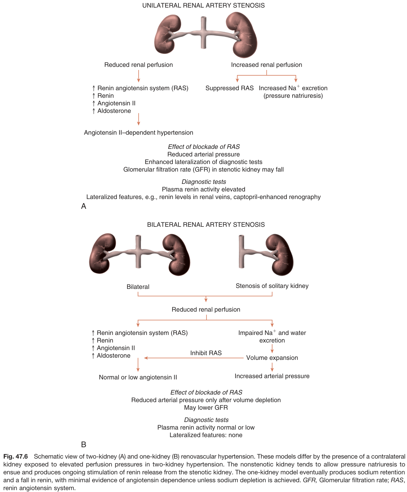

Fig. 47.6 Schematic view of two-kidney (A) and one-kidney (B) renovascular hypertension. These models differ by the presence of a contralateral kidney exposed to elevated perfusion pressures in two-kidney hypertension. The nonstenotic kidney tends to allow pressure natriuresis to ensue and produces ongoing stimulation of renin release from the stenotic kidney. The one-kidney model eventually produces sodium retention and a fall in renin, with minimal evidence of angiotensin dependence unless sodium depletion is achieved. GFR, Glomerular filtration rate; RAS, renin angiotensin system.

---

### Fig_47_7

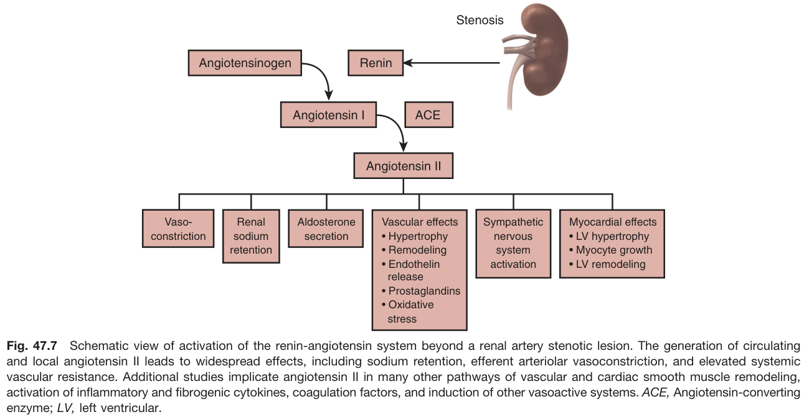

Fig. 47.7 Schematic view of activation of the renin-angiotensin system beyond a renal artery stenotic lesion. The generation of circulating and local angiotensin II leads to widespread effects, including sodium retention, efferent arteriolar vasoconstriction, and elevated systemic vascular resistance. Additional studies implicate angiotensin II in many other pathways of vascular and cardiac smooth muscle remodeling, activation of inflammatory and fibrogenic cytokines, coagulation factors, and induction of other vasoactive systems. ACE, Angiotensin-converting enzyme; LV, left ventricular.

---

### Fig_47_8

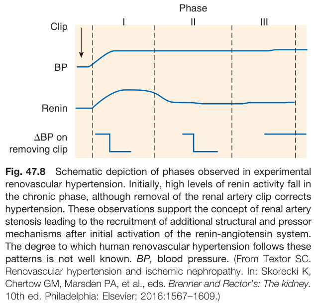

Fig. 47.8 Schematic depiction of phases observed in experimental renovascular hypertension. Initially, high levels of renin activity fall in the chronic phase, although removal of the renal artery clip corrects hypertension. These observations support the concept of renal artery stenosis leading to the recruitment of additional structural and pressor mechanisms after initial activation of the renin-angiotensin system. The degree to which human renovascular hypertension follows these patterns is not well known. BP, blood pressure. (From Textor SC. Renovascular hypertension and ischemic nephropathy. In: Skorecki K, Chertow GM, Marsden PA, et al., eds. Brenner and Rector's: The kidney. 10th ed. Philadelphia: Elsevier; 2016:1567-1609.)

---

### Fig_47_9

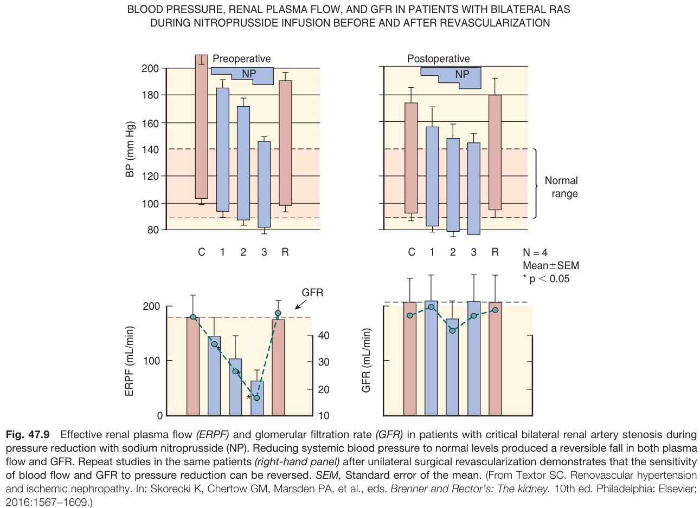

Fig. 47.9 Effective renal plasma flow (ERPF) and glomerular filtration rate (GFR) in patients with critical bilateral renal artery stenosis during pressure reduction with sodium nitroprusside (NP). Reducing systemic blood pressure to normal levels produced a reversible fall in both plasma flow and GFR. Repeat studies in the same patients (right-hand panel) after unilateral surgical revascularization demonstrates that the sensitivity of blood flow and GFR to pressure reduction can be reversed. SEM, Standard error of the mean. (From Textor SC. Renovascular hypertension and ischemic nephropathy. In: Skorecki K, Chertow GM, Marsden PA, et al., eds. Brenner and Rector's: The kidney. 10th ed. Philadelphia: Elsevier; 2016:1567-1609.)

---

### Fig_47_10

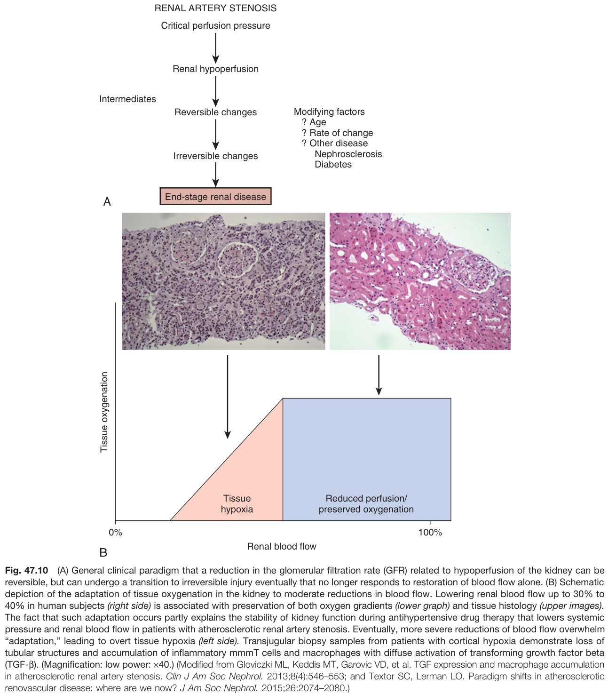

Fig. 47.10 (A) General clinical paradigm that a reduction in the glomerular filtration rate (GFR) related to hypoperfusion of the kidney can be reversible, but can undergo a transition to irreversible injury eventually that no longer responds to restoration of blood flow alone. (B) Schematic depiction of the adaptation of tissue oxygenation in the kidney to moderate reductions in blood flow. Lowering renal blood flow up to 30% to 40% in human subjects (right side) is associated with preservation of both oxygen gradients (lower graph) and tissue histology (upper images). The fact that such adaptation occurs partly explains the stability of kidney function during antihypertensive drug therapy that lowers systemic pressure and renal blood flow in patients with atherosclerotic renal artery stenosis. Eventually, more severe reductions of blood flow overwhelm "adaptation," leading to overt tissue hypoxia (left side). Transjugular biopsy samples from patients with cortical hypoxia demonstrate loss of tubular structures and accumulation of inflammatory mmmT cells and macrophages with diffuse activation of transforming growth factor beta (TGF-β). (Magnification: low power: ×40.) (Modified from Gloviczki ML, Keddis MT, Garovic VD, et al. TGF expression and macrophage accumulation in atherosclerotic renal artery stenosis. Clin J Am Soc Nephrol. 2013;8(4):546-553; and Textor SC, Lerman LO. Paradigm shifts in atherosclerotic renovascular disease: where are we now? J Am Soc Nephrol. 2015;26:2074-2080.)

---

### Fig_47_11

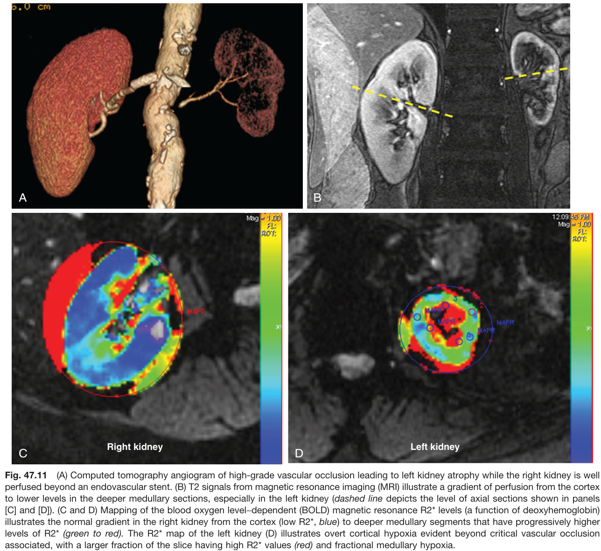

Fig. 47.11 (A) Computed tomography angiogram of high-grade vascular occlusion leading to left kidney atrophy while the right kidney is well perfused beyond an endovascular stent. (B) T2 signals from magnetic resonance imaging (MRI) illustrate a gradient of perfusion from the cortex to lower levels in the deeper medullary sections, especially in the left kidney (dashed line depicts the level of axial sections shown in panels [C] and [D]). (C and D) Mapping of the blood oxygen level-dependent (BOLD) magnetic resonance R2* levels (a function of deoxyhemoglobin) illustrates the normal gradient in the right kidney from the cortex (low R2*, blue) to deeper medullary segments that have progressively higher levels of R2* (green to red). The R2* map of the left kidney (D) illustrates overt cortical hypoxia evident beyond critical vascular occlusion associated, with a larger fraction of the slice having high R2* values (red) and fractional medullary hypoxia.

---

### Fig_47_12

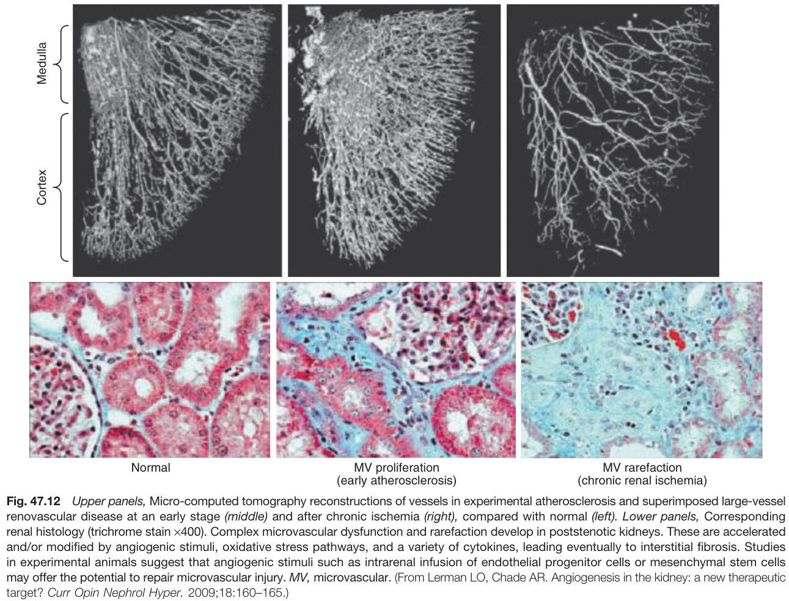

Fig. 47.12 Upper panels, Micro-computed tomography reconstructions of vessels in experimental atherosclerosis and superimposed large-vessel renovascular disease at an early stage (middle) and after chronic ischemia (right), compared with normal (left). Lower panels, Corresponding renal histology (trichrome stain ×400). Complex microvascular dysfunction and rarefaction develop in poststenotic kidneys. These are accelerated and/or modified by angiogenic stimuli, oxidative stress pathways, and a variety of cytokines, leading eventually to interstitial fibrosis. Studies in experimental animals suggest that angiogenic stimuli such as intrarenal infusion of endothelial progenitor cells or mesenchymal stem cells may offer the potential to repair microvascular injury. MV, microvascular. (From Lerman LO, Chade AR. Angiogenesis in the kidney: a new therapeutic target? Curr Opin Nephrol Hyper. 2009;18:160-165.)

---

### Fig_47_13

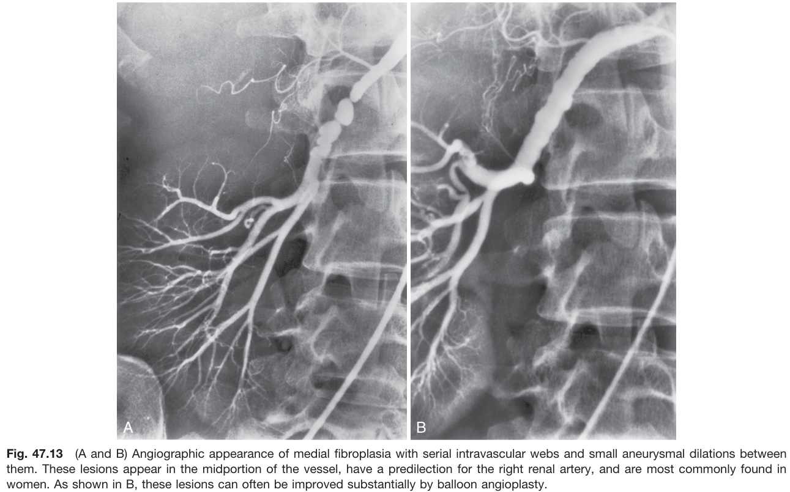

Fig. 47.13 (A and B) Angiographic appearance of medial fibroplasia with serial intravascular webs and small aneurysmal dilations between them. These lesions appear in the midportion of the vessel, have a predilection for the right renal artery, and are most commonly found in women. As shown in B, these lesions can often be improved substantially by balloon angioplasty.

---

### Fig_47_14

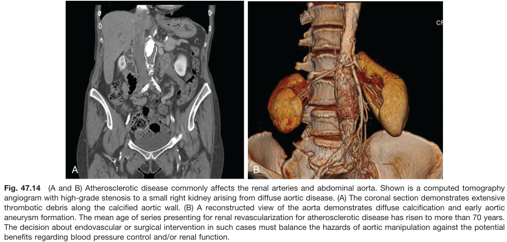

Fig. 47.14 (A and B) Atherosclerotic disease commonly affects the renal arteries and abdominal aorta. Shown is a computed tomography angiogram with high-grade stenosis to a small right kidney arising from diffuse aortic disease. (A) The coronal section demonstrates extensive thrombotic debris along the calcified aortic wall. (B) A reconstructed view of the aorta demonstrates diffuse calcification and early aortic aneurysm formation. The mean age of series presenting for renal revascularization for atherosclerotic disease has risen to more than 70 years. The decision about endovascular or surgical intervention in such cases must balance the hazards of aortic manipulation against the potential benefits regarding blood pressure control and/or renal function.

---

### Fig_47_15

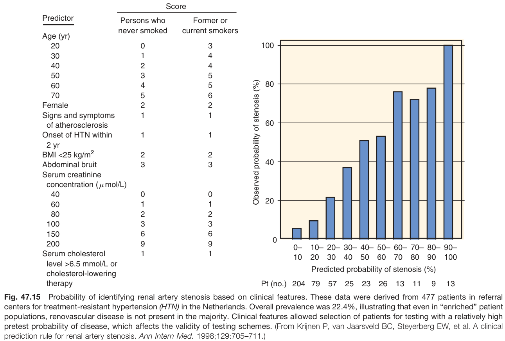

Fig. 47.15 Probability of identifying renal artery stenosis based on clinical features. These data were derived from 477 patients in referral centers for treatment-resistant hypertension (HTN) in the Netherlands. Overall prevalence was 22.4%, illustrating that even in "enriched" patient populations, renovascular disease is not present in the majority. Clinical features allowed selection of patients for testing with a relatively high pretest probability of disease, which affects the validity of testing schemes. (From Krijnen P, van Jaarsveld BC, Steyerberg EW, et al. A clinical prediction rule for renal artery stenosis. Ann Intern Med. 1998;129:705-711.)

---

### Fig_47_16

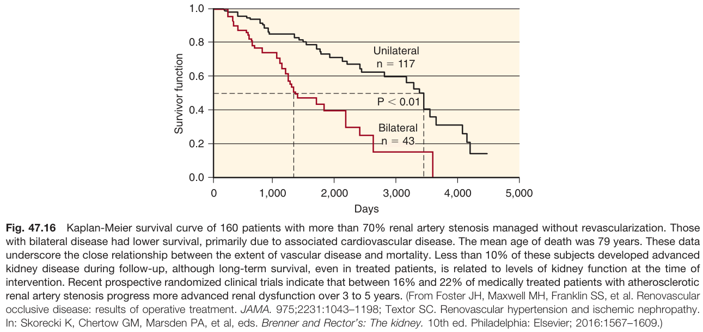

Fig. 47.16 Kaplan-Meier survival curve of 160 patients with more than 70% renal artery stenosis managed without revascularization. Those with bilateral disease had lower survival, primarily due to associated cardiovascular disease. The mean age of death was 79 years. These data underscore the close relationship between the extent of vascular disease and mortality. Less than 10% of these subjects developed advanced kidney disease during follow-up, although long-term survival, even in treated patients, is related to levels of kidney function at the time of intervention. Recent prospective randomized clinical trials indicate that between 16% and 22% of medically treated patients with atherosclerotic renal artery stenosis progress more advanced renal dysfunction over 3 to 5 years. (From Foster JH, Maxwell MH, Franklin SS, et al. Renovascular occlusive disease: results of operative treatment. JAMA. 975;2231:1043-1198; Textor SC. Renovascular hypertension and ischemic nephropathy. In: Skorecki K, Chertow GM, Marsden PA, et al, eds. Brenner and Rector's: The kidney. 10th ed. Philadelphia: Elsevier; 2016:1567-1609.)

---

### Fig_47_17

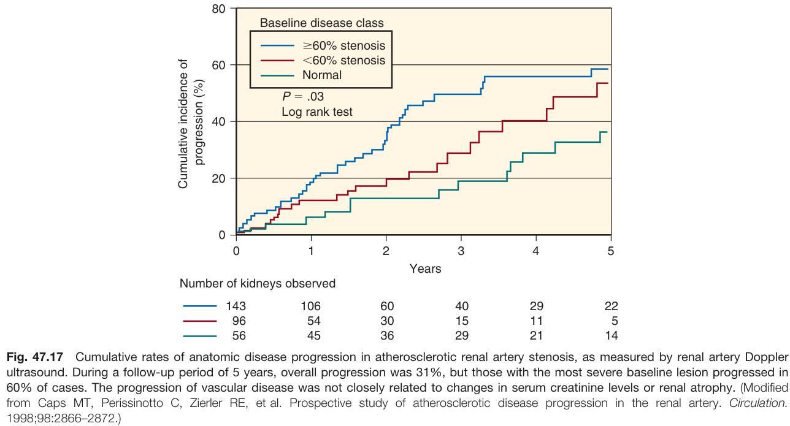

Fig. 47.17 Cumulative rates of anatomic disease progression in atherosclerotic renal artery stenosis, as measured by renal artery Doppler ultrasound. During a follow-up period of 5 years, overall progression was 31%, but those with the most severe baseline lesion progressed in 60% of cases. The progression of vascular disease was not closely related to changes in serum creatinine levels or renal atrophy. (Modified from Caps MT, Perissinotto C, Zierler RE, et al. Prospective study of atherosclerotic disease progression in the renal artery. Circulation. 1998;98:2866-2872.)

---

### Fig_47_18

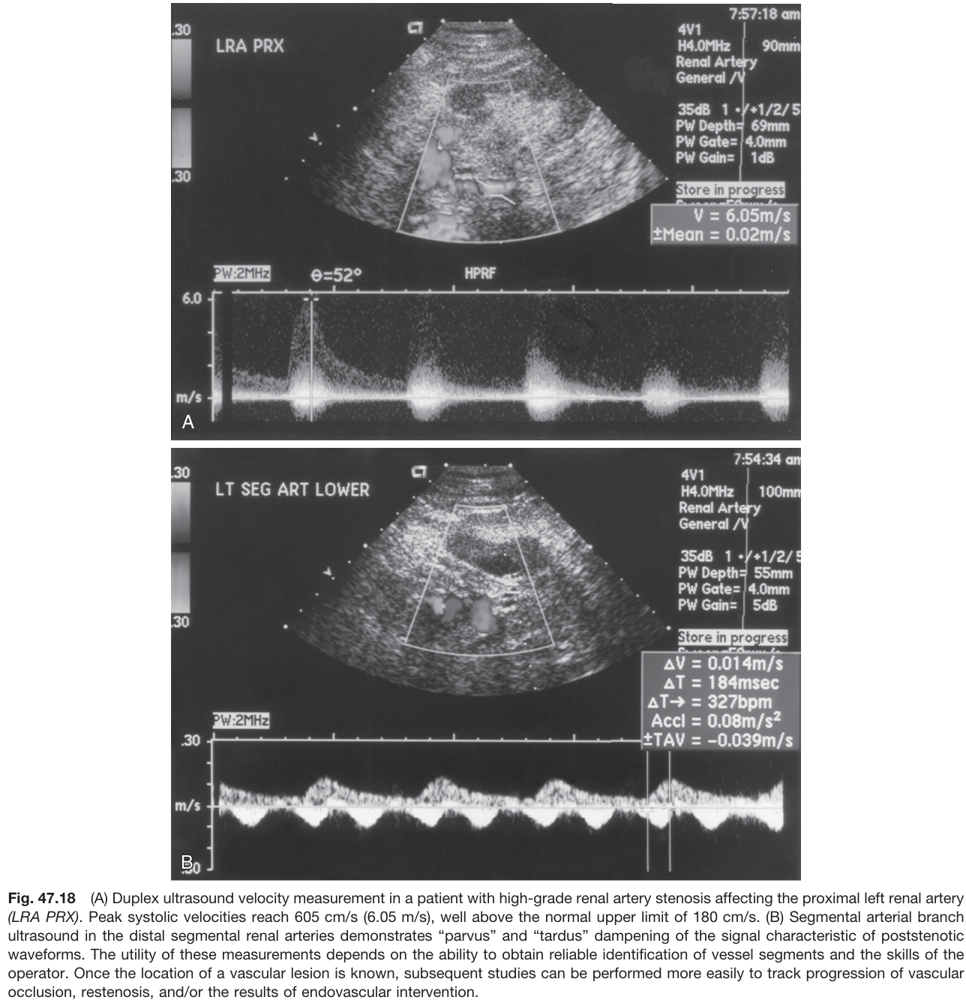

Fig. 47.18 (A) Duplex ultrasound velocity measurement in a patient with high-grade renal artery stenosis affecting the proximal left renal artery (LRA PRX). Peak systolic velocities reach 605 cm/s (6.05 m/s), well above the normal upper limit of 180 cm/s. (B) Segmental arterial branch ultrasound in the distal segmental renal arteries demonstrates "parvus" and "tardus" dampening of the signal characteristic of poststenotic waveforms. The utility of these measurements depends on the ability to obtain reliable identification of vessel segments and the skills of the operator. Once the location of a vascular lesion is known, subsequent studies can be performed more easily to track progression of vascular occlusion, restenosis, and/or the results of endovascular intervention.

---

### Fig_47_19

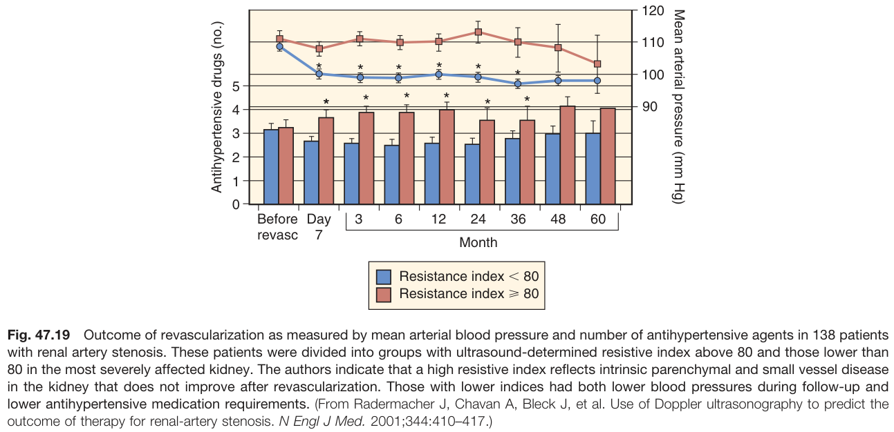

Fig. 47.19 Outcome of revascularization as measured by mean arterial blood pressure and number of antihypertensive agents in 138 patients with renal artery stenosis. These patients were divided into groups with ultrasound-determined resistive index above 80 and those lower than 80 in the most severely affected kidney. The authors indicate that a high resistive index reflects intrinsic parenchymal and small vessel disease in the kidney that does not improve after revascularization. Those with lower indices had both lower blood pressures during follow-up and lower antihypertensive medication requirements. (From Radermacher J, Chavan A, Bleck J, et al. Use of Doppler ultrasonography to predict the outcome of therapy for renal-artery stenosis. N Engl J Med. 2001;344:410-417.)

---

### Fig_47_20

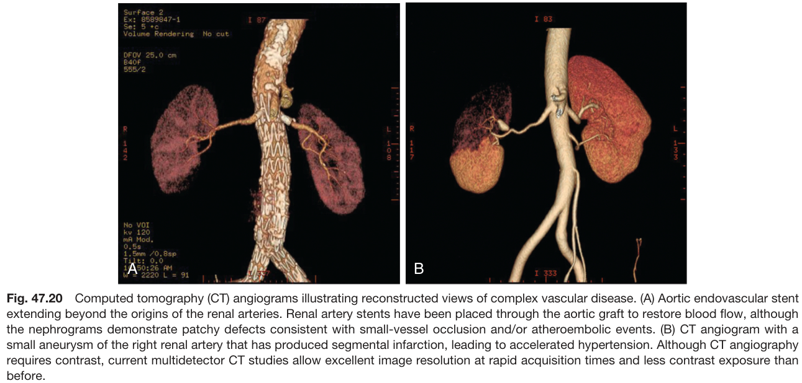

Fig. 47.20 Computed tomography (CT) angiograms illustrating reconstructed views of complex vascular disease. (A) Aortic endovascular stent extending beyond the origins of the renal arteries. Renal artery stents have been placed through the aortic graft to restore blood flow, although the nephrograms demonstrate patchy defects consistent with small-vessel occlusion and/or atheroembolic events. (B) CT angiogram with a small aneurysm of the right renal artery that has produced segmental infarction, leading to accelerated hypertension. Although CT angiography requires contrast, current multidetector CT studies allow excellent image resolution at rapid acquisition times and less contrast exposure than before.

---

### Fig_47_21

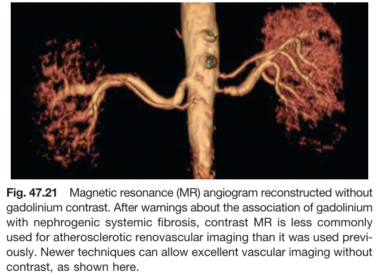

Fig. 47.21 Magnetic resonance (MR) angiogram reconstructed without gadolinium contrast. After warnings about the association of gadolinium with nephrogenic systemic fibrosis, contrast MR is less commonly used for atherosclerotic renovascular imaging than it was used previously. Newer techniques can allow excellent vascular imaging without contrast, as shown here.

---

### Fig_47_22

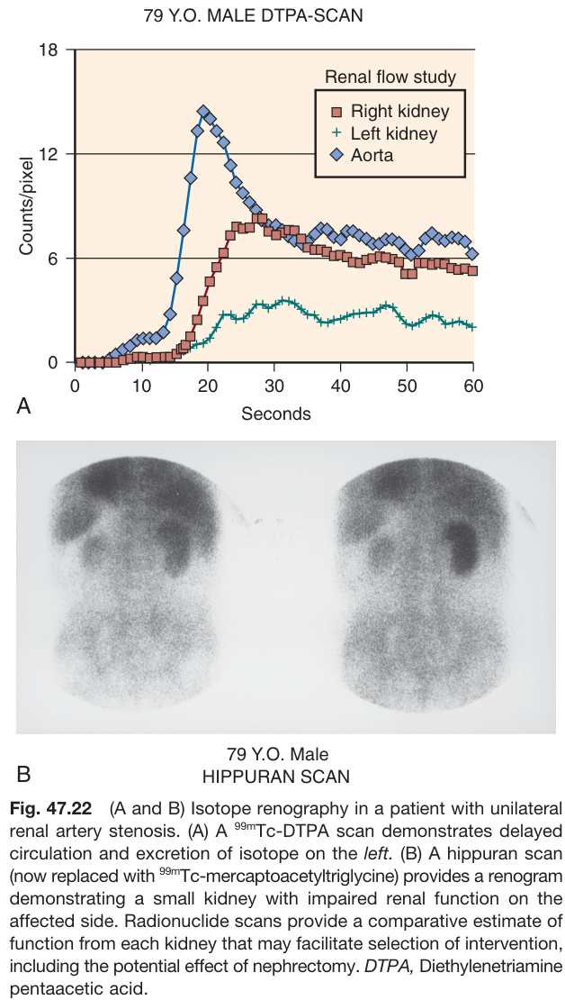

Fig. 47.22 (A and B) Isotope renography in a patient with unilateral renal artery stenosis. (A) A 99mTc-DTPA scan demonstrates delayed circulation and excretion of isotope on the left. (B) A hippuran scan (now replaced with 99mTc-mercaptoacetyltriglycine) provides a renogram demonstrating a small kidney with impaired renal function on the affected side. Radionuclide scans provide a comparative estimate of function from each kidney that may facilitate selection of intervention, including the potential effect of nephrectomy. DTPA, Diethylenetriamine pentaacetic acid.

---

### Fig_47_23

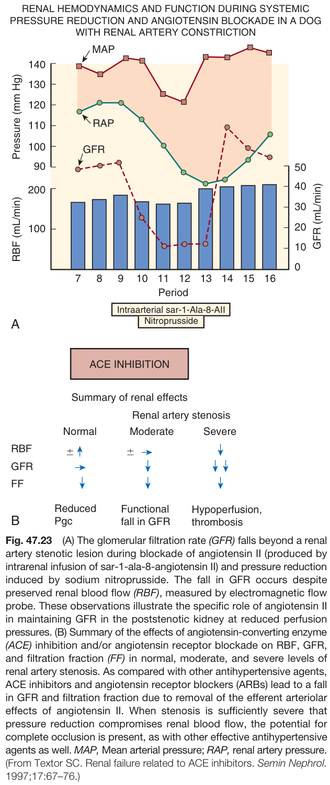

Fig. 47.23 (A) The glomerular filtration rate (GFR) falls beyond a renal artery stenotic lesion during blockade of angiotensin II (produced by intrarenal infusion of sar-1-ala-8-angiotensin II) and pressure reduction induced by sodium nitroprusside. The fall in GFR occurs despite preserved renal blood flow (RBF), measured by electromagnetic flow probe. These observations illustrate the specific role of angiotensin II in maintaining GFR in the poststenotic kidney at reduced perfusion pressures. (B) Summary of the effects of angiotensin-converting enzyme (ACE) inhibition and/or angiotensin receptor blockade on RBF, GFR, and filtration fraction (FF) in normal, moderate, and severe levels of renal artery stenosis. As compared with other antihypertensive agents, ACE inhibitors and angiotensin receptor blockers (ARBs) lead to a fall in GFR and filtration fraction due to removal of the efferent arteriolar effects of angiotensin II. When stenosis is sufficiently severe that pressure reduction compromises renal blood flow, the potential for complete occlusion is present, as with other effective antihypertensive agents as well. MAP, Mean arterial pressure; RAP, renal artery pressure. (From Textor SC. Renal failure related to ACE inhibitors. Semin Nephrol. 1997;17:67-76.)

---

### Fig_47_24

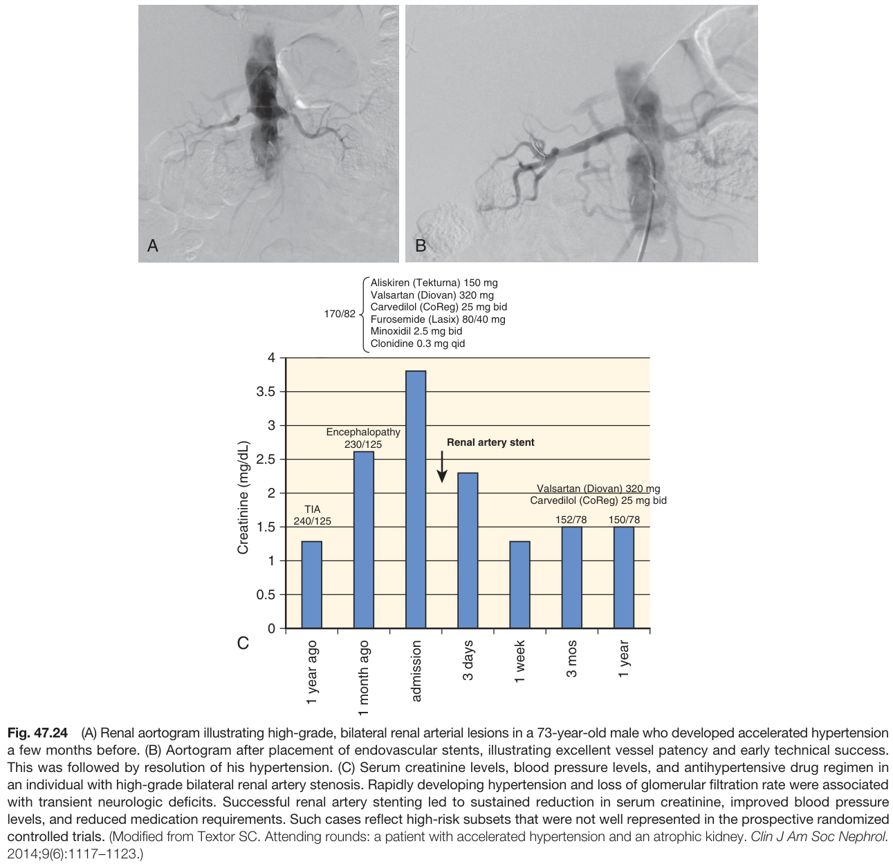

Fig. 47.24 (A) Renal aortogram illustrating high-grade, bilateral renal arterial lesions in a 73-year-old male who developed accelerated hypertension a few months before. (B) Aortogram after placement of endovascular stents, illustrating excellent vessel patency and early technical success. (C) Serum creatinine levels, blood pressure levels, and antihypertensive drug regimen in an individual with high-grade bilateral renal artery stenosis. Rapidly developing hypertension and loss of glomerular filtration rate were associated with transient neurologic deficits. Successful renal artery stenting led to sustained reduction in serum creatinine, improved blood pressure levels, and reduced medication requirements. Such cases reflect high-risk subsets that were not well represented in the prospective randomized controlled trials. (Modified from Textor SC. Attending rounds: a patient with accelerated hypertension and an atrophic kidney. Clin J Am Soc Nephrol. 2014;9(6):1117-1123.)

---

### Fig_47_25

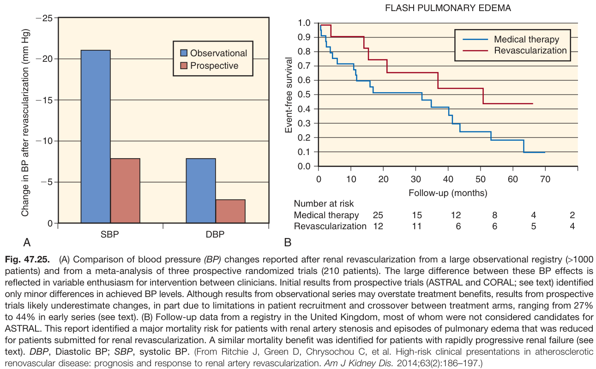

Fig. 47.25 (A) Comparison of blood pressure (BP) changes reported after renal revascularization from a large observational registry (>1000 patients) and from a meta-analysis of three prospective randomized trials (210 patients). The large difference between these BP effects is reflected in variable enthusiasm for intervention between clinicians. Initial results from prospective trials (ASTRAL and CORAL; see text) identified only minor differences in achieved BP levels. Although results from observational series may overstate treatment benefits, results from prospective trials likely underestimate changes, in part due to limitations in patient recruitment and crossover between treatment arms, ranging from 27% to 44% in early series (see text). (B) Follow-up data from a registry in the United Kingdom, most of whom were not considered candidates for ASTRAL. This report identified a major mortality risk for patients with renal artery stenosis and episodes of pulmonary edema that was reduced for patients submitted for renal revascularization. A similar mortality benefit was identified for patients with rapidly progressive renal failure (see text). DBP, Diastolic BP; SBP, systolic BP. (From Ritchie J, Green D, Chrysochou C, et al. High-risk clinical presentations in atherosclerotic renovascular disease: prognosis and response to renal artery revascularization. Am J Kidney Dis. 2014;63(2):186-197.)

---

### Fig_47_26

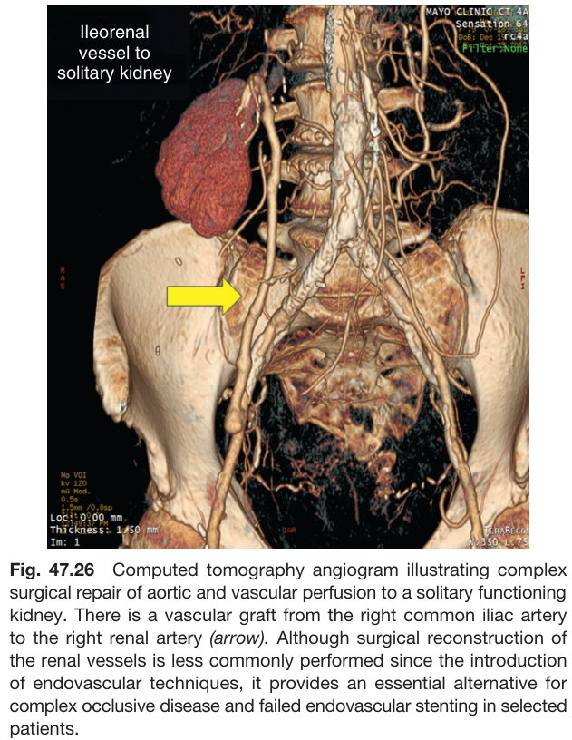

Fig. 47.26 Computed tomography angiogram illustrating complex surgical repair of aortic and vascular perfusion to a solitary functioning kidney. There is a vascular graft from the right common iliac artery to the right renal artery (arrow). Although surgical reconstruction of the renal vessels is less commonly performed since the introduction of endovascular techniques, it provides an essential alternative for complex occlusive disease and failed endovascular stenting in selected patients.

---

### Fig_47_27

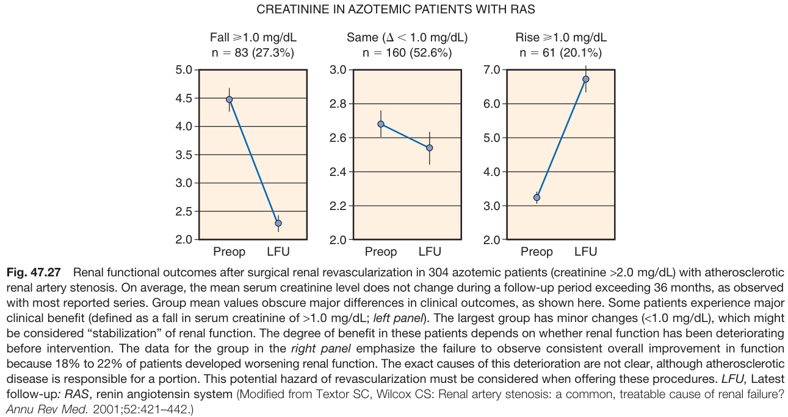

Fig. 47.27 Renal functional outcomes after surgical renal revascularization in 304 azotemic patients (creatinine >2.0 mg/dL) with atherosclerotic renal artery stenosis. On average, the mean serum creatinine level does not change during a follow-up period exceeding 36 months, as observed with most reported series. Group mean values obscure major differences in clinical outcomes, as shown here. Some patients experience major clinical benefit (defined as a fall in serum creatinine of >1.0 mg/dL; left panel). The largest group has minor changes (<1.0 mg/dL), which might be considered "stabilization" of renal function. The degree of benefit in these patients depends on whether renal function has been deteriorating before intervention. The data for the group in the right panel emphasize the failure to observe consistent overall improvement in function because 18% to 22% of patients developed worsening renal function. The exact causes of this deterioration are not clear, although atherosclerotic disease is responsible for a portion. This potential hazard of revascularization must be considered when offering these procedures. LFU, Latest follow-up: RAS, renin angiotensin system (Modified from Textor SC, Wilcox CS: Renal artery stenosis: a common, treatable cause of renal failure? Annu Rev Med. 2001;52:421-442.)

---

### Fig_47_28

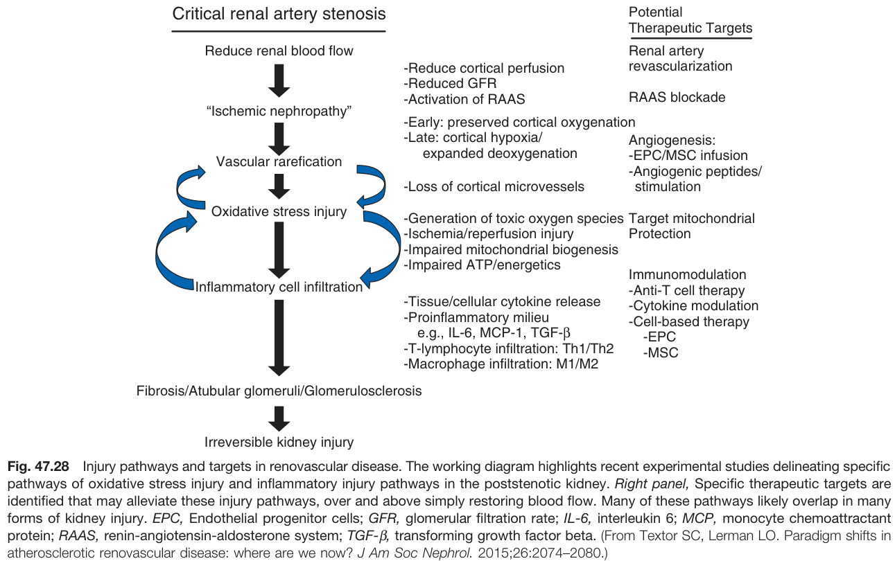

Fig. 47.28 Injury pathways and targets in renovascular disease. The working diagram highlights recent experimental studies delineating specific pathways of oxidative stress injury and inflammatory injury pathways in the poststenotic kidney. Right panel, Specific therapeutic targets are identified that may alleviate these injury pathways, over and above simply restoring blood flow. Many of these pathways likely overlap in many forms of kidney injury. EPC, Endothelial progenitor cells; GFR, glomerular filtration rate; IL-6, interleukin 6; MCP, monocyte chemoattractant protein; RAAS, renin-angiotensin-aldosterone system; TGF-β, transforming growth factor beta. (From Textor SC, Lerman LO. Paradigm shifts in atherosclerotic renovascular disease: where are we now? J Am Soc Nephrol. 2015;26:2074-2080.)

---

### Fig_47_29

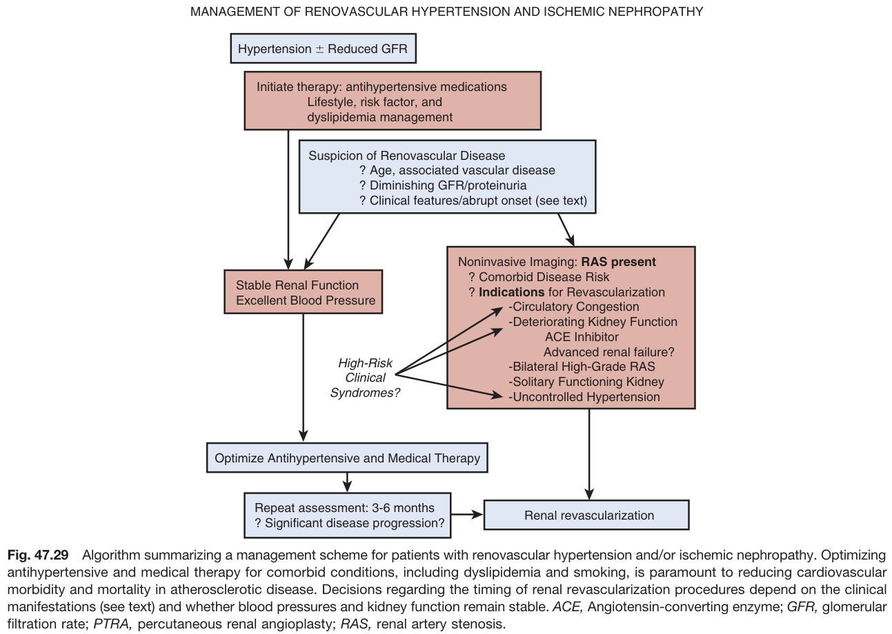

Fig. 47.29 Algorithm summarizing a management scheme for patients with renovascular hypertension and/or ischemic nephropathy. Optimizing antihypertensive and medical therapy for comorbid conditions, including dyslipidemia and smoking, is paramount to reducing cardiovascular morbidity and mortality in atherosclerotic disease. Decisions regarding the timing of renal revascularization procedures depend on the clinical manifestations (see text) and whether blood pressures and kidney function remain stable. ACE, Angiotensin-converting enzyme; GFR, glomerular filtration rate; PTRA, percutaneous renal angioplasty; RAS, renal artery stenosis.

---

## Tables

### Table_47_1

#### Table Image

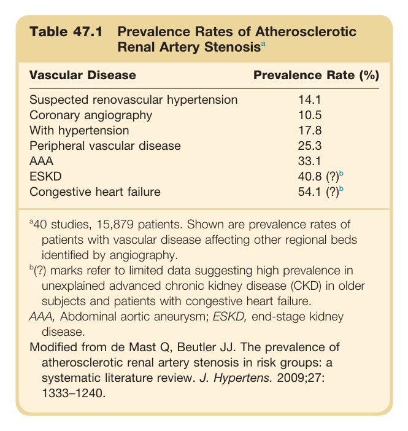

#### Table Data (CSV: [Table_47_1.csv](Table_47_1.csv))

```markdown
| Table Text (OCR) |
| :--- |
| Table 47.1 Prevalence Rates of Atherosclerotic Renal Artery Stenosis<sup>a</sup> Vascular Disease  Prevalence Rate (%)    Suspected renovascular hypertension  14.1    Coronary angiography  10.5    With hypertension  17.8    Peripheral vascular disease  25.3    AAA  33.1    ESKD  40.8 (?)b    Congestive heart failure  54.1 (?)b <sup>a</sup>40 studies, 15,879 patients. Shown are prevalence rates of patients with vascular disease affecting other regional beds identified by angiography. <sup>b</sup>(?) marks refer to limited data suggesting high prevalence in unexplained advanced chronic kidney disease (CKD) in older subjects and patients with congestive heart failure. AAA, Abdominal aortic aneurysm; ESKD, end-stage kidney disease. Modified from de Mast Q, Beutler JJ. The prevalence of atherosclerotic renal artery stenosis in risk groups: a systematic literature review. J. Hypertens. 2009;27: 1333–1240. |
```

Table 47.1 Prevalence Rates of Atherosclerotic Renal Artery Stenosis | Vascular Disease | Prevalence Rate (%) | | :--- | :--- | | Suspected renovascular hypertension | 14.1 | | Coronary angiography | 10.5 | | With hypertension | 17.8 | | Peripheral vascular disease | 25.3 | | AAA | 33.1 | | ESKD | 40.8 (?) | | Congestive heart failure | 54.1 (?) | a40 studies, 15,879 patients. Shown are prevalence rates of patients with vascular disease affecting other regional beds identified by angiography. b(?) marks refer to limited data suggesting high prevalence in unexplained advanced chronic kidney disease (CKD) in older subjects and patients with congestive heart failure. AAA, Abdominal aortic aneurysm; ESKD, end-stage kidney disease. Modified from de Mast Q, Beutler JJ. The prevalence of atherosclerotic renal artery stenosis in risk groups: a systematic literature review. J. Hypertens. 2009;27: 1333-1240.

---

### Table_47_2

#### Table Image

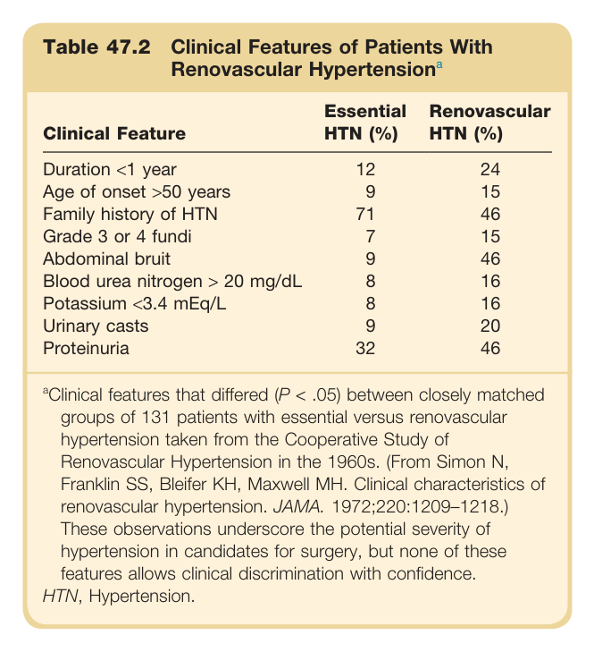

#### Table Data (CSV: [Table_47_2.csv](Table_47_2.csv))

```markdown
| Table Text (OCR) |
| :--- |
| Table 47.2 Clinical Features of Patients With Renovascular Hypertension<sup>a</sup> Clinical Feature  Essential HTN (%)  Renovascular HTN (%)    Duration <1 year  12  24    Age of onset >50 years  9  15    Family history of HTN  71  46    Grade 3 or 4 fundi  7  15    Abdominal bruit  9  46    Blood urea nitrogen > 20 mg/dL  8  16    Potassium <3.4 mEq/L  8  16    Urinary casts  9  20    Proteinuria  32  46 |
```

Table 47.2 Clinical Features of Patients With Renovascular Hypertension | Clinical Feature | Essential HTN (%) | Renovascular HTN (%) | | :--- | :--- | :--- | | Duration <1 year | 12 | 24 | | Age of onset >50 years | 9 | 15 | | Family history of HTN | 71 | 46 | | Grade 3 or 4 fundi | 7 | 15 | | Abdominal bruit | 9 | 46 | | Blood urea nitrogen > 20 mg/dL | 8 | 16 | | Potassium <3.4 mEq/L | 8 | 16 | | Urinary casts | 9 | 20 | | Proteinuria | 32 | 46 | aClinical features that differed (P < .05) between closely matched groups of 131 patients with essential versus renovascular hypertension taken from the Cooperative Study of Renovascular Hypertension in the 1960s. (From Simon N, Franklin SS, Bleifer KH, Maxwell MH. Clinical characteristics of renovascular hypertension. JAMA. 1972;220:1209-1218.) These observations underscore the potential severity of hypertension in candidates for surgery, but none of these features allows clinical discrimination with confidence. HTN, Hypertension.

---

### Table_47_3

#### Table Image

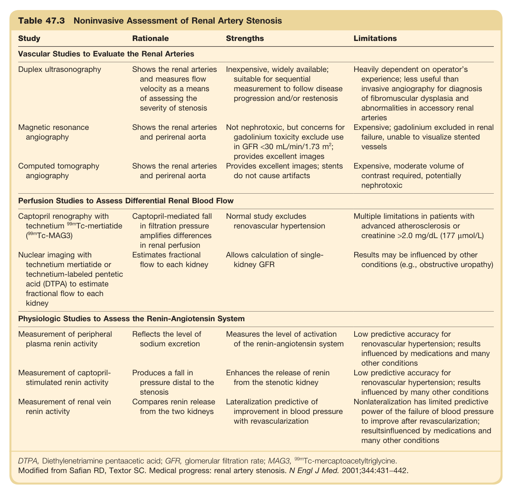

#### Table Data (CSV: [Table_47_3.csv](Table_47_3.csv))

```markdown
| Table Text (OCR) |
| :--- |
| Table 47.3 Noninvasive Assessment of Renal Artery Stenosis Study  Rationale  Strengths  Limitations    Vascular Studies to Evaluate the Renal Arteries    Duplex ultrasonography  Shows the renal arteries and measures flow velocity as a means of assessing the severity of stenosis  Inexpensive, widely available; suitable for sequential measurement to follow disease progression and/or restenosis  Heavily dependent on operator's experience; less useful than invasive angiography for diagnosis of fibromuscular dysplasia and abnormalities in accessory renal arteries    Magnetic resonance angiography  Shows the renal arteries and perirenal aorta  Not nephrotoxic, but concerns for gadolinium toxicity exclude use in GFR <30 mL/min/1.73 m2; provides excellent images  Expensive; gadolinium excluded in renal failure, unable to visualize stented vessels    Computed tomography angiography  Shows the renal arteries and perirenal aorta  Provides excellent images; stents do not cause artifacts  Expensive, moderate volume of contrast required, potentially nephrotoxic    Perfusion Studies to Assess Differential Renal Blood Flow    Captopril renography with technetium 99mTc-meriatide (99mTc-MAG3)  Captopril-mediated fall in filtration pressure amplifies differences in renal perfusion  Normal study excludes renovascular hypertension  Multiple limitations in patients with advanced atherosclerosis or creatinine >2.0 mg/dL (177 μmol/L)    Nuclear imaging with technetium mertiatide or technetium-labeled pentetic acid (DTPA) to estimate fractional flow to each kidney  Estimates fractional flow to each kidney  Allows calculation of single-kidney GFR  Results may be influenced by other conditions (e.g., obstructive uropathy)    Physiologic Studies to Assess the Renin-Angiotensin System    Measurement of peripheral plasma renin activity  Reflects the level of sodium excretion  Measures the level of activation of the renin-angiotensin system  Low predictive accuracy for renovascular hypertension; results influenced by medications and many other conditions    Measurement of captopril-stimulated renin activity  Produces a fall in pressure distal to the stenosis  Enhances the release of renin from the stenotic kidney  Low predictive accuracy for renovascular hypertension; results influenced by many other conditions    Measurement of renal vein renin activity  Compares renin release from the two kidneys  Lateralization predictive of improvement in blood pressure with revascularization  Nonlateralization has limited predictive power of the failure of blood pressure to improve after revascularization; resultsinfluenced by medications and many other conditions DTPA, Diethylenetriamine pentaacetic acid; GFR, glomerular filtration rate; MAG3, <sup>99m</sup>Tc-mercaptoacetyltriglycine. Modified from Safian RD, Textor SC. Medical progress: renal artery stenosis. N Engl J Med. 2001;344:431−442. |
```

Table 47.3 Noninvasive Assessment of Renal Artery Stenosis | Study | Rationale | Strengths | Limitations | | :--- | :--- | :--- | :--- | | **Vascular Studies to Evaluate the Renal Arteries** | | | | | Duplex ultrasonography | Shows the renal arteries and measures flow velocity as a means of assessing the severity of stenosis | Inexpensive, widely available; suitable for sequential measurement to follow disease progression and/or restenosis | Heavily dependent on operator's experience; less useful than invasive angiography for diagnosis of fibromuscular dysplasia and abnormalities in accessory renal arteries | | Magnetic resonance angiography | Shows the renal arteries and perirenal aorta | Not nephrotoxic, but concerns for gadolinium toxicity exclude use in GFR <30 mL/min/1.73 m²; provides excellent images | Expensive; gadolinium excluded in renal failure, unable to visualize stented vessels | | Computed tomography angiography | Shows the renal arteries and perirenal aorta | Provides excellent images; stents do not cause artifacts | Expensive, moderate volume of contrast required, potentially nephrotoxic | | **Perfusion Studies to Assess Differential Renal Blood Flow** | | | | | Captopril renography with technetium 99mTc-mertiatide (99mTc-MAG3) | Captopril-mediated fall in filtration pressure amplifies differences in renal perfusion | Normal study excludes renovascular hypertension | Multiple limitations in patients with advanced atherosclerosis or creatinine >2.0 mg/dL (177 µmol/L) | | Nuclear imaging with technetium mertiatide or technetium-labeled pentetic acid (DTPA) to estimate fractional flow to each kidney | Estimates fractional flow to each kidney | Allows calculation of single-kidney GFR | Results may be influenced by other conditions (e.g., obstructive uropathy) | | **Physiologic Studies to Assess the Renin-Angiotensin System** | | | | | Measurement of peripheral plasma renin activity | Reflects the level of sodium excretion | Measures the level of activation of the renin-angiotensin system | Low predictive accuracy for renovascular hypertension; results influenced by medications and many other conditions | | Measurement of captopril-stimulated renin activity | Produces a fall in pressure distal to the stenosis | Enhances the release of renin from the stenotic kidney | Low predictive accuracy for renovascular hypertension; results influenced by many other conditions | | Measurement of renal vein renin activity | Compares renin release from the two kidneys | Lateralization predictive of improvement in blood pressure with revascularization | Nonlateralization has limited predictive power of the failure of blood pressure to improve after revascularization; resultsinfluenced by medications and many other conditions | DTPA, Diethylenetriamine pentaacetic acid; GFR, glomerular filtration rate; MAG3, 99mTc-mercaptoacetyltriglycine. Modified from Safian RD, Textor SC. Medical progress: renal artery stenosis. N Engl J Med. 2001;344:431-442.

---

### Table_47_4

#### Table Image

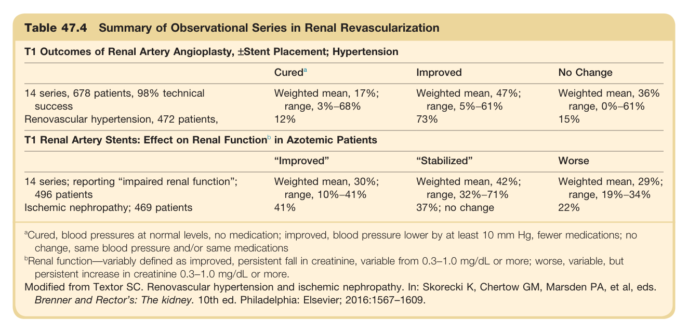

#### Table Data (CSV: [Table_47_4.csv](Table_47_4.csv))

```markdown
| Table Text (OCR) |
| :--- |
| Table 47.4 Summary of Observational Series in Renal Revascularization T1 Outcomes of Renal Artery Angioplasty, ±Stent Placement; Hypertension Cured ^{a}   Improved  No Change    14 series, 678 patients, 98% technical successRenovascular hypertension, 472 patients,  Weighted mean, 17%; range, 3%-68%12%  Weighted mean, 47%; range, 5%-61%73%  Weighted mean, 36% range, 0%-61%15%    T1 Renal Artery Stents: Effect on Renal Function ^{b}  in Azotemic Patients      “Improved”  “Stabilized”  Worse    14 series; reporting “impaired renal function”;496 patientsIschemic nephropathy; 469 patients  Weighted mean, 30%; range, 10%-41%41%  Weighted mean, 42%; range, 32%-71%37%; no change  Weighted mean, 29%; range, 19%-34%22% <sup>a</sup>Cured, blood pressures at normal levels, no medication; improved, blood pressure lower by at least 10 mm Hg, fewer medications; no change, same blood pressure and/or same medications <sup>b</sup>Renal function—variably defined as improved, persistent fall in creatinine, variable from 0.3−1.0 mg/dL or more; worse, variable, but persistent increase in creatinine 0.3−1.0 mg/dL or more. Modified from Textor SC. Renovascular hypertension and ischemic nephropathy. In: Skorecki K, Chertow GM, Marsden PA, et al, eds. Brenner and Rector’s: The kidney. 10th ed. Philadelphia: Elsevier; 2016:1567–1609. |
```

Table 47.4 Summary of Observational Series in Renal Revascularization **T1 Outcomes of Renal Artery Angioplasty, ±Stent Placement; Hypertension** | | Cured | Improved | No Change | | :--- | :--- | :--- | :--- | | 14 series, 678 patients, 98% technical success | Weighted mean, 17%; range, 3%-68% | Weighted mean, 47%; range, 5%-61% | Weighted mean, 36% range, 0%-61% | | Renovascular hypertension, 472 patients, | 12% | 73% | 15% | **T1 Renal Artery Stents: Effect on Renal Function in Azotemic Patients** | | "Improved" | "Stabilized" | Worse | | :--- | :--- | :--- | :--- | | 14 series; reporting "impaired renal function"; 496 patients | Weighted mean, 30%; range, 10%-41% | Weighted mean, 42%; range, 32%-71% | Weighted mean, 29%; range, 19%-34% | | Ischemic nephropathy; 469 patients | 41% | 37%; no change | 22% | aCured, blood pressures at normal levels, no medication; improved, blood pressure lower by at least 10 mm Hg, fewer medications; no change, same blood pressure and/or same medications bRenal function-variably defined as improved, persistent fall in creatinine, variable from 0.3-1.0 mg/dL or more; worse, variable, but persistent increase in creatinine 0.3-1.0 mg/dL or more. Modified from Textor SC. Renovascular hypertension and ischemic nephropathy. In: Skorecki K, Chertow GM, Marsden PA, et al, eds. Brenner and Rector's: The kidney. 10th ed. Philadelphia: Elsevier; 2016:1567-1609.

---

### Table_47_5

#### Table Image

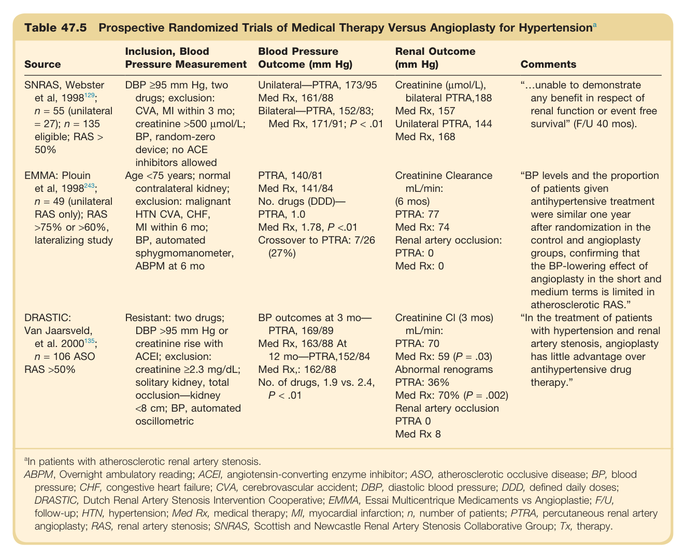

#### Table Data (CSV: [Table_47_5.csv](Table_47_5.csv))

```markdown
| Table Text (OCR) |
| :--- |
| Table 47.5 Prospective Randomized Trials of Medical Therapy Versus Angioplasty for Hypertension<sup>a</sup> Source  Inclusion, Blood Pressure Measurement  Blood Pressure Outcome (mm Hg)  Renal Outcome (mm Hg)  Comments    SNRAS, Webster et al,  1998^{129} ; n = 55  (unilateral = 27);  n = 135  eligible; RAS > 50%  DBP ≥95 mm Hg, two drugs; exclusion:CVA, MI within 3 mo; creatinine >500 μmol/L; BP, random-zero device; no ACE inhibitors allowed  Unilateral—PTRA, 173/95Med Rx, 161/88Bilateral—PTRA, 152/83; Med Rx, 171/91;  P < .01   Creatinine (μmol/L), bilateral PTRA,188Med Rx, 157Unilateral PTRA, 144Med Rx, 168  “...unable to demonstrate any benefit in respect of renal function or event free survival” (F/U 40 mos).    EMMA: Plouin et al,  1998^{243} ; n = 49  (unilateral RAS only); RAS >75% or >60%, lateralizing study  Age <75 years; normal contralateral kidney;exclusion: malignantHTN CVA, CHF,MI within 6 mo;BP, automated sphygmomanometer, ABPM at 6 mo  PTRA, 140/81Med Rx, 141/84No. drugs (DDD)—PTRA, 1.0Med Rx, 1.78,  P < .01 Crossover to PTRA: 7/26 (27%)  Creatinine Clearance mL/min:(6 mos)PTRA: 77Med Rx: 74Renal artery occlusion:PTRA: 0Med Rx: 0  “BP levels and the proportion of patients given antihypertensive treatment were similar one year after randomization in the control and angioplasty groups, confirming that the BP-lowering effect of angioplasty in the short and medium terms is limited in atherosclerotic RAS.”    DRASTIC:Van Jaarsveld, et al.  2000^{135} ; n = 106  ASO RAS >50%  Resistant: two drugs;DBP >95 mm Hg or creatinine rise with ACEI; exclusion: creatinine ≥2.3 mg/dL; solitary kidney, total occlusion—kidney <8 cm; BP, automated oscillometric  BP outcomes at 3 mo—PTRA, 169/89Med Rx, 163/88 At 12 mo—PTRA,152/84Med Rx,: 162/88No. of drugs, 1.9 vs. 2.4,  P < .01   Creatinine CI (3 mos)mL/min:PTRA: 70Med Rx: 59 ( P = .03 )Abnormal renogramsPTRA: 36%Med Rx: 70% ( P = .002 )Renal artery occlusionPTRA 0Med Rx 8  “In the treatment of patients with hypertension and renal artery stenosis, angioplasty has little advantage over antihypertensive drug therapy.” <sup>a</sup>In patients with atherosclerotic renal artery stenosis. ABPM, Overnight ambulatory reading; ACEI, angiotensin-converting enzyme inhibitor; ASO, atherosclerotic occlusive disease; BP, blood pressure; CHF, congestive heart failure; CVA, cerebrovascular accident; DBP, diastolic blood pressure; DDD, defined daily doses; DRASTIC, Dutch Renal Artery Stenosis Intervention Cooperative; EMMA, Essai Multicentrique Medicaments vs Angioplastie; F/U, follow-up; HTN, hypertension; Med Rx, medical therapy; MI, myocardial infarction; n, number of patients; PTRA, percutaneous renal artery angioplasty; RAS, renal artery stenosis; SNRAS, Scottish and Newcastle Renal Artery Stenosis Collaborative Group; Tx, therapy. |
```

Table 47.5 Prospective Randomized Trials of Medical Therapy Versus Angioplasty for Hypertension | Source | Inclusion, Blood Pressure Measurement | Blood Pressure Outcome (mm Hg) | Renal Outcome (mm Hg) | Comments | | :--- | :--- | :--- | :--- | :--- | | SNRAS, Webster et al, 1998; n = 55 (unilateral = 27); n = 135 eligible; RAS > 50% | DBP ≥95 mm Hg, two drugs; exclusion: CVA, MI within 3 mo; creatinine >500 μmol/L; BP, random-zero device; no ACE inhibitors allowed | Unilateral—PTRA, 173/95 Med Rx, 161/88 Bilateral—PTRA, 152/83; Med Rx, 171/91; P < .01 | Creatinine (µmol/L), bilateral PTRA, 188 Med Rx, 157 Unilateral PTRA, 144 Med Rx, 168 | "...unable to demonstrate any benefit in respect of renal function or event free survival" (F/U 40 mos). | | EMMA: Plouin et al, 1998; n = 49 (unilateral RAS only); RAS >75% or >60%, lateralizing study | Age <75 years; normal contralateral kidney; exclusion: malignant HTN CVA, CHF, MI within 6 mo; BP, automated sphygmomanometer, ABPM at 6 mo | PTRA, 140/81 Med Rx, 141/84 No. drugs (DDD)— PTRA, 1.0 Med Rx, 1.78, P <.01 Crossover to PTRA: 7/26 (27%) | Creatinine Clearance mL/min: (6 mos) PTRA: 77 Med Rx: 74 Renal artery occlusion: PTRA: 0 Med Rx: 0 | "BP levels and the proportion of patients given antihypertensive treatment were similar one year after randomization in the control and angioplasty groups, confirming that the BP-lowering effect of angioplasty in the short and medium terms is limited in atherosclerotic RAS." | | DRASTIC: Van Jaarsveld, et al. 2000; n = 106 ASO RAS >50% | Resistant: two drugs; DBP >95 mm Hg or creatinine rise with ACEI; exclusion: creatinine ≥2.3 mg/dL; solitary kidney, total occlusion-kidney <8 cm; BP, automated oscillometric | BP outcomes at 3 mo— PTRA, 169/89 Med Rx, 163/88 At 12 mo—PTRA, 152/84 Med Rx,: 162/88 No. of drugs, 1.9 vs. 2.4, P < .01 | Creatinine CI (3 mos) mL/min: PTRA: 70 Med Rx: 59 (P = .03) Abnormal renograms PTRA: 36% Med Rx: 70% (P = .002) Renal artery occlusion PTRA 0 Med Rx 8 | "In the treatment of patients with hypertension and renal artery stenosis, angioplasty has little advantage over antihypertensive drug therapy." | ªIn patients with atherosclerotic renal artery stenosis. ABPM, Overnight ambulatory reading; ACEI, angiotensin-converting enzyme inhibitor; ASO, atherosclerotic occlusive disease; BP, blood pressure; CHF, congestive heart failure; CVA, cerebrovascular accident; DBP, diastolic blood pressure; DDD, defined daily doses; DRASTIC, Dutch Renal Artery Stenosis Intervention Cooperative; EMMA, Essai Multicentrique Medicaments vs Angioplastie; F/U, follow-up; HTN, hypertension; Med Rx, medical therapy; MI, myocardial infarction; n, number of patients; PTRA, percutaneous renal artery angioplasty; RAS, renal artery stenosis; SNRAS, Scottish and Newcastle Renal Artery Stenosis Collaborative Group; Tx, therapy.

---

### Table_47_6

#### Table Image

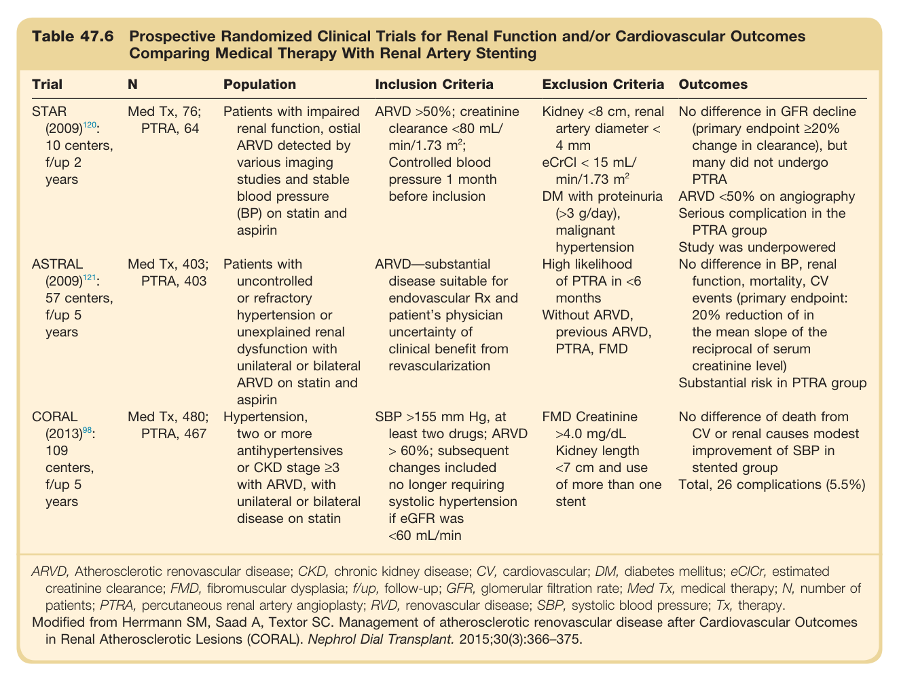

#### Table Data (CSV: [Table_47_6.csv](Table_47_6.csv))

```markdown
| Table Text (OCR) |
| :--- |
| Table 47.6 Prospective Randomized Clinical Trials for Renal Function and/or Cardiovascular Outcomes Comparing Medical Therapy With Renal Artery Stenting Trial  N  Population  Inclusion Criteria  Exclusion Criteria  Outcomes    STAR (2009)^{120} :10 centers,f/up 2years  Med Tx, 76;PTRA, 64  Patients with impaired renal function, ostial ARVD detected by various imaging studies and stable blood pressure (BP) on statin and aspirin  ARVD >50%; creatinine clearance <80 mL/min/1.73  m^2 ;Controlled blood pressure 1 month before inclusion  Kidney <8 cm, renal artery diameter < 4 mmeCrCl < 15 mL/min/1.73  m^2 DM with proteinuria (>3 g/day),malignant hypertension  No difference in GFR decline (primary endpoint ≥20% change in clearance), but many did not undergo PTRAARVD <50% on angiographySerious complication in the PTRA groupStudy was underpowered    ASTRAL (2009)^{121} :57 centers,f/up 5years  Med Tx, 403;PTRA, 403  Patients with uncontrolled or refractory hypertension or unexplained renal dysfunction with unilateral or bilateral ARVD on statin and aspirin  ARVD—substantial disease suitable for endovascular Rx and patient's physician uncertainty of clinical benefit from revascularization  High likelihood of PTRA in <6 monthsWithout ARVD, previous ARVD, PTRA, FMD  No difference in BP, renal function, mortality, CV events (primary endpoint: 20% reduction of in the mean slope of the reciprocal of serum creatinine level)Substantial risk in PTRA group    CORAL (2013)^{98} :109centers,f/up 5years  Med Tx, 480;PTRA, 467  Hypertension, two or more antihypertensives or CKD stage ≥3 with ARVD, with unilateral or bilateral disease on statin  SBP >155 mm Hg, at least two drugs; ARVD >60%; subsequent changes included no longer requiring systolic hypertension if eGFR was <60 mL/min  FMD Creatinine >4.0 mg/dLKidney length <7 cm and use of more than one stent  No difference of death from CV or renal causes modest improvement of SBP in stented groupTotal, 26 complications (5.5%) ARVD, Atherosclerotic renovascular disease; CKD, chronic kidney disease; CV, cardiovascular; DM, diabetes mellitus; eClCr, estimated creatinine clearance; FMD, fibromuscular dysplasia; f/up, follow-up; GFR, glomerular filtration rate; Med Tx, medical therapy; N, number of patients; PTRA, percutaneous renal artery angioplasty; RVD, renovascular disease; SBP, systolic blood pressure; Tx, therapy. Modified from Herrmann SM, Saad A, Textor SC. Management of atherosclerotic renovascular disease after Cardiovascular Outcomes in Renal Atherosclerotic Lesions (CORAL). Nephrol Dial Transplant. 2015;30(3):366–375. |
```

Table 47.6 Prospective Randomized Clinical Trials for Renal Function and/or Cardiovascular Outcomes Comparing Medical Therapy With Renal Artery Stenting | Trial | N | Population | Inclusion Criteria | Exclusion Criteria | Outcomes | | :--- | :--- | :--- | :--- | :--- | :--- | | STAR (2009) | Med Tx, 76; PTRA, 64 | Patients with impaired renal function, ostial ARVD detected by various imaging studies and stable blood pressure (BP) on statin and aspirin | ARVD >50%; creatinine clearance <80 mL/ min/1.73 m²; Controlled blood pressure 1 month before inclusion | Kidney <8 cm, renal artery diameter < 4 mm eCrCl < 15 mL/ min/1.73 m² DM with proteinuria (>3 g/day), malignant hypertension | No difference in GFR decline (primary endpoint ≥20% change in clearance), but many did not undergo PTRA ARVD <50% on angiography Serious complication in the PTRA group | | ASTRAL (2009) | Med Tx, 403; PTRA, 403 | Patients with uncontrolled or refractory hypertension or unexplained renal dysfunction with unilateral or bilateral ARVD on statin and aspirin | ARVD—substantial disease suitable for endovascular Rx and patient's physician uncertainty of clinical benefit from revascularization | High likelihood of PTRA in <6 months Without ARVD, previous ARVD, PTRA, FMD | Study was underpowered No difference in BP, renal function, mortality, CV events (primary endpoint: 20% reduction of in the mean slope of the reciprocal of serum creatinine level) Substantial risk in PTRA group | | CORAL (2013) | Med Tx, 480; PTRA, 467 | Hypertension, two or more antihypertensives or CKD stage ≥3 with ARVD, with unilateral or bilateral disease on statin | SBP >155 mm Hg, at least two drugs; ARVD > 60%; subsequent changes included no longer requiring systolic hypertension if eGFR was <60 mL/min | FMD Creatinine >4.0 mg/dL Kidney length <7 cm and use of more than one stent | No difference of death from CV or renal causes modest improvement of SBP in stented group Total, 26 complications (5.5%) | ARVD, Atherosclerotic renovascular disease; CKD, chronic kidney disease; CV, cardiovascular; DM, diabetes mellitus; eC/Cr, estimated creatinine clearance; FMD, fibromuscular dysplasia; f/up, follow-up; GFR, glomerular filtration rate; Med Tx, medical therapy; N, number of patients; PTRA, percutaneous renal artery angioplasty; RVD, renovascular disease; SBP, systolic blood pressure; Tx, therapy. Modified from Herrmann SM, Saad A, Textor SC. Management of atherosclerotic renovascular disease after Cardiovascular Outcomes in Renal Atherosclerotic Lesions (CORAL). Nephrol Dial Transplant. 2015;30(3):366-375.

---

### Table_47_7

#### Table Image

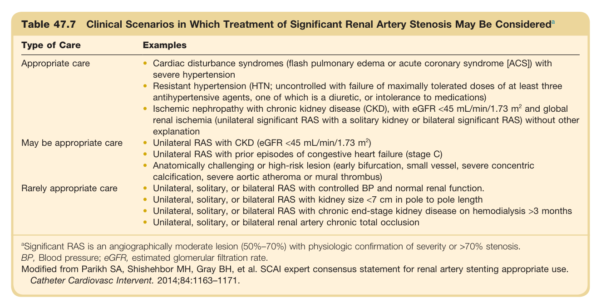

#### Table Data (CSV: [Table_47_7.csv](Table_47_7.csv))

```markdown
| Table Text (OCR) |
| :--- |
| Table 47.7 Clinical Scenarios in Which Treatment of Significant Renal Artery Stenosis May Be Considered<sup>a</sup> Type of Care  Examples    Appropriate care  Cardiac disturbance syndromes (flash pulmonary edema or acute coronary syndrome [ACS]) with severe hypertensionResistant hypertension (HTN; uncontrolled with failure of maximally tolerated doses of at least three antihypertensive agents, one of which is a diuretic, or intolerance to medications)Ischemic nephropathy with chronic kidney disease (CKD), with eGFR <45 mL/min/1.73  m^{2}  and global renal ischemia (unilateral significant RAS with a solitary kidney or bilateral significant RAS) without other explanation    May be appropriate care  Unilateral RAS with CKD (eGFR <45 mL/min/1.73  m^{2} )Unilateral RAS with prior episodes of congestive heart failure (stage C)Anatomically challenging or high-risk lesion (early bifurcation, small vessel, severe concentric calcification, severe aortic atheroma or mural thrombus)    Rarely appropriate care  Unilateral, solitary, or bilateral RAS with controlled BP and normal renal function.Unilateral, solitary, or bilateral RAS with kidney size <7 cm in pole to pole lengthUnilateral, solitary, or bilateral RAS with chronic end-stage kidney disease on hemodialysis >3 monthsUnilateral, solitary, or bilateral renal artery chronic total occlusion <sup>a</sup>Significant RAS is an angiographically moderate lesion (50%–70%) with physiologic confirmation of severity or >70% stenosis. BP, Blood pressure; eGFR, estimated glomerular filtration rate. Modified from Parikh SA, Shishehbor MH, Gray BH, et al. SCAI expert consensus statement for renal artery stenting appropriate use. Catheter Cardiovasc Intervent. 2014;84:1163–1171. |
```

Table 47.7 Clinical Scenarios in Which Treatment of Significant Renal Artery Stenosis May Be Considered | Type of Care | Examples | | :--- | :--- | | **Appropriate care** | • Cardiac disturbance syndromes (flash pulmonary edema or acute coronary syndrome [ACS]) with severe hypertension<br>• Resistant hypertension (HTN; uncontrolled with failure of maximally tolerated doses of at least three antihypertensive agents, one of which is a diuretic, or intolerance to medications)<br>• Ischemic nephropathy with chronic kidney disease (CKD), with eGFR <45 mL/min/1.73 m² and global renal ischemia (unilateral significant RAS with a solitary kidney or bilateral significant RAS) without other explanation | | **May be appropriate care** | • Unilateral RAS with CKD (eGFR <45 mL/min/1.73 m²)<br>• Unilateral RAS with prior episodes of congestive heart failure (stage C)<br>• Anatomically challenging or high-risk lesion (early bifurcation, small vessel, severe concentric calcification, severe aortic atheroma or mural thrombus) | | **Rarely appropriate care** | • Unilateral, solitary, or bilateral RAS with controlled BP and normal renal function.<br>• Unilateral, solitary, or bilateral RAS with kidney size <7 cm in pole to pole length<br>• Unilateral, solitary, or bilateral RAS with chronic end-stage kidney disease on hemodialysis >3 months<br>• Unilateral, solitary, or bilateral renal artery chronic total occlusion | aSignificant RAS is an angiographically moderate lesion (50%-70%) with physiologic confirmation of severity or >70% stenosis. BP, Blood pressure; eGFR, estimated glomerular filtration rate. Modified from Parikh SA, Shishehbor MH, Gray BH, et al. SCAI expert consensus statement for renal artery stenting appropriate use. Catheter Cardiovasc Intervent. 2014;84:1163-1171.

---

### Table_47_8

#### Table Image

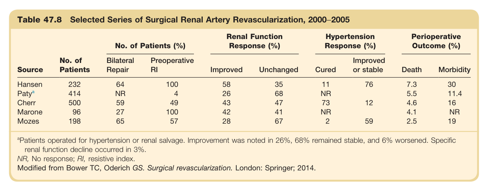

#### Table Data (CSV: [Table_47_8.csv](Table_47_8.csv))

```markdown
| Table Text (OCR) |
| :--- |
| Table 47.8 Selected Series of Surgical Renal Artery Revascularization, 2000−2005 Source  No. of Patients  No. of Patients (%)  Renal Function Response (%)  Hypertension Response (%)  Perioperative Outcome (%)    Bilateral Repair  Preoperative RI  Improved  Unchanged  Cured  Improved or stable  Death  Morbidity    Hansen  232  64  100  58  35  11  76  7.3  30     Paty^a   414  NR  4  26  68  NR    5.5  11.4    Cherr  500  59  49  43  47  73  12  4.6  16    Marone  96  27  100  42  41  NR    4.1  NR    Mozes  198  65  57  28  67  2  59  2.5  19 <sup>a</sup>Patients operated for hypertension or renal salvage. Improvement was noted in 26%, 68% remained stable, and 6% worsened. Specific renal function decline occurred in 3%. NR, No response; RI, resistive index. Modified from Bower TC, Oderich GS. Surgical revascularization. London: Springer; 2014. |
```

Table 47.8 Selected Series of Surgical Renal Artery Revascularization, 2000-2005 | Source | No. of Patients | No. of Patients (%) Bilateral Repair | No. of Patients (%) Preoperative RI | Renal Function Response (%) Improved | Renal Function Response (%) Unchanged | Hypertension Response (%) Cured | Hypertension Response (%) Improved or stable | Perioperative Outcome (%) Death | Perioperative Outcome (%) Morbidity | | :--- | :--- | :--- | :--- | :--- | :--- | :--- | :--- | :--- | :--- | | Hansen | 232 | 64 | 100 | 58 | 35 | 11 | 76 | 7.3 | 30 | | Patya | 414 | NR | 4 | 26 | 68 | NR | | 5.5 | 11.4 | | Cherr | 500 | 59 | 49 | 43 | 47 | 73 | 12 | 4.6 | 16 | | Marone | 96 | 27 | 100 | 42 | 41 | NR | | 4.1 | NR | | Mozes | 198 | 65 | 57 | 28 | 67 | 2 | 59 | 2.5 | 19 | aPatients operated for hypertension or renal salvage. Improvement was noted in 26%, 68% remained stable, and 6% worsened. Specific renal function decline occurred in 3%. NR, No response; Rl, resistive index. Modified from Bower TC, Oderich GS. Surgical revascularization. London: Springer; 2014.

---

## Boxes

### Box_47_1

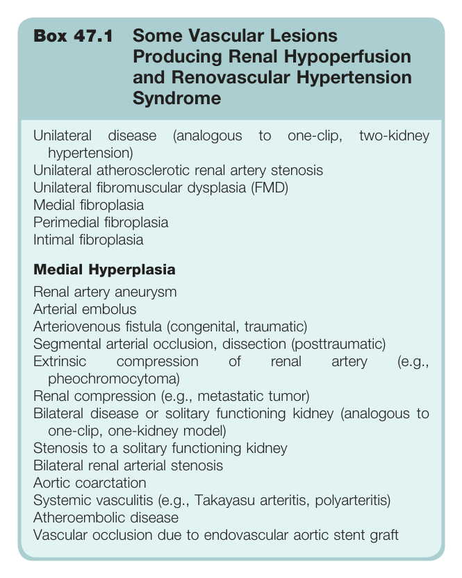

#### Box Text

```markdown
Box 47.1 Some Vascular Lesions Producing Renal Hypoperfusion and Renovascular Hypertension Syndrome Unilateral disease (analogous to one-clip, two-kidney hypertension) Unilateral atherosclerotic renal artery stenosis Unilateral fibromuscular dysplasia (FMD) Medial fibroplasia Perimedial fibroplasia Intimal fibroplasia Medial Hyperplasia Renal artery aneurysm Arterial embolus Arteriovenous fistula (congenital, traumatic) Segmental arterial occlusion, dissection (posttraumatic) Extrinsic compression of renal artery (e.g., pheochromocytoma) Renal compression (e.g., metastatic tumor) Bilateral disease or solitary functioning kidney (analogous to one-clip, one-kidney model) Stenosis to a solitary functioning kidney Bilateral renal arterial stenosis Aortic coarctation Systemic vasculitis (e.g., Takayasu arteritis, polyarteritis) Atheroembolic disease Vascular occlusion due to endovascular aortic stent graf gradually progressive lumen obstruction. In the latter case, hemodynamic characteristics change slowly and are likely to produce hypertension over a prolonged time interval. The rise in systemic pressure restores normal renal perfusion, often with normal-sized kidneys and no discernible hemodynamic compromise. If the renal artery lesion progresses further (or is experimentally advanced), the cycle of reduced perfu- sion and rising arterial pressures repeats until malignant- phase hypertension develops. Experimental models in swine have used gradually progressing vascular lesions to mimic human RVD.<sup>16</sup>
```

Box 47.1 Some Vascular Lesions Producing Renal Hypoperfusion and Renovascular Hypertension Syndrome Unilateral disease (analogous to one-clip, two-kidney hypertension) Unilateral atherosclerotic renal artery stenosis Unilateral fibromuscular dysplasia (FMD) Medial fibroplasia Perimedial fibroplasia Intimal fibroplasia Medial Hyperplasia Renal artery aneurysm Arterial embolus Arteriovenous fistula (congenital, traumatic) Segmental arterial occlusion, dissection (posttraumatic) Extrinsic compression of renal artery (e.g., pheochromocytoma) Renal compression (e.g., metastatic tumor) Bilateral disease or solitary functioning kidney (analogous to one-clip, one-kidney model) Stenosis to a solitary functioning kidney Bilateral renal arterial stenosis Aortic coarctation Systemic vasculitis (e.g., Takayasu arteritis, polyarteritis) Atheroembolic disease Vascular occlusion due to endovascular aortic stent graft

---

### Box_47_2

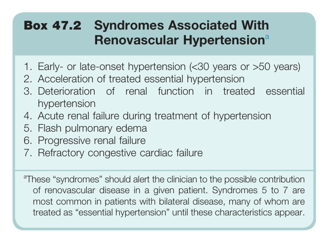

#### Box Text

```markdown
Box 47.2 Syndromes Associated With Renovascular Hypertension<sup>a</sup> 1. Early- or late-onset hypertension (<30 years or >50 years) 2. Acceleration of treated essential hypertension 3. Deterioration of renal function in treated essential hypertension 4. Acute renal failure during treatment of hypertension 5. Flash pulmonary edema 6. Progressive renal failure 7. Refractory congestive cardiac failure <sup>a</sup>These “syndromes” should alert the clinician to the possible contribution of renovascular disease in a given patient. Syndromes 5 to 7 are most common in patients with bilateral disease, many of whom are treated as “essential hypertension” until these characteristics appear.
```

Box 47.2 Syndromes Associated With Renovascular Hypertension 1. Early- or late-onset hypertension (<30 years or >50 years) 2. Acceleration of treated essential hypertension 3. Deterioration of renal function in treated essential hypertension 4. Acute renal failure during treatment of hypertension 5. Flash pulmonary edema 6. Progressive renal failure 7. Refractory congestive cardiac failure aThese "syndromes" should alert the clinician to the possible contribution of renovascular disease in a given patient. Syndromes 5 to 7 are most common in patients with bilateral disease, many of whom are treated as "essential hypertension" until these characteristics appear.

---

### Box_47_3

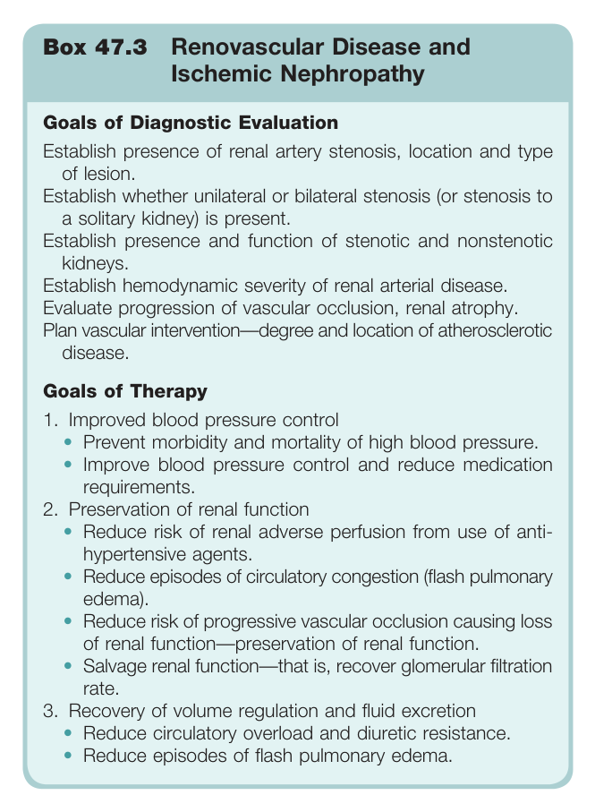

#### Box Text

```markdown
Box 47.3 Renovascular Disease and Ischemic Nephropathy **Goals of Diagnostic Evaluation** Establish presence of renal artery stenosis, location and type of lesion. Establish whether unilateral or bilateral stenosis (or stenosis to a solitary kidney) is present. Establish presence and function of stenotic and nonstenotic kidneys. Establish hemodynamic severity of renal arterial disease. Evaluate progression of vascular occlusion, renal atrophy. Plan vascular intervention-degree and location of atherosclerotic disease. **Goals of Therapy** 1. Improved blood pressure control * Prevent morbidity and mortality of high blood pressure. * Improve blood pressure control and reduce medication requirements. 2. Preservation of renal function * Reduce risk of renal adverse perfusion from use of anti-hypertensive agents. * Reduce episodes of circulatory congestion (flash pulmonary edema). * Reduce risk of progressive vascular occlusion causing loss of renal function-preservation of renal function. * Salvage renal function-that is, recover glomerular filtration rate. 3. Recovery of volume regulation and fluid excretion * Reduce circulatory overload and diuretic resistance. * Reduce episodes of flash pulmonary edema.
```

Box 47.3 Renovascular Disease and Ischemic Nephropathy **Goals of Diagnostic Evaluation** Establish presence of renal artery stenosis, location and type of lesion. Establish whether unilateral or bilateral stenosis (or stenosis to a solitary kidney) is present. Establish presence and function of stenotic and nonstenotic kidneys. Establish hemodynamic severity of renal arterial disease. Evaluate progression of vascular occlusion, renal atrophy. Plan vascular intervention-degree and location of atherosclerotic disease. **Goals of Therapy** 1. Improved blood pressure control * Prevent morbidity and mortality of high blood pressure. * Improve blood pressure control and reduce medication requirements. 2. Preservation of renal function * Reduce risk of renal adverse perfusion from use of anti-hypertensive agents. * Reduce episodes of circulatory congestion (flash pulmonary edema). * Reduce risk of progressive vascular occlusion causing loss of renal function-preservation of renal function. * Salvage renal function-that is, recover glomerular filtration rate. 3. Recovery of volume regulation and fluid excretion * Reduce circulatory overload and diuretic resistance. * Reduce episodes of flash pulmonary edema.

---

### Box_47_4

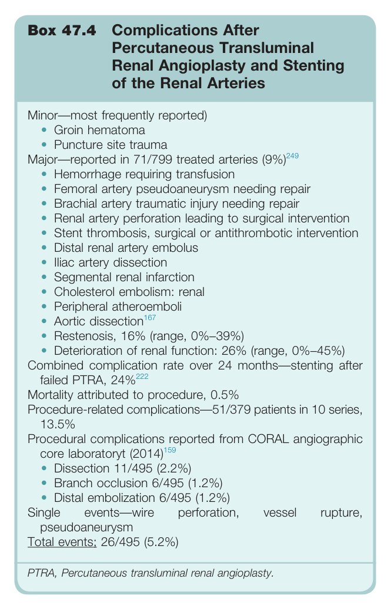

#### Box Text

```markdown
Box 47.4 Complications After Percutaneous Transluminal Renal Angioplasty and Stenting of the Renal Arteries Minor—most frequently reported) • Groin hematoma • Puncture site trauma Major—reported in 71/799 treated arteries (9%)<sup>249</sup> • Hemorrhage requiring transfusion • Femoral artery pseudoaneurysm needing repair • Brachial artery traumatic injury needing repair • Renal artery perforation leading to surgical intervention • Stent thrombosis, surgical or antithrombotic intervention • Distal renal artery embolus • Iliac artery dissection • Segmental renal infarction • Cholesterol embolism: renal • Peripheral atheroembol • Aortic dissection<sup>167</sup> • Restenosis, 16% (range, 0%−39%) • Deterioration of renal function: 26% (range, 0%−45%) Combined complication rate over 24 months—stenting after failed PTRA, 24%<sup>222</sup> Mortality attributed to procedure, 0.5% Procedure-related complications—51/379 patients in 10 series, 13.5% Procedural complications reported from CORAL angiographic core laboratoryt (2014)<sup>159</sup> • Dissection 11/495 (2.2%) • Branch occlusion 6/495 (1.2%) • Distal embolization 6/495 (1.2%) Single events—wire perforation, vessel rupture, pseudoaneurysm Total events; 26/495 (5.2%) PTRA, Percutaneous transluminal renal angioplasty.
```

Box 47.4 Complications After Percutaneous Transluminal Renal Angioplasty and Stenting of the Renal Arteries **Minor—most frequently reported)** * Groin hematoma * Puncture site trauma **Major—reported in 71/799 treated arteries (9%)** * Hemorrhage requiring transfusion * Femoral artery pseudoaneurysm needing repair * Brachial artery traumatic injury needing repair * Renal artery perforation leading to surgical intervention * Stent thrombosis, surgical or antithrombotic intervention * Distal renal artery embolus * Iliac artery dissection * Segmental renal infarction * Cholesterol embolism: renal * Peripheral atheroemboli * Aortic dissection * Restenosis, 16% (range, 0%-39%) * Deterioration of renal function: 26% (range, 0%-45%) Combined complication rate over 24 months—stenting after failed PTRA, 24% Mortality attributed to procedure, 0.5% Procedure-related complications—51/379 patients in 10 series, 13.5% **Procedural complications reported from CORAL angiographic core laboratory (2014)** * Dissection 11/495 (2.2%) * Branch occlusion 6/495 (1.2%) * Distal embolization 6/495 (1.2%) Single events—wire perforation, vessel rupture, pseudoaneurysm Total events; 26/495 (5.2%) PTRA, Percutaneous transluminal renal angioplasty.

---

### Box_47_5

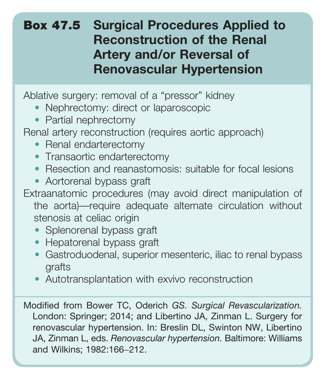

#### Box Text

```markdown
Box 47.5 Surgical Procedures Applied to Reconstruction of the Renal Artery and/or Reversal of Renovascular Hypertension **Ablative surgery: removal of a "pressor" kidney** * Nephrectomy: direct or laparoscopic * Partial nephrectomy **Renal artery reconstruction (requires aortic approach)** * Renal endarterectomy * Transaortic endarterectomy * Resection and reanastomosis: suitable for focal lesions * Aortorenal bypass graft **Extraanatomic procedures (may avoid direct manipulation of the aorta)—require adequate alternate circulation without stenosis at celiac origin** * Splenorenal bypass graft * Hepatorenal bypass graft * Gastroduodenal, superior mesenteric, iliac to renal bypass grafts * Autotransplantation with exvivo reconstruction Modified from Bower TC, Oderich GS. Surgical Revascularization. London: Springer; 2014; and Libertino JA, Zinman L. Surgery for renovascular hypertension. In: Breslin DL, Swinton NW, Libertino JA, Zinman L, eds. Renovascular hypertension. Baltimore: Williams and Wilkins; 1982:166-212.
```

Box 47.5 Surgical Procedures Applied to Reconstruction of the Renal Artery and/or Reversal of Renovascular Hypertension **Ablative surgery: removal of a "pressor" kidney** * Nephrectomy: direct or laparoscopic * Partial nephrectomy **Renal artery reconstruction (requires aortic approach)** * Renal endarterectomy * Transaortic endarterectomy * Resection and reanastomosis: suitable for focal lesions * Aortorenal bypass graft **Extraanatomic procedures (may avoid direct manipulation of the aorta)—require adequate alternate circulation without stenosis at celiac origin** * Splenorenal bypass graft * Hepatorenal bypass graft * Gastroduodenal, superior mesenteric, iliac to renal bypass grafts * Autotransplantation with exvivo reconstruction Modified from Bower TC, Oderich GS. Surgical Revascularization. London: Springer; 2014; and Libertino JA, Zinman L. Surgery for renovascular hypertension. In: Breslin DL, Swinton NW, Libertino JA, Zinman L, eds. Renovascular hypertension. Baltimore: Williams and Wilkins; 1982:166-212.

---
