# 48. Pregnancy and Kidney Disease - Figures and Tables Index

This document lists all figures and tables extracted from `48. Pregnancy and Kidney Disease.pdf`.

## Table of Contents
- [Figures](#figures)
- [Tables](#tables)

---

## Figures

### Fig_48_1

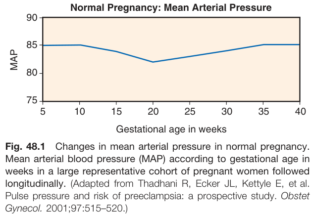

Fig. 48.1 Changes in mean arterial pressure in normal pregnancy. Mean arterial blood pressure (MAP) according to gestational age in weeks in a large representative cohort of pregnant women followed longitudinally. (Adapted from Thadhani R, Ecker JL, Kettyle E, et al. Pulse pressure and risk of preeclampsia: a prospective study. Obstet Gynecol. 2001;97:515-520.)

---

### Fig_48_2

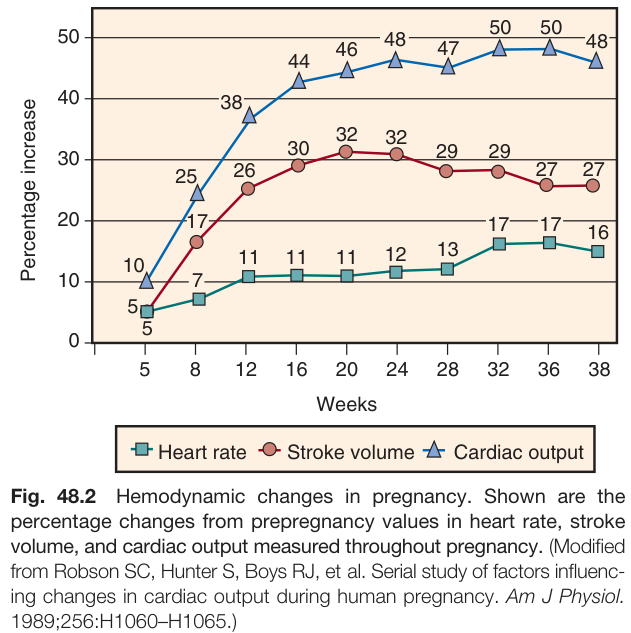

Fig. 48.2 Hemodynamic changes in pregnancy. Shown are the percentage changes from prepregnancy values in heart rate, stroke volume, and cardiac output measured throughout pregnancy. (Modified from Robson SC, Hunter S, Boys RJ, et al. Serial study of factors influencing changes in cardiac output during human pregnancy. Am J Physiol. 1989;256:H1060-H1065.)

---

### Fig_48_3

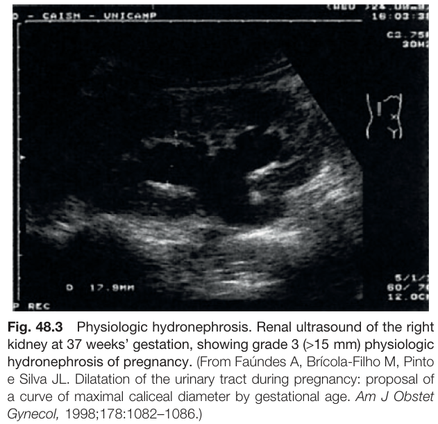

Fig. 48.3 Physiologic hydronephrosis. Renal ultrasound of the right kidney at 37 weeks' gestation, showing grade 3 (>15 mm) physiologic hydronephrosis of pregnancy. (From Faúndes A, Brícola-Filho M, Pinto e Silva JL. Dilatation of the urinary tract during pregnancy: proposal of a curve of maximal caliceal diameter by gestational age. Am J Obstet Gynecol, 1998;178:1082-1086.)

---

### Fig_48_4

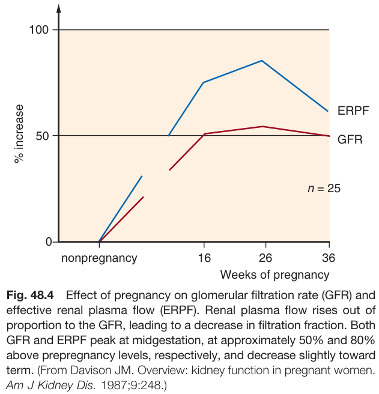

Fig. 48.4 Effect of pregnancy on glomerular filtration rate (GFR) and effective renal plasma flow (ERPF). Renal plasma flow rises out of proportion to the GFR, leading to a decrease in filtration fraction. Both GFR and ERPF peak at midgestation, at approximately 50% and 80% above prepregnancy levels, respectively, and decrease slightly toward term. (From Davison JM. Overview: kidney function in pregnant women. Am J Kidney Dis. 1987;9:248.)

---

### Fig_48_5

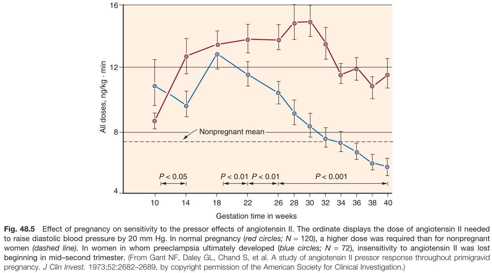

Fig. 48.5 Effect of pregnancy on sensitivity to the pressor effects of angiotensin II. The ordinate displays the dose of angiotensin II needed to raise diastolic blood pressure by 20 mm Hg. In normal pregnancy (red circles; N = 120), a higher dose was required than for nonpregnant women (dashed line). In women in whom preeclampsia ultimately developed (blue circles; N = 72), insensitivity to angiotensin II was lost beginning in mid-second trimester. (From Gant NF, Daley GL, Chand S, et al. A study of angiotensin II pressor response throughout primigravid pregnancy. J Clin Invest. 1973;52:2682-2689, by copyright permission of the American Society for Clinical Investigation.)

---

### Fig_48_6

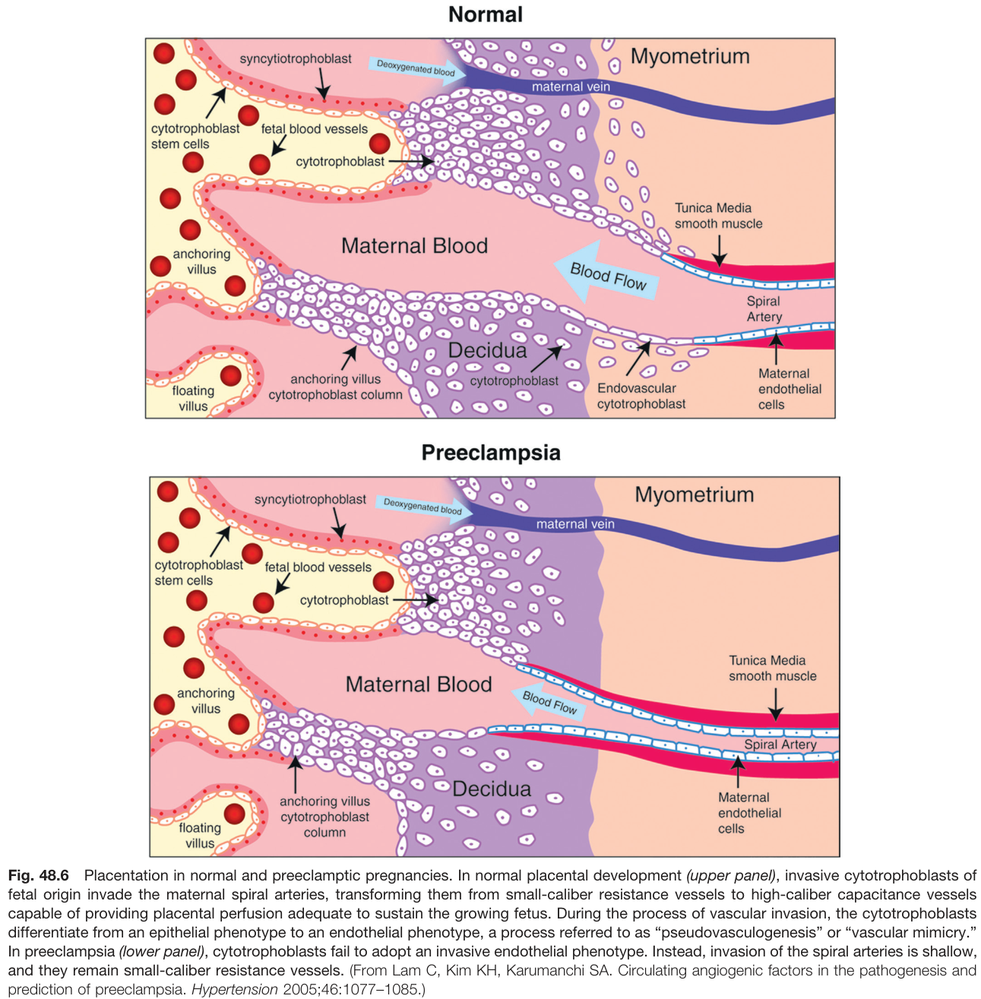

Fig. 48.6 Placentation in normal and preeclamptic pregnancies. In normal placental development (upper panel), invasive cytotrophoblasts of fetal origin invade the maternal spiral arteries, transforming them from small-caliber resistance vessels to high-caliber capacitance vessels capable of providing placental perfusion adequate to sustain the growing fetus. During the process of vascular invasion, the cytotrophoblasts differentiate from an epithelial phenotype to an endothelial phenotype, a process referred to as "pseudovasculogenesis" or "vascular mimicry." In preeclampsia (lower panel), cytotrophoblasts fail to adopt an invasive endothelial phenotype. Instead, invasion of the spiral arteries is shallow, and they remain small-caliber resistance vessels. (From Lam C, Kim KH, Karumanchi SA. Circulating angiogenic factors in the pathogenesis and prediction of preeclampsia. Hypertension 2005;46:1077-1085.)

---

### Fig_48_7

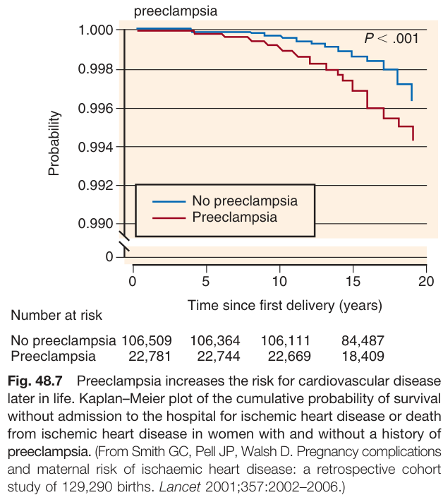

Fig. 48.7 Preeclampsia increases the risk for cardiovascular disease later in life. Kaplan-Meier plot of the cumulative probability of survival without admission to the hospital for ischemic heart disease or death from ischemic heart disease in women with and without a history of preeclampsia. (From Smith GC, Pell JP, Walsh D. Pregnancy complications and maternal risk of ischaemic heart disease: a retrospective cohort study of 129,290 births. Lancet 2001;357:2002-2006.)

---

### Fig_48_8

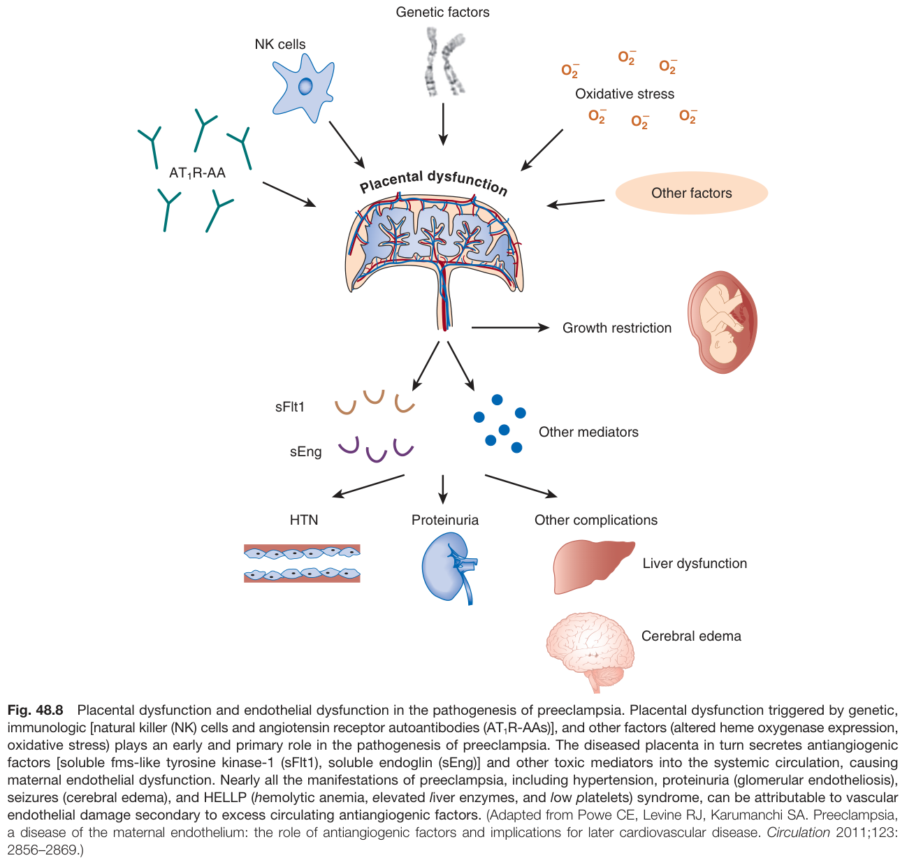

Fig. 48.8 Placental dysfunction and endothelial dysfunction in the pathogenesis of preeclampsia. Placental dysfunction triggered by genetic, immunologic [natural killer (NK) cells and angiotensin receptor autoantibodies (AT₁R-AAs)], and other factors (altered heme oxygenase expression, oxidative stress) plays an early and primary role in the pathogenesis of preeclampsia. The diseased placenta in turn secretes antiangiogenic factors [soluble fms-like tyrosine kinase-1 (sFlt1), soluble endoglin (sEng)] and other toxic mediators into the systemic circulation, causing maternal endothelial dysfunction. Nearly all the manifestations of preeclampsia, including hypertension, proteinuria (glomerular endotheliosis), seizures (cerebral edema), and HELLP (hemolytic anemia, elevated liver enzymes, and low platelets) syndrome, can be attributable to vascular endothelial damage secondary to excess circulating antiangiogenic factors. (Adapted from Powe CE, Levine RJ, Karumanchi SA. Preeclampsia, a disease of the maternal endothelium: the role of antiangiogenic factors and implications for later cardiovascular disease. Circulation 2011;123: 2856-2869.)

---

### Fig_48_9

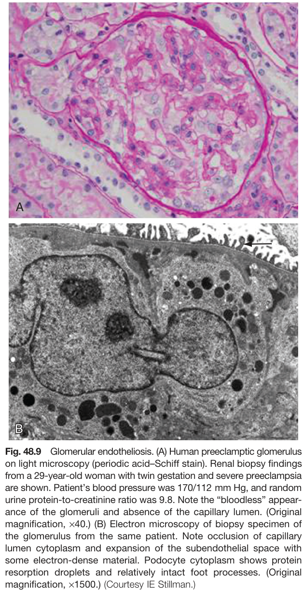

Fig. 48.9 Glomerular endotheliosis. (A) Human preeclamptic glomerulus on light microscopy (periodic acid-Schiff stain). Renal biopsy findings from a 29-year-old woman with twin gestation and severe preeclampsia are shown. Patient's blood pressure was 170/112 mm Hg, and random urine protein-to-creatinine ratio was 9.8. Note the "bloodless" appearance of the glomeruli and absence of the capillary lumen. (Original magnification, ×40.) (B) Electron microscopy of biopsy specimen of the glomerulus from the same patient. Note occlusion of capillary lumen cytoplasm and expansion of the subendothelial space with some electron-dense material. Podocyte cytoplasm shows protein resorption droplets and relatively intact foot processes. (Original magnification, x1500.) (Courtesy IE Stillman.)

---

### Fig_48_10

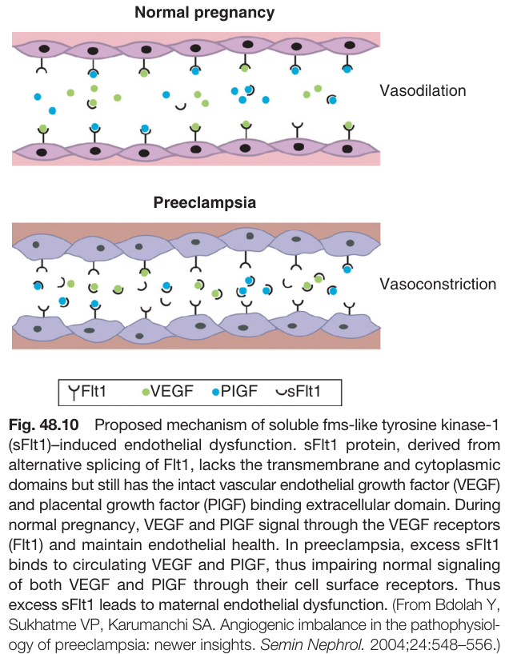

Fig. 48.10 Proposed mechanism of soluble fms-like tyrosine kinase-1 (sFlt1)-induced endothelial dysfunction. sFlt1 protein, derived from alternative splicing of Flt1, lacks the transmembrane and cytoplasmic domains but still has the intact vascular endothelial growth factor (VEGF) and placental growth factor (PIGF) binding extracellular domain. During normal pregnancy, VEGF and PIGF signal through the VEGF receptors (Flt1) and maintain endothelial health. In preeclampsia, excess sFlt1 binds to circulating VEGF and PIGF, thus impairing normal signaling of both VEGF and PIGF through their cell surface receptors. Thus excess sFlt1 leads to maternal endothelial dysfunction. (From Bdolah Y, Sukhatme VP, Karumanchi SA. Angiogenic imbalance in the pathophysiology of preeclampsia: newer insights. Semin Nephrol. 2004;24:548-556.)

---

### Fig_48_11

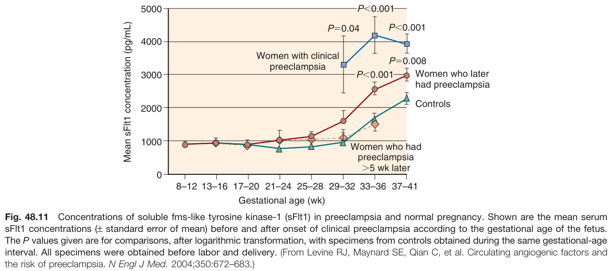

Fig. 48.11 Concentrations of soluble fms-like tyrosine kinase-1 (sFlt1) in preeclampsia and normal pregnancy. Shown are the mean serum sFlt1 concentrations (± standard error of mean) before and after onset of clinical preeclampsia according to the gestational age of the fetus. The P values given are for comparisons, after logarithmic transformation, with specimens from controls obtained during the same gestational-age interval. All specimens were obtained before labor and delivery. (From Levine RJ, Maynard SE, Qian C, et al. Circulating angiogenic factors and the risk of preeclampsia. N Engl J Med. 2004;350:672-683.)

---

### Fig_48_12

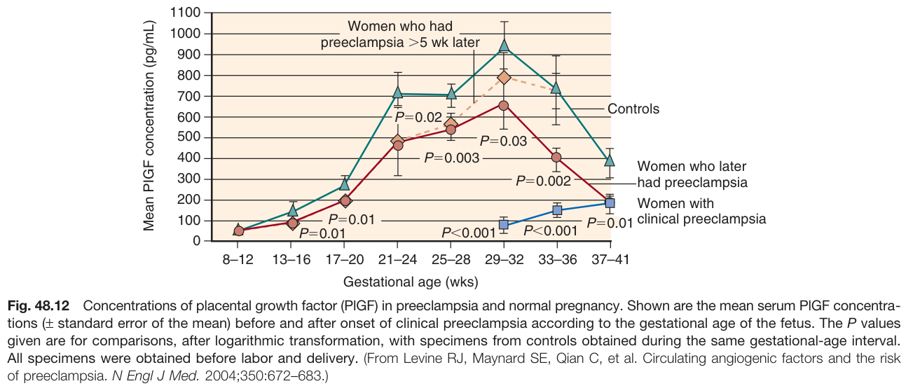

Fig. 48.12 Concentrations of placental growth factor (PIGF) in preeclampsia and normal pregnancy. Shown are the mean serum PIGF concentrations (± standard error of the mean) before and after onset of clinical preeclampsia according to the gestational age of the fetus. The P values given are for comparisons, after logarithmic transformation, with specimens from controls obtained during the same gestational-age interval. All specimens were obtained before labor and delivery. (From Levine RJ, Maynard SE, Qian C, et al. Circulating angiogenic factors and the risk of preeclampsia. N Engl J Med. 2004;350:672-683.)

---

### Fig_48_13

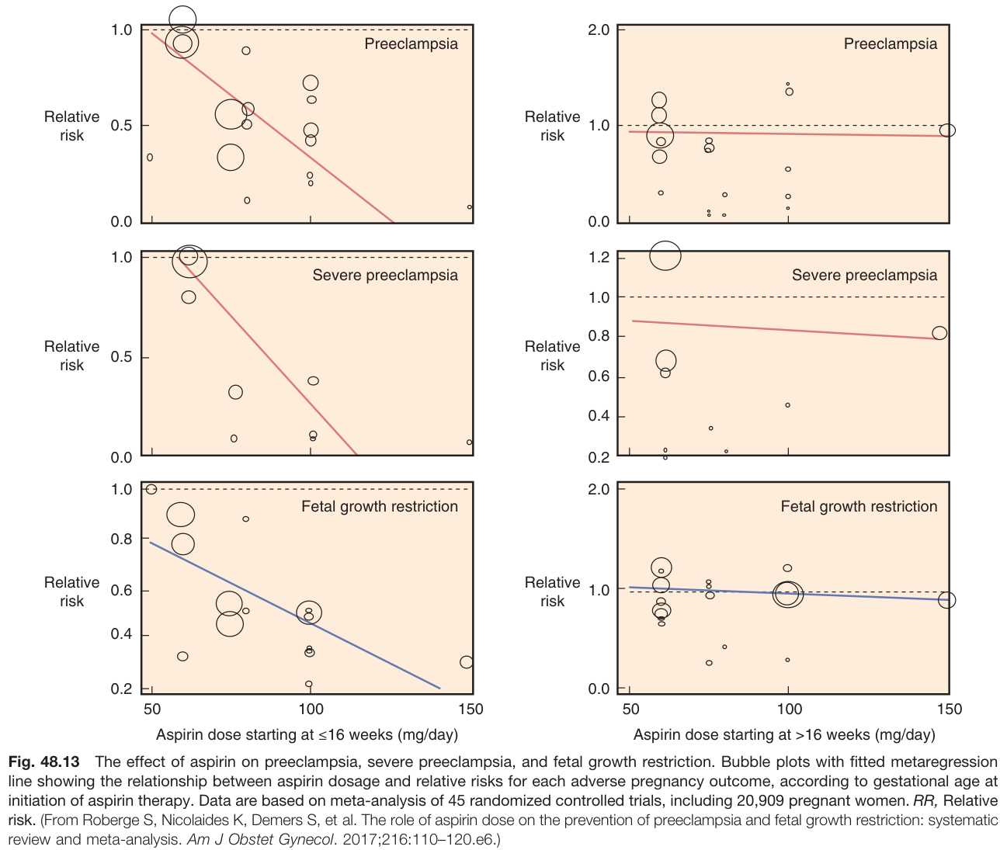

Fig. 48.13 The effect of aspirin on preeclampsia, severe preeclampsia, and fetal growth restriction. Bubble plots with fitted metaregression line showing the relationship between aspirin dosage and relative risks for each adverse pregnancy outcome, according to gestational age at initiation of aspirin therapy. Data are based on meta-analysis of 45 randomized controlled trials, including 20,909 pregnant women. RR, Relative risk. (From Roberge S, Nicolaides K, Demers S, et al. The role of aspirin dose on the prevention of preeclampsia and fetal growth restriction: systematic review and meta-analysis. Am J Obstet Gynecol. 2017;216:110-120.e6.)

---

### Fig_48_14

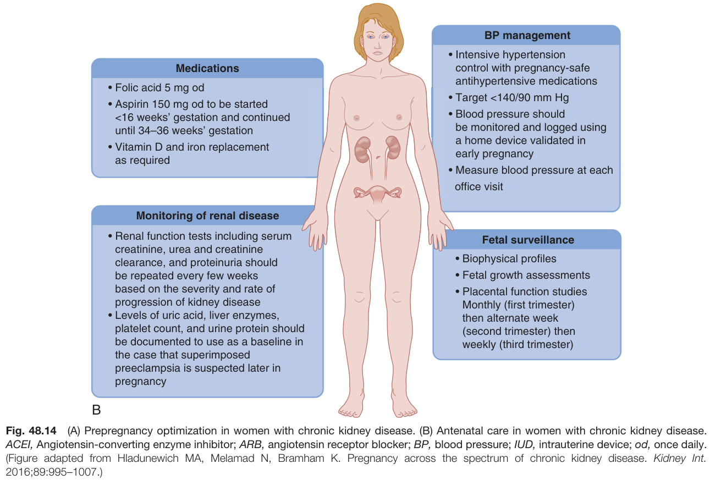

Fig. 48.14 (A) Prepregnancy optimization in women with chronic kidney disease. (B) Antenatal care in women with chronic kidney disease. ACEI, Angiotensin-converting enzyme inhibitor; ARB, angiotensin receptor blocker; BP, blood pressure; IUD, intrauterine device; od, once daily. (Figure adapted from Hladunewich MA, Melamad N, Bramham K. Pregnancy across the spectrum of chronic kidney disease. Kidney Int. 2016;89:995-1007.)

---

### Fig_48_15

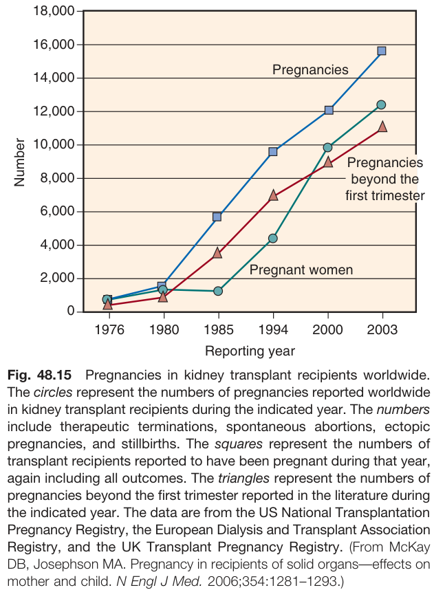

Fig. 48.15 Pregnancies in kidney transplant recipients worldwide. The circles represent the numbers of pregnancies reported worldwide in kidney transplant recipients during the indicated year. The numbers include therapeutic terminations, spontaneous abortions, ectopic pregnancies, and stillbirths. The squares represent the numbers of transplant recipients reported to have been pregnant during that year, again including all outcomes. The triangles represent the numbers of pregnancies beyond the first trimester reported in the literature during the indicated year. The data are from the US National Transplantation Pregnancy Registry, the European Dialysis and Transplant Association Registry, and the UK Transplant Pregnancy Registry. (From McKay DB, Josephson MA. Pregnancy in recipients of solid organs-effects on mother and child. N Engl J Med. 2006;354:1281-1293.)

---

## Tables

### Table_48_1

#### Table Image

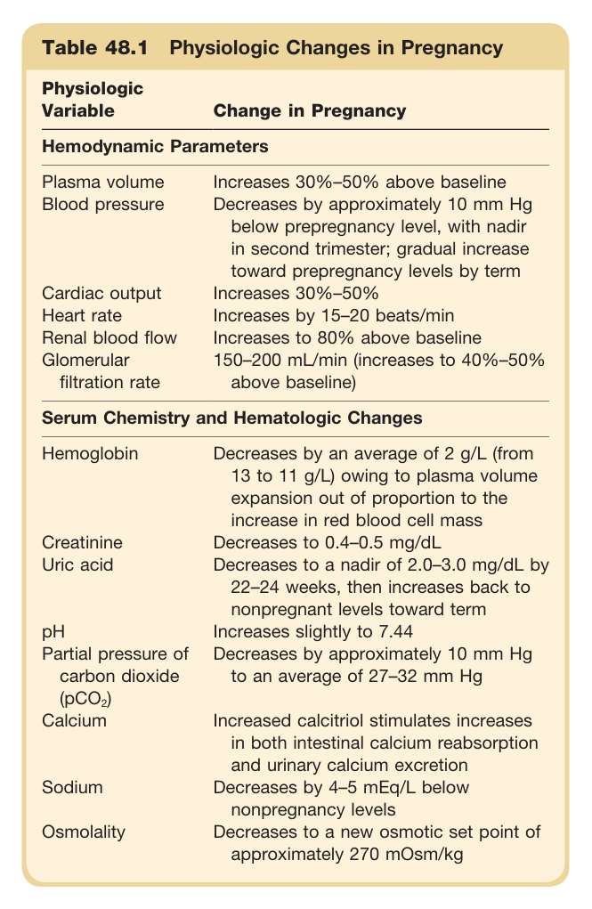

#### Table Data (CSV: [Table_48_1.csv](Table_48_1.csv))

```markdown
| Table Text (OCR) |
| :--- |
| Table 48.1 Physiologic Changes in Pregnancy Physiologic Variable  Change in Pregnancy    Hemodynamic Parameters    Plasma volume  Increases 30%-50% above baseline    Blood pressure  Decreases by approximately 10 mm Hg below prepregnancy level, with nadir in second trimester; gradual increase toward prepregnancy levels by term    Cardiac output  Increases 30%-50%    Heart rate  Increases by 15-20 beats/min    Renal blood flow  Increases to 80% above baseline    Glomerular filtration rate  150-200 mL/min (increases to 40%-50% above baseline)    Serum Chemistry and Hematologic Changes    Hemoglobin  Decreases by an average of 2 g/L (from 13 to 11 g/L) owing to plasma volume expansion out of proportion to the increase in red blood cell mass    Creatinine  Decreases to 0.4-0.5 mg/dL    Uric acid  Decreases to a nadir of 2.0-3.0 mg/dL by 22-24 weeks, then increases back to nonpregnant levels toward term    pH  Increases slightly to 7.44    Partial pressure of carbon dioxide (pCO2)  Decreases by approximately 10 mm Hg to an average of 27-32 mm Hg    Calcium  Increased calcitriol stimulates increases in both intestinal calcium reabsorption and urinary calcium excretion    Sodium  Decreases by 4-5 mEq/L below nonpregnancy levels    Osmolality  Decreases to a new osmotic set point of approximately 270 mOsm/kg |
```

Table 48.1 Physiologic Changes in Pregnancy | Physiologic Variable | Change in Pregnancy | | :--- | :--- | | **Hemodynamic Parameters** | | | Plasma volume | Increases 30%-50% above baseline | | Blood pressure | Decreases by approximately 10 mm Hg below prepregnancy level, with nadir in second trimester; gradual increase toward prepregnancy levels by term | | Cardiac output | Increases 30%-50% | | Heart rate | Increases by 15-20 beats/min | | Renal blood flow | Increases to 80% above baseline | | Glomerular filtration rate | 150-200 mL/min (increases to 40%-50% above baseline) | | **Serum Chemistry and Hematologic Changes** | | | Hemoglobin | Decreases by an average of 2 g/L (from 13 to 11 g/L) owing to plasma volume expansion out of proportion to the increase in red blood cell mass | | Creatinine | Decreases to 0.4-0.5 mg/dL | | Uric acid | Decreases to a nadir of 2.0-3.0 mg/dL by 22-24 weeks, then increases back to nonpregnant levels toward term | | pH | Increases slightly to 7.44 | | Partial pressure of carbon dioxide (pCO2) | Decreases by approximately 10 mm Hg to an average of 27-32 mm Hg | | Calcium | Increased calcitriol stimulates increases in both intestinal calcium reabsorption and urinary calcium excretion | | Sodium | Decreases by 4-5 mEq/L below nonpregnancy levels | | Osmolality | Decreases to a new osmotic set point of approximately 270 mOsm/kg |

---

### Table_48_2

#### Table Image

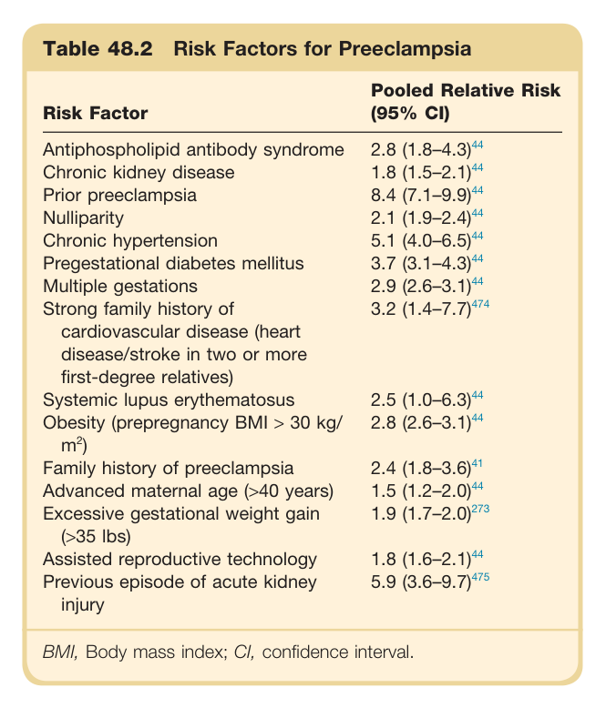

#### Table Data (CSV: [Table_48_2.csv](Table_48_2.csv))

```markdown
| Table Text (OCR) |
| :--- |
| Table 48.2 Risk Factors for Preeclampsia Risk Factor  Pooled Relative Risk (95% CI)    Antiphospholipid antibody syndrome  2.8 (1.8–4.3) ^{44}     Chronic kidney disease  1.8 (1.5–2.1) ^{44}     Prior preeclampsia  8.4 (7.1–9.9) ^{44}     Nulliparity  2.1 (1.9–2.4) ^{44}     Chronic hypertension  5.1 (4.0–6.5) ^{44}     Pregestational diabetes mellitus  3.7 (3.1–4.3) ^{44}     Multiple gestations  2.9 (2.6–3.1) ^{44}     Strong family history of cardiovascular disease (heart disease/stroke in two or more first-degree relatives)  3.2 (1.4–7.7) ^{474}     Systemic lupus erythematosus  2.5 (1.0–6.3) ^{44}     Obesity (prepregnancy BMI > 30 kg/ m ^{2} )  2.8 (2.6–3.1) ^{44}     Family history of preeclampsia  2.4 (1.8–3.6) ^{41}     Advanced maternal age (>40 years)  1.5 (1.2–2.0) ^{44}     Excessive gestational weight gain (>35 lbs)  1.9 (1.7–2.0) ^{273}     Assisted reproductive technology  1.8 (1.6–2.1) ^{44}     Previous episode of acute kidney injury  5.9 (3.6–9.7) ^{475}     BMI, Body mass index; CI, confidence interval. |
```

Table 48.2 Risk Factors for Preeclampsia | Risk Factor | Pooled Relative Risk (95% CI) | | :--- | :--- | | Antiphospholipid antibody syndrome | 2.8 (1.8-4.3) | | Chronic kidney disease | 1.8 (1.5-2.1) | | Prior preeclampsia | 8.4 (7.1-9.9) | | Nulliparity | 2.1 (1.9-2.4) | | Chronic hypertension | 5.1 (4.0-6.5) | | Pregestational diabetes mellitus | 3.7 (3.1-4.3) | | Multiple gestations | 2.9 (2.6-3.1) | | Strong family history of cardiovascular disease (heart disease/stroke in two or more first-degree relatives) | 3.2 (1.4-7.7) | | Systemic lupus erythematosus | 2.5 (1.0-6.3) | | Obesity (prepregnancy BMI > 30 kg/ m²) | 2.8 (2.6-3.1) | | Family history of preeclampsia | 2.4 (1.8-3.6) | | Advanced maternal age (>40 years) | 1.5 (1.2-2.0) | | Excessive gestational weight gain (>35 lbs) | 1.9 (1.7-2.0) | | Assisted reproductive technology | 1.8 (1.6-2.1) | | Previous episode of acute kidney injury | 5.9 (3.6-9.7) | *BMI, Body mass index; Cl, confidence interval.*

---

### Table_48_3

#### Table Image

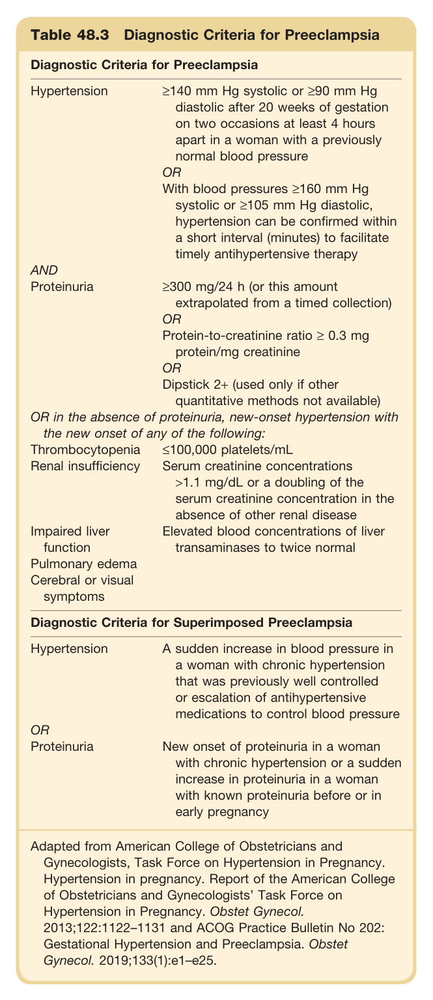

#### Table Data (CSV: [Table_48_3.csv](Table_48_3.csv))

```markdown
| Table Text (OCR) |
| :--- |
| Table 48.3 Diagnostic Criteria for Preeclampsia Diagnostic Criteria for Preeclampsia Hypertension   \geq 140  mm Hg systolic or  \geq 90  mm Hg diastolic after 20 weeks of gestation on two occasions at least 4 hours apart in a woman with a previously normal blood pressureORWith blood pressures  \geq 160  mm Hg systolic or  \geq 105  mm Hg diastolic, hypertension can be confirmed within a short interval (minutes) to facilitate timely antihypertensive therapy    AND    Proteinuria   \geq 300  mg/24 h (or this amount extrapolated from a timed collection)ORProtein-to-creatinine ratio  \geq 0.3  mg protein/mg creatinineORDipstick 2+ (used only if other quantitative methods not available)    OR in the absence of proteinuria, new-onset hypertension with the new onset of any of the following:    Thrombocytopenia   \leq 100,000  platelets/mL    Renal insufficiency  Serum creatinine concentrations >1.1  mg/dL or a doubling of the serum creatinine concentration in the absence of other renal disease    Impaired liver function  Elevated blood concentrations of liver transaminases to twice normal    Pulmonary edema      Cerebral or visual symptoms |
```

Table 48.3 Diagnostic Criteria for Preeclampsia **Diagnostic Criteria for Preeclampsia** * **Hypertension**: ≥140 mm Hg systolic or ≥90 mm Hg diastolic after 20 weeks of gestation on two occasions at least 4 hours apart in a woman with a previously normal blood pressure OR With blood pressures ≥160 mm Hg systolic or ≥105 mm Hg diastolic, hypertension can be confirmed within a short interval (minutes) to facilitate timely antihypertensive therapy * **AND Proteinuria**: ≥300 mg/24 h (or this amount extrapolated from a timed collection) OR Protein-to-creatinine ratio ≥ 0.3 mg protein/mg creatinine OR Dipstick 2+ (used only if other quantitative methods not available) * **OR in the absence of proteinuria, new-onset hypertension with the new onset of any of the following**: * Thrombocytopenia: ≤100,000 platelets/mL * Renal insufficiency: Serum creatinine concentrations >1.1 mg/dL or a doubling of the serum creatinine concentration in the absence of other renal disease * Impaired liver function: Elevated blood concentrations of liver transaminases to twice normal * Pulmonary edema * Cerebral or visual symptoms **Diagnostic Criteria for Superimposed Preeclampsia** * **Hypertension**: A sudden increase in blood pressure in a woman with chronic hypertension that was previously well controlled or escalation of antihypertensive medications to control blood pressure * **OR Proteinuria**: New onset of proteinuria in a woman with chronic hypertension or a sudden increase in proteinuria in a woman with known proteinuria before or in early pregnancy *Adapted from American College of Obstetricians and Gynecologists, Task Force on Hypertension in Pregnancy. Hypertension in pregnancy. Report of the American College of Obstetricians and Gynecologists' Task Force on Hypertension in Pregnancy. Obstet Gynecol. 2013;122:1122-1131 and ACOG Practice Bulletin No 202: Gestational Hypertension and Preeclampsia. Obstet Gynecol. 2019;133(1):e1-e25.*

---

### Table_48_4

#### Table Image

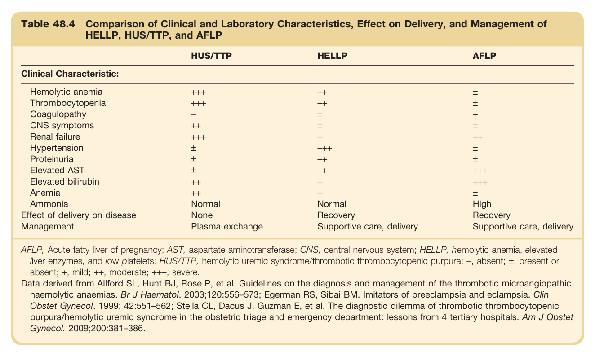

#### Table Data (CSV: [Table_48_4.csv](Table_48_4.csv))

```markdown
| Table Text (OCR) |
| :--- |
| Table 48.4 Comparison of Clinical and Laboratory Characteristics, Effect on Delivery, and Management of HELLP, HUS/TTP, and AFLP HUS/TTP  HELLP  AFLP    Clinical Characteristic:    Hemolytic anemia  +++  ++  ±    Thrombocytopenia  +++  ++  ±    Coagulopathy  -  ±  +    CNS symptoms  ++  ±  ±    Renal failure  +++  +  ++    Hypertension  ±  +++  ±    Proteinuria  ±  ++  ±    Elevated AST  ±  ++  +++    Elevated bilirubin  ++  +  +++    Anemia  ++  +  ±    Ammonia  Normal  Normal  High    Effect of delivery on disease  None  Recovery  Recovery    Management  Plasma exchange  Supportive care, delivery  Supportive care, delivery AFLP, Acute fatty liver of pregnancy; AST, aspartate aminotransferase; CNS, central nervous system; HELLP, hemolytic anemia, elevated liver enzymes, and low platelets; HUS/TTP, hemolytic uremic syndrome/thrombotic thrombocytopenic purpura; −, absent; ±, present or absent; +, mild; ++, moderate; +++, severe. Data derived from Allford SL, Hunt BJ, Rose P, et al. Guidelines on the diagnosis and management of the thrombotic microangiopathic haemolytic anaemias. Br J Haematol. 2003;120:556–573; Egerman RS, Sibai BM. Imitators of preeclampsia and eclampsia. Clin Obstet Gynecol. 1999; 42:551–562; Stella CL, Dacus J, Guzman E, et al. The diagnostic dilemma of thrombotic thrombocytopenic purpura/hemolytic uremic syndrome in the obstetric triage and emergency department: lessons from 4 tertiary hospitals. Am J Obstet Gynecol. 2009;200:381–386. |
```

Table 48.4 Comparison of Clinical and Laboratory Characteristics, Effect on Delivery, and Management of HELLP, HUS/TTP, and AFLP | Clinical Characteristic: | HUS/TTP | HELLP | AFLP | | :--- | :--- | :--- | :--- | | Hemolytic anemia | +++ | ++ | + | | Thrombocytopenia | +++ | ++ | + | | Coagulopathy | - | + | + | | CNS symptoms | ++ | + | + | | Renal failure | +++ | + | ++ | | Hypertension | ± | +++ | + | | Proteinuria | ± | ++ | + | | Elevated AST | + | ++ | +++ | | Elevated bilirubin | ++ | + | +++ | | Anemia | ++ | + | + | | Ammonia | Normal | Normal | High | | Effect of delivery on disease | None | Recovery | Recovery | | Management | Plasma exchange | Supportive care, delivery | Supportive care, delivery | *AFLP, Acute fatty liver of pregnancy; AST, aspartate aminotransferase; CNS, central nervous system; HELLP, hemolytic anemia, elevated liver enzymes, and low platelets; HUS/TTP, hemolytic uremic syndrome/thrombotic thrombocytopenic purpura; -, absent; ±, present or absent; +, mild; ++, moderate; +++, severe.* *Data derived from Allford SL, Hunt BJ, Rose P, et al. Guidelines on the diagnosis and management of the thrombotic microangiopathic haemolytic anaemias. Br J Haematol. 2003;120:556–573; Egerman RS, Sibai BM. Imitators of preeclampsia and eclampsia. Clin Obstet Gynecol. 1999; 42:551-562; Stella CL, Dacus J, Guzman E, et al. The diagnostic dilemma of thrombotic thrombocytopenic purpura/hemolytic uremic syndrome in the obstetric triage and emergency department: lessons from 4 tertiary hospitals. Am J Obstet Gynecol. 2009;200:381-386.*

---

### Table_48_5

#### Table Image

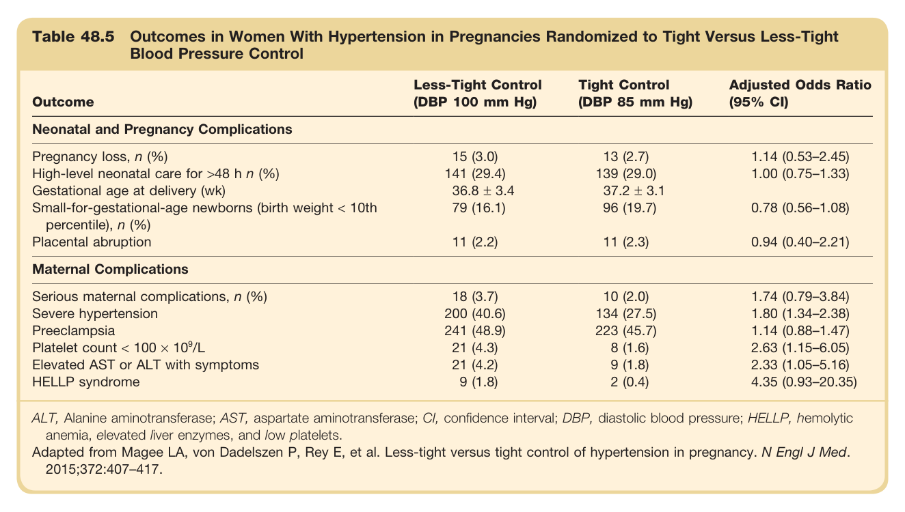

#### Table Data (CSV: [Table_48_5.csv](Table_48_5.csv))

```markdown
| Table Text (OCR) |
| :--- |
| Table 48.5 Outcomes in Women With Hypertension in Pregnancies Randomized to Tight Versus Less-Tight Blood Pressure Control Outcome  Less-Tight Control (DBP 100 mm Hg)  Tight Control (DBP 85 mm Hg)  Adjusted Odds Ratio (95% CI)    Neonatal and Pregnancy Complications    Pregnancy loss, n (%)  15 (3.0)  13 (2.7)  1.14 (0.53–2.45)    High-level neonatal care for >48 h n (%)  141 (29.4)  139 (29.0)  1.00 (0.75–1.33)    Gestational age at delivery (wk)  36.8 ± 3.4  37.2 ± 3.1      Small-for-gestational-age newborns (birth weight < 10th percentile), n (%)  79 (16.1)  96 (19.7)  0.78 (0.56–1.08)    Placental abruption  11 (2.2)  11 (2.3)  0.94 (0.40–2.21)    Maternal Complications    Serious maternal complications, n (%)  18 (3.7)  10 (2.0)  1.74 (0.79–3.84)    Severe hypertension  200 (40.6)  134 (27.5)  1.80 (1.34–2.38)    Preeclampsia  241 (48.9)  223 (45.7)  1.14 (0.88–1.47)    Platelet count < 100 × 10^9/L  21 (4.3)  8 (1.6)  2.63 (1.15–6.05)    Elevated AST or ALT with symptoms  21 (4.2)  9 (1.8)  2.33 (1.05–5.16)    HELLP syndrome  9 (1.8)  2 (0.4)  4.35 (0.93–20.35) ALT, Alanine aminotransferase; AST, aspartate aminotransferase; CI, confidence interval; DBP, diastolic blood pressure; HELLP, hemolytic anemia, elevated liver enzymes, and low platelets. Adapted from Magee LA, von Dadelszen P, Rey E, et al. Less-tight versus tight control of hypertension in pregnancy. N Engl J Med. 2015;372:407–417. |
```

Table 48.5 Outcomes in Women With Hypertension in Pregnancies Randomized to Tight Versus Less-Tight Blood Pressure Control | Outcome | Less-Tight Control (DBP 100 mm Hg) | Tight Control (DBP 85 mm Hg) | Adjusted Odds Ratio (95% CI) | | :--- | :--- | :--- | :--- | | **Neonatal and Pregnancy Complications** | | | | | Pregnancy loss, n (%) | 15 (3.0) | 13 (2.7) | 1.14 (0.53-2.45) | | High-level neonatal care for >48 h n (%) | 141 (29.4) | 139 (29.0) | 1.00 (0.75-1.33) | | Gestational age at delivery (wk) | 36.8 ± 3.4 | 37.2 ± 3.1 | | | Small-for-gestational-age newborns (birth weight < 10th percentile), n (%) | 79 (16.1) | 96 (19.7) | 0.78 (0.56-1.08) | | Placental abruption | 11 (2.2) | 11 (2.3) | 0.94 (0.40-2.21) | | **Maternal Complications** | | | | | Serious maternal complications, n (%) | 18 (3.7) | 10 (2.0) | 1.74 (0.79-3.84) | | Severe hypertension | 200 (40.6) | 134 (27.5) | 1.80 (1.34-2.38) | | Preeclampsia | 241 (48.9) | 223 (45.7) | 1.14 (0.88-1.47) | | Platelet count < 100 × 10⁹/L | 21 (4.3) | 8 (1.6) | 2.63 (1.15-6.05) | | Elevated AST or ALT with symptoms | 21 (4.2) | 9 (1.8) | 2.33 (1.05-5.16) | | HELLP syndrome | 9 (1.8) | 2 (0.4) | 4.35 (0.93-20.35) | *ALT, Alanine aminotransferase; AST, aspartate aminotransferase; CI, confidence interval; DBP, diastolic blood pressure; HELLP, hemolytic anemia, elevated liver enzymes, and low platelets. Adapted from Magee LA, von Dadelszen P, Rey E, et al. Less-tight versus tight control of hypertension in pregnancy. N Engl J Med. 2015;372:407-417.*

---

### Table_48_6

#### Table Image

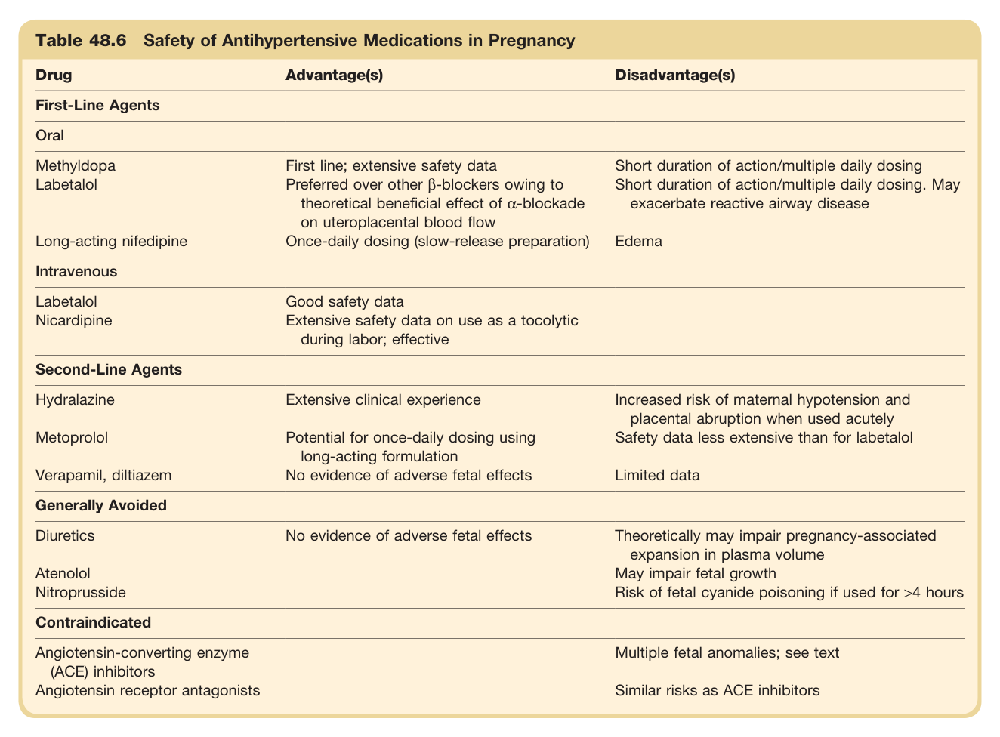

#### Table Data (CSV: [Table_48_6.csv](Table_48_6.csv))

```markdown
| Table Text (OCR) |
| :--- |
| Table 48.6 Safety of Antihypertensive Medications in Pregnancy Drug  Advantage(s)  Disadvantage(s)    First-Line Agents    Oral    Methyldopa  First line; extensive safety data  Short duration of action/multiple daily dosing    Labetalol  Preferred over other β-blockers owing to theoretical beneficial effect of α-blockade on uteroplacental blood flow  Short duration of action/multiple daily dosing. May exacerbate reactive airway disease    Long-acting nifedipine  Once-daily dosing (slow-release preparation)  Edema    Intravenous    Labetalol  Good safety data      Nicardipine  Extensive safety data on use as a tocolytic during labor; effective      Second-Line Agents    Hydralazine  Extensive clinical experience  Increased risk of maternal hypotension and placental abruption when used acutely    Metoprolol  Potential for once-daily dosing using long-acting formulation  Safety data less extensive than for labetalol    Verapamil, diltiazem  No evidence of adverse fetal effects  Limited data    Generally Avoided    Diuretics  No evidence of adverse fetal effects  Theoretically may impair pregnancy-associated expansion in plasma volume    Atenolol    May impair fetal growth    Nitroprusside    Risk of fetal cyanide poisoning if used for >4 hours    Contraindicated    Angiotensin-converting enzyme (ACE) inhibitors    Multiple fetal anomalies; see text    Angiotensin receptor antagonists    Similar risks as ACE inhibitors |
```

Table 48.6 Safety of Antihypertensive Medications in Pregnancy | Drug | Advantage(s) | Disadvantage(s) | | :--- | :--- | :--- | | **First-Line Agents** | | | | Oral | | | | Methyldopa | First line; extensive safety data | Short duration of action/multiple daily dosing | | Labetalol | Preferred over other β-blockers owing to theoretical beneficial effect of a-blockade on uteroplacental blood flow | Short duration of action/multiple daily dosing. May exacerbate reactive airway disease | | Long-acting nifedipine | Once-daily dosing (slow-release preparation) | Edema | | Intravenous | | | | Labetalol | Good safety data | | | Nicardipine | Extensive safety data on use as a tocolytic during labor; effective | | | **Second-Line Agents** | | | | Hydralazine | Extensive clinical experience | Increased risk of maternal hypotension and placental abruption when used acutely | | Metoprolol | Potential for once-daily dosing using long-acting formulation | Safety data less extensive than for labetalol | | Verapamil, diltiazem | No evidence of adverse fetal effects | Limited data | | **Generally Avoided** | | | | Diuretics | No evidence of adverse fetal effects | Theoretically may impair pregnancy-associated expansion in plasma volume | | Atenolol | | May impair fetal growth | | Nitroprusside | | Risk of fetal cyanide poisoning if used for >4 hours | | **Contraindicated** | | | | Angiotensin-converting enzyme (ACE) inhibitors | | Multiple fetal anomalies; see text | | Angiotensin receptor antagonists | | Similar risks as ACE inhibitors |

---

### Table_48_7

#### Table Image

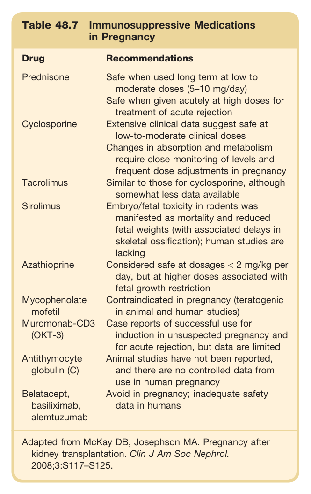

#### Table Data (CSV: [Table_48_7.csv](Table_48_7.csv))

```markdown
| Table Text (OCR) |
| :--- |
| Table 48.7 Immunosuppressive Medications in Pregnancy Drug  Recommendations    Prednisone  Safe when used long term at low to moderate doses (5–10 mg/day)Safe when given acutely at high doses for treatment of acute rejection    Cyclosporine  Extensive clinical data suggest safe at low-to-moderate clinical dosesChanges in absorption and metabolism require close monitoring of levels and frequent dose adjustments in pregnancy    Tacrolimus  Similar to those for cyclosporine, although somewhat less data available    Sirolimus  Embryo/fetal toxicity in rodents was manifested as mortality and reduced fetal weights (with associated delays in skeletal ossification); human studies are lacking    Azathioprine  Considered safe at dosages < 2 mg/kg per day, but at higher doses associated with fetal growth restriction    Mycophenolate mofetil  Contraindicated in pregnancy (teratogenic in animal and human studies)    Muromonab-CD3 (OKT-3)  Case reports of successful use for induction in unsuspected pregnancy and for acute rejection, but data are limited    Antithymocyte globulin (C)  Animal studies have not been reported, and there are no controlled data from use in human pregnancy    Belatacept, basiliximab, alemtuzumab  Avoid in pregnancy; inadequate safety data in humans    Adapted from McKay DB, Josephson MA. Pregnancy after kidney transplantation. Clin J Am Soc Nephrol.2008;3:S117–S125. |
```

Table 48.7 Immunosuppressive Medications in Pregnancy | Drug | Recommendations | | :--- | :--- | | Prednisone | Safe when used long term at low to moderate doses (5-10 mg/day). Safe when given acutely at high doses for treatment of acute rejection | | Cyclosporine | Extensive clinical data suggest safe at low-to-moderate clinical doses. Changes in absorption and metabolism require close monitoring of levels and frequent dose adjustments in pregnancy | | Tacrolimus | Similar to those for cyclosporine, although somewhat less data available | | Sirolimus | Embryo/fetal toxicity in rodents was manifested as mortality and reduced fetal weights (with associated delays in skeletal ossification); human studies are lacking | | Azathioprine | Considered safe at dosages < 2 mg/kg per day, but at higher doses associated with fetal growth restriction | | Mycophenolate mofetil | Contraindicated in pregnancy (teratogenic in animal and human studies) | | Muromonab-CD3 (OKT-3) | Case reports of successful use for induction in unsuspected pregnancy and for acute rejection, but data are limited | | Antithymocyte globulin (C) | Animal studies have not been reported, and there are no controlled data from use in human pregnancy | | Belatacept, basiliximab, alemtuzumab | Avoid in pregnancy; inadequate safety data in humans | *Adapted from McKay DB, Josephson MA. Pregnancy after kidney transplantation. Clin J Am Soc Nephrol. 2008;3:S117-S125.*

---
