# 49. Antihypertensive Therapy - Figures and Tables Index

This document lists all figures and tables extracted from `49. Antihypertensive Therapy.pdf`.

## Table of Contents
- [Figures](#figures)
- [Tables](#tables)

---

## Figures

### Fig_49_1

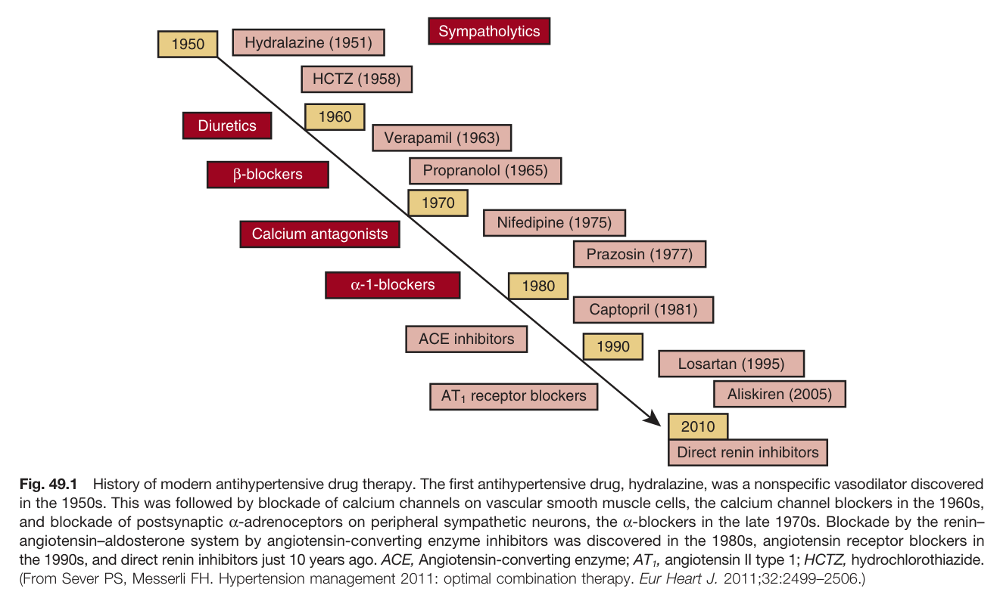

Fig. 49.1 History of modern antihypertensive drug therapy. The first antihypertensive drug, hydralazine, was a nonspecific vasodilator discovered in the 1950s. This was followed by blockade of calcium channels on vascular smooth muscle cells, the calcium channel blockers in the 1960s, and blockade of postsynaptic a-adrenoceptors on peripheral sympathetic neurons, the a-blockers in the late 1970s. Blockade by the renin-angiotensin-aldosterone system by angiotensin-converting enzyme inhibitors was discovered in the 1980s, angiotensin receptor blockers in the 1990s, and direct renin inhibitors just 10 years ago. ACE, Angiotensin-converting enzyme; AT1, angiotensin II type 1; HCTZ, hydrochlorothiazide. (From Sever PS, Messerli FH. Hypertension management 2011: optimal combination therapy. Eur Heart J. 2011;32:2499-2506.)

---

### Fig_49_2

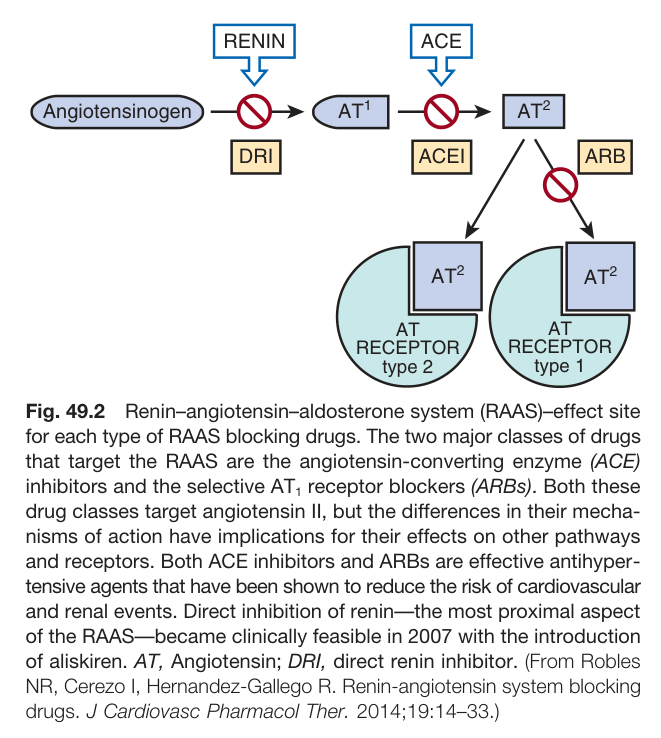

Fig. 49.2 Renin-angiotensin-aldosterone system (RAAS)-effect site for each type of RAAS blocking drugs. The two major classes of drugs that target the RAAS are the angiotensin-converting enzyme (ACE) inhibitors and the selective AT, receptor blockers (ARBs). Both these drug classes target angiotensin II, but the differences in their mechanisms of action have implications for their effects on other pathways and receptors. Both ACE inhibitors and ARBs are effective antihypertensive agents that have been shown to reduce the risk of cardiovascular and renal events. Direct inhibition of renin-the most proximal aspect of the RAAS-became clinically feasible in 2007 with the introduction of aliskiren. AT, Angiotensin; DRI, direct renin inhibitor. (From Robles NR, Cerezo I, Hernandez-Gallego R. Renin-angiotensin system blocking drugs. J Cardiovasc Pharmacol Ther. 2014;19:14-33.)

---

### Fig_49_3

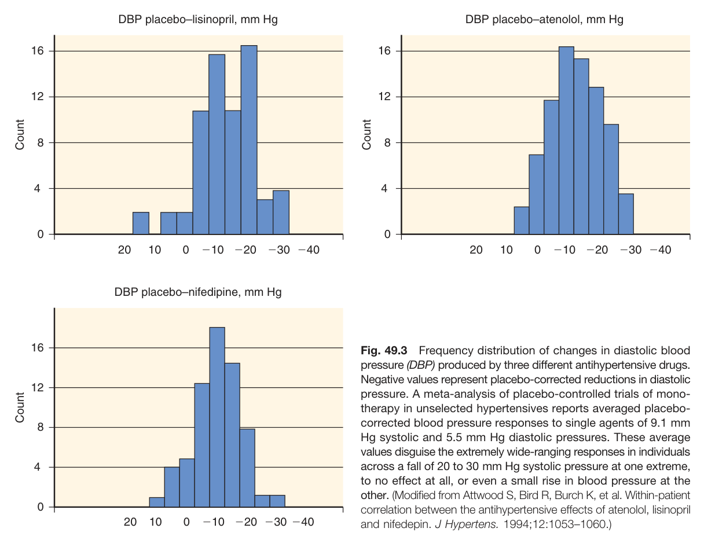

Fig. 49.3 Frequency distribution of changes in diastolic blood pressure (DBP) produced by three different antihypertensive drugs. Negative values represent placebo-corrected reductions in diastolic pressure. A meta-analysis of placebo-controlled trials of monotherapy in unselected hypertensives reports averaged placebo-corrected blood pressure responses to single agents of 9.1 mm Hg systolic and 5.5 mm Hg diastolic pressures. These average values disguise the extremely wide-ranging responses in individuals across a fall of 20 to 30 mm Hg systolic pressure at one extreme, to no effect at all, or even a small rise in blood pressure at the other. (Modified from Attwood S, Bird R, Burch K, et al. Within-patient correlation between the antihypertensive effects of atenolol, lisinopril and nifedepin. J Hypertens. 1994;12:1053-1060.)

---

### Fig_49_4

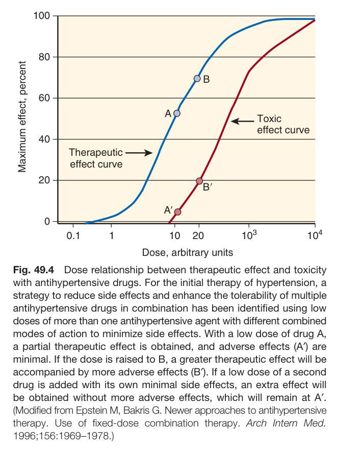

Fig. 49.4 Dose relationship between therapeutic effect and toxicity with antihypertensive drugs. For the initial therapy of hypertension, a strategy to reduce side effects and enhance the tolerability of multiple antihypertensive drugs in combination has been identified using low doses of more than one antihypertensive agent with different combined modes of action to minimize side effects. With a low dose of drug A, a partial therapeutic effect is obtained, and adverse effects (A') are minimal. If the dose is raised to B, a greater therapeutic effect will be accompanied by more adverse effects (B'). If a low dose of a second drug is added with its own minimal side effects, an extra effect will be obtained without more adverse effects, which will remain at A'. (Modified from Epstein M, Bakris G. Newer approaches to antihypertensive therapy. Use of fixed-dose combination therapy. Arch Intern Med. 1996;156:1969-1978.)

---

### Fig_49_5

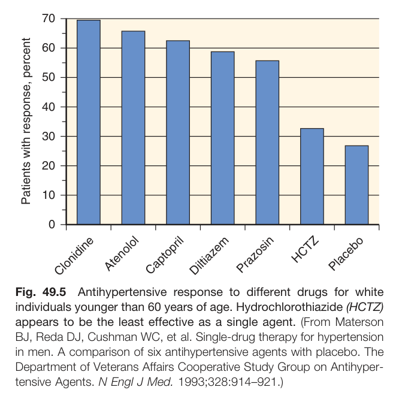

Fig. 49.5 Antihypertensive response to different drugs for white individuals younger than 60 years of age. Hydrochlorothiazide (HCTZ) appears to be the least effective as a single agent. (From Materson BJ, Reda DJ, Cushman WC, et al. Single-drug therapy for hypertension in men. A comparison of six antihypertensive agents with placebo. The Department of Veterans Affairs Cooperative Study Group on Antihypertensive Agents. N Engl J Med. 1993;328:914-921.)

---

## Tables

### Table_49_1

#### Table Image

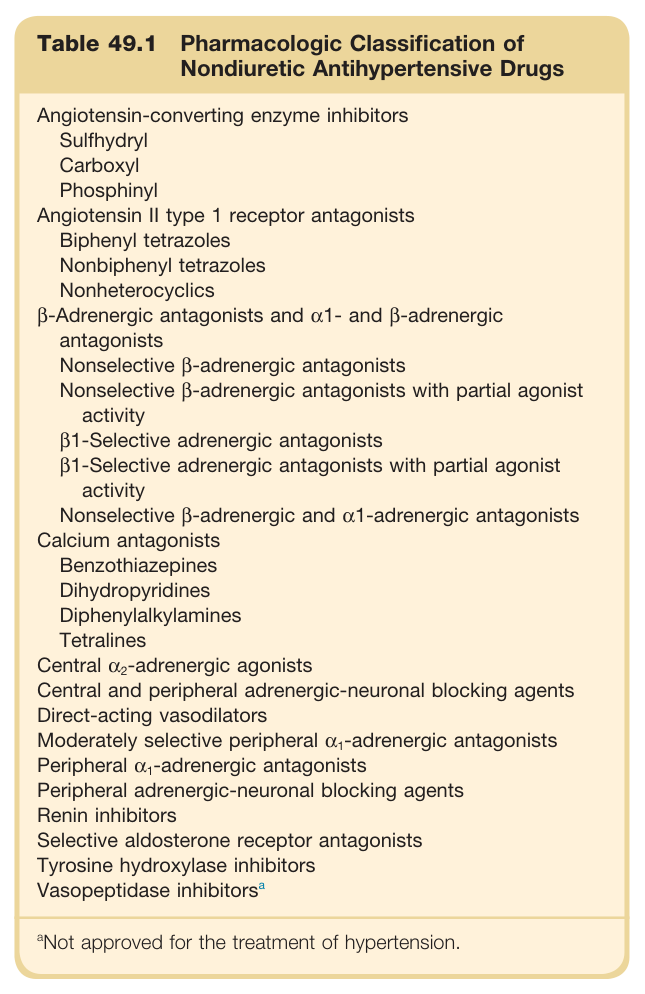

#### Table Data (CSV: [Table_49_1.csv](Table_49_1.csv))

```markdown
| Table Text (OCR) |
| :--- |
| Table 49.1 Pharmacologic Classification of Nondiuretic Antihypertensive Drugs Angiotensin-converting enzyme inhibitors    Sulfhydryl    Carboxyl    Phosphinyl    Angiotensin II type 1 receptor antagonists    Biphenyl tetrazoles    Nonbiphenyl tetrazoles    Nonheterocyclics    β-Adrenergic antagonists and α1- and β-adrenergic antagonists    Nonselective β-adrenergic antagonists    Nonselective β-adrenergic antagonists with partial agonist activity    β1-Selective adrenergic antagonists    β1-Selective adrenergic antagonists with partial agonist activity    Nonselective β-adrenergic and α1-adrenergic antagonists    Calcium antagonists    Benzothiazepines    Dihydropyridines    Diphenylalkylamines    Tetralines    Central α2-adrenergic agonists    Central and peripheral adrenergic-neuronal blocking agents    Direct-acting vasodilators    Moderately selective peripheral α1-adrenergic antagonists    Peripheral α1-adrenergic antagonists    Peripheral adrenergic-neuronal blocking agents    Renin inhibitors    Selective aldosterone receptor antagonists    Tyrosine hydroxylase inhibitors    Vasopeptidase inhibitorsa <sup>a</sup>Not approved for the treatment of hypertension. |
```

Table 49.1 Pharmacologic Classification of Nondiuretic Antihypertensive Drugs Angiotensin-converting enzyme inhibitors Sulfhydryl Carboxyl Phosphinyl Angiotensin II type 1 receptor antagonists Biphenyl tetrazoles Nonbiphenyl tetrazoles Nonheterocyclics ẞ-Adrenergic antagonists and a1- and ẞ-adrenergic antagonists Nonselective ẞ-adrenergic antagonists Nonselective ẞ-adrenergic antagonists with partial agonist activity ẞ1-Selective adrenergic antagonists ẞ1-Selective adrenergic antagonists with partial agonist activity Nonselective ẞ-adrenergic and a1-adrenergic antagonists Calcium antagonists Benzothiazepines Dihydropyridines Diphenylalkylamines Tetralines Central 2-adrenergic agonists Central and peripheral adrenergic-neuronal blocking agents Direct-acting vasodilators Moderately selective peripheral a₁-adrenergic antagonists Peripheral α₁-adrenergic antagonists Peripheral adrenergic-neuronal blocking agents Renin inhibitors Selective aldosterone receptor antagonists Tyrosine hydroxylase inhibitors Vasopeptidase inhibitorsª ªNot approved for the treatment of hypertension.

---

### Table_49_2

#### Table Image

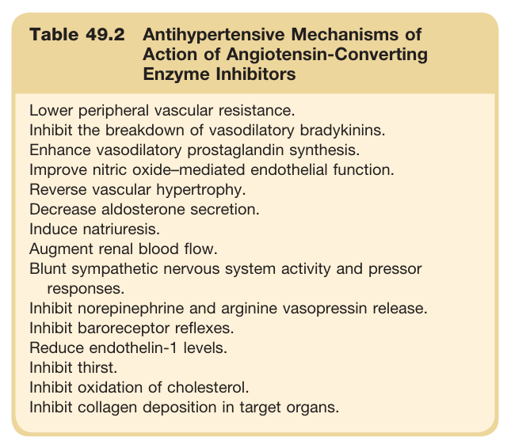

#### Table Data (CSV: [Table_49_2.csv](Table_49_2.csv))

```markdown
| Table Text (OCR) |
| :--- |
| Table 49.2 Antihypertensive Mechanisms of Action of Angiotensin-Converting Enzyme Inhibitors Lower peripheral vascular resistance.    Inhibit the breakdown of vasodilatory bradykinins.    Enhance vasodilatory prostaglandin synthesis.    Improve nitric oxide-mediated endothelial function.    Reverse vascular hypertrophy.    Decrease aldosterone secretion.    Induce natriuresis.    Augment renal blood flow.    Blunt sympathetic nervous system activity and pressor responses.    Inhibit norepinephrine and arginine vasopressin release.    Inhibit baroreceptor reflexes.    Reduce endothelin-1 levels.    Inhibit thirst.    Inhibit oxidation of cholesterol.    Inhibit collagen deposition in target organs. |
```

Table 49.2 Antihypertensive Mechanisms of Action of Angiotensin-Converting Enzyme Inhibitors Lower peripheral vascular resistance. Inhibit the breakdown of vasodilatory bradykinins. Enhance vasodilatory prostaglandin synthesis. Improve nitric oxide-mediated endothelial function. Reverse vascular hypertrophy. Decrease aldosterone secretion. Induce natriuresis. Augment renal blood flow. Blunt sympathetic nervous system activity and pressor responses. Inhibit norepinephrine and arginine vasopressin release. Inhibit baroreceptor reflexes. Reduce endothelin-1 levels. Inhibit thirst. Inhibit oxidation of cholesterol. Inhibit collagen deposition in target organs.

---

### Table_49_3

#### Table Image

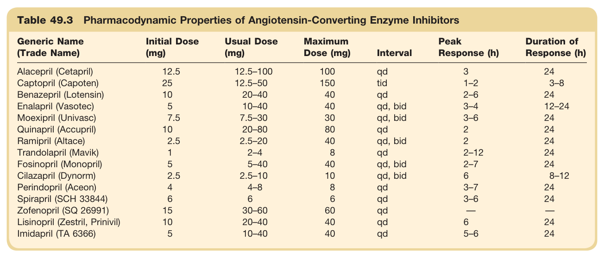

#### Table Data (CSV: [Table_49_3.csv](Table_49_3.csv))

```markdown
| Table Text (OCR) |
| :--- |
| Table 49.3 Pharmacodynamic Properties of Angiotensin-Converting Enzyme Inhibitors Generic Name(Trade Name)  Initial Dose(mg)  Usual Dose(mg)  MaximumDose (mg)  Interval  PeakResponse (h)  Duration ofResponse (h)    Alacepril (Cetapril)  12.5  12.5–100  100  qd  3  24    Captopril (Capoten)  25  12.5–50  150  tid  1–2  3–8    Benazepril (Lotensin)  10  20–40  40  qd  2–6  24    Enalapril (Vasotec)  5  10–40  40  qd, bid  3–4  12–24    Moexipril (Univasc)  7.5  7.5–30  30  qd, bid  3–6  24    Quinapril (Accupril)  10  20–80  80  qd  2  24    Ramipril (Altace)  2.5  2.5–20  40  qd, bid  2  24    Trandolapril (Mavik)  1  2–4  8  qd  2–12  24    Fosinopril (Monopril)  5  5–40  40  qd, bid  2–7  24    Cilazapril (Dynorm)  2.5  2.5–10  10  qd, bid  6  8–12    Perindopril (Aceon)  4  4–8  8  qd  3–7  24    Spirapril (SCH 33844)  6  6  6  qd  3–6  24    Zofenopril (SQ 26991)  15  30–60  60  qd  —  —    Lisinopril (Zestril, Prinivil)  10  20–40  40  qd  6  24    Imidapril (TA 6366)  5  10–40  40  qd  5–6  24 |
```

Table 49.3 Pharmacodynamic Properties of Angiotensin-Converting Enzyme Inhibitors | Generic Name (Trade Name) | Initial Dose (mg) | Usual Dose (mg) | Maximum Dose (mg) | Interval | Peak Response (h) | Duration of Response (h) | | ------------------------------ | ----------------- | --------------- | ----------------- | -------- | ----------------- | ------------------------ | | Alacepril (Cetapril) | 12.5 | 12.5-100 | 100 | qd | 3 | 24 | | Captopril (Capoten) | 25 | 12.5-50 | 150 | tid | 1-2 | 3-8 | | Benazepril (Lotensin) | 10 | 20-40 | 40 | qd | 2-6 | 24 | | Enalapril (Vasotec) | 5 | 10-40 | 40 | qd, bid | 3-4 | 12-24 | | Moexipril (Univasc) | 7.5 | 7.5-30 | 30 | qd, bid | 3-6 | 24 | | Quinapril (Accupril) | 10 | 20-80 | 80 | qd | 2 | 24 | | Ramipril (Altace) | 2.5 | 2.5-20 | 40 | qd, bid | 2 | 24 | | Trandolapril (Mavik) | 1 | 2-4 | 8 | qd | 2-12 | 24 | | Fosinopril (Monopril) | 5 | 5-40 | 40 | qd, bid | 2-7 | 24 | | Cilazapril (Dynorm) | 2.5 | 2.5-10 | 10 | qd, bid | 6 | 8-12 | | Perindopril (Aceon) | 4 | 4-8 | 8 | qd | 3-7 | 24 | | Spirapril (SCH 33844) | 6 | 6 | 6 | qd | 3-6 | 24 | | Zofenopril (SQ 26991) | 15 | 30-60 | 60 | qd | — | — | | Lisinopril (Zestril, Prinivil) | 10 | 20-40 | 40 | qd | 6 | 24 | | Imidapril (TA 6366) | 5 | 10-40 | 40 | qd | 5-6 | 24 |

---

### Table_49_4

#### Table Image

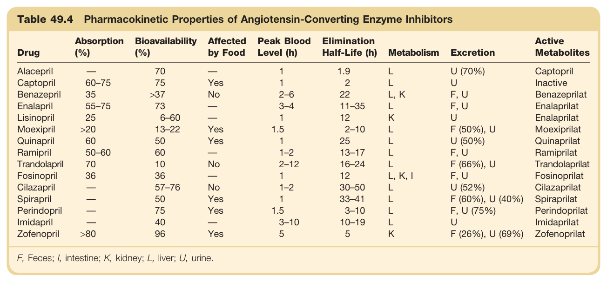

#### Table Data (CSV: [Table_49_4.csv](Table_49_4.csv))

```markdown
| Table Text (OCR) |
| :--- |
| Table 49.4 Pharmacokinetic Properties of Angiotensin-Converting Enzyme Inhibitors Drug  Absorption (%)  Bioavailability (%)  Affected by Food  Peak Blood Level (h)  Elimination Half-Life (h)  Metabolism  Excretion  Active Metabolites    Alacepril  —  70  —  1  1.9  L  U (70%)  Captopril    Captopril  60–75  75  Yes  1  2  L  U  Inactive    Benazepril  35  >37  No  2–6  22  L, K  F, U  Benazeprilat    Enalapril  55–75  73  —  3–4  11–35  L  F, U  Enalaprilat    Lisinopril  25  6–60  —  1  12  K  U  Enalaprilat    Moexipril  >20  13–22  Yes  1.5  2–10  L  F (50%), U  Moexiprilat    Quinapril  60  50  Yes  1  25  L  U (50%)  Quinaprilat    Ramipril  50–60  60  —  1–2  13–17  L  F, U  Ramiprilat    Trandolapril  70  10  No  2–12  16–24  L  F (66%), U  Trandolaprilat    Fosinopril  36  36  —  1  12  L, K, I  F, U  Fosinoprilat    Cilazapril  —  57–76  No  1–2  30–50  L  U (52%)  Cilazaprilat    Spirapril  —  50  Yes  1  33–41  L  F (60%), U (40%)  Spiraprilat    Perindopril  —  75  Yes  1.5  3–10  L  F, U (75%)  Perindoprilat    Imidapril  —  40  —  3–10  10–19  L  U  Imidaprilat    Zofenopril  >80  96  Yes  5  5  K  F (26%), U (69%)  Zofenoprilat F, Feces; I, intestine; K, kidney; L, liver; U, urine. |
```

Table 49.4 Pharmacokinetic Properties of Angiotensin-Converting Enzyme Inhibitors | Drug | Absorption (%) | Bioavailability (%) | Affected by Food | Peak Blood Level (h) | Elimination Half-Life (h) | Metabolism | Excretion | Active Metabolites | | ------------ | -------------- | ------------------- | ---------------- | -------------------- | ------------------------- | ---------- | ---------------- | ------------------ | | Alacepril | — | 70 | — | 1 | 1.9 | L | U (70%) | Captopril | | Captopril | 60-75 | 75 | Yes | 1 | 2 | L | U | Inactive | | Benazepril | 35 | >37 | No | 2-6 | 22 | L, K | F, U | Benazeprilat | | Enalapril | 55-75 | 73 | — | 3-4 | 11-35 | L | F, U | Enalaprilat | | Lisinopril | 25 | 6-60 | — | 1 | 12 | K | U | Enalaprilat | | Moexipril | >20 | 13-22 | Yes | 1.5 | 2-10 | L | F (50%), U | Moexiprilat | | Quinapril | 60 | 50 | Yes | 1 | 25 | L | U (50%) | Quinaprilat | | Ramipril | 50-60 | 60 | — | 1-2 | 13-17 | L | F, U | Ramiprilat | | Trandolapril | 70 | 10 | No | 2-12 | 16-24 | L | F (66%), U | Trandolaprilat | | Fosinopril | 36 | 36 | — | 1 | 12 | L, K, I | F, U | Fosinoprilat | | Cilazapril | — | 57-76 | No | 1-2 | 30-50 | L | U (52%) | Cilazaprilat | | Spirapril | — | 50 | Yes | 1 | 33-41 | L | F (60%), U (40%) | Spiraprilat | | Perindopril | — | 75 | Yes | 1.5 | 3-10 | L | F, U (75%) | Perindoprilat | | Imidapril | — | 40 | — | 3-10 | 10-19 | L | U | Imidaprilat | | Zofenopril | >80 | 96 | Yes | 5 | 5 | K | F (26%), U (69%) | Zofenoprilat | F, Feces; I, intestine; K, kidney; L, liver; U, urine.

---

### Table_49_5

#### Table Image

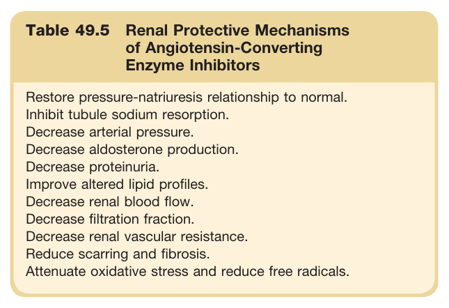

#### Table Data (CSV: [Table_49_5.csv](Table_49_5.csv))

```markdown
| Table Text (OCR) |
| :--- |
| Table 49.5 Renal Protective Mechanisms of Angiotensin-Converting Enzyme Inhibitors Restore pressure-natriuresis relationship to normal.    Inhibit tubule sodium resorption.    Decrease arterial pressure.    Decrease aldosterone production.    Decrease proteinuria.    Improve altered lipid profiles.    Decrease renal blood flow.    Decrease filtration fraction.    Decrease renal vascular resistance.    Reduce scarring and fibrosis.    Attenuate oxidative stress and reduce free radicals. |
```

Table 49.5 Renal Protective Mechanisms of Angiotensin-Converting Enzyme Inhibitors Restore pressure-natriuresis relationship to normal. Inhibit tubule sodium resorption. Decrease arterial pressure. Decrease aldosterone production. Decrease proteinuria. Improve altered lipid profiles. Decrease renal blood flow. Decrease filtration fraction. Decrease renal vascular resistance. Reduce scarring and fibrosis. Attenuate oxidative stress and reduce free radicals.

---

### Table_49_6

#### Table Image

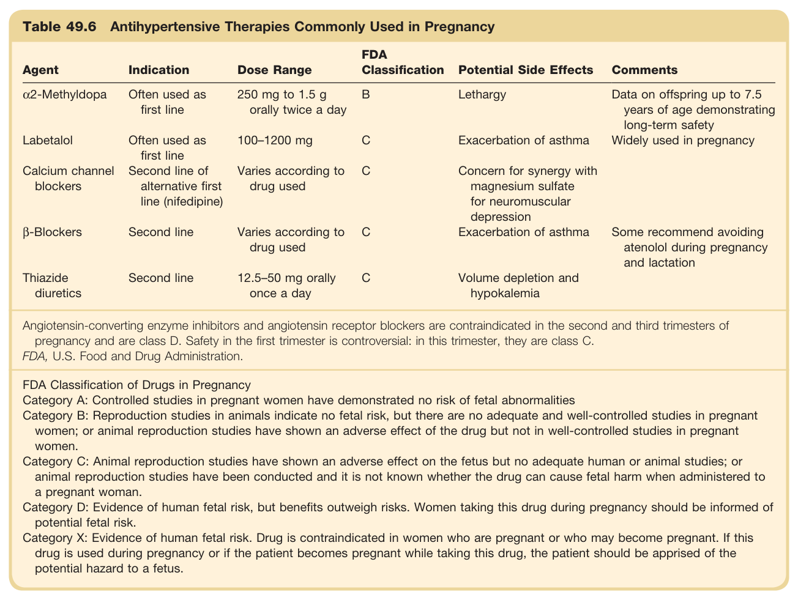

#### Table Data (CSV: [Table_49_6.csv](Table_49_6.csv))

```markdown
| Table Text (OCR) |
| :--- |
| Table 49.6 Antihypertensive Therapies Commonly Used in Pregnancy Agent  Indication  Dose Range  FDA Classification  Potential Side Effects  Comments    α2-Methyldopa  Often used as first line  250 mg to 1.5 g orally twice a day  B  Lethargy  Data on offspring up to 7.5 years of age demonstrating long-term safety    Labetalol  Often used as first line  100–1200 mg  C  Exacerbation of asthma  Widely used in pregnancy    Calcium channel blockers  Second line of alternative first line (nifedipine)  Varies according to drug used  C  Concern for synergy with magnesium sulfate for neuromuscular depression      β-Blockers  Second line  Varies according to drug used  C  Exacerbation of asthma  Some recommend avoiding atenolol during pregnancy and lactation    Thiazide diuretics  Second line  12.5–50 mg orally once a day  C  Volume depletion and hypokalemia Angiotensin-converting enzyme inhibitors and angiotensin receptor blockers are contraindicated in the second and third trimesters of pregnancy and are class D. Safety in the first trimester is controversial: in this trimester, they are class C. FDA, U.S. Food and Drug Administration. |
```

Table 49.6 Antihypertensive Therapies Commonly Used in Pregnancy | Agent | Indication | Dose Range | FDA Classification | Potential Side Effects | Comments | | ------------------------ | -------------------------------------------------- | ---------------------------------- | ------------------ | ------------------------------------------------------------ | ------------------------------------------------------------ | | x2-Methyldopa | Often used as first line | 250 mg to 1.5 g orally twice a day | B | Lethargy | Data on offspring up to 7.5 years of age demonstrating long-term safety | | Labetalol | Often used as first line | 100-1200 mg | C | Exacerbation of asthma | Widely used in pregnancy | | Calcium channel blockers | Second line of alternative first line (nifedipine) | Varies according to drug used | C | Concern for synergy with magnesium sulfate for neuromuscular depression | | | B-Blockers | Second line | Varies according to drug used | C | Exacerbation of asthma | Some recommend avoiding atenolol during pregnancy and lactation | | Thiazide diuretics | Second line | 12.5-50 mg orally once a day | C | Volume depletion and hypokalemia | | Angiotensin-converting enzyme inhibitors and angiotensin receptor blockers are contraindicated in the second and third trimesters of pregnancy and are class D. Safety in the first trimester is controversial: in this trimester, they are class C. FDA, U.S. Food and Drug Administration. **FDA Classification of Drugs in Pregnancy** * **Category A:** Controlled studies in pregnant women have demonstrated no risk of fetal abnormalities * **Category B:** Reproduction studies in animals indicate no fetal risk, but there are no adequate and well-controlled studies in pregnant women; or animal reproduction studies have shown an adverse effect of the drug but not in well-controlled studies in pregnant women. * **Category C:** Animal reproduction studies have shown an adverse effect on the fetus but no adequate human or animal studies; or animal reproduction studies have been conducted and it is not known whether the drug can cause fetal harm when administered to a pregnant woman. * **Category D:** Evidence of human fetal risk, but benefits outweigh risks. Women taking this drug during pregnancy should be informed of potential fetal risk. * **Category X:** Evidence of human fetal risk. Drug is contraindicated in women who are pregnant or who may become pregnant. If this drug is used during pregnancy or if the patient becomes pregnant while taking this drug, the patient should be apprised of the potential hazard to a fetus.

---

### Table_49_7

#### Table Images (2 Parts)

- **Part 1 (Page 9)**:
  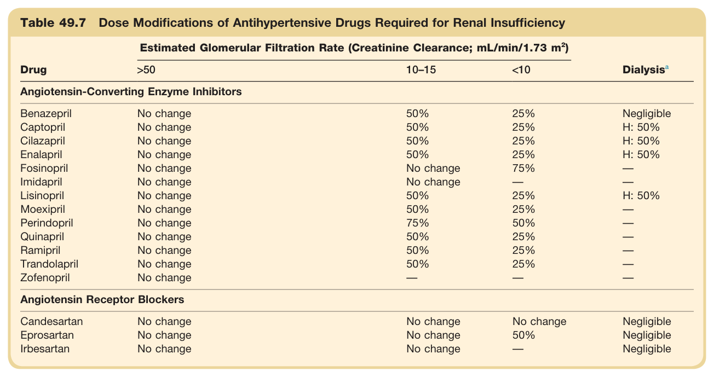

- **Part 2 (Page 10)**:
  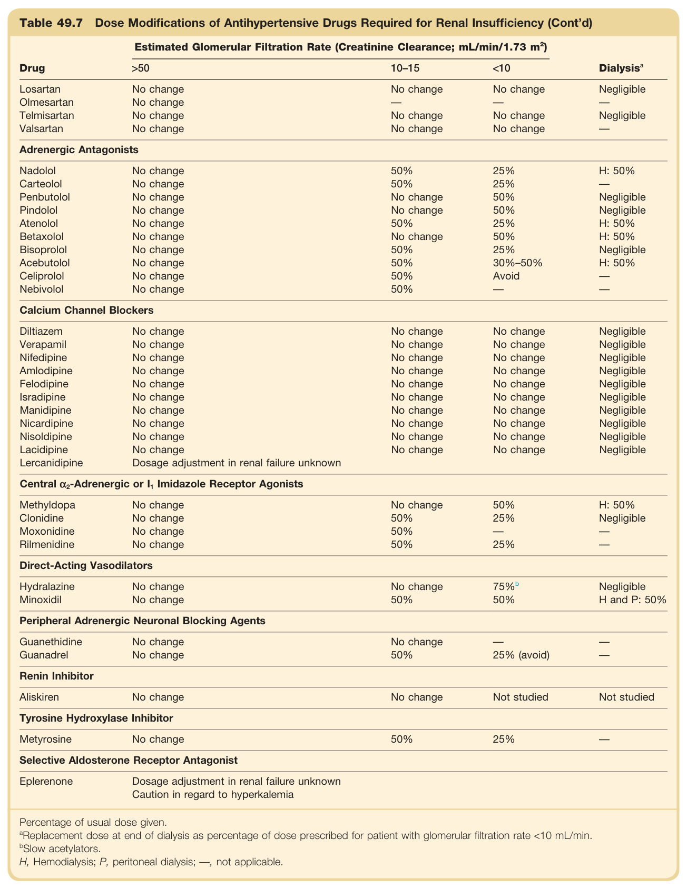

#### Table Data (CSV: [Table_49_7.csv](Table_49_7.csv))

```markdown
| Table Text (OCR) |
| :--- |
| Table 49.7 Dose Modifications of Antihypertensive Drugs Required for Renal Insufficiency Drug  Estimated Glomerular Filtration Rate (Creatinine Clearance; mL/min/1.73  m^2 )  Dialysis ^a     >50  10-15  <10    Angiotensin-Converting Enzyme Inhibitors    Benazepril  No change  50%  25%  Negligible    Captopril  No change  50%  25%  H: 50%    Cilazapril  No change  50%  25%  H: 50%    Enalapril  No change  50%  25%  H: 50%    Fosinopril  No change  No change  75%  —    Imidapril  No change  No change  —  —    Lisinopril  No change  50%  25%  H: 50%    Moexipril  No change  50%  25%  —    Perindopril  No change  75%  50%  —    Quinapril  No change  50%  25%  —    Ramipril  No change  50%  25%  —    Trandolapril  No change  50%  25%  —    Zofenopril  No change  —  —  —    Angiotensin Receptor Blockers    Candesartan  No change  No change  No change  Negligible    Eprosartan  No change  No change  50%  Negligible    Irbesartan  No change  No change  —  Negligible    Losartan  No change  No change  No change  Negligible    Olmesartan  No change  —  —  —    Telmisartan  No change  No change  No change  Negligible    Valsartan  No change  No change  No change  —    Adrenergic Antagonists    Nadolol  No change  50%  25%  H: 50%    Carteolol  No change  50%  25%  —    Penbutolol  No change  No change  50%  Negligible    Pindolol  No change  No change  50%  Negligible    Atenolol  No change  50%  25%  H: 50%    Betaxolol  No change  No change  50%  H: 50%    Bisoprolol  No change  50%  25%  Negligible    Acebutolol  No change  50%  30%-50%  H: 50%    Celiprolol  No change  50%  Avoid  —    Nebivolol  No change  50%  —  —    Calcium Channel Blockers    Diltiazem  No change  No change  No change  Negligible    Verapamil  No change  No change  No change  Negligible    Nifedipine  No change  No change  No change  Negligible    Amlodipine  No change  No change  No change  Negligible    Felodipine  No change  No change  No change  Negligible    Isradipine  No change  No change  No change  Negligible    Manidipine  No change  No change  No change  Negligible    Nicardipine  No change  No change  No change  Negligible    Nisoldipine  No change  No change  No change  Negligible    Lacidipine  No change  No change  No change  Negligible    Lercanidipine  Dosage adjustment in renal failure unknown          Central  \alpha_2 -Adrenergic or I, Imidazole Receptor Agonists    Methyldopa  No change  No change  50%  H: 50%    Clonidine  No change  50%  25%  Negligible    Moxonidine  No change  50%  —  —    Rilmenidine  No change  50%  25%  —    Direct-Acting Vasodilators    Hydralazine  No change  No change   75\%^b   Negligible    Minoxidil  No change  50%  50%  H and P: 50%    Peripheral Adrenergic Neuronal Blocking Agents    Guanethidine  No change  No change  —  —    Guanadrel  No change  50%  25% (avoid)  —    Renin Inhibitor    Aliskiren  No change  No change  Not studied  Not studied    Tyrosine Hydroxylase Inhibitor    Metyrosine  No change  50%  25%  —    Selective Aldosterone Receptor Antagonist    Eplerenone  Dosage adjustment in renal failure unknownCaution in regard to hyperkalemia          Percentage of usual dose given. ^a Replacement dose at end of dialysis as percentage of dose prescribed for patient with glomerular filtration rate <10 mL/min. ^b Slow acetylators.H, Hemodialysis; P, peritoneal dialysis; —, not applicable. |
```

Table 49.7 Dose Modifications of Antihypertensive Drugs Required for Renal Insufficiency | | **Estimated Glomerular Filtration Rate (Creatinine Clearance; mL/min/1.73 m²)** | | | | | ----------------------------------------------------------- | ------------------------------------------------------------ | --------- | ----------- | ------------- | | **Drug** | **>50** | **10-15** | **<10** | **Dialysisa** | | **Angiotensin-Converting Enzyme Inhibitors** | | | | | | Benazepril | No change | 50% | 25% | Negligible | | Captopril | No change | 50% | 25% | H: 50% | | Cilazapril | No change | 50% | 25% | H: 50% | | Enalapril | No change | 50% | 25% | H: 50% | | Fosinopril | No change | No change | 75% | --- | | Imidapril | No change | No change | --- | --- | | Lisinopril | No change | 50% | 25% | H: 50% | | Moexipril | No change | 50% | 25% | --- | | Perindopril | No change | 75% | 50% | --- | | Quinapril | No change | 50% | 25% | --- | | Ramipril | No change | 50% | 25% | --- | | Trandolapril | No change | 50% | 25% | --- | | Zofenopril | No change | --- | --- | --- | | **Angiotensin Receptor Blockers** | | | | | | Candesartan | No change | No change | No change | Negligible | | Eprosartan | No change | No change | 50% | Negligible | | Irbesartan | No change | No change | No change | Negligible | | Losartan | No change | No change | No change | Negligible | | Olmesartan | No change | --- | --- | --- | | Telmisartan | No change | No change | No change | Negligible | | Valsartan | No change | No change | No change | --- | | **Adrenergic Antagonists** | | | | | | Nadolol | No change | 50% | 25% | H: 50% | | Carteolol | No change | 50% | 25% | --- | | Penbutolol | No change | No change | 50% | Negligible | | Pindolol | No change | No change | 50% | Negligible | | Atenolol | No change | 50% | 25% | H: 50% | | Betaxolol | No change | No change | 50% | H: 50% | | Bisoprolol | No change | 50% | 25% | Negligible | | Acebutolol | No change | 50% | 30%-50% | H: 50% | | Celiprolol | No change | 50% | Avoid | --- | | Nebivolol | No change | 50% | --- | --- | | **Calcium Channel Blockers** | | | | | | Diltiazem | No change | No change | No change | Negligible | | Verapamil | No change | No change | No change | Negligible | | Nifedipine | No change | No change | No change | Negligible | | Amlodipine | No change | No change | No change | Negligible | | Felodipine | No change | No change | No change | Negligible | | Isradipine | No change | No change | No change | Negligible | | Manidipine | No change | No change | No change | Negligible | | Nicardipine | No change | No change | No change | Negligible | | Nisoldipine | No change | No change | No change | Negligible | | Lacidipine | No change | No change | No change | Negligible | | Lercanidipine | Dosage adjustment in renal failure unknown | | | | | **Central 02-Adrenergic or 1₁ Imidazole Receptor Agonists** | | | | | | Methyldopa | No change | No change | 50% | H: 50% | | Clonidine | No change | 50% | 25% | Negligible | | Moxonidine | No change | 50% | 25% | --- | | Rilmenidine | No change | 50% | 25% | --- | | **Direct-Acting Vasodilators** | | | | | | Hydralazine | No change | No change | 75%b | Negligible | | Minoxidil | No change | 50% | 50% | H and P: 50% | | **Peripheral Adrenergic Neuronal Blocking Agents** | | | | | | Guanethidine | No change | No change | --- | --- | | Guanadrel | No change | 50% | 25% (avoid) | --- | | **Renin Inhibitor** | | | | | | Aliskiren | No change | No change | Not studied | Not studied | | **Tyrosine Hydroxylase Inhibitor** | | | | | | Metyrosine | No change | 50% | 25% | --- | | **Selective Aldosterone Receptor Antagonist** | | | | | | Eplerenone | Dosage adjustment in renal failure unknown Caution in regard to hyperkalemia | | | | aPercentage of usual dose given. Replacement dose at end of dialysis as percentage of dose prescribed for patient with glomerular filtration rate <10 mL/min. bSlow acetylators. H, Hemodialysis; P, peritoneal dialysis; ---, not applicable.

---

### Table_49_8

#### Table Image

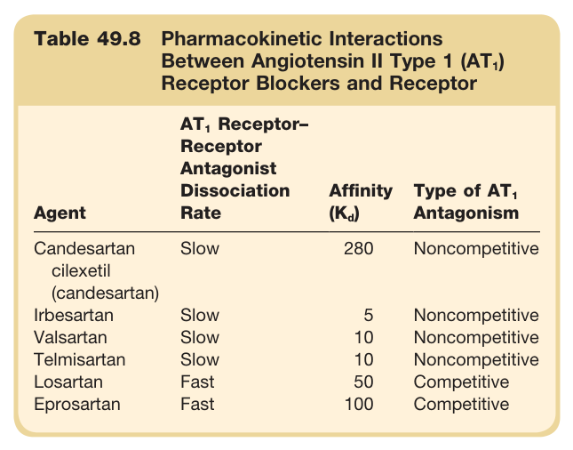

#### Table Data (CSV: [Table_49_8.csv](Table_49_8.csv))

```markdown
| Table Text (OCR) |
| :--- |
| Table 49.8 Pharmacokinetic Interactions Between Angiotensin II Type 1 (AT<sub>1</sub>) Receptor Blockers and Receptor Agent  AT _1  Receptor-Receptor Antagonist Dissociation Rate  Affinity (K _d )  Type of AT _1  Antagonism    Candesartan cilexetil (candesartan)  Slow  280  Noncompetitive    Irbesartan  Slow  5  Noncompetitive    Valsartan  Slow  10  Noncompetitive    Telmisartan  Slow  10  Noncompetitive    Losartan  Fast  50  Competitive    Eprosartan  Fast  100  Competitive |
```

Table 49.8 Pharmacokinetic Interactions Between Angiotensin II Type 1 (AT₁) Receptor Blockers and Receptor | Agent | AT₁ Receptor-Receptor Antagonist Dissociation Rate | Affinity (Kd) | Type of AT₁ Antagonism | | ----------------------------------- | -------------------------------------------------- | ------------- | ---------------------- | | Candesartan cilexetil (candesartan) | Slow | 280 | Noncompetitive | | Irbesartan | Slow | 5 | Noncompetitive | | Valsartan | Slow | 10 | Noncompetitive | | Telmisartan | Slow | 10 | Noncompetitive | | Losartan | Fast | 50 | Competitive | | Eprosartan | Fast | 100 | Competitive |

---

### Table_49_9

#### Table Image

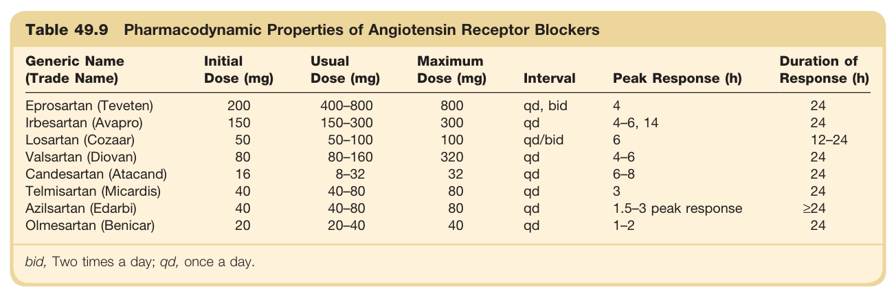

#### Table Data (CSV: [Table_49_9.csv](Table_49_9.csv))

```markdown
| Table Text (OCR) |
| :--- |
| Table 49.9 Pharmacodynamic Properties of Angiotensin Receptor Blockers Generic Name(Trade Name)  InitialDose (mg)  UsualDose (mg)  MaximumDose (mg)  Interval  Peak Response (h)  Duration ofResponse (h)    Eprosartan (Teveten)  200  400–800  800  qd, bid  4  24    Irbesartan (Avapro)  150  150–300  300  qd  4–6, 14  24    Losartan (Cozaar)  50  50–100  100  qd/bid  6  12–24    Valsartan (Diovan)  80  80–160  320  qd  4–6  24    Candesartan (Atacand)  16  8–32  32  qd  6–8  24    Telmisartan (Micardis)  40  40–80  80  qd  3  24    Azilsartan (Edarbi)  40  40–80  80  qd  1.5–3 peak response  ≥24    Olmesartan (Benicar)  20  20–40  40  qd  1–2  24 bid, Two times a day; qd, once a day. |
```

Table 49.9 Pharmacodynamic Properties of Angiotensin Receptor Blockers | Generic Name (Trade Name) | Initial Dose (mg) | Usual Dose (mg) | Maximum Dose (mg) | Interval | Peak Response (h) | Duration of Response (h) | | ------------------------- | ----------------- | --------------- | ----------------- | -------- | ------------------- | ------------------------ | | Eprosartan (Teveten) | 200 | 400-800 | 800 | qd, bid | 4 | 24 | | Irbesartan (Avapro) | 150 | 150-300 | 300 | qd | 4-6, 14 | 24 | | Losartan (Cozaar) | 50 | 50-100 | 100 | qd/bid | 6 | 12-24 | | Valsartan (Diovan) | 80 | 80-160 | 320 | qd | 4-6 | 24 | | Candesartan (Atacand) | 16 | 8-32 | 32 | qd | 6-8 | 24 | | Telmisartan (Micardis) | 40 | 40-80 | 80 | qd | 3 | 24 | | Azilsartan (Edarbi) | 40 | 40-80 | 80 | qd | 1.5-3 peak response | ≥24 | | Olmesartan (Benicar) | 20 | 20-40 | 40 | qd | 1-2 | 24 | bid, Two times a day; qd, once a day.

---

### Table_49_10

#### Table Image

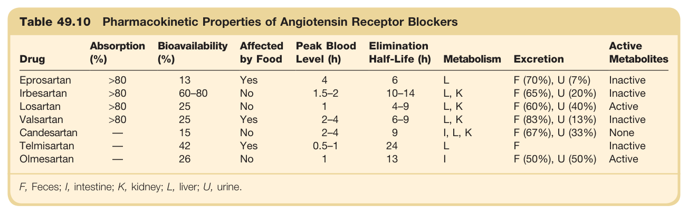

#### Table Data (CSV: [Table_49_10.csv](Table_49_10.csv))

```markdown
| Table Text (OCR) |
| :--- |
| Table 49.10 Pharmacokinetic Properties of Angiotensin Receptor Blockers Drug  Absorption (%)  Bioavailability (%)  Affected by Food  Peak Blood Level (h)  Elimination Half-Life (h)  Metabolism  Excretion  Active Metabolites    Eprosartan  >80  13  Yes  4  6  L  F (70%), U (7%)  Inactive    Irbesartan  >80  60–80  No  1.5–2  10–14  L, K  F (65%), U (20%)  Inactive    Losartan  >80  25  No  1  4–9  L, K  F (60%), U (40%)  Active    Valsartan  >80  25  Yes  2–4  6–9  L, K  F (83%), U (13%)  Inactive    Candesartan  —  15  No  2–4  9  I, L, K  F (67%), U (33%)  None    Telmisartan  —  42  Yes  0.5–1  24  L  F  Inactive    Olmesartan  —  26  No  1  13  I  F (50%), U (50%)  Active F, Feces; I, intestine; K, kidney; L, liver; U, urine. |
```

Table 49.10 Pharmacokinetic Properties of Angiotensin Receptor Blockers | Drug | Absorption (%) | Bioavailability (%) | Affected by Food | Peak Blood Level (h) | Elimination Half-Life (h) | Metabolism | Excretion | Active Metabolites | | ----------- | -------------- | ------------------- | ---------------- | -------------------- | ------------------------- | ---------- | ---------------- | ------------------ | | Eprosartan | >80 | 13 | Yes | 4 | 6 | L | F (70%), U (7%) | Inactive | | Irbesartan | >80 | 60-80 | No | 1.5-2 | 10-14 | L, K | F (65%), U (20%) | Inactive | | Losartan | >80 | 25 | No | 1 | 4-9 | L, K | F (60%), U (40%) | Active | | Valsartan | >80 | 25 | Yes | 2-4 | 6-9 | L, K | F (83%), U (13%) | Inactive | | Candesartan | — | 15 | No | 2-4 | 9 | I, L, K | F (67%), U (33%) | None | | Telmisartan | — | 42 | Yes | 0.5-1 | 24 | L | F | Inactive | | Olmesartan | — | 26 | No | 1 | 13 | I | F (50%), U (50%) | Active | F, Feces; I, intestine; K, kidney; L, liver; U, urine.

---

### Table_49_11

#### Table Image

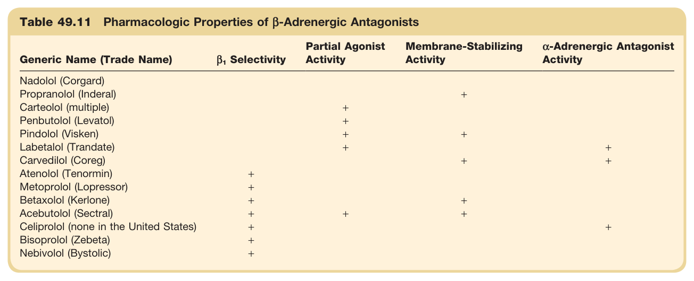

#### Table Data (CSV: [Table_49_11.csv](Table_49_11.csv))

```markdown
| Table Text (OCR) |
| :--- |
| Table 49.11 Pharmacologic Properties of β-Adrenergic Antagonists Generic Name (Trade Name)   \beta_1  Selectivity  Partial Agonist Activity  Membrane-Stabilizing Activity   \alpha -Adrenergic Antagonist Activity    Nadolol (Corgard)            Propranolol (Inderal)      +      Carteolol (multiple)    +        Penbutolol (Levatol)    +        Pindolol (Visken)    +  +      Labetalol (Trandate)    +    +    Carvedilol (Coreg)      +  +    Atenolol (Tenormin)  +          Metoprolol (Lopressor)  +          Betaxolol (Kerlone)  +    +      Acebutolol (Sectral)  +  +  +      Celiprolol (none in the United States)  +      +    Bisoprolol (Zebeta)  +          Nebivolol (Bystolic)  + |
```

Table 49.11 Pharmacologic Properties of ẞ-Adrenergic Antagonists | Generic Name (Trade Name) | ẞ₁ Selectivity | Partial Agonist Activity | Membrane-Stabilizing Activity | α-Adrenergic Antagonist Activity | | -------------------------------------- | -------------- | ------------------------ | ----------------------------- | -------------------------------- | | Nadolol (Corgard) | | | | | | Propranolol (Inderal) | | | + | | | Carteolol (multiple) | | + | | | | Penbutolol (Levatol) | | + | | | | Pindolol (Visken) | | + | | | | Labetalol (Trandate) | | + | | + | | Carvedilol (Coreg) | | | | + | | Atenolol (Tenormin) | + | | | | | Metoprolol (Lopressor) | + | | + | | | Betaxolol (Kerlone) | + | | | | | Acebutolol (Sectral) | + | + | + | | | Celiprolol (none in the United States) | + | + | | + | | Bisoprolol (Zebeta) | + | | | | | Nebivolol (Bystolic) | + | | + | |

---

### Table_49_12

#### Table Image

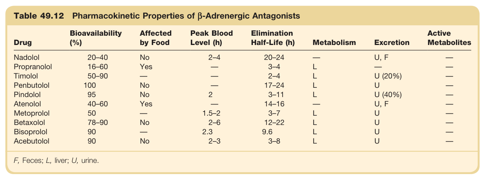

#### Table Data (CSV: [Table_49_12.csv](Table_49_12.csv))

```markdown
| Table Text (OCR) |
| :--- |
| Table 49.12 Pharmacokinetic Properties of β-Adrenergic Antagonists Drug  Bioavailability (%)  Affected by Food  Peak Blood Level (h)  Elimination Half-Life (h)  Metabolism  Excretion  Active Metabolites    Nadolol  20-40  No  2-4  20-24  —  U, F  —    Propranolol  16-60  Yes  —  3-4  L  —  —    Timolol  50-90  —  —  2-4  L  U (20%)  —    Penbutolol  100  No  —  17-24  L  U  —    Pindolol  95  No  2  3-11  L  U (40%)  —    Atenolol  40-60  Yes  —  14-16  —  U, F  —    Metoprolol  50  —  1.5-2  3-7  L  U  —    Betaxolol  78-90  No  2-6  12-22  L  U  —    Bisoprolol  90  —  2.3  9.6  L  U  —    Acebutolol  90  No  2-3  3-8  L  U  — F, Feces; L, liver; U, urine. |
```

Table 49.12 Pharmacokinetic Properties of ẞ-Adrenergic Antagonists | Drug | Bioavailability (%) | Affected by Food | Peak Blood Level (h) | Elimination Half-Life (h) | Metabolism | Excretion | Active Metabolites | | ----------- | ------------------- | ---------------- | -------------------- | ------------------------- | ---------- | --------- | ------------------ | | Nadolol | 20-40 | No | 2-4 | 20-24 | — | U, F | — | | Propranolol | 16-60 | Yes | — | 3-4 | L | — | — | | Timolol | 50-90 | — | — | 2-4 | L | U (20%) | — | | Penbutolol | 100 | No | — | 17-24 | L | U | — | | Pindolol | 95 | No | 2 | 3-11 | L | U (40%) | — | | Atenolol | 40-60 | Yes | — | 14-16 | — | U, F | — | | Metoprolol | 50 | — | 1.5-2 | 3-7 | L | U | — | | Betaxolol | 78-90 | No | 2-6 | 12-22 | L | U | — | | Bisoprolol | 90 | — | 2.3 | 9.6 | L | U | — | | Acebutolol | 90 | No | 2-3 | 3-8 | L | U | — | F, Feces; L, liver; U, urine.

---

### Table_49_13

#### Table Image

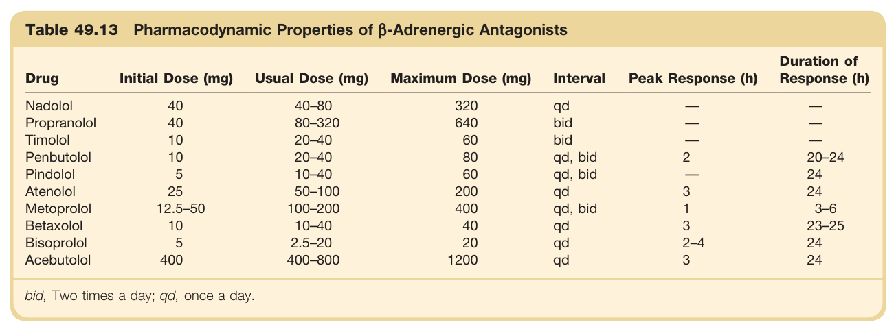

#### Table Data (CSV: [Table_49_13.csv](Table_49_13.csv))

```markdown
| Table Text (OCR) |
| :--- |
| Table 49.13 Pharmacodynamic Properties of β-Adrenergic Antagonists Drug  Initial Dose (mg)  Usual Dose (mg)  Maximum Dose (mg)  Interval  Peak Response (h)  Duration of Response (h)    Nadolol  40  40–80  320  qd  —  —    Propranolol  40  80–320  640  bid  —  —    Timolol  10  20–40  60  bid  —  —    Penbutolol  10  20–40  80  qd, bid  2  20–24    Pindolol  5  10–40  60  qd, bid  —  24    Atenolol  25  50–100  200  qd  3  24    Metoprolol  12.5–50  100–200  400  qd, bid  1  3–6    Betaxolol  10  10–40  40  qd  3  23–25    Bisoprolol  5  2.5–20  20  qd  2–4  24    Acebutolol  400  400–800  1200  qd  3  24 bid, Two times a day; qd, once a day. |
```

Table 49.13 Pharmacodynamic Properties of ẞ-Adrenergic Antagonists | Drug | Initial Dose (mg) | Usual Dose (mg) | Maximum Dose (mg) | Interval | Peak Response (h) | Duration of Response (h) | | ----------- | ----------------- | --------------- | ----------------- | -------- | ----------------- | ------------------------ | | Nadolol | 40 | 40-80 | 320 | qd | — | — | | Propranolol | 40 | 80-320 | 640 | bid | — | — | | Timolol | 10 | 20-40 | 60 | bid | — | — | | Penbutolol | 10 | 20-40 | 80 | qd, bid | 2 | 20-24 | | Pindolol | 5 | 10-40 | 60 | qd, bid | — | 24 | | Atenolol | 25 | 50-100 | 200 | qd | 3 | 24 | | Metoprolol | 12.5-50 | 100-200 | 400 | qd, bid | 1 | 3-6 | | Betaxolol | 10 | 10-40 | 40 | qd | 3 | 23-25 | | Bisoprolol | 5 | 2.5-20 | 20 | qd | 2-4 | 24 | | Acebutolol | 400 | 400-800 | 1200 | qd | 3 | 24 | bid, Two times a day; qd, once a day.

---

### Table_49_14

#### Table Image

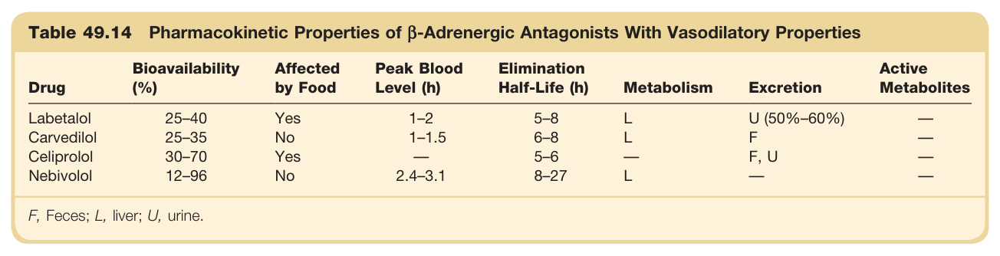

#### Table Data (CSV: [Table_49_14.csv](Table_49_14.csv))

```markdown
| Table Text (OCR) |
| :--- |
| Table 49.14 Pharmacokinetic Properties of β-Adrenergic Antagonists With Vasodilatory Properties Drug  Bioavailability (%)  Affected by Food  Peak Blood Level (h)  Elimination Half-Life (h)  Metabolism  Excretion  Active Metabolites    Labetalol  25–40  Yes  1–2  5–8  L  U (50%–60%)  —    Carvedilol  25–35  No  1–1.5  6–8  L  F  —    Celiprolol  30–70  Yes  —  5–6  —  F, U  —    Nebivolol  12–96  No  2.4–3.1  8–27  L  —  — F, Feces; L, liver; U, urine. |
```

Table 49.14 Pharmacokinetic Properties of ẞ-Adrenergic Antagonists With Vasodilatory Properties | Drug | Bioavailability (%) | Affected by Food | Peak Blood Level (h) | Elimination Half-Life (h) | Metabolism | Excretion | Active Metabolites | | ---------- | ------------------- | ---------------- | -------------------- | ------------------------- | ---------- | ----------- | ------------------ | | Labetalol | 25-40 | Yes | 1-2 | 5-8 | L | U (50%-60%) | — | | Carvedilol | 25-35 | No | 1-1.5 | 6-8 | L | F | — | | Celiprolol | 30-70 | Yes | — | 5-6 | L | F, U | — | | Nebivolol | 12-96 | No | 2.4-3.1 | 8-27 | L | — | — | F, Feces; L, liver; U, urine.

---

### Table_49_15

#### Table Image

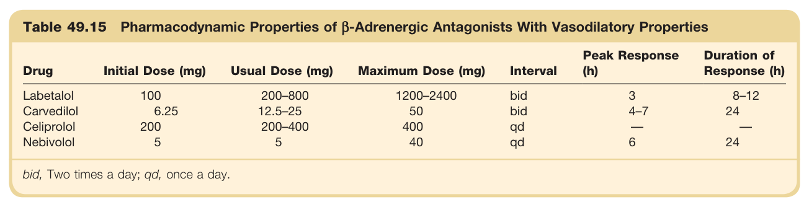

#### Table Data (CSV: [Table_49_15.csv](Table_49_15.csv))

```markdown
| Table Text (OCR) |
| :--- |
| Table 49.15 Pharmacodynamic Properties of β-Adrenergic Antagonists With Vasodilatory Properties Drug  Initial Dose (mg)  Usual Dose (mg)  Maximum Dose (mg)  Interval  Peak Response (h)  Duration of Response (h)    Labetalol  100  200–800  1200–2400  bid  3  8–12    Carvedilol  6.25  12.5–25  50  bid  4–7  24    Celiprolol  200  200–400  400  qd  —  —    Nebivolol  5  5  40  qd  6  24 bid, Two times a day; qd, once a day. |
```

Table 49.15 Pharmacodynamic Properties of ẞ-Adrenergic Antagonists With Vasodilatory Properties | Drug | Initial Dose (mg) | Usual Dose (mg) | Maximum Dose (mg) | Interval | Peak Response (h) | Duration of Response (h) | | ---------- | ----------------- | --------------- | ----------------- | -------- | ----------------- | ------------------------ | | Labetalol | 100 | 200-800 | 1200-2400 | bid | 3 | 8-12 | | Carvedilol | 6.25 | 12.5-25 | 50 | bid | 4-7 | 24 | | Celiprolol | 200 | 200-400 | 400 | qd | — | — | | Nebivolol | 5 | 5 | 40 | qd | 6 | 24 | bid, Two times a day; qd, once a day.

---

### Table_49_16

#### Table Image

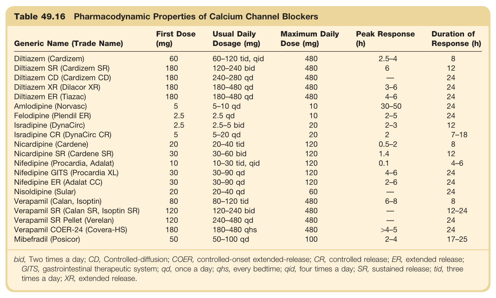

#### Table Data (CSV: [Table_49_16.csv](Table_49_16.csv))

```markdown
| Table Text (OCR) |
| :--- |
| Table 49.16 Pharmacodynamic Properties of Calcium Channel Blockers Generic Name (Trade Name)  First Dose (mg)  Usual Daily Dosage (mg)  Maximum Daily Dose (mg)  Peak Response (h)  Duration of Response (h)    Diltiazem (Cardizem)  60  60–120 tid, qid  480  2.5–4  8    Diltiazem SR (Cardizem SR)  180  120–240 bid  480  6  12    Diltiazem CD (Cardizem CD)  180  240–280 qd  480  —  24    Diltiazem XR (Dilacor XR)  180  180–480 qd  480  3–6  24    Diltiazem ER (Tiazac)  180  180–480 qd  480  4–6  24    Amlodipine (Norvasc)  5  5–10 qd  10  30–50  24    Felodipine (Plendil ER)  2.5  2.5 qd  10  2–5  24    Isradipine (DynaCirc)  2.5  2.5–5 bid  20  2–3  12    Isradipine CR (DynaCirc CR)  5  5–20 qd  20  2  7–18    Nicardipine (Cardene)  20  20–40 tid  120  0.5–2  8    Nicardipine SR (Cardene SR)  30  30–60 bid  120  1.4  12    Nifedipine (Procardia, Adalat)  10  10–30 tid, qid  120  0.1  4–6    Nifedipine GITS (Procardia XL)  30  30–90 qd  120  4–6  24    Nifedipine ER (Adalat CC)  30  30–90 qd  120  2–6  24    Nisoldipine (Sular)  20  20–40 qd  60  —  24    Verapamil (Calan, Isoptin)  80  80–120 tid  480  6–8  8    Verapamil SR (Calan SR, Isoptin SR)  120  120–240 bid  480  —  12–24    Verapamil SR Pellet (Verelan)  120  240–480 qd  480  —  24    Verapamil COER-24 (Covera-HS)  180  180–480 qhs  480  >4–5  24    Mibefradil (Posicor)  50  50–100 qd  100  2–4  17–25 bid, Two times a day; CD, Controlled-diffusion; COER, controlled-onset extended-release; CR, controlled release; ER, extended release; GITS, gastrointestinal therapeutic system; qd, once a day; qhs, every bedtime; qid, four times a day; SR, sustained release; tid, three times a day; XR, extended release. |
```

Table 49.16 Pharmacodynamic Properties of Calcium Channel Blockers | Generic Name (Trade Name) | First Dose (mg) | Usual Daily Dosage (mg) | Maximum Daily Dose (mg) | Peak Response (h) | Duration of Response (h) | | ----------------------------------- | --------------- | ----------------------- | ----------------------- | ----------------- | ------------------------ | | Diltiazem (Cardizem) | 60 | 60-120 tid, qid | 480 | 2.5-4 | 8 | | Diltiazem SR (Cardizem SR) | 180 | 120-240 bid | 480 | 6 | 12 | | Diltiazem CD (Cardizem CD) | 180 | 240-280 qd | 480 | — | 24 | | Diltiazem XR (Dilacor XR) | 180 | 180-480 qd | 480 | 3-6 | 24 | | Diltiazem ER (Tiazac) | 180 | 180-480 qd | 480 | 4-6 | 24 | | Amlodipine (Norvasc) | 5 | 5-10 qd | 10 | 30-50 | 24 | | Felodipine (Plendil ER) | 2.5 | 2.5 qd | 10 | 2-5 | 24 | | Isradipine (DynaCirc) | 2.5 | 2.5-5 bid | 20 | 2-3 | 12 | | Isradipine CR (DynaCirc CR) | 5 | 5-20 qd | 20 | 2 | 7-18 | | Nicardipine (Cardene) | 20 | 20-40 tid | 120 | 0.5-2 | 8 | | Nicardipine SR (Cardene SR) | 30 | 30-60 bid | 120 | 1.4 | 12 | | Nifedipine (Procardia, Adalat) | 10 | 10-30 tid, qid | 120 | 0.1 | 4-6 | | Nifedipine GITS (Procardia XL) | 30 | 30-90 qd | 120 | 4-6 | 24 | | Nifedipine ER (Adalat CC) | 30 | 30-90 qd | 120 | 2-6 | 24 | | Nisoldipine (Sular) | 20 | 20-40 qd | 60 | — | 24 | | Verapamil (Calan, Isoptin) | 80 | 80-120 tid | 480 | 6-8 | 8 | | Verapamil SR (Calan SR, Isoptin SR) | 120 | 120-240 bid | 480 | — | 12-24 | | Verapamil SR Pellet (Verelan) | 120 | 240-480 qd | 480 | — | 24 | | Verapamil COER-24 (Covera-HS) | 180 | 180-480 qhs | 480 | >4-5 | 24 | | Mibefradil (Posicor) | 50 | 50-100 qd | 100 | 2-4 | 17-25 | bid, Two times a day; CD, Controlled-diffusion; COER, controlled-onset extended-release; CR, controlled release; ER, extended release; GITS, gastrointestinal therapeutic system; qd, once a day; qhs, every bedtime; qid, four times a day; SR, sustained release; tid, three times a day; XR, extended release.

---

### Table_49_17

#### Table Image

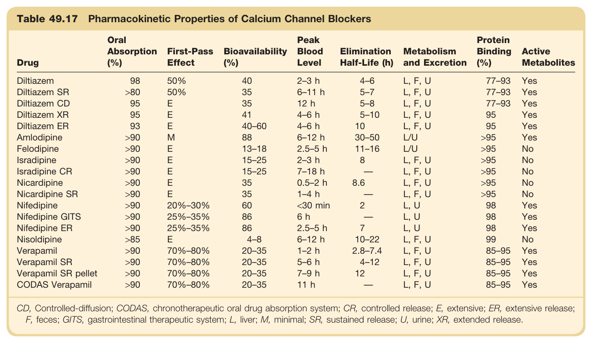

#### Table Data (CSV: [Table_49_17.csv](Table_49_17.csv))

```markdown
| Table Text (OCR) |
| :--- |
| Table 49.17 Pharmacokinetic Properties of Calcium Channel Blockers Drug  Oral Absorption (%)  First-Pass Effect  Bioavailability (%)  Peak Blood Level  Elimination Half-Life (h)  Metabolism and Excretion  Protein Binding (%)  Active Metabolites    Diltiazem  98  50%  40  2-3 h  4-6  L, F, U  77-93  Yes    Diltiazem SR  >80  50%  35  6-11 h  5-7  L, F, U  77-93  Yes    Diltiazem CD  95  E  35  12 h  5-8  L, F, U  77-93  Yes    Diltiazem XR  95  E  41  4-6 h  5-10  L, F, U  95  Yes    Diltiazem ER  93  E  40-60  4-6 h  10  L, F, U  95  Yes    Amlodipine  >90  M  88  6-12 h  30-50  L/U  >95  Yes    Felodipine  >90  E  13-18  2.5-5 h  11-16  L/U  >95  No    Isradipine  >90  E  15-25  2-3 h  8  L, F, U  >95  No    Isradipine CR  >90  E  15-25  7-18 h  —  L, F, U  >95  No    Nicardipine  >90  E  35  0.5-2 h  8.6  L, F, U  >95  No    Nicardipine SR  >90  E  35  1-4 h  —  L, F, U  >95  No    Nifedipine  >90  20%-30%  60  <30 min  2  L, U  98  Yes    Nifedipine GITS  >90  25%-35%  86  6 h  —  L, U  98  Yes    Nifedipine ER  >90  25%-35%  86  2.5-5 h  7  L, U  98  Yes    Nisoldipine  >85  E  4-8  6-12 h  10-22  L, F, U  99  No    Verapamil  >90  70%-80%  20-35  1-2 h  2.8-7.4  L, F, U  85-95  Yes    Verapamil SR  >90  70%-80%  20-35  5-6 h  4-12  L, F, U  85-95  Yes    Verapamil SR pellet  >90  70%-80%  20-35  7-9 h  12  L, F, U  85-95  Yes    CODAS Verapamil  >90  70%-80%  20-35  11 h  —  L, F, U  85-95  Yes CD, Controlled-diffusion; CODAS, chronotherapeutic oral drug absorption system; CR, controlled release; E, extensive; ER, extensive release; F, feces; GITS, gastrointestinal therapeutic system; L, liver; M, minimal; SR, sustained release; U, urine; XR, extended release. |
```

Table 49.17 Pharmacokinetic Properties of Calcium Channel Blockers | Drug | Oral Absorption (%) | First-Pass Effect | Bioavailability (%) | Peak Blood Level | Elimination Half-Life (h) | Metabolism and Excretion | Protein Binding (%) | Active Metabolites | | ------------------- | ------------------- | ----------------- | ------------------- | ---------------- | ------------------------- | ------------------------ | ------------------- | ------------------ | | Diltiazem | 98 | 50% | 40 | 2-3 h | 4-6 | L, F, U | 77-93 | Yes | | Diltiazem SR | >80 | 50% | 35 | 6-11 h | 5-7 | L, F, U | 77-93 | Yes | | Diltiazem CD | 95 | E | 35 | 12 h | 5-8 | L, F, U | 77-93 | Yes | | Diltiazem XR | 95 | E | 41 | 4-6 h | 5-10 | L, F, U | 95 | Yes | | Diltiazem ER | 93 | E | 40-60 | 4-6 h | 10 | L, F, U | 95 | Yes | | Amlodipine | >90 | M | 88 | 6-12 h | 30-50 | L/U | >95 | Yes | | Felodipine | >90 | E | 13-18 | 2.5-5 h | 11-16 | L/U | >95 | No | | Isradipine | >90 | E | 15-25 | 2-3 h | 8 | L, F, U | >95 | No | | Isradipine CR | >90 | E | 15-25 | 7-18 h | — | L, F, U | >95 | No | | Nicardipine | >90 | E | 35 | 0.5-2 h | 8.6 | L, F, U | >95 | No | | Nicardipine SR | >90 | E | 35 | 1-4 h | — | L, F, U | >95 | No | | Nifedipine | >90 | 20%-30% | 60 | <30 min | 2 | L, U | 98 | Yes | | Nifedipine GITS | >90 | 25%-35% | 86 | 6 h | — | L, U | 98 | Yes | | Nifedipine ER | >90 | 25%-35% | 86 | 2.5-5 h | 7 | L, U | 98 | Yes | | Nisoldipine | >85 | E | 4-8 | 6-12 h | 10-22 | L, F, U | 99 | No | | Verapamil | >90 | 70%-80% | 20-35 | 1-2 h | 2.8-7.4 | L, F, U | 85-95 | Yes | | Verapamil SR | >90 | 70%-80% | 20-35 | 5-6 h | 4-12 | L, F, U | 85-95 | Yes | | Verapamil SR pellet | >90 | 70%-80% | 20-35 | 7-9 h | 12 | L, F, U | 85-95 | Yes | | CODAS Verapamil | >90 | 70%-80% | 20-35 | 11 h | --- | L, F, U | 85-95 | Yes | CD, Controlled-diffusion; CODAS, chronotherapeutic oral drug absorption system; CR, controlled release; E, extensive; ER, extensive release; F, feces; GITS, gastrointestinal therapeutic system; L, liver; M, minimal; SR, sustained release; U, urine; XR, extended release.

---

### Table_49_18

#### Table Image

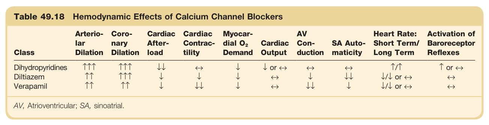

#### Table Data (CSV: [Table_49_18.csv](Table_49_18.csv))

```markdown
| Table Text (OCR) |
| :--- |
| Table 49.18 Hemodynamic Effects of Calcium Channel Blockers Class  Arterio-lar Dilation  Coro-nary Dilation  Cardiac After-load  Cardiac Contract- tility  Myocar-dial  O_2  Demand  Cardiac Output  AV Con- duction  SA Auto-maticity  Heart Rate: Short Term/ Long Term  Activation of Baroreceptor Reflexes    Dihydropyridines  ↑↑↑  ↑↑↑  ↓↓   \leftrightarrow   ↓  ↓ or  \leftrightarrow    \leftrightarrow    \leftrightarrow   ↑/↑  ↑ or  \leftrightarrow     Diltiazem  ↑↑  ↑↑↑  ↓  ↓  ↓   \leftrightarrow   ↓  ↓↓  ↓/↓ or  \leftrightarrow    \leftrightarrow     Verapamil  ↑↑  ↑↑  ↓  ↓↓  ↓   \leftrightarrow   ↓↓  ↓  ↓/↓ or  \leftrightarrow    \leftrightarrow AV, Atrioventricular; SA, sinoatrial. |
```

Table 49.18 Hemodynamic Effects of Calcium Channel Blockers | Class | Arterial Dilation | Coronary Dilation | Cardiac Afterload | Cardiac Contractility | Myocardial O2 Demand | Cardiac Output | AV Conduction | SA Automaticity | Heart Rate: Short Term/Long Term | Activation of Baroreceptor Reflexes | | ---------------- | ----------------- | ----------------- | ----------------- | --------------------- | -------------------- | -------------- | ------------- | --------------- | -------------------------------- | ----------------------------------- | | Dihydropyridines | ↑↑↑ | ↑↑↑ | ↓↓ | ↔ | ↓ | ↑ | ↔ | ↔ | ↑/↑ | ↑ or ↔ | | Diltiazem | ↑↑ | ↑↑↑ | ↓ | ↓ | ↓ | ↓ or ↔ | ↓ | ↓ | ↓↓ or ↔ | ↔ | | Verapamil | ↑↑ | ↑↑ | ↓ | ↓↓ | ↓ | ↔ | ↓↓ | ↓↓ | ↓↓ or ↔ | ↔ | AV, Atrioventricular; SA, sinoatrial.

---

### Table_49_19

#### Table Image

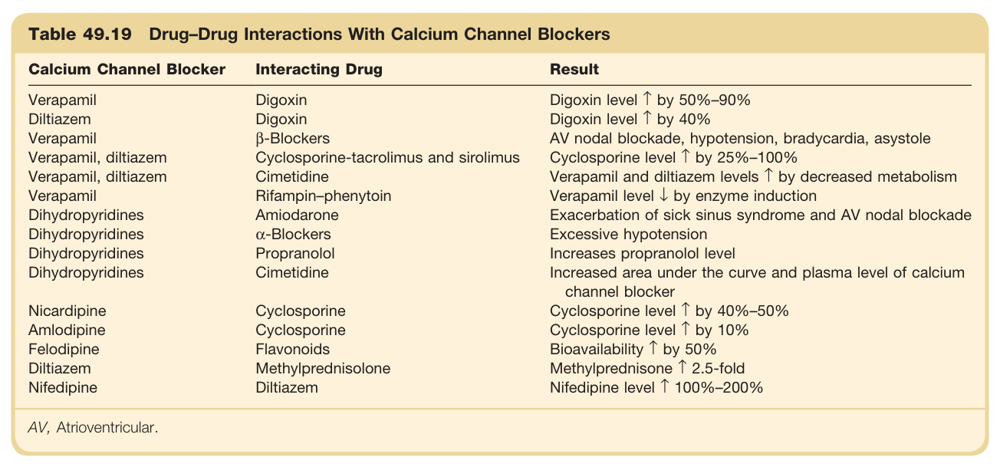

#### Table Data (CSV: [Table_49_19.csv](Table_49_19.csv))

```markdown
| Table Text (OCR) |
| :--- |
| Table 49.19 Drug–Drug Interactions With Calcium Channel Blockers Calcium Channel Blocker  Interacting Drug  Result    Verapamil  Digoxin  Digoxin level ↑ by 50%-90%    Diltiazem  Digoxin  Digoxin level ↑ by 40%    Verapamil  β-Blockers  AV nodal blockade, hypotension, bradycardia, asystole    Verapamil, diltiazem  Cyclosporine-tacrolimus and sirolimus  Cyclosporine level ↑ by 25%-100%    Verapamil, diltiazem  Cimetidine  Verapamil and diltiazem levels ↑ by decreased metabolism    Verapamil  Rifampin-phenytoin  Verapamil level ↓ by enzyme induction    Dihydropyridines  Amiodarone  Exacerbation of sick sinus syndrome and AV nodal blockade    Dihydropyridines  α-Blockers  Excessive hypotension    Dihydropyridines  Propranolol  Increases propranolol level    Dihydropyridines  Cimetidine  Increased area under the curve and plasma level of calcium channel blocker    Nicardipine  Cyclosporine  Cyclosporine level ↑ by 40%-50%    Amlodipine  Cyclosporine  Cyclosporine level ↑ by 10%    Felodipine  Flavonoids  Bioavailability ↑ by 50%    Diltiazem  Methylprednisolone  Methylprednisone ↑ 2.5-fold    Nifedipine  Diltiazem  Nifedipine level ↑ 100%-200% AV, Atrioventricular. |
```

Table 49.19 Drug-Drug Interactions With Calcium Channel Blockers | Calcium Channel Blocker | Interacting Drug | Result | | ----------------------- | ------------------------------------- | ------------------------------------------------------------ | | Verapamil | Digoxin | Digoxin level ↑ by 50%-90% | | Diltiazem | Digoxin | Digoxin level ↑ by 40% | | Verapamil | B-Blockers | AV nodal blockade, hypotension, bradycardia, asystole | | Verapamil, diltiazem | Cyclosporine-tacrolimus and sirolimus | Cyclosporine level ↑ by 25%-100% | | Verapamil, diltiazem | Cimetidine | Verapamil and diltiazem levels ↑ by decreased metabolism | | Verapamil | Rifampin-phenytoin | Verapamil level ↓ by enzyme induction | | Dihydropyridines | Amiodarone | Exacerbation of sick sinus syndrome and AV nodal blockade | | Dihydropyridines | α-Blockers | Excessive hypotension | | Dihydropyridines | Propranolol | Increases propranolol level | | Dihydropyridines | Cimetidine | Increased area under the curve and plasma level of calcium channel blocker | | Nicardipine | Cyclosporine | Cyclosporine level ↑ by 40%-50% | | Felodipine | Cyclosporine | Cyclosporine level ↑ by 10% | | Amlodipine | Flavonoids | Bioavailability ↑ by 50% | | Diltiazem | Methylprednisolone | Methylprednisone ↑ 2.5-fold | | Nifedipine | Diltiazem | Nifedipine level ↑ 100%-200% | AV, Atrioventricular.

---

### Table_49_20

#### Table Image

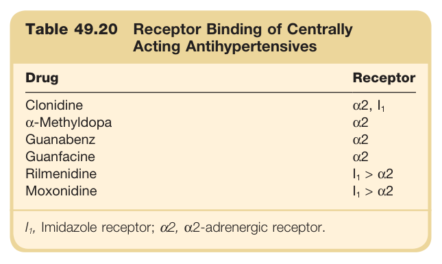

#### Table Data (CSV: [Table_49_20.csv](Table_49_20.csv))

```markdown
| Table Text (OCR) |
| :--- |
| Table 49.20 Receptor Binding of Centrally Acting Antihypertensives Drug  Receptor    Clonidine   \alpha 2, I_1      \alpha -Methyldopa   \alpha 2     Guanabenz   \alpha 2     Guanfacine   \alpha 2     Rilmenidine   I_1 > \alpha 2     Moxonidine   I_1 > \alpha 2 I<sub>1</sub>, Imidazole receptor; α2, α2-adrenergic receptor. |
```

Table 49.20 Receptor Binding of Centrally Acting Antihypertensives | Drug | Receptor | | ------------ | -------- | | Clonidine | α2, I1 | | α-Methyldopa | α2 | | Guanabenz | α2 | | Guanfacine | α2 | | Rilmenidine | I₁ > α2 | | Moxonidine | I₁ > α2 | I1, Imidazole receptor; α2, α2-adrenergic receptor.

---

### Table_49_21

#### Table Image

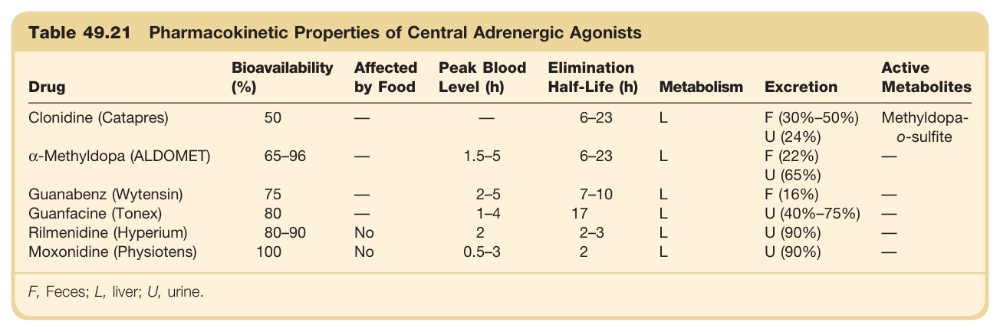

#### Table Data (CSV: [Table_49_21.csv](Table_49_21.csv))

```markdown
| Table Text (OCR) |
| :--- |
| Table 49.21 Pharmacokinetic Properties of Central Adrenergic Agonists Drug  Bioavailability (%)  Affected by Food  Peak Blood Level (h)  Elimination Half-Life (h)  Metabolism  Excretion  Active Metabolites    Clonidine (Catapres)  50  —  —  6–23  L  F (30%–50%)U (24%)  Methyldopa-o-sulfite    α-Methyldopa (ALDOMET)  65–96  —  1.5–5  6–23  L  F (22%)U (65%)  —    Guanabenz (Wytensin)  75  —  2–5  7–10  L  F (16%)  —    Guanfacine (Tonex)  80  —  1–4  17  L  U (40%–75%)  —    Rilmenidine (Hyperium)  80–90  No  2  2–3  L  U (90%)  —    Moxonidine (Physiotens)  100  No  0.5–3  2  L  U (90%)  — F, Feces; L, liver; U, urine. |
```

Table 49.21 Pharmacokinetic Properties of Central Adrenergic Agonists | Drug | Bioavailability (%) | Affected by Food | Peak Blood Level (h) | Elimination Half-Life (h) | Metabolism | Excretion | Active Metabolites | | ----------------------- | ------------------- | ---------------- | -------------------- | ------------------------- | ---------- | ------------------- | -------------------- | | Clonidine (Catapres) | 50 | — | — | 6-23 | L | F (30%-50%) U (24%) | — | | α-Methyldopa (ALDOMET) | 65-96 | — | 1.5-5 | 6-23 | L | F (22%) U (65%) | Methyldopa-o-sulfite | | Guanabenz (Wytensin) | 75 | — | 2-5 | 7-10 | L | F (16%) | — | | Guanfacine (Tonex) | 80 | — | 1-4 | 17 | L | U (40%-75%) | — | | Rilmenidine (Hyperium) | 80-90 | No | 2 | 2-3 | L | U (90%) | — | | Moxonidine (Physiotens) | 100 | No | 0.5-3 | 2 | L | U (90%) | — | F, Feces; L, liver; U, urine.

---

### Table_49_22

#### Table Image

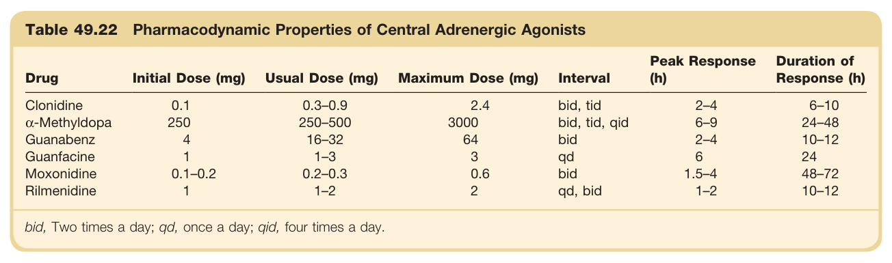

#### Table Data (CSV: [Table_49_22.csv](Table_49_22.csv))

```markdown
| Table Text (OCR) |
| :--- |
| Table 49.22 Pharmacodynamic Properties of Central Adrenergic Agonists Drug  Initial Dose (mg)  Usual Dose (mg)  Maximum Dose (mg)  Interval  Peak Response (h)  Duration of Response (h)    Clonidine  0.1  0.3–0.9  2.4  bid, tid  2–4  6–10    α-Methyldopa  250  250–500  3000  bid, tid, qid  6–9  24–48    Guanabenz  4  16–32  64  bid  2–4  10–12    Guanfacine  1  1–3  3  qd  6  24    Moxonidine  0.1–0.2  0.2–0.3  0.6  bid  1.5–4  48–72    Rilmenidine  1  1–2  2  qd, bid  1–2  10–12 bid, Two times a day; qd, once a day; qid, four times a day. |
```

Table 49.22 Pharmacodynamic Properties of Central Adrenergic Agonists | Drug | Initial Dose (mg) | Usual Dose (mg) | Maximum Dose (mg) | Interval | Peak Response (h) | Duration of Response (h) | | ------------ | ----------------- | --------------- | ----------------- | ------------- | ----------------- | ------------------------ | | Clonidine | 0.1 | 0.3-0.9 | 2.4 | bid, tid | 2-4 | 6-10 | | α-Methyldopa | 250 | 250-500 | 3000 | bid, tid, qid | 6-9 | 24-48 | | Guanabenz | 4 | 16-32 | 64 | bid | 2-4 | 10-12 | | Guanfacine | 1 | 1-3 | 3 | qd | 6 | 24 | | Moxonidine | 0.1-0.2 | 0.2-0.3 | 0.6 | bid | 1.5-4 | 48-72 | | Rilmenidine | 1 | 1-2 | 2 | qd, bid | 1-2 | 10-12 | bid, Two times a day; qd, once a day; qid, four times a day.

---

### Table_49_23

#### Table Image

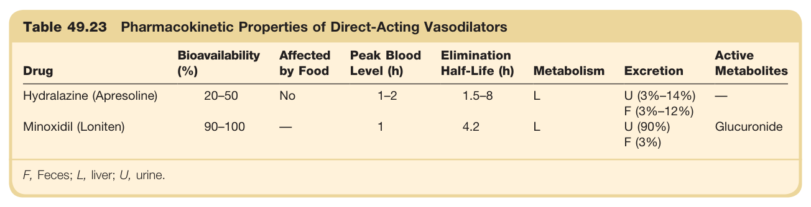

#### Table Data (CSV: [Table_49_23.csv](Table_49_23.csv))

```markdown
| Table Text (OCR) |
| :--- |
| Table 49.23 Pharmacokinetic Properties of Direct-Acting Vasodilators Drug  Bioavailability (%)  Affected by Food  Peak Blood Level (h)  Elimination Half-Life (h)  Metabolism  Excretion  Active Metabolites    Hydralazine (Apresoline)  20–50  No  1–2  1.5–8  L  U (3%–14%)F (3%–12%)  —    Minoxidil (Loniten)  90–100  —  1  4.2  L  U (90%)F (3%)  Glucuronide F, Feces; L, liver; U, urine. |
```

Table 49.23 Pharmacokinetic Properties of Direct-Acting Vasodilators | Drug | Bioavailability (%) | Affected by Food | Peak Blood Level (h) | Elimination Half-Life (h) | Metabolism | Excretion | Active Metabolites | | ------------------------ | ------------------- | ---------------- | -------------------- | ------------------------- | ---------- | --------------------- | ------------------ | | Hydralazine (Apresoline) | 20-50 | No | 1-2 | 1.5-8 | L | U (3%-14%) F (3%-12%) | — | | Minoxidil (Loniten) | 90-100 | — | 1 | 4.2 | L | U (90%) F (3%) | Glucuronide | F, Feces; L, liver; U, urine.

---

### Table_49_24

#### Table Image

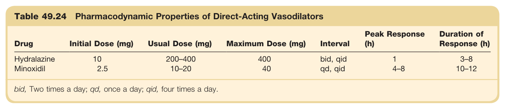

#### Table Data (CSV: [Table_49_24.csv](Table_49_24.csv))

```markdown
| Table Text (OCR) |
| :--- |
| Table 49.24 Pharmacodynamic Properties of Direct-Acting Vasodilators Drug  Initial Dose (mg)  Usual Dose (mg)  Maximum Dose (mg)  Interval  Peak Response (h)  Duration of Response (h)    Hydralazine  10  200–400  400  bid, qid  1  3–8    Minoxidil  2.5  10–20  40  qd, qid  4–8  10–12 bid, Two times a day; qd, once a day; qid, four times a day. |
```

Table 49.24 Pharmacodynamic Properties of Direct-Acting Vasodilators | Drug | Initial Dose (mg) | Usual Dose (mg) | Maximum Dose (mg) | Interval | Peak Response (h) | Duration of Response (h) | | ----------- | ----------------- | --------------- | ----------------- | -------- | ----------------- | ------------------------ | | Hydralazine | 10 | 200-400 | 400 | bid, qid | 1 | 3-8 | | Minoxidil | 2.5 | 10-20 | 40 | qd, qid | 4-8 | 10-12 | bid, Two times a day; qd, once a day; qid, four times a day.

---

### Table_49_25

#### Table Image

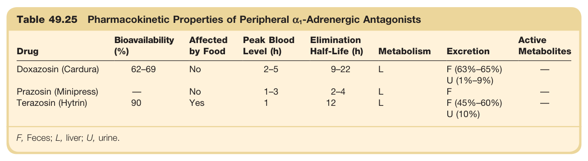

#### Table Data (CSV: [Table_49_25.csv](Table_49_25.csv))

```markdown
| Table Text (OCR) |
| :--- |
| Table 49.25 Pharmacokinetic Properties of Peripheral α -Adrenergic Antagonists Drug  Bioavailability (%)  Affected by Food  Peak Blood Level (h)  Elimination Half-Life (h)  Metabolism  Excretion  Active Metabolites    Doxazosin (Cardura)  62–69  No  2–5  9–22  L  F (63%–65%)U (1%–9%)  —    Prazosin (Minipress)  —  No  1–3  2–4  L  F  —    Terazosin (Hytrin)  90  Yes  1  12  L  F (45%–60%)U (10%)  — F, Feces; L, liver; U, urine. |
```

Table 49.25 Pharmacokinetic Properties of Peripheral α₁-Adrenergic Antagonists | Drug | Bioavailability (%) | Affected by Food | Peak Blood Level (h) | Elimination Half-Life (h) | Metabolism | Excretion | Active Metabolites | | -------------------- | ------------------- | ---------------- | -------------------- | ------------------------- | ---------- | --------------------- | ------------------ | | Doxazosin (Cardura) | 62-69 | No | 2-5 | 9-22 | L | F (63%-65%) U (1%-9%) | — | | Prazosin (Minipress) | — | No | 1-3 | 2-4 | L | F | — | | Terazosin (Hytrin) | 90 | Yes | 1 | 12 | L | F (45%-60%) U (10%) | — | F, Feces; L, liver; U, urine.

---

### Table_49_26

#### Table Image

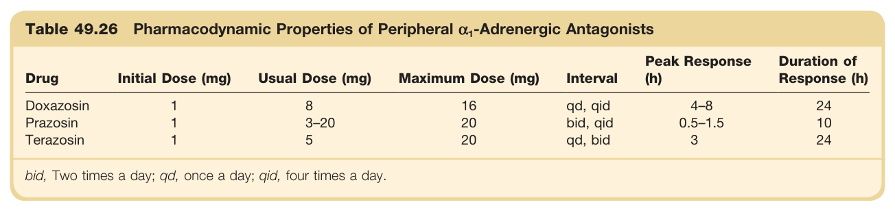

#### Table Data (CSV: [Table_49_26.csv](Table_49_26.csv))

```markdown
| Table Text (OCR) |
| :--- |
| Table 49.26 Pharmacodynamic Properties of Peripheral α -Adrenergic Antagonists Drug  Initial Dose (mg)  Usual Dose (mg)  Maximum Dose (mg)  Interval  Peak Response (h)  Duration of Response (h)    Doxazosin  1  8  16  qd, qid  4–8  24    Prazosin  1  3–20  20  bid, qid  0.5–1.5  10    Terazosin  1  5  20  qd, bid  3  24 bid, Two times a day; qd, once a day; qid, four times a day. |
```

Table 49.26 Pharmacodynamic Properties of Peripheral α₁-Adrenergic Antagonists | Drug | Initial Dose (mg) | Usual Dose (mg) | Maximum Dose (mg) | Interval | Peak Response (h) | Duration of Response (h) | | --------- | ----------------- | --------------- | ----------------- | -------- | ----------------- | ------------------------ | | Doxazosin | 1 | 3 | 16 | qd, qid | 4-8 | 24 | | Prazosin | 1 | 3-20 | 20 | bid, qid | 0.5-1.5 | 10 | | Terazosin | 1 | 5 | 20 | qd, bid | 3 | 24 | bid, Two times a day; qd, once a day; qid, four times a day.

---

### Table_49_27

#### Table Image

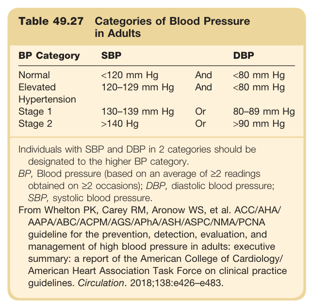

#### Table Data (CSV: [Table_49_27.csv](Table_49_27.csv))

```markdown
| Table Text (OCR) |
| :--- |
| Table 49.27 Categories of Blood Pressure in Adults BP Category  SBP    DBP    Normal  <120 mm Hg  And  <80 mm Hg    Elevated Hypertension  120–129 mm Hg  And  <80 mm Hg    Stage 1  130–139 mm Hg  Or  80–89 mm Hg    Stage 2  >140 Hg  Or  >90 mm Hg |
```

Table 49.27 Categories of Blood Pressure in Adults | BP Category | SBP | | DBP | | ------------ | ------------- | ---- | ----------- | | Normal | <120 mm Hg | And | <80 mm Hg | | Elevated | 120-129 mm Hg | And | <80 mm Hg | | Hypertension | | | | | Stage 1 | 130-139 mm Hg | Or | 80-89 mm Hg | | Stage 2 | >140 Hg | Or | >90 mm Hg | Individuals with SBP and DBP in 2 categories should be designated to the higher BP category. BP, Blood pressure (based on an average of ≥2 readings obtained on 22 occasions); DBP, diastolic blood pressure; SBP, systolic blood pressure. From Whelton PK, Carey RM, Aronow WS, et al. ACC/AHA/AAPA/ABC/ACPM/AGS/APhA/ASH/ASPC/NMA/PCNA guideline for the prevention, detection, evaluation, and management of high blood pressure in adults: executive summary: a report of the American College of Cardiology/American Heart Association Task Force on clinical practice guidelines. Circulation. 2018;138:e426-e483.

---

### Table_49_28

#### Table Image

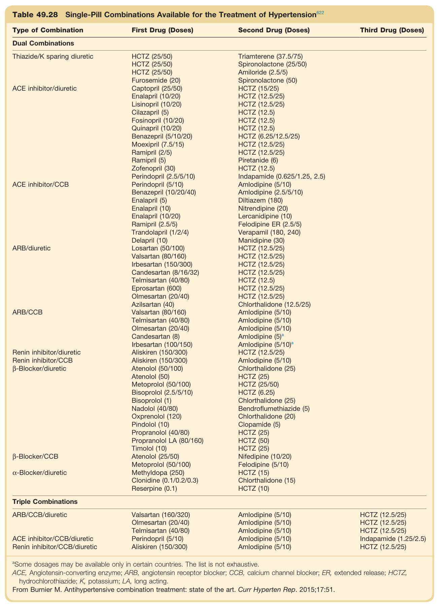

#### Table Data (CSV: [Table_49_28.csv](Table_49_28.csv))

```markdown
| Table Text (OCR) |
| :--- |
| Table 49.28 Single-Pill Combinations Available for the Treatment of Hypertension<sup>622</sup> Type of Combination  First Drug (Doses)  Second Drug (Doses)  Third Drug (Doses)    Dual Combinations    Thiazide/K sparing diuretic  HCTZ (25/50)  Triamterene (37.5/75)      HCTZ (25/50)  Spironolactone (25/50)      HCTZ (25/50)  Amiloride (2.5/5)      Furosemide (20)  Spironolactone (50)      ACE inhibitor/diuretic  Captopril (25/50)  HCTZ (15/25)      Enalapril (10/20)  HCTZ (12.5/25)      Lisinopril (10/20)  HCTZ (12.5/25)      Cilazapril (5)  HCTZ (12.5)      Fosinopril (10/20)  HCTZ (12.5)      Quinapril (10/20)  HCTZ (12.5)      Benazepril (5/10/20)  HCTZ (6.25/12.5/25)      Moexipril (7.5/15)  HCTZ (12.5/25)      Ramipril (2/5)  HCTZ (12.5/25)      Ramipril (5)  Piretanide (6)      Zofenopril (30)  HCTZ (12.5)      Perindopril (2.5/5/10)  Indapamide (0.625/1.25, 2.5)      ACE inhibitor/CCB  Perindopril (5/10)  Amlodipine (5/10)      Benazepril (10/20/40)  Amlodipine (2.5/5/10)      Enalapril (5)  Diltiazem (180)      Enalapril (10)  Nitrendipine (20)      Enalapril (10/20)  Lercanidipine (10)      Ramipril (2.5/5)  Felodipine ER (2.5/5)      Trandolapril (1/2/4)  Verapamil (180, 240)      Delapril (10)  Manidipine (30)      ARB/diuretic  Losartan (50/100)  HCTZ (12.5/25)      Valsartan (80/160)  HCTZ (12.5/25)      Irbesartan (150/300)  HCTZ (12.5/25)      Candesartan (8/16/32)  HCTZ (12.5/25)      Telmisartan (40/80)  HCTZ (12.5)      Eprosartan (600)  HCTZ (12.5/25)      Olmesartan (20/40)  HCTZ (12.5/25)      Azilsartan (40)  Chlorthalidone (12.5/25)      ARB/CCB  Valsartan (80/160)  Amlodipine (5/10)      Telmisartan (40/80)  Amlodipine (5/10)      Olmesartan (20/40)  Amlodipine (5/10)      Candesartan (8)  Amlodipine (5) ^a       Irbesartan (100/150)  Amlodipine (5/10) ^a       Renin inhibitor/diuretic  Aliskiren (150/300)  HCTZ (12.5/25)      Renin inhibitor/CCB  Aliskiren (150/300)  Amlodipine (5/10)      β-Blocker/diuretic  Atenolol (50/100)  Chlorthalidone (25)      Atenolol (50)  HCTZ (25)      Metoprolol (50/100)  HCTZ (25/50)      Bisoprolol (2.5/5/10)  HCTZ (6.25)      Bisoprolol (1)  Chlorthalidone (25)      Nadolol (40/80)  Bendroflumethiazide (5)      Oxprenolol (120)  Chlorthalidone (20)      Pindolol (10)  Clopamide (5)      Propranolol (40/80)  HCTZ (25)      Propranolol LA (80/160)  HCTZ (50)      Timolol (10)  HCTZ (25)      β-Blocker/CCB  Atenolol (25/50)  Nifedipine (10/20)      Metoprolol (50/100)  Felodipine (5/10)      α-Blocker/diuretic  Methyldopa (250)  HCTZ (15)      Clonidine (0.1/0.2/0.3)  Chlorthalidone (15)      Reserpine (0.1)  HCTZ (10)      Triple Combinations    ARB/CCB/diuretic  Valsartan (160/320)  Amlodipine (5/10)  HCTZ (12.5/25)    Olmesartan (20/40)  Amlodipine (5/10)  HCTZ (12.5/25)    Telmisartan (40/80)  Amlodipine (5/10)  HCTZ (12.5/25)    ACE inhibitor/CCB/diuretic  Perindopril (5/10)  Amlodipine (5/10)  Indapamide (1.25/2.5)    Renin inhibitor/CCB/diuretic  Aliskiren (150/300)  Amlodipine (5/10)  HCTZ (12.5/25) <sup>a</sup>Some dosages may be available only in certain countries. The list is not exhaustive. ACE, Angiotensin-converting enzyme; ARB, angiotensin receptor blocker; CCB, calcium channel blocker; ER, extended release; HCTZ, hydrochlorothiazide; K, potassium; LA, long acting. From Burnier M. Antihypertensive combination treatment: state of the art. Curr Hyperten Rep. 2015;17:51. |
```

Table 49.28 Single-Pill Combinations Available for the Treatment of Hypertension This table details numerous dual and triple combination therapies available in single-pill formulations for hypertension, categorized by the types of drugs combined (e.g., ACE inhibitor/diuretic, ARB/CCB, Triple Combinations). It lists the specific drugs and their available dosages within each combination.

---

### Table_49_29

#### Table Image

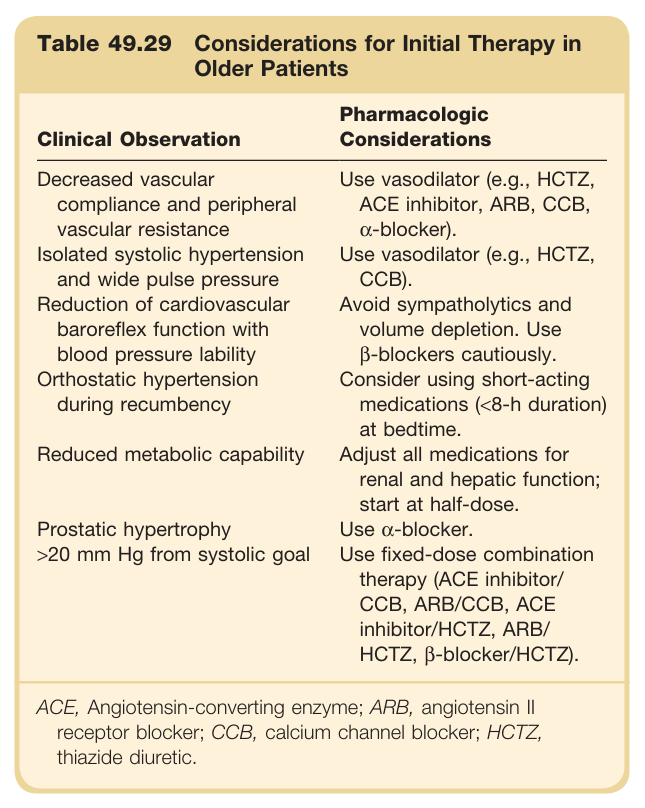

#### Table Data (CSV: [Table_49_29.csv](Table_49_29.csv))

```markdown
| Table Text (OCR) |
| :--- |
| Table 49.29 Considerations for Initial Therapy in Older Patients Clinical Observation  Pharmacologic Considerations    Decreased vascular compliance and peripheral vascular resistance  Use vasodilator (e.g., HCTZ, ACE inhibitor, ARB, CCB,  \alpha -blocker).    Isolated systolic hypertension and wide pulse pressure  Use vasodilator (e.g., HCTZ, CCB).    Reduction of cardiovascular baroreflex function with blood pressure lability  Avoid sympatholytics and volume depletion. Use  \beta -blockers cautiously.    Orthostatic hypertension during recumbency  Consider using short-acting medications (<8-h duration) at bedtime.    Reduced metabolic capability  Adjust all medications for renal and hepatic function; start at half-dose.    Prostatic hypertrophy >20 mm Hg from systolic goal  Use  \alpha -blocker.Use fixed-dose combination therapy (ACE inhibitor/ CCB, ARB/CCB, ACE inhibitor/HCTZ, ARB/ HCTZ,  \beta -blocker/HCTZ). ACE, Angiotensin-converting enzyme; ARB, angiotensin II receptor blocker; CCB, calcium channel blocker; HCTZ, thiazide diuretic. |
```

Table 49.29 Considerations for Initial Therapy in Older Patients | Clinical Observation | Pharmacologic Considerations | | ------------------------------------------------------------ | ------------------------------------------------------------ | | Decreased vascular compliance and peripheral vascular resistance | Use vasodilator (e.g., HCTZ, ACE inhibitor, ARB, CCB, a-blocker). | | Isolated systolic hypertension and wide pulse pressure | Use vasodilator (e.g., HCTZ, CCB). | | Reduction of cardiovascular baroreflex function with blood pressure lability | Avoid sympatholytics and volume depletion. Use ẞ-blockers cautiously. | | Orthostatic hypertension during recumbency | Consider using short-acting medications (<8-h duration) at bedtime. | | Reduced metabolic capability | Adjust all medications for renal and hepatic function; start at half-dose. | | Prostatic hypertrophy | Use a-blocker. | | >20 mm Hg from systolic goal | Use fixed-dose combination therapy (ACE inhibitor/CCB, ARB/CCB, ACE inhibitor/HCTZ, ARB/HCTZ, ẞ-blocker/HCTZ). | ACE, Angiotensin-converting enzyme; ARB, angiotensin II receptor blocker; CCB, calcium channel blocker; HCTZ, thiazide diuretic.

---

### Table_49_30

#### Table Image

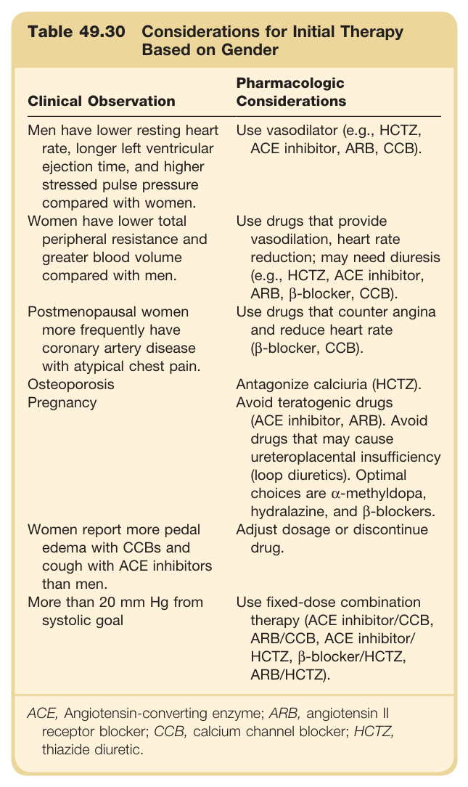

#### Table Data (CSV: [Table_49_30.csv](Table_49_30.csv))

```markdown
| Table Text (OCR) |
| :--- |
| Table 49.30 Considerations for Initial Therapy Based on Gender Clinical Observation  Pharmacologic Considerations    Men have lower resting heart rate, longer left ventricular ejection time, and higher stressed pulse pressure compared with women.  Use vasodilator (e.g., HCTZ, ACE inhibitor, ARB, CCB).    Women have lower total peripheral resistance and greater blood volume compared with men.  Use drugs that provide vasodilation, heart rate reduction; may need diuresis (e.g., HCTZ, ACE inhibitor, ARB, β-blocker, CCB).    Postmenopausal women more frequently have coronary artery disease with atypical chest pain.  Use drugs that counter angina and reduce heart rate (β-blocker, CCB).    Osteoporosis  Antagonize calciuria (HCTZ).    Pregnancy  Avoid teratogenic drugs (ACE inhibitor, ARB). Avoid drugs that may cause ureteroplacental insufficiency (loop diuretics). Optimal choices are α-methyldopa, hydralazine, and β-blockers.    Women report more pedal edema with CCBs and cough with ACE inhibitors than men.  Adjust dosage or discontinue drug.    More than 20 mm Hg from systolic goal  Use fixed-dose combination therapy (ACE inhibitor/CCB, ARB/CCB, ACE inhibitor/ HCTZ, β-blocker/HCTZ, ARB/HCTZ). ACE, Angiotensin-converting enzyme; ARB, angiotensin II receptor blocker; CCB, calcium channel blocker; HCTZ, thiazide diuretic. |
```

Table 49.30 Considerations for Initial Therapy Based on Gender | Clinical Observation | Pharmacologic Considerations | | ------------------------------------------------------------ | ------------------------------------------------------------ | | Men have lower resting heart rate, longer left ventricular ejection time, and higher stressed pulse pressure compared with women. | Use vasodilator (e.g., HCTZ, ACE inhibitor, ARB, CCB). | | Women have lower total peripheral resistance and greater blood volume compared with men. | Use drugs that provide vasodilation, heart rate reduction; may need diuresis (e.g., HCTZ, ACE inhibitor, ARB, ẞ-blocker, CCB). | | Postmenopausal women more frequently have coronary artery disease with atypical chest pain. | Use drugs that counter angina and reduce heart rate (B-blocker, CCB). | | Osteoporosis | Antagonize calciuria (HCTZ). | | Pregnancy | Avoid teratogenic drugs (ACE inhibitor, ARB). Avoid drugs that may cause ureteroplacental insufficiency (loop diuretics). Optimal choices are a-methyldopa, hydralazine, and ẞ-blockers. | | Women report more pedal edema with CCBs and cough with ACE inhibitors than men. | Adjust dosage or discontinue drug. | | More than 20 mm Hg from systolic goal | Use fixed-dose combination therapy (ACE inhibitor/CCB, ARB/CCB, ACE inhibitor/ HCTZ, ẞ-blocker/HCTZ, ARB/HCTZ). | ACE, Angiotensin-converting enzyme; ARB, angiotensin II receptor blocker; CCB, calcium channel blocker; HCTZ, thiazide diuretic.

---

### Table_49_31

#### Table Image

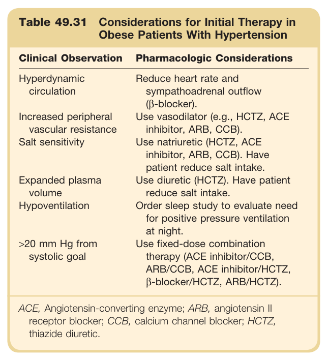

#### Table Data (CSV: [Table_49_31.csv](Table_49_31.csv))

```markdown
| Table Text (OCR) |
| :--- |
| Table 49.31 Considerations for Initial Therapy in Obese Patients With Hypertension Clinical Observation  Pharmacologic Considerations    Hyperdynamic circulation  Reduce heart rate and sympathoadrenal outflow (β-blocker).    Increased peripheral vascular resistance  Use vasodilator (e.g., HCTZ, ACE inhibitor, ARB, CCB).    Salt sensitivity  Use natriuretic (HCTZ, ACE inhibitor, ARB, CCB). Have patient reduce salt intake.    Expanded plasma volume  Use diuretic (HCTZ). Have patient reduce salt intake.    Hypoventilation  Order sleep study to evaluate need for positive pressure ventilation at night.    >20 mm Hg from systolic goal  Use fixed-dose combination therapy (ACE inhibitor/CCB, ARB/CCB, ACE inhibitor/HCTZ, β-blocker/HCTZ, ARB/HCTZ). ACE, Angiotensin-converting enzyme; ARB, angiotensin II receptor blocker; CCB, calcium channel blocker; HCTZ, thiazide diuretic. |
```

Table 49.31 Considerations for Initial Therapy in Obese Patients With Hypertension | Clinical Observation | Pharmacologic Considerations | | ---------------------------------------- | ------------------------------------------------------------ | | Hyperdynamic circulation | Reduce heart rate and sympathoadrenal outflow (B-blocker). | | Increased peripheral vascular resistance | Use vasodilator (e.g., HCTZ, ACE inhibitor, ARB, CCB). | | Salt sensitivity | Use natriuretic (HCTZ, ACE inhibitor, ARB, CCB). Have patient reduce salt intake. | | Expanded plasma volume | Use diuretic (HCTZ). Have patient reduce salt intake. | | Hypoventilation | Order sleep study to evaluate need for positive pressure ventilation at night. | | >20 mm Hg from systolic goal | Use fixed-dose combination therapy (ACE inhibitor/CCB, ARB/CCB, ACE inhibitor/HCTZ, ẞ-blocker/HCTZ, ARB/HCTZ). | ACE, Angiotensin-converting enzyme; ARB, angiotensin II receptor blocker; CCB, calcium channel blocker; HCTZ, thiazide diuretic.

---

### Table_49_32

#### Table Image

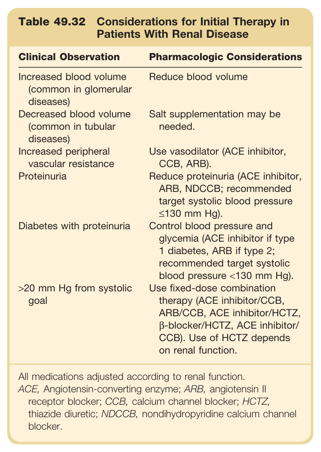

#### Table Data (CSV: [Table_49_32.csv](Table_49_32.csv))

```markdown
| Table Text (OCR) |
| :--- |
| Table 49.32 Considerations for Initial Therapy in Patients With Renal Disease Clinical Observation  Pharmacologic Considerations    Increased blood volume (common in glomerular diseases)  Reduce blood volume    Decreased blood volume (common in tubular diseases)  Salt supplementation may be needed.    Increased peripheral vascular resistance  Use vasodilator (ACE inhibitor, CCB, ARB).    Proteinuria  Reduce proteinuria (ACE inhibitor, ARB, NDCCB; recommended target systolic blood pressure ≤130 mm Hg).    Diabetes with proteinuria  Control blood pressure and glycemia (ACE inhibitor if type 1 diabetes, ARB if type 2; recommended target systolic blood pressure <130 mm Hg).    >20 mm Hg from systolic goal  Use fixed-dose combination therapy (ACE inhibitor/CCB, ARB/CCB, ACE inhibitor/HCTZ, β-blocker/HCTZ, ACE inhibitor/CCB). Use of HCTZ depends on renal function. All medications adjusted according to renal function. ACE, Angiotensin-converting enzyme; ARB, angiotensin II receptor blocker; CCB, calcium channel blocker; HCTZ thiazide diuretic; NDCCB, nondihydropyridine calcium channel blocker. |
```

Table 49.32 Considerations for Initial Therapy in Patients With Renal Disease | Clinical Observation | Pharmacologic Considerations | | ------------------------------------------------------ | ------------------------------------------------------------ | | Increased blood volume (common in glomerular diseases) | Reduce blood volume | | Decreased blood volume (common in tubular diseases) | Salt supplementation may be needed. | | Increased peripheral vascular resistance | Use vasodilator (ACE inhibitor, CCB, ARB). | | Proteinuria | Reduce proteinuria (ACE inhibitor, ARB, NDCCB; recommended target systolic blood pressure ≤130 mm Hg). | | Diabetes with proteinuria | Control blood pressure and glycemia (ACE inhibitor if type 1 diabetes, ARB if type 2; recommended target systolic blood pressure <130 mm Hg). | | >20 mm Hg from systolic goal | Use fixed-dose combination therapy (ACE inhibitor/CCB, ARB/CCB, ACE inhibitor/HCTZ, ẞ-blocker/HCTZ, ACE inhibitor/ CCB). Use of HCTZ depends on renal function. | All medications adjusted according to renal function. ACE, Angiotensin-converting enzyme; ARB, angiotensin II receptor blocker; CCB, calcium channel blocker; HCTZ, thiazide diuretic; NDCCB, nondihydropyridine calcium channel blocker.

---

### Table_49_33

#### Table Image

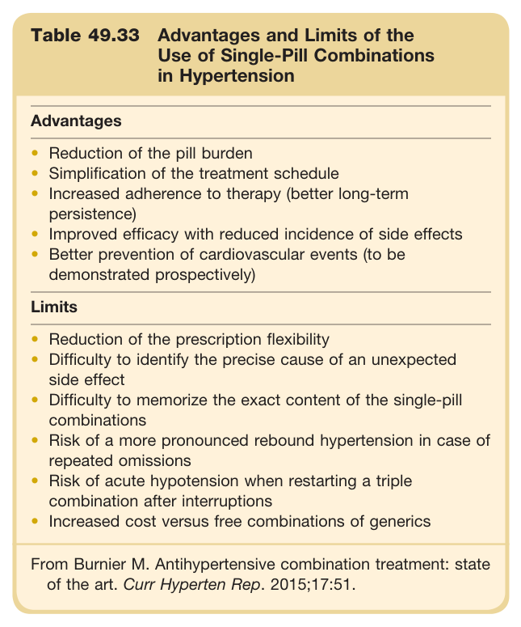

#### Table Data (CSV: [Table_49_33.csv](Table_49_33.csv))

```markdown
| Table Text (OCR) |
| :--- |
| Table 49.33 Advantages and Limits of the Use of Single-Pill Combinations in Hypertension • Reduction of the pill burden • Simplification of the treatment schedule • Increased adherence to therapy (better long-term persistence) • Improved efficacy with reduced incidence of side effects Better prevention of cardiovascular events (to be demonstrated prospectively) • Reduction of the prescription flexibility Difficulty to identify the precise cause of an unexpected side effect Difficulty to memorize the exact content of the single-pill combinations Risk of a more pronounced rebound hypertension in case of repeated omissions • Risk of acute hypotension when restarting a triple combination after interruptions • Increased cost versus free combinations of generics From Burnier M. Antihypertensive combination treatment: state of the art. Curr Hyperten Rep. 2015;17:51. |
```

Table 49.33 Advantages and Limits of the Use of Single-Pill Combinations in Hypertension **Advantages** * Reduction of the pill burden * Simplification of the treatment schedule * Increased adherence to therapy (better long-term persistence) * Improved efficacy with reduced incidence of side effects * Better prevention of cardiovascular events (to be demonstrated prospectively) **Limits** * Reduction of the prescription flexibility * Difficulty to identify the precise cause of an unexpected side effect * Difficulty to memorize the exact content of the single-pill combinations * Risk of a more pronounced rebound hypertension in case of repeated omissions * Risk of acute hypotension when restarting a triple combination after interruptions * Increased cost versus free combinations of generics From Burnier M. Antihypertensive combination treatment: state of the art. Curr Hyperten Rep. 2015;17:51.

---

### Table_49_34

#### Table Image

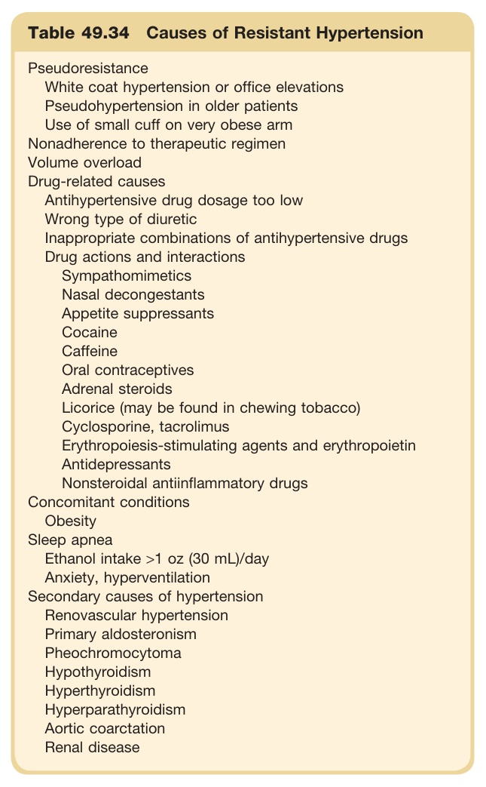

#### Table Data (CSV: [Table_49_34.csv](Table_49_34.csv))

```markdown
| Table Text (OCR) |
| :--- |
| Table 49.34 Causes of Resistant Hypertension Pseudoresistance    White coat hypertension or office elevations    Pseudohypertension in older patients    Use of small cuff on very obese arm    Nonadherence to therapeutic regimen    Volume overload    Drug-related causes    Antihypertensive drug dosage too low    Wrong type of diuretic    Inappropriate combinations of antihypertensive drugs    Drug actions and interactions    Sympathomimetics    Nasal decongestants    Appetite suppressants    Cocaine    Caffeine    Oral contraceptives    Adrenal steroids    Licorice (may be found in chewing tobacco)    Cyclosporine, tacrolimus    Erythropoiesis-stimulating agents and erythropoietin    Antidepressants    Nonsteroidal antiinflammatory drugs    Concomitant conditions    Obesity    Sleep apnea    Ethanol intake >1 oz (30 mL)/day    Anxiety, hyperventilation    Secondary causes of hypertension    Renovascular hypertension    Primary aldosteronism    Pheochromocytoma    Hypothyroidism    Hyperthyroidism    Hyperparathyroidism    Aortic coarctation    Renal disease |
```

Table 49.34 Causes of Resistant Hypertension **Pseudoresistance** * White coat hypertension or office elevations * Pseudohypertension in older patients * Use of small cuff on very obese arm * Nonadherence to therapeutic regimen * Volume overload **Drug-related causes** * Antihypertensive drug dosage too low * Wrong type of diuretic * Inappropriate combinations of antihypertensive drugs * Drug actions and interactions * Sympathomimetics * Nasal decongestants * Appetite suppressants * Cocaine * Caffeine * Oral contraceptives * Adrenal steroids * Licorice (may be found in chewing tobacco) * Cyclosporine, tacrolimus * Erythropoiesis-stimulating agents and erythropoietin * Antidepressants * Nonsteroidal antiinflammatory drugs **Concomitant conditions** * Obesity * Sleep apnea * Ethanol intake >1 oz (30 mL)/day * Anxiety, hyperventilation **Secondary causes of hypertension** * Renovascular hypertension * Primary aldosteronism * Pheochromocytoma * Hypothyroidism * Hyperthyroidism * Hyperparathyroidism * Aortic coarctation * Renal disease

---

### Table_49_35

#### Table Image

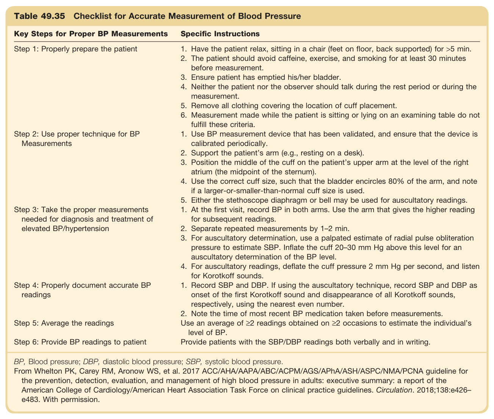

#### Table Data (CSV: [Table_49_35.csv](Table_49_35.csv))

```markdown
| Table Text (OCR) |
| :--- |
| Table 49.35 Checklist for Accurate Measurement of Blood Pressure Key Steps for Proper BP Measurements  Specific Instructions    Step 1: Properly prepare the patient  1. Have the patient relax, sitting in a chair (feet on floor, back supported) for >5 min.2. The patient should avoid caffeine, exercise, and smoking for at least 30 minutes before measurement.3. Ensure patient has emptied his/her bladder.4. Neither the patient nor the observer should talk during the rest period or during the measurement.5. Remove all clothing covering the location of cuff placement.6. Measurement made while the patient is sitting or lying on an examining table do not fulfill these criteria.    Step 2: Use proper technique for BP Measurements  1. Use BP measurement device that has been validated, and ensure that the device is calibrated periodically.2. Support the patient’s arm (e.g., resting on a desk).3. Position the middle of the cuff on the patient’s upper arm at the level of the right atrium (the midpoint of the sternum).4. Use the correct cuff size, such that the bladder encircles 80% of the arm, and note if a larger-or-smaller-than-normal cuff size is used.5. Either the stethoscope diaphragm or bell may be used for auscultatory readings.    Step 3: Take the proper measurements needed for diagnosis and treatment of elevated BP/hypertension  1. At the first visit, record BP in both arms. Use the arm that gives the higher reading for subsequent readings.2. Separate repeated measurements by 1–2 min.3. For auscultatory determination, use a palpated estimate of radial pulse obliteration pressure to estimate SBP. Inflate the cuff 20–30 mm Hg above this level for an auscultatory determination of the BP level.4. For auscultatory readings, deflate the cuff pressure 2 mm Hg per second, and listen for Korotkoff sounds.    Step 4: Properly document accurate BP readings  1. Record SBP and DBP. If using the auscultatory technique, record SBP and DBP as onset of the first Korotkoff sound and disappearance of all Korotkoff sounds, respectively, using the nearest even number.2. Note the time of most recent BP medication taken before measurements.    Step 5: Average the readings  Use an average of ≥2 readings obtained on ≥2 occasions to estimate the individual’s level of BP.    Step 6: Provide BP readings to patient  Provide patients with the SBP/DBP readings both verbally and in writing. BP, Blood pressure; DBP, diastolic blood pressure; SBP, systolic blood pressure. From Whelton PK, Carey RM, Aronow WS, et al. 2017 ACC/AHA/AAPA/ABC/ACPM/AGS/APhA/ASH/ASPC/NMA/PCNA guideline for the prevention, detection, evaluation, and management of high blood pressure in adults: executive summary: a report of the American College of Cardiology/American Heart Association Task Force on clinical practice guidelines. Circulation. 2018;138:e426– e483. With permission. |
```

Table 49.35 Checklist for Accurate Measurement of Blood Pressure | Key Steps for Proper BP Measurements | Specific Instructions | | ------------------------------------------------------------ | ------------------------------------------------------------ | | Step 1: Properly prepare the patient | 1. Have the patient relax, sitting in a chair (feet on floor, back supported) for >5 min. 2. The patient should avoid caffeine, exercise, and smoking for at least 30 minutes before measurement. 3. Ensure patient has emptied his/her bladder. 4. Neither the patient nor the observer should talk during the rest period or during the measurement. 5. Remove all clothing covering the location of cuff placement. 6. Measurement made while the patient is sitting or lying on an examining table do not fulfill these criteria. | | Step 2: Use proper technique for BP Measurements | 1. Use BP measurement device that has been validated, and ensure that the device is calibrated periodically. 2. Support the patient's arm (e.g., resting on a desk). 3. Position the middle of the cuff on the patient's upper arm at the level of the right atrium (the midpoint of the sternum). 4. Use the correct cuff size, such that the bladder encircles 80% of the arm, and note if a larger-or-smaller-than-normal cuff size is used. 5. Either the stethoscope diaphragm or bell may be used for auscultatory readings. | | Step 3: Take the proper measurements needed for diagnosis and treatment of elevated BP/hypertension | 1. At the first visit, record BP in both arms. Use the arm that gives the higher reading for subsequent readings. 2. Separate repeated measurements by 1-2 min. 3. For auscultatory determination, use a palpated estimate of radial pulse obliteration pressure to estimate SBP. Inflate the cuff 20-30 mm Hg above this level for an auscultatory determination of the BP level. 4. For auscultatory readings, deflate the cuff pressure 2 mm Hg per second, and listen for Korotkoff sounds. | | Step 4: Properly document accurate BP readings | 1. Record SBP and DBP. If using the auscultatory technique, record SBP and DBP as onset of the first Korotkoff sound and disappearance of all Korotkoff sounds, respectively, using the nearest even number. 2. Note the time of most recent BP medication taken before measurements. | | Step 5: Average the readings | Use an average of ≥2 readings obtained on ≥2 occasions to estimate the individual's level of BP. | | Step 6: Provide BP readings to patient | Provide patients with the SBP/DBP readings both verbally and in writing. | BP, Blood pressure; DBP, diastolic blood pressure; SBP, systolic blood pressure. From Whelton PK, Carey RM, Aronow WS, et al. 2017 ACC/AHA/AAPA/ABC/ACPM/AGS/APhA/ASH/ASPC/NMA/PCNA guideline for the prevention, detection, evaluation, and management of high blood pressure in adults: executive summary: a report of the American College of Cardiology/American Heart Association Task Force on clinical practice guidelines. Circulation. 2018;138:e426-e483. With permission.

---

### Table_49_36

#### Table Image

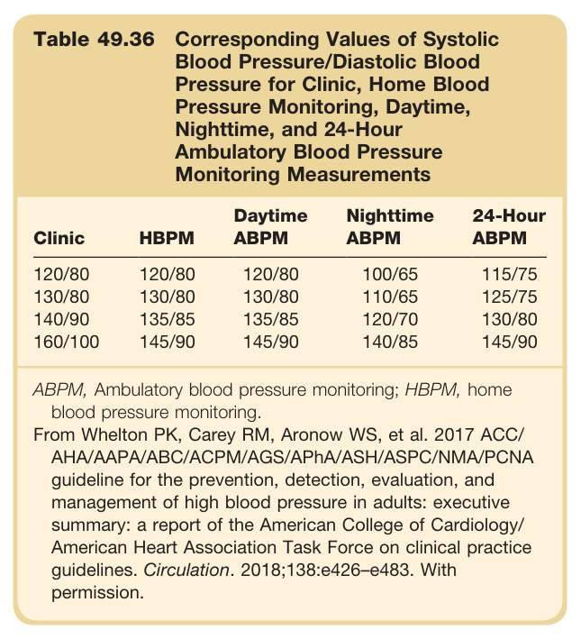

#### Table Data (CSV: [Table_49_36.csv](Table_49_36.csv))

```markdown
| Table Text (OCR) |
| :--- |
| Table 49.36 Corresponding Values of Systolic Blood Pressure/Diastolic Blood Pressure for Clinic, Home Blood Pressure Monitoring, Daytime, Nighttime, and 24-Hour Ambulatory Blood Pressure Monitoring Measurements Clinic  HBPM  Daytime ABPM  Nighttime ABPM  24-Hour ABPM    120/80  120/80  120/80  100/65  115/75    130/80  130/80  130/80  110/65  125/75    140/90  135/85  135/85  120/70  130/80    160/100  145/90  145/90  140/85  145/90 |
```

Table 49.36 Corresponding Values of Systolic Blood Pressure/Diastolic Blood Pressure for Clinic, Home Blood Pressure Monitoring, Daytime, Nighttime, and 24-Hour Ambulatory Blood Pressure Monitoring Measurements | Clinic | HBPM | Daytime ABPM | Nighttime ABPM | 24-Hour ABPM | | ------- | ------ | ------------ | -------------- | ------------ | | 120/80 | 120/80 | 120/80 | 100/65 | 115/75 | | 130/80 | 130/80 | 130/80 | 110/65 | 125/75 | | 140/90 | 135/85 | 135/85 | 120/70 | 130/80 | | 160/100 | 145/90 | 145/90 | 140/85 | 145/90 | ABPM, Ambulatory blood pressure monitoring; HBPM, home blood pressure monitoring. From Whelton PK, Carey RM, Aronow WS, et al. 2017 ACC/AHA/AAPA/ABC/ACPM/AGS/APhA/ASH/ASPC/NMA/PCNA guideline for the prevention, detection, evaluation, and management of high blood pressure in adults: executive summary: a report of the American College of Cardiology/American Heart Association Task Force on clinical practice guidelines. Circulation. 2018;138:e426-e483. With permission.

---

### Table_49_37

#### Table Image

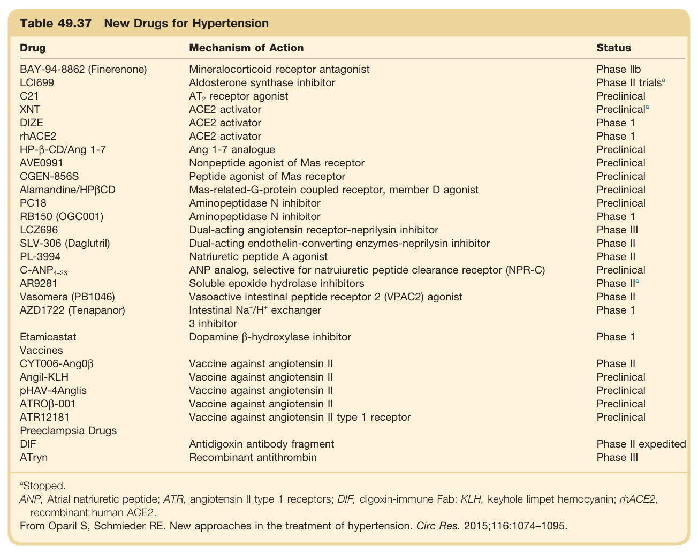

#### Table Data (CSV: [Table_49_37.csv](Table_49_37.csv))

```markdown
| Table Text (OCR) |
| :--- |
| Table 49.37 New Drugs for Hypertension Drug  Mechanism of Action  Status    BAY-94-8862 (Finerenone)  Mineralocorticoid receptor antagonist  Phase IIb    LCI699  Aldosterone synthase inhibitor  Phase II  trials^a     C21   AT_2  receptor agonist  Preclinical    XNT  ACE2 activator   Preclinical^a     DIZE  ACE2 activator  Phase 1    rhACE2  ACE2 activator  Phase 1    HP-β-CD/Ang 1-7  Ang 1-7 analogue  Preclinical    AVE0991  Nonpeptide agonist of Mas receptor  Preclinical    CGEN-856S  Peptide agonist of Mas receptor  Preclinical    Alamandine/HPβCD  Mas-related-G-protein coupled receptor, member D agonist  Preclinical    PC18  Aminopeptidase N inhibitor  Preclinical    RB150 (OGC001)  Aminopeptidase N inhibitor  Phase 1    LCZ696  Dual-acting angiotensin receptor-neprilysin inhibitor  Phase III    SLV-306 (Daglutril)  Dual-acting endothelin-converting enzymes-neprilysin inhibitor  Phase II    PL-3994  Natriuretic peptide A agonist  Phase II    C-ANP _{4-23}   ANP analog, selective for natruiuretic peptide clearance receptor (NPR-C)  Preclinical    AR9281  Soluble epoxide hydrolase inhibitors   Phase II^a     Vasomera (PB1046)  Vasoactive intestinal peptide receptor 2 (VPAC2) agonist  Phase II    AZD1722 (Tenapanor)  Intestinal  Na^+/H^+  exchanger3 inhibitor  Phase 1    Etamicastat  Dopamine β-hydroxylase inhibitor  Phase 1    Vaccines        CYT006-Ang0β  Vaccine against angiotensin II  Phase II    Angil-KLH  Vaccine against angiotensin II  Preclinical    pHAV-4Anglis  Vaccine against angiotensin II  Preclinical    ATROβ-001  Vaccine against angiotensin II  Preclinical    ATR12181  Vaccine against angiotensin II type 1 receptor  Preclinical    Preeclampsia Drugs        DIF  Antidigoxin antibody fragment  Phase II expedited    ATryn  Recombinant antithrombin  Phase III <sup>a</sup>Stopped. ANP, Atrial natriuretic peptide; ATR, angiotensin II type 1 receptors; DIF, digoxin-immune Fab; KLH, keyhole limpet hemocyanin; rhACE2, recombinant human ACE2. From Oparil S, Schmieder RE. New approaches in the treatment of hypertension. Circ Res. 2015;116:1074–1095. |
```

Table 49.37 New Drugs for Hypertension This table lists new drugs for hypertension, their mechanisms of action (e.g., Mineralocorticoid receptor antagonist, Aldosterone synthase inhibitor, AT2 receptor agonist), and their current developmental status (e.g., Phase IIb, Preclinical, Phase I).

---

### Table_49_38

#### Table Image

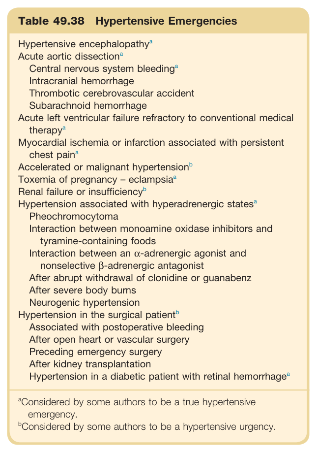

#### Table Data (CSV: [Table_49_38.csv](Table_49_38.csv))

```markdown
| Table Text (OCR) |
| :--- |
| Table 49.38 Hypertensive Emergencies Hypertensive encephalopathya    Acute aortic dissectiona    Central nervous system bleedinga    Intracranial hemorrhage    Thrombotic cerebrovascular accident    Subarachnoid hemorrhage    Acute left ventricular failure refractory to conventional medical therapya    Myocardial ischemia or infarction associated with persistent chest paina    Accelerated or malignant hypertensionb    Toxemia of pregnancy – eclampsiaa    Renal failure or insufficiencyb    Hypertension associated with hyperadrenergic statesa    Pheochromocytoma    Interaction between monoamine oxidase inhibitors and tyramine-containing foods    Interaction between an α-adrenergic agonist and nonselective β-adrenergic antagonist    After abrupt withdrawal of clonidine or guanabenz    After severe body burns    Neurogenic hypertension    Hypertension in the surgical patientb    Associated with postoperative bleeding    After open heart or vascular surgery    Preceding emergency surgery    After kidney transplantation    Hypertension in a diabetic patient with retinal hemorrhagea <sup>a</sup>Considered by some authors to be a true hypertensive emergency. <sup>b</sup>Considered by some authors to be a hypertensive urgency. |
```

Table 49.38 Hypertensive Emergencies * Hypertensive encephalopathya * Acute aortic dissectiona * Central nervous system bleedinga * Intracranial hemorrhage * Thrombotic cerebrovascular accident * Subarachnoid hemorrhage * Acute left ventricular failure refractory to conventional medical therapya * Myocardial ischemia or infarction associated with persistent chest paina * Accelerated or malignant hypertension * Toxemia of pregnancy - eclampsiaa * Renal failure or insufficiency * Hypertension associated with hyperadrenergic statesa * Pheochromocytoma * Interaction between monoamine oxidase inhibitors and tyramine-containing foods * Interaction between an a-adrenergic agonist and nonselective ẞ-adrenergic antagonist * After abrupt withdrawal of clonidine or guanabenz * After severe body burns * Neurogenic hypertension * Hypertension in the surgical patient * Associated with postoperative bleeding * After open heart or vascular surgery * Preceding emergency surgery * After kidney transplantation * Hypertension in a diabetic patient with retinal hemorrhagea aConsidered by some authors to be a true hypertensive emergency. bConsidered by some authors to be a hypertensive urgency.

---

### Table_49_39

#### Table Image

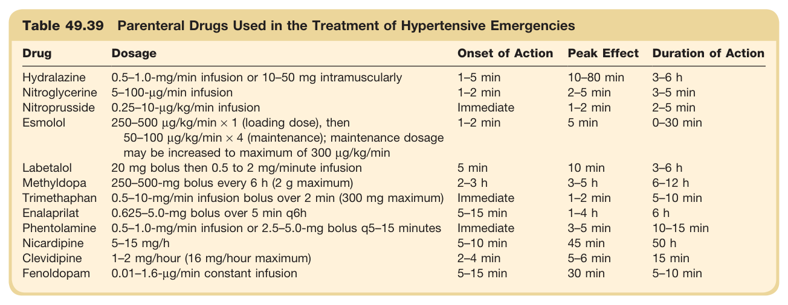

#### Table Data (CSV: [Table_49_39.csv](Table_49_39.csv))

```markdown
| Table Text (OCR) |
| :--- |
| Table 49.39 Parenteral Drugs Used in the Treatment of Hypertensive Emergencies Drug  Dosage  Onset of Action  Peak Effect  Duration of Action    Hydralazine  0.5–1.0-mg/min infusion or 10–50 mg intramuscularly  1–5 min  10–80 min  3–6 h    Nitroglycerine  5–100-μg/min infusion  1–2 min  2–5 min  3–5 min    Nitroprusside  0.25–10-μg/kg/min infusion  Immediate  1–2 min  2–5 min    Esmolol  250–500 μg/kg/min × 1 (loading dose), then50–100 μg/kg/min × 4 (maintenance); maintenance dosage may be increased to maximum of 300 μg/kg/min  1–2 min  5 min  0–30 min    Labetalol  20 mg bolus then 0.5 to 2 mg/minute infusion  5 min  10 min  3–6 h    Methyldopa  250–500-mg bolus every 6 h (2 g maximum)  2–3 h  3–5 h  6–12 h    Trimethaphan  0.5–10-mg/min infusion bolus over 2 min (300 mg maximum)  Immediate  1–2 min  5–10 min    Enalaprilat  0.625–5.0-mg bolus over 5 min q6h  5–15 min  1–4 h  6 h    Phentolamine  0.5–1.0-mg/min infusion or 2.5–5.0-mg bolus q5–15 minutes  Immediate  3–5 min  10–15 min    Nicardipine  5–15 mg/h  5–10 min  45 min  50 h    Clevidipine  1–2 mg/hour (16 mg/hour maximum)  2–4 min  5–6 min  15 min    Fenoldopam  0.01–1.6-μg/min constant infusion  5–15 min  30 min  5–10 min |
```

Table 49.39 Parenteral Drugs Used in the Treatment of Hypertensive Emergencies | Drug | Dosage | Onset of Action | Peak Effect | Duration of Action | | --------------------------- | ------------------------------------------------------------ | --------------- | ----------- | ------------------ | | Hydralazine | 0.5-1.0-mg/min infusion or 10-50 mg intramuscularly | 1-5 min | 10-80 min | 3-6 h | | Nitroglycerine | 5-100-µg/min infusion | 1-2 min | 2-5 min | 3-5 min | | Nitroprusside | 0.25-10-µg/kg/min infusion | Immediate | 1-2 min | 2-5 min | | Esmolol | 250-500 µg/kg/min × 1 (loading dose), then 50-100 µg/kg/min × 4 (maintenance); maintenance dosage may be increased to maximum of 300 µg/kg/min | 1-2 min | 5 min | 0-30 min | | Labetalol | 20 mg bolus then 0.5 to 2 mg/minute infusion | 5 min | 10 min | 3-6 h | | Methyldopa | 250-500-mg bolus every 6 h (2 g maximum) | 2-3 h | 3-5 h | 6-12 h | | Trimethaphan | 0.5-10-mg/min infusion bolus over 2 min (300 mg maximum) | Immediate | 1-2 min | 5-10 min | | Enalaprilat | 0.625-5.0-mg bolus over 5 min q6h | 5-15 min | 1-4 h | 6 h | | Phentolamine | 0.5-1.0-mg/min infusion or 2.5-5.0-mg bolus q5-15 minutes | Immediate | 3-5 min | 10-15 min | | Nicardipine | 5-15 mg/h | 5-10 min | 45 min | 50 h | | Clevidipine | 1-2 mg/hour (16 mg/hour maximum) | 2-4 min | 5-6 min | 15 min | | Fenoldopam | 0.01-1.6-µg/min constant infusion | 5-15 min | 30 min | 5-10 min |

---

### Table_49_40

#### Table Image

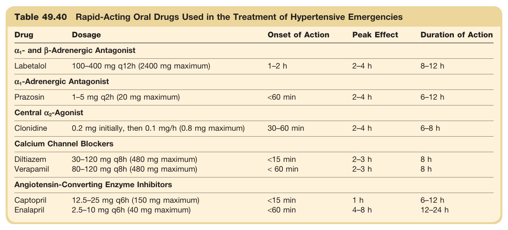

#### Table Data (CSV: [Table_49_40.csv](Table_49_40.csv))

```markdown
| Table Text (OCR) |
| :--- |
| Table 49.40 Rapid-Acting Oral Drugs Used in the Treatment of Hypertensive Emergencies Drug  Dosage  Onset of Action  Peak Effect  Duration of Action     \alpha_{1} - and  \beta -Adrenergic Antagonist    Labetalol  100–400 mg q12h (2400 mg maximum)  1–2 h  2–4 h  8–12 h     \alpha_{1} -Adrenergic Antagonist    Prazosin  1–5 mg q2h (20 mg maximum)  <60 min  2–4 h  6–12 h    Central  \alpha_{2} -Agonist    Clonidine  0.2 mg initially, then 0.1 mg/h (0.8 mg maximum)  30–60 min  2–4 h  6–8 h    Calcium Channel Blockers    Diltiazem  30–120 mg q8h (480 mg maximum)  <15 min  2–3 h  8 h    Verapamil  80–120 mg q8h (480 mg maximum)  < 60 min  2–3 h  8 h    Angiotensin-Converting Enzyme Inhibitors    Captopril  12.5–25 mg q6h (150 mg maximum)  <15 min  1 h  6–12 h    Enalapril  2.5–10 mg q6h (40 mg maximum)  <60 min  4–8 h  12–24 h |
```

Table 49.40 Rapid-Acting Oral Drugs Used in the Treatment of Hypertensive Emergencies | Drug | Dosage | Onset of Action | Peak Effect | Duration of Action | | -------------------------------------------- | ------------------------------------------------ | --------------- | ----------- | ------------------ | | **α₁- and ẞ-Adrenergic Antagonist** | | | | | | Labetalol | 100-400 mg q12h (2400 mg maximum) | 1-2 h | 2-4 h | 8-12 h | | **α₁-Adrenergic Antagonist** | | | | | | Prazosin | 1-5 mg q2h (20 mg maximum) | <60 min | 2-4 h | 6-12 h | | **Central 02-Agonist** | | | | | | Clonidine | 0.2 mg initially, then 0.1 mg/h (0.8 mg maximum) | 30-60 min | 2-4 h | 6-8 h | | **Calcium Channel Blockers** | | | | | | Diltiazem | 30-120 mg q8h (480 mg maximum) | <15 min | 2-3 h | 8 h | | Verapamil | 80-120 mg q8h (480 mg maximum) | < 60 min | 2-3 h | 8 h | | **Angiotensin-Converting Enzyme Inhibitors** | | | | | | Captopril | 12.5-25 mg q6h (150 mg maximum) | <15 min | 1 h | 6-12 h | | Enalapril | 2.5-10 mg q6h (40 mg maximum) | <60 min | 4-8 h | 12-24 h |

---
