# 50. Diuretics - Figures and Tables Index

This document lists all figures, tables and boxes extracted from `50. Diuretics.pdf`.

## Table of Contents
- [Figures](#figures)
- [Tables](#tables)
- [Boxes](#boxes)

---

## Figures

### Fig_50_1

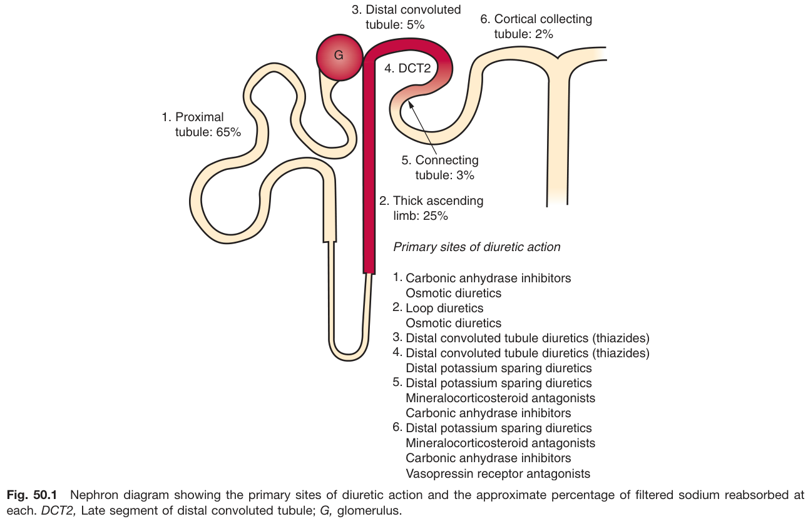

Fig. 50.1 Nephron diagram showing the primary sites of diuretic action and the approximate percentage of filtered sodium reabsorbed at each. DCT2, Late segment of distal convoluted tubule; G, glomerulus.

---

### Fig_50_2

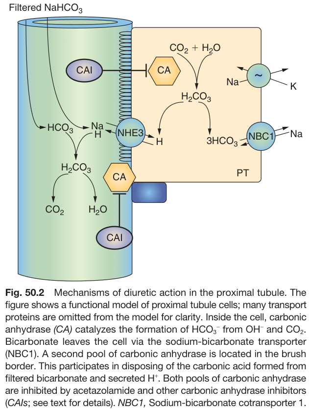

Fig. 50.2 Mechanisms of diuretic action in the proximal tubule. The figure shows a functional model of proximal tubule cells; many transport proteins are omitted from the model for clarity. Inside the cell, carbonic anhydrase (CA) catalyzes the formation of HCO3 from OH and CO2. Bicarbonate leaves the cell via the sodium-bicarbonate transporter (NBC1). A second pool of carbonic anhydrase is located in the brush border. This participates in disposing of the carbonic acid formed from filtered bicarbonate and secreted H+. Both pools of carbonic anhydrase are inhibited by acetazolamide and other carbonic anhydrase inhibitors (CAls; see text for details). NBC1, Sodium-bicarbonate cotransporter 1.

---

### Fig_50_3

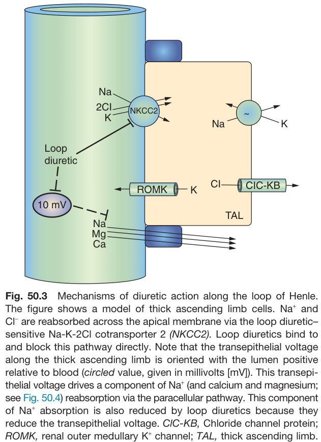

Fig. 50.3 Mechanisms of diuretic action along the loop of Henle. The figure shows a model of thick ascending limb cells. Nat and Cl are reabsorbed across the apical membrane via the loop diuretic-sensitive Na-K-2Cl cotransporter 2 (NKCC2). Loop diuretics bind to and block this pathway directly. Note that the transepithelial voltage along the thick ascending limb is oriented with the lumen positive relative to blood (circled value, given in millivolts [mv]). This transepithelial voltage drives a component of Na+ (and calcium and magnesium; see Fig. 50.4) reabsorption via the paracellular pathway. This component of Na+ absorption is also reduced by loop diuretics because they reduce the transepithelial voltage. CIC-KB, Chloride channel protein; ROMK, renal outer medullary K+ channel; TAL, thick ascending limb.

---

### Fig_50_4

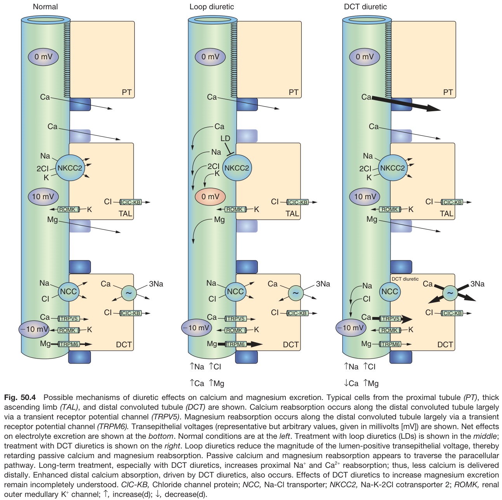

Fig. 50.4 Possible mechanisms of diuretic effects on calcium and magnesium excretion. Typical cells from the proximal tubule (PT), thick ascending limb (TAL), and distal convoluted tubule (DCT) are shown. Calcium reabsorption occurs along the distal convoluted tubule largely via a transient receptor potential channel (TRPV5). Magnesium reabsorption occurs along the distal convoluted tubule largely via a transient receptor potential channel (TRPM6). Transepithelial voltages (representative but arbitrary values, given in millivolts [mV]) are shown. Net effects on electrolyte excretion are shown at the bottom. Normal conditions are at the left. Treatment with loop diuretics (LDs) is shown in the middle; treatment with DCT diuretics is shown on the right. Loop diuretics reduce the magnitude of the lumen-positive transepithelial voltage, thereby retarding passive calcium and magnesium reabsorption. Passive calcium and magnesium reabsorption appears to traverse the paracellular pathway. Long-term treatment, especially with DCT diuretics, increases proximal Nat and Ca2+ reabsorption; thus, less calcium is delivered distally. Enhanced distal calcium absorption, driven by DCT diuretics, also occurs. Effects of DCT diuretics to increase magnesium excretion remain incompletely understood. CIC-KB, Chloride channel protein; NCC, Na-Cl transporter; NKCC2, Na-K-2Cl cotransporter 2; ROMK, renal outer medullary K+ channel; ↑, increase(d); ↓, decrease(d).

---

### Fig_50_5

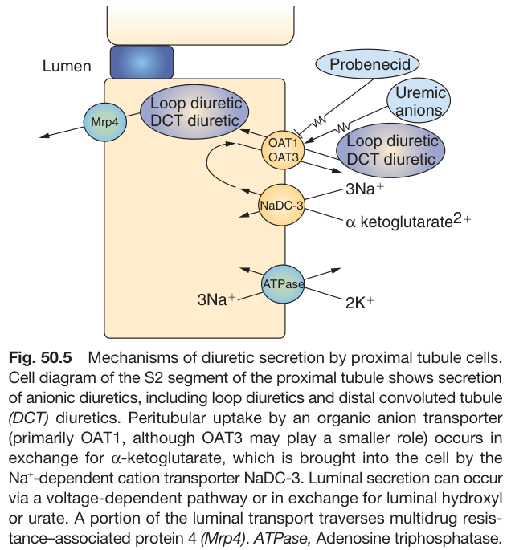

Fig. 50.5 Mechanisms of diuretic secretion by proximal tubule cells. Cell diagram of the S2 segment of the proximal tubule shows secretion of anionic diuretics, including loop diuretics and distal convoluted tubule (DCT) diuretics. Peritubular uptake by an organic anion transporter (primarily OAT1, although OAT3 may play a smaller role) occurs in exchange for a-ketoglutarate, which is brought into the cell by the Na+-dependent cation transporter NaDC-3. Luminal secretion can occur via a voltage-dependent pathway or in exchange for luminal hydroxyl or urate. A portion of the luminal transport traverses multidrug resistance-associated protein 4 (Mrp4). ATPase, Adenosine triphosphatase.

---

### Fig_50_6

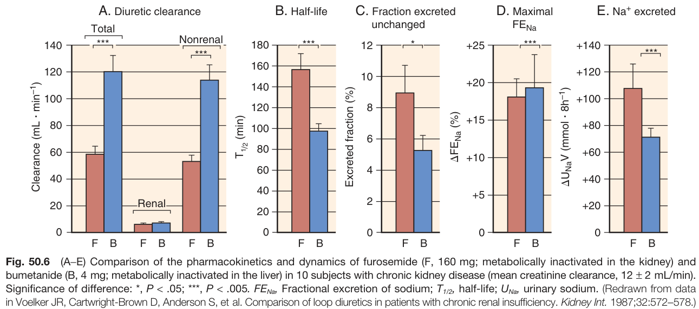

Fig. 50.6 (A-E) Comparison of the pharmacokinetics and dynamics of furosemide (F, 160 mg; metabolically inactivated in the kidney) and bumetanide (B, 4 mg; metabolically inactivated in the liver) in 10 subjects with chronic kidney disease (mean creatinine clearance, 12 ± 2 mL/min). Significance of difference: *, P < .05; ***, P < .005. FENa, Fractional excretion of sodium; T1/2, half-life; UNa, urinary sodium. (Redrawn from data in Voelker JR, Cartwright-Brown D, Anderson S, et al. Comparison of loop diuretics in patients with chronic renal insufficiency. Kidney Int. 1987;32:572-578.)

---

### Fig_50_7

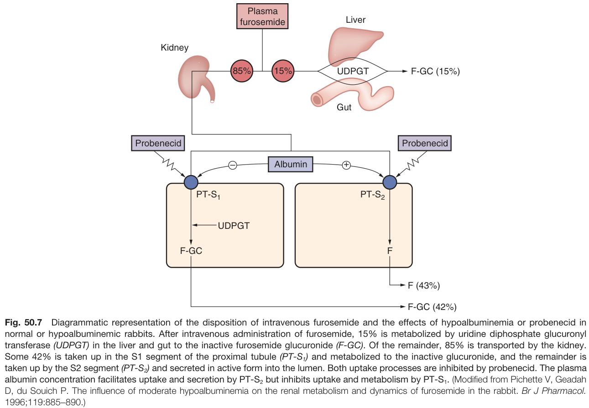

Fig. 50.7 Diagrammatic representation of the disposition of intravenous furosemide and the effects of hypoalbuminemia or probenecid in normal or hypoalbuminemic rabbits. After intravenous administration of furosemide, 15% is metabolized by uridine diphosphate glucuronyl transferase (UDPGT) in the liver and gut to the inactive furosemide glucuronide (F-GC). Of the remainder, 85% is transported by the kidney. Some 42% is taken up in the S1 segment of the proximal tubule (PT-S₁) and metabolized to the inactive glucuronide, and the remainder is taken up by the S2 segment (PT-S2) and secreted in active form into the lumen. Both uptake processes are inhibited by probenecid. The plasma albumin concentration facilitates uptake and secretion by PT-S2 but inhibits uptake and metabolism by PT-S1. (Modified from Pichette V, Geadah D, du Souich P. The influence of moderate hypoalbuminemia on the renal metabolism and dynamics of furosemide in the rabbit. Br J Pharmacol. 1996;119:885-890.)

---

### Fig_50_8

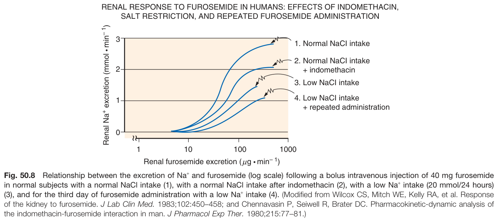

Fig. 50.8 Relationship between the excretion of Nat and furosemide (log scale) following a bolus intravenous injection of 40 mg furosemide in normal subjects with a normal NaCl intake (1), with a normal NaCl intake after indomethacin (2), with a low Nat intake (20 mmol/24 hours) (3), and for the third day of furosemide administration with a low Nat intake (4). (Modified from Wilcox CS, Mitch WE, Kelly RA, et al. Response of the kidney to furosemide. J Lab Clin Med. 1983;102:450-458; and Chennavasin P, Seiwell R, Brater DC. Pharmacokinetic-dynamic analysis of the indomethacin-furosemide interaction in man. J Pharmacol Exp Ther. 1980;215:77-81.)

---

### Fig_50_9

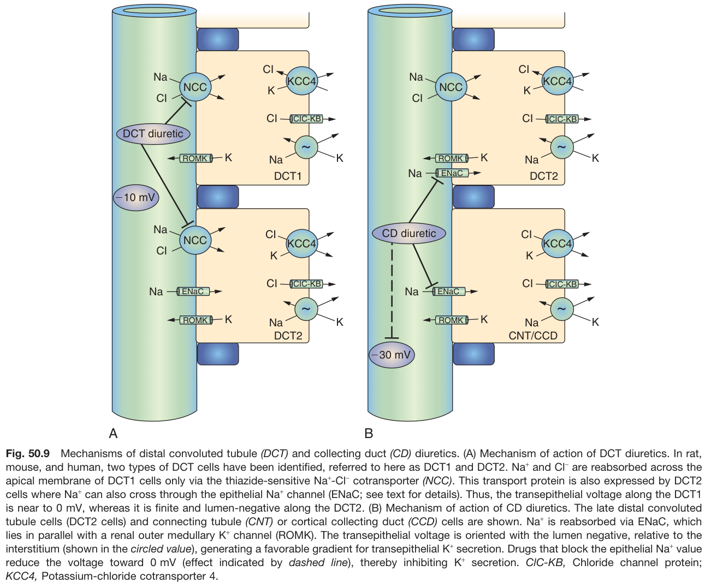

Fig. 50.9 Mechanisms of distal convoluted tubule (DCT) and collecting duct (CD) diuretics. (A) Mechanism of action of DCT diuretics. In rat, mouse, and human, two types of DCT cells have been identified, referred to here as DCT1 and DCT2. Nat and Cl are reabsorbed across the apical membrane of DCT1 cells only via the thiazide-sensitive Nat-Cl cotransporter (NCC). This transport protein is also expressed by DCT2 cells where Nat can also cross through the epithelial Nat channel (ENaC; see text for details). Thus, the transepithelial voltage along the DCT1 is near to 0 mV, whereas it is finite and lumen-negative along the DCT2. (B) Mechanism of action of CD diuretics. The late distal convoluted tubule cells (DCT2 cells) and connecting tubule (CNT) or cortical collecting duct (CCD) cells are shown. Nat is reabsorbed via ENaC, which lies in parallel with a renal outer medullary K+ channel (ROMK). The transepithelial voltage is oriented with the lumen negative, relative to the interstitium (shown in the circled value), generating a favorable gradient for transepithelial K+ secretion. Drugs that block the epithelial Na+ value reduce the voltage toward 0 mV (effect indicated by dashed line), thereby inhibiting K+ secretion. CIC-KB, Chloride channel protein; KCC4, Potassium-chloride cotransporter 4.

---

### Fig_50_10

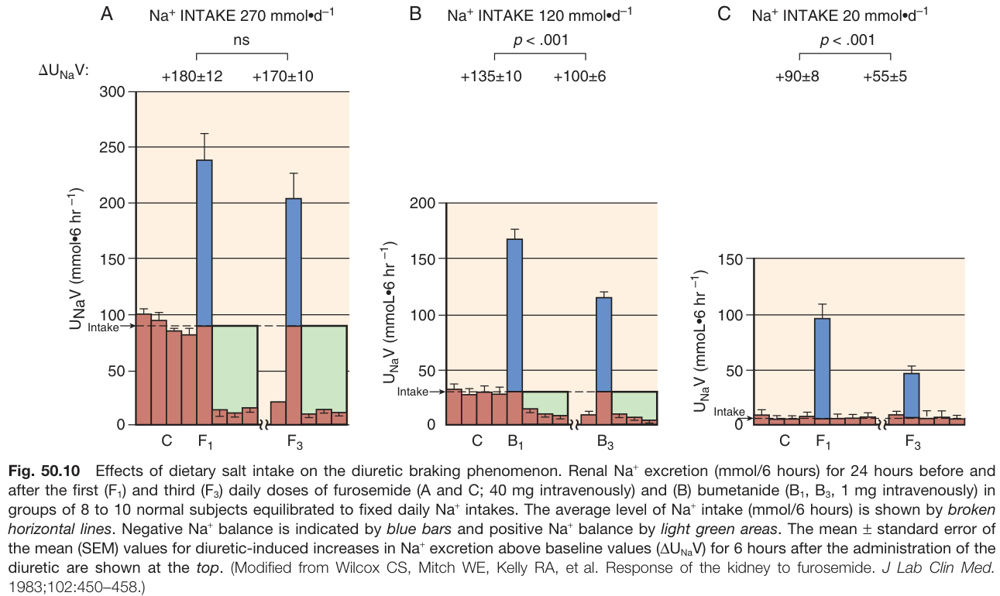

Fig. 50.10 Effects of dietary salt intake on the diuretic braking phenomenon. Renal Nat excretion (mmol/6 hours) for 24 hours before and after the first (F1) and third (F3) daily doses of furosemide (A and C; 40 mg intravenously) and (B) bumetanide (B1, B3, 1 mg intravenously) in groups of 8 to 10 normal subjects equilibrated to fixed daily Nat intakes. The average level of Nat intake (mmol/6 hours) is shown by broken horizontal lines. Negative Nat balance is indicated by blue bars and positive Nat balance by light green areas. The mean ± standard error of the mean (SEM) values for diuretic-induced increases in Nat excretion above baseline values (AUNAV) for 6 hours after the administration of the diuretic are shown at the top. (Modified from Wilcox CS, Mitch WE, Kelly RA, et al. Response of the kidney to furosemide. J Lab Clin Med. 1983;102:450-458.)

---

### Fig_50_11

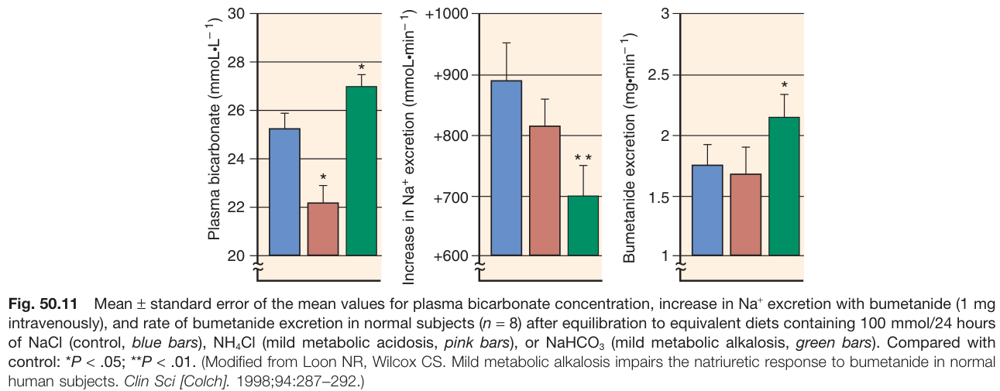

Fig. 50.11 Mean ± standard error of the mean values for plasma bicarbonate concentration, increase in Nat excretion with bumetanide (1 mg intravenously), and rate of bumetanide excretion in normal subjects (n = 8) after equilibration to equivalent diets containing 100 mmol/24 hours of NaCl (control, blue bars), NH4Cl (mild metabolic acidosis, pink bars), or NaHCO3 (mild metabolic alkalosis, green bars). Compared with control: *P < .05; **P < .01. (Modified from Loon NR, Wilcox CS. Mild metabolic alkalosis impairs the natriuretic response to bumetanide in normal human subjects. Clin Sci [Colch]. 1998;94:287-292.)

---

### Fig_50_12

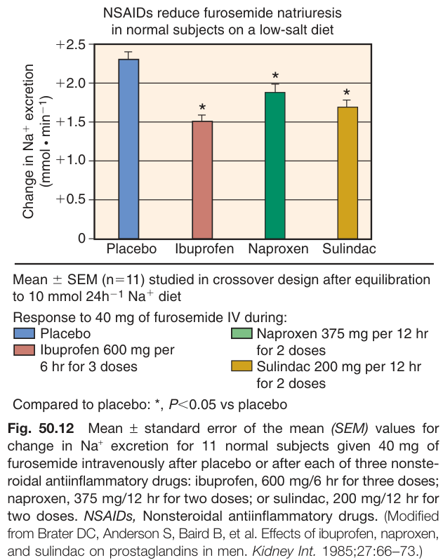

Fig. 50.12 Mean ± standard error of the mean (SEM) values for change in Nat excretion for 11 normal subjects given 40 mg of furosemide intravenously after placebo or after each of three nonsteroidal antiinflammatory drugs: ibuprofen, 600 mg/6 hr for three doses; naproxen, 375 mg/12 hr for two doses; or sulindac, 200 mg/12 hr for two doses. NSAIDs, Nonsteroidal antiinflammatory drugs. (Modified from Brater DC, Anderson S, Baird B, et al. Effects of ibuprofen, naproxen, and sulindac on prostaglandins in men. Kidney Int. 1985;27:66-73.)

---

### Fig_50_13

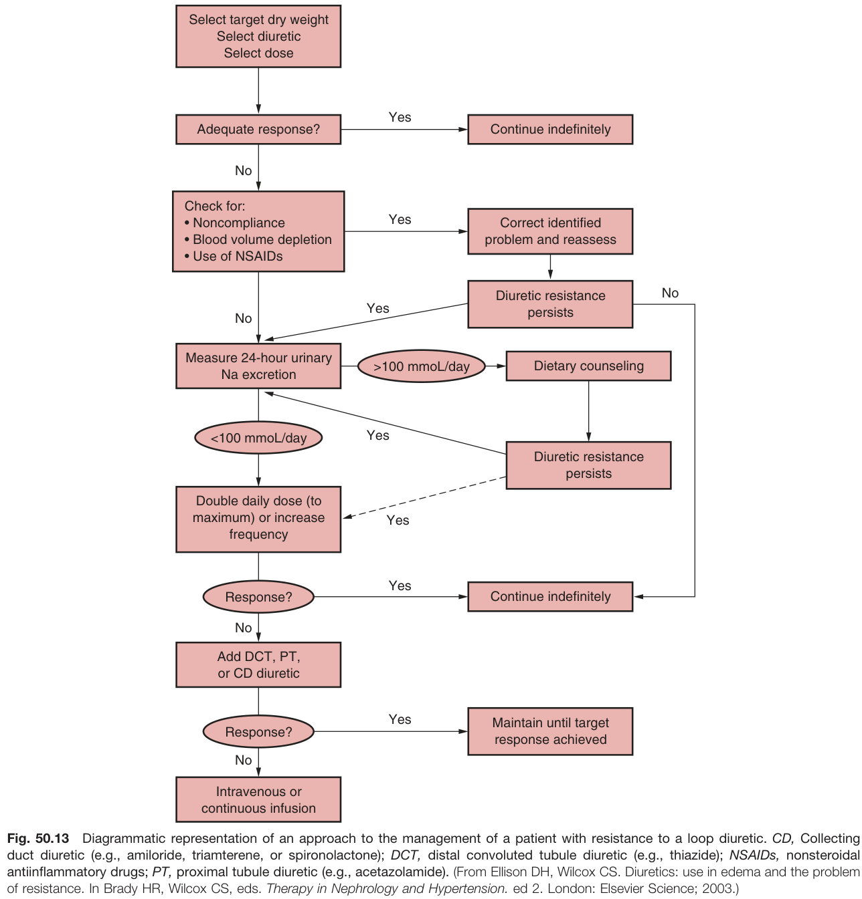

Fig. 50.13 Diagrammatic representation of an approach to the management of a patient with resistance to a loop diuretic. CD, Collecting duct diuretic (e.g., amiloride, triamterene, or spironolactone); DCT, distal convoluted tubule diuretic (e.g., thiazide); NSAIDs, nonsteroidal antiinflammatory drugs; PT, proximal tubule diuretic (e.g., acetazolamide). (From Ellison DH, Wilcox CS. Diuretics: use in edema and the problem of resistance. In Brady HR, Wilcox CS, eds. Therapy in Nephrology and Hypertension. ed 2. London: Elsevier Science; 2003.)

---

### Fig_50_14

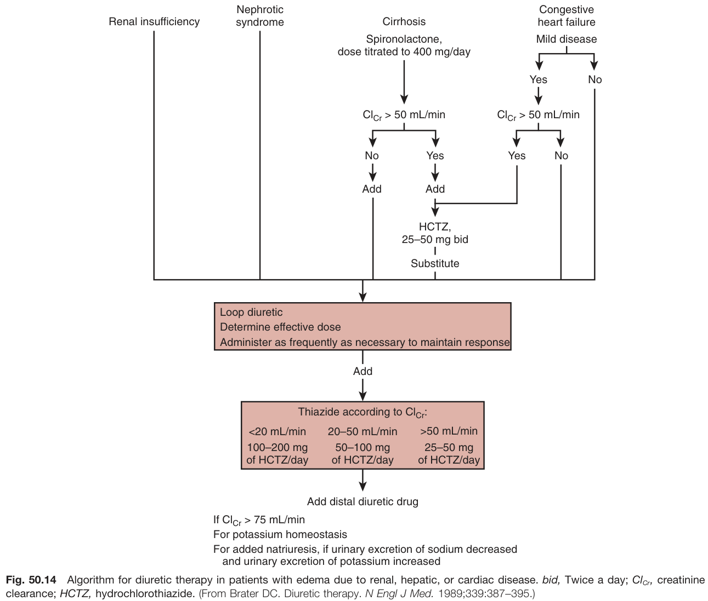

Fig. 50.14 Algorithm for diuretic therapy in patients with edema due to renal, hepatic, or cardiac disease. bid, Twice a day; Clcr, creatinine clearance; HCTZ, hydrochlorothiazide. (From Brater DC. Diuretic therapy. N Engl J Med. 1989;339:387-395.)

---

### Fig_50_15

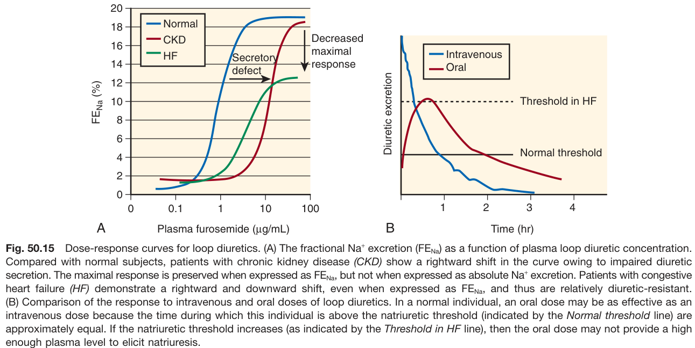

Fig. 50.15 Dose-response curves for loop diuretics. (A) The fractional Nat excretion (FENa) as a function of plasma loop diuretic concentration. Compared with normal subjects, patients with chronic kidney disease (CKD) show a rightward shift in the curve owing to impaired diuretic secretion. The maximal response is preserved when expressed as FENa, but not when expressed as absolute Nat excretion. Patients with congestive heart failure (HF) demonstrate a rightward and downward shift, even when expressed as FENa, and thus are relatively diuretic-resistant. (B) Comparison of the response to intravenous and oral doses of loop diuretics. In a normal individual, an oral dose may be as effective as an intravenous dose because the time during which this individual is above the natriuretic threshold (indicated by the Normal threshold line) are approximately equal. If the natriuretic threshold increases (as indicated by the Threshold in HF line), then the oral dose may not provide a high enough plasma level to elicit natriuresis.

---

### Fig_50_16

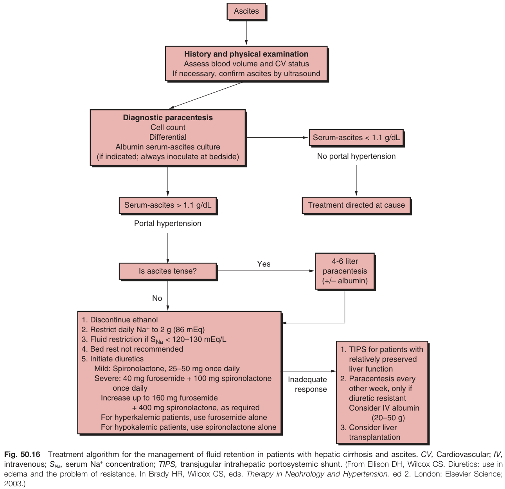

Fig. 50.16 Treatment algorithm for the management of fluid retention in patients with hepatic cirrhosis and ascites. CV, Cardiovascular; IV, intravenous; SNa, serum Nat concentration; TIPS, transjugular intrahepatic portosystemic shunt. (From Ellison DH, Wilcox CS. Diuretics: use in edema and the problem of resistance. In Brady HR, Wilcox CS, eds. Therapy in Nephrology and Hypertension. ed 2. London: Elsevier Science; 2003.)

---

### Fig_50_17

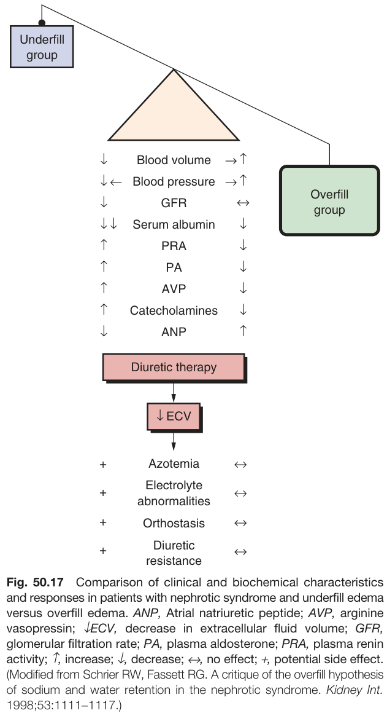

Fig. 50.17 Comparison of clinical and biochemical characteristics and responses in patients with nephrotic syndrome and underfill edema versus overfill edema. ANP, Atrial natriuretic peptide; AVP, arginine vasopressin; ECV, decrease in extracellular fluid volume; GFR, glomerular filtration rate; PA, plasma aldosterone; PRA, plasma renin activity; 1, increase; ↓, decrease; →, no effect; +, potential side effect. (Modified from Schrier RW, Fassett RG. A critique of the overfill hypothesis of sodium and water retention in the nephrotic syndrome. Kidney Int. 1998;53:1111-1117.)

---

### Fig_50_18

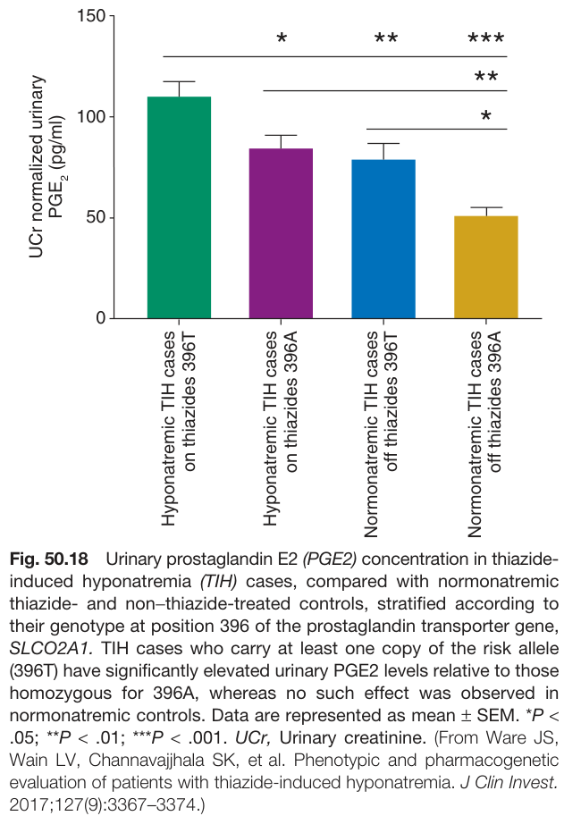

Fig. 50.18 Urinary prostaglandin E2 (PGE2) concentration in thiazide-induced hyponatremia (TIH) cases, compared with normonatremic thiazide- and non-thiazide-treated controls, stratified according to their genotype at position 396 of the prostaglandin transporter gene, SLCO2A1. TIH cases who carry at least one copy of the risk allele (396T) have significantly elevated urinary PGE2 levels relative to those homozygous for 396A, whereas no such effect was observed in normonatremic controls. Data are represented as mean ± SEM. *P < .05; **P < .01; ***P < .001. UCr, Urinary creatinine. (From Ware JS, Wain LV, Channavajjhala SK, et al. Phenotypic and pharmacogenetic evaluation of patients with thiazide-induced hyponatremia. J Clin Invest. 2017;127(9):3367-3374.)

---

### Fig_50_19

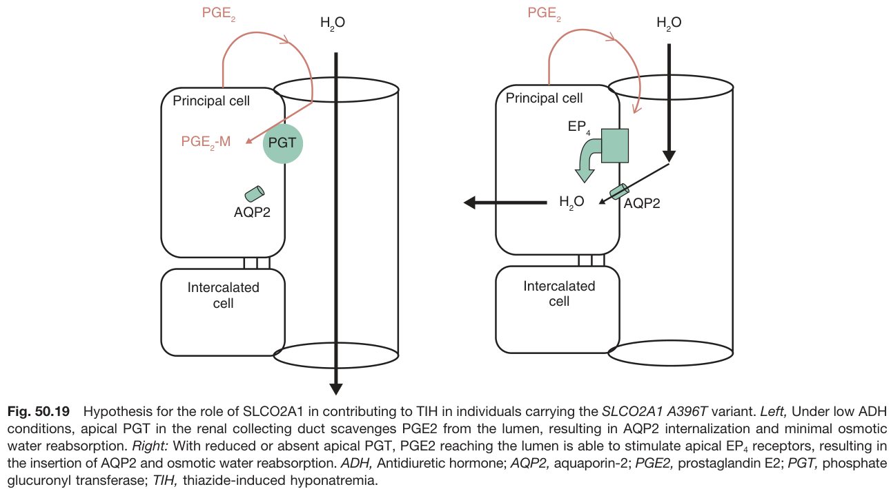

Fig. 50.19 Hypothesis for the role of SLCO2A1 in contributing to TIH in individuals carrying the SLCO2A1 A396T variant. Left, Under low ADH conditions, apical PGT in the renal collecting duct scavenges PGE2 from the lumen, resulting in AQP2 internalization and minimal osmotic water reabsorption. Right: With reduced or absent apical PGT, PGE2 reaching the lumen is able to stimulate apical EP4 receptors, resulting in the insertion of AQP2 and osmotic water reabsorption. ADH, Antidiuretic hormone; AQP2, aquaporin-2; PGE2, prostaglandin E2; PGT, phosphate glucuronyl transferase; TIH, thiazide-induced hyponatremia.

---

### Fig_50_20

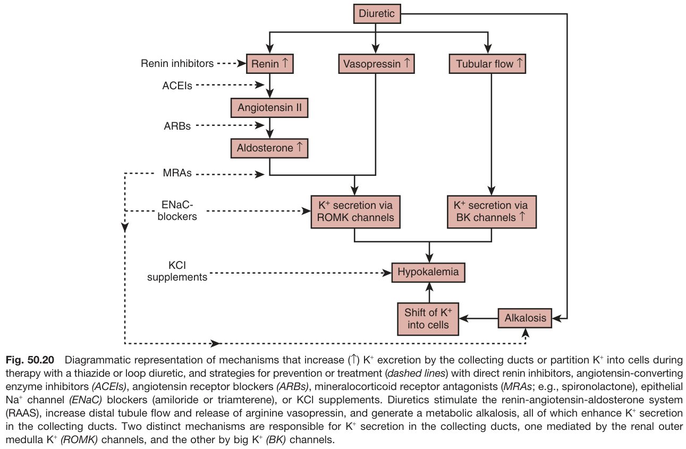

Fig. 50.20 Diagrammatic representation of mechanisms that increase (↑) K+ excretion by the collecting ducts or partition K+ into cells during therapy with a thiazide or loop diuretic, and strategies for prevention or treatment (dashed lines) with direct renin inhibitors, angiotensin-converting enzyme inhibitors (ACEIs), angiotensin receptor blockers (ARBs), mineralocorticoid receptor antagonists (MRAs; e.g., spironolactone), epithelial Na+ channel (ENaC) blockers (amiloride or triamterene), or KCl supplements. Diuretics stimulate the renin-angiotensin-aldosterone system (RAAS), increase distal tubule flow and release of arginine vasopressin, and generate a metabolic alkalosis, all of which enhance K+ secretion in the collecting ducts. Two distinct mechanisms are responsible for K+ secretion in the collecting ducts, one mediated by the renal outer medulla K+ (ROMK) channels, and the other by big K+ (BK) channels.

---

### Fig_50_21

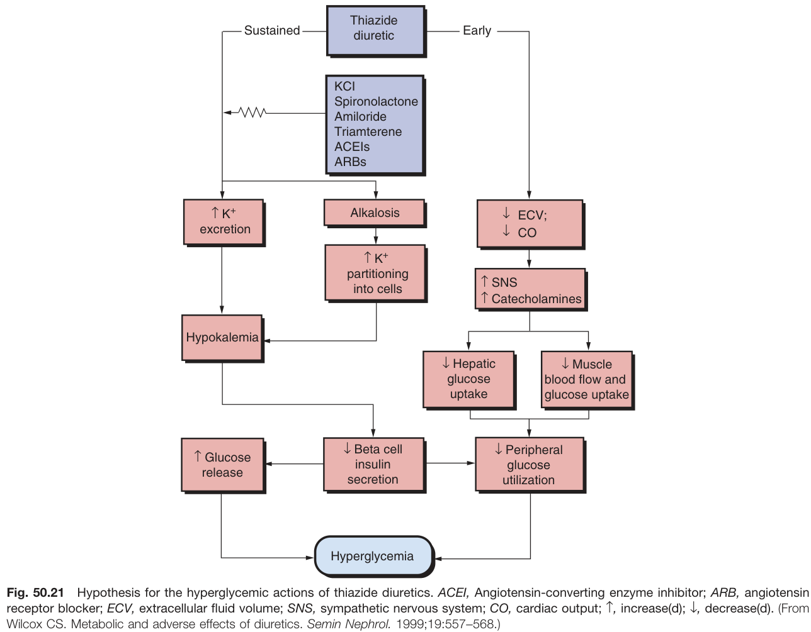

Fig. 50.21 Hypothesis for the hyperglycemic actions of thiazide diuretics. ACEI, Angiotensin-converting enzyme inhibitor; ARB, angiotensin receptor blocker; ECV, extracellular fluid volume; SNS, sympathetic nervous system; CO, cardiac output; ↑, increase(d); ↓, decrease(d). (From Wilcox CS. Metabolic and adverse effects of diuretics. Semin Nephrol. 1999;19:557-568.)

---

## Tables

### Table_50_1

#### Table Image

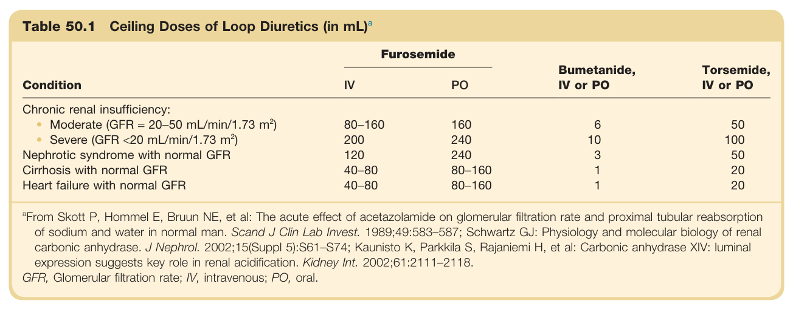

#### Table Data (CSV: [Table_50_1.csv](Table_50_1.csv))

```markdown
| Table Text (OCR) |
| :--- |
| Table 50.1 Ceiling Doses of Loop Diuretics (in mL)<sup>a</sup> Condition  Furosemide  Bumetanide, IV or PO  Torsemide, IV or PO    IV  PO    Chronic renal insufficiency:    Moderate (GFR = 20–50 mL/min/1.73  m^2 )  80–160  160  6  50    Severe (GFR <20 mL/min/1.73  m^2 )  200  240  10  100    Nephrotic syndrome with normal GFR  120  240  3  50    Cirrhosis with normal GFR  40–80  80–160  1  20    Heart failure with normal GFR  40–80  80–160  1  20 <sup>a</sup>From Skott P, Hommel E, Bruun NE, et al: The acute effect of acetazolamide on glomerular filtration rate and proximal tubular reabsorption of sodium and water in normal man. Scand J Clin Lab Invest. 1989;49:583–587; Schwartz GJ: Physiology and molecular biology of renal carbonic anhydrase. J Nephrol. 2002;15(Suppl 5):S61–S74; Kaunisto K, Parkkila S, Rajaniemi H, et al: Carbonic anhydrase XIV: luminal expression suggests key role in renal acidification. Kidney Int. 2002;61:2111–2118. GFR, Glomerular filtration rate; IV, intravenous; PO, oral. |
```

Table 50.1 Ceiling Doses of Loop Diuretics (in mL)ª | Condition | Furosemide | Bumetanide, IV or PO | Torsemide, IV or PO | | :--- | :--- | :--- | :--- | | | **IV** | **PO** | | | Chronic renal insufficiency: | | | | | • Moderate (GFR = 20-50 mL/min/1.73 m²) | 80-160 | 160 | 6 | 50 | | • Severe (GFR <20 mL/min/1.73 m²) | 200 | 240 | 10 | 100 | | Nephrotic syndrome with normal GFR | 120 | 240 | 3 | 50 | | Cirrhosis with normal GFR | 40-80 | 80-160 | 1 | 20 | | Heart failure with normal GFR | 40-80 | 80-160 | 1 | 20 | From Skott P, Hommel E, Bruun NE, et al: The acute effect of acetazolamide on glomerular filtration rate and proximal tubular reabsorption of sodium and water in normal man. Scand J Clin Lab Invest. 1989;49:583-587; Schwartz GJ: Physiology and molecular biology of renal carbonic anhydrase. J Nephrol. 2002;15(Suppl 5):S61-S74; Kaunisto K, Parkkila S, Rajaniemi H, et al: Carbonic anhydrase XIV: luminal expression suggests key role in renal acidification. Kidney Int. 2002;61:2111-2118. GFR, Glomerular filtration rate; IV, intravenous; PO, oral.

---

## Boxes

### Box_50_1

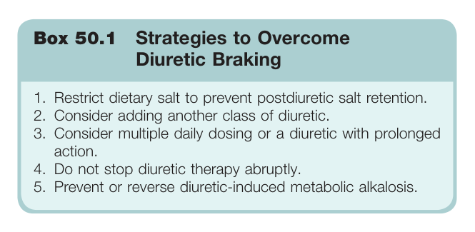

#### Box Text

```markdown
Box 50.1 Strategies to Overcome Diuretic Braking 1. Restrict dietary salt to prevent postdiuretic salt retention. 2. Consider adding another class of diuretic. 3. Consider multiple daily dosing or a diuretic with prolonged action. 4. Do not stop diuretic therapy abruptly. 5. Prevent or reverse diuretic-induced metabolic alkalosis.
```

Box 50.1 Strategies to Overcome Diuretic Braking 1. Restrict dietary salt to prevent postdiuretic salt retention. 2. Consider adding another class of diuretic. 3. Consider multiple daily dosing or a diuretic with prolonged action. 4. Do not stop diuretic therapy abruptly. 5. Prevent or reverse diuretic-induced metabolic alkalosis.

---

### Box_50_2

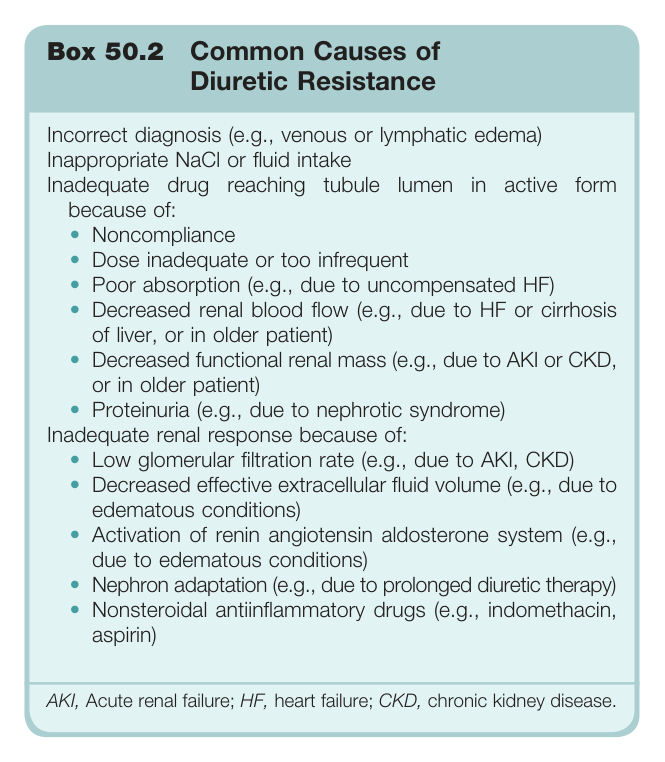

#### Box Text

```markdown
Box 50.2 Common Causes of Diuretic Resistance Incorrect diagnosis (e.g., venous or lymphatic edema) Inappropriate NaCl or fluid intake Inadequate drug reaching tubule lumen in active form because of: • Noncompliance • Dose inadequate or too infrequent • Poor absorption (e.g., due to uncompensated HF) • Decreased renal blood flow (e.g., due to HF or cirrhosis of liver, or in older patient) • Decreased functional renal mass (e.g., due to AKI or CKD, or in older patient) • Proteinuria (e.g., due to nephrotic syndrome) Inadequate renal response because of: • Low glomerular filtration rate (e.g., due to AKI, CKD) • Decreased effective extracellular fluid volume (e.g., due to edematous conditions) • Activation of renin angiotensin aldosterone system (e.g., due to edematous conditions) • Nephron adaptation (e.g., due to prolonged diuretic therapy) • Nonsteroidal antiinflammatory drugs (e.g., indomethacin, aspirin) AKI, Acute renal failure; HF, heart failure; CKD, chronic kidney disease.
```

Box 50.2 Common Causes of Diuretic Resistance Incorrect diagnosis (e.g., venous or lymphatic edema) Inappropriate NaCl or fluid intake Inadequate drug reaching tubule lumen in active form because of: • Noncompliance • Dose inadequate or too infrequent • Poor absorption (e.g., due to uncompensated HF) • Decreased renal blood flow (e.g., due to HF or cirrhosis of liver, or in older patient) • Decreased functional renal mass (e.g., due to AKI or CKD, or in older patient) • Proteinuria (e.g., due to nephrotic syndrome) Inadequate renal response because of: • Low glomerular filtration rate (e.g., due to AKI, CKD) • Decreased effective extracellular fluid volume (e.g., due to edematous conditions) • Activation of renin angiotensin aldosterone system (e.g., due to edematous conditions) • Nephron adaptation (e.g., due to prolonged diuretic therapy) • Nonsteroidal antiinflammatory drugs (e.g., indomethacin, aspirin) AKI, Acute renal failure; HF, heart failure; CKD, chronic kidney disease.

---
