# 51. Mechanisms of Progression in Chronic Kidney Disease - Figures and Tables Index

This document lists all figures and tables extracted from `51. Mechanisms of Progression in Chronic Kidney Disease.pdf`.

## Table of Contents
- [Figures](#figures)
- [Tables](#tables)

---

## Figures

### Fig_51_1

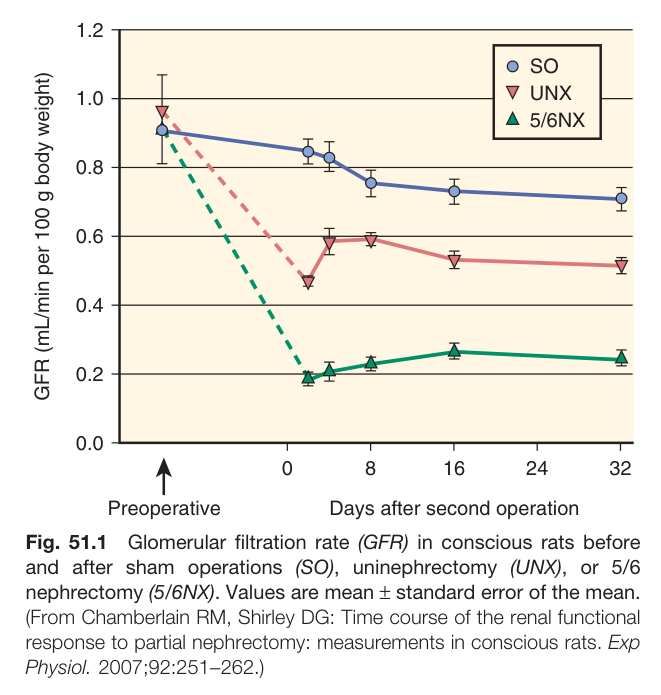

Fig. 51.1 Glomerular filtration rate (GFR) in conscious rats before and after sham operations (SO), uninephrectomy (UNX), or 5/6 nephrectomy (5/6NX). Values are mean ± standard error of the mean. (From Chamberlain RM, Shirley DG: Time course of the renal functional response to partial nephrectomy: measurements in conscious rats. Exp Physiol. 2007;92:251-262.)

---

### Fig_51_2

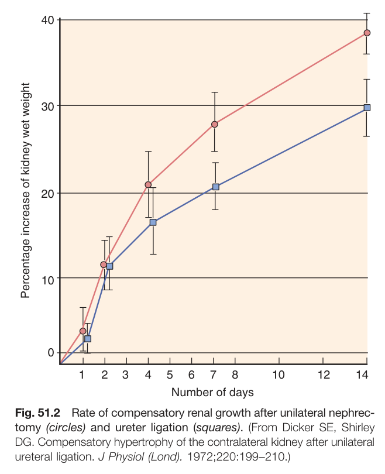

Fig. 51.2 Rate of compensatory renal growth after unilateral nephrectomy (circles) and ureter ligation (squares). (From Dicker SE, Shirley DG. Compensatory hypertrophy of the contralateral kidney after unilateral ureteral ligation. J Physiol (Lond). 1972;220:199-210.)

---

### Fig_51_3

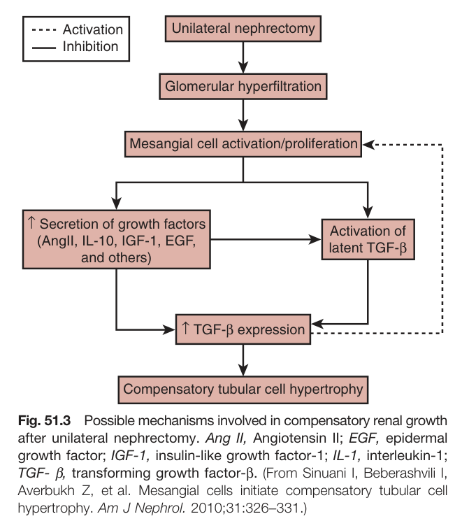

Fig. 51.3 Possible mechanisms involved in compensatory renal growth after unilateral nephrectomy. Ang II, Angiotensin II; EGF, epidermal growth factor; IGF-1, insulin-like growth factor-1; IL-1, interleukin-1; TGF-β, transforming growth factor-β. (From Sinuani I, Beberashvili I, Averbukh Z, et al. Mesangial cells initiate compensatory tubular cell hypertrophy. Am J Nephrol. 2010;31:326-331.)

---

### Fig_51_4

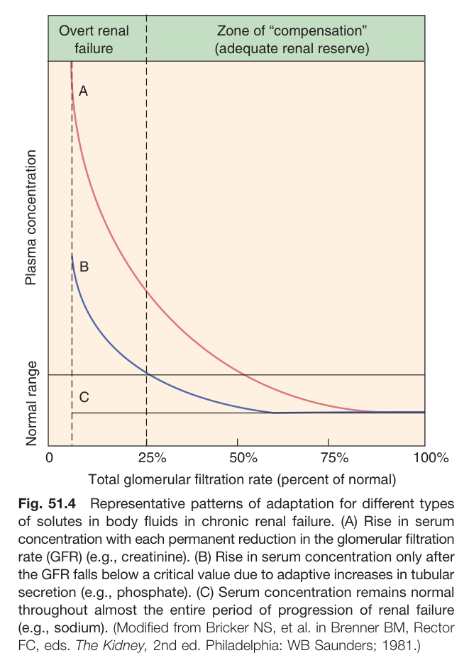

Fig. 51.4 Representative patterns of adaptation for different types of solutes in body fluids in chronic renal failure. (A) Rise in serum concentration with each permanent reduction in the glomerular filtration rate (GFR) (e.g., creatinine). (B) Rise in serum concentration only after the GFR falls below a critical value due to adaptive increases in tubular secretion (e.g., phosphate). (C) Serum concentration remains normal throughout almost the entire period of progression of renal failure (e.g., sodium). (Modified from Bricker NS, et al. in Brenner BM, Rector FC, eds. The Kidney, 2nd ed. Philadelphia: WB Saunders; 1981.)

---

### Fig_51_5

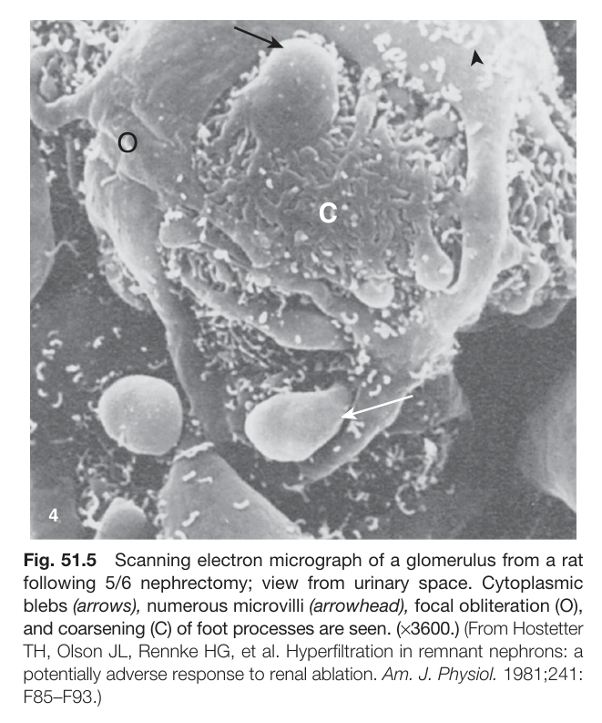

Fig. 51.5 Scanning electron micrograph of a glomerulus from a rat following 5/6 nephrectomy; view from urinary space. Cytoplasmic blebs (arrows), numerous microvilli (arrowhead), focal obliteration (O), and coarsening (C) of foot processes are seen. (x3600.) (From Hostetter TH, Olson JL, Rennke HG, et al. Hyperfiltration in remnant nephrons: a potentially adverse response to renal ablation. Am. J. Physiol. 1981;241: F85-F93.)

---

### Fig_51_6

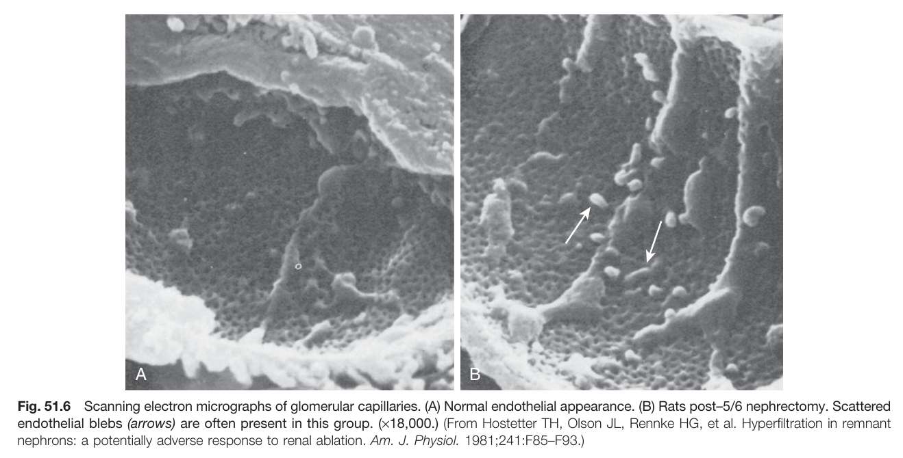

Fig. 51.6 Scanning electron micrographs of glomerular capillaries. (A) Normal endothelial appearance. (B) Rats post-5/6 nephrectomy. Scattered endothelial blebs (arrows) are often present in this group. (x18,000.) (From Hostetter TH, Olson JL, Rennke HG, et al. Hyperfiltration in remnant nephrons: a potentially adverse response to renal ablation. Am. J. Physiol. 1981;241:F85-F93.)

---

### Fig_51_7

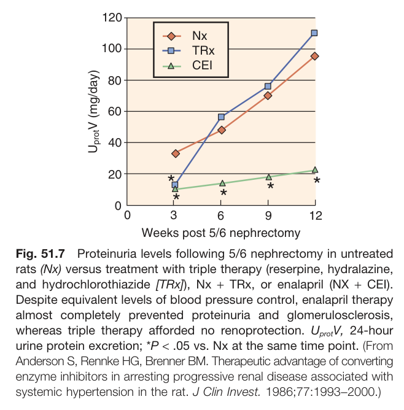

Fig. 51.7 Proteinuria levels following 5/6 nephrectomy in untreated rats (Nx) versus treatment with triple therapy (reserpine, hydralazine, and hydrochlorothiazide [TRx]), Nx + TRx, or enalapril (NX + CEI). Despite equivalent levels of blood pressure control, enalapril therapy almost completely prevented proteinuria and glomerulosclerosis, whereas triple therapy afforded no renoprotection. UprotV, 24-hour urine protein excretion; *P < .05 vs. Nx at the same time point. (From Anderson S, Rennke HG, Brenner BM. Therapeutic advantage of converting enzyme inhibitors in arresting progressive renal disease associated with systemic hypertension in the rat. J Clin Invest. 1986;77:1993-2000.)

---

### Fig_51_8

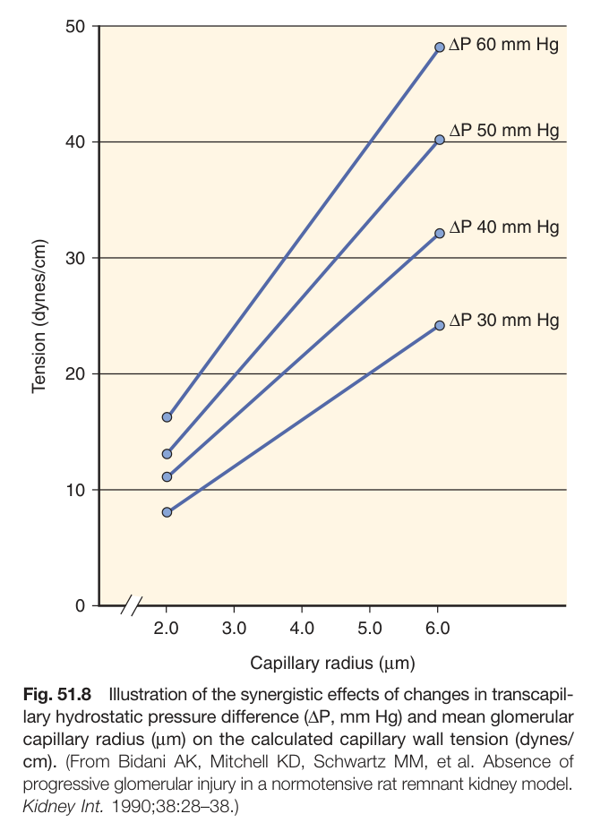

Fig. 51.8 Illustration of the synergistic effects of changes in transcapillary hydrostatic pressure difference (AP, mm Hg) and mean glomerular capillary radius (um) on the calculated capillary wall tension (dynes/ cm). (From Bidani AK, Mitchell KD, Schwartz MM, et al. Absence of progressive glomerular injury in a normotensive rat remnant kidney model. Kidney Int. 1990;38:28-38.)

---

### Fig_51_9

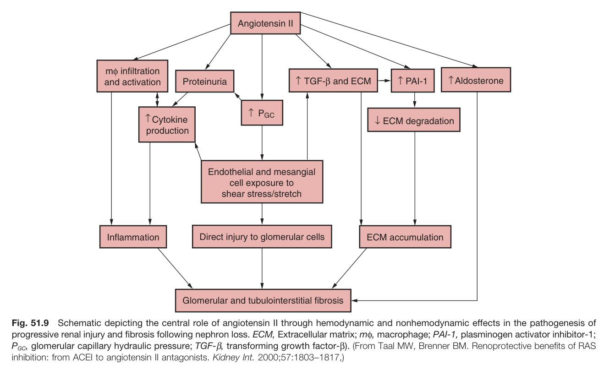

Fig. 51.9 Schematic depicting the central role of angiotensin II through hemodynamic and nonhemodynamic effects in the pathogenesis of progressive renal injury and fibrosis following nephron loss. ECM, Extracellular matrix; mo, macrophage; PAI-1, plasminogen activator inhibitor-1; PGC, glomerular capillary hydraulic pressure; TGF-β, transforming growth factor-ẞ). (From Taal MW, Brenner BM. Renoprotective benefits of RAS inhibition: from ACEI to angiotensin II antagonists. Kidney Int. 2000;57:1803-1817,)

---

### Fig_51_10

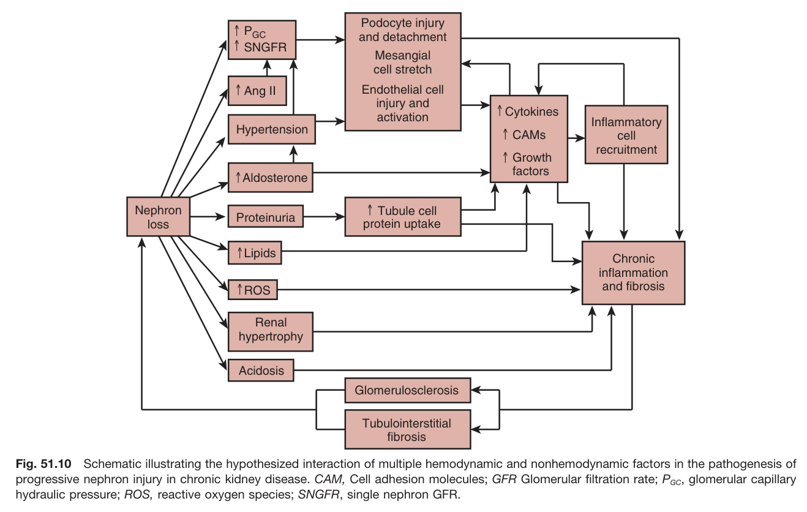

Fig. 51.10 Schematic illustrating the hypothesized interaction of multiple hemodynamic and nonhemodynamic factors in the pathogenesis of progressive nephron injury in chronic kidney disease. CAM, Cell adhesion molecules; GFR Glomerular filtration rate; PGC, glomerular capillary hydraulic pressure; ROS, reactive oxygen species; SNGFR, single nephron GFR.

---

### Fig_51_11

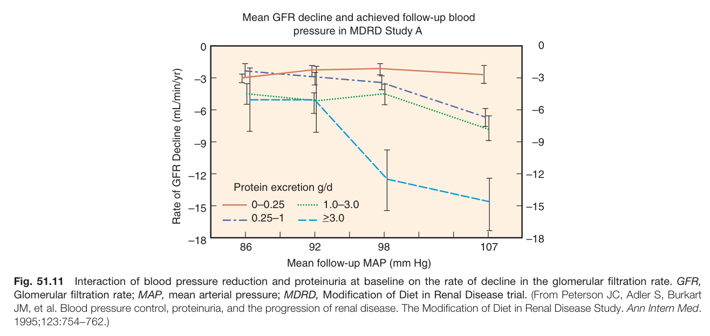

Fig. 51.11 Interaction of blood pressure reduction and proteinuria at baseline on the rate of decline in the glomerular filtration rate. GFR, Glomerular filtration rate; MAP, mean arterial pressure; MDRD, Modification of Diet in Renal Disease trial. (From Peterson JC, Adler S, Burkart JM, et al. Blood pressure control, proteinuria, and the progression of renal disease. The Modification of Diet in Renal Disease Study. Ann Intern Med. 1995;123:754-762.)

---

### Fig_51_12

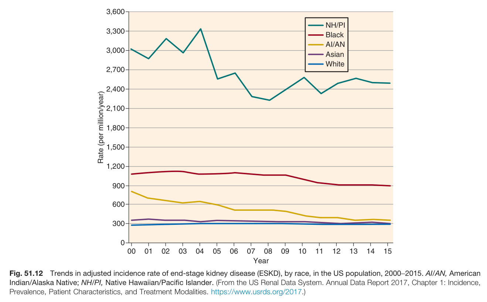

Fig. 51.12 Trends in adjusted incidence rate of end-stage kidney disease (ESKD), by race, in the US population, 2000-2015. AI/AN, American Indian/Alaska Native; NH/PI, Native Hawaiian/Pacific Islander. (From the US Renal Data System. Annual Data Report 2017, Chapter 1: Incidence, Prevalence, Patient Characteristics, and Treatment Modalities. https://www.usrds.org/2017.)

---

### Fig_51_13

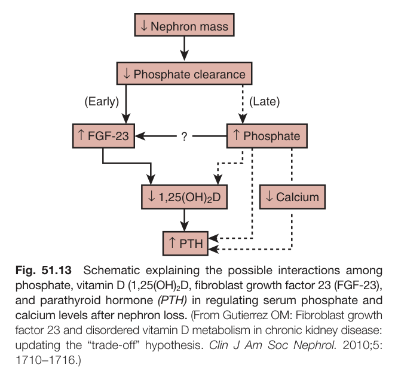

Fig. 51.13 Schematic explaining the possible interactions among phosphate, vitamin D (1,25(OH)2D, fibroblast growth factor 23 (FGF-23), and parathyroid hormone (PTH) in regulating serum phosphate and calcium levels after nephron loss. (From Gutierrez OM: Fibroblast growth factor 23 and disordered vitamin D metabolism in chronic kidney disease: updating the "trade-off" hypothesis. Clin J Am Soc Nephrol. 2010;5: 1710-1716.)

---

### Fig_51_14

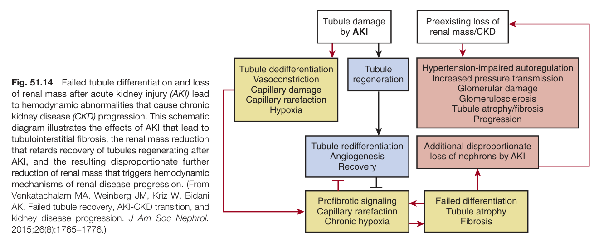

Fig. 51.14 Failed tubule differentiation and loss of renal mass after acute kidney injury (AKI) lead to hemodynamic abnormalities that cause chronic kidney disease (CKD) progression. This schematic diagram illustrates the effects of AKI that lead to tubulointerstitial fibrosis, the renal mass reduction that retards recovery of tubules regenerating after AKI, and the resulting disproportionate further reduction of renal mass that triggers hemodynamic mechanisms of renal disease progression. (From Venkatachalam MA, Weinberg JM, Kriz W, Bidani AK. Failed tubule recovery, AKI-CKD transition, and kidney disease progression. J Am Soc Nephrol. 2015;26(8):1765-1776.)

---

## Tables

### Table_51_1

#### Table Image

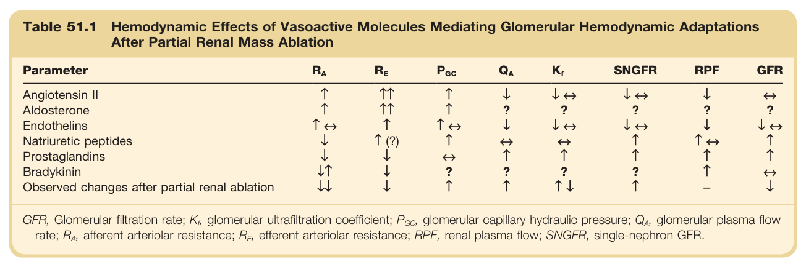

#### Table Data (CSV: [Table_51_1.csv](Table_51_1.csv))

```markdown
| Table Text (OCR) |
| :--- |
| Table 51.1 Hemodynamic Effects of Vasoactive Molecules Mediating Glomerular Hemodynamic Adaptations After Partial Renal Mass Ablation Parameter   R_A    R_E    P_{GC}    Q_A    K_f   SNGFR  RPF  GFR    Angiotensin II  ↑  ↑↑  ↑  ↓  ↓ ↔  ↓ ↔  ↓  ↔    Aldosterone  ↑  ↑↑  ↑  ?  ?  ?  ?  ?    Endothelins  ↑ ↔  ↑  ↑ ↔  ↓  ↓ ↔  ↓ ↔  ↓  ↓ ↔    Natriuretic peptides  ↓  ↑ (?)  ↑  ↔  ↔  ↑  ↑ ↔  ↑    Prostaglandins  ↓  ↓  ↔  ↑  ↑  ↑  ↑  ↑    Bradykinin  ↓↑  ↓  ?  ?  ?  ?  ↑  ↔    Observed changes after partial renal ablation  ↓↓  ↓  ↑  ↑  ↑↓  ↑  -  ↓ GFR, Glomerular filtration rate; K<sub>f</sub>, glomerular ultrafiltration coefficient; P<sub>GC</sub>, glomerular capillary hydraulic pressure; Q<sub>A</sub>, glomerular plasma flow rate; R , afferent arteriolar resistance; R , efferent arteriolar resistance; RPF, renal plasma flow; SNGFR, single-nephron GFR. |
```

Table 51.1 Hemodynamic Effects of Vasoactive Molecules Mediating Glomerular Hemodynamic Adaptations After Partial Renal Mass Ablation | Parameter | RA | RE | PGC | QA | K | SNGFR | RPF | GFR | | :-------------------------------------------- | :--- | :---- | :--- | :--- | :--- | :---- | :--- | :--- | | Angiotensin II | ↑ | ↑↑ | ↑ | ↓ | ↓↔ | ↓↔ | ↓ | ↓ | | Aldosterone | ↑ | ↑↑ | ↑ | ? | ? | ↓? | ? | ↓ | | Endothelins | ↑ | 竹山 | ↑ | ↓ | ↓↔ | ↓↔ | ↓ | ↓↔ | | Natriuretic peptides | ↓ | ↑ (?) | ↑ | ↑ | ↔ | ↑ | ↑ | ↑ | | Prostaglandins | ↓ | ↓ | ↑ | ↑ | ↔ | ↑ | ↑ | ↑↔ | | Bradykinin | ↓ | ↓ | ? | ↑ | ? | ? | ↑ | ↑ | | Observed changes after partial renal ablation | ↓ | ↓ | ↑ | ↑ | ? | ↑ | ↑ | ↓ | GFR, Glomerular filtration rate; K, glomerular ultrafiltration coefficient; PGC, glomerular capillary hydraulic pressure; QA, glomerular plasma flow rate; RA, afferent arteriolar resistance; RE, efferent arteriolar resistance; RPF, renal plasma flow; SNGFR, single-nephron GFR.

---
