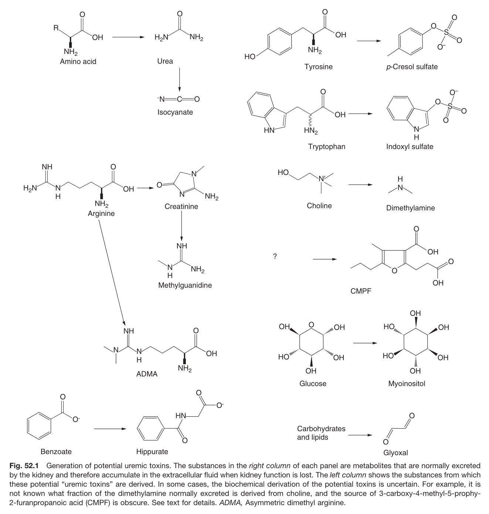
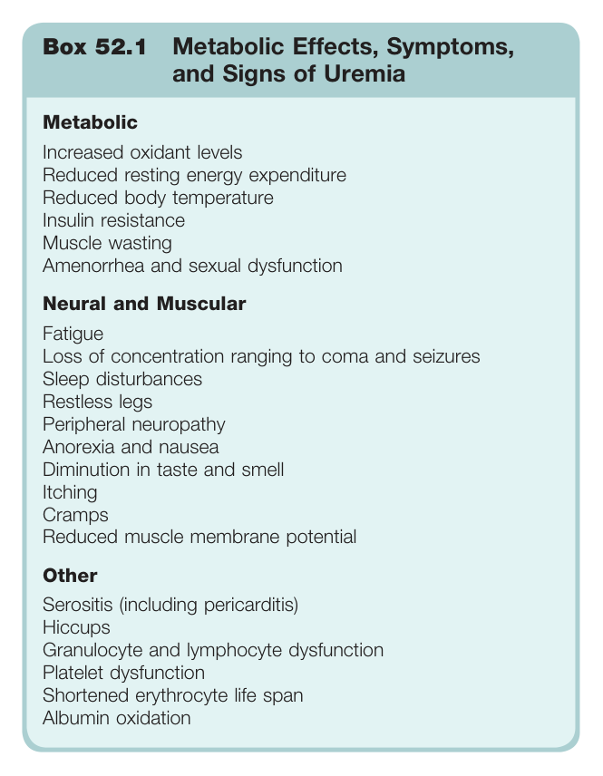
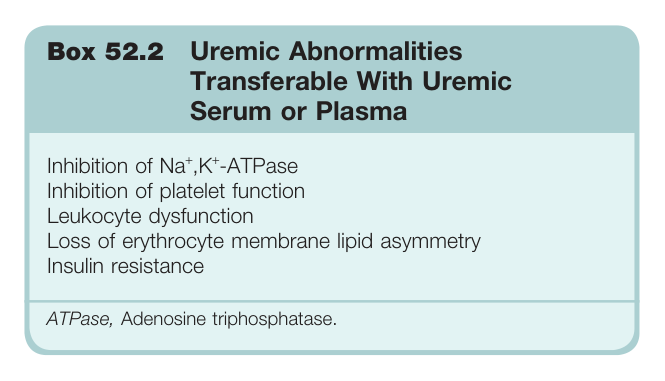
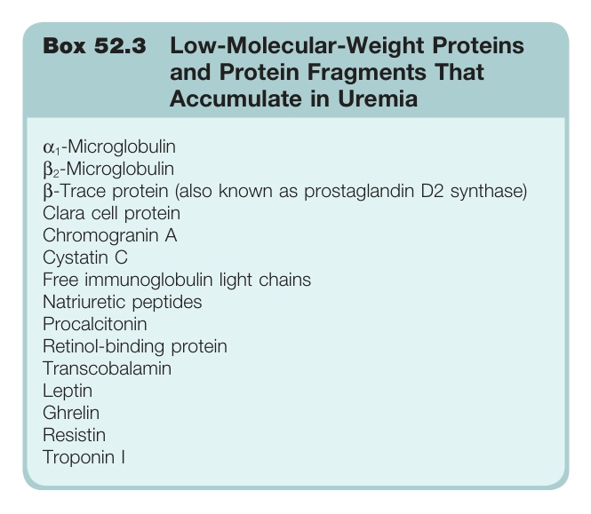

# 52. The Pathophysiology of Uremia - Figures and Tables Index

This document lists all figures, tables and boxes extracted from `52. The Pathophysiology of Uremia.pdf`.

## Table of Contents
- [Figures](#figures)
- [Tables](#tables)
- [Boxes](#boxes)

---

## Figures

### Fig_52_1



Fig. 52.1 Generation of potential uremic toxins. The substances in the right column of each panel are metabolites that are normally excreted by the kidney and therefore accumulate in the extracellular fluid when kidney function is lost. The left column shows the substances from which these potential "uremic toxins" are derived. In some cases, the biochemical derivation of the potential toxins is uncertain. For example, it is not known what fraction of the dimethylamine normally excreted is derived from choline, and the source of 3-carboxy-4-methyl-5-prophy-2-furanpropanoic acid (CMPF) is obscure. See text for details. ADMA, Asymmetric dimethyl arginine.

---

## Tables

*No tables resolved for this chapter.*

## Boxes

### Box_52_1



#### Box Text

```markdown
Box 52.1 Metabolic Effects, Symptoms, and Signs of Uremia **Metabolic** Increased oxidant levels Reduced resting energy expenditure Reduced body temperature Insulin resistance Muscle wasting Amenorrhea and sexual dysfunction **Neural and Muscular** Fatigue Loss of concentration ranging to coma and seizures Sleep disturbances Restless legs Peripheral neuropathy Anorexia and nausea Diminution in taste and smell Itching Cramps Reduced muscle membrane potential **Other** Serositis (including pericarditis) Hiccups Granulocyte and lymphocyte dysfunction Platelet dysfunction Shortened erythrocyte life span Albumin oxidation
```

Box 52.1 Metabolic Effects, Symptoms, and Signs of Uremia **Metabolic** Increased oxidant levels Reduced resting energy expenditure Reduced body temperature Insulin resistance Muscle wasting Amenorrhea and sexual dysfunction **Neural and Muscular** Fatigue Loss of concentration ranging to coma and seizures Sleep disturbances Restless legs Peripheral neuropathy Anorexia and nausea Diminution in taste and smell Itching Cramps Reduced muscle membrane potential **Other** Serositis (including pericarditis) Hiccups Granulocyte and lymphocyte dysfunction Platelet dysfunction Shortened erythrocyte life span Albumin oxidation

---

### Box_52_2



#### Box Text

```markdown
Box 52.2 Uremic Abnormalities Transferable With Uremic Serum or Plasma Inhibition of Na<sup>+</sup>,K<sup>+</sup>-ATPase Inhibition of platelet function Leukocyte dysfunction Loss of erythrocyte membrane lipid asymmetry Insulin resistance ATPase, Adenosine triphosphatase.
```

Box 52.2 Uremic Abnormalities Transferable With Uremic Serum or Plasma Inhibition of Na+, K+-ATPase Inhibition of platelet function Leukocyte dysfunction Loss of erythrocyte membrane lipid asymmetry Insulin resistance ATPase, Adenosine triphosphatase.

---

### Box_52_3



#### Box Text

```markdown
Box 52.3 Low-Molecular-Weight Proteins and Protein Fragments That Accumulate in Uremia α -Microglobulin β<sub>2</sub>-Microglobulin β-Trace protein (also known as prostaglandin D2 synthase) Clara cell protein Chromogranin A Cystatin C Free immunoglobulin light chains Natriuretic peptides Procalcitonin Retinol-binding protein Transcobalamin Leptin Ghrelin Resistin Troponin I
```

Box 52.3 Low-Molecular-Weight Proteins and Protein Fragments That Accumulate in Uremia α₁-Microglobulin B2-Microglobulin B-Trace protein (also known as prostaglandin D2 synthase) Clara cell protein Chromogranin A Cystatin C Free immunoglobulin light chains Natriuretic peptides Procalcitonin Retinol-binding protein Transcobalamin Leptin Ghrelin Resistin Troponin I

---
