# 53. Chronic Kidney Disease–Mineral Bone Disorder - Figures and Tables Index

This document lists all figures and tables extracted from `53. Chronic Kidney Disease–Mineral Bone Disorder.pdf`.

## Table of Contents
- [Figures](#figures)
- [Tables](#tables)

---

## Figures

### Fig_53_1

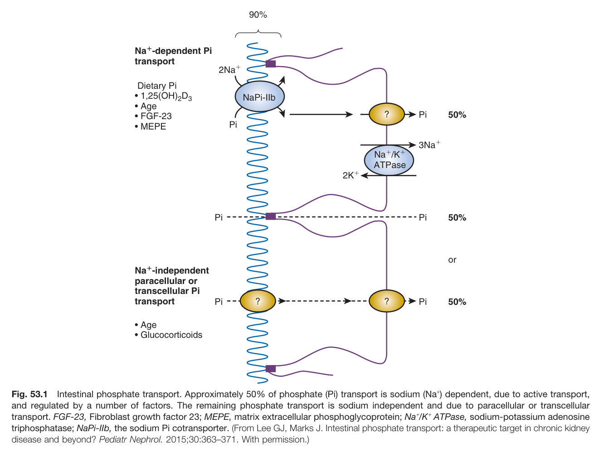

Fig. 53.1 Intestinal phosphate transport. Approximately 50% of phosphate (Pi) transport is sodium (Na+) dependent, due to active transport, and regulated by a number of factors. The remaining phosphate transport is sodium independent and due to paracellular or transcellular transport. FGF-23, Fibroblast growth factor 23; MEPE, matrix extracellular phosphoglycoprotein; Na+/K+ ATPase, sodium-potassium adenosine triphosphatase; NaPi-llb, the sodium Pi cotransporter. (From Lee GJ, Marks J. Intestinal phosphate transport: a therapeutic target in chronic kidney disease and beyond? Pediatr Nephrol. 2015;30:363-371. With permission.)

---

### Fig_53_2

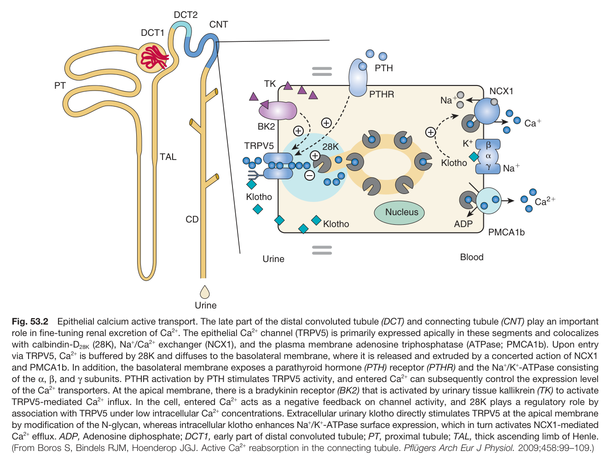

Fig. 53.2 Epithelial calcium active transport. The late part of the distal convoluted tubule (DCT) and connecting tubule (CNT) play an important role in fine-tuning renal excretion of Ca2+. The epithelial Ca2+ channel (TRPV5) is primarily expressed apically in these segments and colocalizes with calbindin-D28K (28K), Na+/Ca2+ exchanger (NCX1), and the plasma membrane adenosine triphosphatase (ATPase; PMCA1b). Upon entry via TRPV5, Ca2+ is buffered by 28K and diffuses to the basolateral membrane, where it is released and extruded by a concerted action of NCX1 and PMCA1b. In addition, the basolateral membrane exposes a parathyroid hormone (PTH) receptor (PTHR) and the Na+/K+-ATPase consisting of the α, β, and y subunits. PTHR activation by PTH stimulates TRPV5 activity, and entered Ca2+ can subsequently control the expression level of the Ca2+ transporters. At the apical membrane, there is a bradykinin receptor (BK2) that is activated by urinary tissue kallikrein (TK) to activate TRPV5-mediated Ca2+ influx. In the cell, entered Ca2+ acts as a negative feedback on channel activity, and 28K plays a regulatory role by association with TRPV5 under low intracellular Ca2+ concentrations. Extracellular urinary klotho directly stimulates TRPV5 at the apical membrane by modification of the N-glycan, whereas intracellular klotho enhances Na+/K+-ATPase surface expression, which in turn activates NCX1-mediated Ca2+ efflux. ADP, Adenosine diphosphate; DCT1, early part of distal convoluted tubule; PT, proximal tubule; TAL, thick ascending limb of Henle. (From Boros S, Bindels RJM, Hoenderop JGJ. Active Ca2+ reabsorption in the connecting tubule. Pflügers Arch Eur J Physiol. 2009;458:99-109.)

---

### Fig_53_3

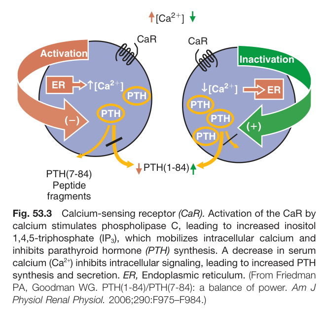

Fig. 53.3 Calcium-sensing receptor (CaR). Activation of the CaR by calcium stimulates phospholipase C, leading to increased inositol 1,4,5-triphosphate (IP3), which mobilizes intracellular calcium and inhibits parathyroid hormone (PTH) synthesis. A decrease in serum calcium (Ca2+) inhibits intracellular signaling, leading to increased PTH synthesis and secretion. ER, Endoplasmic reticulum. (From Friedman PA, Goodman WG. PTH(1-84)/PTH(7-84): a balance of power. Am J Physiol Renal Physiol. 2006;290:F975-F984.)

---

### Fig_53_4

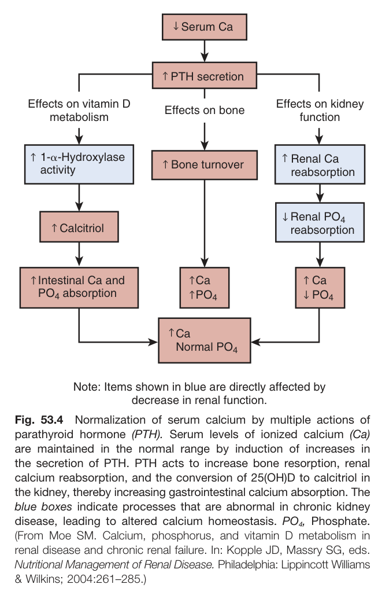

Fig. 53.4 Normalization of serum calcium by multiple actions of parathyroid hormone (PTH). Serum levels of ionized calcium (Ca) are maintained in the normal range by induction of increases in the secretion of PTH. PTH acts to increase bone resorption, renal calcium reabsorption, and the conversion of 25(OH)D to calcitriol in the kidney, thereby increasing gastrointestinal calcium absorption. The blue boxes indicate processes that are abnormal in chronic kidney disease, leading to altered calcium homeostasis. PO4, Phosphate. (From Moe SM. Calcium, phosphorus, and vitamin D metabolism in renal disease and chronic renal failure. In: Kopple JD, Massry SG, eds. Nutritional Management of Renal Disease. Philadelphia: Lippincott Williams & Wilkins; 2004:261-285.)

---

### Fig_53_5

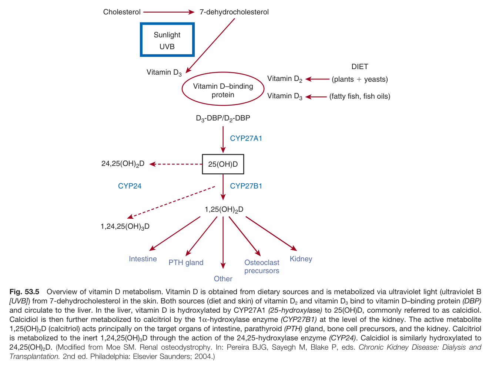

Fig. 53.5 Overview of vitamin D metabolism. Vitamin D is obtained from dietary sources and is metabolized via ultraviolet light (ultraviolet B [UVB]) from 7-dehydrocholesterol in the skin. Both sources (diet and skin) of vitamin D₂ and vitamin D3 bind to vitamin D-binding protein (DBP) and circulate to the liver. In the liver, vitamin D is hydroxylated by CYP27A1 (25-hydroxylase) to 25(OH)D, commonly referred to as calcidiol. Calcidiol is then further metabolized to calcitriol by the 1a-hydroxylase enzyme (CYP27B1) at the level of the kidney. The active metabolite 1,25(OH)2D (calcitriol) acts principally on the target organs of intestine, parathyroid (PTH) gland, bone cell precursors, and the kidney. Calcitriol is metabolized to the inert 1,24,25(OH)3D through the action of the 24,25-hydroxylase enzyme (CYP24). Calcidiol is similarly hydroxylated to 24,25(OH)2D. (Modified from Moe SM. Renal osteodystrophy. In: Pereira BJG, Sayegh M, Blake P, eds. Chronic Kidney Disease: Dialysis and Transplantation. 2nd ed. Philadelphia: Elsevier Saunders; 2004.)

---

### Fig_53_6

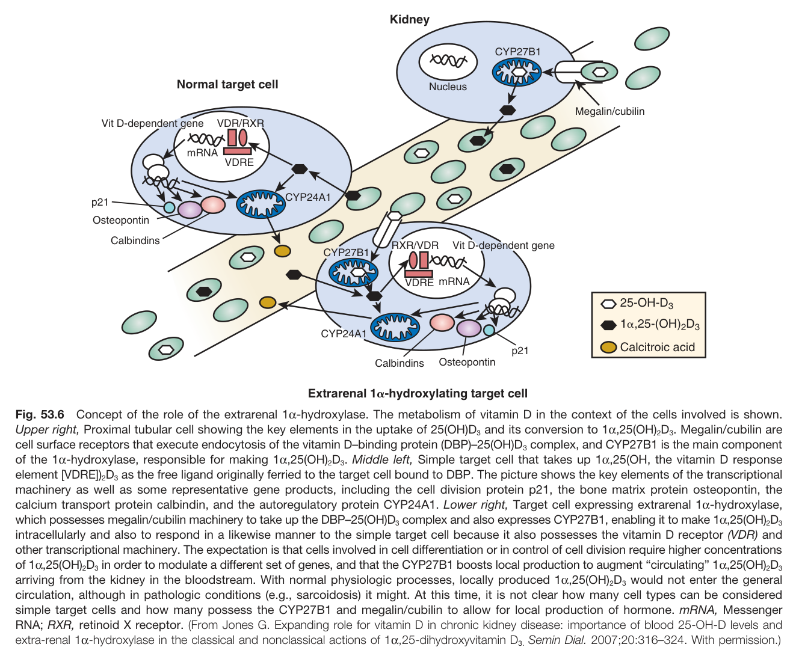

Fig. 53.6 Concept of the role of the extrarenal 1a-hydroxylase. The metabolism of vitamin D in the context of the cells involved is shown. Upper right, Proximal tubular cell showing the key elements in the uptake of 25(OH)D3 and its conversion to 10,25(OH)2D3. Megalin/cubilin are cell surface receptors that execute endocytosis of the vitamin D-binding protein (DBP)-25(OH)D3 complex, and CYP27B1 is the main component of the 1a-hydroxylase, responsible for making 10,25(OH)2D3. Middle left, Simple target cell that takes up 1α,25(OH, the vitamin D response element [VDRE])2D3 as the free ligand originally ferried to the target cell bound to DBP. The picture shows the key elements of the transcriptional machinery as well as some representative gene products, including the cell division protein p21, the bone matrix protein osteopontin, the calcium transport protein calbindin, and the autoregulatory protein CYP24A1. Lower right, Target cell expressing extrarenal 1a-hydroxylase, which possesses megalin/cubilin machinery to take up the DBP-25(OH)D3 complex and also expresses CYP27B1, enabling it to make 1α,25(OH)2D3 intracellularly and also to respond in a likewise manner to the simple target cell because it also possesses the vitamin D receptor (VDR) and other transcriptional machinery. The expectation is that cells involved in cell differentiation or in control of cell division require higher concentrations of 10,25(OH)2D3 in order to modulate a different set of genes, and that the CYP27B1 boosts local production to augment "circulating" 1α,25(OH)2D3 arriving from the kidney in the bloodstream. With normal physiologic processes, locally produced 1α,25(OH)2D3 would not enter the general circulation, although in pathologic conditions (e.g., sarcoidosis) it might. At this time, it is not clear how many cell types can be considered simple target cells and how many possess the CYP27B1 and megalin/cubilin to allow for local production of hormone. mRNA, Messenger RNA; RXR, retinoid X receptor. (From Jones G. Expanding role for vitamin D in chronic kidney disease: importance of blood 25-OH-D levels and extra-renal 1a-hydroxylase in the classical and nonclassical actions of 1α,25-dihydroxyvitamin D3. Semin Dial. 2007;20:316-324. With permission.)

---

### Fig_53_7

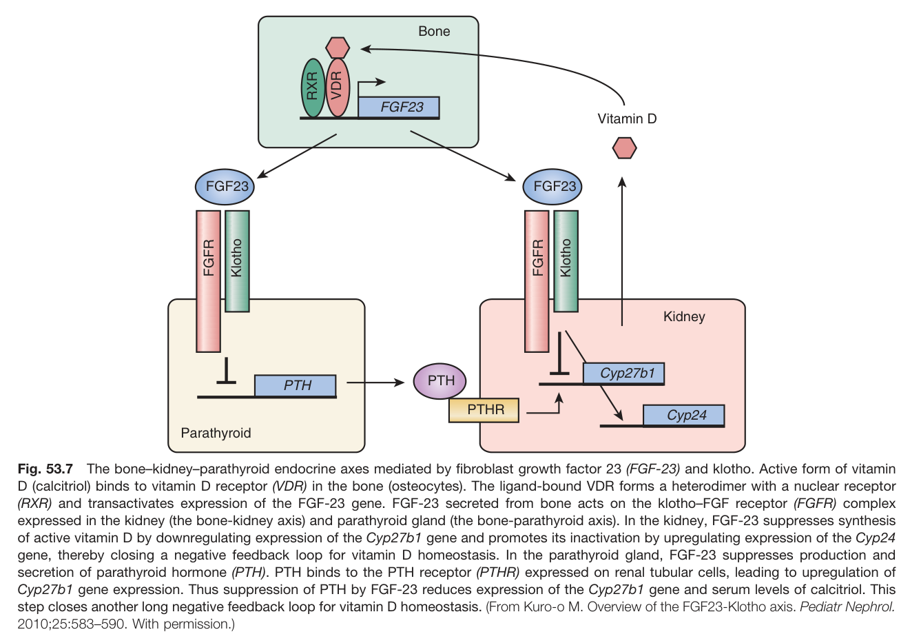

Fig. 53.7 The bone-kidney-parathyroid endocrine axes mediated by fibroblast growth factor 23 (FGF-23) and klotho. Active form of vitamin D (calcitriol) binds to vitamin D receptor (VDR) in the bone (osteocytes). The ligand-bound VDR forms a heterodimer with a nuclear receptor (RXR) and transactivates expression of the FGF-23 gene. FGF-23 secreted from bone acts on the klotho-FGF receptor (FGFR) complex expressed in the kidney (the bone-kidney axis) and parathyroid gland (the bone-parathyroid axis). In the kidney, FGF-23 suppresses synthesis of active vitamin D by downregulating expression of the Cyp27b1 gene and promotes its inactivation by upregulating expression of the Cyp24 gene, thereby closing a negative feedback loop for vitamin D homeostasis. In the parathyroid gland, FGF-23 suppresses production and secretion of parathyroid hormone (PTH). PTH binds to the PTH receptor (PTHR) expressed on renal tubular cells, leading to upregulation of Cyp27b1 gene expression. Thus suppression of PTH by FGF-23 reduces expression of the Cyp27b1 gene and serum levels of calcitriol. This step closes another long negative feedback loop for vitamin D homeostasis. (From Kuro-o M. Overview of the FGF23-Klotho axis. Pediatr Nephrol. 2010;25:583-590. With permission.)

---

### Fig_53_8

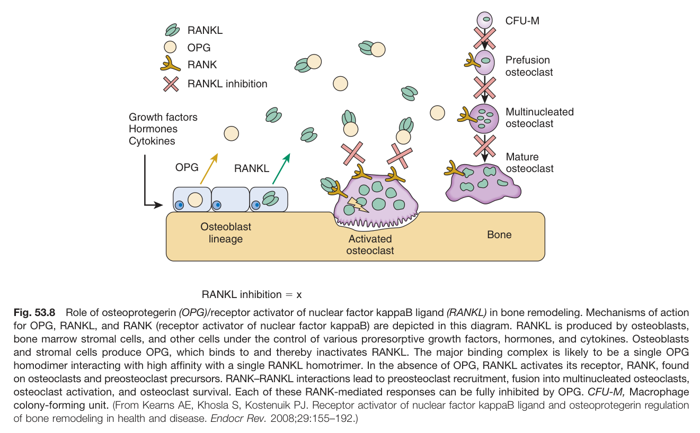

Fig. 53.8 Role of osteoprotegerin (OPG)/receptor activator of nuclear factor kappaB ligand (RANKL) in bone remodeling. Mechanisms of action for OPG, RANKL, and RANK (receptor activator of nuclear factor kappaB) are depicted in this diagram. RANKL is produced by osteoblasts, bone marrow stromal cells, and other cells under the control of various proresorptive growth factors, hormones, and cytokines. Osteoblasts and stromal cells produce OPG, which binds to and thereby inactivates RANKL. The major binding complex is likely to be a single OPG homodimer interacting with high affinity with a single RANKL homotrimer. In the absence of OPG, RANKL activates its receptor, RANK, found on osteoclasts and preosteoclast precursors. RANK-RANKL interactions lead to preosteoclast recruitment, fusion into multinucleated osteoclasts, osteoclast activation, and osteoclast survival. Each of these RANK-mediated responses can be fully inhibited by OPG. CFU-M, Macrophage colony-forming unit. (From Kearns AE, Khosla S, Kostenuik PJ. Receptor activator of nuclear factor kappaB ligand and osteoprotegerin regulation of bone remodeling in health and disease. Endocr Rev. 2008;29:155-192.)

---

### Fig_53_9

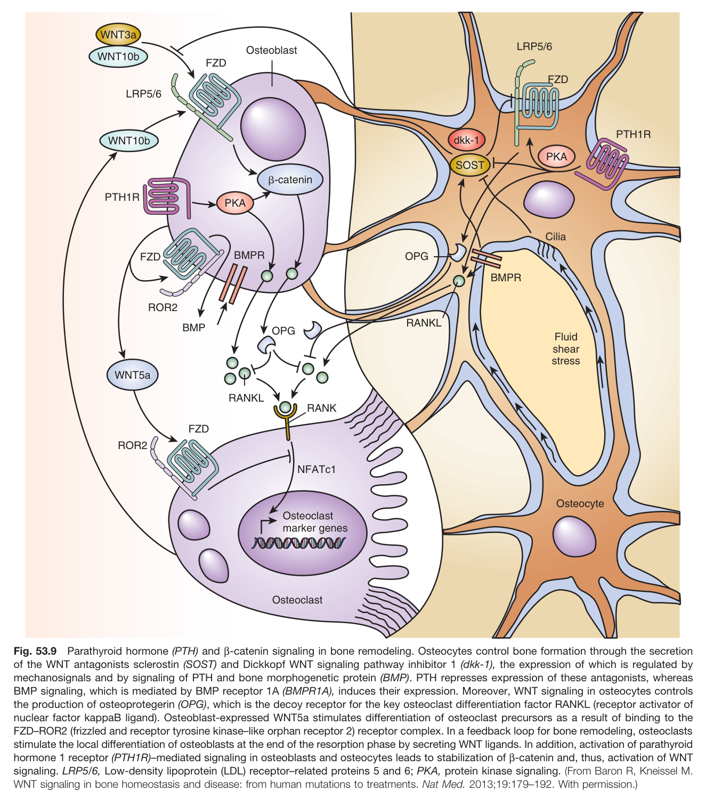

Fig. 53.9 Parathyroid hormone (PTH) and β-catenin signaling in bone remodeling. Osteocytes control bone formation through the secretion of the WNT antagonists sclerostin (SOST) and Dickkopf WNT signaling pathway inhibitor 1 (dkk-1), the expression of which is regulated by mechanosignals and by signaling of PTH and bone morphogenetic protein (BMP). PTH represses expression of these antagonists, whereas BMP signaling, which is mediated by BMP receptor 1A (BMPR1A), induces their expression. Moreover, WNT signaling in osteocytes controls the production of osteoprotegerin (OPG), which is the decoy receptor for the key osteoclast differentiation factor RANKL (receptor activator of nuclear factor kappaB ligand). Osteoblast-expressed WNT5a stimulates differentiation of osteoclast precursors as a result of binding to the FZD-ROR2 (frizzled and receptor tyrosine kinase-like orphan receptor 2) receptor complex. In a feedback loop for bone remodeling, osteoclasts stimulate the local differentiation of osteoblasts at the end of the resorption phase by secreting WNT ligands. In addition, activation of parathyroid hormone 1 receptor (PTH1R)-mediated signaling in osteoblasts and osteocytes leads to stabilization of β-catenin and, thus, activation of WNT signaling. LRP5/6, Low-density lipoprotein (LDL) receptor-related proteins 5 and 6; PKA, protein kinase signaling. (From Baron R, Kneissel M. WNT signaling in bone homeostasis and disease: from human mutations to treatments. Nat Med. 2013;19:179-192. With permission.)

---

### Fig_53_10

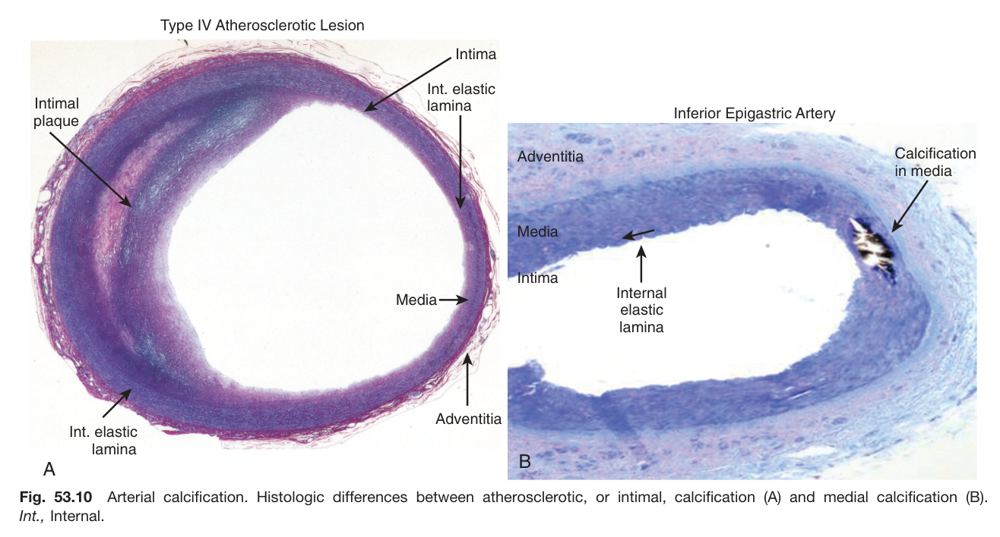

Fig. 53.10 Arterial calcification. Histologic differences between atherosclerotic, or intimal, calcification (A) and medial calcification (B). Int., Internal.

---

### Fig_53_11

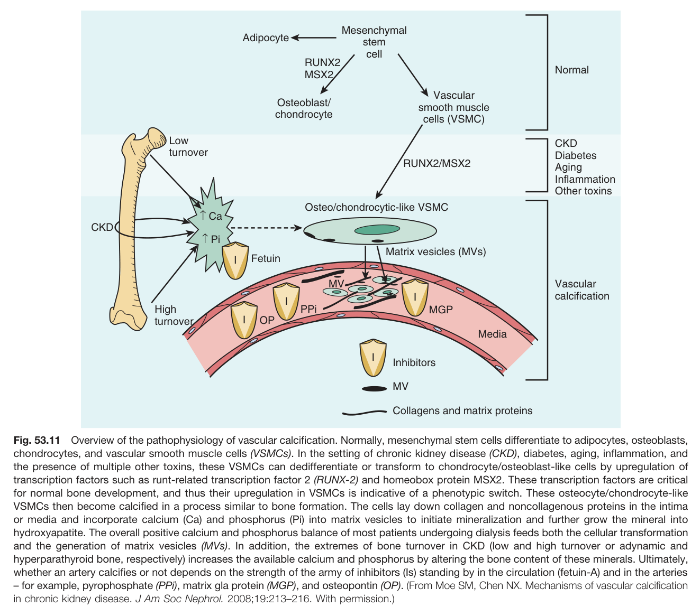

Fig. 53.11 Overview of the pathophysiology of vascular calcification. Normally, mesenchymal stem cells differentiate to adipocytes, osteoblasts, chondrocytes, and vascular smooth muscle cells (VSMCs). In the setting of chronic kidney disease (CKD), diabetes, aging, inflammation, and the presence of multiple other toxins, these VSMCs can dedifferentiate or transform to chondrocyte/osteoblast-like cells by upregulation of transcription factors such as runt-related transcription factor 2 (RUNX-2) and homeobox protein MSX2. These transcription factors are critical for normal bone development, and thus their upregulation in VSMCs is indicative of a phenotypic switch. These osteocyte/chondrocyte-like VSMCs then become calcified in a process similar to bone formation. The cells lay down collagen and noncollagenous proteins in the intima or media and incorporate calcium (Ca) and phosphorus (Pi) into matrix vesicles to initiate mineralization and further grow the mineral into hydroxyapatite. The overall positive calcium and phosphorus balance of most patients undergoing dialysis feeds both the cellular transformation and the generation of matrix vesicles (MVs). In addition, the extremes of bone turnover in CKD (low and high turnover or adynamic and hyperparathyroid bone, respectively) increases the available calcium and phosphorus by altering the bone content of these minerals. Ultimately, whether an artery calcifies or not depends on the strength of the army of inhibitors (Is) standing by in the circulation (fetuin-A) and in the arteries for example, pyrophosphate (PPi), matrix gla protein (MGP), and osteopontin (OP). (From Moe SM, Chen NX. Mechanisms of vascular calcification in chronic kidney disease. J Am Soc Nephrol. 2008;19:213-216. With permission.)

---

### Fig_53_12

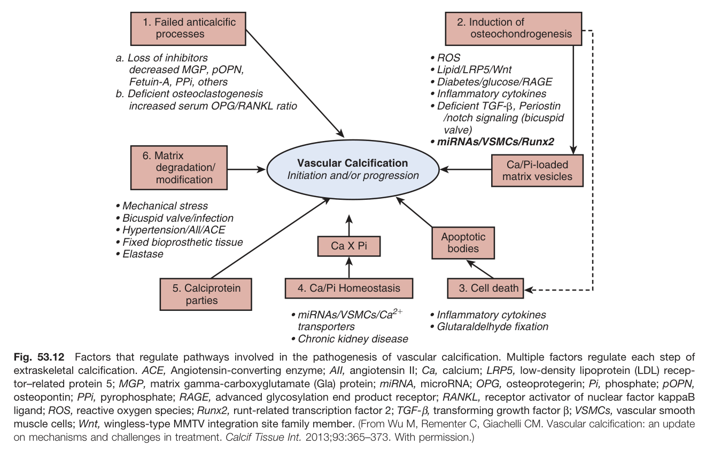

Fig. 53.12 Factors that regulate pathways involved in the pathogenesis of vascular calcification. Multiple factors regulate each step of extraskeletal calcification. ACE, Angiotensin-converting enzyme; All, angiotensin II; Ca, calcium; LRP5, low-density lipoprotein (LDL) receptor-related protein 5; MGP, matrix gamma-carboxyglutamate (Gla) protein; miRNA, microRNA; OPG, osteoprotegerin; Pi, phosphate; pOPN, osteopontin; PPi, pyrophosphate; RAGE, advanced glycosylation end product receptor; RANKL, receptor activator of nuclear factor kappaB ligand; ROS, reactive oxygen species; Runx2, runt-related transcription factor 2; TGF-β, transforming growth factor β; VSMCs, vascular smooth muscle cells; Wnt, wingless-type MMTV integration site family member. (From Wu M, Rementer C, Giachelli CM. Vascular calcification: an update on mechanisms and challenges in treatment. Calcif Tissue Int. 2013;93:365-373. With permission.)

---

### Fig_53_13

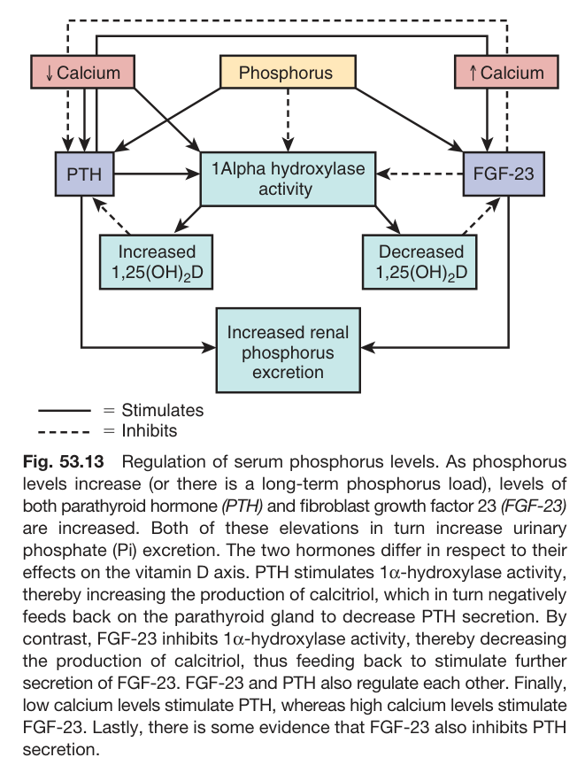

Fig. 53.13 Regulation of serum phosphorus levels. As phosphorus levels increase (or there is a long-term phosphorus load), levels of both parathyroid hormone (PTH) and fibroblast growth factor 23 (FGF-23) are increased. Both of these elevations in turn increase urinary phosphate (Pi) excretion. The two hormones differ in respect to their effects on the vitamin D axis. PTH stimulates 1a-hydroxylase activity, thereby increasing the production of calcitriol, which in turn negatively feeds back on the parathyroid gland to decrease PTH secretion. By contrast, FGF-23 inhibits 1x-hydroxylase activity, thereby decreasing the production of calcitriol, thus feeding back to stimulate further secretion of FGF-23. FGF-23 and PTH also regulate each other. Finally, low calcium levels stimulate PTH, whereas high calcium levels stimulate FGF-23. Lastly, there is some evidence that FGF-23 also inhibits PTH secretion.

---

### Fig_53_14

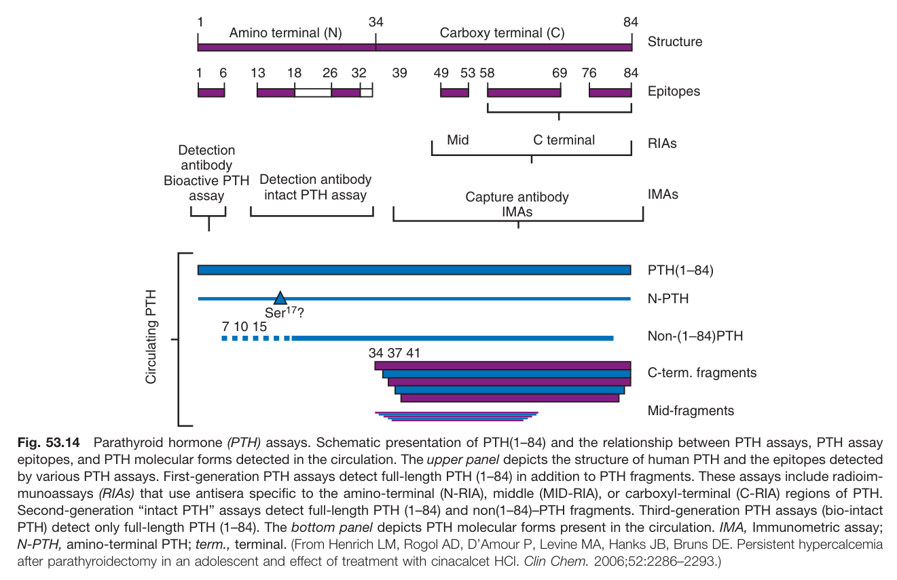

Fig. 53.14 Parathyroid hormone (PTH) assays. Schematic presentation of PTH(1-84) and the relationship between PTH assays, PTH assay epitopes, and PTH molecular forms detected in the circulation. The upper panel depicts the structure of human PTH and the epitopes detected by various PTH assays. First-generation PTH assays detect full-length PTH (1-84) in addition to PTH fragments. These assays include radioimmunoassays (RIAs) that use antisera specific to the amino-terminal (N-RIA), middle (MID-RIA), or carboxyl-terminal (C-RIA) regions of PTH. Second-generation "intact PTH" assays detect full-length PTH (1-84) and non (1-84)-PTH fragments. Third-generation PTH assays (bio-intact PTH) detect only full-length PTH (1-84). The bottom panel depicts PTH molecular forms present in the circulation. IMA, Immunometric assay; N-PTH, amino-terminal PTH; term., terminal. (From Henrich LM, Rogol AD, D'Amour P, Levine MA, Hanks JB, Bruns DE. Persistent hypercalcemia after parathyroidectomy in an adolescent and effect of treatment with cinacalcet HCl. Clin Chem. 2006;52:2286-2293.)

---

### Fig_53_15

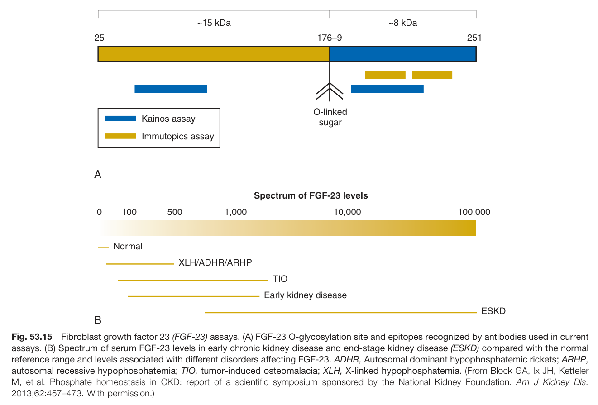

Fig. 53.15 Fibroblast growth factor 23 (FGF-23) assays. (A) FGF-23 O-glycosylation site and epitopes recognized by antibodies used in current assays. (B) Spectrum of serum FGF-23 levels in early chronic kidney disease and end-stage kidney disease (ESKD) compared with the normal reference range and levels associated with different disorders affecting FGF-23. ADHR, Autosomal dominant hypophosphatemic rickets; ARHP, autosomal recessive hypophosphatemia; TIO, tumor-induced osteomalacia; XLH, X-linked hypophosphatemia. (From Block GA, Ix JH, Ketteler M, et al. Phosphate homeostasis in CKD: report of a scientific symposium sponsored by the National Kidney Foundation. Am J Kidney Dis. 2013;62:457-473. With permission.)

---

### Fig_53_16

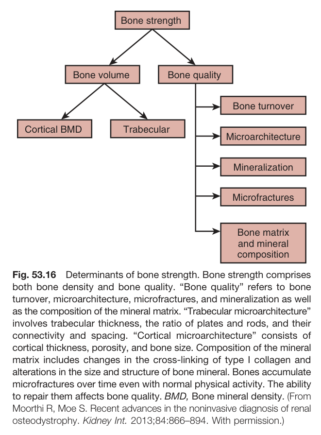

Fig. 53.16 Determinants of bone strength. Bone strength comprises both bone density and bone quality. "Bone quality" refers to bone turnover, microarchitecture, microfractures, and mineralization as well as the composition of the mineral matrix. "Trabecular microarchitecture" involves trabecular thickness, the ratio of plates and rods, and their connectivity and spacing. "Cortical microarchitecture" consists of cortical thickness, porosity, and bone size. Composition of the mineral matrix includes changes in the cross-linking of type I collagen and alterations in the size and structure of bone mineral. Bones accumulate microfractures over time even with normal physical activity. The ability to repair them affects bone quality. BMD, Bone mineral density. (From Moorthi R, Moe S. Recent advances in the noninvasive diagnosis of renal osteodystrophy. Kidney Int. 2013;84:866-894. With permission.)

---

### Fig_53_17

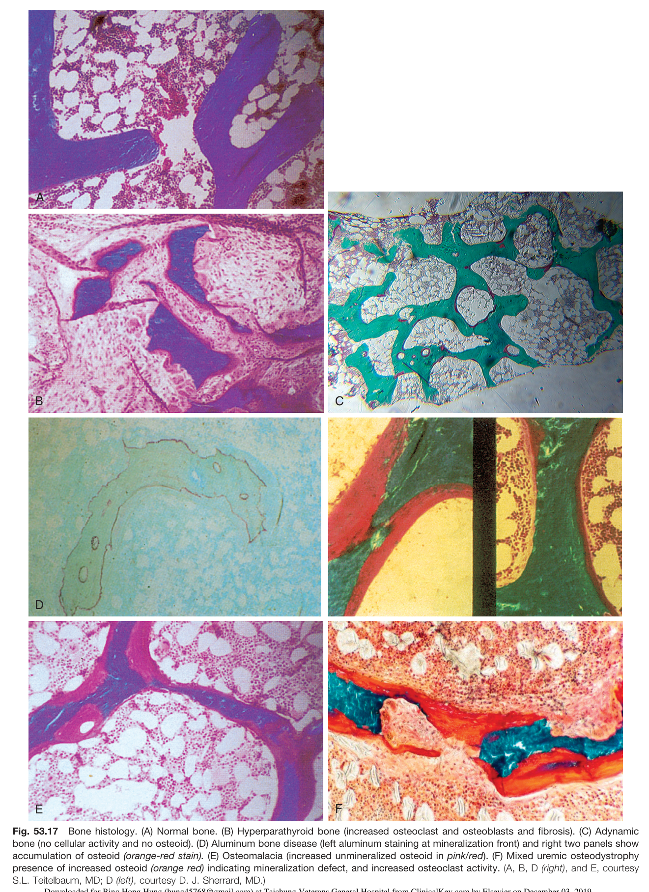

Fig. 53.17 Bone histology. (A) Normal bone. (B) Hyperparathyroid bone (increased osteoclast and osteoblasts and fibrosis). (C) Adynamic bone (no cellular activity and no osteoid). (D) Aluminum bone disease (left aluminum staining at mineralization front) and right two panels show accumulation of osteoid (orange-red stain). (E) Osteomalacia (increased unmineralized osteoid in pink/red). (F) Mixed uremic osteodystrophy presence of increased osteoid (orange red) indicating mineralization defect, and increased osteoclast activity. (A, B, D (right), and E, courtesy S.L. Teitelbaum, MD; D (left), courtesy D. J. Sherrard, MD.)

---

## Tables

### Table_53_1

#### Table Image

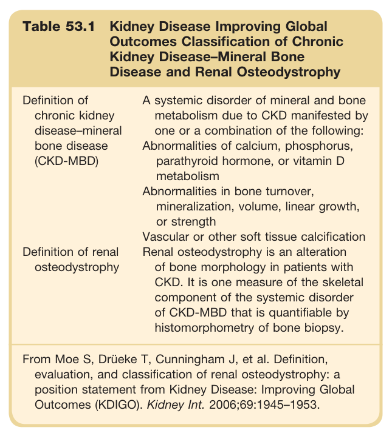

#### Table Data (CSV: [Table_53_1.csv](Table_53_1.csv))

```markdown
| Table Text (OCR) |
| :--- |
| Table 53.1 Kidney Disease Improving Global Outcomes Classification of Chronic Kidney Disease–Mineral Bone Disease and Renal Osteodystrophy Definition of chronic kidney disease–mineral bone disease (CKD-MBD)  A systemic disorder of mineral and bone metabolism due to CKD manifested by one or a combination of the following:Abnormalities of calcium, phosphorus, parathyroid hormone, or vitamin D metabolismAbnormalities in bone turnover, mineralization, volume, linear growth, or strengthVascular or other soft tissue calcification    Definition of renal osteodystrophy  Renal osteodystrophy is an alteration of bone morphology in patients with CKD. It is one measure of the skeletal component of the systemic disorder of CKD-MBD that is quantifiable by histomorphometry of bone biopsy. |
```

Table 53.1 Kidney Disease Improving Global Outcomes Classification of Chronic Kidney Disease-Mineral Bone Disease and Renal Osteodystrophy **Definition of chronic kidney disease-mineral bone disease (CKD-MBD)** A systemic disorder of mineral and bone metabolism due to CKD manifested by one or a combination of the following: Abnormalities of calcium, phosphorus, parathyroid hormone, or vitamin D metabolism Abnormalities in bone turnover, mineralization, volume, linear growth, or strength Vascular or other soft tissue calcification **Definition of renal osteodystrophy** Renal osteodystrophy is an alteration of bone morphology in patients with CKD. It is one measure of the skeletal component of the systemic disorder of CKD-MBD that is quantifiable by histomorphometry of bone biopsy. From Moe S, Drüeke T, Cunningham J, et al. Definition, evaluation, and classification of renal osteodystrophy: a position statement from Kidney Disease: Improving Global Outcomes (KDIGO). Kidney Int. 2006;69:1945-1953.

---

### Table_53_2

#### Table Image

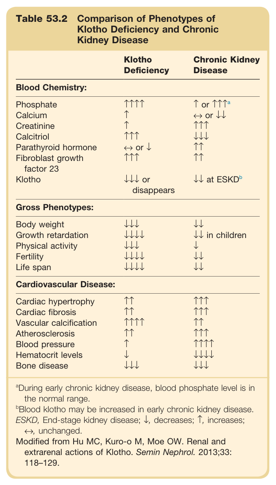

#### Table Data (CSV: [Table_53_2.csv](Table_53_2.csv))

```markdown
| Table Text (OCR) |
| :--- |
| Table 53.2 Comparison of Phenotypes of Klotho Deficiency and Chronic Kidney Disease KlothoDeficiency  Chronic KidneyDisease    Blood Chemistry:    Phosphate  ↑↑↑↑  ↑ or ↑↑↑ ^a     Calcium  ↑  ↔ or ↓↓    Creatinine  ↑  ↑↑↑    Calcitriol  ↑↑↑  ↓↓↓    Parathyroid hormone  ↔ or ↓  ↑↑    Fibroblast growth factor 23  ↑↑↑  ↑↑    Klotho  ↓↓↓ or disappears  ↓↓ at ESKD ^b     Gross Phenotypes:    Body weight  ↓↓↓  ↓↓    Growth retardation  ↓↓↓↓  ↓↓ in children    Physical activity  ↓↓↓  ↓    Fertility  ↓↓↓↓  ↓↓    Life span  ↓↓↓↓  ↓↓    Cardiovascular Disease:    Cardiac hypertrophy  ↑↑  ↑↑↑    Cardiac fibrosis  ↑↑  ↑↑↑    Vascular calcification  ↑↑↑↑  ↑↑    Atherosclerosis  ↑↑  ↑↑↑    Blood pressure  ↑  ↑↑↑↑    Hematocrit levels  ↓  ↓↓↓↓    Bone disease  ↓↓↓  ↓↓↓ <sup>a</sup>During early chronic kidney disease, blood phosphate level is in the normal range. <sup>b</sup>Blood klotho may be increased in early chronic kidney disease. ESKD, End-stage kidney disease; ↓, decreases; ↑, increases; ↔, unchanged. Modified from Hu MC, Kuro-o M, Moe OW. Renal and extrarenal actions of Klotho. Semin Nephrol. 2013;33: 118–129. |
```

Table 53.2 Comparison of Phenotypes of Klotho Deficiency and Chronic Kidney Disease | | Klotho Deficiency | Chronic Kidney Disease | | :--- | :--- | :--- | | **Blood Chemistry:** | | | | Phosphate | ↑↑↑↑ | ↑ or ↑↑↑ | | Calcium | ↑ | ↔ or ↓↓↓ | | Creatinine | ↑ | ↑↑↑ | | Calcitriol | ↑↑↑ | ↓↓↓ | | Parathyroid hormone | ↔ or ↓ | ↑↑ | | Fibroblast growth factor 23 | ↑↑↑ | ↑↑ | | Klotho | ↓↓↓ or disappears | ↓↓↓ at ESKD | | **Gross Phenotypes:** | | | | Body weight | ↓↓↓ | ↓↓ in children | | Growth retardation | ↓↓↓↓ | ↓↓ | | Physical activity | ↓↓↓ | ↓ | | Fertility | ↓↓↓↓ | ↓↓ | | Life span | ↓↓↓↓ | ↓↓ | | **Cardiovascular Disease:** | | | | Cardiac hypertrophy | ↑↑ | ↑↑↑ | | Cardiac fibrosis | ↑↑ | ↑↑↑ | | Vascular calcification | ↑↑↑↑ | ↑↑ | | Atherosclerosis | ↑↑ | ↑↑↑ | | Blood pressure | ↑ | ↑↑↑↑ | | Hematocrit levels | ↓ | ↓↓↓↓ | | Bone disease | ↓↓↓ | ↓↓↓ | During early chronic kidney disease, blood phosphate level is in the normal range. Blood klotho may be increased in early chronic kidney disease. ESKD, End-stage kidney disease; ↓, decreases; ↑, increases; →, unchanged. Modified from Hu MC, Kuro-o M, Moe OW. Renal and extrarenal actions of Klotho. Semin Nephrol. 2013;33: 118-129.

---

### Table_53_3

#### Table Image

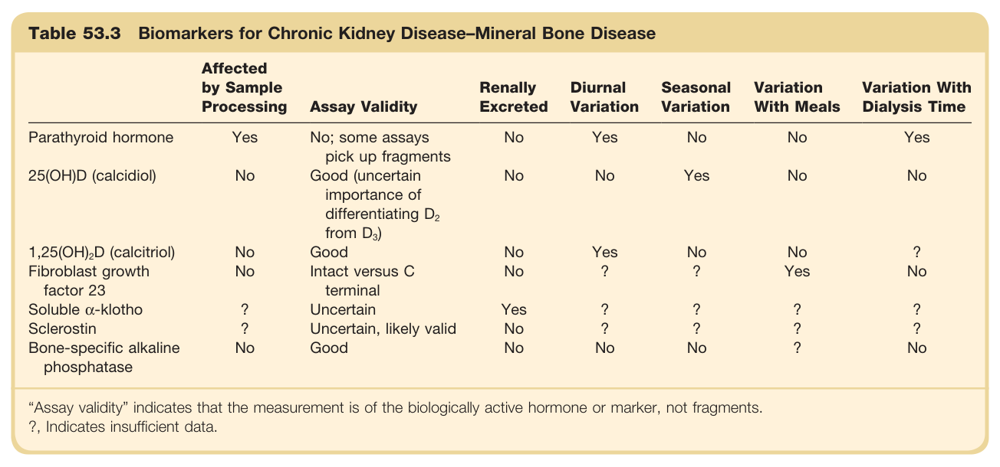

#### Table Data (CSV: [Table_53_3.csv](Table_53_3.csv))

```markdown
| Table Text (OCR) |
| :--- |
| Table 53.3 Biomarkers for Chronic Kidney Disease–Mineral Bone Disease Affected by Sample Processing  Assay Validity  Renally Excreted  Diurnal Variation  Seasonal Variation  Variation With Meals  Variation With Dialysis Time    Parathyroid hormone  Yes  No; some assays pick up fragments  No  Yes  No  No  Yes    25(OH)D (calcidiol)  No  Good (uncertain importance of differentiating  D_2  from  D_3 )  No  No  Yes  No  No    1,25(OH) _2 D (calcitriol)  No  Good  No  Yes  No  No  ?    Fibroblast growth factor 23  No  Intact versus C terminal  No  ?  ?  Yes  No    Soluble α-klotho  ?  Uncertain  Yes  ?  ?  ?  ?    Sclerostin  ?  Uncertain, likely valid  No  ?  ?  ?  ?    Bone-specific alkaline phosphatase  No  Good  No  No  No  ?  No “Assay validity” indicates that the measurement is of the biologically active hormone or marker, not fragments. ?, Indicates insufficient data. |
```

Table 53.3 Biomarkers for Chronic Kidney Disease-Mineral Bone Disease | | Affected by Sample Processing | Assay Validity | Renally Excreted | Diurnal Variation | Seasonal Variation | Variation With Meals | Variation With Dialysis Time | | :--- | :--- | :--- | :--- | :--- | :--- | :--- | :--- | | Parathyroid hormone | Yes | No; some assays pick up fragments | No | Yes | No | No | Yes | | 25(OH)D (calcidiol) | No | Good (uncertain importance of differentiating D2 from D3) | No | No | Yes | No | No | | 1,25(OH)2D (calcitriol) | No | Good | No | Yes | No | No | ? | | Fibroblast growth factor 23 | No | Intact versus C terminal | No | ? | ? | Yes | No | | Soluble a-klotho | ? | Uncertain | Yes | ? | ? | ? | ? | | Sclerostin | ? | Uncertain, likely valid | No | ? | ? | ? | ? | | Bone-specific alkaline phosphatase | No | Good | No | No | No | ? | No | "Assay validity" indicates that the measurement is of the biologically active hormone or marker, not fragments. ?, Indicates insufficient data.

---

### Table_53_4

#### Table Image

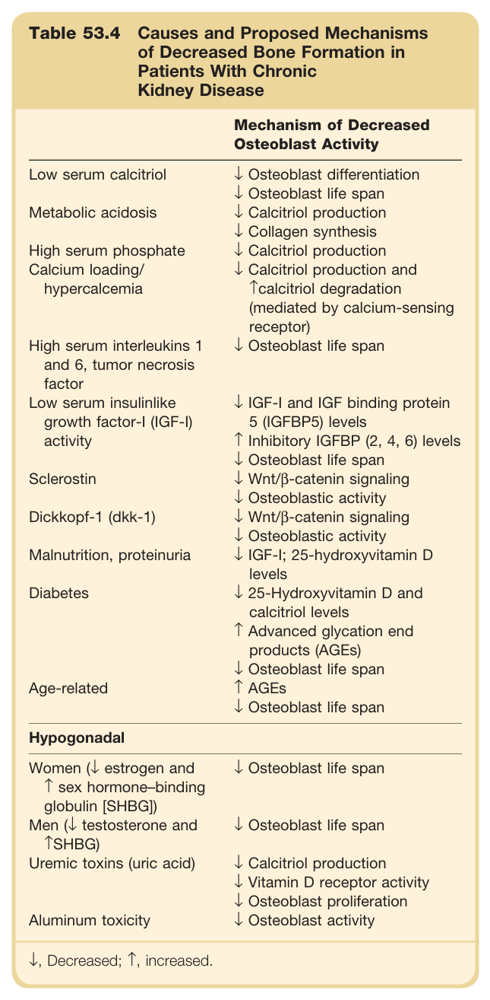

#### Table Data (CSV: [Table_53_4.csv](Table_53_4.csv))

```markdown
| Table Text (OCR) |
| :--- |
| Table 53.4 Causes and Proposed Mechanisms of Decreased Bone Formation in Patients With Chronic Kidney Disease Mechanism of Decreased Osteoblast Activity    Low serum calcitriol  ↓ Osteoblast differentiation↓ Osteoblast life span    Metabolic acidosis  ↓ Calcitriol production↓ Collagen synthesis    High serum phosphate  ↓ Calcitriol production    Calcium loading/hypercalcemia  ↓ Calcitriol production and ↑calcitriol degradation (mediated by calcium-sensing receptor)    High serum interleukins 1 and 6, tumor necrosis factor  ↓ Osteoblast life span    Low serum insulinlike growth factor-I (IGF-I) activity  ↓ IGF-I and IGF binding protein 5 (IGFBP5) levels↑ Inhibitory IGFBP (2, 4, 6) levels↓ Osteoblast life span    Sclerostin  ↓ Wnt/β-catenin signaling↓ Osteoblastic activity    Dickkopf-1 (dkk-1)  ↓ Wnt/β-catenin signaling↓ Osteoblastic activity    Malnutrition, proteinuria  ↓ IGF-I; 25-hydroxyvitamin D levels    Diabetes  ↓ 25-Hydroxyvitamin D and calcitriol levels↑ Advanced glycation end products (AGEs)↓ Osteoblast life span    Age-related  ↑ AGEs↓ Osteoblast life span    Hypogonadal    Women (↓ estrogen and ↑ sex hormone-binding globulin [SHBG])  ↓ Osteoblast life span    Men (↓ testosterone and ↑SHBG)  ↓ Osteoblast life span    Uremic toxins (uric acid)  ↓ Calcitriol production↓ Vitamin D receptor activity↓ Osteoblast proliferation    Aluminum toxicity  ↓ Osteoblast activity    ↓, Decreased; ↑, increased. |
```

Table 53.4 Causes and Proposed Mechanisms of Decreased Bone Formation in Patients With Chronic Kidney Disease | | Mechanism of Decreased Osteoblast Activity | | :--- | :--- | | Low serum calcitriol | ↓ Osteoblast differentiation, ↓ Osteoblast life span | | Metabolic acidosis | ↓ Calcitriol production, ↓ Collagen synthesis | | High serum phosphate | ↓ Calcitriol production | | Calcium loading/ hypercalcemia | ↓ Calcitriol production and ↑ calcitriol degradation (mediated by calcium-sensing receptor), ↓ Osteoblast life span | | High serum interleukins 1 and 6, tumor necrosis factor | ↓ IGF-I and IGF binding protein 5 (IGFBP5) levels, ↑ Inhibitory IGFBP (2, 4, 6) levels, ↓ Osteoblast life span | | Low serum insulinlike growth factor-I (IGF-I) activity | | | Sclerostin | ↓ Wnt/ẞ-catenin signaling, ↓ Osteoblastic activity | | Dickkopf-1 (dkk-1) | ↓ Wnt/ẞ-catenin signaling, ↓ Osteoblastic activity | | Malnutrition, proteinuria | ↓ IGF-I; 25-hydroxyvitamin D levels | | Diabetes | ↓ 25-Hydroxyvitamin D and calcitriol levels, ↑ Advanced glycation end products (AGES), ↓ Osteoblast life span | | Age-related | ↑ AGES, ↓ Osteoblast life span | | Hypogonadal | | | Women | (↓ estrogen and ↑ sex hormone-binding globulin [SHBG]) ↓ Osteoblast life span | | Men | (↓ testosterone and ↑SHBG) ↓ Osteoblast life span | | Uremic toxins (uric acid) | ↓ Calcitriol production, ↓ Vitamin D receptor activity | | Aluminum toxicity | ↓ Osteoblast proliferation, ↓ Osteoblast activity | ↓, Decreased; ↑, increased.

---

### Table_53_5

#### Table Image

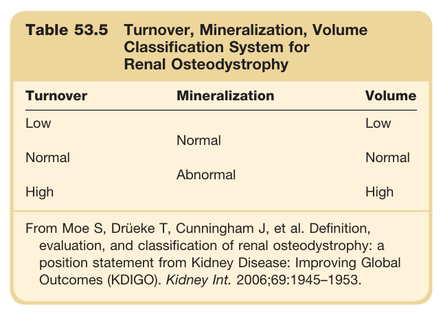

#### Table Data (CSV: [Table_53_5.csv](Table_53_5.csv))

```markdown
| Table Text (OCR) |
| :--- |
| Table 53.5 Turnover, Mineralization, Volume Classification System for Renal Osteodystrophy Turnover  Mineralization  Volume    Low  Normal  Low    Normal  Abnormal  Normal    High  High From Moe S, Drüeke T, Cunningham J, et al. Definition, evaluation, and classification of renal osteodystrophy: a position statement from Kidney Disease: Improving Global Outcomes (KDIGO). Kidney Int. 2006;69:1945–1953. |
```

Table 53.5 Turnover, Mineralization, Volume Classification System for Renal Osteodystrophy | Turnover | Mineralization | Volume | | :--- | :--- | :--- | | Low | Normal | Low | | Normal | Abnormal | Normal | | High | | High | From Moe S, Drüeke T, Cunningham J, et al. Definition, evaluation, and classification of renal osteodystrophy: a position statement from Kidney Disease: Improving Global Outcomes (KDIGO). Kidney Int. 2006;69:1945-1953.

---
